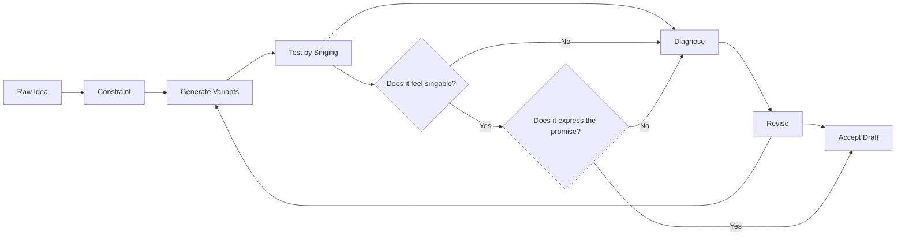
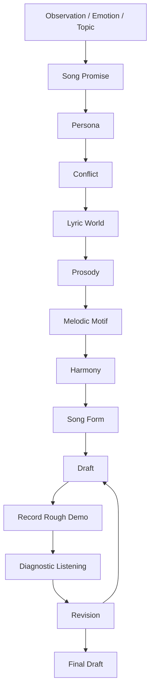
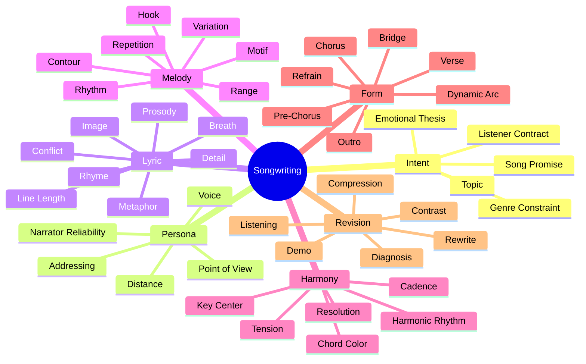
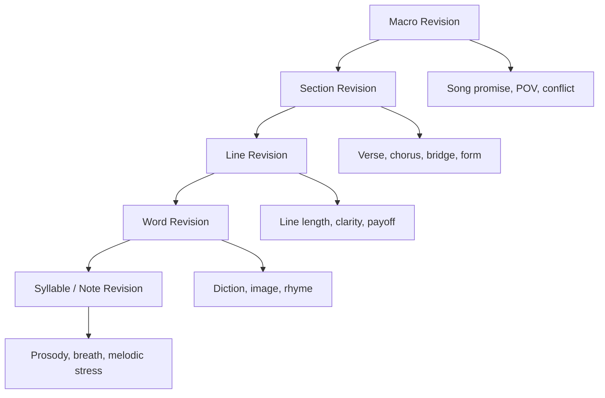
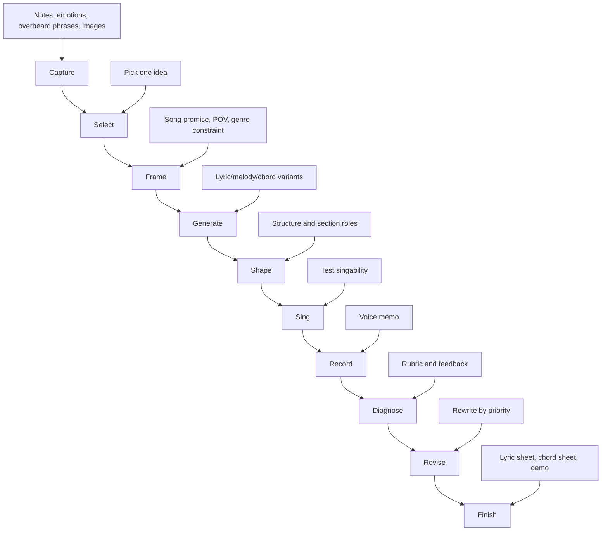
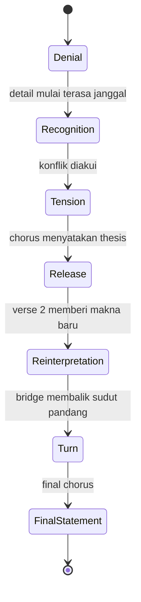

# learn-songwriting-part-000.md

# Seri Belajar Menulis Lagu Berdasarkan *The First 20 Hours*

## Part 000 — Daftar Isi, Scope, Roadmap 20 Jam, dan Kontrak Belajar

> **Nama seri:** `learn-songwriting`  
> **Format file:** `learn-songwriting-part-<nnn>.md`  
> **Part saat ini:** `000`  
> **Target seri:** mampu menulis lagu utuh secara sadar, sistematis, dan dapat direvisi  
> **Konteks pelajar:** software engineer dengan pola pikir deterministik  
> **Batas penting:** seri ini tidak mengulang materi `learn-guitar-performance` dan `learn-piano-vocal-performance`; fokusnya adalah songwriting, bukan teknik performance instrumen/vokal.

---

## 0. Tujuan Part Ini

Part 000 adalah fondasi. Tujuannya bukan langsung menulis lagu penuh, melainkan membangun **peta belajar** agar 20 jam pertama tidak habis untuk bingung, riset berlebihan, atau meniru template tanpa mengerti.

Setelah menyelesaikan part ini, kamu harus punya:

1. Definisi operasional tentang apa arti “bisa menulis lagu”.
2. Batasan materi yang akan dan tidak akan dibahas.
3. Roadmap 20 jam berdasarkan framework Josh Kaufman.
4. Skill tree songwriting yang bisa dipraktikkan bertahap.
5. Daftar isi lengkap seri `learn-songwriting`.
6. Cara memakai seri ini agar efisien dan tidak mengulang materi performance.
7. Rubrik awal untuk menilai kualitas lagu.
8. Template kerja yang akan dipakai dari part 001 sampai part 034.

---

## 1. Core Premise

Kita akan belajar **menulis lagu**, bukan sekadar:

- mencari chord progression,
- membuat lirik puitis,
- meniru struktur verse–chorus,
- membuat prompt AI music,
- atau memainkan lagu dengan gitar/piano.

Songwriting adalah kemampuan untuk mengubah **pengalaman, emosi, observasi, konflik, ide, atau pesan** menjadi bentuk musikal yang bisa dinyanyikan dan diingat.

Sebuah lagu minimal memiliki beberapa lapisan:

1. **Intent** — lagu ini mau mengatakan apa?
2. **Emotional promise** — lagu ini menjanjikan rasa apa kepada pendengar?
3. **Persona** — siapa yang sedang berbicara?
4. **Lyric world** — dunia konkret apa yang muncul dalam lagu?
5. **Prosody** — apakah kata-katanya enak dinyanyikan?
6. **Melody** — apakah frasa melodinya bisa diingat dan terasa cocok dengan kata?
7. **Harmony** — apakah chord mendukung arah emosi?
8. **Form** — apakah struktur lagu membuat pendengar tetap mengikuti perjalanan emosinya?
9. **Contrast** — apakah ada perubahan cukup agar tidak datar?
10. **Revision** — apakah draft pertama diperbaiki secara sadar?

Dalam mindset engineering, songwriting bisa dipahami sebagai:

> **creative search under constraints**.

Bukan magic. Bukan sepenuhnya random. Bukan juga sepenuhnya deterministic. Songwriting berada di tengah: ada constraint, heuristic, evaluasi, feedback, dan iterasi; tetapi tidak ada satu jawaban final yang secara objektif selalu benar.

---

## 2. Dasar Framework Josh Kaufman

Josh Kaufman dalam *The First 20 Hours* membahas bagaimana seseorang bisa melewati fase awal belajar skill baru dengan cepat melalui pendekatan **rapid skill acquisition**. Intinya bukan menjadi master dalam 20 jam, tetapi mencapai level “cukup bisa melakukan skill tersebut dengan hasil nyata” dalam waktu singkat.

Dalam berbagai rangkuman dan pembahasan publik tentang buku ini, beberapa prinsip yang sering muncul adalah:

1. Pilih satu skill spesifik, bukan domain terlalu luas.
2. Tentukan target performa yang jelas.
3. Pecah skill menjadi sub-skill kecil.
4. Pelajari secukupnya untuk mulai praktik, bukan belajar teori tanpa aksi.
5. Hilangkan friction yang menghambat praktik.
6. Siapkan alat dan lingkungan sebelum mulai.
7. Praktik sub-skill paling penting terlebih dahulu.
8. Dapatkan feedback cepat.
9. Gunakan timer dan durasi latihan pendek yang konsisten.
10. Komit minimal 20 jam sebelum menilai diri “berbakat atau tidak”.

Untuk songwriting, prinsip tersebut akan kita adaptasi seperti ini:

| Prinsip Kaufman | Adaptasi ke Songwriting |
|---|---|
| Pilih skill spesifik | Fokus pada “menulis lagu utuh”, bukan produksi musik, mixing, performance, atau teori musik luas |
| Target performa | Mampu membuat 1 lagu lengkap dengan lirik, melodi utama, chord dasar, dan struktur jelas |
| Deconstruct skill | Pecah menjadi ide, lirik, prosodi, melodi, harmoni, form, hook, revisi |
| Learn enough | Belajar teori secukupnya agar bisa praktik, bukan menunda dengan membaca teori musik terlalu lama |
| Remove barriers | Siapkan template, recorder, lyric journal, referensi lagu, dan jadwal latihan |
| Practice deliberately | Latihan menulis hook, verse, chorus, melodi, dan revisi secara terpisah |
| Feedback loop | Dengarkan ulang, rekam, skor, revisi, minta feedback terbatas |
| Commit 20 hours | Jangan berhenti di jam 2–4 ketika hasil masih buruk; itu fase normal |

Kaufman menekankan bahwa skill kompleks perlu dipecah menjadi bagian kecil yang dapat dilatih. WIRED, dalam pembahasan tentang bukunya, merangkum pendekatan ini sebagai: tentukan target, pecah skill, riset secukupnya, mulai praktik, kurangi friction, dan komit sekitar 20 jam praktik. Referensi ini relevan karena songwriting memang bukan satu skill tunggal, melainkan gabungan banyak sub-skill.

---

## 3. Kenapa Songwriting Perlu Didekati Berbeda oleh Software Engineer

Sebagai software engineer, kamu terbiasa dengan hal seperti:

- requirement,
- deterministic execution,
- invariant,
- edge case,
- modular decomposition,
- state transition,
- data flow,
- debugging,
- testability,
- correctness,
- maintainability.

Songwriting tidak bekerja persis seperti software. Lagu tidak punya compiler. Tidak ada unit test yang memastikan “chorus ini pasti menyentuh”. Tidak ada static analyzer yang berkata “metafora ini redundant”. Tidak ada benchmark universal untuk “melodi ini bagus”.

Tetapi songwriting tetap punya struktur yang bisa dianalisis.

Perbedaannya:

| Software Engineering | Songwriting |
|---|---|
| Correct / incorrect | Effective / ineffective |
| Requirement jelas | Intent kadang kabur dan harus ditemukan |
| Bug bisa direproduksi | Masalah rasa sering muncul lewat pendengaran ulang |
| Unit test | Listener response dan self-diagnosis |
| Deterministic output | Probabilistic emotional impact |
| Refactor code | Rewrite lyric/melody/form |
| Architecture diagram | Song map/emotional arc |
| Runtime behavior | Listening experience |
| Performance bottleneck | Emotional bottleneck |

Cara berpikir engineering tetap berguna, asalkan tidak dipakai untuk memaksa lagu menjadi benda yang sepenuhnya deterministic.

Mental model yang lebih tepat:



Songwriting bukan “mencari jawaban benar”. Songwriting adalah **mencari versi yang bekerja**.

---

## 4. Definisi Operasional: Apa Artinya “Bisa Menulis Lagu”?

Agar belajar tidak kabur, kita perlu definisi target.

Untuk seri ini, kamu dianggap “bisa menulis lagu level awal” jika dapat membuat lagu yang memenuhi kriteria berikut:

1. **Ada ide utama yang jelas**  
   Pendengar bisa menangkap lagu ini tentang apa, walaupun tidak semua makna harus dijelaskan literal.

2. **Ada persona yang konsisten**  
   Lagu tahu siapa yang bicara: aku, kamu, dia, kami, narator sinis, narator terluka, narator menyesal, atau narator observasional.

3. **Ada struktur lengkap**  
   Minimal: verse, chorus, dan satu bentuk variasi seperti verse kedua, bridge, pre-chorus, atau outro.

4. **Lirik bisa dinyanyikan**  
   Suku kata tidak terlalu memaksa, baris tidak terlalu panjang, tekanan kata tidak bertabrakan dengan tekanan melodi.

5. **Ada hook**  
   Hook bisa berupa frasa lirik, motif melodi, ritme, judul, metafora, atau emotional punch.

6. **Melodi utama bisa diingat**  
   Tidak harus kompleks. Justru lagu awal yang baik sering memakai motif sederhana yang jelas.

7. **Chord/harmoni mendukung emosi**  
   Tidak harus rumit, tetapi harus punya arah: stabil, sedih, gelap, terang, menggantung, tegang, atau pulang.

8. **Ada pergerakan emosional**  
   Lagu tidak hanya mengulang perasaan yang sama dari awal sampai akhir tanpa eskalasi.

9. **Sudah melewati revisi minimal satu kali**  
   Draft pertama hampir selalu belum selesai. Songwriting adalah rewrite.

10. **Bisa direkam sebagai demo kasar**  
   Cukup voice memo: vokal + chord dasar atau humming melody. Tujuannya validasi lagu, bukan produksi final.

Target ini realistis untuk 20 jam pertama.

Yang **bukan** target 20 jam:

- menjadi songwriter profesional,
- menulis hit song,
- menguasai semua genre,
- membuat aransemen penuh,
- mixing/mastering,
- produksi studio,
- membaca notasi kompleks,
- improvisasi advanced,
- menulis lagu orchestral rumit.

---

## 5. Songwriting sebagai Sistem

Kita akan memakai model sistem berikut:



Penjelasan singkat:

| Komponen | Pertanyaan Inti |
|---|---|
| Observation / Emotion / Topic | Apa bahan mentahnya? |
| Song Promise | Lagu ini menjanjikan pengalaman apa? |
| Persona | Siapa yang bicara dan dari posisi apa? |
| Conflict | Apa tegangan utama lagu? |
| Lyric World | Benda, tempat, gestur, dan citra apa yang membuat lagu konkret? |
| Prosody | Apakah kata-kata cocok untuk dinyanyikan? |
| Melodic Motif | Bentuk melodi apa yang mudah diingat? |
| Harmony | Chord apa yang mendukung arah emosi? |
| Song Form | Bagaimana informasi dan emosi diatur? |
| Draft | Versi lagu yang bisa dinyanyikan dari awal sampai akhir |
| Demo | Bukti nyata bahwa lagu bekerja sebagai suara, bukan hanya teks |
| Diagnosis | Bagian mana yang lemah? |
| Revision | Keputusan perbaikan berdasarkan masalah nyata |

---

## 6. Skill Tree Songwriting

Songwriting akan kita pecah menjadi beberapa sub-skill besar.



Skill tree ini penting karena pemula sering salah mendiagnosis masalah.

Contoh:

- Merasa “chord-nya kurang bagus”, padahal masalahnya lirik tidak punya konflik.
- Merasa “liriknya kurang puitis”, padahal masalahnya prosodi buruk.
- Merasa “melodinya jelek”, padahal ritme suku kata tidak natural.
- Merasa “lagunya monoton”, padahal form tidak punya kontras.
- Merasa “kurang emosi”, padahal persona tidak jelas.

Dengan skill tree, kita tidak memperbaiki lagu secara random. Kita diagnosis lapisan yang bermasalah.

---

## 7. Batasan Agar Tidak Mengulang Seri Gitar dan Piano Performance

Kamu sudah menyelesaikan seri:

- `learn-guitar-performance`
- `learn-piano-vocal-performance`

Maka seri ini tidak akan mengulang topik seperti:

- cara memegang gitar,
- teknik strumming,
- voicing piano dasar,
- fingering,
- latihan scale instrumen,
- teknik vokal performance detail,
- cara mengiringi penyanyi,
- dynamic performance panggung,
- latihan transisi chord sebagai skill motorik utama.

Instrumen hanya akan dipakai sebagai **tool untuk validasi lagu**.

Fokusnya:

| Bukan Fokus | Fokus Seri Ini |
|---|---|
| Bermain gitar dengan baik | Memakai chord sederhana untuk menguji lagu |
| Bermain piano dengan baik | Memakai harmony sebagai emotional logic |
| Bernyanyi indah | Mengecek apakah melodi dan lirik singable |
| Mengiringi penyanyi | Menulis lagu yang bisa dinyanyikan |
| Performance | Composition / writing / revision |

Jika nanti ada pembahasan chord atau melodi, pembahasannya akan diarahkan ke pertanyaan songwriting:

- Apakah chord ini membuat chorus terasa pulang?
- Apakah verse terlalu stabil?
- Apakah bridge memberi perubahan makna?
- Apakah melodi terlalu datar untuk kata penting?
- Apakah hook cukup mudah diingat?

Bukan:

- bagaimana fingering chord ini,
- bagaimana teknik strumming,
- bagaimana memainkan voicing advanced.

---

## 8. Roadmap 20 Jam

Roadmap ini mengikuti prinsip Kaufman: praktik cepat, fokus pada sub-skill penting, jangan terlalu lama riset, dan komit minimal 20 jam.

### Overview 20 Jam

| Jam | Fase | Fokus | Output |
|---:|---|---|---|
| 0–1 | Setup | Target, constraint, alat, ruang latihan | Songwriting workspace |
| 1–2 | Deconstruction | Anatomi lagu dan skill tree | Peta komponen lagu |
| 2–3 | Reference Analysis | Analisis 3 lagu referensi | Reference map |
| 3–5 | Idea Generation | Topic, emotional thesis, song promise | 10 ide + 3 promise |
| 5–7 | Persona & Conflict | POV, narator, konflik | 3 persona + conflict map |
| 7–9 | Lyric Drafting | Verse, chorus, imagery | Draft lirik kasar |
| 9–10 | Prosody Pass | Suku kata, napas, tekanan kata | Lyric marked for singing |
| 10–12 | Melody Sketch | Motif, contour, hook | 3 kandidat melodi hook |
| 12–13 | Harmony Choice | Chord sebagai arah emosi | 2 progression sketch |
| 13–15 | Song Form | Verse/chorus/bridge/pre-chorus | Full song map |
| 15–17 | Full Draft | Gabungkan semua | Lagu v0.1 |
| 17–18 | Rough Demo | Rekam voice memo | Demo kasar |
| 18–19 | Diagnostic Listening | Temukan masalah utama | Diagnosis report |
| 19–20 | Revision | Perbaikan prioritas | Lagu v0.2 + next iteration plan |

### Kenapa Roadmap Ini Tidak Dimulai dari Teori Musik?

Karena dalam kerangka Kaufman, belajar terlalu banyak sebelum praktik bisa menjadi procrastination. Songwriting membutuhkan teori, tetapi teori harus masuk saat ada masalah nyata.

Misalnya:

- Belajar rima menjadi relevan setelah lirik terasa kaku.
- Belajar contour melodi menjadi relevan setelah hook tidak bisa diingat.
- Belajar cadence menjadi relevan setelah chorus tidak terasa selesai.
- Belajar form menjadi relevan setelah lagu terasa datar.

Teori dipakai sebagai alat diagnosis dan desain, bukan sebagai tumpukan informasi pasif.

---

## 9. Prinsip Latihan 20 Jam untuk Songwriting

### 9.1. Jangan Menunggu Inspirasi

Inspirasi sering datang setelah ada material, bukan sebelum material.

Untuk software engineer, analoginya:

- Kamu tidak bisa refactor sistem yang belum ada.
- Kamu tidak bisa debug program yang belum dijalankan.
- Kamu tidak bisa optimize query yang belum ditulis.
- Kamu tidak bisa revise lagu yang belum punya draft.

Maka tujuan awal adalah membuat **draft jelek yang bisa diperbaiki**.

Draft buruk lebih bernilai daripada ide sempurna yang tidak pernah ditulis.

### 9.2. Praktik Harus Menghasilkan Artefak

Setiap sesi latihan harus menghasilkan artefak kecil:

- 10 judul lagu,
- 5 metafora,
- 1 verse kasar,
- 3 variasi chorus,
- 1 melodi hook,
- 1 voice memo,
- 1 revision log.

Tanpa artefak, kamu tidak punya bahan untuk dievaluasi.

### 9.3. Latihan Harus Terbatas

Constraint membantu kreativitas.

Contoh constraint:

- Tulis chorus maksimal 4 baris.
- Setiap baris maksimal 8–10 suku kata.
- Pakai 1 objek konkret sebagai metafora utama.
- Jangan pakai kata “cinta”, “rindu”, atau “sakit” secara literal.
- Melodi chorus harus bisa dinyanyikan dalam range nyaman.
- Verse harus menunjukkan adegan, bukan menjelaskan perasaan.

Constraint mengurangi search space.

### 9.4. Latihan Harus Bisa Didengar

Lirik yang bagus di halaman belum tentu bagus dinyanyikan.

Songwriting harus diuji lewat suara.

Minimal:

- baca keras,
- humming,
- tap beat,
- nyanyikan dengan nada kasar,
- rekam voice memo,
- dengarkan ulang.

Kalau tidak pernah dinyanyikan, itu belum sepenuhnya lagu. Itu baru teks kandidat.

### 9.5. Revisi Harus Bertingkat

Jangan langsung memperbaiki semua hal.

Urutan revisi:



Jika masalahnya di song promise, mengganti satu kata tidak akan menyelamatkan lagu. Jika masalahnya hanya prosodi, mengganti seluruh konsep malah membuang pekerjaan yang sudah benar.

---

## 10. Songwriting Pipeline

Ini pipeline kerja yang akan kita gunakan sepanjang seri.



### Pipeline Stage 1 — Capture

Kumpulkan bahan mentah:

- frasa yang terdengar menarik,
- perasaan yang sulit dijelaskan,
- konflik pribadi,
- kritik sosial,
- gambar visual,
- benda konkret,
- percakapan,
- ironi,
- gesture manusia,
- tempat,
- aroma,
- suara,
- ingatan kecil.

Songwriter yang baik sering bukan orang yang “selalu punya inspirasi”, tetapi orang yang **selalu menangkap bahan mentah**.

### Pipeline Stage 2 — Select

Dari banyak bahan, pilih satu yang paling punya tegangan.

Pertanyaan seleksi:

- Ada konfliknya?
- Ada rasa yang spesifik?
- Bisa diwujudkan lewat gambar konkret?
- Bisa dibuat menjadi chorus?
- Ada kalimat inti yang bisa diulang?
- Apakah idenya terlalu umum?

Contoh ide terlalu umum:

> Aku sedih karena ditinggalkan.

Contoh ide lebih tajam:

> Seseorang masih menyiapkan dua gelas kopi setiap pagi, walau yang satu sudah tidak pernah diminum.

Ide kedua lebih kuat karena punya objek, rutinitas, kehilangan, dan gambar.

### Pipeline Stage 3 — Frame

Framing menentukan lagu akan bergerak dari sudut mana.

Satu topic bisa menjadi banyak lagu berbeda.

Topic: seseorang pergi.

| Frame | Kemungkinan Lagu |
|---|---|
| Aku ditinggal | Ballad patah hati |
| Aku yang meninggalkan | Confession penuh rasa bersalah |
| Barang-barang menyaksikan | Lagu metaforis dan sinematik |
| Kota menjadi saksi | Folk urban |
| Narator sinis | Satire gelap |
| Dialog dua orang | Duet dramatis |
| Orang ketiga mengamati | Story song |

Framing adalah keputusan arsitektural.

### Pipeline Stage 4 — Generate

Generate banyak kandidat, jangan langsung polish.

Artefak generate:

- 10 judul,
- 10 opening line,
- 10 chorus thesis,
- 5 metafora,
- 5 angle persona,
- 3 melodic motif,
- 3 chord mood.

Tujuan generate adalah memperluas pilihan.

### Pipeline Stage 5 — Shape

Pilih kandidat terbaik dan bentuk menjadi struktur.

Pertanyaan shape:

- Verse 1 memberi setup apa?
- Chorus menyatakan apa?
- Verse 2 menambahkan bukti apa?
- Pre-chorus menaikkan tensi bagaimana?
- Bridge membalik perspektif apa?
- Outro meninggalkan rasa apa?

### Pipeline Stage 6 — Sing

Tes dengan suara.

Pertanyaan singability:

- Baris mana yang terlalu panjang?
- Kata mana yang sulit dinyanyikan?
- Apakah tekanan kata jatuh di beat aneh?
- Apakah chorus enak diulang?
- Apakah melodi terlalu mirip bicara datar?
- Apakah frasa punya tempat bernapas?

### Pipeline Stage 7 — Record

Rekam demo kasar.

Aturan:

- Jangan produksi dulu.
- Jangan mixing dulu.
- Jangan menilai suara vokal dulu.
- Fokus pada lagu: lirik, melodi, chord, form.

Voice memo buruk tapi jujur lebih berguna daripada produksi rapi yang menutupi masalah lagu.

### Pipeline Stage 8 — Diagnose

Diagnosis bukan bertanya “bagus atau jelek?”

Diagnosis bertanya:

- Apa yang sudah bekerja?
- Apa yang membosankan?
- Apa yang tidak jelas?
- Apa yang terasa forced?
- Apa yang terlalu literal?
- Apa yang terlalu abstrak?
- Apa yang sulit dinyanyikan?
- Apa yang tidak punya payoff?

### Pipeline Stage 9 — Revise

Revisi berdasarkan diagnosis prioritas.

Jika chorus lemah, jangan habiskan waktu mempercantik verse.
Jika POV kacau, jangan hanya mengganti rima.
Jika melodi tidak memorable, jangan menambah chord rumit.
Jika lirik terlalu panjang, jangan menyalahkan tempo dulu.

### Pipeline Stage 10 — Finish

Finish bukan berarti sempurna.

Finish berarti:

- lagu bisa dinyanyikan dari awal sampai akhir,
- lirik sudah coherent,
- hook jelas,
- form selesai,
- revisi utama sudah dilakukan,
- demo kasar tersedia,
- keputusan kreatif sudah bisa dipertanggungjawabkan.

---

## 11. Peta Materi Seri

Total seri direncanakan **35 part**, dari `000` sampai `034`.

Seri selesai pada:

```text
learn-songwriting-part-034.md
```

### Daftar Isi Lengkap

| Part | Filename | Judul | Fokus Utama | Output Praktik |
|---:|---|---|---|---|
| 000 | `learn-songwriting-part-000.md` | Daftar Isi, Scope, dan Roadmap 20 Jam | Peta besar seri, prinsip Kaufman, cara belajar songwriting tanpa mengulang performance | Roadmap belajar pribadi |
| 001 | `learn-songwriting-part-001.md` | Songwriting untuk Software Engineer | Creativity as constrained search, bukan magic; cara menerjemahkan rasa menjadi sistem keputusan | Mental model deterministic-compatible |
| 002 | `learn-songwriting-part-002.md` | Target Performance Level | Mendefinisikan “bisa menulis lagu” secara operasional | Definition of done lagu pertama |
| 003 | `learn-songwriting-part-003.md` | Deconstructing Songwriting Skill | Memecah songwriting menjadi sub-skill yang bisa dilatih | Skill tree detail |
| 004 | `learn-songwriting-part-004.md` | Removing Practice Barriers | Setup workspace, template, recorder, reference bank, friction removal | Songwriting workspace |
| 005 | `learn-songwriting-part-005.md` | Fast Feedback Loop | Mendengar ulang, memberi skor, meminta feedback, menghindari ego trap | Feedback checklist |
| 006 | `learn-songwriting-part-006.md` | Anatomy of a Song | Song promise, verse, chorus, pre-chorus, bridge, hook, refrain, outro | Diagram anatomi lagu |
| 007 | `learn-songwriting-part-007.md` | Song Promise | Menentukan janji emosional lagu agar lagu tidak sekadar kumpulan kalimat indah | 10 song promise |
| 008 | `learn-songwriting-part-008.md` | Persona, POV, dan Addressing | Aku/kamu/dia/kami, narator reliable/unreliable, dialog, monolog, confession | 5 versi POV untuk 1 ide |
| 009 | `learn-songwriting-part-009.md` | Emotional State Machine | Emosi sebagai transisi, bukan label statis | State machine lagu |
| 010 | `learn-songwriting-part-010.md` | Conflict Engine | Konflik internal, interpersonal, sosial, moral, spiritual, romantik, satir | Conflict map |
| 011 | `learn-songwriting-part-011.md` | Object Writing dan Sensory Detail | Benda, tempat, suara, bau, gesture, cahaya, tekstur | 3 object-writing exercise |
| 012 | `learn-songwriting-part-012.md` | Metaphor System | Metafora sebagai sistem pemetaan makna, bukan hiasan | Metaphor matrix |
| 013 | `learn-songwriting-part-013.md` | Lyric Architecture | Baris, bait, section function, setup/payoff | Verse + chorus skeleton |
| 014 | `learn-songwriting-part-014.md` | Natural Indonesian Lyric Flow | Suku kata, tekanan kata bahasa Indonesia, frasa napas, diksi natural | Lyric prosody pass |
| 015 | `learn-songwriting-part-015.md` | Rhyme Without Forcing | Rima akhir, rima dalam, asonansi, konsonansi, imperfect rhyme | Rhyme palette |
| 016 | `learn-songwriting-part-016.md` | Line Length, Breath, and Singability | Menghindari lirik terlalu panjang, robotic, padat, atau tidak bisa dinyanyikan | Breath-marked lyric sheet |
| 017 | `learn-songwriting-part-017.md` | Repetition, Variation, and Memory | Hook, pengulangan, perubahan kecil, pattern recognition | Hook repetition map |
| 018 | `learn-songwriting-part-018.md` | Melody as Shape | Melodi sebagai contour: naik, turun, loncat, diam, peak | 10 melodic contour sketch |
| 019 | `learn-songwriting-part-019.md` | Melodic Rhythm | Relasi ritme kata dan ritme melodi; syncopation, panjang-pendek, rest | 5 rhythm setting |
| 020 | `learn-songwriting-part-020.md` | Lyric-to-Melody Alignment | Menempatkan suku kata penting pada nada/beat penting | Alignment table |
| 021 | `learn-songwriting-part-021.md` | Hook Writing | Hook lirik, hook melodi, hook ritme, hook konsep, hook produksi | 10 kandidat hook |
| 022 | `learn-songwriting-part-022.md` | Harmony as Emotional Logic | Chord sebagai mesin ekspektasi, tension, dan resolution | 5 harmonic moods |
| 023 | `learn-songwriting-part-023.md` | Chord Progression for Songwriters | Progression umum, fungsi emosional, borrowing, pedal, cadence | 3 progression draft |
| 024 | `learn-songwriting-part-024.md` | Form and Dramatic Architecture | Struktur sebagai arsitektur informasi dan emosi | Full song map |
| 025 | `learn-songwriting-part-025.md` | Contrast Between Sections | Kontras register, ritme, density, lirik, harmoni, energy | Section contrast checklist |
| 026 | `learn-songwriting-part-026.md` | Writing Verse | Verse sebagai evidence, scene, movement, escalation | 2 verse draft |
| 027 | `learn-songwriting-part-027.md` | Writing Chorus | Chorus sebagai thesis, release, judgement, confession, mantra | 3 chorus draft |
| 028 | `learn-songwriting-part-028.md` | Writing Pre-Chorus and Bridge | Build-up, turn, reversal, reveal, moral pivot | Pre-chorus + bridge draft |
| 029 | `learn-songwriting-part-029.md` | Genre as Constraint System | Genre sebagai constraint: tempo, diction, groove, form, emotional contract | Genre constraint sheet |
| 030 | `learn-songwriting-part-030.md` | Drafting Full Song v0.1 | Menggabungkan ide, lirik, melodi, harmoni, dan form | Full song draft |
| 031 | `learn-songwriting-part-031.md` | Diagnostic Listening | Menemukan masalah: boring, forced, weak hook, unclear POV, bad prosody | Diagnosis report |
| 032 | `learn-songwriting-part-032.md` | Revision System | Pipeline revisi: macro → section → line → word → syllable/note | Revision log |
| 033 | `learn-songwriting-part-033.md` | Finishing Criteria | Kapan lagu dianggap selesai; menghindari endless tweaking | Final lyric sheet + chord sheet |
| 034 | `learn-songwriting-part-034.md` | 20-Hour Capstone | Menulis satu lagu utuh dari nol dengan seluruh framework | Lagu final + postmortem |

---

## 12. Struktur Tetap Setiap Part

Agar efisien, setiap part berikutnya akan memakai struktur yang konsisten:

```markdown
# learn-songwriting-part-xxx.md

## Tujuan Part
## Kenapa Ini Penting
## Mental Model
## Konsep Inti
## Deterministic Translation
## Step-by-Step Practice
## Common Failure Modes
## Diagnostic Checklist
## Latihan 20–45 Menit
## Output Wajib
## Bridge ke Part Berikutnya
```

### 12.1. Tujuan Part

Menjelaskan hasil konkret yang harus diperoleh.

Contoh:

> Setelah part ini, kamu harus punya 10 song promise dan bisa memilih 1 yang paling layak dikembangkan.

### 12.2. Kenapa Ini Penting

Menjelaskan alasan konseptual.

Contoh:

> Chorus yang buruk sering bukan karena kata-katanya kurang puitis, tetapi karena song promise tidak jelas.

### 12.3. Mental Model

Membangun model berpikir.

Contoh:

> Verse adalah evidence. Chorus adalah thesis.

### 12.4. Konsep Inti

Teori secukupnya untuk praktik.

### 12.5. Deterministic Translation

Menerjemahkan konsep kreatif menjadi indikator yang bisa diamati.

Contoh:

| Istilah Kreatif | Terjemahan Operasional |
|---|---|
| Liriknya jujur | Diksi spesifik, tidak overclaim, punya detail konkret |
| Melodinya catchy | Motif pendek, repetisi jelas, contour mudah diingat |
| Lagunya datar | Tidak ada perubahan energy, register, density, atau harmonic tension |
| Terasa dipaksakan | Suku kata terlalu padat, rima mendikte makna, emosi dijelaskan bukan ditunjukkan |

### 12.6. Step-by-Step Practice

Latihan berurutan.

### 12.7. Common Failure Modes

Kesalahan umum dan cara diagnosis.

### 12.8. Diagnostic Checklist

Checklist sebelum lanjut.

### 12.9. Latihan 20–45 Menit

Karena Kaufman menekankan praktik konsisten, setiap part akan punya latihan singkat.

### 12.10. Output Wajib

Artefak yang harus dibuat.

### 12.11. Bridge ke Part Berikutnya

Menjelaskan bagaimana output part ini menjadi input part berikutnya.

---

## 13. Artifact System

Selama seri ini, kamu akan menghasilkan beberapa artefak.

### 13.1. Songwriting Journal

File/notes untuk menangkap bahan mentah.

Isi minimal:

```text
DATE:
RAW IDEA:
IMAGE / OBJECT:
EMOTION:
CONFLICT:
POSSIBLE TITLE:
POSSIBLE HOOK:
NOTES:
```

### 13.2. Song Promise Sheet

```text
SONG TITLE:
ONE-SENTENCE PROMISE:
EMOTIONAL STATE AT START:
EMOTIONAL STATE AT END:
PERSONA:
ADDRESSING:
CONFLICT:
GENRE CONSTRAINT:
WHAT LISTENER SHOULD FEEL:
```

### 13.3. Lyric Draft Sheet

```text
TITLE:

[VERSE 1]
...

[PRE-CHORUS]
...

[CHORUS]
...

[VERSE 2]
...

[BRIDGE]
...

[FINAL CHORUS]
...
```

### 13.4. Prosody Sheet

```text
LINE:
SYLLABLE COUNT:
BREATH POINT:
STRESSED WORD:
PROBLEM WORD:
SINGABILITY SCORE 1-5:
REVISION:
```

### 13.5. Melody Sketch Sheet

```text
SECTION:
LYRIC LINE:
MELODIC CONTOUR:
RHYTHM:
PEAK NOTE LOCATION:
REPETITION:
VARIATION:
VOICE MEMO ID:
```

### 13.6. Song Map

```text
INTRO:
VERSE 1 FUNCTION:
PRE-CHORUS FUNCTION:
CHORUS FUNCTION:
VERSE 2 FUNCTION:
BRIDGE FUNCTION:
FINAL CHORUS FUNCTION:
OUTRO FUNCTION:
EMOTIONAL ARC:
```

### 13.7. Revision Log

```text
VERSION:
DATE:
PROBLEM FOUND:
LAYER:
CHANGE MADE:
WHY:
RESULT:
NEXT ISSUE:
```

---

## 14. Rubrik Awal Penilaian Lagu

Kita butuh rubrik agar feedback tidak kabur.

Skor 1–5 untuk setiap kategori:

| Kategori | 1 | 3 | 5 |
|---|---|---|---|
| Song Promise | Tidak jelas | Ada tapi belum tajam | Jelas, spesifik, terasa |
| Persona | Kabur | Cukup konsisten | Kuat dan khas |
| Conflict | Tidak ada tegangan | Ada konflik umum | Konflik spesifik dan menarik |
| Imagery | Abstrak semua | Ada beberapa detail | Dunia lagu terasa konkret |
| Prosody | Sulit dinyanyikan | Beberapa bagian kaku | Natural dan mengalir |
| Rhyme | Dipaksakan | Kadang membantu | Mendukung makna dan bunyi |
| Melody | Datar/tidak ingat | Ada motif | Hook jelas dan memorable |
| Harmony | Tidak mendukung | Cukup cocok | Memperkuat emosi |
| Form | Membingungkan | Struktur standar | Struktur mendukung perjalanan emosi |
| Contrast | Monoton | Ada variasi | Kontras terasa efektif |
| Singability | Berat dinyanyikan | Bisa dinyanyikan | Enak diulang |
| Revision | Draft mentah | Ada revisi kecil | Revisi memperkuat lagu |

Target 20 jam pertama bukan skor 5 semua.

Target realistis:

```text
Rata-rata skor 3, dengan minimal 1 elemen mencapai 4.
```

Kenapa?

Karena lagu awal yang baik biasanya punya satu kekuatan utama:

- chorus kuat,
- metafora kuat,
- melodi kuat,
- cerita kuat,
- persona kuat,
- atau hook kuat.

Tidak perlu semua sempurna.

---

## 15. Songwriting Failure Modes untuk Pemula

### 15.1. Terlalu Abstrak

Contoh buruk:

> Aku hancur dalam sepi yang tak berujung.

Masalah:

- terlalu umum,
- tidak ada benda,
- tidak ada situasi,
- tidak ada gesture,
- pendengar tidak melihat apa-apa.

Lebih konkret:

> Gelas kedua masih kupakai,  
> padahal kopimu tak lagi pulang.

Kenapa lebih kuat?

- ada objek: gelas, kopi,
- ada kebiasaan,
- ada kehilangan,
- ada implied absence.

### 15.2. Rima Mendikte Makna

Pemula sering memilih kata karena rima, bukan karena makna.

Contoh:

> Hatiku pilu  
> Karena kau pergi selalu  
> Di malam yang biru  
> Aku menunggu dirimu

Masalah:

- semua kata mengejar bunyi `u`,
- makna generik,
- tidak ada progression,
- tidak ada image baru.

Rima seharusnya memperkuat makna, bukan mengambil alih kemudi.

### 15.3. Verse dan Chorus Mengatakan Hal yang Sama

Jika verse berkata “aku sedih” dan chorus juga berkata “aku sedih”, lagu tidak bergerak.

Lebih baik:

| Section | Fungsi |
|---|---|
| Verse | Menunjukkan bukti: meja, pintu, pesan tak dibalas |
| Pre-chorus | Menaikkan tensi: aku mulai sadar |
| Chorus | Mengucapkan thesis: kau tidak pergi dari rumah, kau pergi dari aku |

### 15.4. Melodi Mengabaikan Bahasa

Dalam bahasa Indonesia, tekanan kata tidak sekuat English stress accent, tetapi tetap ada rasa natural dalam frasa.

Contoh kata yang sering terasa aneh jika dipenggal salah:

- me-ning-gal-kan,
- ke-hi-lang-an,
- se-te-ngah,
- ber-pu-lang,
- me-nung-gu.

Melodi harus menghormati aliran bicara.

### 15.5. Terlalu Cepat Polish

Pemula sering mempercantik satu baris selama 30 menit padahal struktur lagu belum jelas.

Urutan lebih baik:

1. Ide jelas dulu.
2. POV jelas dulu.
3. Chorus thesis jelas dulu.
4. Form jelas dulu.
5. Baru polish baris.

### 15.6. Mengira Chord Rumit Membuat Lagu Bagus

Chord rumit bisa indah, tetapi tidak menyelamatkan lagu yang tidak punya emotional promise.

Chord sederhana dengan lirik dan melodi kuat sering lebih efektif daripada chord kompleks yang tidak mendukung cerita.

### 15.7. Tidak Merekam Diri

Banyak masalah lagu baru terdengar saat direkam:

- chorus tidak naik,
- line terlalu panjang,
- napas habis,
- melodi mirip verse,
- hook tidak menempel,
- bridge tidak diperlukan.

Voice memo adalah debugging tool.

---

## 16. Translation Layer: Dari Rasa ke Indikator

Bagian ini penting untuk mindset engineering.

| Komentar Kabur | Pertanyaan Diagnostik |
|---|---|
| Lagunya kurang kena | Song promise jelas? Konflik spesifik? Chorus punya payoff? |
| Liriknya kurang natural | Baris terlalu panjang? Suku kata bertumpuk? Diksi terlalu formal? |
| Melodinya biasa saja | Ada motif? Ada peak? Ada repetition/variation? |
| Chorus kurang meledak | Register naik? Rhythm berubah? Harmoni memberi release? |
| Verse membosankan | Ada scene? Ada detail baru? Ada movement? |
| Bridge tidak perlu | Apakah bridge memberi reversal atau insight baru? |
| Terlalu puitis | Apakah metafora mengaburkan makna? Terlalu banyak abstraction? |
| Terlalu literal | Apakah semua emosi dijelaskan tanpa image? |
| Terasa robotic | Apakah frasa mengikuti pola terlalu simetris? Apakah semua baris sama panjang? |
| Terasa dipaksakan | Apakah rima mengorbankan makna? Apakah melody stress melawan kata? |

Dalam seri ini, kita tidak akan berhenti pada “rasanya kurang”. Kita akan tanya: kurang di lapisan mana?

---

## 17. Songwriting sebagai State Machine Emosi

Salah satu cara paling cocok untuk software engineer adalah melihat lagu sebagai state machine.



Contoh untuk lagu patah hati:

| State | Isi Emosi | Section |
|---|---|---|
| Denial | Masih melakukan kebiasaan lama | Verse 1 |
| Recognition | Sadar orang itu tidak kembali | Pre-chorus |
| Release | Mengakui kehilangan | Chorus |
| Reinterpretation | Menyadari tanda-tanda lama | Verse 2 |
| Turn | Mengakui diri sendiri ikut bersalah | Bridge |
| Final Statement | Chorus dengan makna lebih dalam | Final chorus |

State machine membantu agar lagu tidak statis.

---

## 18. Songwriting sebagai Information Architecture

Lagu bukan hanya emosi. Lagu juga mengatur informasi.

Pertanyaan:

- Informasi apa yang diberikan di awal?
- Apa yang ditahan?
- Kapan judul muncul?
- Kapan pendengar memahami konflik?
- Apa payoff chorus?
- Apa yang berubah di verse 2?
- Apakah bridge memberi informasi baru atau hanya mengulang?

Analoginya seperti system design:

| System Design | Songwriting |
|---|---|
| Data model | Lyric world |
| API contract | Song promise |
| State transition | Emotional arc |
| Module responsibility | Section function |
| Event flow | Narrative movement |
| Observability | Demo + feedback |
| Refactoring | Revision |
| Regression | Revisi yang merusak bagian yang sudah bekerja |

---

## 19. Section Function: Tugas Tiap Bagian Lagu

Sebelum masuk part detail, kita perlu peta kasar.

| Section | Fungsi Umum | Risiko Umum |
|---|---|---|
| Intro | Membuka mood/identity | Terlalu lama, tidak relevan |
| Verse 1 | Setup scene/persona/conflict | Terlalu abstrak, terlalu banyak exposition |
| Pre-Chorus | Menaikkan tensi menuju chorus | Hanya filler, tidak menaikkan energi |
| Chorus | Emotional thesis/hook/release | Terlalu umum, tidak memorable |
| Verse 2 | Menambah bukti/perubahan | Mengulang verse 1 |
| Bridge | Turn/reversal/new angle | Tidak memberi makna baru |
| Final Chorus | Thesis dengan bobot baru | Sama persis tanpa eskalasi rasa |
| Outro | Meninggalkan aftertaste | Terlalu panjang atau tidak perlu |

Prinsip penting:

> Setiap section harus punya pekerjaan. Kalau tidak punya pekerjaan, section itu hanya dekorasi.

---

## 20. Songwriting Input: Dari Mana Ide Lagu Datang?

Ide lagu bisa datang dari banyak sumber.

### 20.1. Emotion First

Mulai dari rasa.

Contoh:

- malu,
- marah,
- cemburu,
- getir,
- hampa,
- syukur,
- takut,
- muak,
- rindu,
- menang tapi kosong.

Masalah emotion-first: mudah menjadi abstrak.

Solusi: pasangkan dengan objek konkret.

```text
marah + meja makan
rindu + gelas kedua
malu + lift kantor
muak + koper bandara
hampa + lampu kulkas malam hari
```

### 20.2. Image First

Mulai dari gambar.

Contoh:

- koper berjalan sendiri di bandara,
- kursi plastik setelah hujan,
- payung patah di halte,
- lampu kamar hotel menyala sendiri,
- piring retak di meja makan.

Image-first sering kuat karena langsung memberi dunia konkret.

### 20.3. Phrase First

Mulai dari kalimat.

Contoh:

- “Kau pulang sebagai kabar, bukan tubuh.”
- “Aku menyapu namamu dari lantai.”
- “Kita selesai sebelum sempat jujur.”
- “Bandara tahu lebih banyak dari rumah.”

Phrase-first bisa menjadi hook atau title.

### 20.4. Conflict First

Mulai dari konflik.

Contoh:

- ingin pergi tapi takut bebas,
- membenci seseorang yang masih dirindukan,
- mencintai rumah tetapi muak pada orang di dalamnya,
- ingin memaafkan tetapi tidak ingin melupakan,
- terlihat sukses tetapi merasa kosong.

Conflict-first memberi mesin dramatis.

### 20.5. Title First

Mulai dari judul.

Contoh:

- “Koper yang Pulang Tanpa Tuan”
- “Gelas Kedua”
- “Lampu Kulkas Jam Tiga”
- “Tanda Terima Luka”
- “Rumah yang Mengusirku Pelan-Pelan”

Judul yang bagus sering mengandung:

- benda,
- konflik,
- ironi,
- misteri,
- emotional promise.

---

## 21. Songwriting Output: Bentuk Akhir Minimal

Output akhir seri bukan hanya lirik.

Minimal output:

```text
1. Title
2. Song promise
3. Lyric sheet
4. Section labels
5. Chord sheet sederhana
6. Melody voice memo
7. Song map
8. Revision log
9. Final rough demo
10. Postmortem
```

### 21.1. Lyric Sheet Final

Harus mencantumkan:

- section label,
- pemenggalan frasa,
- tanda napas,
- catatan dialog jika ada,
- catatan emosi per section.

Contoh format:

```text
[VERSE 1 - restrained, almost spoken]
Baris pertama / baris lanjutan
Baris kedua / ambil napas

[CHORUS - open, more direct]
Kalimat hook utama
Kalimat payoff
```

### 21.2. Chord Sheet

Tidak perlu rumit.

Contoh:

```text
Key: Am
Tempo: 72 BPM
Feel: dark slow ballad

[VERSE]
Am | F | C | G

[CHORUS]
F | G | Am | Em
F | G | C  | C
```

### 21.3. Voice Memo

Nama file disarankan:

```text
song-title-v01-YYYYMMDD.m4a
song-title-v02-YYYYMMDD.m4a
song-title-v03-YYYYMMDD.m4a
```

### 21.4. Revision Log

Contoh:

```text
VERSION: v0.2
PROBLEM: Chorus terlalu abstrak
LAYER: Lyric / Song Promise
CHANGE: Mengganti baris 2 dari emosi umum menjadi image konkret
WHY: Pendengar perlu melihat bukti, bukan hanya diberi label rasa
RESULT: Chorus lebih mudah diingat
NEXT: Cek prosodi baris 3
```

---

## 22. Practice Schedule Detail

### Mode A — 45 Menit per Hari

Cocok jika ingin menyelesaikan 20 jam dalam sekitar 1 bulan.

```text
45 menit x 27 sesi = 20,25 jam
```

Struktur sesi:

| Menit | Aktivitas |
|---:|---|
| 0–5 | Review output terakhir |
| 5–15 | Latihan sub-skill |
| 15–30 | Generate material |
| 30–40 | Sing/record/test |
| 40–45 | Catat diagnosis dan next step |

### Mode B — 90 Menit, 3x per Minggu

Cocok jika ingin sesi lebih dalam.

```text
90 menit x 14 sesi = 21 jam
```

Struktur sesi:

| Menit | Aktivitas |
|---:|---|
| 0–10 | Warm-up ide/lirik |
| 10–30 | Sub-skill drill |
| 30–60 | Drafting |
| 60–75 | Singing/recording |
| 75–90 | Diagnosis/revision log |

### Mode C — Weekend Sprint

Tidak ideal untuk skill retention, tetapi bisa dipakai jika jadwal padat.

```text
2 jam x 10 sesi = 20 jam
```

Aturan:

- Jangan lebih dari 2 jam tanpa break.
- Harus ada output per sesi.
- Harus tetap rekam audio.
- Jangan habiskan sesi untuk membaca teori.

---

## 23. Minimum Tools

Tidak perlu studio.

Minimal:

1. Notes app / markdown editor.
2. Voice recorder.
3. Metronome sederhana.
4. Satu instrumen harmonic sketch: gitar, piano, MIDI keyboard, atau app chord.
5. Folder referensi lagu.
6. Headphone.
7. Timer.

Opsional:

- DAW sederhana,
- MIDI controller,
- rhyme dictionary,
- thesaurus bahasa Indonesia,
- spreadsheet untuk scoring,
- AI assistant untuk variasi ide, bukan untuk menggantikan judgement.

### Folder Structure

```text
learn-songwriting/
  00-roadmap/
  01-ideas/
  02-references/
  03-lyrics/
  04-melody-voice-memos/
  05-chord-sheets/
  06-song-maps/
  07-revision-logs/
  08-final-drafts/
```

---

## 24. Reference Listening System

Kita tidak akan mendengar lagu hanya untuk “suka/tidak suka”. Kita dengar sebagai engineer yang membaca sistem.

Untuk setiap lagu referensi, catat:

```text
TITLE:
ARTIST:
GENRE:
TEMPO FEEL:
SONG PROMISE:
POV:
MAIN IMAGE:
HOOK TYPE:
VERSE FUNCTION:
CHORUS FUNCTION:
BRIDGE FUNCTION:
RHYME STYLE:
MELODY CONTOUR:
HARMONY FEEL:
CONTRAST STRATEGY:
WHAT I CAN STEAL ETHICALLY:
```

“Steal ethically” berarti mengambil prinsip, bukan menjiplak ekspresi.

Contoh:

- mengambil cara lagu membangun chorus dari verse yang pelan,
- mengambil strategi repetisi hook,
- mengambil pendekatan metafora benda,
- mengambil kontras antara lirik intim dan harmoni luas,
- mengambil cara bridge membalik sudut pandang.

Bukan mengambil melodi, lirik, atau progression khas secara identik.

---

## 25. Genre sebagai Constraint, Bukan Kotak

Genre tidak akan dibahas sebagai daftar label mati.

Genre adalah sistem constraint:

| Elemen | Contoh Constraint |
|---|---|
| Tempo | Ballad lambat, pop sedang, punk cepat |
| Diction | Folk konkret, pop direct, hip-hop dense, ballad intim |
| Rhythm | Straight, swing, syncopated, spoken-like |
| Harmony | Simple triads, jazzy extensions, modal, dark minor |
| Form | Verse-chorus, through-composed, AABA, refrain-based |
| Emotional contract | Catharsis, dance, confession, irony, protest, seduction |
| Production expectation | Acoustic, cinematic, electronic, band, minimal |

Untuk 20 jam pertama, genre dipakai untuk membatasi pilihan, bukan untuk membatasi identitas.

Contoh constraint songwriting:

```text
Genre: dark cinematic ballad
Tempo: 68–78 BPM
Harmony: minor key, slow movement
Lyric style: concrete, intimate, slightly theatrical
Vocal feel: low, restrained, almost spoken in verse; open in chorus
Form: verse / pre-chorus / chorus / verse / chorus / bridge / final chorus
```

Constraint seperti ini membantu menulis lebih cepat.

---

## 26. Songwriting Quality Invariants

Tidak ada rumus lagu bagus, tetapi ada invariant yang sering muncul pada lagu efektif.

### 26.1. Clarity of Intent

Lagu harus tahu mau melakukan apa.

Bukan berarti semua harus literal, tetapi arah emosinya harus terasa.

### 26.2. Singability

Lagu harus bisa dinyanyikan manusia.

Indikator:

- frasa punya napas,
- suku kata tidak menumpuk,
- kata penting mendapat tempat,
- melodi tidak melawan bahasa,
- range tidak terlalu ekstrem untuk tujuan lagu.

### 26.3. Repetition with Variation

Pendengar butuh pola, tetapi juga butuh perubahan.

Jika semua berubah terus, tidak ada yang diingat.
Jika semua sama terus, membosankan.

### 26.4. Concrete Detail

Emosi menjadi kuat saat punya tubuh.

Bukan hanya “aku sedih”, tetapi:

- piring retak,
- koper kosong,
- lampu menyala,
- notifikasi tak dibuka,
- kursi yang tetap disisakan.

### 26.5. Section Responsibility

Setiap section punya fungsi.

Verse bukan chorus yang lebih pelan. Bridge bukan verse ketiga. Pre-chorus bukan filler.

### 26.6. Emotional Movement

Lagu harus bergerak.

Gerakan bisa kecil:

- dari denial ke sadar,
- dari marah ke getir,
- dari sindiran ke luka,
- dari rindu ke keputusan,
- dari diam ke pengakuan.

### 26.7. Rewrite

Lagu bagus jarang lahir langsung final.

Revision adalah bagian dari songwriting, bukan tanda gagal.

---

## 27. How Not to Learn Songwriting

### 27.1. Jangan Menghafal Template Tanpa Mengerti Fungsi

Template seperti:

```text
Verse - Chorus - Verse - Chorus - Bridge - Chorus
```

berguna, tetapi tidak cukup.

Pertanyaan penting:

- Kenapa chorus muncul di situ?
- Apa yang berubah dari verse 1 ke verse 2?
- Kenapa bridge diperlukan?
- Apa yang membuat final chorus terasa lebih berat?

### 27.2. Jangan Terlalu Cepat Menggunakan AI untuk Menghasilkan Lagu Utuh

AI bisa membantu brainstorming, tetapi berbahaya jika dipakai sebelum kamu punya judgement.

Risiko:

- lirik generic,
- metafora klise,
- prosodi buruk,
- emosi palsu,
- struktur aman tapi tidak hidup,
- kamu tidak belajar mendiagnosis.

Gunakan AI untuk:

- membuat variasi judul,
- mencari alternatif diksi,
- menguji rima,
- membuat daftar metaphor angle,
- menantang POV,
- membantu diagnosis.

Jangan gunakan AI untuk mengganti proses mendengar, memilih, dan merevisi.

### 27.3. Jangan Mengukur Lagu dari Kompleksitas

Lagu sederhana bisa sangat kuat.

Parameter yang lebih penting:

- jelas,
- singable,
- memorable,
- emotionally coherent,
- punya detail,
- punya movement.

### 27.4. Jangan Menunggu Mood Sempurna

Skill dibangun lewat praktik, bukan hanya mood.

Mood membantu, tetapi sistem membuat kamu tetap menulis saat mood tidak ideal.

---

## 28. Safety Rail: Cara Menghindari Lagu Terasa Robotic

Karena kamu menyebut mindset deterministic, risiko utama adalah lagu menjadi terlalu logical tetapi kurang hidup.

Tanda lagu robotic:

- semua baris panjangnya sama,
- semua rima terlalu sempurna,
- semua emosi dijelaskan secara eksplisit,
- tidak ada ambiguity,
- tidak ada silence/rest,
- tidak ada image aneh yang hidup,
- semua section terlalu simetris,
- chorus seperti kesimpulan esai,
- tidak ada gesture manusia.

Cara menghindarinya:

1. Masukkan detail fisik.
2. Sisakan ruang tafsir.
3. Gunakan silence/rest.
4. Biarkan beberapa baris lebih pendek.
5. Jangan selalu menutup frasa dengan rima sempurna.
6. Gunakan gesture, bukan hanya pernyataan.
7. Pakai satu image yang sedikit tidak biasa tetapi tepat.
8. Nyanyikan, jangan hanya baca.

Contoh terlalu logical:

> Hubungan kita gagal karena komunikasi tidak berjalan baik.

Lebih song-like:

> Kita belajar diam  
> dari piring yang tak jadi pecah.

Baris kedua tidak menjelaskan semuanya, tetapi membuka ruang emosi.

---

## 29. First 20 Hours Personal Contract

Sebelum lanjut ke part 001, isi kontrak ini.

```text
Saya belajar menulis lagu bukan untuk langsung menjadi songwriter profesional,
tetapi untuk mampu membuat satu lagu utuh yang bisa dinyanyikan,
direkam sebagai demo kasar, dan direvisi secara sadar.

Selama 20 jam pertama, saya tidak akan menilai diri saya tidak berbakat
hanya karena draft awal buruk.

Saya akan menghasilkan artefak kecil di setiap sesi.
Saya akan merekam suara walau belum sempurna.
Saya akan memperlakukan revisi sebagai bagian normal dari proses.
Saya akan fokus pada songwriting, bukan performance instrumen atau produksi final.
```

### Target Personal

Isi:

```text
Target lagu pertama saya:
Genre / feel:
Bahasa:
Tema kasar:
Emosi utama:
Instrumen sketch:
Durasi latihan per sesi:
Deadline 20 jam:
```

Contoh:

```text
Target lagu pertama saya:
Genre / feel: cinematic dark ballad
Bahasa: Indonesia
Tema kasar: kehilangan yang dibungkus satire domestik
Emosi utama: getir, intim, sinis, terluka
Instrumen sketch: gitar minor sederhana + humming vocal
Durasi latihan per sesi: 45 menit
Deadline 20 jam: 27 sesi
```

---

## 30. Latihan Part 000

Latihan ini belum menulis lagu penuh. Tujuannya membuat baseline.

### Latihan 1 — Define Your First Song Target

Isi:

```text
Saya ingin menulis lagu tentang:
Pendengar harus merasa:
Saya ingin lagu ini terdengar seperti:
Saya tidak ingin lagu ini terdengar seperti:
Saya ingin menulis dari POV:
Saya ingin memakai bahasa:
Saya ingin menghindari klise:
```

### Latihan 2 — Choose Constraint

Pilih constraint awal:

```text
Tempo feel:
Mood:
Main object:
Forbidden words:
Max line length:
Hook type:
```

Contoh:

```text
Tempo feel: slow, 72 BPM
Mood: intimate, dark, sarcastic
Main object: koper
Forbidden words: cinta, rindu, luka, pergi
Max line length: 8–10 suku kata
Hook type: title phrase + melodic repetition
```

### Latihan 3 — Setup Folder

Buat struktur:

```text
learn-songwriting/
  01-ideas/
  02-references/
  03-lyrics/
  04-voice-memos/
  05-revisions/
```

### Latihan 4 — Pick 3 Reference Songs

Pilih 3 lagu referensi:

1. Satu untuk lirik.
2. Satu untuk melodi.
3. Satu untuk mood/harmoni.

Catat:

```text
Reference 1 - lyric:
Reference 2 - melody:
Reference 3 - mood/harmony:
```

### Latihan 5 — Baseline Voice Memo

Rekam 30–60 detik:

- humming bebas,
- atau 2 baris lirik kasar,
- atau chord + gumaman melodi.

Tujuannya bukan bagus. Tujuannya membuat baseline agar nanti terlihat progress.

---

## 31. Output Wajib Part 000

Sebelum lanjut ke part 001, kamu sebaiknya punya:

```text
[ ] Personal 20-hour contract
[ ] Target lagu pertama
[ ] Constraint awal
[ ] Folder/workspace
[ ] 3 lagu referensi
[ ] Voice memo baseline 30–60 detik
[ ] Pemahaman bahwa seri ini fokus songwriting, bukan performance
```

---

## 32. Bridge ke Part 001

Part 001 akan membahas:

```text
learn-songwriting-part-001.md
Songwriting untuk Software Engineer:
Creativity as Constrained Search, Not Magic
```

Di part itu kita akan membangun model berpikir yang lebih dalam:

- kenapa kreativitas bukan random,
- kenapa terlalu deterministic bisa membunuh lagu,
- bagaimana memakai constraint tanpa membuat lagu kaku,
- bagaimana memisahkan generate mode dan judge mode,
- bagaimana memperlakukan lagu sebagai sistem yang bisa di-debug,
- bagaimana membangun feedback loop yang tidak merusak keberanian kreatif.

Output part 001 nanti adalah:

```text
Personal songwriting operating model
```

Yaitu cara kerja pribadi untuk menulis lagu secara konsisten.

---

## 33. Ringkasan Part 000

Songwriting adalah skill kompleks, tetapi bisa dipelajari dengan pendekatan rapid skill acquisition.

Dalam 20 jam pertama, target kita bukan mastery, melainkan kemampuan menghasilkan satu lagu utuh yang:

- punya ide jelas,
- punya persona,
- punya konflik,
- punya lirik yang bisa dinyanyikan,
- punya melodi utama,
- punya chord dasar,
- punya struktur,
- punya hook,
- punya demo kasar,
- dan sudah melalui revisi.

Kita akan menghindari dua jebakan:

1. Terlalu mistis: menganggap lagu hanya datang dari inspirasi.
2. Terlalu mekanis: menganggap lagu bisa dibuat hanya dengan template.

Pendekatan seri ini berada di tengah:

> sistematis, tetapi tetap manusiawi; terstruktur, tetapi tetap memberi ruang rasa.

---

## 34. Status Seri

```text
Status: BELUM SELESAI
Part saat ini: 000 dari 034
Part terakhir yang direncanakan: learn-songwriting-part-034.md
```

Seri akan dinyatakan selesai ketika `learn-songwriting-part-034.md` selesai dibuat.

---

## 35. Referensi Awal

Referensi berikut dipakai sebagai fondasi konseptual untuk menyusun roadmap part 000:

1. Josh Kaufman, *The First 20 Hours: How to Learn Anything... Fast* — prinsip rapid skill acquisition, target performa, deconstruction, practice commitment.  
   https://first20hours.com/

2. WIRED — ringkasan pendekatan Kaufman: set target, break it down, research enough, remove barriers, commit to practice.  
   https://www.wired.com/story/learn-new-skills-in-20/

3. Berklee Online Songwriting — peta domain songwriting meliputi lyric writing, melody, harmony, arranging, dan song development.  
   https://online.berklee.edu/songwriting

4. Berklee Online Songwriting: Melody — relevansi rhythm, pitch, singable melodic lines, lyric-rhythm-emotion relationship.  
   https://online.berklee.edu/courses/songwriting-melody

5. Zhang et al., “ReLyMe: Improving Lyric-to-Melody Generation by Incorporating Lyric-Melody Relationships” — menunjukkan pentingnya hubungan lirik dan melodi pada tone, rhythm, dan structure.  
   https://arxiv.org/abs/2207.05688

6. Yu et al., “SongGLM: Lyric-to-Melody Generation with 2D Alignment Encoding and Multi-Task Pre-Training” — relevansi lyric-melody alignment pada level word dan phrase.  
   https://arxiv.org/abs/2412.18107

7. Ju et al., “TeleMelody: Lyric-to-Melody Generation with a Template-Based Two-Stage Method” — relevansi template seperti tonality, chord progression, rhythm pattern, dan cadence sebagai kontrol melodic generation.  
   https://arxiv.org/abs/2109.09617


<!-- NAVIGATION_FOOTER -->
<div class="page-nav">
<span></span>
<a href="./index.md">📚 Kategori</a>
<a href="../../index.md">🏠 Home</a>
<a href="./learn-songwriting-part-001.md">Songwriting untuk Software Engineer: Creativity as Constrained Search, Not Magic ➡️</a>
</div>
