# learn-songwriting-part-001.md

# Songwriting untuk Software Engineer: Creativity as Constrained Search, Not Magic

> Seri: `learn-songwriting`  
> Part: `001 / 034`  
> Fokus: membangun mental model songwriting yang kompatibel dengan cara pikir software engineer  
> Status seri: belum selesai  
> Prasyarat: `learn-songwriting-part-000.md`

---

## Ringkasan Part Ini

Part ini menjawab masalah paling awal:

> “Kalau saya terbiasa berpikir deterministic, sistematis, dan cause-effect seperti software engineer, bagaimana saya bisa belajar menulis lagu tanpa merasa semuanya terlalu kabur, subjektif, dan random?”

Jawabannya: songwriting tidak perlu dipahami sebagai “menunggu ilham”. Songwriting bisa dipahami sebagai **creative search under constraints**.

Artinya:

- kita punya **ruang kemungkinan** yang sangat besar;
- kita membuat banyak kandidat;
- kita memberi constraint agar tidak liar;
- kita mengevaluasi kandidat dengan kriteria yang masuk akal;
- kita memperbaiki secara iteratif;
- kita berhenti ketika lagu sudah cukup kuat untuk tujuan yang ditentukan.

Songwriting bukan deterministic seperti:

```text
input + algorithm = exact output
```

Tetapi juga bukan random seperti:

```text
perasaan acak + keberuntungan = lagu bagus
```

Lebih tepat:

```text
intent + constraints + candidate generation + feedback + revision = song draft that converges
```

Part ini adalah fondasi cara berpikir. Teknik lirik, rima, prosodi, melodi, harmoni, dan struktur akan dibahas di part berikutnya secara khusus. Di sini kita membangun sistem operasinya dulu.

---

## Tujuan Part

Setelah menyelesaikan part ini, kamu harus bisa:

1. Memahami songwriting sebagai proses iteratif, bukan proses mistis.
2. Membedakan **deterministic execution** dan **creative exploration**.
3. Menerjemahkan istilah kreatif seperti “ngena”, “natural”, “punya rasa”, “mengalir”, dan “kuat” menjadi sinyal yang bisa diamati.
4. Membuat model kerja songwriting yang mirip pipeline engineering:
   - input,
   - transformation,
   - candidate generation,
   - scoring,
   - feedback,
   - revision,
   - release candidate.
5. Menyusun mindset yang tidak jatuh ke dua ekstrem:
   - terlalu mekanis sehingga lagu terasa kaku;
   - terlalu bebas sehingga tidak pernah selesai.
6. Membuat output praktik pertama: **Songwriting System Canvas**.

---

## Hubungan Part Ini dengan Framework Josh Kaufman

Dalam *The First 20 Hours*, Josh Kaufman menekankan bahwa belajar skill baru perlu dilakukan dengan cara:

1. Menentukan target performa yang spesifik.
2. Memecah skill besar menjadi sub-skill kecil.
3. Belajar secukupnya agar bisa mulai praktik dan mengoreksi diri.
4. Menghilangkan friction agar praktik mudah dimulai.
5. Berkomitmen pada latihan terarah selama 20 jam.

Untuk songwriting, prinsip itu berarti:

| Prinsip Kaufman | Terjemahan ke Songwriting |
|---|---|
| Target performa | “Saya bisa menulis satu lagu utuh yang bisa dinyanyikan, punya hook, dan punya pesan emosional jelas.” |
| Deconstruct skill | Pisahkan ide, lirik, melodi, harmoni, form, hook, revisi. |
| Learn enough | Tidak perlu menguasai seluruh teori musik dulu; cukup tahu konsep yang langsung dipakai untuk membuat lagu. |
| Remove friction | Siapkan template lyric sheet, recorder, folder ide, daftar referensi, timer praktik. |
| Practice 20 hours | Tulis fragmen lagu, bukan hanya membaca teori songwriting. |

Part ini terutama berada pada prinsip kedua dan ketiga: **deconstruction** dan **learning enough to self-correct**.

---

## Masalah Utama Software Engineer Saat Belajar Songwriting

Sebagai software engineer, kamu mungkin punya kecenderungan:

- mencari formula pasti;
- ingin tahu “cara yang benar” sebelum mulai;
- menganggap output bagus harus bisa dijelaskan secara logis dari awal;
- merasa tidak nyaman dengan trial-and-error yang subjektif;
- mudah overthinking karena tidak ada compiler;
- ingin menyelesaikan masalah dengan template;
- sulit menerima bahwa dua solusi berbeda bisa sama-sama valid.

Ini normal. Masalahnya bukan cara pikir engineering-nya. Masalahnya adalah ketika model engineering yang dipakai terlalu sempit.

Software engineering sendiri sebenarnya tidak selalu deterministic. Banyak area engineering justru mirip songwriting:

| Engineering | Songwriting |
|---|---|
| Product discovery | Mencari ide lagu yang layak |
| Domain modelling | Membangun dunia lirik |
| Architecture trade-off | Memilih struktur lagu |
| Refactoring | Revisi lirik/melodi |
| Performance tuning | Mengurangi bagian boring atau terlalu berat |
| Observability | Mendengar ulang, mencatat respons pendengar |
| UX design | Mengatur perjalanan emosi pendengar |
| Incident postmortem | Mendiagnosis kenapa lagu gagal bekerja |
| State machine | Pergerakan emosi dari verse ke chorus |
| Test case | Checklist apakah lirik bisa dinyanyikan natural |

Jadi yang perlu diubah bukan kemampuan berpikir sistematisnya. Yang perlu diubah adalah asumsi bahwa karya kreatif harus lahir dari formula deterministic.

Songwriting lebih mirip **designing a system whose output must be felt by humans**.

---

## Deterministic Thinking vs Creative Thinking

### 1. Deterministic Thinking

Dalam deterministic thinking, kamu mengharapkan:

```text
Given:
  input A
  rule B
Then:
  output C
```

Contoh:

```text
Jika user belum login,
maka redirect ke login page.
```

Atau:

```text
Jika transaksi gagal,
maka rollback.
```

Sistem seperti ini punya correctness yang cukup jelas.

### 2. Creative Thinking

Dalam creative thinking, bentuknya lebih seperti:

```text
Given:
  intent A
  constraints B
  candidate set C
Evaluate:
  emotional effect D
Iterate:
  revise until output feels coherent enough
```

Contoh songwriting:

```text
Intent:
  menulis lagu tentang orang yang ditinggalkan

Constraints:
  sudut pandang orang pertama
  tempo lambat
  metafora rumah kosong
  chorus harus singkat dan mudah diingat

Candidate:
  10 baris lirik
  5 hook melody
  3 struktur lagu

Evaluate:
  mana yang paling terasa jujur, natural, dan punya daya ingat?

Iterate:
  buang yang klise
  pendekkan baris
  perkuat chorus
  ubah melodi agar tekanan kata lebih natural
```

Output-nya bukan benar/salah, tetapi **lebih bekerja / kurang bekerja**.

---

## Model Inti: Songwriting sebagai Search Problem

Bayangkan songwriting seperti mencari solusi di ruang kemungkinan besar.

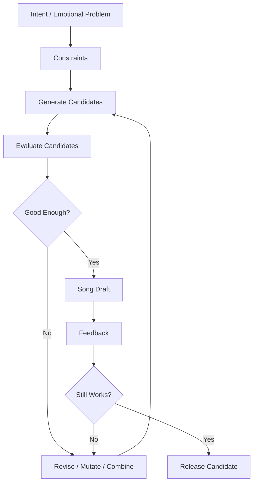

Dalam model ini:

- **Intent** adalah masalah emosional yang ingin diselesaikan.
- **Constraints** membatasi ruang eksplorasi.
- **Candidates** adalah kemungkinan lirik, melodi, hook, chord, struktur.
- **Evaluation** adalah cara menilai apakah kandidat bekerja.
- **Revision** adalah mutasi terarah.
- **Feedback** adalah observability.
- **Release candidate** adalah draft lagu yang cukup stabil.

Ini mirip genetic algorithm sederhana:

```text
generate -> score -> select -> mutate -> combine -> retest
```

Bedanya, fitness function-nya tidak sepenuhnya numerik. Tetapi tetap bisa dibuat lebih eksplisit.

---

## Apa Itu “Fitness Function” dalam Songwriting?

Dalam software, fitness function bisa berupa:

- test pass;
- latency turun;
- memory leak hilang;
- throughput naik;
- error rate turun.

Dalam songwriting, fitness function lebih manusiawi:

- apakah ide lagu jelas?
- apakah chorus mudah diingat?
- apakah lirik bisa dinyanyikan?
- apakah kata penting jatuh di tempat yang kuat?
- apakah verse memberi bukti, bukan hanya deklarasi?
- apakah ada kontras antara section?
- apakah lagu bergerak, bukan berputar-putar?
- apakah emosi meningkat atau berubah?
- apakah pendengar bisa menangkap “ini lagu tentang apa”?
- apakah ada satu baris yang menempel di kepala?

Kita bisa merapikannya menjadi rubrik.

---

## Rubrik Awal: 10 Sinyal Lagu Mulai Bekerja

Gunakan skor 1–5.

| No | Sinyal | Pertanyaan Diagnostik | Skor |
|---:|---|---|---:|
| 1 | Intent jelas | Lagu ini ingin mengatakan apa? | 1–5 |
| 2 | Emosi spesifik | Emosinya bukan sekadar “sedih”, tapi sedih seperti apa? | 1–5 |
| 3 | POV stabil | Siapa yang bicara, ke siapa, dari posisi apa? | 1–5 |
| 4 | Detail konkret | Ada benda/tempat/gestur yang bisa dibayangkan? | 1–5 |
| 5 | Prosodi natural | Kata-kata terasa enak saat dinyanyikan? | 1–5 |
| 6 | Hook kuat | Ada frasa/melodi yang mudah diingat? | 1–5 |
| 7 | Kontras section | Verse dan chorus punya perbedaan fungsi/energi? | 1–5 |
| 8 | Movement | Lagu bergerak dari kondisi A ke B? | 1–5 |
| 9 | Singability | Bisa dinyanyikan tanpa tersandung napas/suku kata? | 1–5 |
| 10 | Re-listen value | Ada alasan untuk mendengar ulang? | 1–5 |

Target untuk draft awal bukan 50/50. Target realistis:

```text
Draft v0.1: 25–30 / 50
Draft v0.2: 30–35 / 50
Draft v0.3: 35–40 / 50
Draft kuat: 40+ / 50
```

Rubrik ini bukan untuk membunuh rasa. Rubrik ini untuk mencegah kamu tersesat dalam subjektivitas total.

---

## Penting: Lagu Tidak Ditulis Sekali Jadi

Salah satu asumsi lemah yang harus dibuang:

> “Kalau saya berbakat, lagu bagus akan keluar langsung.”

Lebih akurat:

> “Lagu bagus biasanya ditemukan melalui draft buruk yang direvisi dengan arah jelas.”

Dalam engineering:

```text
first implementation != final architecture
```

Dalam songwriting:

```text
first lyric != final lyric
first melody != final melody
first chorus != final chorus
```

Draft buruk bukan bukti gagal. Draft buruk adalah material mentah.

Yang membedakan songwriter yang berkembang dan yang berhenti adalah kemampuan untuk:

- melihat bagian yang tidak bekerja;
- tahu kenapa tidak bekerja;
- mencoba revisi yang spesifik;
- tidak melekat secara emosional pada baris yang sebenarnya lemah.

---

## Analogi: Songwriting sebagai Product Discovery

Kalau kamu membangun produk, kamu tidak hanya bertanya:

```text
Apakah fitur ini bisa dibuat?
```

Kamu juga bertanya:

```text
Apakah fitur ini menyelesaikan masalah user?
Apakah user peduli?
Apakah alurnya jelas?
Apakah ada friction?
Apakah fitur ini dipakai ulang?
```

Songwriting sama.

Kamu tidak hanya bertanya:

```text
Apakah lirik ini puitis?
Apakah chord ini benar?
Apakah melodinya indah?
```

Kamu bertanya:

```text
Apakah lagu ini membuat pendengar merasakan sesuatu?
Apakah emosinya terbaca?
Apakah hook-nya menempel?
Apakah liriknya terdengar manusiawi saat dinyanyikan?
Apakah ada perjalanan dari awal ke akhir?
```

Lagu adalah produk emosional.

Pendengar adalah user.

Hook adalah retention mechanism.

Chorus adalah core value proposition.

Verse adalah evidence dan onboarding.

Bridge adalah pivot.

Outro adalah exit experience.

---

## Songwriting sebagai Domain Modelling

Sebelum menulis lagu, kamu perlu memodelkan domain emosionalnya.

Contoh domain: **ditinggalkan**.

Versi dangkal:

```text
Aku sedih karena kau pergi.
```

Versi domain modelling:

```text
Entity:
  Aku
  Kamu
  Rumah
  Koper
  Meja makan
  Jam dinding
  Hujan
  Foto lama

State:
  Menunggu
  Menyangkal
  Marah
  Menyadari
  Melepas

Event:
  Kamu pergi
  Pintu tertutup
  Pesan terakhir dibaca
  Lagu lama diputar
  Kursi kosong terlihat

Invariant:
  Aku masih bicara seolah kamu bisa mendengar

Conflict:
  Aku ingin membenci, tapi masih hafal cara mencintai
```

Dari domain model ini, lirik bisa lahir lebih konkret.

Bandingkan:

```text
Aku sangat rindu kepadamu
Hatiku sakit tanpamu
```

dengan:

```text
Kursimu masih menghadap jendela
seperti tahu kau belum pulang
```

Yang kedua lebih kuat karena punya objek, ruang, posisi, dan implikasi emosi.

---

## Songwriting sebagai State Machine Emosional

Lagu yang baik biasanya tidak diam di satu state. Ia bergerak.

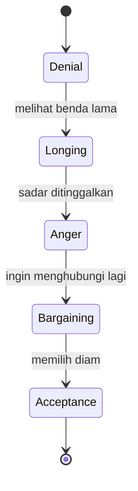

Atau untuk lagu satir:

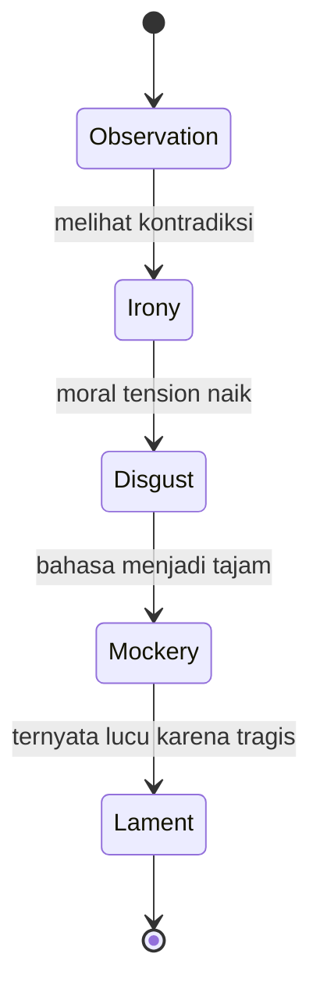

Untuk lagu romantis:

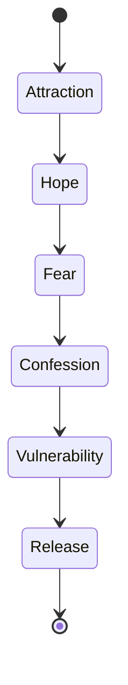

State machine ini penting karena banyak lagu pemula gagal bukan karena liriknya jelek, tetapi karena emosinya tidak bergerak. Semua section mengatakan hal yang sama.

Contoh gagal:

```text
Verse 1: aku sedih
Verse 2: aku sedih
Chorus: aku sedih banget
Bridge: aku tetap sedih
```

Versi lebih baik:

```text
Verse 1: aku melihat tanda-tanda kehilangan
Verse 2: aku mencoba menyangkal
Pre-chorus: aku mulai tidak bisa menahan
Chorus: aku mengakui luka utamanya
Bridge: aku sadar bagian tergelapnya
Final chorus: pengakuan yang sama, tapi dengan makna baru
```

---

## Songwriting sebagai Compiler

Bayangkan lagu sebagai compiler dari emosi mentah ke pengalaman pendengar.

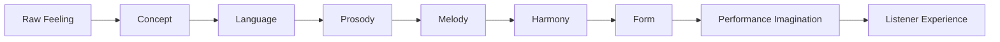

Jika ada error, bisa terjadi di tahap mana pun:

| Tahap | Error Umum | Gejala |
|---|---|---|
| Raw feeling | Emosi terlalu umum | Lagu terasa generik |
| Concept | Premis tidak jelas | Pendengar bingung lagu tentang apa |
| Language | Diksi lemah/klise | Lirik terasa template |
| Prosody | Suku kata tidak cocok | Lirik susah dinyanyikan |
| Melody | Kontur datar | Lagu tidak memorable |
| Harmony | Chord tidak mendukung emosi | Lagu terasa salah mood |
| Form | Section tidak punya fungsi | Lagu terasa monoton |
| Listener experience | Tidak ada payoff | Lagu selesai tanpa meninggalkan bekas |

Dalam coding, kamu debug dari error message. Dalam songwriting, kamu debug dari gejala mendengar.

---

## Mengubah Kata-Kata Kabur Menjadi Sinyal yang Bisa Diamati

Di musik, orang sering memberi feedback seperti:

```text
Kurang ngena.
Kurang natural.
Kurang jujur.
Kurang naik.
Kurang pecah.
Kurang gelap.
Kurang catchy.
```

Ini terdengar kabur. Tapi bisa diterjemahkan.

### “Kurang ngena”

Kemungkinan penyebab:

- emosi terlalu umum;
- tidak ada detail konkret;
- lirik hanya menjelaskan, tidak memperlihatkan;
- chorus tidak menyatakan inti luka;
- melodi tidak memberi tekanan pada kata penting.

Terjemahan diagnostik:

```text
Apakah lagu punya satu kalimat inti yang jelas?
Apakah ada gambar konkret?
Apakah chorus menyebut emotional thesis?
Apakah kata paling penting jatuh di nada/beat kuat?
```

### “Kurang natural”

Kemungkinan penyebab:

- pilihan kata tidak seperti bahasa lisan;
- jumlah suku kata terlalu padat;
- tekanan kata jatuh di posisi aneh;
- kalimat terlalu panjang untuk napas;
- rima dipaksakan.

Terjemahan diagnostik:

```text
Apakah baris ini tetap masuk akal jika diucapkan biasa?
Apakah penyanyi bisa mengambil napas?
Apakah kata yang ditekankan memang kata penting?
Apakah rima mengorbankan makna?
```

### “Kurang catchy”

Kemungkinan penyebab:

- tidak ada pengulangan;
- motif melodi terlalu panjang;
- ritme hook tidak khas;
- terlalu banyak variasi;
- chorus tidak lebih sederhana dari verse;
- title tidak muncul di tempat strategis.

Terjemahan diagnostik:

```text
Apakah ada frasa 3–7 kata yang bisa diulang?
Apakah ada motif 2–4 ketukan yang mudah dikenali?
Apakah chorus punya bentuk lebih stabil?
Apakah pendengar bisa mengingat satu baris setelah sekali dengar?
```

### “Kurang naik”

Kemungkinan penyebab:

- verse dan chorus punya range melodi sama;
- density instrumen tidak berubah;
- ritme tidak berubah;
- chord tidak menambah tension;
- lirik chorus tidak lebih kuat dari verse.

Terjemahan diagnostik:

```text
Apakah chorus lebih tinggi, lebih luas, lebih sederhana, atau lebih intens?
Apakah pre-chorus membangun ekspektasi?
Apakah ada release setelah tension?
```

### “Terlalu robotic”

Kemungkinan penyebab:

- semua baris panjangnya sama tapi tanpa musikalitas;
- rima terlalu rapi;
- tidak ada variasi napas;
- diksi terlalu literal;
- terlalu banyak simetri;
- lirik terdengar seperti prompt, bukan suara manusia.

Terjemahan diagnostik:

```text
Apakah ada variasi panjang baris?
Apakah ada jeda manusiawi?
Apakah ada detail yang tidak terlalu “menjelaskan”?
Apakah narator punya kepribadian?
```

---

## Creative System: Generator, Evaluator, Editor

Songwriting membutuhkan tiga mode kerja berbeda.

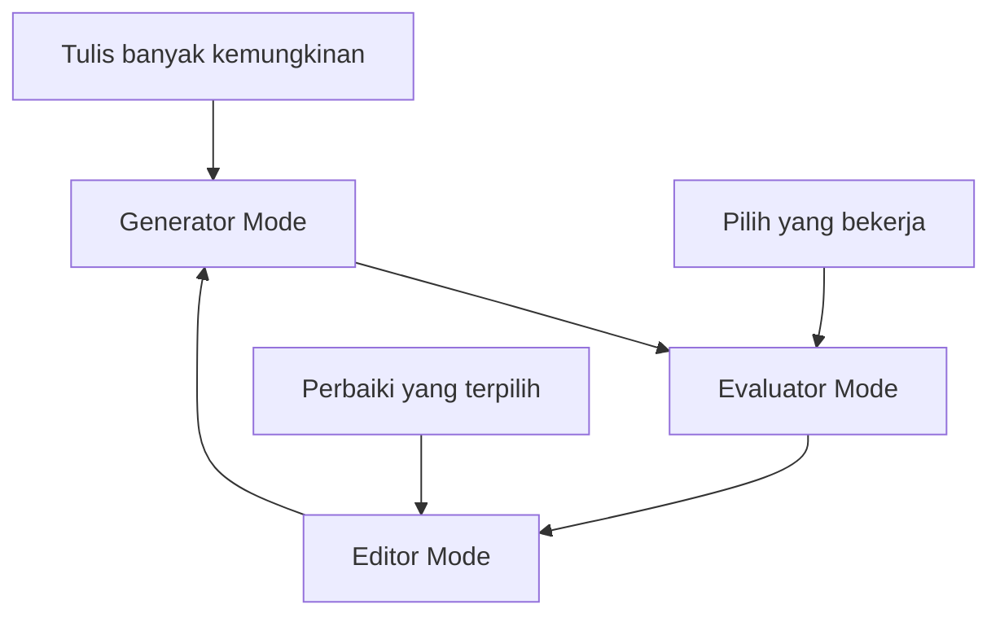

### 1. Generator Mode

Tujuannya menghasilkan bahan.

Aturan:

- jangan menilai terlalu cepat;
- tulis banyak kandidat;
- izinkan lirik buruk keluar;
- gunakan constraint kecil;
- cari kejutan.

Contoh generator prompt:

```text
Tulis 20 cara mengatakan “aku ditinggalkan” tanpa memakai kata ditinggalkan.
```

Output mungkin:

```text
kursimu hafal bentuk kosong
sendokmu masih kupisahkan
pintu belajar menutup pelan
namamu masih tahu jalan ke mulutku
```

Tidak semua bagus. Itu normal.

### 2. Evaluator Mode

Tujuannya memilih bahan.

Aturan:

- jangan memperbaiki dulu;
- cukup beri skor;
- cari yang punya energi;
- tandai yang cliché;
- lihat mana yang punya gambar konkret.

Contoh evaluasi:

| Kandidat | Kekuatan | Masalah | Skor |
|---|---|---|---:|
| kursimu hafal bentuk kosong | visual, unik | agak puitis berat | 4 |
| sendokmu masih kupisahkan | konkret, domestik | butuh konteks | 4 |
| pintu belajar menutup pelan | personifikasi | kurang jelas | 3 |
| namamu masih tahu jalan ke mulutku | kuat, intim | panjang | 4 |

### 3. Editor Mode

Tujuannya memperkuat kandidat.

Contoh revisi:

```text
Before:
namamu masih tahu jalan ke mulutku

After:
namamu masih pulang
ke mulutku
tanpa diminta
```

Editor mode bukan mencari ide baru. Editor mode memperjelas energi yang sudah ada.

Kesalahan pemula adalah mencampur tiga mode ini sekaligus:

```text
menulis satu baris -> langsung menghakimi -> langsung menghapus -> tidak jadi apa-apa
```

Pisahkan mode kerja.

---

## Three-Pass Songwriting Workflow

Gunakan tiga pass.


### Pass 1: Generate

Target:

- banyak material;
- tanpa judgement;
- 10–30 baris;
- beberapa ide hook;
- beberapa image.

Pertanyaan:

```text
Apa saja yang mungkin?
```

### Pass 2: Select

Target:

- pilih 20% material terbaik;
- identifikasi pusat emosi;
- pilih POV;
- pilih metafora utama;
- pilih title sementara.

Pertanyaan:

```text
Mana yang punya energi?
```

### Pass 3: Shape

Target:

- bentuk verse;
- bentuk chorus;
- rapikan frasa;
- sesuaikan suku kata;
- pikirkan melodi.

Pertanyaan:

```text
Bagaimana membuat ini bernyanyi?
```

---

## Jangan Mulai dari Template Secara Buta

Template bisa membantu, tapi bisa juga membunuh lagu.

Contoh template umum:

```text
Verse 1
Pre-Chorus
Chorus
Verse 2
Pre-Chorus
Chorus
Bridge
Final Chorus
```

Ini berguna sebagai container. Tetapi template tidak menjawab:

- apa emotional thesis lagu?
- kenapa chorus perlu ada?
- apa yang berubah dari verse 1 ke verse 2?
- apakah bridge memberi reveal?
- apa yang membuat hook menempel?

Dalam engineering, framework tidak otomatis membuat sistem bagus. Framework hanya menyediakan struktur. Domain modelling tetap harus benar.

Dalam songwriting, form tidak otomatis membuat lagu bagus. Form hanya menyediakan alur. Isi emosional tetap harus hidup.

---

## Constraint Lebih Berguna daripada Formula

Formula berkata:

```text
Lagu bagus harus memakai progression ini.
Lagu bagus harus punya chorus seperti ini.
Lagu sedih harus minor.
```

Constraint berkata:

```text
Tulis lagu dari POV orang yang tidak berani mengaku rindu.
Jangan pakai kata rindu.
Setiap verse harus punya satu benda rumah.
Chorus maksimal 4 baris.
Hook harus memakai frasa 4 kata.
Melodi chorus harus lebih tinggi dari verse.
```

Formula membuat output generik.

Constraint membuat eksplorasi lebih tajam.

### Contoh Constraint Set

```text
Tema:
  kehilangan seseorang yang masih hidup

POV:
  aku bicara ke benda-benda yang ditinggalkan

Larangan:
  tidak boleh memakai kata rindu, pergi, luka, cinta

Metafora:
  rumah sebagai tubuh

Struktur:
  verse 1: dapur
  verse 2: kamar
  chorus: pintu
  bridge: cermin

Hook:
  "kau belum selesai"
```

Dengan constraint ini, lagu punya arah tanpa harus kaku.

---

## Songwriting Invariants

Dalam sistem, invariant adalah kondisi yang harus selalu benar.

Dalam songwriting, invariant adalah prinsip yang harus dijaga agar lagu tetap koheren.

### Invariant 1: Satu Lagu Harus Punya Satu Pusat Gravitasi

Lagu boleh punya banyak detail, tetapi harus terasa mengitari satu pusat.

Buruk:

```text
Lagu tentang patah hati,
lalu politik,
lalu masa kecil,
lalu Tuhan,
lalu media sosial,
lalu nostalgia SMA.
```

Mungkin semua berhubungan di kepala penulis, tetapi pendengar kehilangan pusat.

Lebih baik:

```text
Lagu tentang seseorang yang merasa rumahnya kosong setelah ditinggal.
Semua detail mengitari rumah kosong.
```

### Invariant 2: Setiap Section Harus Punya Fungsi

Verse bukan chorus yang lebih pelan.

Chorus bukan verse yang diulang lebih keras.

Bridge bukan tempat membuang sisa lirik.

| Section | Fungsi Umum |
|---|---|
| Verse | Memberi scene, bukti, detail, gerak naratif |
| Pre-chorus | Membangun tension menuju chorus |
| Chorus | Menyatakan inti emosional atau hook |
| Bridge | Memberi sudut baru, reveal, reversal, atau escalation |
| Outro | Meninggalkan aftertaste |

### Invariant 3: Kata Penting Harus Mendapat Tempat Penting

Jika kata inti lagu adalah “pulang”, jangan letakkan kata itu di posisi lemah, cepat, atau tidak terdengar.

Buruk:

```text
aku ingin kau pulang ke rumah ini
```

Jika dinyanyikan terlalu cepat, “pulang” hilang.

Lebih kuat:

```text
pulang
cukup itu
yang tak berani kuminta
```

### Invariant 4: Lirik Harus Bisa Dinyanyikan, Bukan Hanya Dibaca

Puisi belum tentu lyric.

Lyric harus mempertimbangkan:

- suku kata;
- napas;
- tekanan;
- vowel;
- consonant;
- tempo;
- nada panjang;
- pengulangan;
- artikulasi.

### Invariant 5: Lagu Butuh Repetition dan Variation

Terlalu banyak pengulangan = membosankan.

Terlalu banyak variasi = tidak memorable.

Lagu yang kuat biasanya mengatur:

```text
familiarity + surprise
```

---

## Search Space Songwriting

Satu ide lagu bisa dieksplorasi lewat banyak dimensi.

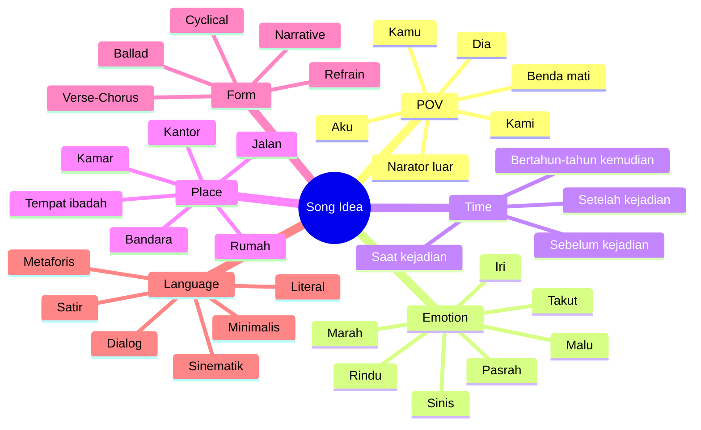

Tanpa constraint, kamu bisa lumpuh karena terlalu banyak pilihan.

Maka langkah awal songwriting adalah **memotong search space**.

Contoh:

```text
Saya akan menulis lagu tentang rindu.
```

Terlalu luas.

Lebih baik:

```text
Saya akan menulis lagu tentang orang yang masih menyimpan kebiasaan kecil dari mantan pasangannya,
dari sudut pandang orang pertama,
dengan metafora rumah,
tanpa memakai kata rindu,
dalam bentuk ballad gelap,
dengan chorus maksimal 4 baris.
```

Ini jauh lebih mudah ditulis.

---

## Local Maxima: Kenapa Lagu Kadang Terasa Mentok

Dalam optimisasi, local maximum adalah solusi yang lumayan baik tapi menghalangi solusi yang lebih baik.

Dalam songwriting, local maximum bisa berupa:

- satu baris yang kamu suka tapi merusak keseluruhan;
- chord progression yang enak tapi membuat semua melodi terdengar generik;
- rima yang clever tapi tidak emosional;
- metafora indah tapi tidak cocok dengan POV;
- chorus yang catchy tapi tidak sesuai verse;
- title yang keren tapi lagu dipaksa mengikuti title.

Contoh:

```text
Baris:
"di altar sunyi, doaku menjahit bayangmu"
```

Mungkin terdengar puitis. Tapi jika lagu sebenarnya tentang percakapan kasual di dapur, baris itu terlalu besar dan mengganggu worldbuilding.

Pertanyaan untuk keluar dari local maxima:

```text
Apakah bagian ini bagus sendirian, atau bagus untuk lagu ini?
```

Itu pertanyaan penting.

Banyak pemula mempertahankan baris karena “bagus”. Songwriter yang lebih matang mempertahankan baris karena “berfungsi”.

---

## Refactoring dalam Songwriting

Refactoring dalam coding:

```text
mengubah struktur tanpa mengubah behavior eksternal yang diinginkan
```

Refactoring dalam songwriting:

```text
mengubah bentuk lirik/melodi tanpa menghilangkan inti emosional yang diinginkan
```

Contoh refactor lirik:

### Draft 1

```text
Aku masih sangat mencintaimu
Walau kamu sudah pergi meninggalkanku
Hatiku terasa hancur dan pilu
Saat kuingat semua tentang dirimu
```

Masalah:

- terlalu umum;
- banyak kata klise;
- terlalu menjelaskan;
- rima “-u” dipaksakan;
- tidak ada benda konkret.

### Refactor 1: konkretkan

```text
Gelasmu masih di rak kedua
tak kupakai, tak kubuang
```

### Refactor 2: tambah emotional implication

```text
Gelasmu di rak kedua
tak kupakai
tak kubuang
seperti aku tahu
kau bisa haus
di jalan pulang
```

### Refactor 3: siapkan untuk dinyanyikan

```text
Gelasmu
di rak kedua

tak kupakai
tak kubuang

barangkali kau haus
di jalan pulang
```

Versi refactor tidak hanya “lebih puitis”. Ia lebih bernyanyi karena frasanya diberi napas.

---

## Observability dalam Songwriting

Dalam sistem produksi, kamu tidak bisa memperbaiki yang tidak kamu ukur.

Dalam songwriting, kamu tidak bisa memperbaiki yang tidak kamu dengarkan ulang.

Observability songwriting meliputi:

1. Rekam semua draft.
2. Dengarkan tanpa membaca lirik.
3. Dengarkan sambil membaca lirik.
4. Tandai bagian yang membuat perhatian turun.
5. Tandai bagian yang terdengar forced.
6. Tandai bagian yang ingin kamu ulang.
7. Minta orang lain menyebut satu baris yang mereka ingat.
8. Cek apakah mereka bisa menjelaskan lagu ini tentang apa.
9. Cek apakah chorus bisa diingat setelah satu kali dengar.
10. Cek apakah ada bagian yang terasa terlalu panjang.

### Songwriting Log

Gunakan format:

```markdown
## Draft Log

Tanggal:
Jam praktik:
Judul sementara:
Intent:
POV:
Metafora utama:
Struktur:
Apa yang bekerja:
Apa yang lemah:
Hipotesis revisi:
Next action:
```

Contoh:

```markdown
## Draft Log

Tanggal: 2026-06-24
Jam praktik: 35 menit
Judul sementara: Rak Kedua
Intent: lagu tentang orang yang belum bisa melepas kebiasaan menunggu
POV: aku kepada kamu
Metafora utama: benda rumah yang masih disiapkan
Struktur: verse + chorus kasar
Apa yang bekerja:
- "gelasmu di rak kedua" terasa konkret
- chorus pendek lebih kuat

Apa yang lemah:
- verse 2 belum punya scene
- melodi chorus masih datar

Hipotesis revisi:
- verse 2 pindah ke kamar, bukan dapur lagi
- chorus naik range 3 nada

Next action:
- tulis 10 image kamar
```

---

## Debugging Lagu

Ketika lagu tidak bekerja, jangan langsung rewrite semua. Diagnosis dulu.

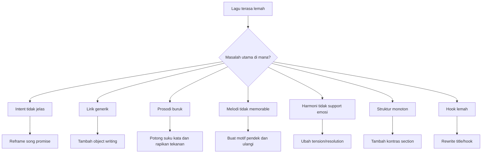

### Gejala dan Diagnosis

| Gejala | Kemungkinan Penyebab | Tindakan |
|---|---|---|
| Lagu terasa datar | Tidak ada emotional movement | Buat state transition |
| Chorus tidak menempel | Hook terlalu panjang/abstrak | Pendekkan, ulangi, beri motif |
| Lirik terasa maksa | Rima mengalahkan makna | Revisi tanpa rima dulu |
| Verse membosankan | Terlalu menjelaskan | Tambahkan scene dan objek |
| Melodi tidak enak | Tekanan kata salah | Align lyric stress dengan beat/nada |
| Lagu terlalu penuh | Terlalu banyak ide | Pilih satu pusat gravitasi |
| Bridge tidak berguna | Tidak ada reveal/pivot | Ubah fungsi bridge atau hapus |
| Semua terdengar sama | Tidak ada kontras | Ubah range, rhythm, density, harmony |

---

## Version Control untuk Songwriting

Jangan rewrite di tempat tanpa menyimpan versi.

Gunakan struktur file:

```text
songwriting/
  ideas/
    raw-lines.md
    titles.md
    object-writing.md
  songs/
    rak-kedua/
      rak-kedua-v001-raw.md
      rak-kedua-v002-chorus.md
      rak-kedua-v003-full.md
      rak-kedua-v004-demo-notes.md
      audio/
        2026-06-24-voice-memo-001.m4a
        2026-06-24-chorus-test-002.m4a
```

Naming sederhana:

```text
<judul>-v<nomor>-<fokus>.md
```

Contoh:

```text
rak-kedua-v001-raw.md
rak-kedua-v002-prosody-pass.md
rak-kedua-v003-hook-rewrite.md
rak-kedua-v004-full-song.md
```

Jangan hapus draft lama terlalu cepat. Kadang baris yang tidak cocok untuk lagu A berguna untuk lagu B.

---

## Jangan Mengukur Lagu Terlalu Cepat dengan “Bagus atau Jelek”

Pertanyaan “bagus atau jelek?” terlalu besar dan sering melumpuhkan.

Gunakan pertanyaan lebih kecil:

```text
Apakah POV jelas?
Apakah ada satu image kuat?
Apakah chorus lebih mudah diingat dari verse?
Apakah ada kata yang susah dinyanyikan?
Apakah emosi berubah?
Apakah title muncul di tempat strategis?
Apakah baris ini terdengar seperti manusia bicara?
```

Ini sama seperti debugging. Kamu tidak bertanya:

```text
Apakah sistem ini bagus?
```

Kamu bertanya:

```text
Endpoint mana yang error?
Latency di mana naik?
Memory leak dari object apa?
Query mana yang lambat?
User drop di step mana?
```

Songwriting harus dipecah begitu juga.

---

## The Minimum Viable Song

Untuk 20 jam pertama, jangan targetkan masterpiece. Targetkan **Minimum Viable Song**.

Minimum Viable Song harus punya:

1. Judul sementara.
2. Satu emotional promise.
3. Satu POV yang konsisten.
4. Minimal:
   - verse 1,
   - chorus,
   - verse 2,
   - chorus.
5. Hook lirik atau hook melodi.
6. Chord dasar.
7. Melodi kasar.
8. Rekaman voice memo.
9. Revision notes.

Tidak harus punya:

- produksi lengkap;
- aransemen kompleks;
- bridge;
- intro/outro panjang;
- mixing;
- teknik vokal sempurna;
- harmoni rumit.

MVS adalah demo untuk membuktikan lagu bisa hidup.

---

## Songwriting Pipeline untuk 20 Jam Pertama

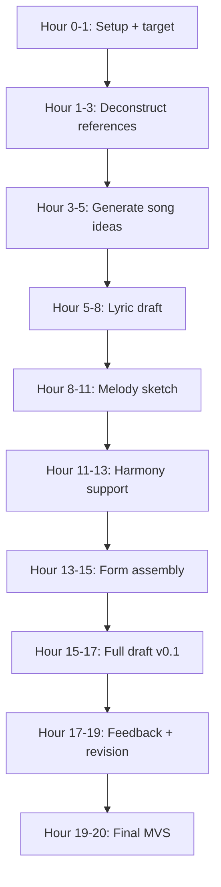

Part 001 ini berperan sebagai sistem kendali untuk seluruh pipeline.

---

## Songwriting System Architecture

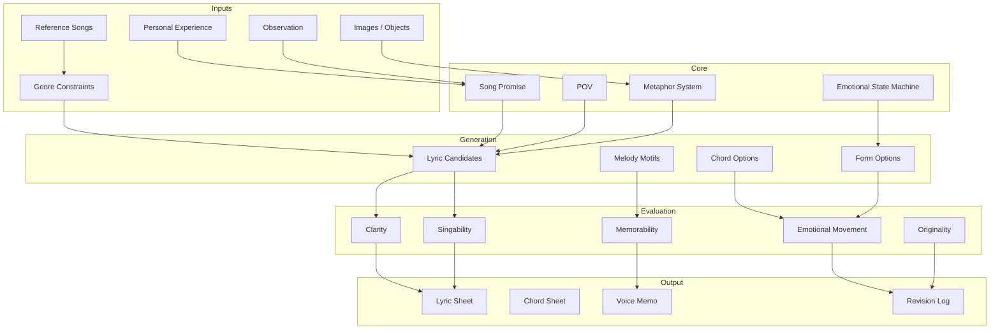

---

## Cara Menggunakan Referensi Lagu Tanpa Menjiplak

Referensi diperlukan, tetapi harus didekonstruksi, bukan disalin.

Yang boleh dipelajari:

- bagaimana verse memberi detail;
- bagaimana chorus menyederhanakan emosi;
- bagaimana hook diulang;
- bagaimana bridge memberi sudut baru;
- bagaimana melodi naik ke kata penting;
- bagaimana tempo mendukung mood;
- bagaimana arrangement memberi ruang.

Yang tidak boleh dilakukan:

- menyalin melodi;
- menyalin lirik;
- menyalin progression secara buta sambil membawa vibe sama persis;
- meniru persona tanpa memahami fungsi.

Gunakan format deconstruction:

```markdown
## Reference Deconstruction

Judul:
Artis:
Genre:
Tempo kira-kira:
POV:
Tema:
Song promise:
Struktur:
Hook:
Verse function:
Chorus function:
Bridge function:
Hal yang ingin dipelajari:
Hal yang tidak ingin ditiru:
```

Contoh abstrak:

```markdown
Hal yang ingin dipelajari:
- chorus sangat pendek
- title muncul sebagai emotional punch
- verse memakai benda konkret
- melody chorus naik hanya di satu kata penting

Hal yang tidak ingin ditiru:
- tema terlalu mirip
- warna produksi terlalu spesifik
- frasa hook jangan diambil
```

---

## Anti-Pattern untuk Software Engineer

### Anti-Pattern 1: Over-Architecting Before Writing

Gejala:

- terlalu lama membuat sistem;
- terlalu banyak membaca teori;
- belum menulis satu baris pun;
- merasa belum siap;
- mencari template sempurna.

Solusi:

```text
Tulis 20 baris buruk sekarang.
Baru evaluasi setelah ada material.
```

### Anti-Pattern 2: Premature Optimization

Gejala:

- memperbaiki satu kata selama 30 menit;
- padahal song promise belum jelas;
- chorus belum ada;
- struktur belum diputuskan.

Solusi:

```text
Selesaikan draft kasar dulu.
Optimasi line-level setelah macro structure bekerja.
```

### Anti-Pattern 3: Framework Addiction

Gejala:

- semua lagu mengikuti formula sama;
- tidak mendengar kebutuhan lagu;
- verse/chorus ada karena template, bukan fungsi.

Solusi:

```text
Tanya fungsi setiap section.
Jika tidak punya fungsi, hapus atau ubah.
```

### Anti-Pattern 4: Binary Judgement

Gejala:

- “ini bagus/jelek”;
- langsung putus asa;
- tidak tahu bagian mana yang gagal.

Solusi:

```text
Gunakan diagnosis granular:
intent, POV, image, prosody, melody, hook, form.
```

### Anti-Pattern 5: Hiding Behind Complexity

Gejala:

- memakai metafora berat;
- chord rumit;
- struktur unik;
- tetapi emotional core tidak jelas.

Solusi:

```text
Sederhanakan sampai lagu bisa dijelaskan dalam satu kalimat.
```

### Anti-Pattern 6: Treating Lyrics Like Essay

Gejala:

- lirik terlalu menjelaskan;
- tidak ada ruang untuk pendengar;
- kalimat panjang;
- argumen terlalu literal.

Solusi:

```text
Ganti penjelasan dengan scene, objek, gestur, atau dialog.
```

---

## Tiga Level Kebenaran dalam Lagu

Dalam engineering, benar bisa berarti sesuai spesifikasi.

Dalam songwriting, “benar” punya tiga level.

### Level 1: Semantic Truth

Apakah kalimatnya masuk akal?

```text
Aku menunggu di pintu.
```

Masuk akal.

### Level 2: Emotional Truth

Apakah kalimatnya terasa jujur secara emosi?

```text
Aku menunggu di pintu
yang sudah lupa caramu mengetuk.
```

Lebih emosional.

### Level 3: Musical Truth

Apakah kalimatnya bisa dinyanyikan dengan enak?

```text
Aku menunggu
di pintu

yang lupa
caramu mengetuk
```

Lebih siap menjadi lyric karena ada frasa napas.

Lirik bagus harus melewati tiga level ini.

---

## Empat Mesin Utama Lagu

Songwriting bisa dipahami sebagai empat mesin:

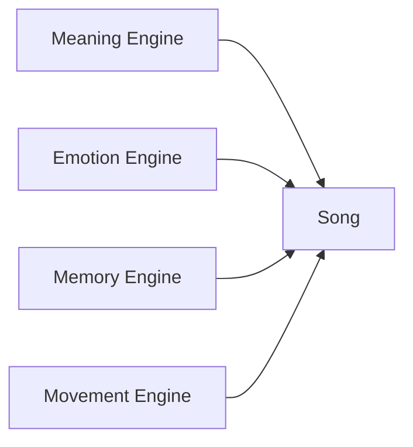

### 1. Meaning Engine

Menjawab:

```text
Lagu ini tentang apa?
Apa yang sedang dipertaruhkan?
Siapa bicara kepada siapa?
```

Komponen:

- tema;
- POV;
- konflik;
- metafora;
- title;
- song promise.

### 2. Emotion Engine

Menjawab:

```text
Apa yang pendengar rasakan?
Bagaimana intensitasnya berubah?
```

Komponen:

- mode mayor/minor atau warna harmoni;
- melodic contour;
- rhythm;
- register;
- density;
- kata-kata emosional;
- silence.

### 3. Memory Engine

Menjawab:

```text
Apa yang diingat pendengar?
Apa yang bisa mereka nyanyikan ulang?
```

Komponen:

- hook;
- repetition;
- title placement;
- motif;
- rhyme;
- phrase length.

### 4. Movement Engine

Menjawab:

```text
Apa yang berubah dari awal sampai akhir?
Mengapa pendengar perlu terus mendengar?
```

Komponen:

- verse escalation;
- pre-chorus lift;
- bridge pivot;
- final chorus shift;
- arrangement dynamics.

Lagu gagal biasanya karena salah satu mesin mati.

---

## The Song Promise

Song promise adalah janji emosional lagu kepada pendengar.

Bentuknya bisa seperti:

```text
Lagu ini akan membuat pendengar merasakan ______
melalui cerita/gambar tentang ______
dari sudut pandang ______
dengan konflik ______.
```

Contoh:

```text
Lagu ini akan membuat pendengar merasakan rindu yang malu diakui
melalui gambar benda-benda rumah yang masih disiapkan
dari sudut pandang seseorang yang ditinggalkan
dengan konflik antara ingin melepas dan masih menunggu.
```

Song promise bukan slogan. Ia adalah koordinat.

Jika kamu bingung saat menulis, kembali ke song promise.

Pertanyaan:

```text
Apakah baris ini mendukung promise?
Apakah melodi ini mendukung promise?
Apakah chorus ini memenuhi promise?
Apakah bridge ini mengubah promise secara menarik?
```

---

## Songwriting Canvas untuk Part Ini

Gunakan canvas berikut sebagai output wajib part 001.

```markdown
# Songwriting System Canvas

## 1. Target 20 Jam
Dalam 20 jam pertama, saya ingin bisa:

-

## 2. Definisi Minimum Viable Song
Lagu pertama saya dianggap selesai jika memiliki:

- Judul sementara:
- Verse 1:
- Chorus:
- Verse 2:
- Melodi utama:
- Chord dasar:
- Voice memo:
- Revision log:

## 3. Cara Saya Akan Menghasilkan Ide
Sumber input:

- pengalaman pribadi:
- observasi orang lain:
- tempat:
- benda:
- konflik:
- kalimat yang terdengar menarik:

## 4. Constraint Awal
Untuk lagu pertama, saya akan membatasi:

- tema:
- POV:
- suasana:
- genre referensi:
- larangan kata:
- metafora utama:
- panjang chorus:

## 5. Rubrik Evaluasi
Saya akan memberi skor 1–5 untuk:

- intent jelas:
- POV stabil:
- detail konkret:
- prosodi natural:
- hook kuat:
- kontras section:
- emotional movement:
- singability:

## 6. Workflow Praktik
Saya akan memakai siklus:

Generate:
Evaluate:
Edit:
Record:
Listen:
Revise:

## 7. Failure Mode yang Perlu Saya Waspadai
Saya paling rentan terhadap:

- overthinking:
- terlalu literal:
- terlalu template:
- takut draft buruk:
- rima dipaksakan:
- tidak selesai:

## 8. Next Action
Dalam 30 menit setelah membaca part ini, saya akan:

-
```

---

## Latihan Utama Part 001: Ubah Ide Abstrak Menjadi Search Problem

Ambil satu ide abstrak.

Contoh:

```text
rindu
marah
ditinggalkan
jatuh cinta
takut gagal
kecewa pada pemimpin
malu mencintai
pulang
```

Lalu pecah menjadi search problem.

### Template

```markdown
## Abstract Idea
...

## Specific Emotional Version
...

## POV Options
1.
2.
3.

## Places
1.
2.
3.

## Objects
1.
2.
3.
4.
5.

## Forbidden Words
1.
2.
3.

## Possible Titles
1.
2.
3.
4.
5.

## Possible Hook Phrases
1.
2.
3.
4.
5.

## Emotional State Movement
Start:
Middle:
End:

## First Constraint Set
Tema:
POV:
Metafora:
Larangan:
Struktur:
Mood:
```

### Contoh Diisi

```markdown
## Abstract Idea
Rindu

## Specific Emotional Version
Rindu kepada seseorang yang belum benar-benar pergi dari kebiasaan sehari-hari.

## POV Options
1. Aku bicara kepada kamu.
2. Aku bicara kepada rumah.
3. Aku bicara kepada diri sendiri yang masih menunggu.

## Places
1. Dapur
2. Kamar
3. Teras

## Objects
1. Gelas
2. Kursi
3. Handuk
4. Sendok
5. Jam dinding

## Forbidden Words
1. Rindu
2. Cinta
3. Pergi

## Possible Titles
1. Rak Kedua
2. Gelasmu
3. Belum Kubereskan
4. Jalan Pulang
5. Kursi Kosong

## Possible Hook Phrases
1. kau belum selesai
2. aku belum belajar sepi
3. rumah ini masih salah paham
4. tak kupakai, tak kubuang
5. pulanglah tanpa janji

## Emotional State Movement
Start: menyangkal kehilangan
Middle: sadar masih menunggu
End: menerima bahwa menunggu sudah menjadi kebiasaan

## First Constraint Set
Tema: rindu yang tidak diakui
POV: aku kepada kamu
Metafora: rumah sebagai tubuh yang belum sembuh
Larangan: rindu, cinta, pergi
Struktur: verse - chorus - verse - chorus
Mood: slow dark ballad
```

---

## Latihan 30 Menit

### Menit 0–5: Pilih Ide

Pilih satu ide abstrak:

```text
rindu / marah / kecewa / jatuh cinta / kehilangan / dendam / pulang / malu
```

Jangan pilih lebih dari satu.

### Menit 5–10: Buat Song Promise

Isi:

```text
Lagu ini akan membuat pendengar merasakan ______
melalui gambar tentang ______
dari sudut pandang ______
dengan konflik ______.
```

### Menit 10–15: Buat Constraint

Tentukan:

```text
POV:
Tempat:
Metafora:
Larangan kata:
Panjang chorus:
Mood:
```

### Menit 15–25: Generate Kandidat

Tulis:

- 10 objek;
- 10 baris lirik kasar;
- 5 title;
- 5 hook phrase.

Jangan evaluasi dulu.

### Menit 25–30: Pilih Material

Pilih:

- 1 title;
- 1 hook phrase;
- 3 baris terbaik;
- 1 metaphor system.

Beri alasan singkat kenapa dipilih.

---

## Latihan Lanjutan 45 Menit: Engineer Mode

Buat scoring sederhana.

```markdown
# Candidate Scoring

| Candidate | Clarity | Image | Singability | Emotion | Memorability | Total |
|---|---:|---:|---:|---:|---:|---:|
| ... | ... | ... | ... | ... | ... | ... |
```

Gunakan skala 1–5.

Lalu pilih kandidat tertinggi.

Penting: jangan biarkan scoring menggantikan rasa. Scoring hanya alat bantu untuk melihat lebih jernih.

Jika kandidat skor tinggi tapi terasa mati, tulis:

```text
High score but emotionally dead because:
-
```

Jika kandidat skor rendah tapi terasa menarik, tulis:

```text
Low score but has strange energy because:
-
```

Kreativitas sering lahir dari kandidat yang belum rapi tapi punya energi.

---

## Latihan “Bad Draft Permission”

Tulis ini di atas file latihan:

```text
Saya diizinkan menulis draft buruk.
Draft buruk adalah bahan mentah.
Tugas saya bukan benar sejak awal.
Tugas saya adalah membuat material yang bisa direvisi.
```

Ini bukan afirmasi kosong. Ini strategi kerja.

Tanpa izin membuat draft buruk, generator mode mati.

Jika generator mode mati, tidak ada material.

Jika tidak ada material, evaluator dan editor tidak bisa bekerja.

---

## Checklist Part 001

Sebelum lanjut ke part 002, pastikan kamu sudah punya:

- [ ] Songwriting System Canvas.
- [ ] Satu ide abstrak yang diubah menjadi search problem.
- [ ] Satu song promise.
- [ ] Satu constraint set.
- [ ] Minimal 10 baris lirik kasar.
- [ ] Minimal 5 kemungkinan title.
- [ ] Minimal 5 hook phrase.
- [ ] Skor awal untuk kandidat terbaik.
- [ ] Catatan failure mode pribadi.

---

## Output Wajib Part 001

Buat file latihan:

```text
songwriting-practice-001-system-canvas.md
```

Isi minimal:

```markdown
# songwriting-practice-001-system-canvas.md

## Song Promise
...

## Constraint Set
...

## Candidate Titles
1.
2.
3.
4.
5.

## Candidate Hook Phrases
1.
2.
3.
4.
5.

## Raw Lyric Lines
1.
2.
3.
4.
5.
6.
7.
8.
9.
10.

## Selected Direction
Title:
Hook:
POV:
Metaphor:
Why this direction:

## Diagnostic Notes
What feels alive:
What feels weak:
Next action:
```

---

## Common Failure Modes di Part Ini

### 1. Terlalu Cepat Ingin Menulis Lagu Utuh

Part ini belum menuntut lagu lengkap. Fokusnya sistem.

Jika langsung memaksa lagu utuh, kamu mungkin kembali ke template lama.

### 2. Terlalu Lama Membuat Sistem

Sebaliknya, jangan menjadikan canvas sebagai alasan tidak menulis.

Canvas maksimal 30–45 menit. Setelah itu harus ada baris lirik kasar.

### 3. Memilih Tema Terlalu Besar

Tema seperti:

```text
kehidupan
cinta
politik
kehilangan
Tuhan
```

terlalu luas.

Kecilkan:

```text
orang yang tidak berani menghapus nomor mantannya
orang yang pulang ke rumah setelah ayahnya meninggal
orang yang pura-pura baik-baik saja setelah gagal
orang yang marah pada pemimpin tapi menyamarkannya sebagai kisah cinta
```

### 4. Menganggap Constraint Membatasi Kreativitas

Constraint tidak membunuh kreativitas. Constraint membuat kreativitas punya medan.

Tanpa constraint, kamu punya infinite search space.

Infinite search space membuat kamu diam.

### 5. Menganggap Rubrik Bisa Menentukan Lagu Bagus

Rubrik membantu diagnosis, bukan menggantikan taste.

Taste tetap dilatih dengan:

- mendengar banyak lagu;
- menganalisis lagu;
- menulis;
- merekam;
- mendengar ulang;
- revisi;
- feedback.

---

## Bridge ke Part Berikutnya

Part ini membangun cara pikir dasar:

```text
songwriting = creative search under constraints
```

Part berikutnya, `learn-songwriting-part-002.md`, akan masuk ke:

```text
Target Performance Level
```

Di sana kita akan mendefinisikan secara lebih operasional:

- “bisa menulis lagu” itu artinya apa?
- lagu pertama harus mencapai level apa?
- apa yang tidak perlu dikejar dalam 20 jam pertama?
- bagaimana membuat Definition of Done?
- bagaimana membatasi scope agar tidak berubah menjadi belajar produksi, teori musik penuh, dan performance sekaligus?

---

## Referensi Konseptual

Bagian ini disusun dengan mengacu pada prinsip rapid skill acquisition dari Josh Kaufman: menentukan target, memecah skill, belajar secukupnya untuk mulai praktik, mengurangi friction, dan berlatih dengan komitmen waktu. Ringkasan publik dari pendekatan tersebut dapat ditemukan pada artikel WIRED tentang *The First 20 Hours* dan TEDx talk Josh Kaufman.

Untuk domain songwriting, pembagian sub-skill seperti lyric writing, melody, harmony, rhythm, arranging, dan song sections selaras dengan struktur materi songwriting yang umum dipakai dalam pendidikan musik modern, misalnya katalog songwriting Berklee Online. Konsep lyric-to-melody alignment juga didukung oleh riset modern pada generasi melodi berbasis lirik, yang menekankan pentingnya hubungan antara lirik, ritme, struktur, dan melodi.

Referensi:
- Josh Kaufman / WIRED — *How to learn a new skill in 20 hours*
- Josh Kaufman — *The First 20 Hours*, TEDxCSU
- Berklee Online — Songwriting courses, melody, harmony, arranging
- ReLyMe: Improving Lyric-to-Melody Generation by Incorporating Lyric-Melody Relationships
- SongGLM: Lyric-to-Melody Generation with 2D Alignment Encoding and Multi-Task Pre-Training

---

## Status Seri

Part ini selesai.

```text
Selesai: learn-songwriting-part-001.md
Berikutnya: learn-songwriting-part-002.md
Status seri: belum selesai
Part tersisa: 33
Target akhir seri: learn-songwriting-part-034.md
```


<!-- NAVIGATION_FOOTER -->
<div class="page-nav">
<a href="./learn-songwriting-part-000.md">⬅️ Seri Belajar Menulis Lagu Berdasarkan *The First 20 Hours*</a>
<a href="./index.md">📚 Kategori</a>
<a href="../../index.md">🏠 Home</a>
<a href="./learn-songwriting-part-002.md">Target Performance Level: Mendefinisikan “Bisa Menulis Lagu” secara Operasional ➡️</a>
</div>
