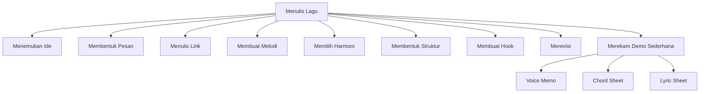
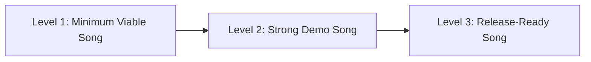
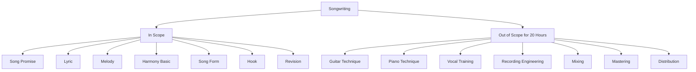
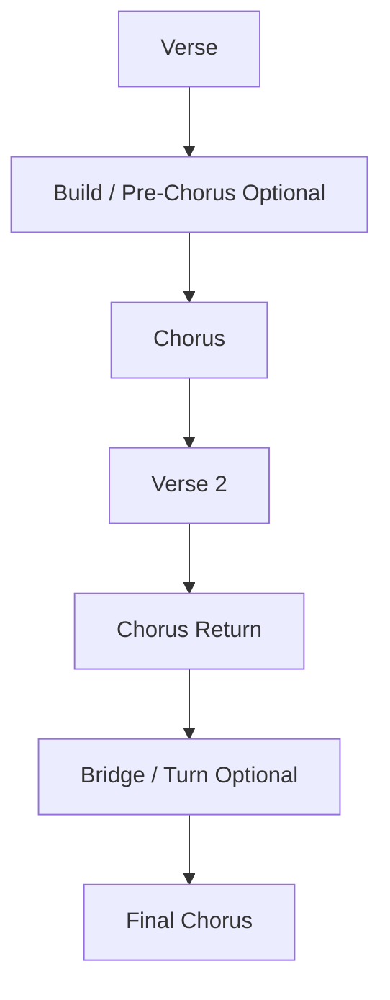
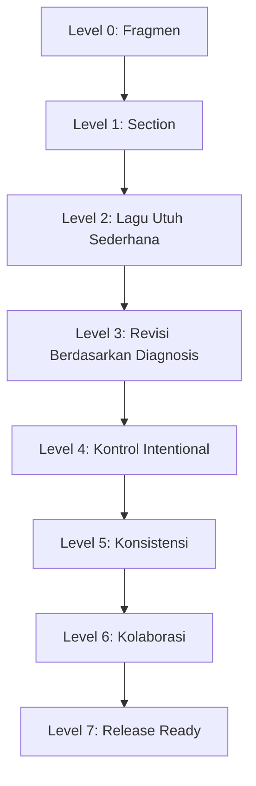
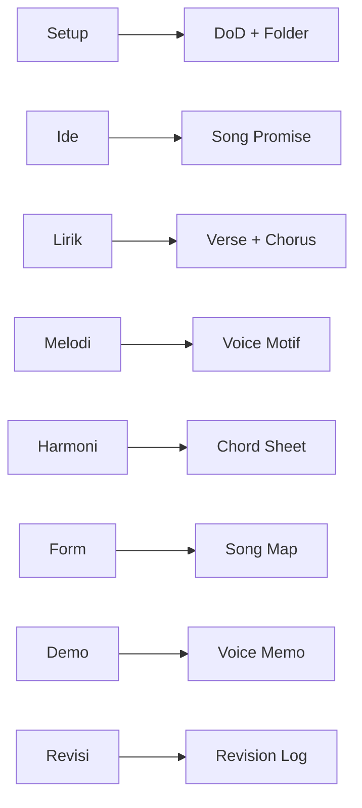
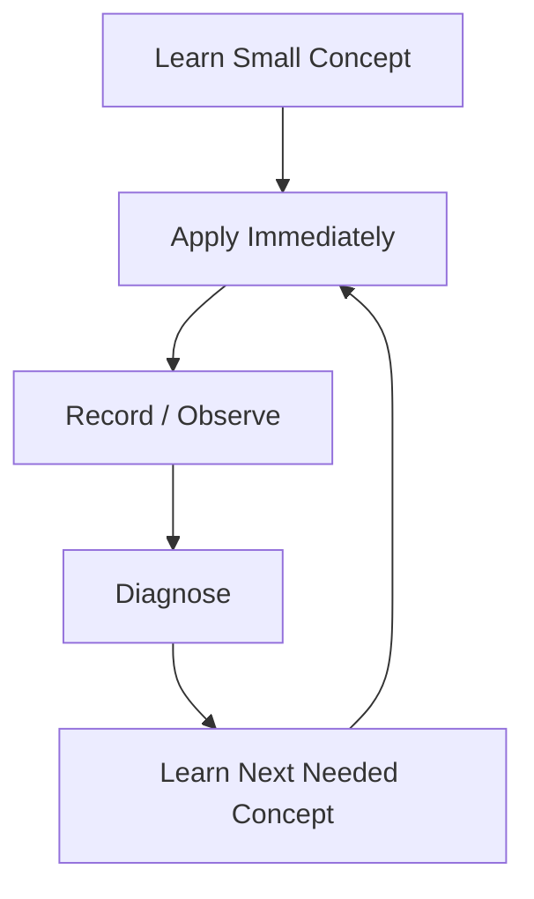
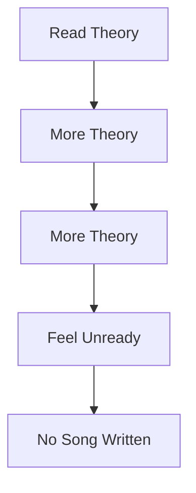
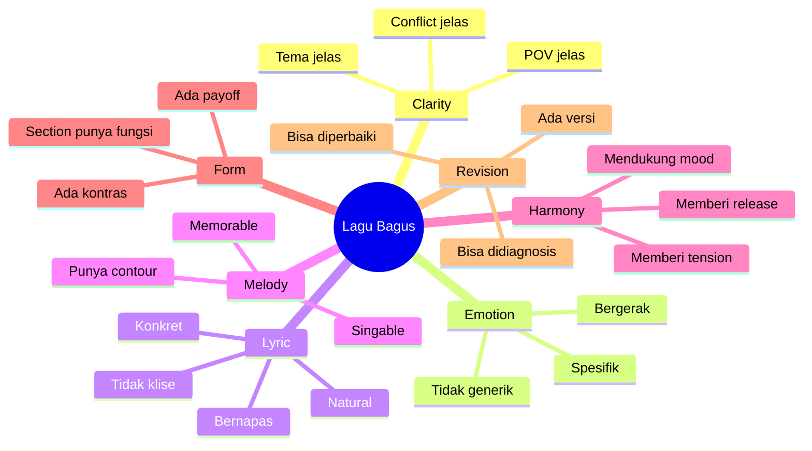

# learn-songwriting-part-002.md

# Target Performance Level: Mendefinisikan “Bisa Menulis Lagu” secara Operasional

> Seri: `learn-songwriting`  
> Part: `002 / 034`  
> Fokus: menentukan target performa songwriting yang spesifik, realistis, dan bisa diuji  
> Status seri: belum selesai  
> Prasyarat: `learn-songwriting-part-000.md`, `learn-songwriting-part-001.md`

---

## Ringkasan Part Ini

Part ini membahas pertanyaan penting:

> “Dalam 20 jam pertama, apa arti realistis dari *bisa menulis lagu*?”

Pertanyaan ini wajib dijawab sejak awal, karena tanpa target performa yang jelas, belajar songwriting akan melebar ke terlalu banyak arah:

- belajar teori musik terlalu dalam;
- belajar produksi musik;
- belajar mixing;
- belajar teknik vokal;
- belajar gitar/piano lagi;
- mengejar lagu yang terdengar seperti rilisan profesional;
- terlalu lama mencari inspirasi;
- terlalu lama memperbaiki satu baris;
- tidak pernah menyelesaikan lagu.

Dalam framework Josh Kaufman, target awal harus cukup spesifik sehingga kita bisa memecah skill dan mulai latihan. Bukan target abstrak seperti:

```text
Saya ingin jago menulis lagu.
```

Tetapi target operasional seperti:

```text
Dalam 20 jam, saya ingin mampu menulis satu lagu utuh berdurasi 2–4 menit,
dengan lirik lengkap, melodi utama yang bisa dinyanyikan,
struktur verse/chorus jelas, hook yang bisa diingat,
chord dasar, dan voice memo sederhana.
```

Target seperti ini bisa diuji.

Part ini akan menghasilkan **Definition of Done** untuk lagu pertama.

---

## Tujuan Part

Setelah menyelesaikan part ini, kamu harus bisa:

1. Mendefinisikan “bisa menulis lagu” secara konkret.
2. Memisahkan songwriting dari performance, arrangement, production, dan mixing.
3. Menentukan level performa yang realistis untuk 20 jam pertama.
4. Menyusun acceptance criteria untuk lagu pertama.
5. Membuat batasan scope agar tidak over-engineering.
6. Membuat rubrik evaluasi Minimum Viable Song.
7. Memutuskan apa yang termasuk “cukup selesai” dan apa yang harus ditunda.
8. Menyiapkan target latihan untuk part-part berikutnya.

---

## Kenapa Target Performance Level Penting?

Dalam banyak skill kreatif, pemula gagal bukan karena tidak punya ide, tetapi karena targetnya kabur.

Target kabur:

```text
Saya ingin menulis lagu yang bagus.
```

Masalah:

- “bagus” menurut siapa?
- bagus untuk dinyanyikan sendiri?
- bagus untuk demo?
- bagus untuk rilis Spotify?
- bagus secara lirik?
- bagus secara melodi?
- bagus secara produksi?
- bagus secara emosional?
- bagus secara teknis?
- bagus dibanding lagu profesional?

Karena targetnya tidak jelas, setiap kali draft muncul, otak membandingkannya dengan lagu profesional yang sudah melalui:

- songwriter berpengalaman;
- arranger;
- producer;
- session musician;
- vocal director;
- mixing engineer;
- mastering engineer;
- label feedback;
- puluhan revisi.

Perbandingan itu tidak adil.

Dalam 20 jam pertama, targetnya bukan lagu final industri. Targetnya adalah **kemampuan dasar menulis lagu utuh**.

---

## Prinsip Kaufman: Define the Target Performance Level

Kaufman menekankan bahwa sebelum belajar skill, kita harus tahu performa seperti apa yang ingin dicapai.

Untuk songwriting, ini berarti:

```text
Jangan mulai dari:
"Saya ingin jadi songwriter hebat."

Mulai dari:
"Saya ingin bisa membuat satu lagu utuh yang bisa dinyanyikan,
punya struktur jelas, dan bisa dievaluasi untuk direvisi."
```

Skill besar harus dipersempit menjadi performa yang dapat dilakukan.

Bukan:

```text
learn songwriting
```

Tetapi:

```text
write a complete minimum viable song
```

Ini seperti engineering. Kamu tidak memulai project dengan:

```text
buat platform terbaik
```

Kamu mulai dengan:

```text
buat vertical slice yang bisa dipakai,
punya authentication sederhana,
satu use case utama,
logging minimal,
dan acceptance test.
```

Dalam songwriting, vertical slice-nya adalah satu lagu utuh versi sederhana.

---

## Songwriting Bukan Satu Skill Tunggal

Sebelum mendefinisikan target, kita perlu memahami bahwa “menulis lagu” bukan satu skill.



Setiap sub-skill bisa dipelajari mendalam. Tapi untuk 20 jam pertama, kita tidak boleh memperdalam semuanya secara maksimal. Kita hanya perlu cukup untuk menghasilkan lagu utuh.

Kuncinya:

```text
Breadth first, then depth.
```

Untuk lagu pertama:

- cukup mengerti ide;
- cukup membuat lirik yang bisa dinyanyikan;
- cukup membuat melodi yang punya bentuk;
- cukup memakai chord yang mendukung;
- cukup punya struktur;
- cukup merevisi bagian paling rusak.

Kata “cukup” sangat penting. 20 jam pertama adalah fase **functional competence**, bukan mastery.

---

## Tiga Level Target dalam Songwriting

Agar tidak salah target, kita pisahkan menjadi tiga level.



### Level 1: Minimum Viable Song

Ini target 20 jam pertama.

Karakteristik:

- lirik lengkap;
- melodi utama ada;
- chord dasar ada;
- struktur jelas;
- bisa dinyanyikan dari awal sampai akhir;
- ada satu hook;
- ada rekaman voice memo;
- ada catatan revisi.

Belum perlu:

- produksi lengkap;
- intro/outro rumit;
- mixing;
- mastering;
- aransemen detail;
- vokal sempurna;
- modulasi kompleks;
- bridge wajib;
- kualitas rilis profesional.

### Level 2: Strong Demo Song

Ini target setelah beberapa lagu.

Karakteristik:

- chorus kuat;
- verse memberi detail yang hidup;
- prosodi cukup natural;
- arrangement sketch mendukung;
- ada dinamika antar section;
- lagu punya identitas;
- bisa dimainkan/dipresentasikan kepada orang lain.

Belum tentu release-ready, tetapi sudah layak didemokan.

### Level 3: Release-Ready Song

Ini target lebih lanjut.

Karakteristik:

- lirik final;
- melodi final;
- arrangement matang;
- produksi lengkap;
- performance vokal/instrumen kuat;
- mixing/mastering;
- metadata;
- strategi rilis;
- mungkin melibatkan kolaborator.

Ini bukan target seri 20 jam pertama.

---

## Target Seri Ini

Target utama seri `learn-songwriting` adalah:

```text
Mampu menulis satu lagu utuh dari nol sampai Minimum Viable Song,
dengan sistem kerja yang bisa diulang untuk lagu berikutnya.
```

Lebih spesifik:

```text
Saya mampu mengambil satu ide emosional,
mengubahnya menjadi song promise,
menentukan POV dan constraint,
menulis lirik verse/chorus,
membuat melodi utama yang bisa dinyanyikan,
memilih chord dasar,
menyusun struktur lagu,
merekam voice memo,
mendiagnosis kelemahan,
dan melakukan minimal satu siklus revisi.
```

Output akhir:

```text
1. lyric sheet
2. chord sheet
3. song map
4. voice memo sederhana
5. revision log
```

---

## Apa yang Tidak Menjadi Target 20 Jam Pertama?

Ini penting.

Dalam 20 jam pertama, kita **tidak** sedang mengejar:

| Bukan Target | Kenapa Ditunda |
|---|---|
| Menulis lagu masterpiece | Terlalu berat untuk skill acquisition awal |
| Menjadi producer | Itu skill berbeda |
| Mixing/mastering | Itu domain audio engineering |
| Vocal performance sempurna | Sudah ada seri performance terpisah |
| Gitar/piano accompaniment detail | Sudah dipelajari di seri lain |
| Teori musik akademik penuh | Banyak yang belum langsung dibutuhkan |
| Menulis semua genre | Terlalu luas |
| Meniru kualitas artis besar | Tidak adil untuk 20 jam pertama |
| Membuat lagu viral | Banyak faktor eksternal |
| Menulis 10 lagu sekaligus | Lebih baik satu lagu selesai dulu |

Kalimat kuncinya:

```text
Songwriting first. Everything else later.
```

---

## Scope Boundary: Songwriting vs Skill Lain

Karena kamu sudah menyelesaikan `learn-guitar-performance` dan `learn-piano-vocal-performance`, seri ini tidak akan mengulang materi performance.

Kita perlu membuat batas yang jelas.



### In Scope

Yang akan dikerjakan:

- menentukan pesan lagu;
- menulis lirik;
- menyusun section;
- membuat melodi kasar;
- memilih chord dasar;
- menulis hook;
- mengevaluasi prosodi;
- revisi lagu.

### Out of Scope

Yang tidak akan dibahas mendalam:

- teknik picking gitar;
- voicing piano rumit;
- teknik napas vokal;
- EQ, compression, reverb;
- mastering loudness;
- DAW workflow detail;
- distribusi digital;
- marketing lagu.

Boleh memakai gitar/piano sebagai alat bantu, tetapi bukan fokus.

---

## Definisi “Bisa Menulis Lagu”

Untuk seri ini, definisi operasionalnya:

```text
Seseorang dianggap mulai bisa menulis lagu jika ia mampu menghasilkan lagu utuh
yang bisa dinyanyikan dari awal sampai akhir,
memiliki struktur yang dapat dikenali,
memiliki lirik yang mendukung satu ide emosional,
memiliki melodi utama,
memiliki harmoni dasar,
dan bisa direvisi berdasarkan diagnosis yang jelas.
```

Definisi ini terdiri dari beberapa komponen.

---

## Komponen 1: Lagu Utuh

Lagu utuh minimal punya:

```text
Verse 1
Chorus
Verse 2
Chorus
```

Bisa ditambah:

```text
Intro
Pre-chorus
Bridge
Outro
```

Tetapi tidak wajib untuk Minimum Viable Song.

### Kenapa Lagu Utuh Penting?

Karena banyak pemula punya banyak fragmen:

- satu baris bagus;
- satu hook menarik;
- satu chord progression;
- satu melodi pendek;
- satu ide cerita.

Tetapi skill songwriting sebenarnya diuji ketika kamu harus menyelesaikan hubungan antarbagian.

Fragmen belum memaksa kamu menjawab:

- bagaimana verse 1 menuju chorus?
- apa yang berubah di verse 2?
- apakah chorus tetap berarti setelah diulang?
- apakah lagu punya akhir?
- apakah emosi bergerak?

Maka target 20 jam harus memaksa lagu utuh.

---

## Komponen 2: Bisa Dinyanyikan

Lirik yang bagus di halaman belum tentu bagus saat dinyanyikan.

Lagu dianggap bisa dinyanyikan jika:

- baris tidak terlalu panjang;
- ada tempat napas;
- suku kata tidak bertabrakan dengan ritme;
- kata penting mendapat tekanan;
- vowel pada nada panjang nyaman;
- melodi tidak terlalu sulit untuk range penyanyi;
- chorus bisa diulang tanpa terasa canggung.

Contoh lirik yang mungkin bagus dibaca tetapi berat dinyanyikan:

```text
Di antara kebisingan kota yang melahap sisa-sisa kesadaranku tentangmu
```

Masalah:

- terlalu panjang;
- terlalu banyak konsonan;
- terlalu konseptual;
- napas sulit;
- sulit membuat melodi natural.

Versi lebih singable:

```text
Kota ribut
aku tetap dengar namamu
```

Lebih pendek. Lebih jelas. Lebih bisa dinyanyikan.

---

## Komponen 3: Struktur Dapat Dikenali

Minimum Viable Song tidak harus mengikuti formula pop secara kaku, tetapi pendengar harus bisa merasakan bagian-bagiannya.

Contoh struktur sederhana:

```text
Verse 1
Chorus
Verse 2
Chorus
Bridge
Final Chorus
```

Atau:

```text
Verse 1
Refrain
Verse 2
Refrain
Verse 3
Refrain
```

Atau:

```text
Intro
Verse
Pre-Chorus
Chorus
Verse
Pre-Chorus
Chorus
Outro
```

Yang penting bukan nama section, tetapi fungsinya.



Struktur membantu pendengar menavigasi lagu.

Tanpa struktur, lagu bisa terasa seperti catatan harian yang diberi nada.

---

## Komponen 4: Satu Ide Emosional

Lagu pertama harus punya satu pusat.

Bukan:

```text
Lagu tentang cinta, politik, masa kecil, trauma, Tuhan, dan urban loneliness.
```

Tetapi:

```text
Lagu tentang seseorang yang masih menyiapkan satu gelas untuk orang yang sudah pergi.
```

Atau:

```text
Lagu tentang pekerja yang merasa hidupnya habis di notifikasi kerja.
```

Atau:

```text
Lagu tentang orang yang memaki pemimpin lewat metafora kekasih yang terus bepergian.
```

Satu ide emosional bukan berarti lagu dangkal. Justru dengan satu pusat, lagu bisa lebih dalam.

---

## Komponen 5: Melodi Utama

Minimum Viable Song harus punya melodi utama.

Tidak cukup hanya:

```text
lirik + chord
```

Karena lagu hidup dari bagaimana kata-kata diberi nada.

Melodi utama minimal meliputi:

- melodi verse;
- melodi chorus;
- motif hook;
- range yang masuk akal;
- kontur yang berbeda antara verse dan chorus.

Tidak harus ditulis not balok.

Boleh direkam sebagai voice memo.

Boleh ditulis dengan notasi kasar:

```text
Verse: rendah, sempit, banyak nada berulang
Chorus: naik di kata "pulang", lebih panjang di akhir baris
```

Atau:

```text
Hook: 4 nada, naik-naik-tahan-turun
```

---

## Komponen 6: Harmoni Dasar

Harmoni dasar berarti chord cukup untuk mendukung lagu.

Tidak perlu rumit.

Target minimal:

```text
Verse progression:
Chorus progression:
Key sementara:
```

Contoh:

```text
Key: C major
Verse: C - G - Am - F
Chorus: F - G - C - Am
```

Atau:

```text
Key: A minor
Verse: Am - F - C - G
Chorus: F - G - Am - Am
```

Yang penting:

- chord membantu mood;
- chord memberi tempat untuk melodi;
- chorus terasa punya release atau penegasan;
- progression bisa dimainkan sederhana.

Harmoni akan dibahas lebih jauh di part khusus. Di part ini kita hanya menentukan target minimal.

---

## Komponen 7: Bisa Direvisi

Ini sering diabaikan.

Lagu pertama bukan hanya harus “ada”, tetapi harus bisa direvisi.

Artinya kamu punya:

- lyric sheet;
- voice memo;
- catatan bagian lemah;
- feedback;
- versi draft;
- keputusan revisi.

Tanpa dokumentasi, revisi hanya terasa seperti mengulang dari nol.

Dalam engineering:

```text
no logs, no diagnosis
```

Dalam songwriting:

```text
no recording, no real revision
```

Kamu harus mendengar lagu sebagai pendengar, bukan hanya mengingatnya sebagai penulis.

---

## Minimum Viable Song: Acceptance Criteria

Berikut acceptance criteria untuk 20 jam pertama.

```markdown
# Minimum Viable Song Acceptance Criteria

## Identity
- [ ] Punya judul sementara.
- [ ] Punya song promise satu kalimat.
- [ ] Punya POV yang konsisten.
- [ ] Punya tema yang tidak melebar.

## Lyric
- [ ] Punya lirik lengkap minimal verse 1, chorus, verse 2, chorus.
- [ ] Setiap verse punya minimal satu detail konkret.
- [ ] Chorus menyatakan inti emosi atau hook.
- [ ] Tidak semua baris hanya menjelaskan emosi secara abstrak.
- [ ] Ada minimal satu baris yang terasa memorable.

## Singability
- [ ] Lirik bisa dinyanyikan tanpa tersandung parah.
- [ ] Ada tempat napas.
- [ ] Baris chorus tidak terlalu panjang.
- [ ] Kata penting mendapat tekanan musikal.
- [ ] Rima tidak merusak makna.

## Melody
- [ ] Ada melodi verse.
- [ ] Ada melodi chorus.
- [ ] Chorus berbeda dari verse.
- [ ] Ada motif/hook yang diulang.
- [ ] Range masih bisa dinyanyikan.

## Harmony
- [ ] Ada chord dasar untuk verse.
- [ ] Ada chord dasar untuk chorus.
- [ ] Chord mendukung mood.
- [ ] Chord cukup sederhana untuk dipakai sebagai sketsa.

## Form
- [ ] Struktur lagu jelas.
- [ ] Verse 2 tidak hanya mengulang informasi verse 1.
- [ ] Chorus bisa kembali dengan wajar.
- [ ] Lagu punya awal dan akhir.

## Revision
- [ ] Ada voice memo.
- [ ] Ada minimal satu review setelah didengar ulang.
- [ ] Ada minimal satu revisi berdasarkan diagnosis.
- [ ] Ada catatan masalah yang belum diselesaikan.

## Done
- [ ] Lagu bisa dinyanyikan dari awal sampai akhir.
- [ ] Lagu bisa dijelaskan dalam satu kalimat.
- [ ] Lagu punya bagian yang layak dikembangkan lebih lanjut.
```

---

## Definition of Done untuk Lagu Pertama

Gunakan DoD berikut.

```text
Lagu pertama dianggap selesai untuk fase 20 jam jika:

1. Saya bisa menyanyikannya dari awal sampai akhir tanpa berhenti.
2. Saya punya lyric sheet lengkap.
3. Saya punya chord dasar.
4. Saya punya rekaman voice memo.
5. Saya bisa menjelaskan lagu ini tentang apa dalam satu kalimat.
6. Saya bisa menunjuk bagian hook.
7. Saya bisa menunjuk bagian yang paling lemah.
8. Saya sudah melakukan minimal satu revisi.
9. Saya tahu apa yang akan diperbaiki jika lagu ini dikembangkan ke versi demo.
```

Perhatikan poin 7 dan 9. Lagu selesai bukan berarti sempurna. Lagu selesai berarti cukup stabil untuk dievaluasi sebagai satu unit.

---

## Non-Goals: Apa yang Sengaja Tidak Dikejar?

Tuliskan non-goals agar kamu tidak melebar.

```markdown
# Non-Goals 20 Jam Pertama

Saya tidak sedang mengejar:

- produksi profesional;
- mixing;
- mastering;
- aransemen band lengkap;
- teknik vokal sempurna;
- chord jazz kompleks;
- modulasi rumit;
- video musik;
- distribusi;
- branding artis;
- lagu viral;
- validasi publik luas;
- menulis 10 lagu;
- menulis semua genre;
- membuat karya terbaik seumur hidup.
```

Kenapa ini penting?

Karena setiap non-goal yang tidak ditulis akan diam-diam masuk ke scope.

Dalam project software, scope creep membunuh delivery.

Dalam songwriting, scope creep membunuh penyelesaian.

---

## Target yang Terlalu Rendah vs Terlalu Tinggi

### Terlalu Rendah

```text
Saya hanya ingin menulis beberapa baris lirik.
```

Masalah:

- tidak melatih struktur;
- tidak melatih chorus;
- tidak melatih penyelesaian;
- tidak melatih revisi lagu utuh.

### Terlalu Tinggi

```text
Saya ingin membuat lagu siap rilis profesional dalam 20 jam.
```

Masalah:

- terlalu banyak domain;
- membuat frustrasi;
- membandingkan diri dengan output industri;
- membuat proses belajar kacau.

### Target Tepat

```text
Saya ingin membuat satu Minimum Viable Song yang utuh,
bisa dinyanyikan, punya hook,
dan punya catatan revisi jelas.
```

Ini cukup menantang, tapi realistis.

---

## Performance Level Ladder

Gunakan tangga berikut untuk mengukur perkembangan.

| Level | Nama | Ciri |
|---:|---|---|
| 0 | Fragment Collector | Punya ide/baris/chord, tapi belum bisa menyelesaikan lagu |
| 1 | Section Writer | Bisa menulis verse atau chorus, tapi belum menyatukan |
| 2 | Minimum Viable Songwriter | Bisa menyelesaikan lagu utuh sederhana |
| 3 | Revising Songwriter | Bisa mendiagnosis dan merevisi lagu |
| 4 | Intentional Songwriter | Bisa mengendalikan POV, hook, form, emotional movement |
| 5 | Consistent Songwriter | Bisa menulis banyak lagu dengan kualitas stabil |
| 6 | Collaborative Songwriter | Bisa menulis bersama orang lain dan menerima constraint eksternal |
| 7 | Release-Level Songwriter | Bisa membuat lagu yang siap diproduksi/rilis secara serius |

Target 20 jam:

```text
Level 2, dengan mulai masuk Level 3.
```

Bukan Level 7.

---

## Maturity Model Songwriting



Di seri ini:

- part 000–005 membantu naik dari Level 0 ke Level 1;
- part 006–017 membangun lyric/intent;
- part 018–023 membangun melody/harmony;
- part 024–030 membangun full song;
- part 031–034 membangun revisi dan capstone.

---

## KPI Songwriting 20 Jam

Karena kamu terbiasa dengan engineering dan delivery, kita bisa gunakan KPI, tetapi hati-hati: KPI tidak boleh membunuh rasa.

Gunakan KPI sebagai alat observasi.

| KPI | Target 20 Jam |
|---|---:|
| Ide lagu mentah | 20 |
| Song promise | 5 |
| Judul kandidat | 30 |
| Hook kandidat | 20 |
| Verse draft | 4 |
| Chorus draft | 4 |
| Melodi hook | 5 |
| Full song draft | 1 |
| Voice memo | minimal 5 |
| Revision pass | minimal 3 |
| Lagu selesai MVS | 1 |

KPI ini mengarah pada volume latihan, bukan jaminan kualitas.

Prinsip:

```text
Quality emerges from selected quantity.
```

Kamu tidak bisa memilih baris terbaik jika hanya menulis satu baris.

---

## Time Budget 20 Jam

Berikut alokasi waktu yang lebih operasional.

| Fase | Jam | Aktivitas | Output |
|---|---:|---|---|
| Setup | 0–1 | Workspace, target, DoD | Folder + canvas |
| Reference Deconstruction | 1–2.5 | Analisis 3 lagu | Reference notes |
| Song Promise | 2.5–4 | Generate ide dan pilih arah | 5 promise, 1 dipilih |
| Lyric Raw Material | 4–6 | Object writing, line generation | 30–50 baris |
| Verse Drafting | 6–7.5 | Verse 1 dan verse 2 | 2 verse kasar |
| Chorus Drafting | 7.5–9 | Hook dan chorus | 3 chorus kandidat |
| Prosody Pass | 9–10 | Potong suku kata, napas | Lyric lebih singable |
| Melody Sketch | 10–12 | Motif verse/chorus | 3 melodi kasar |
| Harmony Sketch | 12–13 | Chord dasar | Verse/chorus progression |
| Form Assembly | 13–14.5 | Gabungkan lagu | Full draft v0.1 |
| Voice Memo | 14.5–15 | Rekam | Audio kasar |
| Diagnostic Listening | 15–16 | Catat masalah | Diagnosis |
| Revision Pass 1 | 16–17 | Macro revision | v0.2 |
| Revision Pass 2 | 17–18 | Lyric/prosody revision | v0.3 |
| Revision Pass 3 | 18–19 | Hook/melody revision | v0.4 |
| Final MVS | 19–20 | Rapikan sheet + rekam ulang | MVS lengkap |

Ini bukan jadwal kaku. Ini guardrail.

---

## Output per Fase



---

## Menghindari “Belajar Terlalu Banyak Sebelum Praktik”

Salah satu prinsip penting Kaufman adalah belajar secukupnya untuk mulai mengoreksi diri, bukan belajar teori tanpa praktik.

Untuk songwriting, ini berarti:

```text
Tidak perlu membaca 10 buku songwriting sebelum menulis chorus pertama.
Tidak perlu menguasai semua mode, scale, cadence, dan counterpoint.
Tidak perlu tahu semua jenis rhyme.
Tidak perlu produksi penuh.
```

Yang perlu diketahui dulu:

- apa fungsi verse;
- apa fungsi chorus;
- apa itu hook;
- kenapa prosodi penting;
- bagaimana membuat baris lebih singable;
- bagaimana melodi mengikuti tekanan kata;
- bagaimana chord mendukung mood;
- bagaimana mendengar ulang dan merevisi.

Setelah itu, praktik.

Learning loop-nya:



Bukan:



---

## “Bagus” Dipecah Menjadi Dimensi yang Bisa Dilatih

Kita tidak akan mengejar “bagus” secara global. Kita pecah.



Setiap part berikutnya akan memperbaiki satu dimensi.

---

## Acceptance Test Lagu

Dalam software, acceptance test menjawab:

```text
Apakah fitur memenuhi kebutuhan user?
```

Dalam songwriting:

```text
Apakah lagu memenuhi janji emosionalnya?
```

Contoh acceptance test untuk lagu pertama:

```gherkin
Feature: Minimum Viable Song

Scenario: Lagu bisa dikenali sebagai lagu utuh
  Given saya punya lyric sheet dan chord sheet
  When saya menyanyikannya dari awal sampai akhir
  Then lagu tidak berhenti di tengah
  And struktur verse dan chorus terdengar jelas

Scenario: Lagu punya emotional promise
  Given pendengar membaca atau mendengar lagu
  When ditanya "lagu ini tentang apa?"
  Then mereka bisa menjawab dalam satu kalimat yang mendekati intent saya

Scenario: Chorus berfungsi
  Given pendengar mendengar chorus dua kali
  When diminta menyebut bagian yang paling diingat
  Then mereka bisa menyebut hook atau frasa utama

Scenario: Lirik bisa dinyanyikan
  Given saya menyanyikan lagu dengan tempo target
  When mencapai setiap akhir baris
  Then saya tidak kehabisan napas secara konsisten
  And kata penting tidak terdengar hilang
```

Ini tidak membuat songwriting jadi mekanis. Ini hanya membuat targetnya bisa diamati.

---

## Done vs Perfect

Perbedaan penting:

| Done | Perfect |
|---|---|
| Bisa dinyanyikan utuh | Semua orang harus suka |
| Punya struktur jelas | Struktur paling original |
| Ada hook | Hook viral |
| Ada revisi | Tidak ada kekurangan |
| Bisa dievaluasi | Tidak bisa dikritik |
| Siap jadi bahan demo | Siap rilis global |

20 jam pertama mengejar **done**, bukan perfect.

Kamu tidak bisa memperbaiki lagu yang tidak pernah selesai.

---

## Quality Bar Minimum

Tetapkan quality bar minimum:

```text
Saya tidak akan menganggap lagu selesai jika:
```

- tidak punya chorus/refrain/hook;
- hanya berupa puisi tanpa melodi;
- tidak bisa dinyanyikan utuh;
- tidak punya voice memo;
- tidak ada revisi;
- saya tidak bisa menjelaskan lagu ini tentang apa;
- semua baris masih abstrak;
- tidak ada bagian yang ingin diulang.

Ini adalah gate.

---

## Quality Bar Maksimum

Ini terdengar aneh, tapi perlu.

```text
Saya tidak akan menuntut lagu pertama untuk:
```

- terdengar seperti artis profesional;
- punya produksi penuh;
- punya lirik sempurna;
- punya melodi terbaik;
- bebas dari semua cliché;
- membuat semua pendengar menangis;
- menjadi karya paling personal dan final.

Quality bar maksimum mencegah perfeksionisme.

---

## Target Lagu Pertama: Spesifikasi Teknis

Gunakan spesifikasi ini.

```yaml
song:
  target_level: "Minimum Viable Song"
  duration: "2-4 minutes"
  language: "Indonesian or bilingual, but choose one dominant language"
  structure:
    required:
      - verse_1
      - chorus
      - verse_2
      - chorus_repeat
    optional:
      - intro
      - pre_chorus
      - bridge
      - outro
  lyric:
    required:
      - complete_lines
      - consistent_pov
      - at_least_3_concrete_images
      - one_hook_phrase
      - breath_marks
  melody:
    required:
      - verse_melody
      - chorus_melody
      - identifiable_hook_motif
    optional:
      - bridge_melody
  harmony:
    required:
      - key_or_tonal_center
      - chord_progression_for_verse
      - chord_progression_for_chorus
  demo:
    required:
      - voice_memo
      - lyric_sheet
      - chord_sheet
      - revision_log
  revision:
    minimum_passes:
      - macro_structure
      - lyric_prosody
      - hook_melody
```

---

## Lagu Pertama Sebaiknya Genre Apa?

Untuk 20 jam pertama, pilih genre yang:

- kamu sering dengar;
- punya struktur cukup jelas;
- bisa dimainkan sederhana;
- tidak terlalu bergantung pada produksi;
- tidak menuntut teknik vokal ekstrem;
- tidak terlalu kompleks secara harmoni;
- cocok dengan emosi yang ingin kamu tulis.

Rekomendasi awal:

| Genre / Mode | Cocok untuk Pemula? | Catatan |
|---|---:|---|
| Acoustic ballad | Ya | Fokus kuat pada lirik dan melodi |
| Pop sederhana | Ya | Struktur jelas, hook penting |
| Folk/storytelling | Ya | Bagus untuk narasi dan detail |
| Dark cinematic ballad | Ya, jika dibatasi | Cocok untuk emosi tebal, tapi jangan terlalu panjang |
| Rock anthem | Menengah | Butuh energy shaping |
| R&B kompleks | Menengah–sulit | Prosodi dan melisma lebih menuntut |
| Rap | Menengah | Lirik/flow sangat intensif |
| Jazz song | Sulit | Harmoni bisa menyita fokus |
| EDM/drop-based | Bukan prioritas | Produksi terlalu dominan |

Untuk konteks seri ini, pilihan paling efisien:

```text
lyric-driven pop / acoustic ballad / cinematic ballad sederhana
```

Karena tujuan utama adalah menulis lagu, bukan produksi.

---

## Bahasa Lagu: Indonesia, Inggris, atau Campuran?

Untuk latihan awal, pilih satu bahasa dominan.

Jika kamu ingin menulis lagu Indonesia, fokus pada:

- suku kata bahasa Indonesia;
- tekanan frasa natural;
- rima yang tidak memaksa;
- diksi yang tidak terlalu baku;
- kejelasan vokal;
- pengulangan frasa yang terdengar manusiawi.

Jika menulis bahasa Inggris, tantangannya:

- stress pattern lebih kuat;
- vowel placement penting;
- idiom harus natural;
- risiko terdengar terjemahan.

Untuk 20 jam pertama, disarankan:

```text
Gunakan bahasa yang paling dekat dengan emosi yang ingin kamu tulis.
```

Jika ide emosinya datang dalam bahasa Indonesia, jangan dipaksa ke Inggris.

---

## Target Persona Penulis

Songwriting bukan hanya tentang skill teknis. Kamu juga perlu tahu persona kreatif yang ingin kamu latih.

Untuk lagu pertama, pilih salah satu mode:

| Mode | Deskripsi | Cocok Jika |
|---|---|---|
| Confessional | Aku mengaku sesuatu | Ingin lagu personal |
| Observational | Aku melihat kejadian/orang | Ingin lebih sinematik |
| Narrative | Ada cerita bergerak | Ingin storytelling |
| Dialogic | Ada percakapan aku-kamu | Ingin drama |
| Satirical | Kritik dibungkus metafora | Ingin tajam tapi tidak vulgar |
| Mythic | Emosi dibesarkan jadi simbol | Ingin epik/teatrikal |
| Minimalist | Sedikit kata, banyak ruang | Ingin intim |

Untuk 20 jam pertama, jangan gabungkan terlalu banyak mode.

Contoh target:

```text
Saya akan menulis lagu confessional-observational,
bukan satirical-mythic-narrative sekaligus.
```

---

## Target Emotional Complexity

Lagu pertama tidak perlu punya emosi rumit. Tapi emosinya harus spesifik.

Buruk:

```text
sedih
```

Lebih baik:

```text
sedih karena masih berharap pada sesuatu yang secara logis sudah selesai
```

Buruk:

```text
marah
```

Lebih baik:

```text
marah karena orang yang seharusnya hadir justru selalu punya alasan untuk pergi
```

Buruk:

```text
cinta
```

Lebih baik:

```text
cinta yang malu mengakui bahwa ia butuh dibalas
```

Template:

```text
[emosi utama] karena [situasi spesifik] tetapi [konflik batin].
```

Contoh:

```text
Rindu karena seseorang pergi, tetapi aku terlalu gengsi untuk mengaku menunggu.
```

Atau:

```text
Marah karena dikhianati, tetapi aku masih ingin orang itu pulang.
```

Ini akan menjadi target emosional lagu.

---

## Target Listener Experience

Lagu bukan hanya apa yang kamu tulis, tetapi apa yang dialami pendengar.

Tentukan pengalaman pendengar.

```markdown
## Listener Experience Target

Setelah mendengar lagu ini, pendengar idealnya merasa:
-

Mereka mungkin mengingat baris:
-

Mereka mungkin membayangkan gambar:
-

Mereka mungkin ingin mengulang bagian:
-

Mereka tidak harus:
-
```

Contoh:

```markdown
Setelah mendengar lagu ini, pendengar idealnya merasa:
- seperti melihat seseorang masih menunggu di rumah kosong.

Mereka mungkin mengingat baris:
- "gelasmu di rak kedua"

Mereka mungkin membayangkan gambar:
- dapur malam, satu gelas tidak dipakai.

Mereka mungkin ingin mengulang bagian:
- chorus yang menyebut "kau belum selesai".

Mereka tidak harus:
- tahu semua detail hubungan narator.
```

Ini membantu mengurangi kebutuhan menjelaskan terlalu banyak.

---

## Target Form untuk Lagu Pertama

Rekomendasi struktur:

```text
Verse 1
Chorus
Verse 2
Chorus
Bridge optional
Final Chorus
```

Atau kalau ingin lebih sederhana:

```text
Verse 1
Chorus
Verse 2
Chorus
```

### Fungsi Minimal Tiap Section

| Section | Fungsi |
|---|---|
| Verse 1 | Membuka scene dan situasi |
| Chorus | Menyatakan inti emosi/hook |
| Verse 2 | Memberi perkembangan atau detail baru |
| Chorus 2 | Mengulang inti dengan makna lebih kuat |
| Bridge | Memberi perubahan sudut atau reveal |
| Final Chorus | Menutup dengan penegasan |

---

## Target Ukuran Lagu

Untuk 20 jam pertama:

| Elemen | Target |
|---|---:|
| Durasi | 2–4 menit |
| Verse | 4–8 baris |
| Chorus | 2–6 baris |
| Bridge | 2–6 baris jika ada |
| Total lirik | 16–32 baris |
| Chord | 3–6 chord cukup |
| Hook phrase | 3–8 kata |
| Voice memo | 1–3 take cukup |

Jangan menulis lagu 7 menit dulu kecuali memang sangat perlu.

---

## Target Draft Versioning

Minimal:

```text
v0.1 raw draft
v0.2 structure revision
v0.3 lyric/prosody revision
v0.4 melody/hook revision
v1.0 Minimum Viable Song
```

Definisi:

| Versi | Fokus |
|---|---|
| v0.1 | Semua bagian ada, walau buruk |
| v0.2 | Struktur mulai jelas |
| v0.3 | Lirik lebih singable |
| v0.4 | Hook/melodi lebih kuat |
| v1.0 | Siap dianggap MVS |

---

## Target Feedback

Dalam 20 jam pertama, feedback tidak perlu dari banyak orang.

Target minimal:

- self-feedback melalui mendengar ulang;
- 1 orang pendengar jika memungkinkan;
- pertanyaan feedback spesifik.

Jangan tanya:

```text
Bagus nggak?
```

Tanya:

```text
Lagu ini menurutmu tentang apa?
Bagian mana yang paling kamu ingat?
Ada baris yang terdengar aneh?
Chorus terasa beda dari verse?
Ada bagian yang terasa terlalu panjang?
```

Feedback harus actionable.

---

## Feedback Acceptance Criteria

Feedback dianggap berguna jika menghasilkan salah satu dari:

- bagian yang perlu dipotong;
- baris yang perlu diperjelas;
- hook yang kurang diingat;
- POV yang membingungkan;
- chorus yang kurang naik;
- verse yang terlalu generik;
- melodi yang sulit dinyanyikan;
- bagian yang paling hidup dan harus dipertahankan.

Feedback yang tidak actionable:

```text
bagus
kurang enak
kurang vibe
biasa aja
```

Feedback seperti itu perlu ditanya ulang:

```text
Bagian mana tepatnya?
Apa yang kamu harapkan terjadi?
Apa yang kamu ingat setelah selesai?
```

---

## Risk Register 20 Jam Pertama

Gunakan risk register seperti project.

| Risiko | Gejala | Mitigasi |
|---|---|---|
| Overthinking | Banyak catatan, tidak ada lirik | Timer 30 menit generate |
| Scope creep | Mulai belajar mixing | Tulis di non-goals |
| Perfeksionisme | Tidak lanjut karena verse jelek | Izinkan v0.1 buruk |
| Template trap | Semua section terasa generik | Tulis fungsi tiap section |
| Rima paksa | Makna dikorbankan | Tulis tanpa rima dulu |
| Melodi datar | Semua baris range sama | Buat contour chorus naik |
| Lirik abstrak | Banyak kata emosi umum | Tambah objek/scene |
| Tidak selesai | Banyak fragmen | Pakai target MVS |
| Tidak ada revisi | Draft dianggap final | Wajib voice memo + diagnosis |
| Membandingkan dengan artis | Frustrasi | Bandingkan dengan draft sendiri |

---

## Trade-Off Utama

### 1. Sederhana vs Dangkal

Sederhana itu baik. Dangkal itu lemah.

Sederhana:

```text
Gelasmu di rak kedua
tak kupakai
tak kubuang
```

Dangkal:

```text
Aku sedih tanpamu
aku hancur tanpamu
```

Sederhana punya detail dan ruang.

Dangkal hanya memberi label emosi.

### 2. Puitis vs Singable

Lirik puitis belum tentu bisa dinyanyikan.

Jika harus memilih untuk lagu pertama:

```text
singable > puitis
```

Karena lagu adalah musik, bukan halaman.

### 3. Original vs Clear

Original penting, tetapi clarity lebih dulu.

Jika lirik terlalu unik sampai tidak bisa dipahami, lagu kehilangan pendengar.

Target awal:

```text
clear with some freshness
```

Bukan:

```text
so original nobody understands it
```

### 4. Emotional vs Melodramatic

Emotional:

```text
menunjukkan luka lewat detail
```

Melodramatic:

```text
menyebut luka dengan kata besar berkali-kali
```

Target:

```text
emotion through evidence
```

### 5. Finished vs Perfect

Finished memberi bahan evaluasi.

Perfect sering membuat tidak ada output.

Target:

```text
finished enough to revise
```

---

## Target Practice Environment

Agar target tercapai, siapkan environment.

```text
songwriting/
  00-roadmap/
  01-ideas/
  02-reference-deconstruction/
  03-drafts/
  04-voice-memos/
  05-revision-log/
  06-final-mvs/
```

File utama:

```text
songwriting-target-performance.md
songwriting-non-goals.md
songwriting-risk-register.md
songwriting-mvs-acceptance-criteria.md
```

Tools minimal:

- notes app atau markdown editor;
- voice recorder;
- metronome optional;
- instrumen sederhana optional;
- timer;
- headphone;
- folder audio.

Tidak perlu DAW di fase ini.

---

## Songwriting Target Contract

Buat kontrak belajar.

```markdown
# Songwriting Target Contract

## Target
Dalam 20 jam latihan terarah, saya akan menyelesaikan satu Minimum Viable Song.

## Output Wajib
- Lyric sheet lengkap
- Chord sheet dasar
- Melodi utama via voice memo
- Song promise
- Song map
- Revision log
- Minimal satu revisi setelah didengar ulang

## Scope
Saya fokus pada songwriting:
- ide
- lirik
- melodi
- harmoni dasar
- struktur
- hook
- revisi

Saya tidak fokus pada:
- produksi
- mixing
- mastering
- teknik gitar/piano detail
- teknik vokal detail
- distribusi
- lagu viral

## Definition of Done
Lagu dianggap selesai jika bisa dinyanyikan utuh,
memiliki struktur jelas,
punya hook,
punya voice memo,
dan sudah melalui minimal satu revisi.

## Quality Expectation
Saya tidak menuntut lagu pertama menjadi masterpiece.
Saya menuntut lagu pertama menjadi selesai, bisa dinyanyikan, dan bisa direvisi.

## Failure Policy
Draft buruk bukan kegagalan.
Tidak menulis adalah kegagalan.
Tidak merevisi adalah kegagalan.
Tidak menyelesaikan adalah kegagalan.
```

---

## Latihan Utama Part 002: Tulis Target Performance Level

Isi template berikut.

```markdown
# songwriting-practice-002-target-performance.md

## 1. Target Utama
Dalam 20 jam pertama, saya ingin mampu:

...

## 2. Minimum Viable Song Saya
Lagu saya harus punya:

- Judul sementara:
- Bahasa:
- Mood:
- Genre constraint:
- Struktur minimal:
- Durasi target:
- Hook:
- Voice memo:

## 3. Songwriting In Scope
Yang akan saya pelajari dan praktikkan:

-
-
-

## 4. Out of Scope
Yang tidak akan saya kejar dulu:

-
-
-

## 5. Definition of Done
Lagu dianggap selesai jika:

-
-
-

## 6. Quality Bar Minimum
Saya tidak akan menganggap lagu selesai jika:

-
-
-

## 7. Quality Bar Maximum
Saya tidak akan menuntut lagu pertama untuk:

-
-
-

## 8. Risk Register
Risiko terbesar saya:

| Risiko | Mitigasi |
|---|---|
| ... | ... |

## 9. Feedback Plan
Saya akan mengevaluasi lagu dengan cara:

-
-
-

## 10. Next Action
Setelah ini saya akan:

-
```

---

## Contoh Pengisian Target Performance

```markdown
# songwriting-practice-002-target-performance.md

## 1. Target Utama
Dalam 20 jam pertama, saya ingin mampu menulis satu lagu utuh berbahasa Indonesia
yang bisa dinyanyikan dari awal sampai akhir,
memiliki verse dan chorus yang jelas,
punya hook yang mudah diingat,
dan memiliki voice memo sederhana.

## 2. Minimum Viable Song Saya
Lagu saya harus punya:

- Judul sementara: belum final
- Bahasa: Indonesia
- Mood: intimate, dark, melancholic
- Genre constraint: acoustic/cinematic ballad sederhana
- Struktur minimal: verse 1 - chorus - verse 2 - chorus
- Durasi target: 2–4 menit
- Hook: satu frasa 3–7 kata yang diulang
- Voice memo: rekaman HP cukup

## 3. Songwriting In Scope
Yang akan saya pelajari dan praktikkan:

- song promise
- POV
- lirik natural
- melodi utama
- chord dasar
- struktur verse/chorus
- revisi

## 4. Out of Scope
Yang tidak akan saya kejar dulu:

- mixing
- mastering
- produksi DAW lengkap
- teknik vokal detail
- teknik gitar/piano detail
- lagu viral
- aransemen full band

## 5. Definition of Done
Lagu dianggap selesai jika:

- saya bisa menyanyikannya utuh;
- ada lyric sheet;
- ada chord sheet;
- ada voice memo;
- ada hook;
- ada minimal satu revisi;
- saya tahu bagian terlemahnya.

## 6. Quality Bar Minimum
Saya tidak akan menganggap lagu selesai jika:

- hanya berupa puisi tanpa melodi;
- tidak ada chorus/hook;
- tidak bisa dinyanyikan;
- tidak ada rekaman;
- tidak ada revisi.

## 7. Quality Bar Maximum
Saya tidak akan menuntut lagu pertama untuk:

- terdengar profesional;
- sempurna secara lirik;
- punya produksi lengkap;
- membuat semua orang suka;
- bebas dari semua kekurangan.

## 8. Risk Register

| Risiko | Mitigasi |
|---|---|
| Overthinking | Timer 30 menit generate tanpa edit |
| Scope creep | Baca ulang out-of-scope |
| Perfeksionisme | Simpan v0.1 walau buruk |
| Rima dipaksakan | Tulis versi tanpa rima dulu |
| Tidak selesai | Pakai struktur minimal |

## 9. Feedback Plan
Saya akan mengevaluasi lagu dengan cara:

- mendengar voice memo tanpa membaca lirik;
- menandai bagian yang terasa turun;
- meminta satu orang menyebut bagian yang paling diingat;
- mengecek apakah chorus bisa diulang.

## 10. Next Action
Setelah ini saya akan memilih satu tema emosional dan membuat 5 song promise.
```

---

## Latihan 20 Menit: Scope Lock

Ambil kertas atau file markdown. Tulis dua kolom.

```markdown
# Scope Lock

## Saya sedang belajar songwriting
Artinya saya akan mengerjakan:

1.
2.
3.
4.
5.

## Saya tidak sedang belajar produksi/performance
Artinya saya tidak akan mengerjakan dulu:

1.
2.
3.
4.
5.
```

Setelah menulis, baca ulang setiap kali tergoda membuka DAW, mencari plugin, atau memperbaiki voicing instrumen terlalu lama.

---

## Latihan 30 Menit: Acceptance Test Design

Tulis 5 test untuk lagu pertamamu.

Gunakan format:

```gherkin
Scenario:
Given
When
Then
```

Contoh:

```gherkin
Scenario: Pendengar memahami inti lagu
Given seseorang mendengar voice memo saya satu kali
When saya bertanya "lagu ini tentang apa?"
Then jawabannya masih berada di sekitar song promise saya
```

Buat test untuk:

1. clarity;
2. hook;
3. singability;
4. structure;
5. emotional movement.

---

## Latihan 45 Menit: Personal Failure Mode Analysis

Isi:

```markdown
# Personal Failure Mode Analysis

## Saya biasanya gagal menyelesaikan karya karena:
-

## Saat menulis, saya paling mungkin terjebak pada:
-

## Tanda awal saya mulai overthinking:
-

## Tanda awal saya mulai scope creep:
-

## Kalimat pengingat:
-

## Mitigasi konkret:
-
```

Contoh:

```markdown
## Saya biasanya gagal menyelesaikan karya karena:
Saya ingin semua konsep matang sebelum menulis.

## Saat menulis, saya paling mungkin terjebak pada:
Mencari metafora yang terlalu pintar.

## Tanda awal saya mulai overthinking:
Saya membaca artikel/teori lagi padahal belum menulis draft.

## Tanda awal saya mulai scope creep:
Saya mulai mencari plugin reverb atau chord voicing.

## Kalimat pengingat:
Tulis lagu dulu. Produksi nanti.

## Mitigasi konkret:
Setiap sesi harus menghasilkan minimal 5 baris atau 1 voice memo.
```

---

## Checklist Part 002

Sebelum lanjut ke part 003, pastikan kamu punya:

- [ ] Target performance level tertulis.
- [ ] Definition of Done lagu pertama.
- [ ] Minimum Viable Song acceptance criteria.
- [ ] Non-goals 20 jam pertama.
- [ ] Quality bar minimum.
- [ ] Quality bar maksimum.
- [ ] Risk register.
- [ ] Feedback plan.
- [ ] Scope lock.
- [ ] Rencana output akhir.

---

## Output Wajib Part 002

Buat file:

```text
songwriting-practice-002-target-performance.md
```

Isi minimal:

```markdown
# songwriting-practice-002-target-performance.md

## Target Utama
...

## Minimum Viable Song Definition
...

## In Scope
...

## Out of Scope
...

## Definition of Done
...

## Acceptance Criteria
...

## Risk Register
...

## Feedback Plan
...

## Next Action
...
```

---

## Common Failure Modes di Part Ini

### 1. Target Terlalu Ambisius

Gejala:

```text
Saya ingin lagu pertama siap rilis.
```

Perbaikan:

```text
Saya ingin lagu pertama selesai sebagai Minimum Viable Song.
```

### 2. Target Terlalu Kabur

Gejala:

```text
Saya ingin bisa bikin lagu bagus.
```

Perbaikan:

```text
Saya ingin bisa membuat lagu 2–4 menit dengan lirik, melodi, chord, hook, dan voice memo.
```

### 3. Scope Tidak Dikunci

Gejala:

- mulai belajar mixing;
- mulai mencari plugin;
- mulai membandingkan dengan artis;
- lupa menulis lirik/melodi.

Perbaikan:

```text
Tulis non-goals dan baca ulang sebelum sesi latihan.
```

### 4. Tidak Ada Definition of Done

Gejala:

- lagu terus diutak-atik;
- tidak tahu kapan selesai;
- merasa selalu kurang.

Perbaikan:

```text
Gunakan DoD yang mengizinkan draft selesai walau belum sempurna.
```

### 5. Menghindari Voice Memo

Gejala:

- hanya menulis lirik;
- tidak pernah mendengar lagu sebagai lagu;
- tidak tahu prosodi rusak.

Perbaikan:

```text
Voice memo wajib walau vokal/instrumen belum bagus.
```

---

## Prinsip Penting untuk Diingat

```text
You are not trying to prove you are talented.
You are trying to build a repeatable songwriting system.
```

Dalam bahasa lebih langsung:

```text
Tujuan 20 jam pertama bukan membuktikan kamu jenius.
Tujuannya membuktikan kamu bisa menyelesaikan satu lagu dan belajar dari draft-nya.
```

Itu jauh lebih berguna.

---

## Bridge ke Part Berikutnya

Part ini menetapkan target performa.

Part berikutnya, `learn-songwriting-part-003.md`, akan masuk ke:

```text
Deconstructing Songwriting Skill
```

Kita akan memecah songwriting menjadi skill tree yang lebih detail:

- idea generation;
- song promise;
- lyric architecture;
- prosody;
- melody contour;
- melodic rhythm;
- harmony;
- form;
- hook;
- revision.

Tujuannya agar 20 jam latihan tidak dihabiskan secara acak, tetapi diarahkan ke sub-skill yang paling penting untuk menyelesaikan lagu pertama.

---

## Status Seri

Part ini selesai.

```text
Selesai: learn-songwriting-part-002.md
Berikutnya: learn-songwriting-part-003.md
Status seri: belum selesai
Part tersisa: 32
Target akhir seri: learn-songwriting-part-034.md
```


<!-- NAVIGATION_FOOTER -->
<div class="page-nav">
<a href="./learn-songwriting-part-001.md">⬅️ Songwriting untuk Software Engineer: Creativity as Constrained Search, Not Magic</a>
<a href="./index.md">📚 Kategori</a>
<a href="../../index.md">🏠 Home</a>
<a href="./learn-songwriting-part-003.md">Deconstructing Songwriting Skill: Memecah “Menulis Lagu” Menjadi Sub-Skill yang Bisa Dilatih ➡️</a>
</div>
