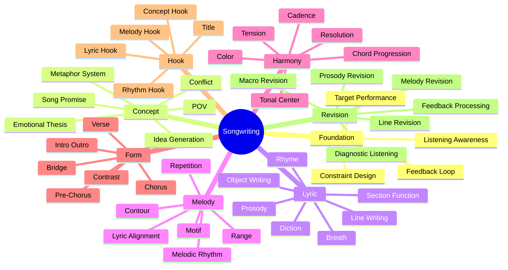
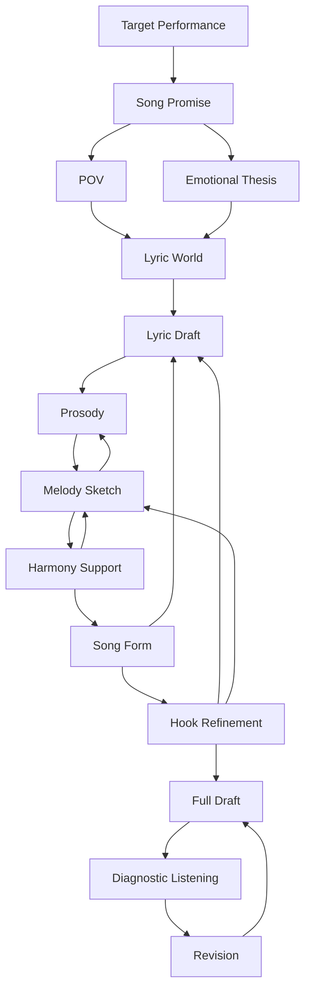
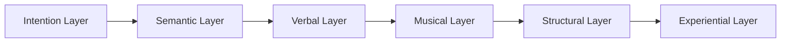
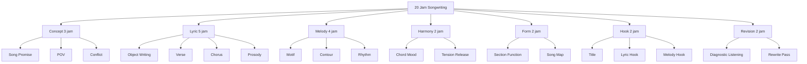
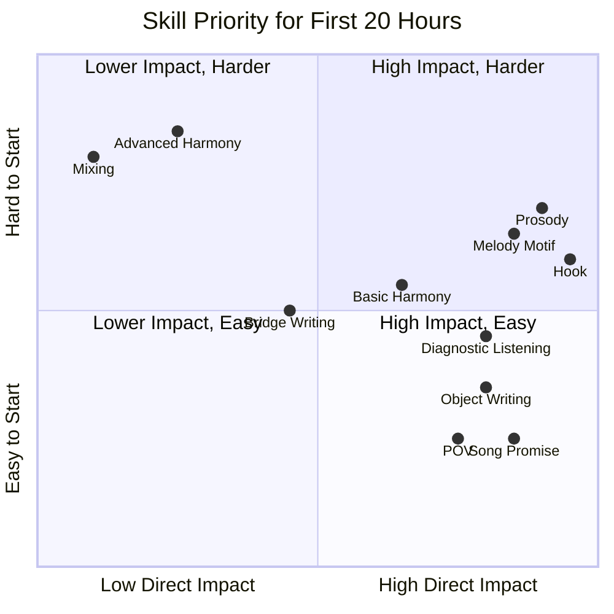
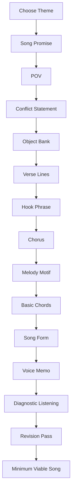
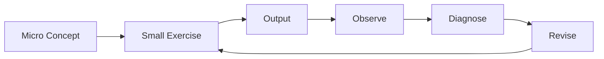

# learn-songwriting-part-003.md

# Deconstructing Songwriting Skill: Memecah “Menulis Lagu” Menjadi Sub-Skill yang Bisa Dilatih

> Seri: `learn-songwriting`  
> Part: `003 / 034`  
> Fokus: deconstruction skill berdasarkan framework Josh Kaufman  
> Status seri: belum selesai  
> Prasyarat: `learn-songwriting-part-000.md`, `learn-songwriting-part-001.md`, `learn-songwriting-part-002.md`

---

## Ringkasan Part Ini

Part ini menjawab pertanyaan:

> “Songwriting itu sebenarnya terdiri dari skill apa saja, dan skill mana yang harus dilatih dulu agar dalam 20 jam saya bisa menghasilkan lagu utuh?”

Dalam part sebelumnya, kita sudah menetapkan target:

```text
Minimum Viable Song:
lagu utuh sederhana yang punya lirik, melodi utama, chord dasar, struktur, hook, voice memo, dan revision log.
```

Sekarang kita pecah songwriting menjadi sub-skill yang bisa dipelajari, dilatih, dan dievaluasi.

Ini langsung mengikuti prinsip Josh Kaufman:

```text
Most skills are bundles of smaller sub-skills.
Deconstruct the skill.
Practice the most important sub-skills first.
```

Untuk songwriting, deconstruction sangat penting karena “menulis lagu” terdengar seperti satu aktivitas, padahal sebenarnya terdiri dari beberapa sistem yang saling mempengaruhi:

- ide;
- song promise;
- point of view;
- lirik;
- prosodi;
- melodi;
- ritme;
- harmoni;
- struktur;
- hook;
- kontras;
- revisi;
- feedback.

Kalau semua dicampur sekaligus, kamu akan merasa songwriting terlalu kabur. Tapi kalau dipecah terlalu mekanis, lagunya bisa mati. Maka tujuan part ini adalah membuat deconstruction yang **cukup struktural untuk dilatih**, tetapi **cukup musikal untuk tetap hidup**.

---

## Tujuan Part

Setelah menyelesaikan part ini, kamu harus bisa:

1. Melihat songwriting sebagai kumpulan sub-skill, bukan satu kemampuan abstrak.
2. Memahami dependency antar sub-skill.
3. Menentukan sub-skill mana yang harus dilatih lebih dulu untuk 20 jam pertama.
4. Membedakan skill primer, sekunder, dan opsional.
5. Menghindari belajar hal yang belum dibutuhkan.
6. Membuat skill map pribadi untuk lagu pertama.
7. Menentukan latihan mikro untuk setiap sub-skill.
8. Mengetahui failure mode umum ketika satu sub-skill lemah.
9. Menghubungkan sub-skill menjadi pipeline pembuatan lagu utuh.

---

## Prinsip Kaufman yang Dipakai di Part Ini

Part ini memakai prinsip deconstruction:

```text
Jangan belajar “songwriting” sebagai satu blok besar.
Pecah menjadi bagian-bagian kecil.
Cari bagian yang memberi hasil terbesar.
Latih bagian itu secara sengaja.
```

Bagi software engineer, ini mirip:

```text
Jangan belajar “distributed systems” sekaligus.
Pecah menjadi:
- networking;
- consistency;
- replication;
- partitioning;
- consensus;
- observability;
- backpressure;
- failure recovery.
```

Songwriting juga begitu.

```text
Jangan belajar “menulis lagu” sekaligus.
Pecah menjadi:
- ide;
- emotional promise;
- lirik;
- melodi;
- harmoni;
- form;
- hook;
- revisi.
```

Bedanya, dalam songwriting, sub-skill tidak selalu linear. Banyak keputusan saling mempengaruhi.

Contoh:

- pilihan kata mempengaruhi melodi;
- melodi mempengaruhi panjang baris;
- chord mempengaruhi mood;
- hook mempengaruhi chorus;
- POV mempengaruhi diksi;
- struktur mempengaruhi apa yang boleh diulang;
- genre mempengaruhi density dan bahasa.

Maka kita perlu skill tree dan dependency graph.

---

## Songwriting sebagai Bundle of Sub-Skills



Skill tree ini akan menjadi peta seri. Tidak semua skill dilatih sedalam mungkin dalam 20 jam pertama. Kita akan memilih jalur minimum yang menghasilkan lagu utuh.

---

## Dependency Graph Songwriting

Songwriting tidak murni linear, tetapi ada dependency yang umum.



Perhatikan loop:

- lirik mempengaruhi melodi;
- melodi bisa memaksa revisi lirik;
- chord bisa mengubah arah melodi;
- hook bisa memaksa chorus diubah;
- struktur bisa memaksa verse dipotong.

Jadi deconstruction bukan berarti proses sekali jalan. Deconstruction berarti kita tahu bagian mana yang sedang kita latih dan diagnosa.

---

## Layer Model: Dari Intensi ke Lagu



| Layer | Pertanyaan | Output |
|---|---|---|
| Intention Layer | Lagu ini ingin memberi pengalaman apa? | Song promise |
| Semantic Layer | Apa makna, konflik, POV, dan dunia lagu? | Concept map |
| Verbal Layer | Kata-kata apa yang menyampaikan dunia itu? | Lyric draft |
| Musical Layer | Bagaimana kata-kata itu bernyanyi? | Melody + chord |
| Structural Layer | Bagaimana lagu bergerak dari awal ke akhir? | Song form |
| Experiential Layer | Apa yang pendengar rasakan dan ingat? | Hook + feedback |

Jika layer bawah lemah, layer atas biasanya ikut lemah.

Contoh:

```text
Song promise tidak jelas -> lirik melebar -> chorus tidak punya punch -> hook lemah.
```

Atau:

```text
Prosodi buruk -> melodi terasa maksa -> pendengar tidak peduli walau makna bagus.
```

---

## Skill Primer, Sekunder, dan Opsional

Untuk 20 jam pertama, tidak semua skill sama pentingnya.

### Skill Primer

Skill yang wajib dilatih karena langsung menentukan apakah lagu bisa selesai.

| Skill Primer | Kenapa Penting |
|---|---|
| Song promise | Menjaga lagu tidak melebar |
| POV | Menentukan suara dan diksi |
| Lyric drafting | Lagu butuh kata-kata yang bisa dinyanyikan |
| Prosody | Lirik harus bernyanyi natural |
| Melody motif | Lagu butuh nada yang diingat |
| Basic harmony | Lagu butuh support emosional |
| Song form | Lagu harus utuh |
| Hook | Lagu butuh pusat memori |
| Revision | Draft pertama hampir pasti belum cukup |

### Skill Sekunder

Skill penting, tapi bisa dilatih setelah fondasi berjalan.

| Skill Sekunder | Catatan |
|---|---|
| Advanced rhyme | Berguna, tapi jangan mengorbankan makna |
| Bridge writing | Tidak wajib untuk MVS |
| Modulation | Ditunda |
| Detailed arrangement | Ditunda |
| Genre-specific nuance | Cukup basic dulu |
| Countermelody | Ditunda |
| Production hook | Bukan fokus 20 jam |
| Co-writing | Nanti setelah workflow pribadi jelas |

### Skill Opsional untuk 20 Jam Pertama

| Skill Opsional | Kenapa Opsional |
|---|---|
| Notasi musik formal | Voice memo cukup |
| DAW production | Bisa mengalihkan fokus |
| Mixing/mastering | Bukan songwriting |
| Vokal teknik tinggi | Sudah domain performance |
| Harmoni jazz kompleks | Tidak perlu untuk lagu pertama |
| Aransemen full band | Ditunda |

Target kita:

```text
Latih skill primer cukup kuat untuk menghasilkan satu lagu utuh.
```

---

## Decomposition Map untuk 20 Jam Pertama



Alokasi ini tidak harus kaku. Tapi berguna sebagai baseline.

---

# Sub-Skill 1: Target Performance

## Fungsi

Target performance menjawab:

```text
Lagu seperti apa yang harus saya bisa buat setelah 20 jam?
```

Tanpa target, kamu akan belajar terlalu luas.

## Output

- Definition of Done.
- Non-goals.
- Acceptance criteria.
- Scope lock.

## Failure Mode

| Failure | Gejala |
|---|---|
| Target terlalu tinggi | Frustrasi, membandingkan dengan rilisan profesional |
| Target terlalu rendah | Hanya menulis fragmen, tidak menyelesaikan lagu |
| Target kabur | Tidak tahu kapan selesai |
| Scope creep | Mulai belajar produksi/mixing/performance lagi |

## Latihan Mikro

Tulis satu kalimat:

```text
Dalam 20 jam, saya akan menyelesaikan lagu yang ______,
bukan lagu yang ______.
```

Contoh:

```text
Dalam 20 jam, saya akan menyelesaikan lagu yang bisa dinyanyikan utuh dan punya hook,
bukan lagu yang siap rilis profesional.
```

---

# Sub-Skill 2: Listening Awareness

## Fungsi

Listening awareness adalah kemampuan mendengar lagu bukan hanya sebagai penikmat, tetapi sebagai pembuat.

Pendengar biasa mendengar:

```text
lagunya enak / sedih / catchy
```

Songwriter mendengar:

```text
verse rendah dan sempit,
chorus naik,
hook memakai repetisi 4 kata,
bridge memberi sudut baru,
rima tidak selalu sempurna,
title muncul di akhir chorus.
```

## Output

- Reference deconstruction.
- Catatan struktur.
- Catatan hook.
- Catatan lyric/melody alignment.

## Failure Mode

| Failure | Gejala |
|---|---|
| Mendengar pasif | Banyak suka lagu, tapi tidak tahu kenapa |
| Meniru permukaan | Mengambil vibe tanpa memahami fungsi |
| Terlalu teknis | Lupa efek emosional |
| Terlalu emosional | Tidak bisa mengambil teknik yang bisa dipakai |

## Latihan Mikro

Pilih satu lagu referensi. Catat:

```markdown
Judul:
Artis:
Struktur:
Hook utama:
Kapan title muncul:
Verse melakukan apa:
Chorus melakukan apa:
Apa yang berubah dari verse ke chorus:
Satu teknik yang ingin saya pelajari:
Satu hal yang tidak ingin saya tiru:
```

Jangan tulis analisis panjang. Fokus pada fungsi.

---

# Sub-Skill 3: Idea Generation

## Fungsi

Idea generation menghasilkan bahan mentah. Tanpa bahan mentah, tidak ada yang bisa dipilih atau direvisi.

Ide lagu bisa datang dari:

- pengalaman pribadi;
- konflik sosial;
- kalimat yang terdengar menarik;
- objek;
- tempat;
- percakapan;
- ingatan;
- berita;
- hubungan;
- rasa malu;
- fantasi;
- ironi.

## Output

- List ide.
- Title bank.
- Object bank.
- Hook phrase bank.
- Conflict bank.

## Failure Mode

| Failure | Gejala |
|---|---|
| Ide terlalu abstrak | “cinta”, “sedih”, “hidup” |
| Ide terlalu banyak | Tidak memilih satu |
| Ide terlalu literal | Lirik seperti penjelasan |
| Ide terlalu konsep | Tidak ada scene manusia |
| Ide terlalu pribadi | Pendengar tidak diberi akses |

## Latihan Mikro

Tulis 20 ide dalam format:

```text
Lagu tentang [orang] yang [situasi] tetapi [konflik batin].
```

Contoh:

```text
Lagu tentang seseorang yang masih menyimpan gelas mantannya tetapi pura-pura sudah move on.
```

Format ini memaksa ide punya subjek, situasi, dan konflik.

---

# Sub-Skill 4: Song Promise

## Fungsi

Song promise adalah janji emosional lagu.

Ia menjawab:

```text
Pengalaman apa yang akan lagu ini berikan?
```

Song promise bukan tema umum. Song promise harus cukup spesifik untuk memandu keputusan.

## Output

Satu kalimat:

```text
Lagu ini akan membuat pendengar merasakan ______
melalui ______
dari sudut pandang ______
dengan konflik ______.
```

## Failure Mode

| Failure | Gejala |
|---|---|
| Promise terlalu umum | Lagu terasa generik |
| Promise berubah-ubah | Verse dan chorus seperti beda lagu |
| Promise terlalu intelektual | Lagu terasa seperti esai |
| Promise terlalu sempit | Tidak cukup bahan untuk lagu |
| Promise tidak emosional | Lagu punya konsep tapi tidak punya rasa |

## Latihan Mikro

Buat 5 song promise dari satu tema.

Tema:

```text
rindu
```

Variasi promise:

```text
1. Rindu yang malu diakui.
2. Rindu yang berubah menjadi kebiasaan domestik.
3. Rindu yang disamarkan sebagai marah.
4. Rindu kepada orang yang masih hidup tetapi tidak bisa dijangkau.
5. Rindu kepada versi diri sendiri yang dulu.
```

Lalu pilih yang paling punya energi.

---

# Sub-Skill 5: Point of View

## Fungsi

POV menentukan siapa yang bicara, kepada siapa, dari jarak emosional apa.

POV mempengaruhi:

- diksi;
- intensitas;
- kejujuran;
- informasi;
- metafora;
- struktur;
- chorus.

## Jenis POV

| POV | Efek |
|---|---|
| Aku ke kamu | Intim, langsung, confessional |
| Aku ke diri sendiri | Reflektif, internal |
| Aku ke dunia | Sosial, deklaratif |
| Narator luar | Sinematik, storytelling |
| Kamu sebagai pusat | Menuduh, merayu, memanggil |
| Benda mati berbicara | Metaforis, theatrical |
| Kami | Kolektif, anthem, sosial |

## Output

- POV statement.
- Addressing rule.
- Batas informasi narator.

Contoh:

```text
POV: aku bicara kepada kamu yang sudah pergi.
Rule: aku tidak pernah menyebut alasan kamu pergi.
Effect: lagu terasa seperti percakapan sepihak.
```

## Failure Mode

| Failure | Gejala |
|---|---|
| POV berubah tanpa alasan | Pendengar bingung |
| Narator tahu terlalu banyak | Tidak natural |
| Addressing tidak jelas | “aku/kamu/dia” kacau |
| POV terlalu aman | Tidak ada ketegangan |
| POV terlalu clever | Emosi tertutup konsep |

## Latihan Mikro

Ambil satu kalimat:

```text
Kau meninggalkanku.
```

Tulis dalam 5 POV:

```text
Aku ke kamu:
Aku ke diriku:
Narator luar:
Benda mati:
Kami:
```

---

# Sub-Skill 6: Emotional Thesis

## Fungsi

Emotional thesis adalah inti perasaan lagu yang lebih spesifik dari tema.

Bukan:

```text
sedih
```

Tetapi:

```text
sedih karena aku sadar yang kutunggu bukan orangnya, tapi kebiasaan menunggu itu sendiri.
```

## Output

Kalimat:

```text
Emosi utama:
Situasi:
Konflik batin:
Perubahan:
```

Contoh:

```text
Emosi utama: rindu malu
Situasi: seseorang masih menata rumah untuk orang yang tidak pulang
Konflik batin: ingin melepas tapi takut kehilangan alasan untuk hidup
Perubahan: dari menyangkal ke mengakui
```

## Failure Mode

| Failure | Gejala |
|---|---|
| Emosi umum | Lirik klise |
| Emosi tidak bergerak | Semua section sama |
| Terlalu banyak emosi | Lagu tidak punya pusat |
| Emosi tidak cocok dengan musik | Lirik sedih, musik terlalu ringan tanpa ironi |
| Tidak ada konflik | Lagu hanya mood, bukan perjalanan |

## Latihan Mikro

Gunakan formula:

```text
Saya merasa [emosi], karena [situasi], tetapi [konflik].
```

Buat 10 variasi.

---

# Sub-Skill 7: Conflict Engine

## Fungsi

Konflik membuat lagu bergerak.

Tanpa konflik, lagu hanya deskripsi mood.

Jenis konflik:

| Jenis | Contoh |
|---|---|
| Internal | ingin pergi tapi masih cinta |
| Interpersonal | aku menunggu, kamu menghindar |
| Social | rakyat lapar, pemimpin berpesta |
| Moral | tahu salah tapi menikmati |
| Spiritual | berdoa tapi tidak percaya lagi |
| Temporal | masa lalu belum selesai |
| Identity | aku tidak tahu siapa diriku tanpamu |
| Desire vs reality | ingin pulang, rumah sudah berubah |

## Output

Conflict statement:

```text
Narator ingin ______,
tetapi ______,
karena ______.
```

Contoh:

```text
Narator ingin membenci orang yang pergi,
tetapi masih menyiapkan tempat untuknya,
karena membenci berarti mengakui hubungan itu selesai.
```

## Failure Mode

| Failure | Gejala |
|---|---|
| Tidak ada konflik | Lagu datar |
| Konflik terlalu eksplisit | Lagu seperti pidato |
| Konflik terlalu samar | Pendengar tidak peduli |
| Konflik berubah-ubah | Lagu tidak fokus |
| Konflik tidak selesai/berubah | Tidak ada payoff |

## Latihan Mikro

Tulis 10 conflict statement dari satu tema.

---

# Sub-Skill 8: Lyric Worldbuilding

## Fungsi

Lyric worldbuilding membuat lagu punya dunia konkret.

Dunia lagu terdiri dari:

- tempat;
- benda;
- waktu;
- cuaca;
- gestur;
- suara;
- cahaya;
- tubuh;
- kebiasaan;
- kata yang diucapkan;
- kata yang tidak diucapkan.

## Output

- Place bank.
- Object bank.
- Gesture bank.
- Sensory detail bank.

## Failure Mode

| Failure | Gejala |
|---|---|
| Tidak ada benda | Lirik abstrak |
| Terlalu banyak benda | Lagu seperti inventory |
| Detail tidak relevan | World tidak mendukung promise |
| Detail terlalu puitis | Tidak terasa hidup |
| Detail generik | “hujan”, “malam”, “luka” tanpa twist |

## Latihan Mikro

Untuk satu ide, isi:

```markdown
Tempat:
Waktu:
Benda 1:
Benda 2:
Benda 3:
Suara:
Cahaya:
Gestur:
Kebiasaan:
Satu detail aneh:
```

Contoh:

```markdown
Tempat: dapur
Waktu: pukul 2 pagi
Benda 1: gelas
Benda 2: kursi
Benda 3: sendok kecil
Suara: kulkas berdengung
Cahaya: lampu kuning lelah
Gestur: tangan berhenti sebelum membuka lemari
Kebiasaan: tetap menyisakan air panas
Satu detail aneh: jam dinding selalu telat tujuh menit
```

---

# Sub-Skill 9: Object Writing

## Fungsi

Object writing melatih kemampuan menulis dari benda konkret menuju emosi.

Alih-alih menulis:

```text
Aku rindu.
```

Kamu menulis:

```text
Gelasmu masih kupilihkan tempat.
```

Objek memberi bukti emosi.

## Output

- 10–20 baris berbasis objek.
- Image bank untuk verse.

## Failure Mode

| Failure | Gejala |
|---|---|
| Objek hanya dekorasi | Tidak membawa emosi |
| Objek terlalu simbolik | Terasa dibuat-buat |
| Objek tidak spesifik | “bunga”, “langit”, “malam” generik |
| Terlalu menjelaskan objek | Tidak memberi ruang |
| Tidak ada hubungan dengan POV | Objek terasa tempelan |

## Latihan Mikro

Pilih satu benda:

```text
gelas
kursi
koper
sepatu
jam
pintu
cermin
jaket
```

Tulis 10 baris dengan aturan:

- tidak boleh menyebut emosi;
- tidak boleh menjelaskan makna;
- hanya benda, tindakan, dan implikasi.

Contoh:

```text
Kursimu masih menghadap jendela.
Aku tidak pernah duduk di sana.
```

---

# Sub-Skill 10: Lyric Line Writing

## Fungsi

Line writing adalah skill membuat baris yang:

- punya makna;
- bisa dinyanyikan;
- mendukung section;
- punya suara;
- tidak terlalu panjang;
- tidak terlalu generik.

## Output

- Raw lyric lines.
- Verse candidates.
- Chorus candidates.

## Failure Mode

| Failure | Gejala |
|---|---|
| Baris terlalu panjang | Sulit dinyanyikan |
| Baris terlalu menjelaskan | Tidak puitis/musikal |
| Baris terlalu puitis | Tidak natural |
| Baris tidak punya tekanan | Datar |
| Baris berdiri sendiri tapi tidak mendukung lagu | Local maxima |

## Latihan Mikro

Ambil satu baris abstrak:

```text
Aku masih mencintaimu.
```

Ubah menjadi:

1. versi objek;
2. versi dialog;
3. versi gesture;
4. versi metafora;
5. versi sangat sederhana.

Contoh:

```text
Objek: Sikat gigimu belum kupindah.
Dialog: “Besok pulang?” tanyaku pada layar mati.
Gesture: Tanganku berhenti di namamu.
Metafora: Rumah ini menahan napas.
Sederhana: Aku belum selesai.
```

---

# Sub-Skill 11: Rhyme and Sound

## Fungsi

Rima bukan sekadar akhiran sama. Rima adalah memory device dan musical glue.

Jenis sound device:

- rima akhir;
- rima dalam;
- asonansi;
- konsonansi;
- aliterasi;
- pengulangan vowel;
- kemiripan bunyi;
- rhythm phrase.

## Output

- Rhyme palette.
- Sound family.
- Chorus sound identity.

## Failure Mode

| Failure | Gejala |
|---|---|
| Rima dipaksakan | Makna rusak |
| Rima terlalu sempurna | Terdengar childish/robotic |
| Tidak ada sound pattern | Lirik sulit diingat |
| Bunyi terlalu keras | Tidak cocok mood |
| Bahasa jadi tidak natural | Pendengar sadar penulis mengejar rima |

## Latihan Mikro

Ambil kata pusat:

```text
pulang
```

Buat sound family:

```text
pulang
ulang
hilang
malang
ruang
kurang
tenang
belakang
```

Lalu buat imperfect family:

```text
pintu
rindu
tunggu
waktu
lampu
aku
```

Pilih berdasarkan mood, bukan hanya kemiripan bunyi.

---

# Sub-Skill 12: Prosody

## Fungsi

Prosody adalah hubungan antara bahasa dan musik:

- suku kata;
- tekanan kata;
- ritme bicara;
- napas;
- vowel;
- consonant;
- panjang frasa;
- letak kata penting.

Prosody adalah salah satu skill paling penting dalam songwriting.

Lirik yang bagus tapi prosodinya buruk akan terdengar maksa.

## Output

- Syllable count.
- Breath marks.
- Stress marks.
- Lyric-to-melody alignment.

## Failure Mode

| Failure | Gejala |
|---|---|
| Suku kata terlalu banyak | Penyanyi tersandung |
| Tekanan kata salah | Kalimat terdengar aneh |
| Napas tidak ada | Baris melelahkan |
| Kata penting jatuh lemah | Hook tidak terasa |
| Vowel buruk di nada panjang | Tidak enak dinyanyikan |

## Latihan Mikro

Ambil baris:

```text
Aku masih menunggumu di depan pintu yang sama
```

Pecah:

```text
Aku masih / menunggumu
di depan / pintu yang sama
```

Lalu kompres:

```text
Aku masih menunggu
di pintu yang sama
```

Lalu tandai kata penting:

```text
Aku masih me-NUNG-gu
di PIN-tu yang SA-ma
```

---

# Sub-Skill 13: Melody Motif

## Fungsi

Motif adalah unit kecil melodi yang bisa dikenali.

Hook sering lahir dari motif yang sederhana dan diulang.

Motif bisa berupa:

- 3–5 nada;
- pola naik-turun;
- ritme khas;
- lompatan interval;
- nada panjang pada kata penting.

## Output

- 5 motif kasar.
- 1 motif hook terpilih.

## Failure Mode

| Failure | Gejala |
|---|---|
| Melodi terlalu panjang | Sulit diingat |
| Tidak ada pengulangan | Tidak catchy |
| Semua nada sama | Datar |
| Terlalu banyak lompatan | Sulit dinyanyikan |
| Motif tidak cocok kata | Lirik terasa dipaksa |

## Latihan Mikro

Nyanyikan satu frasa:

```text
kau belum selesai
```

Buat 5 motif:

1. datar-datar-naik-tahan;
2. naik-naik-turun;
3. rendah-rendah-loncat;
4. satu nada berulang lalu jatuh;
5. naik perlahan lalu diam.

Rekam semua. Pilih yang paling mudah diingat.

---

# Sub-Skill 14: Melodic Contour

## Fungsi

Contour adalah bentuk melodi:

- naik;
- turun;
- datar;
- melompat;
- melengkung;
- menahan;
- jatuh.

Contour mempengaruhi emosi.

| Contour | Efek Umum |
|---|---|
| Naik | harapan, intensitas, tuntutan |
| Turun | pasrah, selesai, gelap |
| Datar | intim, kosong, mantra |
| Lompatan naik | seruan, luka, surprise |
| Lompatan turun | kejatuhan, ironi, berat |
| Nada panjang | penekanan, ruang emosi |
| Banyak nada pendek | cemas, bicara, rapat |

## Output

- Contour map verse.
- Contour map chorus.

## Failure Mode

| Failure | Gejala |
|---|---|
| Verse dan chorus contour sama | Tidak ada kontras |
| Chorus tidak punya peak | Tidak terasa release |
| Terlalu banyak peak | Melelahkan |
| Contour tidak mengikuti emosi | Lagu terasa salah |
| Melodi tidak punya arah | Datar tanpa intensi |

## Latihan Mikro

Gambar contour tanpa not:

```text
Verse:  _ _ - _ _ -
Chorus: _ / / -- \ _
```

Atau:

```text
Verse: rendah, sempit, bicara
Chorus: naik di title, tahan, turun
```

---

# Sub-Skill 15: Melodic Rhythm

## Fungsi

Melodic rhythm adalah kapan suku kata muncul dan berapa lama ditahan.

Dua melodi dengan nada sama bisa terasa berbeda jika ritmenya berbeda.

Ritme menentukan:

- flow;
- urgency;
- groove;
- naturalness;
- memorability;
- singability.

## Output

- Rhythm setting untuk verse.
- Rhythm setting untuk chorus.
- Placement kata penting.

## Failure Mode

| Failure | Gejala |
|---|---|
| Semua kata durasi sama | Robotic |
| Terlalu banyak suku kata cepat | Tidak natural |
| Tidak ada rest | Pendengar lelah |
| Hook tidak punya rhythmic identity | Sulit diingat |
| Ritme bicara tidak dihormati | Bahasa terdengar aneh |

## Latihan Mikro

Ambil frasa:

```text
tak kupakai, tak kubuang
```

Coba tiga ritme:

```text
TAK ku-PA-kai / TAK ku-BU-ang
tak ku-pa-kai / tak ku-bu-ang
tak... kupakai / tak... kubuang
```

Rekam dan pilih yang paling punya karakter.

---

# Sub-Skill 16: Lyric-Melody Alignment

## Fungsi

Ini adalah titik temu antara lirik dan melodi.

Pertanyaan:

```text
Apakah kata paling penting mendapat nada, durasi, dan posisi beat yang penting?
```

Contoh:

```text
Aku ingin kau pulang
```

Kata penting mungkin:

```text
pulang
```

Maka jangan biarkan “pulang” lewat cepat tanpa penekanan.

## Output

- Alignment table.
- Kata penting per baris.
- Nada/beat penting.

## Failure Mode

| Failure | Gejala |
|---|---|
| Kata penting hilang | Hook tidak terasa |
| Kata tidak penting terlalu ditekankan | Makna aneh |
| Suku kata dipaksa masuk | Lirik robotic |
| Melodi indah tapi melawan bahasa | Tidak natural |
| Chorus susah diingat | Alignment buruk |

## Latihan Mikro

Buat tabel:

| Baris | Kata Penting | Harus Ditekankan Bagaimana |
|---|---|---|
| Aku masih menunggu | menunggu | nada lebih panjang |
| di pintu yang sama | pintu / sama | akhir frasa |
| kau belum selesai | belum selesai | hook, nada naik |

---

# Sub-Skill 17: Basic Harmony

## Fungsi

Harmony memberi warna, gravitasi, tension, dan release.

Untuk 20 jam pertama, harmoni tidak perlu rumit. Yang penting:

- mendukung mood;
- memberi tempat untuk melodi;
- membantu membedakan verse dan chorus;
- memberi rasa pulang atau belum selesai.

## Output

- Key/tonal center.
- Verse progression.
- Chorus progression.
- Harmonic mood note.

## Failure Mode

| Failure | Gejala |
|---|---|
| Chord tidak cocok emosi | Lagu terasa salah warna |
| Progression terlalu ramai | Melodi tidak punya ruang |
| Chord loop monoton | Tidak ada movement |
| Terlalu fokus chord | Lirik/melodi terabaikan |
| Chord dipilih karena template | Tidak mendukung promise |

## Latihan Mikro

Ambil satu chorus. Coba 3 warna:

```text
Versi terang:
C - G - Am - F

Versi lebih gelap:
Am - F - C - G

Versi menggantung:
F - G - Am - Am
```

Nyanyikan hook di atasnya. Pilih yang paling mendukung emosi.

---

# Sub-Skill 18: Song Form

## Fungsi

Form adalah arsitektur lagu.

Form menjawab:

```text
Informasi dan emosi muncul dalam urutan apa?
```

Form bukan template mati. Form adalah flow.

## Output

- Song map.
- Section function.
- Energy map.

## Failure Mode

| Failure | Gejala |
|---|---|
| Semua section sama fungsi | Monoton |
| Verse 2 tidak berkembang | Lagu terasa berputar |
| Chorus datang terlalu cepat/lambat | Payoff lemah |
| Bridge tidak memberi turn | Bridge terasa tempelan |
| Terlalu banyak section | Lagu kehilangan fokus |

## Latihan Mikro

Isi:

```markdown
Verse 1 function:
Chorus function:
Verse 2 function:
Chorus 2 meaning after verse 2:
Bridge function:
Final chorus meaning:
```

Jika tidak bisa menjawab, section itu belum punya alasan.

---

# Sub-Skill 19: Section Writing

## Fungsi

Setiap section punya tugas.

### Verse

Memberi:

- scene;
- detail;
- situasi;
- bukti;
- movement.

### Chorus

Memberi:

- inti emosi;
- hook;
- release;
- statement;
- repetition.

### Pre-Chorus

Memberi:

- build-up;
- tension;
- transisi;
- pertanyaan sebelum jawaban.

### Bridge

Memberi:

- sudut baru;
- reveal;
- reversal;
- escalation;
- break pattern.

## Output

- Verse draft.
- Chorus draft.
- Optional pre-chorus/bridge.

## Failure Mode

| Failure | Gejala |
|---|---|
| Verse terlalu abstrak | Tidak ada world |
| Chorus terlalu detail | Tidak terasa universal/hook |
| Pre-chorus tidak build | Tidak perlu ada |
| Bridge hanya verse baru | Tidak memberi turn |
| Semua section bicara hal sama | Tidak ada perjalanan |

## Latihan Mikro

Ambil satu song promise. Tulis fungsi section sebelum menulis lirik.

```markdown
Verse 1: membuktikan bahwa aku masih menunggu lewat benda dapur.
Chorus: mengakui bahwa kamu belum selesai di hidupku.
Verse 2: menunjukkan kebiasaan menunggu pindah ke kamar.
Bridge: sadar bahwa yang kutunggu mungkin bukan kamu, tapi diriku yang dulu.
```

---

# Sub-Skill 20: Hook Writing

## Fungsi

Hook adalah bagian yang menempel.

Hook bisa berupa:

- title;
- frasa lirik;
- motif melodi;
- ritme;
- konsep;
- chord change;
- silence;
- production gesture.

Untuk 20 jam pertama, fokus pada:

```text
lyric hook + melody hook
```

## Output

- 10 hook phrase.
- 5 melody hook.
- 1 selected hook.

## Failure Mode

| Failure | Gejala |
|---|---|
| Hook terlalu panjang | Sulit diingat |
| Hook terlalu abstrak | Tidak menempel |
| Hook tidak diulang | Hilang |
| Hook tidak berbeda dari verse | Tidak terasa pusat |
| Hook clever tapi tidak emosional | Dingin |

## Latihan Mikro

Buat 10 hook 3–7 kata.

Tema: menunggu.

```text
kau belum selesai
tak kupakai, tak kubuang
rumah ini salah paham
aku belum belajar sepi
pulanglah tanpa janji
```

Lalu nyanyikan masing-masing dengan motif pendek.

---

# Sub-Skill 21: Contrast

## Fungsi

Kontras membuat lagu tidak monoton.

Kontras bisa terjadi pada:

- range melodi;
- ritme;
- panjang baris;
- density lirik;
- chord;
- register;
- energy;
- imagery;
- pronoun;
- vowel;
- silence.

## Output

- Contrast map verse vs chorus.
- Energy curve.

## Failure Mode

| Failure | Gejala |
|---|---|
| Tidak ada kontras | Lagu datar |
| Kontras terlalu ekstrem | Lagu terasa patah |
| Kontras hanya volume | Kurang musikal |
| Chorus tidak lebih memorable | Struktur lemah |
| Verse terlalu mirip chorus | Section blur |

## Latihan Mikro

Buat tabel:

| Dimensi | Verse | Chorus |
|---|---|---|
| Range | rendah | lebih tinggi |
| Rhythm | bicara, rapat | lebih lega |
| Lyric | detail benda | emotional thesis |
| Chord | minor loop | lebih release |
| Line length | panjang-sedang | pendek |
| Repetition | sedikit | tinggi |

---

# Sub-Skill 22: Diagnostic Listening

## Fungsi

Diagnostic listening adalah mendengar untuk menemukan masalah, bukan untuk menghakimi diri.

Pertanyaan:

```text
Di mana perhatian turun?
Di mana lirik terasa maksa?
Di mana melodi tidak menempel?
Di mana chorus kurang naik?
Di mana saya ingin skip?
Di mana saya ingin ulang?
```

## Output

- Listening notes.
- Problem list.
- Hypothesis revision.

## Failure Mode

| Failure | Gejala |
|---|---|
| Mendengar sambil membela diri | Tidak belajar |
| Menghakimi global | “jelek semua” |
| Tidak merekam | Diagnosis tidak akurat |
| Terlalu cepat revisi | Tidak tahu akar masalah |
| Minta feedback terlalu umum | Tidak actionable |

## Latihan Mikro

Dengar voice memo 3 kali:

1. tanpa membaca lirik;
2. sambil membaca lirik;
3. sambil menandai timeline.

Catat:

```markdown
0:15 perhatian turun
0:32 chorus mulai tapi kurang terasa
0:48 kata "meninggalkan" terlalu panjang
1:10 hook lumayan menempel
```

---

# Sub-Skill 23: Revision

## Fungsi

Revision mengubah draft mentah menjadi lagu yang bekerja.

Urutan revisi harus dari besar ke kecil:

```text
macro -> section -> line -> prosody -> melody -> detail
```

Jangan memperbaiki koma jika chorus belum berfungsi.

## Output

- Revision log.
- v0.1, v0.2, v0.3.
- Decision notes.

## Failure Mode

| Failure | Gejala |
|---|---|
| Revisi terlalu mikro | Banyak edit kecil, lagu tetap lemah |
| Revisi tanpa diagnosis | Muter-muter |
| Terlalu sayang baris | Local maxima |
| Semua diubah sekaligus | Tidak tahu apa yang memperbaiki |
| Tidak simpan versi | Kehilangan ide bagus |

## Latihan Mikro

Gunakan revision log:

```markdown
## Problem
Chorus tidak terasa lebih kuat dari verse.

## Hypothesis
Range chorus terlalu rendah dan lirik terlalu panjang.

## Change
Naikkan melodi di hook dan potong chorus dari 6 baris ke 4 baris.

## Result
...
```

---

## Skill Dependency by Failure Symptom

Ketika lagu bermasalah, gunakan tabel ini.

| Gejala | Sub-Skill yang Mungkin Lemah |
|---|---|
| Lagu tidak jelas tentang apa | Song promise, POV |
| Lirik generik | Object writing, lyric worldbuilding |
| Lirik sulit dinyanyikan | Prosody, melodic rhythm |
| Chorus tidak menempel | Hook, repetition, melody motif |
| Lagu datar | Emotional thesis, contrast, form |
| Verse membosankan | Section writing, object writing |
| Bridge tidak berguna | Form, section function |
| Melodi tidak memorable | Motif, contour, repetition |
| Chord terasa salah | Basic harmony, mood mapping |
| Draft tidak selesai | Target performance, scope lock |
| Revisi tidak membaik | Diagnostic listening, revision method |

---

## Skill Priority Matrix

Untuk 20 jam pertama, gunakan matrix:



Interpretasi:

- Mulai dari high impact + easy: song promise, POV, object writing.
- Lalu masuk high impact + harder: prosody, melody motif, hook.
- Jangan menghabiskan waktu di low direct impact untuk MVS: mixing, advanced harmony.

---

## Minimal Path to First Song

Kalau kita ingin jalur paling efisien menuju lagu pertama:



Ini adalah jalur minimum. Jika tersesat, kembali ke jalur ini.

---

## What to Practice First?

Urutan latihan yang paling efisien:

1. Song promise.
2. POV.
3. Object writing.
4. Hook phrase.
5. Chorus lyric.
6. Verse lyric.
7. Prosody pass.
8. Melody motif.
9. Basic harmony.
10. Song form.
11. Voice memo.
12. Diagnostic listening.
13. Revision.

Kenapa chorus sebelum verse penuh?

Karena untuk lagu pemula, chorus/hook sering menjadi pusat gravitasi. Jika chorus tidak jelas, verse bisa menulis ke arah yang salah.

Tetapi tidak mutlak. Kalau ide datang sebagai scene verse, boleh mulai dari verse. Yang penting segera cari hook.

---

## Sub-Skill Interface Contract

Sebagai software engineer, bayangkan tiap sub-skill punya input/output.

| Sub-Skill | Input | Output |
|---|---|---|
| Song Promise | tema, emosi | satu kalimat promise |
| POV | promise, persona | aturan narator |
| Object Writing | promise, tempat | image bank |
| Lyric Drafting | image bank, POV | raw lines |
| Prosody | raw lines | singable lines |
| Melody Motif | hook phrase | motif |
| Harmony | mood, melody | chord support |
| Form | promise, sections | song map |
| Hook | title, phrase, motif | memorable unit |
| Revision | voice memo, diagnosis | improved draft |

Jika output satu sub-skill lemah, downstream ikut lemah.

Contoh:

```text
POV kacau -> lyric draft kacau -> chorus tidak fokus -> listener bingung.
```

---

## Deconstruction Template

Gunakan template ini untuk memecah lagu yang ingin kamu tulis.

```markdown
# Songwriting Skill Deconstruction

## Target
Saya ingin menulis lagu yang:

## Skill Primer yang Dibutuhkan
- [ ] Song promise
- [ ] POV
- [ ] Conflict
- [ ] Object writing
- [ ] Lyric drafting
- [ ] Prosody
- [ ] Melody motif
- [ ] Basic harmony
- [ ] Song form
- [ ] Hook
- [ ] Diagnostic listening
- [ ] Revision

## Untuk Lagu Ini, Skill yang Paling Kritis
1.
2.
3.

## Skill yang Akan Saya Batasi
1.
2.
3.

## Skill yang Akan Saya Tunda
1.
2.
3.

## Failure Mode yang Paling Mungkin
1.
2.
3.

## Latihan Mikro yang Akan Saya Lakukan
1.
2.
3.
```

---

## Contoh Deconstruction untuk Lagu Pertama

```markdown
# Songwriting Skill Deconstruction

## Target
Saya ingin menulis lagu ballad gelap berbahasa Indonesia tentang seseorang yang masih menyiapkan rumah untuk orang yang tidak pulang.

## Skill Primer yang Dibutuhkan
- [x] Song promise
- [x] POV
- [x] Conflict
- [x] Object writing
- [x] Lyric drafting
- [x] Prosody
- [x] Melody motif
- [x] Basic harmony
- [x] Song form
- [x] Hook
- [x] Diagnostic listening
- [x] Revision

## Untuk Lagu Ini, Skill yang Paling Kritis
1. Object writing, karena lagu harus konkret.
2. Prosody, karena bahasa Indonesia harus natural saat dinyanyikan.
3. Hook, karena chorus harus menempel.

## Skill yang Akan Saya Batasi
1. Harmoni hanya 3–5 chord.
2. Struktur hanya verse-chorus-verse-chorus-bridge optional.
3. Arrangement cukup voice memo.

## Skill yang Akan Saya Tunda
1. Mixing.
2. Produksi cinematic lengkap.
3. Teknik vokal detail.

## Failure Mode yang Paling Mungkin
1. Lirik terlalu puitis dan tidak natural.
2. Rima dipaksakan.
3. Chorus terlalu panjang.

## Latihan Mikro yang Akan Saya Lakukan
1. Tulis 20 object lines dari benda rumah.
2. Buat 10 hook phrase 3–7 kata.
3. Rekam 5 motif chorus untuk hook terpilih.
```

---

## Learning Loop per Sub-Skill

Setiap sub-skill dilatih dengan loop sama:



Contoh untuk prosody:

```text
Micro concept:
kata penting harus jatuh di beat/nada penting.

Exercise:
ambil 4 baris chorus dan tandai kata penting.

Output:
chorus dengan stress mark.

Observe:
nyanyikan dan rekam.

Diagnose:
kata "pulang" terlalu cepat.

Revise:
beri nada lebih panjang pada "pulang".
```

---

## Latihan Utama Part 003: Buat Skill Map Pribadi

Isi file:

```text
songwriting-practice-003-skill-map.md
```

Template:

```markdown
# songwriting-practice-003-skill-map.md

## 1. Target Lagu Pertama
Saya ingin menulis lagu tentang:

## 2. Song Promise Sementara
Lagu ini akan membuat pendengar merasakan:

## 3. Skill Primer untuk Lagu Ini
| Skill | Penting? | Kenapa? | Output |
|---|---:|---|---|
| Song Promise |  |  |  |
| POV |  |  |  |
| Object Writing |  |  |  |
| Lyric Drafting |  |  |  |
| Prosody |  |  |  |
| Melody Motif |  |  |  |
| Harmony |  |  |  |
| Form |  |  |  |
| Hook |  |  |  |
| Revision |  |  |  |

## 4. Top 3 Skill yang Paling Lemah
1.
2.
3.

## 5. Top 3 Skill yang Paling Penting untuk Lagu Ini
1.
2.
3.

## 6. Skill yang Akan Saya Tunda
1.
2.
3.

## 7. Failure Mode yang Perlu Saya Waspadai
1.
2.
3.

## 8. Latihan Mikro Minggu Ini
| Hari/Sesi | Sub-Skill | Latihan | Output |
|---|---|---|---|
| 1 |  |  |  |
| 2 |  |  |  |
| 3 |  |  |  |

## 9. Minimal Path
Langkah paling pendek menuju lagu utuh saya adalah:

1.
2.
3.
4.
5.
6.
7.
8.
9.
10.

## 10. Next Action
Dalam 30 menit berikutnya saya akan:
```

---

## Latihan 30 Menit: Deconstruct 1 Lagu Referensi

Pilih satu lagu yang kamu suka, tetapi jangan analisis produksi detail.

Isi:

```markdown
# Reference Song Deconstruction

## Identity
Judul:
Artis:
Genre:
Mood:

## Structure
Intro:
Verse:
Pre-Chorus:
Chorus:
Verse 2:
Bridge:
Outro:

## Song Promise
Menurut saya, lagu ini menjanjikan pengalaman:

## POV
Siapa bicara kepada siapa?

## Hook
Hook lirik:
Hook melodi:
Hook ritme:

## Verse Function
Verse 1 melakukan:
Verse 2 melakukan:

## Chorus Function
Chorus menyatakan:

## Contrast
Perbedaan verse dan chorus:

## Lyric Technique
Detail konkret:
Rima/sound:
Baris yang memorable:

## Melody Technique
Contour verse:
Contour chorus:
Kata yang diberi tekanan:

## What I Can Learn
1.
2.
3.

## What I Should Not Copy
1.
2.
3.
```

Tujuannya bukan meniru. Tujuannya membangun listening awareness.

---

## Latihan 45 Menit: Skill Isolation

Pilih satu sub-skill saja dan latih tanpa menulis lagu lengkap.

### Opsi A: Object Writing

```text
Tulis 20 baris dari 5 benda.
Tidak boleh menyebut emosi.
```

### Opsi B: Hook Phrase

```text
Tulis 30 hook phrase 3–7 kata.
Pilih 5.
Nyanyikan 5.
Pilih 1.
```

### Opsi C: Prosody

```text
Ambil 8 baris lirik.
Potong suku kata.
Tandai napas.
Tandai kata penting.
Nyanyikan ulang.
```

### Opsi D: Melody Motif

```text
Ambil 1 hook phrase.
Buat 10 motif melodi.
Rekam semua.
Pilih 2.
```

### Opsi E: Form

```text
Ambil satu song promise.
Buat 5 struktur berbeda.
Tulis fungsi tiap section.
Pilih yang paling jelas.
```

---

## Latihan 60 Menit: End-to-End Mini Slice

Buat satu mini slice lagu, bukan full song.

```text
Song promise -> hook phrase -> chorus 4 baris -> motif melody -> chord dasar -> voice memo
```

Template:

```markdown
# Mini Slice

## Song Promise
...

## Hook Phrase
...

## Chorus Draft
1.
2.
3.
4.

## Melody Note
Contour:
Rhythm:
Peak word:

## Chord Sketch
Key:
Progression:

## Voice Memo Notes
Take 1:
Problem:
Next revision:
```

Ini seperti vertical slice dalam software. Kecil, tapi end-to-end.

---

## Checklist Part 003

Sebelum lanjut ke part 004, pastikan kamu punya:

- [ ] Skill tree songwriting.
- [ ] Minimal path menuju lagu pertama.
- [ ] Top 3 sub-skill paling kritis untuk lagu pertama.
- [ ] Top 3 sub-skill paling lemah.
- [ ] Daftar skill yang ditunda.
- [ ] Satu reference song deconstruction.
- [ ] Satu latihan skill isolation.
- [ ] Satu mini slice atau rencana mini slice.
- [ ] File `songwriting-practice-003-skill-map.md`.

---

## Output Wajib Part 003

Buat file:

```text
songwriting-practice-003-skill-map.md
```

Isi minimal:

```markdown
# songwriting-practice-003-skill-map.md

## Target Lagu Pertama
...

## Song Promise Sementara
...

## Skill Primer
...

## Top 3 Skill Kritis
...

## Top 3 Skill Lemah
...

## Skill Ditunda
...

## Failure Mode
...

## Latihan Mikro
...

## Minimal Path
...

## Next Action
...
```

---

## Common Failure Modes di Part Ini

### 1. Semua Sub-Skill Terlihat Penting

Benar, semua penting. Tapi tidak semua perlu dilatih sekarang.

Untuk 20 jam pertama, prioritaskan:

```text
song promise, POV, object writing, prosody, hook, melody motif, form, revision.
```

### 2. Terlalu Lama Membuat Peta Skill

Skill map harus membantu praktik, bukan menggantikan praktik.

Batas waktu:

```text
maksimal 45 menit membuat skill map
```

Setelah itu harus ada output kreatif.

### 3. Belajar Sub-Skill Secara Terisolasi Terlalu Lama

Skill isolation berguna, tapi songwriting butuh integrasi.

Jangan menghabiskan 10 jam hanya latihan rima tanpa lagu.

### 4. Menganggap Harmony Harus Dikuasai Dulu

Harmoni penting, tetapi untuk lagu pertama cukup basic.

Jangan menunda lagu karena belum paham teori chord kompleks.

### 5. Menganggap Melodi Harus Ditulis Setelah Lirik Sempurna

Kadang melodi justru membantu menemukan lirik yang benar.

Gunakan loop:

```text
lirik kasar -> melodi kasar -> revisi lirik -> revisi melodi
```

### 6. Mengabaikan Revisi

Jika deconstruction hanya menghasilkan draft pertama tanpa revision loop, prosesnya belum lengkap.

Songwriting skill bukan hanya membuat. Songwriting skill adalah membuat lalu memperbaiki.

---

## Prinsip Penting

```text
Sub-skill isolation builds control.
Integration builds songs.
Revision builds quality.
```

Terjemahan praktis:

- latih bagian kecil agar tahu caranya;
- gabungkan cepat agar tidak jadi teori;
- revisi agar lagu benar-benar membaik.

---

## Bridge ke Part Berikutnya

Part ini memecah songwriting menjadi sub-skill.

Part berikutnya, `learn-songwriting-part-004.md`, akan masuk ke:

```text
Removing Practice Barriers
```

Kita akan membuat environment praktik songwriting yang minim friction:

- folder structure;
- template file;
- lyric scratchpad;
- recorder workflow;
- reference bank;
- timer practice;
- anti-distraction setup;
- naming convention;
- checklist sesi latihan;
- cara memastikan setiap sesi menghasilkan output.

Ini penting karena Kaufman menekankan bahwa praktik sering gagal bukan karena skill terlalu sulit, tetapi karena friction terlalu tinggi dan energi awal terlalu besar.

---

## Referensi Konseptual

Part ini disusun berdasarkan prinsip rapid skill acquisition Josh Kaufman: skill perlu didefinisikan targetnya, dipecah menjadi sub-skill, dipelajari secukupnya untuk mulai praktik, hambatan praktik dikurangi, lalu dilatih minimal 20 jam secara sengaja.

Untuk domain songwriting, pembagian sub-skill seperti lyric writing, melody, harmony, rhythm, song sections, hooks, arranging, dan revision selaras dengan struktur pembelajaran songwriting modern. Hubungan antara lirik dan melodi juga menjadi fokus dalam riset computational songwriting modern, terutama pada alignment antara kata, ritme, struktur, dan melodi.

---

## Status Seri

Part ini selesai.

```text
Selesai: learn-songwriting-part-003.md
Berikutnya: learn-songwriting-part-004.md
Status seri: belum selesai
Part tersisa: 31
Target akhir seri: learn-songwriting-part-034.md
```


<!-- NAVIGATION_FOOTER -->
<div class="page-nav">
<a href="./learn-songwriting-part-002.md">⬅️ Target Performance Level: Mendefinisikan “Bisa Menulis Lagu” secara Operasional</a>
<a href="./index.md">📚 Kategori</a>
<a href="../../index.md">🏠 Home</a>
<a href="./learn-songwriting-part-004.md">Removing Practice Barriers: Membuat Environment Songwriting yang Minim Friction ➡️</a>
</div>
