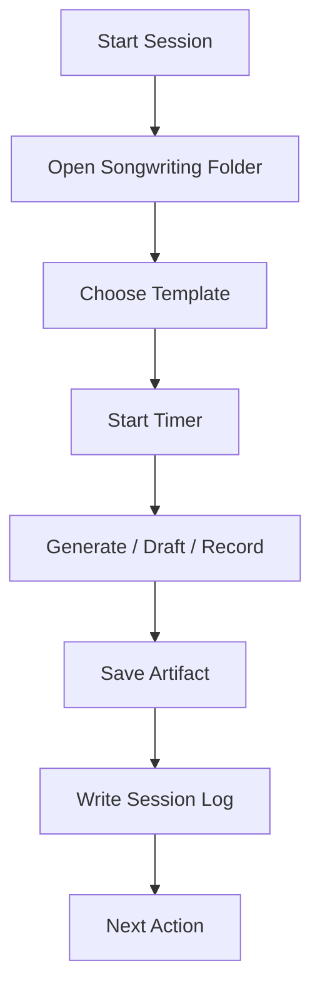
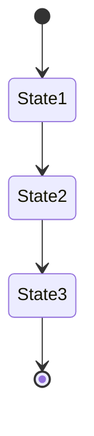
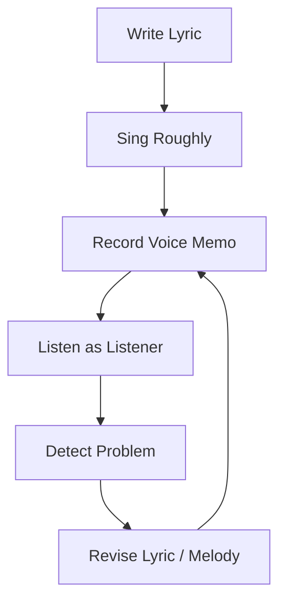
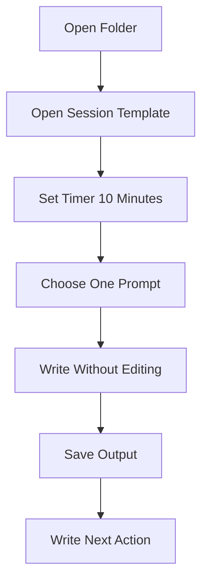
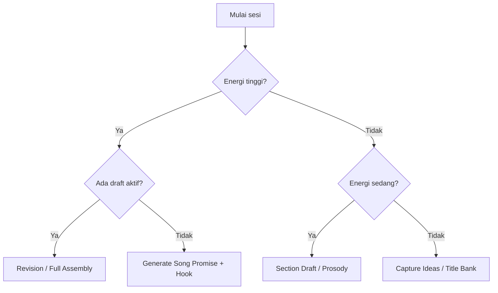

# learn-songwriting-part-004.md

# Removing Practice Barriers: Membuat Environment Songwriting yang Minim Friction

> Seri: `learn-songwriting`  
> Part: `004 / 034`  
> Fokus: mengurangi hambatan praktik agar latihan songwriting bisa dimulai cepat, konsisten, dan menghasilkan output  
> Status seri: belum selesai  
> Prasyarat: `learn-songwriting-part-000.md`, `learn-songwriting-part-001.md`, `learn-songwriting-part-002.md`, `learn-songwriting-part-003.md`

---

## Ringkasan Part Ini

Part ini menjawab pertanyaan praktis:

> “Bagaimana supaya saya benar-benar menulis lagu, bukan hanya membaca teori, menunggu mood, mencari alat, atau tersesat di setup?”

Dalam framework Josh Kaufman, setelah target ditentukan dan skill dipecah, langkah penting berikutnya adalah **remove barriers to practice**.

Untuk songwriting, hambatan praktik sering terlihat sepele:

- tidak tahu mulai dari file mana;
- tidak punya tempat menyimpan ide;
- voice memo berantakan;
- terlalu cepat membuka DAW;
- sibuk mencari chord progression;
- kehilangan baris bagus karena tidak dicatat;
- terlalu banyak aplikasi;
- latihan tidak punya timer;
- tidak ada template;
- tidak ada output per sesi;
- tidak ada sistem versi;
- tidak tahu kapan sesi dianggap selesai;
- harus “mood dulu” untuk mulai.

Masalahnya bukan hanya disiplin. Masalahnya adalah friction.

Dalam engineering, sistem yang sulit dijalankan akan jarang dijalankan. Script yang butuh banyak langkah manual akan sering ditinggalkan. CI yang lambat akan diabaikan. Logging yang buruk membuat debugging mahal.

Songwriting juga begitu.

Jika setiap sesi menulis lagu membutuhkan energi awal besar, kamu akan jarang memulai. Maka kita perlu membuat songwriting environment yang:

```text
mudah dibuka,
mudah dipakai,
mudah merekam,
mudah menyimpan,
mudah dievaluasi,
mudah dilanjutkan.
```

Part ini adalah setup operasional untuk seluruh seri.

---

## Tujuan Part

Setelah menyelesaikan part ini, kamu harus punya:

1. Struktur folder songwriting.
2. Template file Markdown untuk ide, draft, lyric sheet, chord sheet, revision log.
3. Sistem penamaan versi.
4. Workflow voice memo.
5. Reference bank.
6. Practice timer.
7. Checklist sesi latihan.
8. Anti-distraction rule.
9. “Start in 2 minutes” protocol.
10. Definisi output minimal per sesi.
11. Setup untuk 20 jam latihan songwriting.

Target part ini bukan membuat setup sempurna. Targetnya adalah membuat setup yang cukup baik agar tidak menghambat praktik.

---

## Prinsip Utama

```text
Environment design beats motivation.
```

Kalau setiap kali mau menulis kamu harus berpikir:

- buka aplikasi apa?
- file-nya di mana?
- ide sebelumnya ada di mana?
- rekaman kemarin namanya apa?
- chord ditulis di mana?
- draft lama tertimpa tidak?
- harus mulai dari lirik atau melodi?
- bagaimana menilai sesi ini berhasil?

maka energi mental habis sebelum mulai menulis.

Tujuan setup adalah mengurangi pertanyaan operasional.

Songwriting harus bisa dimulai dengan:

```text
buka folder -> buka template -> mulai timer -> tulis/rekam -> simpan output
```

---

## Hubungan dengan Framework Kaufman

Kaufman menekankan bahwa untuk belajar cepat, kita harus menghilangkan hambatan yang membuat praktik sulit dimulai.

Dalam songwriting, hambatan paling umum bukan kekurangan bakat, tetapi:

| Hambatan | Efek |
|---|---|
| Tidak ada target sesi | Praktik jadi kabur |
| Tidak ada template | Waktu habis memikirkan format |
| Tidak ada recorder workflow | Melodi hilang |
| Tidak ada versioning | Revisi kacau |
| Tidak ada reference bank | Analisis lagu berulang dari nol |
| Terlalu banyak tools | Setup mengalahkan writing |
| Terlalu cepat produksi | Songwriting berubah jadi sound design |
| Tidak ada output minimum | Sesi terasa gagal tanpa artefak |
| Tidak ada frictionless start | Menunda karena harus “siap dulu” |

Part ini menghapus hambatan itu satu per satu.

---

## Mental Model: Songwriting Practice as Local Development Environment

Bayangkan songwriting seperti local dev environment.

Kalau development environment buruk:

- dependency susah install;
- build lambat;
- test tidak jelas;
- config tersebar;
- log tidak terbaca;
- file tidak versioned;
- tidak ada README;
- tidak ada seed data;
- setup tiap mesin berbeda.

Hasilnya: engineer jarang melakukan eksperimen kecil.

Songwriting environment yang buruk mirip:

- ide tersebar di chat, notes, kertas, voice recorder;
- file draft tidak jelas;
- rekaman tidak dinamai;
- lirik tidak punya versi;
- chord terpisah;
- tidak tahu bagian mana revisi;
- referensi tercecer;
- terlalu banyak aplikasi;
- tidak ada ritual mulai;
- tidak ada output per sesi.

Kita perlu membuat “local songwriting environment” yang bisa dipakai setiap hari.



---

## Filosofi Setup: Boring, Stable, Repeatable

Setup yang baik bukan yang paling keren. Setup yang baik adalah yang dipakai.

Prinsip:

```text
boring > fancy
stable > impressive
repeatable > inspirational
low friction > feature rich
```

Jangan mulai dengan:

- DAW kompleks;
- plugin banyak;
- template produksi besar;
- notation software;
- sistem project management rumit;
- database ide berlebihan;
- terlalu banyak kategori.

Mulai dengan:

- folder;
- Markdown;
- voice recorder;
- timer;
- satu instrumen opsional;
- checklist;
- naming convention.

Kita ingin membuat workflow yang tetap jalan bahkan saat mood rendah.

---

# Bagian 1 — Struktur Folder Songwriting

Buat folder utama:

```text
learn-songwriting/
```

Di dalamnya:

```text
learn-songwriting/
  00-roadmap/
  01-ideas/
  02-reference-bank/
  03-exercises/
  04-song-drafts/
  05-voice-memos/
  06-revision-logs/
  07-final-mvs/
  08-archive/
```

## Penjelasan Folder

| Folder | Fungsi |
|---|---|
| `00-roadmap/` | Target, DoD, roadmap 20 jam, scope lock |
| `01-ideas/` | Ide mentah, title bank, hook bank, object bank |
| `02-reference-bank/` | Deconstruction lagu referensi |
| `03-exercises/` | Latihan per part |
| `04-song-drafts/` | Draft lagu per judul |
| `05-voice-memos/` | Rekaman melodi, chorus, full take |
| `06-revision-logs/` | Catatan diagnosis dan revisi |
| `07-final-mvs/` | Output Minimum Viable Song |
| `08-archive/` | Ide/draft yang tidak dipakai sekarang |

Struktur ini sengaja sederhana. Jangan buat 50 folder dulu.

---

## Struktur Folder per Lagu

Untuk setiap lagu, buat folder sendiri.

```text
04-song-drafts/
  rak-kedua/
    rak-kedua-v001-raw.md
    rak-kedua-v002-structure.md
    rak-kedua-v003-prosody.md
    rak-kedua-v004-melody.md
    rak-kedua-v005-mvs.md
    chord-sheet.md
    lyric-sheet.md
    song-map.md
    notes.md
```

Voice memo bisa disimpan paralel:

```text
05-voice-memos/
  rak-kedua/
    2026-06-24-rak-kedua-hook-001.m4a
    2026-06-24-rak-kedua-chorus-002.m4a
    2026-06-24-rak-kedua-full-v001.m4a
```

Revision log:

```text
06-revision-logs/
  rak-kedua/
    revision-log.md
```

---

## Kenapa Per Lagu Harus Punya Folder?

Karena lagu akan menghasilkan banyak artefak:

- title candidates;
- raw lines;
- verse draft;
- chorus draft;
- chord sketch;
- melody notes;
- voice memos;
- feedback notes;
- revision logs;
- lyric sheet final.

Jika semua dicampur, kamu kehilangan konteks.

Folder per lagu memberi boundary.

Dalam engineering:

```text
one service, one directory
```

Dalam songwriting:

```text
one song, one directory
```

---

# Bagian 2 — Naming Convention

Naming convention mencegah kekacauan.

## Draft File

Format:

```text
<slug-title>-v<version>-<focus>.md
```

Contoh:

```text
rak-kedua-v001-raw.md
rak-kedua-v002-structure.md
rak-kedua-v003-prosody.md
rak-kedua-v004-hook.md
rak-kedua-v005-mvs.md
```

## Voice Memo

Format:

```text
<date>-<slug-title>-<section>-<take>.<ext>
```

Contoh:

```text
2026-06-24-rak-kedua-hook-001.m4a
2026-06-24-rak-kedua-chorus-002.m4a
2026-06-24-rak-kedua-full-v001.m4a
```

## Reference Deconstruction

Format:

```text
<artist>-<song-title>-deconstruction.md
```

Contoh:

```text
artist-title-deconstruction.md
```

Jika ingin menghindari nama artis spesifik dalam latihan awal, gunakan:

```text
reference-001-dark-ballad.md
reference-002-pop-hook.md
reference-003-story-song.md
```

## Exercise File

Format:

```text
songwriting-practice-<part-number>-<topic>.md
```

Contoh:

```text
songwriting-practice-004-practice-environment.md
```

---

## Versioning Rule

Jangan overwrite draft penting.

Gunakan prinsip:

```text
new major change = new version
small edits = same file
```

Contoh perubahan yang layak versi baru:

- struktur berubah;
- chorus diganti;
- POV berubah;
- hook diganti;
- melodi utama berubah;
- verse 2 ditulis ulang;
- lagu masuk MVS.

Contoh perubahan yang tidak perlu versi baru:

- typo;
- ganti satu kata kecil;
- menambah catatan;
- memindahkan baris sementara.

---

## Snapshot Rule

Setelah sesi latihan penting, buat snapshot.

```text
rak-kedua-v003-prosody.md
```

Lalu jangan edit file itu lagi jika ingin lanjut besar. Copy ke:

```text
rak-kedua-v004-hook.md
```

Ini berguna karena:

- kamu bisa melihat evolusi lagu;
- kamu tidak kehilangan baris lama;
- kamu bisa rollback;
- kamu bisa belajar dari revisi;
- kamu bisa membedakan perubahan yang benar-benar membantu.

---

# Bagian 3 — Template File Wajib

Setup yang baik menyediakan template. Jangan membuat format dari nol setiap sesi.

---

## Template 1: Idea Capture

Buat file:

```text
01-ideas/idea-capture.md
```

Isi:

```markdown
# Idea Capture

## Raw Ideas
- 

## Interesting Titles
- 

## Hook Phrases
- 

## Images / Objects
- 

## Conversations / Lines Heard
- 

## Emotional Situations
- 

## Conflicts
- 

## Places
- 

## Metaphors
- 

## Questions
- 
```

Gunakan file ini sebagai inbox ide mentah.

Aturan:

```text
Jangan evaluasi di file ini.
Tangkap dulu.
Evaluasi nanti.
```

---

## Template 2: Title Bank

Buat file:

```text
01-ideas/title-bank.md
```

Isi:

```markdown
# Title Bank

| Title | Mood | Possible Theme | Notes |
|---|---|---|---|
|  |  |  |  |
```

Contoh:

```markdown
| Rak Kedua | intimate, sad | rindu domestik | gelas/sikat gigi |
| Belum Kubereskan | melancholic | belum move on | bisa chorus |
| Rumah Ini Salah Paham | surreal, sad | rumah menunggu | strong concept |
```

Judul adalah generator lagu. Banyak lagu lahir dari title.

---

## Template 3: Hook Bank

Buat file:

```text
01-ideas/hook-bank.md
```

Isi:

```markdown
# Hook Bank

| Hook Phrase | Syllable Feel | Emotion | Possible Song |
|---|---|---|---|
|  |  |  |  |
```

Contoh:

```markdown
| Kau belum selesai | pendek, kuat | unresolved longing | Rak Kedua |
| Tak kupakai, tak kubuang | rhythmic | denial | Rak Kedua |
| Aku belum belajar sepi | lyrical | vulnerable | unknown |
```

Hook bank berguna ketika chorus terasa lemah.

---

## Template 4: Object Bank

Buat file:

```text
01-ideas/object-bank.md
```

Isi:

```markdown
# Object Bank

## Rumah
- gelas
- kursi
- pintu
- handuk
- rak
- kunci
- sandal
- lampu

## Perjalanan
- koper
- tiket
- boarding pass
- jendela pesawat
- kursi tunggu
- suara pengumuman
- paspor

## Kantor
- badge
- monitor
- lift
- meja
- keyboard
- kartu akses
- notifikasi

## Jalan
- lampu merah
- helm
- aspal basah
- spion
- halte
- warung tutup
```

Object bank membuat lirik lebih konkret.

---

## Template 5: Song Promise

Buat file:

```text
03-exercises/song-promise-template.md
```

Isi:

```markdown
# Song Promise Template

## Theme
...

## Specific Emotional Version
...

## POV
...

## Listener Experience
Lagu ini akan membuat pendengar merasakan:

...

## Promise Sentence
Lagu ini akan membuat pendengar merasakan ______
melalui ______
dari sudut pandang ______
dengan konflik ______.

## Conflict Statement
Narator ingin ______,
tetapi ______,
karena ______.

## Emotional Movement
Start:
Middle:
End:

## Non-Goals
Lagu ini tidak akan membahas:
-
-
-
```

---

## Template 6: Lyric Draft

Buat file:

```text
04-song-drafts/_template-lyric-draft.md
```

Isi:

```markdown
# <Song Title> - Lyric Draft

## Metadata
Title:
Version:
Date:
Language:
Mood:
POV:
Song Promise:
Key / Tonal Center:
Tempo Feel:
Structure:

---

## Title Candidates
1.
2.
3.
4.
5.

---

## Hook Candidates
1.
2.
3.
4.
5.

---

## Section Map
Verse 1 function:
Chorus function:
Verse 2 function:
Bridge function:
Final chorus function:

---

## Raw Lines
-

---

## Verse 1
...

## Pre-Chorus
...

## Chorus
...

## Verse 2
...

## Bridge
...

## Final Chorus
...

---

## Prosody Notes
- Long lines:
- Forced words:
- Breath points:
- Important words:
- Awkward syllables:

---

## Melody Notes
Verse contour:
Chorus contour:
Hook motif:
Peak word:

---

## Chord Notes
Verse:
Chorus:
Bridge:

---

## Problems
-

## Next Revision
-
```

---

## Template 7: Chord Sheet

Buat file:

```text
04-song-drafts/_template-chord-sheet.md
```

Isi:

```markdown
# <Song Title> - Chord Sheet

## Metadata
Title:
Key:
Capo:
Tempo:
Time Feel:
Mood:

---

## Structure
Intro:
Verse:
Chorus:
Verse 2:
Chorus:
Bridge:
Final Chorus:
Outro:

---

## Chords

### Verse
| Chord | Chord | Chord | Chord |
|---|---|---|---|
|  |  |  |  |

### Chorus
| Chord | Chord | Chord | Chord |
|---|---|---|---|
|  |  |  |  |

### Bridge
| Chord | Chord | Chord | Chord |
|---|---|---|---|
|  |  |  |  |

---

## Notes
- Emotional effect:
- Tension:
- Release:
- Problem:
```

Chord sheet ini sengaja sederhana. Jangan habiskan waktu membuat chart kompleks.

---

## Template 8: Song Map

Buat file:

```text
04-song-drafts/_template-song-map.md
```

Isi:

```markdown
# <Song Title> - Song Map

## Song Promise
...

## Emotional State Machine



## Section Function

| Section | Function | Emotional State | Image / Detail | Musical Change |
|---|---|---|---|---|
| Verse 1 |  |  |  |  |
| Chorus |  |  |  |  |
| Verse 2 |  |  |  |  |
| Bridge |  |  |  |  |
| Final Chorus |  |  |  |  |

## Energy Curve

```text
Verse 1:      low
Chorus:      medium/high
Verse 2:     medium
Bridge:      different
Final Chorus high/resolved
```

## What Changes?
Start:
After Verse 1:
After Chorus:
After Verse 2:
After Bridge:
End:
```

---

## Template 9: Revision Log

Buat file:

```text
06-revision-logs/_template-revision-log.md
```

Isi:

```markdown
# <Song Title> - Revision Log

## Current Version
...

## Voice Memo
File:
Date:
Take:

## Listening Pass 1 — No Lyrics
What I remember:
Where attention drops:
Where emotion works:
Where melody sticks:

## Listening Pass 2 — With Lyrics
Awkward words:
Forced rhyme:
Long lines:
Unclear meaning:
Strong lines:

## Listening Pass 3 — Diagnostic
Main problem:
Likely cause:
Revision hypothesis:

## Change List
| Change | Reason | Expected Effect | Result |
|---|---|---|---|
|  |  |  |  |

## Keep
-

## Cut
-

## Rewrite
-

## Next Version
Filename:
Focus:
```

---

## Template 10: Session Log

Buat file:

```text
03-exercises/session-log.md
```

Isi:

```markdown
# Songwriting Session Log

| Date | Duration | Focus | Output | Next Action |
|---|---:|---|---|---|
|  |  |  |  |  |
```

Contoh:

```markdown
| 2026-06-24 | 30m | hook phrase | 12 hook candidates | pilih 3 dan rekam motif |
```

Session log membuat latihan terlihat.

---

# Bagian 4 — Voice Memo Workflow

Melodi sangat mudah hilang. Jangan percaya ingatan.

Aturan:

```text
Jika ada melodi, rekam sekarang.
```

Bahkan kalau:

- vokal jelek;
- nada belum pasti;
- lirik belum final;
- ada noise;
- malu mendengar suara sendiri.

Voice memo bukan performance. Voice memo adalah data.

---

## Jenis Voice Memo

| Jenis | Fungsi |
|---|---|
| `hook` | Menyimpan motif hook |
| `verse` | Menyimpan melodi verse |
| `chorus` | Menyimpan melodi chorus |
| `full` | Menyimpan lagu utuh |
| `experiment` | Menyimpan percobaan chord/melodi |
| `reference` | Menyimpan ide ambience/groove pribadi |

---

## Naming Voice Memo

Format:

```text
YYYY-MM-DD-<song-slug>-<section>-<take>.m4a
```

Contoh:

```text
2026-06-24-rak-kedua-hook-001.m4a
2026-06-24-rak-kedua-hook-002.m4a
2026-06-24-rak-kedua-chorus-001.m4a
2026-06-24-rak-kedua-full-v001.m4a
```

Jika recorder HP tidak nyaman rename langsung, minimal tulis di log:

```markdown
Voice memo: recording 2026-06-24 22:14, hook take 2
```

Lalu rename nanti.

---

## Voice Memo Minimum Protocol

Setiap voice memo harus punya catatan singkat:

```markdown
## Voice Memo Note

File:
Section:
Take:
What works:
Problem:
Next action:
```

Contoh:

```markdown
## Voice Memo Note

File: 2026-06-24-rak-kedua-hook-002.m4a
Section: chorus hook
Take: 2
What works:
- "kau belum selesai" mulai menempel
- nada naik di "belum" terasa pas

Problem:
- terlalu panjang sebelum hook
- napas berat di baris 3

Next action:
- potong chorus jadi 4 baris
- coba hook muncul lebih awal
```

---

## Voice Memo Listening Rule

Jangan langsung menghapus take buruk.

Dengar ulang minimal sekali.

Kadang take buruk punya:

- ritme yang lebih natural;
- frasa yang lebih jujur;
- nada tidak sengaja yang kuat;
- energi yang hilang di take rapi.

Simpan minimal 3 take penting.

---

## Voice Memo as Observability



Tanpa rekaman, kamu hanya menilai dari memori internal. Itu bias.

Dengan rekaman, kamu mendengar lagu sebagai objek eksternal.

---

# Bagian 5 — Reference Bank

Reference bank bukan playlist favorit. Reference bank adalah kumpulan lagu yang sudah didekonstruksi.

Buat folder:

```text
02-reference-bank/
```

File:

```text
reference-index.md
```

Isi:

```markdown
# Reference Index

| ID | Song | Artist | Use Case | What to Study |
|---|---|---|---|---|
| REF-001 |  |  | chorus hook | title placement |
| REF-002 |  |  | verse detail | object writing |
| REF-003 |  |  | dark mood | harmony color |
```

---

## Kategori Referensi

Gunakan kategori fungsi, bukan hanya genre.

| Kategori | Pertanyaan |
|---|---|
| Hook reference | Kenapa bagian ini menempel? |
| Lyric reference | Bagaimana detail konkret dipakai? |
| Prosody reference | Kenapa kata-katanya natural dinyanyikan? |
| Melody reference | Bagaimana contour bekerja? |
| Form reference | Bagaimana section bergerak? |
| Emotional reference | Bagaimana lagu membangun rasa? |
| Minimalist reference | Bagaimana sedikit kata bisa kuat? |
| Satirical reference | Bagaimana kritik dibungkus? |
| Story reference | Bagaimana narasi bergerak? |

---

## Reference Deconstruction Template

Buat file:

```text
02-reference-bank/_template-reference-deconstruction.md
```

Isi:

```markdown
# Reference Deconstruction

## Identity
Reference ID:
Title:
Artist:
Language:
Genre:
Mood:
Tempo feel:

## Why This Reference?
Saya mempelajari lagu ini untuk:

-

## Structure
Intro:
Verse 1:
Pre-Chorus:
Chorus:
Verse 2:
Bridge:
Final Chorus:
Outro:

## Song Promise
Lagu ini tampaknya menjanjikan:

## POV
Siapa bicara:
Kepada siapa:
Jarak emosional:

## Hook
Lyric hook:
Melody hook:
Rhythm hook:
Title placement:

## Verse Function
Verse 1:
Verse 2:

## Chorus Function
Chorus melakukan:

## Contrast
Verse vs chorus:

## Lyric Notes
Concrete details:
Rhyme/sound:
Line length:
Memorable phrase:

## Melody Notes
Verse contour:
Chorus contour:
Peak word:
Repetition:

## Harmony Notes
Tonal mood:
Tension:
Release:

## What I Can Learn
1.
2.
3.

## What I Must Not Copy
1.
2.
3.

## Application to My Song
Saya bisa memakai prinsip:
-
```

---

## Aturan Reference Bank

1. Jangan menyalin lirik.
2. Jangan menyalin melodi.
3. Jangan menyalin vibe secara buta.
4. Ambil fungsi, bukan permukaan.
5. Batasi 3 referensi utama per lagu.
6. Jangan riset referensi tanpa menulis output.

Aturan penting:

```text
1 reference deconstruction harus menghasilkan 1 action untuk lagu sendiri.
```

Contoh action:

```text
Saya akan membuat chorus lebih pendek dari verse.
Saya akan menempatkan title di akhir chorus.
Saya akan membuat verse 2 menambah informasi, bukan mengulang verse 1.
```

---

# Bagian 6 — Practice Timer

Latihan songwriting harus punya waktu terbatas.

Tanpa timer, dua hal terjadi:

- kamu terlalu lama berpikir;
- kamu terlalu cepat menyerah karena tidak tahu kapan selesai.

Gunakan blok:

| Durasi | Fungsi |
|---:|---|
| 5 menit | capture ide cepat |
| 10 menit | generate hook/title |
| 20 menit | object writing |
| 30 menit | draft section |
| 45 menit | prosody/revision |
| 60 menit | mini end-to-end slice |

---

## Session Types

### 1. Capture Session — 5 Menit

Tujuan:

```text
menangkap ide sebelum hilang
```

Output:

- 3 title;
- 3 hook phrase;
- 3 object;
- 1 conflict.

### 2. Generator Session — 20 Menit

Tujuan:

```text
menghasilkan bahan tanpa editing
```

Output:

- 20 raw lines;
- 10 hook phrase;
- 10 object detail.

### 3. Section Draft Session — 30 Menit

Tujuan:

```text
membuat verse atau chorus kasar
```

Output:

- 1 section draft;
- 1 catatan masalah;
- 1 next action.

### 4. Melody Session — 30 Menit

Tujuan:

```text
mencari motif melodi
```

Output:

- 5 voice memo pendek;
- 1 motif terpilih.

### 5. Revision Session — 45 Menit

Tujuan:

```text
memperbaiki bagian spesifik
```

Output:

- diagnosis;
- perubahan;
- versi baru;
- voice memo baru.

### 6. Assembly Session — 60 Menit

Tujuan:

```text
menggabungkan lagu utuh
```

Output:

- full draft;
- song map;
- full voice memo.

---

## Timer Rule

Gunakan aturan:

```text
Satu sesi = satu fokus.
```

Jangan campur semua.

Buruk:

```text
Saya akan mencari ide, menulis verse, membuat chorus, memilih chord, produksi, mixing, dan revisi.
```

Baik:

```text
Sesi 30 menit ini hanya untuk membuat 10 hook phrase dan memilih 2.
```

Fokus sempit membuat output lebih jelas.

---

# Bagian 7 — Start in 2 Minutes Protocol

Ini protokol untuk memulai saat malas atau bingung.



## Protokol Lengkap

1. Buka folder `learn-songwriting`.
2. Buka `session-log.md`.
3. Tulis tanggal dan fokus.
4. Set timer 10 menit.
5. Pilih satu prompt:
   - 10 title;
   - 10 hook phrase;
   - 10 object lines;
   - 1 verse draft;
   - 3 melody motifs.
6. Tulis/rekam tanpa evaluasi.
7. Simpan output.
8. Tulis next action satu kalimat.

Output minimal:

```markdown
Next action:
Besok pilih 3 hook terbaik dan rekam motif.
```

Protokol ini penting karena sering kali memulai lebih sulit daripada melanjutkan.

---

# Bagian 8 — Anti-Distraction Setup

Songwriting mudah berubah menjadi aktivitas lain.

## Distraction Umum

| Distraction | Bentuk |
|---|---|
| Tool distraction | mencari DAW/plugin/aplikasi |
| Theory distraction | membaca teori terus |
| Reference distraction | mendengar lagu referensi tanpa output |
| Production distraction | sound design terlalu cepat |
| Performance distraction | mengulang teknik vokal/gitar |
| Perfection distraction | mengedit satu baris terlalu lama |
| Research distraction | mencari “cara menulis lagu bagus” lagi |
| Comparison distraction | membandingkan dengan artis profesional |

---

## Anti-Distraction Rules

```markdown
# Anti-Distraction Rules

1. Tidak membuka DAW sebelum ada lyric + melody voice memo.
2. Tidak mencari plugin selama 20 jam pertama.
3. Tidak analisis referensi tanpa menulis action.
4. Tidak memperbaiki performance vokal lebih dari kebutuhan voice memo.
5. Tidak edit satu baris lebih dari 5 menit pada generator session.
6. Tidak mencari teori baru jika belum mengerjakan latihan part saat ini.
7. Tidak membandingkan draft v0.1 dengan lagu rilis profesional.
8. Tidak memulai lagu kedua sebelum minimal satu MVS selesai, kecuali sebagai capture ide.
```

---

## Browser / Phone Rule

Saat sesi menulis:

- mode airplane jika tidak butuh internet;
- buka hanya notes/markdown dan recorder;
- reference hanya jika sesi memang reference deconstruction;
- jangan scrolling playlist;
- jangan cari “inspirasi” tanpa batas.

Gunakan rule:

```text
If it does not create an artifact, it is probably avoidance.
```

---

# Bagian 9 — Output Minimum per Sesi

Setiap sesi harus menghasilkan artefak.

Artefak bisa kecil:

- 10 title;
- 10 hook phrase;
- 20 raw lines;
- 1 chorus draft;
- 1 voice memo;
- 1 revision log;
- 1 reference deconstruction;
- 1 song map;
- 1 chord sketch.

Sesi tanpa artefak boleh terjadi, tapi jangan jadi kebiasaan.

## Session Output Contract

Sebelum mulai, tulis:

```markdown
## Session Contract

Duration:
Focus:
Output expected:
Definition of done for this session:
```

Contoh:

```markdown
## Session Contract

Duration: 30 minutes
Focus: chorus hook
Output expected: 10 hook phrases, 3 sung motifs
Definition of done for this session:
- 10 phrases written
- 3 voice memos recorded
- 1 phrase selected for next session
```

---

## Session Completion

Akhiri sesi dengan:

```markdown
## Session Close

What I produced:
What worked:
What failed:
What I should do next:
```

Contoh:

```markdown
## Session Close

What I produced:
- 14 hook phrase
- 4 voice memo

What worked:
- "tak kupakai, tak kubuang" punya rhythm

What failed:
- melody masih terlalu datar

What I should do next:
- coba chorus dengan nada lebih tinggi di "buang"
```

---

# Bagian 10 — Songwriting Kanban Sederhana

Buat file:

```text
00-roadmap/songwriting-kanban.md
```

Isi:

```markdown
# Songwriting Kanban

## Backlog
- 

## Ideation
- 

## Lyric Draft
- 

## Melody Sketch
- 

## Chord/Form
- 

## Voice Memo
- 

## Revision
- 

## MVS Done
- 

## Archive
- 
```

Contoh:

```markdown
## Backlog
- Lagu tentang bandara sebagai kekasih yang selalu pergi

## Ideation
- Rak Kedua

## Lyric Draft
- Rumah Ini Salah Paham

## Melody Sketch
- Tak Kupakai Tak Kubuang

## Revision
- Rak Kedua v0.3

## MVS Done
-
```

Jangan jadikan ini project management rumit. Cukup untuk melihat status.

---

# Bagian 11 — Practice Dashboard 20 Jam

Buat file:

```text
00-roadmap/practice-dashboard-20-hours.md
```

Isi:

```markdown
# Practice Dashboard - 20 Hours

Target: menyelesaikan satu Minimum Viable Song

| Session | Date | Duration | Cumulative | Focus | Output |
|---:|---|---:|---:|---|---|
| 1 |  |  |  |  |  |
| 2 |  |  |  |  |  |
| 3 |  |  |  |  |  |
```

## Contoh Pengisian

```markdown
| 1 | 2026-06-24 | 30m | 30m | setup | folder + target contract |
| 2 | 2026-06-25 | 30m | 1h | idea generation | 20 title + 10 conflicts |
| 3 | 2026-06-25 | 45m | 1h45m | object writing | 30 object lines |
```

Dashboard ini bukan untuk menyalahkan diri. Ini untuk observability.

---

## Time Accounting Rule

Hitung sebagai 20 jam hanya jika aktivitasnya menghasilkan atau memperbaiki lagu.

Termasuk:

- menulis ide;
- membuat song promise;
- object writing;
- menulis lirik;
- membuat melodi;
- memilih chord;
- merekam voice memo;
- mendengar ulang diagnostik;
- revisi;
- reference deconstruction dengan action.

Tidak termasuk:

- scrolling lagu;
- membaca teori tanpa output;
- mencari plugin;
- mengatur DAW;
- menonton tutorial tanpa latihan;
- membandingkan diri;
- merapikan folder berlebihan.

---

# Bagian 12 — Friction Audit

Lakukan audit hambatan.

Isi:

```markdown
# Friction Audit

## Hambatan Memulai
Apa yang membuat saya malas mulai?
-

## Hambatan Menulis
Apa yang membuat saya berhenti saat menulis?
-

## Hambatan Merekam
Apa yang membuat saya tidak merekam?
-

## Hambatan Revisi
Apa yang membuat saya tidak merevisi?
-

## Hambatan Menyelesaikan
Apa yang membuat saya tidak menyelesaikan?
-

## Mitigasi
1.
2.
3.
4.
5.
```

Contoh:

```markdown
## Hambatan Merekam
Saya malu mendengar suara sendiri dan merasa take harus bagus.

## Mitigasi
Voice memo dianggap log, bukan performance.
Take jelek tetap data.
```

---

## Friction Reduction Table

| Friction | Reduction |
|---|---|
| Bingung mulai | Start in 2 Minutes Protocol |
| Ide tercecer | Idea capture file |
| Melodi hilang | Voice memo rule |
| Draft kacau | Naming convention |
| Revisi tidak jelas | Revision log |
| Terlalu banyak teori | Learn small, apply immediately |
| Terlalu cepat produksi | DAW lock rule |
| Perfeksionisme | MVS DoD |
| Tidak konsisten | Practice dashboard |
| Mood dependency | Session templates |

---

# Bagian 13 — Default Practice Prompts

Saat bingung, jangan menunggu inspirasi. Pilih prompt.

## Prompt Ide

```text
Tulis 10 lagu tentang orang yang menginginkan sesuatu tetapi tidak bisa mengatakannya.
```

```text
Tulis 10 judul lagu dari benda di sekitar ruangan.
```

```text
Tulis 10 konflik dengan format: ingin X tetapi Y.
```

## Prompt Object Writing

```text
Pilih satu benda. Tulis 10 baris tanpa menyebut emosi.
```

```text
Tulis 5 benda yang masih menyimpan kebiasaan seseorang.
```

```text
Tulis 10 detail tempat pada jam 2 pagi.
```

## Prompt Hook

```text
Tulis 20 frasa 3–7 kata yang bisa menjadi chorus.
```

```text
Tulis 10 cara mengatakan “aku belum selesai” tanpa kata selesai.
```

```text
Tulis 10 hook dengan pengulangan kata pertama.
```

## Prompt Prosody

```text
Ambil 4 baris lirik. Potong menjadi frasa napas.
```

```text
Tandai kata paling penting di setiap baris.
```

```text
Nyanyikan satu baris dalam 3 ritme berbeda.
```

## Prompt Melody

```text
Nyanyikan satu hook phrase dengan 5 contour berbeda.
```

```text
Buat versi rendah, versi naik, versi jatuh, versi datar, versi melompat.
```

```text
Rekam 3 take tanpa chord, lalu 3 take dengan chord.
```

## Prompt Revision

```text
Dengar voice memo dan tandai 3 bagian yang terasa lemah.
```

```text
Potong chorus 20% lebih pendek.
```

```text
Ganti satu baris abstrak dengan satu benda konkret.
```

---

# Bagian 14 — Default Session Templates

## 10-Minute Emergency Session

Saat sangat sibuk.

```markdown
# 10-Minute Songwriting Session

Date:
Focus:

## Timer: 10 minutes

## Output
- 5 title:
- 5 hook phrase:
- 3 object lines:

## Best Candidate
...

## Next Action
...
```

## 20-Minute Generator Session

```markdown
# 20-Minute Generator Session

Date:
Theme:
Constraint:

## Raw Lines
1.
2.
3.
4.
5.
6.
7.
8.
9.
10.
11.
12.
13.
14.
15.
16.
17.
18.
19.
20.

## Do Not Edit Yet

## Best 3
1.
2.
3.

## Next Action
...
```

## 30-Minute Section Session

```markdown
# 30-Minute Section Draft

Date:
Song:
Section:
Function:

## Constraint
POV:
Mood:
Line count:
Hook / title:

## Draft
...

## What Works
-

## What Fails
-

## Next Action
-
```

## 45-Minute Revision Session

```markdown
# 45-Minute Revision Session

Date:
Song:
Current Version:
Target Version:

## Diagnosis
Main problem:

## Revision Focus
Only fix:

## Before
...

## After
...

## Voice Memo
File:

## Result
Better / Worse / Unclear:

## Next Action
...
```

---

# Bagian 15 — Tool Minimal

## Wajib

| Tool | Fungsi |
|---|---|
| Markdown editor / notes | Menulis lirik, log, template |
| Voice recorder | Menyimpan melodi |
| Timer | Membatasi sesi |
| Folder/file system | Menyimpan artefak |
| Headphone | Mendengar ulang |

## Opsional

| Tool | Fungsi |
|---|---|
| Gitar/piano | Cek chord/melodi sederhana |
| Metronome | Cek tempo/ritme |
| Simple DAW | Hanya setelah lyric/melody ada |
| Rhyming dictionary | Hati-hati, jangan memaksa rima |
| Chord reference | Untuk eksplorasi mood |

## Ditunda

| Tool | Kenapa |
|---|---|
| Plugin library | Mengalihkan ke produksi |
| Mixing template | Bukan fokus |
| Mastering chain | Bukan fokus |
| Notation software kompleks | Tidak perlu untuk MVS |
| Project management app rumit | Overhead |

---

# Bagian 16 — Setup Git Opsional

Karena kamu software engineer, kamu mungkin tergoda memakai Git. Boleh, tapi jangan wajib.

Git berguna untuk:

- versioning draft;
- melihat diff lirik;
- backup;
- eksperimen branch.

Tapi Git bisa menjadi friction jika terlalu formal.

## Jika Pakai Git

Struktur:

```text
learn-songwriting/
  .git/
  README.md
  00-roadmap/
  01-ideas/
  ...
```

Commit style:

```text
feat: add first chorus draft for rak kedua
revise: tighten prosody in chorus
demo: add voice memo notes for hook take 2
archive: move unused title ideas
```

## Aturan Git

```text
Jangan jadikan commit sebagai alasan tidak menulis.
```

Commit cukup setelah sesi, bukan setiap baris.

## Git Diff untuk Lirik

Git diff bisa membantu melihat revisi:

```diff
- Aku masih sangat merindukanmu
- di rumah yang kosong tanpamu
+ Gelasmu di rak kedua
+ tak kupakai, tak kubuang
```

Ini membuat proses belajar terlihat.

---

# Bagian 17 — README Project Songwriting

Buat file:

```text
README.md
```

Isi:

```markdown
# Learn Songwriting

## Goal
Dalam 20 jam latihan terarah, saya akan menyelesaikan satu Minimum Viable Song.

## Current Song
Title:
Status:
Next action:

## Definition of Done
- lyric sheet
- chord sheet
- voice memo
- song map
- revision log
- minimum one revision

## Rules
- Songwriting first, production later.
- Voice memo is data, not performance.
- Bad draft is allowed.
- Every session creates an artifact.
- Do not open DAW before lyric + melody exist.
- Do not compare v0.1 with professional releases.

## Current Focus
Part:
Exercise:
Output:
```

README membuat folder menjadi sistem kerja, bukan tempat sampah file.

---

# Bagian 18 — “No Blank Page” System

Blank page adalah friction besar.

Gunakan seed text.

## Seed untuk Lirik

```markdown
Aku tidak ingin mengatakan ______,
jadi aku akan menunjukkan ______.
```

Contoh:

```markdown
Aku tidak ingin mengatakan aku rindu,
jadi aku akan menunjukkan gelas yang tidak kupindah.
```

## Seed untuk Chorus

```markdown
Kalau lagu ini hanya boleh mengatakan satu hal,
hal itu adalah:
```

## Seed untuk Verse

```markdown
Scene pertama:
Tempat:
Benda:
Gestur:
Hal yang tidak dikatakan:
```

## Seed untuk Bridge

```markdown
Kebenaran baru yang muncul:
```

## Seed untuk Hook

```markdown
Frasa yang ingin pendengar ingat:
```

Setiap template harus menyediakan titik awal.

---

# Bagian 19 — Energy Management

Songwriting membutuhkan energi emosional dan kognitif.

Jangan selalu memaksa sesi berat.

## Jenis Sesi Berdasarkan Energi

| Energi | Sesi yang Cocok |
|---|---|
| Rendah | title bank, object bank, capture idea |
| Sedang | hook phrase, section draft, prosody |
| Tinggi | full draft, melody recording, revision besar |
| Emosional tinggi | object writing, raw lyric |
| Analitis tinggi | diagnostic listening, song map |
| Kreatif tinggi | melody motif, metaphor exploration |

Jika sedang lelah, jangan memaksa full song assembly. Lakukan capture session.

Ini menjaga konsistensi.

---

## Energy-Based Decision Tree



---

# Bagian 20 — Practice Cadence

Idealnya:

```text
20 jam = 40 sesi x 30 menit
```

Atau:

```text
20 jam = 20 sesi x 60 menit
```

Untuk skill kreatif, sesi pendek sering lebih baik karena memberi jarak mendengar ulang.

Rekomendasi:

| Cadence | Cocok Jika |
|---|---|
| 30 menit per hari | ingin konsisten |
| 45 menit, 4x seminggu | punya jadwal sedang |
| 60 menit, 3x seminggu | ingin sesi lebih dalam |
| 2 jam weekend | boleh, tapi jangan hanya weekend jika bisa |

Sesi pendek yang konsisten lebih baik daripada menunggu mood 4 jam.

---

## Example 20-Hour Practice Schedule

```text
Week 1:
- 30m setup
- 30m idea generation
- 30m reference deconstruction
- 30m title/hook bank
- 30m object writing

Week 2:
- 45m song promise
- 45m verse draft
- 45m chorus draft
- 30m prosody pass

Week 3:
- 45m melody motif
- 45m chorus melody
- 45m verse melody
- 30m chord sketch

Week 4:
- 60m full assembly
- 45m voice memo
- 45m diagnostic listening
- 60m revision pass
- 30m final MVS packaging
```

Ini hanya contoh. Yang penting total 20 jam dengan output.

---

# Bagian 21 — Quality of Practice

Latihan yang baik bukan hanya lama. Latihan harus:

- fokus;
- punya target;
- punya output;
- punya feedback;
- punya revisi.

Buruk:

```text
2 jam memainkan chord sambil berharap ide muncul.
```

Lebih baik:

```text
30 menit menulis 20 hook phrase,
memilih 3,
merekam 3 motif,
mencatat 1 next action.
```

## Practice Quality Checklist

```markdown
# Practice Quality Checklist

- [ ] Sesi punya fokus spesifik.
- [ ] Sesi punya timer.
- [ ] Sesi menghasilkan artefak.
- [ ] Artefak disimpan dengan nama jelas.
- [ ] Ada catatan apa yang bekerja.
- [ ] Ada catatan apa yang lemah.
- [ ] Ada next action.
```

Jika semua dicentang, sesi berhasil walau output belum bagus.

---

# Bagian 22 — Avoidance Detection

Kadang kita merasa sedang belajar, padahal sedang menghindar.

## Tanda Avoidance

- menonton tutorial kelima tentang chorus tapi belum menulis chorus;
- mencari aplikasi notes terbaik;
- mengganti folder structure terus;
- mendengar lagu referensi tanpa mencatat;
- membaca teori chord padahal chord basic cukup;
- membuka DAW dan mencari sound;
- mengedit satu kata selama 20 menit;
- mencari “inspirasi” di media sosial;
- menyusun roadmap baru padahal belum latihan.

## Pertanyaan Deteksi

```text
Apakah aktivitas ini menghasilkan artefak untuk lagu saya?
Apakah aktivitas ini menyelesaikan next action terakhir?
Apakah saya sedang menghindari draft buruk?
```

Jika jawabannya tidak, kembali ke session template.

---

# Bagian 23 — The 5-Minute Rescue

Saat stuck, lakukan rescue.

```markdown
# 5-Minute Rescue

## Saya stuck karena:
-

## Saya akan menurunkan target menjadi:
-

## Dalam 5 menit saya hanya akan menghasilkan:
-

## Output:
-

## Next action:
-
```

Contoh:

```markdown
## Saya stuck karena:
Chorus terasa jelek.

## Saya akan menurunkan target menjadi:
Tidak menulis chorus final, hanya 5 alternatif hook.

## Dalam 5 menit saya hanya akan menghasilkan:
5 frasa 3–7 kata.

## Output:
1. kau belum selesai
2. rumah ini salah paham
3. tak kupakai, tak kubuang
4. aku belum belajar sepi
5. pintu ini keras kepala

## Next action:
Nyanyikan 3 frasa besok.
```

Menurunkan target bukan menyerah. Itu menjaga momentum.

---

# Bagian 24 — Setup Review

Setelah setup selesai, review dengan checklist.

```markdown
# Setup Review

## Folder
- [ ] `00-roadmap`
- [ ] `01-ideas`
- [ ] `02-reference-bank`
- [ ] `03-exercises`
- [ ] `04-song-drafts`
- [ ] `05-voice-memos`
- [ ] `06-revision-logs`
- [ ] `07-final-mvs`
- [ ] `08-archive`

## Files
- [ ] `README.md`
- [ ] `idea-capture.md`
- [ ] `title-bank.md`
- [ ] `hook-bank.md`
- [ ] `object-bank.md`
- [ ] `session-log.md`
- [ ] `practice-dashboard-20-hours.md`
- [ ] `songwriting-kanban.md`

## Templates
- [ ] lyric draft template
- [ ] chord sheet template
- [ ] song map template
- [ ] revision log template
- [ ] reference deconstruction template

## Workflow
- [ ] voice memo naming rule
- [ ] session timer rule
- [ ] output minimum rule
- [ ] anti-distraction rules
- [ ] start in 2 minutes protocol
```

Jangan habiskan lebih dari 60–90 menit untuk setup awal. Setelah itu praktik.

---

# Bagian 25 — Recommended Minimal Setup

Jika ingin paling minimal, cukup buat ini:

```text
learn-songwriting/
  README.md
  ideas.md
  session-log.md
  rak-kedua-draft.md
  rak-kedua-revision-log.md
  voice-memos/
```

Dan isi README dengan:

```markdown
# Learn Songwriting

Goal:
One Minimum Viable Song in 20 hours.

Rules:
- Every session creates artifact.
- Voice memo is data.
- Bad draft allowed.
- Production later.

Current next action:
...
```

Setup lengkap bagus. Tapi setup minimal lebih baik daripada tidak mulai.

---

## Latihan Utama Part 004: Buat Practice Environment

Buat file:

```text
songwriting-practice-004-practice-environment.md
```

Isi:

```markdown
# songwriting-practice-004-practice-environment.md

## 1. Folder Structure
Saya akan memakai struktur:

...

## 2. Naming Convention
Draft:
Voice memo:
Reference:
Exercise:

## 3. Tools Minimal
Saya akan memakai:
-
-
-

Saya tidak akan memakai dulu:
-
-
-

## 4. Session Types
Jenis sesi yang akan saya pakai:

| Session Type | Duration | Output |
|---|---:|---|
| Capture |  |  |
| Generator |  |  |
| Section Draft |  |  |
| Melody |  |  |
| Revision |  |  |

## 5. Anti-Distraction Rules
1.
2.
3.
4.
5.

## 6. Start in 2 Minutes Protocol
Langkah saya:
1.
2.
3.
4.
5.

## 7. Output Minimum per Session
Sesi dianggap berhasil jika:

-

## 8. Practice Dashboard
Saya akan mencatat 20 jam latihan di:

...

## 9. Friction Audit
Hambatan terbesar saya:
-

Mitigasi:
-

## 10. Next Action
Setelah setup ini, saya akan:
-
```

---

## Latihan 30 Menit: Setup Minimal

Lakukan dalam 30 menit.

1. Buat folder.
2. Buat README.
3. Buat idea capture.
4. Buat session log.
5. Buat satu draft file.
6. Buat satu revision log.
7. Rekam voice memo dummy 10 detik.
8. Rename atau catat nama voice memo.
9. Tulis next action.

Tujuan voice memo dummy bukan musik. Tujuannya memastikan workflow rekaman tidak jadi friction.

---

## Latihan 45 Menit: First Real Session

Setelah setup, langsung lakukan sesi nyata.

```markdown
# First Real Session

Duration: 45 minutes
Focus: title + hook + object writing

## Output Target
- 10 title
- 10 hook phrase
- 20 object lines
- 1 selected direction
```

Jangan menunggu part berikutnya untuk menulis. Part berikutnya akan lebih mudah jika kamu sudah punya material.

---

## Latihan 60 Menit: Build Reference Bank

Pilih 3 lagu referensi.

Untuk masing-masing, isi singkat:

```markdown
Reference:
Use case:
What I learn:
Action for my song:
```

Contoh:

```markdown
Reference: REF-001
Use case: chorus hook
What I learn: title muncul di akhir chorus dan diulang dua kali.
Action for my song: coba title muncul di baris terakhir chorus.
```

Batasi 60 menit. Jangan jatuh ke rabbit hole.

---

# Checklist Part 004

Sebelum lanjut ke part 005, pastikan:

- [ ] Folder songwriting sudah dibuat.
- [ ] README sudah dibuat.
- [ ] Idea capture file sudah dibuat.
- [ ] Title bank sudah dibuat atau minimal tersedia.
- [ ] Hook bank sudah dibuat atau minimal tersedia.
- [ ] Draft template tersedia.
- [ ] Revision log template tersedia.
- [ ] Session log tersedia.
- [ ] Practice dashboard tersedia.
- [ ] Voice memo workflow sudah diuji.
- [ ] Anti-distraction rules tertulis.
- [ ] Start in 2 Minutes Protocol tertulis.
- [ ] Sesi pertama menghasilkan artefak.
- [ ] Next action tertulis.

---

# Output Wajib Part 004

Buat file:

```text
songwriting-practice-004-practice-environment.md
```

Isi minimal:

```markdown
# songwriting-practice-004-practice-environment.md

## Folder Structure
...

## Naming Convention
...

## Tools
...

## Session Types
...

## Anti-Distraction Rules
...

## Start Protocol
...

## Output Minimum
...

## Friction Audit
...

## Next Action
...
```

---

# Common Failure Modes di Part Ini

## 1. Setup Terlalu Rumit

Gejala:

- membuat terlalu banyak folder;
- membuat sistem tag kompleks;
- setup 3 jam tapi tidak menulis satu baris.

Solusi:

```text
Stop setup after 60–90 minutes.
Do one writing session immediately.
```

## 2. Terlalu Banyak Tools

Gejala:

- mencoba 5 notes app;
- mencari DAW;
- install plugin;
- mencari template produksi.

Solusi:

```text
Markdown + voice recorder + timer.
Enough.
```

## 3. Tidak Menguji Voice Memo

Gejala:

- melodi muncul tapi hilang;
- malu merekam;
- tidak tahu file tersimpan di mana.

Solusi:

```text
Rekam dummy 10 detik hari ini.
```

## 4. Tidak Ada Next Action

Gejala:

- sesi selesai tapi besok bingung lanjut apa.

Solusi:

```text
Setiap sesi harus menulis next action satu kalimat.
```

## 5. Practice Dashboard Jadi Alat Menyalahkan Diri

Gejala:

- merasa gagal karena tidak latihan setiap hari;
- berhenti karena streak putus.

Solusi:

```text
Dashboard adalah observability, bukan moral judgement.
Lanjutkan dari sesi berikutnya.
```

## 6. Reference Bank Jadi Konsumsi Pasif

Gejala:

- mendengar banyak lagu;
- tidak ada action untuk lagu sendiri.

Solusi:

```text
Setiap reference harus menghasilkan satu action.
```

---

# Prinsip Penting

```text
A practice system is good if it makes the next correct action obvious.
```

Dalam songwriting, setup yang baik membuat kamu selalu tahu:

- file mana dibuka;
- apa fokus sesi;
- output apa yang harus dibuat;
- bagaimana menyimpan rekaman;
- apa next action setelah selesai.

Kalau sistemmu membuatmu makin bingung, sistemnya terlalu rumit.

---

# Bridge ke Part Berikutnya

Part ini menghapus hambatan praktik.

Part berikutnya, `learn-songwriting-part-005.md`, akan membahas:

```text
Fast Feedback Loop
```

Kita akan membuat sistem feedback cepat agar kamu tidak hanya menulis, tetapi juga tahu bagaimana mengevaluasi draft:

- self-listening;
- structured feedback;
- specific questions;
- diagnosing vague feedback;
- rubrik lagu;
- revision hypothesis;
- feedback from non-musicians;
- how to avoid ego collapse;
- how to avoid overreacting to one opinion.

Ini penting karena praktik tanpa feedback hanya mengulang kebiasaan lama.

---

# Status Seri

Part ini selesai.

```text
Selesai: learn-songwriting-part-004.md
Berikutnya: learn-songwriting-part-005.md
Status seri: belum selesai
Part tersisa: 30
Target akhir seri: learn-songwriting-part-034.md
```


<!-- NAVIGATION_FOOTER -->
<div class="page-nav">
<a href="./learn-songwriting-part-003.md">⬅️ Deconstructing Songwriting Skill: Memecah “Menulis Lagu” Menjadi Sub-Skill yang Bisa Dilatih</a>
<a href="./index.md">📚 Kategori</a>
<a href="../../index.md">🏠 Home</a>
<a href="./learn-songwriting-part-005.md">Fast Feedback Loop: Membuat Sistem Evaluasi Cepat agar Draft Lagu Bisa Membaik ➡️</a>
</div>
