# learn-songwriting-part-005.md

# Fast Feedback Loop: Membuat Sistem Evaluasi Cepat agar Draft Lagu Bisa Membaik

> Seri: `learn-songwriting`  
> Part: `005 / 034`  
> Fokus: membangun feedback loop untuk songwriting berdasarkan prinsip rapid skill acquisition  
> Status seri: belum selesai  
> Prasyarat: `learn-songwriting-part-000.md` sampai `learn-songwriting-part-004.md`

---

## Ringkasan Part Ini

Part ini menjawab pertanyaan:

> “Setelah saya menulis lirik, melodi, hook, atau draft lagu, bagaimana saya tahu bagian mana yang bekerja, bagian mana yang lemah, dan revisi apa yang harus dilakukan?”

Dalam framework Josh Kaufman, latihan cepat membutuhkan **feedback loop**. Tanpa feedback, kamu hanya mengulang output yang sama. Dengan feedback yang terlalu umum, kamu bingung. Dengan feedback yang terlalu emosional, kamu bisa kehilangan arah. Dengan feedback yang terlalu teknis, lagu bisa menjadi kaku.

Untuk songwriting, feedback loop sangat penting karena tidak ada compiler yang memberi pesan:

```text
Error: chorus lacks emotional payoff
Warning: forced rhyme at line 4
Warning: weak lyric-melody alignment
Warning: verse 2 repeats verse 1 information
```

Kamu harus membangun “compiler” sendiri: sistem mendengar, mendiagnosis, meminta feedback, menafsirkan feedback, dan mengubahnya menjadi revisi yang spesifik.

Part ini membuat sistem itu.

Kita akan memakai mental model:

```text
draft -> record -> listen -> diagnose -> hypothesize -> revise -> retest
```

Tujuan akhirnya: kamu tidak hanya menulis lagu, tetapi bisa **membuat lagu menjadi lebih baik secara sadar**.

---

## Tujuan Part

Setelah menyelesaikan part ini, kamu harus bisa:

1. Memahami kenapa feedback loop penting dalam 20 jam pertama.
2. Membedakan feedback emosional, teknis, struktural, dan sosial.
3. Mendengar draft lagu dengan mode diagnostik, bukan self-judgement.
4. Mengubah komentar kabur seperti “kurang ngena” menjadi masalah yang bisa diuji.
5. Membuat rubrik evaluasi lagu sederhana.
6. Membuat sistem self-listening 3 pass.
7. Meminta feedback dari non-musician secara benar.
8. Meminta feedback dari musician/songwriter secara benar.
9. Menghindari overreacting terhadap satu opini.
10. Menulis revision hypothesis.
11. Menentukan prioritas revisi.
12. Membuat file feedback log untuk setiap lagu.

---

## Prinsip Utama

```text
Feedback is not judgement.
Feedback is information for the next revision.
```

Feedback buruk membuat kamu merasa:

```text
Saya tidak berbakat.
Lagunya jelek.
Saya harus mulai ulang.
```

Feedback baik membuat kamu berpikir:

```text
Chorus belum cukup berbeda dari verse.
Hook belum muncul cukup awal.
Baris 3 terlalu panjang.
POV membingungkan.
Verse 2 mengulang informasi.
Melodi title kurang ditekankan.
```

Feedback yang baik memperkecil masalah.

Bukan:

```text
lagu ini gagal
```

Tetapi:

```text
baris chorus terlalu panjang sehingga hook tidak menempel
```

Jika masalah kecil, revisi bisa dilakukan.

---

## Hubungan dengan Framework Josh Kaufman

Dalam rapid skill acquisition, latihan harus menghasilkan koreksi.

Jika kamu hanya menulis selama 20 jam tanpa mendengar ulang, tanpa feedback, dan tanpa revisi, hasilnya mungkin banyak material, tetapi skill meningkat lambat.

Feedback loop membuat latihan menjadi deliberate practice.

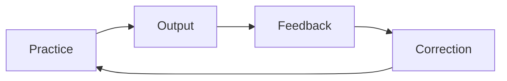

Untuk songwriting:

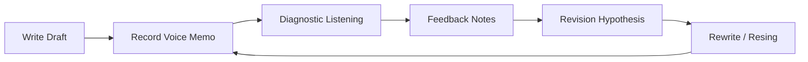

Tanpa voice memo, feedback loop lemah.

Tanpa diagnosis, feedback tidak actionable.

Tanpa revisi, feedback hanya konsumsi emosi.

---

## Songwriting Tidak Punya Compiler, tapi Bisa Punya Diagnostic System

Dalam software, compiler/test/log memberi sinyal:

- syntax error;
- failing test;
- latency spike;
- memory leak;
- race condition;
- null pointer;
- invalid state transition.

Dalam songwriting, sinyalnya lebih halus:

- pendengar tidak ingat chorus;
- kamu sendiri bosan di verse 2;
- lirik terdengar forced saat dinyanyikan;
- title tidak terasa penting;
- melodi terlalu mirip sepanjang lagu;
- chorus tidak memberi release;
- bridge terasa tempelan;
- lagu tidak bisa dijelaskan dalam satu kalimat;
- baris favoritmu tidak mendukung song promise.

Kita perlu membuat “diagnostic compiler” sendiri.

---

## Mental Model: Song Feedback Pipeline

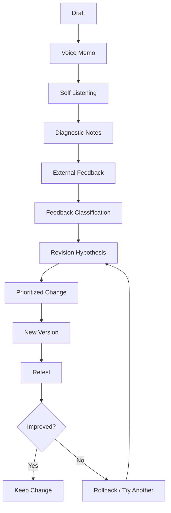

Setiap langkah punya fungsi.

| Langkah | Fungsi |
|---|---|
| Draft | Material mentah |
| Voice memo | Membuat lagu terdengar sebagai objek |
| Self listening | Menemukan gejala awal |
| Diagnostic notes | Mengubah rasa menjadi masalah |
| External feedback | Menguji apakah masalah juga terasa oleh orang lain |
| Classification | Memisahkan jenis masalah |
| Revision hypothesis | Menentukan dugaan sebab-akibat |
| Prioritized change | Menghindari revisi acak |
| New version | Eksperimen |
| Retest | Menguji apakah lebih baik |

---

## Empat Jenis Feedback

Tidak semua feedback sama. Klasifikasikan.

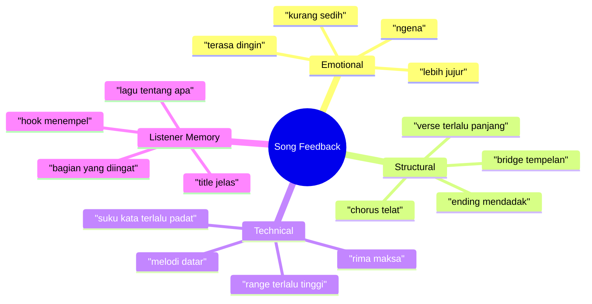

### 1. Emotional Feedback

Contoh:

```text
Kurang ngena.
Lebih sedih di awal daripada akhir.
Aku tidak merasa marahnya.
Bagian chorus terasa jujur.
```

Emotional feedback penting, tetapi sering kabur. Harus diterjemahkan.

### 2. Structural Feedback

Contoh:

```text
Verse 1 terlalu panjang.
Chorus datang terlalu telat.
Bridge tidak terasa perlu.
Verse 2 tidak menambah apa-apa.
```

Structural feedback biasanya mudah ditindak.

### 3. Technical Feedback

Contoh:

```text
Baris ini susah dinyanyikan.
Kata ini jatuh di beat aneh.
Melodi chorus terlalu mirip verse.
Chord ini membuat mood berubah aneh.
```

Technical feedback berguna, terutama dari musician/songwriter.

### 4. Listener Memory Feedback

Contoh:

```text
Yang aku ingat cuma “tak kupakai, tak kubuang”.
Aku tidak ingat chorus-nya.
Aku kira lagunya tentang rumah, bukan orang.
```

Ini sangat penting. Lagu hidup di memori pendengar.

---

## Feedback yang Baik vs Feedback yang Buruk

### Feedback Buruk

```text
Bagus.
Kurang enak.
Kurang vibe.
Biasa aja.
Kurang dapet.
Terlalu aneh.
Aku nggak suka.
```

Bukan berarti tidak berguna, tapi belum actionable.

### Feedback Baik

```text
Aku paham lagunya tentang orang yang belum bisa melepas, tapi chorus-nya belum memberi kalimat yang benar-benar nempel.
```

```text
Verse 1 kuat karena ada gelas dan kursi, tapi verse 2 terasa mengulang rasa yang sama tanpa detail baru.
```

```text
Frasa “tak kupakai, tak kubuang” paling aku ingat karena ritmenya enak dan maknanya jelas.
```

```text
Baris “di antara kesunyian yang mengoyak tubuhku” terasa terlalu besar dibanding detail rumah yang lain.
```

Feedback baik menunjukkan:

- bagian spesifik;
- alasan;
- efek terhadap pendengar;
- arah revisi.

---

## Jangan Bertanya “Bagus Nggak?”

Pertanyaan ini hampir selalu menghasilkan feedback yang buruk.

Karena pendengar akan:

- terlalu sopan;
- terlalu umum;
- takut menyakiti;
- memberi opini personal tanpa arah;
- membandingkan dengan selera mereka;
- tidak tahu harus menilai apa.

Ganti dengan pertanyaan spesifik.

## Pertanyaan Feedback yang Lebih Baik

### Untuk Clarity

```text
Menurutmu lagu ini tentang apa?
Siapa yang bicara di lagu ini?
Dia bicara ke siapa?
Apa konflik utamanya?
```

### Untuk Hook

```text
Bagian mana yang paling kamu ingat?
Ada frasa yang menempel?
Setelah sekali dengar, kamu bisa mengulang bagian chorus?
```

### Untuk Emotion

```text
Bagian mana yang paling terasa emosional?
Bagian mana yang terasa datar?
Emosinya menurutmu berubah atau tetap sama?
```

### Untuk Structure

```text
Ada bagian yang terasa terlalu panjang?
Kapan kamu mulai kehilangan perhatian?
Chorus terasa datang di waktu yang pas?
Bridge terasa perlu atau tempelan?
```

### Untuk Lyric

```text
Ada baris yang terdengar maksa?
Ada kata yang terasa tidak natural?
Ada baris yang terasa terlalu menjelaskan?
Ada gambar/detail yang kamu ingat?
```

### Untuk Melody

```text
Melodi chorus terasa beda dari verse?
Ada bagian yang ingin kamu nyanyikan ulang?
Ada bagian yang terdengar terlalu datar?
```

---

## Feedback untuk Non-Musician vs Musician

Tidak semua pendengar perlu diberi pertanyaan yang sama.

### Non-Musician

Non-musician bagus untuk menilai:

- clarity;
- emotion;
- memorability;
- attention;
- naturalness.

Jangan tanya:

```text
Chord progression-nya gimana?
Prosodinya gimana?
Melodic contour-nya kuat nggak?
```

Tanya:

```text
Lagu ini menurutmu tentang apa?
Bagian mana yang paling kamu ingat?
Ada bagian yang terasa aneh saat didengar?
Kapan perhatianmu mulai turun?
```

### Musician / Songwriter

Musician bagus untuk menilai:

- chord;
- melody;
- form;
- prosody;
- arrangement potential;
- section contrast.

Tanya:

```text
Chorus terasa cukup kontras dari verse?
Kata penting sudah jatuh di tempat kuat?
Melodi hook cukup memorable?
Progression mendukung emosi?
Ada section yang perlu dipotong?
```

---

## Self-Feedback: Masalah Paling Besar

Self-feedback sulit karena kamu punya dua bias:

### 1. Attachment Bias

Kamu terlalu sayang pada baris tertentu karena tahu perjuangan menulisnya.

Gejala:

```text
Baris ini bagus banget, harus dipertahankan.
```

Pertanyaan pembuka:

```text
Apakah baris ini bagus untuk lagu ini, atau hanya bagus sendirian?
```

### 2. Shame Bias

Kamu terlalu keras pada draft karena terdengar belum profesional.

Gejala:

```text
Semua jelek. Saya tidak bisa.
```

Pertanyaan pembuka:

```text
Bagian mana yang paling tidak jelek?
Bagian mana yang bisa diperbaiki dengan satu revisi?
```

Self-feedback harus dibuat struktural agar tidak menjadi self-attack.

---

## The 3-Pass Listening Method

Setiap voice memo didengar minimal tiga kali dengan mode berbeda.

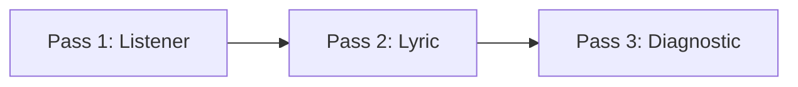

---

## Pass 1 — Listener Mode

Dengar tanpa membaca lirik.

Tujuan:

```text
merasakan lagu seperti pendengar pertama kali
```

Catat:

```markdown
## Pass 1 — Listener Mode

What do I remember?
-

Where does attention drop?
-

What emotion do I feel?
-

What section feels strongest?
-

What section feels weakest?
-

Can I tell what the song is about?
-
```

Jangan edit dulu. Hanya observasi.

### Kenapa tanpa membaca lirik?

Karena pendengar biasanya tidak membaca lyric sheet. Jika makna hanya jelas saat dibaca, lagu mungkin belum bekerja secara musikal.

---

## Pass 2 — Lyric Mode

Dengar sambil membaca lirik.

Tujuan:

```text
menemukan masalah kata, prosodi, dan naturalness
```

Catat:

```markdown
## Pass 2 — Lyric Mode

Lines that feel natural:
-

Lines that feel forced:
-

Lines too long:
-

Words hard to sing:
-

Forced rhymes:
-

Abstract lines:
-

Concrete strong lines:
-

Words that do not match POV:
-
```

Tandai langsung di lirik.

Contoh:

```markdown
Aku masih menunggumu di depan pintu yang sama
[too long] [breath problem]

Di rak kedua, gelasmu tak kupindah
[strong image]

Hatiku hancur dalam luka yang dalam
[generic] [cliche]
```

---

## Pass 3 — Diagnostic Mode

Dengar sambil mencari akar masalah.

Tujuan:

```text
mengubah gejala menjadi hipotesis revisi
```

Catat:

```markdown
## Pass 3 — Diagnostic Mode

Main symptom:
-

Likely cause:
-

Revision hypothesis:
-

What to test:
-

What not to change yet:
-
```

Contoh:

```markdown
Main symptom:
Chorus tidak menempel.

Likely cause:
Hook phrase muncul terlambat dan terlalu banyak kata sebelum title.

Revision hypothesis:
Jika hook muncul di baris pertama dan diulang di baris terakhir, chorus akan lebih memorable.

What to test:
Potong chorus dari 6 baris ke 4 baris.

What not to change yet:
Jangan ubah verse dulu.
```

---

## Timeline Marking

Untuk full voice memo, beri timestamp.

```markdown
# Timeline Notes

0:00 intro terlalu lama
0:12 verse mulai jelas
0:28 baris "gelasmu" kuat
0:44 perhatian turun
0:58 chorus masuk tapi tidak terasa naik
1:12 hook lumayan
1:35 verse 2 mengulang verse 1
2:05 bridge terasa tempelan
```

Timestamp membuat feedback konkret.

Tanpa timestamp, kamu akan menulis:

```text
lagunya agak boring
```

Dengan timestamp:

```text
perhatian turun di 0:44 karena verse terlalu panjang sebelum chorus
```

Itu actionable.

---

## Rubrik Evaluasi Lagu v0.1

Gunakan skor 1–5.

| Dimensi | Pertanyaan | Skor |
|---|---|---:|
| Clarity | Lagu ini tentang apa bisa ditangkap? | 1–5 |
| POV | Siapa bicara ke siapa jelas? | 1–5 |
| Emotional Specificity | Emosi cukup spesifik? | 1–5 |
| Concrete Detail | Ada detail yang bisa dibayangkan? | 1–5 |
| Verse Function | Verse memberi scene/bukti/progress? | 1–5 |
| Chorus Function | Chorus memberi hook/thesis/release? | 1–5 |
| Hook Memorability | Ada bagian yang menempel? | 1–5 |
| Prosody | Lirik natural saat dinyanyikan? | 1–5 |
| Melody Contrast | Chorus beda dari verse? | 1–5 |
| Form Movement | Lagu bergerak dari awal ke akhir? | 1–5 |

Total maksimal:

```text
50
```

Interpretasi:

| Skor | Arti |
|---:|---|
| 10–20 | Masih material mentah |
| 21–30 | Draft ada, banyak masalah utama |
| 31–37 | MVS mulai terbentuk |
| 38–43 | Demo sederhana cukup kuat |
| 44–50 | Sangat kuat untuk tahap awal |

Untuk v0.1, skor 20–30 masih normal.

---

## Jangan Menggunakan Rubrik sebagai Hakim Final

Rubrik bukan kebenaran absolut.

Rubrik membantu diagnosis.

Kadang lagu punya skor teknis sedang, tapi ada satu hook yang sangat hidup. Jangan bunuh itu karena tabel.

Gunakan aturan:

```text
Rubric identifies weakness.
Taste identifies life.
Revision must protect what is alive.
```

Jika ada bagian yang punya energi aneh tapi belum rapi, tandai:

```markdown
Alive but messy:
-
```

Ini kandidat terbaik untuk dikembangkan.

---

## Translating Vague Feedback

Feedback kabur harus diterjemahkan menjadi kemungkinan diagnosis.

### “Kurang ngena”

Kemungkinan:

| Kemungkinan Masalah | Cara Uji |
|---|---|
| Song promise tidak jelas | Tanya pendengar lagu tentang apa |
| Detail terlalu abstrak | Cek jumlah benda/scene konkret |
| Chorus tidak menyatakan thesis | Baca chorus sendiri |
| Melodi tidak menekan kata penting | Tandai peak word |
| Emosi tidak bergerak | Buat emotional state map |

### “Kurang natural”

| Kemungkinan Masalah | Cara Uji |
|---|---|
| Diksi terlalu formal | Ucapkan seperti percakapan |
| Suku kata terlalu padat | Hitung dan nyanyikan lambat |
| Rima memaksa | Tulis versi tanpa rima |
| POV tidak konsisten | Tandai aku/kamu/dia |
| Frasa tidak bernapas | Tandai breath marks |

### “Kurang catchy”

| Kemungkinan Masalah | Cara Uji |
|---|---|
| Hook terlalu panjang | Batasi 3–7 kata |
| Tidak cukup repetition | Hitung kemunculan hook |
| Melodi tidak punya motif | Nyanyikan tanpa lirik |
| Title tidak strategis | Cek title placement |
| Rhythm hook lemah | Tepuk ritme hook |

### “Terlalu datar”

| Kemungkinan Masalah | Cara Uji |
|---|---|
| Verse dan chorus range sama | Bandingkan contour |
| Chord loop monoton | Coba chorus progression berbeda |
| Lirik tidak escalate | Cek verse 2 |
| Tidak ada dynamic contrast | Buat energy map |
| Melodi terlalu banyak nada sama | Tandai melodic shape |

### “Terlalu lebay”

| Kemungkinan Masalah | Cara Uji |
|---|---|
| Kata emosi terlalu besar | Ganti dengan detail konkret |
| Metafora terlalu banyak | Pilih satu metaphor system |
| Vokal/melodi terlalu dramatis | Coba versi lebih rendah/intim |
| Chorus terlalu deklaratif | Buat versi lebih sederhana |
| Tidak ada restraint | Tambahkan silence/short lines |

---

## Feedback Classification Table

Saat menerima feedback, masukkan ke tabel.

```markdown
# Feedback Classification

| Feedback | Source | Type | Specific Section | Possible Cause | Action? |
|---|---|---|---|---|---|
| "Kurang ngena" | listener A | emotional | chorus | hook too abstract | ask follow-up |
| "Baris gelas kuat" | listener A | memory | verse 1 | concrete image | keep |
| "Verse 2 berulang" | listener B | structural | verse 2 | no new info | rewrite verse 2 |
```

Type bisa:

```text
emotional / structural / technical / memory / taste
```

### Taste Feedback

Taste feedback adalah selera personal.

Contoh:

```text
Aku kurang suka lagu lambat.
Aku lebih suka chorus yang ramai.
Aku tidak suka metafora gelap.
```

Taste feedback tidak selalu perlu dituruti. Catat sebagai taste.

---

## Feedback Triage

Tidak semua feedback harus ditindak.

Gunakan triage.

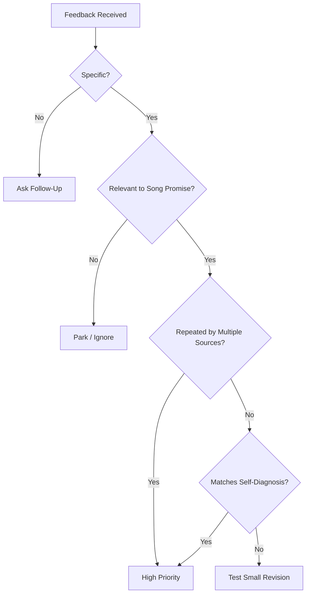

### High Priority Feedback

Feedback prioritas tinggi jika:

- spesifik;
- berulang dari beberapa orang;
- cocok dengan self-diagnosis;
- menyentuh song promise;
- berdampak pada hook/chorus;
- membuat lagu tidak bisa dipahami.

### Low Priority Feedback

Feedback prioritas rendah jika:

- hanya selera genre;
- meminta lagu menjadi lagu lain;
- bertentangan dengan song promise;
- terlalu umum;
- tidak bisa ditindak;
- datang dari satu orang dan tidak kamu rasakan.

---

## Feedback from One Person Is Not Truth

Satu orang bisa benar, bisa juga hanya punya selera berbeda.

Aturan:

```text
Do not rewrite the whole song because of one vague comment.
```

Yang boleh dilakukan:

- catat;
- cari pola;
- uji dengan pertanyaan;
- lakukan revisi kecil;
- bandingkan sebelum/sesudah.

Jangan langsung:

- mengganti genre;
- mengganti seluruh chorus;
- membuang song promise;
- mengubah POV;
- menghapus bagian yang kamu tahu penting.

Feedback adalah data point, bukan perintah.

---

## Revision Hypothesis

Setiap revisi besar harus berbentuk hipotesis.

Format:

```text
Jika saya mengubah ______,
maka ______ akan membaik,
karena ______.
```

Contoh:

```text
Jika saya memotong chorus dari 6 baris menjadi 4 baris,
maka hook akan lebih mudah diingat,
karena title muncul lebih cepat dan tidak terkubur.
```

```text
Jika saya mengganti baris abstrak dengan detail benda,
maka verse akan lebih ngena,
karena pendengar bisa membayangkan situasi, bukan hanya diberi label emosi.
```

```text
Jika saya menaikkan melodi di kata "pulang",
maka emotional payoff akan lebih terasa,
karena kata inti mendapat peak.
```

Hipotesis membuat revisi bisa diuji.

---

## Change One Major Thing at a Time

Jika kamu mengubah semua sekaligus:

- lirik;
- chord;
- melodi;
- tempo;
- POV;
- struktur;

maka kamu tidak tahu apa yang membuatnya membaik atau memburuk.

Untuk latihan awal, gunakan aturan:

```text
Satu revision pass = satu fokus utama.
```

Contoh:

| Revision Pass | Fokus |
|---|---|
| v0.1 -> v0.2 | struktur |
| v0.2 -> v0.3 | chorus hook |
| v0.3 -> v0.4 | prosodi |
| v0.4 -> v0.5 | melody contrast |

---

## Revision Priority Order

Jangan revisi detail kecil sebelum masalah besar.

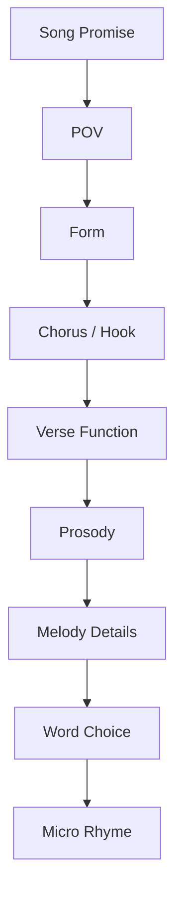

Urutan prioritas:

1. Song promise.
2. POV.
3. Structure/form.
4. Chorus/hook.
5. Verse function.
6. Prosody.
7. Melody contrast.
8. Word choice.
9. Rhyme detail.
10. Polish.

Jangan polishing baris verse 2 jika song promise belum jelas.

---

## Fast Feedback Loop untuk Fragmen

Tidak semua feedback harus menunggu full song. Fragmen juga bisa diuji.

### Hook Test

Input:

```text
1 hook phrase + 3 melody variants
```

Test:

```text
Dengar 3 take.
Mana yang paling menempel setelah 10 menit?
```

### Chorus Test

Input:

```text
chorus 4–6 baris
```

Test:

```text
Apakah title/hook jelas?
Apakah chorus bisa diingat?
Apakah chorus bisa dinyanyikan dua kali tanpa bosan?
```

### Verse Test

Input:

```text
verse 1
```

Test:

```text
Apakah ada scene?
Apakah pendengar tahu situasi?
Apakah ada detail konkret?
Apakah verse mendorong ke chorus?
```

### Prosody Test

Input:

```text
4 baris lirik
```

Test:

```text
Ucapkan biasa.
Nyanyikan lambat.
Tandai kata yang tersandung.
```

---

## The 10-Minute Feedback Loop

Untuk latihan cepat:

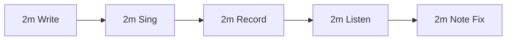

Contoh:

1. Tulis 2 baris hook.
2. Nyanyikan 3 kali.
3. Rekam take terbaik.
4. Dengar ulang.
5. Catat satu masalah dan satu revisi.

Ini sangat efektif untuk 20 jam pertama.

---

## The 30-Minute Feedback Loop

Untuk section:

```text
5m set target
10m write section
5m record
5m listen
5m revision note
```

Output:

- section draft;
- voice memo;
- diagnosis;
- next action.

---

## The 60-Minute Feedback Loop

Untuk full draft:

```text
10m prepare lyric/chord
10m record full take
15m listen 3-pass
10m classify problems
15m revise one focus
```

Jangan mencoba memperbaiki semua dalam satu jam.

---

## Feedback Questions Template

Buat file:

```text
06-revision-logs/feedback-questions-template.md
```

Isi:

```markdown
# Feedback Questions Template

## Context for Listener
Ini masih draft kasar. Saya tidak mencari pujian, saya mencari bagian yang perlu diperjelas.

## Questions for Non-Musician
1. Menurutmu lagu ini tentang apa?
2. Bagian mana yang paling kamu ingat?
3. Ada bagian yang terasa terlalu panjang?
4. Ada baris yang terdengar aneh atau maksa?
5. Emosinya terasa bergerak atau datar?
6. Kalau hanya satu bagian yang harus diperbaiki, bagian mana?

## Questions for Musician/Songwriter
1. Chorus terasa cukup beda dari verse?
2. Hook cukup jelas dan muncul di tempat yang tepat?
3. Ada masalah prosodi?
4. Melodi title cukup ditekankan?
5. Struktur terasa efektif?
6. Bagian mana yang paling perlu dipotong/rewrite?
```

---

## Cara Memberi Konteks Saat Minta Feedback

Jangan memberi terlalu banyak penjelasan sebelum orang mendengar.

Buruk:

```text
Ini lagu tentang seseorang yang sebenarnya masih cinta tapi dia trauma karena masa kecilnya...
```

Itu membuat pendengar bias.

Lebih baik:

```text
Ini draft kasar. Dengar sekali, lalu tolong jawab menurutmu lagu ini tentang apa dan bagian mana yang paling kamu ingat.
```

Setelah mereka menjawab, baru jelaskan intent-mu.

Kenapa?

Karena kamu ingin tahu apakah lagu menyampaikan intent tanpa penjelasan tambahan.

---

## Feedback Request Script

Gunakan script ini.

```text
Aku lagi belajar songwriting dan ini masih draft kasar, bukan performance final.
Boleh bantu dengar sekali?

Aku cuma butuh jawaban untuk 4 hal:
1. Menurutmu lagu ini tentang apa?
2. Bagian mana yang paling kamu ingat?
3. Ada bagian yang terasa terlalu panjang atau membosankan?
4. Ada baris yang terdengar maksa/tidak natural?

Tidak perlu bilang bagus untuk menyenangkan aku.
Aku butuh data untuk revisi.
```

Untuk musician:

```text
Aku butuh feedback songwriting, bukan produksi/performance.
Tolong fokus ke:
1. struktur verse/chorus,
2. hook,
3. prosodi,
4. melodi chorus vs verse,
5. bagian yang harus dipotong.
```

---

## Menerima Feedback Tanpa Ego Collapse

Feedback bisa menyakitkan karena lagu sering terasa personal.

Gunakan pemisahan:

```text
Saya bukan draft saya.
Draft adalah artefak.
Artefak bisa diperbaiki.
```

Jika feedback keras, jangan langsung revisi. Lakukan:

1. Catat kata-katanya.
2. Tunggu beberapa jam atau sehari.
3. Klasifikasikan.
4. Cari apakah ada pola.
5. Tentukan satu revisi kecil.

Jangan membela diri saat orang memberi feedback. Tanya klarifikasi.

Contoh:

```text
Ketika kamu bilang chorus kurang ngena, maksudnya:
- liriknya kurang jelas,
- melodinya kurang naik,
- atau hook-nya kurang ingat?
```

---

## Jangan Membiarkan Feedback Menghapus Identitas Lagu

Ada feedback yang benar secara umum tapi salah untuk lagu ini.

Contoh:

```text
Harusnya chorus lebih ramai.
```

Mungkin benar untuk pop anthem. Tapi kalau song promise adalah intimate confession, chorus terlalu ramai bisa merusak.

Gunakan filter:

```text
Apakah feedback ini mendukung song promise?
```

Jika tidak, parkir.

Feedback harus memperjelas lagu, bukan mengganti lagu.

---

## Feedback Conflict

Kadang feedback bertentangan.

Listener A:

```text
Chorus terlalu pendek.
```

Listener B:

```text
Chorus terlalu panjang.
```

Jangan bingung. Cari masalah di bawahnya.

Mungkin masalah sebenarnya:

- chorus tidak punya payoff;
- hook tidak cukup jelas;
- repetisi tidak terasa satisfying;
- bagian sebelum chorus salah pacing.

Gunakan pertanyaan:

```text
Apa gejala yang sama di balik feedback berbeda?
```

Contoh:

Keduanya mungkin merasa chorus belum memuaskan. Satu menyebut “pendek”, satu menyebut “panjang”, tapi akar masalahnya adalah hook lemah.

---

## Feedback Aggregation

Buat tabel agregasi.

```markdown
# Feedback Aggregation

| Issue | Mentioned By | Severity | Matches Self-Diagnosis? | Priority |
|---|---|---:|---|---|
| Chorus hook unclear | A, B, self | 5 | yes | high |
| Verse 2 repeats | self | 3 | yes | medium |
| Wants faster tempo | C | 2 | no | low |
```

Severity:

| Skor | Arti |
|---:|---|
| 1 | minor taste |
| 2 | small issue |
| 3 | noticeable issue |
| 4 | hurts song |
| 5 | blocks song promise |

---

## Diagnostic Categories

Gunakan kategori masalah.

```markdown
# Diagnostic Categories

## Concept
- song promise unclear
- POV unclear
- conflict weak
- metaphor inconsistent

## Lyric
- abstract
- cliché
- forced rhyme
- line too long
- diction unnatural
- no concrete image

## Melody
- flat
- too hard
- no motif
- hook not emphasized
- verse/chorus too similar

## Harmony
- wrong mood
- no tension
- no release
- too busy
- too repetitive

## Form
- chorus too late
- verse too long
- bridge unnecessary
- verse 2 repeats
- ending weak

## Hook
- too long
- too abstract
- not repeated
- title not placed well
- melody not memorable

## Performance/Recording
- voice memo unclear
- tempo unstable
- cannot judge yet
```

Penting: bedakan masalah songwriting dan masalah performance.

Jika voice memo fals sedikit, belum tentu lagunya lemah.

---

## Separating Songwriting Feedback from Performance Feedback

Karena kita belum fokus performance, jangan biarkan feedback performance mengganggu diagnosis songwriting.

| Feedback | Kategori | Tindakan |
|---|---|---|
| Suaramu kurang stabil | Performance | Catat, tapi bukan prioritas songwriting |
| Chord-nya salah tekan | Performance/instrument | Ulang take jika mengganggu |
| Chorus tidak memorable | Songwriting | Prioritas |
| Lirik terlalu panjang | Songwriting/prosody | Prioritas |
| Tempo goyang | Performance/recording | Bisa rekam ulang |
| Verse 2 tidak menambah cerita | Songwriting/form | Prioritas |

Untuk MVS, rekaman cukup jelas untuk menilai lagu. Tidak perlu sempurna.

---

## Feedback Loop sebagai State Machine

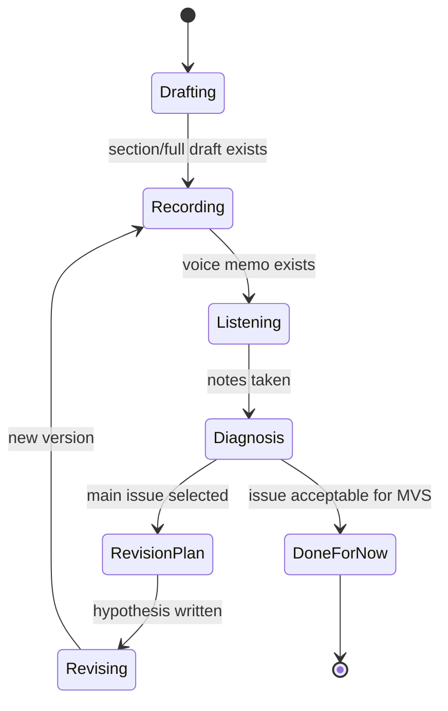

Kamu tidak boleh lompat dari Drafting langsung ke “lagu jelek”.

Harus lewat Recording, Listening, Diagnosis.

---

## Feedback Loop Invariants

Agar sistem feedback sehat, pegang invariants ini.

### Invariant 1: Feedback Harus Mengarah ke Next Action

Jika tidak ada next action, feedback belum selesai diproses.

```text
Feedback -> Diagnosis -> Action
```

### Invariant 2: Jangan Revisi Tanpa Mendengar

Lirik di halaman bisa menipu.

```text
No listening, no final lyric decision.
```

### Invariant 3: Jangan Meminta Feedback Global

Selalu beri pertanyaan spesifik.

```text
Ask for signal, not approval.
```

### Invariant 4: Lindungi Bagian yang Hidup

Saat revisi, jangan membunuh bagian terbaik.

```text
Fix weakness without destroying life.
```

### Invariant 5: Satu Pass, Satu Fokus

```text
Do not solve all problems in one revision pass.
```

---

## Feedback Log Template

Buat file:

```text
06-revision-logs/_template-feedback-log.md
```

Isi:

```markdown
# <Song Title> - Feedback Log

## Version
Song:
Version:
Date:
Voice memo:
Lyric file:

## Self-Listening

### Pass 1 — Listener Mode
What I remember:
Attention drops:
Strongest moment:
Weakest moment:
Emotion felt:

### Pass 2 — Lyric Mode
Forced lines:
Strong lines:
Long lines:
Unclear lines:
Prosody issues:

### Pass 3 — Diagnostic Mode
Main symptom:
Likely cause:
Revision hypothesis:

## External Feedback

| Source | Question | Answer | Type | Priority |
|---|---|---|---|---|
|  |  |  |  |  |

## Aggregated Issues

| Issue | Evidence | Severity | Action |
|---|---|---:|---|
|  |  |  |  |

## Revision Plan

### Keep
-

### Cut
-

### Rewrite
-

### Test
-

## Next Version
Filename:
Focus:
Expected improvement:
```

---

## Example Feedback Log

```markdown
# Rak Kedua - Feedback Log

## Version
Song: Rak Kedua
Version: v0.2
Date: 2026-06-24
Voice memo: 2026-06-24-rak-kedua-full-v002.m4a
Lyric file: rak-kedua-v002-structure.md

## Self-Listening

### Pass 1 — Listener Mode
What I remember:
- "tak kupakai, tak kubuang"

Attention drops:
- verse 2 around 1:20

Strongest moment:
- first chorus ending

Weakest moment:
- bridge feels like explanation

Emotion felt:
- intimate but not yet painful enough

### Pass 2 — Lyric Mode
Forced lines:
- "di palung kesunyian batinku" feels too poetic

Strong lines:
- "gelasmu di rak kedua"
- "tak kupakai, tak kubuang"

Long lines:
- "aku masih menunggumu di depan pintu yang sama"

Unclear lines:
- "rumah ini menyalakan tubuhnya"

Prosody issues:
- too many syllables in verse 2 line 3

### Pass 3 — Diagnostic Mode
Main symptom:
- chorus hook works, but verse 2 weakens momentum

Likely cause:
- verse 2 repeats waiting without new image

Revision hypothesis:
- if verse 2 moves from kitchen to bedroom with a new object,
  the song will feel like it progresses.

## External Feedback

| Source | Question | Answer | Type | Priority |
|---|---|---|---|---|
| A | lagu ini tentang apa? | orang belum move on | clarity | medium |
| A | bagian paling diingat? | tak kupakai tak kubuang | memory | high |
| B | bagian membosankan? | verse 2 | structural | high |

## Aggregated Issues

| Issue | Evidence | Severity | Action |
|---|---|---:|---|
| Verse 2 repeats verse 1 | self + B | 4 | rewrite verse 2 |
| Bridge overexplains | self | 3 | cut or simplify |
| Hook phrase strong | self + A | 5 | keep |

## Revision Plan

### Keep
- "tak kupakai, tak kubuang"
- "gelasmu di rak kedua"

### Cut
- "di palung kesunyian batinku"

### Rewrite
- verse 2 with bedroom objects

### Test
- make chorus enter earlier after verse 2

## Next Version
Filename: rak-kedua-v003-verse2-rewrite.md
Focus: verse 2 progression
Expected improvement: stronger movement before final chorus
```

---

## Red Team / Blue Team Feedback

Karena kamu punya background engineering, gunakan dua mode:

### Blue Team

Tujuan:

```text
menemukan apa yang sudah bekerja dan harus dilindungi
```

Pertanyaan:

```text
Bagian mana yang paling hidup?
Baris mana yang harus dipertahankan?
Hook mana yang punya potensi?
Emosi mana yang terasa benar?
```

### Red Team

Tujuan:

```text
menemukan kelemahan yang menghambat lagu
```

Pertanyaan:

```text
Bagian mana yang paling lemah?
Di mana perhatian turun?
Apa yang membingungkan?
Apa yang terasa klise?
Apa yang tidak mendukung song promise?
```

Jangan hanya red team. Kalau hanya mencari kelemahan, kamu bisa membunuh energi lagu.

Urutan:

```text
Blue team first, red team second.
```

Cari kehidupan dulu, baru masalah.

---

## Debugging by Section

### Verse Debug

Pertanyaan:

```text
Apakah verse punya scene?
Apakah ada detail konkret?
Apakah verse memberi informasi baru?
Apakah verse mengarah ke chorus?
Apakah line terakhir mendorong transisi?
```

Gejala:

| Gejala | Diagnosis |
|---|---|
| Verse membosankan | terlalu abstrak / tidak ada scene |
| Verse terlalu panjang | terlalu banyak setup |
| Verse tidak nyambung chorus | song promise kurang jelas |
| Verse 2 lemah | tidak ada perkembangan |
| Verse terasa seperti diary | kurang bentuk musikal |

### Chorus Debug

Pertanyaan:

```text
Apakah chorus menyatakan inti?
Apakah hook muncul jelas?
Apakah chorus lebih memorable dari verse?
Apakah title ada di tempat strategis?
Apakah chorus bisa diulang?
```

Gejala:

| Gejala | Diagnosis |
|---|---|
| Chorus tidak menempel | hook lemah |
| Chorus terlalu penuh | terlalu banyak informasi |
| Chorus tidak naik | melodi/rhythm/harmoni tidak kontras |
| Chorus terlalu generik | emotional thesis kurang spesifik |
| Chorus terasa seperti verse | section function blur |

### Bridge Debug

Pertanyaan:

```text
Apakah bridge memberi sudut baru?
Apakah bridge mengubah makna final chorus?
Apakah bridge perlu ada?
```

Gejala:

| Gejala | Diagnosis |
|---|---|
| Bridge tempelan | tidak punya reveal |
| Bridge menjelaskan | terlalu literal |
| Bridge memecah mood | contrast terlalu ekstrem |
| Bridge tidak dibutuhkan | hapus untuk MVS |

---

## Debugging by Layer

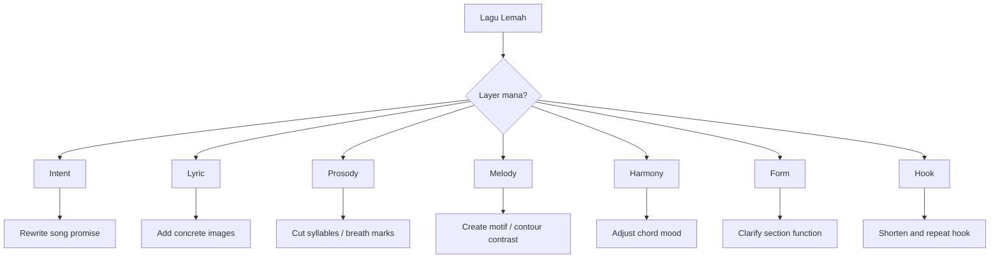

Gunakan layer untuk menghindari revisi salah tempat.

Contoh:

Jika masalahnya song promise, jangan memperbaiki rima dulu.

Jika masalahnya prosodi, jangan mengganti semua chord.

Jika masalahnya hook, jangan menulis bridge baru.

---

## A/B Testing dalam Songwriting

Boleh membuat dua versi dan membandingkan.

### A/B Test Hook

```markdown
Hook A:
kau belum selesai

Hook B:
aku belum belajar sepi

Test:
- mana lebih mudah diingat?
- mana lebih cocok song promise?
- mana lebih enak dinyanyikan?
```

### A/B Test Chorus Opening

```markdown
A:
Tak kupakai, tak kubuang
gelasmu di rak kedua

B:
Gelasmu di rak kedua
tak kupakai, tak kubuang
```

Bandingkan:

- mana lebih kuat membuka chorus?
- mana lebih natural?
- mana lebih mudah diingat?

### A/B Test Melody

Rekam dua motif.

Dengar setelah 30 menit.

Pertanyaan:

```text
Mana yang masih teringat?
Mana yang lebih cocok emosi?
Mana yang lebih mudah dinyanyikan?
```

---

## Beware of Over-Optimization

Feedback loop bisa berubah menjadi endless tweaking.

Tanda over-optimization:

- mengubah satu kata puluhan kali;
- tidak ada full draft baru;
- tidak ada masalah besar yang diselesaikan;
- kualitas tidak naik, hanya berubah;
- kamu kehilangan rasa awal;
- lagu menjadi steril.

Gunakan batas:

```text
Maksimal 3 revision pass besar untuk MVS.
```

Setelah itu, simpan sebagai v1.0 MVS dan lanjut belajar.

Mastery datang dari menulis banyak lagu, bukan menyempurnakan satu lagu pemula selamanya.

---

## Stop Criteria untuk Feedback

Kapan berhenti meminta feedback?

Untuk MVS, cukup jika:

- song promise dapat dipahami;
- hook ada yang diingat;
- lagu bisa dinyanyikan utuh;
- masalah terbesar sudah diketahui;
- minimal satu revisi memperbaiki masalah;
- kamu tahu next improvement untuk versi demo.

Jangan tunggu semua orang setuju.

```text
Feedback loop should produce learning and revision,
not infinite approval seeking.
```

---

## Feedback Safety: Jangan Minta Feedback Terlalu Dini ke Orang yang Salah

Draft sangat awal rapuh.

Untuk v0.1:

- self-feedback dulu;
- atau feedback dari orang yang aman dan bisa spesifik.

Jangan kirim ke:

- orang yang hanya mengejek;
- orang yang tidak paham draft kasar;
- orang yang akan menilai performance final;
- terlalu banyak orang;
- media sosial publik.

Draft awal butuh diagnosis, bukan penghakiman publik.

---

## Feedback Stages

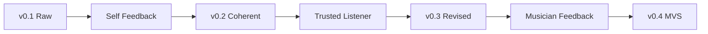

### v0.1 Raw

Feedback:

```text
self only
```

Fokus:

- apakah semua section ada?
- apakah song promise jelas bagi diri sendiri?
- apakah ada bagian hidup?

### v0.2 Coherent

Feedback:

```text
1 trusted listener
```

Fokus:

- lagu tentang apa?
- bagian yang diingat?
- bagian membosankan?

### v0.3 Revised

Feedback:

```text
musician/songwriter jika ada
```

Fokus:

- hook;
- prosody;
- form;
- melody contrast.

### v0.4 MVS

Feedback:

```text
final check
```

Fokus:

- cukup selesai atau perlu satu revisi lagi?

---

## Feedback Questions by Version

| Version | Ask |
|---|---|
| v0.1 | Apa bagian yang hidup dan bagian yang paling rusak? |
| v0.2 | Apakah lagu bisa dipahami dan hook mulai muncul? |
| v0.3 | Apakah struktur, prosodi, dan melodi mendukung? |
| v0.4 | Apakah cukup sebagai MVS? |
| v1.0 | Apa next improvement jika dijadikan demo serius? |

---

## The One-Bug Rule

Dalam satu revision session, pilih satu bug utama.

Contoh bug:

```text
Chorus tidak memorable.
```

Bukan:

```text
Lagu kurang bagus.
```

Bug harus spesifik.

Format:

```markdown
## Main Bug
...

## Evidence
...

## Hypothesis
...

## Fix Attempt
...

## Retest
...
```

Contoh:

```markdown
## Main Bug
Chorus tidak memorable.

## Evidence
Setelah mendengar ulang, saya hanya ingat verse image, bukan chorus.
Listener A juga tidak bisa menyebut hook.

## Hypothesis
Chorus terlalu abstrak dan title tidak diulang.

## Fix Attempt
Buat chorus 4 baris, title muncul baris 1 dan 4.

## Retest
Rekam ulang dan dengar setelah 30 menit.
```

---

## Feedback-Driven Revision Workflow

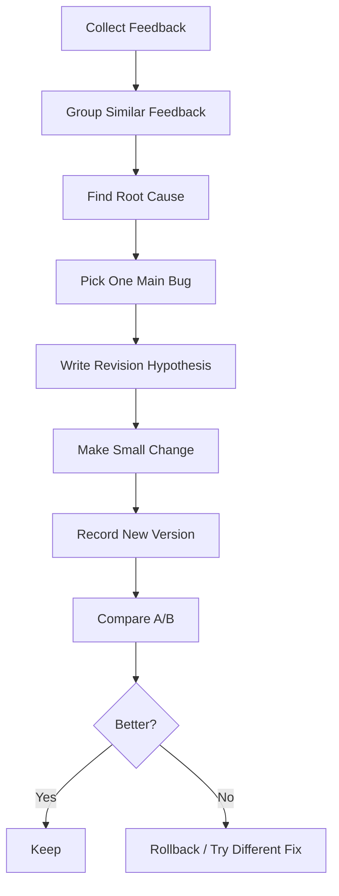

Ini mencegah revisi liar.

---

## Before/After Comparison

Setelah revisi, jangan hanya merasa. Bandingkan.

```markdown
# Before/After Comparison

## Version A
File:
Strength:
Weakness:

## Version B
File:
Change made:
Strength:
Weakness:

## Which is better?
...

## Why?
...

## Keep change?
Yes / No / Partial

## Next action
...
```

Kadang versi baru lebih rapi tapi kurang hidup. Jika begitu, jangan otomatis pilih versi baru.

---

## Protecting the Core

Sebelum revisi, tulis:

```markdown
# Core to Protect

Song promise:
Main hook:
Strongest line:
Strongest image:
Emotional center:
```

Saat revisi, cek apakah core masih ada.

Contoh:

```markdown
Song promise:
rindu yang tidak diakui lewat benda rumah

Main hook:
tak kupakai, tak kubuang

Strongest line:
gelasmu di rak kedua

Strongest image:
dapur malam

Emotional center:
menunggu sebagai kebiasaan
```

Jika revisi menghapus semua itu, mungkin kamu sedang menulis lagu lain.

---

## Feedback Smells

Feedback juga bisa punya smell.

| Feedback Smell | Contoh | Risiko |
|---|---|---|
| Solution without diagnosis | “Harusnya jadi rock” | Mengganti lagu, bukan memperbaiki |
| Taste disguised as truth | “Lagu sedih harus minor” | Formula |
| Over-specific rewrite | “Ganti kata ini jadi…” | Suara penulis hilang |
| Vague judgement | “Kurang dapet” | Tidak actionable |
| Production distraction | “Tambah reverb” | Bukan masalah songwriting |
| Performance distraction | “Vokal kurang bagus” | Bisa mengalihkan fokus |
| Contradicting promise | “Bikin lebih happy” | Merusak intent |
| Too much feedback | 20 opini sekaligus | Paralysis |

Cara merespons:

```text
Terima, klasifikasikan, jangan langsung turuti.
```

---

## How to Ask Follow-Up

Jika feedback kabur:

```text
Kurang ngena.
```

Tanya:

```text
Kurang ngena di bagian mana: verse, chorus, atau keseluruhan?
Menurutmu karena liriknya kurang jelas, melodinya kurang naik, atau emosinya kurang spesifik?
Ada bagian yang justru lebih ngena?
```

Jika feedback:

```text
Terlalu panjang.
```

Tanya:

```text
Bagian mana yang terasa panjang?
Sebelum chorus atau setelah chorus?
Apakah kamu ingin chorus datang lebih cepat atau ada baris yang perlu dipotong?
```

Jika feedback:

```text
Kurang catchy.
```

Tanya:

```text
Setelah dengar, ada frasa yang kamu ingat?
Apakah chorus-nya tidak menempel, atau melodinya terlalu mirip verse?
```

---

## Listening Distance

Dengar ulang dalam tiga jarak waktu.

| Waktu | Fungsi |
|---|---|
| Segera | menangkap masalah teknis jelas |
| 30 menit kemudian | menguji memori hook |
| Besok | menguji apakah lagu masih terasa hidup |

Jika hook tidak diingat setelah 30 menit, mungkin hook lemah.

Jika lagu terasa memalukan besok tapi ada satu baris yang tetap hidup, pertahankan baris itu dan revisi sisanya.

---

## The Morning Test

Setelah menulis malam, jangan finalkan langsung.

Besok pagi atau setelah tidur, dengar lagi.

Tanya:

```text
Apakah saya masih percaya pada lagu ini?
Bagian mana yang masih hidup?
Bagian mana yang terasa berlebihan?
Hook masih teringat?
Apakah emosi terasa jujur atau melodramatic?
```

Morning test sangat berguna untuk mengurangi bias emosi saat menulis.

---

## The Memory Test

Tanpa melihat lirik, coba ingat:

- title;
- hook;
- satu baris verse;
- emosi utama;
- melodi chorus.

Jika kamu sendiri tidak bisa mengingat hook setelah beberapa jam, pendengar mungkin juga tidak.

Tapi hati-hati: kadang hook baru terasa setelah beberapa kali dengar. Jangan langsung buang. Uji 2–3 kali.

---

## The Singability Test

Nyanyikan lagu sambil berjalan atau tanpa instrumen.

Jika lagu hanya bisa dinyanyikan saat kamu membaca lirik dan memainkan chord, mungkin melodi/hook belum cukup kuat.

Test:

```text
Can I sing the chorus without looking?
Can I remember the melody contour?
Can I breathe naturally?
Do I stumble on the same word repeatedly?
```

---

## The One-Sentence Test

Tanya pendengar:

```text
Lagu ini tentang apa?
```

Jika jawabannya sangat jauh dari intent, ada masalah clarity.

Tapi tidak harus 100% sama. Lagu boleh punya ambiguitas.

Yang penting masih berada dalam area song promise.

Contoh intent:

```text
rindu yang tidak diakui
```

Jawaban pendengar:

```text
orang yang belum move on
```

Ini cukup dekat.

Jawaban:

```text
lagu tentang rumah berhantu
```

Mungkin metafora rumah terlalu dominan dan manusia hilang.

---

## The Skip Test

Dengar full voice memo. Tandai kapan kamu ingin skip.

Bagian yang ingin di-skip biasanya punya masalah:

- terlalu panjang;
- tidak ada informasi baru;
- melodi monoton;
- lirik terlalu abstrak;
- section tidak punya fungsi;
- transition lemah.

Jangan merasa bersalah. Skip impulse adalah data.

---

## The Repeat Test

Tandai bagian yang ingin kamu ulang.

Bagian ini mungkin:

- hook kuat;
- baris lirik hidup;
- melodi menarik;
- chord change emosional;
- rhythm phrase enak;
- silence efektif.

Pertahankan dan pelajari.

Feedback bukan hanya mencari salah. Feedback juga mencari apa yang harus diperbanyak.

---

## Fast Feedback Checklist

Gunakan checklist ini setelah setiap draft penting.

```markdown
# Fast Feedback Checklist

## Identity
- [ ] Saya tahu song promise lagu ini.
- [ ] POV jelas.
- [ ] Lagu bisa dijelaskan dalam satu kalimat.

## Listening
- [ ] Ada voice memo.
- [ ] Saya sudah mendengar tanpa membaca lirik.
- [ ] Saya sudah mendengar sambil membaca lirik.
- [ ] Saya sudah mencatat timestamp masalah.

## Hook
- [ ] Ada hook phrase.
- [ ] Hook muncul di tempat strategis.
- [ ] Hook bisa diingat setelah beberapa menit.

## Lyric
- [ ] Ada detail konkret.
- [ ] Ada baris yang terlalu abstrak ditandai.
- [ ] Ada baris yang terlalu panjang ditandai.
- [ ] Rima tidak mengorbankan makna.

## Melody
- [ ] Chorus berbeda dari verse.
- [ ] Kata penting mendapat penekanan.
- [ ] Ada motif yang diulang.

## Form
- [ ] Section punya fungsi.
- [ ] Verse 2 menambah sesuatu.
- [ ] Chorus kembali dengan makna.

## Revision
- [ ] Main bug dipilih.
- [ ] Revision hypothesis ditulis.
- [ ] Next action jelas.
```

---

## Latihan Utama Part 005: Buat Feedback System

Buat file:

```text
songwriting-practice-005-feedback-loop.md
```

Isi:

```markdown
# songwriting-practice-005-feedback-loop.md

## 1. Feedback Philosophy
Feedback bagi saya adalah:

...

## 2. Self-Listening Protocol
Saya akan mendengar draft dengan 3 pass:

### Pass 1 — Listener
Pertanyaan:
-

### Pass 2 — Lyric
Pertanyaan:
-

### Pass 3 — Diagnostic
Pertanyaan:
-

## 3. Feedback Questions

### Untuk Non-Musician
1.
2.
3.
4.
5.

### Untuk Musician/Songwriter
1.
2.
3.
4.
5.

## 4. Feedback Classification
Saya akan mengklasifikasikan feedback menjadi:

- emotional
- structural
- technical
- memory
- taste

## 5. Revision Hypothesis Format
Saya akan memakai format:

Jika saya mengubah ______,
maka ______ akan membaik,
karena ______.

## 6. Revision Priority
Urutan prioritas revisi saya:

1.
2.
3.
4.
5.

## 7. Feedback Boundaries
Saya tidak akan:

-
-
-

## 8. Main Bug Template
Format bug utama:

Main bug:
Evidence:
Hypothesis:
Fix:
Retest:

## 9. Next Action
Draft/fragmen yang akan saya uji:
Feedback yang akan saya cari:
```

---

## Latihan 30 Menit: Self-Listening pada Fragmen

Pilih satu voice memo pendek. Jika belum punya, rekam 30 detik hook atau chorus kasar.

Lakukan:

```text
5 menit: rekam
5 menit: dengar tanpa lirik
5 menit: dengar dengan lirik
5 menit: diagnosis
5 menit: tulis revision hypothesis
5 menit: revisi kecil atau next action
```

Output:

```markdown
Voice memo:
Strongest part:
Weakest part:
Main bug:
Revision hypothesis:
Next action:
```

---

## Latihan 45 Menit: Hook Feedback Loop

1. Tulis 5 hook phrase.
2. Nyanyikan masing-masing.
3. Rekam 5 take pendek.
4. Dengar setelah 10 menit.
5. Pilih 2.
6. Minta satu orang memilih yang paling diingat tanpa menjelaskan maksudnya.
7. Catat hasil.

Template:

```markdown
# Hook Feedback Loop

## Hook Candidates
1.
2.
3.
4.
5.

## Self Memory Test
Most remembered:
Least remembered:

## Listener Test
Listener remembered:
Listener comment:

## Selected Hook
...

## Why
...
```

---

## Latihan 60 Menit: Full Feedback Loop untuk Section

Ambil chorus atau verse.

```markdown
# Section Feedback Loop

## Section
Verse / Chorus:

## Intended Function
...

## Draft
...

## Voice Memo
...

## Self Feedback
Clarity:
Emotion:
Prosody:
Hook:
Problem:

## External Feedback
Question asked:
Answer:

## Revision Hypothesis
...

## Revised Version
...

## Before/After
Better because:
Still weak:
Next action:
```

---

## Output Wajib Part 005

Buat file:

```text
songwriting-practice-005-feedback-loop.md
```

Isi minimal:

```markdown
# songwriting-practice-005-feedback-loop.md

## Feedback Philosophy
...

## Self-Listening Protocol
...

## Feedback Questions
...

## Feedback Classification
...

## Revision Hypothesis
...

## Main Bug Template
...

## Feedback Boundaries
...

## Next Action
...
```

---

## Checklist Part 005

Sebelum lanjut ke part 006, pastikan:

- [ ] Kamu punya feedback philosophy.
- [ ] Kamu punya 3-pass listening protocol.
- [ ] Kamu punya daftar pertanyaan feedback untuk non-musician.
- [ ] Kamu punya daftar pertanyaan feedback untuk musician/songwriter.
- [ ] Kamu punya feedback classification table.
- [ ] Kamu tahu cara menerjemahkan feedback kabur.
- [ ] Kamu punya revision hypothesis format.
- [ ] Kamu punya main bug template.
- [ ] Kamu punya stop criteria feedback.
- [ ] Kamu sudah mencoba minimal satu self-listening pada fragmen/voice memo.
- [ ] Kamu punya next action revisi.

---

## Common Failure Modes di Part Ini

### 1. Meminta Validasi, Bukan Feedback

Gejala:

```text
Aku berharap orang bilang bagus.
```

Solusi:

```text
Minta data spesifik: bagian yang diingat, bagian yang membingungkan, bagian yang terlalu panjang.
```

### 2. Menganggap Feedback sebagai Kebenaran Mutlak

Gejala:

```text
Satu orang bilang chorus kurang enak, jadi semua chorus diganti.
```

Solusi:

```text
Klasifikasikan, cari pola, tulis hipotesis, uji kecil.
```

### 3. Terlalu Defensif

Gejala:

```text
Menjelaskan maksud lagu sebelum orang selesai memberi feedback.
```

Solusi:

```text
Catat dulu. Tanya klarifikasi. Jelaskan setelahnya.
```

### 4. Feedback Terlalu Umum

Gejala:

```text
Kurang dapet.
```

Solusi:

```text
Tanya follow-up: bagian mana, kenapa, apa yang diingat, apa yang terasa panjang?
```

### 5. Revisi Semua Sekaligus

Gejala:

```text
Setelah feedback, ganti lirik, melodi, chord, tempo, POV.
```

Solusi:

```text
Satu revision pass, satu main bug.
```

### 6. Tidak Melindungi Bagian yang Hidup

Gejala:

```text
Versi baru lebih rapi tapi kehilangan energi.
```

Solusi:

```text
Tulis Core to Protect sebelum revisi.
```

### 7. Tidak Merekam

Gejala:

```text
Menilai lagu hanya dari kepala.
```

Solusi:

```text
Voice memo wajib untuk feedback loop.
```

---

## Prinsip Penting

```text
Good feedback does not tell you who you are.
Good feedback tells you what to try next.
```

Dan:

```text
A draft is not improved by opinion.
A draft is improved by tested revision.
```

Feedback hanya berguna jika berubah menjadi tindakan yang diuji.

---

## Bridge ke Part Berikutnya

Part ini menyelesaikan fase fondasi Kaufman:

- target performa;
- deconstruction;
- removing barriers;
- feedback loop.

Part berikutnya, `learn-songwriting-part-006.md`, akan masuk ke:

```text
Anatomy of a Song
```

Kita mulai membedah lagu sebagai sistem:

- song promise;
- section;
- verse;
- chorus;
- refrain;
- pre-chorus;
- bridge;
- hook;
- title;
- intro/outro;
- tension/release;
- information flow;
- emotional architecture.

Ini akan menjadi jembatan dari setup belajar ke praktik penulisan lagu yang konkret.

---

## Status Seri

Part ini selesai.

```text
Selesai: learn-songwriting-part-005.md
Berikutnya: learn-songwriting-part-006.md
Status seri: belum selesai
Part tersisa: 29
Target akhir seri: learn-songwriting-part-034.md
```


<!-- NAVIGATION_FOOTER -->
<div class="page-nav">
<a href="./learn-songwriting-part-004.md">⬅️ Removing Practice Barriers: Membuat Environment Songwriting yang Minim Friction</a>
<a href="./index.md">📚 Kategori</a>
<a href="../../index.md">🏠 Home</a>
<a href="./learn-songwriting-part-006.md">Anatomy of a Song: Lagu sebagai Sistem Emosi, Informasi, Memori, dan Gerak ➡️</a>
</div>
