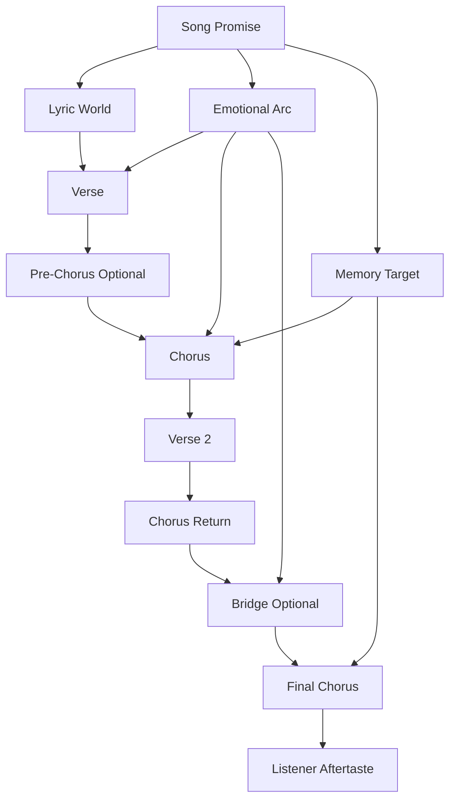
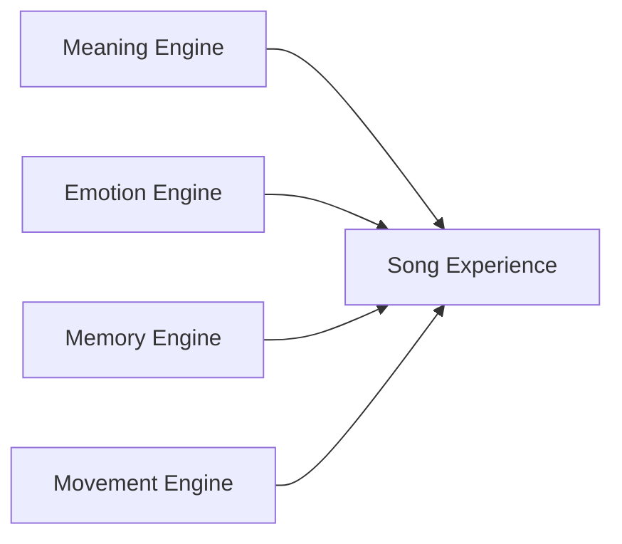
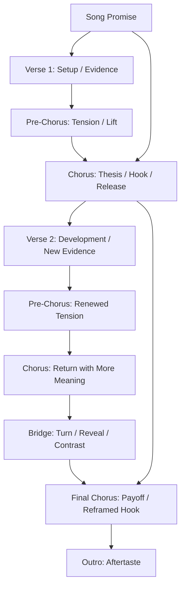
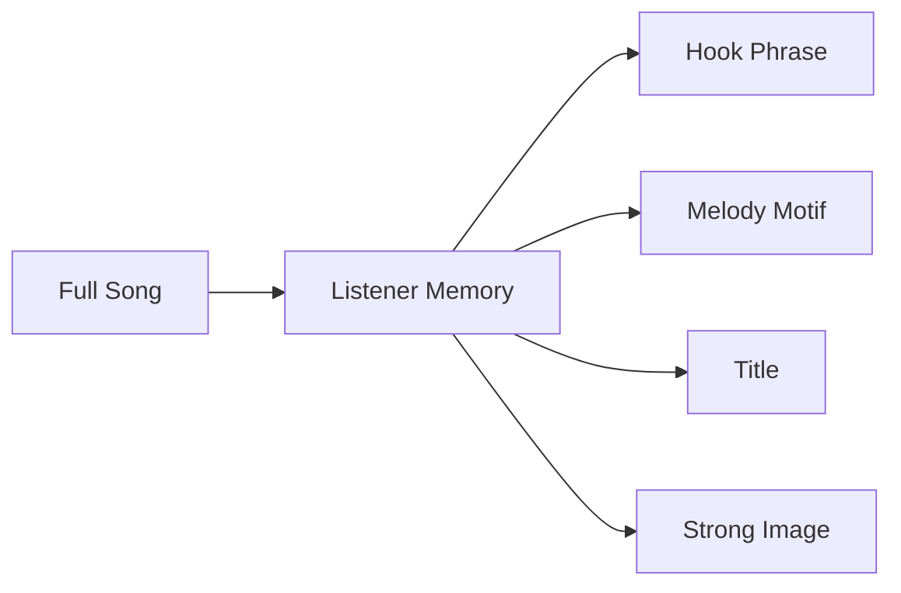
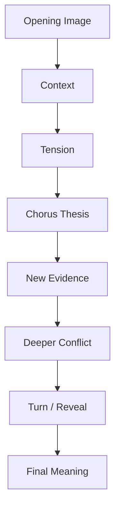
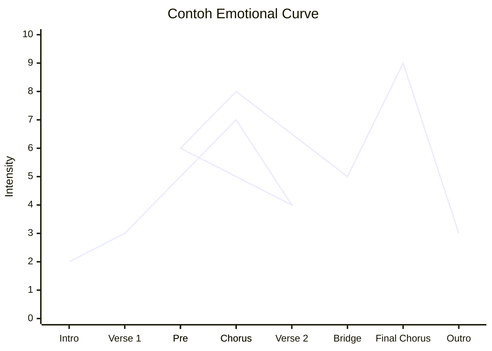
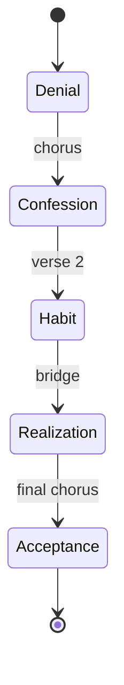
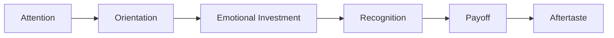
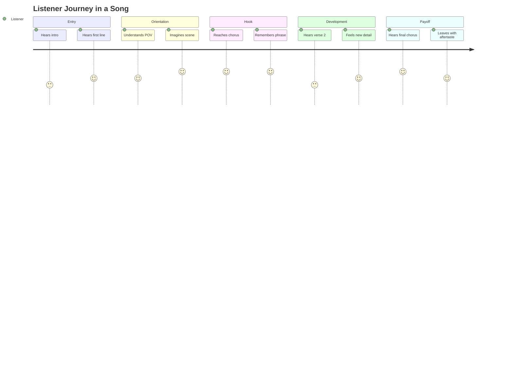
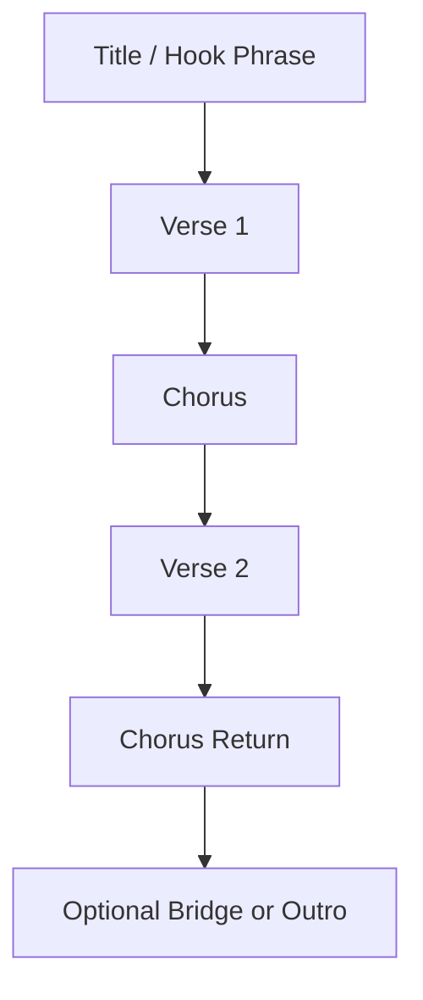

# learn-songwriting-part-006.md

# Anatomy of a Song: Lagu sebagai Sistem Emosi, Informasi, Memori, dan Gerak

> Seri: `learn-songwriting`  
> Part: `006 / 034`  
> Fokus: memahami anatomi lagu sebagai sistem, bukan sekadar kumpulan verse/chorus  
> Status seri: belum selesai  
> Prasyarat: `learn-songwriting-part-000.md` sampai `learn-songwriting-part-005.md`

---

## Ringkasan Part Ini

Part ini mulai masuk ke objek utama: **lagu**.

Pertanyaan dasarnya:

> “Apa sebenarnya yang membuat sebuah lagu terasa seperti lagu, bukan hanya puisi yang diberi chord atau melodi pendek yang diulang?”

Jawabannya: lagu adalah sistem yang mengatur empat hal:

1. **Emosi** — apa yang pendengar rasakan.
2. **Informasi** — apa yang pendengar pahami.
3. **Memori** — apa yang pendengar ingat.
4. **Gerak** — apa yang berubah dari awal sampai akhir.

Banyak pemula memahami lagu hanya sebagai format:

```text
Verse
Chorus
Verse
Chorus
Bridge
Chorus
```

Itu tidak salah, tapi terlalu permukaan.

Format hanya menjelaskan urutan container. Anatomi lagu menjelaskan **fungsi** setiap container.

Verse bukan sekadar bagian sebelum chorus.

Chorus bukan sekadar bagian yang diulang.

Bridge bukan sekadar bagian berbeda sebelum chorus terakhir.

Hook bukan sekadar kalimat pendek.

Title bukan sekadar nama file.

Semuanya punya pekerjaan.

Part ini akan membongkar lagu sebagai sistem arsitektural:

```text
song promise -> section function -> information flow -> emotional curve -> hook memory -> payoff
```

Kita akan membangun mental model agar nanti saat menulis, kamu tidak hanya bertanya:

```text
Harus pakai chord apa?
Harus rima apa?
Harus verse berapa baris?
```

Tetapi bertanya:

```text
Apa fungsi section ini?
Informasi apa yang harus muncul di sini?
Emosi apa yang harus berubah?
Apa yang harus pendengar ingat?
Apa yang harus ditahan dulu?
Apa yang harus dilepas di chorus?
```

---

## Tujuan Part

Setelah menyelesaikan part ini, kamu harus bisa:

1. Memahami lagu sebagai sistem, bukan template.
2. Membedakan struktur permukaan dan fungsi dalam lagu.
3. Menjelaskan peran song promise, verse, chorus, pre-chorus, bridge, refrain, hook, title, intro, dan outro.
4. Membuat song anatomy map untuk lagu yang ingin kamu tulis.
5. Mendiagnosis section yang tidak berfungsi.
6. Memahami information flow: apa yang dibuka, ditahan, diulang, dan diungkap.
7. Memahami emotional curve: bagaimana emosi bergerak.
8. Memahami memory architecture: apa yang membuat lagu menempel.
9. Menghindari template trap.
10. Menyiapkan fondasi untuk part berikutnya: `Song Promise`.

---

## Prinsip Dasar

```text
A song is not a sequence of parts.
A song is a sequence of functions.
```

Bagian lagu bisa bernama sama tapi fungsinya berbeda.

Dua lagu sama-sama punya chorus, tetapi chorus-nya bisa berfungsi sebagai:

- pengakuan;
- tuduhan;
- doa;
- mantra;
- punchline;
- release;
- ironi;
- kesimpulan;
- pertanyaan;
- deklarasi;
- penyangkalan;
- kutukan;
- permintaan pulang.

Jika kamu hanya meniru form tanpa memahami fungsi, lagu akan terasa template.

---

## Lagu sebagai Sistem



Lagu punya input dan output.

Input:

- ide;
- emosi;
- POV;
- konflik;
- genre constraint;
- bahasa;
- mood.

Output:

- pengalaman pendengar;
- baris yang diingat;
- emosi yang tertinggal;
- keinginan untuk mendengar ulang.

Di antara input-output ada sistem section.

---

## Empat Mesin Lagu

Kita sudah menyebut empat mesin di part sebelumnya. Sekarang kita perdalam.



## 1. Meaning Engine

Meaning engine menjawab:

```text
Lagu ini tentang apa?
Siapa bicara?
Apa yang terjadi?
Apa yang dipertaruhkan?
```

Komponen:

- song promise;
- POV;
- konflik;
- metaphor system;
- lyric world;
- title.

Jika meaning engine lemah:

- pendengar bingung;
- lagu terasa generik;
- verse tidak fokus;
- chorus tidak punya thesis.

## 2. Emotion Engine

Emotion engine menjawab:

```text
Apa yang dirasakan pendengar?
Bagaimana intensitas berubah?
Kapan tension muncul?
Kapan release terjadi?
```

Komponen:

- melodic contour;
- chord color;
- rhythm;
- density;
- silence;
- line length;
- register;
- vowel;
- repetition;
- dynamic contrast.

Jika emotion engine lemah:

- lagu datar;
- chorus tidak naik;
- bridge tidak memberi perubahan;
- final chorus tidak terasa berbeda.

## 3. Memory Engine

Memory engine menjawab:

```text
Apa yang menempel?
Apa yang bisa diulang pendengar?
Apa yang tersisa setelah lagu selesai?
```

Komponen:

- hook;
- title placement;
- chorus repetition;
- motif melodi;
- rhyme/sound;
- phrase length;
- rhythmic identity.

Jika memory engine lemah:

- pendengar menikmati sebentar tapi lupa;
- chorus tidak teringat;
- title tidak kuat;
- lagu tidak punya pusat.

## 4. Movement Engine

Movement engine menjawab:

```text
Apa yang berubah dari awal ke akhir?
Kenapa pendengar harus terus mendengar?
```

Komponen:

- verse escalation;
- pre-chorus build;
- bridge turn;
- final chorus meaning shift;
- lyric development;
- arrangement dynamics.

Jika movement engine lemah:

- verse 2 hanya mengulang verse 1;
- chorus terasa sama setiap kali;
- lagu seperti loop tanpa perjalanan;
- bridge tempelan.

---

## Struktur Permukaan vs Struktur Dalam

### Struktur Permukaan

Struktur permukaan adalah label section:

```text
Intro
Verse 1
Pre-Chorus
Chorus
Verse 2
Pre-Chorus
Chorus
Bridge
Final Chorus
Outro
```

Ini berguna, tetapi belum cukup.

### Struktur Dalam

Struktur dalam adalah fungsi:

```text
Intro: membuka mood
Verse 1: memperlihatkan bukti kehilangan
Pre-Chorus: menaikkan ketegangan bahwa narator tidak bisa menyangkal lagi
Chorus: mengakui inti luka
Verse 2: menunjukkan kehilangan masuk ke kebiasaan lain
Bridge: menyadari yang ditunggu bukan orangnya, tapi versi diri sendiri
Final Chorus: pengakuan yang sama, tapi lebih sadar
Outro: meninggalkan aftertaste kosong
```

Dua lagu bisa punya struktur permukaan sama tetapi struktur dalam berbeda total.

---

## Contoh: Struktur Permukaan Sama, Fungsi Berbeda

### Lagu A — Confessional Ballad

```text
Verse 1: aku melihat benda yang kamu tinggalkan
Chorus: aku mengakui masih menunggu
Verse 2: aku mencoba hidup normal tapi gagal
Chorus: pengakuan makin kuat
Bridge: aku sadar aku menunggu diriku yang dulu
Final Chorus: aku melepas sedikit
```

### Lagu B — Satirical Romance

```text
Verse 1: kekasih selalu pergi dengan koper
Chorus: aku menyebutnya pulang hanya ketika butuh panggung
Verse 2: rumah terbakar tapi ia mengirim kartu pos
Chorus: ironi makin tajam
Bridge: aku sadar aku bukan kekasih, hanya alasan
Final Chorus: tuduhan dibungkus panggilan sayang
```

Struktur permukaannya mirip:

```text
Verse - Chorus - Verse - Chorus - Bridge - Chorus
```

Tetapi fungsi dan efeknya berbeda.

---

## Song Anatomy Map

Sebelum menulis lagu, kamu perlu membuat anatomy map.

```markdown
# Song Anatomy Map

## Song Promise
...

## Core Emotion
...

## POV
...

## Conflict
...

## Memory Target
Apa yang harus pendengar ingat?

## Structure
Verse 1:
Pre-Chorus:
Chorus:
Verse 2:
Bridge:
Final Chorus:
Outro:

## Emotional Curve
Start:
Middle:
Peak:
End:

## Information Flow
What is revealed first:
What is withheld:
What is repeated:
What changes:
What is revealed late:

## Hook Strategy
Lyric hook:
Melody hook:
Title placement:
Repetition plan:
```

Anatomy map tidak harus panjang. Tapi harus jelas.

---

## Anatomy Diagram



Pre-chorus dan bridge optional. Tapi fungsinya harus dipahami.

---

# Bagian 1 — Song Promise

Song promise adalah pusat gravitasi lagu.

Ia menjawab:

```text
Lagu ini menjanjikan pengalaman emosional apa?
```

Tanpa song promise, anatomi lagu akan tercerai-berai.

Song promise mempengaruhi:

- section mana yang dibutuhkan;
- berapa banyak detail;
- apakah chorus harus deklaratif atau implisit;
- apakah bridge perlu reveal;
- apakah title harus literal atau metaforis;
- apakah verse butuh narasi atau snapshot;
- apakah lagu perlu ending resolutif atau menggantung.

Contoh song promise:

```text
Lagu ini membuat pendengar merasakan rindu yang tidak diakui
melalui benda-benda rumah yang tetap disiapkan
dari sudut pandang orang yang ditinggalkan
dengan konflik antara ingin melepas dan masih menunggu.
```

Dari promise ini, anatomy-nya bisa dibentuk.

```text
Verse 1: benda dapur
Chorus: pengakuan "tak kupakai, tak kubuang"
Verse 2: benda kamar
Bridge: sadar yang ditunggu mungkin bukan orangnya
Final chorus: hook yang sama, tapi terasa lebih tragis
```

Song promise akan dibahas penuh di part 007. Di part ini, cukup pahami posisinya dalam anatomi lagu.

---

# Bagian 2 — Title

Title bukan hanya nama lagu. Title bisa menjadi:

- hook utama;
- pintu masuk makna;
- ringkasan konflik;
- frase paling memorable;
- ironi;
- objek simbolik;
- pertanyaan;
- nama tempat;
- nama orang;
- kalimat dialog;
- mantra.

## Fungsi Title

| Fungsi | Contoh Bentuk |
|---|---|
| Emotional thesis | “Aku Belum Selesai” |
| Object symbol | “Rak Kedua” |
| Direct address | “Pulanglah” |
| Irony | “Selamat Jalan, Tuan Rumah” |
| Place | “Terminal Tiga” |
| Action | “Tak Kupakai, Tak Kubuang” |
| Question | “Kau Pulang ke Siapa?” |
| Contradiction | “Rumah yang Mengusirmu” |

## Title Placement

Title bisa muncul:

- di baris pertama chorus;
- di baris terakhir chorus;
- di akhir verse;
- hanya sekali sebagai punchline;
- berulang sebagai refrain;
- tidak muncul literal, tapi terasa melalui konsep.

Untuk 20 jam pertama, disarankan title muncul di chorus/refrain agar mudah diingat.

## Failure Mode Title

| Failure | Gejala |
|---|---|
| Title terlalu umum | Tidak membedakan lagu |
| Title terlalu clever | Tidak emosional |
| Title tidak muncul | Pendengar sulit mengingat |
| Title tidak sesuai song promise | Lagu terasa salah nama |
| Title terlalu panjang | Sulit jadi hook |

---

# Bagian 3 — Hook

Hook adalah unit memori.

Hook bisa berada di:

- lirik;
- melodi;
- ritme;
- chord change;
- title;
- silence;
- production;
- gesture vokal.

Untuk songwriting awal, fokus ke:

```text
lyric hook + melody hook
```

## Hook sebagai Memory Anchor

Pendengar tidak mengingat semua kata. Mereka mengingat anchor.



Hook yang baik biasanya:

- pendek;
- punya rhythm;
- punya vowel yang enak;
- mudah diulang;
- terkait song promise;
- muncul di tempat strategis;
- punya melodi yang berbeda;
- tidak terlalu banyak informasi.

## Hook Bukan Selalu “Catchy Bahagia”

Hook bisa gelap, pelan, sinis, atau menyakitkan.

Contoh hook gelap:

```text
tak kupakai, tak kubuang
```

Kenapa bisa hook?

- pendek;
- repetitif;
- rhythm jelas;
- makna emosional kuat;
- ada kontradiksi tindakan;
- bisa diulang.

---

# Bagian 4 — Intro

Intro adalah pintu masuk.

Intro bisa berfungsi untuk:

- menetapkan mood;
- memberi motif;
- memberi ruang sebelum vokal;
- memberi clue genre;
- menciptakan setting;
- menarik pendengar;
- membuat tension.

Untuk Minimum Viable Song, intro tidak wajib kompleks.

## Jenis Intro

| Jenis | Fungsi |
|---|---|
| Chord intro | Menetapkan tonal center |
| Motif intro | Mengenalkan hook melodi |
| Atmosphere intro | Membuka dunia suara |
| Vocal pickup | Langsung ke cerita |
| Percussive intro | Menetapkan groove |
| Silence/space | Membangun intimacy |

## Untuk 20 Jam Pertama

Gunakan intro minimal:

```text
1–2 bar chord
atau langsung verse
atau humming motif hook
```

Jangan habiskan waktu produksi intro.

## Failure Mode Intro

| Failure | Gejala |
|---|---|
| Terlalu panjang | Pendengar menunggu lagu mulai |
| Terlalu menarik dibanding lagu | Ekspektasi tidak terpenuhi |
| Tidak sesuai mood | Lagu terasa salah masuk |
| Fokus produksi | Songwriting tertunda |

---

# Bagian 5 — Verse

Verse adalah tempat lagu memberi **evidence**.

Verse menjawab:

```text
Apa yang terjadi?
Di mana kita?
Siapa yang bicara?
Apa buktinya?
Apa yang berubah?
```

Verse bukan tempat menjelaskan semua emosi secara abstrak.

Buruk:

```text
Aku sedih karena kau pergi
Hatiku hancur dan sepi
Aku tak tahu harus bagaimana
Tanpamu hidupku tak berarti
```

Masalah:

- semua emosi diberi label;
- tidak ada scene;
- tidak ada objek;
- tidak ada gerak;
- terdengar generik.

Lebih kuat:

```text
Gelasmu di rak kedua
tak kupindah sejak Selasa
air panas tetap kusisakan
walau pagi tak lagi bertanya
```

Ini verse karena memberi evidence.

## Fungsi Verse

| Fungsi | Penjelasan |
|---|---|
| Set up world | Membuka tempat, waktu, benda, situasi |
| Establish POV | Menunjukkan siapa yang bicara |
| Provide evidence | Membuktikan emosi lewat detail |
| Build tension | Menyiapkan kebutuhan chorus |
| Move story | Memberi perubahan/informasi baru |
| Delay thesis | Menahan pengakuan sampai chorus |

## Verse 1 vs Verse 2

Verse 1:

```text
membuka dunia
```

Verse 2:

```text
mengembangkan dunia
```

Verse 2 tidak boleh hanya mengulang verse 1 dengan kata lain.

### Contoh Perbedaan

Song promise:

```text
rindu yang tidak diakui lewat benda rumah
```

Verse 1:

```text
dapur, gelas, rak, air panas
```

Verse 2:

```text
kamar, bantal, lemari, lampu tidur
```

Atau:

Verse 1:

```text
aku masih menyiapkan benda-bendamu
```

Verse 2:

```text
aku mulai sadar benda-benda itu menjaga aku, bukan kamu
```

Verse 2 harus memberi perkembangan.

## Verse Failure Modes

| Failure | Gejala | Solusi |
|---|---|---|
| Terlalu abstrak | banyak kata emosi umum | tambah objek/scene |
| Terlalu panjang | chorus telat | potong setup |
| Verse 2 repetitif | tidak ada informasi baru | pindah tempat/state |
| Terlalu puitis | susah dipahami | konkretkan |
| Terlalu literal | seperti diary | gunakan image/gesture |
| Tidak menuju chorus | transisi lemah | buat pre-chorus atau line pivot |

---

# Bagian 6 — Pre-Chorus

Pre-chorus adalah jembatan tension.

Tidak semua lagu butuh pre-chorus.

Pre-chorus berguna jika:

- verse rendah dan detail;
- chorus perlu masuk dengan lift;
- ada tension yang perlu dibangun;
- lirik butuh transisi dari scene ke thesis;
- melodi perlu naik sebelum chorus;
- chord perlu bergerak menuju release.

## Fungsi Pre-Chorus

```text
Verse = evidence
Pre-chorus = pressure
Chorus = release/thesis
```

Contoh:

```text
Verse:
Gelasmu di rak kedua
tak kupakai, tak kubuang

Pre-Chorus:
Tiap pagi aku hampir jujur
lalu menutup mulutku lagi

Chorus:
Kau belum selesai
di rumah yang kupanggil sepi
```

Pre-chorus di sini menaikkan tekanan dari benda ke pengakuan.

## Pre-Chorus Failure Modes

| Failure | Gejala | Solusi |
|---|---|---|
| Tidak menambah tension | terasa tidak perlu | hapus |
| Terlalu mirip verse | tidak terasa build | ubah rhythm/range/chord |
| Terlalu panjang | chorus telat | pendekkan |
| Sudah seperti chorus | chorus jadi lemah | pindahkan hook atau bedakan fungsi |
| Mengulang informasi | tidak ada lift | buat pertanyaan/tension |

Untuk MVS, pre-chorus optional. Jika membuat lagu lebih jelas, pakai. Jika membuat lambat, hapus.

---

# Bagian 7 — Chorus

Chorus adalah pusat gravitasi memori dan emosi.

Chorus biasanya melakukan satu atau lebih fungsi:

- menyatakan emotional thesis;
- memberi hook;
- memberi release;
- mengulang title;
- membuat pendengar bisa ikut bernyanyi;
- merangkum konflik;
- memberi payoff setelah verse;
- mengubah detail menjadi makna.

## Chorus Bukan Sekadar Bagian yang Diulang

Chorus harus menjawab:

```text
Kenapa verse tadi penting?
Apa inti rasa lagu?
Apa yang harus pendengar ingat?
```

Jika verse adalah bukti, chorus adalah klaim emosional.

```text
Verse: gelasmu masih kusimpan
Chorus: aku belum selesai
```

## Jenis Chorus

| Jenis Chorus | Fungsi |
|---|---|
| Declarative | menyatakan inti langsung |
| Confessional | mengaku sesuatu |
| Accusatory | menuduh “kamu” |
| Mantra | mengulang frasa sebagai ritual |
| Question | mengajukan pertanyaan pusat |
| Ironic | mengatakan sesuatu yang berlawanan makna |
| Prayer | memohon |
| Refusal | menolak menerima kenyataan |
| Release | melodi/harmoni membuka setelah verse |

## Chorus Design Rules untuk 20 Jam Pertama

1. Chorus harus lebih mudah diingat daripada verse.
2. Chorus harus lebih pendek atau lebih repetitive daripada verse.
3. Chorus harus punya hook phrase.
4. Title idealnya muncul.
5. Chorus harus terasa berbeda secara melodi/rhythm/density.
6. Chorus tidak perlu menjelaskan semua.
7. Chorus harus bisa diulang.

## Chorus Failure Modes

| Failure | Gejala | Solusi |
|---|---|---|
| Terlalu banyak informasi | susah diingat | kurangi ke satu thesis |
| Terlalu abstrak | tidak ngena | tambah image/hook konkret |
| Tidak ada hook | lupa setelah selesai | buat phrase 3–7 kata |
| Melodi mirip verse | tidak naik | ubah contour/range |
| Terlalu panjang | tidak repeatable | potong 20–40% |
| Title tidak jelas | sulit diingat | tempatkan title strategis |
| Chorus tidak menjawab verse | payoff lemah | align dengan song promise |

---

# Bagian 8 — Refrain

Refrain adalah frasa yang berulang, sering di akhir verse, tetapi tidak selalu menjadi chorus penuh.

Contoh struktur refrain:

```text
Verse 1
Refrain
Verse 2
Refrain
Verse 3
Refrain
```

Refrain cocok untuk lagu yang:

- storytelling;
- folk;
- ballad minimalis;
- tidak butuh chorus besar;
- ingin terasa seperti cerita atau doa;
- ingin hook muncul sebagai kalimat berulang.

## Chorus vs Refrain

| Chorus | Refrain |
|---|---|
| Section penuh | Frasa/baris berulang |
| Biasanya musikal lebih berbeda | Bisa tetap dalam verse |
| Pusat lagu besar | Pusat lagu lebih halus |
| Cocok pop | Cocok folk/story/ballad |
| Bisa 4–8 baris | Bisa 1–2 baris |

## Contoh Refrain

```text
Dan gelasmu tetap di rak kedua.
```

Setiap verse berakhir dengan baris itu, tetapi maknanya berubah.

Verse 1:

```text
baris itu berarti menunggu
```

Verse 2:

```text
baris itu berarti menyangkal
```

Verse 3:

```text
baris itu berarti melepaskan
```

Refrain yang baik bisa sama katanya, tetapi berubah makna karena konteks.

---

# Bagian 9 — Bridge

Bridge adalah turn.

Bridge bukan tempat membuang sisa lirik.

Bridge harus memberi sesuatu yang berbeda:

- sudut baru;
- kebenaran baru;
- perubahan emosi;
- kontras musikal;
- konflik yang lebih dalam;
- ironi;
- jawaban;
- pertanyaan baru;
- reveal.

## Fungsi Bridge

```text
Bridge should make the final chorus mean something different.
```

Jika final chorus terasa sama saja setelah bridge, bridge mungkin tidak perlu.

## Jenis Bridge

| Jenis | Fungsi |
|---|---|
| Reveal | membuka kebenaran tersembunyi |
| Reversal | membalik pemahaman sebelumnya |
| Escalation | menaikkan konflik |
| Breakdown | menurunkan energi untuk intimacy |
| Perspective shift | mengganti sudut pandang |
| Time jump | pindah waktu |
| Moral turn | menyadari makna |
| Question | menggantungkan ketidakpastian |

## Contoh Bridge

Song promise:

```text
aku masih menunggu kamu lewat benda rumah
```

Bridge lemah:

```text
Aku sangat sedih tanpamu
dan aku tak bisa melupakanmu
```

Masalah: mengulang chorus.

Bridge lebih kuat:

```text
Baru kusadar
yang kutunggu bukan langkahmu
tapi aku
sebelum mengenal pintu
```

Ini memberi turn: yang ditunggu bukan hanya orang lain, tetapi diri sendiri.

## Bridge Failure Modes

| Failure | Gejala | Solusi |
|---|---|---|
| Mengulang chorus | tidak ada turn | cari reveal |
| Terlalu panjang | momentum turun | potong |
| Terlalu berbeda | lagu terasa patah | jaga relation ke promise |
| Terlalu menjelaskan | seperti esai | gunakan image |
| Tidak mengubah final chorus | bridge tidak perlu | hapus atau rewrite |

Untuk MVS, bridge optional. Lagu pertama boleh tanpa bridge jika verse/chorus sudah kuat.

---

# Bagian 10 — Final Chorus

Final chorus bukan hanya chorus terakhir.

Final chorus idealnya terasa berbeda karena perjalanan sebelumnya.

Bisa berbeda lewat:

- intensitas;
- lirik kecil yang berubah;
- melodi lebih tinggi;
- harmony variation;
- backing vocal;
- stripped down;
- repetition tambahan;
- silence sebelum masuk;
- title diulang lebih kuat;
- makna berubah setelah bridge.

## Reframed Chorus

Contoh hook:

```text
tak kupakai, tak kubuang
```

Chorus pertama:

```text
berarti penyangkalan
```

Final chorus setelah bridge:

```text
berarti kesadaran bahwa narator belum sanggup melepas
```

Kata sama, makna berubah.

Itu final chorus yang bekerja.

## Final Chorus Failure Modes

| Failure | Gejala | Solusi |
|---|---|---|
| Sama persis tanpa efek | terasa copy-paste | tambahkan reframing |
| Terlalu banyak perubahan | hook hilang | ubah sedikit saja |
| Tidak lebih emosional | payoff lemah | bangun bridge/verse 2 |
| Terlalu panjang | melelahkan | jaga repetition |
| Over-singing | performance mengalahkan song | fokus meaning |

---

# Bagian 11 — Outro

Outro adalah aftertaste.

Outro bisa:

- mengulang hook;
- menghilang perlahan;
- memberi final line;
- meninggalkan unresolved chord;
- kembali ke intro motif;
- memotong tiba-tiba;
- memberi silence;
- menyisakan pertanyaan.

Untuk 20 jam pertama, outro sederhana cukup.

## Jenis Outro

| Jenis | Efek |
|---|---|
| Repeat hook | memperkuat memori |
| Final line | memberi punch |
| Fade mood | lingering feeling |
| Abrupt ending | shock/irony |
| Return to intro | circularity |
| Unresolved chord | rasa belum selesai |
| Spoken line | theatrical/intimate |

## Failure Mode Outro

| Failure | Gejala |
|---|---|
| Terlalu panjang | lagu melemah setelah peak |
| Tidak memberi aftertaste | selesai datar |
| Mengulang terlalu banyak | pendengar lelah |
| Ending tidak sesuai promise | emosinya salah |
| Terlalu dipikirkan | MVS tertunda |

Untuk MVS:

```text
Final chorus + satu baris outro cukup.
```

---

# Bagian 12 — Information Flow

Lagu mengatur informasi.

Tidak semua harus dijelaskan di awal.



## Apa yang Dibuka?

- tempat;
- mood;
- POV;
- konflik awal;
- objek penting.

## Apa yang Ditahan?

- alasan sebenarnya;
- pengakuan paling jujur;
- siapa yang salah;
- apakah narator sadar;
- makna metafora;
- keputusan akhir.

## Apa yang Diulang?

- hook;
- title;
- motif;
- konflik utama;
- image utama.

## Apa yang Berubah?

- emosi;
- pemahaman;
- intensitas;
- posisi narator;
- makna hook.

---

## Information Flow Example

Song promise:

```text
orang yang belum bisa membuang barang mantan
```

Information flow:

| Section | Information |
|---|---|
| Verse 1 | Ada gelas yang tidak dipindah |
| Chorus | Narator belum bisa melepas |
| Verse 2 | Kebiasaan itu menyebar ke kamar |
| Chorus 2 | Hook terasa lebih obsesif |
| Bridge | Narator sadar benda itu alasan untuk tidak berubah |
| Final Chorus | Hook terasa seperti pengakuan, bukan kebiasaan |

Ini membuat lagu bergerak.

---

# Bagian 13 — Emotional Curve

Lagu butuh kurva emosi.

Tidak semua bagian harus intens.

Jika semua bagian intens, tidak ada yang benar-benar intens.



## Pola Umum Emotional Curve

### 1. Gradual Build

```text
low -> medium -> high -> higher -> release
```

Cocok untuk ballad dan anthem.

### 2. Intimate Loop

```text
low -> medium -> low -> medium -> quiet ending
```

Cocok untuk lagu minimalis.

### 3. Shock Opening

```text
high -> low -> high -> higher
```

Cocok untuk lagu konflik/satir.

### 4. Circular

```text
medium -> medium -> medium
```

Cocok jika sengaja membuat rasa terjebak, tapi harus hati-hati agar tidak membosankan.

---

## Emotional State Map

Selain intensity, map juga state.



State lebih penting daripada volume.

Lagu bisa pelan tapi bergerak secara emosional.

---

# Bagian 14 — Tension and Release

Tension/release adalah mesin utama lagu.

Tension bisa berasal dari:

- lirik;
- chord;
- melodi;
- ritme;
- silence;
- repetition;
- unresolved phrase;
- withheld information.

Release bisa berupa:

- chorus;
- title;
- chord resolution;
- nada panjang;
- pengakuan;
- repetition yang satisfying;
- perubahan range;
- final line.

## Tension Examples

| Tension Source | Contoh |
|---|---|
| Lyrical | narator hampir mengaku tapi tidak jadi |
| Harmonic | chord menggantung sebelum chorus |
| Melodic | melodi naik tapi belum mencapai peak |
| Rhythmic | frasa rapat sebelum nada panjang |
| Structural | chorus ditunda |
| Semantic | ada sesuatu yang belum dijelaskan |

## Release Examples

| Release Type | Contoh |
|---|---|
| Lyric release | “aku belum selesai” |
| Melody release | nada tertinggi di title |
| Harmony release | resolve ke tonic/major color |
| Rhythm release | frasa panjang setelah suku kata rapat |
| Emotional release | akhirnya mengaku |
| Structural release | chorus masuk setelah pre-chorus |

---

# Bagian 15 — Section Contrast

Tanpa kontras, section blur.

Kontras tidak harus keras/lembut. Bisa banyak dimensi.

| Dimensi | Verse | Chorus |
|---|---|---|
| Lyric | detail konkret | thesis/hook |
| Line length | lebih naratif | lebih pendek |
| Melody | rendah/sempit | lebih tinggi/luas |
| Rhythm | seperti bicara | lebih repetitive |
| Harmony | tension/loop | release/arrival |
| Emotion | menahan | mengakui |
| Density | detail | ringkas |
| Repetition | sedikit | banyak |

## Contrast Map Template

```markdown
# Section Contrast Map

| Dimension | Verse | Chorus | Bridge |
|---|---|---|---|
| Lyric function |  |  |  |
| Melody range |  |  |  |
| Rhythm |  |  |  |
| Harmony |  |  |  |
| Energy |  |  |  |
| Repetition |  |  |  |
| Information |  |  |  |
```

---

# Bagian 16 — Repetition and Variation

Lagu butuh repetition agar diingat.

Lagu butuh variation agar tidak membosankan.

```text
too much repetition = boring
too much variation = forgettable
```

## Yang Bisa Diulang

- hook phrase;
- melody motif;
- chord progression;
- title;
- rhyme pattern;
- rhythm pattern;
- image;
- opening line;
- refrain;
- final word.

## Yang Bisa Divariasikan

- satu kata dalam chorus terakhir;
- harmoni final chorus;
- register;
- instrument density;
- line before hook;
- verse imagery;
- rhythm phrasing;
- ending.

## Contoh Repetition with Variation

Chorus 1:

```text
Tak kupakai, tak kubuang
gelasmu di rak kedua
```

Final chorus:

```text
Tak kupakai, tak kubuang
namamu di rak kedua
```

Perubahan kecil dapat memberi makna baru.

---

# Bagian 17 — The Listener Journey

Lagu adalah perjalanan pendengar.

Pendengar biasanya melewati fase:



## Attention

Pertanyaan:

```text
Apa yang membuat pendengar masuk?
```

Bisa:

- opening line;
- chord mood;
- voice intimacy;
- image kuat;
- groove;
- title;
- unusual phrase.

## Orientation

Pertanyaan:

```text
Pendengar tahu mereka berada di dunia apa?
```

Verse awal harus memberi cukup orientasi.

## Emotional Investment

Pertanyaan:

```text
Kenapa pendengar peduli?
```

Konflik harus terasa manusiawi.

## Recognition

Pertanyaan:

```text
Apa yang pendengar kenali dalam dirinya?
```

Detail spesifik sering menghasilkan rasa universal.

## Payoff

Pertanyaan:

```text
Apa momen pelepasan atau pengakuan?
```

Biasanya chorus/final chorus.

## Aftertaste

Pertanyaan:

```text
Apa yang tertinggal?
```

Ini sering ditentukan oleh final line/outro.

---

# Bagian 18 — Song as UX

Sebagai software engineer, bayangkan lagu seperti user journey.



Jika listener journey buruk:

- intro terlalu lama;
- verse tidak orient;
- chorus tidak payoff;
- verse 2 tidak memberi progress;
- bridge membingungkan;
- ending datar.

Songwriting adalah UX emosional.

---

# Bagian 19 — Common Song Forms

## Form 1: Verse - Chorus - Verse - Chorus

```text
V1
C
V2
C
```

Cocok untuk MVS.

Kelebihan:

- sederhana;
- cepat selesai;
- fokus hook;
- cocok untuk latihan.

Risiko:

- verse 2 repetitif;
- lagu terlalu pendek jika chorus lemah.

## Form 2: Verse - Pre - Chorus - Verse - Pre - Chorus

```text
V1
PC
C
V2
PC
C
```

Cocok jika butuh build.

Risiko:

- pre-chorus tidak perlu;
- chorus datang terlalu telat.

## Form 3: Verse - Chorus - Verse - Chorus - Bridge - Chorus

```text
V1
C
V2
C
B
C
```

Form pop/ballad umum.

Risiko:

- bridge tempelan;
- lagu lebih panjang.

## Form 4: Verse - Refrain - Verse - Refrain

```text
V1
R
V2
R
V3
R
```

Cocok untuk storytelling.

Risiko:

- kurang big chorus;
- membutuhkan lyric development kuat.

## Form 5: Through-Composed

Setiap section berbeda dan tidak banyak pengulangan.

Risiko untuk pemula:

- sulit diingat;
- sulit selesai;
- hook lemah.

Tidak direkomendasikan untuk MVS pertama kecuali ada alasan kuat.

---

# Bagian 20 — Anatomy of a Minimum Viable Song

Untuk target 20 jam, gunakan anatomi minimal.



## Minimum Anatomy

```text
Title:
Song Promise:
POV:
Verse 1 function:
Chorus function:
Verse 2 function:
Hook:
Melody contrast:
Chord sketch:
Voice memo:
Revision note:
```

Jika semua itu ada, kamu sudah punya lagu yang bisa dikerjakan.

---

## MVS Anatomy Checklist

```markdown
# MVS Anatomy Checklist

## Identity
- [ ] Title sementara ada.
- [ ] Song promise satu kalimat ada.
- [ ] POV jelas.
- [ ] Conflict jelas.

## Structure
- [ ] Verse 1 punya fungsi.
- [ ] Chorus punya fungsi.
- [ ] Verse 2 punya fungsi berbeda dari verse 1.
- [ ] Optional bridge punya turn, bukan tempelan.

## Memory
- [ ] Hook phrase ada.
- [ ] Title/hook muncul di tempat strategis.
- [ ] Chorus lebih mudah diingat dari verse.
- [ ] Ada motif melodi yang diulang.

## Emotion
- [ ] Emotional start jelas.
- [ ] Emotional peak jelas.
- [ ] Emotional end/aftertaste jelas.
- [ ] Ada tension/release.

## Information
- [ ] Verse 1 memberi scene.
- [ ] Chorus memberi thesis/hook.
- [ ] Verse 2 memberi development.
- [ ] Final chorus terasa lebih bermakna.

## Singability
- [ ] Chorus tidak terlalu panjang.
- [ ] Ada tempat napas.
- [ ] Kata penting mendapat penekanan.
```

---

# Bagian 21 — Diagnosing Anatomy Problems

| Gejala | Kemungkinan Anatomi Bermasalah |
|---|---|
| Lagu terasa seperti puisi | melody/hook/form lemah |
| Lagu terasa seperti loop | movement engine lemah |
| Chorus tidak terasa | chorus function/hook/melody contrast lemah |
| Verse membosankan | verse tidak punya scene/evidence |
| Verse 2 tidak berguna | tidak ada development |
| Bridge aneh | bridge tidak punya turn |
| Lagu tidak jelas | song promise/POV lemah |
| Lagu mudah lupa | memory engine lemah |
| Lagu datar | emotional curve/contrast lemah |
| Lirik bagus tapi lagu tidak hidup | musical layer lemah |
| Musik enak tapi lagu kosong | meaning engine lemah |

---

# Bagian 22 — Section Function Before Section Writing

Sebelum menulis lirik section, tulis fungsi section.

Buruk:

```markdown
Verse 1:
[langsung menulis lirik tanpa tahu fungsi]
```

Lebih baik:

```markdown
Verse 1 function:
Menunjukkan narator masih menunggu lewat benda dapur, tanpa mengakui rindu.
```

Lalu lirik:

```markdown
Gelasmu di rak kedua
tak kupakai, tak kubuang
```

## Section Function Template

```markdown
## Section Function

Section:
Function:
Emotion:
Information:
Image:
Musical direction:
What this section must not do:
```

Contoh:

```markdown
Section: Chorus
Function: Mengakui bahwa narator belum selesai
Emotion: vulnerable, restrained
Information: inti konflik
Image: rumah/rak
Musical direction: lebih tinggi, lebih lega
What this section must not do: menjelaskan semua masa lalu
```

---

# Bagian 23 — Anatomy of Strong vs Weak Song Draft

## Weak Draft Anatomy

```text
Title: generic
Verse 1: menjelaskan sedih
Chorus: menjelaskan lebih sedih
Verse 2: menjelaskan masih sedih
Bridge: menjelaskan paling sedih
Hook: tidak ada
Emotional movement: flat
Information flow: repeated
```

## Stronger Draft Anatomy

```text
Title: object/hook yang spesifik
Verse 1: scene konkret
Chorus: emotional thesis pendek
Verse 2: development baru
Bridge: reveal/turn
Hook: phrase + melody repeated
Emotional movement: denial -> confession -> realization
Information flow: evidence -> thesis -> new evidence -> turn
```

---

# Bagian 24 — Anatomy Exercise: Build from Hook

Jika kamu punya hook dulu:

```text
tak kupakai, tak kubuang
```

Bangun anatomy:

```markdown
Song Promise:
Rindu yang tidak diakui lewat benda yang tidak dibuang.

POV:
Aku ke kamu.

Verse 1:
Benda dapur.

Chorus:
Hook "tak kupakai, tak kubuang".

Verse 2:
Benda kamar.

Bridge:
Sadar benda itu bukan tentang kamu, tapi tentang aku yang takut kosong.

Final Chorus:
Hook sama, makna lebih sadar.
```

Hook bisa menjadi seed anatomy.

---

# Bagian 25 — Anatomy Exercise: Build from Scene

Jika kamu punya scene:

```text
seseorang duduk di terminal bandara, melihat koper yang selalu lebih dulu pulang dari pemiliknya
```

Bangun anatomy:

```markdown
Song Promise:
Kritik terhadap kepergian yang terus diulang, dibungkus sebagai romansa tragis.

POV:
Aku sebagai rumah/kekasih yang ditinggal.

Verse 1:
Bandara, koper, pengumuman, kursi tunggu.

Chorus:
Kau selalu pulang sebagai jadwal, bukan sebagai tubuh.

Verse 2:
Rumah menunggu sementara krisis terjadi.

Bridge:
Narator sadar ia bukan kekasih, hanya panggung untuk kepulangan palsu.

Final Chorus:
Hook menjadi tuduhan.
```

Scene bisa menjadi seed anatomy.

---

# Bagian 26 — Anatomy Exercise: Build from Emotion

Jika kamu punya emosi:

```text
malu karena masih berharap
```

Bangun anatomy:

```markdown
Song Promise:
Membuat pendengar merasakan harapan yang disembunyikan sebagai ketidakpedulian.

POV:
Aku bicara ke diri sendiri.

Verse 1:
Aku pura-pura tidak menunggu pesan.

Chorus:
Aku tidak menunggu, aku hanya belum tidur.

Verse 2:
Semua notifikasi membuat tubuh bereaksi.

Bridge:
Aku menghapus namamu tapi hafal bunyinya.

Final Chorus:
Penyangkalan terdengar seperti pengakuan.
```

Emosi bisa menjadi seed anatomy.

---

# Bagian 27 — Anatomy Anti-Patterns

## 1. Section Label Without Function

Gejala:

```text
Ada verse, chorus, bridge, tapi semua mengatakan hal sama.
```

Solusi:

```text
Tulis fungsi setiap section sebelum lirik.
```

## 2. Chorus as Louder Verse

Gejala:

```text
Chorus hanya verse yang lebih keras.
```

Solusi:

```text
Buat chorus sebagai thesis/hook/release.
```

## 3. Verse as Explanation Dump

Gejala:

```text
Verse menjelaskan background panjang.
```

Solusi:

```text
Mulai dari scene/benda/gesture.
```

## 4. Bridge as Leftover Lyrics

Gejala:

```text
Bridge terasa seperti sisa bait.
```

Solusi:

```text
Bridge harus memberi turn atau hapus.
```

## 5. No Memory Target

Gejala:

```text
Lagu selesai tapi tidak ada yang menempel.
```

Solusi:

```text
Tentukan hook phrase dan melody motif.
```

## 6. No Emotional Movement

Gejala:

```text
Lagu dari awal sampai akhir satu mood tanpa perubahan.
```

Solusi:

```text
Buat emotional state machine.
```

## 7. Too Much Information

Gejala:

```text
Lagu mencoba menjelaskan semuanya.
```

Solusi:

```text
Pilih satu promise, satu conflict, satu metaphor system.
```

---

# Bagian 28 — Song Anatomy Template

Buat template ini untuk setiap lagu.

```markdown
# <Song Title> - Song Anatomy

## 1. Identity
Working title:
Language:
Mood:
Genre constraint:
Tempo feel:

## 2. Song Promise
Lagu ini akan membuat pendengar merasakan ______
melalui ______
dari sudut pandang ______
dengan konflik ______.

## 3. POV
Speaker:
Addressee:
Distance:
What speaker knows:
What speaker refuses to say:

## 4. Conflict
Narator ingin:
Tetapi:
Karena:

## 5. Memory Target
Pendengar harus mengingat:
- hook phrase:
- image:
- melody gesture:
- title:

## 6. Structure
| Section | Function | Information | Emotion | Image | Musical Direction |
|---|---|---|---|---|---|
| Intro |  |  |  |  |  |
| Verse 1 |  |  |  |  |  |
| Pre-Chorus |  |  |  |  |  |
| Chorus |  |  |  |  |  |
| Verse 2 |  |  |  |  |  |
| Bridge |  |  |  |  |  |
| Final Chorus |  |  |  |  |  |
| Outro |  |  |  |  |  |

## 7. Emotional Curve
Start:
Build:
Peak:
Turn:
End:

## 8. Information Flow
Revealed early:
Withheld:
Repeated:
Revealed late:
Changed by the end:

## 9. Tension / Release
Tension sources:
Release moments:

## 10. Contrast Plan
Verse vs Chorus:
Chorus vs Bridge:
Final Chorus variation:

## 11. Risks
Possible failure:
Mitigation:

## 12. Next Action
...
```

---

# Latihan Utama Part 006: Buat Song Anatomy Map

Buat file:

```text
songwriting-practice-006-song-anatomy.md
```

Isi:

```markdown
# songwriting-practice-006-song-anatomy.md

## Working Title
...

## Song Promise
...

## POV
...

## Conflict
...

## Memory Target
Hook phrase:
Image:
Melody idea:
Title placement:

## Structure
| Section | Function | Information | Emotion | Image | Musical Direction |
|---|---|---|---|---|---|
| Verse 1 |  |  |  |  |  |
| Chorus |  |  |  |  |  |
| Verse 2 |  |  |  |  |  |
| Bridge optional |  |  |  |  |  |
| Final Chorus |  |  |  |  |  |

## Emotional Curve
Start:
Middle:
Peak:
End:

## Information Flow
What appears first:
What is withheld:
What repeats:
What changes:
What final line should leave:

## Tension and Release
Tension:
Release:

## Contrast Plan
Verse:
Chorus:
Bridge:

## Main Anatomy Risk
...

## Next Action
...
```

---

# Latihan 30 Menit: Anatomy dari Lagu Referensi

Pilih satu lagu referensi. Jangan fokus produksi.

Isi:

```markdown
# Reference Anatomy

Title:
Artist:
Structure:

## Song Promise
Menurut saya, lagu ini menjanjikan:

## Section Functions
Verse 1:
Chorus:
Verse 2:
Bridge:
Final Chorus:

## Hook
Lyric hook:
Melody hook:
Title placement:

## Information Flow
What is revealed early:
What is repeated:
What changes:

## Emotional Curve
Start:
Peak:
End:

## What I Learn
1.
2.
3.
```

Tujuan latihan ini adalah melihat fungsi, bukan meniru.

---

# Latihan 45 Menit: Anatomy dari Ide Sendiri

Ambil satu ide dari part sebelumnya.

Waktu:

```text
10 menit: song promise + POV
10 menit: section function
10 menit: memory target + hook
10 menit: emotional curve
5 menit: next action
```

Jangan menulis lirik panjang dulu. Buat anatominya.

---

# Latihan 60 Menit: Anatomy to Chorus

Setelah anatomy dibuat, tulis chorus pertama.

```markdown
# Anatomy to Chorus

## Song Promise
...

## Chorus Function
...

## Hook Phrase
...

## Chorus Draft 1
...

## Chorus Draft 2
...

## Which one better?
...

## Why?
...

## Voice Memo Plan
...
```

Tujuan: menguji apakah anatomy bisa menghasilkan section nyata.

---

# Checklist Part 006

Sebelum lanjut ke part 007, pastikan:

- [ ] Kamu memahami lagu sebagai sistem fungsi, bukan template.
- [ ] Kamu bisa menjelaskan empat mesin lagu: meaning, emotion, memory, movement.
- [ ] Kamu bisa membedakan struktur permukaan dan struktur dalam.
- [ ] Kamu punya song anatomy map.
- [ ] Kamu punya section function untuk minimal verse 1, chorus, verse 2.
- [ ] Kamu punya memory target/hook target.
- [ ] Kamu punya emotional curve.
- [ ] Kamu punya information flow.
- [ ] Kamu tahu apakah lagu butuh pre-chorus/bridge atau tidak.
- [ ] Kamu punya next action menuju song promise atau chorus draft.

---

# Output Wajib Part 006

Buat file:

```text
songwriting-practice-006-song-anatomy.md
```

Isi minimal:

```markdown
# songwriting-practice-006-song-anatomy.md

## Working Title
...

## Song Promise
...

## POV
...

## Conflict
...

## Memory Target
...

## Structure Function Table
...

## Emotional Curve
...

## Information Flow
...

## Contrast Plan
...

## Main Anatomy Risk
...

## Next Action
...
```

---

# Common Failure Modes di Part Ini

## 1. Menganggap Anatomy sebagai Formula

Anatomy bukan formula kaku. Anatomy adalah peta fungsi.

Jangan berpikir:

```text
semua lagu harus punya pre-chorus dan bridge
```

Pikirkan:

```text
apakah lagu ini butuh build?
apakah lagu ini butuh turn?
```

## 2. Menulis Section Tanpa Fungsi

Jika kamu tidak tahu fungsi verse 2, jangan langsung menulis. Tentukan dulu:

```text
verse 2 harus memberi informasi baru apa?
```

## 3. Chorus Terlalu Banyak Tugas

Chorus tidak perlu menjelaskan semua. Chorus harus memberi pusat.

Jika chorus berusaha memuat seluruh cerita, hook akan lemah.

## 4. Bridge Dipaksa Ada

Bridge optional. Jika tidak memberi turn, hapus.

Untuk MVS, lagu tanpa bridge lebih baik daripada bridge tempelan.

## 5. Tidak Ada Memory Target

Jika kamu tidak tahu apa yang harus diingat pendengar, kemungkinan pendengar juga tidak tahu.

Tentukan hook/title/image.

## 6. Emotional Curve Terlalu Datar

Jika semua bagian punya intensitas sama, lagu terasa monoton.

Buat perubahan minimal:

```text
verse lebih rendah/detail
chorus lebih ringkas/memorable
bridge berbeda sudut
```

## 7. Information Flow Terlalu Cepat

Jika semua rahasia dibuka di verse 1, chorus tidak punya payoff.

Tahan sebagian pengakuan untuk chorus/bridge.

---

# Prinsip Penting

```text
A section exists because it does a job.
If it has no job, remove it or rewrite it.
```

Dan:

```text
A song becomes stronger when every section knows what it is responsible for.
```

Songwriting bukan mengisi template. Songwriting adalah mengatur fungsi agar pendengar mengalami perjalanan.

---

# Bridge ke Part Berikutnya

Part ini membahas anatomi lagu.

Part berikutnya, `learn-songwriting-part-007.md`, akan membahas:

```text
Song Promise
```

Kita akan memperdalam pusat gravitasi lagu:

- membedakan tema, premis, dan promise;
- membuat promise yang spesifik;
- menghindari lagu generik;
- menentukan listener experience;
- membuat conflict dan emotional thesis;
- menguji apakah promise cukup kuat untuk menjadi lagu;
- membuat 10 song promise dari satu ide.

Song promise adalah fondasi semua section. Jika promise lemah, verse, chorus, hook, dan bridge akan ikut kabur.

---

# Status Seri

Part ini selesai.

```text
Selesai: learn-songwriting-part-006.md
Berikutnya: learn-songwriting-part-007.md
Status seri: belum selesai
Part tersisa: 28
Target akhir seri: learn-songwriting-part-034.md
```


<!-- NAVIGATION_FOOTER -->
<div class="page-nav">
<a href="./learn-songwriting-part-005.md">⬅️ Fast Feedback Loop: Membuat Sistem Evaluasi Cepat agar Draft Lagu Bisa Membaik</a>
<a href="./index.md">📚 Kategori</a>
<a href="../../index.md">🏠 Home</a>
<a href="./learn-songwriting-part-007.md">Song Promise: Menentukan Janji Emosional agar Lagu Tidak Melebar, Datar, atau Generik ➡️</a>
</div>
