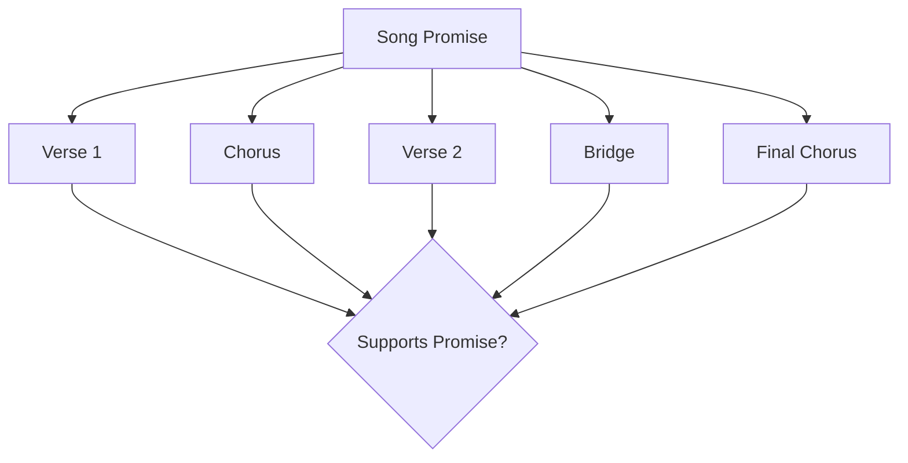
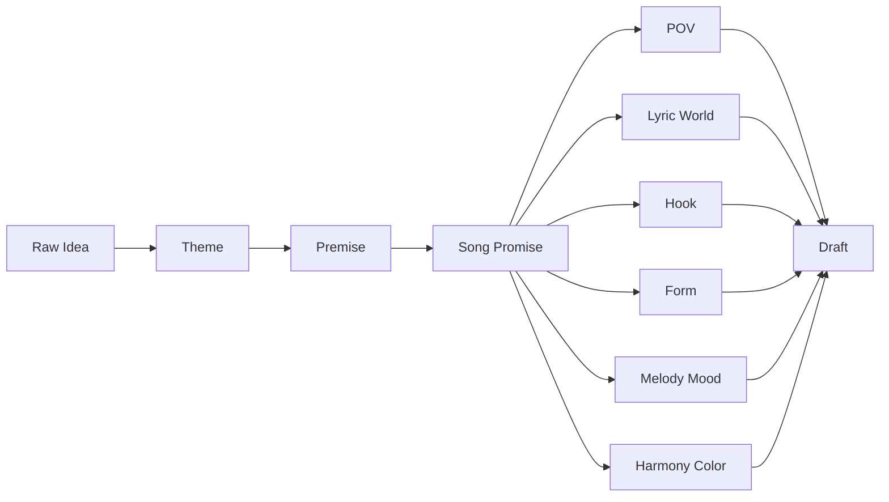
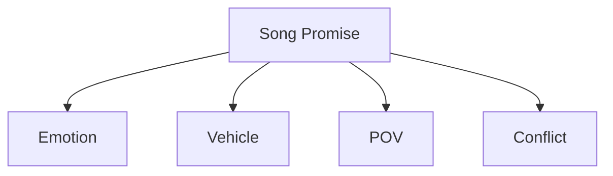
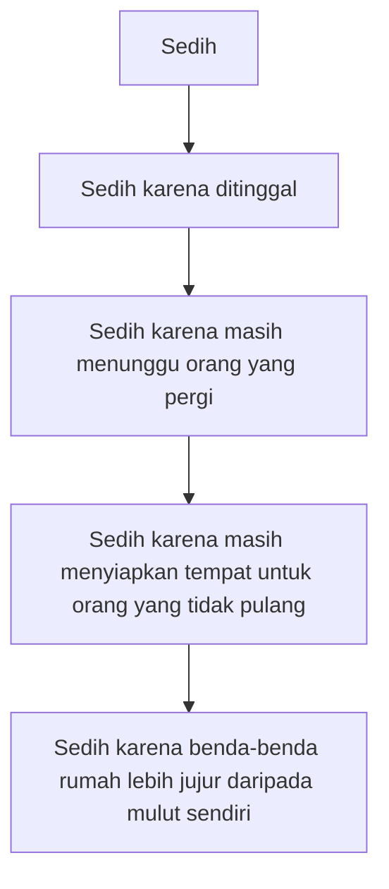
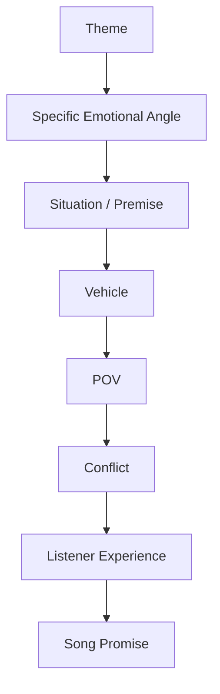
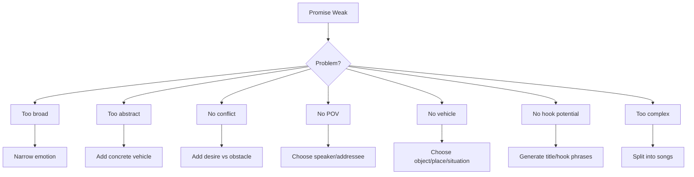
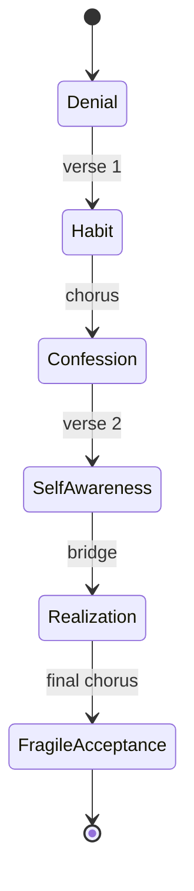

# learn-songwriting-part-007.md

# Song Promise: Menentukan Janji Emosional agar Lagu Tidak Melebar, Datar, atau Generik

> Seri: `learn-songwriting`  
> Part: `007 / 034`  
> Fokus: membangun song promise sebagai pusat gravitasi lagu  
> Status seri: belum selesai  
> Prasyarat: `learn-songwriting-part-000.md` sampai `learn-songwriting-part-006.md`

---

## Ringkasan Part Ini

Part ini membahas salah satu konsep paling penting dalam songwriting:

> **Song Promise** — janji emosional dan pengalaman utama yang diberikan lagu kepada pendengar.

Song promise menjawab:

```text
Lagu ini akan membuat pendengar merasakan apa,
melalui gambar/cerita/situasi apa,
dari sudut pandang siapa,
dengan konflik apa?
```

Tanpa song promise, lagu mudah berubah menjadi:

- kumpulan kalimat puitis tanpa pusat;
- curhat panjang tanpa arah;
- verse dan chorus yang tidak saling menguatkan;
- lagu yang temanya besar tapi rasanya generik;
- lirik yang penuh metafora tapi tidak menyentuh;
- melody/harmony yang mood-nya tidak sinkron dengan pesan;
- draft yang sulit direvisi karena tidak jelas mau ke mana.

Song promise bukan slogan. Bukan tema. Bukan judul. Bukan sinopsis panjang.

Song promise adalah **kontrak internal** antara penulis dan lagu.

Ia menjadi filter untuk semua keputusan:

```text
Apakah baris ini mendukung promise?
Apakah chorus ini memenuhi promise?
Apakah metafora ini memperjelas promise?
Apakah melodi ini memperkuat promise?
Apakah bridge ini mengubah promise secara menarik?
```

Jika kamu sebagai software engineer terbiasa dengan invariant, requirement, dan acceptance criteria, maka song promise bisa dianggap sebagai:

```text
primary requirement of the emotional system
```

Atau:

```text
core invariant of the song
```

---

## Tujuan Part

Setelah menyelesaikan part ini, kamu harus bisa:

1. Membedakan tema, premis, song promise, dan hook.
2. Mengubah ide abstrak menjadi song promise yang spesifik.
3. Membuat promise yang cukup sempit untuk ditulis, tetapi cukup luas untuk menjadi lagu.
4. Menentukan listener experience.
5. Menentukan emotional thesis.
6. Menentukan conflict statement.
7. Menghindari promise yang terlalu umum, terlalu intelektual, terlalu besar, atau terlalu sempit.
8. Menggunakan song promise sebagai filter lirik, melodi, harmoni, form, dan revisi.
9. Membuat beberapa alternatif promise dari satu ide.
10. Memilih promise terbaik untuk lagu pertama.

---

## Definisi Song Promise

Song promise adalah kalimat kerja yang menjelaskan pengalaman inti lagu.

Format dasar:

```text
Lagu ini akan membuat pendengar merasakan [emosi spesifik]
melalui [gambar/situasi/metafora/cerita]
dari sudut pandang [persona/POV]
dengan konflik [tension utama].
```

Contoh:

```text
Lagu ini akan membuat pendengar merasakan rindu yang malu diakui
melalui benda-benda rumah yang tetap disiapkan
dari sudut pandang seseorang yang ditinggalkan
dengan konflik antara ingin melepas dan masih menunggu.
```

Contoh lain:

```text
Lagu ini akan membuat pendengar merasakan kemarahan yang dibungkus sebagai romansa tragis
melalui gambaran kekasih yang terus bepergian meninggalkan rumah terbakar
dari sudut pandang rumah/kekasih yang ditinggal
dengan konflik antara masih memanggil pulang dan sadar sedang dikhianati.
```

Song promise membantu lagu menjadi spesifik tanpa harus literal.

---

## Kenapa Song Promise Penting?

Tanpa promise, kamu hanya punya tema.

Tema:

```text
rindu
```

Masalahnya terlalu luas.

Rindu bisa berarti:

- rindu pasangan;
- rindu masa kecil;
- rindu rumah;
- rindu diri lama;
- rindu Tuhan;
- rindu orang yang sudah meninggal;
- rindu orang yang masih hidup tapi tidak bisa dijangkau;
- rindu yang disangkal;
- rindu yang berubah menjadi dendam;
- rindu yang memalukan;
- rindu yang sudah menjadi kebiasaan.

Jika kamu hanya menulis “rindu”, draft akan cenderung generik:

```text
Aku rindu kamu
Aku tak bisa tanpamu
Malam terasa sepi
Hatiku luka lagi
```

Bukan karena tema rindu jelek. Tapi karena belum dipersempit menjadi pengalaman tertentu.

Song promise memaksa rindu menjadi situasi manusiawi yang jelas.

```text
Rindu yang malu diakui,
ditunjukkan lewat gelas yang tidak dipindahkan,
dari POV orang yang pura-pura sudah biasa,
dengan konflik antara gengsi dan kebiasaan menunggu.
```

Sekarang lirik punya dunia.

---

## Tema vs Premis vs Song Promise vs Hook

Empat hal ini sering tercampur.

| Elemen | Fungsi | Contoh |
|---|---|---|
| Tema | Area besar | rindu |
| Premis | Situasi lagu | seseorang masih menyimpan gelas mantannya |
| Song Promise | Pengalaman emosional yang dijanjikan | rindu yang tidak diakui lewat benda rumah |
| Hook | Frasa/melodi yang diingat | tak kupakai, tak kubuang |

### Contoh Lengkap

```markdown
Tema:
Rindu

Premis:
Seseorang masih menyimpan barang-barang orang yang sudah pergi.

Song Promise:
Lagu ini membuat pendengar merasakan rindu yang disangkal
melalui benda-benda rumah yang tetap disiapkan
dari sudut pandang orang yang ditinggalkan
dengan konflik antara ingin terlihat baik-baik saja dan masih menunggu.

Hook:
Tak kupakai, tak kubuang.
```

Tema memberi arah besar.

Premis memberi situasi.

Song promise memberi pengalaman.

Hook memberi memori.

---

## Song Promise sebagai Requirement

Dalam engineering, requirement yang buruk:

```text
Sistem harus bagus.
```

Requirement yang lebih baik:

```text
User harus bisa login dengan email/password,
mendapat error yang jelas jika kredensial salah,
dan diarahkan ke dashboard setelah sukses.
```

Dalam songwriting, promise yang buruk:

```text
Lagu harus sedih.
```

Promise yang lebih baik:

```text
Lagu ini harus membuat pendengar merasakan sedih yang tertahan,
melalui gambar seseorang yang masih menyiapkan dua gelas,
dari POV orang yang tidak mau mengaku ditinggalkan.
```

Song promise yang baik membuat keputusan lebih mudah.

Jika ada baris:

```text
Aku terbang di langit biru mengejar mimpi-mimpi
```

Untuk promise rumah/gelas/rindu, baris ini mungkin tidak cocok. Bukan karena jelek, tapi karena tidak mendukung requirement.

---

## Song Promise sebagai Invariant

Song promise adalah invariant.

```text
Selama lagu berjalan, semua section harus tetap mengitari promise.
```

Boleh ada variasi, perkembangan, reveal, atau twist. Tapi pusatnya tidak boleh hilang.



Jika satu section tidak mendukung promise, ada tiga kemungkinan:

1. Section itu perlu direvisi.
2. Promise-nya perlu direvisi.
3. Lagu sebenarnya ingin menjadi lagu lain.

---

## Song Promise dalam Pipeline Songwriting



Promise berada sebelum draft besar.

Tapi promise juga bisa berubah setelah draft awal. Ini normal.

Kadang kamu mulai dengan promise A, lalu saat menulis menemukan promise B yang lebih hidup.

Prinsip:

```text
Song promise is a compass, not a prison.
```

Tapi jangan mengganti compass setiap 5 menit.

---

# Bagian 1 — Anatomi Song Promise

Song promise yang baik punya empat komponen:

```text
emotion + vehicle + POV + conflict
```



## 1. Emotion

Emosi spesifik yang ingin dirasakan pendengar.

Bukan:

```text
sedih
```

Tetapi:

```text
sedih karena menyadari diri sendiri masih menunggu
```

## 2. Vehicle

Media/gambar/situasi yang membawa emosi.

Contoh:

- benda rumah;
- bandara;
- meja makan;
- hujan di halte;
- notifikasi pesan;
- terminal;
- cermin;
- kamar kosong;
- koper;
- jam dinding;
- pesta;
- surat;
- jalan pulang.

Vehicle membuat emosi menjadi konkret.

## 3. POV

Siapa yang bicara dan ke siapa.

Contoh:

- aku ke kamu;
- aku ke diri sendiri;
- rumah ke pemiliknya;
- anak ke ayah;
- kekasih ke pemimpin;
- narator luar;
- benda mati;
- rakyat sebagai kekasih yang ditinggal.

POV menentukan suara lagu.

## 4. Conflict

Tension utama.

Contoh:

- ingin melepas tetapi masih menunggu;
- ingin marah tetapi masih cinta;
- ingin pulang tetapi rumah sudah berubah;
- ingin percaya tetapi bukti terus melawan;
- ingin terlihat kuat tetapi tubuh bereaksi;
- ingin mengejek tetapi sebenarnya terluka.

Conflict membuat lagu bergerak.

---

## Formula Song Promise

Gunakan formula:

```text
Lagu ini akan membuat pendengar merasakan [emotion]
melalui [vehicle]
dari sudut pandang [POV]
dengan konflik [conflict].
```

### Versi Pendek

```text
[emotion] melalui [vehicle], dari POV [speaker], dengan konflik [X vs Y].
```

Contoh:

```text
Rindu yang disangkal melalui benda rumah,
dari POV orang yang ditinggalkan,
dengan konflik ingin melepas vs masih menunggu.
```

### Versi Engineering

```yaml
song_promise:
  emotion: "rindu yang disangkal"
  vehicle: "benda rumah yang tetap disiapkan"
  pov: "aku kepada kamu yang pergi"
  conflict: "ingin melepas tetapi masih menunggu"
  listener_experience: "merasa melihat seseorang yang belum sanggup mengakui kehilangan"
```

Format YAML kadang membantu jika kamu ingin jelas secara struktur.

---

# Bagian 2 — Emotion: Dari Umum ke Spesifik

Emosi umum tidak cukup.

## Contoh Emosi Umum

```text
sedih
marah
cinta
rindu
kecewa
takut
malu
sepi
bahagia
dendam
```

Ini terlalu luas.

## Cara Menspesifikkan Emosi

Gunakan formula:

```text
[emosi] karena [situasi] tetapi [konflik batin]
```

Contoh:

```text
Rindu karena seseorang pergi, tetapi terlalu gengsi untuk mengaku menunggu.
```

```text
Marah karena dikhianati, tetapi masih berharap orang itu berubah.
```

```text
Takut karena mulai sukses, tetapi merasa semua akan runtuh kapan saja.
```

```text
Malu karena masih mencintai orang yang jelas-jelas tidak memilih kita.
```

```text
Sepi karena rumah ramai, tetapi tidak ada satu pun yang benar-benar mendengar.
```

## Emotional Specificity Ladder



Semakin spesifik, semakin mudah menulis detail.

---

## Daftar Emosi Spesifik untuk Songwriting

| Emosi Umum | Versi Spesifik |
|---|---|
| Rindu | rindu yang malu diakui |
| Rindu | rindu yang berubah menjadi kebiasaan |
| Rindu | rindu kepada diri sendiri yang dulu |
| Sedih | sedih yang terlalu lelah untuk menangis |
| Sedih | sedih yang disamarkan sebagai rutinitas |
| Marah | marah yang masih ingin dipeluk |
| Marah | marah yang dibungkus humor |
| Cinta | cinta yang takut meminta balasan |
| Cinta | cinta yang memilih diam agar tidak merusak |
| Kecewa | kecewa kepada orang yang dulu dipercaya |
| Takut | takut berhasil karena takut kehilangan diri |
| Malu | malu karena masih berharap |
| Sepi | sepi di tempat yang ramai |
| Dendam | dendam yang sebenarnya luka belum selesai |
| Pasrah | pasrah yang belum benar-benar ikhlas |
| Sinis | sinis karena terlalu sering dikecewakan |
| Bangga | bangga yang takut terlihat sombong |
| Bahagia | bahagia yang terasa sebentar dan rapuh |

Pilih emosi yang punya konflik internal. Emosi tanpa konflik sering datar.

---

# Bagian 3 — Vehicle: Emosi Perlu Kendaraan

Vehicle adalah benda/situasi/dunia yang membawa emosi.

Emosi:

```text
rindu
```

Vehicle:

```text
gelas di rak kedua
```

Emosi:

```text
marah pada pemimpin yang sering pergi
```

Vehicle:

```text
kekasih dengan koper sutra yang selalu meninggalkan rumah
```

Emosi:

```text
takut gagal
```

Vehicle:

```text
lampu monitor yang menyala sampai pagi
```

Vehicle membuat lagu tidak menjadi esai.

## Jenis Vehicle

| Vehicle | Efek |
|---|---|
| Benda rumah | intim, domestik, personal |
| Bandara/perjalanan | pergi, jarak, status, ironi |
| Jalan/hujan | transisi, kesendirian |
| Kantor/notifikasi | burnout, modern loneliness |
| Laut/kapal | jarak besar, kehilangan, takdir |
| Dapur/meja makan | keluarga, kehangatan, retak |
| Kamar/cermin | introspeksi, tubuh, identitas |
| Panggung/lampu | performativitas, kepalsuan |
| Rumah kosong | kehilangan, memori |
| Koper | pergi, kelas, mobilitas, pengkhianatan |

## Vehicle yang Baik

Vehicle yang baik:

- konkret;
- relevan dengan emosi;
- punya banyak detail turunan;
- bisa muncul di beberapa section;
- bisa berkembang;
- tidak terlalu random;
- tidak terlalu literal;
- punya potensi metafora.

Contoh vehicle kuat:

```text
rumah
```

Detail turunan:

- pintu;
- kunci;
- meja;
- kursi;
- gelas;
- jendela;
- kamar;
- lampu;
- rak;
- suara kulkas;
- lantai;
- debu.

Ini memberi material verse.

Contoh vehicle kurang kuat:

```text
kesedihan kosmik di alam semesta
```

Bisa dipakai, tapi sulit untuk MVS pertama karena terlalu abstrak.

---

## Vehicle Expansion

Pilih satu vehicle dan ekspansi.

```markdown
Vehicle: Bandara

Objects:
- koper
- paspor
- boarding pass
- kursi tunggu
- layar jadwal
- gerbang
- sabuk bagasi
- pengeras suara
- jendela pesawat
- troli

Actions:
- check-in
- menunggu
- melepas
- memanggil nama
- menunda keberangkatan
- hilang di gate
- pulang lewat layar jadwal
- mengambil koper
- menatap runway

Sounds:
- pengumuman
- roda koper
- mesin pesawat
- langkah tergesa
- panggilan terakhir
- beep scanner

Emotional Associations:
- pergi
- jarak
- kelas
- formalitas
- kepulangan palsu
- menunggu tanpa hak menahan
```

Dari vehicle ini, lagu bisa lahir.

---

# Bagian 4 — POV: Song Promise Butuh Suara

POV adalah siapa yang membawa promise.

Tema yang sama berubah total jika POV berubah.

Tema:

```text
ditinggalkan
```

## POV 1 — Aku ke Kamu

```text
Aku masih menyimpan gelasmu.
```

Efek:

- intim;
- langsung;
- rentan.

## POV 2 — Aku ke Diri Sendiri

```text
Jangan pindahkan gelas itu dulu.
Kau belum siap sejujur itu.
```

Efek:

- reflektif;
- internal;
- psikologis.

## POV 3 — Rumah Berbicara

```text
Aku rumah yang kau tinggalkan menyala.
```

Efek:

- metaforis;
- theatrical;
- sinematik.

## POV 4 — Narator Luar

```text
Ia menaruh dua gelas setiap pagi,
seolah satu lagi masih punya alasan.
```

Efek:

- storytelling;
- observasional;
- lebih berjarak.

## POV 5 — Benda Berbicara

```text
Aku gelas yang tak jadi bibirmu.
```

Efek:

- unik;
- puitis;
- berisiko terlalu clever.

POV menentukan diksi dan intensitas. Jangan pilih POV hanya karena unik. Pilih yang paling mendukung promise.

---

## POV Compatibility Test

Tanya:

```text
Apakah POV ini bisa menyampaikan emosi utama?
Apakah POV ini punya akses ke detail yang dibutuhkan?
Apakah POV ini natural untuk genre/mood?
Apakah POV ini terlalu clever?
Apakah POV ini memudahkan chorus?
```

Contoh:

Song promise:

```text
kritik sosial dibungkus romansa tragis
```

POV yang mungkin:

| POV | Kekuatan | Risiko |
|---|---|---|
| Aku sebagai kekasih yang ditinggal | intim, metafora jelas | bisa terlalu literal romantis |
| Rumah sebagai rakyat/negara | kuat simbolik | bisa terlalu besar |
| Koper sebagai saksi | unik, sinis | bisa terlalu clever |
| Narator luar | sinematik | kurang personal |
| Kamu sebagai yang pergi | accusatory | bisa terlalu frontal |

Pilih berdasarkan efek yang diinginkan.

---

# Bagian 5 — Conflict: Mesin Gerak Promise

Tanpa conflict, promise menjadi mood statis.

Emosi:

```text
rindu
```

Conflict:

```text
ingin melepas tetapi masih menunggu
```

Emosi:

```text
marah
```

Conflict:

```text
ingin membenci tetapi masih butuh orang itu pulang
```

Emosi:

```text
sinis
```

Conflict:

```text
ingin tertawa karena absurd, tetapi sebenarnya sedang berduka
```

Conflict memberi lagu alasan untuk bergerak dari section ke section.

## Conflict Formula

```text
Narator ingin [desire],
tetapi [obstacle],
karena [deeper reason].
```

Contoh:

```text
Narator ingin membuang barang-barang lama,
tetapi selalu menundanya,
karena membuang berarti mengakui orang itu tidak pulang.
```

Contoh lain:

```text
Narator ingin memaki kekasih yang terus pergi,
tetapi masih memanggilnya pulang,
karena rumah yang ditinggalkan belum punya bahasa selain cinta.
```

## Jenis Conflict

| Jenis Conflict | Contoh |
|---|---|
| Desire vs reality | ingin pulang, tapi rumah berubah |
| Love vs pride | masih cinta, tapi gengsi |
| Anger vs dependence | marah, tapi masih butuh |
| Memory vs present | masa lalu masih hidup di benda |
| Truth vs performance | tahu bohong, tapi tetap berperan |
| Duty vs desire | harus pergi, ingin tinggal |
| Public vs private | terlihat kuat, hancur sendiri |
| Faith vs evidence | ingin percaya, bukti melawan |
| Body vs mind | pikiran ikhlas, tubuh masih bereaksi |
| Satire vs grief | mengejek, tapi sebenarnya terluka |

Conflict yang baik biasanya punya dua sisi yang sama-sama kuat.

Jika salah satu sisi terlalu lemah, lagu menjadi datar.

---

## Conflict Depth Ladder

Tema:

```text
ditinggalkan
```

Conflict dangkal:

```text
Aku sedih karena kamu pergi.
```

Conflict lebih kuat:

```text
Aku ingin melupakanmu, tapi masih menyusun rumah seolah kau pulang.
```

Lebih dalam:

```text
Aku takut membuang barangmu karena tanpa kebiasaan menunggu, aku tidak tahu siapa diriku.
```

Lebih kompleks:

```text
Aku menyalahkanmu karena pergi, padahal yang paling kutakuti adalah hidupku ternyata sudah lama kosong bahkan sebelum kau pergi.
```

Semakin dalam conflict, semakin kaya lagu. Tapi untuk MVS, jangan terlalu kompleks sampai tidak bisa ditulis.

---

# Bagian 6 — Listener Experience

Song promise bukan hanya tentang penulis. Ia harus mempertimbangkan pendengar.

Tanya:

```text
Setelah mendengar lagu ini, pendengar harus merasa apa?
Apa yang mereka bayangkan?
Apa yang mereka ingat?
Apa yang mereka sadari?
Apakah mereka merasa dituduh, dipeluk, disindir, atau diajak mengaku?
```

## Listener Experience Template

```markdown
## Listener Experience

Setelah mendengar lagu ini, pendengar idealnya merasa:
-

Mereka membayangkan:
-

Mereka mengingat:
-

Mereka tidak harus tahu:
-

Rasa yang tertinggal:
-
```

Contoh:

```markdown
Setelah mendengar lagu ini, pendengar idealnya merasa:
- seperti melihat seseorang yang belum sanggup mengakui bahwa ia masih menunggu.

Mereka membayangkan:
- dapur malam, satu gelas yang sengaja tidak dipakai.

Mereka mengingat:
- "tak kupakai, tak kubuang"

Mereka tidak harus tahu:
- detail lengkap hubungan itu berakhir kenapa.

Rasa yang tertinggal:
- sepi yang tenang tapi menusuk.
```

Listener experience mencegah lagu menjadi terlalu internal dan tidak bisa diakses.

---

# Bagian 7 — Song Promise Scope

Promise harus berada di antara terlalu luas dan terlalu sempit.

## Terlalu Luas

```text
Lagu tentang cinta.
```

Masalah:

- semua mungkin masuk;
- tidak ada constraint;
- lirik generik.

## Terlalu Sempit

```text
Lagu tentang gelas biru 250 ml di rak kedua sebelah kiri yang tidak kupakai pada hari Selasa pukul 07:15.
```

Masalah:

- detail terlalu spesifik tapi belum tentu punya emosi cukup;
- sulit berkembang menjadi lagu;
- pendengar mungkin tidak punya ruang.

## Scope Tepat

```text
Lagu tentang rindu yang disangkal melalui benda rumah yang tidak dipindahkan.
```

Cukup spesifik:

- ada emosi;
- ada vehicle;
- ada metaphor system;
- bisa berkembang;
- pendengar bisa masuk.

---

## Promise Scope Test

Tanya:

```text
Apakah promise ini bisa menghasilkan minimal 2 verse dan 1 chorus?
Apakah promise ini punya conflict?
Apakah promise ini punya dunia konkret?
Apakah promise ini bisa dijelaskan dalam satu kalimat?
Apakah promise ini tidak terlalu umum?
Apakah promise ini tidak terlalu sempit?
Apakah ada hook yang mungkin lahir dari promise ini?
```

Jika jawabannya tidak, revisi promise.

---

# Bagian 8 — Good vs Weak Song Promise

## Weak Promise 1

```text
Lagu ini tentang kesedihan.
```

Masalah:

- emosi umum;
- tidak ada POV;
- tidak ada vehicle;
- tidak ada conflict.

## Stronger

```text
Lagu ini membuat pendengar merasakan sedih yang tidak bisa dikatakan
melalui kebiasaan seseorang yang tetap menyiapkan dua gelas
dari POV orang yang ditinggalkan
dengan konflik antara ingin terlihat pulih dan masih menunggu.
```

---

## Weak Promise 2

```text
Lagu ini tentang pemerintah yang sering ke luar negeri.
```

Masalah:

- terlalu literal;
- terdengar seperti topik esai;
- belum ada vehicle artistik;
- belum ada listener experience.

## Stronger

```text
Lagu ini membuat pendengar merasakan kemarahan yang disamarkan sebagai romansa tragis
melalui figur kekasih yang terus pergi membawa koper
dari POV rumah yang ditinggal menghadapi krisis
dengan konflik antara masih memanggil pulang dan sadar bahwa kepulangannya hanya panggung.
```

---

## Weak Promise 3

```text
Lagu ini tentang burnout.
```

Masalah:

- masih kategori;
- belum ada scene;
- belum ada conflict.

## Stronger

```text
Lagu ini membuat pendengar merasakan lelah yang tidak lagi bisa dibedakan dari hidup normal
melalui layar kerja yang tetap menyala sampai pagi
dari POV seseorang yang merasa tubuhnya berubah menjadi mesin notifikasi
dengan konflik antara ingin berhenti dan takut semuanya runtuh jika ia berhenti.
```

---

# Bagian 9 — Promise Quality Criteria

Song promise yang baik punya karakteristik:

| Kriteria | Pertanyaan |
|---|---|
| Specific | Apakah emosinya spesifik? |
| Concrete | Apakah ada vehicle/gambar? |
| Singable potential | Apakah bisa menjadi lirik/melodi? |
| Conflict-driven | Apakah ada tension? |
| POV-ready | Apakah jelas siapa bicara? |
| Developable | Apakah bisa menghasilkan beberapa section? |
| Memorable | Apakah ada kemungkinan hook? |
| Coherent | Apakah semua elemen saling mendukung? |
| Human | Apakah pendengar bisa masuk? |
| Bounded | Apakah tidak terlalu melebar? |

Skor 1–5 untuk setiap kriteria.

Target awal:

```text
Minimal 35 / 50
```

Tidak perlu sempurna, tapi harus cukup kuat untuk mulai draft.

---

## Song Promise Scoring Table

```markdown
# Song Promise Scoring

| Criteria | Score 1-5 | Notes |
|---|---:|---|
| Specific emotion |  |  |
| Concrete vehicle |  |  |
| Clear POV |  |  |
| Conflict |  |  |
| Developable |  |  |
| Hook potential |  |  |
| Coherence |  |  |
| Human access |  |  |
| Bounded scope |  |  |
| Personal energy |  |  |
| Total |  |  |
```

Tambahkan “personal energy” karena scoring teknis saja tidak cukup. Promise harus punya energi untuk kamu tulis.

---

# Bagian 10 — Dari Tema ke Song Promise

Gunakan pipeline:



## Contoh: Tema Rindu

### Step 1 — Theme

```text
rindu
```

### Step 2 — Specific Emotional Angle

```text
rindu yang tidak mau diakui
```

### Step 3 — Situation

```text
seseorang masih menyimpan benda orang yang pergi
```

### Step 4 — Vehicle

```text
benda rumah: gelas, kursi, rak
```

### Step 5 — POV

```text
aku kepada kamu yang tidak pulang
```

### Step 6 — Conflict

```text
ingin melepas tetapi masih menunggu
```

### Step 7 — Listener Experience

```text
pendengar merasa melihat seseorang yang denial melalui kebiasaan kecil
```

### Step 8 — Song Promise

```text
Lagu ini membuat pendengar merasakan rindu yang tidak mau diakui
melalui benda-benda rumah yang tetap disiapkan
dari POV orang yang ditinggalkan
dengan konflik antara ingin melepas dan masih menunggu.
```

---

## Contoh: Tema Kritik Sosial

### Step 1 — Theme

```text
pemimpin sering pergi saat rumah krisis
```

### Step 2 — Specific Emotional Angle

```text
marah yang dibungkus sebagai romansa pahit
```

### Step 3 — Situation

```text
kekasih selalu pergi ke tempat jauh sementara rumah rusak
```

### Step 4 — Vehicle

```text
bandara, koper, rumah, meja makan, kartu pos
```

### Step 5 — POV

```text
aku sebagai rumah/kekasih yang ditinggal
```

### Step 6 — Conflict

```text
masih memanggil pulang tetapi sadar sedang dipermainkan
```

### Step 7 — Listener Experience

```text
pendengar merasa sedang mendengar kisah cinta tragis, lalu sadar ada sindiran sosial
```

### Step 8 — Song Promise

```text
Lagu ini membuat pendengar merasakan kemarahan yang disembunyikan dalam romansa tragis
melalui kekasih berkopor yang terus pergi meninggalkan rumah retak
dari POV rumah/kekasih yang ditinggal
dengan konflik antara masih memanggil pulang dan sadar kepulangannya hanya pertunjukan.
```

Ini promise yang bisa melahirkan lirik metaforis tanpa menjadi vulgar.

---

# Bagian 11 — Promise Variants

Jangan puas dengan promise pertama. Buat beberapa varian.

Tema sama bisa menghasilkan banyak lagu berbeda.

## Tema: Rindu

| Variant | Song Promise |
|---|---|
| Domestic longing | rindu disangkal lewat benda rumah |
| Digital longing | rindu lewat notifikasi yang tidak datang |
| Spiritual longing | rindu kepada Tuhan yang terasa diam |
| Identity longing | rindu kepada diri sendiri sebelum patah |
| Angry longing | rindu yang keluar sebagai tuduhan |
| Humorous longing | rindu yang ditertawakan sendiri |
| Mature longing | rindu yang tidak ingin meminta pulang |
| Obsessive longing | rindu yang berubah jadi ritual |
| Nostalgic longing | rindu pada masa yang tidak bisa dipulihkan |
| Satirical longing | rindu rakyat kepada pemimpin yang pergi |

Setiap promise akan melahirkan lagu berbeda.

---

## Latihan: 10 Promise dari 1 Tema

Tema:

```text
kehilangan
```

Buat 10 promise:

```markdown
1. Kehilangan yang disangkal lewat kebiasaan menyiapkan dua piring.
2. Kehilangan yang muncul sebagai marah pada jam dinding.
3. Kehilangan rumah masa kecil lewat suara pagar tua.
4. Kehilangan diri sendiri lewat foto profil yang tidak dikenali.
5. Kehilangan seseorang yang masih hidup lewat chat yang tidak dibalas.
6. Kehilangan ayah lewat kursi kosong di meja makan.
7. Kehilangan masa depan lewat tiket yang tidak jadi dipakai.
8. Kehilangan iman lewat doa yang terdengar seperti gema.
9. Kehilangan negara lewat rumah yang ditinggal tuannya.
10. Kehilangan cinta lewat nama yang masih otomatis diketik.
```

Pilih yang paling punya energi.

---

# Bagian 12 — Promise Selection

Setelah membuat beberapa promise, pilih berdasarkan:

1. personal energy;
2. specificity;
3. conflict strength;
4. lyric world potential;
5. hook potential;
6. singability;
7. scope fit for MVS;
8. emotional honesty;
9. freshness;
10. feasibility.

## Promise Selection Matrix

```markdown
# Promise Selection Matrix

| Promise | Energy | Specific | Conflict | World | Hook | Feasible | Total |
|---|---:|---:|---:|---:|---:|---:|---:|
| A |  |  |  |  |  |  |  |
| B |  |  |  |  |  |  |  |
| C |  |  |  |  |  |  |  |
```

Skor 1–5.

Tetapi jangan pilih hanya berdasarkan angka. Pilih promise yang membuat kamu ingin menulis.

Jika dua promise kuat, pilih yang lebih feasible untuk lagu pertama.

---

# Bagian 13 — Testing Song Promise Before Writing Full Song

Sebelum menulis full song, test promise dengan tiga cara.

## Test 1 — One Sentence Test

Apakah bisa dijelaskan dalam satu kalimat?

Jika tidak bisa, promise terlalu kabur.

## Test 2 — Three Images Test

Apakah promise menghasilkan minimal 3 gambar konkret?

Contoh:

```text
gelas di rak kedua
kursi menghadap jendela
lampu dapur menyala terlalu pagi
```

Jika tidak ada gambar, promise terlalu abstrak.

## Test 3 — Hook Test

Apakah promise menghasilkan minimal 5 hook phrase?

Contoh:

```text
tak kupakai, tak kubuang
kau belum selesai
rumah ini salah paham
aku belum belajar sepi
gelasmu di rak kedua
```

Jika tidak ada hook, promise mungkin kurang musikal atau kurang spesifik.

## Test 4 — Verse/Chorus Test

Apakah promise bisa dibagi menjadi:

```text
Verse = evidence
Chorus = thesis/hook
```

Jika tidak, promise mungkin terlalu konseptual.

## Test 5 — Emotional Movement Test

Apakah promise bisa bergerak dari state A ke state B?

Contoh:

```text
denial -> confession -> realization
```

Jika tidak, lagu bisa datar.

---

## Promise Test Template

```markdown
# Promise Test

## Promise
...

## One Sentence
...

## Three Images
1.
2.
3.

## Five Hook Phrases
1.
2.
3.
4.
5.

## Verse Evidence
...

## Chorus Thesis
...

## Emotional Movement
Start:
Middle:
End:

## Verdict
Strong / Needs revision / Weak

## Revision
...
```

---

# Bagian 14 — Song Promise and Genre

Genre mempengaruhi cara promise dieksekusi.

Promise yang sama bisa berubah warna.

Song promise:

```text
rindu yang disangkal lewat benda rumah
```

## Acoustic Ballad

- lirik detail;
- melodi intim;
- chord sederhana;
- chorus lembut;
- banyak ruang.

## Pop

- hook lebih jelas;
- chorus lebih singable;
- title lebih sering diulang;
- verse lebih ringkas.

## Dark Cinematic Ballad

- imagery lebih tebal;
- harmoni lebih minor/gelap;
- tempo lambat;
- vokal lebih theatrical;
- ambience bisa mendukung.

## Folk

- storytelling lebih kuat;
- refrain bisa lebih cocok daripada chorus besar;
- detail benda dan waktu penting.

## Rock

- conflict lebih frontal;
- chorus bisa declarative;
- energi naik jelas.

Genre bukan label tempelan. Genre adalah constraint untuk promise.

---

## Genre-Promise Compatibility

Tanya:

```text
Apakah genre ini membantu promise?
Apakah genre ini membuat lirik terlalu berat/ringan?
Apakah hook promise cocok dengan bentuk genre?
Apakah mood genre mendukung listener experience?
```

Contoh:

Promise:

```text
kritik sosial dibungkus romansa tragis
```

Cocok:

- dark cinematic ballad;
- theatrical folk;
- slow rock ballad;
- cabaret satire.

Kurang cocok untuk MVS awal:

- EDM drop-heavy;
- jazz kompleks;
- hyperpop sangat produksi-driven.

Bukan tidak bisa, tetapi lebih berat untuk fokus songwriting.

---

# Bagian 15 — Song Promise and Language

Promise juga harus cocok dengan bahasa.

Bahasa Indonesia punya karakter:

- suku kata relatif jelas;
- tekanan kata tidak sekuat bahasa Inggris;
- banyak kata berakhiran vokal;
- frasa bisa terasa formal jika terlalu baku;
- repetisi bisa sangat kuat;
- metafora domestik/sosial bisa terasa dekat;
- dialog bisa natural jika tidak terlalu sastra.

Promise yang terlalu konseptual bisa menghasilkan lirik Indonesia yang kaku.

Contoh promise terlalu konseptual:

```text
Lagu ini membahas disintegrasi identitas pasca-relasional dalam ruang domestik.
```

Ubah menjadi:

```text
Lagu ini membuat pendengar merasakan seseorang yang tidak mengenali dirinya setelah ditinggalkan,
melalui rumah yang masih menyimpan kebiasaan lama,
dari POV orang yang takut sembuh karena sembuh berarti benar-benar sendiri.
```

Lebih bisa ditulis.

---

# Bagian 16 — Song Promise and Metaphor

Promise sering melahirkan metaphor system.

Contoh:

```text
rindu disangkal lewat benda rumah
```

Metaphor system:

```text
rumah = tubuh/ingatan
benda = bukti penyangkalan
rak = tempat menunda keputusan
pintu = kemungkinan pulang
lampu = harapan yang boros
```

Promise:

```text
kritik sosial sebagai romansa tragis
```

Metaphor system:

```text
kekasih = pemimpin/figur yang pergi
rumah = rakyat/negeri
koper = lawatan/status/pergi
meja makan = kebutuhan domestik
bandara = panggung kepergian
kartu pos = komunikasi kosong
```

Metaphor system membantu lirik konsisten.

Akan dibahas lebih dalam di part 012, tapi di sini penting untuk song promise.

---

## Metaphor Consistency Test

Jika promise memakai metafora rumah, hati-hati memasukkan metafora laut, langit, perang, mesin, api sekaligus.

Terlalu banyak metaphor system membuat lagu blur.

Contoh campur terlalu banyak:

```text
Rumahku kapal terbakar di langit mesin waktu
```

Mungkin unik, tapi sulit diikuti.

Lebih baik:

```text
Rumah ini menahan pintu
seperti mulut menahan nama
```

Masih dalam sistem rumah/tubuh.

---

# Bagian 17 — Song Promise and Section Design

Promise menentukan fungsi section.

Contoh promise:

```text
Rindu yang disangkal lewat benda rumah.
```

Section design:

| Section | Fungsi |
|---|---|
| Verse 1 | memperlihatkan benda dapur sebagai bukti denial |
| Chorus | mengakui “tak kupakai, tak kubuang” |
| Verse 2 | memperlihatkan denial menyebar ke kamar |
| Bridge | menyadari benda itu menjaga narator dari kehilangan |
| Final Chorus | hook sama, makna lebih sadar |

Contoh promise:

```text
Kemarahan sosial sebagai romansa tragis kekasih yang pergi.
```

Section design:

| Section | Fungsi |
|---|---|
| Verse 1 | kekasih pergi dengan koper, rumah ditinggal |
| Chorus | panggilan pulang yang terdengar seperti tuduhan |
| Verse 2 | krisis domestik makin terlihat |
| Bridge | narator sadar “pulang” hanya pertunjukan |
| Final Chorus | panggilan sayang berubah menjadi dakwaan |

Promise membuat section tidak random.

---

# Bagian 18 — Song Promise and Hook

Hook harus lahir dari promise atau memperkuat promise.

Promise:

```text
rindu disangkal lewat benda rumah
```

Hook options:

```text
tak kupakai, tak kubuang
kau belum selesai
rumah ini salah paham
aku belum belajar sepi
gelasmu di rak kedua
```

Semua mendukung promise.

Hook yang tidak cocok:

```text
terbanglah bersamaku
```

Bisa jadi hook bagus untuk lagu lain, tapi tidak mendukung promise ini.

## Hook-Promise Alignment Test

Tanya:

```text
Jika pendengar hanya ingat hook, apakah mereka masih menangkap rasa utama lagu?
```

Jika tidak, hook mungkin tidak align.

---

# Bagian 19 — Song Promise and Melody

Promise memberi arah melodi.

Promise:

```text
rindu tertahan
```

Melodi mungkin:

- range sempit di verse;
- banyak nada berulang;
- chorus naik sedikit tapi tidak meledak;
- nada panjang pada kata hook;
- rest sebelum pengakuan.

Promise:

```text
kemarahan satir
```

Melodi mungkin:

- ritme lebih tajam;
- phrasing seperti dialog;
- lompatan kecil yang sinis;
- chorus bisa lebih teatrikal;
- nada tertentu ditekan seperti sindiran.

Promise tidak menentukan not spesifik, tapi menentukan perilaku melodi.

---

# Bagian 20 — Song Promise and Harmony

Promise memberi arah harmoni.

Promise:

```text
rindu yang belum selesai
```

Harmoni bisa:

- minor/ambiguous;
- cadence menggantung;
- chord tidak langsung resolve;
- chorus memberi sedikit release tapi tidak sepenuhnya selesai.

Promise:

```text
pengakuan pulang
```

Harmoni bisa:

- lebih resolutif;
- chorus landing jelas;
- perubahan dari minor ke relative major.

Promise:

```text
satire tragis
```

Harmoni bisa:

- minor theatrical;
- chord yang terasa manis tapi sinis;
- kontras antara waltz/ballad romantis dan lirik pahit.

Untuk MVS, cukup catat harmonic mood:

```markdown
Harmony direction:
- verse: restrained, unresolved
- chorus: slightly more open but still unresolved
```

---

# Bagian 21 — Song Promise and Revision

Saat revisi, promise menjadi filter.

Pertanyaan revisi:

```text
Apakah draft masih memenuhi promise?
Apakah verse memberi vehicle yang dijanjikan?
Apakah chorus memberi emosi yang dijanjikan?
Apakah POV konsisten?
Apakah conflict masih terasa?
Apakah hook membawa listener ke promise?
Apakah ada baris yang keluar dari dunia lagu?
```

## Promise-Based Revision Example

Promise:

```text
rindu disangkal lewat benda rumah
```

Baris draft:

```text
Aku tenggelam dalam samudra luka
```

Diagnosis:

- metafora laut keluar dari vehicle rumah;
- terlalu umum;
- tidak spesifik.

Revisi:

```text
Air di gelasmu menguning
sebelum sempat kuminumkan
```

Lebih sesuai promise.

---

# Bagian 22 — Promise Drift

Promise drift adalah ketika lagu mulai berubah arah tanpa disadari.

Gejala:

- verse tentang rumah, chorus tentang laut;
- POV dari aku-kamu berubah jadi narator sosial;
- lagu awalnya rindu, lalu jadi dendam, lalu jadi spiritual;
- hook tidak terkait lirik;
- bridge membuka tema baru yang terlalu besar;
- title terasa dari lagu lain.

## Promise Drift Detection

Setelah draft, tulis:

```markdown
Original Promise:
...

Current Draft Seems About:
...

Difference:
...

Decision:
- keep original promise and revise draft
- update promise to match stronger draft
- split into two songs
```

Kadang drift bukan salah. Kadang draft menemukan lagu yang lebih kuat.

Tapi kamu harus sadar.

---

# Bagian 23 — Splitting Songs

Jika promise terlalu banyak, mungkin kamu punya dua lagu.

Contoh draft berisi:

1. rindu lewat benda rumah;
2. kritik sosial lewat pemimpin yang pergi;
3. burnout kerja;
4. konflik spiritual.

Mungkin semuanya personal bagimu, tetapi pendengar akan bingung.

Pisahkan:

```text
Song A: rindu domestik
Song B: romansa satir tentang pemimpin pergi
Song C: burnout sebagai mesin notifikasi
```

Prinsip:

```text
One song, one primary promise.
```

Bukan berarti satu lagu dangkal. Satu promise bisa sangat dalam.

---

# Bagian 24 — Song Promise Anti-Patterns

## Anti-Pattern 1: Theme Masquerading as Promise

```text
Lagu ini tentang cinta.
```

Perbaikan:

```text
Cinta yang takut meminta balasan melalui chat yang tidak pernah dikirim.
```

## Anti-Pattern 2: Essay Promise

```text
Lagu ini mengkritik ketimpangan sosial dan lemahnya kepemimpinan dalam konteks krisis domestik.
```

Perbaikan:

```text
Kemarahan pada rumah yang ditinggal tuannya, dibungkus sebagai romansa kekasih yang terus pergi membawa koper.
```

## Anti-Pattern 3: Too Many Promises

```text
Lagu ini tentang cinta, politik, trauma masa kecil, Tuhan, dan algoritma media sosial.
```

Perbaikan:

```text
Pilih satu pusat. Simpan sisanya untuk lagu lain.
```

## Anti-Pattern 4: Clever but Cold

```text
Lagu ini tentang ontologi kehilangan dalam arsitektur domestik.
```

Perbaikan:

```text
Seseorang tidak berani membuang gelas mantannya karena itu satu-satunya bukti ia pernah ditunggu.
```

## Anti-Pattern 5: No Conflict

```text
Lagu ini tentang seseorang yang bahagia di rumah.
```

Bisa, tapi perlu tension:

```text
Bahagia yang rapuh karena ia tahu rumah itu hanya sementara.
```

## Anti-Pattern 6: Too Literal

```text
Lagu ini tentang aku diputusin tanggal 12 di restoran X.
```

Bisa menjadi bahan, tapi promise perlu pengalaman yang lebih universal:

```text
Rasa malu saat tahu momen paling hancur dalam hidupmu terjadi di tempat yang tetap buka seperti biasa.
```

---

# Bagian 25 — Promise Debugging

Jika promise terasa lemah, debug.



## Debug Questions

```text
Apa emosi spesifiknya?
Di mana emosi itu terlihat?
Siapa yang bicara?
Apa yang dia inginkan?
Apa yang menghalangi?
Apa yang tidak berani dikatakan?
Apa gambar konkret pertama?
Apa hook yang mungkin?
Apakah ini satu lagu atau tiga lagu?
```

---

# Bagian 26 — Promise Bank

Buat bank promise.

File:

```text
01-ideas/song-promise-bank.md
```

Template:

```markdown
# Song Promise Bank

| ID | Theme | Promise | Energy | Status |
|---|---|---|---:|---|
| SP-001 |  |  |  |  |
```

Contoh:

```markdown
| SP-001 | rindu | Rindu yang disangkal lewat benda rumah dari POV orang yang masih menunggu | 5 | active |
| SP-002 | satire | Kemarahan sosial sebagai romansa kekasih berkopor yang selalu pergi | 5 | later |
| SP-003 | burnout | Lelah yang berubah menjadi notifikasi tubuh | 4 | later |
```

Promise bank mencegah ide hilang.

---

# Bagian 27 — Promise to Title

Dari promise, generate title.

Promise:

```text
Rindu yang disangkal lewat benda rumah.
```

Title candidates:

```text
Rak Kedua
Tak Kupakai, Tak Kubuang
Rumah Ini Salah Paham
Gelasmu
Belum Kubereskan
Aku Belum Belajar Sepi
```

Promise:

```text
Kekasih yang terus pergi dengan koper saat rumah krisis.
```

Title candidates:

```text
Koper yang Pulang Tanpa Tuan
Terminal Pulang
Rumah yang Kau Tinggal
Kartu Pos dari Kebakaran
Tuan Rumah di Bandara
Pulang Sebagai Pengumuman
```

Title harus membawa promise.

---

# Bagian 28 — Promise to Hook

Dari promise, generate hook phrase.

Template:

```text
[verb/action] + [object]
[contradiction]
[short confession]
[direct address]
[image phrase]
```

Contoh untuk rindu domestik:

```text
tak kupakai, tak kubuang
kau belum selesai
gelasmu masih di sana
aku belum belajar sepi
pintu ini keras kepala
rumah ini salah paham
```

Contoh untuk romansa satir:

```text
pulanglah tanpa panggung
kopermu lebih setia
rumah terbakar pelan
kau pergi seperti doa palsu
tuan, jangan panggil ini pulang
```

Hook harus singable. Jangan terlalu panjang.

---

# Bagian 29 — Promise to Lyric World

Dari promise, buat lyric world.

Template:

```markdown
## Lyric World

Places:
-

Objects:
-

Actions:
-

Sounds:
-

Gestures:
-

Forbidden Words:
-

Allowed Metaphors:
-

Mood Words:
-
```

Contoh:

```markdown
## Lyric World

Places:
- dapur
- kamar
- pintu depan

Objects:
- gelas
- rak
- kursi
- lampu
- kunci

Actions:
- menyisakan
- menunda
- menyentuh
- tidak membuang
- menutup pelan

Sounds:
- kulkas berdengung
- jam telat
- air mendidih

Gestures:
- tangan berhenti di rak
- pintu dibuka sedikit
- nama hampir disebut

Forbidden Words:
- rindu
- luka
- pergi
- cinta

Allowed Metaphors:
- rumah sebagai tubuh
- benda sebagai ingatan
- rak sebagai penundaan

Mood Words:
- pelan
- tertahan
- domestik
- kuning
- pagi
```

Forbidden words berguna agar lirik tidak terlalu langsung.

---

# Bagian 30 — Promise to Emotional State Machine

Song promise harus bisa bergerak.

Contoh:



Template:

```markdown
## Emotional State Machine

Start:
Transition 1:
Middle:
Transition 2:
Peak:
End:
```

Contoh:

```markdown
Start: menyangkal masih menunggu
Transition 1: benda-benda membocorkan kebiasaan
Middle: mengaku belum selesai
Transition 2: sadar yang ditunggu bukan hanya orangnya
Peak: takut kehilangan identitas tanpa menunggu
End: menerima sedikit, tapi belum sepenuhnya selesai
```

Ini akan membantu verse/chorus/bridge.

---

# Bagian 31 — Promise to Section Function

Template:

```markdown
## Section Function from Promise

Verse 1:
Apa bukti pertama promise?

Chorus:
Apa thesis/hook promise?

Verse 2:
Apa perkembangan promise?

Bridge:
Apa reveal/turn promise?

Final Chorus:
Bagaimana promise terdengar setelah perjalanan?
```

Contoh:

```markdown
Verse 1:
Bukti pertama rindu disangkal: gelas masih disiapkan.

Chorus:
Thesis: aku belum selesai, tapi tidak mengatakannya langsung.

Verse 2:
Denial menyebar ke kamar dan rutinitas tidur.

Bridge:
Sadar bahwa benda-benda itu bukan untuk kamu, tapi untuk menunda kosong.

Final Chorus:
Hook "tak kupakai, tak kubuang" terdengar sebagai pengakuan.
```

---

# Bagian 32 — Promise Review Checklist

Gunakan sebelum draft besar.

```markdown
# Song Promise Review Checklist

- [ ] Emosi spesifik.
- [ ] Ada vehicle konkret.
- [ ] POV jelas.
- [ ] Conflict jelas.
- [ ] Bisa dijelaskan dalam satu kalimat.
- [ ] Bisa menghasilkan minimal 3 image.
- [ ] Bisa menghasilkan minimal 5 hook phrase.
- [ ] Bisa dibagi menjadi verse evidence dan chorus thesis.
- [ ] Bisa bergerak secara emosional.
- [ ] Tidak terlalu luas.
- [ ] Tidak terlalu sempit.
- [ ] Tidak terdengar seperti esai.
- [ ] Ada personal energy.
- [ ] Cocok untuk target MVS.
```

---

# Bagian 33 — Contoh Song Promise Workshop

## Raw Idea

```text
Saya ingin menulis lagu tentang orang yang selalu pergi sementara rumah sedang butuh dia.
```

## Theme

```text
ditinggalkan / pengkhianatan / kritik sosial
```

## Emotional Angle

```text
marah yang tidak mau terlihat marah, jadi muncul sebagai panggilan sayang
```

## Vehicle

```text
kekasih, koper, bandara, rumah retak
```

## POV Options

```text
1. aku sebagai kekasih yang ditinggal
2. rumah sebagai narator
3. koper sebagai saksi
4. anak-anak di rumah
5. narator luar
```

## Chosen POV

```text
aku sebagai rumah/kekasih yang ditinggal
```

## Conflict

```text
ingin memanggil pulang, tetapi sadar kepulangan itu hanya pertunjukan
```

## Listener Experience

```text
pendengar awalnya mendengar romansa tragis,
lalu merasakan ironi bahwa ini juga tentang kuasa dan tanggung jawab.
```

## Song Promise

```text
Lagu ini membuat pendengar merasakan kemarahan yang disembunyikan sebagai romansa tragis
melalui kekasih berkopor yang terus pergi meninggalkan rumah retak
dari POV rumah/kekasih yang ditinggal
dengan konflik antara masih memanggil pulang dan sadar kepulangannya hanya pertunjukan.
```

## Hook Candidates

```text
kopermu lebih setia
pulanglah tanpa panggung
kau pulang sebagai pengumuman
rumah ini menunggu tanpa lampu
tuan, jangan panggil ini pulang
```

## Section Functions

```text
Verse 1: menggambarkan koper, bandara, meja yang retak
Chorus: panggilan pulang yang sebenarnya dakwaan
Verse 2: rumah menghadapi krisis domestik
Bridge: sadar narator hanya dekorasi kepulangan
Final Chorus: hook menjadi lebih tajam
```

Ini promise yang sudah siap dikembangkan.

---

# Bagian 34 — Latihan Utama Part 007

Buat file:

```text
songwriting-practice-007-song-promise.md
```

Isi template berikut.

```markdown
# songwriting-practice-007-song-promise.md

## 1. Raw Idea
...

## 2. Theme
...

## 3. Specific Emotional Angle
Gunakan formula:
[emosi] karena [situasi] tetapi [konflik batin]

...

## 4. Vehicle
Benda/tempat/situasi yang membawa emosi:

...

## 5. POV Options
1.
2.
3.
4.
5.

## 6. Chosen POV
...

Kenapa POV ini dipilih:
...

## 7. Conflict Statement
Narator ingin ______,
tetapi ______,
karena ______.

...

## 8. Listener Experience
Setelah mendengar lagu ini, pendengar idealnya merasa:
...

Mereka membayangkan:
...

Mereka mengingat:
...

Rasa yang tertinggal:
...

## 9. Song Promise
Lagu ini akan membuat pendengar merasakan ______
melalui ______
dari sudut pandang ______
dengan konflik ______.

...

## 10. Promise Tests

### One Sentence Test
...

### Three Images
1.
2.
3.

### Five Hook Phrases
1.
2.
3.
4.
5.

### Verse Evidence
...

### Chorus Thesis
...

### Emotional Movement
Start:
Middle:
End:

## 11. Promise Score
| Criteria | Score 1-5 | Notes |
|---|---:|---|
| Specific emotion |  |  |
| Concrete vehicle |  |  |
| Clear POV |  |  |
| Conflict |  |  |
| Developable |  |  |
| Hook potential |  |  |
| Coherence |  |  |
| Human access |  |  |
| Bounded scope |  |  |
| Personal energy |  |  |
| Total |  |  |

## 12. Lyric World
Places:
Objects:
Actions:
Sounds:
Gestures:
Forbidden words:
Allowed metaphors:

## 13. Section Function
Verse 1:
Chorus:
Verse 2:
Bridge optional:
Final chorus:

## 14. Main Risk
Promise ini berisiko:
...

Mitigasi:
...

## 15. Next Action
...
```

---

# Latihan 30 Menit: 10 Promise dari 1 Tema

Pilih satu tema:

```text
rindu / marah / kehilangan / malu / burnout / kritik sosial / pulang / cinta
```

Lalu buat 10 promise singkat.

Format:

```text
[emosi spesifik] melalui [vehicle] dari POV [speaker] dengan konflik [X vs Y]
```

Contoh:

```text
Rindu yang malu diakui melalui gelas yang tidak dipindahkan dari POV orang yang ditinggalkan dengan konflik ingin sembuh vs masih menunggu.
```

Setelah 10 promise, pilih 3 terbaik.

---

# Latihan 45 Menit: Promise Testing

Ambil 3 promise terbaik.

Untuk masing-masing:

```markdown
Promise:
Three images:
Five hook phrases:
Verse evidence:
Chorus thesis:
Score:
```

Pilih 1 promise untuk dikembangkan.

---

# Latihan 60 Menit: Promise to Chorus Seed

Dari promise terpilih, tulis 3 chorus seed.

```markdown
## Promise
...

## Hook Phrase Candidates
1.
2.
3.
4.
5.

## Chorus Seed A
...

## Chorus Seed B
...

## Chorus Seed C
...

## Best Seed
...

## Why
...
```

Chorus seed tidak harus final. Tujuannya menguji apakah promise bisa bernyanyi.

---

# Checklist Part 007

Sebelum lanjut ke part 008, pastikan:

- [ ] Kamu bisa membedakan tema, premis, promise, dan hook.
- [ ] Kamu punya minimal 10 song promise dari satu tema.
- [ ] Kamu memilih 1 promise utama.
- [ ] Promise utama punya emotion, vehicle, POV, conflict.
- [ ] Promise utama lulus one sentence test.
- [ ] Promise utama menghasilkan minimal 3 image.
- [ ] Promise utama menghasilkan minimal 5 hook phrase.
- [ ] Promise utama punya verse evidence dan chorus thesis.
- [ ] Promise utama punya emotional movement.
- [ ] Promise utama punya score/review.
- [ ] Kamu punya lyric world awal.
- [ ] Kamu punya section function awal.
- [ ] Kamu punya next action.

---

# Output Wajib Part 007

Buat file:

```text
songwriting-practice-007-song-promise.md
```

Isi minimal:

```markdown
# songwriting-practice-007-song-promise.md

## Raw Idea
...

## Theme
...

## Specific Emotional Angle
...

## Vehicle
...

## POV
...

## Conflict
...

## Listener Experience
...

## Song Promise
...

## Promise Tests
...

## Lyric World
...

## Section Function
...

## Next Action
...
```

---

# Common Failure Modes di Part Ini

## 1. Masih Menulis Tema, Bukan Promise

Gejala:

```text
Lagu tentang cinta.
```

Solusi:

```text
Tambahkan emotion specific + vehicle + POV + conflict.
```

## 2. Promise Terlalu Intelektual

Gejala:

```text
Terdengar seperti tesis akademik atau opini.
```

Solusi:

```text
Cari situasi manusia, benda, gestur, dialog.
```

## 3. Promise Terlalu Banyak Isi

Gejala:

```text
Satu promise memuat 5 tema besar.
```

Solusi:

```text
Split menjadi beberapa lagu.
```

## 4. Promise Tidak Punya Conflict

Gejala:

```text
Hanya mood.
```

Solusi:

```text
Tambahkan "ingin X tetapi Y karena Z".
```

## 5. Promise Tidak Punya Vehicle

Gejala:

```text
Lirik nanti akan abstrak.
```

Solusi:

```text
Pilih dunia konkret: rumah, bandara, meja makan, layar, jalan, kamar.
```

## 6. Promise Tidak Punya Hook Potential

Gejala:

```text
Sulit membuat frasa pendek yang menempel.
```

Solusi:

```text
Cari action/object/contradiction dari promise.
```

## 7. Promise Terlalu Jauh dari Energi Pribadi

Gejala:

```text
Secara scoring bagus, tapi tidak ingin ditulis.
```

Solusi:

```text
Pilih promise dengan energi hidup. Songwriting butuh dorongan emosional.
```

---

# Prinsip Penting

```text
A good song promise narrows the song without shrinking its emotional depth.
```

Dan:

```text
The clearer the promise, the freer the writing.
```

Ini terdengar paradoks, tapi benar.

Kebebasan kreatif sering muncul setelah constraint jelas.

Tanpa promise, kamu bebas ke mana saja, tapi tidak tahu harus menulis apa.

Dengan promise, kamu tahu dunia lagu, lalu bisa bermain di dalamnya.

---

# Bridge ke Part Berikutnya

Part ini membahas song promise.

Part berikutnya, `learn-songwriting-part-008.md`, akan membahas:

```text
Persona, POV, dan Addressing
```

Kita akan memperdalam:

- siapa yang bicara dalam lagu;
- kepada siapa ia bicara;
- jarak emosional;
- reliable vs unreliable narrator;
- aku/kamu/dia/kami;
- dialog vs monolog;
- direct address;
- benda mati sebagai narator;
- POV sebagai alat dramatis;
- bagaimana POV mempengaruhi diksi, rima, chorus, dan intimacy.

Song promise memberi pusat. POV memberi suara.

---

# Status Seri

Part ini selesai.

```text
Selesai: learn-songwriting-part-007.md
Berikutnya: learn-songwriting-part-008.md
Status seri: belum selesai
Part tersisa: 27
Target akhir seri: learn-songwriting-part-034.md
```


<!-- NAVIGATION_FOOTER -->
<div class="page-nav">
<a href="./learn-songwriting-part-006.md">⬅️ Anatomy of a Song: Lagu sebagai Sistem Emosi, Informasi, Memori, dan Gerak</a>
<a href="./index.md">📚 Kategori</a>
<a href="../../index.md">🏠 Home</a>
<a href="./learn-songwriting-part-008.md">Persona, POV, dan Addressing: Menentukan Siapa yang Bicara, kepada Siapa, dan dari Jarak Emosi Apa ➡️</a>
</div>
