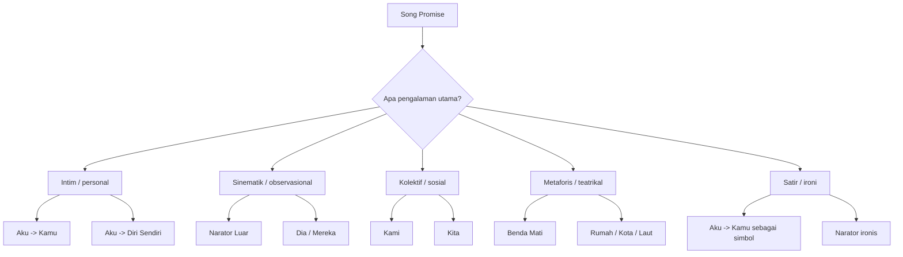
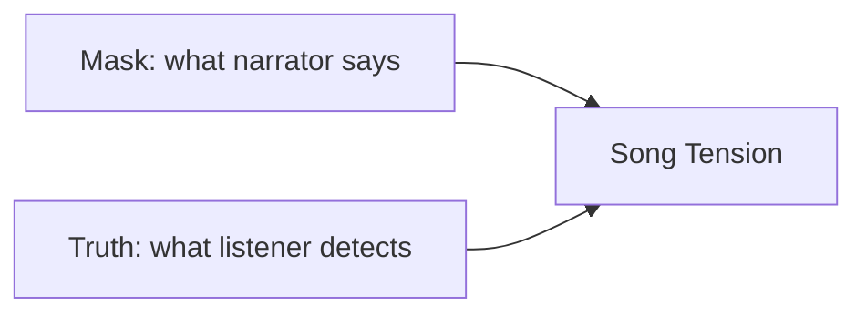
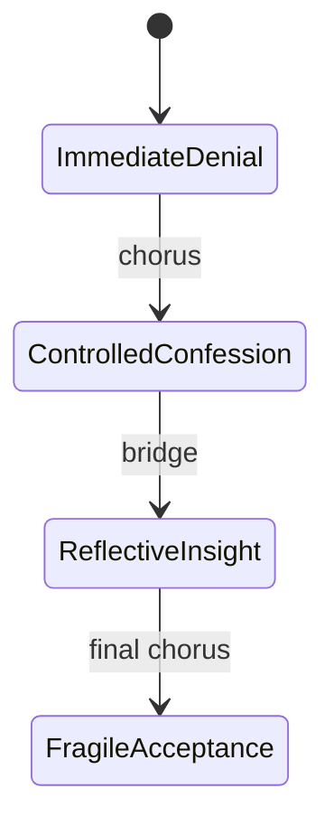
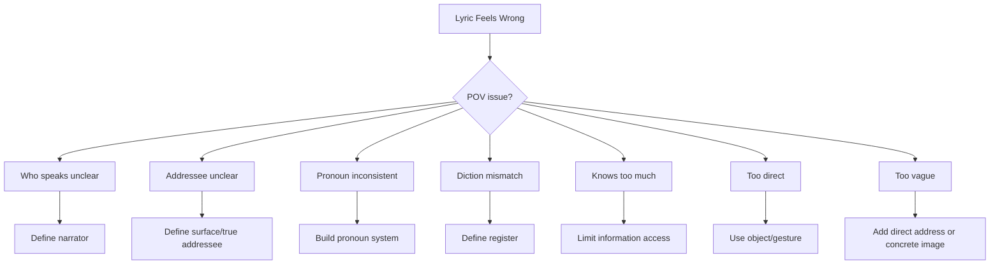

# learn-songwriting-part-008.md

# Persona, POV, dan Addressing: Menentukan Siapa yang Bicara, kepada Siapa, dan dari Jarak Emosi Apa

> Seri: `learn-songwriting`  
> Part: `008 / 034`  
> Fokus: persona, point of view, addressing, narrator reliability, dan suara lirik  
> Status seri: belum selesai  
> Prasyarat: `learn-songwriting-part-000.md` sampai `learn-songwriting-part-007.md`

---

## Ringkasan Part Ini

Part ini membahas pertanyaan yang sangat menentukan:

> “Siapa yang sebenarnya sedang berbicara di lagu ini?”

Banyak lagu pemula gagal bukan karena topiknya buruk, tetapi karena suaranya tidak jelas.

Contoh gejala:

- kadang “aku” bicara kepada “kamu”;
- tiba-tiba berubah menjadi cerita tentang “dia”;
- chorus terasa seperti pidato, bukan suara manusia;
- verse terasa seperti diary pribadi yang tidak bisa diakses pendengar;
- metafora bagus tetapi tidak cocok dengan orang yang sedang bicara;
- lirik terlalu formal untuk persona yang seharusnya intim;
- kritik sosial terlalu frontal padahal niatnya metaforis;
- narator terlalu jujur sehingga lagu tidak punya tension;
- narator terlalu samar sehingga pendengar tidak mengerti.

Song promise memberi pusat lagu.  
POV memberi **suara** pada pusat itu.

Tanpa POV yang jelas, song promise sulit menjadi lirik yang konsisten.

Dalam songwriting, POV bukan sekadar memilih kata ganti “aku/kamu/dia”. POV adalah sistem keputusan:

```text
Siapa berbicara?
Kepada siapa?
Apa yang ia tahu?
Apa yang ia tidak tahu?
Apa yang ia berani katakan?
Apa yang ia sembunyikan?
Apakah ia jujur?
Apakah ia sadar dirinya bohong?
Seberapa dekat ia dengan peristiwa?
Apakah ia bicara saat luka masih panas atau setelah waktu berlalu?
```

Sebagai software engineer, kamu bisa membayangkan POV sebagai **interface contract** untuk narator. Jika contract ini tidak jelas, semua downstream—diksi, metafora, hook, chorus, dan emotional movement—akan kacau.

---

## Tujuan Part

Setelah menyelesaikan part ini, kamu harus bisa:

1. Membedakan persona, POV, narrator, dan addressing.
2. Memilih POV yang sesuai dengan song promise.
3. Memahami efek “aku”, “kamu”, “dia”, “kami”, “mereka”, dan narator benda mati.
4. Menentukan siapa yang bicara dan siapa yang diajak bicara.
5. Mengatur jarak emosional narator.
6. Memahami reliable dan unreliable narrator.
7. Menggunakan dialog, monolog, confession, accusation, prayer, dan satire.
8. Menjaga konsistensi pronoun.
9. Menggunakan POV sebagai alat dramatic tension.
10. Membuat beberapa versi POV dari satu song promise.
11. Mendiagnosis lirik yang POV-nya bocor, kabur, atau tidak natural.
12. Membuat `POV contract` untuk lagu pertama.

---

## Definisi Dasar

Ada empat istilah yang perlu dibedakan:

| Istilah | Definisi | Pertanyaan |
|---|---|---|
| Persona | “Topeng” atau karakter suara lagu | Orang macam apa yang sedang bernyanyi? |
| POV | Sudut pandang naratif | Dari posisi siapa cerita dilihat? |
| Narrator | Entitas yang menyampaikan lagu | Siapa yang bicara? |
| Addressing | Arah bicara | Ia bicara kepada siapa? |

Contoh:

```markdown
Persona:
orang yang terlihat tenang tapi menyimpan denial

POV:
orang pertama

Narrator:
aku yang ditinggalkan

Addressing:
aku berbicara kepada kamu yang pergi, tapi sebenarnya juga kepada diri sendiri
```

Empat elemen ini saling berhubungan, tapi tidak identik.

---

## Kenapa POV Penting?

POV menentukan:

- pilihan kata;
- tingkat kejujuran;
- seberapa banyak informasi yang diketahui;
- apakah lirik terasa intim atau sinematik;
- apakah chorus menjadi confession, accusation, mantra, atau doa;
- apakah metaphor system terasa natural;
- apakah pendengar merasa dekat atau mengamati dari jauh;
- apakah lagu terdengar personal, kolektif, teatrikal, atau satir.

Contoh tema sama, POV berbeda.

Tema:

```text
seseorang belum bisa melepas orang yang pergi
```

## POV A — Aku kepada Kamu

```text
Gelasmu di rak kedua
tak kupakai, tak kubuang
```

Efek:

- intim;
- langsung;
- vulnerable;
- cocok untuk ballad.

## POV B — Aku kepada Diri Sendiri

```text
Jangan pindahkan gelas itu
kau belum sekuat yang kau kira
```

Efek:

- reflektif;
- psikologis;
- lebih internal.

## POV C — Narator Luar

```text
Ia menaruh dua gelas setiap pagi
seperti rumah belum menerima kabar
```

Efek:

- sinematik;
- observasional;
- ada jarak.

## POV D — Rumah sebagai Narrator

```text
Aku rumah yang kau tinggal menyala
menunggu langkahmu mengaku pulang
```

Efek:

- metaforis;
- theatrical;
- bisa kuat untuk kritik sosial.

## POV E — Gelas sebagai Narrator

```text
Aku gelas yang tak jadi bibirmu
tetap bening di rak kedua
```

Efek:

- puitis;
- unik;
- berisiko terlalu clever.

Semua bisa benar. Yang penting: mana yang paling mendukung song promise?

---

## POV sebagai Interface Contract

Dalam engineering, interface menentukan method yang tersedia dan constraint penggunaannya.

Dalam songwriting, POV menentukan:

```text
apa yang boleh dikatakan,
apa yang tidak boleh diketahui,
bahasa apa yang natural,
emosi apa yang bisa muncul,
dan bentuk konflik apa yang masuk akal.
```

## Contoh POV Contract

```yaml
pov_contract:
  narrator: "aku yang ditinggalkan"
  addressee: "kamu yang pergi"
  time_position: "beberapa minggu setelah kepergian"
  emotional_distance: "masih dekat, belum stabil"
  honesty_level: "tidak sepenuhnya jujur"
  self_awareness: "setengah sadar sedang menyangkal"
  diction: "intim, domestik, sederhana"
  forbidden_modes:
    - "pidato besar"
    - "narator maha tahu"
    - "metafora kosmik berlebihan"
  allowed_images:
    - "rumah"
    - "gelas"
    - "rak"
    - "pintu"
    - "lampu"
```

Jika lirik tiba-tiba berkata:

```text
Dalam kosmologi luka bangsa ini...
```

Contract dilanggar. Mungkin cocok untuk lagu lain, tapi tidak untuk persona ini.

---

## Model Besar: POV Decision Tree



Tidak semua lagu perlu POV unik. Untuk 20 jam pertama, pilih POV yang paling bisa dieksekusi.

---

# Bagian 1 — Persona

Persona adalah “siapa” di balik suara lagu.

Persona bukan selalu identitas asli penulis. Persona bisa berupa:

- versi dirimu yang lebih rapuh;
- versi dirimu yang lebih sinis;
- karakter fiktif;
- rumah;
- kota;
- kekasih;
- penonton;
- pelaku;
- korban;
- saksi;
- anak kecil;
- orang tua;
- benda;
- suara kolektif.

## Persona Menentukan Diksi

Persona berbeda menghasilkan bahasa berbeda.

Tema:

```text
marah karena ditinggalkan
```

### Persona 1 — Orang Rapuh

```text
Aku masih menutup pintu pelan
seolah kau tidur di ruang sebelah
```

### Persona 2 — Orang Sinis

```text
Kau pandai pergi
sampai pulang pun terdengar seperti iklan
```

### Persona 3 — Orang Religius

```text
Aku menyebut namamu
di sela doa yang tak selesai
```

### Persona 4 — Rumah

```text
Aku memelihara debu
di tempat kakimu biasa pulang
```

Persona mengatur vocabulary.

Jika persona tidak jelas, lirik mudah terasa tidak konsisten.

---

## Persona Profile Template

```markdown
# Persona Profile

## Identity
Siapa persona ini?
...

## Emotional State
Ia sedang merasa:
...

## Desire
Ia ingin:
...

## Fear
Ia takut:
...

## Wound
Luka utamanya:
...

## Mask
Yang ia pura-purakan:
...

## Language Style
Bahasanya:
- sederhana / puitis / sinis / formal / teatrikal / sehari-hari / religius / kasar / lembut

## What It Says Directly
Hal yang berani ia katakan:
...

## What It Avoids
Hal yang tidak berani ia katakan:
...

## Favorite Images
Benda/tempat yang natural baginya:
...

## Forbidden Language
Bahasa yang tidak cocok:
...
```

---

## Persona sebagai Mask

Lagu sering kuat ketika persona memakai topeng.

Contoh:

```text
Aku tidak rindu.
Aku hanya belum memindahkan gelasmu.
```

Persona berkata ia tidak rindu, tapi tindakannya membocorkan rindu.

Ini jauh lebih menarik daripada:

```text
Aku rindu sekali.
```

Kenapa?

Karena ada tension antara:

```text
what persona says
vs
what persona reveals
```

Itulah dramaturgi lirik.

---

## Mask vs Truth



Contoh:

| Mask | Truth |
|---|---|
| Aku baik-baik saja | Aku masih hancur |
| Aku tidak menunggu | Aku menunggu setiap hari |
| Aku hanya marah | Aku masih cinta |
| Aku sudah ikhlas | Aku takut tidak punya alasan hidup |
| Aku bercanda | Aku sedang mengutuk |
| Aku memanggil sayang | Aku sedang menuduh |

Songwriting sering hidup dari jarak antara mask dan truth.

---

# Bagian 2 — POV Utama dalam Songwriting

## 1. First Person: Aku

POV “aku” paling intim.

Cocok untuk:

- confession;
- ballad;
- personal grief;
- love song;
- shame;
- internal conflict;
- vulnerability.

Contoh:

```text
Aku masih menyisakan air
di gelas yang tak kau minta
```

Kekuatan:

- dekat;
- emosional;
- mudah diakses;
- cocok untuk voice memo sederhana.

Risiko:

- bisa jadi diary terlalu literal;
- terlalu banyak “aku merasa”;
- kurang scene;
- terlalu self-centered.

Cara memperkuat:

```text
Gunakan objek dan tindakan, bukan hanya perasaan.
```

---

## 2. Second Person: Kamu

POV “kamu” biasanya direct address.

Cocok untuk:

- accusation;
- longing;
- seduction;
- prayer;
- farewell;
- confrontation;
- satire;
- confession.

Contoh:

```text
Kau selalu pandai pulang
ketika lampu sudah padam
```

Kekuatan:

- terasa langsung;
- dramatic;
- mudah menjadi chorus;
- bisa membuat pendengar merasa diajak bicara.

Risiko:

- terlalu menyalahkan;
- terlalu melodramatic;
- “kamu” tidak jelas siapa;
- bisa terlalu frontal.

Cara memperkuat:

```text
Tentukan apakah "kamu" adalah orang literal, simbol, atau diri sendiri.
```

---

## 3. Third Person: Dia/Ia

POV “dia” memberi jarak.

Cocok untuk:

- storytelling;
- folk;
- sinematik;
- observasi sosial;
- karakter fiktif;
- kisah tragis;
- lagu dengan narator lebih tenang.

Contoh:

```text
Ia menaruh dua piring
di meja yang tak lagi bertanya
```

Kekuatan:

- tidak terlalu curhat;
- memberi ruang pendengar;
- bisa lebih visual;
- cocok untuk narasi.

Risiko:

- kurang intim;
- chorus bisa terasa kurang personal;
- perlu detail kuat agar tidak datar.

Cara memperkuat:

```text
Gunakan scene dan gesture agar "dia" terasa hidup.
```

---

## 4. First Person Plural: Kita/Kami

“Kita” dan “kami” berbeda.

### Kita

Inklusif: pembicara + pendengar.

```text
Kita pernah menamai rumah
dengan hal-hal yang tak jadi tinggal
```

Efek:

- intim;
- shared memory;
- nostalgia;
- bisa romantis.

### Kami

Eksklusif atau kolektif.

```text
Kami menunggu di meja makan
sementara tuan belajar terbang
```

Efek:

- sosial;
- kolektif;
- rakyat/keluarga/komunitas;
- cocok untuk kritik.

Risiko:

- bisa terdengar seperti pidato;
- perlu detail personal agar tidak slogan.

---

## 5. Narator Luar

Narator luar tidak selalu terlibat langsung.

Cocok untuk:

- ballad cerita;
- kritik sosial;
- tragedy;
- cinematic songwriting;
- karakter kompleks;
- unreliable character dari luar.

Contoh:

```text
Di terminal yang tak mengenal nama
seorang lelaki mencium koper
lebih lama dari rumahnya
```

Kekuatan:

- sinematik;
- bisa memberi ironi;
- bisa melihat banyak karakter.

Risiko:

- terlalu novelistik;
- kurang hook personal;
- bisa berat untuk lagu pendek.

---

## 6. Benda Mati sebagai Narrator

Benda mati bisa menjadi persona:

- rumah;
- koper;
- gelas;
- pintu;
- jam;
- jalan;
- kota;
- bandara;
- meja makan.

Contoh rumah:

```text
Aku rumah yang kau tinggalkan
dengan lampu-lampu pura-pura tabah
```

Kekuatan:

- metaforis;
- unik;
- kuat untuk satire/tragic romance;
- membuat kritik tidak frontal.

Risiko:

- terlalu clever;
- pendengar bingung jika tidak jelas;
- bisa sulit dipertahankan satu lagu penuh.

Cara memperkuat:

```text
Pastikan benda itu punya akses sensorik dan emosi yang konsisten.
```

Rumah bisa tahu:

- pintu;
- lampu;
- suara langkah;
- meja;
- retak dinding.

Rumah tidak natural tahu:

- isi pikiran orang di pesawat, kecuali secara metaforis jelas.

---

# Bagian 3 — Addressing: Kepada Siapa Lagu Bicara?

Addressing adalah arah bicara.

Satu POV “aku” bisa punya addressing berbeda.

## Aku kepada Kamu

```text
Aku masih menunggumu.
```

Efek:

- direct;
- intim;
- konfrontatif.

## Aku kepada Diri Sendiri

```text
Jangan panggil itu rindu.
Kau hanya belum berani sepi.
```

Efek:

- introspektif;
- self-dialogue;
- bisa sangat kuat untuk shame/denial.

## Aku kepada Tuhan

```text
Jika ini doa,
mengapa namanya yang keluar?
```

Efek:

- spiritual;
- konflik iman;
- tinggi emosi.

## Aku kepada Publik

```text
Lihatlah rumah ini
diajari menunggu oleh tuannya.
```

Efek:

- deklaratif;
- sosial;
- theatrical.

## Aku kepada Benda

```text
Gelas, katakan padanya
aku sudah berhenti menunggu.
```

Efek:

- puitis;
- absurd lembut;
- bisa menunjukkan denial.

## Aku kepada Orang yang Tidak Hadir

Ini sangat umum dalam lagu.

```text
Kau tidak di sini,
tapi semua kalimatku masih menghadapmu.
```

Efek:

- longing;
- grief;
- unresolved.

---

## Addressing Matrix

```markdown
# Addressing Matrix

| Speaker | Addressee | Effect | Risk |
|---|---|---|---|
| Aku | Kamu | intimate, direct | melodramatic |
| Aku | Diri sendiri | psychological | too internal |
| Aku | Tuhan | spiritual | too grand |
| Aku | Publik | social | preachy |
| Aku | Benda | poetic | too clever |
| Rumah | Tuan | metaphor/satire | confusing |
| Narator | Pendengar | storytelling | distant |
| Kami | Kamu | collective accusation | slogan-like |
```

Pilih addressing berdasarkan song promise.

---

## Direct vs Indirect Address

### Direct Address

```text
Kau belum selesai
di rumah yang kupanggil sepi
```

Kekuatan:

- kuat;
- mudah chorus;
- emosional langsung.

Risiko:

- terlalu eksplisit;
- bisa melodramatic.

### Indirect Address

```text
Namanya masih tahu jalan
ke mulut yang pura-pura lupa
```

Kekuatan:

- puitis;
- subtle;
- memberi ruang.

Risiko:

- bisa terlalu samar;
- hook kurang langsung.

Untuk MVS, direct address lebih mudah. Tapi indirect bisa lebih elegan jika promise butuh restraint.

---

# Bagian 4 — Emotional Distance

POV juga punya jarak emosi.

Jarak emosi menjawab:

```text
Narator bicara saat luka masih terjadi,
atau setelah lama berlalu?
```

## Jarak 1 — Immediate

Luka masih panas.

```text
Jangan tutup pintu itu
aku belum selesai bicara
```

Efek:

- urgent;
- raw;
- dramatis.

Risiko:

- kacau;
- melodramatic;
- kurang refleksi.

## Jarak 2 — Recent but Controlled

Beberapa waktu berlalu, tapi luka masih aktif.

```text
Gelasmu masih di rak kedua
tak kupakai, tak kubuang
```

Efek:

- intim;
- tertahan;
- cocok ballad.

## Jarak 3 — Reflective

Narator sudah bisa melihat pola.

```text
Ternyata yang kujaga bukan gelasmu
melainkan caraku menunda sepi
```

Efek:

- dewasa;
- sadar;
- cocok bridge/final chorus.

## Jarak 4 — Distant / Mythic

Sudah menjadi cerita.

```text
Konon, rumah itu menyalakan lampu
untuk tuan yang tak lagi punya jalan
```

Efek:

- legenda;
- sinematik;
- berjarak.

Risiko:

- kurang personal.

---

## Emotional Distance Across Sections

Lagu bisa bergerak dari jarak dekat ke reflektif.



Contoh:

| Section | Emotional Distance |
|---|---|
| Verse 1 | dekat, denial |
| Chorus | pengakuan tertahan |
| Verse 2 | lebih sadar |
| Bridge | reflektif |
| Final Chorus | sadar tapi masih terluka |

Ini membuat emotional movement.

---

# Bagian 5 — Reliable vs Unreliable Narrator

Narator tidak harus sepenuhnya jujur.

Bahkan, banyak lagu kuat memakai narator yang tidak jujur kepada dirinya sendiri.

## Reliable Narrator

Narator memahami dan mengatakan kebenaran relatif jelas.

```text
Aku masih merindukanmu
dan belum bisa melepas
```

Kekuatan:

- jelas;
- direct;
- cocok untuk confession.

Risiko:

- kurang tension jika terlalu cepat jujur.

## Unreliable Narrator

Narator mengatakan satu hal, tapi lagu menunjukkan hal lain.

```text
Aku tidak menunggu
hanya saja pintu kubuka sedikit
setiap hujan berhenti
```

Kekuatan:

- dramatik;
- subtle;
- pendengar ikut menemukan truth;
- cocok untuk denial, shame, satire.

Risiko:

- terlalu samar jika tidak ada evidence.

---

## Jenis Unreliable Narrator

| Jenis | Ciri |
|---|---|
| Denier | menyangkal perasaannya |
| Self-deceiver | tidak sadar bohong |
| Performer | tampil kuat/baik |
| Ironist | berkata manis untuk menyindir |
| Romanticizer | memperindah sesuatu yang buruk |
| Accuser | menyalahkan orang lain untuk menutupi luka sendiri |
| Nostalgic liar | mengingat masa lalu lebih indah dari kenyataan |
| Satirical lover | bicara seperti kekasih, maksudnya kritik |

---

## Contoh Denial

Direct:

```text
Aku rindu kamu.
```

Unreliable:

```text
Aku tidak rindu
hanya saja tehmu masih kubuat
setiap pukul tujuh
```

Unreliable lebih kuat karena ada tension antara claim dan evidence.

---

## Unreliable Narrator in Satire

Song promise:

```text
kritik sosial dibungkus romansa tragis
```

Narator bisa berkata:

```text
Sayang, pergilah lagi
rumah sudah pandai pura-pura utuh
```

Di permukaan: romantis/pasrah.  
Di bawah: tuduhan.

Ini memungkinkan kritik tanpa vulgar.

---

# Bagian 6 — Monolog, Dialog, Confession, Accusation

## Monolog

Narator bicara sendiri atau kepada yang tidak menjawab.

Cocok untuk:

- rindu;
- grief;
- introspection;
- loneliness.

Contoh:

```text
Aku bicara pada pintu
karena namamu tak lagi menjawab
```

## Dialog

Ada suara lain, kutipan, atau respons.

Cocok untuk:

- drama;
- storytelling;
- conflict;
- theatre-like song.

Contoh:

```text
"Kau baik-baik saja?"
katamu dari layar yang pecah

Aku mengangguk
pada kamar yang tak percaya
```

Dialog membuat lagu hidup, tapi harus hati-hati agar tidak terlalu prosa.

## Confession

Narator mengaku.

```text
Aku belum selesai
dengan caramu menutup pintu
```

Cocok untuk chorus.

## Accusation

Narator menuduh.

```text
Kau pulang hanya saat lampu menyala
dan pergi ketika meja retak
```

Cocok untuk konflik dan satire.

## Prayer

Narator memohon kepada sesuatu yang lebih besar.

```text
Tuhan, jika ini ikhlas
mengapa namanya masih jadi amin?
```

Cocok untuk spiritual conflict.

## Curse / Kutukan

Narator mengutuk, tapi bisa puitis.

```text
Semoga setiap bandara
mengajar kopermu merasa rumah
```

Cocok untuk dark theatrical songwriting.

---

# Bagian 7 — Pronoun System

Pronoun atau kata ganti harus konsisten.

Dalam bahasa Indonesia:

- aku;
- ku-;
- -ku;
- saya;
- gue;
- kita;
- kami;
- kau;
- kamu;
- engkau;
- dia;
- ia;
- mereka;
- tuan;
- sayang;
- namamu;
- rumah ini.

Pilihan pronoun sangat mempengaruhi rasa.

## Aku vs Saya

| Pronoun | Efek |
|---|---|
| aku | intim, lirik, personal |
| saya | formal, berjarak, bisa satir |
| gue | urban, kasual, direct |
| ku- / -ku | liris, ringkas, puitis |
| beta / hamba / daku | sangat style-specific, berisiko |

Contoh:

```text
Aku masih menunggu
```

Lebih intim.

```text
Saya masih menunggu
```

Lebih formal, bisa ironis jika dipakai sengaja.

```text
Kuletakkan gelasmu
```

Lebih liris dan padat.

## Kamu vs Kau vs Engkau

| Pronoun | Efek |
|---|---|
| kamu | natural, modern, conversational |
| kau | liris, ringkas, sedikit klasik |
| engkau | formal, religius, puitis |
| tuan | jarak, sindiran, kelas, otoritas |
| sayang | intim, bisa ironis |
| namamu | indirect, puitis |

Contoh:

```text
Kamu belum selesai
```

Natural.

```text
Kau belum selesai
```

Lebih singable, lebih liris.

```text
Tuan belum selesai
```

Satir, berjarak, politis.

---

## Pronoun Consistency Table

Buat tabel:

```markdown
# Pronoun System

| Role | Pronoun Used | Notes |
|---|---|---|
| Narrator | aku / ku | intimate, restrained |
| Addressee | kau / -mu | liris, direct |
| Collective | kita | only if shared memory |
| Authority figure | tuan | only for satire |
```

Setelah itu, jangan campur sembarangan.

Contoh campur buruk:

```text
Aku masih menunggumu
Tuan pergi seperti biasa
Dia tak pernah mengerti kita
Saya cuma ingin pulang
```

Bisa saja disengaja, tapi jika tidak, terdengar kacau.

---

## Pronoun Shift as Device

Pronoun boleh berubah jika ada alasan dramatis.

Contoh:

Verse:

```text
kau
```

Chorus:

```text
tuan
```

Efek:

- dari intim ke sindiran;
- cinta berubah menjadi dakwaan.

Contoh:

Verse 1:

```text
kamu
```

Final chorus:

```text
namamu
```

Efek:

- orangnya menghilang, tinggal nama.

Pronoun shift harus bermakna, bukan bocor.

---

# Bagian 8 — POV Time Position

POV juga terkait waktu.

Kapan narator bicara?

## 1. Before Event

Narator bicara sebelum kejadian besar.

```text
Kau mengikat tali sepatu
seolah pintu belum memilih arah
```

Efek:

- foreshadowing;
- tension.

## 2. During Event

Narator bicara saat kejadian.

```text
Jangan angkat kopermu dulu
meja makan belum selesai retak
```

Efek:

- urgent;
- dramatic.

## 3. After Event

Narator bicara setelah kejadian.

```text
Sejak kau pergi
gelasmu belajar jadi pajangan
```

Efek:

- reflective;
- cocok ballad.

## 4. Long After Event

Narator bicara dari masa depan.

```text
Bertahun kemudian
aku masih tahu letak sunyi di rak kedua
```

Efek:

- nostalgic;
- mature;
- story-like.

---

## Time Position and Tense in Indonesian

Bahasa Indonesia tidak punya tense seperti Inggris, tapi waktu tetap terasa melalui:

- sejak;
- dulu;
- nanti;
- masih;
- pernah;
- belum;
- akan;
- sempat;
- tiap pagi;
- malam itu;
- bertahun kemudian;
- kini;
- esok;
- pulang.

Kata seperti “masih” dan “belum” sangat kuat untuk lagu.

Contoh:

```text
Kau belum selesai.
```

“Belum” memberi unresolved state.

```text
Aku masih menunggu.
```

“Masih” memberi duration dan denial.

---

# Bagian 9 — POV and Information Access

Narator hanya boleh tahu hal yang masuk akal untuk posisinya.

Jika narator adalah “aku di rumah”, ia bisa tahu:

- benda di rumah;
- perasaannya;
- apa yang terlihat;
- pesan yang diterima;
- kebiasaan lama.

Ia tidak bisa tahu secara literal:

- apa yang kamu pikirkan di pesawat;
- apa yang terjadi di rapat tertutup;
- isi hati kamu;

kecuali ditulis sebagai dugaan/metafora.

## Information Access Template

```markdown
## What Narrator Knows
-

## What Narrator Guesses
-

## What Narrator Refuses to Know
-

## What Narrator Is Wrong About
-

## What Listener Understands Better Than Narrator
-
```

Ini penting untuk unreliable narrator.

Contoh:

```markdown
What Narrator Knows:
- gelas masih di rak
- orang itu belum pulang
- ia masih membuat dua teh

What Narrator Guesses:
- mungkin orang itu lupa jalan pulang

What Narrator Refuses to Know:
- orang itu memilih tidak pulang

What Narrator Is Wrong About:
- ia bilang hanya malas beres-beres

What Listener Understands Better:
- ia belum bisa melepas
```

---

# Bagian 10 — POV and Diction

Diksi harus cocok dengan persona.

## Persona Intim/Domestik

Cocok:

```text
gelas, rak, pintu, pagi, pelan, tangan, air, kursi
```

Tidak cocok jika tiba-tiba:

```text
peradaban, kosmologi, legitimasi, dekonstruksi
```

## Persona Satir-Teatrikal

Cocok:

```text
tuan, panggung, koper, karpet merah, pengumuman, salam, lampu, pesta
```

## Persona Urban/Burnout

Cocok:

```text
notifikasi, layar, lift, badge, deadline, jam dua, kopi dingin
```

## Persona Spiritual

Cocok:

```text
doa, amin, sujud, sunyi, nama, langit, tangan, maaf
```

Tapi hati-hati cliché. Spesifikkan.

---

## Diction Register

Register adalah tingkat bahasa.

| Register | Efek |
|---|---|
| conversational | natural, dekat |
| poetic | liris, indah |
| formal | berjarak, bisa ironis |
| vulgar | raw, frontal, berisiko |
| archaic | klasik, teatral |
| bureaucratic | satir, dingin |
| religious | spiritual, tinggi |
| childlike | polos, menyakitkan jika kontras |

Contoh register shift untuk satire:

```text
Sayang,
berdasarkan jadwal keberangkatanmu
rumah akan kembali retak pukul tujuh.
```

Register bureaucratic + romance bisa menghasilkan ironi.

Tetapi jangan berlebihan jika song promise tidak mendukung.

---

# Bagian 11 — POV and Metaphor

Metafora harus terasa natural dari POV.

Jika narrator adalah rumah, metafora tubuh mungkin natural:

```text
dindingku menahan napas
pintuku menggigit angin
lampuku pura-pura bangun
```

Jika narrator adalah orang sederhana di dapur, metafora terlalu kosmik mungkin tidak natural:

```text
galaksi duka berputar di orbit sendokmu
```

Bisa dipakai jika persona memang theatrical, tapi jika tidak, terasa forced.

## Metaphor Compatibility Test

```text
Apakah persona ini akan melihat dunia seperti ini?
Apakah metafora ini berasal dari world lagu?
Apakah metafora ini memperjelas atau hanya memperindah?
Apakah metafora ini cocok dengan diction register?
```

---

# Bagian 12 — POV and Chorus

Chorus sering menjadi tempat POV paling jelas.

Jenis chorus berdasarkan POV:

## Confessional Chorus

```text
Aku belum selesai
dengan pintu yang kau biarkan terbuka
```

Aku mengaku.

## Accusatory Chorus

```text
Kau pulang hanya sebagai kabar
bukan sebagai tubuh
```

Aku menuduh kamu.

## Self-Address Chorus

```text
Jangan sebut itu rindu
kau hanya takut sendiri
```

Aku menegur diri sendiri.

## Collective Chorus

```text
Kami menunggu di rumah retak
tuan menari di ruang udara
```

Kami menuduh.

## Object Narrator Chorus

```text
Aku rumahmu
yang tak pernah kau tanya
sebelum pergi
```

Benda/personifikasi bicara.

Chorus harus konsisten dengan POV dan addressing.

---

# Bagian 13 — POV and Verse

Verse adalah tempat POV membuktikan dirinya.

Jika POV adalah “aku yang denial”, verse harus menunjukkan denial.

Buruk:

```text
Aku denial dan tidak bisa melepasmu.
```

Lebih baik:

```text
Kutaruh gelasmu lebih dalam
bukan kubuang
hanya supaya tak terlihat
```

Jika POV adalah rumah, verse harus memakai sensor rumah:

```text
Lantailah yang pertama tahu
langkahmu tak lagi berat di pagi hari
```

Jika POV adalah narator luar, verse bisa sinematik:

```text
Ia menyeka meja
dari debu yang sengaja dipelihara
```

---

# Bagian 14 — POV and Bridge

Bridge bisa menjadi tempat POV berubah atau sadar.

Contoh movement:

| Section | POV State |
|---|---|
| Verse 1 | aku bicara ke kamu, denial |
| Chorus | aku mulai mengaku |
| Verse 2 | aku masih menutupi |
| Bridge | aku sadar aku bicara ke diriku sendiri |
| Final Chorus | “kamu” berubah menjadi “namamu” |

Bridge bisa mengungkap addressing sebenarnya.

Contoh:

```text
Dari tadi
bukan kau yang kujaga pulang

Aku hanya takut
rumah ini tahu
aku sendirian
```

Setelah bridge, final chorus berubah makna.

---

# Bagian 15 — POV Shifts

POV shift bisa kuat jika disengaja.

## Shift 1 — Kamu ke Namamu

Awal:

```text
Kau belum selesai
```

Akhir:

```text
Namamu belum selesai
```

Efek:

- orangnya makin jauh;
- hanya tinggal nama/memori.

## Shift 2 — Aku ke Kita

Awal:

```text
Aku menunggu
```

Akhir:

```text
Kita ternyata sama-sama tidak pulang
```

Efek:

- reveal shared failure.

## Shift 3 — Sayang ke Tuan

Awal:

```text
Sayang, kau pergi lagi
```

Akhir:

```text
Tuan, jangan panggil ini pulang
```

Efek:

- romansa berubah menjadi dakwaan;
- cocok satire.

## Shift 4 — Dia ke Aku

Awal narator luar:

```text
Ia menaruh dua gelas
```

Bridge:

```text
Aku tahu
karena akulah yang mencucinya
```

Efek:

- reveal narrator;
- sinematik.

POV shift harus diberi alasan emotional/structural.

---

# Bagian 16 — The Addressee Is Not Always the Real Target

Kadang lagu tampak bicara kepada satu pihak, tapi sebenarnya bicara kepada yang lain.

## Surface Addressee vs True Addressee

| Surface Addressee | True Addressee |
|---|---|
| kamu yang pergi | diri sendiri yang belum melepas |
| kekasih | pemimpin/kuasa |
| Tuhan | seseorang yang hilang |
| rumah | masa lalu |
| anak | orang dewasa yang gagal menjaga |
| pendengar | pelaku yang tidak hadir |

Contoh:

```text
Kau belum selesai
```

Surface:

```text
kepada mantan/kekasih
```

True:

```text
kepada diri sendiri yang belum selesai
```

Ini memberi kedalaman.

---

## Addressing Depth Template

```markdown
# Addressing Depth

Surface addressee:
...

True addressee:
...

What narrator thinks they are saying:
...

What narrator is actually revealing:
...

What listener understands:
...
```

Contoh:

```markdown
Surface addressee:
kamu yang pergi

True addressee:
diri sendiri yang belum mau pulih

What narrator thinks they are saying:
aku hanya menyimpan barangmu

What narrator is actually revealing:
aku takut hidup tanpa ritual menunggu

What listener understands:
barang itu bukan tentang kamu lagi, tapi tentang identitas narator
```

---

# Bagian 17 — POV untuk Kritik yang Tidak Vulgar

Karena songwriting sering dipakai untuk kritik sosial secara metaforis, POV sangat penting.

Kritik frontal:

```text
Pemimpin sering pergi dan meninggalkan rakyat.
```

Ini jelas, tapi bisa terasa seperti opini langsung.

Kritik metaforis melalui POV:

```text
Sayang, kopermu lebih hafal jalan
daripada tanganmu mengenal meja makan
```

Efek:

- tragis;
- romantis;
- tajam;
- tidak menyebut langsung;
- pendengar bisa menangkap lapisan.

## POV Strategi untuk Kritik

| Strategi | Contoh |
|---|---|
| Kekasih yang ditinggal | kuasa sebagai pasangan yang pergi |
| Rumah sebagai narrator | negara/rakyat sebagai rumah |
| Anak-anak sebagai saksi | dampak domestik |
| Koper sebagai saksi | kepergian sebagai kebiasaan |
| Narator ironis | memuji untuk menyindir |
| Pesta/teater | kepulangan sebagai pertunjukan |

## Risiko Kritik Metaforis

| Risiko | Mitigasi |
|---|---|
| Terlalu samar | beri detail yang mengarah |
| Terlalu frontal | gunakan vehicle konsisten |
| Terlalu vulgar | biarkan tindakan/metafora yang menghakimi |
| Terlalu preachy | fokus pada scene dan persona |
| Terlalu clever | jaga emotional wound |

---

# Bagian 18 — Dialogue and Quotation

Dialog bisa mempertebal lirik.

## Fungsi Dialog

- menunjukkan konflik;
- memberi suara pihak lain;
- membuat scene hidup;
- memberi ironi;
- membuat chorus lebih theatrical;
- membedakan quote dan inner voice.

## Format Dialog dalam Lyric Sheet

Gunakan tanda kutip jelas.

```markdown
"Kau baik-baik saja?"
katamu dari layar yang pecah

Aku menjawab, "tentu,"
pada kamar yang tahu
aku berbohong
```

Untuk AI music generation, dialog bisa diberi label:

```text
[spoken, quoted, softer]
"Kau baik-baik saja?"

[whispered response]
"Tentu."
```

Dalam seri ini, kita fokus songwriting, bukan prompt production. Tapi marking dialog tetap penting.

## Dialog Failure Modes

| Failure | Gejala |
|---|---|
| Terlalu prosa | terasa seperti skenario, bukan lagu |
| Tidak jelas siapa bicara | pendengar bingung |
| Dialog terlalu panjang | melodi susah |
| Kutipan tidak berfungsi | hanya gimmick |
| Dialog menjelaskan semua | tidak ada ruang |

## Dialog Compression

Prosa:

```text
Dia bertanya apakah aku baik-baik saja, lalu aku menjawab bahwa aku baik-baik saja meskipun sebenarnya tidak.
```

Lyric:

```text
"Kau baik-baik saja?"

Aku mengangguk
pada gelas yang pecah
```

Lebih kuat karena tidak menjelaskan semuanya.

---

# Bagian 19 — POV Consistency Audit

Setelah menulis draft, audit.

```markdown
# POV Consistency Audit

## Pronouns Used
Aku:
Kamu/Kau:
Dia/Ia:
Kita/Kami:
Tuan/Sayang:
Other:

## Speaker
Siapa yang bicara di verse 1?
Siapa yang bicara di chorus?
Siapa yang bicara di verse 2?
Siapa yang bicara di bridge?

## Addressee
Kepada siapa verse 1 bicara?
Kepada siapa chorus bicara?
Kepada siapa bridge bicara?

## Time Position
Kapan narator bicara?

## Knowledge Boundary
Apakah narator tahu hal yang tidak seharusnya ia tahu?

## Diction Consistency
Apakah bahasa sesuai persona?

## Drift
Apakah POV berubah tanpa alasan?

## Decision
- keep
- revise pronoun
- make shift intentional
- split song
```

---

# Bagian 20 — Five POV Versions Exercise

Ambil satu song promise, tulis lima versi.

Song promise:

```text
rindu disangkal lewat benda rumah
```

## 1. Aku ke Kamu

```text
Gelasmu di rak kedua
tak kupakai, tak kubuang
```

## 2. Aku ke Diri Sendiri

```text
Jangan pindahkan gelas itu
kau belum sekuat yang kau bilang
```

## 3. Narator Luar

```text
Ia menaruh gelas di rak kedua
seperti pagi masih bisa dibujuk
```

## 4. Rumah sebagai Narrator

```text
Aku menyimpan gelasmu
di tulang kecil bernama rak kedua
```

## 5. Gelas sebagai Narrator

```text
Aku gelas yang menunggu bibirmu
lebih sabar dari pemilik rumah
```

Setelah menulis lima versi, pilih yang paling punya:

- emotional energy;
- lyric potential;
- hook potential;
- singability;
- consistency.

---

# Bagian 21 — POV Scoring

Gunakan matrix.

```markdown
# POV Selection Matrix

| POV | Emotional Power | Clarity | Freshness | Singability | Fits Promise | Risk | Total |
|---|---:|---:|---:|---:|---:|---|---:|
| Aku -> Kamu |  |  |  |  |  |  |  |
| Aku -> Diri |  |  |  |  |  |  |  |
| Narator luar |  |  |  |  |  |  |  |
| Rumah |  |  |  |  |  |  |  |
| Benda |  |  |  |  |  |  |  |
```

Skor 1–5. Risk ditulis naratif.

Untuk MVS, jangan selalu pilih yang paling unik. Pilih yang paling kuat dan bisa dieksekusi.

---

# Bagian 22 — POV and Singability

POV juga memengaruhi syllable dan phrase.

Contoh:

```text
Aku masih menunggumu
```

7 suku kata kira-kira:

```text
A-ku / ma-sih / me-nung-gu-mu
```

Lebih panjang.

```text
Ku masih menunggu
```

5 suku kata kira-kira:

```text
Ku / ma-sih / me-nung-gu
```

Lebih singable tapi lebih liris.

```text
Masih kutunggu
```

5 suku kata, lebih poetic.

```text
Kau belum selesai
```

5 suku kata, kuat untuk hook.

Pronoun choice mempengaruhi melodi.

## Aku vs Ku

```text
Aku menunggu
```

Lebih conversational.

```text
Kumenunggu
```

Kurang natural dalam bahasa modern.

```text
Kutunggu
```

Padat, liris.

Gunakan “ku-” dengan hati-hati agar tidak terdengar terlalu kuno kecuali memang sesuai mood.

---

# Bagian 23 — POV and Natural Indonesian Lyric

Bahasa Indonesia bisa terdengar kaku jika terlalu formal.

Contoh kaku:

```text
Saya merasakan kehampaan akibat kepergianmu
```

Lebih natural:

```text
Sejak kau pergi
rumah ini terlalu banyak ruang
```

Atau:

```text
Aku tak bilang sepi
tapi kursimu tak pernah kupakai
```

Natural bukan berarti selalu sehari-hari. Natural berarti sesuai persona, emosi, dan musik.

## Naturalness Test

Ucapkan baris tanpa melodi.

Tanya:

```text
Apakah persona ini mungkin mengatakan ini?
Apakah terlalu formal?
Apakah terlalu puitis?
Apakah terlalu menjelaskan?
Apakah kata ini hanya dipilih demi rima?
```

Jika tidak natural saat diucapkan, sering kali sulit natural saat dinyanyikan.

---

# Bagian 24 — POV and Forbidden Words

Untuk menjaga persona, buat daftar kata yang tidak boleh dipakai.

Contoh persona:

```text
aku yang denial dan domestik
```

Forbidden words:

```text
rindu
luka
hancur
cinta
semesta
jiwa
takdir
```

Kenapa?

Bukan karena kata itu haram, tetapi karena promise ingin menunjukkan denial lewat benda, bukan label emosi.

Contoh persona satire romantis:

Forbidden words:

```text
presiden
anggaran
pemerintah
korup
pejabat
```

Karena lagu ingin metaforis, bukan literal.

Allowed words:

```text
tuan
koper
panggung
rumah
meja
lampu
pulang
pengumuman
```

Forbidden words membantu menjaga POV dan tone.

---

# Bagian 25 — POV and Emotional Honesty

Emotional honesty bukan berarti narator berkata semuanya secara literal.

Kadang honesty justru muncul lewat penghindaran.

Literal:

```text
Aku sangat kesepian.
```

Indirect but honest:

```text
Aku menyalakan dua lampu
untuk satu bayangan
```

Pertanyaan:

```text
Apakah baris ini jujur secara emosi, walau tidak literal?
Apakah persona ini berani berkata begini?
Apakah yang tidak dikatakan justru terasa?
```

Songwriting sering bekerja melalui **strategic omission**.

---

# Bagian 26 — POV and Strategic Omission

Apa yang tidak dikatakan sering lebih kuat.

Contoh:

```text
Kau pergi dan aku sangat hancur.
```

Versi omission:

```text
Pintumu kututup pelan
seolah ada tidur
yang bisa kubangunkan
```

Tidak menyebut “hancur”, tapi terasa.

## Omission Template

```markdown
Hal yang sebenarnya:
...

Hal yang persona katakan:
...

Hal yang persona lakukan:
...

Hal yang pendengar simpulkan:
...
```

Contoh:

```markdown
Hal yang sebenarnya:
Aku masih rindu.

Hal yang persona katakan:
Gelasmu belum kupindah.

Hal yang persona lakukan:
Menyisakan air panas.

Hal yang pendengar simpulkan:
Ia masih menunggu.
```

---

# Bagian 27 — POV and Song Promise Alignment

Setiap POV harus diuji terhadap promise.

Template:

```markdown
# POV-Promise Alignment

## Song Promise
...

## POV Candidate
...

## Why it fits
-

## What it can show well
-

## What it cannot show well
-

## Risk
-

## Mitigation
-

## Verdict
Use / revise / reject
```

Contoh:

```markdown
## Song Promise
Kemarahan sosial sebagai romansa tragis kekasih yang terus pergi.

## POV Candidate
Aku sebagai rumah/kekasih yang ditinggal.

## Why it fits
- memungkinkan kritik lewat intimacy
- rumah bisa menjadi rakyat/negeri
- kekasih bisa memanggil "sayang" secara ironis

## What it can show well
- ditinggalkan
- rumah rusak
- meja makan
- kepergian
- kepulangan palsu

## What it cannot show well
- data politik langsung
- argumentasi kebijakan detail

## Risk
Terlalu samar atau terlalu melodramatic.

## Mitigation
Gunakan detail bandara/koper/rumah retak yang konsisten.

## Verdict
Use.
```

---

# Bagian 28 — POV Anti-Patterns

## Anti-Pattern 1: Pronoun Soup

Gejala:

```text
aku, kamu, dia, kami, mereka, tuan, kita
```

semua muncul tanpa alasan.

Solusi:

```text
Buat pronoun system.
```

## Anti-Pattern 2: Diary Mode

Gejala:

```text
Aku merasa...
Aku sedih...
Aku kecewa...
Aku bingung...
```

Solusi:

```text
Ganti sebagian perasaan dengan scene, object, gesture.
```

## Anti-Pattern 3: Essay Narrator

Gejala:

```text
Narator menjelaskan tema seperti opini atau artikel.
```

Solusi:

```text
Masukkan persona, address, dan vehicle.
```

## Anti-Pattern 4: Clever Object POV

Gejala:

```text
Benda mati menjadi narrator, tapi hanya gimmick.
```

Solusi:

```text
Pastikan object POV punya reason dan sensory world.
```

## Anti-Pattern 5: POV Drift

Gejala:

```text
Verse personal, chorus sosial, bridge spiritual, tanpa transisi.
```

Solusi:

```text
Tentukan apakah ini lagu yang sama atau beberapa lagu.
```

## Anti-Pattern 6: Too Honest Too Early

Gejala:

```text
Verse 1 sudah menjelaskan seluruh luka.
```

Solusi:

```text
Tahan truth untuk chorus/bridge. Mulai dari evidence.
```

## Anti-Pattern 7: False Poetic Voice

Gejala:

```text
Bahasa terlalu “sastra” tetapi tidak cocok persona.
```

Solusi:

```text
Ucapkan sebagai manusia. Sesuaikan register.
```

---

# Bagian 29 — POV Debugging

Jika lirik terasa aneh, debug POV.



## Debug Questions

```text
Siapa yang bicara?
Kepada siapa?
Kapan ia bicara?
Apa yang ia tahu?
Apa yang ia sembunyikan?
Apakah kata ini natural untuk persona?
Apakah pronoun konsisten?
Apakah POV berubah dengan sengaja?
Apakah lirik lebih kuat jika memakai aku, kamu, dia, atau rumah?
```

---

# Bagian 30 — POV Contract Template

Buat contract sebelum draft besar.

```markdown
# POV Contract

## Song Title
...

## Song Promise
...

## Persona
Siapa suara lagu ini?
...

## Narrator
Siapa yang bicara?
...

## Addressee
Kepada siapa ia bicara di permukaan?
...

Kepada siapa ia sebenarnya bicara?
...

## Pronoun System
Narrator:
Addressee:
Others:
Collective:

## Time Position
Kapan narator bicara?
...

## Emotional Distance
Immediate / recent / reflective / distant:
...

## Honesty Level
Reliable / unreliable / half-aware:
...

## Mask
Apa yang ia pura-purakan?
...

## Truth
Apa yang sebenarnya terasa?
...

## Knowledge Boundary
Apa yang ia tahu:
...

Apa yang ia tidak tahu:
...

Apa yang ia tebak:
...

## Diction Register
Bahasa yang dipakai:
...

## Allowed Images
-

## Forbidden Words / Modes
-

## POV Shift Plan
Apakah POV berubah?
Jika ya, kapan dan kenapa?

## Main Risk
...

## Mitigation
...
```

---

# Bagian 31 — Contoh POV Contract: Rindu Domestik

```markdown
# POV Contract

## Song Title
Rak Kedua

## Song Promise
Lagu ini membuat pendengar merasakan rindu yang disangkal
melalui benda-benda rumah yang tetap disiapkan
dari POV orang yang ditinggalkan
dengan konflik antara ingin melepas dan masih menunggu.

## Persona
Orang yang terlihat tenang, domestik, dan praktis, tetapi sedang menyangkal kehilangan.

## Narrator
Aku yang ditinggalkan.

## Addressee
Permukaan: kau yang pergi.
Sebenarnya: diri sendiri yang belum mau mengaku menunggu.

## Pronoun System
Narrator: aku, ku-
Addressee: kau, -mu
Others: tidak dipakai kecuali perlu
Collective: tidak dipakai

## Time Position
Beberapa minggu setelah kepergian.

## Emotional Distance
Recent but controlled.

## Honesty Level
Unreliable, half-aware.

## Mask
Aku hanya belum sempat membereskan rumah.

## Truth
Aku masih menunggu.

## Knowledge Boundary
Aku tahu benda-benda masih di tempatnya.
Aku tidak tahu apakah kau akan pulang.
Aku menebak kau mungkin lupa jalan pulang, tapi sebenarnya tahu kau memilih pergi.

## Diction Register
Sederhana, intim, domestik, tidak terlalu sastra.

## Allowed Images
- gelas
- rak
- kursi
- pintu
- lampu
- air panas
- pagi

## Forbidden Words / Modes
- rindu
- cinta
- luka
- hancur
- semesta
- pidato
- metafora kosmik

## POV Shift Plan
Bridge boleh bergeser dari "kau" ke "aku" untuk menunjukkan bahwa yang dilawan adalah diri sendiri.

## Main Risk
Lirik terlalu abstrak atau terlalu puitis.

## Mitigation
Setiap verse harus punya minimal satu benda rumah.
```

---

# Bagian 32 — Contoh POV Contract: Romansa Satir

```markdown
# POV Contract

## Song Title
Koper yang Pulang Tanpa Tuan

## Song Promise
Lagu ini membuat pendengar merasakan kemarahan yang disembunyikan sebagai romansa tragis
melalui kekasih berkopor yang terus pergi meninggalkan rumah retak
dari POV rumah/kekasih yang ditinggal
dengan konflik antara masih memanggil pulang dan sadar kepulangannya hanya pertunjukan.

## Persona
Kekasih/rumah yang berbicara lembut tapi sebenarnya menuduh.

## Narrator
Aku sebagai rumah/kekasih yang ditinggal.

## Addressee
Permukaan: sayang/kekasih yang pergi.
Sebenarnya: figur kuasa yang absen dari rumah yang harus dijaga.

## Pronoun System
Narrator: aku / rumah ini
Addressee: kau, sayang, tuan
Others: anak-anak, meja, lampu, koper
Collective: kami boleh muncul sebagai rumah/keluarga

## Time Position
Saat kepergian sudah menjadi pola, bukan kejadian pertama.

## Emotional Distance
Controlled rage, theatrical restraint.

## Honesty Level
Ironist/unreliable. Ia memakai bahasa cinta untuk menyampaikan dakwaan.

## Mask
Aku masih memanggilmu sayang.

## Truth
Aku tahu kau mengubah kepulangan menjadi panggung.

## Knowledge Boundary
Aku tahu rumah retak, meja kosong, koper pergi, pengumuman bandara.
Aku tidak menjelaskan data politik langsung.

## Diction Register
Romantis gelap, sinis, theatrical, tidak vulgar.

## Allowed Images
- koper
- bandara
- meja makan
- rumah retak
- lampu
- kartu pos
- pengumuman
- pintu
- kursi tunggu

## Forbidden Words / Modes
- istilah politik langsung
- makian vulgar
- ceramah
- data anggaran
- slogan

## POV Shift Plan
Chorus awal memakai "sayang".
Final chorus boleh bergeser ke "tuan" agar romansa berubah menjadi dakwaan.

## Main Risk
Terlalu samar atau terlalu frontal.

## Mitigation
Jaga vehicle bandara-rumah-koper secara konsisten.
```

---

# Bagian 33 — Latihan Utama Part 008

Buat file:

```text
songwriting-practice-008-pov-persona-addressing.md
```

Isi template berikut.

```markdown
# songwriting-practice-008-pov-persona-addressing.md

## 1. Song Promise
...

## 2. Persona Options
Buat minimal 5 kemungkinan persona.

| Persona | Strength | Risk |
|---|---|---|
| 1. |  |  |
| 2. |  |  |
| 3. |  |  |
| 4. |  |  |
| 5. |  |  |

## 3. POV Versions
Tulis 3–5 versi pendek dari ide yang sama.

### Version A — Aku ke Kamu
...

### Version B — Aku ke Diri Sendiri
...

### Version C — Narator Luar
...

### Version D — Benda/Rumah sebagai Narrator
...

### Version E — Kami/Kita
...

## 4. POV Selection Matrix

| POV | Emotional Power | Clarity | Freshness | Singability | Fits Promise | Risk | Total |
|---|---:|---:|---:|---:|---:|---|---:|
| Aku -> Kamu |  |  |  |  |  |  |  |
| Aku -> Diri |  |  |  |  |  |  |  |
| Narator luar |  |  |  |  |  |  |  |
| Benda/Rumah |  |  |  |  |  |  |  |
| Kami/Kita |  |  |  |  |  |  |  |

## 5. Chosen POV
Saya memilih:
...

Alasannya:
...

## 6. POV Contract

### Persona
...

### Narrator
...

### Surface Addressee
...

### True Addressee
...

### Pronoun System
Narrator:
Addressee:
Others:
Collective:

### Time Position
...

### Emotional Distance
...

### Honesty Level
Reliable / unreliable / half-aware:
...

### Mask
...

### Truth
...

### Knowledge Boundary
Apa yang narator tahu:
...

Apa yang narator tidak tahu:
...

Apa yang narator tebak:
...

### Diction Register
...

### Allowed Images
-

### Forbidden Words / Modes
-

### POV Shift Plan
...

### Main Risk
...

### Mitigation
...

## 7. Section POV Plan

| Section | Speaker | Addressee | Emotional Distance | Function |
|---|---|---|---|---|
| Verse 1 |  |  |  |  |
| Chorus |  |  |  |  |
| Verse 2 |  |  |  |  |
| Bridge |  |  |  |  |
| Final Chorus |  |  |  |  |

## 8. Sample Lines
Tulis 10 baris yang sesuai POV.

1.
2.
3.
4.
5.
6.
7.
8.
9.
10.

## 9. POV Consistency Risk
...

## 10. Next Action
...
```

---

# Latihan 30 Menit: Five POV Versions

Pilih satu promise. Tulis lima versi dua baris:

1. aku ke kamu;
2. aku ke diri sendiri;
3. dia/narator luar;
4. benda/rumah sebagai narrator;
5. kami/kita.

Aturan:

- jangan menilai saat menulis;
- masing-masing maksimal 2–4 baris;
- pilih setelah semua selesai.

Output:

```markdown
Best POV:
Why:
Risk:
Next revision:
```

---

# Latihan 45 Menit: Pronoun and Diction Audit

Ambil draft lirik lama atau buat 8 baris baru.

Tandai:

- semua aku/ku;
- semua kau/kamu/mu;
- semua dia/ia;
- semua kita/kami;
- semua title/address seperti sayang/tuan.

Lalu jawab:

```text
Apakah pronoun konsisten?
Apakah ada shift?
Jika ada shift, apakah disengaja?
Apakah diction cocok persona?
Apa 3 kata yang terasa tidak cocok?
```

Revisi 3 baris agar lebih konsisten.

---

# Latihan 60 Menit: POV to Chorus

Dari POV terpilih, tulis 3 versi chorus.

```markdown
## Song Promise
...

## POV Contract Summary
Narrator:
Addressee:
Mask:
Truth:
Register:

## Hook Phrase
...

## Chorus Version A — Confession
...

## Chorus Version B — Accusation
...

## Chorus Version C — Denial / Unreliable
...

## Best Version
...

## Why
...

## Voice Memo Plan
...
```

Tujuannya melihat bentuk chorus mana yang paling cocok dengan persona.

---

# Checklist Part 008

Sebelum lanjut ke part 009, pastikan:

- [ ] Kamu bisa membedakan persona, POV, narrator, dan addressing.
- [ ] Kamu punya minimal 3–5 opsi POV untuk song promise utama.
- [ ] Kamu sudah menulis beberapa versi pendek dari POV berbeda.
- [ ] Kamu memilih satu POV utama.
- [ ] Kamu punya POV contract.
- [ ] Kamu punya pronoun system.
- [ ] Kamu tahu surface addressee dan true addressee.
- [ ] Kamu tahu emotional distance narrator.
- [ ] Kamu tahu apakah narator reliable/unreliable.
- [ ] Kamu punya allowed images dan forbidden words.
- [ ] Kamu punya section POV plan.
- [ ] Kamu menulis minimal 10 sample lines sesuai POV.
- [ ] Kamu punya next action menuju emotional state machine.

---

# Output Wajib Part 008

Buat file:

```text
songwriting-practice-008-pov-persona-addressing.md
```

Isi minimal:

```markdown
# songwriting-practice-008-pov-persona-addressing.md

## Song Promise
...

## Persona Options
...

## POV Versions
...

## POV Selection Matrix
...

## Chosen POV
...

## POV Contract
...

## Section POV Plan
...

## Sample Lines
...

## Next Action
...
```

---

# Common Failure Modes di Part Ini

## 1. POV Terlalu Cepat Dipilih

Gejala:

```text
langsung pakai aku-kamu tanpa mencoba alternatif.
```

Solusi:

```text
Tulis minimal 3 POV version dulu.
```

## 2. POV Unik tapi Tidak Singable

Gejala:

```text
rumah/koper/gelas sebagai narrator menarik, tapi lirik sulit natural.
```

Solusi:

```text
Pilih POV unik hanya jika bisa bertahan sampai chorus.
```

## 3. Pronoun Bocor

Gejala:

```text
aku, saya, kami, dia, kamu, tuan muncul tanpa fungsi.
```

Solusi:

```text
Buat pronoun system.
```

## 4. Narator Tahu Terlalu Banyak

Gejala:

```text
POV rumah tahu isi pikiran orang di bandara secara literal.
```

Solusi:

```text
Batasi knowledge boundary atau ubah menjadi dugaan/metafora.
```

## 5. Diksi Tidak Sesuai Persona

Gejala:

```text
persona domestik tiba-tiba memakai bahasa akademik.
```

Solusi:

```text
Tentukan diction register.
```

## 6. Terlalu Jujur Terlalu Cepat

Gejala:

```text
verse 1 sudah mengatakan semua emosi.
```

Solusi:

```text
Gunakan mask vs truth. Tunjukkan melalui tindakan.
```

## 7. Kritik Sosial Menjadi Ceramah

Gejala:

```text
metafora hilang, lirik jadi opini langsung.
```

Solusi:

```text
Kembali ke persona, vehicle, dan addressing.
```

## 8. POV Drift Tanpa Disadari

Gejala:

```text
verse personal, chorus kolektif, bridge spiritual tanpa transisi.
```

Solusi:

```text
Audit dan putuskan: revisi, jadikan shift intentional, atau split song.
```

---

# Prinsip Penting

```text
POV is not just camera angle.
POV is the moral, emotional, and linguistic contract of the song.
```

Dan:

```text
A clear POV makes even simple lines feel intentional.
A confused POV makes even beautiful lines feel unstable.
```

Kalau song promise adalah pusat gravitasi, POV adalah suara yang membuat pusat itu terdengar manusiawi.

---

# Bridge ke Part Berikutnya

Part ini membahas persona, POV, dan addressing.

Part berikutnya, `learn-songwriting-part-009.md`, akan membahas:

```text
Emotional State Machine
```

Kita akan memodelkan lagu sebagai perubahan state emosi:

- denial -> confession -> realization;
- longing -> anger -> acceptance;
- irony -> disgust -> lament;
- shame -> exposure -> release;
- hope -> fear -> vulnerability.

Ini akan membantu memastikan lagu tidak hanya punya suara, tetapi juga punya perjalanan emosional.

---

# Status Seri

Part ini selesai.

```text
Selesai: learn-songwriting-part-008.md
Berikutnya: learn-songwriting-part-009.md
Status seri: belum selesai
Part tersisa: 26
Target akhir seri: learn-songwriting-part-034.md
```


<!-- NAVIGATION_FOOTER -->
<div class="page-nav">
<a href="./learn-songwriting-part-007.md">⬅️ Song Promise: Menentukan Janji Emosional agar Lagu Tidak Melebar, Datar, atau Generik</a>
<a href="./index.md">📚 Kategori</a>
<a href="../../index.md">🏠 Home</a>
<a href="./learn-songwriting-part-009.md">Emotional State Machine: Memodelkan Perjalanan Emosi agar Lagu Bergerak, Bukan Hanya Berputar ➡️</a>
</div>
