# learn-songwriting-part-009.md

# Emotional State Machine: Memodelkan Perjalanan Emosi agar Lagu Bergerak, Bukan Hanya Berputar

> Seri: `learn-songwriting`  
> Part: `009 / 034`  
> Fokus: emotional movement, state transition, escalation, reversal, dan payoff dalam songwriting  
> Status seri: belum selesai  
> Prasyarat: `learn-songwriting-part-000.md` sampai `learn-songwriting-part-008.md`

---

## Ringkasan Part Ini

Part ini membahas satu masalah besar dalam lagu pemula:

> “Lagunya punya mood, tapi tidak bergerak.”

Banyak draft awal punya emosi yang jelas, misalnya:

```text
sedih
rindu
marah
kecewa
sinis
takut
kesepian
```

Tetapi dari awal sampai akhir, lagu hanya mengatakan emosi yang sama dengan variasi kata berbeda.

Contoh:

```text
Verse 1: aku sedih
Chorus: aku sangat sedih
Verse 2: aku tetap sedih
Bridge: aku sedih sekali
Final chorus: aku masih sedih
```

Ini bukan perjalanan. Ini loop.

Lagu yang kuat biasanya memiliki **movement**:

```text
denial -> confession -> realization
```

atau:

```text
longing -> anger -> surrender
```

atau:

```text
irony -> disgust -> lament
```

atau:

```text
hope -> fear -> vulnerability -> release
```

Part ini mengajarkan cara memodelkan lagu seperti **state machine emosional**.

Sebagai software engineer, ini harus terasa familiar. Dalam sistem, state machine membantu kita mendefinisikan:

- state awal;
- event pemicu;
- transisi;
- guard condition;
- state akhir;
- invalid transition;
- side effect.

Dalam songwriting, emotional state machine membantu kita mendefinisikan:

- kondisi emosi awal narator;
- apa yang mengubah emosi itu;
- bagaimana verse, chorus, dan bridge membawa perubahan;
- apa emotional peak lagu;
- apa payoff akhir;
- apa transisi yang tidak masuk akal;
- apakah chorus yang sama punya makna berbeda setelah perjalanan lagu.

Songwriting bukan hanya mengungkapkan emosi. Songwriting adalah **mengatur perubahan emosi dalam waktu**.

---

## Tujuan Part

Setelah menyelesaikan part ini, kamu harus bisa:

1. Memahami perbedaan mood dan emotional movement.
2. Membuat emotional state machine untuk lagu.
3. Menentukan state awal, state tengah, peak, turn, dan ending.
4. Menghubungkan state emosi dengan verse, chorus, pre-chorus, bridge, dan final chorus.
5. Membuat emotional transition yang masuk akal.
6. Menentukan event atau evidence yang memicu perubahan emosi.
7. Menghindari lagu yang hanya berputar di satu emosi.
8. Menghindari emotional jump yang tidak earned.
9. Membuat final chorus terasa berbeda secara makna walau liriknya sama.
10. Mendiagnosis lagu yang datar, melodramatic, atau tidak punya payoff.
11. Membuat emotional state map untuk lagu pertamamu.
12. Menggunakan emotional state machine sebagai alat revisi.

---

## Prinsip Dasar

```text
A song is not only an emotion.
A song is an emotional transition.
```

Tema memberi topik.

Song promise memberi pusat.

POV memberi suara.

Emotional state machine memberi perjalanan.

Tanpa emotional state machine, lagu mudah menjadi:

- datar;
- repetitif;
- terlalu literal;
- terlalu banyak deklarasi emosi;
- chorus tidak berkembang;
- verse 2 tidak berguna;
- bridge terasa tempelan;
- final chorus tidak punya makna baru.

---

## Mood vs Emotional Movement

### Mood

Mood adalah warna emosi umum.

Contoh:

```text
gelap
sendu
romantis
sinis
hangat
dingin
intim
marah
muram
penuh harapan
```

Mood bisa tetap relatif stabil sepanjang lagu.

### Emotional Movement

Emotional movement adalah perubahan state.

Contoh:

```text
menyangkal -> mengaku -> sadar -> menerima sebagian
```

Atau:

```text
mengamati -> menyindir -> marah -> berduka
```

Mood bisa “gelap” dari awal sampai akhir, tetapi state emosinya tetap bergerak.

Contoh:

```text
Mood: dark intimate ballad

State movement:
denial -> confession -> self-awareness -> fragile acceptance
```

Jadi jangan bingung:

```text
Mood boleh konsisten.
State harus bergerak.
```

---

## Emotional State Machine sebagai Model

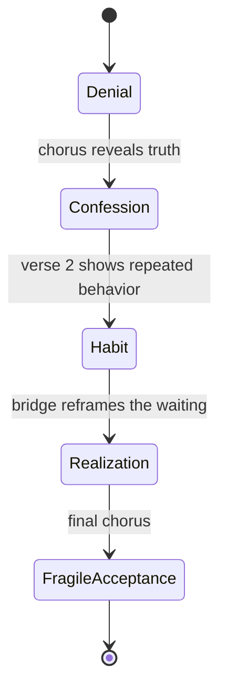

Dalam model ini:

| Elemen State Machine | Dalam Lagu |
|---|---|
| State | kondisi emosional narator |
| Transition | perubahan emosi |
| Event | detail, pengakuan, konflik, atau reveal yang memicu transisi |
| Guard | syarat agar transisi terasa earned |
| Side effect | perubahan lirik, melodi, harmoni, atau intensitas |
| Final state | aftertaste / kondisi akhir |
| Invalid transition | perubahan emosi yang terlalu mendadak atau tidak masuk akal |

---

## Kenapa Software Engineer Perlu Model Ini?

Karena kreativitas sering terasa kabur jika hanya dipahami sebagai “rasa”.

State machine membuat rasa menjadi lebih bisa dirancang.

Bukan berarti lagu menjadi mekanis. Justru sebaliknya: state machine mencegah lagu menjadi sekadar ekspresi datar.

Dalam engineering, state machine mencegah sistem masuk state invalid.

Dalam songwriting, emotional state machine mencegah lagu melakukan transisi emosi yang tidak earned.

Contoh invalid emotional transition:

```text
Verse 1: aku hancur total
Chorus: aku bahagia dan ikhlas
Verse 2: aku marah
Bridge: aku tiba-tiba tercerahkan
Final: aku baik-baik saja
```

Bisa saja terjadi jika gaya lagunya fragmentary/surreal, tapi untuk MVS pertama biasanya terasa tidak coherent.

---

## Emotional State Machine dalam Pipeline Songwriting

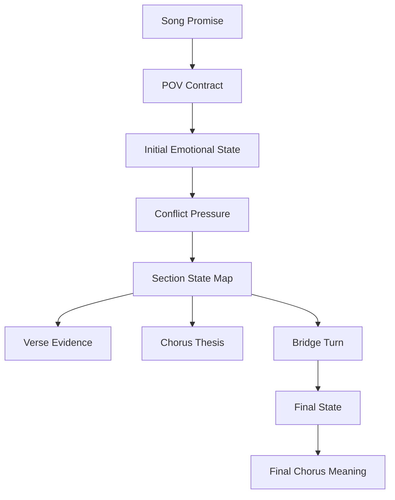

Song promise memberi pusat.

POV menentukan siapa yang mengalami state.

Emotional state machine menentukan bagaimana pengalaman itu bergerak.

---

# Bagian 1 — Komponen Emotional State Machine

## 1. Initial State

Initial state adalah kondisi emosi saat lagu dimulai.

Contoh:

- denial;
- longing;
- numbness;
- anger;
- shame;
- curiosity;
- suspicion;
- hope;
- exhaustion;
- irony;
- self-deception;
- waiting;
- restraint.

Initial state tidak harus ekstrem. Bahkan sering lebih kuat jika dimulai tertahan.

Buruk:

```text
Aku hancur sehancur-hancurnya
```

Kadang terlalu cepat peak.

Lebih baik:

```text
Gelasmu di rak kedua
tak kupakai, tak kubuang
```

Initial state:

```text
denial / restrained waiting
```

## 2. Trigger

Trigger adalah detail/event yang mendorong transisi.

Contoh:

- melihat gelas;
- mendengar pengumuman bandara;
- membaca pesan lama;
- melihat kursi kosong;
- nama hampir terucap;
- pintu tidak jadi dibuka;
- koper lewat;
- lampu tetap menyala;
- anak bertanya;
- doa menyebut nama yang salah.

Trigger membuat perubahan emosi tidak datang dari udara kosong.

## 3. Transition

Transition adalah perpindahan state.

Contoh:

```text
denial -> confession
```

Atau:

```text
irony -> accusation
```

Transition harus punya alasan.

## 4. State Tengah

State tengah sering menunjukkan konflik makin jelas.

Contoh:

- dari rindu menjadi marah;
- dari denial menjadi ritual;
- dari satire menjadi disgust;
- dari hope menjadi fear.

## 5. Turn

Turn adalah perubahan perspektif.

Biasanya muncul di bridge, tapi tidak harus.

Contoh:

```text
Aku sadar yang kutunggu bukan kamu,
tapi diriku yang dulu.
```

Turn membuat final chorus punya makna baru.

## 6. Final State

Final state adalah aftertaste.

Contoh:

- acceptance;
- unresolved longing;
- bitter clarity;
- surrender;
- refusal;
- quiet rage;
- fragile hope;
- open wound;
- self-recognition;
- moral accusation.

Final state tidak harus bahagia. Yang penting terasa earned.

---

# Bagian 2 — State vs Label Emosi

State bukan hanya label emosi. State harus mengandung posisi dramatik.

Label:

```text
sedih
```

State:

```text
sedih tapi belum mau mengaku ditinggalkan
```

Label:

```text
marah
```

State:

```text
marah tapi masih memakai bahasa sayang
```

Label:

```text
rindu
```

State:

```text
rindu yang berubah menjadi ritual domestik
```

Label:

```text
takut
```

State:

```text
takut berhenti karena merasa semua orang akan runtuh jika ia berhenti
```

State yang baik biasanya punya:

```text
emotion + stance + tension
```

Contoh:

```text
Emotion: rindu
Stance: menyangkal
Tension: tindakan membocorkan kebenaran
```

Hasil:

```text
state = rindu yang disangkal tetapi terlihat dari benda-benda rumah
```

---

## State Template

```markdown
# Emotional State

## Name
...

## Emotion
...

## Stance
Apa sikap narator terhadap emosi ini?
...

## Tension
Apa yang bertentangan?
...

## Evidence
Bagaimana state ini terlihat secara konkret?
...

## Language Style
Bagaimana state ini berbicara?
...

## Musical Behavior
Bagaimana state ini terdengar?
...
```

Contoh:

```markdown
## Name
Denial Waiting

## Emotion
Rindu

## Stance
Narator tidak mau mengaku rindu.

## Tension
Ia bilang hanya belum beres-beres, tapi semua benda tetap disiapkan.

## Evidence
Gelas tidak dipindah, air panas tetap disisakan, pintu dibuka sedikit.

## Language Style
Sederhana, domestik, menghindari kata rindu/cinta.

## Musical Behavior
Verse rendah, sempit, seperti bicara pelan.
```

---

# Bagian 3 — Common Emotional State Patterns

## Pattern 1: Denial -> Confession -> Realization

Cocok untuk:

- rindu;
- grief;
- shame;
- breakup;
- self-deception;
- ballad intim.

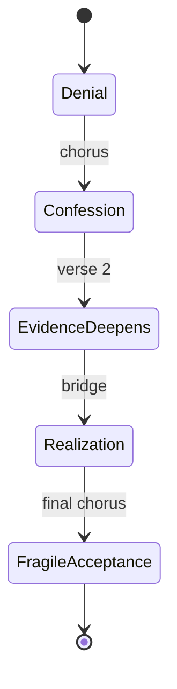

Contoh section:

| Section | State |
|---|---|
| Verse 1 | denial terlihat lewat benda |
| Chorus | confession: aku belum selesai |
| Verse 2 | denial ternyata kebiasaan |
| Bridge | realization: aku takut kosong |
| Final Chorus | acceptance sebagian |

## Pattern 2: Longing -> Anger -> Surrender

Cocok untuk:

- toxic love;
- betrayal;
- abandonment;
- dramatic ballad.

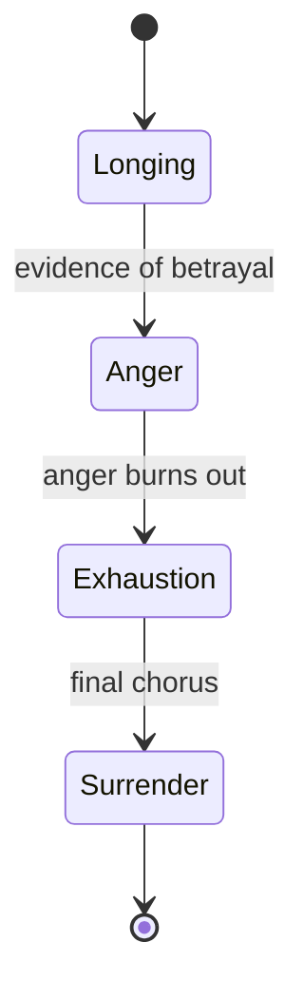

## Pattern 3: Observation -> Irony -> Accusation -> Lament

Cocok untuk:

- satire;
- social criticism;
- political metaphor;
- dark theatrical romance.

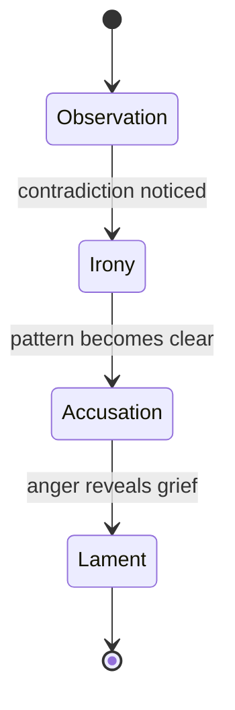

## Pattern 4: Hope -> Fear -> Vulnerability -> Release

Cocok untuk:

- love confession;
- new relationship;
- fragile optimism.

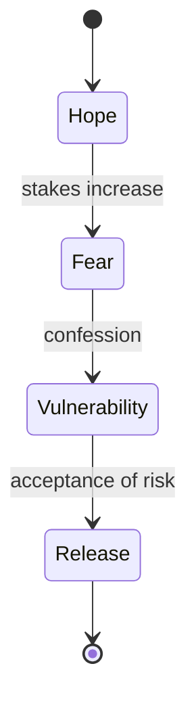

## Pattern 5: Numbness -> Crack -> Flood -> Quiet

Cocok untuk:

- grief;
- burnout;
- trauma processing;
- restrained ballad.

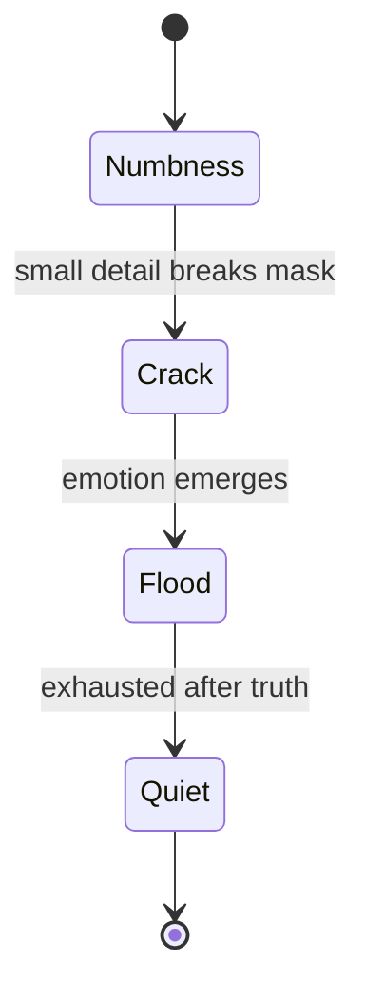

## Pattern 6: Performance -> Slip -> Exposure -> Truth

Cocok untuk:

- persona yang pura-pura kuat;
- satire;
- shame;
- identity conflict.

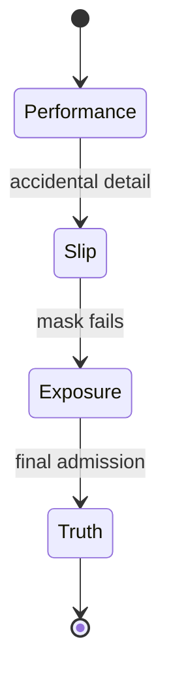

## Pattern 7: Prayer -> Doubt -> Bargain -> Silence

Cocok untuk:

- spiritual conflict;
- grief;
- existential songs.

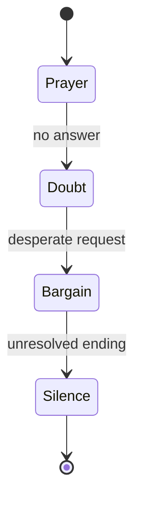

---

# Bagian 4 — Choosing the Right Emotional Pattern

Pilih pattern berdasarkan song promise.

## Song Promise: Rindu yang Disangkal

Cocok:

```text
Denial -> Confession -> Realization
```

Kurang cocok:

```text
Hope -> Party -> Victory
```

## Song Promise: Kritik Sosial sebagai Romansa Tragis

Cocok:

```text
Observation -> Irony -> Accusation -> Lament
```

Atau:

```text
Performance -> Slip -> Exposure -> Truth
```

## Song Promise: Burnout

Cocok:

```text
Numbness -> Crack -> Flood -> Quiet
```

Atau:

```text
Duty -> Exhaustion -> Collapse -> Boundary
```

## Song Promise: Cinta Baru yang Takut Diakui

Cocok:

```text
Hope -> Fear -> Vulnerability -> Release
```

## Song Promise: Kehilangan Spiritual

Cocok:

```text
Prayer -> Doubt -> Bargain -> Silence
```

Pattern bukan formula. Pattern adalah starting point.

---

## Pattern Selection Matrix

```markdown
# Emotional Pattern Selection

| Pattern | Fits Promise | Freshness | Singability | Section Potential | Risk | Total |
|---|---:|---:|---:|---:|---|---:|
| Denial -> Confession -> Realization |  |  |  |  |  |  |
| Longing -> Anger -> Surrender |  |  |  |  |  |  |
| Observation -> Irony -> Accusation -> Lament |  |  |  |  |  |  |
| Hope -> Fear -> Vulnerability -> Release |  |  |  |  |  |  |
| Numbness -> Crack -> Flood -> Quiet |  |  |  |  |  |  |
```

Pilih pattern yang:

- cocok dengan promise;
- bisa dibagi ke section;
- punya lyric evidence;
- tidak terlalu sulit untuk MVS;
- punya energy untuk ditulis.

---

# Bagian 5 — Mapping State to Song Sections

State harus dipetakan ke section.

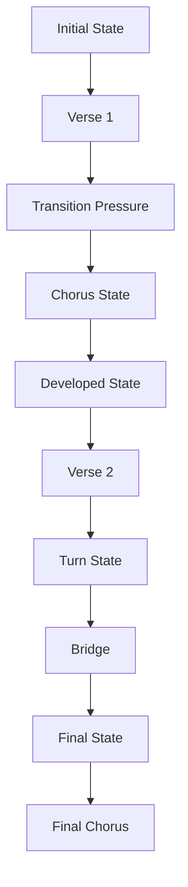

## Template

```markdown
# State to Section Map

| Section | Emotional State | Trigger / Evidence | Lyric Function | Musical Behavior |
|---|---|---|---|---|
| Verse 1 |  |  |  |  |
| Pre-Chorus |  |  |  |  |
| Chorus |  |  |  |  |
| Verse 2 |  |  |  |  |
| Bridge |  |  |  |  |
| Final Chorus |  |  |  |  |
```

## Contoh: Rindu Domestik

| Section | Emotional State | Trigger / Evidence | Lyric Function | Musical Behavior |
|---|---|---|---|---|
| Verse 1 | Denial | gelas di rak | bukti rindu tanpa menyebut rindu | rendah, sempit |
| Chorus | Confession | frasa “tak kupakai, tak kubuang” | mengakui belum selesai | lebih tinggi, repetitive |
| Verse 2 | Habit | kamar/lampu | menunjukkan denial jadi ritual | sedikit lebih intens |
| Bridge | Realization | sadar yang dijaga adalah diri | turn | lebih kosong/berbeda |
| Final Chorus | Fragile Acceptance | hook sama | hook bermakna baru | lebih terbuka atau lebih sunyi |

---

# Bagian 6 — Emotional Transitions

Transition harus terasa earned.

```text
State A -> State B
```

Butuh:

1. trigger;
2. pressure;
3. evidence;
4. lyrical/musical cue.

## Example Transition

```text
Denial -> Confession
```

Trigger:

```text
narator melihat gelas yang masih disiapkan
```

Pressure:

```text
ia tidak bisa lagi berpura-pura itu hanya malas beres-beres
```

Lyric cue:

```text
tak kupakai, tak kubuang
```

Musical cue:

```text
melodi naik sedikit di hook
```

## Transition Template

```markdown
# Emotional Transition

## From State
...

## To State
...

## Trigger
...

## Pressure
...

## What changes in lyric?
...

## What changes in melody?
...

## What changes in harmony/rhythm?
...

## Why this transition is earned
...
```

---

## Invalid Emotional Transitions

Invalid transition terjadi ketika emosi berubah tanpa sebab.

Contoh:

```text
Verse: aku sangat membencimu
Chorus: aku ingin kau kembali
```

Ini bisa valid jika ada conflict love-hate, tapi harus diberi evidence.

Tanpa evidence, pendengar bingung.

## Cara Membuatnya Valid

Tambahkan baris yang menjelaskan contradiction melalui tindakan:

```text
Kucaci namamu
sambil kusisakan kunci
di bawah pot bunga
```

Sekarang benci dan ingin kembali bisa hidup berdampingan.

---

# Bagian 7 — Emotional Escalation

Escalation bukan berarti selalu lebih keras. Escalation berarti state makin dalam atau stakes makin tinggi.

## Jenis Escalation

| Jenis | Contoh |
|---|---|
| Detail escalation | benda kecil -> ruangan -> rumah |
| Honesty escalation | denial -> partial truth -> full truth |
| Stakes escalation | kebiasaan -> identitas -> kehilangan diri |
| Conflict escalation | rindu -> marah -> takut kosong |
| Musical escalation | range naik, rhythm lebih lega |
| Silence escalation | semakin sedikit kata, semakin berat |
| Irony escalation | pujian manis -> sindiran tajam |
| Perspective escalation | aku-kamu -> aku-diri sendiri |

## Escalation Example

Verse 1:

```text
Gelasmu di rak kedua
```

Chorus:

```text
Tak kupakai, tak kubuang
```

Verse 2:

```text
Bantalmu tak lagi berbentuk kepala
tapi tetap kubalik tiap pagi
```

Bridge:

```text
Baru kusadar
yang kujaga bukan pulangmu
tapi aku
yang takut rumah ini tahu
aku sendiri
```

Escalation:

```text
benda -> kebiasaan -> self-awareness
```

---

## Escalation Ladder Template

```markdown
# Escalation Ladder

## Level 1 — Surface Detail
...

## Level 2 — Pattern
...

## Level 3 — Emotional Admission
...

## Level 4 — Deeper Truth
...

## Level 5 — Final Aftertaste
...
```

Contoh:

```markdown
Level 1: gelas masih di rak
Level 2: setiap pagi tetap menyisakan air
Level 3: aku belum selesai
Level 4: aku takut tidak punya diriku tanpa menunggu
Level 5: aku mulai melepas, tapi tidak heroik
```

---

# Bagian 8 — Emotional Compression

Lagu tidak punya ruang untuk menjelaskan semua state panjang lebar. Maka emosi harus dikompresi.

## Dari Penjelasan ke State

Penjelasan:

```text
Aku merasa sedih karena kamu pergi dan aku masih belum bisa menerima kenyataan bahwa kamu tidak akan kembali.
```

State lyric:

```text
Pintumu masih kubuka sedikit
untuk angin yang salah nama
```

State lebih kuat karena:

- ada tindakan;
- ada objek;
- ada implication;
- tidak menjelaskan semua.

## Compression Techniques

| Teknik | Contoh |
|---|---|
| Object | gelas, pintu, koper |
| Gesture | tangan berhenti, pintu dibuka sedikit |
| Contradiction | tak kupakai, tak kubuang |
| Time marker | tiap pagi, sejak Selasa |
| Address | sayang, tuan, kau |
| Omission | tidak menyebut rindu |
| Repetition | belum, masih, lagi |
| Image shift | rumah -> tubuh |

---

# Bagian 9 — Emotional State and Lyric Evidence

Setiap state harus punya evidence.

| State | Evidence Buruk | Evidence Kuat |
|---|---|---|
| Denial | aku menyangkal | gelasmu tak kupindah |
| Anger | aku marah | namamu kulepas dari doa |
| Shame | aku malu | pesanmu kubaca tanpa membuka |
| Longing | aku rindu | kursimu tetap menghadap jendela |
| Exhaustion | aku lelah | kopi dingin di samping layar menyala |
| Irony | aku menyindir | kupuji kepulanganmu di layar keberangkatan |
| Acceptance | aku ikhlas | kuncimu kupindah dari bawah pot |

Evidence membuat state bisa dirasakan.

---

## Evidence Bank Template

```markdown
# Emotional Evidence Bank

## State 1:
Evidence:
1.
2.
3.
4.
5.

## State 2:
Evidence:
1.
2.
3.
4.
5.

## State 3:
Evidence:
1.
2.
3.
4.
5.
```

Contoh:

```markdown
## State 1: Denial
1. gelas tidak dipindah
2. kursi tidak dipakai
3. air panas tetap disisakan
4. pintu dibuka sedikit
5. nama hampir disebut tapi diganti batuk

## State 2: Confession
1. “tak kupakai, tak kubuang”
2. “kau belum selesai”
3. “aku belum belajar sepi”
4. “rumah ini salah paham”
5. “pagi masih kubagi dua”

## State 3: Realization
1. benda itu bukan untukmu lagi
2. aku takut meja tahu aku sendiri
3. yang kujaga adalah alasan menunggu
4. rumah tidak memeluk, hanya mengulang
5. aku lebih takut sembuh daripada sepi
```

---

# Bagian 10 — Emotional State and Melody

State emosi tidak hanya muncul di lirik. Melodi juga membawa state.

## Melodic Behavior by State

| State | Melodic Behavior |
|---|---|
| Denial | sempit, rendah, seperti bicara |
| Confession | naik di kata penting, lebih panjang |
| Anger | rhythm lebih tajam, interval lebih tegas |
| Exhaustion | nada turun, frasa pendek, banyak rest |
| Hope | contour naik, vowel terbuka |
| Shame | melodi kecil, turun, tertahan |
| Realization | ruang/silence, nada panjang |
| Irony | phrasing seperti bicara, twist rhythm |
| Lament | descending contour, held notes |
| Release | wider range, clearer landing |

## Contoh

Hook:

```text
kau belum selesai
```

Jika state denial:

```text
dinyanyikan rendah, nyaris bicara
```

Jika state confession:

```text
nada naik di "belum"
```

Jika state final acceptance:

```text
lebih pelan, nada turun di "selesai"
```

Kata sama, state berbeda, melodi berbeda.

---

# Bagian 11 — Emotional State and Harmony

Harmony bisa mendukung state.

| State | Harmonic Direction |
|---|---|
| Denial | unresolved loop |
| Confession | partial resolution |
| Anger | stronger dominant/tension |
| Shame | minor/subdued |
| Hope | brighter color |
| Irony | sweet chord under bitter lyric |
| Realization | unexpected chord or space |
| Acceptance | clearer resolution |
| Unresolved longing | avoid full resolution |

Untuk MVS, cukup catat:

```markdown
Verse harmony:
unresolved, intimate

Chorus harmony:
slightly more open, but not fully resolved

Bridge harmony:
different color, more suspended
```

Jangan overcomplicate. Harmony harus mendukung state, bukan mencuri fokus.

---

# Bagian 12 — Emotional State and Rhythm

Rhythm sangat berpengaruh.

| State | Rhythmic Behavior |
|---|---|
| Anxiety | banyak suku kata, cepat, sedikit rest |
| Denial | speech-like, controlled |
| Anger | accented, clipped |
| Exhaustion | slow, broken phrase |
| Confession | longer phrase, held word |
| Satire | conversational, precise timing |
| Grief | uneven breath, pauses |
| Hope | more forward motion |

Contoh:

```text
tak kupakai, tak kubuang
```

Bisa dinyanyikan:

### Controlled Denial

```text
tak ku-PA-kai / tak ku-BU-ang
```

### Exhausted Admission

```text
tak... kupakai
tak... kubuang
```

### Bitter Accusation

```text
TAK kupakai / TAK kubuang
```

State menentukan rhythm.

---

# Bagian 13 — Emotional State and Section Function

Setiap section harus membawa state tertentu.

## Verse as State Evidence

Verse biasanya memperlihatkan state melalui evidence.

```text
State: denial
Verse: benda-benda yang tidak dipindah
```

## Chorus as State Admission

Chorus biasanya mengubah evidence menjadi thesis/hook.

```text
State: confession
Chorus: tak kupakai, tak kubuang
```

## Verse 2 as State Development

Verse 2 memperlihatkan state berkembang.

```text
State: habit
Verse 2: bukan hanya gelas, seluruh rumah ikut menunggu
```

## Bridge as State Turn

Bridge memberi state baru atau kesadaran baru.

```text
State: realization
Bridge: yang kutunggu bukan kamu, tapi diriku
```

## Final Chorus as State Payoff

Final chorus mengulang hook dengan state baru.

```text
State: fragile acceptance
Final chorus: tak kupakai, tak kubuang terdengar sebagai pengakuan sadar
```

---

# Bagian 14 — Final Chorus Reframing

Salah satu manfaat emotional state machine adalah membuat final chorus lebih kuat.

Chorus awal:

```text
Tak kupakai, tak kubuang
gelasmu di rak kedua
```

Makna awal:

```text
denial / belum bisa melepas
```

Setelah verse 2 dan bridge:

```text
Tak kupakai, tak kubuang
diriku di rak kedua
```

Atau chorus sama persis, tetapi konteks berubah.

Makna final:

```text
aku sadar yang kutahan bukan benda, tapi diriku sendiri
```

## Reframing Techniques

| Teknik | Cara |
|---|---|
| Same lyric, new context | chorus sama, bridge mengubah makna |
| One-word change | kau -> namamu / gelasmu -> diriku |
| Melody change | lebih rendah/lebih tinggi |
| Harmony change | resolve atau menggantung |
| Arrangement change | lebih kosong atau lebih penuh |
| Silence before chorus | memberi berat baru |
| POV shift | sayang -> tuan |

Untuk MVS, one-word change atau context shift cukup.

---

# Bagian 15 — Emotional Payoff

Payoff adalah momen ketika perjalanan emosi terasa “terbayar”.

Payoff tidak harus bahagia. Payoff bisa:

- pengakuan;
- tuduhan;
- diam;
- menerima;
- menolak;
- melihat kebenaran;
- mengulang hook dengan makna baru;
- memotong lagu tiba-tiba;
- menyisakan unresolved chord.

## Payoff Types

| Payoff | Efek |
|---|---|
| Confession | akhirnya jujur |
| Reversal | ternyata makna berbeda |
| Acceptance | melepas sebagian |
| Refusal | menolak menyerah |
| Accusation | menyebut kebenaran |
| Silence | tidak ada jawaban |
| Circular | kembali ke awal, tragis |
| Escape | keluar dari state lama |
| Collapse | mask runtuh |
| Bitter clarity | sadar tapi tidak lega |

## Payoff Example

Promise:

```text
rindu yang disangkal
```

Payoff:

```text
aku tidak lagi bilang kau akan pulang
tapi gelasmu belum sanggup kubuang
```

Ini bukan “move on” penuh. Tapi ada clarity.

---

# Bagian 16 — Emotional Arc vs Story Arc

Emotional arc dan story arc berbeda.

## Story Arc

Apa yang terjadi secara peristiwa:

```text
orang pergi -> narator menunggu -> tidak pulang -> narator sadar
```

## Emotional Arc

Apa yang berubah dalam batin:

```text
denial -> confession -> realization -> fragile acceptance
```

Lagu bisa punya story arc kecil tetapi emotional arc kuat.

Contoh story sederhana:

```text
seseorang melihat gelas di rak
```

Emotional arc:

```text
denial -> rindu -> takut kosong -> menerima belum selesai
```

Jangan merasa lagu harus punya plot besar. Lagu butuh emotional movement.

---

# Bagian 17 — State Machine untuk Lagu Satir

Song promise:

```text
kemarahan sosial dibungkus romansa tragis tentang kekasih yang terus pergi
```

Emotional state machine:

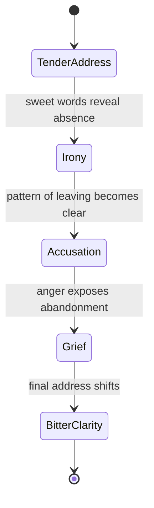

## Section Map

| Section | State | Function |
|---|---|---|
| Verse 1 | TenderAddress | memanggil kekasih yang pergi dengan koper |
| Chorus | Irony | “pulang” terdengar palsu |
| Verse 2 | Accusation | rumah/anak/meja menunjukkan krisis |
| Bridge | Grief | narator mengaku sakitnya ditinggal |
| Final Chorus | BitterClarity | “sayang” berubah menjadi “tuan” |

## Example State Evidence

Tender address:

```text
Sayang, kancingkan jasmu
bandara menunggu wangimu
```

Irony:

```text
Kau pulang sebagai pengumuman
bukan sebagai tangan
```

Accusation:

```text
Meja makan retak pelan
anak-anak belajar diam
```

Bitter clarity:

```text
Tuan, jangan panggil ini pulang
jika rumah hanya kau datangi
sebagai panggung
```

Ini menunjukkan bagaimana POV + state machine membuat kritik lebih kuat tanpa ceramah.

---

# Bagian 18 — State Machine untuk Burnout

Song promise:

```text
lelah yang tidak lagi bisa dibedakan dari hidup normal melalui layar kerja yang menyala sampai pagi
```

State machine:

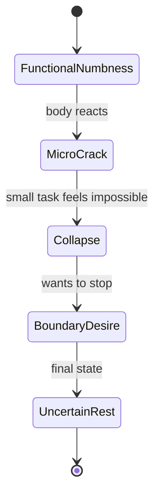

Section map:

| Section | State | Evidence |
|---|---|---|
| Verse 1 | Functional numbness | layar, kopi dingin, notifikasi |
| Chorus | Micro crack | “aku bukan mesin” |
| Verse 2 | Collapse | tubuh menolak hal kecil |
| Bridge | Boundary desire | ingin mematikan semua |
| Final Chorus | Uncertain rest | belum sembuh, tapi berhenti sebentar |

Payoff tidak harus “sembuh”. Bisa “berani berhenti sebentar”.

---

# Bagian 19 — State Machine untuk Love Confession

Song promise:

```text
cinta yang takut meminta balasan
```

State machine:

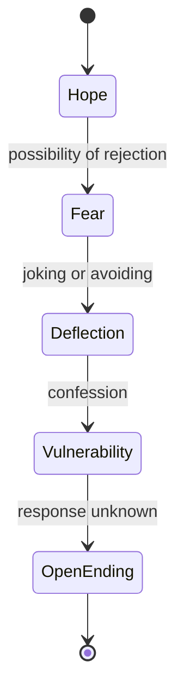

Section map:

| Section | State | Function |
|---|---|---|
| Verse 1 | Hope | noticing small signs |
| Pre-Chorus | Fear | stakes rise |
| Chorus | Deflection/Vulnerability | almost confession |
| Verse 2 | Fear deepens | signs become ambiguous |
| Bridge | Vulnerability | says truth simply |
| Final Chorus | Open ending | hook becomes risk accepted |

---

# Bagian 20 — State Machine untuk Grief

Song promise:

```text
kehilangan yang muncul lewat kursi kosong di meja makan
```

State machine:

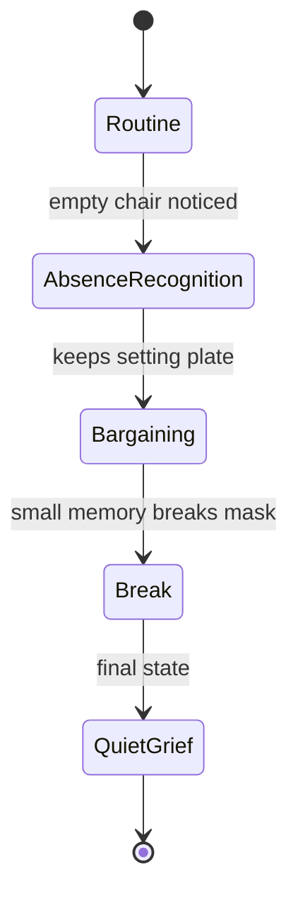

Lagu grief sering kuat jika tidak langsung dimulai dari “aku kehilanganmu”, tetapi dari rutinitas yang rusak.

---

# Bagian 21 — State Machine and Listener Journey

Pendengar juga mengalami state.

Narator state:

```text
denial -> confession -> realization
```

Listener journey:

```text
curious -> understands -> feels -> recognizes -> remembers
```

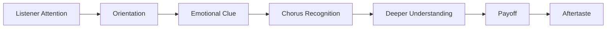

Tanya:

```text
Apa yang pendengar tahu di verse 1?
Apa yang pendengar rasakan di chorus?
Apa yang pendengar pahami setelah bridge?
Apa yang mereka bawa setelah final chorus?
```

Jika pendengar tidak punya journey, lagu terasa statis.

---

# Bagian 22 — Guard Conditions

Dalam state machine, guard condition menentukan apakah transisi boleh terjadi.

Dalam lagu, guard condition adalah syarat agar emosi baru terasa earned.

Contoh transition:

```text
denial -> confession
```

Guard:

```text
pendengar sudah melihat cukup evidence bahwa narator menyangkal
```

Jika guard belum terpenuhi, chorus confession terasa terlalu cepat.

## Examples

| Transition | Guard Condition |
|---|---|
| denial -> confession | ada bukti denial dulu |
| anger -> grief | kemarahan menunjukkan luka, bukan hanya serangan |
| satire -> lament | ironi sudah membuka konsekuensi emosional |
| hope -> fear | stakes rejection jelas |
| numbness -> collapse | tubuh/scene menunjukkan retakan |
| accusation -> acceptance | narator sudah melihat perannya sendiri |

## Guard Template

```markdown
# Transition Guard

## Transition
From:
To:

## What listener must know before transition
-

## Evidence required
-

## Section where evidence appears
-

## Risk if missing
-

## Fix
-
```

---

# Bagian 23 — Side Effects of State Transition

Ketika state berubah, sesuatu dalam lagu harus berubah.

Bisa:

- pronoun;
- line length;
- melody range;
- chord color;
- rhythm;
- repetition;
- imagery;
- register;
- density;
- title meaning.

## Example

State:

```text
Denial -> Confession
```

Side effects:

| Element | Before | After |
|---|---|---|
| Lyric | benda, tindakan | hook pengakuan |
| Melody | rendah, sempit | naik di kata penting |
| Rhythm | speech-like | lebih repetitive |
| Pronoun | objek/kamu indirect | aku/kau direct |
| Harmony | unresolved | partial release |

State transition yang tidak punya side effect sering tidak terasa.

---

# Bagian 24 — Emotional Continuity

State boleh berubah, tetapi harus ada continuity.

Continuity bisa berasal dari:

- hook yang sama;
- object yang kembali;
- motif melodi;
- metaphor system;
- POV;
- title;
- repeated phrase;
- chord color;
- location.

Contoh:

Verse 1:

```text
gelas
```

Chorus:

```text
tak kupakai, tak kubuang
```

Verse 2:

```text
bantal/kamar
```

Bridge:

```text
rak sebagai tempat diri tertahan
```

Final chorus:

```text
gelas/rak kembali
```

Continuity membuat transisi tidak terasa seperti lagu berbeda.

---

# Bagian 25 — Emotional Contrast

Movement butuh kontras.

Kontras bisa:

- denial vs confession;
- tenderness vs accusation;
- hope vs fear;
- numbness vs collapse;
- anger vs grief;
- public mask vs private truth;
- sarcasm vs vulnerability.

## Contrast Template

```markdown
# Emotional Contrast

## Surface Emotion
...

## Underlying Emotion
...

## Section where surface dominates
...

## Section where underlying leaks
...

## Section where truth appears
...
```

Contoh:

```markdown
Surface Emotion:
tenang/domestik

Underlying Emotion:
rindu dan takut kosong

Section where surface dominates:
verse 1

Section where underlying leaks:
chorus

Section where truth appears:
bridge
```

---

# Bagian 26 — Emotional State and Title Meaning

Title bisa berubah makna sepanjang lagu.

Title:

```text
Rak Kedua
```

Verse 1 meaning:

```text
tempat gelas disimpan
```

Chorus meaning:

```text
tempat menunda kehilangan
```

Bridge meaning:

```text
tempat narator menaruh dirinya sendiri
```

Final meaning:

```text
simbol belum sanggup memilih: pakai atau buang
```

Title yang berubah makna memberi kedalaman.

## Title Meaning Map

```markdown
# Title Meaning Map

Title:
...

Initial meaning:
...

Chorus meaning:
...

Bridge meaning:
...

Final meaning:
...
```

---

# Bagian 27 — Emotional State and Hook Meaning

Hook juga bisa berubah.

Hook:

```text
tak kupakai, tak kubuang
```

Chorus 1:

```text
tindakan literal terhadap gelas
```

Chorus 2:

```text
pola terhadap semua benda
```

Final chorus:

```text
cara narator memperlakukan dirinya sendiri
```

Same hook, deeper meaning.

## Hook Reframing Map

```markdown
# Hook Reframing Map

Hook:
...

First occurrence meaning:
...

Second occurrence meaning:
...

After bridge meaning:
...

Final aftertaste:
...
```

---

# Bagian 28 — Emotional State Machine Anti-Patterns

## Anti-Pattern 1: Flat Loop

Gejala:

```text
semua section menyatakan emosi yang sama
```

Solusi:

```text
buat state movement minimal: evidence -> admission -> realization
```

## Anti-Pattern 2: Random Jump

Gejala:

```text
emosi berubah tanpa trigger
```

Solusi:

```text
tambahkan evidence/guard transition
```

## Anti-Pattern 3: Peak Too Early

Gejala:

```text
verse 1 sudah terlalu intens sehingga chorus tidak bisa naik
```

Solusi:

```text
mulai lebih restrained
```

## Anti-Pattern 4: Bridge Without Turn

Gejala:

```text
bridge mengulang chorus dengan kata lain
```

Solusi:

```text
bridge harus mengubah state atau perspective
```

## Anti-Pattern 5: Final Chorus Copy-Paste

Gejala:

```text
chorus terakhir sama dan tidak terasa lebih bermakna
```

Solusi:

```text
reframe hook/title melalui bridge atau verse 2
```

## Anti-Pattern 6: Emotional Overload

Gejala:

```text
terlalu banyak state besar dalam satu lagu
```

Solusi:

```text
pilih 3–5 state utama
```

## Anti-Pattern 7: Confession Without Evidence

Gejala:

```text
narator mengaku emosi besar tapi pendengar belum melihat buktinya
```

Solusi:

```text
beri object/gesture sebelum confession
```

## Anti-Pattern 8: Conceptual State

Gejala:

```text
state terdengar seperti konsep, bukan pengalaman
```

Solusi:

```text
ubah state menjadi evidence konkret
```

---

# Bagian 29 — Emotional Debugging

Jika lagu terasa lemah, gunakan debugging.

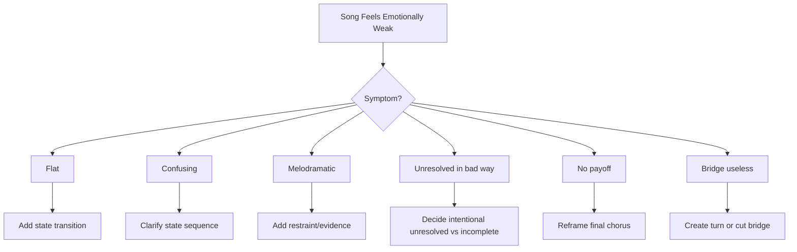

## Debug Questions

```text
Apa emotional state awal?
Apa state akhir?
Apa yang berubah?
Apa trigger perubahan?
Apakah verse 2 menambah state baru?
Apakah chorus pertama dan final chorus punya makna berbeda?
Apakah bridge memberi turn?
Apakah ada emotional peak?
Apakah peak muncul terlalu awal?
Apakah pendengar punya alasan untuk peduli?
```

---

# Bagian 30 — Emotional State Machine Template

Gunakan template ini untuk lagu.

```markdown
# Emotional State Machine

## Song Title
...

## Song Promise
...

## POV
...

## Core Conflict
...

## Emotional Pattern Chosen
...

## State List

### State 1
Name:
Emotion:
Stance:
Tension:
Evidence:
Language:
Musical behavior:

### State 2
Name:
Emotion:
Stance:
Tension:
Evidence:
Language:
Musical behavior:

### State 3
Name:
Emotion:
Stance:
Tension:
Evidence:
Language:
Musical behavior:

### State 4
Name:
Emotion:
Stance:
Tension:
Evidence:
Language:
Musical behavior:

## State Diagram

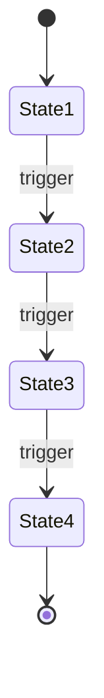

## Section Mapping

| Section | State | Trigger/Evidence | Function | Musical Behavior |
|---|---|---|---|---|
| Verse 1 |  |  |  |  |
| Chorus |  |  |  |  |
| Verse 2 |  |  |  |  |
| Bridge |  |  |  |  |
| Final Chorus |  |  |  |  |

## Transition Guards

| Transition | Guard / Required Evidence | Risk if Missing |
|---|---|---|
| State 1 -> State 2 |  |  |
| State 2 -> State 3 |  |  |
| State 3 -> State 4 |  |  |

## Escalation Ladder

Level 1:
Level 2:
Level 3:
Level 4:
Level 5:

## Hook Reframing
Hook:
First meaning:
Second meaning:
Final meaning:

## Final Payoff
...

## Main Risk
...

## Mitigation
...

## Next Action
...
```

---

# Bagian 31 — Contoh Lengkap: Rindu Domestik

## Song Promise

```text
Lagu ini membuat pendengar merasakan rindu yang disangkal
melalui benda-benda rumah yang tetap disiapkan
dari POV orang yang ditinggalkan
dengan konflik antara ingin melepas dan masih menunggu.
```

## Emotional Pattern

```text
Denial -> Confession -> Habit -> Realization -> Fragile Acceptance
```

## State Diagram

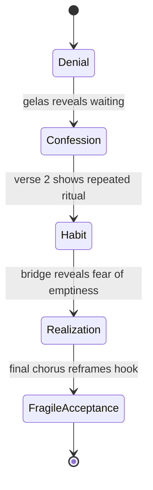

## Section Mapping

| Section | State | Evidence | Function |
|---|---|---|---|
| Verse 1 | Denial | gelas di rak kedua | menunjukkan rindu tanpa kata rindu |
| Chorus | Confession | tak kupakai, tak kubuang | hook sebagai pengakuan |
| Verse 2 | Habit | bantal/lampu/kursi | rindu menjadi rutinitas |
| Bridge | Realization | bukan kamu yang kujaga | turn ke self-awareness |
| Final Chorus | Fragile Acceptance | hook sama/berubah sedikit | pengakuan lebih sadar |

## Escalation Ladder

```markdown
Level 1:
Gelas masih ada.

Level 2:
Setiap pagi air tetap disisakan.

Level 3:
Narator mengaku belum selesai.

Level 4:
Narator sadar benda itu menjaga dirinya dari kosong.

Level 5:
Narator mulai tahu ia harus memilih, tapi belum sanggup.
```

## Hook Reframing

```markdown
Hook:
tak kupakai, tak kubuang

First meaning:
gelas belum dipakai/dibuang.

Second meaning:
hubungan belum dipakai untuk hidup baru, belum dibuang sebagai masa lalu.

Final meaning:
narator memperlakukan dirinya sendiri seperti benda yang ditunda.
```

---

# Bagian 32 — Contoh Lengkap: Romansa Satir

## Song Promise

```text
Lagu ini membuat pendengar merasakan kemarahan yang disembunyikan sebagai romansa tragis
melalui kekasih berkopor yang terus pergi meninggalkan rumah retak
dari POV rumah/kekasih yang ditinggal
dengan konflik antara masih memanggil pulang dan sadar kepulangannya hanya pertunjukan.
```

## Emotional Pattern

```text
Tender Address -> Irony -> Accusation -> Grief -> Bitter Clarity
```

## State Diagram

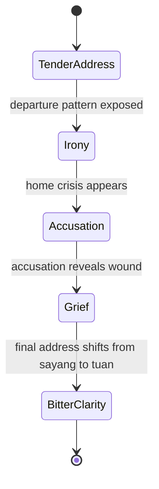

## Section Mapping

| Section | State | Evidence | Function |
|---|---|---|---|
| Verse 1 | TenderAddress | koper, bandara, salam manis | membungkus kritik sebagai romansa |
| Chorus | Irony | pulang sebagai pengumuman | hook ironis |
| Verse 2 | Accusation | rumah retak, meja kosong | dampak domestik |
| Bridge | Grief | rumah mengaku lelah menunggu | luka di balik sindiran |
| Final Chorus | BitterClarity | sayang -> tuan | romansa berubah dakwaan |

## Hook Reframing

Hook:

```text
jangan panggil ini pulang
```

First meaning:

```text
kekasih tidak benar-benar hadir
```

Final meaning:

```text
figur kuasa hanya memakai kepulangan sebagai panggung
```

---

# Bagian 33 — Latihan Utama Part 009

Buat file:

```text
songwriting-practice-009-emotional-state-machine.md
```

Isi template berikut.

```markdown
# songwriting-practice-009-emotional-state-machine.md

## 1. Song Promise
...

## 2. POV Summary
Narrator:
Addressee:
Honesty level:
Mask:
Truth:

## 3. Core Conflict
Narator ingin:
Tetapi:
Karena:

## 4. Emotional Pattern Options
Buat minimal 3 kemungkinan pattern.

| Pattern | Why it fits | Risk |
|---|---|---|
| 1. |  |  |
| 2. |  |  |
| 3. |  |  |

## 5. Chosen Emotional Pattern
...

Kenapa:
...

## 6. State List

### State 1
Name:
Emotion:
Stance:
Tension:
Evidence:
Language:
Musical behavior:

### State 2
Name:
Emotion:
Stance:
Tension:
Evidence:
Language:
Musical behavior:

### State 3
Name:
Emotion:
Stance:
Tension:
Evidence:
Language:
Musical behavior:

### State 4
Name:
Emotion:
Stance:
Tension:
Evidence:
Language:
Musical behavior:

## 7. State Diagram


## 8. Section Mapping

| Section | State | Trigger/Evidence | Function | Musical Behavior |
|---|---|---|---|---|
| Verse 1 |  |  |  |  |
| Chorus |  |  |  |  |
| Verse 2 |  |  |  |  |
| Bridge optional |  |  |  |  |
| Final Chorus |  |  |  |  |

## 9. Transition Guards

| Transition | Required Evidence | Risk if Missing | Fix |
|---|---|---|---|
| State 1 -> State 2 |  |  |  |
| State 2 -> State 3 |  |  |  |
| State 3 -> State 4 |  |  |  |

## 10. Escalation Ladder
Level 1:
Level 2:
Level 3:
Level 4:
Level 5:

## 11. Evidence Bank

### State 1 Evidence
1.
2.
3.
4.
5.

### State 2 Evidence
1.
2.
3.
4.
5.

### State 3 Evidence
1.
2.
3.
4.
5.

### State 4 Evidence
1.
2.
3.
4.
5.

## 12. Hook Reframing
Hook:
First meaning:
Second meaning:
Final meaning:

## 13. Final Payoff
...

## 14. Main Risk
...

## 15. Mitigation
...

## 16. Next Action
...
```

---

# Latihan 30 Menit: State Pattern dari Song Promise

Pilih song promise utama.

Tulis 5 kemungkinan emotional pattern.

Contoh:

```markdown
1. Denial -> Confession -> Realization
2. Longing -> Anger -> Exhaustion
3. Numbness -> Crack -> Quiet Grief
4. Tenderness -> Irony -> Accusation
5. Hope -> Fear -> Open Ending
```

Pilih satu dan tulis kenapa.

---

# Latihan 45 Menit: Evidence Bank

Untuk state pattern terpilih, tulis 5 evidence per state.

Aturan:

- jangan pakai label emosi langsung;
- gunakan benda, tindakan, gesture, dialog, tempat, suara;
- satu evidence maksimal 1–2 baris.

Contoh:

```markdown
State: Denial
1. Gelasmu di rak kedua.
2. Air panas tetap kusisakan.
3. Kursimu tak pernah kupakai.
4. Pintu kubuka sedikit setiap hujan reda.
5. Namamu kuganti batuk sebelum sempat keluar.
```

---

# Latihan 60 Menit: State to Chorus

Pilih transition paling penting.

Biasanya:

```text
State 1 -> State 2
```

Tulis chorus yang mewakili transisi itu.

Template:

```markdown
## Transition
From:
To:

## Trigger
...

## Hook Phrase
...

## Chorus Draft A
...

## Chorus Draft B
...

## Chorus Draft C
...

## Best Chorus
...

## Why
...

## Melody Behavior
...
```

---

# Checklist Part 009

Sebelum lanjut ke part 010, pastikan:

- [ ] Kamu bisa membedakan mood dan emotional movement.
- [ ] Kamu punya 3 opsi emotional pattern.
- [ ] Kamu memilih 1 emotional pattern utama.
- [ ] Kamu punya minimal 4 state.
- [ ] Setiap state punya emotion, stance, tension, evidence.
- [ ] Kamu punya state diagram Mermaid.
- [ ] Kamu punya section mapping.
- [ ] Kamu punya transition guards.
- [ ] Kamu punya escalation ladder.
- [ ] Kamu punya evidence bank.
- [ ] Kamu tahu bagaimana hook berubah makna.
- [ ] Kamu punya final payoff.
- [ ] Kamu tahu main risk emotional arc.
- [ ] Kamu punya next action menuju conflict engine.

---

# Output Wajib Part 009

Buat file:

```text
songwriting-practice-009-emotional-state-machine.md
```

Isi minimal:

```markdown
# songwriting-practice-009-emotional-state-machine.md

## Song Promise
...

## POV Summary
...

## Core Conflict
...

## Emotional Pattern Options
...

## Chosen Emotional Pattern
...

## State List
...

## State Diagram
...

## Section Mapping
...

## Transition Guards
...

## Escalation Ladder
...

## Evidence Bank
...

## Hook Reframing
...

## Final Payoff
...

## Next Action
...
```

---

# Common Failure Modes di Part Ini

## 1. Lagu Hanya Punya Mood

Gejala:

```text
semua section hanya "sedih"
```

Solusi:

```text
ubah mood menjadi state sequence: denial -> confession -> realization
```

## 2. State Terlalu Abstrak

Gejala:

```text
state ditulis "kesedihan eksistensial"
```

Solusi:

```text
tambahkan stance, tension, evidence konkret
```

## 3. Terlalu Banyak State

Gejala:

```text
lagu 3 menit punya 12 perubahan emosi
```

Solusi:

```text
batasi 3–5 state utama
```

## 4. Transition Tidak Earned

Gejala:

```text
narator tiba-tiba ikhlas tanpa proses
```

Solusi:

```text
tambahkan guard/evidence sebelum transisi
```

## 5. Peak Terlalu Awal

Gejala:

```text
verse pertama sudah paling intens
```

Solusi:

```text
mulai dengan restraint/evidence kecil
```

## 6. Bridge Tidak Mengubah State

Gejala:

```text
bridge hanya mengulang chorus
```

Solusi:

```text
bridge harus memberi realization/reversal/perspective shift
```

## 7. Final Chorus Tidak Reframed

Gejala:

```text
final chorus terasa copy-paste
```

Solusi:

```text
ubah konteks, satu kata, melody, harmony, atau POV shift
```

## 8. Emotional Arc Tidak Sesuai POV

Gejala:

```text
persona denial tiba-tiba terlalu jujur di verse 1
```

Solusi:

```text
align state dengan POV contract
```

---

# Prinsip Penting

```text
Emotion becomes song when it moves through time.
```

Dan:

```text
A strong chorus is not only repeated.
It returns with more meaning.
```

State machine membantu kamu membuat lagu yang tidak hanya punya rasa, tetapi punya perjalanan.

---

# Bridge ke Part Berikutnya

Part ini membahas emotional state machine.

Part berikutnya, `learn-songwriting-part-010.md`, akan membahas:

```text
Conflict Engine
```

Kita akan memperdalam mesin konflik yang membuat state bergerak:

- desire vs obstacle;
- internal conflict;
- interpersonal conflict;
- social conflict;
- moral conflict;
- contradiction as hook;
- tension without melodrama;
- conflict escalation;
- conflict as section driver.

Jika emotional state machine adalah peta perjalanan, conflict engine adalah mesin yang mendorong perjalanan itu.

---

# Status Seri

Part ini selesai.

```text
Selesai: learn-songwriting-part-009.md
Berikutnya: learn-songwriting-part-010.md
Status seri: belum selesai
Part tersisa: 25
Target akhir seri: learn-songwriting-part-034.md
```


<!-- NAVIGATION_FOOTER -->
<div class="page-nav">
<a href="./learn-songwriting-part-008.md">⬅️ Persona, POV, dan Addressing: Menentukan Siapa yang Bicara, kepada Siapa, dan dari Jarak Emosi Apa</a>
<a href="./index.md">📚 Kategori</a>
<a href="../../index.md">🏠 Home</a>
<a href="./learn-songwriting-part-010.md">Conflict Engine: Mesin Tegangan yang Membuat Lagu Bergerak, Menarik, dan Punya Alasan untuk Didengar ➡️</a>
</div>
