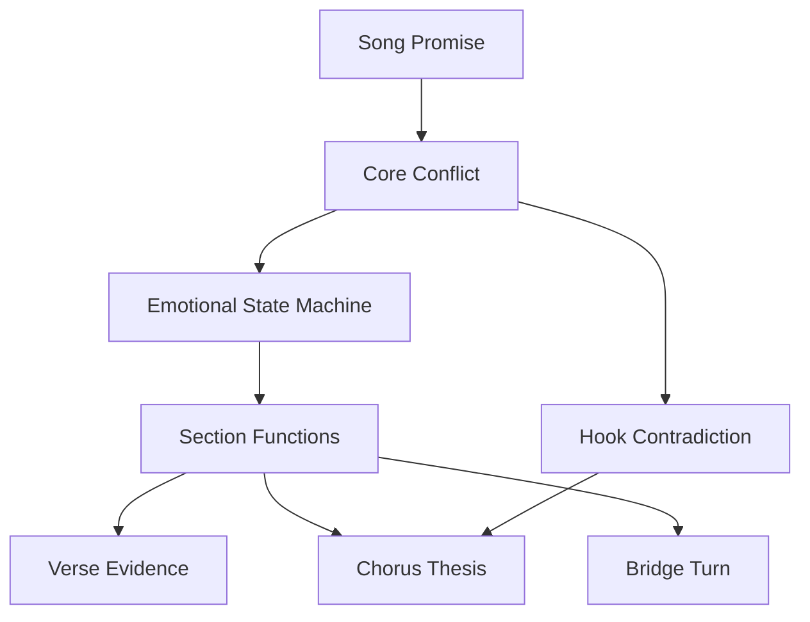
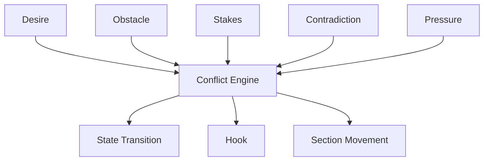
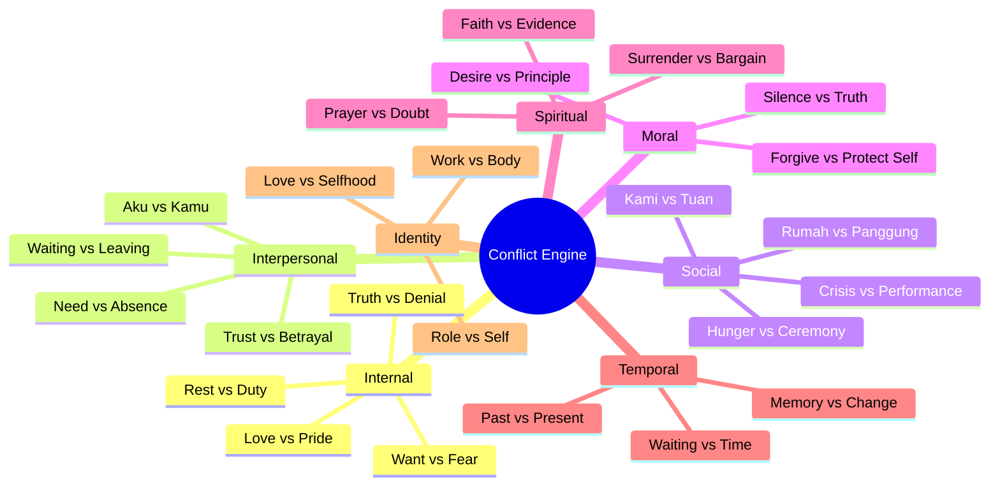
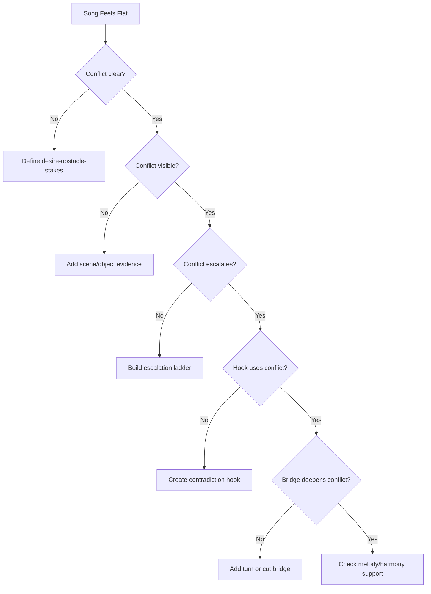

# learn-songwriting-part-010.md

# Conflict Engine: Mesin Tegangan yang Membuat Lagu Bergerak, Menarik, dan Punya Alasan untuk Didengar

> Seri: `learn-songwriting`  
> Part: `010 / 034`  
> Fokus: membangun konflik lagu sebagai mesin gerak emosi, narasi, hook, dan section  
> Status seri: belum selesai  
> Prasyarat: `learn-songwriting-part-000.md` sampai `learn-songwriting-part-009.md`

---

## Ringkasan Part Ini

Part sebelumnya membahas **Emotional State Machine**: bagaimana lagu bergerak dari satu state emosi ke state berikutnya.

Part ini membahas mesin yang membuat state itu bergerak:

> **Conflict Engine**.

Konflik dalam songwriting bukan berarti harus ada pertengkaran besar, kekerasan, drama sinetron, atau plot rumit. Konflik berarti ada **tegangan**:

```text
ingin X, tetapi Y
percaya X, tetapi bukti berkata Y
mengatakan X, tetapi tindakan menunjukkan Y
mencintai X, tetapi harus melepaskan Y
ingin pulang, tetapi rumah sudah berubah
ingin marah, tetapi masih rindu
ingin menyindir, tetapi sebenarnya terluka
```

Tanpa konflik, lagu hanya menjadi mood.

Dengan konflik, lagu punya alasan untuk bergerak.

Konflik membuat pendengar bertanya:

```text
Apa yang akan dipilih narator?
Apakah ia akan mengaku?
Apakah ia akan pulang?
Apakah ia akan memaafkan?
Apakah ia akan tetap menunggu?
Apakah sindiran itu akan pecah menjadi kemarahan?
Apakah kemarahan itu sebenarnya duka?
```

Sebagai software engineer, pikirkan conflict engine seperti **state transition driver**.

Emotional state machine menjawab:

```text
State A berubah ke State B.
```

Conflict engine menjawab:

```text
Kenapa perubahan itu terjadi?
Apa pressure yang memaksanya?
Apa contradiction yang tidak bisa dipertahankan lagi?
```

---

## Tujuan Part

Setelah menyelesaikan part ini, kamu harus bisa:

1. Memahami konflik sebagai tegangan, bukan hanya pertengkaran.
2. Membedakan konflik internal, interpersonal, sosial, moral, spiritual, temporal, dan identitas.
3. Menulis conflict statement yang spesifik.
4. Menghubungkan konflik dengan song promise.
5. Menghubungkan konflik dengan emotional state machine.
6. Membuat desire-obstacle-stakes model untuk lagu.
7. Membuat contradiction yang bisa menjadi hook.
8. Menentukan conflict escalation dari verse ke chorus ke bridge.
9. Menghindari konflik yang terlalu lemah, terlalu frontal, terlalu melodramatic, atau terlalu banyak.
10. Menggunakan konflik untuk menulis verse evidence, chorus thesis, dan bridge turn.
11. Mendiagnosis lagu yang datar karena konflik tidak cukup kuat.
12. Membuat `Conflict Engine Map` untuk lagu pertamamu.

---

## Prinsip Utama

```text
A song becomes interesting when something cannot remain the same.
```

Konflik menciptakan kondisi tidak stabil.

Narator tidak bisa terus:

- menunggu tanpa mengaku;
- mencintai tanpa terluka;
- marah tanpa menyadari duka;
- menyindir tanpa membuka kebenaran;
- bekerja tanpa tubuh runtuh;
- percaya tanpa bukti;
- pulang tanpa mengakui rumah berubah;
- memanggil “sayang” tanpa akhirnya terdengar seperti dakwaan.

Lagu hidup karena ada ketidakstabilan yang meminta resolusi, bahkan jika resolusinya tidak penuh.

---

## Konflik Bukan Selalu “Masalah Besar”

Konflik bisa sangat kecil secara peristiwa, tetapi besar secara emosi.

Contoh peristiwa kecil:

```text
seseorang tidak memindahkan gelas
```

Konflik emosional:

```text
ingin terlihat sudah melepas,
tetapi tidak sanggup mengubah posisi benda kecil,
karena benda itu adalah bukti terakhir bahwa menunggu masih punya bentuk.
```

Contoh peristiwa kecil:

```text
seseorang hampir menghapus nomor
```

Konflik emosional:

```text
ingin berhenti berharap,
tetapi takut jika nomor itu hilang maka kemungkinan pulang juga hilang.
```

Contoh peristiwa kecil:

```text
koper disiapkan lagi
```

Konflik sosial-satir:

```text
ingin memanggilnya pulang sebagai kekasih,
tetapi sadar setiap kepulangan hanya panggung,
karena rumah tetap retak setelah ia pergi.
```

Songwriting sering lebih kuat ketika konflik besar ditunjukkan melalui tindakan kecil.

---

## Hubungan Konflik dengan Song Promise dan State Machine



Song promise memberi pusat.

Conflict engine memberi tegangan.

Emotional state machine memberi urutan perubahan.

Section function memberi distribusi.

Lirik dan melodi memberi bentuk pengalaman.

---

## Konflik sebagai Function

Dalam bentuk paling sederhana:

```text
conflict = desire + obstacle + stakes
```

Atau:

```text
conflict = want + but + because
```

Template:

```text
Narator ingin ______,
tetapi ______,
karena ______.
```

Contoh:

```text
Narator ingin membuang gelas itu,
tetapi selalu menundanya,
karena membuang gelas berarti mengakui orang itu tidak akan pulang.
```

Contoh lain:

```text
Narator ingin memaki kekasih yang terus pergi,
tetapi masih memanggilnya sayang,
karena rumah yang ditinggal belum punya bahasa selain cinta.
```

Contoh burnout:

```text
Narator ingin berhenti,
tetapi takut semuanya runtuh jika ia berhenti,
karena selama ini ia menjadikan dirinya satu-satunya penyangga.
```

---

# Bagian 1 — Komponen Conflict Engine

Conflict engine punya beberapa komponen.



## 1. Desire

Apa yang diinginkan narator?

Contoh:

- ingin pulang;
- ingin orang itu pulang;
- ingin berhenti menunggu;
- ingin mengaku;
- ingin melupakan;
- ingin marah;
- ingin percaya;
- ingin didengar;
- ingin terlihat kuat;
- ingin pergi;
- ingin berhenti bekerja;
- ingin menyelamatkan rumah;
- ingin memanggil sayang sekali lagi.

Desire harus jelas. Jika narator tidak menginginkan apa pun, lagu sulit bergerak.

## 2. Obstacle

Apa yang menghalangi desire?

Obstacle bisa eksternal atau internal.

Eksternal:

- orang lain pergi;
- pesan tidak dibalas;
- rumah retak;
- pekerjaan menumpuk;
- jarak;
- aturan;
- waktu;
- kematian;
- status sosial;
- kuasa.

Internal:

- gengsi;
- takut;
- malu;
- denial;
- cinta;
- trauma;
- kebiasaan;
- kebutuhan validasi;
- rasa bersalah;
- tidak tahu cara berhenti.

## 3. Stakes

Apa yang dipertaruhkan?

Tanpa stakes, konflik terasa kecil.

Stakes bisa:

- kehilangan orang;
- kehilangan diri;
- kehilangan rumah;
- kehilangan harga diri;
- kehilangan iman;
- kehilangan masa depan;
- kehilangan alasan hidup;
- kehilangan kemampuan percaya;
- kehilangan bahasa untuk memanggil pulang.

## 4. Contradiction

Apa kontradiksi pusatnya?

Contoh:

```text
tak kupakai, tak kubuang
```

Ini conflict engine dalam bentuk hook.

Kontradiksi:

- benda tidak dipakai, tapi juga tidak dibuang;
- hubungan tidak hidup, tapi juga tidak mati;
- narator tidak menunggu, tapi semua tindakannya menunggu.

## 5. Pressure

Apa yang membuat konflik tidak bisa terus ditahan?

Contoh:

- benda makin banyak;
- pertanyaan anak muncul;
- jam terus berjalan;
- tubuh mulai runtuh;
- rumah makin retak;
- chorus memaksa pengakuan;
- bridge membuka kebenaran.

Pressure mendorong transition.

---

# Bagian 2 — Jenis Konflik dalam Lagu

## 1. Internal Conflict

Konflik di dalam diri narator.

Contoh:

```text
ingin melepas, tetapi masih menunggu
```

Cocok untuk:

- ballad;
- confession;
- grief;
- shame;
- burnout;
- spiritual songs.

Template:

```text
Aku ingin ______,
tetapi bagian lain dari diriku ______.
```

Contoh:

```text
Aku ingin membenci,
tetapi tubuhku masih hafal caramu pulang.
```

## 2. Interpersonal Conflict

Konflik antara narator dan orang lain.

Contoh:

```text
aku menunggu, kamu pergi
```

Cocok untuk:

- love song;
- breakup;
- accusation;
- duet;
- dramatic ballad.

Template:

```text
Aku ______,
sementara kamu ______.
```

Contoh:

```text
Aku menahan pintu,
sementara kau mengajari koper cara pulang.
```

## 3. Social Conflict

Konflik antara individu/kelompok dengan sistem sosial.

Contoh:

```text
rumah krisis, tuan pergi
```

Cocok untuk:

- satire;
- protest song;
- dark romance metaphor;
- collective voice.

Template:

```text
Kami ______,
sementara mereka ______.
```

Contoh:

```text
Kami menambal meja makan,
sementara tuan memilih langit yang lain.
```

## 4. Moral Conflict

Konflik antara keinginan dan nilai.

Contoh:

```text
aku ingin memaafkan, tapi tahu maaf akan dipakai untuk melukai lagi
```

Cocok untuk:

- mature ballad;
- betrayal;
- spiritual conflict;
- political satire.

Template:

```text
Aku tahu seharusnya ______,
tetapi ______.
```

## 5. Spiritual Conflict

Konflik antara iman, doa, keraguan, dan kenyataan.

Contoh:

```text
aku berdoa untuk ikhlas, tetapi namanya selalu masuk amin
```

Cocok untuk:

- grief;
- religious imagery;
- existential songs.

Template:

```text
Aku meminta ______ kepada Tuhan,
tetapi ______.
```

## 6. Temporal Conflict

Konflik antara masa lalu, sekarang, dan masa depan.

Contoh:

```text
masa lalu belum selesai, sekarang memaksa jalan
```

Cocok untuk:

- nostalgia;
- grief;
- self-reflection;
- coming-of-age.

Template:

```text
Dulu ______,
sekarang ______,
tetapi ______.
```

## 7. Identity Conflict

Konflik tentang siapa narator tanpa sesuatu/orang/peran tertentu.

Contoh:

```text
tanpa menunggu, aku tidak tahu siapa diriku
```

Cocok untuk:

- deep bridge;
- identity songs;
- post-breakup;
- burnout.

Template:

```text
Jika aku bukan ______,
maka aku siapa?
```

---

## Conflict Type Map



---

# Bagian 3 — Desire, Obstacle, Stakes

Konflik yang lemah biasanya karena salah satu dari tiga ini tidak jelas.

```text
desire + obstacle + stakes = conflict
```

## Desire Lemah

Gejala:

```text
Narator hanya menggambarkan suasana.
```

Contoh lemah:

```text
Malam ini sepi.
```

Lebih kuat:

```text
Aku ingin mematikan lampu,
tapi takut rumah berhenti percaya kau pulang.
```

Desire:

```text
ingin mematikan lampu / berhenti menunggu
```

Obstacle:

```text
takut mengakui tidak ada yang pulang
```

Stakes:

```text
kehilangan harapan terakhir
```

## Obstacle Lemah

Gejala:

```text
Narator ingin sesuatu dan seharusnya bisa langsung melakukannya.
```

Contoh:

```text
Aku ingin pergi, jadi aku pergi.
```

Tidak ada konflik.

Lebih kuat:

```text
Aku ingin pergi,
tapi kuncimu masih di bawah pot bunga.
```

Obstacle:

```text
benda kecil yang mengikat narator ke masa lalu
```

## Stakes Lemah

Gejala:

```text
Kalau gagal, tidak ada konsekuensi emosional.
```

Contoh:

```text
Aku ingin menghapus fotomu, tapi belum sempat.
```

Lebih kuat:

```text
Aku ingin menghapus fotomu,
tapi takut wajahku ikut hilang
dari hari-hari yang pernah kau lihat.
```

Stakes:

```text
kehilangan versi diri yang pernah dicintai
```

---

## Desire-Obstacle-Stakes Template

```markdown
# Desire-Obstacle-Stakes

## Desire
Narator ingin:
...

## Obstacle
Yang menghalangi:
...

## Stakes
Jika gagal/berhasil, yang dipertaruhkan:
...

## Conflict Statement
Narator ingin ______,
tetapi ______,
karena ______.

## Visible Evidence
Konflik ini terlihat melalui:
1.
2.
3.

## Hook Potential
Frasa konflik yang bisa jadi hook:
1.
2.
3.
```

---

# Bagian 4 — Contradiction sebagai Hook

Hook sering kuat ketika mengandung kontradiksi.

Contoh:

```text
tak kupakai, tak kubuang
```

Kontradiksi:

```text
tidak hidup, tidak mati
```

Contoh:

```text
pulanglah tanpa pulang
```

Kontradiksi:

```text
kata pulang kehilangan makna
```

Contoh:

```text
aku baik-baik saja, asal jangan tanya
```

Kontradiksi:

```text
claim baik-baik saja runtuh karena syaratnya
```

Contoh:

```text
rumah ini salah paham
```

Kontradiksi/personifikasi:

```text
rumah masih percaya ada yang akan pulang
```

Contradiction membuat hook punya tegangan semantik.

---

## Bentuk Contradiction Hook

| Bentuk | Contoh |
|---|---|
| X tapi bukan X | pulang tapi tak tinggal |
| Tidak A, tidak B | tak kupakai, tak kubuang |
| Aku bilang X, tapi Y | aku tak menunggu, pintu kubuka |
| Objek melakukan hal manusia | rumah ini salah paham |
| Kata lembut + makna tajam | sayang, jangan panggil ini pulang |
| Ritual absurd | menyeduh teh untuk kursi kosong |
| Formal + emosional | berdasarkan jadwal rinduku |
| Doa + keraguan | amin yang salah nama |

## Hook Contradiction Template

```markdown
# Hook Contradiction

## Core conflict
...

## Contradiction
...

## Hook phrase candidates
1.
2.
3.
4.
5.

## Best candidate
...

## Why it works
...
```

---

# Bagian 5 — Conflict and Section Function

Konflik harus didistribusikan ke section.

## Verse

Verse menunjukkan evidence konflik.

```text
Aku ingin melepas, tapi gelas tetap di rak.
```

## Chorus

Chorus menyatakan contradiction atau emotional thesis.

```text
Tak kupakai, tak kubuang.
```

## Verse 2

Verse 2 menunjukkan konflik makin luas atau makin dalam.

```text
Bukan hanya gelas, seluruh rumah ikut menunggu.
```

## Bridge

Bridge membuka konflik terdalam.

```text
Yang kutahan bukan kamu, tapi diriku tanpa menunggu.
```

## Final Chorus

Final chorus membuat hook conflict punya makna baru.

```text
Tak kupakai, tak kubuang
diriku di rak kedua.
```

---

## Conflict-to-Section Template

```markdown
# Conflict to Section

## Core Conflict
Narator ingin ______,
tetapi ______,
karena ______.

## Verse 1 Evidence
Konflik terlihat lewat:
...

## Chorus Thesis / Hook
Kontradiksi inti:
...

## Verse 2 Development
Konflik berkembang menjadi:
...

## Bridge Turn
Konflik terdalam ternyata:
...

## Final Chorus Meaning
Hook sekarang berarti:
...
```

---

# Bagian 6 — Conflict Escalation

Konflik harus meningkat atau menjadi lebih dalam.

Escalation bukan selalu lebih keras. Bisa lebih intim.

## Escalation Types

| Type | Example |
|---|---|
| Scope escalation | gelas -> rumah -> diri |
| Honesty escalation | menyangkal -> mengaku -> sadar |
| Stakes escalation | benda -> hubungan -> identitas |
| Moral escalation | sakit hati -> tuduhan -> pertanyaan moral |
| Social escalation | kekasih pergi -> rumah retak -> semua menanggung |
| Irony escalation | manis -> sinis -> dakwaan |
| Musical escalation | verse sempit -> chorus lebih terbuka |
| Silence escalation | makin sedikit kata, makin berat |

## Escalation Ladder

```markdown
# Conflict Escalation Ladder

## Level 1 — Surface Conflict
...

## Level 2 — Repeated Pattern
...

## Level 3 — Emotional Admission
...

## Level 4 — Deeper Stakes
...

## Level 5 — Final Conflict / Payoff
...
```

Contoh:

```markdown
Level 1:
Gelas tidak dipindah.

Level 2:
Setiap pagi narator tetap menyiapkan dua gelas.

Level 3:
Narator mengaku tidak bisa membuang.

Level 4:
Membuang benda berarti membuang kemungkinan pulang.

Level 5:
Konflik sebenarnya: narator takut tidak punya identitas tanpa menunggu.
```

---

# Bagian 7 — Conflict Pressure

Pressure adalah gaya yang menekan conflict sampai berubah state.

Tanpa pressure, narator bisa diam selamanya.

## Sumber Pressure

| Source | Contoh |
|---|---|
| Time | sudah terlalu lama menunggu |
| Body | tubuh lelah, suara pecah |
| Object | barang makin terasa mengganggu |
| Other person | anak bertanya, teman menyuruh beres |
| Repetition | ritual terasa absurd |
| Event | koper diangkat lagi, pintu diketuk |
| Memory | lagu lama diputar |
| Space | rumah terlalu kosong |
| Moral realization | sadar sedang dibohongi |
| Public exposure | topeng tidak bisa dipertahankan |

## Pressure Template

```markdown
# Conflict Pressure

## Conflict
...

## What keeps the conflict stable?
...

## What increases pressure?
1.
2.
3.

## What breaks the current state?
...

## Which section shows the break?
...
```

Contoh:

```markdown
Conflict:
Narator ingin melepas, tapi masih menunggu.

What keeps stable:
Ia menyebut semuanya "belum sempat dibereskan".

Pressure:
1. Gelas makin berdebu.
2. Teman bertanya kenapa masih ada dua cangkir.
3. Ia tetap menyeduh air untuk dua orang.

Break:
Ia sadar kebiasaan itu bukan kelupaan.

Section:
Bridge.
```

---

# Bagian 8 — Conflict without Melodrama

Konflik kuat tidak harus melodramatic.

Melodrama terjadi ketika lagu memaksakan intensitas tanpa evidence.

Melodramatic:

```text
Aku hancur, musnah, mati, tenggelam dalam luka paling dalam
```

Lebih kuat:

```text
Kursimu masih menghadap jendela
aku tak pernah duduk di sana
```

Kenapa lebih kuat?

Karena pendengar menyimpulkan luka.

## Cara Menjaga Konflik Tidak Melodramatic

1. Gunakan benda/tindakan.
2. Hindari kata emosi besar terlalu awal.
3. Biarkan kontradiksi bekerja.
4. Mulai dari restraint.
5. Naikkan intensitas bertahap.
6. Tahan confession untuk chorus/bridge.
7. Gunakan silence/rest.
8. Jangan semua baris menjadi puncak.

## Restraint Principle

```text
The more intense the emotion, the more useful restraint becomes.
```

Dalam lagu sedih, satu detail kecil bisa lebih menghancurkan daripada sepuluh kata besar.

---

# Bagian 9 — Conflict and Subtext

Subtext adalah konflik yang tidak diucapkan langsung.

Text:

```text
Gelasmu belum kupindah.
```

Subtext:

```text
Aku belum bisa melepasmu.
```

Text:

```text
Sayang, kopermu sudah kupoles.
```

Subtext:

```text
Aku tahu kau akan pergi lagi, dan aku membencinya.
```

Text:

```text
Aku baik-baik saja.
```

Subtext:

```text
Tolong jangan percaya itu.
```

Subtext membuat lagu lebih dalam.

## Subtext Template

```markdown
# Conflict Subtext

## What narrator says
...

## What narrator means
...

## What narrator does
...

## What listener understands
...

## What remains unsaid
...
```

---

# Bagian 10 — Internal Conflict

Internal conflict paling sering dipakai dalam ballad.

## Formula

```text
Aku ingin ______,
tetapi aku juga ______.
```

Contoh:

```text
Aku ingin melupakan,
tetapi aku masih menyimpan alamat pulangmu.
```

## Internal Conflict Patterns

| Pattern | Example |
|---|---|
| Love vs pride | masih cinta, gengsi mengaku |
| Anger vs longing | marah, tapi ingin dipeluk |
| Truth vs denial | tahu selesai, pura-pura belum |
| Rest vs duty | ingin berhenti, takut mengecewakan |
| Faith vs doubt | ingin percaya, bukti melawan |
| Control vs collapse | terlihat kuat, tubuh runtuh |
| Freedom vs attachment | ingin pergi, takut kosong |
| Memory vs healing | ingin sembuh, takut lupa |

## Internal Conflict in Sections

| Section | Function |
|---|---|
| Verse 1 | tunjukkan mask |
| Chorus | bocorkan truth |
| Verse 2 | mask mulai retak |
| Bridge | truth terdalam |
| Final Chorus | mask/truth bertemu |

---

# Bagian 11 — Interpersonal Conflict

Interpersonal conflict adalah aku vs kamu.

## Formula

```text
Aku ______,
kamu ______,
dan jarak itu membuat ______.
```

Contoh:

```text
Aku menunggu di rumah,
kau belajar pergi dengan nama yang lebih indah,
dan jarak itu membuat kata pulang terdengar palsu.
```

## Interpersonal Conflict Risks

| Risk | Solution |
|---|---|
| terlalu menyalahkan | beri self-awareness |
| terlalu literal | gunakan scene/object |
| “kamu” tidak jelas | perjelas addressee |
| tidak ada stakes | tunjukkan akibat |
| melodrama | gunakan restraint |

## Strong Interpersonal Conflict

Bukan hanya:

```text
Kamu jahat.
```

Lebih kuat:

```text
Kau meninggalkan kunci
seperti ingin aku percaya
pintu ini masih punya tugas.
```

Ada tindakan, ambiguitas, dan luka.

---

# Bagian 12 — Social Conflict

Social conflict butuh hati-hati agar tidak menjadi ceramah.

## Formula

```text
Kami ______,
sementara mereka ______,
dan ketimpangan itu terlihat melalui ______.
```

Contoh:

```text
Kami menambal meja makan,
sementara tuan mengajari koper berdoa di bandara,
dan ketimpangan itu terlihat dari rumah yang tetap lapar.
```

## Social Conflict sebagai Metafora Romansa

Kritik sosial bisa dibungkus sebagai hubungan.

```text
rakyat/rumah = kekasih yang ditinggal
pemimpin/kuasa = kekasih yang pergi
lawatan = perselingkuhan/pergi
krisis domestik = rumah retak/meja kosong
pidato/kepulangan = panggung
```

## Risiko Social Conflict

| Risk | Gejala | Mitigasi |
|---|---|---|
| preachy | seperti opini | gunakan scene |
| terlalu samar | pendengar tidak menangkap | gunakan vehicle konsisten |
| terlalu frontal | kehilangan metafora | pakai persona/address |
| slogan | tidak ada manusia | tambahkan benda/gestur |
| terlalu banyak isu | lagu melebar | satu promise utama |

---

# Bagian 13 — Moral Conflict

Moral conflict memberi kedalaman.

Contoh:

```text
Aku ingin memaafkanmu,
tetapi aku tahu maafku sering kau jadikan jalan pulang untuk melukai lagi.
```

Moral conflict bukan sekadar benar/salah. Ia kuat ketika kedua sisi punya alasan.

## Moral Conflict Patterns

| Pattern | Example |
|---|---|
| Forgive vs self-protection | memaafkan bisa membuka luka |
| Speak vs stay safe | berkata benar punya risiko |
| Love vs dignity | cinta mengancam harga diri |
| Loyalty vs truth | setia pada orang yang salah |
| Duty vs body | kewajiban merusak tubuh |
| Hope vs realism | berharap berarti menunda keputusan |
| Anger vs compassion | marah tapi tahu orang itu juga rapuh |

## Moral Conflict in Bridge

Bridge sering cocok untuk moral conflict karena bridge bisa menjadi turn.

Contoh:

```text
Bukan aku tak mau memaafkan
aku hanya lelah
menjadi pintu
untuk luka yang sama
```

---

# Bagian 14 — Spiritual Conflict

Spiritual conflict bukan harus religius formal. Ia bisa berupa pertanyaan makna.

Contoh:

```text
Aku berdoa agar ikhlas,
tetapi namamu selalu menyusup sebelum amin.
```

Conflict:

```text
ingin menyerahkan, tetapi hati masih menggenggam
```

## Spiritual Conflict Patterns

| Pattern | Example |
|---|---|
| Prayer vs silence | berdoa tapi tidak ada jawaban |
| Surrender vs bargaining | ingin ikhlas tapi masih menawar |
| Faith vs evidence | percaya tapi kenyataan melawan |
| Forgiveness vs wound | ingin memaafkan tapi luka aktif |
| Naming vs letting go | nama masih muncul dalam doa |

## Risk

Spiritual conflict mudah menjadi terlalu besar atau cliché.

Mitigasi:

- gunakan detail kecil;
- hindari kata besar terlalu banyak;
- pakai gesture;
- jaga personal specificity.

---

# Bagian 15 — Temporal Conflict

Temporal conflict sangat umum dalam lagu.

```text
masa lalu belum selesai
sekarang memaksa bergerak
masa depan menunggu keputusan
```

## Temporal Words

- dulu;
- pernah;
- sejak;
- masih;
- belum;
- nanti;
- kelak;
- tiap pagi;
- malam itu;
- bertahun kemudian;
- sebelum;
- setelah;
- sampai;
- lagi.

Kata **masih** dan **belum** sangat powerful karena membawa conflict.

```text
Aku masih...
Kau belum...
Rumah ini belum...
Pintu itu masih...
```

## Temporal Conflict Examples

```text
Dulu kau pulang tanpa suara
sekarang suaramu pun tak pulang
```

```text
Aku belum sembuh
tapi pagi tak pernah menunggu
```

```text
Sejak kau pergi
jam dinding belajar berbohong
```

Temporal conflict memberi movement tanpa plot besar.

---

# Bagian 16 — Identity Conflict

Identity conflict adalah konflik terdalam.

Pertanyaan:

```text
Siapa aku jika hal/orang/peran ini hilang?
```

Contoh:

```text
Jika aku bukan orang yang menunggu,
aku siapa?
```

```text
Jika aku berhenti menahan semuanya,
apakah aku masih berguna?
```

```text
Jika rumah tidak lagi menunggu tuannya,
apakah ia masih rumah?
```

Identity conflict sering cocok untuk bridge atau final chorus karena terlalu berat jika dibuka di awal.

## Identity Conflict Template

```markdown
# Identity Conflict

## Role / Attachment
Aku selama ini menjadi:
...

## Threat
Jika konflik selesai, aku takut:
...

## Deeper Question
Jika aku bukan ______, maka aku siapa?

## Possible Bridge Line
...
```

Contoh:

```markdown
Role:
orang yang menunggu

Threat:
jika berhenti menunggu, hidupku kosong

Question:
Jika aku bukan alamat pulangmu, maka aku rumah siapa?

Bridge line:
Bukan kau yang kujaga pulang
aku hanya takut
tak lagi bernama rumah
```

---

# Bagian 17 — Conflict as Question

Konflik bisa diformulasikan sebagai pertanyaan pusat.

Contoh:

```text
Apakah menunggu masih cinta jika yang ditunggu memilih pergi?
```

```text
Apakah rumah masih rumah jika tuannya hanya pulang sebagai pengumuman?
```

```text
Apakah istirahat disebut menyerah jika tubuh sudah menjadi alarm?
```

```text
Apakah memaafkan berarti membuka pintu untuk luka yang sama?
```

Pertanyaan pusat membantu bridge dan chorus.

## Central Question Template

```markdown
# Central Question

## Conflict Statement
...

## Central Question
...

## Possible Chorus Answer
...

## Possible Bridge Reversal
...

## Final Answer / Non-answer
...
```

---

# Bagian 18 — Conflict as Scene

Konflik harus bisa menjadi scene.

Conflict statement:

```text
Aku ingin melepas, tetapi masih menunggu.
```

Scene:

```text
seseorang berdiri di depan rak, memegang gelas, tidak jadi memindahkannya
```

Conflict statement:

```text
Rumah butuh kehadiran, tetapi tuan selalu pergi.
```

Scene:

```text
koper meluncur di bandara, sementara meja makan di rumah retak dan piring anak-anak belum penuh
```

Conflict statement:

```text
Ingin berhenti, tapi takut sistem runtuh.
```

Scene:

```text
laptop menyala pukul 3 pagi, notifikasi masuk, tangan gemetar di atas tombol power
```

Jika konflik tidak bisa menjadi scene, konflik mungkin terlalu abstrak.

---

## Scene Test

```markdown
# Conflict Scene Test

## Conflict
...

## Location
...

## Objects
1.
2.
3.

## Action
...

## What narrator wants
...

## What prevents it
...

## What is at stake
...

## One lyric line from this scene
...
```

---

# Bagian 19 — Conflict and Object Writing

Object writing adalah cara terbaik menunjukkan konflik.

## Conflict: ingin melepas vs masih menunggu

Objects:

- gelas;
- kursi;
- kunci;
- pintu;
- lampu;
- rak.

Lines:

```text
Kuncimu masih di bawah pot
tempat hujan belajar lupa
```

```text
Kursimu tak pernah kupakai
seolah duduk di sana
mengusirmu dua kali
```

## Conflict: rumah krisis vs tuan pergi

Objects:

- koper;
- meja makan;
- piring;
- lampu;
- tiket;
- jendela;
- kursi tunggu.

Lines:

```text
Kopermu beroda halus
meja kami pincang sebelah
```

```text
Kau kirim kartu pos
ke rumah yang sedang belajar
mengeja lapar
```

Objects membuat conflict terasa tanpa ceramah.

---

# Bagian 20 — Conflict and Chorus

Chorus sering menjadi tempat contradiction paling padat.

## Chorus Conflict Types

| Type | Example |
|---|---|
| Confession | aku belum selesai |
| Contradiction | tak kupakai, tak kubuang |
| Accusation | jangan panggil ini pulang |
| Question | pulang ke siapa? |
| Refusal | aku tak mau jadi rumahmu lagi |
| Bargain | tinggal sebentar, atau pergi benar |
| Mantra | pelan-pelan, jangan pulang |
| Irony | selamat datang di kepergianmu |

Chorus harus memperjelas conflict, bukan menambah confusion.

## Chorus Conflict Template

```markdown
# Chorus Conflict Design

## Core conflict
...

## Chorus must say
...

## Chorus must not say
...

## Hook contradiction
...

## Title placement
...

## Chorus draft
...
```

---

# Bagian 21 — Conflict and Bridge

Bridge sering membuka konflik terdalam.

Verse/chorus conflict:

```text
aku belum bisa melepasmu
```

Bridge deeper conflict:

```text
aku takut tanpa menunggu, aku tidak punya bentuk
```

Verse/chorus conflict:

```text
kau terus pergi
```

Bridge deeper conflict:

```text
aku tahu sejak lama rumah ini hanya kau pakai untuk pulang di depan orang
```

Bridge bukan hanya intensifikasi. Bridge bisa reframe.

## Bridge Conflict Turn Types

| Turn | Example |
|---|---|
| Self-reveal | masalahnya bukan kamu, tapi aku |
| Moral reveal | memaafkanmu melukai diriku |
| Social reveal | kisah cinta ini ternyata rumah yang ditinggal kuasa |
| Identity reveal | tanpa menunggu aku bukan siapa-siapa |
| Time reveal | aku sudah menunggu bahkan sebelum kau pergi |
| Accusation reveal | pulangmu hanya panggung |
| Compassion reveal | kemarahanku ada karena aku masih berharap |
| Refusal reveal | aku tidak lagi menyediakan pintu |

---

# Bagian 22 — Conflict and Final Chorus

Final chorus harus membawa conflict ke payoff.

Payoff bisa:

- conflict resolved;
- conflict accepted;
- conflict exposed;
- conflict repeated tragically;
- conflict refused;
- conflict reframed.

## Types of Final Conflict Payoff

| Payoff | Effect |
|---|---|
| Resolution | narator memilih |
| Non-resolution | konflik sengaja tetap terbuka |
| Reframing | hook berubah makna |
| Exposure | truth akhirnya terlihat |
| Repetition as tragedy | tidak berubah = tragis |
| Repetition as healing | sama, tapi lebih sadar |
| Refusal | narator menolak pola lama |
| Accusation | narator memberi nama pada luka |

Contoh hook:

```text
tak kupakai, tak kubuang
```

Final payoff options:

1. resolved:

```text
hari ini kupakai
untuk minum tanpamu
```

2. unresolved:

```text
tak kupakai, tak kubuang
masih
```

3. reframed:

```text
tak kupakai, tak kubuang
diriku di rak kedua
```

4. refusal:

```text
tak kupakai lagi
tak kusimpan lagi
```

Pilih sesuai song promise.

---

# Bagian 23 — Conflict Density

Conflict density adalah seberapa banyak tegangan dalam satu section.

Verse biasanya conflict density sedang.

Chorus tinggi tapi sederhana.

Bridge tinggi secara makna, tidak harus banyak kata.

## Conflict Density Too Low

Gejala:

```text
lirik indah tapi tidak ada tension
```

Contoh:

```text
Malam indah, angin lembut, bintang bersinar
```

Bisa bagus, tapi tanpa conflict belum menarik.

## Conflict Density Too High

Gejala:

```text
setiap baris membawa konflik besar, pendengar lelah
```

Contoh:

```text
Aku hancur, rumah runtuh, Tuhan diam, negara terbakar, cinta mati
```

Terlalu banyak.

## Balanced Density

Verse:

```text
Gelasmu di rak kedua
tak kupakai, tak kubuang
```

Chorus:

```text
Kau belum selesai
di rumah yang kupanggil sepi
```

Bridge:

```text
Baru kusadar
bukan kau yang kujaga
tapi aku
yang takut tak lagi bernama rumah
```

Conflict naik bertahap.

---

# Bagian 24 — Conflict Prioritization

Satu lagu harus punya satu primary conflict.

Boleh ada secondary conflict, tapi jangan semuanya utama.

## Example

Primary conflict:

```text
ingin melepas vs masih menunggu
```

Secondary conflicts:

```text
gengsi vs confession
masa lalu vs sekarang
benda vs keputusan
```

Jangan tambah:

```text
politik, Tuhan, burnout, keluarga, karier
```

kecuali semuanya sangat terkendali oleh promise.

## Conflict Priority Template

```markdown
# Conflict Priority

## Primary Conflict
...

## Secondary Conflict 1
...

## Secondary Conflict 2
...

## Excluded Conflicts
Yang tidak akan dimasukkan:
1.
2.
3.

## Why
...
```

Excluded conflicts penting agar lagu tidak melebar.

---

# Bagian 25 — Conflict Debugging

Jika lagu terasa datar, debug conflict.



## Debug Questions

```text
Apa yang diinginkan narator?
Apa yang menghalangi?
Apa yang dipertaruhkan?
Apa kontradiksi pusatnya?
Bagaimana konflik terlihat di verse 1?
Apa bentuk konflik di chorus?
Bagaimana konflik berkembang di verse 2?
Apa konflik terdalam di bridge?
Apakah final chorus memberi payoff?
Apakah ada terlalu banyak konflik?
Apakah konflik terlalu frontal?
Apakah konflik terlalu samar?
```

---

# Bagian 26 — Conflict Smells

| Smell | Gejala | Perbaikan |
|---|---|---|
| Generic conflict | “aku sedih karena kamu pergi” | tambahkan desire/obstacle/stakes spesifik |
| No stakes | tidak penting jika gagal | naikkan konsekuensi emosional |
| No evidence | konflik hanya dijelaskan | buat scene/object |
| Too frontal | seperti ceramah/tuduhan langsung | pakai subtext/metafora |
| Too vague | pendengar tidak menangkap tension | beri clue konkret |
| Too many conflicts | lagu melebar | pilih primary conflict |
| No escalation | verse 2 mengulang | escalation ladder |
| No contradiction | hook datar | cari paradox |
| Melodrama | kata besar tanpa evidence | restraint/object |
| Bridge conflict unrelated | bridge seperti lagu lain | reframe primary conflict |

---

# Bagian 27 — Conflict Engine Template

Gunakan template ini.

```markdown
# Conflict Engine Map

## Song Title
...

## Song Promise
...

## POV Summary
Narrator:
Addressee:
Mask:
Truth:

## Emotional State Machine Summary
Start:
Middle:
Turn:
End:

## Primary Conflict
Narator ingin ______,
tetapi ______,
karena ______.

## Desire
...

## Obstacle
...

## Stakes
...

## Contradiction
...

## Central Question
...

## Conflict Type
- [ ] Internal
- [ ] Interpersonal
- [ ] Social
- [ ] Moral
- [ ] Spiritual
- [ ] Temporal
- [ ] Identity

## Visible Evidence
1.
2.
3.
4.
5.

## Conflict Escalation Ladder
Level 1:
Level 2:
Level 3:
Level 4:
Level 5:

## Conflict to Section

| Section | Conflict Function | Evidence | Emotional State |
|---|---|---|---|
| Verse 1 |  |  |  |
| Chorus |  |  |  |
| Verse 2 |  |  |  |
| Bridge optional |  |  |  |
| Final Chorus |  |  |  |

## Hook Contradiction
Core contradiction:
Hook candidates:
1.
2.
3.
4.
5.

Selected hook:
...

## Bridge Turn
Konflik terdalam ternyata:
...

## Final Payoff
...

## Excluded Conflicts
1.
2.
3.

## Main Risk
...

## Mitigation
...

## Next Action
...
```

---

# Bagian 28 — Contoh Conflict Engine: Rindu Domestik

## Song Promise

```text
Rindu yang disangkal melalui benda-benda rumah dari POV orang yang ditinggalkan.
```

## Primary Conflict

```text
Narator ingin terlihat sudah melepas,
tetapi masih menjaga benda-benda orang yang pergi,
karena membuang benda itu berarti mengakui bahwa kemungkinan pulang sudah mati.
```

## Desire

```text
ingin terlihat pulih / ingin bisa melepas
```

## Obstacle

```text
benda-benda rumah masih menjadi ritual menunggu
```

## Stakes

```text
jika melepas benda, narator kehilangan bentuk terakhir dari hubungan
```

## Contradiction

```text
tak kupakai, tak kubuang
```

## Central Question

```text
Apakah sesuatu yang tidak dipakai tapi tidak dibuang masih bisa disebut cinta?
```

## Escalation

```markdown
Level 1: gelas tidak dipindah
Level 2: rutinitas dua orang masih dilakukan
Level 3: narator mengaku belum selesai
Level 4: yang ditakuti bukan kehilangan orang, tapi kehilangan identitas sebagai penunggu
Level 5: final chorus memperlihatkan narator juga menaruh dirinya di rak
```

## Section

| Section | Conflict Function | Evidence |
|---|---|---|
| Verse 1 | menunjukkan denial | gelas di rak kedua |
| Chorus | menyatakan contradiction | tak kupakai, tak kubuang |
| Verse 2 | memperluas conflict | kamar/lampu/kursi |
| Bridge | membuka identity conflict | bukan kau yang kujaga, tapi aku |
| Final Chorus | reframe hook | diriku di rak kedua |

---

# Bagian 29 — Contoh Conflict Engine: Romansa Satir

## Song Promise

```text
Kemarahan sosial sebagai romansa tragis melalui kekasih berkopor yang terus pergi meninggalkan rumah retak.
```

## Primary Conflict

```text
Narator ingin memanggil kekasihnya pulang,
tetapi sadar setiap kepulangan hanya pertunjukan,
karena rumah tetap retak dan kebutuhan domestik tetap ditinggalkan.
```

## Desire

```text
ingin kehadiran nyata
```

## Obstacle

```text
kekasih/figur kuasa lebih mencintai perjalanan, panggung, dan citra pulang
```

## Stakes

```text
rumah kehilangan kepercayaan pada kata pulang
```

## Contradiction

```text
pulang sebagai pengumuman, bukan kehadiran
```

## Central Question

```text
Apakah pulang masih pulang jika rumah hanya menjadi panggung?
```

## Hook Candidates

```text
jangan panggil ini pulang
kopermu lebih setia
pulanglah tanpa panggung
rumah retak menunggu tuan
kau pulang sebagai pengumuman
```

## Escalation

```markdown
Level 1: kekasih pergi dengan koper
Level 2: rumah tetap retak saat ia pergi
Level 3: kepulangan hanya berupa kabar/panggung
Level 4: bahasa sayang berubah menjadi tuduhan
Level 5: final chorus mengganti "sayang" menjadi "tuan"
```

## Section

| Section | Conflict Function | Evidence |
|---|---|---|
| Verse 1 | romansa permukaan | koper, bandara, pamitan manis |
| Chorus | ironi pulang | “jangan panggil ini pulang” |
| Verse 2 | social stakes | meja makan, rumah retak |
| Bridge | grief under anger | rumah lelah memanggil |
| Final Chorus | bitter accusation | sayang -> tuan |

---

# Bagian 30 — Latihan Utama Part 010

Buat file:

```text
songwriting-practice-010-conflict-engine.md
```

Isi template berikut.

```markdown
# songwriting-practice-010-conflict-engine.md

## 1. Song Promise
...

## 2. POV Summary
Narrator:
Addressee:
Mask:
Truth:

## 3. Emotional State Machine Summary
Start:
Middle:
Turn:
End:

## 4. Conflict Type
Pilih yang relevan:

- [ ] Internal
- [ ] Interpersonal
- [ ] Social
- [ ] Moral
- [ ] Spiritual
- [ ] Temporal
- [ ] Identity

Catatan:
...

## 5. Desire
Narator ingin:
...

## 6. Obstacle
Yang menghalangi:
...

## 7. Stakes
Yang dipertaruhkan:
...

## 8. Primary Conflict Statement
Narator ingin ______,
tetapi ______,
karena ______.

...

## 9. Core Contradiction
...

## 10. Central Question
...

## 11. Visible Evidence
Tulis minimal 10 evidence konkret.

1.
2.
3.
4.
5.
6.
7.
8.
9.
10.

## 12. Conflict Escalation Ladder
Level 1:
Level 2:
Level 3:
Level 4:
Level 5:

## 13. Conflict to Section

| Section | Conflict Function | Evidence | Emotional State |
|---|---|---|---|
| Verse 1 |  |  |  |
| Chorus |  |  |  |
| Verse 2 |  |  |  |
| Bridge optional |  |  |  |
| Final Chorus |  |  |  |

## 14. Hook Contradiction
Hook candidates:
1.
2.
3.
4.
5.
6.
7.
8.
9.
10.

Selected hook:
...

Why:
...

## 15. Bridge Turn
Konflik terdalam ternyata:
...

## 16. Final Payoff
...

## 17. Excluded Conflicts
Yang tidak akan dimasukkan:
1.
2.
3.

## 18. Main Risk
...

## 19. Mitigation
...

## 20. Next Action
...
```

---

# Latihan 30 Menit: Desire-Obstacle-Stakes

Pilih song promise utama.

Isi:

```markdown
Desire:
Obstacle:
Stakes:
Conflict statement:
Central question:
```

Lalu buat 5 versi conflict statement.

Contoh:

```markdown
1. Narator ingin membuang gelas, tetapi tangannya selalu berhenti, karena gelas itu bukti terakhir bahwa pulang pernah mungkin.
2. Narator ingin berhenti menunggu, tetapi rumah sudah terlatih membuka pintu, karena kebiasaan lebih setia dari harapan.
...
```

Pilih yang paling kuat.

---

# Latihan 45 Menit: Conflict Evidence Bank

Tulis 20 evidence konflik.

Aturan:

- tidak boleh menyebut emosi langsung di 10 baris pertama;
- gunakan benda, tindakan, suara, tempat, dialog;
- setiap line maksimal 1–2 baris.

Template:

```markdown
# Conflict Evidence Bank

## Conflict
...

## Evidence Lines
1.
2.
...
20.

## Best 5
1.
2.
3.
4.
5.
```

---

# Latihan 60 Menit: Conflict to Chorus Hook

Dari core contradiction, tulis 10 hook.

Lalu pilih 3 dan buat chorus seed.

```markdown
## Core Contradiction
...

## Hook Candidates
1.
2.
3.
4.
5.
6.
7.
8.
9.
10.

## Selected 3
1.
2.
3.

## Chorus Seed A
...

## Chorus Seed B
...

## Chorus Seed C
...

## Best Seed
...

## Why
...
```

---

# Checklist Part 010

Sebelum lanjut ke part 011, pastikan:

- [ ] Kamu bisa menjelaskan konflik sebagai tegangan, bukan hanya pertengkaran.
- [ ] Kamu punya desire, obstacle, dan stakes.
- [ ] Kamu punya primary conflict statement.
- [ ] Kamu tahu jenis konflik utama lagu.
- [ ] Kamu punya core contradiction.
- [ ] Kamu punya central question.
- [ ] Kamu punya minimal 10 visible evidence.
- [ ] Kamu punya conflict escalation ladder.
- [ ] Kamu memetakan konflik ke verse, chorus, verse 2, bridge, final chorus.
- [ ] Kamu punya minimal 10 hook candidates dari contradiction.
- [ ] Kamu memilih satu hook/arah chorus.
- [ ] Kamu punya bridge turn.
- [ ] Kamu punya final payoff.
- [ ] Kamu menulis excluded conflicts agar lagu tidak melebar.
- [ ] Kamu punya next action menuju object writing dan sensory detail.

---

# Output Wajib Part 010

Buat file:

```text
songwriting-practice-010-conflict-engine.md
```

Isi minimal:

```markdown
# songwriting-practice-010-conflict-engine.md

## Song Promise
...

## POV Summary
...

## Emotional State Machine Summary
...

## Desire
...

## Obstacle
...

## Stakes
...

## Primary Conflict Statement
...

## Core Contradiction
...

## Central Question
...

## Visible Evidence
...

## Conflict Escalation Ladder
...

## Conflict to Section
...

## Hook Contradiction
...

## Bridge Turn
...

## Final Payoff
...

## Excluded Conflicts
...

## Next Action
...
```

---

# Common Failure Modes di Part Ini

## 1. Konflik Terlalu Umum

Gejala:

```text
Aku sedih karena kamu pergi.
```

Solusi:

```text
Tambahkan desire, obstacle, stakes, dan evidence konkret.
```

## 2. Konflik Hanya Dijelaskan, Tidak Ditunjukkan

Gejala:

```text
Aku tidak bisa melepasmu.
```

Solusi:

```text
Tunjukkan melalui gelas, kunci, pintu, notifikasi, koper, meja.
```

## 3. Tidak Ada Stakes

Gejala:

```text
Kalau konflik selesai, tidak ada konsekuensi emosional.
```

Solusi:

```text
Tanya: apa yang hilang jika narator memilih?
```

## 4. Terlalu Banyak Konflik

Gejala:

```text
Lagu memuat cinta, politik, burnout, Tuhan, keluarga, trauma sekaligus.
```

Solusi:

```text
Pilih primary conflict. Sisanya masuk excluded conflicts.
```

## 5. Konflik Terlalu Frontal

Gejala:

```text
Lirik seperti ceramah atau tuduhan langsung.
```

Solusi:

```text
Pakai subtext, persona, vehicle, dan object evidence.
```

## 6. Konflik Terlalu Samar

Gejala:

```text
Pendengar tidak tahu apa tension-nya.
```

Solusi:

```text
Perjelas desire/obstacle dan beri hook contradiction.
```

## 7. Conflict Tidak Escalate

Gejala:

```text
Verse 2 hanya mengulang verse 1.
```

Solusi:

```text
Bangun escalation ladder: surface -> pattern -> admission -> deeper stakes -> payoff.
```

## 8. Bridge Tidak Membuka Konflik Terdalam

Gejala:

```text
Bridge terasa seperti verse tambahan.
```

Solusi:

```text
Gunakan identity/moral/social reveal.
```

## 9. Hook Tidak Mengandung Tegangan

Gejala:

```text
Hook terdengar indah tapi datar.
```

Solusi:

```text
Cari contradiction/paradox dari conflict.
```

## 10. Konflik Menjadi Melodrama

Gejala:

```text
Banyak kata besar tanpa evidence.
```

Solusi:

```text
Mulai dari tindakan kecil. Biarkan pendengar menyimpulkan.
```

---

# Prinsip Penting

```text
Conflict is not noise.
Conflict is the pressure that makes meaning move.
```

Dan:

```text
The best conflict in a song is often visible in a small action.
```

Konflik yang kuat tidak harus berteriak. Ia bisa muncul dari gelas yang tidak dipindahkan, koper yang terlalu sering disiapkan, notifikasi yang membuat tubuh gemetar, atau kata “sayang” yang perlahan berubah menjadi “tuan”.

---

# Bridge ke Part Berikutnya

Part ini membahas conflict engine.

Part berikutnya, `learn-songwriting-part-011.md`, akan membahas:

```text
Object Writing dan Sensory Detail
```

Kita akan masuk ke teknik membuat konflik dan emosi menjadi konkret:

- benda;
- tempat;
- suara;
- cahaya;
- tekstur;
- gestur;
- bau;
- detail kecil;
- object as emotional evidence;
- how to show, not explain;
- membangun lyric world dari sensory detail.

Jika conflict engine adalah mesin tegangan, object writing adalah cara membuat mesin itu terlihat dan terdengar.

---

# Status Seri

Part ini selesai.

```text
Selesai: learn-songwriting-part-010.md
Berikutnya: learn-songwriting-part-011.md
Status seri: belum selesai
Part tersisa: 24
Target akhir seri: learn-songwriting-part-034.md
```


<!-- NAVIGATION_FOOTER -->
<div class="page-nav">
<a href="./learn-songwriting-part-009.md">⬅️ Emotional State Machine: Memodelkan Perjalanan Emosi agar Lagu Bergerak, Bukan Hanya Berputar</a>
<a href="./index.md">📚 Kategori</a>
<a href="../../index.md">🏠 Home</a>
<a href="./learn-songwriting-part-011.md">Object Writing dan Sensory Detail: Mengubah Emosi Abstrak Menjadi Benda, Adegan, Gestur, dan Dunia Lirik yang Bisa Dirasakan ➡️</a>
</div>
