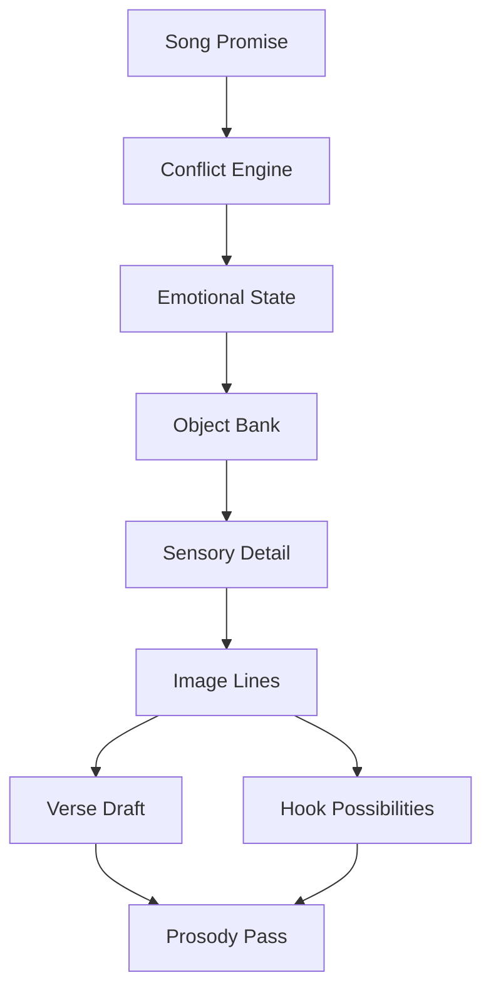
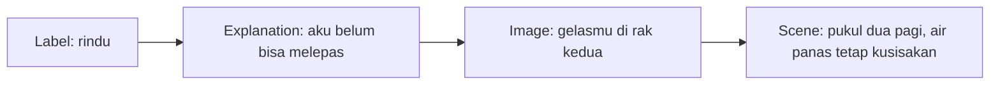
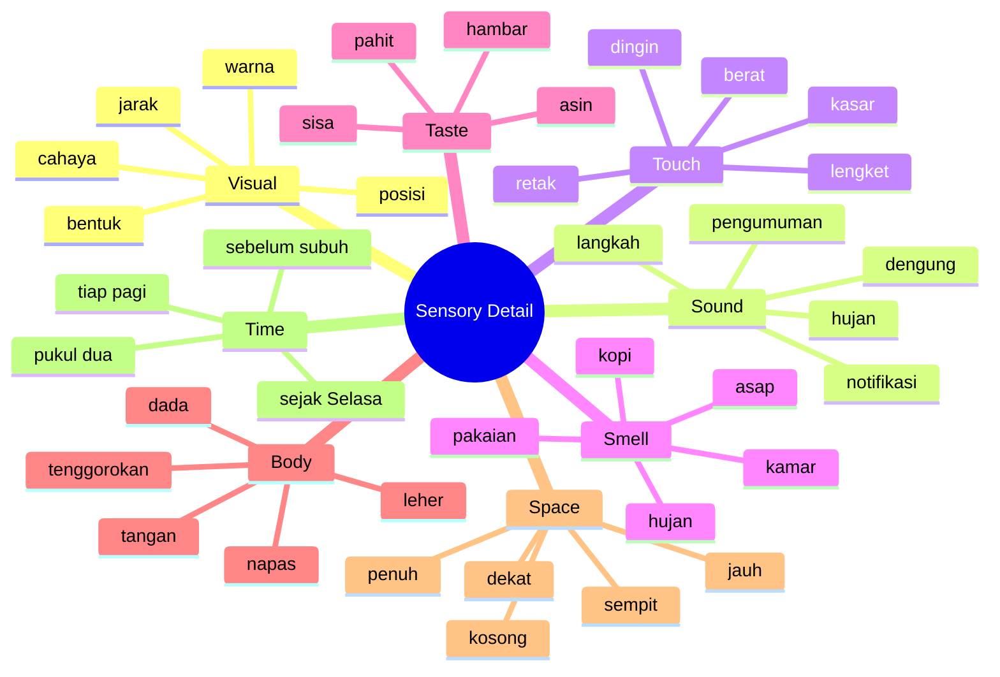
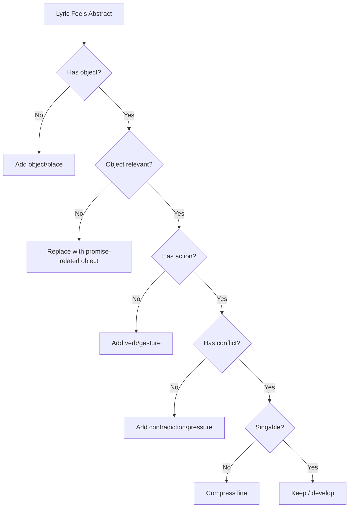
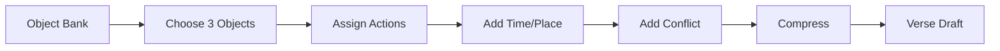

# learn-songwriting-part-011.md

# Object Writing dan Sensory Detail: Mengubah Emosi Abstrak Menjadi Benda, Adegan, Gestur, dan Dunia Lirik yang Bisa Dirasakan

> Seri: `learn-songwriting`  
> Part: `011 / 034`  
> Fokus: object writing, sensory detail, show-don't-tell, image bank, scene lyric, dan lyric worldbuilding  
> Status seri: belum selesai  
> Prasyarat: `learn-songwriting-part-000.md` sampai `learn-songwriting-part-010.md`

---

## Ringkasan Part Ini

Part sebelumnya membahas **Conflict Engine**: tegangan yang membuat lagu bergerak.

Part ini membahas bagaimana konflik dan emosi itu **terlihat**.

Masalah umum penulis lagu pemula:

```text
Aku sedih.
Aku rindu.
Aku kecewa.
Aku marah.
Aku hancur.
Aku kesepian.
```

Kalimat-kalimat itu tidak selalu salah. Tetapi jika lagu terlalu banyak memakai label emosi, pendengar tidak mengalami emosi itu. Mereka hanya diberi tahu.

Object writing mengubah:

```text
Aku rindu.
```

menjadi:

```text
Gelasmu masih di rak kedua
tak kupakai, tak kubuang.
```

Object writing mengubah:

```text
Aku kecewa pada seseorang yang selalu pergi.
```

menjadi:

```text
Kopermu beroda halus
meja kami pincang sebelah.
```

Object writing mengubah:

```text
Aku burnout.
```

menjadi:

```text
Kopi dingin di samping layar
lebih dulu menyerah daripada tubuhku.
```

Object writing bukan sekadar menambahkan benda agar lirik “lebih puitis”. Object writing adalah teknik untuk membuat emosi, konflik, dan POV menjadi **observable**.

Sebagai software engineer, bayangkan object writing sebagai proses mengubah state internal menjadi log/event yang bisa diamati:

```text
internal emotional state -> observable evidence
```

Bukan:

```text
state = "sad"
```

Tetapi:

```text
event:
  object: "gelas"
  location: "rak kedua"
  action: "tidak dipakai, tidak dibuang"
  inferred_state: "belum melepas"
```

Part ini akan membuat lirikmu lebih konkret, natural, sinematik, dan bisa dinyanyikan.

---

## Tujuan Part

Setelah menyelesaikan part ini, kamu harus bisa:

1. Memahami object writing sebagai teknik inti lyric writing.
2. Membedakan label emosi, penjelasan, image, dan scene.
3. Mengubah emosi abstrak menjadi benda, tindakan, gestur, suara, cahaya, tekstur, ruang, dan waktu.
4. Membuat object bank untuk lagu.
5. Membuat sensory detail bank.
6. Menulis lyric lines tanpa menyebut emosi langsung.
7. Menggunakan detail konkret sebagai evidence untuk song promise dan conflict.
8. Menghindari detail yang random, terlalu dekoratif, atau terlalu banyak.
9. Menggunakan object writing untuk verse, chorus, bridge, dan hook.
10. Membuat lyric world yang konsisten.
11. Mendiagnosis lirik yang abstrak, klise, atau terlalu ceramah.
12. Membuat file latihan `songwriting-practice-011-object-writing-sensory-detail.md`.

---

## Prinsip Utama

```text
Do not tell the listener what to feel.
Give them evidence, and let them feel it.
```

Dalam lirik, sering kali yang paling kuat bukan pernyataan emosi, tetapi bukti kecil yang membuat pendengar menyimpulkan emosi.

Buruk:

```text
Aku sangat merindukanmu.
```

Lebih kuat:

```text
Sikat gigimu masih menghadap cermin
seperti menunggu mulutmu pulang.
```

Buruk:

```text
Aku marah karena kau selalu pergi.
```

Lebih kuat:

```text
Kopermu tahu jalan bandara
lebih hafal dari jalan ke dapur.
```

Buruk:

```text
Aku merasa hidupku kosong.
```

Lebih kuat:

```text
Kursi di seberang meja
terlalu rapi untuk disebut pulang.
```

Object writing membuat pendengar menemukan emosi, bukan dipaksa menerimanya.

---

## Object Writing dalam Pipeline Songwriting



Object writing berada setelah promise, POV, state, dan conflict mulai jelas.

Kenapa?

Karena benda yang dipilih harus mendukung lagu.

Jika promise-nya tentang rindu domestik, benda seperti gelas, kursi, pintu, kunci, dan rak natural.

Jika promise-nya tentang satire perjalanan, benda seperti koper, boarding pass, kursi tunggu, pengumuman, meja makan, dan lampu rumah natural.

Jika promise-nya tentang burnout, benda seperti layar, keyboard, kopi dingin, badge, notifikasi, lift, dan jam 3 pagi natural.

Object writing bukan memilih benda random. Object writing adalah memilih benda yang menjadi evidence dari promise.

---

## Label vs Explanation vs Image vs Scene

Empat hal ini harus dibedakan.

## 1. Label

Label menyebut emosi langsung.

```text
Aku sedih.
Aku rindu.
Aku marah.
Aku kecewa.
```

Label bisa berguna, tetapi cepat menjadi generik jika terlalu sering.

## 2. Explanation

Explanation menjelaskan kenapa emosi terjadi.

```text
Aku sedih karena kamu pergi dan aku tidak bisa menerima kenyataan.
```

Ini lebih informatif, tetapi belum tentu musikal.

## 3. Image

Image memberi gambar konkret.

```text
Gelasmu masih di rak kedua.
```

Pendengar melihat sesuatu.

## 4. Scene

Scene memberi tempat, benda, waktu, dan tindakan.

```text
Pukul dua pagi,
aku menyisakan air panas
di gelasmu yang tak lagi meminta.
```

Scene lebih hidup karena ada konteks.

---

## Transformasi dari Label ke Scene



Tujuan object writing adalah bergerak dari label ke image/scene.

Bukan berarti label dilarang. Tetapi label harus muncul setelah evidence cukup kuat, atau sebagai hook yang padat.

---

# Bagian 1 — Apa Itu Object Writing?

Object writing adalah latihan menulis dari objek konkret untuk membuka emosi, memori, dan asosiasi sensorik.

Objek bisa:

- benda;
- tempat;
- bagian tubuh;
- suara;
- cahaya;
- cuaca;
- tekstur;
- makanan;
- pakaian;
- alat;
- kendaraan;
- ruang;
- dokumen;
- layar;
- bau;
- gestur.

Contoh objek:

```text
gelas
koper
pintu
kursi
jam dinding
boarding pass
keyboard
lampu
cermin
sendok
sepatu
payung
kunci
jendela
paspor
badge kantor
```

Object writing bertanya:

```text
Apa yang objek ini lihat?
Apa yang disentuhnya?
Di mana ia berada?
Siapa yang memakainya?
Apa kebiasaannya?
Apa yang berubah?
Apa yang tidak berubah?
Apa yang ia buktikan tentang emosi?
```

---

## Object Writing Bukan Dekorasi

Detail bisa buruk jika hanya dekorasi.

Dekorasi:

```text
Ada bunga, bulan, bintang, hujan, dan langit kelabu.
```

Jika detail itu tidak mendukung conflict, ia hanya ornamen.

Object writing yang baik:

```text
Payungmu masih di belakang pintu
kering sejak hari kau memilih hujan lain.
```

Detail mendukung:

- addressee pergi;
- benda tertinggal;
- waktu berlalu;
- ada implication emosional.

---

## Object as Emotional Evidence

Objek harus menjadi evidence.

```text
object -> action/state -> emotional inference
```

Contoh:

```markdown
Object:
gelas

Action/state:
tidak dipakai, tidak dibuang

Inference:
narator belum melepas
```

Contoh lain:

```markdown
Object:
koper

Action/state:
selalu lebih dulu siap daripada meja makan

Inference:
addressee lebih memilih pergi daripada hadir
```

Contoh burnout:

```markdown
Object:
kopi

Action/state:
dingin sebelum diminum

Inference:
narator terlalu lama bekerja / tubuh terabaikan
```

---

# Bagian 2 — Sensory Detail

Sensory detail membuat lirik terasa nyata.

Pancaindra:

- penglihatan;
- pendengaran;
- sentuhan;
- penciuman;
- rasa;
- kinestetik/tubuh;
- suhu;
- ruang;
- waktu.

Dalam lirik, sensory detail membantu pendengar masuk ke dunia lagu.

## Sensory Categories



---

## Visual Detail

Visual detail adalah yang paling mudah.

Contoh:

```text
gelas di rak kedua
kursi menghadap jendela
lampu kuning di dapur
koper hitam dekat pintu
jam dinding telat tujuh menit
```

Visual detail bagus untuk orientasi.

Risiko:

- terlalu banyak visual tanpa emosi;
- seperti daftar benda;
- tidak ada tindakan.

Perkuat dengan action.

```text
Jam dinding telat tujuh menit
seperti tak mau sampai
di hari kau pergi.
```

---

## Sound Detail

Suara sering sangat kuat dalam lagu karena musik sendiri adalah suara.

Contoh:

```text
kulkas berdengung
roda koper melintas
pengumuman terakhir
notifikasi jam tiga
sendok jatuh di dapur
hujan di seng
lift berbunyi
pintu mengklik pelan
```

Sound detail bisa langsung musikal.

Contoh:

```text
Roda kopermu
lebih merdu dari suaramu
saat bilang pulang.
```

Atau:

```text
Notifikasi pukul tiga
menyebut namaku
seperti alarm yang lupa
aku manusia.
```

---

## Touch Detail

Sentuhan memberi tubuh pada lirik.

Contoh:

```text
gelas dingin
kunci berat
sarung bantal kasar
meja retak
pintu lembap
jaket basah
layar panas
jari gemetar
```

Touch detail bagus untuk emosi tertahan.

Contoh:

```text
Kuncimu dingin di telapak
seperti pulang
yang tak mau hidup lagi.
```

---

## Smell Detail

Bau sangat terkait memori.

Contoh:

```text
bau kopi basi
hujan di jaket
sabun di handuk
asap dapur
parfum di kerah
kamar tertutup
kertas lama
```

Gunakan secukupnya. Bau terlalu spesifik bisa kuat, tapi jangan dipaksa.

Contoh:

```text
Handukmu kehilangan bau sabun
lebih cepat
dari caraku kehilangan alasan.
```

---

## Taste Detail

Rasa bisa intim.

Contoh:

```text
kopi pahit
teh terlalu manis
nasi dingin
air garam
obat di lidah
sisa rokok
```

Contoh lyric:

```text
Tehmu terlalu manis
karena tanganku lupa
kau tak lagi mengeluh.
```

Ini menunjukkan kebiasaan dan kehilangan.

---

## Body Detail

Tubuh adalah evidence emosi.

Contoh:

```text
tangan berhenti
napas pendek
tenggorokan kering
lutut lemah
mata panas
dada sempit
jari gemetar
bahu turun
```

Hindari terlalu generik:

```text
hatiku sakit
```

Lebih konkret:

```text
Namamu berhenti
di belakang gigi
sebelum sempat jadi suara.
```

---

## Space Detail

Ruang memberi rasa relasi.

Contoh:

```text
kursi kosong
ruang terlalu luas
kasur terlalu sebelah
dapur terlalu terang
lorong panjang
pintu setengah terbuka
meja yang pincang
rumah yang terlalu diam
```

Contoh:

```text
Kasur ini terlalu luas
untuk tubuh yang pura-pura utuh.
```

---

## Time Detail

Waktu membuat lirik spesifik.

Contoh:

```text
pukul dua pagi
sejak Selasa
tiap subuh
sebelum azan
malam terakhir
hari ketiga
setelah hujan
bertahun kemudian
```

Time detail bisa membuat emosi lebih believable.

```text
Sejak Selasa
gelasmu belajar
jadi pajangan.
```

Lebih kuat daripada:

```text
Sudah lama kamu pergi.
```

---

# Bagian 3 — Show, Don't Tell dalam Lirik

Show, don't tell berarti:

```text
jangan hanya menyebut emosi;
tunjukkan evidence yang membuat pendengar merasakan emosi itu.
```

## Tell

```text
Aku kesepian.
```

## Show

```text
Aku menyalakan televisi
untuk suara yang tak perlu kujawab.
```

## Tell

```text
Aku marah padamu.
```

## Show

```text
Namamu kuhapus dari doa
tapi tidak dari pintu.
```

## Tell

```text
Aku kecewa pada pemimpin yang pergi.
```

## Show

```text
Kopermu berangkat lagi
saat meja makan
belajar membelah diri.
```

## Tell

```text
Aku burnout.
```

## Show

```text
Kopi dingin
layar panas
dan tubuhku
lupa cara mati lampu.
```

---

## Kapan Tell Boleh Dipakai?

Tell boleh dipakai jika:

1. sudah didukung evidence;
2. menjadi hook yang kuat;
3. sengaja dibuat sangat sederhana;
4. muncul sebagai confession setelah denial;
5. musikalitasnya kuat;
6. tidak menjadi satu-satunya cara menyampaikan emosi.

Contoh tell yang bisa kuat:

```text
Aku belum selesai.
```

Ini tell, tetapi kuat karena:

- pendek;
- hook-like;
- punya conflict;
- bisa didukung verse evidence.

Tell buruk jika berdiri sendiri tanpa evidence.

```text
Aku belum selesai
Aku masih sedih
Aku terluka
Aku kecewa
```

Terlalu banyak label.

---

# Bagian 4 — Object Writing untuk Verse

Verse adalah tempat object writing paling banyak bekerja.

Verse harus memberi:

- scene;
- evidence;
- place;
- time;
- object;
- gesture;
- conflict pressure.

## Verse Raw Abstraction

```text
Aku masih menunggumu.
```

## Verse Object Version

```text
Gelasmu di rak kedua
tak kupindah sejak Selasa
air panas tetap kusisakan
sebelum pagi belajar dusta
```

Yang terjadi:

- rindu tidak disebut;
- menunggu tidak disebut langsung;
- benda membuktikan emosi;
- waktu memberi specificity;
- action memberi conflict.

## Verse Function Template

```markdown
# Verse Object Writing

## Emotional State
...

## Conflict
...

## Location
...

## Time
...

## Main Object
...

## Secondary Objects
1.
2.
3.

## Action
...

## What is not said
...

## 4-line verse draft
...
```

---

## Verse Object Writing Example

```markdown
## Emotional State
Denial waiting.

## Conflict
Ingin terlihat sudah melepas, tetapi masih menyiapkan benda lama.

## Location
Dapur.

## Time
Pagi terlalu awal.

## Main Object
Gelas.

## Secondary Objects
1. rak
2. air panas
3. sendok kecil

## Action
Narator tetap menyisakan air untuk orang yang tidak pulang.

## What is not said
Aku rindu.

## 4-line verse draft
Gelasmu di rak kedua
tak kupindah sejak Selasa
air panas tetap kusisakan
untuk mulut yang tak bertanya
```

---

# Bagian 5 — Object Writing untuk Chorus

Chorus biasanya lebih ringkas daripada verse.

Object writing di chorus harus lebih padat.

Chorus tidak perlu banyak detail. Pilih satu image/hook yang paling mewakili conflict.

## Verse Detail

```text
Gelasmu di rak kedua
tak kupindah sejak Selasa
air panas tetap kusisakan
untuk mulut yang tak bertanya
```

## Chorus Hook

```text
Tak kupakai, tak kubuang
kau belum selesai
di rumah yang kupanggil sepi
```

Chorus memakai object/action sebagai hook contradiction.

## Chorus Object Strategies

| Strategy | Example |
|---|---|
| Object as hook | gelasmu di rak kedua |
| Action as hook | tak kupakai, tak kubuang |
| Place as hook | rumah ini salah paham |
| Object-personification | pintu ini keras kepala |
| Contradiction | pulang tapi tak tinggal |
| Repetition | masih, masih, masih |
| Minimal image | satu gelas, dua pagi |

---

## Chorus Object Test

Tanya:

```text
Apakah object di chorus cukup memorable?
Apakah terlalu detail untuk chorus?
Apakah object membawa conflict?
Apakah bisa diulang?
Apakah frasanya singable?
Apakah pendengar bisa mengingatnya?
```

Jika chorus terlalu penuh detail, pindahkan sebagian ke verse.

---

# Bagian 6 — Object Writing untuk Bridge

Bridge sering membuka makna lebih dalam.

Object di bridge bisa berubah fungsi.

Verse:

```text
gelas = bukti menunggu
```

Bridge:

```text
gelas/rak = simbol diri yang tertahan
```

Contoh bridge:

```text
Baru kusadar
bukan kau yang kujaga
di rak kedua

Aku hanya takut
jika kosong ini
punya namaku
```

Bridge tidak menambah banyak object baru. Ia menafsirkan ulang object lama.

## Bridge Object Strategies

| Strategy | Function |
|---|---|
| Reframe object | benda literal jadi simbol |
| Remove object | ketidakhadiran benda menjadi makna |
| Break object | mask runtuh |
| Move object | keputusan emosional |
| Name object differently | makna berubah |
| Make object speak | revelation |
| Reduce detail | memberi ruang insight |

---

# Bagian 7 — Object Writing sebagai Lyric Worldbuilding

Lyric world adalah dunia benda, tempat, suara, dan aturan metafora yang konsisten.

## Lyric World Example: Rindu Domestik

```markdown
Places:
- dapur
- kamar
- pintu depan

Objects:
- gelas
- rak
- kursi
- kunci
- lampu
- handuk

Sounds:
- kulkas
- jam dinding
- air mendidih
- pintu mengklik

Colors/Light:
- kuning lampu dapur
- biru pagi
- gelap kamar

Actions:
- menyisakan
- tidak memindah
- membuka sedikit
- mencuci satu gelas terlalu lama

Forbidden:
- laut
- galaksi
- perang
- api besar
```

Kenapa forbidden?

Karena world-nya domestik. Jika tiba-tiba muncul “samudra luka” atau “galaksi rindu”, world bisa pecah.

---

## Lyric World Example: Romansa Satir Bandara

```markdown
Places:
- bandara
- rumah
- meja makan
- ruang tunggu
- pintu keberangkatan

Objects:
- koper
- boarding pass
- paspor
- lampu rumah
- piring retak
- kursi tunggu
- kartu pos

Sounds:
- pengumuman
- roda koper
- mesin pesawat
- sendok jatuh
- pintu ditutup

Actions:
- pergi
- check-in
- melambai
- menunda pulang
- mengirim kabar
- meninggalkan piring

Forbidden:
- istilah politik literal
- data anggaran
- pidato eksplisit
- makian vulgar

Tone:
- manis di permukaan
- sinis di bawahnya
```

Lyric world membantu kritik tetap artistik dan tidak ceramah.

---

# Bagian 8 — Object Bank

Object bank adalah daftar benda yang bisa dipakai untuk lagu.

## Object Bank Template

```markdown
# Object Bank

## Song Promise
...

## Primary World
...

## Places
1.
2.
3.
4.
5.

## Objects
1.
2.
3.
4.
5.
6.
7.
8.
9.
10.

## Sounds
1.
2.
3.
4.
5.

## Textures
1.
2.
3.
4.
5.

## Smells
1.
2.
3.

## Body Details
1.
2.
3.
4.
5.

## Actions
1.
2.
3.
4.
5.
6.
7.
8.
9.
10.

## Forbidden Images
1.
2.
3.
```

---

## Object Bank Scoring

Tidak semua object sama kuat.

Skor object dengan kriteria:

| Criteria | Question |
|---|---|
| Relevance | Apakah object mendukung promise? |
| Specificity | Apakah cukup spesifik? |
| Emotional charge | Apakah punya rasa? |
| Action potential | Bisa melakukan/diperlakukan apa? |
| Hook potential | Bisa jadi frasa memorable? |
| Section potential | Cocok untuk verse/chorus/bridge? |

Template:

```markdown
| Object | Relevance | Emotion | Action | Hook | Notes |
|---|---:|---:|---:|---:|---|
| gelas | 5 | 5 | 4 | 5 | strong domestic longing |
| kursi | 4 | 4 | 3 | 3 | good verse image |
| lampu | 4 | 3 | 4 | 3 | good atmosphere |
```

---

# Bagian 9 — Action Verbs

Objek menjadi hidup ketika melakukan atau dikenai tindakan.

Object:

```text
gelas
```

Tindakan:

- dipakai;
- dibuang;
- dipindah;
- dicuci;
- disimpan;
- retak;
- menunggu;
- menguning;
- menghadap;
- lupa.

Line:

```text
Gelasmu menguning
sebelum sempat kupakai melupakan.
```

## Action Verb Bank

| Object | Possible Actions |
|---|---|
| gelas | menunggu, retak, menguning, dingin, disisakan |
| pintu | menutup, menggigit, mengingat, membuka, menahan |
| koper | meluncur, pulang, menghafal, menyeret, menelan |
| lampu | menyala, pura-pura bangun, padam, berkedip |
| meja | retak, menahan, pincang, diam, membagi |
| keyboard | mengetuk, berisik, menyala, menagih |
| notifikasi | memanggil, menusuk, menyala, mengulang |
| jam | telat, berbohong, mengunyah, berhenti |
| kursi | menghadap, kosong, menunggu, menolak diduduki |

Action verb membuat object tidak menjadi daftar.

---

# Bagian 10 — Gesture Writing

Gestur adalah tindakan tubuh kecil yang membawa emosi.

Contoh:

- tangan berhenti di gagang pintu;
- jari hampir menekan delete;
- mata menghindari cermin;
- bahu turun saat notifikasi berbunyi;
- mulut mengganti nama menjadi batuk;
- tangan menambah gula terlalu banyak;
- kaki berhenti di depan rak;
- ibu jari mengetik lalu menghapus;
- seseorang merapikan kursi kosong.

Gesture sangat kuat karena menunjukkan konflik tanpa label.

## Gesture Template

```markdown
# Gesture Writing

## Emotion
...

## What the character wants to hide
...

## Body part
...

## Small action
...

## Object involved
...

## Line draft
...
```

Contoh:

```markdown
Emotion:
rindu yang disangkal

What hidden:
narator masih ingin menghubungi

Body:
ibu jari

Action:
mengetik nama lalu menghapus

Object:
layar ponsel

Line:
Ibu jariku menulis namamu
lalu pura-pura
sedang membersihkan layar
```

---

# Bagian 11 — Place Writing

Tempat bukan background. Tempat bisa menjadi emotional container.

Contoh tempat:

- dapur;
- kamar;
- bandara;
- halte;
- lift;
- kantor;
- meja makan;
- rumah sakit;
- masjid/gereja;
- jalan pulang;
- minimarket malam;
- ruang tunggu;
- kamar mandi;
- parkiran;
- terminal.

## Place Questions

```text
Apa yang biasanya terjadi di tempat ini?
Apa yang berubah?
Apa yang hilang?
Benda apa yang paling terlihat?
Suara apa yang khas?
Cahaya seperti apa?
Siapa yang biasanya ada?
Apa yang tidak boleh dikatakan di tempat ini?
Apa konflik yang cocok muncul di sini?
```

## Place Example: Bandara

```markdown
Normal function:
pergi/pulang

Conflict:
pulang menjadi pertunjukan, bukan kehadiran

Objects:
koper, boarding pass, kursi tunggu, gate, layar jadwal

Sounds:
pengumuman, roda koper, mesin

Possible lines:
Kopermu meluncur tanpa suara
seolah rumah hanya jeda
di antara dua keberangkatan
```

---

# Bagian 12 — Time Writing

Waktu memberi tekanan.

## Generic

```text
Sudah lama.
```

## Specific

```text
Sejak Selasa.
```

## More lyric

```text
Sejak Selasa
gelasmu belajar
jadi benda mati.
```

Time detail bisa:

- memberi realism;
- memberi rhythm;
- memberi emotional duration;
- memberi ritual;
- membuat lirik terasa lived-in.

## Time Words Bank

```text
sejak
masih
belum
tiap
setiap
pukul
sebelum
sesudah
malam itu
pagi ini
bertahun
sebentar lagi
sekali lagi
terakhir kali
```

Kata “masih” dan “belum” sering menjadi conflict engine.

```text
masih kupakai
belum kubuang
masih menunggu
belum pulang
```

---

# Bagian 13 — Specificity

Detail spesifik lebih kuat daripada detail umum.

Umum:

```text
di suatu malam
```

Spesifik:

```text
pukul dua lewat tujuh
```

Umum:

```text
sebuah gelas
```

Spesifik:

```text
gelas retak di rak kedua
```

Umum:

```text
di bandara
```

Spesifik:

```text
di kursi tunggu dekat gerbang dua belas
```

Tapi hati-hati: terlalu spesifik tanpa fungsi bisa membebani.

## Specificity Balance

Terlalu umum:

```text
Aku sedih di malam hari.
```

Terlalu spesifik tanpa makna:

```text
Aku sedih pukul 02:13:47 di kursi kayu coklat tua nomor tiga dekat jendela 42 cm.
```

Seimbang:

```text
Pukul dua lewat sedikit
kursimu masih menghadap jendela.
```

Specificity harus mendukung emosi, bukan memamerkan detail.

---

# Bagian 14 — Detail Selection

Tidak semua detail masuk lagu.

Gunakan filter:

```text
Does this detail reveal character, conflict, mood, or movement?
```

Jika tidak, buang.

## Detail Functions

| Detail Function | Example |
|---|---|
| Reveal character | tetap menyisakan air |
| Reveal conflict | tak dipakai, tak dibuang |
| Reveal time | sejak Selasa |
| Reveal setting | rak kedua |
| Reveal relationship | tahu takaran gula |
| Reveal social critique | meja pincang vs koper mewah |
| Reveal body state | tangan gemetar di tombol power |
| Reveal irony | pulang sebagai pengumuman |
| Reveal memory | bau sabun hilang dari handuk |

Detail yang tidak punya fungsi menjadi noise.

---

# Bagian 15 — Object Chains

Object chain adalah rangkaian benda yang saling berhubungan dalam satu world.

## Domestic Chain

```text
gelas -> rak -> air panas -> meja -> kursi -> pintu -> kunci
```

## Airport Chain

```text
koper -> boarding pass -> gate -> pengumuman -> kursi tunggu -> runway
```

## Burnout Chain

```text
keyboard -> layar -> notifikasi -> kopi dingin -> badge -> lift -> jam
```

Object chain menjaga world konsisten.

## Object Chain Template

```markdown
# Object Chain

## Core World
...

## Object 1
...

## Object 2 related to Object 1
...

## Object 3 related to Object 2
...

## Emotional progression through objects
1.
2.
3.
4.
5.
```

Contoh:

```markdown
Core World:
dapur setelah ditinggal

Object chain:
gelas -> rak -> air panas -> sendok -> meja -> kursi

Progression:
gelas menunjukkan benda tertinggal
air panas menunjukkan ritual
sendok menunjukkan kebiasaan
meja menunjukkan absensi
kursi menunjukkan ruang kosong
```

---

# Bagian 16 — Metaphoric Object vs Literal Object

Objek bisa literal dan metaforis sekaligus.

## Literal

```text
Gelas ada di rak.
```

## Metaphoric

```text
Gelas menjadi hubungan yang tidak dipakai tapi tidak dibuang.
```

Line yang baik sering bekerja di dua level.

```text
Tak kupakai, tak kubuang.
```

Literal:

```text
gelas tidak dipakai/dibuang
```

Metaphoric:

```text
hubungan/memori belum dijalani, belum dilepas
```

## Object Dual-Level Test

```markdown
# Object Dual-Level Test

## Object
...

## Literal meaning
...

## Emotional meaning
...

## Conflict meaning
...

## Hook potential
...
```

---

# Bagian 17 — Personification

Personification memberi sifat manusia pada benda.

Contoh:

```text
rumah ini salah paham
pintu menahan namamu
jam dinding berbohong
koper belajar pulang
lampu pura-pura tabah
```

Personification bisa kuat, tapi berisiko.

## Good Personification

```text
Rumah ini salah paham
mengira lampu
bisa menggantikan langkahmu.
```

Ada emotional logic.

## Weak Personification

```text
Meja menangis, kursi menjerit, lampu bersedih, pintu terluka.
```

Terlalu banyak benda diberi emosi langsung. Jadi melodramatic.

## Personification Rule

```text
Give one or two objects strong personality.
Do not make every object scream.
```

Pilih object utama.

---

# Bagian 18 — Object Writing untuk Kritik Metaforis

Untuk kritik yang tidak vulgar, object writing sangat penting.

Daripada menulis:

```text
Pemimpin sering pergi dan tidak peduli rakyat.
```

Tulis:

```text
Kopermu beroda sutra
meja kami pincang sebelah.
```

Daripada:

```text
Anggaran habis untuk perjalanan.
```

Tulis:

```text
Kau bawa awan di jasmu
sementara piring di rumah
belajar menipis.
```

Daripada:

```text
Krisis domestik diabaikan.
```

Tulis:

```text
Lampu dapur berkedip
menunggu tangan
yang lebih hafal bandara.
```

Object membuat kritik terasa sebagai romansa tragis/satir, bukan artikel opini.

---

## Metaphoric Criticism Object Map

```markdown
# Metaphoric Criticism Object Map

## Target feeling
kemarahan yang dibungkus romansa

## Surface story
kekasih pergi dengan koper

## Deeper meaning
absensi kuasa dari rumah yang membutuhkan

## Object mapping
koper:
bandara:
rumah:
meja makan:
piring:
lampu:
pengumuman:
kartu pos:

## Forbidden literal terms
-
-
-

## Possible lyric images
1.
2.
3.
```

Contoh mapping:

```markdown
koper: kebiasaan pergi/status
bandara: panggung kepergian
rumah: rakyat/negeri/keluarga
meja makan: kebutuhan domestik
piring: krisis dasar
lampu: harapan/kehadiran
pengumuman: kepulangan sebagai citra
kartu pos: komunikasi kosong
```

---

# Bagian 19 — Object Writing dan Prosodi

Object writing harus tetap singable.

Detail bagus tapi terlalu panjang akan susah dinyanyikan.

Terlalu panjang:

```text
Gelas keramik putih bergagang retak yang kau beli di toko kecil dekat stasiun itu masih terletak di rak kedua sebelah kiri.
```

Lebih lyric:

```text
Gelas putihmu
retak di rak kedua.
```

Atau:

```text
Gelasmu retak
di rak kedua.
```

## Object Line Compression

Prose:

```text
Aku melihat koper hitammu yang sangat mahal bergerak melewati lantai bandara yang mengkilap.
```

Lyric:

```text
Koper hitammu meluncur
di lantai yang terlalu bersih.
```

Lebih padat.

## Compression Tools

- hapus adjective berlebihan;
- pilih satu detail paling kuat;
- pecah baris;
- gunakan kata kerja kuat;
- hindari penjelasan;
- cari rhythm;
- taruh object penting di posisi akhir/awal.

---

# Bagian 20 — Object Writing dan Rima

Jangan memilih object hanya demi rima.

Buruk:

```text
Hatiku luka di dada
karena kau pergi ke Kanada
```

Jika Kanada tidak relevan, terasa dipaksa.

Lebih baik:

```text
Kopermu pergi lagi
meja makan belajar sepi
```

Rima sederhana tapi object mendukung conflict.

## Sound Family dari Object

Object:

```text
pintu
```

Sound family:

```text
rindu
tunggu
waktu
lampu
aku
membeku
```

Object:

```text
pulang
```

Sound family:

```text
ulang
hilang
ruang
tenang
kurang
belakang
```

Object:

```text
koper
```

Sound family tidak mudah dalam bahasa Indonesia. Bisa pakai near-rhyme atau internal sound:

```text
koper / hotel / troli / lorong / roda
```

Jangan memaksa.

---

# Bagian 21 — Image Density

Image density adalah jumlah gambar/detail per baris/section.

## Terlalu Rendah

```text
Aku sedih
Aku rindu
Aku sendiri
```

Tidak ada image.

## Terlalu Tinggi

```text
Gelas, kursi, jam, lampu, kunci, hujan, jendela, sendok, piring, lantai, pintu...
```

Seperti inventory.

## Seimbang

```text
Gelasmu di rak kedua
air panas tetap kusisakan

Kursimu menghadap jendela
seolah tahu
kau belum pulang
```

Ada cukup image, tapi tidak terlalu penuh.

## Rule of Thumb

Untuk verse 4 baris:

```text
1–3 object utama cukup.
```

Untuk chorus:

```text
1 object/action hook cukup.
```

Untuk bridge:

```text
gunakan object lama dengan makna baru.
```

---

# Bagian 22 — Image Progression

Image harus bergerak.

Verse 1:

```text
gelas di dapur
```

Verse 2:

```text
kursi/kamar
```

Bridge:

```text
rumah/diri
```

Jika semua section memakai gelas dengan cara sama, lagu bisa stagnan.

## Image Progression Template

```markdown
# Image Progression

## Verse 1 Image
...

## Chorus Image / Hook
...

## Verse 2 New Image
...

## Bridge Reframed Image
...

## Final Chorus Image
...
```

Contoh:

```markdown
Verse 1:
gelas di rak kedua

Chorus:
tak kupakai, tak kubuang

Verse 2:
bantal yang tidak lagi berbentuk kepala

Bridge:
rak sebagai tempat narator menaruh dirinya

Final Chorus:
diriku di rak kedua
```

---

# Bagian 23 — Avoiding Cliché Images

Beberapa image sangat sering dipakai:

- hujan;
- malam;
- luka;
- hati;
- air mata;
- langit;
- bintang;
- samudra;
- sayap;
- api;
- senja;
- bayangan.

Bukan berarti dilarang. Tapi harus diberi twist konkret.

## Cliché

```text
Hujan turun menemani kesedihanku.
```

## Stronger

```text
Hujan berhenti
tapi payungmu tetap kubuka
di dalam rumah.
```

Hujan menjadi action absurd yang mengungkap state.

## Cliché

```text
Hatiku terluka.
```

## Stronger

```text
Namamu masih tersangkut
di belakang gigi.
```

## Cliché

```text
Malam terasa sepi.
```

## Stronger

```text
Televisi menyala
untuk suara
yang tak perlu kujawab.
```

Cliché bisa diperbaiki dengan specificity, action, dan contradiction.

---

# Bagian 24 — Object Writing Debugging

Jika lirik terasa abstrak, debug.



## Debug Questions

```text
Apa emosi yang sedang dilabeli?
Benda apa yang bisa membuktikan emosi itu?
Di mana benda itu berada?
Apa yang berubah pada benda itu?
Apa yang dilakukan narator terhadap benda itu?
Apa yang tidak dilakukan narator?
Apa kontradiksinya?
Apa detail sensoriknya?
Apakah baris ini singable?
Apakah detail ini mendukung song promise?
```

---

# Bagian 25 — Transforming Abstract Lines

Latihan penting: ubah baris abstrak menjadi object line.

## Abstract

```text
Aku tidak bisa melupakanmu.
```

## Object Lines

```text
Namamu masih otomatis
di ujung ibu jariku.
```

```text
Sikat gigimu
belum belajar jadi benda asing.
```

```text
Aku mengganti sarung bantal
tapi tidak arah tidurnya.
```

## Abstract

```text
Aku marah karena kau pergi.
```

## Object Lines

```text
Kopermu berdiri tegak
saat meja makan pincang sebelah.
```

```text
Pintumu kututup pelan
agar bantingannya
tidak terdengar seperti namamu.
```

## Abstract

```text
Aku lelah bekerja.
```

## Object Lines

```text
Kopi dingin
menatap layar
yang lebih hidup dari mataku.
```

```text
Badge di leher
lebih hafal beratku
daripada tangan sendiri.
```

---

# Bagian 26 — Object Writing Exercise: 10x10

Pilih 1 emosi dan 1 world.

Contoh:

```text
Emosi: rindu disangkal
World: dapur/rumah
```

Tulis:

- 10 objects;
- 10 actions;
- 10 sensory details;
- 10 gestures;
- 10 lyric lines.

## Template

```markdown
# 10x10 Object Writing

## Emotion
...

## World
...

## 10 Objects
1.
2.
3.
4.
5.
6.
7.
8.
9.
10.

## 10 Actions
1.
2.
3.
4.
5.
6.
7.
8.
9.
10.

## 10 Sensory Details
1.
2.
3.
4.
5.
6.
7.
8.
9.
10.

## 10 Gestures
1.
2.
3.
4.
5.
6.
7.
8.
9.
10.

## 10 Lyric Lines
1.
2.
3.
4.
5.
6.
7.
8.
9.
10.
```

---

# Bagian 27 — Object Writing Exercise: No Emotion Words

Aturan:

```text
Tulis 20 baris tanpa memakai kata emosi.
```

Forbidden example words:

```text
rindu
sedih
marah
cinta
luka
kecewa
hancur
sepi
bahagia
takut
```

Tulis hanya:

- benda;
- tindakan;
- tempat;
- waktu;
- gesture;
- suara;
- cahaya;
- tubuh.

Contoh:

```text
Pintu kubuka sedikit
setiap roda koper lewat di televisi.
```

Pendengar akan merasakan.

---

# Bagian 28 — Object Writing Exercise: Same Emotion, Different Objects

Emosi sama, object berbeda menghasilkan lagu berbeda.

Emosi:

```text
rindu
```

## Object: Gelas

```text
Gelasmu di rak kedua
tak kupakai, tak kubuang.
```

## Object: Notifikasi

```text
Layarku menyala sendiri
aku tetap berharap itu namamu.
```

## Object: Jaket

```text
Jaketmu kehilangan bau hujan
lebih cepat dari keberanianku.
```

## Object: Kursi

```text
Kursimu menghadap jendela
seolah lebih sabar dariku.
```

## Object: Kunci

```text
Kuncimu di bawah pot
masih pura-pura punya tugas.
```

Latihan ini membantu memilih object yang paling kuat.

---

# Bagian 29 — Object Writing Exercise: One Object, Many Emotions

Object sama bisa membawa emosi berbeda.

Object:

```text
pintu
```

## Rindu

```text
Pintu kubuka sedikit
setiap hujan selesai.
```

## Marah

```text
Pintu kubanting pelan
agar kau tak punya alasan
menyebutku kejam.
```

## Takut

```text
Tanganku berhenti
sebelum gagang pintu
menjawab gelap.
```

## Harapan

```text
Pintu ini belum kukunci
biar pagi punya kemungkinan.
```

## Pasrah

```text
Pintu kututup
tanpa menunggu bunyi langkah.
```

Object tidak punya emosi tetap. Context dan action memberi emosi.

---

# Bagian 30 — Object Writing for Hook Discovery

Hook bisa ditemukan dari object writing.

Tulis object/action phrases:

```text
tak kupakai, tak kubuang
gelasmu di rak kedua
rumah ini salah paham
koper yang pulang tanpa tuan
pintu ini keras kepala
kopimu dingin duluan
```

Lalu cek hook potential:

| Phrase | Short? | Rhythmic? | Conflict? | Memorable? |
|---|---:|---:|---:|---:|
| tak kupakai, tak kubuang | yes | yes | yes | high |
| gelasmu di rak kedua | yes | medium | yes | high |
| rumah ini salah paham | yes | yes | yes | high |
| koper yang pulang tanpa tuan | medium | yes | yes | high |
| kopimu dingin duluan | yes | yes | medium | medium |

Object writing bukan hanya untuk verse. Ia bisa melahirkan title dan chorus.

---

# Bagian 31 — Object Writing and Line Breaks

Line breaks memengaruhi makna dan singability.

Prose:

```text
Gelasmu di rak kedua tak kupakai tak kubuang.
```

Lyric breaks:

```text
Gelasmu
di rak kedua

tak kupakai
tak kubuang
```

Efek:

- object diberi spotlight;
- action jadi hook;
- napas lebih jelas;
- bisa dipakai melody.

Atau:

```text
Gelasmu di rak kedua
tak kupakai
tak kubuang
```

Line break harus mengikuti:

- breath;
- emphasis;
- rhythm;
- emotional pause;
- hook placement.

---

# Bagian 32 — Object Writing and Silence

Kadang detail paling kuat butuh ruang.

Contoh:

```text
Kursimu masih di sana.

Aku tidak.
```

Silence antara dua baris bisa membawa konflik.

Atau:

```text
Kau pulang sebagai pengumuman.

Rumah
tetap tidak makan.
```

Silence membuat pendengar memproses.

Dalam lyric sheet, kamu bisa menandai:

```text
[breath]
[pause]
```

Untuk MVS, cukup dengan line breaks dan catatan.

---

# Bagian 33 — Building Verse from Object Bank

Pipeline:



## Example

Object bank:

```text
gelas, rak, air panas, kursi, pintu
```

Choose:

```text
gelas, air panas, kursi
```

Actions:

```text
gelas tidak dipindah
air disisakan
kursi tidak dipakai
```

Draft:

```text
Gelasmu di rak kedua
tak kupindah sejak Selasa
air panas tetap kusisakan
kursimu tak kupakai juga
```

Revise for singability:

```text
Gelasmu di rak kedua
tak kupindah sejak Selasa
air panas kusisakan
kursimu tetap di sana
```

Add poetic tension:

```text
Gelasmu di rak kedua
tak kupindah sejak Selasa
air panas tetap kusisakan
untuk pagi yang salah sangka
```

---

# Bagian 34 — Building Chorus from Object Hook

Object hook:

```text
tak kupakai, tak kubuang
```

Chorus draft:

```text
Tak kupakai, tak kubuang
kau belum selesai
di rumah yang kupanggil sepi
tak kupakai, tak kubuang
```

Analysis:

- hook repeated;
- conflict clear;
- object/action becomes emotional thesis;
- chorus can be sung.

Possible refinement:

```text
Tak kupakai
tak kubuang

kau belum selesai
di rumah yang kupanggil pulang
```

Choice depends on melody.

---

# Bagian 35 — Building Bridge from Reframed Object

Object:

```text
rak kedua
```

Bridge:

```text
Baru kusadar
rak itu bukan tempat gelasmu

aku yang kutaruh di sana
menunggu dipakai
atau dibuang
```

This is bridge because it reframes object.

Risks:

- too explanatory;
- too long;
- too direct.

Compressed version:

```text
Baru kusadar
di rak kedua

bukan gelasmu
yang paling lama
kutunda
```

More singable and suggestive.

---

# Bagian 36 — Object Writing Quality Criteria

Object line yang baik biasanya:

1. konkret;
2. punya action;
3. mendukung song promise;
4. membawa conflict;
5. tidak terlalu menjelaskan;
6. singable;
7. punya sound/rhythm;
8. tidak terlalu klise;
9. punya emotional inference;
10. bisa ditempatkan dalam section.

## Scoring Table

```markdown
# Object Line Scoring

| Line | Concrete | Action | Conflict | Singable | Fresh | Total |
|---|---:|---:|---:|---:|---:|---:|
|  |  |  |  |  |  |  |
```

Target:

```text
Tidak semua line harus 25/25.
Cari 3–5 line yang punya energi tinggi.
```

---

# Bagian 37 — Object Writing Anti-Patterns

## Anti-Pattern 1: Inventory List

Gejala:

```text
terlalu banyak benda tanpa hubungan
```

Contoh:

```text
Gelas, kursi, lampu, pintu, sepatu, meja, jam, hujan...
```

Solusi:

```text
pilih 1–3 benda dan beri action/conflict.
```

## Anti-Pattern 2: Decorative Detail

Gejala:

```text
detail indah tapi tidak mendukung promise.
```

Solusi:

```text
cek fungsi detail.
```

## Anti-Pattern 3: Cliché Object

Gejala:

```text
hujan, malam, hati, luka dipakai tanpa twist.
```

Solusi:

```text
tambahkan specific action/contradiction.
```

## Anti-Pattern 4: Over-Personification

Gejala:

```text
semua benda menangis/berteriak/merindu.
```

Solusi:

```text
pilih satu object utama untuk personification.
```

## Anti-Pattern 5: Too Abstract After Object

Gejala:

```text
object bagus, lalu langsung dijelaskan berlebihan.
```

Contoh:

```text
Gelasmu di rak kedua
itu melambangkan hatiku yang terluka karena kehilanganmu.
```

Solusi:

```text
biarkan object bekerja.
```

## Anti-Pattern 6: Object Not Singable

Gejala:

```text
detail terlalu panjang.
```

Solusi:

```text
compress dan line break.
```

## Anti-Pattern 7: Mixed World

Gejala:

```text
dapur, galaksi, kapal perang, algoritma, surga muncul sekaligus.
```

Solusi:

```text
jaga lyric world.
```

---

# Bagian 38 — Object Writing Debug Checklist

```markdown
# Object Writing Debug Checklist

- [ ] Apakah lirik terlalu banyak menyebut emosi langsung?
- [ ] Apakah ada benda konkret?
- [ ] Apakah benda itu relevan dengan song promise?
- [ ] Apakah benda itu melakukan atau mengalami sesuatu?
- [ ] Apakah ada tempat/waktu?
- [ ] Apakah ada sensory detail?
- [ ] Apakah ada gesture?
- [ ] Apakah conflict terlihat?
- [ ] Apakah detail tidak terlalu banyak?
- [ ] Apakah world konsisten?
- [ ] Apakah line singable?
- [ ] Apakah ada satu image yang bisa diingat?
```

---

# Bagian 39 — Object Writing Template

Gunakan template ini untuk lagu.

```markdown
# Object Writing Map

## Song Title
...

## Song Promise
...

## POV
...

## Core Conflict
...

## Emotional State Machine Summary
Start:
Middle:
Turn:
End:

## Lyric World
Primary world:
Secondary world:
Forbidden worlds:

## Object Bank

| Object | Location | Action | Emotional Inference | Section Potential |
|---|---|---|---|---|
|  |  |  |  |  |

## Sensory Detail Bank

### Visual
1.
2.
3.

### Sound
1.
2.
3.

### Touch / Temperature
1.
2.
3.

### Smell / Taste
1.
2.
3.

### Body / Gesture
1.
2.
3.

### Time
1.
2.
3.

## Object Chains
1.
2.
3.

## Best Object Lines
1.
2.
3.
4.
5.
6.
7.
8.
9.
10.

## Hook Candidates from Objects
1.
2.
3.
4.
5.

## Verse 1 Image Plan
...

## Chorus Object / Hook Plan
...

## Verse 2 Image Progression
...

## Bridge Reframe
...

## Main Risk
...

## Mitigation
...

## Next Action
...
```

---

# Bagian 40 — Contoh Lengkap: Rindu Domestik

## Song Promise

```text
Rindu yang disangkal melalui benda-benda rumah dari POV orang yang ditinggalkan.
```

## Lyric World

```markdown
Primary world:
dapur dan rumah

Objects:
gelas, rak, air panas, kursi, pintu, kunci, lampu

Sounds:
kulkas, jam dinding, air mendidih

Gestures:
tangan berhenti, pintu dibuka sedikit, nama diganti batuk

Forbidden:
rindu, cinta, luka, hancur, samudra, galaksi
```

## Object Lines

```text
Gelasmu di rak kedua
tak kupindah sejak Selasa.

Air panas tetap kusisakan
untuk pagi yang salah sangka.

Kursimu menghadap jendela
lebih sabar dari mulutku.

Kuncimu di bawah pot
masih pura-pura punya tugas.

Namamu berhenti
di belakang gigi.
```

## Hook Candidates

```text
tak kupakai, tak kubuang
rumah ini salah paham
kau belum selesai
aku belum belajar sepi
gelasmu di rak kedua
```

## Verse Draft

```text
Gelasmu di rak kedua
tak kupindah sejak Selasa
air panas tetap kusisakan
untuk pagi yang salah sangka
```

## Chorus Seed

```text
Tak kupakai
tak kubuang

kau belum selesai
di rumah yang kupanggil pulang
```

---

# Bagian 41 — Contoh Lengkap: Romansa Satir Bandara

## Song Promise

```text
Kemarahan sosial sebagai romansa tragis melalui kekasih berkopor yang terus pergi meninggalkan rumah retak.
```

## Lyric World

```markdown
Primary worlds:
bandara dan rumah

Objects:
koper, boarding pass, pengumuman, kursi tunggu, meja makan, piring, lampu rumah, kartu pos

Sounds:
roda koper, pengumuman terakhir, sendok jatuh, pintu ditutup

Forbidden:
istilah politik literal, makian vulgar, data anggaran, pidato langsung

Tone:
romantis di permukaan, dakwaan di bawahnya
```

## Object Lines

```text
Kopermu beroda sutra
meja kami pincang sebelah.

Pengumuman terakhir
lebih sering menyebut namamu
daripada dapur ini.

Kau kirim kartu pos
ke rumah yang sedang belajar
mengeja lapar.

Lampu depan tetap menyala
bukan karena berharap
tapi karena gelap
terlalu pandai bersaksi.

Piring anak-anak
menunggu tangan
yang lebih hafal bandara.
```

## Hook Candidates

```text
jangan panggil ini pulang
kopermu lebih setia
pulanglah tanpa panggung
kau pulang sebagai pengumuman
rumah retak menunggu tuan
```

## Chorus Seed

```text
Jangan panggil ini pulang
jika rumah hanya kau datangi
sebagai panggung

Sayang,
kopermu lebih setia
dari tanganmu sendiri
```

---

# Bagian 42 — Latihan Utama Part 011

Buat file:

```text
songwriting-practice-011-object-writing-sensory-detail.md
```

Isi template berikut.

```markdown
# songwriting-practice-011-object-writing-sensory-detail.md

## 1. Song Promise
...

## 2. POV Summary
Narrator:
Addressee:
Mask:
Truth:

## 3. Core Conflict
Narator ingin:
Tetapi:
Karena:

## 4. Emotional State Machine Summary
Start:
Middle:
Turn:
End:

## 5. Lyric World
Primary world:
Secondary world:
Forbidden worlds/images:

## 6. Object Bank

| Object | Location | Action | Emotional Inference | Section Potential |
|---|---|---|---|---|
|  |  |  |  |  |

Minimal 15 object.

## 7. Sensory Detail Bank

### Visual
1.
2.
3.
4.
5.

### Sound
1.
2.
3.
4.
5.

### Touch / Temperature
1.
2.
3.
4.
5.

### Smell / Taste
1.
2.
3.

### Body / Gesture
1.
2.
3.
4.
5.

### Time
1.
2.
3.
4.
5.

## 8. Object Chains
Buat minimal 3 chain.

### Chain 1
...

### Chain 2
...

### Chain 3
...

## 9. No-Emotion-Words Lines
Tulis 20 baris tanpa menyebut kata emosi langsung.

1.
2.
3.
4.
5.
6.
7.
8.
9.
10.
11.
12.
13.
14.
15.
16.
17.
18.
19.
20.

## 10. Best 5 Lines
1.
2.
3.
4.
5.

## 11. Hook Candidates from Objects
1.
2.
3.
4.
5.
6.
7.
8.
9.
10.

## 12. Verse 1 Image Plan
Location:
Time:
Objects:
Action:
Conflict evidence:

## 13. Verse 1 Draft
...

## 14. Chorus Object / Hook Plan
Object/action hook:
Why it works:

## 15. Chorus Seed
...

## 16. Verse 2 Image Progression
New object/place:
How conflict deepens:

## 17. Bridge Reframe
Object to reframe:
New meaning:

## 18. Main Risk
...

## 19. Mitigation
...

## 20. Next Action
...
```

---

# Latihan 30 Menit: No Emotion Words

Pilih satu emosi.

Aturan:

- 20 baris;
- tidak boleh memakai kata emosi langsung;
- gunakan object/action/gesture;
- jangan edit dulu.

Forbidden words contoh:

```text
rindu, sedih, cinta, luka, hancur, kecewa, marah, takut, sepi
```

Output:

```markdown
Best 5 lines:
1.
2.
3.
4.
5.
```

---

# Latihan 45 Menit: Object Bank to Verse

1. Pilih 10 object.
2. Pilih 3 object terbaik.
3. Beri action.
4. Tambah waktu/tempat.
5. Tulis verse 4 baris.
6. Compress agar singable.

Template:

```markdown
Objects:
Actions:
Place:
Time:
Conflict:
Verse draft:
Compressed version:
```

---

# Latihan 60 Menit: Object to Hook and Chorus

1. Ambil object/action phrase terbaik.
2. Buat 10 hook candidates.
3. Pilih 3.
4. Nyanyikan masing-masing.
5. Tulis chorus seed.

Template:

```markdown
Object/action phrase:
Hook candidates:
Selected hook:
Chorus seed:
Voice memo note:
```

---

# Checklist Part 011

Sebelum lanjut ke part 012, pastikan:

- [ ] Kamu memahami perbedaan label, explanation, image, dan scene.
- [ ] Kamu punya lyric world.
- [ ] Kamu punya object bank minimal 15 object.
- [ ] Kamu punya sensory detail bank.
- [ ] Kamu punya minimal 3 object chain.
- [ ] Kamu menulis 20 line tanpa emotion words.
- [ ] Kamu memilih 5 line terbaik.
- [ ] Kamu punya hook candidates dari object/action.
- [ ] Kamu punya verse 1 image plan.
- [ ] Kamu punya verse 1 draft.
- [ ] Kamu punya chorus object/hook plan.
- [ ] Kamu punya bridge reframe idea.
- [ ] Kamu tahu forbidden images/worlds agar lirik konsisten.
- [ ] Kamu punya next action menuju metaphor system.

---

# Output Wajib Part 011

Buat file:

```text
songwriting-practice-011-object-writing-sensory-detail.md
```

Isi minimal:

```markdown
# songwriting-practice-011-object-writing-sensory-detail.md

## Song Promise
...

## POV Summary
...

## Core Conflict
...

## Lyric World
...

## Object Bank
...

## Sensory Detail Bank
...

## Object Chains
...

## No-Emotion-Words Lines
...

## Best Lines
...

## Hook Candidates
...

## Verse 1 Draft
...

## Chorus Seed
...

## Bridge Reframe
...

## Next Action
...
```

---

# Common Failure Modes di Part Ini

## 1. Object Terlalu Random

Gejala:

```text
benda muncul karena indah, bukan karena mendukung promise.
```

Solusi:

```text
cek emotional inference dan section potential.
```

## 2. Terlalu Banyak Object

Gejala:

```text
verse seperti daftar inventaris.
```

Solusi:

```text
pilih 1–3 object utama per section.
```

## 3. Object Tidak Melakukan Apa-apa

Gejala:

```text
benda hanya disebut.
```

Solusi:

```text
beri action, perubahan, atau posisi.
```

## 4. Detail Terlalu Panjang

Gejala:

```text
line sulit dinyanyikan.
```

Solusi:

```text
compress, line break, pilih detail terkuat.
```

## 5. Terlalu Banyak Personification

Gejala:

```text
semua benda menangis/berteriak.
```

Solusi:

```text
pilih satu object utama untuk personification.
```

## 6. Cliché Tanpa Twist

Gejala:

```text
hujan, malam, hati, luka muncul generik.
```

Solusi:

```text
beri action spesifik atau contradiction.
```

## 7. Explain After Showing

Gejala:

```text
object sudah kuat, lalu dijelaskan maknanya secara literal.
```

Solusi:

```text
percaya pada image. Jangan over-explain.
```

## 8. Lyric World Campur Aduk

Gejala:

```text
dapur, galaksi, perang, laut, mesin muncul tanpa sistem.
```

Solusi:

```text
buat allowed/forbidden image list.
```

## 9. Object Tidak Punya Conflict

Gejala:

```text
detail indah tapi datar.
```

Solusi:

```text
tambahkan contradiction: dipakai/tidak, ada/hilang, pulang/pergi.
```

## 10. Object Writing Tidak Diintegrasikan ke Lagu

Gejala:

```text
banyak line bagus tapi tidak masuk verse/chorus.
```

Solusi:

```text
pilih best lines dan map ke section.
```

---

# Prinsip Penting

```text
Emotion becomes believable when it leaves evidence.
```

Dan:

```text
The object is not the point.
The object is the doorway into the feeling.
```

Object writing bukan tentang membuat lirik penuh benda. Object writing adalah cara membuat pendengar **mengalami** song promise melalui detail yang bisa dilihat, didengar, disentuh, dan diingat.

---

# Bridge ke Part Berikutnya

Part ini membahas object writing dan sensory detail.

Part berikutnya, `learn-songwriting-part-012.md`, akan membahas:

```text
Metaphor System
```

Kita akan membangun sistem metafora yang konsisten:

- metaphor vs simile vs symbol;
- source domain dan target domain;
- metaphor mapping;
- menjaga metafora agar tidak campur aduk;
- metafora sebagai cara membungkus kritik;
- metaphor escalation;
- metaphor-to-hook;
- metaphor-to-section;
- cara menghindari metafora terlalu clever, terlalu kabur, atau terlalu klise.

Jika object writing memberi benda konkret, metaphor system memberi hubungan makna yang membuat benda itu lebih dalam.

---

# Status Seri

Part ini selesai.

```text
Selesai: learn-songwriting-part-011.md
Berikutnya: learn-songwriting-part-012.md
Status seri: belum selesai
Part tersisa: 23
Target akhir seri: learn-songwriting-part-034.md
```


<!-- NAVIGATION_FOOTER -->
<div class="page-nav">
<a href="./learn-songwriting-part-010.md">⬅️ Conflict Engine: Mesin Tegangan yang Membuat Lagu Bergerak, Menarik, dan Punya Alasan untuk Didengar</a>
<a href="./index.md">📚 Kategori</a>
<a href="../../index.md">🏠 Home</a>
<a href="./learn-songwriting-part-012.md">Metaphor System: Membangun Metafora yang Konsisten, Tajam, dan Bernyanyi ➡️</a>
</div>
