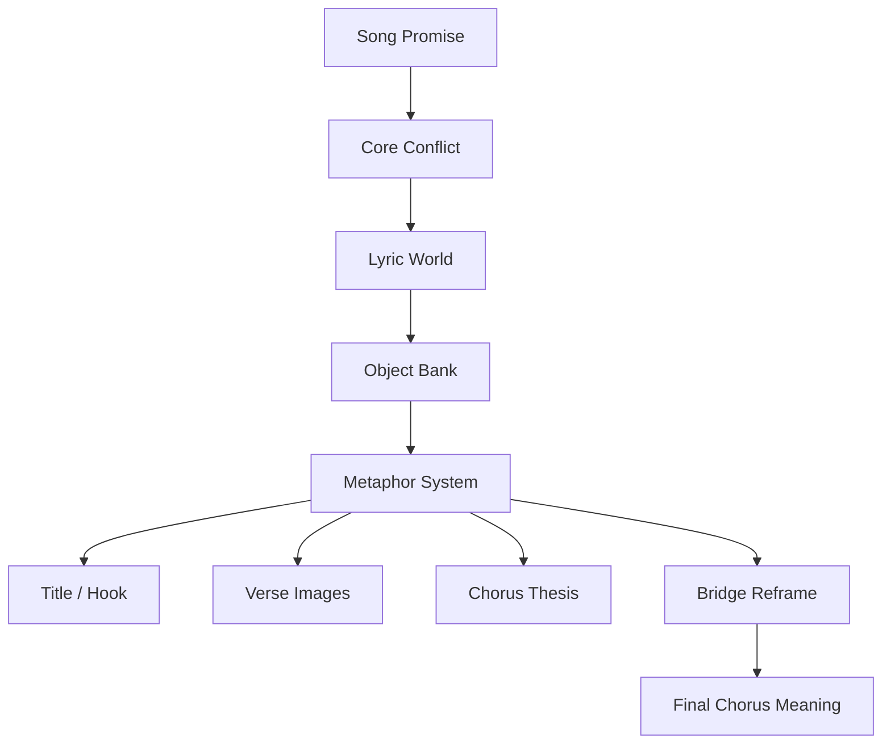
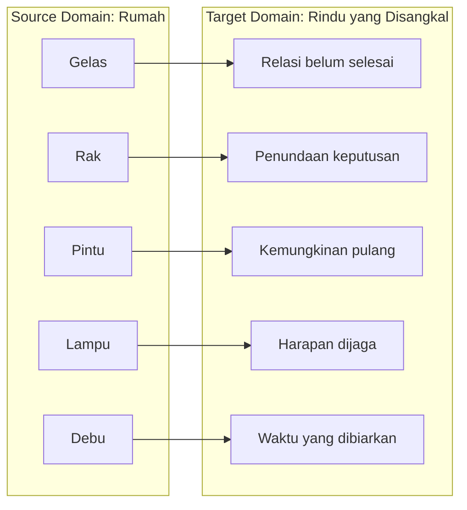
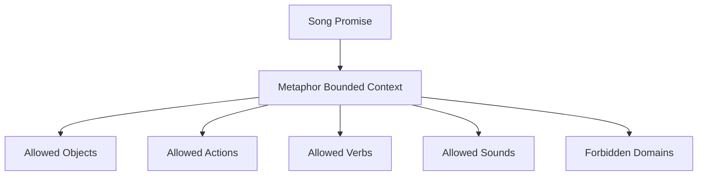
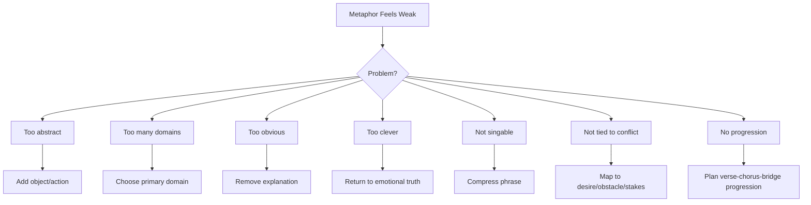

# learn-songwriting-part-012.md

# Metaphor System: Membangun Metafora yang Konsisten, Tajam, dan Bernyanyi

> Seri: `learn-songwriting`  
> Part: `012 / 034`  
> Fokus: metaphor system, symbol, simile, mapping, consistency, metaphor escalation, dan metafora untuk kritik/satire  
> Status seri: belum selesai  
> Prasyarat: `learn-songwriting-part-000.md` sampai `learn-songwriting-part-011.md`

---

## Ringkasan Part Ini

Part sebelumnya membahas **Object Writing dan Sensory Detail**: bagaimana mengubah emosi menjadi benda, tempat, suara, cahaya, gestur, dan detail konkret.

Part ini melanjutkan satu level lebih dalam:

> Bagaimana benda-benda itu menjadi **metafora** yang konsisten, bukan sekadar dekorasi puitis?

Contoh object writing:

```text
Gelasmu di rak kedua
tak kupakai, tak kubuang.
```

Ini sudah konkret. Tetapi ia bisa menjadi lebih kuat jika masuk ke metaphor system:

```text
gelas = hubungan yang belum dipakai untuk hidup baru, tetapi belum dibuang sebagai masa lalu
rak = tempat menunda keputusan
rumah = tubuh/ingatan narator
```

Contoh kritik metaforis:

```text
Kopermu beroda sutra
meja kami pincang sebelah.
```

Metaphor system-nya:

```text
kekasih berkopor = figur yang selalu pergi
rumah = rakyat/negeri/keluarga yang ditinggal
meja makan = kebutuhan domestik
koper = mobilitas, status, dan kebiasaan absen
bandara = panggung kepergian
```

Metafora bukan hanya “bahasa indah”. Metafora adalah **mapping makna**.

Jika mapping-nya jelas, lagu terasa dalam.

Jika mapping-nya kacau, lagu terasa pretensius, kabur, atau terlalu “dipaksakan puitis”.

Sebagai software engineer, pikirkan metafora sebagai **domain mapping**:

```text
source domain -> target domain
```

Contoh:

```text
source domain: rumah, gelas, rak, pintu
target domain: ingatan, penyangkalan, relasi yang belum selesai
```

Atau:

```text
source domain: bandara, koper, gate, pengumuman
target domain: absensi, kuasa, kepulangan palsu, tanggung jawab yang ditinggal
```

Part ini mengajarkan cara membuat metaphor system yang:

- konsisten;
- singable;
- tidak terlalu clever;
- tidak terlalu literal;
- mendukung song promise;
- bisa berkembang antar-section;
- bisa melahirkan hook;
- bisa dipakai untuk membungkus kritik tanpa menjadi ceramah.

---

## Tujuan Part

Setelah menyelesaikan part ini, kamu harus bisa:

1. Membedakan metaphor, simile, symbol, analogy, dan motif.
2. Memahami metaphor sebagai mapping antara source domain dan target domain.
3. Membuat metaphor system yang konsisten untuk satu lagu.
4. Menghindari mixed metaphor yang membuat lagu kabur.
5. Menggunakan metaphor untuk memperdalam song promise.
6. Menggunakan metaphor untuk menyembunyikan kritik secara artistik.
7. Mengembangkan metaphor dari verse ke chorus ke bridge.
8. Membuat metaphor escalation.
9. Menggunakan metaphor sebagai sumber title dan hook.
10. Menentukan allowed dan forbidden metaphor domain.
11. Mendiagnosis metafora yang terlalu abstrak, terlalu clever, terlalu banyak, atau terlalu literal.
12. Membuat file latihan `songwriting-practice-012-metaphor-system.md`.

---

## Prinsip Utama

```text
A metaphor is not decoration.
A metaphor is a meaning engine.
```

Metafora yang baik membuat pendengar merasakan dua hal sekaligus:

1. benda/situasi literal;
2. makna emosional yang lebih dalam.

Contoh:

```text
Tak kupakai, tak kubuang.
```

Literal:

```text
benda tidak dipakai dan tidak dibuang
```

Metaforis:

```text
relasi tidak lagi hidup, tetapi belum dilepas
```

Contoh:

```text
Jangan panggil ini pulang.
```

Literal:

```text
seseorang kembali, tetapi tidak sungguh hadir
```

Metaforis:

```text
kehadiran tanpa tanggung jawab bukan kepulangan
```

Metafora yang baik tidak hanya terdengar indah. Ia membantu lagu berpikir dan merasa.

---

## Metaphor dalam Pipeline Songwriting



Metaphor system idealnya dibangun setelah kamu punya:

- song promise;
- POV;
- conflict engine;
- emotional state machine;
- object bank.

Karena metafora harus melayani semua itu.

Jika kamu memulai dari metafora keren tanpa promise, hasilnya sering kabur:

```text
Aku adalah kapal kaca di langit yang terbakar oleh hujan digital.
```

Mungkin menarik, tapi pertanyaannya:

```text
Lagu ini tentang apa?
Siapa bicara?
Apa konflik?
Kenapa kapal?
Kenapa kaca?
Kenapa langit?
Kenapa hujan digital?
```

Metafora tanpa sistem sering terlihat indah tapi kosong.

---

# Bagian 1 — Definisi Dasar

## Metaphor

Metaphor mengatakan sesuatu sebagai sesuatu yang lain.

```text
Rumah ini adalah tubuh yang lupa pulang.
```

Atau lebih halus:

```text
Rumah ini menahan napas.
```

Metaphor tidak memakai “seperti”.

## Simile

Simile membandingkan dengan “seperti”, “bagai”, “seolah”.

```text
Rumah ini seperti tubuh yang menahan napas.
```

Simile lebih eksplisit.

## Symbol

Symbol adalah object yang membawa makna berulang.

```text
gelas = hubungan yang belum selesai
koper = kepergian
pintu = kemungkinan pulang
lampu = harapan/penjagaan
rak = penundaan
```

Symbol menjadi kuat karena diulang dan berkembang.

## Analogy

Analogy menjelaskan hubungan konsep.

```text
Menunggu itu seperti menyimpan barang rusak:
tidak dipakai, tapi terlalu banyak cerita untuk dibuang.
```

Analogy cenderung lebih explanatory.

## Motif

Motif adalah elemen yang berulang.

Bisa:

- kata;
- object;
- melodi;
- rhythm;
- image;
- phrase.

Contoh motif:

```text
rak kedua
belum
pulang
koper
pengumuman
```

Motif bisa literal atau metaforis.

---

## Perbedaan Singkat

| Elemen | Bentuk | Contoh | Fungsi |
|---|---|---|---|
| Metaphor | X adalah Y | rumah ini menahan napas | memberi makna langsung |
| Simile | X seperti Y | rumah ini seperti tubuh lelah | membandingkan eksplisit |
| Symbol | object bermakna | gelas = rindu tertahan | anchor berulang |
| Analogy | hubungan konsep | menunggu seperti menyimpan barang rusak | menjelaskan |
| Motif | elemen berulang | rak kedua muncul beberapa kali | membangun memori |

Dalam lirik, symbol dan motif sering lebih efektif daripada metaphor yang terlalu panjang.

---

# Bagian 2 — Source Domain dan Target Domain

Metaphor system membutuhkan dua domain.

## Source Domain

Dunia konkret yang dipakai sebagai bahasa metafora.

Contoh:

- rumah;
- bandara;
- laut;
- kebun;
- mesin;
- agama/doa;
- pengadilan;
- perang;
- tubuh;
- cuaca;
- dapur;
- kantor;
- panggung;
- pasar;
- jalan.

## Target Domain

Makna emosional/konseptual yang ingin dibicarakan.

Contoh:

- rindu;
- kehilangan;
- pengkhianatan;
- burnout;
- kuasa;
- absensi;
- cinta;
- denial;
- identitas;
- iman;
- kemarahan sosial;
- kepulangan palsu.

## Mapping

Mapping adalah hubungan antar elemen source dan target.

Contoh:

```markdown
Source domain: rumah
Target domain: ingatan dan relasi yang belum selesai

rumah -> diri/narator
gelas -> hubungan yang tidak selesai
rak -> penundaan keputusan
pintu -> kemungkinan pulang
lampu -> harapan yang dijaga
debu -> waktu yang dibiarkan
```

Contoh lain:

```markdown
Source domain: bandara
Target domain: absensi kuasa dan kepulangan palsu

koper -> kebiasaan pergi
gate -> batas antara hadir dan pergi
pengumuman -> citra publik/kabar
boarding pass -> izin untuk absen
runway -> jalan pergi yang selalu tersedia
kursi tunggu -> pihak yang ditinggalkan
```

---

## Domain Mapping Diagram



Mapping membuat metafora konsisten.

---

# Bagian 3 — Kenapa Metafora Sering Gagal?

Metafora gagal biasanya karena:

1. tidak mendukung song promise;
2. terlalu banyak domain;
3. terlalu abstrak;
4. terlalu clever;
5. terlalu literal;
6. terlalu dijelaskan;
7. tidak singable;
8. tidak berkembang;
9. tidak punya emotional truth;
10. hanya dipakai sekali lalu hilang.

## Contoh Mixed Metaphor

```text
Rumah ini kapal terbakar
di langit mesin yang menelan doa
sementara hatiku menjadi pasar basah.
```

Masalah:

- rumah;
- kapal;
- langit;
- mesin;
- doa;
- pasar;
- hati.

Terlalu banyak domain. Pendengar tidak tahu world mana yang harus diikuti.

## Versi Lebih Konsisten

```text
Rumah ini menahan lampu
untuk langkah yang lebih hafal bandara.
```

Domain:

- rumah;
- lampu;
- langkah;
- bandara.

Masih bisa masuk sistem rumah/bandara.

---

## Mixed Metaphor Detection

Tanya:

```text
Metafora ini berasal dari domain apa?
Apakah domain itu sudah dipakai sebelumnya?
Apakah domain baru ini diperlukan?
Apakah domain baru merusak world?
Apakah pendengar bisa memetakan maknanya?
Apakah lebih baik memakai object dari domain yang sama?
```

Jika tidak yakin, pilih domain yang sudah ada.

---

# Bagian 4 — Metaphor System vs One-Off Metaphor

## One-Off Metaphor

Metafora muncul sekali.

```text
Hatiku adalah kapal.
```

Jika tidak dikembangkan, ia mungkin terasa tempelan.

## Metaphor System

Metafora punya domain, mapping, perkembangan, dan payoff.

Contoh:

```markdown
Domain: rumah
Target: rindu yang tertahan

Verse 1:
gelas di rak kedua

Chorus:
tak kupakai, tak kubuang

Verse 2:
pintu dibuka sedikit

Bridge:
rak menjadi tempat narator menaruh dirinya

Final chorus:
diriku di rak kedua
```

Metafora bergerak.

Metaphor system membuat lagu terasa punya dunia.

---

## Metaphor System Template

```markdown
# Metaphor System

## Song Promise
...

## Target Domain
Emosi/konflik yang ingin dibicarakan:
...

## Source Domain
Dunia konkret yang dipakai:
...

## Core Mapping
| Source Element | Target Meaning | Possible Lyric Use |
|---|---|---|
|  |  |  |

## Main Symbol
...

## Secondary Symbols
1.
2.
3.

## Forbidden Domains
1.
2.
3.

## Metaphor Progression
Verse 1:
Chorus:
Verse 2:
Bridge:
Final Chorus:

## Hook Potential
1.
2.
3.

## Main Risk
...

## Mitigation
...
```

---

# Bagian 5 — Metafora sebagai Constraint

Metafora yang baik memberi constraint.

Jika domain-mu adalah **rumah**, kamu akan mencari:

- pintu;
- lampu;
- meja;
- kursi;
- gelas;
- rak;
- debu;
- kunci;
- jendela;
- lantai.

Kamu tidak akan sembarangan memasukkan:

- galaksi;
- kapal perang;
- algoritma;
- surga;
- gurun;
- pasar saham;

kecuali ada alasan kuat.

Constraint membuat lirik lebih coherent.

```text
More constraint = more focused imagination.
```

Sebagai engineer, ini mirip memilih bounded context.

Dalam bounded context “rumah”, kata “rak” bermakna.

Dalam bounded context “bandara”, kata “gate” bermakna.

Jika bounded context dicampur sembarangan, model domain rusak.

---

## Metaphor Bounded Context



Contoh:

```markdown
Bounded context:
rumah sebagai ingatan

Allowed:
gelas, rak, pintu, lampu, kunci, debu, meja

Allowed verbs:
menyimpan, menunggu, retak, menyala, mengunci, membuka, menahan

Forbidden:
samudra, galaksi, perang, mesin industri
```

---

# Bagian 6 — Source Domain yang Umum dan Efeknya

## 1. Rumah

Efek:

- intim;
- domestik;
- kehilangan;
- keluarga;
- ingatan;
- tubuh;
- tempat pulang;
- keamanan yang retak.

Cocok untuk:

- rindu;
- grief;
- identity;
- social criticism sebagai rumah/negeri;
- love song.

Risiko:

- cliché jika tidak spesifik;
- terlalu sentimental.

Objects:

```text
pintu, kunci, gelas, meja, kursi, lampu, jendela, lantai, debu, dapur
```

## 2. Bandara / Perjalanan

Efek:

- pergi;
- jarak;
- status;
- kepulangan palsu;
- transisi;
- perpisahan;
- mobilitas;
- ketidakhadiran.

Cocok untuk:

- long-distance relationship;
- satire tentang kepergian;
- ambition;
- exile;
- temporary love.

Risiko:

- terlalu literal jika semua tentang travel;
- bisa jadi terlalu dingin.

Objects:

```text
koper, gate, boarding pass, paspor, kursi tunggu, runway, pengumuman, troli
```

## 3. Laut / Kapal

Efek:

- jarak besar;
- takdir;
- tenggelam;
- perjalanan;
- kehilangan;
- luas;
- bahaya.

Cocok untuk:

- epic longing;
- grief;
- spiritual search.

Risiko:

- sangat sering dipakai;
- mudah melodramatic.

## 4. Mesin / Teknologi

Efek:

- burnout;
- dehumanization;
- repetition;
- system pressure;
- coldness;
- modern anxiety.

Cocok untuk:

- work songs;
- tech burnout;
- urban alienation.

Risiko:

- terlalu kaku;
- kurang hangat jika tidak diberi tubuh.

Objects:

```text
layar, keyboard, notifikasi, server, alarm, badge, lift, charger
```

## 5. Panggung / Teater

Efek:

- performativity;
- kepalsuan;
- public image;
- drama;
- satire;
- mask.

Cocok untuk:

- kritik sosial;
- relationship built on performance;
- fame/identity.

Risiko:

- terlalu theatrical jika overused.

Objects:

```text
lampu sorot, tirai, panggung, tepuk tangan, kostum, naskah, kursi penonton
```

## 6. Pengadilan

Efek:

- judgement;
- guilt;
- evidence;
- accusation;
- truth;
- moral conflict.

Cocok untuk:

- betrayal;
- guilt;
- apology songs.

Risiko:

- bisa terlalu formal.

Objects:

```text
hakim, saksi, bukti, vonis, meja, palu, sumpah
```

## 7. Dapur / Meja Makan

Efek:

- kebutuhan dasar;
- keluarga;
- kehadiran;
- lapar;
- ritual;
- domestik;
- krisis kecil yang besar.

Cocok untuk:

- love/grief;
- social criticism;
- family songs.

Risiko:

- perlu detail agar tidak terlalu biasa.

## 8. Doa / Ritual

Efek:

- surrender;
- doubt;
- longing;
- guilt;
- spiritual conflict.

Cocok untuk:

- grief;
- moral conflict;
- spiritual songs.

Risiko:

- cliché jika terlalu generik;
- perlu kehati-hatian tone.

---

# Bagian 7 — Choosing a Metaphor Domain

Pilih source domain dengan pertanyaan:

```text
Apakah domain ini cocok dengan song promise?
Apakah domain ini menyediakan banyak object/action?
Apakah domain ini natural untuk POV?
Apakah domain ini punya hook potential?
Apakah domain ini bisa berkembang dari verse ke bridge?
Apakah domain ini tidak terlalu klise untuk caraku menulis?
Apakah domain ini bisa dinyanyikan dalam bahasa Indonesia?
```

## Domain Selection Matrix

```markdown
# Metaphor Domain Selection

| Domain | Fits Promise | Object Richness | POV Fit | Hook Potential | Freshness | Risk | Total |
|---|---:|---:|---:|---:|---:|---|---:|
| Rumah |  |  |  |  |  |  |  |
| Bandara |  |  |  |  |  |  |  |
| Mesin |  |  |  |  |  |  |  |
| Panggung |  |  |  |  |  |  |  |
```

Pilih satu primary domain. Boleh punya secondary domain, tapi harus jelas hubungannya.

---

## Primary vs Secondary Domain

Primary domain adalah world utama.

Secondary domain boleh membantu, tapi jangan mengambil alih.

Contoh:

```markdown
Primary domain:
rumah

Secondary domain:
tubuh

Mapping:
rumah menahan lampu -> tubuh menahan napas
pintu -> mulut
rak -> ingatan yang ditunda
```

Ini masih kompatibel.

Contoh yang lebih berisiko:

```markdown
Primary domain:
rumah

Secondary:
laut, perang, galaksi, pasar, mesin
```

Terlalu banyak.

---

# Bagian 8 — Metaphor Mapping

Setelah memilih domain, buat mapping.

## Example: Rumah -> Rindu Disangkal

| Source Element | Target Meaning | Lyric Potential |
|---|---|---|
| rumah | diri/narator/ingatan | rumah ini salah paham |
| gelas | relasi yang belum selesai | tak kupakai, tak kubuang |
| rak | tempat menunda keputusan | rak kedua |
| pintu | kemungkinan pulang | pintu kubuka sedikit |
| lampu | harapan yang dijaga | lampu tetap menyala |
| debu | waktu yang dibiarkan | debu belajar namamu |
| kunci | izin pulang | kuncimu masih di bawah pot |
| meja | kebiasaan bersama | meja masih membagi pagi |

## Example: Bandara -> Absensi/Kepulangan Palsu

| Source Element | Target Meaning | Lyric Potential |
|---|---|---|
| koper | kebiasaan pergi/status | kopermu lebih setia |
| gate | batas hadir-pergi | kau hilang di gerbang terakhir |
| pengumuman | citra/kabar publik | kau pulang sebagai pengumuman |
| boarding pass | izin absen | tiketmu selalu punya alasan |
| kursi tunggu | pihak yang ditinggalkan | kursi tunggu lebih mengenal kami |
| runway | jalan pergi | langit punya jalan untukmu |
| paspor | akses/privilege | paspormu lebih penuh dari meja kami |

---

## Mapping Quality Criteria

Mapping yang baik:

- mudah dipahami;
- tidak terlalu literal;
- tidak terlalu jauh;
- punya emotional charge;
- bisa menghasilkan line;
- bisa diulang;
- bisa berkembang;
- sesuai POV.

Mapping lemah:

```text
gelas = demokrasi
rak = kapitalisme
pintu = metafisika
lampu = statistik
```

Mungkin bisa untuk karya eksperimental, tapi terlalu abstrak untuk MVS.

---

# Bagian 9 — Metaphor Progression

Metafora harus bergerak.

## Progression Type 1: Literal to Emotional

Verse:

```text
gelas di rak kedua
```

Chorus:

```text
tak kupakai, tak kubuang
```

Bridge:

```text
bukan gelasmu yang kutunda
tapi diriku
```

Metafora bergerak dari object literal ke self-revelation.

## Progression Type 2: Sweet to Bitter

Verse:

```text
sayang, kopermu siap lagi
```

Chorus:

```text
jangan panggil ini pulang
```

Final:

```text
tuan, jangan panggil ini pulang
```

Metafora bergerak dari romansa ke dakwaan.

## Progression Type 3: Small to Large

Verse:

```text
satu gelas
```

Verse 2:

```text
seluruh meja
```

Bridge:

```text
rumah
```

Final:

```text
diri/narator
```

## Progression Type 4: Object to Absence

Verse:

```text
benda yang ada
```

Bridge:

```text
yang paling terasa justru yang tidak ada
```

---

## Metaphor Progression Template

```markdown
# Metaphor Progression

## Primary metaphor
...

## Verse 1
Literal image:
Meaning:

## Chorus
Hook/metaphor:
Meaning:

## Verse 2
Expanded image:
Meaning:

## Bridge
Reframed image:
Meaning:

## Final Chorus
Final meaning:
```

---

# Bagian 10 — Metaphor Escalation

Escalation berarti metafora makin dalam, bukan sekadar makin besar.

Buruk:

```text
gelas -> rumah -> kota -> planet -> galaksi -> semesta
```

Ini sering hanya membesar, bukan memperdalam.

Lebih kuat:

```text
gelas -> kebiasaan -> penundaan -> identitas
```

## Escalation Ladder

```markdown
Level 1: object literal
Level 2: repeated habit
Level 3: emotional contradiction
Level 4: deeper self-truth
Level 5: final symbol
```

Contoh:

```markdown
Level 1:
Gelas di rak.

Level 2:
Gelas selalu disiapkan.

Level 3:
Tidak dipakai, tidak dibuang.

Level 4:
Narator takut membuang karena takut kosong.

Level 5:
Rak menjadi tempat narator menaruh dirinya.
```

Ini escalation yang meaningful.

---

# Bagian 11 — Metaphor and Hook

Hook sering lahir dari metafora yang paling padat.

## Hook dari Symbol

```text
rak kedua
```

## Hook dari Contradiction

```text
tak kupakai, tak kubuang
```

## Hook dari Metaphoric Question

```text
pulang ke siapa?
```

## Hook dari Reframed Object

```text
rumah ini salah paham
```

## Hook dari Satirical Mapping

```text
jangan panggil ini pulang
```

## Hook dari Personification

```text
kopermu lebih setia
```

Hook-metaphor yang baik:

- pendek;
- singable;
- punya conflict;
- bisa diulang;
- tidak perlu penjelasan panjang;
- membawa promise.

---

## Metaphor-to-Hook Template

```markdown
# Metaphor to Hook

## Primary metaphor
...

## Core contradiction
...

## Symbol
...

## 10 Hook Candidates
1.
2.
3.
4.
5.
6.
7.
8.
9.
10.

## Best 3
1.
2.
3.

## Selected Hook
...

## Why it works
...
```

---

# Bagian 12 — Metaphor and Title

Judul sering paling kuat jika menjadi symbol/metaphor.

## Title Types

| Type | Example | Effect |
|---|---|---|
| Object title | Rak Kedua | specific, symbolic |
| Contradiction title | Tak Kupakai, Tak Kubuang | hook-like |
| Place title | Terminal Tiga | cinematic |
| Personified title | Rumah Ini Salah Paham | fresh, emotional |
| Accusation title | Jangan Panggil Ini Pulang | dramatic |
| Character title | Tuan Berkopor | satirical |
| Ritual title | Dua Gelas Pagi | intimate |
| Question title | Pulang ke Siapa? | tension |

## Title Test

```text
Apakah title membawa metaphor system?
Apakah title bisa muncul di chorus?
Apakah title cukup singable?
Apakah title tidak terlalu umum?
Apakah title punya emotional charge?
Apakah title membuat pendengar ingin tahu?
```

---

# Bagian 13 — Metaphor and Verse

Verse biasanya menunjukkan metaphor secara literal/konkret.

Jika verse terlalu metaforis sejak awal, pendengar bisa bingung.

## Verse Good Practice

Mulai dengan object yang bisa dibayangkan.

```text
Gelasmu di rak kedua
tak kupindah sejak Selasa
```

Baru kemudian beri sedikit personification atau implication.

```text
air panas tetap kusisakan
untuk pagi yang salah sangka
```

## Verse Risk

Terlalu abstrak:

```text
Di rak ontologis kehilangan
aku menyimpan fragmen eksistensimu
```

Mungkin menarik secara teori, tapi tidak natural untuk lagu MVS.

Verse harus memberi pijakan.

---

# Bagian 14 — Metaphor and Chorus

Chorus bisa mengambil metaphor paling padat.

Verse:

```text
gelas di rak
```

Chorus:

```text
tak kupakai, tak kubuang
```

Chorus tidak perlu menjelaskan mapping:

```text
Gelas itu melambangkan hubungan kita yang belum bisa kuakhiri.
```

Terlalu literal.

Biarkan hook bekerja.

## Chorus Metaphor Rules

1. Gunakan metaphor yang pendek.
2. Jangan terlalu banyak object baru.
3. Pastikan bisa diulang.
4. Letakkan title/hook strategis.
5. Gunakan contradiction.
6. Jangan over-explain.
7. Pastikan pendengar masih tahu rasa utama.

---

# Bagian 15 — Metaphor and Bridge

Bridge adalah tempat terbaik untuk reframe metafora.

Verse:

```text
gelas = benda orang yang pergi
```

Bridge:

```text
gelas/rak = cara narator menunda diri
```

Contoh:

```text
Baru kusadar
di rak kedua

bukan gelasmu
yang paling lama
kutunda
```

Ini bridge karena mengubah makna.

## Bridge Reframe Types

| Reframe | Example |
|---|---|
| Object becomes self | rak menyimpan narator, bukan gelas |
| Lover becomes power | sayang berubah jadi tuan |
| Home becomes body | rumah menahan napas |
| Door becomes mouth | pintu/mulut sama-sama menahan nama |
| Koper becomes loyalty | koper lebih setia dari pemilik |
| Prayer becomes memory | amin menyebut nama yang salah |
| Work tool becomes body | keyboard menagih nadi |

---

# Bagian 16 — Metaphor and Final Chorus

Final chorus harus membawa metaphor ke payoff.

## Same Hook, New Meaning

Chorus awal:

```text
Tak kupakai, tak kubuang
```

Final chorus:

```text
Tak kupakai, tak kubuang
diriku di rak kedua
```

## Address Shift

Chorus awal:

```text
Sayang, jangan panggil ini pulang
```

Final chorus:

```text
Tuan, jangan panggil ini pulang
```

## Object Shift

Chorus awal:

```text
Gelasmu di rak kedua
```

Final:

```text
Namaku di rak kedua
```

Final chorus harus terasa seperti:

```text
same song, deeper truth
```

Bukan:

```text
random new metaphor
```

---

# Bagian 17 — Personification as Metaphor

Personification memberi benda kemampuan manusia.

## Strong Personification

```text
Rumah ini salah paham
mengira lampu
bisa menggantikan langkahmu.
```

Why it works:

- house is central metaphor;
- lampu/langkah related to home;
- emotional inference clear;
- not every object is screaming.

## Weak Personification

```text
Meja menangis, kursi berteriak, pintu merindu, lampu terluka.
```

Too much. Semua benda punya emosi besar.

## Personification Rules

1. Pilih satu object/persona utama.
2. Beri perilaku spesifik, bukan emosi generik.
3. Jaga domain.
4. Jangan membuat semua object bicara.
5. Pastikan personification punya emotional logic.

## Personification Template

```markdown
# Personification Design

## Object
...

## Human behavior assigned
...

## Why this behavior fits object
...

## Emotional meaning
...

## Possible line
...
```

---

# Bagian 18 — Metaphor for Satire and Critique

Metafora sangat berguna untuk kritik yang tidak vulgar.

Kamu bisa menulis kritik sebagai:

- romansa;
- rumah tangga;
- panggung;
- bandara;
- pesta;
- surat cinta;
- pengadilan;
- doa;
- pasar;
- permainan.

## Direct Criticism

```text
Pemimpin sering pergi dan meninggalkan rakyat saat krisis.
```

Kuat sebagai opini, tetapi bukan lirik yang halus.

## Metaphoric Criticism

```text
Sayang,
kopermu lebih hafal bandara
daripada retak meja makan.
```

Layer 1:

```text
kekasih sering pergi
```

Layer 2:

```text
figur yang seharusnya hadir justru absen
```

Layer 3:

```text
rumah/komunitas/negeri menanggung krisis
```

Metafora membuat kritik masuk lewat emosi.

---

## Satirical Metaphor System

```markdown
# Satirical Metaphor System

## Surface Story
romansa tragis: kekasih selalu pergi

## Deeper Target
absensi kuasa/tanggung jawab

## Source Domain
rumah + bandara + panggung

## Mapping
kekasih/tuan -> figur yang pergi
rumah -> yang ditinggal
koper -> kebiasaan pergi
bandara -> tempat absensi diberi glamor
panggung -> citra kepulangan
meja makan -> kebutuhan nyata
anak-anak -> dampak domestik
lampu -> harapan/penjagaan

## Tone
manis di permukaan, tajam di bawah

## Forbidden
makian literal, istilah jabatan eksplisit, ceramah
```

---

## Satire Metaphor Risks

| Risk | Gejala | Mitigasi |
|---|---|---|
| Too vague | pendengar hanya dengar love song | beri clue sosial di rumah/meja/anak |
| Too obvious | metafora runtuh jadi ceramah | tetap di vehicle |
| Too cruel | kehilangan nuansa | sisakan grief, bukan hanya ejekan |
| Too clever | emosi hilang | jaga luka narator |
| Too many targets | lagu melebar | satu conflict utama |
| Too vulgar | estetika rusak | gunakan tindakan yang menghakimi sendiri |

Satire yang kuat sering terasa seperti romansa yang perlahan memperlihatkan pisaunya.

---

# Bagian 19 — Metaphor and Indonesian Language

Bahasa Indonesia punya kekuatan metafora tertentu:

- kata benda pendek bisa kuat: rumah, pintu, gelas, nama, lampu;
- “masih” dan “belum” membawa tension;
- imbuhan bisa membuat frasa padat;
- repetisi bisa terasa musikal;
- kata “pulang” sangat kaya secara emosional;
- “tuan”, “sayang”, “kau” membawa register dan hubungan;
- personification rumah/pintu/lampu terasa natural dalam lirik Indonesia jika tidak berlebihan.

## Kata-Kata Metaforis Kuat

```text
pulang
rumah
nama
pintu
lampu
meja
kursi
gelas
rak
jalan
tangan
mulut
doa
amin
koper
tuan
sayang
```

## Word Pair yang Berpotensi Hook

```text
belum pulang
masih menunggu
salah paham
rak kedua
tanpa tuan
pulang palsu
dua gelas
pintu kecil
lampu terakhir
nama yang tertahan
```

Metafora harus diuji secara bunyi, bukan hanya makna.

---

# Bagian 20 — Metaphor and Singability

Metafora yang terlalu panjang sulit dinyanyikan.

## Too Dense

```text
Aku adalah arsitektur kehilangan yang menyimpan residu eksistensimu di ruang domestik.
```

Sulit dinyanyikan.

## Singable

```text
Rumah ini
masih menyimpan
cara memanggilmu.
```

Atau:

```text
Di rak kedua
aku menunda
namamu.
```

## Singability Rules

1. Gunakan kata konkret.
2. Kurangi istilah abstrak.
3. Pecah frasa.
4. Pilih vowel yang enak untuk nada panjang.
5. Jangan menumpuk konsep dalam satu baris.
6. Biarkan metaphor bekerja lewat object/action.

---

# Bagian 21 — Metaphor Compression

Metafora sering perlu dikompresi.

## Prose Metaphor

```text
Hubungan kita seperti gelas yang tidak lagi kugunakan tetapi juga tidak bisa kubuang karena masih menyimpan kenangan tentangmu.
```

## Lyric Compression

```text
Tak kupakai
tak kubuang.
```

Metaphor compression menghasilkan hook.

## Compression Techniques

| Technique | Example |
|---|---|
| remove explanation | hapus “karena ini melambangkan...” |
| use object/action | gelas + pakai/buang |
| use contradiction | tak X, tak Y |
| use line break | beri ruang |
| use repetition | masih/belum |
| use title | jadikan phrase pusat |
| use implied subject | tidak perlu semua dijelaskan |

---

# Bagian 22 — Metaphor Consistency Audit

Setelah draft, audit metaphor.

```markdown
# Metaphor Consistency Audit

## Primary Domain
...

## Secondary Domain
...

## Symbols Used
1.
2.
3.

## Lines that fit domain
-

## Lines that break domain
-

## Mixed metaphors
-

## Over-explained metaphors
-

## Under-explained/confusing metaphors
-

## Best metaphor line
...

## Weakest metaphor line
...

## Decision
- keep
- revise
- cut
- move to another song
```

---

# Bagian 23 — Metaphor Debugging

Jika metaphor terasa lemah:



## Debug Questions

```text
Apa source domain-nya?
Apa target domain-nya?
Apa mapping inti?
Apakah metaphor ini mendukung promise?
Apakah terlalu banyak domain?
Apakah object/action jelas?
Apakah terlalu dijelaskan?
Apakah bisa dinyanyikan?
Apakah bisa menjadi hook?
Apakah metaphor berkembang?
Apakah ada emotional truth?
```

---

# Bagian 24 — Metaphor Anti-Patterns

## Anti-Pattern 1: Pretty but Empty

```text
Aku bulan kaca di langit patah.
```

Masalah:

- indah mungkin;
- tapi tidak jelas promise/conflict;
- tidak ada grounding.

Solusi:

```text
hubungkan ke object/action dan conflict.
```

## Anti-Pattern 2: Mixed Domain Chaos

```text
Rumahku kapal perang digital di samudra doa.
```

Masalah:

- terlalu banyak domain;
- sulit dipetakan.

Solusi:

```text
pilih satu primary domain.
```

## Anti-Pattern 3: Overexplained Metaphor

```text
Gelas ini adalah simbol cintaku yang tidak bisa kubuang.
```

Masalah:

- membunuh subtext.

Solusi:

```text
biarkan line bekerja:
Tak kupakai, tak kubuang.
```

## Anti-Pattern 4: Metaphor as Puzzle

Gejala:

```text
pendengar harus memecahkan teka-teki rumit untuk merasa apa pun.
```

Solusi:

```text
emosi harus terasa bahkan jika semua mapping tidak dipahami.
```

## Anti-Pattern 5: Metaphor Too Literal

Gejala:

```text
metafora tidak punya lapisan kedua.
```

Contoh:

```text
Kopermu pergi karena kau pergi.
```

Solusi:

```text
beri implication:
Kopermu lebih hafal pulang
daripada tanganmu sendiri.
```

## Anti-Pattern 6: Every Line Is a Metaphor

Gejala:

```text
tidak ada grounding literal.
```

Solusi:

```text
selingi image literal dan metaphor.
```

## Anti-Pattern 7: Metaphor Fights POV

Gejala:

```text
persona sederhana tiba-tiba bicara konsep kosmik akademik.
```

Solusi:

```text
sesuaikan metaphor dengan diction register.
```

---

# Bagian 25 — Metaphor Density

Berapa banyak metaphor dalam satu section?

## Low Density

```text
Aku sedih karena kamu pergi.
```

Jelas tapi datar.

## High Density

```text
Aku kapal, kau badai, rumahku langit, pintuku doa, gelasku perang.
```

Terlalu padat.

## Balanced Density

Verse:

```text
Gelasmu di rak kedua
tak kupindah sejak Selasa.
```

Chorus:

```text
Tak kupakai
tak kubuang.
```

Bridge:

```text
Baru kusadar
bukan gelasmu
yang paling lama
kutunda.
```

Metafora muncul sebagai anchor, bukan setiap kata.

## Rule of Thumb

- Verse: 1–2 image/metaphor utama.
- Chorus: 1 hook metaphor/contradiction.
- Bridge: 1 reframe metaphor.
- Final chorus: ulang/reframe, jangan tambah domain baru besar.

---

# Bagian 26 — Metaphor Layering

Metafora bisa punya layer, tapi harus bertahap.

## Layer 1: Literal

```text
gelas di rak
```

## Layer 2: Emotional

```text
belum melepas
```

## Layer 3: Identity

```text
narator menunda dirinya sendiri
```

## Layer 4: Universal

```text
manusia sering menyimpan sesuatu yang tidak lagi hidup karena takut kehilangan bentuk dirinya
```

Lagu tidak perlu menjelaskan layer 4. Pendengar akan merasakan jika layer 1–3 kuat.

---

# Bagian 27 — Metaphor for Emotional State Machine

Setiap state bisa punya metaphor behavior.

Contoh rindu domestik:

| State | Metaphor Behavior |
|---|---|
| Denial | object literal: gelas di rak |
| Confession | contradiction: tak kupakai, tak kubuang |
| Habit | object chain: rumah ikut menunggu |
| Realization | object reframed: rak menyimpan diri |
| Fragile Acceptance | object still there, meaning changed |

Contoh satir:

| State | Metaphor Behavior |
|---|---|
| Tender address | kekasih/koper |
| Irony | pulang sebagai pengumuman |
| Accusation | rumah/meja/piring |
| Grief | rumah mengaku letih |
| Bitter clarity | sayang -> tuan |

Metafora harus mendukung state transition.

---

# Bagian 28 — Metaphor and POV

Metafora harus cocok dengan siapa yang bicara.

## POV: Aku Domestik

Cocok:

```text
gelas, pintu, rak, kursi, lampu
```

Kurang cocok jika tiba-tiba:

```text
hipotesis, orbit, kapital, kosmologi
```

## POV: Rumah sebagai Narrator

Cocok:

```text
dinding, pintu, lampu, lantai, langkah, retak
```

## POV: Koper sebagai Narrator

Cocok:

```text
roda, troli, bagasi, gate, paspor, tangan, lantai
```

Koper tidak natural bicara soal meja makan kecuali ia pernah melihat/melewati atau dijadikan metafora lebih luas.

## POV: Narator Satir

Cocok:

```text
tuan, panggung, pengumuman, koper, lampu, salam
```

## POV-Metaphor Contract

```markdown
# POV-Metaphor Contract

## Narrator
...

## What this narrator can see/touch/hear
...

## Metaphor domains natural to narrator
...

## Domains that feel unnatural
...

## Diction register
...

## Allowed metaphor style
...
```

---

# Bagian 29 — Metaphor and Conflict Engine

Metafora harus membawa conflict.

Conflict:

```text
ingin melepas vs masih menunggu
```

Metaphor:

```text
tak kupakai, tak kubuang
```

Conflict:

```text
kehadiran palsu vs rumah butuh kehadiran nyata
```

Metaphor:

```text
jangan panggil ini pulang
```

Conflict:

```text
ingin istirahat vs takut sistem runtuh
```

Metaphor:

```text
tubuhku menjadi server
yang tak berani dimatikan
```

Jika metafora tidak membawa conflict, ia mungkin hanya dekorasi.

## Conflict-Metaphor Template

```markdown
# Conflict-Metaphor Mapping

## Desire
...

## Obstacle
...

## Stakes
...

## Source Domain
...

## Symbol for Desire
...

## Symbol for Obstacle
...

## Symbol for Stakes
...

## Contradiction Hook
...
```

---

# Bagian 30 — Metaphor and Rhyme/Sound

Metaphor harus enak dibunyikan.

Contoh:

```text
rak kedua
```

Sound:

- “rak” keras;
- “kedua” terbuka;
- bisa jatuh di akhir baris.

```text
tak kupakai, tak kubuang
```

Sound:

- repetition “tak ku-”;
- contrast “pakai/buang”;
- rhythm kuat;
- mudah jadi hook.

```text
jangan panggil ini pulang
```

Sound:

- “panggil/pulang” punya internal relation;
- phrase natural;
- cocok sebagai accusation.

Saat memilih metaphor hook, uji:

```text
ucapkan 10 kali
nyanyikan 3 contour
cek breath
cek vowel
cek consonant
```

Metafora yang bagus di kepala bisa gagal di mulut.

---

# Bagian 31 — Metaphor Exercise: Domain Mapping

Pilih song promise utama. Isi:

```markdown
# Domain Mapping Exercise

## Song Promise
...

## Target Domain
Emosi/konflik:
...

## Candidate Source Domains
1.
2.
3.
4.
5.

## Chosen Source Domain
...

## Mapping Table

| Source Element | Target Meaning | Possible Line |
|---|---|---|
|  |  |  |

## Main Symbol
...

## Secondary Symbols
...

## Forbidden Domains
...

## Hook Possibilities
1.
2.
3.
4.
5.
```

---

# Bagian 32 — Metaphor Exercise: One Domain, 20 Lines

Pilih satu domain.

Contoh:

```text
rumah
```

Tulis 20 line hanya dari domain itu.

Aturan:

- jangan keluar domain;
- jangan pakai emosi langsung di 10 line pertama;
- gunakan object/action;
- boleh personification secukupnya.

Contoh:

```text
Pintu menahan namamu
di engsel yang mulai serak.

Lampu dapur menyala
lebih lama dari alasanku.

Gelasmu di rak kedua
belum belajar jadi benda.
```

Tujuan: melatih consistency.

---

# Bagian 33 — Metaphor Exercise: Same Target, Different Domains

Target:

```text
rindu yang disangkal
```

Buat metafora dari domain berbeda.

## Rumah

```text
Gelasmu di rak kedua
tak kupakai, tak kubuang.
```

## Bandara

```text
Namamu duduk di kursi tunggu
tanpa jadwal keberangkatan.
```

## Mesin

```text
Tubuhku menyimpan prosesmu
yang tak pernah kututup.
```

## Doa

```text
Aminku masih salah alamat.
```

## Pengadilan

```text
Namamu hadir sebagai bukti
yang tak berani kubacakan.
```

Lalu pilih domain yang paling cocok dengan promise dan POV.

---

# Bagian 34 — Metaphor Exercise: Metaphor Compression

Ubah penjelasan panjang menjadi hook pendek.

## Long Explanation

```text
Aku tidak benar-benar menggunakan barang-barangmu lagi, tetapi aku juga tidak mampu membuangnya karena membuangnya berarti menerima bahwa hubungan kita selesai.
```

## Compressed Hooks

```text
Tak kupakai, tak kubuang.
```

```text
Belum kupakai untuk lupa.
```

```text
Rak kedua menunda kita.
```

```text
Gelasmu belum jadi benda.
```

Pilih yang paling singable.

---

# Bagian 35 — Metaphor Exercise: Bridge Reframe

Ambil symbol dari verse. Reframe di bridge.

## Symbol

```text
rak kedua
```

## Literal Use

```text
tempat gelas disimpan
```

## Emotional Use

```text
tempat menunda keputusan
```

## Bridge Reframe

```text
bukan gelasmu
yang paling lama
kutunda

di rak kedua
aku menyimpan
diriku
```

Latihan:

```markdown
Symbol:
Literal meaning:
Emotional meaning:
Deeper meaning:
Bridge line:
```

---

# Bagian 36 — Metaphor Exercise: Satire Mask

Pilih kritik sosial. Bungkus dalam surface metaphor.

Template:

```markdown
# Satire Mask Exercise

## Direct Criticism
...

## Surface Story
...

## Source Domain
...

## Target Domain
...

## Mapping
| Surface | Deeper Meaning |
|---|---|
|  |  |

## Forbidden Literal Words
1.
2.
3.
4.
5.

## 10 Metaphoric Lines
1.
2.
3.
4.
5.
6.
7.
8.
9.
10.

## Best Hook
...
```

Contoh:

```markdown
Direct criticism:
figur yang seharusnya hadir terlalu sering pergi saat rumah krisis

Surface story:
kekasih yang terus pergi dengan koper

Source domain:
romansa + bandara + rumah

Hook:
jangan panggil ini pulang
```

---

# Bagian 37 — Full Metaphor System Example: Rindu Domestik

## Song Promise

```text
Lagu ini membuat pendengar merasakan rindu yang disangkal
melalui benda-benda rumah yang tetap disiapkan
dari POV orang yang ditinggalkan
dengan konflik antara ingin melepas dan masih menunggu.
```

## Target Domain

```text
rindu, denial, hubungan yang belum selesai, identitas sebagai penunggu
```

## Source Domain

```text
rumah/dapur
```

## Mapping

| Source | Target | Possible Line |
|---|---|---|
| gelas | hubungan yang belum selesai | gelasmu di rak kedua |
| rak | tempat menunda keputusan | rak kedua menunda namamu |
| pintu | kemungkinan pulang | pintu kubuka sedikit |
| lampu | harapan yang dijaga | lampu dapur tak belajar padam |
| debu | waktu yang dibiarkan | debu menulis namamu |
| kunci | izin pulang | kuncimu masih di bawah pot |
| kursi | absensi | kursimu lebih sabar dariku |

## Hook

```text
tak kupakai, tak kubuang
```

## Metaphor Progression

```markdown
Verse 1:
gelas literal di rak.

Chorus:
tak kupakai, tak kubuang = contradiction hubungan.

Verse 2:
rumah ikut menyimpan kebiasaan.

Bridge:
rak bukan tempat gelas, tapi tempat narator menunda diri.

Final Chorus:
hook kembali sebagai self-recognition.
```

## Forbidden Domains

```text
laut, galaksi, perang, pasar, mesin
```

## Bridge Reframe

```text
Baru kusadar
bukan gelasmu
yang paling lama
kutunda.
```

---

# Bagian 38 — Full Metaphor System Example: Romansa Satir Bandara

## Song Promise

```text
Lagu ini membuat pendengar merasakan kemarahan yang disembunyikan sebagai romansa tragis
melalui kekasih berkopor yang terus pergi meninggalkan rumah retak
dari POV rumah/kekasih yang ditinggal
dengan konflik antara masih memanggil pulang dan sadar kepulangannya hanya pertunjukan.
```

## Target Domain

```text
absensi, kepulangan palsu, kuasa yang tidak hadir, rumah yang menanggung akibat
```

## Source Domain

```text
romansa + bandara + rumah/panggung
```

## Mapping

| Source | Target | Possible Line |
|---|---|---|
| kekasih | figur yang seharusnya hadir | sayang, kopermu siap lagi |
| koper | kebiasaan pergi/status | kopermu lebih setia |
| bandara | panggung kepergian | bandara menelan namamu |
| pengumuman | citra kepulangan | kau pulang sebagai pengumuman |
| rumah | pihak yang ditinggal | rumah retak menunggu tuan |
| meja makan | kebutuhan nyata | meja kami pincang sebelah |
| piring | krisis domestik | piring anak-anak menipis |
| panggung | kepulangan performatif | jangan pulang sebagai panggung |
| tuan | address satire | tuan, jangan panggil ini pulang |

## Hook

```text
jangan panggil ini pulang
```

## Metaphor Progression

```markdown
Verse 1:
romansa permukaan: sayang + koper.

Chorus:
ironi: pulang tidak berarti hadir.

Verse 2:
rumah dan meja menunjukkan stakes.

Bridge:
luka di balik sindiran: rumah lelah menjadi panggung.

Final Chorus:
address bergeser dari sayang ke tuan.
```

## Forbidden Domains

```text
jabatan literal, angka anggaran, makian vulgar, slogan politik
```

## Final Reframe

```text
Sayang -> Tuan
romansa -> dakwaan
pulang -> pertunjukan
```

---

# Bagian 39 — Latihan Utama Part 012

Buat file:

```text
songwriting-practice-012-metaphor-system.md
```

Isi template berikut.

```markdown
# songwriting-practice-012-metaphor-system.md

## 1. Song Promise
...

## 2. POV Summary
Narrator:
Addressee:
Mask:
Truth:

## 3. Core Conflict
Narator ingin:
Tetapi:
Karena:

## 4. Emotional State Machine Summary
Start:
Middle:
Turn:
End:

## 5. Target Domain
Emosi/konflik/makna yang ingin dibicarakan:
...

## 6. Candidate Source Domains
Buat minimal 5.

| Domain | Why it fits | Risks |
|---|---|---|
| 1. |  |  |
| 2. |  |  |
| 3. |  |  |
| 4. |  |  |
| 5. |  |  |

## 7. Chosen Primary Source Domain
...

Kenapa:
...

## 8. Optional Secondary Domain
...

Kenapa masih compatible:
...

## 9. Core Mapping

| Source Element | Target Meaning | Possible Lyric Use |
|---|---|---|
|  |  |  |

Minimal 10 mapping.

## 10. Main Symbol
...

Literal meaning:
...

Emotional meaning:
...

Conflict meaning:
...

## 11. Secondary Symbols
1.
2.
3.
4.
5.

## 12. Forbidden Domains / Images
1.
2.
3.
4.
5.

## 13. Metaphor Progression

### Verse 1
Literal image:
Meaning:

### Chorus
Hook/metaphor:
Meaning:

### Verse 2
Expanded image:
Meaning:

### Bridge
Reframed image:
Meaning:

### Final Chorus
Final meaning:

## 14. Hook Candidates from Metaphor
1.
2.
3.
4.
5.
6.
7.
8.
9.
10.

## 15. Title Candidates from Metaphor
1.
2.
3.
4.
5.

## 16. One-Domain 20 Lines
Tulis 20 line dari primary domain.

1.
2.
3.
4.
5.
6.
7.
8.
9.
10.
11.
12.
13.
14.
15.
16.
17.
18.
19.
20.

## 17. Best 5 Metaphor Lines
1.
2.
3.
4.
5.

## 18. Bridge Reframe Draft
...

## 19. Metaphor Consistency Risks
...

## 20. Mitigation
...

## 21. Next Action
...
```

---

# Latihan 30 Menit: Domain Mapping

Pilih satu source domain.

Isi mapping minimal 10 elemen.

Aturan:

- setiap mapping harus punya possible lyric use;
- jangan hanya konsep;
- pakai object/action.

Output:

```markdown
Best 3 mapping:
1.
2.
3.
```

---

# Latihan 45 Menit: One Domain, 20 Lines

Tulis 20 baris hanya dari satu source domain.

Aturan:

- tidak boleh keluar domain;
- tidak boleh over-explain;
- minimal 10 baris punya object/action;
- pilih 5 line terbaik.

---

# Latihan 60 Menit: Metaphor to Hook and Bridge

1. Pilih main symbol.
2. Buat 10 hook.
3. Pilih 3.
4. Tulis bridge reframe.
5. Tulis final chorus meaning.

Template:

```markdown
Main symbol:
Hook candidates:
Selected hook:
Bridge reframe:
Final chorus meaning:
Voice memo plan:
```

---

# Checklist Part 012

Sebelum lanjut ke part 013, pastikan:

- [ ] Kamu bisa membedakan metaphor, simile, symbol, analogy, dan motif.
- [ ] Kamu punya target domain.
- [ ] Kamu punya minimal 5 candidate source domain.
- [ ] Kamu memilih 1 primary source domain.
- [ ] Kamu punya mapping minimal 10 elemen.
- [ ] Kamu punya main symbol.
- [ ] Kamu punya secondary symbols.
- [ ] Kamu punya forbidden domains/images.
- [ ] Kamu punya metaphor progression verse-chorus-verse-bridge-final chorus.
- [ ] Kamu punya minimal 10 hook candidates dari metaphor.
- [ ] Kamu punya title candidates.
- [ ] Kamu menulis 20 line dari satu domain.
- [ ] Kamu memilih 5 line terbaik.
- [ ] Kamu punya bridge reframe.
- [ ] Kamu sudah audit risiko mixed metaphor.
- [ ] Kamu punya next action menuju lyric architecture.

---

# Output Wajib Part 012

Buat file:

```text
songwriting-practice-012-metaphor-system.md
```

Isi minimal:

```markdown
# songwriting-practice-012-metaphor-system.md

## Song Promise
...

## POV Summary
...

## Core Conflict
...

## Target Domain
...

## Candidate Source Domains
...

## Chosen Primary Source Domain
...

## Core Mapping
...

## Main Symbol
...

## Secondary Symbols
...

## Forbidden Domains
...

## Metaphor Progression
...

## Hook Candidates
...

## Title Candidates
...

## Best Metaphor Lines
...

## Bridge Reframe
...

## Next Action
...
```

---

# Common Failure Modes di Part Ini

## 1. Metafora Terlalu Banyak Domain

Gejala:

```text
rumah, laut, perang, galaksi, mesin, doa muncul bersamaan tanpa sistem.
```

Solusi:

```text
pilih primary source domain dan forbidden domains.
```

## 2. Metafora Hanya Indah, Tidak Berfungsi

Gejala:

```text
line terdengar puitis tapi tidak mendukung promise/conflict.
```

Solusi:

```text
map ke target domain dan conflict engine.
```

## 3. Metafora Terlalu Dijelaskan

Gejala:

```text
line menjelaskan "ini melambangkan..."
```

Solusi:

```text
hapus penjelasan. Biarkan object/action bekerja.
```

## 4. Metafora Terlalu Clever

Gejala:

```text
pendengar sibuk memecahkan puzzle, tidak merasa apa pun.
```

Solusi:

```text
kembali ke emotional truth dan sensory detail.
```

## 5. Metafora Tidak Singable

Gejala:

```text
frasa panjang, abstrak, berat di mulut.
```

Solusi:

```text
compress menjadi object/action/hook pendek.
```

## 6. Metafora Tidak Berkembang

Gejala:

```text
symbol muncul sekali lalu hilang.
```

Solusi:

```text
buat progression dari verse ke bridge.
```

## 7. Metafora Melawan POV

Gejala:

```text
persona domestik bicara terlalu akademik/kosmik.
```

Solusi:

```text
buat POV-metaphor contract.
```

## 8. Metafora Terlalu Literal

Gejala:

```text
tidak ada lapisan kedua.
```

Solusi:

```text
tambahkan target meaning dan contradiction.
```

## 9. Semua Baris adalah Metafora

Gejala:

```text
tidak ada grounding literal.
```

Solusi:

```text
campur literal image, object action, dan metaphor.
```

## 10. Metafora Menggantikan Lagu

Gejala:

```text
terlalu sibuk dengan metafora, lupa hook, melody, section.
```

Solusi:

```text
metafora harus masuk ke verse, chorus, bridge, bukan berdiri sebagai teori.
```

---

# Prinsip Penting

```text
A metaphor works when it lets the listener feel two truths at once.
```

Dan:

```text
The metaphor should deepen the song, not distract from it.
```

Metafora yang baik membuat lagu terasa lebih luas tanpa kehilangan fokus.

Metafora yang buruk membuat lagu terasa pintar tapi jauh.

Untuk 20 jam pertama, targetnya bukan membuat metafora paling kompleks. Targetnya membuat satu metaphor system yang jelas, konsisten, dan cukup kuat untuk melahirkan lirik, hook, dan bridge.

---

# Bridge ke Part Berikutnya

Part ini membahas metaphor system.

Part berikutnya, `learn-songwriting-part-013.md`, akan membahas:

```text
Lyric Architecture
```

Kita akan mulai menyusun lirik sebagai struktur:

- line;
- couplet;
- stanza;
- verse;
- chorus;
- refrain;
- section function;
- rhyme placement;
- line length;
- breath;
- information order;
- image progression;
- hook placement;
- draft lyric sheet.

Jika metaphor system memberi dunia makna, lyric architecture akan mengatur bagaimana dunia itu muncul baris demi baris.

---

# Status Seri

Part ini selesai.

```text
Selesai: learn-songwriting-part-012.md
Berikutnya: learn-songwriting-part-013.md
Status seri: belum selesai
Part tersisa: 22
Target akhir seri: learn-songwriting-part-034.md
```


<!-- NAVIGATION_FOOTER -->
<div class="page-nav">
<a href="./learn-songwriting-part-011.md">⬅️ Object Writing dan Sensory Detail: Mengubah Emosi Abstrak Menjadi Benda, Adegan, Gestur, dan Dunia Lirik yang Bisa Dirasakan</a>
<a href="./index.md">📚 Kategori</a>
<a href="../../index.md">🏠 Home</a>
<a href="./learn-songwriting-part-013.md">Lyric Architecture: Menyusun Baris, Bait, Section, Hook, dan Alur Informasi agar Lirik Bekerja sebagai Lagu ➡️</a>
</div>
