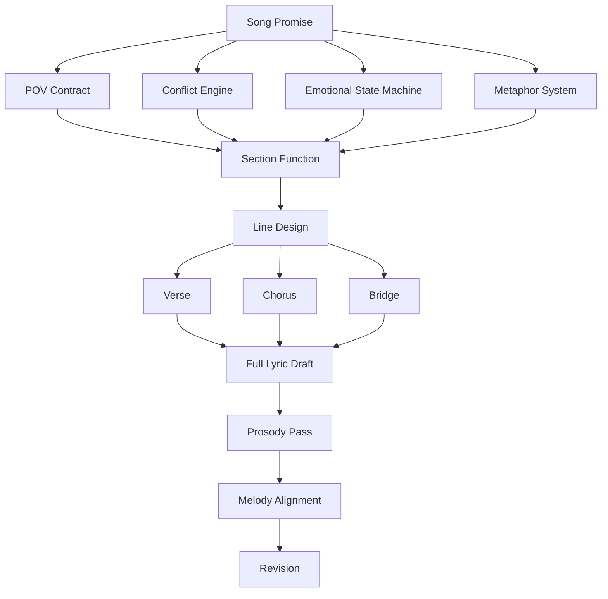
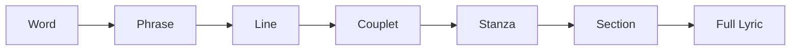
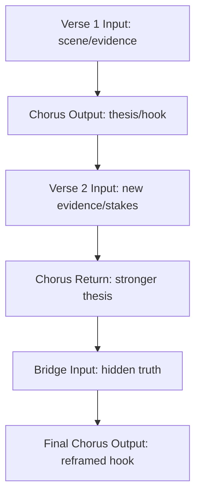
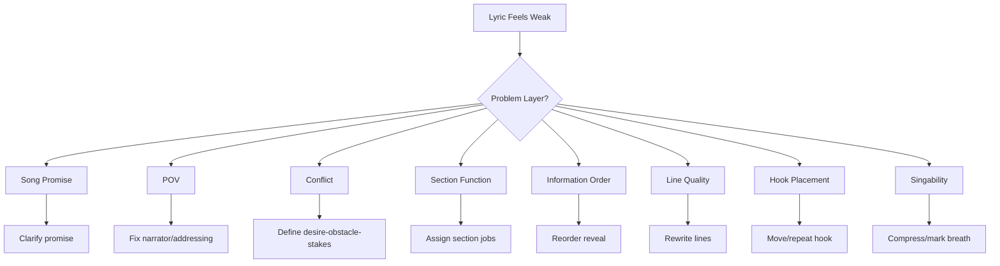

# learn-songwriting-part-013.md

# Lyric Architecture: Menyusun Baris, Bait, Section, Hook, dan Alur Informasi agar Lirik Bekerja sebagai Lagu

> Seri: `learn-songwriting`  
> Part: `013 / 034`  
> Fokus: arsitektur lirik, line design, stanza, section function, hook placement, information order, image progression, dan draft lyric sheet  
> Status seri: belum selesai  
> Prasyarat: `learn-songwriting-part-000.md` sampai `learn-songwriting-part-012.md`

---

## Ringkasan Part Ini

Part sebelumnya membahas **Metaphor System**: bagaimana membangun dunia makna yang konsisten.

Part ini membahas bagaimana semua bahan itu disusun menjadi **lirik lagu**.

Banyak penulis pemula punya bahan bagus:

- song promise kuat;
- POV jelas;
- konflik menarik;
- object writing tajam;
- metafora kuat;
- beberapa line indah.

Tetapi ketika disusun menjadi lagu, hasilnya bisa tetap lemah.

Kenapa?

Karena lirik bukan hanya kumpulan baris bagus.

Lirik adalah arsitektur.

Satu baris bisa bagus sendirian, tetapi salah tempat.  
Satu metafora bisa kuat, tetapi muncul terlalu cepat.  
Satu chorus bisa indah, tetapi tidak menjawab verse.  
Satu verse bisa puitis, tetapi tidak membawa informasi baru.  
Satu bridge bisa dalam, tetapi datang tanpa persiapan.  
Satu hook bisa memorable, tetapi terkubur di antara terlalu banyak kata.

**Lyric architecture** adalah cara menyusun:

```text
line -> phrase -> couplet -> stanza -> section -> full lyric
```

dengan mempertimbangkan:

- fungsi setiap section;
- alur informasi;
- alur emosi;
- panjang baris;
- breath;
- repetition;
- contrast;
- hook placement;
- image progression;
- rhyme placement;
- title placement;
- escalation;
- singability;
- revision.

Sebagai software engineer, pikirkan lyric architecture seperti desain modul dan flow data.

Bukan hanya:

```text
apakah fungsi ini bagus?
```

Tetapi:

```text
apakah fungsi ini berada di layer yang tepat?
apakah dependency-nya jelas?
apakah input-output tiap section cocok?
apakah data penting muncul terlalu awal/terlambat?
apakah ada duplicated logic?
apakah ada dead code?
apakah ada overengineering?
apakah ada path yang tidak dipakai?
```

Dalam lirik:

```text
apakah baris ini mendukung section?
apakah section ini mendukung song promise?
apakah chorus punya hook?
apakah verse 2 membawa perkembangan?
apakah bridge memberi turn?
apakah final chorus punya payoff?
```

---

## Tujuan Part

Setelah menyelesaikan part ini, kamu harus bisa:

1. Memahami lirik sebagai arsitektur, bukan kumpulan baris.
2. Membedakan line, phrase, couplet, stanza, verse, chorus, refrain, bridge, dan outro secara fungsional.
3. Mendesain fungsi setiap section sebelum menulis.
4. Menentukan informasi apa yang muncul di verse 1, chorus, verse 2, bridge, dan final chorus.
5. Menyusun image progression dari object/metaphor system.
6. Menempatkan hook/title agar mudah diingat.
7. Mengatur panjang baris agar lebih singable.
8. Menggunakan repetition dan variation secara sadar.
9. Membuat lyric sheet draft yang bisa direvisi.
10. Menghindari lirik yang indah tapi tidak bergerak.
11. Mendiagnosis masalah arsitektur lirik.
12. Membuat file latihan `songwriting-practice-013-lyric-architecture.md`.

---

## Prinsip Utama

```text
A lyric line is not good because it is beautiful.
A lyric line is good because it does the right job in the right place.
```

Baris ini mungkin indah:

```text
Aku adalah semesta kecil yang runtuh di bawah matamu.
```

Tetapi jika lagu adalah tentang rindu domestik lewat gelas di rak kedua, baris itu mungkin merusak world.

Baris ini lebih sederhana:

```text
Gelasmu di rak kedua.
```

Tetapi jika ditempatkan di verse 1, ia bisa membuka dunia, konflik, dan metafora dengan sangat efektif.

Dalam lirik, kualitas tidak bisa dinilai hanya per baris. Harus dilihat dari fungsi.

---

## Mental Model: Lyric as Architecture



Lyric architecture menghubungkan semua fondasi sebelumnya ke bentuk baris nyata.

---

# Bagian 1 — Unit Dasar Lirik

## 1. Word

Word adalah unit terkecil yang membawa bunyi dan makna.

Contoh:

```text
pulang
belum
masih
rumah
tuan
sayang
gelas
koper
```

Kata seperti “masih” dan “belum” sangat kuat karena membawa temporal conflict.

## 2. Phrase

Phrase adalah unit pendek yang bisa dinyanyikan sebagai satu napas kecil.

Contoh:

```text
tak kupakai
tak kubuang
kau belum selesai
rumah ini salah paham
jangan panggil ini pulang
```

Phrase sering lebih penting daripada kalimat lengkap karena lagu bergerak lewat frasa.

## 3. Line

Line adalah satu baris lirik.

Contoh:

```text
Gelasmu di rak kedua
```

Line bisa berupa kalimat lengkap atau fragmen.

## 4. Couplet

Couplet adalah dua baris yang bekerja bersama.

Contoh:

```text
Gelasmu di rak kedua
tak kupindah sejak Selasa
```

Baris pertama memberi object.  
Baris kedua memberi action/time.

## 5. Stanza

Stanza adalah kelompok baris dalam satu section.

Contoh verse 4 baris:

```text
Gelasmu di rak kedua
tak kupindah sejak Selasa
air panas tetap kusisakan
untuk pagi yang salah sangka
```

## 6. Section

Section adalah bagian lagu dengan fungsi tertentu.

Contoh:

- verse;
- pre-chorus;
- chorus;
- refrain;
- bridge;
- outro.

## 7. Full Lyric

Full lyric adalah semua section yang disusun menjadi perjalanan.

---

## Unit Hierarchy



Saat revisi, kamu bisa memilih level mana yang bermasalah:

- word choice;
- line length;
- couplet logic;
- stanza movement;
- section function;
- full lyric arc.

Jangan memperbaiki kata jika masalahnya section.

---

# Bagian 2 — Section Function Before Lines

Sebelum menulis lirik panjang, tentukan fungsi section.

Template:

```markdown
# Section Function

## Section
Verse 1 / Chorus / Verse 2 / Bridge / Final Chorus

## Job
Apa tugas bagian ini?

## Information
Informasi apa yang muncul?

## Emotion
State emosi apa?

## Image
Object/metaphor apa yang digunakan?

## Hook
Apakah hook muncul?

## Must Not Do
Apa yang tidak boleh dilakukan section ini?
```

Contoh:

```markdown
## Section
Verse 1

## Job
Membuka dunia domestik dan menunjukkan denial lewat object.

## Information
Ada gelas milik "kau" yang masih disimpan.

## Emotion
Denial waiting.

## Image
Gelas, rak kedua, air panas.

## Hook
Belum hook utama, tapi phrase "rak kedua" diperkenalkan.

## Must Not Do
Tidak menyebut "rindu", "cinta", atau menjelaskan hubungan panjang.
```

Jika fungsi section jelas, menulis line lebih mudah.

---

## Section Function Table

```markdown
| Section | Function | Information | Emotion | Image | Hook Role |
|---|---|---|---|---|---|
| Verse 1 |  |  |  |  |  |
| Chorus |  |  |  |  |  |
| Verse 2 |  |  |  |  |  |
| Bridge |  |  |  |  |  |
| Final Chorus |  |  |  |  |  |
```

Ini adalah blueprint lirik.

---

# Bagian 3 — Verse Architecture

Verse adalah tempat evidence, scene, dan information flow.

Verse biasanya menjawab:

```text
Di mana kita?
Siapa yang bicara?
Apa yang terjadi?
Apa bukti konflik?
Apa yang ditahan untuk chorus?
```

## Verse 1 Function

Verse 1 membuka dunia.

Tugas utama:

- orientasi;
- scene;
- object;
- POV;
- conflict clue;
- mood;
- setup chorus.

Verse 1 tidak harus menjelaskan semua.

Contoh weak verse:

```text
Aku sangat rindu padamu
sejak kamu pergi dariku
aku terluka dan sendiri
tanpamu hidupku sepi
```

Masalah:

- terlalu banyak label;
- tidak ada scene;
- tidak ada object;
- conflict terlalu umum;
- chorus nanti tidak punya ruang.

Contoh stronger verse:

```text
Gelasmu di rak kedua
tak kupindah sejak Selasa
air panas tetap kusisakan
untuk pagi yang salah sangka
```

Kelebihan:

- object jelas;
- time detail;
- action;
- subtext;
- tidak over-explain.

---

## Verse 1 Architecture Pattern

```text
Line 1: object/place hook
Line 2: action/time detail
Line 3: repeated behavior / conflict clue
Line 4: pivot toward chorus
```

Contoh:

```text
Gelasmu di rak kedua        <- object/place
tak kupindah sejak Selasa   <- action/time
air panas tetap kusisakan   <- repeated behavior
untuk pagi yang salah sangka <- pivot/subtext
```

---

## Verse 2 Function

Verse 2 tidak boleh hanya verse 1 dengan kata lain.

Verse 2 harus:

- menambah informasi;
- memperluas image;
- memperdalam conflict;
- menunjukkan pattern;
- menaikkan stakes;
- membawa state baru;
- menyiapkan bridge/final chorus.

Jika verse 1 adalah dapur, verse 2 bisa:

- pindah ke kamar;
- pindah ke pintu;
- pindah ke benda lain;
- menunjukkan waktu berlalu;
- menunjukkan orang lain melihat;
- menunjukkan kebiasaan makin absurd.

## Verse 2 Architecture Pattern

```text
Line 1: new object/place
Line 2: action that echoes verse 1 but escalates
Line 3: new consequence
Line 4: pivot toward chorus with more pressure
```

Contoh:

```text
Bantalmu tak lagi berbentuk
tapi tetap kubalik pagi
lampu kamar menyala dulu
sebelum aku berani sepi
```

Verse 2 membawa world dari dapur ke kamar dan memperdalam rutinitas.

---

## Verse 1 vs Verse 2 Comparison

| Elemen | Verse 1 | Verse 2 |
|---|---|---|
| Function | setup | development |
| Information | masalah pertama | pattern/stakes |
| Image | object utama | object baru/reframed |
| Emotion | initial state | deeper state |
| Relation to chorus | prepares first hook | makes hook heavier |
| Risk | too much explanation | repeating verse 1 |

---

# Bagian 4 — Chorus Architecture

Chorus adalah pusat memori.

Chorus biasanya melakukan:

- emotional thesis;
- hook;
- title placement;
- repetition;
- release;
- summary;
- confession/accusation/question.

Chorus harus lebih mudah diingat daripada verse.

## Chorus Architecture Pattern

```text
Line 1: hook/title or strong opening
Line 2: expansion/repetition
Line 3: emotional thesis or image
Line 4: hook/title return or payoff
```

Contoh:

```text
Tak kupakai
tak kubuang

kau belum selesai
di rumah yang kupanggil pulang
```

Atau versi 4 baris:

```text
Tak kupakai, tak kubuang
gelasmu di rak kedua
kau belum selesai
di rumah yang pura-pura lupa
```

## Chorus Design Questions

```text
Apa yang harus pendengar ingat?
Apakah title muncul?
Apakah hook terlalu panjang?
Apakah chorus terlalu banyak informasi?
Apakah chorus bisa dinyanyikan dua kali?
Apakah chorus berbeda dari verse?
Apakah chorus menjawab verse?
Apakah chorus punya emotional release?
```

---

## Chorus Failure Modes

| Failure | Gejala | Solusi |
|---|---|---|
| Too much information | chorus seperti verse baru | kurangi ke satu thesis |
| No hook | tidak ada yang diingat | buat phrase 3–7 kata |
| Hook buried | hook terkubur di tengah line panjang | letakkan awal/akhir |
| Too abstract | tidak ngena | tambah object/action |
| Too similar to verse | tidak terasa chorus | ubah rhythm/repetition |
| No title | sulit diingat | masukkan title/hook |
| Too long | sulit repeat | potong 20–40% |

---

# Bagian 5 — Pre-Chorus Architecture

Pre-chorus optional.

Pre-chorus berguna jika verse butuh lift menuju chorus.

Function:

```text
Verse = evidence
Pre-chorus = pressure
Chorus = release/thesis
```

## Pre-Chorus Pattern

```text
Line 1: pressure increases
Line 2: contradiction becomes harder to hide
Line 3: melodic/lyric lift
Line 4: unresolved lead into chorus
```

Contoh:

```text
Tiap pagi aku hampir jujur
lalu sendok jatuh lebih dulu
namamu tinggal satu napas
sebelum kutukar jadi lagu
```

Pre-chorus menahan confession sebelum chorus.

## Kapan Tidak Perlu Pre-Chorus?

Tidak perlu jika:

- verse sudah langsung menuju chorus;
- lagu ingin sederhana;
- chorus sudah kuat;
- pre-chorus hanya mengulang;
- form jadi terlalu panjang;
- MVS lebih baik dibuat ringkas.

Untuk lagu pertama, pre-chorus optional. Jangan dipaksa.

---

# Bagian 6 — Bridge Architecture

Bridge adalah turn.

Bridge harus memberi:

- reveal;
- perspective shift;
- deeper conflict;
- emotional turn;
- metaphor reframe;
- POV shift;
- moral/identity insight.

Bridge bukan tempat membuang line sisa.

## Bridge Pattern

```text
Line 1: break from previous pattern
Line 2: reveal or contradiction
Line 3: deeper truth
Line 4: setup final chorus
```

Contoh:

```text
Baru kusadar
bukan gelasmu
yang paling lama
kutunda
```

Atau lebih panjang:

```text
Baru kusadar
bukan kau yang kujaga
di pintu itu

aku hanya takut
rumah ini tahu
aku sendiri
```

## Bridge Questions

```text
Apa yang berubah setelah bridge?
Apakah final chorus punya makna baru?
Apakah bridge membuka truth yang belum dikatakan?
Apakah bridge masih dalam metaphor system?
Apakah bridge terlalu menjelaskan?
Apakah bridge perlu ada?
```

Jika bridge tidak mengubah final chorus, bridge mungkin tidak perlu.

---

# Bagian 7 — Refrain Architecture

Refrain adalah baris/frasa berulang, sering di akhir verse.

Contoh:

```text
dan gelasmu tetap di rak kedua
```

Refrain cocok jika lagu lebih storytelling atau ingin chorus minimal.

## Refrain Pattern

```text
Verse 1 detail
Refrain line
Verse 2 detail
Same refrain line, new meaning
Verse 3/bridge detail
Same refrain line, deeper meaning
```

Kekuatan refrain:

- sederhana;
- memorable;
- dapat berubah makna karena konteks.

Risiko:

- jika konteks tidak berkembang, refrain terasa monoton.

## Refrain vs Chorus

| Refrain | Chorus |
|---|---|
| 1–2 baris | section penuh |
| sering di akhir verse | biasanya section terpisah |
| subtle | lebih besar |
| cocok storytelling | cocok pop/ballad |
| makna berubah lewat context | hook kuat lewat repetition |

---

# Bagian 8 — Line Architecture

Line adalah unit yang harus punya tugas.

Setiap line idealnya melakukan minimal satu fungsi:

- memberi object;
- memberi action;
- memberi time;
- memberi conflict;
- memberi hook;
- memberi transition;
- memberi image;
- memberi reveal;
- memberi contrast;
- memberi breath;
- memberi rhyme/sound;
- memberi emotional pressure.

## Line Function Labeling

Ambil draft dan label setiap line.

Contoh:

```text
Gelasmu di rak kedua        [object + place]
tak kupindah sejak Selasa   [action + time]
air panas tetap kusisakan   [habit + evidence]
untuk pagi yang salah sangka [personification + subtext]
```

Jika line tidak punya fungsi, pertimbangkan cut.

## Dead Line

Dead line adalah baris yang terdengar bagus tapi tidak melakukan pekerjaan.

Contoh:

```text
Di bawah langit yang merona
```

Jika lagu tidak butuh langit/senja, ini dead line.

Dalam engineering:

```text
dead code
```

Dalam lirik:

```text
dead line
```

---

## Line Function Audit Template

```markdown
# Line Function Audit

| Line | Function | Keep / Cut / Revise |
|---|---|---|
|  |  |  |
```

Pertanyaan:

```text
Apa fungsi line ini?
Apakah fungsi itu sudah dilakukan line lain?
Apakah line ini mendukung section?
Apakah line ini mendukung promise?
Apakah line ini singable?
```

---

# Bagian 9 — Couplet Architecture

Couplet adalah dua baris yang saling mengunci.

## Pattern 1: Object + Action

```text
Gelasmu di rak kedua
tak kupindah sejak Selasa
```

## Pattern 2: Claim + Contradiction

```text
Aku tidak menunggu
pintu kubuka sedikit
```

## Pattern 3: Image + Subtext

```text
Kursimu menghadap jendela
lebih sabar dari mulutku
```

## Pattern 4: Setup + Turn

```text
Kopermu beroda sutra
meja kami pincang sebelah
```

## Pattern 5: Question + Image

```text
Pulang ke siapa
jika rumah hanya jadi panggung?
```

Couplet membantu line tidak berdiri sendiri.

---

## Couplet Debug

Jika dua baris terasa tidak nyambung:

```text
Apakah baris 2 menjawab/mengubah/memperdalam baris 1?
Apakah baris 2 hanya mengulang?
Apakah baris 2 melompat ke domain lain?
Apakah ada hubungan bunyi?
Apakah ada hubungan makna?
```

---

# Bagian 10 — Stanza Architecture

Stanza adalah mini-journey.

Verse 4 baris idealnya punya movement kecil.

## 4-Line Stanza Pattern

```text
Line 1: image/object
Line 2: action/time
Line 3: complication
Line 4: pivot/payoff
```

Contoh:

```text
Gelasmu di rak kedua        <- image
tak kupindah sejak Selasa   <- action/time
air panas tetap kusisakan   <- complication/habit
untuk pagi yang salah sangka <- pivot
```

## 6-Line Stanza Pattern

```text
Line 1–2: scene
Line 3–4: development
Line 5–6: pivot toward hook
```

Contoh:

```text
Gelasmu di rak kedua
tak kupindah sejak Selasa

air panas tetap kusisakan
sendok kecil masih di sana

kalau ini bukan menunggu
mengapa pagi kubagi dua?
```

6-line stanza memberi ruang lebih, tapi bisa lebih sulit dinyanyikan.

---

# Bagian 11 — Information Order

Urutan informasi sangat penting.

## Bad Order

```text
Aku belum bisa melepasmu
karena gelasmu masih di rak kedua
dan kamu pergi sejak Selasa
```

Terlalu cepat menjelaskan.

## Stronger Order

```text
Gelasmu di rak kedua
tak kupindah sejak Selasa
air panas tetap kusisakan
untuk pagi yang salah sangka
```

Pendengar menemukan subtext.

## General Rule

```text
Evidence before explanation.
Image before thesis.
Tension before release.
Question before answer.
```

Chorus boleh menjadi thesis setelah verse memberi evidence.

---

## Information Flow Template

```markdown
# Information Flow

## What listener knows in Verse 1
...

## What listener understands in Chorus
...

## What becomes deeper in Verse 2
...

## What is revealed in Bridge
...

## What final chorus means now
...
```

---

# Bagian 12 — Image Progression

Image progression adalah cara gambar berkembang antar-section.

## Weak Image Progression

Verse 1:

```text
gelas
```

Verse 2:

```text
gelas lagi dengan makna sama
```

Bridge:

```text
gelas lagi dengan makna sama
```

Stagnan.

## Stronger Image Progression

Verse 1:

```text
gelas di rak
```

Verse 2:

```text
kursi/kamar/lampu
```

Bridge:

```text
rak menjadi metafora diri
```

Final:

```text
hook/action kembali
```

Image berkembang dari object ke system ke self-revelation.

## Image Progression Table

```markdown
| Section | Image | Meaning | Development |
|---|---|---|---|
| Verse 1 |  |  |  |
| Chorus |  |  |  |
| Verse 2 |  |  |  |
| Bridge |  |  |  |
| Final Chorus |  |  |  |
```

---

# Bagian 13 — Hook Placement

Hook harus ditempatkan strategis.

Tempat umum:

- line pertama chorus;
- line terakhir chorus;
- line pertama dan terakhir chorus;
- akhir verse sebagai refrain;
- pre-chorus final line;
- bridge final line sebelum chorus;
- outro final line.

## Hook Placement Options

### Option A: First Line Chorus

```text
Tak kupakai, tak kubuang
...
```

Efek:

- langsung memorable;
- chorus punya identitas kuat.

### Option B: Last Line Chorus

```text
...
tak kupakai, tak kubuang
```

Efek:

- payoff;
- hook terasa seperti conclusion.

### Option C: First and Last Line

```text
Tak kupakai, tak kubuang
...
tak kupakai, tak kubuang
```

Efek:

- repetition kuat;
- cocok hook pendek.

### Option D: Refrain at End of Verse

```text
...
dan gelasmu tetap di rak kedua
```

Efek:

- subtle;
- meaning berubah setiap verse.

## Hook Placement Test

```text
Apakah hook terlalu telat?
Apakah hook mudah ditemukan?
Apakah hook muncul cukup sering?
Apakah hook overused?
Apakah hook punya ruang sebelum/sesudahnya?
Apakah melody akan memberi spotlight?
```

---

# Bagian 14 — Title Placement

Title dan hook sering sama, tapi tidak selalu.

Judul bisa:

- muncul di chorus;
- muncul sebagai final line;
- muncul hanya sekali;
- tidak muncul literal;
- muncul dalam variasi.

Untuk 20 jam pertama, lebih aman jika title muncul literal minimal sekali di chorus/refrain.

## Title Placement Map

```markdown
# Title Placement

## Working Title
...

## Appears in
- Verse 1:
- Chorus:
- Verse 2:
- Bridge:
- Final Chorus:
- Outro:

## First appearance
...

## Most important appearance
...

## Final meaning
...
```

Contoh:

```markdown
Title:
Rak Kedua

First appearance:
Verse 1 line 1

Most important:
Bridge/final chorus

Final meaning:
bukan hanya tempat gelas, tapi tempat narator menunda dirinya
```

---

# Bagian 15 — Repetition and Variation in Lyrics

Lirik butuh repetition agar diingat.

Tapi repetition harus punya variation agar tidak membosankan.

## Repetition Types

- exact repetition;
- phrase repetition;
- syntactic repetition;
- image repetition;
- sound repetition;
- title repetition;
- pronoun repetition;
- emotional repetition with new detail.

## Example Exact Repetition

```text
tak kupakai
tak kubuang
```

## Example Variation

Chorus 1:

```text
tak kupakai, tak kubuang
gelasmu di rak kedua
```

Final chorus:

```text
tak kupakai, tak kubuang
diriku di rak kedua
```

Small change, big meaning.

## Repetition Audit

```markdown
# Repetition Audit

| Repeated Element | Where | Function | Too much? |
|---|---|---|---|
|  |  |  |  |
```

---

# Bagian 16 — Contrast Between Sections

Verse dan chorus harus berbeda.

Perbedaan bisa lewat:

- lyric density;
- line length;
- repetition;
- abstraction level;
- image vs thesis;
- pronoun directness;
- rhythm;
- melody;
- rhyme pattern;
- emotional state.

## Contrast Table

```markdown
| Dimension | Verse | Chorus |
|---|---|---|
| Function | evidence | thesis/hook |
| Language | concrete detail | compressed phrase |
| Line length | varied | shorter/repetitive |
| Image | specific scene | central symbol |
| Emotion | restrained | more direct |
| Pronoun | indirect | direct |
| Repetition | low | high |
```

Jika chorus terasa seperti verse, tingkatkan contrast.

---

# Bagian 17 — Lyric Density

Density adalah kepadatan informasi/gambar/metafora per baris.

## High Density

```text
Baru kusadar di rak kedua bukan gelasmu yang paling lama kutunda
```

Banyak makna, tapi mungkin terlalu panjang.

## Better Line Break

```text
Baru kusadar
di rak kedua

bukan gelasmu
yang paling lama
kutunda
```

Density tetap ada, tapi lebih bernapas.

## Density Control

Verse boleh lebih detail.

Chorus harus lebih compact.

Bridge boleh lebih dense secara makna, tapi harus diberi ruang.

## Density Questions

```text
Apakah terlalu banyak ide dalam satu line?
Apakah line perlu dipecah?
Apakah ada kata yang bisa dibuang?
Apakah listener bisa menangkap saat dinyanyikan?
Apakah satu section terlalu penuh image?
```

---

# Bagian 18 — Line Length and Breath

Lirik harus bisa dinyanyikan.

Line terlalu panjang membuat melodi sulit.

## Long Line

```text
Aku masih menyimpan semua barang-barangmu di dalam rumah ini karena aku belum bisa menerima kenyataan bahwa kau pergi.
```

## Compressed

```text
Barangmu masih di rumah
karena pergi
belum pandai kuterima
```

Atau lebih object-driven:

```text
Gelasmu di rak kedua
pergimu belum kupindah
```

## Breath Marking

Tandai napas:

```text
Gelasmu di rak kedua /
tak kupindah sejak Selasa //

air panas tetap kusisakan /
untuk pagi yang salah sangka //
```

Napas membantu melody nanti.

## Breath Rule

```text
If you cannot speak it naturally in one breath,
it may be hard to sing.
```

Akan dibahas lebih dalam di part 016, tapi mulai biasakan dari sini.

---

# Bagian 19 — Rhyme Placement in Architecture

Rima bukan hiasan. Rima membantu struktur.

Rima bisa berada di:

- akhir baris;
- internal;
- near-rhyme;
- vowel repetition;
- consonance;
- repeated phrase.

## End Rhyme Example

```text
Gelasmu di rak kedua
tak kupindah sejak Selasa
```

`kedua` / `Selasa` bukan perfect rhyme, tapi vowel terbuka membuat hubungan bunyi.

## Internal Sound

```text
tak kupakai, tak kubuang
```

Repetition “tak ku-” lebih penting daripada rhyme.

## Rhyme Architecture

Verse bisa memakai rhyme lebih longgar.

Chorus bisa memakai repetition lebih kuat.

Jangan memaksa rima sampai mengorbankan meaning.

Akan dibahas lebih dalam di part 015.

---

# Bagian 20 — Drafting from Architecture

Jangan mulai dari halaman kosong. Mulai dari blueprint.

## Step 1: Section Function Table

```markdown
| Section | Function | Image | Hook |
|---|---|---|---|
| Verse 1 | setup denial | gelas/rak | rak kedua |
| Chorus | confession contradiction | pakai/buang | tak kupakai, tak kubuang |
| Verse 2 | develop ritual | kamar/lampu | belum selesai |
| Bridge | reframe | rak/diri | bukan gelasmu |
| Final Chorus | payoff | diri/rak | tak kupakai, tak kubuang |
```

## Step 2: Write Seed Lines

```markdown
Verse 1 seed:
Gelasmu di rak kedua

Chorus seed:
Tak kupakai, tak kubuang

Verse 2 seed:
Lampu kamarmu menyala dulu

Bridge seed:
Bukan gelasmu yang kutunda
```

## Step 3: Expand Section

Tulis 4–6 baris per section.

## Step 4: Compress

Potong 20–30%.

## Step 5: Mark Hook and Breath

Tandai bagian yang harus diberi melodi kuat.

---

# Bagian 21 — Lyric Sheet Format

Gunakan format lyric sheet yang rapi.

```markdown
# <Title> - Lyric Sheet

## Metadata
Title:
Version:
Date:
Song Promise:
POV:
Key/Tempo Feel:
Structure:
Hook:
Metaphor System:

---

## Structure Map
Verse 1:
Chorus:
Verse 2:
Bridge:
Final Chorus:

---

## Lyrics

### Verse 1
...

### Chorus
...

### Verse 2
...

### Chorus
...

### Bridge
...

### Final Chorus
...

### Outro
...

---

## Notes
Strong lines:
Weak lines:
Too long:
Forced:
Need melody:
Need revision:
```

Lyric sheet bukan final poem. Ini working document.

---

# Bagian 22 — Versioned Lyric Drafts

Gunakan versi.

```text
song-title-v001-architecture.md
song-title-v002-verse-chorus.md
song-title-v003-prosody.md
song-title-v004-melody-fit.md
```

## Version Focus

| Version | Focus |
|---|---|
| v001 | architecture and section function |
| v002 | rough lyric draft |
| v003 | line compression |
| v004 | prosody and singability |
| v005 | melody alignment |
| v006 | feedback revision |
| v007 | MVS lyric sheet |

Jangan mencoba menyelesaikan semua di v001.

---

# Bagian 23 — Lyric Architecture as Data Flow

Sebagai software engineer, pikirkan full lyric seperti data flow.



Jika verse 1 tidak memberi input yang cukup, chorus tidak punya output meaningful.

Jika verse 2 tidak memberi new evidence, chorus kedua tidak bertambah makna.

Jika bridge tidak memberi hidden truth, final chorus copy-paste.

---

# Bagian 24 — Information Budget

Setiap section punya budget informasi.

Jangan taruh semua informasi di verse 1.

## Information Budget Example

| Section | Information Budget |
|---|---|
| Verse 1 | ada benda yang tidak dipindah |
| Chorus | narator belum selesai |
| Verse 2 | kebiasaan itu menyebar |
| Bridge | yang ditunggu bukan hanya orangnya |
| Final Chorus | hook menjadi self-recognition |

Jika verse 1 sudah menjelaskan semua:

```text
Aku belum bisa melepasmu karena sebenarnya aku takut tanpa menunggu aku kehilangan identitas...
```

Bridge kehilangan tugas.

---

## Information Budget Template

```markdown
# Information Budget

## Verse 1 may reveal
-

## Chorus may reveal
-

## Verse 2 may reveal
-

## Bridge may reveal
-

## Final chorus may reveal
-

## Must not reveal too early
-
```

---

# Bagian 25 — The “One Job Per Line” Rule

Untuk draft awal:

```text
one line = one main job
```

Contoh line dengan terlalu banyak job:

```text
Gelasmu yang retak di rak kedua sejak Selasa membuatku sadar aku belum bisa menerima kau pergi dan aku masih menunggu.
```

Terlalu banyak.

Break into jobs:

```text
Gelasmu di rak kedua          [object/place]
retaknya menghadap pagi       [visual/detail]
tak kupindah sejak Selasa     [action/time]
pergimu belum kupahami        [emotional thesis maybe too direct]
```

Atau lebih subtle:

```text
Gelasmu di rak kedua
retaknya menghadap pagi
tak kupindah sejak Selasa
seperti pergi bisa kembali
```

---

# Bagian 26 — Cutting and Moving Lines

Baris bagus yang salah tempat harus dipindah, bukan selalu dibuang.

## Example

Line:

```text
Bukan gelasmu yang paling lama kutunda.
```

Jika muncul di verse 1, terlalu cepat. Cocok di bridge.

Line:

```text
Gelasmu di rak kedua.
```

Jika muncul di bridge untuk pertama kali, terlalu terlambat. Cocok di verse 1.

## Line Placement Audit

```markdown
# Line Placement Audit

| Line | Current Place | Best Place | Reason |
|---|---|---|---|
|  |  |  |  |
```

Pertanyaan:

```text
Apakah line ini setup, thesis, development, turn, atau payoff?
```

Tempatkan sesuai fungsi.

---

# Bagian 27 — Lyric Architecture Anti-Patterns

## Anti-Pattern 1: Baris Bagus Bertumpuk

Gejala:

```text
setiap baris mencoba menjadi punchline.
```

Risiko:

- lagu melelahkan;
- tidak ada hierarchy;
- hook tidak menonjol.

Solusi:

```text
beri ruang. Tidak semua line harus paling kuat.
```

## Anti-Pattern 2: Verse Menjelaskan Semua

Gejala:

```text
verse 1 seperti sinopsis.
```

Solusi:

```text
mulai dari evidence. Simpan truth untuk chorus/bridge.
```

## Anti-Pattern 3: Chorus Tidak Punya Hook

Gejala:

```text
chorus indah tapi tidak bisa diingat.
```

Solusi:

```text
buat hook phrase pendek dan ulang.
```

## Anti-Pattern 4: Verse 2 Mengulang Verse 1

Gejala:

```text
hanya ganti kata, informasi sama.
```

Solusi:

```text
pindah object/place/state/stakes.
```

## Anti-Pattern 5: Bridge Tempelan

Gejala:

```text
bridge bisa dihapus tanpa mengubah final chorus.
```

Solusi:

```text
beri turn atau hapus.
```

## Anti-Pattern 6: Information Dump

Gejala:

```text
terlalu banyak background.
```

Solusi:

```text
pilih informasi yang punya emotional function.
```

## Anti-Pattern 7: Hook Terlalu Telat

Gejala:

```text
pendengar harus menunggu lama untuk pusat lagu.
```

Solusi:

```text
munculkan title/hook lebih awal.
```

## Anti-Pattern 8: Section Tidak Kontras

Gejala:

```text
verse, chorus, bridge terasa sama.
```

Solusi:

```text
ubah density, repetition, line length, directness.
```

## Anti-Pattern 9: Dead Lines

Gejala:

```text
baris indah tapi tidak punya fungsi.
```

Solusi:

```text
cut, move, atau rewrite.
```

## Anti-Pattern 10: Too Much Architecture, No Feeling

Gejala:

```text
lirik rapi tapi steril.
```

Solusi:

```text
lindungi line yang hidup. Architecture harus mendukung emosi, bukan menggantikannya.
```

---

# Bagian 28 — Lyric Debugging

Jika lirik terasa lemah, cari layer masalahnya.



## Debug Questions

```text
Apakah section ini punya fungsi?
Apakah line ini punya fungsi?
Apakah verse 1 memberi evidence?
Apakah chorus memberi hook/thesis?
Apakah verse 2 menambah informasi?
Apakah bridge memberi turn?
Apakah final chorus punya payoff?
Apakah informasi terlalu cepat muncul?
Apakah hook terlihat dan terdengar?
Apakah line terlalu panjang untuk dinyanyikan?
Apakah ada dead line?
```

---

# Bagian 29 — Lyric Architecture Template

Gunakan template ini sebelum menulis full draft.

```markdown
# Lyric Architecture Map

## Song Title
...

## Song Promise
...

## POV
Narrator:
Addressee:
Mask:
Truth:

## Core Conflict
Narator ingin:
Tetapi:
Karena:

## Emotional State Machine
Start:
Chorus state:
Verse 2 state:
Bridge turn:
Final state:

## Metaphor System
Primary domain:
Main symbol:
Hook metaphor:
Forbidden domains:

## Structure
- [ ] V1
- [ ] Pre
- [ ] Chorus
- [ ] V2
- [ ] Bridge
- [ ] Final Chorus
- [ ] Outro

## Section Function Table

| Section | Function | Information | Emotion | Image | Hook Role |
|---|---|---|---|---|---|
| Verse 1 |  |  |  |  |  |
| Pre-Chorus |  |  |  |  |  |
| Chorus |  |  |  |  |  |
| Verse 2 |  |  |  |  |  |
| Bridge |  |  |  |  |  |
| Final Chorus |  |  |  |  |  |

## Information Budget
Verse 1 may reveal:
Chorus may reveal:
Verse 2 may reveal:
Bridge may reveal:
Final chorus may reveal:
Must not reveal too early:

## Image Progression
Verse 1:
Chorus:
Verse 2:
Bridge:
Final Chorus:

## Hook Placement
Hook:
First appearance:
Repeated where:
Final variation:

## Title Placement
Title:
Appears:
Final meaning:

## Line Seeds
Verse 1:
Chorus:
Verse 2:
Bridge:
Final Chorus:

## Draft Lyrics

### Verse 1
...

### Pre-Chorus
...

### Chorus
...

### Verse 2
...

### Chorus
...

### Bridge
...

### Final Chorus
...

### Outro
...

## Line Function Audit
| Line | Function | Issue |
|---|---|---|
|  |  |  |

## Revision Notes
Strong lines:
Weak lines:
Lines to move:
Lines to cut:
Lines too long:
Hook issue:
Next action:
```

---

# Bagian 30 — Contoh Lyric Architecture: Rindu Domestik

## Song Promise

```text
Rindu yang disangkal melalui benda rumah dari POV orang yang ditinggalkan.
```

## Structure

```text
Verse 1
Chorus
Verse 2
Chorus
Bridge
Final Chorus
```

## Section Function Table

| Section | Function | Information | Emotion | Image | Hook Role |
|---|---|---|---|---|---|
| Verse 1 | setup denial | gelas masih di rak | restrained denial | gelas/rak/air | introduce object |
| Chorus | confession contradiction | belum dipakai/dibuang | confession | action hook | main hook |
| Verse 2 | develop ritual | rumah ikut menunggu | habit/deeper denial | kamar/lampu/kursi | hook returns heavier |
| Bridge | reframe | yang ditunda adalah diri | realization | rak/diri | prepare final meaning |
| Final Chorus | payoff | hook becomes self-recognition | fragile acceptance | rak/diri | final hook |

## Information Budget

```markdown
Verse 1:
ada gelas yang tidak dipindah.

Chorus:
narator belum bisa memilih: pakai/buang.

Verse 2:
rutinitas menunggu menyebar ke rumah.

Bridge:
yang ditunda bukan hanya benda, tetapi diri.

Final Chorus:
hook kembali sebagai pengakuan.
```

## Draft Lyric Seed

```markdown
### Verse 1
Gelasmu di rak kedua
tak kupindah sejak Selasa
air panas tetap kusisakan
untuk pagi yang salah sangka

### Chorus
Tak kupakai
tak kubuang

kau belum selesai
di rumah yang kupanggil pulang

### Verse 2
Kursimu menghadap jendela
lebih sabar dari mulutku
lampu kamar menyala dulu
sebelum aku berani sepi

### Chorus
Tak kupakai
tak kubuang

kau belum selesai
di rumah yang kupanggil pulang

### Bridge
Baru kusadar
di rak kedua

bukan gelasmu
yang paling lama
kutunda

### Final Chorus
Tak kupakai
tak kubuang

aku belum selesai
di rumah yang kupanggil pulang
```

Catatan: ini belum final, tapi architecture bekerja.

---

# Bagian 31 — Contoh Lyric Architecture: Romansa Satir Bandara

## Song Promise

```text
Kemarahan sosial yang disamarkan sebagai romansa tragis melalui kekasih berkopor yang terus pergi meninggalkan rumah retak.
```

## Structure

```text
Verse 1
Chorus
Verse 2
Chorus
Bridge
Final Chorus
Outro
```

## Section Function Table

| Section | Function | Information | Emotion | Image | Hook Role |
|---|---|---|---|---|---|
| Verse 1 | surface romance | kekasih pergi lagi | tender irony | koper/bandara | introduce departure |
| Chorus | expose contradiction | pulang bukan hadir | irony/accusation | pulang/panggung | hook |
| Verse 2 | reveal stakes | rumah/meja terdampak | accusation | meja/piring/lampu | deepen conflict |
| Bridge | grief under satire | rumah lelah jadi panggung | grief | rumah/panggung | turn |
| Final Chorus | bitter clarity | sayang -> tuan | accusation | pulang/panggung | reframe hook |

## Draft Lyric Seed

```markdown
### Verse 1
Sayang, kopermu siap lagi
licin di lantai bandara
kau cium anak-anak di dahi
seperti pamit bisa jadi doa

### Chorus
Jangan panggil ini pulang
jika rumah hanya kau singgahi
sebagai panggung

kopermu lebih setia
dari tanganmu sendiri

### Verse 2
Meja makan pincang sebelah
piring kecil belajar diam
lampu depan tetap menyala
bukan berharap, hanya bersaksi

### Chorus
Jangan panggil ini pulang
jika rumah hanya kau singgahi
sebagai panggung

kopermu lebih setia
dari tanganmu sendiri

### Bridge
Aku lelah jadi alamat
untuk tepuk tanganmu
yang datang sebentar

rumah bukan bandara
yang tugasnya
membenarkan pergi

### Final Chorus
Tuan, jangan panggil ini pulang
jika rumah hanya kau datangi
sebagai panggung

kopermu lebih setia
dari sumpahmu sendiri
```

Architecture-nya menjaga kritik tetap metaforis.

---

# Bagian 32 — Latihan Utama Part 013

Buat file:

```text
songwriting-practice-013-lyric-architecture.md
```

Isi template berikut.

```markdown
# songwriting-practice-013-lyric-architecture.md

## 1. Song Title
...

## 2. Song Promise
...

## 3. POV Summary
Narrator:
Addressee:
Mask:
Truth:

## 4. Core Conflict
Narator ingin:
Tetapi:
Karena:

## 5. Emotional State Machine
Start:
Chorus state:
Verse 2 state:
Bridge turn:
Final state:

## 6. Metaphor System
Primary domain:
Main symbol:
Hook metaphor:
Forbidden domains:

## 7. Structure Choice
Pilih struktur:

- [ ] Verse - Chorus - Verse - Chorus
- [ ] Verse - Chorus - Verse - Chorus - Bridge - Final Chorus
- [ ] Verse - Pre - Chorus - Verse - Pre - Chorus - Bridge - Final Chorus
- [ ] Verse - Refrain - Verse - Refrain
- [ ] Other:

Kenapa:
...

## 8. Section Function Table

| Section | Function | Information | Emotion | Image | Hook Role |
|---|---|---|---|---|---|
| Verse 1 |  |  |  |  |  |
| Pre-Chorus optional |  |  |  |  |  |
| Chorus |  |  |  |  |  |
| Verse 2 |  |  |  |  |  |
| Bridge optional |  |  |  |  |  |
| Final Chorus |  |  |  |  |  |
| Outro optional |  |  |  |  |  |

## 9. Information Budget
Verse 1 may reveal:
Chorus may reveal:
Verse 2 may reveal:
Bridge may reveal:
Final chorus may reveal:
Must not reveal too early:

## 10. Image Progression

| Section | Image | Meaning | Development |
|---|---|---|---|
| Verse 1 |  |  |  |
| Chorus |  |  |  |
| Verse 2 |  |  |  |
| Bridge |  |  |  |
| Final Chorus |  |  |  |

## 11. Hook Placement
Hook:
First appearance:
Repeated where:
Final variation:

## 12. Title Placement
Title:
Appears:
Final meaning:

## 13. Line Seeds
Verse 1 seed:
Chorus seed:
Verse 2 seed:
Bridge seed:
Final chorus seed:

## 14. Draft Lyrics v0.1

### Verse 1
...

### Pre-Chorus
...

### Chorus
...

### Verse 2
...

### Chorus
...

### Bridge
...

### Final Chorus
...

### Outro
...

## 15. Breath / Phrase Marks
Tandai bagian yang perlu napas:
...

## 16. Line Function Audit

| Line | Function | Keep / Cut / Revise |
|---|---|---|
|  |  |  |

## 17. Architecture Diagnosis
Strongest section:
Weakest section:
Hook issue:
Verse 2 issue:
Bridge issue:
Information order issue:
Line length issue:

## 18. Revision Plan
Next version focus:
Changes:
What to protect:
What to cut:
What to test with melody:

## 19. Next Action
...
```

---

# Latihan 30 Menit: Section Function First

Jangan menulis lirik dulu.

Dalam 30 menit, isi:

- structure choice;
- section function table;
- information budget;
- image progression;
- hook placement.

Output:

```markdown
Ready to draft? yes/no
Biggest risk:
Next action:
```

---

# Latihan 45 Menit: Write v0.1 from Blueprint

Gunakan blueprint.

Waktu:

```text
5 menit: review section function
10 menit: verse 1
10 menit: chorus
10 menit: verse 2
5 menit: bridge/final chorus seed
5 menit: mark weak lines
```

Aturan:

- jangan perfeksionis;
- tulis draft kasar;
- line boleh jelek;
- architecture lebih penting dari polish.

---

# Latihan 60 Menit: Architecture Revision

Ambil draft v0.1.

Lakukan:

1. label fungsi setiap line;
2. tandai dead line;
3. tandai line terlalu panjang;
4. cek hook placement;
5. cek verse 2 development;
6. cek bridge turn;
7. pindahkan/cut line;
8. buat v0.2.

Template:

```markdown
## v0.1 Diagnosis
...

## Lines to keep
...

## Lines to cut
...

## Lines to move
...

## Lines to compress
...

## v0.2 Draft
...
```

---

# Checklist Part 013

Sebelum lanjut ke part 014, pastikan:

- [ ] Kamu memahami lirik sebagai architecture, bukan kumpulan baris.
- [ ] Kamu punya structure choice.
- [ ] Kamu punya section function table.
- [ ] Kamu punya information budget.
- [ ] Kamu punya image progression.
- [ ] Kamu punya hook placement.
- [ ] Kamu punya title placement.
- [ ] Kamu punya line seeds untuk tiap section.
- [ ] Kamu sudah menulis draft lyric v0.1.
- [ ] Kamu sudah menandai breath/phrase awal.
- [ ] Kamu sudah melakukan line function audit.
- [ ] Kamu tahu strongest dan weakest section.
- [ ] Kamu punya revision plan menuju v0.2.
- [ ] Kamu punya next action menuju natural Indonesian lyric flow.

---

# Output Wajib Part 013

Buat file:

```text
songwriting-practice-013-lyric-architecture.md
```

Isi minimal:

```markdown
# songwriting-practice-013-lyric-architecture.md

## Song Title
...

## Song Promise
...

## POV Summary
...

## Core Conflict
...

## Emotional State Machine
...

## Metaphor System
...

## Structure Choice
...

## Section Function Table
...

## Information Budget
...

## Image Progression
...

## Hook Placement
...

## Draft Lyrics v0.1
...

## Line Function Audit
...

## Architecture Diagnosis
...

## Revision Plan
...

## Next Action
...
```

---

# Common Failure Modes di Part Ini

## 1. Menulis Baris Bagus tanpa Section Function

Gejala:

```text
banyak line indah, tapi lagu tidak bergerak.
```

Solusi:

```text
tulis section function table dulu.
```

## 2. Verse 1 Terlalu Menjelaskan

Gejala:

```text
semua backstory muncul di awal.
```

Solusi:

```text
mulai dari object/evidence. Simpan truth untuk chorus/bridge.
```

## 3. Chorus Tanpa Hook

Gejala:

```text
chorus terasa seperti paragraph indah.
```

Solusi:

```text
gunakan hook pendek, repetition, title placement.
```

## 4. Verse 2 Hanya Sinonim Verse 1

Gejala:

```text
informasi sama, object sama, state sama.
```

Solusi:

```text
ubah place/object/stakes/state.
```

## 5. Bridge Tidak Memberi Turn

Gejala:

```text
final chorus tetap sama maknanya.
```

Solusi:

```text
bridge harus reframe conflict/metaphor/POV.
```

## 6. Information Order Salah

Gejala:

```text
reveal besar terlalu cepat atau terlalu terlambat.
```

Solusi:

```text
buat information budget.
```

## 7. Hook Terkubur

Gejala:

```text
hook ada, tapi tidak menonjol.
```

Solusi:

```text
letakkan di awal/akhir chorus, beri repetition/space.
```

## 8. Line Terlalu Panjang

Gejala:

```text
sulit dinyanyikan.
```

Solusi:

```text
compress, line break, breath mark.
```

## 9. Dead Lines Tidak Dipotong

Gejala:

```text
baris favorit dipertahankan meski tidak fungsi.
```

Solusi:

```text
keep in archive, cut from song.
```

## 10. Architecture Terlalu Kaku

Gejala:

```text
lagu rapi tapi kehilangan hidup.
```

Solusi:

```text
lindungi line/hook/image yang paling hidup. Architecture melayani rasa.
```

---

# Prinsip Penting

```text
A lyric is a sequence of revelations.
```

Dan:

```text
A good lyric does not reveal everything at once.
It places the right image, truth, and hook at the right moment.
```

Lyric architecture membuat bahan mentah menjadi perjalanan yang bisa diikuti pendengar.

---

# Bridge ke Part Berikutnya

Part ini membahas lyric architecture.

Part berikutnya, `learn-songwriting-part-014.md`, akan membahas:

```text
Natural Indonesian Lyric Flow
```

Kita akan masuk ke masalah yang sangat penting untuk lirik Bahasa Indonesia:

- kenapa lirik terasa robotic;
- kenapa suku kata terasa dipaksakan;
- perbedaan bahasa tulis dan bahasa nyanyi;
- conversational lyric vs poetic lyric;
- pemotongan frasa;
- kata yang terlalu formal;
- partikel dan register;
- cara membuat baris lebih natural tanpa kehilangan makna;
- syllable feel Bahasa Indonesia;
- diction untuk “aku/kau/kamu/sayang/tuan”;
- cara menghindari lirik yang seperti terjemahan.

Setelah architecture jelas, kita akan membuat bahasanya mengalir.

---

# Status Seri

Part ini selesai.

```text
Selesai: learn-songwriting-part-013.md
Berikutnya: learn-songwriting-part-014.md
Status seri: belum selesai
Part tersisa: 21
Target akhir seri: learn-songwriting-part-034.md
```


<!-- NAVIGATION_FOOTER -->
<div class="page-nav">
<a href="./learn-songwriting-part-012.md">⬅️ Metaphor System: Membangun Metafora yang Konsisten, Tajam, dan Bernyanyi</a>
<a href="./index.md">📚 Kategori</a>
<a href="../../index.md">🏠 Home</a>
<a href="./learn-songwriting-part-014.md">Natural Indonesian Lyric Flow: Membuat Lirik Bahasa Indonesia Mengalir, Bernapas, dan Tidak Terasa Dipaksakan ➡️</a>
</div>
