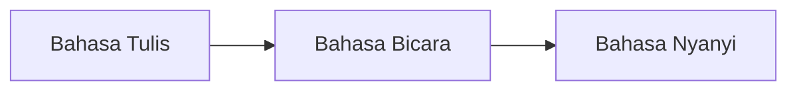
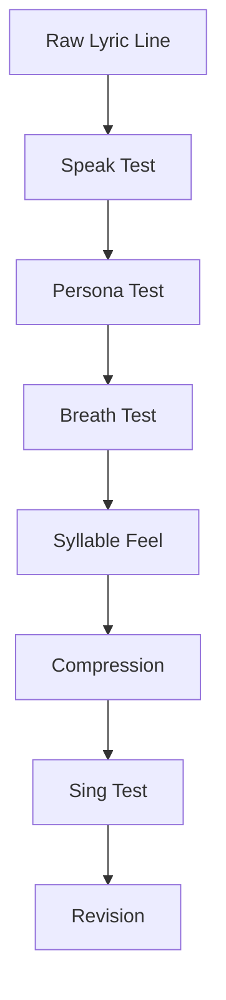
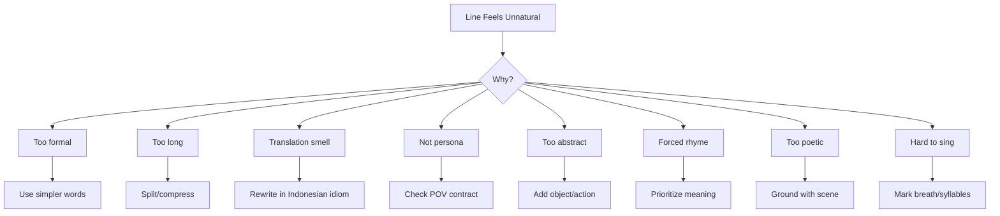

# learn-songwriting-part-014.md

# Natural Indonesian Lyric Flow: Membuat Lirik Bahasa Indonesia Mengalir, Bernapas, dan Tidak Terasa Dipaksakan

> Seri: `learn-songwriting`  
> Part: `014 / 034`  
> Fokus: aliran lirik Bahasa Indonesia, natural diction, conversational vs poetic lyric, syllable feel, phrase cut, register, dan anti-robotic writing  
> Status seri: belum selesai  
> Prasyarat: `learn-songwriting-part-000.md` sampai `learn-songwriting-part-013.md`

---

## Ringkasan Part Ini

Part sebelumnya membahas **Lyric Architecture**: bagaimana menyusun lirik sebagai struktur.

Part ini membahas masalah yang sering muncul setelah struktur mulai terbentuk:

> “Kenapa lirik saya sudah punya ide bagus, metafora bagus, dan struktur jelas, tapi saat dinyanyikan terasa kaku, robotic, terlalu formal, terlalu panjang, atau seperti hasil terjemahan?”

Masalah ini sangat umum dalam lirik Bahasa Indonesia.

Bukan karena Bahasa Indonesia kurang musikal. Justru Bahasa Indonesia sangat musikal: banyak vokal terbuka, ritme suku kata jelas, dan kata-kata seperti “pulang”, “rumah”, “nama”, “masih”, “belum”, “kau”, “aku”, “tuan”, “sayang” punya daya lirik yang kuat.

Masalah biasanya terjadi karena:

- lirik ditulis seperti esai;
- terlalu banyak kata abstrak;
- terlalu formal;
- terlalu memaksakan rima;
- terlalu panjang per baris;
- tidak memperhatikan napas;
- kata dipilih karena “puitis”, bukan karena natural untuk persona;
- line break tidak mengikuti frasa ucapan;
- lirik seperti terjemahan dari bahasa Inggris;
- terlalu banyak imbuhan berat;
- terlalu banyak kata benda konseptual;
- terlalu sedikit kata kerja konkret;
- terlalu banyak “yang” dan “karena”;
- chorus terlalu penuh kalimat;
- verse tidak punya ritme percakapan;
- kata penting jatuh di tempat lemah;
- frasa tidak memberi ruang untuk melodi.

Part ini akan membantu kamu membuat lirik yang:

```text
natural saat diucapkan,
enak saat dinyanyikan,
tetap puitis,
tetap tajam,
tetap sesuai persona,
dan tidak kehilangan song promise.
```

Sebagai software engineer, pikirkan proses ini seperti **refactoring for runtime behavior**.

Lyric architecture adalah desain.  
Natural flow adalah runtime.

Baris yang bagus di dokumen belum tentu bagus saat dieksekusi oleh mulut, napas, melodi, dan pendengar.

---

## Tujuan Part

Setelah menyelesaikan part ini, kamu harus bisa:

1. Memahami perbedaan bahasa tulis, bahasa bicara, dan bahasa nyanyi.
2. Mengidentifikasi lirik yang terdengar kaku, robotic, terlalu formal, atau terlalu terjemahan.
3. Membuat baris Bahasa Indonesia lebih natural tanpa kehilangan makna.
4. Memilih diction sesuai persona dan POV.
5. Menggunakan kata “aku/kau/kamu/sayang/tuan/kita/kami” secara musikal dan emosional.
6. Memotong frasa berdasarkan napas dan tekanan makna.
7. Mengurangi kata penghubung yang membuat lirik berat.
8. Menghindari abstraksi konseptual yang tidak singable.
9. Mengubah kalimat panjang menjadi phrase lyric.
10. Menjaga poetic quality tanpa berlebihan.
11. Menggunakan partikel dan register secara sadar.
12. Membuat naturalness pass untuk draft lirik.
13. Membuat file latihan `songwriting-practice-014-natural-indonesian-lyric-flow.md`.

---

## Prinsip Utama

```text
A lyric must survive the mouth.
```

Lirik tidak hanya dibaca oleh mata. Lirik harus lewat:

- mulut;
- napas;
- lidah;
- ritme;
- vokal;
- nada;
- pendengar.

Baris yang terlihat indah di halaman bisa gagal saat dinyanyikan.

Contoh:

```text
Aku merasakan kehampaan eksistensial akibat absensimu yang berkepanjangan.
```

Secara makna mungkin jelas. Tetapi sebagai lirik, ini berat, formal, dan tidak natural.

Versi lebih natural:

```text
Sejak kau pergi
rumah ini terlalu luas
untuk satu napas.
```

Atau:

```text
Kau pergi
dan rumah
jadi terlalu banyak ruang.
```

Lebih sedikit kata, lebih banyak ruang, lebih singable.

---

## Bahasa Tulis vs Bahasa Bicara vs Bahasa Nyanyi



## Bahasa Tulis

Ciri:

- kalimat lengkap;
- struktur gramatikal rapi;
- banyak kata penghubung;
- cocok untuk penjelasan;
- bisa panjang.

Contoh:

```text
Aku masih menyimpan gelasmu karena aku belum mampu menerima kenyataan bahwa kamu telah pergi.
```

## Bahasa Bicara

Ciri:

- lebih pendek;
- ada jeda;
- kadang fragment;
- lebih natural;
- tidak selalu gramatikal sempurna.

Contoh:

```text
Gelasmu masih kusimpan.
Entah kenapa.
Mungkin aku belum siap.
```

## Bahasa Nyanyi

Ciri:

- lebih terpotong;
- mengutamakan vowel, napas, rhythm;
- phrase lebih penting daripada kalimat;
- repetition lebih diterima;
- silence penting;
- kata tertentu diberi spotlight.

Contoh:

```text
Gelasmu
masih di sana

tak kupakai
tak kubuang
```

Lirik lagu sering lebih dekat ke bahasa bicara yang dipadatkan dan diberi musik, bukan bahasa tulis yang diberi nada.

---

## Naturalness Pipeline



Setiap line harus melewati beberapa test:

1. Apakah bisa diucapkan natural?
2. Apakah cocok dengan persona?
3. Apakah bisa dinyanyikan dalam napas wajar?
4. Apakah suku katanya tidak terlalu padat?
5. Apakah kata penting mendapat tempat kuat?
6. Apakah line masih membawa song promise?
7. Apakah terdengar seperti manusia, bukan essay generator?

---

# Bagian 1 — Ciri Lirik yang Terasa Tidak Natural

## 1. Terlalu Formal

Contoh:

```text
Saya mengalami penderitaan akibat kepergianmu.
```

Masalah:

- “mengalami penderitaan” terlalu formal;
- terdengar seperti laporan;
- tidak cocok untuk ballad intim.

Revisi:

```text
Sejak kau pergi
tidurku tak pernah penuh.
```

## 2. Terlalu Konseptual

Contoh:

```text
Absensimu menciptakan kekosongan dalam dimensi emosionalku.
```

Masalah:

- terlalu konseptual;
- tidak ada object;
- sulit dinyanyikan.

Revisi:

```text
Kursimu kosong
tapi tak berani kupakai.
```

## 3. Seperti Terjemahan

Contoh:

```text
Aku jatuh ke dalam cinta yang dalam.
```

Mungkin terpengaruh “falling deep in love”.

Revisi natural:

```text
Aku terlalu jauh
menyebut namamu
sebagai pulang.
```

## 4. Terlalu Banyak Kata Penghubung

Contoh:

```text
Aku masih menunggu karena aku merasa bahwa kamu mungkin akan kembali.
```

Revisi:

```text
Aku masih menunggu.
Mungkin kau pulang.
Mungkin aku bohong.
```

## 5. Terlalu Puitis Tanpa Tubuh

Contoh:

```text
Jiwaku menari di antara serpihan malam yang abadi.
```

Masalah:

- abstrak;
- klise;
- tidak ada scene.

Revisi:

```text
Lampu dapur menyala
lebih lama
dari alasanku.
```

## 6. Terlalu Banyak Suku Kata

Contoh:

```text
Aku masih mempertahankan semua kenangan yang pernah kita bangun bersama.
```

Revisi:

```text
Kenanganmu
belum sanggup
kusingkirkan.
```

## 7. Rima Memaksa

Contoh:

```text
Aku terluka di dada
karena kau pergi ke Kanada.
```

Jika Kanada tidak relevan, rima merusak.

Revisi:

```text
Kau pergi
dan rumah
kehilangan cara
menutup pintu.
```

---

# Bagian 2 — Bahasa Indonesia sebagai Bahasa Nyanyi

Bahasa Indonesia punya beberapa karakter penting.

## 1. Banyak Vokal Terbuka

Kata seperti:

```text
aku
kamu
pulang
rumah
nama
sayang
tuan
cinta
luka
sepi
pagi
```

punya vokal yang bisa dipanjangkan.

Contoh:

```text
pu-laaaang
ru-maaaah
na-maaa
sa-yaaang
```

Vokal terbuka membantu melody.

## 2. Suku Kata Relatif Jelas

Bahasa Indonesia cenderung syllable-timed. Setiap suku kata sering terasa cukup jelas.

Contoh:

```text
Ge-las-mu / di / rak / ke-du-a
```

Karena suku kata jelas, line terlalu panjang cepat terasa padat.

## 3. Tekanan Kata Tidak Sekuat Bahasa Inggris

Dalam bahasa Inggris, stress pattern sangat dominan. Dalam Bahasa Indonesia, penekanan bisa lebih fleksibel, tapi tetap perlu natural.

Kata penting harus ditempatkan di posisi musikal kuat, bukan sekadar mengikuti grammar.

## 4. Imbuhan Bisa Membuat Kata Berat

Kata seperti:

```text
mempertahankan
menyalahgunakan
menginterpretasikan
merepresentasikan
mengakibatkan
```

berat untuk lirik jika tidak hati-hati.

Bisa diganti:

```text
menahan
memakai
membaca
menjadi
membuat
```

## 5. Partikel Bisa Membuat Natural

Kata seperti:

```text
lah
pun
kan
toh
dong
saja
cuma
hanya
lagi
masih
belum
```

bisa memberi rasa natural, tetapi harus sesuai persona.

Contoh:

```text
Aku cuma belum sanggup
menyebut gelasmu benda.
```

Lebih natural daripada:

```text
Aku belum mampu mengklasifikasikan gelasmu sebagai objek.
```

---

# Bagian 3 — Speak Test

Speak test adalah tes paling sederhana.

Ambil satu line, ucapkan seperti manusia.

Jika terdengar aneh saat diucapkan, kemungkinan besar akan aneh saat dinyanyikan.

## Speak Test Questions

```text
Apakah aku bisa mengucapkannya tanpa merasa sedang membaca puisi palsu?
Apakah persona ini akan berkata begini?
Apakah ada kata yang terlalu formal?
Apakah kalimat terlalu panjang?
Apakah ada frasa seperti terjemahan?
Apakah ada kata yang hanya dipilih demi rima?
Apakah emosi terasa atau hanya dijelaskan?
```

## Contoh Speak Test

Line:

```text
Aku merasakan kehampaan yang sangat mendalam.
```

Speak test:

```text
Terlalu formal, terlalu umum.
```

Revision:

```text
Rumah ini terlalu luas
sejak kau tak lagi
menaruh suara.
```

Atau lebih conversational:

```text
Sejak kau pergi,
rumah ini kebanyakan ruang.
```

---

## Speak Test Marking

Gunakan tanda:

```markdown
[natural]
[too formal]
[too long]
[forced]
[not persona]
[translation smell]
[good but not singable]
```

Contoh:

```markdown
Aku merasakan kehampaan akibat absensimu.
[too formal] [translation smell]

Rumah ini kebanyakan ruang.
[natural] [image] [singable]
```

---

# Bagian 4 — Sing Test

Setelah speak test, lakukan sing test.

Tidak perlu melodi final. Nyanyikan bebas.

Tanya:

```text
Apakah line ini punya tempat napas?
Apakah ada suku kata yang menumpuk?
Apakah kata penting bisa diberi nada panjang?
Apakah mulut tersandung?
Apakah line terasa seperti kalimat prosa dipaksa bernyanyi?
```

## Example

Line:

```text
Aku masih menyimpan semua kenangan yang pernah kita tinggalkan bersama.
```

Saat dinyanyikan, terlalu panjang.

Compressed:

```text
Kenanganmu
masih kusimpan

di tempat
yang tak kutahu
namanya.
```

Lebih bernapas.

---

## Speak vs Sing Difference

Ada line yang natural saat diucapkan tapi sulit dinyanyikan.

Contoh:

```text
Aku sebenarnya tidak tahu harus bagaimana.
```

Natural bicara, tapi bisa terlalu datar/long.

Revisi lyric:

```text
Aku tak tahu
harus apa

dengan tangan
yang masih menunggu.
```

Lebih musikal.

---

# Bagian 5 — Persona Test

Natural untuk siapa?

Line yang natural untuk satu persona bisa tidak natural untuk persona lain.

## Persona: Intim Domestik

Natural:

```text
Gelasmu masih di sana.
```

Kurang natural:

```text
Absensimu mendefinisikan ulang konfigurasi ruang domestikku.
```

## Persona: Satir Birokratik

Kalimat formal bisa sengaja dipakai.

Contoh:

```text
Berdasarkan jadwal rindumu,
rumah kembali retak pukul tujuh.
```

Di sini formalitas menjadi ironi.

## Persona: Teatrikal Gelap

Natural:

```text
Tuan,
kopermu pulang
lebih sering
dari tanganmu.
```

## Persona: Urban Burnout

Natural:

```text
Notifikasi jam tiga
lebih hafal namaku
daripada tidur.
```

Persona test:

```text
Apakah orang ini akan memakai kata ini?
Apakah register-nya cocok?
Apakah terlalu pintar untuk karakter ini?
Apakah terlalu kasar/lembut?
Apakah terlalu formal/informal?
```

---

# Bagian 6 — Register Bahasa

Register adalah tingkat atau warna bahasa.

## 1. Conversational

Contoh:

```text
Aku cuma belum siap
melihat gelasmu jadi benda.
```

Efek:

- dekat;
- natural;
- modern.

Risiko:

- terlalu biasa jika tidak ada image kuat.

## 2. Poetic

Contoh:

```text
Gelasmu belum belajar
menjadi benda mati.
```

Efek:

- liris;
- memorable.

Risiko:

- bisa terlalu “sastra” jika berlebihan.

## 3. Formal

Contoh:

```text
Dengan hormat,
rumah ini menolak
kepulanganmu yang sementara.
```

Efek:

- satir;
- dingin;
- teatrikal.

Risiko:

- kaku jika tidak disengaja.

## 4. Intimate

Contoh:

```text
Kau tahu,
aku masih salah
menakar gulamu.
```

Efek:

- personal;
- vulnerable.

## 5. Theatrical

Contoh:

```text
Tuan,
lampu sudah menyala.
Silakan pergi lagi.
```

Efek:

- dramatis;
- satir;
- panggung.

## 6. Street/Casual

Contoh:

```text
Gue nggak nunggu.
Cuma pintu ini
rese banget.
```

Efek:

- kasual;
- urban;
- raw.

Risiko:

- tidak cocok untuk semua genre/persona.

---

## Register Consistency

Jangan campur register tanpa alasan.

Campur buruk:

```text
Aku cuma rindu kamu
dalam konfigurasi eksistensial ruang batinku
sayang, please jangan pergi dong
```

Bisa komedik, tapi jika tidak sengaja akan kacau.

Campur yang disengaja untuk satire:

```text
Sayang,
berdasarkan jadwal keberangkatanmu,
rumah kembali belajar
makan tanpa tuan.
```

Romantic + bureaucratic = ironi.

---

# Bagian 7 — Diction: Aku, Ku-, Saya, Gue

Pronoun memengaruhi flow.

## Aku

Natural, intim, umum.

```text
Aku belum selesai.
```

Cocok untuk ballad, pop, personal song.

## Ku-

Lebih liris dan padat.

```text
Kututup pintu.
```

Tetapi bisa terdengar klasik jika terlalu banyak.

Bandingkan:

```text
Aku menutup pintu.
```

Lebih conversational.

```text
Kututup pintu.
```

Lebih lyric/compact.

## -ku

Natural dalam banyak konteks.

```text
rumahku
tanganku
namaku
doaku
```

## Saya

Formal, jarak, bisa satir.

```text
Saya baik-baik saja.
```

Bisa dipakai jika persona ingin terdengar tertahan atau ironis.

## Gue

Kasual, urban, raw.

```text
Gue nggak nunggu.
```

Cocok jika genre/persona mendukung.

## Rule

Pilih satu pronoun system utama. Jangan ganti tanpa fungsi.

---

# Bagian 8 — Diction: Kau, Kamu, Engkau, Tuan, Sayang

## Kamu

Conversational, natural, modern.

```text
Kamu belum pulang.
```

## Kau

Lebih liris, padat, mudah dinyanyikan.

```text
Kau belum pulang.
```

Satu suku kata, sering lebih enak untuk melodi.

## Engkau

Lebih formal, religius, klasik.

```text
Engkau yang kusebut
sebelum amin.
```

Gunakan jika tone mendukung.

## Tuan

Berjarak, satir, hierarchical, theatrical.

```text
Tuan,
jangan panggil ini pulang.
```

Sangat kuat untuk kritik metaforis.

## Sayang

Intim, bisa tulus atau ironis.

```text
Sayang,
kopermu siap lagi.
```

Jika dipakai dalam satire, “sayang” bisa menjadi pisau halus.

## Pronoun Emotional Color

| Word | Color |
|---|---|
| kamu | natural, conversational |
| kau | liris, direct, compact |
| engkau | solemn, poetic, spiritual |
| tuan | distance, authority, satire |
| sayang | intimacy, tenderness, irony |
| namamu | indirect, memory-based |

---

# Bagian 9 — Kata “Masih” dan “Belum”

Dalam lirik Indonesia, “masih” dan “belum” sangat powerful.

## Masih

Membawa continuity.

```text
Aku masih menunggu.
Gelasmu masih di sana.
Lampu masih menyala.
Namamu masih tahu jalan.
```

## Belum

Membawa unresolved state.

```text
Aku belum selesai.
Kau belum pulang.
Rumah ini belum belajar padam.
Gelasmu belum jadi benda.
```

“Belum” sering lebih menarik daripada “tidak”.

```text
Aku tidak selesai.
```

Aneh.

```text
Aku belum selesai.
```

Hidup, unresolved.

## Masih/Belum as Hook

```text
kau belum selesai
aku masih salah
rumah belum padam
gelasmu belum jadi benda
masih kupakai untuk menunggu
```

Kata ini bisa menjadi conflict engine kecil.

---

# Bagian 10 — Mengurangi Kata Berat

Banyak line menjadi kaku karena kata terlalu berat.

## Heavy Words

```text
mengakibatkan
merepresentasikan
menginterpretasikan
mempertahankan
mengekspresikan
mengonstruksi
eksistensial
dimensi
konfigurasi
ketidakhadiran
```

Bukan dilarang, tapi hati-hati.

## Replace with Simpler Words

| Heavy | Simpler |
|---|---|
| mengakibatkan | membuat |
| mempertahankan | menahan / menjaga |
| merepresentasikan | menjadi / membawa |
| menginterpretasikan | membaca |
| ketidakhadiran | kosong / tak ada |
| eksistensial | hidup / diri |
| konfigurasi | bentuk / susunan |
| dimensi emosional | ruang / rasa |
| memvalidasi | membenarkan |
| intensitas | panas / berat / kuat |

## Example

Heavy:

```text
Ketidakhadiranmu mengakibatkan kekosongan emosional.
```

Natural:

```text
Sejak kau tak ada,
rumah ini kebanyakan ruang.
```

---

# Bagian 11 — Mengurangi “Yang”

Kata “yang” sering membuat lirik panjang.

Tidak selalu buruk, tapi perlu dikontrol.

## Before

```text
Aku menyimpan gelas yang pernah kamu pakai di rak yang kedua.
```

## After

```text
Gelasmu di rak kedua.
```

## Before

```text
Rumah yang dulu kita tinggali kini menjadi ruang yang terlalu sepi.
```

## After

```text
Rumah dulu kita
kini terlalu banyak sepi.
```

Atau:

```text
Rumah kita dulu
sekarang kebanyakan sepi.
```

## Rule

Jika “yang” bisa dihapus tanpa merusak makna, coba hapus.

Tapi jangan semua “yang” dihapus sampai terdengar aneh.

---

# Bagian 12 — Mengurangi “Karena”

“Karena” sering membuat line menjelaskan.

## Before

```text
Aku masih menyimpan gelasmu karena aku belum bisa melepasmu.
```

## After

```text
Gelasmu masih kusimpan.
Aku belum tahu
cara melepas air.
```

Atau:

```text
Gelasmu masih di sana.
Melepas
belum punya tangan.
```

“Karena” boleh dipakai, tapi chorus/verse sering lebih kuat jika sebab-akibat ditunjukkan melalui image.

---

# Bagian 13 — Mengurangi “Adalah”

“Adalah” sering terlalu formal dalam lirik.

## Before

```text
Rumah ini adalah saksi dari kesedihanku.
```

## After

```text
Rumah ini menyimpan
semua yang tak sanggup
kusebut.
```

## Before

```text
Gelas ini adalah simbol dari rinduku.
```

## After

```text
Gelasmu
tak kupakai
tak kubuang.
```

Biarkan symbol bekerja.

---

# Bagian 14 — Menghindari Terjemahan Literal

Translation smell sering muncul karena pola bahasa Inggris masuk ke Bahasa Indonesia.

## Example 1

```text
Aku jatuh untukmu.
```

Dari “I fall for you”. Bahasa Indonesia lebih natural:

```text
Aku telanjur
menyebutmu pulang.
```

Atau:

```text
Aku terlalu jauh
membiarkan namamu
jadi rumah.
```

## Example 2

```text
Kamu membuatku merasa hidup.
```

Dari “you make me feel alive”. Bisa natural, tapi sering generik.

Revisi:

```text
Sejak kau datang
lampu dapur
tak lagi pura-pura.
```

## Example 3

```text
Aku tidak bisa mendapatkanmu keluar dari kepalaku.
```

Dari “can't get you out of my head”.

Revisi:

```text
Namamu masih tahu
jalan ke mulutku.
```

## Example 4

```text
Aku patah di dalam.
```

Dari “broken inside”.

Revisi:

```text
Di dalam rumah ini
ada kursi
yang tak berani
kududuki.
```

---

# Bagian 15 — Conversational Lyric vs Poetic Lyric

Lirik natural bukan berarti harus sepenuhnya conversational.

Ada spektrum:

```text
conversational <-> poetic
```

## Conversational

```text
Aku cuma belum siap
melihat gelasmu jadi benda.
```

## Poetic

```text
Gelasmu belum belajar
menjadi benda mati.
```

Keduanya bisa bagus.

Pertanyaannya:

```text
Mana yang cocok dengan persona, genre, dan melody?
```

Untuk lagu intimate, campuran sering efektif:

```text
Aku cuma belum siap
melihat gelasmu
belajar jadi benda.
```

Conversational + poetic image.

---

## Conversational-Poetic Balance

| Terlalu Conversational | Terlalu Poetic |
|---|---|
| bisa datar | bisa tidak natural |
| seperti chat | seperti puisi palsu |
| kurang memorable | kurang singable |
| terlalu literal | terlalu kabur |

Balance:

```text
bahasa manusia + image yang segar
```

Contoh:

```text
Aku cuma belum berani
memindahkan gelasmu.
```

Simple, natural, image-based.

---

# Bagian 16 — Fragment sebagai Kekuatan

Lirik tidak harus selalu kalimat lengkap.

Fragment bisa lebih musikal.

## Full Sentence

```text
Aku tidak tahu bagaimana cara membuang kenangan tentangmu.
```

## Fragment Lyric

```text
Tak tahu
cara membuang

namamu
dari gelas
yang tak lagi
kau pakai.
```

Fragment memberi:

- napas;
- emphasis;
- ruang melodi;
- emotional hesitation;
- natural brokenness.

## Fragment Rule

Fragment harus tetap jelas secara emosional.

Jika terlalu fragmentary, pendengar bingung.

---

# Bagian 17 — Line Break Natural

Line break harus membantu:

- napas;
- meaning;
- rhythm;
- emphasis;
- melody;
- suspense.

## Bad Line Break

```text
Aku masih menyimpan gelasmu karena
aku belum bisa melepasmu dari
rumah ini.
```

Line break melawan frasa.

## Better

```text
Aku masih menyimpan
gelasmu

karena melepas
belum punya tangan
di rumah ini.
```

Atau lebih natural:

```text
Gelasmu masih kusimpan.
Melepas
belum punya tangan
di rumah ini.
```

## Phrase-Based Break

Pecah berdasarkan unit makna:

```text
Gelasmu / masih kusimpan
di rak kedua //

tak kupakai /
tak kubuang //
```

---

# Bagian 18 — Breath as Syntax

Dalam lirik, napas adalah tanda baca.

Kalimat tulis:

```text
Aku masih menyimpan gelasmu di rak kedua karena aku belum bisa menerima bahwa kamu pergi.
```

Lirik bernapas:

```text
Gelasmu
di rak kedua

masih

tak kupakai
tak kubuang.
```

Napas menciptakan meaning.

## Breath Marking Symbols

Gunakan:

```text
/  = napas pendek
// = napas panjang
... = jeda emosional
```

Contoh:

```text
Gelasmu di rak kedua /
tak kupindah sejak Selasa //

air panas tetap kusisakan /
untuk pagi yang salah sangka //
```

---

# Bagian 19 — Syllable Feel

Kita belum masuk detail prosodi penuh, tetapi natural flow butuh rasa suku kata.

## Example

```text
Gelasmu di rak kedua
```

Approx syllable:

```text
Ge-las-mu / di / rak / ke-du-a
= 7 suku kata
```

```text
Tak kupakai, tak kubuang
```

Approx:

```text
Tak / ku-pa-kai / tak / ku-bu-ang
= 7 suku kata
```

Keduanya seimbang, enak sebagai pair.

## Too Dense

```text
Aku masih mempertahankan kenanganmu
```

Approx banyak suku kata dan kata berat.

Revisi:

```text
Kenanganmu
masih kutahan
```

Approx:

```text
Ke-na-ngan-mu / ma-sih / ku-ta-han
```

Lebih manageable.

## Syllable Count Is Not Everything

Jangan hanya menghitung suku kata. Perhatikan:

- kata berat;
- konsonan bertumpuk;
- vowel panjang;
- tempat napas;
- kata penting;
- rhythm phrase.

---

# Bagian 20 — Kata Penting Harus Dapat Spotlight

Dalam line, kata penting jangan terkubur.

Buruk:

```text
Aku masih terus saja mencoba untuk tidak mengingat namamu.
```

Kata penting “namamu” terkubur di akhir kalimat panjang.

Revisi:

```text
Namamu
masih tahu jalan
ke mulutku.
```

Kata penting jadi spotlight.

## Spotlight Positions

Kata penting sering kuat jika muncul di:

- awal line;
- akhir line;
- sebelum jeda;
- setelah jeda;
- nada tinggi;
- nada panjang;
- hook position;
- repeated phrase.

Contoh:

```text
Pulang
jangan kau sebut
jika rumah
hanya panggung.
```

“Pulang” mendapat spotlight.

---

# Bagian 21 — Natural Word Order

Bahasa Indonesia punya fleksibilitas word order, tapi jangan terlalu diputar demi puitis sampai aneh.

## Too Inverted

```text
Di rak kedua gelasmu masihlah kusimpan.
```

Terdengar kuno/kaku.

## Natural

```text
Gelasmu masih kusimpan
di rak kedua.
```

Atau lebih lyric:

```text
Gelasmu
di rak kedua

masih.
```

## Poetic but Still Natural

```text
Gelasmu di rak kedua
belum belajar
jadi benda.
```

Word order natural + poetic idea.

---

# Bagian 22 — Kata Akhir Baris

Kata akhir baris mendapat emphasis.

Jangan taruh kata lemah di akhir line jika tidak sengaja.

## Weak Ending

```text
Aku masih menunggu karena
```

“karena” menggantung secara tidak musikal.

## Stronger

```text
Aku masih menunggu
di depan pintu.
```

Kata “pintu” kuat.

## End-Line Candidates

Kata yang sering kuat:

```text
pulang
rumah
nama
tuan
sayang
sepi
pintu
gelas
lampu
lagi
masih
belum
sendiri
```

Akhir line memengaruhi rhyme dan memory.

---

# Bagian 23 — Kata Awal Baris

Kata awal baris juga penting.

Awal line bisa memberi:

- image;
- address;
- hook;
- command;
- question;
- contrast.

Contoh kuat:

```text
Tuan,
jangan panggil ini pulang.
```

```text
Gelasmu
belum jadi benda.
```

```text
Pulang
bukan pengumuman.
```

## Weak Start

```text
Dan aku merasa bahwa...
```

“Dan aku merasa bahwa” berat dan explanatory.

Revisi:

```text
Aku merasa...
```

Atau lebih baik:

```text
Rumah ini...
```

Mulai dari object.

---

# Bagian 24 — Partikel Natural

Partikel bisa membuat lirik terasa manusiawi.

## Cuma / Hanya

```text
Aku cuma belum siap
melihat gelasmu jadi benda.
```

Lebih conversational.

## Saja

```text
Pulanglah sebentar saja.
```

Bisa memohon.

## Pun

```text
Namamu pun
tak mau jadi masa lalu.
```

Lebih poetic.

## Lah

```text
Pulanglah
tanpa panggung.
```

Command/plea.

## Kan

```text
Kau tahu kan,
rumah ini mudah percaya.
```

Conversational/intimate.

## Toh

```text
Toh kau pergi juga.
```

Bitter/casual.

## Lagi

```text
Kopermu siap lagi.
```

Repetition/pattern.

Partikel harus cocok persona.

---

# Bagian 25 — Bahasa Puitis yang Masih Natural

Puitis bukan berarti rumit.

Puitis sering berarti:

```text
cara melihat yang segar dengan kata sederhana
```

Contoh:

```text
Gelasmu belum belajar jadi benda.
```

Kata sederhana:

- gelas;
- belum;
- belajar;
- benda.

Tapi ide puitis.

Contoh:

```text
Rumah ini salah paham.
```

Kata sederhana, metaphor kuat.

Contoh:

```text
Namamu berhenti di belakang gigi.
```

Kata sederhana, image fresh.

Prinsip:

```text
Simple words, strange truth.
```

Bukan:

```text
Complex words, vague emotion.
```

---

# Bagian 26 — Menghindari Kata Klise

Beberapa kata sering muncul dalam lirik dan mudah klise:

```text
hati
luka
jiwa
cinta
rindu
sepi
hancur
air mata
malam
bintang
senja
hujan
takdir
```

Bukan dilarang. Tetapi jangan jadikan default.

## Cliché Replacement Strategy

Kata:

```text
hati
```

Cari body/object:

```text
dada
tenggorokan
gigi
tangan
napas
gelas
pintu
```

Kata:

```text
rindu
```

Cari action:

```text
menyisakan
membuka
menunggu
mengetik
menghapus
tidak membuang
```

Kata:

```text
sepi
```

Cari space/sound:

```text
televisi menyala
kursi kosong
kulkas berdengung
rumah kebanyakan ruang
```

## Example

Cliché:

```text
Hatiku hancur karena rindu.
```

Replacement:

```text
Namamu berhenti
di belakang gigi.
```

---

# Bagian 27 — Natural Flow untuk Kritik Satir

Kritik satir harus natural agar tidak menjadi ceramah.

## Too Essay-like

```text
Intensitas perjalananmu menunjukkan pengabaian terhadap krisis domestik.
```

Ini opini, bukan lyric.

## Metaphoric Natural

```text
Kopermu siap lagi
saat meja makan
belajar diam.
```

## Too Frontal

```text
Kau pemimpin yang tidak peduli rakyat.
```

## Satirical Address

```text
Tuan,
rumah tak butuh
pengumuman pulang.
```

## Too Vulgar

Makian langsung bisa mengurangi lapisan metafora.

## Sharper without Vulgarity

```text
Sayang,
kau selalu pulang
sebagai kabar

bukan tangan.
```

Natural satirical lyric memakai:

- address;
- object;
- irony;
- understatement;
- contrast;
- scene;
- repetition.

---

# Bagian 28 — Understatement

Understatement membuat emosi besar terasa lebih tajam dengan bahasa kecil.

## Direct

```text
Aku sangat hancur.
```

## Understated

```text
Aku agak lama
menatap gelasmu.
```

## Direct Satire

```text
Kau mengkhianati rumah ini.
```

## Understated Satire

```text
Rumah ini
mulai hafal
cara ditinggal.
```

Understatement cocok untuk:

- grief;
- shame;
- satire;
- heartbreak;
- burnout.

---

# Bagian 29 — Repetition Natural

Repetition dalam Bahasa Indonesia bisa sangat kuat.

Contoh:

```text
tak kupakai
tak kubuang
```

Repetition pattern:

```text
tak ku- / tak ku-
```

Contoh:

```text
masih di sana
masih menyala
masih salah
```

Repetition memberi musicality.

## Natural Repetition

```text
Aku belum
belum sanggup
menyebutmu
masa lalu.
```

## Bad Repetition

```text
Aku sedih, sedih, sedih, sedih
```

Bisa saja jika genre mendukung, tapi sering terlalu direct.

Repetition harus membawa movement atau intensitas.

---

# Bagian 30 — Variation Natural

Ulangi pola, ubah sedikit makna.

Chorus 1:

```text
Tak kupakai
tak kubuang
```

Final:

```text
Tak kupakai
tak kubuang

aku
di rak kedua.
```

Variation kecil memberi payoff.

## Variation Types

- pronoun shift;
- object shift;
- word replacement;
- line order change;
- shorter final line;
- title repeated with new meaning;
- “sayang” menjadi “tuan”;
- “kau” menjadi “namamu”.

Contoh satire:

Chorus awal:

```text
Sayang,
jangan panggil ini pulang.
```

Final:

```text
Tuan,
jangan panggil ini pulang.
```

Satu kata mengubah dunia.

---

# Bagian 31 — Naturalness Pass

Setelah draft lyric v0.1, lakukan naturalness pass.

## Step 1: Read Aloud

Baca tanpa melodi.

Tandai line yang terasa:

- formal;
- panjang;
- forced;
- tidak persona;
- translation smell;
- over-poetic;
- underwritten.

## Step 2: Speak as Persona

Ucapkan seolah kamu adalah narrator.

Tanya:

```text
Apakah persona akan berkata begini?
```

## Step 3: Remove Essay Words

Cari:

- karena;
- bahwa;
- adalah;
- merasakan;
- mengalami;
- mengakibatkan;
- ketidakhadiran;
- perasaan;
- sangat;
- benar-benar.

Tidak semua harus dihapus, tapi cek.

## Step 4: Compress

Potong kata yang tidak bekerja.

## Step 5: Sing Roughly

Nyanyikan dengan melody bebas.

## Step 6: Mark Breath

Tandai napas.

## Step 7: Protect Alive Lines

Jangan membuat semuanya steril. Pertahankan line yang punya energi.

---

## Naturalness Pass Template

```markdown
# Naturalness Pass

## Lines that feel natural
-

## Lines too formal
-

## Lines too long
-

## Lines with translation smell
-

## Lines not matching persona
-

## Lines too abstract
-

## Lines too poetic/forced
-

## Lines to compress
-

## Lines to protect
-

## Revised version
...
```

---

# Bagian 32 — Before/After Rewriting Examples

## Example 1

Before:

```text
Aku merasakan kehilangan yang sangat mendalam setelah kepergianmu.
```

After A:

```text
Sejak kau pergi
rumah ini kebanyakan ruang.
```

After B:

```text
Kursimu kosong
tapi tak berani
kupakai.
```

After C:

```text
Gelasmu masih di sana.
Aku yang berubah
jadi tamu.
```

## Example 2

Before:

```text
Aku masih mencintaimu meskipun kamu telah meninggalkanku.
```

After A:

```text
Pintuku masih terbuka
untuk langkah
yang memilih jauh.
```

After B:

```text
Aku masih salah
menyebut namamu
sebagai pulang.
```

## Example 3

Before:

```text
Kamu selalu bepergian ke luar negeri dan meninggalkan masalah di rumah.
```

After A:

```text
Kopermu siap lagi
saat meja makan
belajar diam.
```

After B:

```text
Tuan,
bandara lebih sering
mendengar namamu
daripada dapur kami.
```

After C:

```text
Jangan panggil ini pulang
jika rumah hanya
kau jadikan panggung.
```

## Example 4

Before:

```text
Aku sangat lelah karena pekerjaan yang terus-menerus menekanku.
```

After A:

```text
Kopi dingin
layar panas
dan tubuhku
belum boleh padam.
```

After B:

```text
Notifikasi jam tiga
lebih hafal namaku
daripada tidur.
```

---

# Bagian 33 — Natural Indonesian Lyric Checklist

```markdown
# Natural Indonesian Lyric Checklist

## Speak
- [ ] Bisa diucapkan natural.
- [ ] Tidak terasa seperti esai.
- [ ] Tidak terasa seperti terjemahan.

## Persona
- [ ] Diksi cocok dengan narrator.
- [ ] Register konsisten.
- [ ] Pronoun konsisten.

## Sing
- [ ] Line tidak terlalu panjang.
- [ ] Ada tempat napas.
- [ ] Kata penting mendapat spotlight.
- [ ] Suku kata tidak terlalu padat.

## Meaning
- [ ] Tidak terlalu menjelaskan.
- [ ] Ada object/action.
- [ ] Emosi terasa tanpa terlalu banyak label.
- [ ] Metafora tidak over-explained.

## Sound
- [ ] Frasa enak di mulut.
- [ ] Repetition natural.
- [ ] Rima tidak memaksa.
- [ ] Akhir baris kuat.

## Revision
- [ ] Kata berat sudah dicek.
- [ ] “yang/karena/adalah/bahwa” sudah dicek.
- [ ] Line terbaik dilindungi.
- [ ] Line kaku direvisi.
```

---

# Bagian 34 — Natural Flow Debugging



## Debug Questions

```text
Apakah line ini terdengar seperti manusia?
Apakah terlalu formal?
Apakah terlalu panjang?
Apakah bisa diucapkan tanpa malu?
Apakah persona ini akan berkata begitu?
Apakah kata ini ada karena rima?
Apakah line ini seperti terjemahan?
Apakah ada object/action?
Apakah bisa dinyanyikan dalam satu napas?
Apakah ada kata yang bisa dipotong?
```

---

# Bagian 35 — Natural Flow Rewrite Process

Gunakan proses 7 langkah.

## Step 1: Identify the Meaning

Original:

```text
Aku merasa sangat kesepian sejak kamu pergi.
```

Meaning:

```text
narator merasa rumah terlalu kosong setelah addressee pergi
```

## Step 2: Choose Object/Place

```text
rumah, kursi, televisi, suara
```

## Step 3: Choose Persona Register

```text
intim, sederhana, domestik
```

## Step 4: Write Conversational Version

```text
Sejak kau pergi,
rumah ini terlalu sepi.
```

## Step 5: Add Image

```text
Sejak kau pergi,
televisi menyala
untuk suara
yang tak perlu kujawab.
```

## Step 6: Compress

```text
Televisi menyala
untuk suara
yang tak perlu kujawab.
```

## Step 7: Sing Test

Mark breath:

```text
Televisi menyala /
untuk suara //

yang tak perlu /
kujawab //
```

---

# Bagian 36 — Natural Flow and Melody Placeholder

Kadang line bisa dinilai dengan placeholder rhythm.

Gunakan:

```text
da-da-da
```

Contoh:

```text
Tak kupakai, tak kubuang
da da-DA-da, da da-DA-ang
```

Kalau phrase punya rhythm internal, lebih mudah diberi melodi.

Line berat:

```text
Ketidakhadiranmu mengakibatkan kehampaan
```

Placeholder:

```text
ke-ti-dak-ha-dir-an-mu me-nga-ki-bat-kan ke-ham-pa-an
```

Terlalu padat dan formal.

Revisi:

```text
Kau tak ada
rumah kebanyakan ruang
```

Lebih rhythm-friendly.

---

# Bagian 37 — Natural Flow and Hook

Hook harus sangat natural di mulut.

Test hook:

```text
ucapkan 10 kali
nyanyikan 3 cara
bisikkan
teriakkan pelan
ulang setelah 5 menit
```

Hook yang terlalu susah akan gagal.

## Hook Candidate Test

```markdown
# Hook Naturalness Test

| Hook | Speak Natural | Singable | Memorable | Persona Fit | Notes |
|---|---:|---:|---:|---:|---|
|  |  |  |  |  |  |
```

Contoh:

| Hook | Note |
|---|---|
| tak kupakai, tak kubuang | natural, rhythmic |
| gelasmu belum menjadi benda | poetic, singable if slow |
| absensimu mengubah ruang domestikku | too formal |
| jangan panggil ini pulang | strong, natural, accusatory |
| kopermu lebih setia | satirical, memorable |

---

# Bagian 38 — Natural Flow and Chorus

Chorus harus lebih sederhana daripada verse dalam banyak kasus.

Verse boleh punya detail.

Chorus harus punya phrase yang bisa diingat.

## Verse Detail

```text
Gelasmu di rak kedua
tak kupindah sejak Selasa
air panas tetap kusisakan
untuk pagi yang salah sangka
```

## Chorus Simpler

```text
Tak kupakai
tak kubuang

kau belum selesai
di rumah yang kupanggil pulang
```

Chorus tidak perlu:

```text
Aku masih mempertahankan objek-objek peninggalanmu karena belum sanggup menerima kepergianmu.
```

Terlalu explanatory.

## Chorus Naturalness Questions

```text
Apakah chorus bisa diingat?
Apakah chorus bisa dinyanyikan saat berjalan?
Apakah chorus punya napas?
Apakah hook pendek?
Apakah title jelas?
Apakah terlalu banyak konsep?
```

---

# Bagian 39 — Natural Flow and Verse

Verse boleh lebih conversational dan detailed.

Tapi jangan seperti paragraf.

## Prose Verse

```text
Aku melihat gelasmu yang ada di rak kedua dan aku sadar bahwa aku belum memindahkannya sejak kamu pergi hari Selasa lalu.
```

## Lyric Verse

```text
Gelasmu di rak kedua
tak kupindah sejak Selasa
```

Verse bekerja dengan compression.

## Verse Naturalness Pattern

```text
object -> action -> time -> subtext
```

Contoh:

```text
Gelasmu di rak kedua
tak kupindah sejak Selasa
air panas tetap kusisakan
untuk pagi yang salah sangka
```

---

# Bagian 40 — Natural Flow and Bridge

Bridge boleh lebih reflective, tapi jangan menjadi essay.

## Essay Bridge

```text
Aku baru menyadari bahwa sebenarnya yang selama ini kutunggu bukanlah dirimu melainkan versi diriku yang dulu.
```

## Lyric Bridge

```text
Baru kusadar
bukan kau
yang paling lama
kutunggu

tapi aku
sebelum rumah ini
belajar sepi
```

Bridge bisa lebih direct, tapi tetap harus bernapas.

---

# Bagian 41 — Latihan Utama Part 014

Buat file:

```text
songwriting-practice-014-natural-indonesian-lyric-flow.md
```

Isi template berikut.

```markdown
# songwriting-practice-014-natural-indonesian-lyric-flow.md

## 1. Draft Source
Tempel draft lyric v0.1 dari part 013.

...

## 2. POV and Register
Narrator:
Addressee:
Register:
Pronoun system:
Persona language:
Forbidden language:

## 3. Speak Test

| Line | Marking | Issue | Revision Idea |
|---|---|---|---|
|  |  |  |  |

Marking:
[natural], [too formal], [too long], [forced], [translation smell], [not persona], [too abstract], [hard to sing]

## 4. Heavy Word Audit
Cari kata berat/formal.

| Word/Phrase | Keep? | Replacement |
|---|---|---|
|  |  |  |

## 5. Connector Audit
Cek kata:
- yang
- karena
- bahwa
- adalah
- sehingga
- merasakan
- mengalami

| Line | Connector | Remove/Keep | Revision |
|---|---|---|---|
|  |  |  |  |

## 6. Pronoun Audit

| Role | Pronoun Used | Consistent? | Notes |
|---|---|---|---|
| Narrator |  |  |  |
| Addressee |  |  |  |
| Collective |  |  |  |

## 7. Breath Marking
Tandai / dan // pada draft.

...

## 8. Important Word Spotlight
Kata yang harus mendapat spotlight:
1.
2.
3.
4.
5.

Apakah sudah berada di awal/akhir line atau hook?
...

## 9. Translation Smell Fixes
Minimal 5 line.

### Line 1
Before:
After:

### Line 2
Before:
After:

### Line 3
Before:
After:

### Line 4
Before:
After:

### Line 5
Before:
After:

## 10. Natural Flow Rewrite v0.2

### Verse 1
...

### Pre-Chorus
...

### Chorus
...

### Verse 2
...

### Chorus
...

### Bridge
...

### Final Chorus
...

### Outro
...

## 11. Hook Naturalness Test

| Hook | Speak Natural | Singable | Memorable | Persona Fit | Notes |
|---|---:|---:|---:|---:|---|
|  |  |  |  |  |  |

## 12. Lines to Protect
1.
2.
3.
4.
5.

## 13. Lines Still Weak
1.
2.
3.
4.
5.

## 14. Next Action
...
```

---

# Latihan 30 Menit: Speak Test and Marking

Ambil 12–20 baris draft.

Baca keras-keras.

Tandai:

```text
[too formal]
[too long]
[translation smell]
[not persona]
[hard to sing]
```

Pilih 5 line paling bermasalah dan revisi.

---

# Latihan 45 Menit: Natural Rewrite

Pilih satu verse dan satu chorus.

Lakukan:

1. hapus kata berat;
2. potong “yang/karena/adalah” yang tidak perlu;
3. pecah line panjang;
4. ubah explanation menjadi object/action;
5. tandai breath;
6. nyanyikan kasar.

Output:

```markdown
Before:
After:
What improved:
Still weak:
```

---

# Latihan 60 Menit: Full Naturalness Pass

Ambil full lyric v0.1.

Hasilkan v0.2 dengan fokus natural flow.

Jangan ubah semua konsep. Fokus:

- diction;
- line length;
- breath;
- persona consistency;
- hook singability.

Template:

```markdown
## v0.1 Problems
...

## Revision Rules
1.
2.
3.

## v0.2 Draft
...

## What I protected
...

## What I cut
...

## What still needs melody test
...
```

---

# Checklist Part 014

Sebelum lanjut ke part 015, pastikan:

- [ ] Kamu memahami perbedaan bahasa tulis, bicara, dan nyanyi.
- [ ] Kamu sudah melakukan speak test pada draft.
- [ ] Kamu sudah melakukan persona/register test.
- [ ] Kamu sudah menandai line terlalu formal.
- [ ] Kamu sudah menandai line terlalu panjang.
- [ ] Kamu sudah mencari translation smell.
- [ ] Kamu sudah audit kata berat.
- [ ] Kamu sudah audit “yang/karena/adalah/bahwa”.
- [ ] Kamu sudah menandai breath.
- [ ] Kamu sudah memastikan kata penting mendapat spotlight.
- [ ] Kamu sudah menguji hook secara natural.
- [ ] Kamu punya draft lyric v0.2 yang lebih natural.
- [ ] Kamu tahu line yang harus dilindungi.
- [ ] Kamu tahu line yang masih lemah.
- [ ] Kamu punya next action menuju rhyme tanpa memaksa.

---

# Output Wajib Part 014

Buat file:

```text
songwriting-practice-014-natural-indonesian-lyric-flow.md
```

Isi minimal:

```markdown
# songwriting-practice-014-natural-indonesian-lyric-flow.md

## Draft Source
...

## POV and Register
...

## Speak Test
...

## Heavy Word Audit
...

## Connector Audit
...

## Pronoun Audit
...

## Breath Marking
...

## Important Word Spotlight
...

## Natural Flow Rewrite v0.2
...

## Hook Naturalness Test
...

## Lines to Protect
...

## Lines Still Weak
...

## Next Action
...
```

---

# Common Failure Modes di Part Ini

## 1. Mengira Natural Berarti Biasa

Natural bukan berarti datar. Natural berarti sesuai mulut, persona, dan musik.

```text
Gelasmu belum belajar jadi benda.
```

Ini puitis tapi masih natural.

## 2. Terlalu Takut Kata Sederhana

Pemula sering merasa kata sederhana kurang “artistic”.

Padahal:

```text
pulang
rumah
nama
gelas
pintu
masih
belum
```

bisa sangat kuat.

## 3. Mempertahankan Kalimat Formal Karena Maknanya Tepat

Makna tepat belum tentu lyric tepat.

Refactor.

## 4. Menghapus Semua Kata Puitis

Jangan membuat lirik steril. Tujuannya bukan anti-puisi, tapi puisi yang bisa dinyanyikan.

## 5. Terlalu Fokus Syllable Count

Suku kata penting, tapi jangan hanya menghitung. Perhatikan mulut, napas, emphasis, dan melody.

## 6. Mengorbankan Persona demi Rima

Jika persona tidak akan berkata begitu, jangan paksa.

## 7. Membuat Semua Line Terlalu Pendek

Line pendek bagus, tapi jika semua terlalu pendek tanpa flow, lagu bisa patah-patah.

## 8. Tidak Membaca Keras-Keras

Natural flow tidak bisa diuji hanya dengan mata.

## 9. Hook Tidak Diuji di Mulut

Hook harus survive repetition.

## 10. Revisi Membuat Lirik Kehilangan Energi

Lindungi line yang hidup. Jangan semua dijadikan “rapi”.

---

# Prinsip Penting

```text
Natural lyric is not casual writing.
Natural lyric is language shaped for mouth, breath, melody, and persona.
```

Dan:

```text
The best Indonesian lyric often uses simple words to carry difficult feelings.
```

Jangan malu memakai kata sederhana jika posisinya tepat.

---

# Bridge ke Part Berikutnya

Part ini membahas natural flow lirik Bahasa Indonesia.

Part berikutnya, `learn-songwriting-part-015.md`, akan membahas:

```text
Rhyme Without Forcing
```

Kita akan memperdalam:

- rima akhir;
- rima dalam;
- asonansi;
- konsonansi;
- near rhyme;
- sound family;
- repetition sebagai pengganti rima;
- kenapa rima memaksa merusak makna;
- cara membuat rima natural dalam Bahasa Indonesia;
- rhyme map untuk verse/chorus;
- memilih rima yang mendukung emosi dan persona.

Setelah lirik natural di mulut, kita akan membuat bunyinya lebih memorable tanpa mengorbankan makna.

---

# Status Seri

Part ini selesai.

```text
Selesai: learn-songwriting-part-014.md
Berikutnya: learn-songwriting-part-015.md
Status seri: belum selesai
Part tersisa: 20
Target akhir seri: learn-songwriting-part-034.md
```


<!-- NAVIGATION_FOOTER -->
<div class="page-nav">
<a href="./learn-songwriting-part-013.md">⬅️ Lyric Architecture: Menyusun Baris, Bait, Section, Hook, dan Alur Informasi agar Lirik Bekerja sebagai Lagu</a>
<a href="./index.md">📚 Kategori</a>
<a href="../../index.md">🏠 Home</a>
<a href="./learn-songwriting-part-015.md">Rhyme Without Forcing: Membuat Rima, Bunyi, dan Pengulangan yang Natural Tanpa Mengorbankan Makna ➡️</a>
</div>
