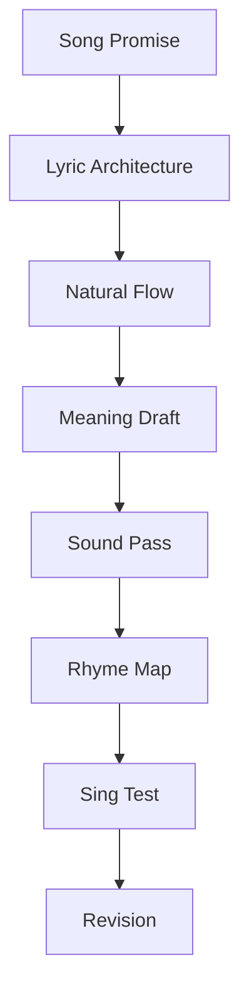
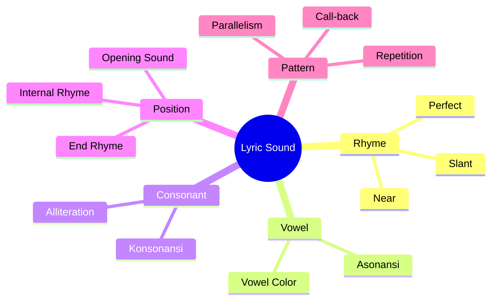
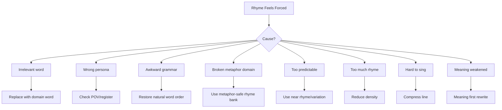

# learn-songwriting-part-015.md

# Rhyme Without Forcing: Membuat Rima, Bunyi, dan Pengulangan yang Natural Tanpa Mengorbankan Makna

> Seri: `learn-songwriting`  
> Part: `015 / 034`  
> Fokus: rima natural Bahasa Indonesia, sound family, asonansi, konsonansi, internal rhyme, near rhyme, repetition, dan anti-forced rhyme  
> Status seri: belum selesai  
> Prasyarat: `learn-songwriting-part-000.md` sampai `learn-songwriting-part-014.md`

---

## Ringkasan Part Ini

Part sebelumnya membahas **Natural Indonesian Lyric Flow**: bagaimana membuat lirik Bahasa Indonesia terasa natural saat diucapkan dan dinyanyikan.

Part ini membahas masalah yang sangat sering merusak lirik:

> “Rimanya ada, tapi terasa dipaksakan.”

Contoh rima memaksa:

```text
Aku terluka di dada
karena kau pergi ke Kanada
```

Masalahnya bukan “Kanada” tidak boleh dipakai. Masalahnya: jika lagu tidak punya hubungan apa pun dengan Kanada, kata itu terasa masuk hanya demi rima. Pendengar langsung merasakan kepalsuan craft-nya.

Contoh lain:

```text
Kau pergi membawa rasa
meninggalkan aku di angkasa
```

Jika “angkasa” tidak punya fungsi metaphor system, ia terasa seperti jalan pintas rima.

Rima yang baik tidak boleh mengorbankan:

- song promise;
- persona;
- natural flow;
- meaning;
- emotional truth;
- singability;
- diction;
- metaphor system.

Rima bukan tujuan utama. Rima adalah **alat memori dan musikalitas**.

Dalam lirik, bunyi membantu pendengar mengingat. Tetapi jika bunyi menang atas makna, lagu terdengar palsu.

Part ini akan mengajarkan cara membuat rima yang:

```text
natural,
tidak memaksa,
mendukung emosi,
mendukung hook,
mudah dinyanyikan,
dan tetap terasa seperti Bahasa Indonesia hidup.
```

Kita tidak hanya membahas rima akhir. Kita akan membahas:

- rima sempurna;
- near rhyme;
- asonansi;
- konsonansi;
- internal rhyme;
- repetition;
- sound family;
- vowel color;
- rhyme density;
- rhyme placement;
- rhyme map;
- rhyme as emotional device;
- rhyme debugging.

Sebagai software engineer, pikirkan rima seperti **indexing untuk memori pendengar**.

Rima membantu lagu searchable di otak.

Tetapi index yang buruk bisa merusak data.

---

## Tujuan Part

Setelah menyelesaikan part ini, kamu harus bisa:

1. Memahami fungsi rima dalam lagu.
2. Membedakan rima sempurna, rima dekat, asonansi, konsonansi, internal rhyme, dan repetition.
3. Membuat rima natural dalam Bahasa Indonesia.
4. Menghindari rima yang memaksa makna.
5. Menggunakan sound family untuk mencari alternatif rima.
6. Menentukan rhyme scheme untuk verse dan chorus.
7. Menggunakan repetition sebagai pengganti rima.
8. Membuat chorus lebih memorable lewat bunyi.
9. Menjaga rima agar tetap cocok dengan persona dan metaphor system.
10. Mendiagnosis forced rhyme.
11. Merevisi line agar rima tidak merusak lirik.
12. Membuat file latihan `songwriting-practice-015-rhyme-without-forcing.md`.

---

## Prinsip Utama

```text
Meaning first. Sound second. But sound must serve meaning.
```

Rima yang baik terasa seperti:

```text
kata itu memang harus berada di sana
```

Rima buruk terasa seperti:

```text
kata itu dipilih karena kebetulan bunyinya sama
```

Contoh forced:

```text
Aku menunggu di depan pintu
karena hatiku begitu membiru
```

“membiru” bisa bekerja jika ada metaphor color system. Tapi jika tidak, terasa dipilih demi rima dengan “pintu”.

Revisi natural:

```text
Aku menunggu di depan pintu
sampai lampu
lebih dulu
menyerah.
```

Tidak perfect rhyme, tetapi ada bunyi:

```text
pintu / lampu / dulu
```

Lebih natural dan emotional.

---

## Fungsi Rima dalam Lagu

Rima punya beberapa fungsi.

## 1. Memory

Rima membantu pendengar mengingat.

```text
tak kupakai
tak kubuang
```

Rimanya bukan akhir sama, tetapi pattern repetition “tak ku-” membuat frasa menempel.

## 2. Closure

Rima memberi rasa selesai.

```text
Gelasmu di rak kedua
tak kupindah sejak Selasa
```

`kedua` dan `Selasa` tidak perfect rhyme, tetapi sama-sama terbuka. Ada closure ringan.

## 3. Expectation

Rima membuat pendengar menunggu bunyi tertentu.

Jika baris 1 dan 2 membangun pola, baris 4 bisa memenuhi atau mematahkan ekspektasi.

## 4. Emphasis

Kata yang berima sering mendapat perhatian.

Maka jangan merimakan kata tidak penting.

## 5. Musicality

Rima membuat line lebih enak diucapkan.

## 6. Emotion

Bunyi tertentu bisa membawa warna emosi.

Vokal “a” bisa terbuka.  
Vokal “u” bisa gelap/tertutup.  
Vokal “i” bisa tajam/rapuh.  
Ini bukan aturan mutlak, tapi berguna sebagai rasa.

---

## Rhyme dalam Pipeline Lirik



Rima sebaiknya datang setelah:

- meaning jelas;
- line cukup natural;
- section function jelas;
- hook direction ada.

Jika kamu mulai dari rima, sering terjadi:

```text
meaning mengikuti bunyi secara paksa
```

Lebih baik:

```text
meaning dulu, lalu cari bunyi yang mendukung
```

---

# Bagian 1 — Jenis-Jenis Rima dan Bunyi

## 1. Perfect Rhyme / Rima Sempurna

Bunyi akhir sangat mirip.

Contoh:

```text
cinta / derita
pulang / hilang
rindu / sendu
luka / suka
```

Rima sempurna mudah diingat, tapi mudah terasa klise jika terlalu predictable.

## 2. Near Rhyme / Rima Dekat

Bunyi tidak sama persis, tapi cukup dekat.

Contoh:

```text
pulang / ruang
nama / lama
pintu / lampu
kedua / Selasa
sendiri / pergi
```

Near rhyme sering lebih natural.

## 3. Asonansi

Pengulangan bunyi vokal.

Contoh:

```text
rumah / pulang / ruang
```

Bunyi “u/a” memberi hubungan.

Contoh line:

```text
Rumah terlalu banyak ruang
sejak pulang kehilangan namamu.
```

Ada banyak u/a.

## 4. Konsonansi

Pengulangan bunyi konsonan.

Contoh:

```text
tak kupakai, tak kubuang
```

Bunyi “k”, “t”, “p/b” memberi texture.

## 5. Internal Rhyme

Rima di dalam baris, bukan hanya akhir.

Contoh:

```text
tak kupakai, tak kubuang
```

`tak ku-` internal repetition.

Contoh:

```text
pulangmu pengumuman
```

`pulang/pengumuman` punya bunyi p/ng/m/n yang berhubungan.

## 6. Repetition

Pengulangan kata/frasa.

Contoh:

```text
masih
masih
masih
```

Atau:

```text
jangan panggil ini pulang
jangan panggil ini rumah
```

Repetition sering lebih kuat daripada rima sempurna.

## 7. Parallelism

Struktur kalimat berulang.

```text
tak kupakai
tak kubuang
```

Atau:

```text
kau pulang sebagai kabar
kau pergi sebagai alasan
```

Parallelism membuat lirik musikal tanpa harus perfect rhyme.

---

## Sound Device Map



---

# Bagian 2 — Rima Bahasa Indonesia

Bahasa Indonesia kaya dengan vokal terbuka.

Banyak kata berakhir dengan:

```text
-a
-i
-u
-an
-ang
-ah
-ar
-at
```

Ini memudahkan rima, tetapi juga membuat rima terlalu mudah terasa predictable.

Contoh rima umum:

```text
cinta / derita / cerita
luka / suka / duka
rindu / sendu / pilu
pulang / hilang / ruang
hati / mati / sendiri
malam / kelam / dalam
```

Karena sering dipakai, perlu hati-hati.

## Problem Rima Klise

```text
cinta - derita
luka - duka
rindu - sendu
malam - kelam
hati - mati
```

Bukan dilarang. Tapi jika dipakai tanpa detail baru, terasa generik.

## Cara Membuat Rima Umum Jadi Segar

Tambahkan object, action, atau context.

Klise:

```text
Aku rindu dalam sendu.
```

Lebih segar:

```text
Rindumu tak kusebut
tapi gelasmu
belum jadi benda.
```

Tidak memakai rima sempurna, tapi lebih kuat.

Klise:

```text
Malam kelam penuh luka.
```

Lebih segar:

```text
Lampu dapur menyala
lebih lama
dari alasanku.
```

---

# Bagian 3 — Meaning Before Rhyme

Jika makna dan rima bertabrakan, makna menang.

## Forced Rhyme Example

```text
Kau pergi meninggalkanku
membuat hatiku membeku
di negeri Peru
```

Jika Peru tidak relevan, itu forced.

## Meaning-First Rewrite

Makna:

```text
narator merasa ditinggal dan masih menunggu di rumah
```

Line:

```text
Kau pergi.
Aku menunggu.
Lampu dapur
lebih setia
darimu.
```

Ada bunyi:

```text
pergi / menunggu / dapur / setia / darimu
```

Tidak perfect rhyme, tapi emotional.

## Rhyme Decision Rule

```text
If the rhyme makes the line less true, cut the rhyme.
```

---

# Bagian 4 — Forced Rhyme Smells

Rima memaksa punya gejala.

## 1. Kata Tidak Relevan

```text
Kanada
angkasa
samudra
bidadari
merpati
pelangi
```

Jika kata muncul hanya demi bunyi, forced.

## 2. Diksi Tidak Cocok Persona

Persona sederhana tiba-tiba berkata:

```text
nestapa
gulana
laksana
asmara membara
```

Bisa cocok untuk persona klasik, tapi jika tidak, forced.

## 3. Grammar Aneh

```text
Pergi kau telah dari hatiku
```

Demi rima atau syllable, word order jadi aneh.

## 4. Makna Melenceng

Baris tiba-tiba pindah metaphor domain demi rima.

```text
Gelasmu di rak kedua
hatiku terbang ke angkasa
```

World pecah.

## 5. Terlalu Predictable

```text
cinta - derita
luka - duka
rindu - sendu
```

Jika tidak ada twist, terasa template.

## 6. Punchline Lemah

Rima menutup line dengan kata yang tidak penting.

```text
Aku sedih karena
```

Atau memilih kata akhir hanya demi rhyme, bukan emphasis.

---

## Forced Rhyme Checklist

```markdown
# Forced Rhyme Checklist

- [ ] Apakah kata ini relevan dengan song promise?
- [ ] Apakah kata ini cocok dengan persona?
- [ ] Apakah word order natural?
- [ ] Apakah metaphor system tetap konsisten?
- [ ] Apakah line masih punya emotional truth?
- [ ] Apakah rima terlalu predictable?
- [ ] Apakah kata akhir line penting?
- [ ] Apakah line bisa diucapkan natural?
- [ ] Apakah line bisa dinyanyikan?
```

Jika 3 atau lebih gagal, revisi.

---

# Bagian 5 — Sound Family

Sound family adalah kumpulan kata/frasa yang bunyinya berhubungan, tidak harus perfect rhyme.

Daripada mencari satu rima sempurna, bangun keluarga bunyi.

## Sound Family: Pulang

```text
pulang
hilang
ruang
ulang
kurang
belakang
tenang
terang
seberang
```

Line possibilities:

```text
Jangan panggil ini pulang
jika rumah kebanyakan ruang.
```

```text
Kau pulang sebagai kabar
lalu hilang
sebelum lampu belakang padam.
```

## Sound Family: Rumah

```text
rumah
resah
pecah
lelah
salah
basah
patah
singgah
```

Line:

```text
Rumah ini salah
mengira singgah
sama dengan pulang.
```

## Sound Family: Nama

```text
nama
lama
sama
pertama
terutama
purnama
```

Line:

```text
Namamu terlalu lama
tinggal di mulut
yang pura-pura lupa.
```

## Sound Family: Gelas

```text
gelas
jelas
lepas
bekas
kelas
teras
keras
```

Line:

```text
Gelasmu terlalu jelas
untuk kusebut bekas.
```

## Sound Family: Tuan

```text
tuan
ruang
pulang
buang
terbuang
bayang
kurang
```

Near-rhyme. Jangan paksa exact.

Line:

```text
Tuan,
jangan panggil ini pulang.
```

---

## Sound Family Template

```markdown
# Sound Family

## Anchor Word
...

## Perfect Rhymes
1.
2.
3.

## Near Rhymes
1.
2.
3.
4.
5.

## Vowel Family
1.
2.
3.

## Consonant Family
1.
2.
3.

## Useful Phrases
1.
2.
3.
4.
5.

## Lines
1.
2.
3.
```

---

# Bagian 6 — Rima Akhir

Rima akhir adalah rima di ujung line.

Skema umum:

```text
AABB
ABAB
ABCB
AAAA
free / loose rhyme
```

## AABB

```text
Gelasmu di rak kedua       A
tak kupindah sejak Selasa  A
air panas tetap kusisakan  B
untuk pagi yang kehilangan B
```

AABB terasa rapat dan predictable. Bisa cocok untuk lagu sederhana, tetapi hati-hati agar tidak seperti pantun.

## ABAB

```text
Gelasmu di rak kedua       A
air panas tetap kusisakan  B
tak kupindah sejak Selasa  A
untuk pagi yang salah sangka B
```

Lebih terbuka.

## ABCB

```text
Gelasmu di rak kedua       A
tak kupindah sejak Selasa  B
air panas tetap kusisakan  C
untuk pagi yang salah sangka B
```

Line 2 dan 4 berhubungan. Ini sering natural untuk verse.

## Loose Rhyme

```text
Gelasmu di rak kedua
tak kupindah sejak Selasa
air panas tetap kusisakan
untuk pagi yang salah sangka
```

Bunyi tidak perfect, tapi ada vowel, rhythm, dan image.

Untuk songwriting awal, loose rhyme sering lebih aman daripada perfect rhyme memaksa.

---

# Bagian 7 — Rhyme Scheme untuk Verse

Verse biasanya butuh natural flow dan image.

Jangan terlalu banyak perfect rhyme jika membuat verse terasa seperti pantun.

## Good Verse Rhyme Priorities

1. meaning;
2. image;
3. natural speech;
4. light sound connection;
5. rhyme jika mendukung.

## Verse Scheme Recommendation

Untuk MVS:

```text
ABCB atau loose rhyme
```

Contoh:

```text
Gelasmu di rak kedua        A
tak kupindah sejak Selasa   B
air panas tetap kusisakan   C
untuk pagi yang salah sangka B-ish
```

`Selasa/sangka` bukan perfect, tapi punya vowel “a” dan flow.

## Verse Rhyme Warning

Jika verse terlalu rapi:

```text
Aku menunggu di malam kelam
hatiku luka sangat mendalam
kau pergi tanpa salam
tinggalkanku dalam suram
```

Terlalu predictable dan abstrak.

Lebih natural:

```text
Televisi menyala
untuk suara yang tak perlu kujawab

di meja,
gelasmu masih
lebih tenang dariku.
```

Tidak perfect rhyme, tapi lebih hidup.

---

# Bagian 8 — Rhyme Scheme untuk Chorus

Chorus butuh lebih memorable.

Bisa memakai:

- repetition;
- internal rhyme;
- hook phrase;
- shorter lines;
- stronger rhyme;
- call-back.

## Chorus Example

```text
Tak kupakai
tak kubuang

kau belum selesai
di rumah yang kupanggil pulang
```

Sound devices:

- repetition: `tak ku-`;
- contrast: `pakai/buang`;
- near sound: `selesai/pulang` bukan rhyme, tapi meaning kuat;
- line break memberi hook.

## Chorus Rhyme Priorities

1. hook clarity;
2. repetition;
3. singability;
4. title placement;
5. strong vowel;
6. rhyme only if natural.

## Chorus Forced Rhyme

```text
Tak kupakai, tak kubuang
hatiku kini melayang-layang
```

Jika “melayang-layang” tidak sesuai world, forced.

Revisi:

```text
Tak kupakai
tak kubuang

kau belum selesai
di rumah
yang lupa
cara pulang.
```

Ada `buang/pulang` near connection.

---

# Bagian 9 — Internal Rhyme

Internal rhyme sering lebih natural daripada rima akhir.

Contoh:

```text
tak kupakai, tak kubuang
```

Internal repetition.

```text
pulangmu pengumuman
```

Bunyi `pulang/pengumuman`.

```text
rumah ini salah paham
```

`rumah/salah/paham` berbagi vokal a dan h.

Internal rhyme bisa membuat line musikal tanpa memaksa akhir line.

## Internal Rhyme Exercise

Ambil phrase:

```text
jangan panggil ini pulang
```

Internal sounds:

```text
pang-gil / pu-lang
```

Bisa diperkuat:

```text
Jangan panggil ini pulang,
tuan.
Panggungmu
bukan ruang makan.
```

Ada `panggil/pulang/panggung`, `ruang/makan`.

---

# Bagian 10 — Asonansi

Asonansi adalah pengulangan vokal.

Contoh dengan vokal “a”:

```text
Sayang,
jangan panggil ini pulang.
```

Banyak “a”, terbuka, cocok untuk panggilan/tuduhan.

Contoh dengan “u”:

```text
Rumahku menunggu
di sudut waktu.
```

Bunyi “u” lebih tertutup, bisa memberi rasa muram/tertahan.

Contoh dengan “i”:

```text
Piring kecil
belajar diam.
```

“i” bisa terasa tipis/tajam.

Asonansi tidak harus dihitung rigid. Rasakan di mulut.

## Vowel Color

| Vokal | Rasa Umum | Contoh |
|---|---|---|
| a | terbuka, luas, terang, panggilan | sayang, pulang, nama |
| i | tipis, tajam, kecil, intim | piring, kecil, sendiri |
| u | gelap, dalam, tertahan | rindu, rumahku, tunggu |
| e | lembut/netral/retak tergantung kata | sepi, gelas, lelah |
| o | bulat, berat, resonan | kosong, bodoh, lorong |

Ini bukan aturan ilmiah kaku, tapi alat rasa.

---

# Bagian 11 — Konsonansi dan Alliteration

Konsonansi adalah pengulangan konsonan.

Alliteration biasanya pengulangan konsonan awal.

Contoh:

```text
kopermu kembali ke koridor
```

Bunyi `k`.

Contoh:

```text
pintu pelan-pelan percaya
```

Bunyi `p`.

Contoh:

```text
meja makan menunggu
```

Bunyi `m`.

Konsonansi bisa memberi texture.

## Caution

Jangan berlebihan:

```text
Kopermu kaku kembali ke koridor kelam karena kau kejam.
```

Terlalu dibuat-buat.

Lebih natural:

```text
Kopermu kembali
lebih dulu dari kabarmu.
```

Ada bunyi k, tapi natural.

---

# Bagian 12 — Repetition sebagai Rima

Kadang repetition lebih kuat daripada rhyme.

```text
tak kupakai
tak kubuang
```

```text
jangan panggil ini pulang
jangan panggil ini rumah
```

```text
masih di sana
masih menyala
masih salah
```

Repetition memberi:

- memori;
- emphasis;
- emotional insistence;
- structure;
- hook.

## Repetition Types

| Type | Example |
|---|---|
| Word repetition | masih, masih |
| Phrase repetition | tak kupakai |
| Syntax repetition | kau pulang sebagai..., kau pergi sebagai... |
| Sound repetition | tak ku-, tak ku- |
| Image repetition | gelas muncul lagi |
| Address repetition | sayang / tuan |

## Repetition Risk

Terlalu banyak repetition tanpa movement membuat lagu monoton.

Solusi:

```text
repeat phrase, change context
```

---

# Bagian 13 — Parallelism

Parallelism adalah pola struktur yang berulang.

Contoh:

```text
Kau pulang sebagai kabar
kau pergi sebagai alasan
```

Contoh:

```text
Aku menutup pintu
aku membuka luka
```

Contoh:

```text
Tak kupakai
tak kubuang
```

Parallelism membuat lirik mudah dipahami dan diingat.

## Parallelism Template

```text
[subject] [verb] [object]
[subject] [verb] [object]
```

Atau:

```text
tak [verb]
tak [verb]
```

Atau:

```text
jangan [verb] ini [noun]
jangan [verb] itu [noun]
```

## Parallelism for Satire

```text
Kau pulang sebagai pengumuman
kau pergi sebagai kebiasaan
```

Rima tidak perfect, tapi struktur dan sound kuat.

---

# Bagian 14 — Rhyme Placement

Rima tidak harus selalu akhir line.

Tempat rima:

- awal line;
- tengah line;
- akhir line;
- antar-frasa;
- antar-section;
- hook return;
- final word.

## End Placement

```text
pulang / hilang
```

## Internal Placement

```text
tak kupakai, tak kubuang
```

## Cross-Section Callback

Verse 1:

```text
rak kedua
```

Bridge:

```text
di rak kedua
aku menunda diriku
```

Ini bukan rhyme tradisional, tapi callback bunyi/makna.

## Final Word Placement

Akhir chorus:

```text
pulang
```

Jika kata akhir chorus kuat, pendengar mengingatnya.

---

# Bagian 15 — Rhyme Density

Rhyme density adalah seberapa banyak rhyme/sound pattern dalam section.

## Low Density

Terlalu sedikit bunyi berulang, lirik bisa terasa prosa.

## High Density

Terlalu banyak rima, lirik bisa terasa seperti pantun/rap yang memaksa.

## Balanced Density

Verse:

- loose rhyme;
- object detail;
- light asonansi.

Chorus:

- stronger repetition;
- hook;
- internal rhyme.

Bridge:

- less rhyme, more space;
- atau satu strong callback.

## Density by Section

| Section | Suggested Rhyme Density |
|---|---|
| Verse | low-medium |
| Pre-Chorus | medium, build tension |
| Chorus | medium-high, memorable |
| Bridge | low-medium, allow turn |
| Final Chorus | high enough for payoff/callback |

---

# Bagian 16 — Rhyme and Emotion

Rima bisa mempengaruhi emosi.

## Tight Rhyme

Efek:

- playful;
- catchy;
- controlled;
- possibly ironic;
- bisa terasa artificial jika lagu sangat sedih.

## Loose Rhyme

Efek:

- natural;
- conversational;
- intimate;
- cocok ballad.

## Broken Rhyme

Ekspektasi rima dipatahkan.

Efek:

- shock;
- vulnerability;
- emotional break.

Contoh:

```text
Aku hampir berkata pulang
tapi mulutku

diam.
```

Rima tidak dipenuhi, dan silence menjadi emosi.

## Repeated Non-Rhyme

Efek:

- obsessive;
- mantra-like;
- denial.

```text
masih
masih
masih
```

---

# Bagian 17 — Rhyme and Persona

Rima harus cocok persona.

## Persona Intim Domestik

Cocok:

- loose rhyme;
- repetition;
- simple sound;
- natural phrase.

Contoh:

```text
Gelasmu di rak kedua
tak kupindah sejak Selasa
```

## Persona Teatrikal Satir

Cocok:

- stronger repetition;
- formal/ironic rhyme;
- address phrase.

Contoh:

```text
Tuan,
jangan panggil ini pulang.
```

## Persona Urban

Cocok:

- internal rhyme;
- rhythm-driven;
- conversational.

## Persona Spiritual

Cocok:

- repetition;
- vowel resonance;
- prayer-like refrain.

Contoh:

```text
Amin yang salah nama
amin yang belum pulang
```

## Persona Anak/Polos

Cocok:

- simple rhyme;
- repetition;
- direct image.

Jangan pakai rhyme style yang tidak cocok dengan suara narrator.

---

# Bagian 18 — Rhyme and Metaphor System

Rima tidak boleh merusak metaphor domain.

Jika domain-mu rumah:

Good rhyme family:

```text
rumah / salah / lelah / singgah / pecah
pintu / lampu / waktu / tunggu
gelas / jelas / lepas / bekas
pulang / ruang / hilang / ulang
```

Forced domain break:

```text
rumah / samudra / galaksi / bidadari
```

Jika tidak ada alasan, hindari.

## Metaphor-Safe Rhyme Bank

Buat rhyme bank dari object domain.

Contoh domain rumah:

```markdown
rumah:
salah, lelah, singgah, pecah, basah

pintu:
lampu, waktu, tunggu, sendu, aku

gelas:
jelas, lepas, bekas, keras

pulang:
hilang, ruang, ulang, kurang, belakang
```

Domain bandara:

```markdown
koper:
troli, boarding, koridor, roda

pulang:
hilang, ruang, ulang

tuan:
pulang, buang, ruang, bayang

bandara:
udara, suara, negara, perkara
```

Hati-hati dengan kata besar seperti “negara” jika lirik ingin tidak frontal. Bisa dipakai jika sengaja.

---

# Bagian 19 — Rhyme Map

Rhyme map adalah rencana bunyi per section.

Template:

```markdown
# Rhyme Map

## Anchor words
...

## Verse sound family
...

## Chorus sound family
...

## Bridge sound family
...

## Hook sound
...

## Words to avoid
...

## Rhyme scheme
Verse:
Chorus:
Bridge:
```

Contoh rindu domestik:

```markdown
Anchor:
gelas, rak, pulang, masih, belum

Verse sound:
-a / -a / -an loose

Chorus sound:
tak ku- repetition
pulang/buang near rhyme

Bridge sound:
-u / -a, sparse

Avoid:
angkasa, samudra, derita, nestapa
```

Contoh satire:

```markdown
Anchor:
tuan, pulang, panggung, koper, rumah

Verse sound:
-a open, formal address

Chorus sound:
pulang/panggung/tuan

Bridge sound:
less rhyme, more direct

Avoid:
literal political slogans, vulgar insult
```

---

# Bagian 20 — Rhyme Bank

Buat rhyme bank khusus lagu.

Jangan mengandalkan kata rima generik.

## Rhyme Bank Template

```markdown
# Rhyme Bank

## Anchor Word 1:
Perfect rhymes:
Near rhymes:
Useful phrases:

## Anchor Word 2:
Perfect rhymes:
Near rhymes:
Useful phrases:

## Anchor Word 3:
Perfect rhymes:
Near rhymes:
Useful phrases:

## Forbidden Rhymes
1.
2.
3.
```

## Example

```markdown
## Anchor Word: pulang
Perfect/near:
hilang, ruang, ulang, kurang, belakang, tenang

Useful phrases:
jangan panggil ini pulang
rumah kebanyakan ruang
pulang sebagai pengumuman
hilang sebelum lampu padam

Forbidden:
melayang-layang
sayap bimbang
```

---

# Bagian 21 — End Words

Kata akhir line sangat penting.

Buat daftar end words yang kuat.

## Example: Rindu Domestik

```text
kedua
Selasa
sangka
buang
pulang
sepi
diri
tunda
```

## Example: Satire Bandara

```text
pulang
panggung
tuan
koper
bandara
rumah
meja
pengumuman
```

End words harus:

- relevant;
- singable;
- emotionally charged;
- not random;
- preferably connected by sound family.

## End Word Audit

```markdown
| Line | End Word | Important? | Sound Family | Keep/Revise |
|---|---|---|---|---|
|  |  |  |  |  |
```

Jika end word lemah, revisi line break atau word choice.

---

# Bagian 22 — Natural Rhyme Rewrite Process

## Step 1: Meaning

Original meaning:

```text
narator belum bisa melepas
```

## Step 2: Anchor Word

```text
buang
```

## Step 3: Sound Family

```text
pulang, ruang, hilang, ulang
```

## Step 4: Object/Action

```text
gelas, rak, pakai, buang
```

## Step 5: Natural Phrase

```text
tak kupakai, tak kubuang
```

## Step 6: Chorus Context

```text
Tak kupakai
tak kubuang

kau belum selesai
di rumah yang kupanggil pulang
```

Rima muncul dari meaning, bukan dipaksa.

---

# Bagian 23 — Rewriting Forced Rhyme

## Example 1

Forced:

```text
Aku menunggu di depan pintu
hingga hatiku menjadi biru
```

Problem:

- “biru” mungkin forced;
- terlalu direct;
- “hati” cliché.

Revision A:

```text
Aku menunggu di depan pintu
sampai lampu
lebih dulu
menyerah.
```

Revision B:

```text
Pintu kubuka sedikit
lampu kubiarkan hidup
kalau kau pulang
jangan sampai
rumah terlihat tidur.
```

## Example 2

Forced:

```text
Kau pergi meninggalkan luka
membuat hatiku penuh duka
```

Revision:

```text
Kau pergi.
Kursimu tetap di sana

lebih rapi
dari caraku
menerima.
```

## Example 3

Forced satire:

```text
Kau jalan-jalan ke luar negeri
rakyat di sini susah sendiri
```

Too direct / slogan-like.

Revision:

```text
Kopermu siap lagi
saat meja makan
belajar diam.
```

Or:

```text
Tuan,
bandara lebih sering
mendengar namamu
daripada dapur kami.
```

---

# Bagian 24 — Rhyme Without End Rhyme

Tidak semua lagu perlu end rhyme jelas.

Bunyi bisa datang dari:

- phrase repetition;
- vowel family;
- repeated object;
- rhythmic parallelism;
- hook callback.

Contoh:

```text
Gelasmu di rak kedua
tak kupindah sejak Selasa

air panas tetap kusisakan
untuk pagi yang salah sangka
```

End rhyme tidak perfect, tapi ada:

- `-a` vowel;
- domestic image;
- rhythm 7–9 syllable;
- semantic progression.

Contoh chorus:

```text
Tak kupakai
tak kubuang

kau belum selesai
di rumah yang kupanggil pulang
```

Tidak perfect, tapi strong hook.

---

# Bagian 25 — Rhyme and Silence

Kadang tidak merima adalah pilihan emosional.

Setelah pola rima dibuat, mematahkannya bisa kuat.

Contoh:

```text
Kau pulang sebagai kabar
kau pergi sebagai alasan

aku menunggu sebagai rumah
lalu berhenti

sebagai apa?
```

Tidak ada rhyme di akhir. Pertanyaan menjadi kosong.

## Broken Rhyme Technique

1. Bangun pola.
2. Pendengar mengharapkan rima.
3. Patahkan pada line emotional.
4. Beri silence.

Contoh:

```text
Gelasmu di rak kedua
tak kupindah sejak Selasa
air panas tetap kusisakan

lalu aku lupa
untuk siapa.
```

“siapa” memberi emotional break.

---

# Bagian 26 — Rhyme for Hook Variations

Hook bisa diuji dengan rhyme alternatives.

## Anchor: pulang

Hook candidates:

```text
jangan panggil ini pulang
pulang bukan pengumuman
pulanglah tanpa panggung
pulang ke siapa?
rumah kebanyakan ruang
```

## Anchor: buang

```text
tak kupakai, tak kubuang
belum kupakai untuk pulang
tak kubuang dari ruang
buanglah aku pelan-pelan
```

## Anchor: nama

```text
namamu terlalu lama
amin yang salah nama
mulutku masih pertama
rumah menghafal nama
```

Pilih bukan yang paling rima, tetapi yang paling benar dan singable.

---

# Bagian 27 — Rhyme and Indonesian Syllable Flow

Rima harus memperhatikan suku kata.

## Rhyme Good but Too Heavy

```text
ketidakhadiranmu / penderitaanku
```

Rima `-anku/-mu`, tapi berat.

## Simpler

```text
kau tak ada
rumah kebanyakan ruang
```

Atau:

```text
namamu lama
di mulutku
```

## Syllable and Rhyme Balance

Jika rima membutuhkan kata 6–7 suku kata yang berat, cari near rhyme yang lebih singable.

Contoh:

```text
menginterpretasikan
merepresentasikan
```

Bisa rima dalam rap/experimental, tapi berat untuk ballad.

---

# Bagian 28 — Rhyme and Line Break

Line break bisa menciptakan rhyme.

Prose:

```text
Aku tidak memakai gelasmu dan aku juga tidak membuangnya.
```

Lyric:

```text
Tak kupakai
tak kubuang
```

Line break membuat parallel sound terlihat.

Prose:

```text
Rumah ini terlalu banyak ruang sejak kamu pergi.
```

Lyric:

```text
Rumah ini
kebanyakan ruang

sejak kau
lupa pulang
```

`ruang/pulang` muncul.

Line break adalah alat rima.

---

# Bagian 29 — Rhyme and Revision

Rhyme pass dilakukan setelah draft meaning.

## Revision Order

1. Draft meaning.
2. Naturalness pass.
3. Hook pass.
4. Rhyme/sound pass.
5. Sing test.
6. Meaning check again.

Jangan melakukan rhyme pass terlalu awal.

Jika terlalu awal:

```text
rhyme locks bad lines
```

Kamu jadi mempertahankan line buruk karena rimanya cocok.

## Rhyme Revision Questions

```text
Apakah rima memperkuat hook?
Apakah rima merusak meaning?
Apakah rima natural untuk persona?
Apakah rima terlalu predictable?
Apakah line masih singable?
Apakah ada kata yang dipilih hanya demi rima?
Apakah repetition lebih baik daripada rhyme?
Apakah near rhyme cukup?
```

---

# Bagian 30 — Rhyme Debugging



## Debug Questions

```text
Apa anchor word-nya?
Apakah rima berasal dari song world?
Apakah kata rima relevan?
Apakah persona akan mengucapkannya?
Apakah word order natural?
Apakah near rhyme lebih baik?
Apakah repetition cukup?
Apakah end word kuat?
Apakah line bisa dinyanyikan?
Apakah rima membuat lirik lebih memorable atau lebih palsu?
```

---

# Bagian 31 — Rhyme Scheme Design Template

Gunakan template ini.

```markdown
# Rhyme Scheme Design

## Song Title
...

## Song Promise
...

## POV / Register
...

## Hook
...

## Anchor Words
1.
2.
3.
4.
5.

## Sound Families

### Anchor 1:
Perfect:
Near:
Useful phrases:

### Anchor 2:
Perfect:
Near:
Useful phrases:

### Anchor 3:
Perfect:
Near:
Useful phrases:

## Verse Rhyme Scheme
AABB / ABAB / ABCB / loose / other:
...

Why:
...

## Chorus Rhyme Scheme
...

Why:
...

## Bridge Sound Strategy
...

## End Word Plan

| Section | Important End Words |
|---|---|
| Verse 1 |  |
| Chorus |  |
| Verse 2 |  |
| Bridge |  |
| Final Chorus |  |

## Repetition Plan
...

## Words to Avoid
...

## Forced Rhyme Risks
...

## Revision Notes
...
```

---

# Bagian 32 — Contoh Rhyme Map: Rindu Domestik

## Song Promise

```text
Rindu yang disangkal melalui benda rumah.
```

## Anchor Words

```text
gelas
rak
pulang
buang
belum
masih
rumah
```

## Sound Families

```markdown
gelas:
jelas, lepas, bekas, keras

pulang:
hilang, ruang, ulang, kurang, belakang

buang:
pulang, ruang, hilang, terbuang

rumah:
salah, lelah, singgah, pecah

pintu:
lampu, waktu, tunggu, aku
```

## Verse Strategy

Loose rhyme, object-driven.

```text
Gelasmu di rak kedua
tak kupindah sejak Selasa
air panas tetap kusisakan
untuk pagi yang salah sangka
```

## Chorus Strategy

Repetition + near rhyme.

```text
Tak kupakai
tak kubuang

kau belum selesai
di rumah yang kupanggil pulang
```

## Bridge Strategy

Sparse sound, more space.

```text
Baru kusadar
di rak kedua

bukan gelasmu
yang paling lama
kutunda
```

## Rhyme Risk

Avoid:

```text
cinta / derita / nestapa / samudra
```

Because not in lyric world.

---

# Bagian 33 — Contoh Rhyme Map: Romansa Satir Bandara

## Song Promise

```text
Kemarahan sosial disamarkan sebagai romansa tragis melalui kekasih berkopor yang terus pergi.
```

## Anchor Words

```text
tuan
pulang
panggung
koper
rumah
bandara
pengumuman
meja
```

## Sound Families

```markdown
pulang:
hilang, ruang, ulang, kurang

panggung:
tanggung, lambung, langsung, berlangsung

tuan:
ruang, pulang, buang, bayang

bandara:
udara, suara, perkara

rumah:
salah, lelah, pecah, singgah
```

## Verse Strategy

Open vowels, theatrical address.

```text
Sayang, kopermu siap lagi
licin di lantai bandara
kau cium anak-anak di dahi
seperti pamit bisa jadi doa
```

Sound:

- `lagi/dahi`;
- `bandara/doa` open vowel;
- not perfect, but flowing.

## Chorus Strategy

Strong hook with pulang/panggung.

```text
Jangan panggil ini pulang
jika rumah hanya kau singgahi
sebagai panggung
```

## Final Variation

```text
Tuan,
jangan panggil ini pulang.
```

Pronoun shift is more important than rima.

---

# Bagian 34 — Latihan Utama Part 015

Buat file:

```text
songwriting-practice-015-rhyme-without-forcing.md
```

Isi template berikut.

```markdown
# songwriting-practice-015-rhyme-without-forcing.md

## 1. Draft Source
Tempel draft lyric v0.2 dari part 014.

...

## 2. Song Promise
...

## 3. POV / Register
Narrator:
Addressee:
Register:
Pronoun system:
Forbidden language:

## 4. Hook
Current hook:
...

## 5. Anchor Words
Pilih 5–10 kata penting dari song world.

1.
2.
3.
4.
5.
6.
7.
8.
9.
10.

## 6. Sound Families

### Anchor 1:
Perfect rhymes:
Near rhymes:
Useful phrases:

### Anchor 2:
Perfect rhymes:
Near rhymes:
Useful phrases:

### Anchor 3:
Perfect rhymes:
Near rhymes:
Useful phrases:

### Anchor 4:
Perfect rhymes:
Near rhymes:
Useful phrases:

### Anchor 5:
Perfect rhymes:
Near rhymes:
Useful phrases:

## 7. End Word Audit

| Line | End Word | Important? | Sound Family | Keep/Revise |
|---|---|---|---|---|
|  |  |  |  |  |

## 8. Forced Rhyme Audit

| Line | Suspected Forced Word | Why Forced? | Revision |
|---|---|---|---|
|  |  |  |  |

## 9. Verse Rhyme Strategy
Scheme:
Why:
Sound family:
Words to avoid:

## 10. Chorus Rhyme Strategy
Scheme:
Hook repetition:
Sound family:
Words to avoid:

## 11. Bridge Sound Strategy
Sparse / callback / broken rhyme / other:
Why:

## 12. Repetition Plan
Repeated words/phrases:
1.
2.
3.

Where:
...

## 13. Hook Naturalness and Sound Test

| Hook Candidate | Speak Natural | Singable | Memorable | Meaning True | Notes |
|---|---:|---:|---:|---:|---|
|  |  |  |  |  |  |

## 14. Rhyme Rewrite v0.3

### Verse 1
...

### Pre-Chorus
...

### Chorus
...

### Verse 2
...

### Chorus
...

### Bridge
...

### Final Chorus
...

### Outro
...

## 15. What Changed
Lines improved by sound:
...

Lines protected for meaning:
...

Rhyme removed because forced:
...

## 16. Remaining Risks
...

## 17. Next Action
...
```

---

# Latihan 30 Menit: Sound Family

Pilih 5 anchor words dari lagu.

Untuk tiap anchor:

- 5 perfect/near rhymes;
- 5 useful phrases;
- 1 line.

Jangan menulis full lyric. Fokus bank bunyi.

---

# Latihan 45 Menit: Forced Rhyme Audit

Ambil draft v0.2.

Tandai semua line ending.

Cari:

- kata tidak relevan;
- word order aneh;
- metaphor domain pecah;
- rima terlalu klise;
- line yang dipertahankan hanya karena rima.

Revisi minimal 5 line.

---

# Latihan 60 Menit: Rhyme Pass v0.3

Ambil draft v0.2.

Lakukan:

1. pilih anchor words;
2. buat sound family;
3. tentukan verse rhyme strategy;
4. tentukan chorus repetition/rhyme;
5. revisi forced rhymes;
6. nyanyikan kasar;
7. buat v0.3.

Output:

```markdown
v0.3 lyric:
Best sound moment:
Worst forced moment fixed:
Still weak:
Next melody test:
```

---

# Checklist Part 015

Sebelum lanjut ke part 016, pastikan:

- [ ] Kamu memahami rima sebagai alat, bukan tujuan.
- [ ] Kamu tahu perbedaan perfect rhyme, near rhyme, asonansi, konsonansi, internal rhyme, repetition.
- [ ] Kamu punya anchor words dari song world.
- [ ] Kamu punya sound family untuk minimal 5 anchor words.
- [ ] Kamu sudah audit end words.
- [ ] Kamu sudah mencari forced rhyme.
- [ ] Kamu menentukan rhyme strategy untuk verse.
- [ ] Kamu menentukan rhyme/repetition strategy untuk chorus.
- [ ] Kamu menentukan bridge sound strategy.
- [ ] Kamu sudah menguji hook secara bunyi dan naturalness.
- [ ] Kamu sudah membuat draft v0.3 dengan sound pass.
- [ ] Kamu tahu rima mana yang dipotong karena memaksa.
- [ ] Kamu punya next action menuju line length, breath, and singability.

---

# Output Wajib Part 015

Buat file:

```text
songwriting-practice-015-rhyme-without-forcing.md
```

Isi minimal:

```markdown
# songwriting-practice-015-rhyme-without-forcing.md

## Draft Source
...

## Song Promise
...

## POV / Register
...

## Hook
...

## Anchor Words
...

## Sound Families
...

## End Word Audit
...

## Forced Rhyme Audit
...

## Verse Rhyme Strategy
...

## Chorus Rhyme Strategy
...

## Bridge Sound Strategy
...

## Repetition Plan
...

## Rhyme Rewrite v0.3
...

## What Changed
...

## Next Action
...
```

---

# Common Failure Modes di Part Ini

## 1. Memilih Rima Sebelum Makna

Gejala:

```text
baris mengikuti bunyi, bukan song promise.
```

Solusi:

```text
meaning draft dulu, rhyme pass belakangan.
```

## 2. Kata Rima Keluar dari Dunia Lagu

Gejala:

```text
domain rumah tiba-tiba masuk angkasa/samudra hanya demi rima.
```

Solusi:

```text
gunakan metaphor-safe rhyme bank.
```

## 3. Rima Terlalu Klise

Gejala:

```text
cinta/derita, luka/duka, rindu/sendu tanpa twist.
```

Solusi:

```text
pakai object/action, near rhyme, repetition.
```

## 4. Word Order Aneh

Gejala:

```text
kalimat dibalik demi rima.
```

Solusi:

```text
kembalikan natural Indonesian flow.
```

## 5. Rima Menang atas Persona

Gejala:

```text
persona casual tiba-tiba memakai diksi kuno.
```

Solusi:

```text
cek POV/register.
```

## 6. Terlalu Banyak Perfect Rhyme

Gejala:

```text
lagu terasa seperti pantun atau jingle tidak sengaja.
```

Solusi:

```text
gunakan loose rhyme, internal rhyme, asonansi.
```

## 7. Chorus Tidak Memakai Sound Advantage

Gejala:

```text
chorus punya makna tapi tidak memorable.
```

Solusi:

```text
tambahkan repetition/hook rhythm.
```

## 8. Bridge Terlalu Berima

Gejala:

```text
bridge kehilangan rasa reveal karena terlalu rapi.
```

Solusi:

```text
kurangi rhyme density, beri ruang.
```

## 9. End Word Lemah

Gejala:

```text
baris berakhir di kata penghubung/lemah.
```

Solusi:

```text
pindahkan object/action penting ke akhir line.
```

## 10. Tidak Dinyanyikan Saat Rhyme Pass

Gejala:

```text
rima terlihat bagus di halaman tapi buruk di mulut.
```

Solusi:

```text
sing test setiap hook/section.
```

---

# Prinsip Penting

```text
The best rhyme feels discovered, not forced.
```

Dan:

```text
A near rhyme that tells the truth is better than a perfect rhyme that lies.
```

Rima adalah alat untuk memperkuat memori dan musikalitas. Jangan biarkan rima menculik lagu.

---

# Bridge ke Part Berikutnya

Part ini membahas rhyme without forcing.

Part berikutnya, `learn-songwriting-part-016.md`, akan membahas:

```text
Line Length, Breath, and Singability
```

Kita akan memperdalam:

- panjang baris;
- pemotongan frasa;
- breath marks;
- syllable grouping;
- kata yang mudah/sulit dinyanyikan;
- stress natural Bahasa Indonesia;
- long note placement;
- line compression;
- chorus singability;
- verse phrasing;
- cara memberi instruksi nyanyi per bait;
- bagaimana memastikan lirik bisa masuk ke melodi.

Setelah meaning, natural flow, dan rhyme mulai rapi, kita akan memastikan lirik benar-benar bisa dinyanyikan.

---

# Status Seri

Part ini selesai.

```text
Selesai: learn-songwriting-part-015.md
Berikutnya: learn-songwriting-part-016.md
Status seri: belum selesai
Part tersisa: 19
Target akhir seri: learn-songwriting-part-034.md
```


<!-- NAVIGATION_FOOTER -->
<div class="page-nav">
<a href="./learn-songwriting-part-014.md">⬅️ Natural Indonesian Lyric Flow: Membuat Lirik Bahasa Indonesia Mengalir, Bernapas, dan Tidak Terasa Dipaksakan</a>
<a href="./index.md">📚 Kategori</a>
<a href="../../index.md">🏠 Home</a>
<a href="./learn-songwriting-part-016.md">Line Length, Breath, and Singability: Membuat Lirik Bisa Dinyanyikan, Bukan Hanya Dibaca ➡️</a>
</div>
