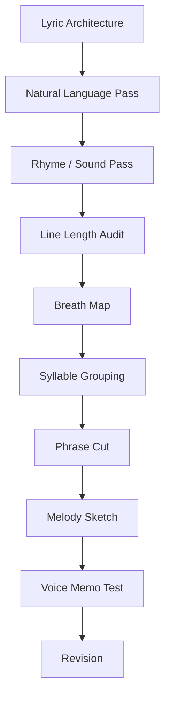
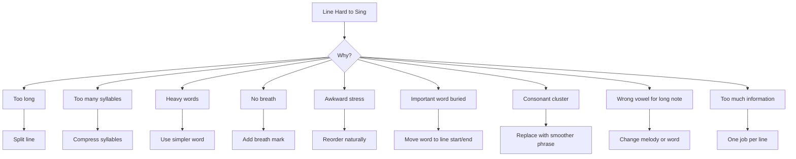

# learn-songwriting-part-016.md

# Line Length, Breath, and Singability: Membuat Lirik Bisa Dinyanyikan, Bukan Hanya Dibaca

> Seri: `learn-songwriting`  
> Part: `016 / 034`  
> Fokus: panjang baris, napas, phrase cut, syllable grouping, singability, vocal phrasing, dan lyric-to-melody readiness  
> Status seri: belum selesai  
> Prasyarat: `learn-songwriting-part-000.md` sampai `learn-songwriting-part-015.md`

---

## Ringkasan Part Ini

Part sebelumnya membahas **Rhyme Without Forcing**: bagaimana membuat rima dan bunyi natural tanpa mengorbankan makna.

Part ini membahas sesuatu yang lebih fisik:

> “Apakah lirik ini bisa dinyanyikan oleh mulut, napas, dan tubuh manusia?”

Banyak lirik terlihat bagus di halaman, tetapi gagal saat dinyanyikan.

Contoh:

```text
Aku masih mempertahankan semua kenangan yang pernah kita bangun bersama karena aku belum bisa menerima kepergianmu.
```

Maknanya jelas, tapi untuk lagu:

- terlalu panjang;
- terlalu banyak suku kata;
- terlalu banyak kata abstrak;
- sulit menemukan napas;
- kata penting terkubur;
- melodi sulit menampung;
- terdengar seperti kalimat prosa dipaksa bernyanyi.

Versi yang lebih singable:

```text
Kenanganmu
masih kutahan

di rumah
yang belum
belajar sepi
```

Atau:

```text
Gelasmu
di rak kedua

tak kupakai
tak kubuang
```

Lebih pendek, lebih bernafas, lebih mudah diberi melodi.

Part ini mengajarkan cara mengubah lyric draft menjadi lyric yang **ready for melody**.

Sebagai software engineer, pikirkan singability seperti runtime constraint:

```text
lyric must compile not only in meaning,
but also in mouth, breath, rhythm, and melody.
```

Lirik yang bagus secara semantik belum tentu valid secara vokal.

---

## Tujuan Part

Setelah menyelesaikan part ini, kamu harus bisa:

1. Memahami kenapa panjang baris memengaruhi melody.
2. Mengidentifikasi line yang terlalu panjang, terlalu padat, atau sulit dinyanyikan.
3. Membuat breath map untuk lirik.
4. Memotong frasa berdasarkan unit makna, napas, dan melody.
5. Mengelompokkan suku kata secara natural dalam Bahasa Indonesia.
6. Menentukan kata penting yang perlu mendapat nada panjang atau posisi kuat.
7. Mengurangi kata yang membuat mulut tersandung.
8. Membuat verse lebih conversational dan chorus lebih singable.
9. Mendesain line length contrast antar-section.
10. Menulis vocal phrasing instruction sederhana.
11. Menguji lirik dengan speak test, tap test, hum test, dan sing test.
12. Membuat file latihan `songwriting-practice-016-line-length-breath-singability.md`.

---

## Prinsip Utama

```text
A lyric is not finished until it can be breathed.
```

Lirik bukan hanya urutan kata. Lirik adalah urutan napas.

Jika pendengar atau penyanyi tidak tahu kapan bernapas, line akan terasa tegang secara tidak sengaja.

Jika setiap line terlalu padat, lagu tidak punya ruang.

Jika chorus terlalu sulit dinyanyikan, hook tidak akan menempel.

Jika kata penting jatuh di suku kata lemah, emosi melemah.

Singability bukan berarti lirik harus sederhana secara makna. Singability berarti makna dibentuk agar bisa lewat tubuh.

---

## Singability dalam Pipeline Songwriting



Part ini adalah jembatan menuju melody.

Setelah ini, part berikutnya akan membahas repetition dan memory, lalu kita akan masuk ke melody as shape.

---

# Bagian 1 — Apa Itu Singability?

Singability adalah tingkat kemudahan sebuah lirik untuk dinyanyikan dengan natural.

Singability dipengaruhi oleh:

- panjang baris;
- jumlah suku kata;
- posisi napas;
- vowel;
- konsonan;
- kata penting;
- rhythm;
- line break;
- repetition;
- register;
- tempo;
- melody contour;
- emotional state;
- vocal range;
- density antar-section.

Lirik singable biasanya:

1. punya phrase yang jelas;
2. bisa diucapkan natural;
3. bisa dinyanyikan tanpa napas tersiksa;
4. punya kata penting di tempat kuat;
5. tidak terlalu banyak syllable dalam satu phrase;
6. punya ruang untuk nada panjang;
7. chorus lebih mudah diulang;
8. line break membantu meaning;
9. tidak penuh kata penghubung;
10. cocok dengan persona dan genre.

---

## Singable vs Simplistic

Singable bukan berarti dangkal.

Contoh singable dan dalam:

```text
Tak kupakai
tak kubuang
```

Sederhana, tetapi membawa conflict.

Contoh tidak singable dan belum tentu dalam:

```text
Aku mempertahankan relik-relik relasional sebagai manifestasi ketidakmampuanku memproses kehilangan.
```

Kompleks secara kata, tetapi buruk sebagai lirik.

Prinsip:

```text
Deep feeling, simple mouth.
```

---

# Bagian 2 — Line Length

Line length adalah panjang baris dalam suku kata, kata, atau phrase.

Dalam lagu, line terlalu panjang bukan masalah angka saja. Masalahnya adalah apakah line bisa:

- diucapkan;
- dinyanyikan;
- diberi melody;
- diberi napas;
- dipahami saat terdengar;
- diingat.

## Contoh Line Panjang

```text
Aku masih menyimpan semua barang-barangmu karena aku belum bisa menerima bahwa kamu pergi.
```

Masalah:

- terlalu banyak informasi;
- tidak ada spotlight;
- sulit napas;
- seperti prosa.

## Versi Dipotong

```text
Barangmu
masih di rumah

pergimu
belum kupahami
```

Atau object-driven:

```text
Gelasmu
di rak kedua

tak kupakai
tak kubuang
```

---

## Approximate Line Length Guide

Ini bukan aturan mutlak, tapi berguna untuk MVS.

| Section | Range Umum | Catatan |
|---|---:|---|
| Verse line | 5–11 suku kata | boleh variatif, conversational |
| Pre-chorus line | 6–12 suku kata | boleh naik/padat untuk build |
| Chorus hook | 3–8 suku kata | harus mudah diulang |
| Chorus line | 4–10 suku kata | lebih ringkas dari verse |
| Bridge line | 3–10 suku kata | bisa lebih fragmentary |
| Outro line | 2–8 suku kata | aftertaste, ruang |

Jangan jadikan ini penjara. Gunakan sebagai diagnostic.

---

## Line Length Smells

| Smell | Gejala | Solusi |
|---|---|---|
| Prose line | seperti kalimat esai | pecah menjadi phrase |
| No breath | penyanyi kehabisan napas | tambah line break |
| Too many concepts | banyak ide dalam satu line | one job per line |
| Hook too long | sulit diingat | compress ke 3–7 kata |
| Verse too short | tidak cukup scene | tambah object/action |
| All lines same length | monoton | variasi panjang |
| Chorus longer than verse | chorus sulit diingat | potong chorus |
| Bridge too dense | reveal sulit diproses | beri ruang/silence |

---

# Bagian 3 — Suku Kata Bahasa Indonesia

Bahasa Indonesia relatif jelas dalam suku kata.

Contoh:

```text
Gelasmu di rak kedua
Ge-las-mu / di / rak / ke-du-a
= kira-kira 7 suku kata
```

```text
Tak kupakai, tak kubuang
Tak / ku-pa-kai / tak / ku-bu-ang
= kira-kira 7 suku kata
```

Pasangan ini enak karena jumlah dan rhythm relatif seimbang.

## Contoh Terlalu Padat

```text
Ketidakhadiranmu mengakibatkan kehampaan
Ke-ti-dak-ha-dir-an-mu / me-nga-ki-bat-kan / ke-ham-pa-an
```

Sangat padat, formal, dan berat di mulut.

Revisi:

```text
Kau tak ada
rumah kebanyakan ruang
```

Lebih natural.

---

## Syllable Count vs Syllable Feel

Menghitung suku kata membantu, tapi tidak cukup.

Dua line dengan jumlah suku kata sama bisa terasa berbeda.

Contoh:

```text
Gelasmu di rak kedua
```

Mudah.

```text
Menginterpretasikanmu
```

Mungkin jumlahnya tidak ekstrem, tapi kata berat dan abstrak.

Perhatikan:

- panjang kata;
- imbuhan;
- konsonan;
- vowel;
- natural stress;
- register;
- kata penting.

---

## Syllable Grouping

Jangan hanya menghitung total. Kelompokkan phrase.

```text
Gelasmu / di rak kedua
3 + 4
```

```text
Tak kupakai / tak kubuang
4 + 3
```

```text
Jangan panggil / ini pulang
4 + 4
```

Phrase grouping membuat melody lebih mudah.

Template:

```markdown
Line:
Syllable grouping:
Natural stress:
Breath point:
Important word:
```

---

# Bagian 4 — Breath

Breath adalah bagian dari komposisi.

Tanda sederhana:

```text
/  = napas pendek
// = napas panjang
... = jeda emosional
```

Contoh:

```text
Gelasmu di rak kedua /
tak kupindah sejak Selasa //

air panas tetap kusisakan /
untuk pagi yang salah sangka //
```

Atau chorus:

```text
Tak kupakai /
tak kubuang //

kau belum selesai /
di rumah yang kupanggil pulang //
```

Breath membantu:

- singer;
- melody;
- emotion;
- phrase clarity;
- AI music generation jika nanti dipakai;
- revisi line length.

---

## Breath as Meaning

Napas bisa mengubah makna.

```text
Aku belum selesai denganmu.
```

Satu kalimat.

Dengan break:

```text
Aku belum selesai

denganmu.
```

Lebih berat.

Atau:

```text
Aku belum selesai
dengan rumah
yang menyebutmu pulang.
```

Napas memberi ruang interpretasi.

---

## Breath Types

| Breath Type | Fungsi |
|---|---|
| short breath `/` | lanjut phrase, tidak terlalu putus |
| long breath `//` | akhir thought/line besar |
| silence `...` | emotional processing |
| no breath | urgency, anxiety, rush |
| broken breath | grief, exhaustion, hesitation |
| held word | emphasis, release |

## Breath and Emotion

| Emotion | Breath Behavior |
|---|---|
| Denial | controlled, short |
| Confession | longer after key phrase |
| Anger | clipped, accented |
| Grief | broken, uneven |
| Exhaustion | long gaps |
| Satire | precise, conversational |
| Prayer | spacious, repeated |
| Panic | dense, little breath |
| Acceptance | slower, open |

---

# Bagian 5 — Phrase Cut

Phrase cut adalah pemotongan line menjadi unit meaning dan singing.

## Bad Cut

```text
Aku masih menyimpan gelasmu karena /
aku belum bisa melepasmu dari /
rumah ini.
```

Cut melawan meaning.

## Better Cut

```text
Gelasmu masih kusimpan /
di rak kedua //

melepasmu /
belum punya tangan //
di rumah ini //
```

## Phrase Cut Principles

1. Potong di batas makna natural.
2. Jangan pisahkan kata yang harus bersama.
3. Beri spotlight pada object/hook.
4. Potong sebelum/after kata penting.
5. Gunakan silence untuk emotional turn.
6. Jangan semua line dipotong sama.
7. Cek dengan speak test.

---

## Phrase Cut Template

```markdown
# Phrase Cut

Original line:
...

Meaning units:
1.
2.
3.

Possible cuts:
A:
B:
C:

Best cut:
...

Why:
...
```

---

# Bagian 6 — One Breath Test

Setiap phrase utama harus bisa dinyanyikan dalam satu napas wajar.

Test:

1. Ucapkan phrase.
2. Ucapkan lebih lambat.
3. Nyanyikan dengan nada random.
4. Jika kehabisan napas, potong.
5. Jika kata penting terlalu cepat lewat, beri ruang.

## Example

Line:

```text
Aku masih mencoba memahami semua alasan yang membuatmu pergi dari rumah ini
```

Tidak one-breath friendly.

Meaning units:

```text
Aku masih mencoba memahami
semua alasan
yang membuatmu pergi
dari rumah ini
```

Lyric version:

```text
Aku masih mencari /
alasanmu pergi //

di rumah ini /
yang terlalu pandai /
menunggu //
```

Lebih bernapas.

---

# Bagian 7 — Tap Test

Tap test membantu rhythm.

Caranya:

1. Ketuk meja dengan tempo stabil.
2. Ucapkan line mengikuti ketukan.
3. Rasakan syllable yang terlalu padat.
4. Tandai tempat yang tersandung.
5. Revisi.

## Example

Line:

```text
Ketidakhadiranmu mengakibatkan kehampaan
```

Tap test akan terasa berat.

Revisi:

```text
Kau tak ada /
rumah terlalu luas //
```

Lebih mudah masuk beat.

## Tap Test Marking

```markdown
Line:
Tap feel:
- [ ] smooth
- [ ] too dense
- [ ] awkward stress
- [ ] needs split
- [ ] good hook rhythm

Revision:
...
```

---

# Bagian 8 — Hum Test

Hum test adalah menguji apakah line punya melodic potential.

Caranya:

1. Ucapkan line.
2. Hum tanpa kata.
3. Cari natural rise/fall.
4. Masukkan kata kembali.
5. Cek apakah kata penting cocok di peak.

Contoh:

```text
Jangan panggil ini pulang
```

Natural contour bisa:

```text
jan-gan PANG-gil i-ni PU-lang
```

Kata penting:

```text
panggil, pulang
```

Bisa diberi nada lebih kuat.

Line:

```text
Aku mengalami ketidakhadiranmu
```

Sulit menemukan melodic contour natural karena terlalu formal.

---

# Bagian 9 — Important Word Placement

Kata penting harus diberi spotlight.

Kata penting bisa:

- title;
- hook;
- emotional thesis;
- object utama;
- address;
- verb penting;
- contradiction word.

Contoh:

```text
Tak kupakai
tak kubuang
```

Kata penting:

- pakai;
- buang.

Mereka berada di akhir phrase. Kuat.

Contoh:

```text
Jangan panggil ini pulang
```

Kata penting:

- jangan;
- panggil;
- pulang.

“Pulang” di akhir line. Kuat.

## Bad Placement

```text
Aku masih terus saja mencoba untuk tidak mengingat namamu.
```

Kata penting “namamu” muncul setelah banyak filler.

Revisi:

```text
Namamu
masih tahu jalan
ke mulutku.
```

Kata penting di awal.

---

## Spotlight Positions

| Position | Efek |
|---|---|
| awal line | langsung menarik |
| akhir line | kuat, memorable |
| setelah silence | dramatic |
| sebelum breath | hanging |
| nada tinggi | emotional peak |
| nada panjang | emphasis |
| repeated phrase | memory |
| chorus first line | identity |
| final line | aftertaste |

---

# Bagian 10 — Vowels and Long Notes

Kata yang dinyanyikan panjang sebaiknya punya vowel yang enak.

## Vokal Terbuka

```text
a
```

Contoh:

```text
sayang
pulang
nama
rumah
```

Enak untuk nada panjang.

## Vokal i

Bisa tajam/tipis.

```text
sepi
sendiri
piring
kecil
```

Bisa bagus untuk rasa rapuh, tapi hati-hati jika nada terlalu tinggi dan panjang.

## Vokal u

Lebih gelap/tertutup.

```text
rindu
tunggu
rumahku
pintu
lampu
```

Bagus untuk mood tertahan.

## Vokal e/o

Bervariasi.

```text
gelas
lelah
kosong
lorong
```

Bisa kuat tergantung melody.

## Long Note Test

Jika kata hook akan dipanjangkan, coba nyanyikan vowel-nya.

```text
pu-laaaang
sa-yaaang
na-maaa
ru-maaaah
```

Bandingkan:

```text
menginterpretasikannnn
```

Tidak enak.

---

# Bagian 11 — Consonant Difficulty

Konsonan tertentu bisa membuat line tersandung jika terlalu rapat.

Contoh berat:

```text
struktural
kompleksitas
mengonstruksi
transkrip
praktik-praktik
```

Bisa digunakan, tapi hati-hati.

## Cluster Problem

Bahasa Indonesia relatif lebih mudah daripada beberapa bahasa lain, tapi kata serapan bisa berat:

```text
ekspresi
struktur
friksi
konflik
skripsi
```

Untuk lagu lembut, pilih kata yang lebih ringan jika bisa.

## Example

Heavy:

```text
Konflik struktural ini membekukan ekspresiku.
```

Lyric:

```text
Mulutku beku
sebelum namamu
jadi suara.
```

---

# Bagian 12 — Line Compression

Compression adalah mengurangi kata tanpa kehilangan meaning.

## Before

```text
Aku masih menyimpan gelasmu di rak kedua karena aku belum sanggup membuang semua kenangan tentangmu.
```

## Step 1: Meaning

```text
narator menyimpan gelas karena belum bisa melepas
```

## Step 2: Objects

```text
gelas, rak kedua
```

## Step 3: Conflict Action

```text
tak kupakai, tak kubuang
```

## After

```text
Gelasmu
di rak kedua

tak kupakai
tak kubuang
```

Compression bukan hanya potong kata. Compression mencari bentuk paling bernyanyi dari makna.

---

## Compression Techniques

| Technique | Example |
|---|---|
| remove explanation | hapus “karena aku merasa” |
| replace concept with object | ketidakhadiran -> kursi kosong |
| split line | satu kalimat jadi phrase |
| remove filler | masih terus saja mencoba -> masih mencoba |
| use pronoun economy | aku telah -> ku- |
| use verb stronger | melakukan penyimpanan -> menyimpan |
| use hook contradiction | tidak dipakai/tidak dibuang |
| remove duplicate meaning | jangan katakan dua kali kecuali sengaja |

---

# Bagian 13 — Expansion When Too Thin

Kadang line terlalu pendek dan tidak cukup scene.

Terlalu thin:

```text
Aku sepi.
```

Expand with object:

```text
Televisi menyala
untuk suara
yang tak perlu kujawab.
```

Terlalu thin:

```text
Kau pergi.
```

Expand:

```text
Kopermu siap lagi
sebelum meja
selesai retak.
```

Expansion berguna di verse. Compression berguna di chorus.

---

# Bagian 14 — Verse Singability

Verse boleh lebih conversational daripada chorus.

Verse biasanya:

- detail;
- story/evidence;
- rhythm lebih bebas;
- line length lebih variatif;
- melody lebih sempit;
- less repetition.

## Verse Singability Checklist

```markdown
- [ ] Setiap line bisa diucapkan natural.
- [ ] Tidak semua line terlalu panjang.
- [ ] Ada napas antar-image.
- [ ] Object utama jelas.
- [ ] Line 4 atau akhir stanza punya pivot.
- [ ] Tidak terlalu banyak kata abstrak.
- [ ] Bisa dinyanyikan dengan melody sempit.
```

## Verse Example

```text
Gelasmu di rak kedua /
tak kupindah sejak Selasa //

air panas tetap kusisakan /
untuk pagi yang salah sangka //
```

Line length cukup seimbang, image jelas, napas ada.

---

# Bagian 15 — Chorus Singability

Chorus harus lebih mudah dinyanyikan dan diingat.

Chorus biasanya:

- lebih pendek;
- lebih repetitive;
- hook jelas;
- title muncul;
- vowel lebih terbuka;
- line break lebih kuat;
- melody lebih memorable.

## Chorus Singability Checklist

```markdown
- [ ] Hook bisa dinyanyikan 5 kali tanpa terasa canggung.
- [ ] Title/hook tidak terlalu panjang.
- [ ] Ada repetition.
- [ ] Kata penting di awal/akhir phrase.
- [ ] Ada ruang untuk nada panjang.
- [ ] Tidak terlalu banyak informasi baru.
- [ ] Bisa diingat setelah sekali dengar.
```

## Chorus Example

```text
Tak kupakai /
tak kubuang //

kau belum selesai /
di rumah yang kupanggil pulang //
```

Kenapa singable:

- phrase pendek;
- repetition;
- contrast;
- `pulang` enak untuk nada panjang;
- hook action jelas.

---

# Bagian 16 — Bridge Singability

Bridge boleh lebih fragmentary.

Bridge sering membawa reveal. Jangan terlalu padat.

## Bridge Too Dense

```text
Aku baru menyadari bahwa sebenarnya yang kutunggu bukanlah dirimu melainkan versi diriku yang dulu.
```

## Bridge Singable

```text
Baru kusadar /
bukan kau //

yang paling lama /
kutunggu //

tapi aku /
sebelum rumah ini /
belajar sepi //
```

Bridge memberi ruang untuk realization.

## Bridge Checklist

```markdown
- [ ] Ada turn/reveal.
- [ ] Tidak seperti essay.
- [ ] Line lebih spacious.
- [ ] Bisa dinyanyikan lebih pelan/berbeda.
- [ ] Menyiapkan final chorus.
- [ ] Tidak memperkenalkan terlalu banyak kata baru.
```

---

# Bagian 17 — Pre-Chorus Singability

Pre-chorus berfungsi sebagai build.

Ia boleh sedikit lebih padat atau naik, tapi jangan membuat penyanyi tersiksa.

## Pre-Chorus Pattern

```text
short line -> longer line -> lift -> unresolved phrase
```

Contoh:

```text
Tiap pagi /
aku hampir jujur //

namamu tinggal satu napas /
sebelum kutukar jadi lagu //
```

Pre-chorus membawa pressure menuju chorus.

## Pre-Chorus Checklist

```markdown
- [ ] Ada rasa naik/build.
- [ ] Tidak lebih memorable dari chorus kecuali sengaja.
- [ ] Akhirnya menggantung ke chorus.
- [ ] Breath masih manageable.
- [ ] Kata terakhir sebelum chorus punya tension.
```

---

# Bagian 18 — Outro Singability

Outro adalah aftertaste.

Outro tidak perlu panjang.

Contoh:

```text
di rak kedua //
masih //
```

Atau:

```text
jangan panggil ini pulang //
```

Outro bisa memakai:

- repeated hook;
- shortened hook;
- final object;
- whispered line;
- unresolved phrase.

## Outro Checklist

```markdown
- [ ] Tidak melemahkan final chorus.
- [ ] Memberi aftertaste.
- [ ] Mudah dinyanyikan pelan.
- [ ] Tidak menambah informasi besar baru.
```

---

# Bagian 19 — Matching Line Length Across Sections

Line length contrast membantu section terasa berbeda.

## Example

Verse:

```text
Gelasmu di rak kedua
tak kupindah sejak Selasa
air panas tetap kusisakan
untuk pagi yang salah sangka
```

Chorus:

```text
Tak kupakai
tak kubuang
```

Chorus lebih pendek dan repetitive. Kontras.

## Section Length Map

```markdown
| Section | Average Line Length | Feel |
|---|---:|---|
| Verse 1 | 7–9 syllables | conversational/detail |
| Chorus | 3–8 syllables | hook/repetition |
| Verse 2 | 7–10 syllables | development |
| Bridge | 3–8 syllables | spacious/reveal |
```

Tujuannya bukan angka presisi, tapi feeling.

---

# Bagian 20 — Density and Rest

Rest atau jeda sama pentingnya dengan kata.

Jika semua penuh, pendengar lelah.

## Dense

```text
Gelasmu di rak kedua tak kupindah sejak Selasa air panas tetap kusisakan untuk pagi yang salah sangka
```

## With Rest

```text
Gelasmu di rak kedua /
tak kupindah sejak Selasa //

air panas tetap kusisakan /
untuk pagi yang salah sangka //
```

Rest membuat image bisa diproses.

## Rest Functions

| Rest | Function |
|---|---|
| after object | memberi image spotlight |
| before hook | membangun anticipation |
| after confession | membiarkan emosi turun |
| before final word | memberi weight |
| after question | membuat listener menjawab |
| in bridge | memberi realization space |

---

# Bagian 21 — Phrasing Instruction

Kadang kamu perlu menulis instruksi performatif sederhana.

Contoh:

```markdown
[Verse 1 - soft, almost spoken, restrained]
Gelasmu di rak kedua /
tak kupindah sejak Selasa //

[Chorus - more open, hold "buang" and "pulang"]
Tak kupakai /
tak kubuang //

kau belum selesai /
di rumah yang kupanggil pulang //
```

Instruksi tidak harus detail seperti produksi. Cukup membantu singer/AI/dirimu memahami phrasing.

## Instruction Categories

- soft;
- whispered;
- almost spoken;
- held note;
- clipped;
- breathy;
- restrained;
- rising;
- falling;
- pause before line;
- repeat softer;
- final line almost spoken;
- more open;
- bitter smile;
- exhausted;
- intimate;
- accusatory;
- prayer-like.

---

## Phrasing Instruction Template

```markdown
[Section - vocal direction]
Line / phrase marks

Notes:
- hold:
- breathe after:
- emphasize:
- avoid rushing:
```

Contoh:

```markdown
[Chorus - open but restrained]
Tak kupakai /
tak kubuang //

kau belum selesai /
di rumah yang kupanggil pulang //

Notes:
- hold "buang" slightly
- hold "pulang" longer
- don't rush "kau belum selesai"
```

---

# Bagian 22 — Emotional Phrasing

Phrasing harus mengikuti emotional state.

## Denial

```text
short, controlled, not too emotional
```

Line:

```text
Gelasmu di rak kedua /
tak kupindah sejak Selasa //
```

## Confession

```text
more open, longer vowel, slight release
```

Line:

```text
Tak kupakai /
tak kubuang //
```

## Anger

```text
clipped, accented, less legato
```

Line:

```text
Jangan panggil /
ini pulang //
```

## Grief

```text
broken, breathy, more silence
```

Line:

```text
Aku lelah /
jadi rumah //
```

## Satire

```text
precise, conversational, bitter restraint
```

Line:

```text
Tuan /
jangan panggil ini pulang //
```

---

# Bagian 23 — Avoiding Monotone Phrasing

Jika semua line punya panjang dan phrasing sama, lagu monoton.

Contoh monotone:

```text
Gelasmu di rak kedua
Tak kupindah sejak Selasa
Air panas tetap kusisakan
Untuk pagi yang salah sangka
```

Bisa bekerja, tapi jika melody juga sama, monoton.

Tambahkan variation:

```text
Gelasmu
di rak kedua

tak kupindah
sejak Selasa

air panas
tetap kusisakan

untuk pagi
yang salah sangka
```

Atau chorus contrast:

```text
Tak kupakai
tak kubuang
```

Variation bisa dari line break, rest, repetition.

---

# Bagian 24 — Over-Cutting

Terlalu banyak line break juga bisa mengganggu.

Over-cut:

```text
Ge
las
mu

di
rak

ke
dua
```

Tidak natural kecuali experimental.

Over-cut membuat lirik patah tanpa alasan.

Good cut:

```text
Gelasmu /
di rak kedua //
```

Pertanyaan:

```text
Apakah cut membantu meaning/napas?
Atau hanya membuat line terlihat puitis?
```

---

# Bagian 25 — Under-Cutting

Under-cut adalah line terlalu panjang tanpa napas.

```text
Gelasmu di rak kedua tak kupindah sejak Selasa air panas tetap kusisakan untuk pagi yang salah sangka
```

Solusi:

```text
Gelasmu di rak kedua /
tak kupindah sejak Selasa //

air panas tetap kusisakan /
untuk pagi yang salah sangka //
```

---

# Bagian 26 — Singability Debugging



## Debug Questions

```text
Apakah line bisa diucapkan natural?
Apakah bisa dinyanyikan satu napas?
Apakah ada suku kata terlalu banyak?
Apakah kata penting terkubur?
Apakah ada kata berat?
Apakah line break membantu?
Apakah phrase punya rhythm?
Apakah chorus lebih mudah dari verse?
Apakah hook bisa diulang?
```

---

# Bagian 27 — Line Length Audit

Template:

```markdown
# Line Length Audit

| Section | Line | Approx Syllables | Breath | Issue | Revision |
|---|---|---:|---|---|---|
| Verse 1 |  |  |  |  |  |
```

Approx syllables tidak perlu sempurna. Tujuannya melihat line yang jauh terlalu panjang.

Contoh:

```markdown
| Verse 1 | Gelasmu di rak kedua | 7 | after line | ok | keep |
| Verse 1 | Aku masih menyimpan semua kenangan... | 20+ | no breath | too long | split/compress |
```

---

# Bagian 28 — Breath Map

Template:

```markdown
# Breath Map

## Verse 1
line /
line //

## Chorus
line /
line //

## Verse 2
line /
line //

## Bridge
line /
line //

## Final Chorus
line /
line //
```

Tambahkan notes:

```markdown
Hold:
Emphasize:
Almost spoken:
Do not rush:
```

---

# Bagian 29 — Singability Scoring

Gunakan scoring 1–5.

| Criteria | Question |
|---|---|
| Speak natural | Bisa diucapkan? |
| Breath | Ada napas? |
| Syllable load | Tidak terlalu padat? |
| Important word | Dapat spotlight? |
| Vowel | Enak untuk note penting? |
| Persona | Cocok dengan suara narator? |
| Hook repeatability | Bisa diulang? |
| Melody potential | Mudah di-hum? |

Template:

```markdown
| Line/Section | Speak | Breath | Syllable | Spotlight | Vowel | Repeat | Total |
|---|---:|---:|---:|---:|---:|---:|---:|
|  |  |  |  |  |  |  |  |
```

---

# Bagian 30 — Example Full Pass: Rindu Domestik

## Draft

```text
Gelasmu di rak kedua
tak kupindah sejak Selasa
air panas tetap kusisakan
untuk pagi yang salah sangka

Tak kupakai
tak kubuang

kau belum selesai
di rumah yang kupanggil pulang
```

## Breath Map

```text
Gelasmu di rak kedua /
tak kupindah sejak Selasa //

air panas tetap kusisakan /
untuk pagi yang salah sangka //

Tak kupakai /
tak kubuang //

kau belum selesai /
di rumah yang kupanggil pulang //
```

## Phrase Notes

```markdown
Verse:
soft, almost spoken, restrained.
Do not over-sing.

Chorus:
open slightly.
Hold "buang".
Let "pulang" land longer.

Important words:
gelasmu, Selasa, kusisakan, tak kupakai, tak kubuang, belum selesai, pulang.
```

## Possible Melody Behavior

```markdown
Verse:
low range, narrow, speech-like.

Chorus:
slightly higher, more repetitive, longer note on "buang" and "pulang".
```

---

# Bagian 31 — Example Full Pass: Romansa Satir

## Draft

```text
Sayang, kopermu siap lagi
licin di lantai bandara
kau cium anak-anak di dahi
seperti pamit bisa jadi doa

Jangan panggil ini pulang
jika rumah hanya kau singgahi
sebagai panggung
```

## Breath Map

```text
Sayang, kopermu siap lagi /
licin di lantai bandara //

kau cium anak-anak di dahi /
seperti pamit bisa jadi doa //

Jangan panggil ini pulang /
jika rumah hanya kau singgahi //
sebagai panggung //
```

## Phrasing Notes

```markdown
Verse:
sweet on surface, bitter underneath.
"Sayang" should be soft, not angry yet.

Chorus:
more direct.
Emphasize "jangan", "pulang", "panggung".
Hold "pulang" enough to make accusation clear.

Final chorus variation:
If "Sayang" changes to "Tuan", make it colder and more clipped.
```

---

# Bagian 32 — Common Phrase Shapes

## 3-Part Hook

```text
tak kupakai /
tak kubuang //
```

Short contrast.

## Address + Command

```text
Tuan /
jangan panggil ini pulang //
```

Very strong for satire.

## Object + State

```text
Gelasmu /
belum jadi benda //
```

Poetic but simple.

## Place + Emotional Twist

```text
Rumah ini /
kebanyakan ruang //
```

Direct and singable.

## Question Hook

```text
Pulang /
ke siapa? //
```

Very short, strong.

## Refrain Shape

```text
dan gelasmu /
tetap di rak kedua //
```

Longer, good as verse ending.

---

# Bagian 33 — Writing Vocal Instructions Per Section

Karena user sering ingin AI atau singer memahami emosi, latihan ini penting.

## Minimal Instruction Format

```markdown
[Verse 1 - soft, restrained, almost spoken]
...

[Chorus - open, memorable, hold hook]
...

[Verse 2 - slightly more intense, still intimate]
...

[Bridge - quieter, reflective, more space]
...

[Final Chorus - same hook, deeper meaning, slower last line]
...
```

## What to Specify

- volume;
- emotional state;
- articulation;
- breath;
- held words;
- quoted/dialog lines;
- whisper/spoken;
- where to pause;
- where not to rush;
- final line delivery.

## What Not to Overdo

Jangan terlalu banyak instruksi sampai mengganggu lyric sheet.

Cukup instruksi yang memengaruhi delivery.

---

# Bagian 34 — Singability for AI Music Generation

Jika nanti lirik dipakai di AI music generator, singability marking membantu.

Contoh:

```markdown
[Verse 1: male baritone, soft, intimate, almost spoken]
Gelasmu di rak kedua /
tak kupindah sejak Selasa //

[Chorus: more open, slow, hold final words]
Tak kupakai /
tak kubuang //

kau belum selesai /
di rumah yang kupanggil pulang //
```

AI sering lebih baik jika:

- line tidak terlalu panjang;
- section label jelas;
- phrase break jelas;
- quotes/dialog ditandai;
- repeated hook jelas;
- vocal direction ringkas;
- tidak terlalu banyak kata dalam satu line.

Part ini bukan prompt engineering, tapi lyric formatting yang baik membantu downstream.

---

# Bagian 35 — Singability Anti-Patterns

## Anti-Pattern 1: Prose in Melody

Gejala:

```text
kalimat panjang dipaksa masuk melodi.
```

Solusi:

```text
pecah phrase, compress.
```

## Anti-Pattern 2: No Breath

Gejala:

```text
penyanyi tidak tahu kapan napas.
```

Solusi:

```text
breath map.
```

## Anti-Pattern 3: Hook Too Long

Gejala:

```text
chorus sulit diingat.
```

Solusi:

```text
hook 3–8 suku kata/phrase pendek.
```

## Anti-Pattern 4: Important Word Buried

Gejala:

```text
kata paling penting lewat cepat.
```

Solusi:

```text
pindah ke awal/akhir phrase.
```

## Anti-Pattern 5: Over-Compressed

Gejala:

```text
line terlalu fragmentary dan tidak jelas.
```

Solusi:

```text
tambahkan context di verse.
```

## Anti-Pattern 6: Same Length Everywhere

Gejala:

```text
lagu monoton.
```

Solusi:

```text
contrast verse/chorus/bridge.
```

## Anti-Pattern 7: Heavy Words

Gejala:

```text
mulut tersandung kata formal.
```

Solusi:

```text
ganti dengan object/action sederhana.
```

## Anti-Pattern 8: Breath Breaks Meaning

Gejala:

```text
line break memotong grammar secara aneh.
```

Solusi:

```text
cut berdasarkan phrase meaning.
```

## Anti-Pattern 9: Chorus Harder Than Verse

Gejala:

```text
chorus lebih padat daripada verse.
```

Solusi:

```text
simplify chorus.
```

## Anti-Pattern 10: No Sing Test

Gejala:

```text
lirik bagus di halaman, gagal di suara.
```

Solusi:

```text
record voice memo.
```

---

# Bagian 36 — Latihan Utama Part 016

Buat file:

```text
songwriting-practice-016-line-length-breath-singability.md
```

Isi template berikut.

```markdown
# songwriting-practice-016-line-length-breath-singability.md

## 1. Draft Source
Tempel draft lyric v0.3 dari part 015.

...

## 2. Song Promise
...

## 3. POV / Register
Narrator:
Addressee:
Register:
Vocal persona:

## 4. Structure
...

## 5. Line Length Audit

| Section | Line | Approx Syllables | Breath Possible? | Issue | Revision |
|---|---|---:|---|---|---|
|  |  |  |  |  |  |

## 6. Important Word List
Kata/frasa yang harus mendapat spotlight:
1.
2.
3.
4.
5.
6.
7.
8.
9.
10.

## 7. Breath Map

### Verse 1
...

### Pre-Chorus optional
...

### Chorus
...

### Verse 2
...

### Bridge optional
...

### Final Chorus
...

### Outro optional
...

## 8. Phrase Cut Alternatives
Pilih 5 line paling penting.

### Line 1
Original:
Cut A:
Cut B:
Chosen:
Why:

### Line 2
Original:
Cut A:
Cut B:
Chosen:
Why:

### Line 3
Original:
Cut A:
Cut B:
Chosen:
Why:

### Line 4
Original:
Cut A:
Cut B:
Chosen:
Why:

### Line 5
Original:
Cut A:
Cut B:
Chosen:
Why:

## 9. Singability Scoring

| Line/Section | Speak | Breath | Syllable | Spotlight | Vowel | Repeat | Total |
|---|---:|---:|---:|---:|---:|---:|---:|
| Verse 1 |  |  |  |  |  |  |  |
| Chorus |  |  |  |  |  |  |  |
| Verse 2 |  |  |  |  |  |  |  |
| Bridge |  |  |  |  |  |  |  |
| Final Chorus |  |  |  |  |  |  |  |

## 10. Vocal Phrasing Instructions

### Verse 1
Vocal direction:
Hold:
Emphasize:
Do not rush:
Breath notes:

### Chorus
Vocal direction:
Hold:
Emphasize:
Do not rush:
Breath notes:

### Verse 2
Vocal direction:
Hold:
Emphasize:
Do not rush:
Breath notes:

### Bridge
Vocal direction:
Hold:
Emphasize:
Do not rush:
Breath notes:

### Final Chorus
Vocal direction:
Hold:
Emphasize:
Do not rush:
Breath notes:

## 11. Singability Rewrite v0.4

### Verse 1
...

### Pre-Chorus
...

### Chorus
...

### Verse 2
...

### Chorus
...

### Bridge
...

### Final Chorus
...

### Outro
...

## 12. Voice Memo Test
Date:
Take:
What felt easy:
What felt hard:
Where I ran out of breath:
Where hook felt strong:
Where melody resisted lyric:

## 13. Lines to Protect
1.
2.
3.
4.
5.

## 14. Lines to Revise Later
1.
2.
3.
4.
5.

## 15. Next Action
...
```

---

# Latihan 30 Menit: Breath Map

Ambil draft lyric.

Tandai:

```text
/ short breath
// long breath
... pause
```

Lalu baca/nyanyikan pelan.

Output:

```markdown
Lines with bad breath:
Lines fixed:
Chorus breath score:
Next revision:
```

---

# Latihan 45 Menit: Line Length Compression

Pilih 8 line terpanjang.

Untuk tiap line:

1. tulis meaning;
2. potong filler;
3. ganti konsep dengan object/action;
4. pecah phrase;
5. nyanyikan kasar.

Template:

```markdown
Original:
Meaning:
Compressed A:
Compressed B:
Chosen:
Why:
```

---

# Latihan 60 Menit: Full Singability Pass

Ambil draft v0.3.

Buat v0.4 dengan fokus:

- line length;
- phrase cut;
- breath;
- hook repeatability;
- important word spotlight;
- vocal instruction.

Lalu rekam voice memo.

Output:

```markdown
v0.4 lyric:
Voice memo notes:
Most singable line:
Hardest line:
Hook result:
Next action:
```

---

# Checklist Part 016

Sebelum lanjut ke part 017, pastikan:

- [ ] Kamu sudah memahami singability sebagai constraint mulut, napas, rhythm, dan melody.
- [ ] Kamu sudah melakukan line length audit.
- [ ] Kamu sudah menandai breath map.
- [ ] Kamu sudah menguji phrase cut.
- [ ] Kamu tahu kata penting yang perlu spotlight.
- [ ] Kamu sudah mengurangi line terlalu panjang.
- [ ] Kamu sudah menguji chorus hook secara repetisi.
- [ ] Kamu sudah membuat vocal phrasing instruction per section.
- [ ] Kamu sudah membuat draft v0.4 yang lebih singable.
- [ ] Kamu sudah merekam minimal satu voice memo.
- [ ] Kamu mencatat bagian yang mudah dan sulit dinyanyikan.
- [ ] Kamu punya next action menuju repetition, variation, and memory.

---

# Output Wajib Part 016

Buat file:

```text
songwriting-practice-016-line-length-breath-singability.md
```

Isi minimal:

```markdown
# songwriting-practice-016-line-length-breath-singability.md

## Draft Source
...

## Song Promise
...

## POV / Register
...

## Line Length Audit
...

## Important Word List
...

## Breath Map
...

## Phrase Cut Alternatives
...

## Singability Scoring
...

## Vocal Phrasing Instructions
...

## Singability Rewrite v0.4
...

## Voice Memo Test
...

## Next Action
...
```

---

# Common Failure Modes di Part Ini

## 1. Lirik Masih Berbentuk Prosa

Gejala:

```text
line panjang seperti paragraph.
```

Solusi:

```text
pecah ke phrase dan compress.
```

## 2. Napas Tidak Ditandai

Gejala:

```text
penyanyi/AI menabrak line.
```

Solusi:

```text
buat breath map.
```

## 3. Semua Line Sama Panjang

Gejala:

```text
monoton.
```

Solusi:

```text
buat contrast verse vs chorus vs bridge.
```

## 4. Hook Sulit Diulang

Gejala:

```text
chorus tidak memorable.
```

Solusi:

```text
pendekkan hook dan ulangi.
```

## 5. Kata Penting Tidak Diberi Spotlight

Gejala:

```text
title/hook lewat begitu saja.
```

Solusi:

```text
pindah ke awal/akhir phrase atau beri held note.
```

## 6. Terlalu Banyak Kata Berat

Gejala:

```text
mulut tersandung.
```

Solusi:

```text
ganti dengan kata sederhana/object/action.
```

## 7. Line Break Hanya Estetis

Gejala:

```text
potongan tidak membantu meaning/napas.
```

Solusi:

```text
cut berdasarkan phrase meaning.
```

## 8. Bridge Menjadi Esai

Gejala:

```text
bridge reveal terlalu banyak kata.
```

Solusi:

```text
fragment dan space.
```

## 9. Chorus Terlalu Banyak Informasi

Gejala:

```text
chorus sulit diingat.
```

Solusi:

```text
satu thesis, satu hook, repetition.
```

## 10. Tidak Ada Voice Memo

Gejala:

```text
singability hanya diasumsikan.
```

Solusi:

```text
rekam, dengar, revisi.
```

---

# Prinsip Penting

```text
The body is the final editor of lyric.
```

Dan:

```text
If the line cannot breathe, the emotion cannot land.
```

Lirik harus benar di makna, tetapi juga benar di mulut.

---

# Bridge ke Part Berikutnya

Part ini membahas line length, breath, dan singability.

Part berikutnya, `learn-songwriting-part-017.md`, akan membahas:

```text
Repetition, Variation, and Memory
```

Kita akan memperdalam:

- kenapa pengulangan membuat lagu menempel;
- kapan repetition menjadi membosankan;
- motif lirik;
- motif melodi;
- hook return;
- chorus variation;
- final chorus reframing;
- callback;
- mantra;
- repetition sebagai emotional pressure;
- cara membuat lagu mudah diingat tanpa menjadi monoton.

Setelah lirik bisa dinyanyikan, kita akan memastikan lirik bisa **diingat**.

---

# Status Seri

Part ini selesai.

```text
Selesai: learn-songwriting-part-016.md
Berikutnya: learn-songwriting-part-017.md
Status seri: belum selesai
Part tersisa: 18
Target akhir seri: learn-songwriting-part-034.md
```


<!-- NAVIGATION_FOOTER -->
<div class="page-nav">
<a href="./learn-songwriting-part-015.md">⬅️ Rhyme Without Forcing: Membuat Rima, Bunyi, dan Pengulangan yang Natural Tanpa Mengorbankan Makna</a>
<a href="./index.md">📚 Kategori</a>
<a href="../../index.md">🏠 Home</a>
<a href="./learn-songwriting-part-017.md">Repetition, Variation, and Memory: Membuat Lagu Menempel di Ingatan Tanpa Menjadi Monoton ➡️</a>
</div>
