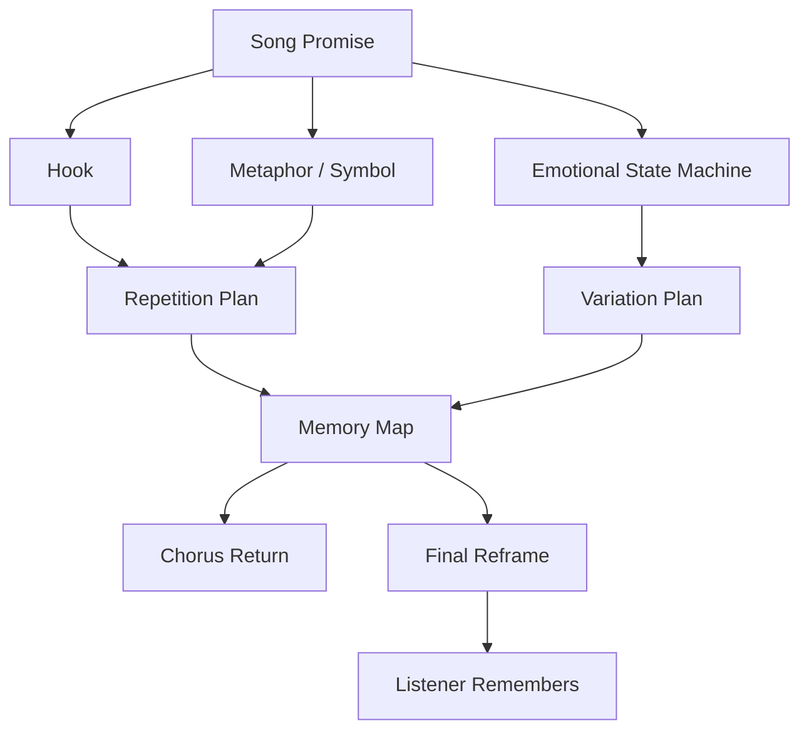
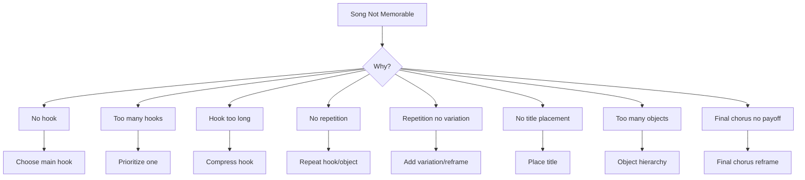

# learn-songwriting-part-017.md

# Repetition, Variation, and Memory: Membuat Lagu Menempel di Ingatan Tanpa Menjadi Monoton

> Seri: `learn-songwriting`  
> Part: `017 / 034`  
> Fokus: repetition, variation, hook return, motif, callback, memory design, chorus reframing, dan anti-monotony  
> Status seri: belum selesai  
> Prasyarat: `learn-songwriting-part-000.md` sampai `learn-songwriting-part-016.md`

---

## Ringkasan Part Ini

Part sebelumnya membahas **Line Length, Breath, and Singability**: bagaimana membuat lirik bisa dinyanyikan oleh mulut, napas, dan tubuh.

Part ini membahas pertanyaan berikutnya:

> “Setelah bisa dinyanyikan, apakah lagu ini bisa diingat?”

Lagu bukan hanya harus punya makna. Lagu harus punya **memori**.

Pendengar jarang mengingat semua lirik. Mereka biasanya mengingat:

- satu hook;
- satu frasa;
- satu nada;
- satu object;
- satu image;
- satu line;
- satu repetition;
- satu momen emosional;
- satu perubahan kecil di final chorus.

Karena itu songwriting harus mendesain memori.

Repetition adalah alat utama untuk membuat lagu menempel.

Tetapi repetition punya risiko:

```text
terlalu sedikit repetition -> lagu sulit diingat
terlalu banyak repetition tanpa perkembangan -> lagu membosankan
```

Maka kita butuh pasangan:

```text
repetition + variation
```

Repetition memberi familiaritas.  
Variation memberi perkembangan.

Contoh:

```text
Tak kupakai
tak kubuang
```

Jika muncul sekali, mungkin lewat.

Jika muncul beberapa kali, ia menjadi hook.

Jika final chorus mengubah sedikit:

```text
Tak kupakai
tak kubuang

aku
di rak kedua
```

maka repetition mendapat payoff.

Inilah inti part ini:

> Lagu yang kuat sering mengulang sesuatu yang sama, tetapi membuatnya terasa berbeda karena konteks berubah.

Sebagai software engineer, pikirkan repetition seperti reusable component, dan variation seperti parameter/state yang berubah.

Component sama:

```text
hook phrase
```

State berbeda:

```text
chorus 1 = denial
chorus 2 = deeper admission
final chorus = self-recognition
```

---

## Tujuan Part

Setelah menyelesaikan part ini, kamu harus bisa:

1. Memahami repetition sebagai memory engine.
2. Membedakan repetition, variation, motif, callback, refrain, hook return, dan mantra.
3. Menentukan apa yang harus diulang dalam lagu.
4. Menentukan apa yang harus berubah agar repetition tidak monoton.
5. Membuat hook return dengan makna bertambah.
6. Mendesain lyric motif dan melodic motif.
7. Menggunakan repetition untuk emotional pressure.
8. Menggunakan variation untuk escalation dan payoff.
9. Membuat final chorus reframing.
10. Menghindari repetition yang terlalu banyak, terlalu sedikit, atau tidak bermakna.
11. Membuat memory map untuk lagu.
12. Membuat file latihan `songwriting-practice-017-repetition-variation-memory.md`.

---

## Prinsip Utama

```text
Repetition makes a song memorable.
Variation makes repetition meaningful.
```

Jika semua selalu baru, pendengar tidak punya pegangan.

Jika semua selalu sama, pendengar bosan.

Lagu yang kuat memberi pendengar sesuatu untuk dikenali, lalu mengubah konteksnya sedikit demi sedikit.

Contoh:

```text
rumah ini salah paham
```

Muncul pertama kali sebagai image lucu/pedih.

Muncul kedua kali sebagai pola denial.

Muncul terakhir sebagai pengakuan:

```text
bukan rumah ini yang salah paham
aku yang belum mau pulang
ke diriku sendiri
```

Repetition menanam.  
Variation memanen.

---

## Memory dalam Pipeline Songwriting



Memory design tidak hanya tentang chorus. Bisa muncul dari:

- title;
- object;
- rhythm;
- rhyme;
- line break;
- melodic motif;
- repeated word;
- phrase structure;
- chord loop;
- vocal gesture;
- silence;
- final variation.

---

# Bagian 1 — Apa Itu Repetition?

Repetition adalah pengulangan elemen.

Elemen yang bisa diulang:

- kata;
- frasa;
- line;
- hook;
- title;
- object;
- image;
- metaphor;
- melody motif;
- rhythm;
- chord progression;
- section;
- pronoun;
- gesture;
- question;
- command;
- vocal delivery;
- silence.

Contoh word repetition:

```text
masih
masih
masih
```

Phrase repetition:

```text
tak kupakai
tak kubuang
```

Image repetition:

```text
gelas di rak kedua
```

Address repetition:

```text
sayang
sayang
tuan
```

Melodic repetition:

```text
motif nada yang sama dipakai untuk hook
```

Repetition membuat pendengar tahu:

```text
ini penting
```

---

## Repetition Bukan Kemalasan

Repetition buruk jika dipakai karena tidak punya ide lain.

Repetition baik jika dipakai sebagai desain.

Buruk:

```text
Aku sedih
Aku sedih
Aku sedih
Aku sedih
```

Kecuali ada alasan performatif, ini datar.

Lebih baik:

```text
Masih di sana
masih menyala
masih salah
```

Repetition “masih” menunjukkan state yang belum selesai, sementara object/aksi berubah.

---

## Repetition as Signal

Dalam lagu, repetition memberi sinyal:

```text
Perhatikan ini.
Ingat ini.
Rasakan ini.
Ini pusatnya.
Ini belum selesai.
```

Jika kamu mengulang phrase, pendengar menganggap phrase itu penting.

Karena itu, jangan ulang hal yang tidak penting.

---

# Bagian 2 — Apa Itu Variation?

Variation adalah perubahan kecil pada elemen yang diulang.

Contoh base hook:

```text
tak kupakai, tak kubuang
```

Variation:

```text
tak kupakai, tak kubuang
gelasmu di rak kedua
```

Final variation:

```text
tak kupakai, tak kubuang
diriku di rak kedua
```

Ada elemen tetap:

```text
tak kupakai, tak kubuang
```

Ada elemen berubah:

```text
gelasmu -> diriku
```

Perubahan kecil memberi makna besar.

---

## Jenis Variation

| Variation Type | Contoh |
|---|---|
| Pronoun variation | sayang -> tuan |
| Object variation | gelasmu -> diriku |
| Word variation | pulang -> panggung |
| Line order variation | hook muncul di awal lalu akhir |
| Melody variation | hook sama, nada lebih rendah/tinggi |
| Harmony variation | chorus sama, chord berubah |
| Rhythm variation | phrase sama, delivery lebih lambat |
| Dynamic variation | chorus terakhir lebih sunyi/lebih besar |
| Context variation | lirik sama, makna berubah setelah bridge |
| Omission variation | hook dipotong menjadi satu kata |
| Addition variation | final hook menambah line payoff |

---

## Variation Principle

```text
Change one meaningful thing at a time.
```

Jika terlalu banyak berubah, pendengar tidak mengenali repetition.

Jika tidak ada yang berubah, repetition bisa membosankan.

Contoh terlalu banyak berubah:

Chorus 1:

```text
Tak kupakai, tak kubuang
```

Final:

```text
Di samudra mimpi yang retak
aku menari bersama langit
```

Tidak terasa sebagai return. Lagu seperti berubah.

Contoh tepat:

```text
Tak kupakai, tak kubuang
aku di rak kedua
```

Hook masih dikenali, makna berubah.

---

# Bagian 3 — Memory Objects

Memory object adalah object/symbol yang pendengar ingat.

Contoh:

- gelas;
- rak kedua;
- koper;
- pintu;
- lampu;
- meja makan;
- notifikasi jam tiga;
- kursi kosong;
- boarding pass;
- piring kecil.

Memory object harus:

1. spesifik;
2. muncul cukup awal;
3. relevan dengan promise;
4. punya emotional charge;
5. bisa kembali dengan makna baru;
6. tidak terlalu banyak.

## Memory Object Example

```text
rak kedua
```

Verse 1:

```text
Gelasmu di rak kedua
```

Bridge:

```text
Baru kusadar
di rak kedua

bukan gelasmu
yang paling lama
kutunda
```

Final:

```text
aku
di rak kedua
```

Object menjadi memory anchor.

---

## Memory Object Selection

Pilih 1–3 object utama.

Jangan semua object jadi memory object.

Jika lagu punya:

```text
gelas, pintu, lampu, kursi, kunci, handuk, cermin, piring, jam, bantal
```

pilih yang utama:

```text
gelas/rak
pintu
lampu
```

Sisanya boleh muncul sebagai detail pendukung.

## Memory Object Template

```markdown
# Memory Object

## Object
...

## First appearance
...

## Meaning at first appearance
...

## Second appearance
...

## Meaning after development
...

## Final appearance
...

## Final meaning
...

## Risk
...

## Mitigation
...
```

---

# Bagian 4 — Motif

Motif adalah elemen berulang yang membawa identitas lagu.

Motif bisa lirik atau musik.

## Lyric Motif

Contoh:

```text
masih
belum
pulang
rak kedua
jangan panggil
```

## Image Motif

Contoh:

```text
lampu menyala
pintu setengah terbuka
koper siap lagi
```

## Sound Motif

Contoh:

```text
tak ku-
tak ku-
```

## Melody Motif

Frasa nada pendek yang berulang.

Contoh:

```text
melody pada "tak kupakai" kembali di "tak kubuang"
```

## Rhythm Motif

Pola ritme berulang.

Contoh:

```text
short-short-long
```

pada hook.

---

## Motif vs Hook

Hook harus memorable dan biasanya pusat lagu.

Motif bisa lebih kecil dan muncul sebagai jaringan pengingat.

| Hook | Motif |
|---|---|
| pusat memori | elemen berulang |
| biasanya jelas | bisa halus |
| sering di chorus | bisa muncul di seluruh lagu |
| harus kuat | bisa mendukung suasana |
| satu atau sedikit | bisa beberapa |

Contoh:

Hook:

```text
tak kupakai, tak kubuang
```

Motif:

```text
masih
belum
rak kedua
```

---

## Motif Map

```markdown
# Motif Map

## Main Hook
...

## Lyric Motifs
1.
2.
3.

## Image Motifs
1.
2.
3.

## Sound Motifs
1.
2.
3.

## Melody Motif Placeholder
...

## Where each motif appears
| Motif | Verse 1 | Chorus | Verse 2 | Bridge | Final Chorus |
|---|---|---|---|---|---|
|  |  |  |  |  |  |
```

---

# Bagian 5 — Hook Return

Hook return adalah saat hook kembali.

Hook return harus dirancang.

## Basic Hook Return

Chorus 1:

```text
Tak kupakai
tak kubuang
```

Chorus 2:

```text
Tak kupakai
tak kubuang
```

Final chorus:

```text
Tak kupakai
tak kubuang
```

Ini memberi memory, tetapi belum tentu development.

## Hook Return with Context

Chorus 1 setelah verse 1:

```text
hook berarti gelas tidak dipakai/dibuang
```

Chorus 2 setelah verse 2:

```text
hook berarti seluruh rumah masih menunggu
```

Final setelah bridge:

```text
hook berarti narator menunda dirinya sendiri
```

Lirik hook bisa sama, tetapi context berubah.

## Hook Return with Variation

Final:

```text
Tak kupakai
tak kubuang

aku
di rak kedua
```

Ini memberi payoff eksplisit.

---

## Hook Return Template

```markdown
# Hook Return Plan

## Hook
...

## First chorus meaning
...

## Second chorus meaning
...

## Bridge changes meaning by
...

## Final chorus meaning
...

## Variation needed?
- [ ] no, context is enough
- [ ] yes, one word
- [ ] yes, added final line
- [ ] yes, pronoun shift
- [ ] yes, melody/harmony shift

## Final variation
...
```

---

# Bagian 6 — Refrain

Refrain adalah frasa/baris yang berulang, sering di akhir verse.

Contoh:

```text
dan gelasmu tetap di rak kedua
```

Verse 1:

```text
Gelasmu di rak kedua
...
dan gelasmu tetap di rak kedua
```

Verse 2:

```text
Lampu kamar menyala dulu
...
dan gelasmu tetap di rak kedua
```

Bridge/final:

```text
bukan gelasmu saja
yang tetap di rak kedua
```

Refrain lebih subtle daripada chorus penuh.

## Refrain Works When

- lagu storytelling;
- hook tidak perlu chorus besar;
- image kuat;
- repetition ingin terasa intimate;
- meaning berubah lewat context.

## Refrain Risk

Jika verse tidak berkembang, refrain terasa monoton.

---

# Bagian 7 — Mantra

Mantra adalah repetition yang memberi tekanan emosional.

Contoh:

```text
aku baik-baik saja
aku baik-baik saja
aku baik-baik saja
```

Jika dipakai dengan benar, pendengar tahu narator tidak baik-baik saja.

Mantra cocok untuk:

- denial;
- panic;
- grief;
- prayer;
- obsession;
- satire;
- burnout.

## Mantra Examples

Denial:

```text
tak apa
tak apa
tak apa
```

Prayer:

```text
amin
amin
amin yang salah nama
```

Satire:

```text
selamat pulang
selamat pergi
selamat pulang
selamat pergi
```

Burnout:

```text
sebentar lagi
sebentar lagi
sebentar lagi
```

Mantra harus didukung delivery dan context.

---

## Mantra Design

```markdown
# Mantra Design

## Phrase
...

## Emotional state
...

## Surface meaning
...

## Underlying meaning
...

## How many repetitions?
...

## Where it appears
...

## Variation at end
...
```

Example:

```markdown
Phrase:
tak apa

Surface:
narator meyakinkan diri

Underlying:
narator sedang runtuh

Variation:
tak apa
tak apa
tak ada
```

---

# Bagian 8 — Callback

Callback adalah elemen dari awal lagu yang kembali kemudian.

Contoh:

Verse 1:

```text
Gelasmu di rak kedua
```

Bridge:

```text
di rak kedua
aku menemukan
namaku sendiri
```

Callback memberi rasa architecture.

Pendengar merasa:

```text
oh, ini berhubungan
```

Callback bisa berupa:

- object;
- phrase;
- melody;
- chord;
- sound;
- line;
- question;
- address;
- gesture.

## Callback vs Repetition

Repetition muncul berkali-kali.

Callback bisa muncul jarang, tetapi strategis.

Contoh:

- phrase muncul di verse 1;
- hilang;
- kembali di bridge/final.

Callback sering memberi payoff.

---

## Callback Template

```markdown
# Callback Plan

## Early element
...

## First meaning
...

## Where it returns
...

## New meaning
...

## Why listener will recognize it
...

## Risk
...

## Revision
...
```

---

# Bagian 9 — Final Chorus Reframing

Final chorus reframing adalah teknik penting.

Chorus sama, tetapi makna berubah karena bridge atau verse 2.

## Type 1: Same Words, New Meaning

Chorus 1:

```text
Tak kupakai
tak kubuang
```

Final chorus sama persis.

Tetapi setelah bridge:

```text
bukan gelasmu yang paling lama kutunda
```

pendengar mengerti hook sebagai self-recognition.

## Type 2: One-Word Change

Chorus:

```text
Sayang,
jangan panggil ini pulang.
```

Final:

```text
Tuan,
jangan panggil ini pulang.
```

Satu kata mengubah hubungan.

## Type 3: Added Final Line

Chorus:

```text
Tak kupakai
tak kubuang
```

Final:

```text
Tak kupakai
tak kubuang

aku
di rak kedua
```

## Type 4: Melodic/Harmonic Reframe

Lirik sama, tetapi:

- dinyanyikan lebih pelan;
- chord lebih minor;
- instrumentation kosong;
- vocal lebih dekat;
- last word held longer.

## Type 5: Omission

Final hanya:

```text
Tak kubuang.
```

Hook dipotong, memberi aftertaste.

---

## Final Chorus Reframe Template

```markdown
# Final Chorus Reframe

## Original chorus hook
...

## What listener thinks it means first
...

## What bridge reveals
...

## Final chorus version
...

## What it means now
...

## Change type
- [ ] same words, new context
- [ ] one-word change
- [ ] added line
- [ ] omission
- [ ] pronoun shift
- [ ] delivery change
```

---

# Bagian 10 — Repetition as Emotional Pressure

Repetition bisa menunjukkan tekanan.

Contoh:

```text
masih
```

Verse 1:

```text
Gelasmu masih di sana
```

Verse 2:

```text
Lampu masih menyala
```

Bridge:

```text
Aku masih
```

Final:

```text
masih
```

Kata yang sama makin berat.

## Pressure Pattern

```text
same word + deeper object
```

Example:

```text
masih di rak
masih di pintu
masih di mulut
masih di aku
```

Ini emotional escalation.

---

## Repetition Pressure Template

```markdown
# Repetition Pressure

## Repeated word/phrase
...

## Surface use
...

## Development 1
...

## Development 2
...

## Deepest use
...

## Final use
...
```

---

# Bagian 11 — Repetition as Irony

Repetition bisa menjadi sindiran.

Contoh:

```text
selamat pulang
```

Jika diulang setiap kali addressee pergi lagi, frasa menjadi ironis.

Verse:

```text
Selamat pulang
katamu pada kamera
```

Chorus:

```text
Selamat pulang
ke panggung yang sama
```

Final:

```text
Selamat pulang, tuan
rumah sudah pandai
tak percaya
```

Repetition mengubah meaning dari welcome menjadi accusation.

---

# Bagian 12 — Repetition as Denial

Narator denial sering mengulang phrase untuk meyakinkan diri.

```text
Aku tidak menunggu.
Aku tidak menunggu.
```

Tapi tindakan membocorkan sebaliknya.

Better:

```text
Aku tidak menunggu
hanya pintu
belum belajar
menutup penuh.
```

Repetition:

```text
tidak menunggu
```

bisa muncul lagi dan makin jelas bohong.

## Denial Repetition

```markdown
Surface phrase:
aku tidak menunggu

Evidence against it:
- gelas disimpan
- pintu dibuka
- air disisakan

Final variation:
aku tidak menunggu
aku hanya
belum bisa pergi
```

---

# Bagian 13 — Repetition as Prayer

Prayer-like repetition bisa kuat.

```text
amin
amin
amin yang salah nama
```

Atau:

```text
pulanglah
pulanglah
tanpa panggung
```

Prayer repetition cocok untuk:

- longing;
- grief;
- spiritual conflict;
- desperation;
- surrender.

Risiko:

- terlalu melodramatic;
- terlalu literal;
- terlalu banyak.

Gunakan silence dan variation.

---

# Bagian 14 — Repetition as Groove

Repetition juga musikal.

Phrase pendek berulang bisa menjadi groove.

Contoh:

```text
tak kupakai
tak kubuang
```

Pola rhythm:

```text
short-short-long
short-short-long
```

Bisa menjadi hook groove.

Contoh satire:

```text
pulang sebagai kabar
pergi sebagai alasan
```

Parallel rhythm memberi groove.

Groove repetition membantu lagu terasa bukan hanya puitis, tapi musikal.

---

# Bagian 15 — Repetition and Rhyme

Repetition bisa menggantikan rima.

Contoh:

```text
tak kupakai
tak kubuang
```

Tidak rhyme sempurna, tapi repetition kuat.

Contoh:

```text
jangan panggil ini pulang
jangan panggil ini rumah
```

Repetition “jangan panggil ini” memberi structure.

Rhyme dan repetition bisa bekerja bersama, tapi jangan berlebihan.

---

# Bagian 16 — Variation Types in Detail

## 1. Pronoun Variation

```text
sayang -> tuan
kau -> namamu
aku -> kita
```

Efek:

- relation changes;
- intimacy shifts;
- emotional distance changes.

Example:

```text
Sayang, jangan panggil ini pulang.
Tuan, jangan panggil ini pulang.
```

## 2. Object Variation

```text
gelasmu -> diriku
pintu -> mulut
koper -> tangan
```

Efek:

- symbol deepens.

## 3. Verb Variation

```text
tak kupakai -> tak kusentuh
tak kubuang -> tak kulepas
```

Efek:

- action changes.

## 4. Adjective/State Variation

```text
rumah ini salah paham
rumah ini mulai paham
```

Efek:

- state changes.

## 5. Line Addition

Add final line after repeated hook.

```text
tak kupakai
tak kubuang

aku
di rak kedua
```

## 6. Line Omission

Remove part to show collapse.

```text
tak kupakai
...
```

Omission can be powerful.

---

# Bagian 17 — Memory Map

Memory map adalah rencana apa yang harus diingat pendengar.

Template:

```markdown
# Memory Map

## Main thing listener should remember
...

## Main hook
...

## Title
...

## Main object
...

## Repeated word/phrase
...

## Melodic motif placeholder
...

## First appearance
...

## Repetition points
...

## Variation points
...

## Final payoff
...

## Aftertaste line
...
```

Memory map memaksa kamu memilih.

Jika semua harus diingat, tidak ada yang diingat.

---

# Bagian 18 — The Rule of 3

Dalam lagu pendek, banyak elemen efektif jika muncul 3 kali:

1. first introduction;
2. recognition;
3. payoff/reframe.

Contoh hook:

- Chorus 1: introduce.
- Chorus 2: recognize.
- Final chorus: payoff.

Contoh object:

- Verse 1: gelas literal.
- Verse 2: rumah/kebiasaan.
- Bridge/final: gelas/rak as self.

Contoh phrase:

- “jangan panggil ini pulang” first accusation.
- repeated as stronger accusation.
- final with “tuan” as payoff.

Rule of 3 bukan hukum wajib, tapi pattern yang berguna.

---

# Bagian 19 — Too Much Repetition

Repetition berlebihan membuat lagu membosankan.

Gejala:

- hook terlalu sering muncul tanpa perubahan;
- verse 2 tidak menambah konteks;
- phrase repeated tetapi tidak makin dalam;
- chorus terlalu panjang dan terus mengulang;
- bridge mengulang hook tanpa turn.

## Fixes

- kurangi repetition;
- tambahkan variation;
- pindahkan repetition ke tempat strategis;
- buat verse 2 memberi new context;
- ubah final chorus;
- ganti satu repetition dengan silence;
- jadikan outro lebih pendek.

---

# Bagian 20 — Too Little Repetition

Lagu dengan terlalu sedikit repetition terasa seperti prosa.

Gejala:

- banyak line bagus tetapi tidak ada pegangan;
- title tidak muncul;
- chorus tidak terasa chorus;
- hook tidak kembali;
- pendengar tidak tahu apa yang harus diingat.

## Fixes

- pilih main hook;
- ulang title;
- ulang object;
- ulang phrase structure;
- pakai refrain;
- buat motif word;
- gunakan chorus return.

---

# Bagian 21 — Repetition and Section Design

## Verse

Repetition di verse biasanya halus:

- repeated object;
- repeated syntax;
- repeated word like “masih”;
- refrain at end.

## Chorus

Repetition di chorus lebih jelas:

- hook;
- title;
- short phrase;
- melody motif.

## Bridge

Bridge biasanya mengurangi repetition atau mengubahnya.

## Final Chorus

Final chorus mengulang dan memberi payoff.

---

## Section Repetition Table

```markdown
| Section | Repeated Element | Variation | Function |
|---|---|---|---|
| Verse 1 |  |  |  |
| Chorus 1 |  |  |  |
| Verse 2 |  |  |  |
| Chorus 2 |  |  |  |
| Bridge |  |  |  |
| Final Chorus |  |  |  |
```

---

# Bagian 22 — Designing Chorus Repetition

Chorus harus punya repetition yang jelas.

## Chorus Pattern A: Hook First and Last

```text
Tak kupakai
tak kubuang

kau belum selesai
di rumah yang kupanggil pulang

tak kupakai
tak kubuang
```

Strong but may be long.

## Chorus Pattern B: Hook Once, Strong

```text
Tak kupakai
tak kubuang

kau belum selesai
di rumah yang kupanggil pulang
```

Simple.

## Chorus Pattern C: Call and Response

```text
Tak kupakai
tak kubuang

siapa yang pulang?
tak seorang pun
```

More dramatic.

## Chorus Pattern D: Repeated Address

```text
Sayang
jangan panggil ini pulang

sayang
rumah bukan panggung
```

Good for satire.

---

# Bagian 23 — Variation Across Choruses

Chorus 2 can repeat exactly if verse 2 changes enough.

But final chorus often benefits from variation.

## Chorus Variation Plan

```markdown
# Chorus Variation Plan

## Chorus 1
...

## Chorus 2
Same / changed?
Why?

## Final Chorus
What changes?
- [ ] one word
- [ ] one line
- [ ] pronoun
- [ ] melody
- [ ] harmony
- [ ] delivery
- [ ] arrangement
- [ ] silence

## Final version
...
```

---

# Bagian 24 — Callback and Bridge

Bridge is often where callback becomes revelation.

Verse:

```text
Gelasmu di rak kedua
```

Bridge:

```text
di rak kedua
bukan gelasmu
yang paling lama
kutunda
```

This works because listener already knows `rak kedua`.

If bridge introduces entirely new metaphor, payoff may be weaker.

## Bridge Callback Checklist

```markdown
- [ ] Does bridge reuse earlier object/phrase?
- [ ] Does it change meaning?
- [ ] Does it prepare final chorus?
- [ ] Is it too explanatory?
- [ ] Is callback recognizable?
```

---

# Bagian 25 — Repetition and Silence

Silence can function as repetition’s opposite.

Sometimes after repeated hook, silence gives weight.

Example:

```text
Tak kupakai
tak kubuang

...
```

Silence after hook lets it land.

Or:

```text
Jangan panggil ini pulang

[long pause]

tuan.
```

Silence can deliver variation without changing words.

---

# Bagian 26 — Repetition in Melody

Walau part melody lebih dalam nanti, penting memahami:

Lirik hook lebih kuat jika melody motif juga berulang.

Example:

```text
Tak kupakai
tak kubuang
```

Melody could repeat shape:

```text
tak ku-PA-kai
tak ku-BU-ang
```

Same rhythmic/melodic structure.

Variation final:

```text
a-KU
di RAK ke-DU-a
```

could use same motif stretched.

Melodic repetition makes lyric repetition more memorable.

---

# Bagian 27 — Memory and Title

Title should usually be part of memory map.

If title is:

```text
Rak Kedua
```

Make sure it appears meaningfully.

Options:

- Verse 1 line 1;
- chorus final line;
- bridge reframe;
- outro.

If title is:

```text
Jangan Panggil Ini Pulang
```

It likely belongs in chorus.

If title never appears, it must still be strongly implied. For first MVS, easier to make title appear.

---

# Bagian 28 — Memory and Object Count

Too many objects dilute memory.

If one song includes:

```text
gelas, rak, kunci, pintu, lampu, kursi, bantal, handuk, televisi, jendela, sendok, lantai
```

pendengar mungkin tidak remember key object.

Use hierarchy:

```markdown
Primary memory object:
gelas/rak kedua

Secondary:
pintu/lampu

Support details:
air panas, kursi
```

## Object Hierarchy Template

```markdown
# Object Hierarchy

## Primary object
...

## Secondary objects
1.
2.

## Support details
1.
2.
3.

## Objects to cut
1.
2.
3.
```

---

# Bagian 29 — Memory and Emotional State

Repetition should match emotional state.

## Denial

Repeat claim:

```text
aku tidak menunggu
```

but evidence contradicts.

## Confession

Repeat truth:

```text
aku belum selesai
```

## Anger

Repeat command:

```text
jangan panggil ini pulang
```

## Grief

Repeat name/object softly:

```text
namamu
namamu
```

## Burnout

Repeat time pressure:

```text
sebentar lagi
sebentar lagi
```

## Prayer

Repeat plea:

```text
pulanglah
pulanglah
```

State determines repetition style.

---

# Bagian 30 — Memory Debugging



## Debug Questions

```text
Apa satu hal yang harus diingat pendengar?
Apakah hook muncul cukup awal?
Apakah hook diulang?
Apakah hook terlalu panjang?
Apakah ada motif selain hook?
Apakah verse 2 membuat hook lebih berat?
Apakah bridge mengubah makna hook?
Apakah final chorus punya variation?
Apakah terlalu banyak object?
Apakah title jelas?
```

---

# Bagian 31 — Memory Design Template

```markdown
# Memory Design Map

## Song Title
...

## Song Promise
...

## Main Hook
...

## Main Memory Object
...

## Secondary Motifs
1.
2.
3.

## Repeated Words
1.
2.
3.

## Repeated Phrases
1.
2.
3.

## Repetition Plan

| Element | First Appearance | Repeat 1 | Repeat 2 | Final Payoff |
|---|---|---|---|---|
| Hook |  |  |  |  |
| Object |  |  |  |  |
| Word motif |  |  |  |  |
| Melody motif |  |  |  |  |

## Variation Plan

| Repeated Element | Variation Type | Where | Why |
|---|---|---|---|
|  |  |  |  |

## Final Chorus Reframe
Original meaning:
Bridge reveal:
Final meaning:
Final lyric change:

## Object Hierarchy
Primary:
Secondary:
Support:
Cut:

## Memory Risks
...

## Mitigation
...

## Next Action
...
```

---

# Bagian 32 — Contoh Memory Map: Rindu Domestik

## Song Promise

```text
Rindu yang disangkal melalui benda rumah.
```

## Main Hook

```text
tak kupakai, tak kubuang
```

## Main Object

```text
gelas/rak kedua
```

## Word Motifs

```text
masih
belum
pulang
```

## Repetition Plan

| Element | First | Repeat | Final |
|---|---|---|---|
| gelas/rak kedua | verse 1 | bridge | final |
| tak kupakai/tak kubuang | chorus 1 | chorus 2 | final chorus |
| belum | chorus | verse 2 | final |
| pulang | chorus | final | outro maybe |

## Variation Plan

```markdown
Chorus 1:
tak kupakai, tak kubuang = gelas/relasi

Chorus 2:
same hook after house ritual = pattern

Bridge:
rak kedua reframed = self-delay

Final:
tak kupakai, tak kubuang / aku di rak kedua
```

## Final Reframe

```text
Object changes from gelasmu to aku.
```

---

# Bagian 33 — Contoh Memory Map: Romansa Satir Bandara

## Song Promise

```text
Kemarahan sosial sebagai romansa tragis melalui kekasih berkopor yang terus pergi.
```

## Main Hook

```text
jangan panggil ini pulang
```

## Main Object

```text
koper
```

## Secondary Motifs

```text
rumah
panggung
tuan/sayang
pengumuman
```

## Repetition Plan

| Element | First | Repeat | Final |
|---|---|---|---|
| sayang | verse 1 | chorus | final changes to tuan |
| jangan panggil ini pulang | chorus | chorus 2 | final chorus |
| koper | verse 1 | verse 2/callback | final implication |
| panggung | chorus | bridge | final |
| rumah | verse 2 | bridge | final |

## Variation

```markdown
Chorus 1:
Sayang, jangan panggil ini pulang.

Final:
Tuan, jangan panggil ini pulang.
```

One-word variation turns romance into indictment.

---

# Bagian 34 — Latihan Utama Part 017

Buat file:

```text
songwriting-practice-017-repetition-variation-memory.md
```

Isi template berikut.

```markdown
# songwriting-practice-017-repetition-variation-memory.md

## 1. Draft Source
Tempel draft lyric v0.4 dari part 016.

...

## 2. Song Promise
...

## 3. POV / Emotional State
Narrator:
Addressee:
Start state:
Final state:

## 4. Main Thing Listener Should Remember
...

## 5. Main Hook
...

## 6. Main Memory Object
...

## 7. Secondary Motifs
1.
2.
3.
4.
5.

## 8. Repeated Words
1.
2.
3.
4.
5.

## 9. Repeated Phrases
1.
2.
3.

## 10. Object Hierarchy

Primary object:
Secondary objects:
Support details:
Objects to cut:

## 11. Repetition Plan

| Element | First Appearance | Repeat 1 | Repeat 2 | Final Payoff |
|---|---|---|---|---|
| Hook |  |  |  |  |
| Object |  |  |  |  |
| Word motif |  |  |  |  |
| Address |  |  |  |  |
| Melody motif placeholder |  |  |  |  |

## 12. Variation Plan

| Repeated Element | Variation Type | Where | Why |
|---|---|---|---|
|  |  |  |  |

Variation types:
- pronoun
- object
- verb
- line addition
- line omission
- melody
- harmony
- delivery
- silence
- context only

## 13. Chorus Return Plan

### Chorus 1
Text:
Meaning:

### Chorus 2
Same or changed:
Meaning now:

### Final Chorus
Text:
Meaning now:
Variation:

## 14. Final Chorus Reframe
Original hook meaning:
Bridge reveal:
Final hook meaning:
Final lyric change:

## 15. Memory Risk Audit

- [ ] No clear hook
- [ ] Too many hooks
- [ ] Hook too long
- [ ] Not enough repetition
- [ ] Repetition too monotonous
- [ ] Title unclear
- [ ] Too many objects
- [ ] No final payoff
- [ ] Motif not connected to promise

Notes:
...

## 16. Memory Rewrite v0.5

### Verse 1
...

### Pre-Chorus
...

### Chorus
...

### Verse 2
...

### Chorus
...

### Bridge
...

### Final Chorus
...

### Outro
...

## 17. Voice Memo Memory Test
After recording, what phrase do you remember without reading?
...

What object remains in mind?
...

Does final chorus feel different?
...

What repetition feels too much?
...

What needs more repetition?
...

## 18. Next Action
...
```

---

# Latihan 30 Menit: Memory Audit

Ambil draft v0.4.

Jawab:

```text
Apa 1 hal yang harus diingat pendengar?
Apakah muncul di chorus?
Apakah diulang?
Apakah berubah makna?
Apakah terlalu banyak object?
Apakah title jelas?
```

Buat object hierarchy dan hook plan.

---

# Latihan 45 Menit: Chorus Return Design

Tulis 3 versi chorus:

1. Chorus 1;
2. Chorus 2;
3. Final chorus.

Aturan:

- chorus 1 dan 2 boleh sama;
- final chorus harus punya reframe, context shift, atau variation;
- jangan mengubah terlalu banyak.

Template:

```markdown
Chorus 1:
Meaning:

Chorus 2:
Meaning:

Final Chorus:
Meaning:
Variation:
```

---

# Latihan 60 Menit: Memory Rewrite v0.5

Ambil draft v0.4.

Lakukan:

1. pilih main hook;
2. pilih memory object;
3. kurangi object yang tidak penting;
4. ulang hook di chorus;
5. tambahkan callback di bridge;
6. buat final chorus reframe;
7. rekam voice memo;
8. tulis apa yang masih diingat setelah 5 menit.

Output:

```markdown
v0.5 lyric:
Memory hook:
Memory object:
Final reframe:
Voice memo notes:
Next action:
```

---

# Checklist Part 017

Sebelum lanjut ke part 018, pastikan:

- [ ] Kamu memahami repetition sebagai memory engine.
- [ ] Kamu memahami variation sebagai anti-monotony dan payoff.
- [ ] Kamu punya main hook.
- [ ] Kamu punya main memory object.
- [ ] Kamu punya secondary motifs.
- [ ] Kamu punya object hierarchy.
- [ ] Kamu punya repetition plan.
- [ ] Kamu punya variation plan.
- [ ] Kamu punya chorus return plan.
- [ ] Kamu punya final chorus reframe.
- [ ] Kamu sudah mengurangi object/hook yang terlalu banyak.
- [ ] Kamu sudah membuat draft v0.5.
- [ ] Kamu sudah melakukan voice memo memory test.
- [ ] Kamu tahu bagian mana yang terlalu banyak/kurang repetition.
- [ ] Kamu punya next action menuju melody as shape.

---

# Output Wajib Part 017

Buat file:

```text
songwriting-practice-017-repetition-variation-memory.md
```

Isi minimal:

```markdown
# songwriting-practice-017-repetition-variation-memory.md

## Draft Source
...

## Song Promise
...

## Main Thing Listener Should Remember
...

## Main Hook
...

## Main Memory Object
...

## Secondary Motifs
...

## Object Hierarchy
...

## Repetition Plan
...

## Variation Plan
...

## Chorus Return Plan
...

## Final Chorus Reframe
...

## Memory Rewrite v0.5
...

## Voice Memo Memory Test
...

## Next Action
...
```

---

# Common Failure Modes di Part Ini

## 1. Tidak Ada Hook Utama

Gejala:

```text
banyak baris bagus, tidak ada yang menempel.
```

Solusi:

```text
pilih satu main hook.
```

## 2. Terlalu Banyak Hook

Gejala:

```text
semua line ingin jadi pusat.
```

Solusi:

```text
hierarki: main hook, secondary motif, support detail.
```

## 3. Repetition Tanpa Variation

Gejala:

```text
chorus final terasa copy-paste.
```

Solusi:

```text
beri context shift, one-word change, added line, atau delivery change.
```

## 4. Variation Terlalu Banyak

Gejala:

```text
final chorus tidak dikenali lagi.
```

Solusi:

```text
ubah satu hal penting saja.
```

## 5. Object Terlalu Banyak

Gejala:

```text
pendengar tidak tahu image utama.
```

Solusi:

```text
object hierarchy.
```

## 6. Bridge Tidak Memberi Callback

Gejala:

```text
bridge seperti lagu lain.
```

Solusi:

```text
reframe object/phrase dari awal.
```

## 7. Title Tidak Muncul atau Tidak Terasa

Gejala:

```text
judul tidak punya memory function.
```

Solusi:

```text
letakkan title di hook/refrain/bridge/final.
```

## 8. Mantra Terlalu Panjang

Gejala:

```text
repetition terasa malas.
```

Solusi:

```text
kurangi jumlah repetition atau ubah konteks.
```

## 9. Repetition Tidak Sesuai Emotional State

Gejala:

```text
phrase diulang tapi tidak mencerminkan denial/grief/anger.
```

Solusi:

```text
align repetition style dengan emotional state.
```

## 10. Tidak Ada Memory Test

Gejala:

```text
mengira hook memorable tanpa diuji.
```

Solusi:

```text
rekam voice memo, tunggu 5 menit, lihat apa yang diingat.
```

---

# Prinsip Penting

```text
The listener remembers what the song teaches them to remember.
```

Dan:

```text
Repeat the important thing.
Change it when the listener is ready to feel it differently.
```

Repetition membuat pendengar pulang ke sesuatu.  
Variation membuat kepulangan itu berarti.

---

# Bridge ke Part Berikutnya

Part ini membahas repetition, variation, dan memory.

Part berikutnya, `learn-songwriting-part-018.md`, akan membahas:

```text
Melody as Shape
```

Kita akan mulai masuk ke melody:

- melodi sebagai kontur;
- naik/turun/datar;
- motif melodi;
- range;
- tension/release;
- verse vs chorus contour;
- hook melody;
- melodic gesture;
- cara membuat melodi dari speech contour;
- cara menghubungkan emosi dengan bentuk nada;
- voice memo melody sketch.

Setelah lirik bisa diingat, kita akan membuatnya punya bentuk nada yang bisa dinyanyikan dan dikenali.

---

# Status Seri

Part ini selesai.

```text
Selesai: learn-songwriting-part-017.md
Berikutnya: learn-songwriting-part-018.md
Status seri: belum selesai
Part tersisa: 17
Target akhir seri: learn-songwriting-part-034.md
```


<!-- NAVIGATION_FOOTER -->
<div class="page-nav">
<a href="./learn-songwriting-part-016.md">⬅️ Line Length, Breath, and Singability: Membuat Lirik Bisa Dinyanyikan, Bukan Hanya Dibaca</a>
<a href="./index.md">📚 Kategori</a>
<a href="../../index.md">🏠 Home</a>
<a href="./learn-songwriting-part-018.md">Melody as Shape: Memahami Melodi sebagai Bentuk Emosi yang Bisa Dilihat, Dinyanyikan, dan Diulang ➡️</a>
</div>
