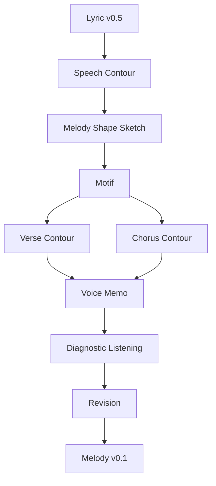
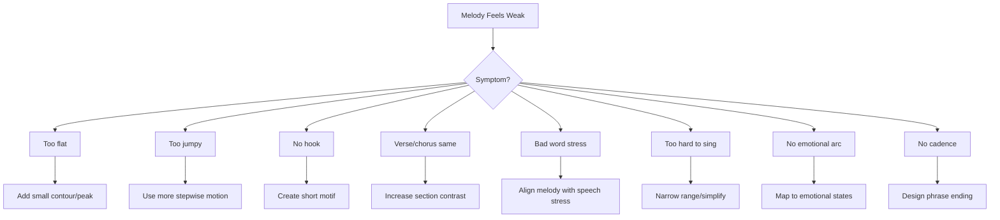

# learn-songwriting-part-018.md

# Melody as Shape: Memahami Melodi sebagai Bentuk Emosi yang Bisa Dilihat, Dinyanyikan, dan Diulang

> Seri: `learn-songwriting`  
> Part: `018 / 034`  
> Fokus: melodic contour, shape, motif, range, movement, tension-release, speech-to-melody, dan hook melody sketch  
> Status seri: belum selesai  
> Prasyarat: `learn-songwriting-part-000.md` sampai `learn-songwriting-part-017.md`

---

## Ringkasan Part Ini

Part sebelumnya membahas **Repetition, Variation, and Memory**: bagaimana membuat lagu menempel di ingatan.

Part ini mulai masuk ke wilayah melodi.

Banyak orang yang baru belajar songwriting merasa melodi itu misterius:

```text
Bagaimana cara membuat nada?
Apakah harus tahu teori musik dulu?
Apakah harus bisa piano/gitar?
Bagaimana tahu melodi ini bagus?
Kenapa chorus harus terasa naik?
Kenapa verse terasa datar?
Kenapa hook mudah diingat?
Kenapa beberapa melody terasa natural dengan lirik, sementara yang lain terasa dipaksa?
```

Untuk tahap 20 jam pertama, kita tidak akan memulai dari teori yang terlalu berat. Kita mulai dari mental model paling penting:

> **Melodi adalah bentuk emosi dalam waktu.**

Sebelum melodi menjadi not angka, chord, scale, atau MIDI, melodi bisa dipahami sebagai shape:

```text
naik
turun
datar
melompat
berputar
menahan
jatuh
mengulang
membuka
menutup
```

Jika lirik adalah apa yang dikatakan, melodi adalah **bagaimana tubuh emosional mengatakannya**.

Kalimat yang sama bisa berubah makna karena shape melodi.

Lirik:

```text
Kau belum selesai.
```

Jika melody turun:

```text
terdengar pasrah / lelah
```

Jika melody naik:

```text
terdengar bertanya / menuntut
```

Jika melody datar:

```text
terdengar denial / numb
```

Jika melody melompat tinggi:

```text
terdengar pecah / desperate
```

Part ini mengajarkan cara membuat melody sketch tanpa harus langsung berpikir teori kompleks.

Sebagai software engineer, pikirkan melody sebagai **time series**:

```text
pitch over time
```

Atau sebagai grafik:

```text
low -> medium -> high -> fall
```

Melodi bisa digambar sebelum ditulis sebagai not.

---

## Tujuan Part

Setelah menyelesaikan part ini, kamu harus bisa:

1. Memahami melodi sebagai shape/kontur.
2. Membedakan pitch, contour, range, interval, motif, phrase, dan cadence secara praktis.
3. Menggambar melodic contour untuk verse, chorus, dan bridge.
4. Membuat melody dari speech contour Bahasa Indonesia.
5. Menghubungkan emotional state dengan bentuk melodi.
6. Membuat motif melodi pendek untuk hook.
7. Menggunakan repetition dan variation dalam melody.
8. Membuat verse melody lebih restrained dan chorus melody lebih memorable.
9. Menghindari melody yang datar, terlalu lompat, terlalu ramai, atau tidak cocok dengan lirik.
10. Melakukan hum test dan voice memo untuk melody sketch.
11. Membuat melody map untuk lagu pertamamu.
12. Membuat file latihan `songwriting-practice-018-melody-as-shape.md`.

---

## Prinsip Utama

```text
Before melody is theory, melody is motion.
```

Jangan mulai dengan pertanyaan:

```text
chord-nya apa?
scale-nya apa?
not-nya apa?
```

Mulai dengan:

```text
Apakah emosi ini naik atau turun?
Apakah narator menahan atau meledak?
Apakah chorus harus membuka atau menyempit?
Apakah hook harus melompat atau mengulang?
Apakah final line harus jatuh atau menggantung?
```

Melodi adalah gesture emosional.

---

## Melody dalam Pipeline Songwriting



Kita belum harus menghasilkan melodi final. Target part ini adalah melody sketch yang cukup untuk direkam sebagai voice memo.

---

# Bagian 1 — Melodi sebagai Grafik

Bayangkan melodi sebagai garis.

```text
pitch tinggi
    ^
    |
    |            /\
    |      /\   /  \
    |_____/  \_/    \____
    |
    +----------------------> waktu
pitch rendah
```

Bentuk garis ini disebut **contour**.

Contour bisa:

- ascending / naik;
- descending / turun;
- arch / naik lalu turun;
- inverted arch / turun lalu naik;
- flat / datar;
- wave / bergelombang;
- leap / lompat;
- stepwise / bergerak bertahap;
- repeated note / nada diulang.

Kamu bisa menggambar melodi sebelum tahu nama not.

---

## Contour Symbols

Gunakan simbol sederhana:

```text
↑  naik
↓  turun
→  datar
↗  naik perlahan
↘  turun perlahan
∿  bergelombang
⤴  lompat naik
⤵  jatuh
—  tahan
```

Contoh:

```text
Tak kupakai / tak kubuang
→ ↗       / → ↘
```

Atau:

```text
Jangan panggil ini pulang
↗    ↗      —   ↘
```

Ini membantu merancang rasa melodi.

---

## Melody Shape Notation Sederhana

Kita bisa pakai level:

```text
L = low
M = medium
H = high
```

Contoh:

```text
Gelasmu di rak kedua
L L M M M L
```

Chorus:

```text
Tak kupakai
M H H

tak kubuang
M H L
```

Ini bukan not final. Ini peta shape.

---

# Bagian 2 — Elemen Melodi Praktis

## Pitch

Pitch adalah tinggi-rendah nada.

Untuk songwriting awal, cukup pikirkan:

```text
low, medium, high
```

## Contour

Contour adalah bentuk naik-turun melodi.

## Range

Range adalah jarak antara nada terendah dan tertinggi.

Verse biasanya bisa range sempit.  
Chorus sering range lebih lebar.

## Interval

Interval adalah jarak antara dua nada.

Untuk tahap ini:

- step = gerak dekat;
- leap = lompatan.

## Motif

Motif adalah ide melodi pendek yang bisa diulang.

Contoh:

```text
melody pendek untuk "tak kupakai"
```

lalu diulang/diubah di:

```text
tak kubuang
```

## Phrase

Phrase adalah unit melodi yang bisa dinyanyikan dalam satu napas.

## Cadence

Cadence adalah rasa akhir phrase.

Bisa:

- selesai;
- menggantung;
- bertanya;
- jatuh;
- membuka.

---

## Practical Melody Vocabulary

| Istilah | Pertanyaan Praktis |
|---|---|
| Pitch | nada ini rendah/sedang/tinggi? |
| Contour | bentuknya naik/turun/datar? |
| Range | seberapa jauh naik-turunnya? |
| Interval | bergerak dekat atau lompat? |
| Motif | ide pendek apa yang diulang? |
| Phrase | satu napasnya di mana? |
| Cadence | akhir phrase terasa selesai atau menggantung? |

Tidak perlu langsung membaca notasi musik untuk mulai.

---

# Bagian 3 — Speech Contour

Melodi sering lahir dari cara kita berbicara.

Ucapkan line seperti manusia.

Contoh:

```text
Jangan panggil ini pulang.
```

Jika marah tertahan, speech contour mungkin:

```text
JAN-gan PANG-gil ini PU-lang
```

Kata penting:

- jangan;
- panggil;
- pulang.

Melody bisa mengikuti emphasis itu.

## Speech-to-Melody Process

1. Ucapkan line natural.
2. Tandai kata penting.
3. Rasakan naik/turun suara.
4. Exaggerate sedikit menjadi melody.
5. Rekam hum.
6. Pilih yang paling natural.

---

## Example: “Tak kupakai, tak kubuang”

Speech:

```text
tak ku-PA-kai
tak ku-BU-ang
```

Contour:

```text
M M H
M M H/L
```

Melody sketch:

```text
tak ku-PA-kai /
tak ku-BU-ang //
```

`pakai` dan `buang` mendapat spotlight.

## Example: “Gelasmu di rak kedua”

Speech:

```text
Ge-LAS-mu di rak ke-DU-a
```

Melody verse bisa rendah dan narrow:

```text
L M M M M M L
```

Tidak perlu terlalu melodic di verse. Bisa almost spoken.

---

# Bagian 4 — Emotional State to Melody Shape

Emosi punya kecenderungan shape.

Ini bukan aturan mutlak, tapi starting point.

| Emotional State | Melody Shape |
|---|---|
| denial | datar, sempit, controlled |
| confession | naik sedikit, phrase lebih panjang |
| longing | arch, naik lalu jatuh |
| anger | short, accented, leap/clipped |
| grief | turun, broken phrase |
| hope | naik perlahan |
| fear | naik tapi tidak resolve |
| exhaustion | turun, range sempit, banyak rest |
| irony | speech-like, precise, slight twist |
| prayer | repeated notes, spacious, chant-like |
| realization | pause, then simple falling/landing phrase |
| acceptance | turun lembut atau resolve jelas |

## Example: Denial

Lirik:

```text
Gelasmu di rak kedua
```

Melody:

```text
low, narrow, almost spoken
```

Shape:

```text
→ → ↘
```

## Example: Confession

```text
Tak kupakai
tak kubuang
```

Shape:

```text
↗ —
↗ ↘
```

Ada sedikit opening.

## Example: Accusation

```text
Jangan panggil ini pulang
```

Shape:

```text
⤴ → → ↘
```

Kata “jangan” atau “pulang” bisa diberi tekanan.

---

# Bagian 5 — Verse Melody Shape

Verse biasanya membawa detail/evidence.

Verse melody sering:

- lebih rendah;
- lebih sempit;
- lebih conversational;
- lebih sedikit repetition;
- lebih banyak speech rhythm;
- tidak terlalu peak;
- menyiapkan chorus.

## Verse Shape Goal

```text
do not spend the highest emotional note too early
```

Jika verse sudah terlalu tinggi dan intens, chorus sulit naik.

## Verse Shape Example

Lirik:

```text
Gelasmu di rak kedua
tak kupindah sejak Selasa
air panas tetap kusisakan
untuk pagi yang salah sangka
```

Shape:

```text
Line 1: L M M M L
Line 2: L M M M L
Line 3: L M M M M
Line 4: M M M L
```

General:

```text
low-medium, restrained
```

## Verse Contour Sketch

```text
V1:
Line 1: → ↗ ↘
Line 2: → ↗ ↘
Line 3: → ↗ →
Line 4: ↗ ↘
```

Ada movement, tapi belum chorus-level.

---

## Verse Melody Checklist

```markdown
- [ ] Apakah verse terasa seperti narator sedang membuka dunia?
- [ ] Apakah range tidak terlalu lebar?
- [ ] Apakah kata penting tetap terdengar?
- [ ] Apakah melody memberi ruang untuk detail?
- [ ] Apakah verse tidak mencuri hook chorus?
- [ ] Apakah line akhir verse mengarah ke chorus?
```

---

# Bagian 6 — Chorus Melody Shape

Chorus biasanya pusat memory.

Chorus melody sering:

- lebih tinggi dari verse;
- lebih repetitive;
- lebih singable;
- phrase lebih pendek;
- range lebih terbuka;
- hook lebih jelas;
- title/keyword diberi nada kuat.

## Chorus Shape Goal

```text
make the hook easy to remember and emotionally larger than verse
```

Chorus tidak harus selalu lebih keras/tinggi, tapi harus terasa berbeda.

## Chorus Shape Example

```text
Tak kupakai
tak kubuang

kau belum selesai
di rumah yang kupanggil pulang
```

Possible contour:

```text
Tak kupakai       M H H
tak kubuang       M H L

kau belum selesai M M H H
di rumah...       M M M H L
```

Hook motif:

```text
M H H
M H L
```

Repetition + variation.

---

## Chorus Contour Options

### Option A — Lift

```text
Verse low -> Chorus higher
```

Good for confession/release.

### Option B — Drop

Chorus drops lower and more intimate.

Good for dark/haunting hook.

Example:

```text
verse talks higher, chorus whispers lower
```

### Option C — Repeated Chant

Same few notes repeated.

Good for mantra, satire, prayer.

### Option D — Leap Hook

Hook starts with leap.

Good for strong emotional punch, but harder to sing.

---

## Chorus Melody Checklist

```markdown
- [ ] Apakah chorus punya contour yang mudah diingat?
- [ ] Apakah hook phrase punya motif?
- [ ] Apakah chorus berbeda dari verse?
- [ ] Apakah title/hook mendapat nada kuat?
- [ ] Apakah chorus bisa dinyanyikan berulang?
- [ ] Apakah range masih nyaman?
- [ ] Apakah final word punya landing?
```

---

# Bagian 7 — Bridge Melody Shape

Bridge adalah turn. Melody juga harus memberi rasa berbeda.

Bridge bisa:

- turun lebih rendah;
- naik ke peak;
- menjadi lebih spacious;
- mengubah rhythm;
- memotong motif;
- memakai silence;
- memakai melody yang lebih simple;
- memberi rasa “sadar”.

## Bridge Shape Example

Lirik:

```text
Baru kusadar
di rak kedua

bukan gelasmu
yang paling lama
kutunda
```

Possible shape:

```text
Baru kusadar       M M L
di rak kedua       L M L

bukan gelasmu      M M L
yang paling lama   M M H
kutunda            H L
```

Bridge bisa menahan phrase lalu jatuh di “kutunda”.

## Bridge Function

Melody bridge harus memberi sinyal:

```text
something changed
```

Jika bridge melody sama persis dengan verse, turn bisa terasa kurang.

---

# Bagian 8 — Melody Motif

Motif melodi adalah ide pendek yang bisa diulang.

Contoh hook:

```text
tak kupakai
tak kubuang
```

Melody motif bisa:

```text
M-H-H
M-H-L
```

Same opening, different ending.

## Motif Properties

Motif baik biasanya:

- pendek;
- mudah diulang;
- punya rhythm jelas;
- cocok dengan lyric phrase;
- bisa divariasikan;
- bisa kembali di final chorus.

## Motif Design Template

```markdown
# Melody Motif

## Lyric phrase
...

## Emotional function
...

## Shape
...

## Rhythm feel
...

## Repeat/variation
...

## Where it returns
...
```

---

## Motif Types

| Type | Shape | Effect |
|---|---|---|
| repeated note | → → → | numb, chant, insistence |
| small rise | ↗ | hope, question, lift |
| small fall | ↘ | sadness, closure |
| arch | ↗ ↘ | longing, complete phrase |
| leap up | ⤴ | shock, cry, urgency |
| fall after leap | ⤴ ↘ | emotional release |
| wave | ∿ | uncertainty, searching |

---

# Bagian 9 — Stepwise vs Leap

## Stepwise Motion

Nada bergerak dekat.

Efek:

- natural;
- conversational;
- easy to sing;
- good for verse;
- gentle emotion.

## Leap

Nada melompat jauh.

Efek:

- dramatic;
- memorable;
- risky;
- good for hook peak;
- can express emotional break.

## Practical Rule

```text
Use more stepwise motion in verse.
Use one or two meaningful leaps in chorus/hook.
```

Jangan terlalu banyak leap tanpa alasan.

## Example

Verse:

```text
Gelasmu di rak kedua
```

stepwise, narrow.

Chorus:

```text
Tak kupakai
```

small leap on “pakai”.

---

# Bagian 10 — Range

Range adalah jarak nada terendah-tertinggi.

Untuk MVS, jaga range nyaman.

Jika terlalu lebar:

- sulit dinyanyikan;
- voice memo jadi tidak stabil;
- fokus lirik hilang.

Jika terlalu sempit:

- bisa datar;
- kurang contrast;
- hook kurang memorable.

## Practical Range Plan

```markdown
Verse:
low-medium, narrow

Chorus:
medium-high, slightly wider

Bridge:
lower and spacious OR highest emotional point

Final chorus:
same as chorus with emotional delivery variation
```

## Range Map

```markdown
| Section | Range | Reason |
|---|---|---|
| Verse 1 | low/narrow | restrained denial |
| Chorus | medium/wider | confession |
| Verse 2 | low-medium | development |
| Bridge | low/spacious or high peak | realization |
| Final Chorus | medium-high | payoff |
```

---

# Bagian 11 — Cadence: Ending the Phrase

Cadence adalah rasa akhir.

Phrase bisa berakhir:

- selesai;
- menggantung;
- bertanya;
- jatuh;
- terbuka;
- unresolved.

## Ending Down

```text
pulang ↘
```

Efek:

- closure;
- sadness;
- acceptance;
- finality.

## Ending Up

```text
pulang ↗
```

Efek:

- question;
- uncertainty;
- pleading;
- unresolved.

## Ending Flat

```text
pulang →
```

Efek:

- numb;
- denial;
- deadpan;
- satire.

## Hook Cadence

Hook harus punya cadence yang sesuai promise.

```text
Jangan panggil ini pulang
```

Jika ending turun:

```text
accusation final
```

Jika ending naik:

```text
plea/question
```

Jika ending datar:

```text
cold satire
```

---

# Bagian 12 — Melody and Lyric Stress

Kata penting harus cocok dengan melodic emphasis.

Lirik:

```text
jangan panggil ini pulang
```

Important words:

```text
jangan, panggil, pulang
```

Jangan melody memberi emphasis terbesar ke “ini” kecuali sengaja.

## Bad Emphasis

```text
jangan panggil I-ni pulang
```

Jika “ini” bukan fokus, awkward.

## Better

```text
JAN-gan PANG-gil ini PU-lang
```

Melody mengikuti semantic stress.

## Stress Checklist

```markdown
- [ ] Kata penting mendapat nada tinggi/panjang/posisi kuat.
- [ ] Kata filler tidak mendapat peak.
- [ ] Pronoun penting tidak hilang.
- [ ] Title/hook terdengar jelas.
- [ ] Melody tidak melawan natural speech.
```

---

# Bagian 13 — Melody from Hook

Untuk pemula, mulai dari hook.

Jangan mencoba menulis semua melody sekaligus.

Step:

1. Pilih hook lyric.
2. Ucapkan hook.
3. Tandai stress.
4. Buat 3 shape berbeda.
5. Rekam.
6. Pilih yang paling memorable.
7. Turunkan verse dari chorus atau sebaliknya.

## Example Hook

```text
Tak kupakai, tak kubuang
```

### Shape A — Small Lift

```text
tak ku-PA-kai ↑
tak ku-BU-ang ↓
```

### Shape B — Repeated Chant

```text
tak ku-PA-kai →
tak ku-BU-ang →
```

### Shape C — Dark Drop

```text
tak ku-PA-kai ↘
tak ku-BU-ang ↘
```

Uji 3 versi.

---

# Bagian 14 — Melody from Speech

Ambil line, bicara, exaggerate.

## Example

Line:

```text
Rumah ini salah paham
```

Speech:

```text
RU-mah ini SA-lah PA-ham
```

Melody options:

### Option A — Ironic

Datar, almost spoken:

```text
→ → → ↘
```

### Option B — Sad

Naik sedikit lalu turun:

```text
↗ ↘
```

### Option C — Theatrical

Leap on “salah”:

```text
→ ⤴ ↘
```

Pilih berdasarkan persona.

---

# Bagian 15 — Melody and Repetition

Melody repetition membuat lyric repetition menempel.

Hook:

```text
Tak kupakai
tak kubuang
```

Melody:

```text
same first half, changed ending
```

This creates:

```text
recognition + variation
```

## Melody Repetition Pattern

```markdown
Phrase 1:
M H H

Phrase 2:
M H L
```

Sama-sama mulai M-H, akhir beda.

## Variation Final

Final chorus:

```text
aku
di rak kedua
```

Could use motif rhythm but lower/slower.

---

# Bagian 16 — Melody and Variation

Variation melodi bisa lebih subtle daripada lirik.

Chorus 1:

- hook melody normal.

Chorus 2:

- same melody, more confidence.

Final chorus:

- same lyric, lower delivery;
- or same melody, held final word longer;
- or melody drops instead of rises;
- or silence before hook.

Variation types:

| Variation | Effect |
|---|---|
| higher final chorus | emotional climax |
| lower final chorus | intimacy, defeat |
| slower hook | gravity |
| held final word | emphasis |
| broken phrase | grief |
| spoken hook | cold truth |
| harmony change under same melody | new meaning |

---

# Bagian 17 — Melody and Section Contrast

Verse and chorus should differ.

Contrast dimensions:

| Dimension | Verse | Chorus |
|---|---|---|
| Range | narrow | wider |
| Pitch | lower | higher |
| Rhythm | speech-like | repetitive |
| Motif | subtle | clear |
| Cadence | unresolved | stronger |
| Density | more words | fewer words |
| Emotion | restrained | open |

Tidak semua harus berubah. Pilih 2–3 contrast.

---

# Bagian 18 — Melody and Emotional Arc

Melody should follow emotional state machine.

Example:

```text
Denial -> Confession -> Habit -> Realization -> Fragile Acceptance
```

Melody plan:

| Section | State | Melody Behavior |
|---|---|---|
| Verse 1 | denial | low, narrow, almost spoken |
| Chorus | confession | rise, simple hook |
| Verse 2 | habit | similar verse, slightly higher |
| Bridge | realization | sparse, pause, different contour |
| Final Chorus | fragile acceptance | same hook, softer/slower |

This makes melody serve story.

---

# Bagian 19 — Drawing Melody Maps

Gunakan garis sederhana.

## Example

Verse:

```text
Gelasmu di rak kedua
__/\__
```

Chorus:

```text
Tak kupakai
__/‾

tak kubuang
__\_
```

Bridge:

```text
Baru kusadar
__\

bukan gelasmu
__\

yang paling lama
__/‾

kutunda
‾\__
```

Tidak harus presisi. Tujuannya melihat shape.

---

## Melody Map Template

```markdown
# Melody Map

## Hook
Lyric:
Speech stress:
Shape A:
Shape B:
Shape C:
Chosen:

## Verse contour
Line 1:
Line 2:
Line 3:
Line 4:

## Chorus contour
Line 1:
Line 2:
Line 3:
Line 4:

## Bridge contour
Line 1:
Line 2:
Line 3:
Line 4:

## Final chorus variation
...
```

---

# Bagian 20 — Voice Memo Melody Sketch

Jangan menunggu sempurna.

Voice memo adalah data.

Record:

1. hook melody candidates;
2. verse melody rough;
3. chorus melody rough;
4. bridge idea;
5. full pass.

Naming:

```text
2026-06-25-rak-kedua-hook-melody-a.m4a
2026-06-25-rak-kedua-hook-melody-b.m4a
2026-06-25-rak-kedua-v1-chorus-rough.m4a
```

## Voice Memo Notes

```markdown
# Voice Memo Notes

File:
Date:
Section:
Melody idea:
Shape:
What works:
What fails:
Best phrase:
Hard phrase:
Next revision:
```

---

# Bagian 21 — Melody Diagnostics

Setelah rekam, dengar.

Tanya:

```text
Apakah hook mudah diingat?
Apakah verse terlalu datar?
Apakah chorus cukup berbeda?
Apakah melody mengikuti kata penting?
Apakah line sulit dinyanyikan?
Apakah range terlalu tinggi/rendah?
Apakah melodi terasa natural atau dipaksa?
Apakah ada satu motif yang bisa diulang?
Apakah final phrase punya landing?
```

## Melody Problem Map



---

# Bagian 22 — Common Melody Shapes

## 1. Flat / Repeated Note

Shape:

```text
→ → →
```

Use:

- denial;
- numbness;
- chant;
- satire;
- intimate verse.

Risk:

- boring if overused.

## 2. Small Rise

Shape:

```text
↗
```

Use:

- question;
- hope;
- build;
- pre-chorus.

## 3. Small Fall

Shape:

```text
↘
```

Use:

- sadness;
- closure;
- resignation;
- final line.

## 4. Arch

Shape:

```text
↗ ↘
```

Use:

- longing;
- complete phrase;
- chorus line.

## 5. Leap Up

Shape:

```text
⤴
```

Use:

- cry;
- shock;
- emotional peak.

Risk:

- hard to sing;
- can sound melodramatic.

## 6. Fall After Leap

Shape:

```text
⤴ ↘
```

Use:

- release;
- lament;
- dramatic hook.

## 7. Wave

Shape:

```text
∿
```

Use:

- uncertainty;
- searching;
- reflective verse.

---

# Bagian 23 — Melody Shape Examples by Lyric

## Lyric: “Kau belum selesai”

### Denial

```text
→ → ↘
```

Low, restrained.

### Confession

```text
↗ — ↘
```

Rise on “belum”.

### Pleading

```text
↗ ↗ ?
```

End slightly up.

### Acceptance

```text
↘ ↘
```

Soft fall.

## Lyric: “Jangan panggil ini pulang”

### Accusation

```text
⤴ → → ↘
```

Strong start, final landing.

### Satire

```text
→ → ↘
```

Almost spoken, cold.

### Desperate Plea

```text
↗ ↗ — ↘
```

Build then fall.

---

# Bagian 24 — Melody for Indonesian Lyrics

Bahasa Indonesia punya banyak suku kata terbuka. Gunakan vowel.

## Good Long Note Candidates

```text
pulang
sayang
nama
rumah
tuan
aku
kamu
luka
doa
```

## Be Careful with Long Note

Kata dengan banyak konsonan atau imbuhan:

```text
menginterpretasikan
mempertahankan
ketidakhadiran
```

Lebih sulit.

## Natural Stress

Walau stress Bahasa Indonesia fleksibel, meaning stress tetap penting.

Line:

```text
Gelasmu di rak kedua
```

Possible emphasis:

```text
Ge-LAS-mu / di rak ke-DU-a
```

Do not put melody peak on “di” unless special reason.

---

# Bagian 25 — Melody and Breath

Melody must respect breath map from part 016.

If lyric:

```text
Tak kupakai /
tak kubuang //
```

Melody should phrase accordingly.

Don't force:

```text
Tak kupakai tak kubuang kau belum selesai di rumah...
```

without breath.

Breath and melody are one system.

## Breath-Melody Template

```markdown
Line:
Breath:
Melody shape:
Held word:
Landing word:
```

Example:

```markdown
Line:
Tak kupakai / tak kubuang //

Breath:
short after pakai, long after buang

Melody shape:
rise on pakai, fall/land on buang

Held word:
buang
```

---

# Bagian 26 — Melody and Hook Memory

Hook melody should be:

- short;
- repeated;
- easy to hum;
- aligned with lyric stress;
- distinctive enough;
- not too many notes;
- comfortable range;
- emotionally clear.

## Hook Melody Test

1. Hum it without words.
2. Wait 1 minute.
3. Hum again.
4. If forgotten, simplify or strengthen motif.
5. Sing with lyric.
6. If lyric fights melody, revise.

## Hook Melody Criteria

```markdown
- [ ] can hum after one try
- [ ] supports title/hook
- [ ] uses repetition
- [ ] comfortable
- [ ] has clear shape
- [ ] not too many notes
- [ ] emotional fit
```

---

# Bagian 27 — Melody Sketching Without Instrument

You can write melody without instrument.

Methods:

## 1. Speak-to-Sing

Talk line, then exaggerate.

## 2. Hum First

Hum shape, then fit words.

## 3. Use Three Notes

Limit to low/mid/high.

## 4. Use Call-Response

Phrase 1 asks, phrase 2 answers.

```text
Tak kupakai  = call
tak kubuang  = response
```

## 5. Use Existing Rhythm

Use lyric rhythm from spoken phrase.

## 6. Record Many Takes

Quantity matters. Do not judge too early.

---

# Bagian 28 — Melody Sketching With Instrument

If you have guitar/piano, keep it simple.

Use:

- one chord drone;
- two chords;
- simple progression;
- no complex accompaniment;
- focus on vocal melody.

Avoid:

- getting lost in chord searching;
- making arrangement before melody;
- hiding weak melody with instrument.

Instrument should support melody discovery, not distract.

---

# Bagian 29 — Melody and Chords: Minimal View

We will cover harmony later. For now:

```text
melody can be sketched before final chords
```

But chords can influence melody.

Minimal approach:

1. choose tonal center feel;
2. hum melody over one chord;
3. try simple loop;
4. keep hook melody stable;
5. adjust chords later.

Do not over-theorize.

---

# Bagian 30 — Melody Anti-Patterns

## Anti-Pattern 1: Melody Follows Every Syllable Equally

Gejala:

```text
semua suku kata mendapat nada sama penting.
```

Solusi:

```text
beri hierarchy: important words get emphasis.
```

## Anti-Pattern 2: Too Many Notes

Gejala:

```text
melodi terlalu ramai, sulit diingat.
```

Solusi:

```text
simplify hook motif.
```

## Anti-Pattern 3: No Repetition

Gejala:

```text
setiap phrase melody baru.
```

Solusi:

```text
buat motif dan ulang.
```

## Anti-Pattern 4: Verse and Chorus Same Shape

Gejala:

```text
chorus tidak terasa naik/berbeda.
```

Solusi:

```text
ubah range, rhythm, repetition, cadence.
```

## Anti-Pattern 5: Random Leaps

Gejala:

```text
lompatan nada tidak mendukung emosi.
```

Solusi:

```text
gunakan leap hanya untuk kata penting.
```

## Anti-Pattern 6: Bad Stress

Gejala:

```text
melody peak jatuh di kata filler.
```

Solusi:

```text
align with speech stress.
```

## Anti-Pattern 7: Too High Too Early

Gejala:

```text
verse sudah peak.
```

Solusi:

```text
reserve height for chorus/bridge.
```

## Anti-Pattern 8: Melody Too Hard for Voice Memo

Gejala:

```text
kamu sendiri sulit menyanyikan.
```

Solusi:

```text
narrow range, simplify.
```

---

# Bagian 31 — Melody Shape Template

Gunakan template ini.

```markdown
# Melody Shape Map

## Song Title
...

## Song Promise
...

## Emotional State Machine
Verse 1:
Chorus:
Verse 2:
Bridge:
Final Chorus:

## Hook Lyric
...

## Hook Speech Stress
...

## Hook Shape Candidates

### Candidate A
Shape:
Feel:
Voice memo file:
Notes:

### Candidate B
Shape:
Feel:
Voice memo file:
Notes:

### Candidate C
Shape:
Feel:
Voice memo file:
Notes:

## Chosen Hook Shape
...

Why:
...

## Verse Melody Shape
Range:
Contour:
Rhythm feel:
Important words:
Cadence:

## Chorus Melody Shape
Range:
Contour:
Motif:
Important words:
Cadence:

## Verse 2 Variation
...

## Bridge Melody Shape
Range:
Contour:
Difference from verse/chorus:
Reveal word:
Cadence:

## Final Chorus Variation
...

## Breath-Melody Map
...

## Voice Memo Notes
...

## Main Risk
...

## Next Action
...
```

---

# Bagian 32 — Contoh Melody Shape: Rindu Domestik

## Hook

```text
Tak kupakai
tak kubuang
```

## Speech Stress

```text
tak ku-PA-kai
tak ku-BU-ang
```

## Hook Shape Candidates

### A — Confession Lift

```text
tak ku-PA-kai  M M H
tak ku-BU-ang  M M L
```

Feel:

```text
mengaku, tapi masih jatuh
```

### B — Denial Chant

```text
tak ku-PA-kai  M M M
tak ku-BU-ang  M M M
```

Feel:

```text
flat denial, mantra
```

### C — Longing Arch

```text
tak ku-PA-kai  L M H
tak ku-BU-ang  H M L
```

Feel:

```text
lebih melodik, ballad
```

## Suggested

Candidate A or C.

## Section Shape

| Section | Shape |
|---|---|
| Verse 1 | low, narrow, speech-like |
| Chorus | motif rises on pakai/buang |
| Verse 2 | similar verse, slightly more intense |
| Bridge | sparse, lower, realization |
| Final Chorus | same hook, slower/softer |

---

# Bagian 33 — Contoh Melody Shape: Romansa Satir

## Hook

```text
Jangan panggil ini pulang
```

## Speech Stress

```text
JAN-gan PANG-gil ini PU-lang
```

## Shape Candidates

### A — Accusatory

```text
JAN-gan      H
PANG-gil     H/M
ini          M
PU-lang      L
```

Shape:

```text
⤴ → ↘
```

### B — Cold Satire

```text
mostly same pitch, drop at pulang
```

Shape:

```text
→ → → ↘
```

### C — Pleading

```text
rise through phrase, unresolved ending
```

Shape:

```text
↗ ↗ —
```

## Suggested

For dark satirical romance:

```text
Verse: sweet, lower, controlled
Chorus: cold but firm, not shouted
Final chorus: "Tuan" clipped, "pulang" held/dropped
```

---

# Bagian 34 — Latihan Utama Part 018

Buat file:

```text
songwriting-practice-018-melody-as-shape.md
```

Isi template berikut.

```markdown
# songwriting-practice-018-melody-as-shape.md

## 1. Draft Lyric Source
Tempel lyric v0.5 dari part 017.

...

## 2. Song Promise
...

## 3. Emotional State Machine
Verse 1:
Chorus:
Verse 2:
Bridge:
Final Chorus:

## 4. Hook Lyric
...

## 5. Hook Speech Stress
Tandai kata penting dan natural stress.

...

## 6. Hook Shape Candidates

### Candidate A
Shape:
Contour symbols:
Emotional feel:
Voice memo file:
Notes:

### Candidate B
Shape:
Contour symbols:
Emotional feel:
Voice memo file:
Notes:

### Candidate C
Shape:
Contour symbols:
Emotional feel:
Voice memo file:
Notes:

## 7. Chosen Hook Shape
...

Why:
...

## 8. Melody Motif
Lyric phrase:
Shape:
Rhythm feel:
Where it repeats:
How it varies:

## 9. Verse Melody Shape
Range:
Contour:
Speech-like or melodic:
Important words:
Cadence:
Breath notes:

## 10. Chorus Melody Shape
Range:
Contour:
Hook motif:
Important words:
Cadence:
Breath notes:

## 11. Verse 2 Melody Variation
Same as verse 1?
What changes?
Why?

## 12. Bridge Melody Shape
Range:
Contour:
How it differs:
Reveal word:
Cadence:
Breath notes:

## 13. Final Chorus Variation
Same melody?
Changed melody?
Delivery change?
Held word?
Final cadence?

## 14. Breath-Melody Map

### Verse 1
...

### Chorus
...

### Verse 2
...

### Bridge
...

### Final Chorus
...

## 15. Voice Memo Log

| Take | Section | Shape | What Works | What Fails |
|---|---|---|---|---|
| 1 |  |  |  |  |
| 2 |  |  |  |  |
| 3 |  |  |  |  |

## 16. Melody Diagnostic
Hook memorable?
Verse too flat?
Chorus distinct?
Bad word stress?
Range comfortable?
Emotional fit?
Hard phrase?

## 17. Melody Revision Plan
Keep:
Change:
Test next:
Protect:
Cut:

## 18. Next Action
...
```

---

# Latihan 30 Menit: Hook Melody Candidates

1. Pilih hook utama.
2. Ucapkan natural.
3. Buat 3 shape:
   - flat/chant;
   - rise/fall;
   - leap/drop.
4. Rekam 3 voice memo.
5. Pilih yang paling memorable.

Output:

```markdown
Best hook shape:
Why:
What word gets peak:
What word lands:
```

---

# Latihan 45 Menit: Verse-Chorus Contrast

Ambil verse dan chorus.

Buat melody shape map:

```markdown
Verse:
range:
contour:
feel:

Chorus:
range:
contour:
feel:

Contrast:
1.
2.
3.
```

Nyanyikan kasar.

Jika chorus tidak terasa berbeda, ubah:

- range;
- repetition;
- cadence;
- rhythm;
- phrase length.

---

# Latihan 60 Menit: Full Melody Sketch v0.1

1. Pilih hook melody.
2. Buat verse contour.
3. Buat chorus contour.
4. Buat bridge contour.
5. Rekam full voice memo.
6. Dengar ulang.
7. Catat masalah.

Output:

```markdown
Melody v0.1 notes:
Best moment:
Weakest moment:
Hook score:
Range issue:
Stress issue:
Next revision:
```

---

# Checklist Part 018

Sebelum lanjut ke part 019, pastikan:

- [ ] Kamu memahami melodi sebagai shape/kontur.
- [ ] Kamu punya hook speech stress.
- [ ] Kamu membuat minimal 3 hook shape candidates.
- [ ] Kamu memilih satu hook shape.
- [ ] Kamu punya melody motif.
- [ ] Kamu punya verse melody shape.
- [ ] Kamu punya chorus melody shape.
- [ ] Kamu punya bridge melody shape.
- [ ] Kamu punya final chorus variation idea.
- [ ] Kamu sudah merekam minimal 3 hook voice memo.
- [ ] Kamu sudah merekam full rough melody voice memo.
- [ ] Kamu sudah mendiagnosis hook memorability, range, stress, dan contrast.
- [ ] Kamu punya next action menuju melodic rhythm.

---

# Output Wajib Part 018

Buat file:

```text
songwriting-practice-018-melody-as-shape.md
```

Isi minimal:

```markdown
# songwriting-practice-018-melody-as-shape.md

## Draft Lyric Source
...

## Song Promise
...

## Emotional State Machine
...

## Hook Lyric
...

## Hook Speech Stress
...

## Hook Shape Candidates
...

## Chosen Hook Shape
...

## Melody Motif
...

## Verse Melody Shape
...

## Chorus Melody Shape
...

## Bridge Melody Shape
...

## Final Chorus Variation
...

## Voice Memo Log
...

## Melody Diagnostic
...

## Melody Revision Plan
...

## Next Action
...
```

---

# Common Failure Modes di Part Ini

## 1. Menunggu Teori Musik Lengkap Sebelum Membuat Melodi

Gejala:

```text
tidak mulai karena belum tahu scale/chord.
```

Solusi:

```text
mulai dari speech contour dan hum.
```

## 2. Melody Terlalu Datar

Gejala:

```text
semua phrase sama rendah dan sama rhythm.
```

Solusi:

```text
beri contour kecil atau motif.
```

## 3. Melody Terlalu Lompat

Gejala:

```text
sulit dinyanyikan, terdengar random.
```

Solusi:

```text
gunakan lebih banyak stepwise motion.
```

## 4. Hook Tidak Punya Motif

Gejala:

```text
chorus tidak bisa diingat.
```

Solusi:

```text
buat motif pendek untuk hook.
```

## 5. Verse dan Chorus Tidak Kontras

Gejala:

```text
chorus tidak terasa sebagai chorus.
```

Solusi:

```text
ubah range, repetition, cadence, rhythm.
```

## 6. Melody Melawan Kata

Gejala:

```text
peak jatuh di kata tidak penting.
```

Solusi:

```text
kembali ke speech stress.
```

## 7. Range Terlalu Tinggi

Gejala:

```text
voice memo tidak stabil.
```

Solusi:

```text
turunkan/narrow range.
```

## 8. Bridge Tidak Berbeda

Gejala:

```text
turn emosional tidak terasa.
```

Solusi:

```text
ubah contour/rhythm/space di bridge.
```

## 9. Terlalu Banyak Melody Ideas

Gejala:

```text
setiap line punya ide baru.
```

Solusi:

```text
gunakan motif dan variation.
```

## 10. Tidak Direkam

Gejala:

```text
melody hilang atau tidak bisa dievaluasi.
```

Solusi:

```text
record voice memo immediately.
```

---

# Prinsip Penting

```text
Melody is the emotional shape of speech.
```

Dan:

```text
A memorable melody is usually simple enough to return,
but shaped enough to feel alive.
```

Untuk 20 jam pertama, jangan targetkan melody sempurna. Targetkan melody yang bisa:

- dinyanyikan;
- diingat;
- mendukung kata penting;
- membedakan verse dan chorus;
- membawa emotion state;
- direkam sebagai voice memo.

---

# Bridge ke Part Berikutnya

Part ini membahas melody as shape.

Part berikutnya, `learn-songwriting-part-019.md`, akan membahas:

```text
Melodic Rhythm
```

Kita akan memperdalam:

- rhythm kata vs rhythm nada;
- note duration;
- syllable placement;
- syncopation sederhana;
- long-short pattern;
- phrase groove;
- chorus rhythm;
- verse rhythm;
- bagaimana lyric rhythm memengaruhi melody;
- cara menghindari melody yang terlalu robotic;
- cara membuat bait mengalir lebih natural secara audiotik.

Jika part ini membahas **ke mana nada bergerak**, part berikutnya membahas **kapan nada bergerak**.

---

# Status Seri

Part ini selesai.

```text
Selesai: learn-songwriting-part-018.md
Berikutnya: learn-songwriting-part-019.md
Status seri: belum selesai
Part tersisa: 16
Target akhir seri: learn-songwriting-part-034.md
```


<!-- NAVIGATION_FOOTER -->
<div class="page-nav">
<a href="./learn-songwriting-part-017.md">⬅️ Repetition, Variation, and Memory: Membuat Lagu Menempel di Ingatan Tanpa Menjadi Monoton</a>
<a href="./index.md">📚 Kategori</a>
<a href="../../index.md">🏠 Home</a>
<a href="./learn-songwriting-part-019.md">Melodic Rhythm: Mengatur Waktu, Panjang-Pendek, Tekanan, dan Groove agar Melodi Tidak Robotic ➡️</a>
</div>
