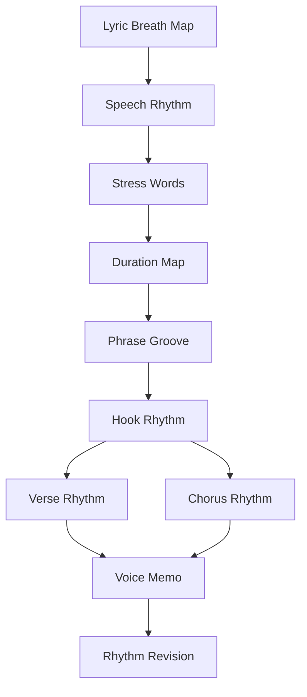
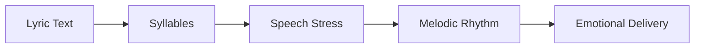
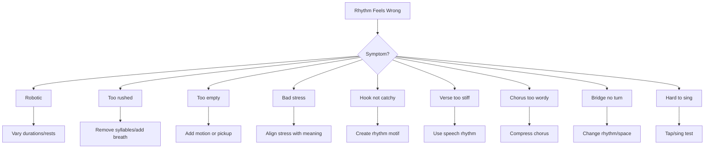

# learn-songwriting-part-019.md

# Melodic Rhythm: Mengatur Waktu, Panjang-Pendek, Tekanan, dan Groove agar Melodi Tidak Robotic

> Seri: `learn-songwriting`  
> Part: `019 / 034`  
> Fokus: melodic rhythm, syllable placement, note duration, phrase groove, long-short pattern, syncopation sederhana, rhythmic contrast, dan anti-robotic melody  
> Status seri: belum selesai  
> Prasyarat: `learn-songwriting-part-000.md` sampai `learn-songwriting-part-018.md`

---

## Ringkasan Part Ini

Part sebelumnya membahas **Melody as Shape**:

```text
ke mana nada bergerak?
naik?
turun?
datar?
melompat?
jatuh?
```

Part ini membahas dimensi berikutnya:

> **Kapan nada itu terjadi? Berapa lama ia ditahan? Suku kata mana yang cepat, mana yang panjang, mana yang diberi jeda?**

Itulah **melodic rhythm**.

Dua melodi bisa punya contour sama, tetapi terasa berbeda karena rhythm.

Contoh lirik:

```text
Jangan panggil ini pulang
```

Versi robotic:

```text
Jan-gan pang-gil i-ni pu-lang
semua suku kata sama panjang
```

Terdengar datar, seperti mesin membaca syllable.

Versi lebih manusiawi:

```text
JAN-gan / panggil ini / PU-lang //
```

atau:

```text
Jangan panggil... / ini pulang //
```

atau:

```text
Jangan / panggil ini / pulang //
```

Perbedaannya bukan hanya nada. Perbedaannya adalah:

- durasi;
- jeda;
- tekanan;
- grouping;
- silence;
- momentum;
- long note;
- short note;
- anticipatory entry;
- delayed entry;
- phrase ending.

Melodic rhythm adalah alasan kenapa lirik bisa terasa:

- natural;
- mengalir;
- emosional;
- catchy;
- conversational;
- theatrical;
- sinis;
- intim;
- tidak robotic.

Sebagai software engineer, pikirkan melodic rhythm seperti **scheduler**.

Pitch adalah nilai.  
Rhythm adalah waktu eksekusi.

Kalau semua event berjalan dengan interval sama tanpa prioritas, sistem terasa mekanis.

Dalam musik, jika semua suku kata diberi durasi sama dan tekanan sama, lirik terdengar seperti:

```text
text-to-speech yang diberi nada
```

Part ini akan mengajarkan cara membuat rhythm melodi yang lebih hidup.

---

## Tujuan Part

Setelah menyelesaikan part ini, kamu harus bisa:

1. Memahami perbedaan lyric rhythm, speech rhythm, dan melodic rhythm.
2. Mengidentifikasi melodi yang terdengar robotic karena semua suku kata diperlakukan sama.
3. Menggunakan durasi panjang-pendek untuk memberi emphasis.
4. Menentukan suku kata mana yang harus cepat, mana yang harus ditahan.
5. Membuat phrase groove untuk hook.
6. Membuat verse rhythm lebih conversational dan chorus rhythm lebih memorable.
7. Menggunakan rest/jeda sebagai bagian dari rhythm.
8. Memahami syncopation sederhana tanpa teori rumit.
9. Menggunakan repetition rhythm untuk membuat hook menempel.
10. Menghindari over-syncopation atau rhythm yang terlalu padat.
11. Membuat rhythmic map untuk lirik.
12. Merekam voice memo untuk menguji groove.
13. Membuat file latihan `songwriting-practice-019-melodic-rhythm.md`.

---

## Prinsip Utama

```text
Melody is not only pitch over time.
Melody is pitch shaped by rhythm.
```

Dan:

```text
A lyric becomes singable when its syllables are placed with intention.
```

Setiap suku kata tidak sama penting.

Dalam line:

```text
Tak kupakai, tak kubuang
```

Kata penting:

```text
pakai
buang
```

Maka rhythm harus memberi spotlight pada:

```text
PA-kai
BU-ang
```

Bukan memberi semua syllable durasi identik.

---

## Pitch vs Rhythm

Pitch menjawab:

```text
seberapa tinggi nada?
```

Rhythm menjawab:

```text
kapan nada mulai?
berapa lama?
kapan berhenti?
di mana jeda?
mana yang cepat?
mana yang ditahan?
```

Contoh:

```text
Kau belum selesai
```

Pitch shape bisa sama:

```text
M M H L
```

Tapi rhythm berbeda:

### Version A — Flat/robotic

```text
Kau / be-lum / se-le-sai
1    1  1    1  1  1
```

Semua sama panjang.

### Version B — Human/confessional

```text
Kau belum... / selesai //
short-short-rest / long
```

### Version C — Desperate

```text
Kau / belum / se-le-saaaai //
short / stressed / long release
```

Sama-sama “kau belum selesai”, tetapi rasa berubah.

---

## Melodic Rhythm dalam Pipeline Songwriting



Part 016 memberi napas.  
Part 018 memberi shape.  
Part 019 memberi waktu.

---

# Bagian 1 — Lyric Rhythm, Speech Rhythm, dan Melodic Rhythm

## Lyric Rhythm

Lyric rhythm adalah rhythm yang muncul dari susunan kata dan suku kata.

Contoh:

```text
Tak kupakai
tak kubuang
```

Sudah punya rhythm internal:

```text
tak ku-PA-kai
tak ku-BU-ang
```

## Speech Rhythm

Speech rhythm adalah cara kalimat itu diucapkan natural.

Contoh:

```text
Jangan panggil ini pulang
```

Speech stress natural:

```text
JAN-gan PANG-gil ini PU-lang
```

## Melodic Rhythm

Melodic rhythm adalah bagaimana speech/lyric rhythm diubah menjadi durasi nada.

Contoh:

```text
JAN-gan / panggil ini / PU-lang //
short-long / quick phrase / long landing
```

Melodic rhythm tidak harus sama persis dengan speech rhythm, tapi harus terasa punya hubungan.

Jika melodic rhythm melawan speech terlalu banyak, lirik terasa dipaksa.

---

## Diagram Hubungan



---

# Bagian 2 — Unit Waktu Praktis

Kamu tidak perlu langsung membaca notasi rhythm formal.

Untuk tahap ini, gunakan simbol sederhana:

```text
S = short
M = medium
L = long
R = rest
```

Contoh:

```text
Tak kupakai / tak kubuang
S S L / S S L
```

Atau:

```text
Jangan panggil ini pulang
M S / S S / L
```

Atau:

```text
Kau belum... selesai
S M R L
```

## Symbol Set

| Simbol | Makna |
|---|---|
| S | pendek |
| M | sedang |
| L | panjang/ditahan |
| R | jeda/rest |
| > | tekan/accent |
| ~ | ditarik/legato |
| . | putus/staccato |
| / | napas pendek |
| // | napas panjang |

Contoh:

```text
Tak ku-PA-kai / tak ku-BU-ang //
S  S  L       / S  S  L
      >              >
```

---

# Bagian 3 — Durasi sebagai Emphasis

Suku kata yang ditahan lebih lama akan terasa penting.

Contoh:

```text
pu-laaaang
```

Jika “pulang” ditahan, kata itu menjadi pusat.

Contoh:

```text
tak ku-BU-ang
```

Jika “buang” ditahan, conflict “buang” terasa berat.

## Durasi Panjang Cocok untuk

- title;
- hook;
- emotional thesis;
- object utama;
- final word;
- confession;
- question;
- grief;
- release.

## Durasi Pendek Cocok untuk

- setup words;
- quick speech;
- anxiety;
- build;
- connective phrases;
- satirical precision;
- conversational movement.

## Example

Line:

```text
Rumah ini salah paham
```

Version A:

```text
RU-mah ini SA-lah PA-ham
M S S M S L
```

“paham” ditahan sebagai landing.

Version B:

```text
Rumah ini / salah... paham
S S S / L R L
```

Lebih theatrical.

---

# Bagian 4 — Robotic Rhythm

Melodi terdengar robotic jika semua suku kata diberi:

- durasi sama;
- tekanan sama;
- tidak ada napas;
- tidak ada phrase grouping;
- tidak ada long note;
- tidak ada rest;
- kata penting tidak dibedakan;
- rhythm mengikuti syllable count terlalu mekanis.

## Robotic Example

```text
Ge-las-mu-di-rak-ke-du-a
```

Semua syllable sama.

Lebih natural:

```text
Gelasmu / di rak kedua //
M S S / S S M L
```

atau:

```text
Gelasmu di rak / kedua //
S S S S / M L
```

## Robotic Chorus

```text
Tak-ku-pa-kai-tak-ku-bu-ang
```

Semua sama.

Lebih hooky:

```text
Tak ku-PA-kai /
tak ku-BU-ang //
S  S  L      / S  S  L
```

Ada pattern.

---

## Anti-Robotic Checklist

```markdown
- [ ] Apakah kata penting lebih panjang/tekan?
- [ ] Apakah ada phrase grouping?
- [ ] Apakah ada rest?
- [ ] Apakah semua syllable tidak sama durasi?
- [ ] Apakah rhythm mengikuti speech natural?
- [ ] Apakah chorus punya rhythmic motif?
- [ ] Apakah verse tidak seperti membaca satu-satu?
```

---

# Bagian 5 — Phrase Grouping

Phrase grouping menentukan suku kata mana yang bergerak bersama.

Line:

```text
Jangan panggil ini pulang
```

Possible grouping:

### Grouping A

```text
Jangan panggil / ini pulang
```

Meaning:

- “jangan panggil” sebagai command;
- “ini pulang” sebagai object of command.

### Grouping B

```text
Jangan / panggil ini / pulang
```

Meaning:

- “jangan” mendapat emphasis;
- “pulang” final.

### Grouping C

```text
Jangan panggil ini / pulang
```

Meaning:

- delayed emphasis on “pulang”.

Setiap grouping membawa rasa berbeda.

---

## Phrase Grouping Template

```markdown
# Phrase Grouping

Line:
...

Possible grouping A:
...

Possible grouping B:
...

Possible grouping C:
...

Chosen:
...

Why:
...
```

---

# Bagian 6 — Long-Short Pattern

Hook sering kuat karena punya pattern panjang-pendek yang mudah diingat.

Contoh:

```text
Tak kupakai
tak kubuang
```

Pattern:

```text
short short long
short short long
```

Ini sangat memorable.

## Common Patterns

| Pattern | Feel |
|---|---|
| S S L | hooky, direct |
| S M L | natural rise |
| L S S | dramatic start |
| S S S L | build to final |
| M R L | spacious/confessional |
| S M R L | hesitation then release |
| S S / S L | conversational |
| L R S S | theatrical |

## Example: “Kau belum selesai”

### Pattern 1

```text
Kau belum selesai
S S S L
```

Build to “selesai”.

### Pattern 2

```text
Kau belum... selesai
S M R L
```

More emotional.

### Pattern 3

```text
Kau / belum selesai
L / S S L
```

“Kau” emphasized.

---

# Bagian 7 — Rest/Jeda sebagai Rhythm

Rest bukan kosong. Rest adalah event.

Rest bisa:

- memberi napas;
- menambah tension;
- memberi ruang makna;
- membuat hook lebih kuat;
- memberi surprise;
- menunjukkan hesitation;
- menciptakan groove.

Contoh:

```text
Tak kupakai /
tak kubuang //
```

Rest after first phrase membuat second phrase lebih kuat.

Contoh:

```text
Jangan panggil...
ini pulang.
```

Rest memberi rasa menahan amarah.

Contoh:

```text
Aku baik-baik saja...
asal jangan tanya.
```

Rest mengungkap subtext.

---

## Rest Placement

| Tempat Rest | Efek |
|---|---|
| sebelum hook | anticipation |
| setelah hook | letting it land |
| sebelum final word | emphasis |
| setelah confession | vulnerability |
| di tengah kalimat | hesitation |
| setelah address | theatrical |
| sebelum “tuan” | cold accusation |

Example:

```text
Tuan...
jangan panggil ini pulang.
```

Different from:

```text
Tuan, jangan panggil ini pulang.
```

Rest changes power.

---

# Bagian 8 — Accent / Tekanan

Accent adalah penekanan rhythm.

Gunakan simbol:

```text
>
```

Contoh:

```text
>Tak ku->PA-kai /
>tak ku->BU-ang //
```

Tapi jangan tekan terlalu banyak.

Jika semua ditekan, tidak ada yang penting.

## Accent Candidates

- title word;
- verb conflict;
- address;
- object utama;
- final word;
- command;
- contradiction.

Line:

```text
Jangan panggil ini pulang
```

Possible accents:

```text
>Jangan >panggil ini >pulang
```

Line:

```text
Gelasmu di rak kedua
```

Possible accents:

```text
Ge>lasmu di rak ke>dua
```

---

# Bagian 9 — Syllable Placement

Syllable placement adalah peletakan suku kata terhadap beat/rhythm.

Untuk tahap awal, gunakan beat sederhana:

```text
1 2 3 4
```

Contoh hook:

```text
1     2     3     4
Tak   ku-   PA-   kai
```

Atau:

```text
1     2     3     4
Tak   ku-   BU-   ang
```

Jika “PA” dan “BU” jatuh di beat kuat, hook terasa tegas.

## Beat Strong/Weak

Dalam 4/4 sederhana:

```text
1 dan 3 = relatif kuat
2 dan 4 = backbeat/feel
```

Tidak perlu terlalu teori. Intinya:

```text
kata penting harus jatuh di posisi terasa kuat
```

## Example

Line:

```text
jangan panggil ini pulang
```

Try:

```text
1      2       3     4
JAN-   gan     PANG- gil
1      2       3     4
i-     ni      PU-   lang
```

Atau:

```text
1      2       3      4
JAN-   gan     panggil ini
1      2       3      4
PU-    lang    ---    ---
```

Different groove.

---

# Bagian 10 — On-Beat vs Off-Beat

On-beat berarti suku kata jatuh tepat di beat kuat.

Off-beat berarti masuk sedikit sebelum/sesudah beat.

Untuk pemula:

- on-beat = stabil, jelas, direct;
- off-beat = lebih conversational, groovy, urgent, atau playful.

## On-Beat Example

```text
Tak / ku-PA / kai
```

Tegas.

## Off-Beat Feel

Kata masuk sedikit sebelum beat utama, terasa menarik ke depan.

Misal:

```text
(jangan) PANG-gil ini PU-lang
```

“jangan” seperti pickup menuju “panggil”.

Tidak perlu formal. Rasakan:

```text
apakah line masuk tepat di ketukan?
atau seperti mendahului sedikit?
```

---

## Pickup

Pickup adalah suku kata sebelum beat utama.

Contoh:

```text
Sayang, / kopermu siap lagi
```

“Sayang” bisa menjadi pickup atau address sebelum phrase utama.

```text
Tuan, / jangan panggil ini pulang
```

“Tuan” bisa diucapkan sebelum beat, lalu command masuk kuat.

Pickup membantu natural speech.

---

# Bagian 11 — Syncopation Sederhana

Syncopation adalah emphasis di tempat yang tidak terduga/off-beat.

Tidak perlu teori rumit.

Rasa syncopation:

```text
kata penting terasa sedikit “nyelip” atau “mendorong” beat
```

Cocok untuk:

- pop;
- R&B;
- satire;
- groove;
- conversational lyric;
- urban feel.

Risiko:

- terlalu banyak syncopation bisa sulit dinyanyikan;
- AI atau pemula bisa membuatnya kacau;
- ballad slow biasanya butuh syncopation secukupnya.

## Simple Syncopation Example

Line:

```text
kopermu siap lagi
```

Instead of:

```text
KO-per-mu SI-ap LA-gi
```

Try:

```text
ko-PER-mu / siap la-GI
```

or delayed “lagi”.

## Rule

```text
Use syncopation to highlight attitude, not to decorate every line.
```

---

# Bagian 12 — Rhythm and Emotion

Rhythm sangat terkait emosi.

| Emotion | Rhythmic Behavior |
|---|---|
| denial | controlled, even, restrained |
| anxiety | dense, rushed, little rest |
| anger | clipped, accented, short |
| grief | broken, uneven, long rests |
| longing | stretched vowels, arch rhythm |
| satire | precise, speech-like, dry pauses |
| prayer | repeated, chant-like |
| exhaustion | slow, dragging, rests |
| hope | forward-moving, rising rhythm |
| realization | pause before truth, sparse |

## Example: Same Line, Different State

Line:

```text
Aku belum selesai
```

### Denial

```text
Aku belum selesai.
S S S S
flat, controlled
```

### Confession

```text
Aku belum... selesai.
S M R L
```

### Anger

```text
Aku / belum / selesai.
S / M / L
clipped
```

### Grief

```text
Aku...
belum selesai.
L R S L
```

Rhythm carries state.

---

# Bagian 13 — Verse Rhythm

Verse rhythm usually follows speech more closely.

Verse should:

- allow detail;
- feel human;
- not be too hooky;
- have variation;
- lead to chorus.

## Verse Rhythm Example

```text
Gelasmu di rak kedua /
tak kupindah sejak Selasa //

air panas tetap kusisakan /
untuk pagi yang salah sangka //
```

Pattern:

```text
medium phrase / medium phrase
medium phrase / slightly longer phrase
```

It feels like narrative.

## Verse Rhythm Checklist

```markdown
- [ ] Apakah rhythm cukup conversational?
- [ ] Apakah detail tidak terlalu padat?
- [ ] Apakah akhir line memberi pivot?
- [ ] Apakah ada subtle repetition?
- [ ] Apakah verse tidak terlalu catchy sehingga mengalahkan chorus?
```

---

# Bagian 14 — Chorus Rhythm

Chorus rhythm should be more memorable.

Chorus often uses:

- shorter phrases;
- repetition;
- symmetrical patterns;
- long notes on hook;
- clear rest;
- strong accents;
- phrase return.

Example:

```text
Tak kupakai /
tak kubuang //

kau belum selesai /
di rumah yang kupanggil pulang //
```

Rhythm:

```text
S S L /
S S L //

S S S L /
S S S S L //
```

Hook rhythm repeats.

## Chorus Rhythm Checklist

```markdown
- [ ] Apakah hook punya rhythm pattern yang jelas?
- [ ] Apakah phrase bisa diulang?
- [ ] Apakah ada long note pada kata penting?
- [ ] Apakah chorus lebih memorable daripada verse?
- [ ] Apakah tidak terlalu banyak syllable?
- [ ] Apakah listener bisa tap along?
```

---

# Bagian 15 — Pre-Chorus Rhythm

Pre-chorus adalah build.

Rhythm bisa:

- lebih padat;
- lebih forward;
- naik tension;
- mengurangi rest sampai chorus;
- atau membuat pause besar sebelum chorus.

## Example

```text
Tiap pagi aku hampir jujur /
namamu tinggal satu napas //

sebelum kutukar /
jadi lagu //
```

Pre-chorus can accelerate then pause.

## Pre-Chorus Rhythm Pattern

```text
dense -> denser -> rest -> chorus
```

or:

```text
short phrases -> longer phrase -> unresolved
```

---

# Bagian 16 — Bridge Rhythm

Bridge rhythm should signal change.

Could be:

- slower;
- more broken;
- more spoken;
- less repetitive;
- more spacious;
- sudden clipped line;
- different grouping.

Example:

```text
Baru kusadar /
di rak kedua //

bukan gelasmu /
yang paling lama /
kutunda //
```

Bridge rhythm:

```text
more rests
more fragments
truth delivered slowly
```

## Bridge Rhythm Checklist

```markdown
- [ ] Apakah rhythm berbeda dari verse/chorus?
- [ ] Apakah reveal diberi ruang?
- [ ] Apakah tidak terlalu ramai?
- [ ] Apakah final phrase mengarah ke final chorus?
```

---

# Bagian 17 — Hook Groove

Hook groove adalah rhythm feel yang membuat hook menempel.

Hook:

```text
tak kupakai
tak kubuang
```

Groove:

```text
short short LONG
short short LONG
```

Hook:

```text
jangan panggil ini pulang
```

Groove possible:

```text
LONG short / MED short / LONG
```

or:

```text
short short short / LONG
```

## Hook Groove Template

```markdown
# Hook Groove

## Hook lyric
...

## Speech stress
...

## Rhythm candidates

### A
Pattern:
Feel:

### B
Pattern:
Feel:

### C
Pattern:
Feel:

## Chosen
...

## Why
...
```

---

# Bagian 18 — Rhythm Motif

Rhythm motif adalah pola waktu pendek yang diulang.

Example:

```text
S S L
```

Used in:

```text
tak kupakai
tak kubuang
kau belum selesai
```

Maybe:

```text
S S L
S S L
S S L
```

This can make chorus cohesive.

## Rhythm Motif vs Melody Motif

Melody motif = pitch shape.  
Rhythm motif = duration pattern.

They can be combined.

Example:

```text
tak kupakai
Shape: M H H
Rhythm: S S L
```

Repeat:

```text
tak kubuang
Shape: M H L
Rhythm: S S L
```

Recognition is strong.

---

# Bagian 19 — Rhythm Variation

If rhythm motif repeats too much, vary it.

Base:

```text
S S L
```

Variations:

```text
S S L
S M L
S S R L
M S L
S S L L
```

Example:

```text
Tak kupakai      S S L
tak kubuang      S S L
kau belum...     S M R
selesai          L
```

Variation adds emotion.

---

# Bagian 20 — Rhythmic Contrast Between Sections

Verse and chorus can differ rhythmically.

| Section | Rhythm Feel |
|---|---|
| Verse | conversational, uneven |
| Chorus | symmetrical, repeated |
| Bridge | spacious/broken |
| Outro | simplified/echo |

Example:

Verse:

```text
Gelasmu di rak kedua /
tak kupindah sejak Selasa //
```

Natural speech.

Chorus:

```text
Tak kupakai /
tak kubuang //
```

Patterned hook.

Bridge:

```text
Baru kusadar /
...
bukan gelasmu //
```

Spacious reveal.

---

# Bagian 21 — Rhythm Density

Rhythm density = how many syllables/events per time.

High density:

```text
many syllables quickly
```

Low density:

```text
few syllables with space
```

## Use High Density For

- anxiety;
- urgency;
- pre-chorus build;
- rap-like sections;
- emotional overflow.

## Use Low Density For

- grief;
- confession;
- final line;
- heavy hook;
- bridge realization.

## Density Example

High:

```text
Tiap pagi aku hampir jujur
namamu tinggal satu napas
```

Low:

```text
Aku...
belum selesai.
```

---

# Bagian 22 — Rhythm and Repetition

Repeated rhythm helps memory.

But repeated rhythm without meaning becomes monotonous.

Good:

```text
Tak kupakai
tak kubuang
```

Same rhythm, meaningful contrast.

Bad:

```text
Aku sedih
Aku rindu
Aku luka
Aku pilu
```

Same rhythm, too label-heavy.

## Rhythm Repetition Rule

```text
Repeat rhythm when meaning changes or intensifies.
```

---

# Bagian 23 — Rhythm and Indonesian Words

Bahasa Indonesia has clear syllables, so rhythm needs careful grouping.

Words like:

```text
mempertahankan
ketidakhadiran
mengakibatkan
```

can overload rhythm.

Simpler words create better rhythm:

```text
menahan
tak ada
membuat
```

## Example

Heavy:

```text
ketidakhadiranmu mengakibatkan sepi
```

Rhythm too formal.

Natural:

```text
Kau tak ada /
rumah kebanyakan ruang //
```

Better grouping.

---

# Bagian 24 — Rhythm and Diction

Diction affects rhythm.

Compare:

```text
aku tidak menggunakan
```

vs:

```text
tak kupakai
```

The second is more rhythmic.

Compare:

```text
aku tidak membuangnya
```

vs:

```text
tak kubuang
```

More compact.

## Useful Compact Forms

```text
tak
ku-
kau
kan
pun
lah
masih
belum
cuma
```

Use according to register.

---

# Bagian 25 — Rhythm and Breath Marks

Breath marks from part 016 become rhythm structure.

Example:

```text
Tak kupakai /
tak kubuang //
```

This implies:

- phrase 1 complete;
- short rest;
- phrase 2 answer;
- long rest.

If you remove breath:

```text
Tak kupakai tak kubuang kau belum selesai...
```

hook loses impact.

Breath is rhythmic punctuation.

---

# Bagian 26 — Rhythm and Silence

Silence can be repeated too.

Example:

```text
Tak kupakai /
[rest]
tak kubuang //
```

The rest becomes part of hook.

In satire:

```text
Tuan...
[rest]
jangan panggil ini pulang.
```

Silence can sound like contempt.

In grief:

```text
Aku...
[rest]
belum selesai.
```

Silence can sound like collapse.

---

# Bagian 27 — Rhythm Debugging



---

# Bagian 28 — Rhythm Tests

## 1. Speak Test

Ucapkan natural. Tandai stress.

## 2. Clap/Tap Test

Ketuk beat sederhana. Ucapkan line.

## 3. Slow Test

Ucapkan lebih lambat. Apakah masih natural?

## 4. Fast Test

Ucapkan sedikit lebih cepat. Mana yang tersandung?

## 5. Whisper Test

Bisikkan line. Rhythm yang natural akan tetap terasa.

## 6. Hook Repeat Test

Ulang hook 10 kali. Jika bosan atau tersandung, revise.

## 7. Voice Memo Test

Rekam 3 rhythm variations.

---

# Bagian 29 — Rhythm Map Template

```markdown
# Rhythm Map

## Song Title
...

## Song Promise
...

## Tempo Feel
slow / medium / fast:
...

## Emotional State Rhythm
Verse 1:
Chorus:
Verse 2:
Bridge:
Final Chorus:

## Hook Lyric
...

## Hook Speech Stress
...

## Hook Rhythm Candidates

### Candidate A
Pattern:
Feel:
Voice memo:

### Candidate B
Pattern:
Feel:
Voice memo:

### Candidate C
Pattern:
Feel:
Voice memo:

## Chosen Hook Rhythm
...

## Verse Rhythm Plan
Density:
Grouping:
Rest:
Speech-like?:

## Chorus Rhythm Plan
Motif:
Repetition:
Long notes:
Rest:

## Bridge Rhythm Plan
Difference:
Silence:
Reveal word:

## Final Chorus Rhythm Variation
...

## Problem Lines
...

## Revision Plan
...
```

---

# Bagian 30 — Example Rhythm Map: Rindu Domestik

## Hook

```text
Tak kupakai
tak kubuang
```

## Speech Stress

```text
tak ku-PA-kai
tak ku-BU-ang
```

## Rhythm

```text
S S L /
S S L //
```

## Verse

```text
Gelasmu di rak kedua /
tak kupindah sejak Selasa //

air panas tetap kusisakan /
untuk pagi yang salah sangka //
```

Rhythm feel:

```text
speech-like, soft, medium density
```

## Chorus

```text
Tak kupakai /
tak kubuang //

kau belum selesai /
di rumah yang kupanggil pulang //
```

Rhythm feel:

```text
hook motif, longer landing on buang/pulang
```

## Bridge

```text
Baru kusadar /
di rak kedua //

bukan gelasmu /
yang paling lama /
kutunda //
```

Rhythm feel:

```text
slower, more space, realization
```

---

# Bagian 31 — Example Rhythm Map: Romansa Satir Bandara

## Hook

```text
Jangan panggil ini pulang
```

## Speech Stress

```text
JAN-gan PANG-gil ini PU-lang
```

## Rhythm Candidate A — Accusatory

```text
M S / M S S / L
```

Delivery:

```text
firm, controlled, not shouted
```

## Rhythm Candidate B — Cold Satire

```text
S S S S / L
```

Almost spoken, final word held.

## Verse

```text
Sayang, kopermu siap lagi /
licin di lantai bandara //

kau cium anak-anak di dahi /
seperti pamit bisa jadi doa //
```

Rhythm:

```text
sweet surface, conversational
```

## Chorus

```text
Jangan panggil ini pulang /
jika rumah hanya kau singgahi //
sebagai panggung //
```

Rhythm:

```text
more direct, strong rest before/after pulang
```

## Final Variation

```text
Tuan... /
jangan panggil ini pulang //
```

Rhythm:

```text
pause after Tuan creates distance and accusation
```

---

# Bagian 32 — Rhythm Anti-Patterns

## Anti-Pattern 1: Equal Syllable Robot

Gejala:

```text
semua suku kata sama panjang.
```

Solusi:

```text
long-short pattern, accent, rest.
```

## Anti-Pattern 2: Too Many Words in Chorus

Gejala:

```text
chorus sulit diulang.
```

Solusi:

```text
compress to hook rhythm.
```

## Anti-Pattern 3: Rhythm Fights Speech

Gejala:

```text
kata penting tidak mendapat stress.
```

Solusi:

```text
speech stress first.
```

## Anti-Pattern 4: Over-Syncopation

Gejala:

```text
line sulit dinyanyikan dan terasa pamer.
```

Solusi:

```text
gunakan syncopation hanya di phrase penting.
```

## Anti-Pattern 5: No Rest

Gejala:

```text
melodi tidak bernapas.
```

Solusi:

```text
insert rest after phrase/hook.
```

## Anti-Pattern 6: Verse Too Hooky

Gejala:

```text
verse mengalahkan chorus.
```

Solusi:

```text
buat verse lebih speech-like, chorus lebih patterned.
```

## Anti-Pattern 7: Bridge Same Rhythm

Gejala:

```text
bridge tidak terasa turn.
```

Solusi:

```text
ubah density/rest/grouping.
```

## Anti-Pattern 8: Rhythm Too Busy for Emotion

Gejala:

```text
lagu sedih tapi rhythm terlalu ramai.
```

Solusi:

```text
beri long notes dan rest.
```

## Anti-Pattern 9: No Hook Groove

Gejala:

```text
hook punya kata bagus tapi tidak menempel.
```

Solusi:

```text
buat rhythm motif.
```

## Anti-Pattern 10: Not Recorded

Gejala:

```text
rhythm hanya dibayangkan, tidak diuji.
```

Solusi:

```text
rekam voice memo 3 variasi.
```

---

# Bagian 33 — Rhythm Revision Process

Gunakan langkah ini.

## Step 1: Mark Stress

Tandai kata penting.

```text
>Tak ku->PA-kai
>tak ku->BU-ang
```

## Step 2: Assign Duration

```text
S S L
S S L
```

## Step 3: Add Breath

```text
Tak kupakai /
tak kubuang //
```

## Step 4: Tap Test

Ketuk tempo. Ucapkan.

## Step 5: Try 3 Variations

A:

```text
S S L / S S L
```

B:

```text
S M L / S M L
```

C:

```text
S S R L / S S R L
```

## Step 6: Record

Rekam semua.

## Step 7: Choose

Pilih yang:

- paling natural;
- paling hooky;
- paling sesuai emosi;
- paling mudah diingat.

---

# Bagian 34 — Latihan Utama Part 019

Buat file:

```text
songwriting-practice-019-melodic-rhythm.md
```

Isi template berikut.

```markdown
# songwriting-practice-019-melodic-rhythm.md

## 1. Melody Shape Source
Tempel melody shape map dari part 018.

...

## 2. Draft Lyric Source
Tempel lyric terbaru.

...

## 3. Song Promise
...

## 4. Tempo Feel
Slow / medium / fast:
Why:
Emotional effect:

## 5. Emotional Rhythm Plan

| Section | Emotional State | Rhythm Behavior |
|---|---|---|
| Verse 1 |  |  |
| Chorus |  |  |
| Verse 2 |  |  |
| Bridge |  |  |
| Final Chorus |  |  |

## 6. Hook Lyric
...

## 7. Hook Speech Stress
Tandai kata penting.

...

## 8. Hook Rhythm Candidates

### Candidate A
Pattern:
Phrase grouping:
Rest:
Feel:
Voice memo file:

### Candidate B
Pattern:
Phrase grouping:
Rest:
Feel:
Voice memo file:

### Candidate C
Pattern:
Phrase grouping:
Rest:
Feel:
Voice memo file:

## 9. Chosen Hook Rhythm
...

Why:
...

## 10. Rhythm Motif
Pattern:
Where it repeats:
How it varies:

## 11. Verse Rhythm Plan
Density:
Speech-like or patterned:
Phrase grouping:
Rest points:
Important accents:

## 12. Chorus Rhythm Plan
Density:
Hook rhythm:
Repetition:
Long notes:
Rest points:
Important accents:

## 13. Bridge Rhythm Plan
Density:
Difference from verse/chorus:
Silence:
Reveal word:
Final phrase rhythm:

## 14. Final Chorus Rhythm Variation
Same as chorus?
What changes?
Why?

## 15. Problem Line Audit

| Line | Issue | Rhythm Fix |
|---|---|---|
|  | robotic / rushed / hard stress / too dense / no rest |  |

## 16. Full Rhythm Marked Lyric v0.6

Use:
S = short
M = medium
L = long
R = rest
/ = short breath
// = long breath
> = accent

### Verse 1
...

### Pre-Chorus
...

### Chorus
...

### Verse 2
...

### Chorus
...

### Bridge
...

### Final Chorus
...

### Outro
...

## 17. Voice Memo Log

| Take | Section | Rhythm Pattern | What Works | What Fails |
|---|---|---|---|---|
| 1 |  |  |  |  |
| 2 |  |  |  |  |
| 3 |  |  |  |  |

## 18. Rhythm Diagnostic
Hook groove:
Robotic moments:
Rushed moments:
Best rest:
Worst stress:
Hardest line:
Chorus memorability:

## 19. Revision Plan
Keep:
Change:
Test next:
Protect:

## 20. Next Action
...
```

---

# Latihan 30 Menit: Hook Rhythm

1. Ambil hook.
2. Tandai speech stress.
3. Buat 3 rhythm candidates.
4. Rekam 3 voice memo.
5. Pilih yang paling natural dan memorable.

Output:

```markdown
Chosen hook rhythm:
Why:
Accent words:
Long notes:
Rest points:
```

---

# Latihan 45 Menit: Verse vs Chorus Rhythm Contrast

Buat map:

```markdown
Verse rhythm:
density:
grouping:
rest:

Chorus rhythm:
density:
grouping:
rest:

Contrast:
1.
2.
3.
```

Nyanyikan kasar.

Jika chorus tidak lebih memorable, buat hook rhythm lebih patterned.

---

# Latihan 60 Menit: Full Rhythm Pass v0.6

Ambil lyric + melody shape.

Lakukan:

1. mark stress;
2. assign S/M/L;
3. add breath/rest;
4. create hook rhythm motif;
5. revise problem lines;
6. record full rough voice memo;
7. diagnose.

Output:

```markdown
v0.6 rhythm marked lyric:
Voice memo notes:
Most natural phrase:
Most robotic phrase:
Next action:
```

---

# Checklist Part 019

Sebelum lanjut ke part 020, pastikan:

- [ ] Kamu memahami lyric rhythm, speech rhythm, dan melodic rhythm.
- [ ] Kamu bisa memakai simbol S/M/L/R.
- [ ] Kamu sudah menandai stress pada hook.
- [ ] Kamu membuat 3 hook rhythm candidates.
- [ ] Kamu memilih hook rhythm.
- [ ] Kamu punya rhythm motif.
- [ ] Kamu punya verse rhythm plan.
- [ ] Kamu punya chorus rhythm plan.
- [ ] Kamu punya bridge rhythm plan.
- [ ] Kamu punya final chorus rhythm variation.
- [ ] Kamu sudah audit line yang robotic/rushed/too dense.
- [ ] Kamu sudah membuat lyric v0.6 dengan rhythm marks.
- [ ] Kamu sudah merekam voice memo rhythm.
- [ ] Kamu tahu bagian yang paling natural dan paling robotic.
- [ ] Kamu punya next action menuju lyric-to-melody alignment.

---

# Output Wajib Part 019

Buat file:

```text
songwriting-practice-019-melodic-rhythm.md
```

Isi minimal:

```markdown
# songwriting-practice-019-melodic-rhythm.md

## Melody Shape Source
...

## Draft Lyric Source
...

## Song Promise
...

## Tempo Feel
...

## Emotional Rhythm Plan
...

## Hook Lyric
...

## Hook Speech Stress
...

## Hook Rhythm Candidates
...

## Chosen Hook Rhythm
...

## Rhythm Motif
...

## Verse Rhythm Plan
...

## Chorus Rhythm Plan
...

## Bridge Rhythm Plan
...

## Full Rhythm Marked Lyric v0.6
...

## Voice Memo Log
...

## Rhythm Diagnostic
...

## Revision Plan
...

## Next Action
...
```

---

# Common Failure Modes di Part Ini

## 1. Semua Suku Kata Sama Panjang

Gejala:

```text
melodi terdengar seperti robot membaca.
```

Solusi:

```text
beri durasi berbeda, accent, rest.
```

## 2. Mengabaikan Speech Stress

Gejala:

```text
kata tidak penting mendapat tekanan.
```

Solusi:

```text
ucapkan natural dulu, baru buat rhythm.
```

## 3. Chorus Terlalu Wordy

Gejala:

```text
hook tidak menempel.
```

Solusi:

```text
compress dan buat rhythm motif pendek.
```

## 4. Terlalu Banyak Syncopation

Gejala:

```text
sulit dinyanyikan.
```

Solusi:

```text
pakai syncopation hanya di phrase tertentu.
```

## 5. Tidak Ada Rest

Gejala:

```text
lagu tidak bernapas.
```

Solusi:

```text
rest setelah hook/phrase penting.
```

## 6. Verse Terlalu Patterned

Gejala:

```text
verse terasa kaku seperti chorus.
```

Solusi:

```text
buat verse lebih speech-like.
```

## 7. Bridge Rhythm Tidak Berubah

Gejala:

```text
turn tidak terasa.
```

Solusi:

```text
ubah density, rest, grouping.
```

## 8. Rhythm Tidak Sesuai Emosi

Gejala:

```text
grief dinyanyikan terlalu ramai, anger terlalu lembek.
```

Solusi:

```text
align rhythm behavior dengan emotional state.
```

## 9. Hook Groove Tidak Ada

Gejala:

```text
hook bagus di kata tapi tidak catchy.
```

Solusi:

```text
buat S/M/L pattern yang berulang.
```

## 10. Tidak Diuji dengan Voice Memo

Gejala:

```text
rhythm hanya terlihat bagus di dokumen.
```

Solusi:

```text
rekam minimal 3 take.
```

---

# Prinsip Penting

```text
Rhythm is where lyric becomes body.
```

Dan:

```text
A hook is remembered not only because of words,
but because of how those words arrive in time.
```

Melodic rhythm adalah perbedaan antara lirik yang “dibacakan dengan nada” dan lirik yang benar-benar bernyanyi.

---

# Bridge ke Part Berikutnya

Part ini membahas melodic rhythm.

Part berikutnya, `learn-songwriting-part-020.md`, akan membahas:

```text
Lyric-to-Melody Alignment
```

Kita akan menyatukan lirik dan melodi:

- prosody;
- stress alignment;
- vowel placement;
- syllable-to-note mapping;
- when to stretch syllables;
- when to split syllables;
- avoiding wrong emphasis;
- Bahasa Indonesia lyric-to-melody issues;
- hook alignment;
- verse alignment;
- chorus alignment;
- bagaimana membuat lirik dan melodi terasa “lahir bersama”.

Jika part ini membahas rhythm, part berikutnya membahas **apakah kata dan nada benar-benar saling cocok**.

---

# Status Seri

Part ini selesai.

```text
Selesai: learn-songwriting-part-019.md
Berikutnya: learn-songwriting-part-020.md
Status seri: belum selesai
Part tersisa: 15
Target akhir seri: learn-songwriting-part-034.md
```


<!-- NAVIGATION_FOOTER -->
<div class="page-nav">
<a href="./learn-songwriting-part-018.md">⬅️ Melody as Shape: Memahami Melodi sebagai Bentuk Emosi yang Bisa Dilihat, Dinyanyikan, dan Diulang</a>
<a href="./index.md">📚 Kategori</a>
<a href="../../index.md">🏠 Home</a>
<a href="./learn-songwriting-part-020.md">Melody Alignment: Menyatukan Kata, Nada, Tekanan, Vokal, dan Napas agar Lirik Terasa Lahir Bersama Melodi ➡️</a>
</div>
