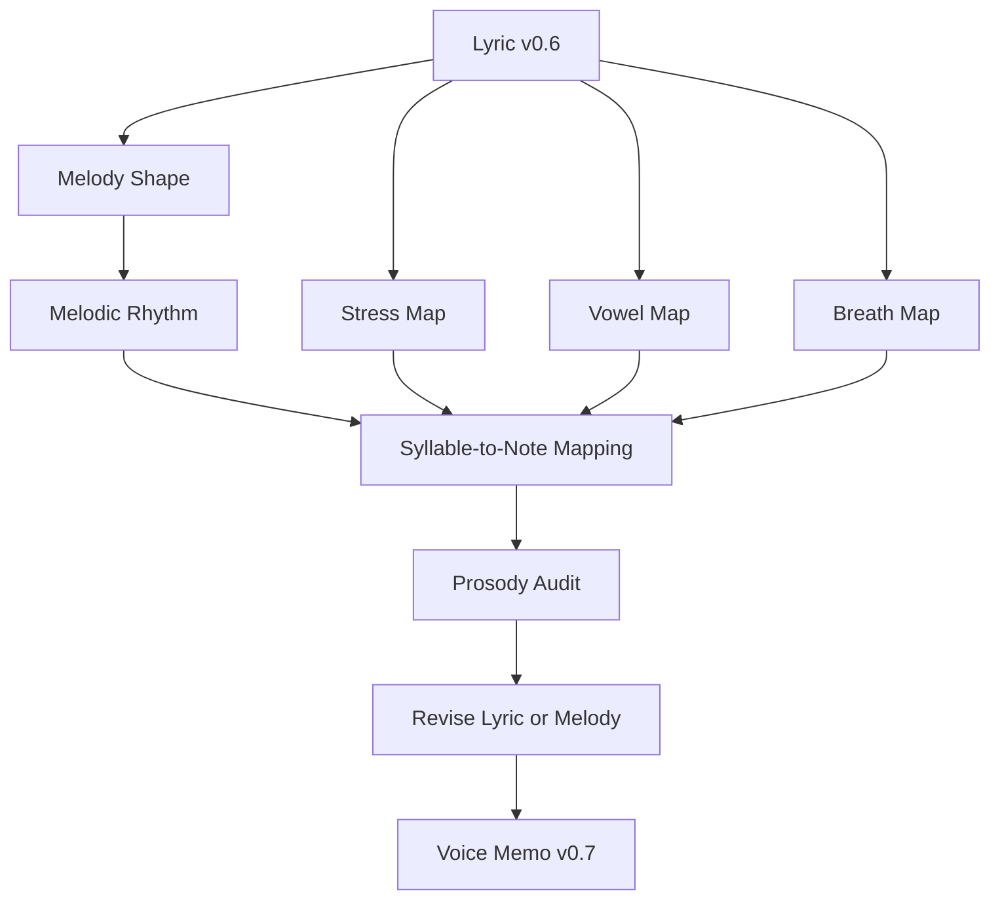
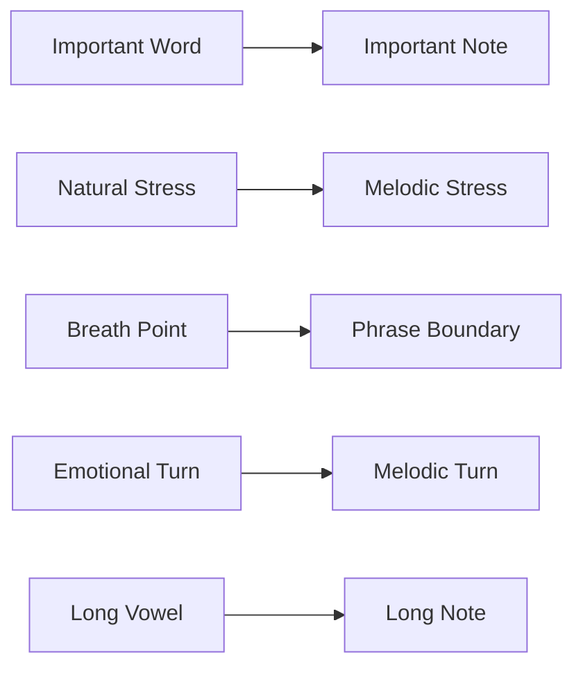
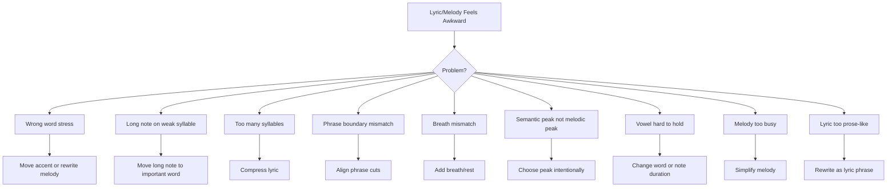

# learn-songwriting-part-020.md

# Lyric-to-Melody Alignment: Menyatukan Kata, Nada, Tekanan, Vokal, dan Napas agar Lirik Terasa Lahir Bersama Melodi

> Seri: `learn-songwriting`  
> Part: `020 / 034`  
> Fokus: prosody, lyric-to-melody fit, stress alignment, vowel placement, syllable-to-note mapping, phrase matching, dan Bahasa Indonesia singability  
> Status seri: belum selesai  
> Prasyarat: `learn-songwriting-part-000.md` sampai `learn-songwriting-part-019.md`

---

## Ringkasan Part Ini

Part sebelumnya membahas **Melodic Rhythm**: kapan suku kata dinyanyikan, berapa lama ditahan, dan bagaimana membuat rhythm tidak robotic.

Part ini membahas tahap yang sangat penting:

> **Apakah lirik dan melodi benar-benar cocok satu sama lain?**

Ini disebut **prosody** atau, dalam konteks praktis kita, **lyric-to-melody alignment**.

Masalah umum dalam songwriting pemula:

- melodi bagus, tapi kata terasa dipaksa;
- lirik bagus, tapi saat dinyanyikan ada tekanan salah;
- kata penting jatuh di nada lemah;
- suku kata tidak natural;
- frasa panjang dipadatkan ke melody pendek;
- vowel yang tidak enak dipaksa menjadi long note;
- chorus terdengar robotic;
- Bahasa Indonesia terasa seperti terjemahan;
- melodi membuat arti kalimat berubah;
- napas lirik dan napas melodi tidak sama;
- line break tidak cocok dengan musical phrase;
- hook tidak punya emphasis yang tepat.

Contoh:

```text
Jangan panggil ini pulang
```

Jika melodi memberi tekanan terbesar pada “ini”:

```text
jangan panggil I-ni pulang
```

maka phrase terasa aneh, kecuali memang “ini” adalah kata yang ingin diperdebatkan.

Biasanya emphasis lebih natural pada:

```text
JAN-gan PANG-gil ini PU-lang
```

Kata penting:

- jangan;
- panggil;
- pulang.

Contoh lain:

```text
Tak kupakai, tak kubuang
```

Jika melodi memanjang di “ku”:

```text
tak kuuuu-pakai
```

bisa terdengar kurang kuat dibanding memanjang di:

```text
pakai
buang
```

Karena conflict-nya ada pada action:

```text
pakai vs buang
```

Part ini akan membantu kamu memeriksa apakah:

```text
kata penting mendapat nada penting
suku kata penting mendapat durasi penting
vowel penting cocok untuk ditahan
phrase lirik cocok dengan phrase melody
napas lirik cocok dengan napas melody
emosi kata cocok dengan gerak nada
```

Sebagai software engineer, pikirkan lyric-to-melody alignment seperti **interface contract** antara dua modul:

```text
Lyric module exports: syllables, stress, meaning, emotion, breath
Melody module expects: note slots, duration, pitch emphasis, phrase boundaries
```

Jika interface-nya tidak cocok, runtime-nya crash:

```text
wrong stress
awkward syllable
rushed phrase
unclear hook
robotic delivery
```

---

## Tujuan Part

Setelah menyelesaikan part ini, kamu harus bisa:

1. Memahami prosody sebagai kesesuaian antara kata dan musik.
2. Mengidentifikasi tekanan kata yang salah dalam melody.
3. Menentukan suku kata mana yang boleh dipanjangkan dan mana yang sebaiknya pendek.
4. Menempatkan kata penting pada nada tinggi, nada panjang, atau posisi kuat.
5. Menghindari long note pada suku kata yang tidak penting.
6. Memetakan syllable-to-note secara sederhana.
7. Menyesuaikan lirik jika melodi bagus tapi kata tidak cocok.
8. Menyesuaikan melodi jika lirik bagus tapi nada tidak cocok.
9. Memahami isu khusus Bahasa Indonesia dalam lyric-to-melody alignment.
10. Menguji alignment verse, chorus, bridge, dan final chorus.
11. Membuat prosody audit untuk draft lagu.
12. Membuat file latihan `songwriting-practice-020-lyric-to-melody-alignment.md`.

---

## Prinsip Utama

```text
The right word must land on the right note.
```

Dan:

```text
When lyric and melody disagree, the listener feels friction before they understand why.
```

Pendengar mungkin tidak berkata:

```text
tekanan prosodinya salah
```

Tetapi mereka akan merasa:

```text
kok aneh?
kok robotic?
kok kata ini seperti dipaksa?
kok emosinya tidak sampai?
kok chorus-nya kurang nempel?
```

Prosody adalah salah satu hal yang membuat lagu terasa profesional walau sederhana.

---

## Lyric-to-Melody Alignment dalam Pipeline



Part sebelumnya memberi rhythm map.  
Part ini memeriksa apakah rhythm dan melody benar-benar cocok dengan kata.

---

# Bagian 1 — Apa Itu Prosody?

Dalam songwriting, prosody adalah hubungan antara:

- meaning;
- lyric stress;
- melodic emphasis;
- rhythm;
- phrasing;
- harmony;
- emotional delivery.

Prosody yang baik membuat kata dan musik saling mendukung.

Prosody yang buruk membuat kata dan musik saling melawan.

## Prosody Good

Lirik:

```text
Tak kupakai
tak kubuang
```

Melodi:

- “pakai” diberi naik/hold;
- “buang” diberi landing/hold;
- phrase sama panjang;
- breath setelah masing-masing phrase.

Hasil:

```text
conflict action terasa jelas
```

## Prosody Bad

Melodi:

- memanjangkan “ku”;
- peak pada “tak” secara random;
- “pakai” lewat cepat;
- “buang” tidak diberi landing.

Hasil:

```text
hook kehilangan pusat
```

---

## Prosody sebagai Alignment



Jika kiri dan kanan cocok, lagu terasa natural.

Jika tidak, lagu terasa dipaksa.

---

# Bagian 2 — Stress Map

Stress map adalah peta kata/suku kata penting.

Ambil line:

```text
Jangan panggil ini pulang
```

Tandai:

```text
>Jangan >panggil ini >pulang
```

Atau lebih detail:

```text
>JAN-gan >PANG-gil i-ni >PU-lang
```

Kata “ini” bisa tetap dinyanyikan, tetapi tidak perlu jadi peak kecuali fokus semantik-nya memang “ini”.

## Stress Map Template

```markdown
# Stress Map

Line:
...

Important words:
1.
2.
3.

Natural stress:
...

Words that should not get peak:
...

Possible melodic emphasis:
...
```

## Example

```markdown
Line:
Tak kupakai, tak kubuang

Important words:
pakai, buang

Natural stress:
tak ku-PA-kai / tak ku-BU-ang

Words that should not get peak:
ku, tak

Possible melodic emphasis:
PA and BU, or final syllables kai/ang
```

---

# Bagian 3 — Melodic Emphasis

Melody memberi emphasis melalui beberapa cara:

- nada lebih tinggi;
- nada lebih panjang;
- beat lebih kuat;
- leap;
- rest sebelum kata;
- rest sesudah kata;
- repeated note;
- perubahan rhythm;
- perubahan chord;
- louder vocal;
- held vowel.

Untuk alignment awal, cukup pakai:

```text
high note
long note
strong beat
rest
```

## Emphasis Table

| Lyric Element | Possible Melodic Emphasis |
|---|---|
| title | high/long note |
| hook verb | long note or strong beat |
| address | rest after it |
| final word | cadence/landing |
| emotional reveal | pause before + long note |
| object symbol | line start/end |
| command | accent/strong beat |
| question | rising cadence |
| confession | held note or silence after |

---

## Bad Emphasis Example

Line:

```text
Rumah ini salah paham
```

Melody emphasis:

```text
rumah i-NI salah paham
```

If “ini” is not the focus, this feels awkward.

Better:

```text
RU-mah ini SA-lah PA-ham
```

or:

```text
Rumah ini / salah... PA-ham
```

---

# Bagian 4 — Syllable-to-Note Mapping

Syllable-to-note mapping adalah cara menempatkan suku kata ke nada.

Untuk tahap awal, gunakan notasi sederhana:

```text
syllable -> note slot
```

Line:

```text
Tak kupakai
```

Syllables:

```text
Tak / ku / pa / kai
```

Possible note mapping:

```text
Tak  ku  PA  kai
M    M   H   H
S    S   M   L
```

Atau:

```text
Tak  ku-PA-kai
M    H   H
S    S   L
```

Dalam nyanyi, kadang beberapa suku kata terasa digabung atau ditarik.

## Mapping Template

```markdown
# Syllable-to-Note Map

Line:
...

Syllables:
...

Important syllables:
...

Note slots:
...

Duration:
...

Stress ok?
yes/no

Revision:
...
```

---

## One Syllable, One Note

Paling sederhana:

```text
Ge-las-mu di rak ke-du-a
1  2  3  4 5   6  7
```

Cocok untuk verse yang speech-like.

## One Syllable, Multiple Notes / Melisma

Satu suku kata dinyanyikan dengan beberapa nada.

Contoh:

```text
pu-laaaang
```

`lang` atau vowel `a` bisa ditarik.

Untuk MVS, gunakan melisma sangat sedikit.

Risiko:

- membuat lirik kurang jelas;
- sulit dinyanyikan;
- AI/singer bisa salah;
- terdengar over-singing.

## Multiple Syllables, One Gesture

Beberapa suku kata terasa sebagai satu movement.

```text
jangan panggil
```

bisa dinyanyikan sebagai satu phrase cepat menuju “pulang”.

---

# Bagian 5 — Long Note Placement

Long note harus ditempatkan dengan hati-hati.

Kata yang cocok untuk long note:

- kata penting;
- vowel enak;
- emotional word;
- title/hook;
- final word;
- open vowel;
- word with enough weight.

## Good Long Note Candidates

```text
pulang
sayang
nama
rumah
tuan
aku
kamu
doa
luka
sepi
buang
pakai
```

## Risky Long Note Candidates

```text
yang
dan
di
ke
ku
mu
ini
itu
karena
adalah
```

Bukan dilarang, tapi biasanya tidak ideal sebagai peak/long note.

## Example

Bad:

```text
Jangan panggil i-niiiii pulang
```

Unless “ini” is semantically central.

Better:

```text
Jangan panggil ini pu-laaaang
```

or:

```text
Jaaangan panggil ini pulang
```

depending emotional intent.

---

## Long Note Test

```markdown
# Long Note Test

Word:
...

Vowel:
...

Is it important?
...

Does it feel good held?
...

Does it match emotion?
...

Keep / change:
...
```

---

# Bagian 6 — Vowel Placement

Vowel matters.

Open vowels are often easier for long notes.

## Vowel A

```text
pulang, sayang, nama, rumah
```

Open, expressive.

## Vowel U

```text
rindu, tunggu, pintu, lampu
```

Darker, more closed. Good for longing, but can feel contained.

## Vowel I

```text
sepi, sendiri, piring, kecil
```

Can sound thin/fragile. Good for vulnerability.

## Vowel E/O

Varies by word.

```text
gelas, lelah, kosong, lorong
```

Can work well.

## Practical Rule

```text
If you want to hold a word, check the vowel.
If the vowel feels bad, change word or melody.
```

---

# Bagian 7 — Bahasa Indonesia Prosody Issues

Bahasa Indonesia punya beberapa isu khusus.

## 1. Terlalu Banyak Suku Kata Jelas

Jika semua suku kata diberi note equal, terdengar robotic.

Solusi:

- group phrase;
- vary duration;
- hold important vowel;
- use rest.

## 2. Imbuhan Panjang

Kata seperti:

```text
mempertahankan
mengakibatkan
ketidakhadiran
```

bisa berat.

Solusi:

```text
menahan
membuat
kau tak ada
```

## 3. Ku-/Kau/Kamu

```text
ku-
```

compact, bagus untuk rhythm, tapi bisa terasa klasik jika terlalu banyak.

```text
kau
```

satu suku kata, bagus untuk melody.

```text
kamu
```

lebih conversational, dua suku kata.

Pilih sesuai phrase.

Example:

```text
aku tidak memakai
```

vs:

```text
tak kupakai
```

Yang kedua lebih rhythmic.

## 4. “Yang” di Long Note

Hindari peak di “yang” kecuali sengaja.

## 5. Natural Word Order

Jangan balik kalimat demi melody sampai aneh.

Bad:

```text
Pulang kau jangan sebut ini
```

Better:

```text
Jangan sebut ini pulang
```

or:

```text
Jangan panggil ini pulang
```

---

# Bagian 8 — Phrase Boundary Alignment

Lirik punya phrase. Melodi punya phrase. Keduanya harus align.

Lyric phrase:

```text
Tak kupakai / tak kubuang
```

Melody phrase should also separate:

```text
phrase 1: tak kupakai
phrase 2: tak kubuang
```

Bad:

```text
tak kupakai tak / kubuang kau
```

unless done for specific syncopation, it breaks meaning.

## Phrase Alignment Template

```markdown
# Phrase Boundary Alignment

Lyric line:
...

Lyric phrase boundaries:
...

Melody phrase boundaries:
...

Do they align?
...

Problem:
...

Revision:
...
```

---

# Bagian 9 — Breath Alignment

Breath map from part 016 must align with melody.

If lyric says:

```text
Jangan panggil ini pulang /
jika rumah hanya kau singgahi //
sebagai panggung //
```

Melody should allow breath after “pulang” and “singgahi”.

If melody forces no breath until after “panggung”, line may feel rushed.

## Breath Alignment Questions

```text
Apakah penyanyi bisa bernapas di phrase boundary?
Apakah napas terjadi setelah complete thought?
Apakah breath memperkuat emosi?
Apakah melody memberi space setelah hook?
Apakah final word punya landing?
```

---

# Bagian 10 — Semantic Peak vs Melodic Peak

Semantic peak adalah kata dengan makna paling penting.

Melodic peak adalah nada tertinggi atau paling kuat.

Idealnya, keduanya berkaitan.

Example:

```text
Jangan panggil ini pulang
```

Semantic peaks:

```text
jangan, panggil, pulang
```

Possible melodic peak:

```text
pulang
```

or:

```text
jangan
```

Choose based on intent.

## If Peak on “Jangan”

Effect:

```text
command/refusal
```

## If Peak on “Panggil”

Effect:

```text
naming/meaning of calling
```

## If Peak on “Pulang”

Effect:

```text
central concept of home/return
```

## If Peak on “Ini”

Effect:

```text
this specific situation is being contested
```

Could work if the line means:

```text
do not call THIS pulang
```

So peak choice is meaning choice.

---

## Semantic-Melodic Peak Template

```markdown
Line:
...

Semantic peak candidates:
1.
2.
3.

Chosen semantic peak:
...

Melodic peak:
...

Do they match?
...

If not, why?
...
```

---

# Bagian 11 — Cadence Alignment

Cadence must match meaning.

Line:

```text
Kau belum selesai
```

Ending down:

```text
statement / sadness / acceptance
```

Ending up:

```text
question / pleading / unresolved
```

Ending flat:

```text
numbness / denial / deadpan
```

Choose based on emotional state.

## Example

Chorus 1:

```text
kau belum selesai ↗
```

Could feel unresolved.

Final chorus:

```text
kau belum selesai ↘
```

Could feel accepted.

Same lyric, cadence variation.

---

# Bagian 12 — Tension and Release Alignment

Lirik punya tension/release.

Melodi juga.

Example:

```text
Tak kupakai
tak kubuang
```

Tension:

```text
tak kupakai
```

Release/answer:

```text
tak kubuang
```

Melody can mirror:

```text
tak kupakai ↗
tak kubuang ↘
```

Or keep both unresolved if denial:

```text
tak kupakai →
tak kubuang →
```

Choose intentionally.

## Tension-Release Template

```markdown
Line/phrase:
...

Where is tension?
...

Where is release?
...

Melody movement:
...

Does melody support it?
...
```

---

# Bagian 13 — Lirik Mengalah atau Melodi Mengalah?

Saat lirik dan melodi tidak cocok, ada dua opsi:

## 1. Revise Lyric

Jika melody kuat dan lirik terlalu panjang/berat.

Original:

```text
Aku tidak bisa menggunakan atau membuang gelasmu
```

Revise:

```text
Tak kupakai
tak kubuang
```

## 2. Revise Melody

Jika lirik kuat dan melody memberi stress salah.

Line:

```text
Jangan panggil ini pulang
```

If melody peaks on “ini” unintentionally, adjust melody to peak on “pulang” or “jangan”.

## Decision Rule

```text
Protect the strongest element.
Revise the weaker interface.
```

If hook lyric is great, adapt melody.  
If melody is unforgettable but word awkward, rewrite lyric to fit.

---

# Bagian 14 — Prosody Audit

Prosody audit checks alignment.

Template:

```markdown
# Prosody Audit

| Line | Important Word | Melodic Peak | Long Note | Stress OK? | Issue | Fix |
|---|---|---|---|---|---|---|
|  |  |  |  |  |  |  |
```

Example:

```markdown
| Jangan panggil ini pulang | pulang | ini | ini | no | wrong peak | move peak to pulang |
```

---

# Bagian 15 — Prosody Marking Symbols

Use simple symbols:

```text
> = accent
_ = held/long
^ = melodic peak
/ = breath
// = long breath
(...) = quick/pickup
```

Example:

```text
>Tak ku->PA_kai /
>tak ku->BU_ang //
```

Example:

```text
>Jangan >panggil ini ^PU_lang //
```

Example:

```text
(Tuan...) /
>jangan >panggil ini ^PU_lang //
```

This notation helps lyric/melody revision.

---

# Bagian 16 — Hook Alignment

Hook must be aligned extremely well.

Hook checklist:

```markdown
- [ ] Hook words are short enough.
- [ ] Important syllables get emphasis.
- [ ] Long notes are on meaningful vowels.
- [ ] Hook rhythm is repeatable.
- [ ] Hook melody does not distort natural speech.
- [ ] Hook phrase boundary is clear.
- [ ] Final word lands or intentionally hangs.
```

## Hook Example: “Tak kupakai, tak kubuang”

Stress:

```text
tak ku-PA-kai / tak ku-BU-ang
```

Alignment option:

```text
tak ku->PA_kai /
tak ku->BU_ang //
```

If “buang” is final landing, hold:

```text
BU_ang__
```

## Hook Example: “Jangan panggil ini pulang”

Alignment option:

```text
>Jangan >panggil ini ^PU_lang //
```

If satire/cold:

```text
Jangan panggil ini ^PU_lang //
```

less big on “jangan”, stronger on “pulang”.

---

# Bagian 17 — Verse Alignment

Verse alignment prioritizes natural speech and clarity.

Verse line:

```text
Gelasmu di rak kedua
```

Stress:

```text
Ge-LAS-mu di rak ke-DU-a
```

Possible alignment:

```text
Ge->LAS-mu di rak ke->DU_a /
```

But verse should not overemphasize every word.

Better:

```text
Gelasmu di rak kedua /
```

speech-like, gentle.

## Verse Alignment Checklist

```markdown
- [ ] Does melody preserve intelligibility?
- [ ] Are object words clear?
- [ ] Is verse not over-sung?
- [ ] Are phrase breaks natural?
- [ ] Does final line lead to chorus?
- [ ] Are filler words not emphasized?
```

---

# Bagian 18 — Chorus Alignment

Chorus alignment prioritizes hook and memory.

Chorus should:

- emphasize title/hook;
- use repeatable rhythm;
- land important words;
- be easier than verse;
- not cram too many syllables;
- align emotional release.

## Chorus Alignment Example

```text
Tak kupakai /
tak kubuang //

kau belum selesai /
di rumah yang kupanggil pulang //
```

Marking:

```text
>Tak ku->PA_kai /
>tak ku->BU_ang //

kau >BE-lum se-LE-sai /
di >RU-mah yang ku-PANG-gil ^PU_lang //
```

This is too many marks if literal, but useful for analysis.

In actual singing, choose the main peaks:

- PA/BU;
- selesai;
- pulang.

---

# Bagian 19 — Bridge Alignment

Bridge often contains reveal. Alignment must give reveal space.

Line:

```text
bukan gelasmu
yang paling lama
kutunda
```

Important words:

```text
bukan
gelasmu
lama
kutunda
```

Maybe peak/hold:

```text
ku-TUN-da
```

or pause before:

```text
yang paling lama /
...
kutunda //
```

Bridge alignment often uses:

- pauses;
- lower melody;
- less rhythm;
- long final word;
- spoken-like delivery.

## Bridge Alignment Checklist

```markdown
- [ ] Is reveal word clear?
- [ ] Is there space before/after reveal?
- [ ] Does melody differ from chorus?
- [ ] Does it avoid over-singing?
- [ ] Does it prepare final chorus?
```

---

# Bagian 20 — Final Chorus Alignment

Final chorus may use same melody or varied alignment.

Options:

## Same Alignment

Good if context changed enough.

## One-Word Emphasis Change

Chorus 1:

```text
Tak kupakai / tak kubuang
```

Final:

```text
AKU /
di rak kedua
```

Make “aku” important.

## Slower Final

Same lyric, more space.

## Lower Delivery

Same melody lower/softer.

## Stronger Landing

Hold final word longer.

Example:

```text
di rumah yang kupanggil pu-laaang //
```

Final cadence down.

---

# Bagian 21 — Alignment with Emotional State

Alignment changes with state.

## Denial

- even rhythm;
- less peak;
- controlled;
- fewer held notes.

## Confession

- hold truth word;
- rest after confession;
- melody opens.

## Anger

- accents;
- clipped words;
- strong beat.

## Grief

- broken phrases;
- pauses;
- falling cadence.

## Satire

- precise stress;
- deadpan/understated;
- pause after address.

Example satire:

```text
Tuan... /
jangan panggil ini pulang //
```

The pause after “Tuan” is alignment of emotional distance.

---

# Bagian 22 — Alignment and Diction Choices

Sometimes choosing a different word solves alignment.

## Example

Line:

```text
Aku tidak memakai, aku tidak membuang
```

Too long.

Options:

```text
Tak kupakai
tak kubuang
```

Better.

## Example

```text
Kamu belum selesai
```

vs:

```text
Kau belum selesai
```

“Kau” is one syllable, easier for tight rhythm.

## Example

```text
Saya tidak mengharapkan kepulangan Anda
```

Could be satirical formal, but too heavy.

Maybe:

```text
Tuan,
jangan panggil ini pulang.
```

Better for theatrical satire.

Diction is part of alignment.

---

# Bagian 23 — Alignment and Syllable Splitting

Sometimes you need to split or merge.

## Split Long Phrase

Original:

```text
di rumah yang kupanggil pulang
```

Possible phrase:

```text
di rumah /
yang kupanggil pulang //
```

or:

```text
di rumah yang /
kupanggil pulang //
```

Meaning differs slightly.

## Merge Quick Words

```text
yang ku-
```

can pass quickly before “panggil”.

## Avoid Splitting Badly

Bad:

```text
di rumah yang ku- /
panggil pulang
```

Unless rhythm requires it, “kupanggil” should stay connected.

---

# Bagian 24 — Alignment and Melisma

Melisma = one syllable sung over multiple notes.

Use sparingly.

Good place:

```text
pulang
sayang
nama
buang
```

Maybe:

```text
pu-laaaang
```

Bad place:

```text
yang
di
ke
ini
```

unless stylistically intentional.

## Melisma Rule

```text
Use melisma on emotional vowels, not filler syllables.
```

For MVS, one or two held/ornamented words are enough.

---

# Bagian 25 — Alignment and AI/Singer Instructions

If preparing lyric for singer or AI, mark alignment lightly.

Example:

```markdown
[Chorus - open, hold key verbs]
>Tak ku->PA_kai /
>tak ku->BU_ang //

kau belum selesai /
di rumah yang kupanggil ^PU_lang //
```

But do not overmark every syllable if it becomes unreadable.

A practical format:

```markdown
[Chorus - hold "buang" and "pulang"; do not rush]
Tak kupakai /
tak kubuang //

kau belum selesai /
di rumah yang kupanggil pulang //
```

This is often enough.

---

# Bagian 26 — Alignment Debugging



---

# Bagian 27 — Alignment Tests

## 1. Speak-Sing Test

Speak line, immediately sing it.

If singing feels unnatural compared to speech, inspect stress.

## 2. Peak Test

Ask:

```text
what is the highest/longest note?
what word is on it?
```

If word is not important, revise.

## 3. Vowel Test

Hold the long note.

Does vowel feel good?

## 4. Breath Test

Can phrase be sung in one breath?

## 5. Meaning Test

Does melody change meaning unintentionally?

## 6. Hook Repeat Test

Repeat hook 10 times. Does stress remain natural?

## 7. Listener Clarity Test

Play voice memo to yourself later. Are important words intelligible?

---

# Bagian 28 — Alignment Revision Process

Step-by-step:

## Step 1: Choose One Section

Start with chorus.

## Step 2: Mark Important Words

```text
Tak kupakai, tak kubuang
```

Important:

```text
pakai, buang
```

## Step 3: Mark Melody Peaks

Where are high/long notes?

## Step 4: Compare

Do important words match important notes?

## Step 5: Fix

Options:

- move note;
- change rhythm;
- change word;
- split line;
- add rest;
- choose different pronoun;
- compress phrase.

## Step 6: Record

Voice memo.

## Step 7: Re-listen

If still awkward, repeat.

---

# Bagian 29 — Prosody Alignment Template

```markdown
# Lyric-to-Melody Alignment Map

## Song Title
...

## Song Promise
...

## Current Lyric Version
...

## Current Melody Version
...

## Hook Alignment

### Hook lyric
...

### Important words
1.
2.
3.

### Natural speech stress
...

### Melodic peaks / long notes
...

### Alignment issue
...

### Revision
...

## Verse Alignment

| Line | Important Words | Melody Peak | Long Note | Breath | Issue | Fix |
|---|---|---|---|---|---|---|
|  |  |  |  |  |  |  |

## Chorus Alignment

| Line | Important Words | Melody Peak | Long Note | Breath | Issue | Fix |
|---|---|---|---|---|---|---|

## Bridge Alignment

| Line | Important Words | Melody Peak | Long Note | Breath | Issue | Fix |
|---|---|---|---|---|---|---|

## Final Chorus Alignment
What changes from earlier chorus:
...

## Long Note Test
| Word | Vowel | Important? | Works Held? | Keep/Revise |
|---|---|---|---|---|
|  |  |  |  |  |

## Semantic Peak vs Melodic Peak
...

## Voice Memo Log
...

## Revision Plan
...
```

---

# Bagian 30 — Contoh Alignment: Rindu Domestik

## Hook

```text
Tak kupakai
tak kubuang
```

## Important Words

```text
pakai
buang
```

## Natural Stress

```text
tak ku-PA-kai
tak ku-BU-ang
```

## Good Alignment

```text
Tak ku->PA_kai /
tak ku->BU_ang //
```

- `PA` gets emphasis;
- `BU` gets emphasis;
- `buang` can land longer;
- breath supports contrast.

## Bad Alignment

```text
TAK ku-pa-kai /
TAK ku-bu-ang //
```

This emphasizes negation. Could work if denial is central, but if the hook is about the action contrast, better emphasize `pakai/buang`.

## Verse

```text
Gelasmu di rak kedua
```

Important:

```text
gelasmu, rak kedua
```

Avoid peak on:

```text
di
```

Good:

```text
Gelasmu di rak ke-DU-a /
```

or soft speech-like.

## Bridge

```text
bukan gelasmu
yang paling lama
kutunda
```

Important:

```text
bukan, gelasmu, lama, kutunda
```

Best reveal may land on:

```text
kutunda
```

---

# Bagian 31 — Contoh Alignment: Romansa Satir

## Hook

```text
Jangan panggil ini pulang
```

## Important Words

```text
jangan
panggil
pulang
```

## Natural Stress

```text
JAN-gan PANG-gil ini PU-lang
```

## Accusatory Alignment

```text
>JAN-gan >PANG-gil ini ^PU_lang //
```

## Cold Satirical Alignment

```text
Tuan... /
jangan panggil ini ^PU_lang //
```

Less shouting, more distance.

## Bad Alignment

```text
jangan panggil I-ni pulang
```

Unless “ini” means “this particular performance”, it feels off.

## Final Variation

```text
Sayang -> Tuan
```

Alignment:

```text
Tuan... /
```

Rest after “Tuan” creates hierarchy and cold accusation.

---

# Bagian 32 — Latihan Utama Part 020

Buat file:

```text
songwriting-practice-020-lyric-to-melody-alignment.md
```

Isi template berikut.

```markdown
# songwriting-practice-020-lyric-to-melody-alignment.md

## 1. Lyric Source
Tempel lyric v0.6 dari part 019.

...

## 2. Melody/Rhythm Source
Tempel melody shape + rhythm map dari part 018-019.

...

## 3. Song Promise
...

## 4. POV / Emotional State
Narrator:
Addressee:
Verse state:
Chorus state:
Bridge state:
Final state:

## 5. Hook Alignment

### Hook lyric
...

### Important words
1.
2.
3.

### Natural speech stress
...

### Current melodic peaks / long notes
...

### Semantic peak vs melodic peak
Match?
Notes:

### Long note words
| Word | Vowel | Important? | Works Held? | Keep/Revise |
|---|---|---|---|---|
|  |  |  |  |  |

### Hook issue
...

### Hook revision
...

## 6. Verse Alignment Audit

| Line | Important Words | Melody Peak | Long Note | Breath | Issue | Fix |
|---|---|---|---|---|---|---|
|  |  |  |  |  |  |  |

## 7. Chorus Alignment Audit

| Line | Important Words | Melody Peak | Long Note | Breath | Issue | Fix |
|---|---|---|---|---|---|---|
|  |  |  |  |  |  |  |

## 8. Bridge Alignment Audit

| Line | Important Words | Melody Peak | Long Note | Breath | Issue | Fix |
|---|---|---|---|---|---|---|
|  |  |  |  |  |  |  |

## 9. Final Chorus Alignment
What should feel same:
...

What should feel different:
...

Final emphasis:
...

Final cadence:
...

## 10. Weak Syllable Peak Audit
Cari nada tinggi/panjang yang jatuh pada kata lemah seperti yang, di, ke, ku, ini, dan.

| Word/Syllable | Location | Problem | Fix |
|---|---|---|---|
|  |  |  |  |

## 11. Phrase Boundary Audit

| Lyric Phrase | Melody Phrase | Aligned? | Fix |
|---|---|---|---|
|  |  |  |  |

## 12. Prosody Marked Lyric v0.7
Use:
> accent
_ hold
^ melodic peak
/ breath
// long breath

### Verse 1
...

### Pre-Chorus
...

### Chorus
...

### Verse 2
...

### Chorus
...

### Bridge
...

### Final Chorus
...

### Outro
...

## 13. Voice Memo Log

| Take | Section | Alignment Focus | What Works | What Fails |
|---|---|---|---|---|
| 1 |  |  |  |  |
| 2 |  |  |  |  |
| 3 |  |  |  |  |

## 14. Prosody Diagnostic
Best aligned line:
Worst aligned line:
Wrong stress moments:
Long note problems:
Breath problems:
Hook clarity:
Final chorus payoff:

## 15. Revision Decision
Lyrics to revise:
...

Melody to revise:
...

Rhythm to revise:
...

What to protect:
...

## 16. Next Action
...
```

---

# Latihan 30 Menit: Hook Prosody Audit

1. Ambil hook.
2. Tandai important words.
3. Tandai natural speech stress.
4. Tandai melodic peak.
5. Cek long notes.
6. Revisi hook jika perlu.
7. Rekam 3 take.

Output:

```markdown
Hook alignment score:
Best take:
Issue fixed:
Next test:
```

---

# Latihan 45 Menit: Section Prosody Audit

Pilih chorus dan bridge.

Untuk tiap line:

- important word;
- melodic peak;
- long note;
- breath;
- issue;
- fix.

Rekam voice memo setelah revisi.

---

# Latihan 60 Menit: Full Alignment Pass v0.7

Ambil lyric v0.6 + melody/rhythm.

Lakukan:

1. stress map;
2. syllable-to-note map untuk hook;
3. prosody audit untuk semua section;
4. weak syllable peak audit;
5. phrase boundary audit;
6. revise lyric/melody;
7. record voice memo v0.7.

Output:

```markdown
v0.7 prosody marked lyric:
Voice memo notes:
Best alignment:
Worst alignment:
Next action:
```

---

# Checklist Part 020

Sebelum lanjut ke part 021, pastikan:

- [ ] Kamu memahami prosody sebagai lyric-to-melody fit.
- [ ] Kamu sudah membuat stress map untuk hook.
- [ ] Kamu tahu semantic peak dan melodic peak hook.
- [ ] Kamu sudah mengecek long note placement.
- [ ] Kamu sudah mengecek vowel pada long note.
- [ ] Kamu sudah audit verse alignment.
- [ ] Kamu sudah audit chorus alignment.
- [ ] Kamu sudah audit bridge alignment.
- [ ] Kamu sudah mengecek weak syllable peak.
- [ ] Kamu sudah mengecek phrase boundary.
- [ ] Kamu sudah membuat prosody marked lyric v0.7.
- [ ] Kamu sudah merekam voice memo alignment.
- [ ] Kamu tahu apakah harus merevisi lirik atau melodi.
- [ ] Kamu punya next action menuju hook writing.

---

# Output Wajib Part 020

Buat file:

```text
songwriting-practice-020-lyric-to-melody-alignment.md
```

Isi minimal:

```markdown
# songwriting-practice-020-lyric-to-melody-alignment.md

## Lyric Source
...

## Melody/Rhythm Source
...

## Song Promise
...

## Hook Alignment
...

## Verse Alignment Audit
...

## Chorus Alignment Audit
...

## Bridge Alignment Audit
...

## Final Chorus Alignment
...

## Weak Syllable Peak Audit
...

## Phrase Boundary Audit
...

## Prosody Marked Lyric v0.7
...

## Voice Memo Log
...

## Prosody Diagnostic
...

## Revision Decision
...

## Next Action
...
```

---

# Common Failure Modes di Part Ini

## 1. Nada Penting Jatuh pada Kata Lemah

Gejala:

```text
peak di "yang", "di", "ke", "ini" tanpa alasan.
```

Solusi:

```text
pindahkan peak atau ubah line.
```

## 2. Kata Penting Lewat Terlalu Cepat

Gejala:

```text
title/hook tidak terdengar jelas.
```

Solusi:

```text
beri long note, accent, atau posisi akhir phrase.
```

## 3. Long Note pada Vowel yang Tidak Enak

Gejala:

```text
kata sulit ditahan.
```

Solusi:

```text
ubah kata, ubah melody, atau kurangi durasi.
```

## 4. Phrase Lirik dan Melody Tidak Cocok

Gejala:

```text
melody memotong makna di tempat aneh.
```

Solusi:

```text
align phrase boundary.
```

## 5. Napas Tidak Sesuai

Gejala:

```text
penyanyi kehabisan napas sebelum thought selesai.
```

Solusi:

```text
breath alignment.
```

## 6. Melody Mengubah Makna

Gejala:

```text
line statement terdengar seperti pertanyaan tanpa niat.
```

Solusi:

```text
atur cadence.
```

## 7. Lirik Terlalu Panjang untuk Melody

Gejala:

```text
suku kata dipadatkan.
```

Solusi:

```text
compress lyric atau ubah rhythm.
```

## 8. Melody Terlalu Ramai untuk Lirik

Gejala:

```text
kata tidak jelas karena terlalu banyak nada.
```

Solusi:

```text
simplify melody.
```

## 9. Hook Tidak Diaudit Khusus

Gejala:

```text
bagian paling penting justru prosody-nya lemah.
```

Solusi:

```text
audit hook terlebih dahulu.
```

## 10. Tidak Ada Voice Memo

Gejala:

```text
alignment hanya teori.
```

Solusi:

```text
rekam dan dengar.
```

---

# Prinsip Penting

```text
Prosody is where songwriting becomes believable.
```

Dan:

```text
If the melody says one thing and the lyric says another,
the listener hears the conflict as awkwardness.
```

Alignment yang baik membuat lagu terasa seolah kata dan nada lahir bersama.

---

# Bridge ke Part Berikutnya

Part ini membahas lyric-to-melody alignment.

Part berikutnya, `learn-songwriting-part-021.md`, akan membahas:

```text
Hook Writing
```

Kita akan menggabungkan semua:

- lyric hook;
- melody hook;
- rhythm hook;
- title hook;
- object hook;
- contradiction hook;
- emotional hook;
- repetition;
- variation;
- placement;
- memorability testing.

Jika part ini memastikan kata dan nada cocok, part berikutnya memastikan pusat lagu benar-benar menempel.

---

# Status Seri

Part ini selesai.

```text
Selesai: learn-songwriting-part-020.md
Berikutnya: learn-songwriting-part-021.md
Status seri: belum selesai
Part tersisa: 14
Target akhir seri: learn-songwriting-part-034.md
```


<!-- NAVIGATION_FOOTER -->
<div class="page-nav">
<a href="./learn-songwriting-part-019.md">⬅️ Melodic Rhythm: Mengatur Waktu, Panjang-Pendek, Tekanan, dan Groove agar Melodi Tidak Robotic</a>
<a href="./index.md">📚 Kategori</a>
<a href="../../index.md">🏠 Home</a>
<a href="./learn-songwriting-part-021.md">Hook Writing: Membuat Pusat Lagu yang Menempel, Bernyanyi, dan Membawa Janji Emosional ➡️</a>
</div>
