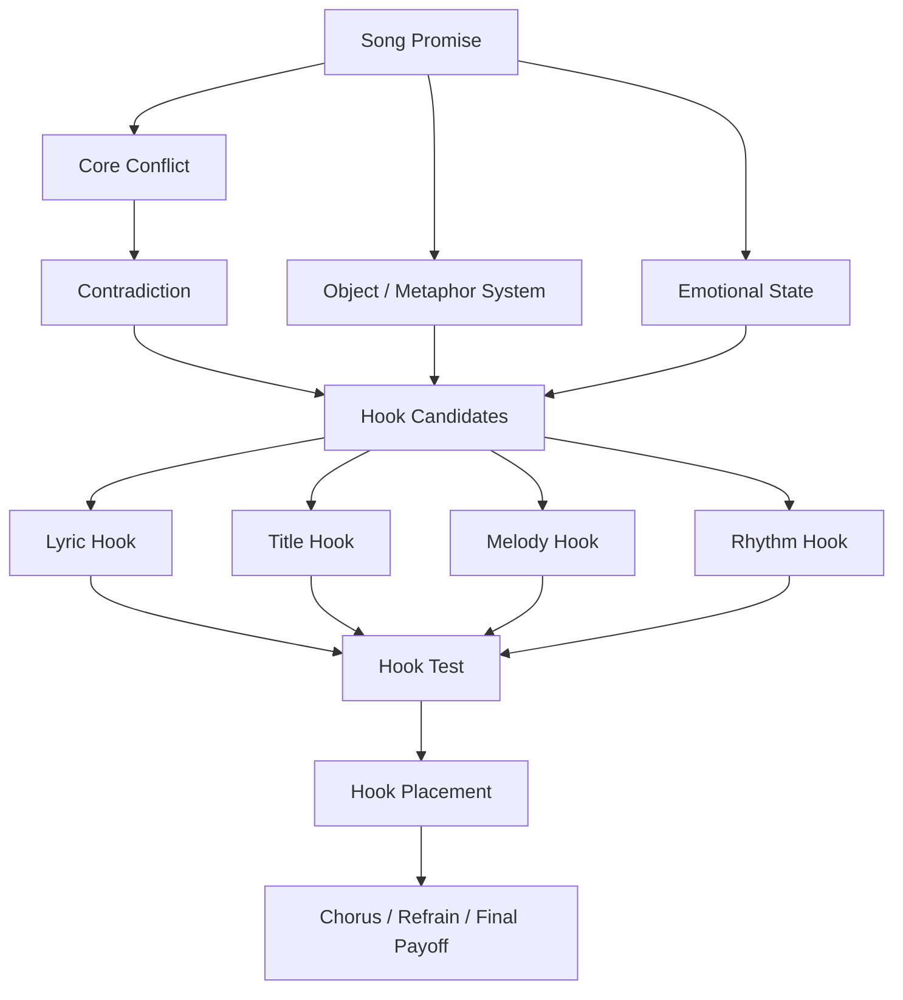
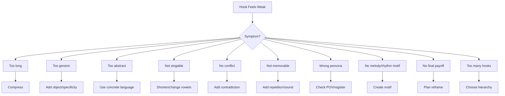

# learn-songwriting-part-021.md

# Hook Writing: Membuat Pusat Lagu yang Menempel, Bernyanyi, dan Membawa Janji Emosional

> Seri: `learn-songwriting`  
> Part: `021 / 034`  
> Fokus: lyric hook, melodic hook, rhythm hook, title hook, object hook, contradiction hook, placement, repetition, variation, dan memorability testing  
> Status seri: belum selesai  
> Prasyarat: `learn-songwriting-part-000.md` sampai `learn-songwriting-part-020.md`

---

## Ringkasan Part Ini

Part sebelumnya membahas **Lyric-to-Melody Alignment**: bagaimana membuat kata dan nada saling cocok.

Part ini membahas pusat gravitasi lagu:

> **Hook.**

Hook adalah elemen yang membuat pendengar:

```text
ingat,
ingin mengulang,
ikut menyanyikan,
merasa lagu punya identitas,
dan tahu “ini lagu tentang apa secara emosional”.
```

Hook bukan hanya “bagian catchy”. Hook adalah **memori emosional**.

Hook bisa berupa:

- frasa lirik;
- judul;
- melodi;
- rhythm;
- object;
- metaphor;
- contradiction;
- question;
- command;
- vocal gesture;
- chord/melody movement;
- silence;
- sound effect;
- repeated word;
- final line.

Contoh hook lirik:

```text
Tak kupakai, tak kubuang.
```

Contoh hook kritik/satir:

```text
Jangan panggil ini pulang.
```

Contoh object hook:

```text
Gelasmu di rak kedua.
```

Contoh title hook:

```text
Koper Tanpa Tuan.
```

Contoh melodic/rhythm hook:

```text
short-short-long / short-short-long
```

pada:

```text
tak ku-PA-kai / tak ku-BU-ang
```

Dalam lagu yang kuat, hook biasanya menggabungkan beberapa layer:

```text
lyric hook + rhythm hook + melody hook + emotional hook + title/memory object
```

Hook terbaik bukan sekadar mudah diingat. Hook terbaik membuat song promise terasa padat.

Jika song promise adalah:

```text
rindu yang disangkal melalui benda rumah
```

maka hook:

```text
Tak kupakai, tak kubuang.
```

bekerja karena membawa:

- object action;
- conflict;
- contradiction;
- unresolved emotion;
- rhythm repetition;
- singability;
- metaphor potential.

Jika song promise adalah:

```text
kemarahan sosial yang disamarkan sebagai romansa tragis
```

maka hook:

```text
Jangan panggil ini pulang.
```

bekerja karena membawa:

- command;
- moral boundary;
- irony;
- title potential;
- pulang/home metaphor;
- emotional accusation;
- singable phrase.

Part ini akan mengajarkan cara mendesain hook sebagai sistem, bukan menunggu “catchy line” datang secara kebetulan.

---

## Tujuan Part

Setelah menyelesaikan part ini, kamu harus bisa:

1. Memahami hook sebagai pusat memori emosional.
2. Membedakan lyric hook, melody hook, rhythm hook, title hook, object hook, dan conceptual hook.
3. Membuat hook dari song promise.
4. Membuat hook dari contradiction.
5. Membuat hook dari object/metaphor system.
6. Membuat hook dari title.
7. Membuat hook dari rhythm dan melody motif.
8. Menentukan hook placement di chorus, verse, refrain, bridge, dan outro.
9. Menguji hook dengan memory test, sing test, dan emotional test.
10. Merevisi hook agar tidak terlalu panjang, terlalu abstrak, terlalu klise, atau terlalu lemah.
11. Membuat 20–50 hook candidates secara sistematis.
12. Memilih hook utama dan secondary hook.
13. Membuat file latihan `songwriting-practice-021-hook-writing.md`.

---

## Prinsip Utama

```text
A hook is the smallest repeatable unit of the song's emotional promise.
```

Hook harus kecil, tetapi membawa pusat lagu.

Kecil:

```text
Tak kupakai, tak kubuang.
```

Tetapi membawa:

```text
belum hidup, belum lepas
```

Kecil:

```text
Jangan panggil ini pulang.
```

Tetapi membawa:

```text
kehadiran palsu tidak sama dengan tanggung jawab
```

Kecil:

```text
Rumah ini salah paham.
```

Tetapi membawa:

```text
tempat dan perasaan salah membaca absensi sebagai harapan
```

Hook bukan semua isi lagu. Hook adalah inti yang bisa kembali.

---

## Hook dalam Pipeline Songwriting



Hook tidak muncul dari satu sumber saja. Hook bisa datang dari:

- promise;
- conflict;
- object;
- metaphor;
- title;
- rhythm;
- melody;
- phrase yang tidak sengaja kuat;
- feedback pendengar;
- voice memo.

---

# Bagian 1 — Apa Itu Hook?

Hook adalah elemen yang “mengait” perhatian dan ingatan pendengar.

Hook biasanya punya sifat:

- pendek;
- repeatable;
- singable;
- memorable;
- emotionally charged;
- specific;
- rhythmically strong;
- connected to title/promise;
- easy to return to;
- able to change meaning later.

Hook bisa eksplisit:

```text
Tak kupakai, tak kubuang.
```

Atau implisit:

```text
melody motif yang pendengar ingat walau tidak ingat kata
```

## Hook Is Not Always Chorus

Hook sering ada di chorus, tetapi tidak wajib.

Hook bisa muncul sebagai:

- chorus first line;
- chorus last line;
- refrain akhir verse;
- intro vocal phrase;
- post-chorus;
- bridge line;
- outro line;
- title phrase;
- instrumental motif.

Untuk 20 jam pertama, paling aman:

```text
main hook berada di chorus atau refrain
```

agar mudah diuji.

---

## Hook vs Title vs Chorus

| Elemen | Definisi | Bisa Sama? |
|---|---|---|
| Hook | bagian paling memorable | ya |
| Title | nama lagu | ya |
| Chorus | section utama yang berulang | ya |
| Refrain | line berulang | ya |
| Motif | elemen kecil berulang | bisa mendukung hook |

Contoh:

```text
Title: Tak Kupakai, Tak Kubuang
Hook: tak kupakai, tak kubuang
Chorus: section yang mengulang hook
Motif: tak ku-
```

Contoh lain:

```text
Title: Koper Tanpa Tuan
Hook: jangan panggil ini pulang
Object motif: koper
```

Title dan hook tidak harus sama, tetapi harus saling mendukung.

---

# Bagian 2 — Jenis-Jenis Hook

## 1. Lyric Hook

Frasa lirik yang memorable.

```text
Tak kupakai, tak kubuang.
Jangan panggil ini pulang.
Rumah ini salah paham.
Kopermu lebih setia.
```

## 2. Melody Hook

Motif nada yang mudah diingat.

Bisa terjadi pada frasa:

```text
tak kupakai / tak kubuang
```

## 3. Rhythm Hook

Pattern durasi yang menempel.

```text
S S L / S S L
```

## 4. Title Hook

Judul yang kuat dan ingin diklik/didengar.

```text
Rak Kedua
Koper Tanpa Tuan
Rumah Ini Salah Paham
Jangan Panggil Ini Pulang
```

## 5. Object Hook

Object spesifik yang melekat di memori.

```text
gelas di rak kedua
koper beroda sutra
notifikasi jam tiga
```

## 6. Conceptual Hook

Ide inti yang kuat.

```text
sesuatu yang tidak dipakai tapi tidak dibuang
kepulangan yang bukan pulang
rumah yang salah paham
doa yang salah nama
```

## 7. Emotional Hook

Rasa yang kuat dan spesifik.

```text
rindu yang tidak mau mengaku
marah yang masih memanggil sayang
lelah yang terlalu sopan untuk runtuh
```

## 8. Production/Sound Hook

Suara instrumental/ambient yang memorable.

Misal:

- roda koper;
- pengumuman bandara;
- notifikasi;
- pintu klik;
- napas;
- piano motif.

Dalam seri songwriting ini, kita fokus lyric/melody/rhythm hook, tetapi production hook bisa dicatat.

---

## Hook Stack

Hook kuat sering berupa stack.

```markdown
Lyric hook:
Tak kupakai, tak kubuang

Rhythm hook:
S S L / S S L

Melody hook:
small rise + fall

Object hook:
gelas/rak

Conceptual hook:
belum hidup, belum lepas

Title hook:
Tak Kupakai, Tak Kubuang
```

Semakin banyak layer yang selaras, semakin kuat hook.

---

# Bagian 3 — Hook dari Song Promise

Hook harus membawa promise.

Song promise:

```text
rindu yang disangkal melalui benda rumah
```

Hook candidates:

```text
Tak kupakai, tak kubuang.
Gelasmu belum jadi benda.
Rumah ini salah paham.
Kau belum selesai.
Di rak kedua.
```

Song promise:

```text
kemarahan sosial sebagai romansa tragis kekasih berkopor
```

Hook candidates:

```text
Jangan panggil ini pulang.
Kopermu lebih setia.
Pulanglah tanpa panggung.
Tuan, rumah bukan bandara.
Koper tanpa tuan.
```

Song promise:

```text
burnout sebagai tubuh yang lupa mati lampu
```

Hook candidates:

```text
Tubuhku belum boleh padam.
Notifikasi jam tiga.
Sebentar lagi.
Kopi dingin duluan.
Aku bukan mesin, tapi hampir.
```

## Hook from Promise Formula

```text
Song promise -> core emotion -> contradiction -> short phrase
```

Template:

```markdown
## Song Promise
...

## Core Emotion
...

## Core Contradiction
...

## Hook Phrases
1.
2.
3.
4.
5.
```

---

# Bagian 4 — Hook dari Conflict

Conflict adalah sumber hook terbaik.

Conflict formula:

```text
want + but + because
```

Hook sering lahir dari “but”.

Contoh:

```markdown
Want:
Aku ingin melepas.

But:
Aku masih menyimpan.

Because:
Membuang berarti mengakui selesai.
```

Hook:

```text
Tak kupakai, tak kubuang.
```

Contoh satire:

```markdown
Want:
Rumah ingin kehadiran nyata.

But:
Yang datang hanya citra/panggung.

Because:
Pergi sudah menjadi kebiasaan.
```

Hook:

```text
Jangan panggil ini pulang.
```

## Conflict-to-Hook Template

```markdown
# Conflict to Hook

## Want
...

## But
...

## Because
...

## Core contradiction
...

## 10 hook phrases
1.
2.
3.
4.
5.
6.
7.
8.
9.
10.
```

---

# Bagian 5 — Hook dari Contradiction

Contradiction hook sangat kuat karena membawa tension.

Examples:

```text
tak kupakai, tak kubuang
pulang tapi tak tinggal
dekat tapi tak hadir
sayang tapi tuan
ramai tapi sendiri
hidup tapi belum bangun
diam tapi menuduh
rumah tapi panggung
doa tapi salah nama
```

Contradiction membuat pendengar ingin memahami.

## Contradiction Hook Pattern

```text
not X, not Y
X but Y
X without Y
Y called X
X that refuses Y
```

Examples:

```text
Tak kupakai, tak kubuang.
Pulang tanpa rumah.
Koper tanpa tuan.
Doa salah nama.
Rumah yang salah paham.
```

---

## Contradiction Hook Test

```markdown
- [ ] Apakah phrase pendek?
- [ ] Apakah ada tension?
- [ ] Apakah tidak terlalu abstrak?
- [ ] Apakah bisa diulang?
- [ ] Apakah cocok dengan song promise?
- [ ] Apakah bisa jadi title?
- [ ] Apakah bisa diberi melody?
```

---

# Bagian 6 — Hook dari Object

Object hook memakai benda spesifik.

Examples:

```text
rak kedua
gelasmu
koper beroda sutra
notifikasi jam tiga
piring kecil
kursi kosong
lampu dapur
boarding pass
```

Object hook bekerja jika object punya emotional charge.

Object biasa bisa menjadi hook jika diberi context:

```text
Gelasmu di rak kedua.
```

Bukan sekadar gelas, tapi gelas yang tidak dipakai/dibuang.

## Object Hook Formula

```text
object + position/action/contradiction
```

Examples:

```text
Gelasmu di rak kedua.
Kopermu lebih setia.
Lampu depan belum padam.
Notifikasi jam tiga.
Piring kecil belajar diam.
```

## Object Hook Template

```markdown
# Object Hook

## Main object
...

## Location
...

## Action/state
...

## Emotional inference
...

## Short phrase candidates
1.
2.
3.
4.
5.
```

---

# Bagian 7 — Hook dari Metaphor

Metaphor hook memakai mapping makna.

Examples:

```text
Rumah ini salah paham.
Jangan panggil ini pulang.
Gelasmu belum jadi benda.
Kopermu lebih setia.
Doa salah nama.
Tubuhku belum boleh padam.
```

Metaphor hook harus cukup jelas untuk dirasakan, tidak terlalu puzzle.

## Good Metaphor Hook

```text
Rumah ini salah paham.
```

Kata sederhana, makna dalam.

## Too Abstract

```text
Arsitektur emosiku mengalami dislokasi metafisik.
```

Tidak hooky.

## Metaphor Hook Criteria

- simple words;
- fresh relation;
- emotional truth;
- singable;
- repeatable;
- not over-explained;
- connected to domain.

---

# Bagian 8 — Hook dari Title

Judul bisa menjadi hook.

Title yang kuat biasanya:

- spesifik;
- singkat;
- membawa object/contradiction;
- membuat penasaran;
- mudah diingat;
- punya sound bagus;
- cocok dengan chorus/refrain.

Examples:

```text
Rak Kedua
Tak Kupakai, Tak Kubuang
Jangan Panggil Ini Pulang
Koper Tanpa Tuan
Rumah Ini Salah Paham
Notifikasi Jam Tiga
Doa Salah Nama
Tubuh Belum Padam
```

## Title Hook Types

| Type | Example |
|---|---|
| Object | Rak Kedua |
| Contradiction | Tak Kupakai, Tak Kubuang |
| Command | Jangan Panggil Ini Pulang |
| Metaphor | Rumah Ini Salah Paham |
| Character/Object | Koper Tanpa Tuan |
| Time/Object | Notifikasi Jam Tiga |
| Spiritual twist | Doa Salah Nama |
| Body/System | Tubuh Belum Padam |

## Title Test

```markdown
- [ ] Apakah judul spesifik?
- [ ] Apakah cocok dengan hook?
- [ ] Apakah mudah diingat?
- [ ] Apakah punya sound enak?
- [ ] Apakah membuat ingin mendengar?
- [ ] Apakah muncul di lyric?
- [ ] Apakah membawa promise?
```

---

# Bagian 9 — Hook dari Rhythm

Kadang hook kuat karena rhythm.

Phrase:

```text
tak kupakai
tak kubuang
```

Rhythm:

```text
S S L
S S L
```

Even if lyric were simpler, rhythm helps.

Phrase:

```text
jangan panggil ini pulang
```

Rhythm possible:

```text
M S / M S S / L
```

Rhythm hook harus:

- repeatable;
- not too complex;
- aligned with speech;
- supports stress;
- easy to tap.

## Rhythm Hook Template

```markdown
# Rhythm Hook

## Hook phrase
...

## Speech stress
...

## Rhythm pattern
...

## Accent words
...

## Rest points
...

## Why it is memorable
...
```

---

# Bagian 10 — Hook dari Melody

Melody hook adalah motif nada.

Untuk membuat melody hook:

1. pilih lyric hook;
2. tandai stress;
3. buat shape pendek;
4. ulang dengan variation;
5. record 3 takes;
6. pilih yang bisa di-hum.

Example:

```text
Tak kupakai
tak kubuang
```

Melody motif:

```text
M-H-H
M-H-L
```

Same start, different ending.

## Melody Hook Criteria

```markdown
- [ ] bisa di-hum tanpa lirik
- [ ] pendek
- [ ] repeatable
- [ ] punya shape jelas
- [ ] cocok dengan lyric stress
- [ ] nyaman dinyanyikan
- [ ] punya final landing/hang
```

---

# Bagian 11 — Hook dari Question

Question hook menarik karena membuka loop.

Examples:

```text
Pulang ke siapa?
Kau pulang untuk siapa?
Apa namanya pulang?
Siapa yang kau sebut rumah?
Kalau ini rumah, siapa yang tinggal?
```

Question hook cocok untuk:

- uncertainty;
- accusation;
- longing;
- moral conflict;
- identity crisis.

Risiko:

- terlalu literal;
- terlalu panjang;
- chorus terasa seperti dialog tanpa melody.

Keep it short.

## Question Hook Formula

```text
What is X if not Y?
Who is X for?
Can X still be called Y?
```

Example:

```text
Pulang ke siapa?
```

Very short and strong.

---

# Bagian 12 — Hook dari Command

Command hook kuat karena langsung.

Examples:

```text
Jangan panggil ini pulang.
Pulanglah tanpa panggung.
Simpan namaku.
Matikan lampu.
Jangan tanya kabarku.
```

Command hook membawa action dan attitude.

Cocok untuk:

- anger;
- satire;
- plea;
- boundary;
- desperation.

## Command Hook Test

```markdown
- [ ] Apakah command-nya jelas?
- [ ] Apakah cocok dengan persona?
- [ ] Apakah tidak terlalu slogan?
- [ ] Apakah bisa dinyanyikan?
- [ ] Apakah punya emotional subtext?
```

---

# Bagian 13 — Hook dari Address

Address bisa menjadi hook jika punya perubahan.

Examples:

```text
Sayang...
Tuan...
Kau...
Namamu...
```

Address shift bisa sangat kuat:

```text
Sayang -> Tuan
```

Hook:

```text
Sayang, jangan panggil ini pulang.
Tuan, jangan panggil ini pulang.
```

Address is emotional distance.

## Address Hook

```markdown
## Initial address
...

## Final address
...

## Emotional shift
...

## Hook phrase
...
```

---

# Bagian 14 — Hook dari Repetition

Repetition itself can be hook.

Examples:

```text
masih
masih
masih
```

```text
tak apa
tak apa
tak ada
```

```text
sebentar lagi
sebentar lagi
```

Repetition hook cocok untuk:

- denial;
- obsession;
- prayer;
- burnout;
- satire;
- grief.

## Repetition Hook Rule

```text
Repeat the phrase, but let context or final word change.
```

Example:

```text
Tak apa
tak apa
tak ada
```

The variation makes it land.

---

# Bagian 15 — Hook Placement

Hook harus ditempatkan dengan sengaja.

## Common Placement

| Placement | Effect |
|---|---|
| Chorus first line | immediate identity |
| Chorus last line | payoff |
| First + last chorus | strong memory |
| End of verse as refrain | subtle, storytelling |
| Bridge final line | turn into final chorus |
| Outro | aftertaste |
| Intro | strong identity early |
| Post-chorus | pop memorability |

For MVS, use one of:

```text
chorus first line
chorus last line
refrain at verse end
```

## Hook Placement Example

```text
Chorus first line:
Tak kupakai
tak kubuang
```

## Hook as Refrain

```text
Verse ends:
dan gelasmu tetap di rak kedua
```

## Hook in Bridge

```text
bukan gelasmu
yang paling lama
kutunda
```

Then final chorus hits differently.

---

# Bagian 16 — Hook Density

Jangan punya terlalu banyak hooks yang bersaing.

Jika lagu punya:

```text
tak kupakai tak kubuang
rumah ini salah paham
gelasmu belum jadi benda
kau belum selesai
rak kedua
```

semuanya kuat. Tapi terlalu banyak pusat bisa membuat lagu bingung.

Buat hierarchy:

```markdown
Main hook:
Tak kupakai, tak kubuang

Secondary motif:
rak kedua

Support line:
rumah ini salah paham
```

## Hook Hierarchy Template

```markdown
# Hook Hierarchy

## Main Hook
...

## Secondary Hook / Motif
...

## Title
...

## Object Hook
...

## Lines to demote
...

## Lines to cut/archive
...
```

---

# Bagian 17 — Hook Length

Hook harus cukup pendek untuk diingat.

Guideline:

```text
3–8 suku kata untuk core hook phrase sangat bagus
```

Examples:

```text
Tak kupakai
tak kubuang
Rak kedua
Pulang ke siapa?
Koper tanpa tuan
Rumah salah paham
```

Longer hook can work if rhythm strong:

```text
Jangan panggil ini pulang
```

About 7 syllables, good.

Too long:

```text
Jangan pernah menyebut kepulangan sementara ini sebagai bentuk kehadiran yang sesungguhnya
```

Not hooky.

## Hook Compression

Long idea:

```text
Kedatanganmu yang hanya sebentar tidak layak disebut pulang.
```

Compressed:

```text
Jangan panggil ini pulang.
```

---

# Bagian 18 — Hook Specificity

Generic hook:

```text
Aku rindu kamu.
```

Can work if melody extraordinary, but lyrically generic.

Specific hook:

```text
Gelasmu belum jadi benda.
```

or:

```text
Tak kupakai, tak kubuang.
```

Specificity gives identity.

## Generic-to-Specific Hook Rewrite

Generic:

```text
Aku belum bisa melupakanmu.
```

Specific:

```text
Namamu masih tahu jalan.
```

More specific:

```text
Namamu masih tahu jalan ke mulutku.
```

Potential hook:

```text
Namamu tahu jalan.
```

---

# Bagian 19 — Hook Freshness vs Clarity

Hook must be fresh enough to feel unique, clear enough to understand.

Too clear/generic:

```text
Aku sedih tanpamu.
```

Too fresh/confusing:

```text
Orbit porselen menagih teologi pintu.
```

Balanced:

```text
Gelasmu belum jadi benda.
```

Fresh, but understandable.

Balanced satire:

```text
Jangan panggil ini pulang.
```

Clear, but layered.

## Fresh-Clarity Matrix

```text
clear + fresh = ideal
clear + generic = safe but weak
unclear + fresh = pretentious risk
unclear + generic = worst
```

---

# Bagian 20 — Hook and Emotional Honesty

Hook should not lie emotionally.

If song is quiet grief, hook should not be overly dramatic unless contrast is intentional.

Weak mismatch:

```text
Aku hancur berkeping-keping selamanya
```

for a restrained domestic song.

Better:

```text
Gelasmu belum jadi benda.
```

Small but honest.

If song is satire:

```text
Kau jahat sekali
```

too blunt.

Better:

```text
Kopermu lebih setia.
```

More surgical.

---

# Bagian 21 — Hook and Genre

Different genres tolerate different hook styles.

## Pop Ballad

- simple emotional phrase;
- title in chorus;
- melody hook strong.

## Cinematic Ballad

- image/metaphor hook;
- slower phrase;
- atmosphere;
- strong final word.

## Folk/Acoustic

- refrain hook;
- storytelling object;
- natural speech.

## Satirical/Theatrical

- command hook;
- address shift;
- irony phrase.

## R&B/Urban

- rhythm hook;
- repetition;
- conversational phrase.

## Rock

- chantable hook;
- strong command;
- phrase with attitude.

For MVS, choose genre constraints lightly. Don't overcomplicate.

---

# Bagian 22 — Hook Testing

Hook must be tested.

## 1. Speak Test

Can you say it naturally?

## 2. Sing Test

Can you sing it comfortably?

## 3. Repeat Test

Can you repeat it 10 times without hating it?

## 4. Memory Test

After 5 minutes, can you recall it?

## 5. Title Test

Could it be title?

## 6. Emotional Test

Does it carry promise?

## 7. Object/Conflict Test

Does it imply conflict or image?

## 8. Friend Test

If someone hears demo once, what phrase do they remember?

## 9. Whisper Test

Does it still work whispered?

## 10. No-Melody Test

Is lyric hook interesting even spoken?

---

## Hook Scorecard

```markdown
# Hook Scorecard

| Hook Candidate | Short | Singable | Specific | Emotional | Conflict | Fresh | Title | Memory | Total |
|---|---:|---:|---:|---:|---:|---:|---:|---:|---:|
|  |  |  |  |  |  |  |  |  |  |
```

Score 1–5. Do not let numbers replace taste, but use them to compare.

---

# Bagian 23 — Hook Candidate Generation

Generate many hooks before choosing.

Aim:

```text
20 minimum
50 better
```

Types:

1. object hooks;
2. contradiction hooks;
3. command hooks;
4. question hooks;
5. title hooks;
6. metaphor hooks;
7. rhythm hooks;
8. address hooks;
9. emotional hooks;
10. refrain hooks.

## Hook Generation Grid

```markdown
# Hook Generation Grid

## Object Hooks
1.
2.
3.
4.
5.

## Contradiction Hooks
1.
2.
3.
4.
5.

## Command Hooks
1.
2.
3.
4.
5.

## Question Hooks
1.
2.
3.
4.
5.

## Metaphor Hooks
1.
2.
3.
4.
5.

## Title Hooks
1.
2.
3.
4.
5.

## Rhythm Hooks
1.
2.
3.
4.
5.
```

---

# Bagian 24 — Hook Selection

Do not choose only the cleverest hook.

Choose the hook that best balances:

- promise;
- singability;
- memory;
- emotional truth;
- specificity;
- repetition potential;
- melody potential;
- title potential.

## Selection Questions

```text
Which hook would I remember after hearing once?
Which hook feels most true?
Which hook can survive repetition?
Which hook contains conflict?
Which hook fits chorus?
Which hook can be reframed in final chorus?
Which hook is not too clever?
Which hook can be sung by my voice?
```

---

# Bagian 25 — Hook Revision

Hook often needs revision.

## Problem: Too Long

Original:

```text
Aku tidak sanggup memakai atau membuang semua peninggalanmu.
```

Revision:

```text
Tak kupakai, tak kubuang.
```

## Problem: Too Generic

Original:

```text
Aku rindu kamu.
```

Revision:

```text
Gelasmu belum jadi benda.
```

## Problem: Too Abstract

Original:

```text
Absensimu mengonstruksi kehampaan.
```

Revision:

```text
Rumah ini kebanyakan ruang.
```

## Problem: Too Obvious

Original:

```text
Kau tidak benar-benar pulang.
```

Revision:

```text
Jangan panggil ini pulang.
```

## Problem: Too Clever

Original:

```text
Ontologi kepulanganmu cacat secara domestik.
```

Revision:

```text
Rumah bukan panggung.
```

---

# Bagian 26 — Hook and Final Chorus Payoff

A strong hook can return with new meaning.

Hook:

```text
Tak kupakai, tak kubuang.
```

Final payoff:

```text
Tak kupakai
tak kubuang

aku
di rak kedua
```

Hook:

```text
Jangan panggil ini pulang.
```

Final payoff:

```text
Tuan,
jangan panggil ini pulang.
```

Hook:

```text
Rumah ini salah paham.
```

Final payoff:

```text
Bukan rumah ini
yang salah paham.
```

## Hook Payoff Template

```markdown
# Hook Payoff

## Hook
...

## First meaning
...

## Bridge reveal
...

## Final meaning
...

## Final variation
...
```

---

# Bagian 27 — Hook as System

Hook should connect all previous parts.

| Previous Part | Hook Connection |
|---|---|
| Song Promise | hook carries emotional promise |
| POV | hook uses narrator's language |
| Conflict | hook contains tension |
| Object Writing | hook has concrete anchor |
| Metaphor | hook has layered meaning |
| Lyric Architecture | hook placed correctly |
| Natural Flow | hook is speakable |
| Rhyme/Sound | hook has memorable sound |
| Breath/Singability | hook can be sung |
| Repetition/Memory | hook returns |
| Melody Shape | hook has contour |
| Melodic Rhythm | hook has groove |
| Alignment | hook stress matches melody |

If hook fails one layer, fix it.

---

# Bagian 28 — Hook Debugging



---

# Bagian 29 — Hook Writing Template

```markdown
# Hook Writing Map

## Song Title
...

## Song Promise
...

## POV / Register
...

## Core Conflict
Want:
But:
Because:

## Main Object / Symbol
...

## Core Contradiction
...

## Candidate Hooks

### Object Hooks
1.
2.
3.
4.
5.

### Contradiction Hooks
1.
2.
3.
4.
5.

### Command Hooks
1.
2.
3.
4.
5.

### Question Hooks
1.
2.
3.
4.
5.

### Metaphor Hooks
1.
2.
3.
4.
5.

### Rhythm Hooks
1.
2.
3.
4.
5.

## Top 10 Hooks
1.
2.
3.
4.
5.
6.
7.
8.
9.
10.

## Hook Scorecard
| Hook | Short | Singable | Specific | Emotional | Conflict | Fresh | Title | Memory | Total |
|---|---:|---:|---:|---:|---:|---:|---:|---:|---:|
|  |  |  |  |  |  |  |  |  |  |

## Selected Main Hook
...

## Secondary Hook / Motif
...

## Title
...

## Hook Placement
...

## Hook Melody Shape
...

## Hook Rhythm
...

## Final Chorus Payoff
...

## Voice Memo Test
...

## Revision Notes
...
```

---

# Bagian 30 — Contoh Hook System: Rindu Domestik

## Song Promise

```text
Rindu yang disangkal melalui benda rumah.
```

## Conflict

```markdown
Want:
melepas

But:
masih menyimpan

Because:
membuang berarti mengakui selesai
```

## Object

```text
gelas/rak kedua
```

## Core Contradiction

```text
tidak dipakai, tidak dibuang
```

## Hook Candidates

```text
Tak kupakai, tak kubuang.
Gelasmu belum jadi benda.
Kau belum selesai.
Rumah ini salah paham.
Di rak kedua.
Namamu tahu jalan.
Aku belum pandai pulang.
```

## Selected Hook

```text
Tak kupakai, tak kubuang.
```

## Why It Works

- short;
- singable;
- conflict-driven;
- concrete if verse gives gelas;
- metaphorical;
- rhythm strong;
- repetition natural;
- final chorus can reframe.

## Secondary Motif

```text
rak kedua
```

## Title Options

```text
Tak Kupakai, Tak Kubuang
Rak Kedua
Gelasmu Belum Jadi Benda
```

## Hook Melody

```text
tak ku-PA-kai / tak ku-BU-ang
S S L / S S L
```

## Final Payoff

```text
Tak kupakai
tak kubuang

aku
di rak kedua
```

---

# Bagian 31 — Contoh Hook System: Romansa Satir Bandara

## Song Promise

```text
Kemarahan sosial sebagai romansa tragis tentang kekasih berkopor yang terus pergi.
```

## Conflict

```markdown
Want:
rumah ingin kehadiran nyata

But:
yang datang hanya citra/kunjungan/panggung

Because:
pergi sudah menjadi kebiasaan
```

## Object

```text
koper / bandara / rumah / panggung
```

## Core Contradiction

```text
pulang bukan pulang jika tidak hadir
```

## Hook Candidates

```text
Jangan panggil ini pulang.
Kopermu lebih setia.
Pulanglah tanpa panggung.
Koper tanpa tuan.
Rumah bukan bandara.
Pulang sebagai pengumuman.
Tuan, rumah bukan panggung.
Sayang, jangan pulang sebentar.
```

## Selected Hook

```text
Jangan panggil ini pulang.
```

## Why It Works

- command;
- strong moral boundary;
- uses word “pulang” as emotional metaphor;
- not too literal politically;
- singable;
- can shift from “sayang” to “tuan”;
- title-ready;
- final chorus payoff strong.

## Secondary Hook

```text
Kopermu lebih setia.
```

## Title Options

```text
Jangan Panggil Ini Pulang
Koper Tanpa Tuan
Kopermu Lebih Setia
```

## Hook Rhythm

```text
JAN-gan / PANG-gil ini / PU-lang
M S / M S S / L
```

## Final Payoff

```text
Tuan,
jangan panggil ini pulang.
```

---

# Bagian 32 — Latihan Utama Part 021

Buat file:

```text
songwriting-practice-021-hook-writing.md
```

Isi template berikut.

```markdown
# songwriting-practice-021-hook-writing.md

## 1. Current Song Source
Tempel lyric/melody/prosody v0.7 dari part 020.

...

## 2. Song Promise
...

## 3. POV / Register
Narrator:
Addressee:
Register:
Pronoun system:
Emotional distance:

## 4. Core Conflict
Want:
But:
Because:

## 5. Main Object / Symbol
...

## 6. Core Contradiction
...

## 7. Hook Candidate Generation

### Object Hooks
1.
2.
3.
4.
5.

### Contradiction Hooks
1.
2.
3.
4.
5.

### Command Hooks
1.
2.
3.
4.
5.

### Question Hooks
1.
2.
3.
4.
5.

### Metaphor Hooks
1.
2.
3.
4.
5.

### Title Hooks
1.
2.
3.
4.
5.

### Rhythm Hooks
1.
2.
3.
4.
5.

## 8. Top 10 Hook Candidates
1.
2.
3.
4.
5.
6.
7.
8.
9.
10.

## 9. Hook Scorecard

| Hook | Short | Singable | Specific | Emotional | Conflict | Fresh | Title | Memory | Total |
|---|---:|---:|---:|---:|---:|---:|---:|---:|---:|
|  |  |  |  |  |  |  |  |  |  |

## 10. Selected Main Hook
...

Why:
...

## 11. Secondary Hook / Motif
...

Why:
...

## 12. Title Decision
Title:
Why:

## 13. Hook Placement
- [ ] Chorus first line
- [ ] Chorus last line
- [ ] First and last chorus line
- [ ] Verse refrain
- [ ] Bridge payoff
- [ ] Outro
- [ ] Other:

Placement plan:
...

## 14. Hook Lyric Alignment
Important words:
Natural stress:
Long note candidates:
Words to avoid emphasizing:

## 15. Hook Rhythm
Pattern:
Accent:
Rest:
Repeatability:

## 16. Hook Melody Shape
Shape:
Range:
Cadence:
Voice memo file:

## 17. Hook Return Plan

### Chorus 1
Hook:
Meaning:

### Chorus 2
Hook:
Meaning:

### Final Chorus
Hook:
Meaning:
Variation:

## 18. Hook Memory Test
After 5 minutes, do I remember it?
...

Can I sing it without reading?
...

Can I imagine title from it?
...

Does it carry promise?
...

## 19. Hook Rewrite v0.8

### Verse 1
...

### Pre-Chorus
...

### Chorus
...

### Verse 2
...

### Chorus
...

### Bridge
...

### Final Chorus
...

### Outro
...

## 20. Hook Diagnostic
Too long?
Too generic?
Too abstract?
Not singable?
No conflict?
Wrong persona?
No payoff?
Too many hooks?

Notes:
...

## 21. Next Action
...
```

---

# Latihan 30 Menit: 30 Hook Candidates

Tulis 30 hook candidates.

Aturan:

- 5 object;
- 5 contradiction;
- 5 command;
- 5 question;
- 5 metaphor;
- 5 title/rhythm.

Jangan menilai dulu.

Setelah selesai, pilih top 10.

---

# Latihan 45 Menit: Hook Score and Selection

Ambil top 10.

Score:

- short;
- singable;
- specific;
- emotional;
- conflict;
- fresh;
- title potential;
- memory.

Pilih main hook dan secondary motif.

---

# Latihan 60 Menit: Hook Integration

Ambil hook terpilih.

Lakukan:

1. place in chorus/refrain;
2. create hook rhythm;
3. create hook melody shape;
4. plan final chorus payoff;
5. rewrite chorus;
6. record 3 voice memo;
7. perform memory test after 5 minutes.

Output:

```markdown
Selected hook:
Hook chorus:
Final payoff:
Voice memo notes:
Memory result:
Next action:
```

---

# Checklist Part 021

Sebelum lanjut ke part 022, pastikan:

- [ ] Kamu memahami hook sebagai pusat memori emosional.
- [ ] Kamu punya minimal 30 hook candidates.
- [ ] Kamu sudah membuat hook scorecard.
- [ ] Kamu memilih main hook.
- [ ] Kamu memilih secondary hook/motif.
- [ ] Kamu menentukan title.
- [ ] Kamu menentukan hook placement.
- [ ] Kamu membuat hook rhythm.
- [ ] Kamu membuat hook melody shape.
- [ ] Kamu mengecek lyric-to-melody alignment hook.
- [ ] Kamu membuat hook return plan.
- [ ] Kamu membuat final chorus payoff.
- [ ] Kamu merekam voice memo hook.
- [ ] Kamu melakukan memory test.
- [ ] Kamu membuat rewrite v0.8.
- [ ] Kamu punya next action menuju harmony as emotional logic.

---

# Output Wajib Part 021

Buat file:

```text
songwriting-practice-021-hook-writing.md
```

Isi minimal:

```markdown
# songwriting-practice-021-hook-writing.md

## Current Song Source
...

## Song Promise
...

## POV / Register
...

## Core Conflict
...

## Main Object / Symbol
...

## Core Contradiction
...

## Hook Candidate Generation
...

## Top 10 Hook Candidates
...

## Hook Scorecard
...

## Selected Main Hook
...

## Secondary Hook / Motif
...

## Title Decision
...

## Hook Placement
...

## Hook Rhythm
...

## Hook Melody Shape
...

## Hook Return Plan
...

## Hook Memory Test
...

## Hook Rewrite v0.8
...

## Hook Diagnostic
...

## Next Action
...
```

---

# Common Failure Modes di Part Ini

## 1. Hook Terlalu Panjang

Gejala:

```text
hook seperti kalimat penjelasan.
```

Solusi:

```text
compress ke phrase pendek.
```

## 2. Hook Terlalu Generic

Gejala:

```text
aku rindu kamu, aku sakit hati, aku sendiri.
```

Solusi:

```text
tambahkan object/contradiction/metaphor.
```

## 3. Hook Terlalu Clever

Gejala:

```text
pendengar kagum sebentar tapi tidak merasa.
```

Solusi:

```text
kembali ke emotional truth.
```

## 4. Hook Tidak Singable

Gejala:

```text
sulit diucapkan/diulang/dinyanyikan.
```

Solusi:

```text
cek natural flow, vowel, rhythm.
```

## 5. Hook Tidak Membawa Conflict

Gejala:

```text
phrase indah tapi datar.
```

Solusi:

```text
masukkan contradiction atau desire/obstacle.
```

## 6. Hook Tidak Cocok Persona

Gejala:

```text
diksi tidak sesuai narrator.
```

Solusi:

```text
cek POV/register.
```

## 7. Terlalu Banyak Hook

Gejala:

```text
lagu tidak punya pusat.
```

Solusi:

```text
buat hook hierarchy.
```

## 8. Hook Tidak Punya Melody/Rhythm

Gejala:

```text
kata bagus tapi tidak catchy.
```

Solusi:

```text
buat motif rhythm/melody.
```

## 9. Hook Tidak Kembali

Gejala:

```text
pendengar tidak cukup mendengar hook.
```

Solusi:

```text
place hook di chorus/refrain dan final.
```

## 10. Hook Tidak Punya Payoff

Gejala:

```text
final chorus terasa copy-paste.
```

Solusi:

```text
buat variation/reframe.
```

---

# Prinsip Penting

```text
A hook is not a slogan.
A hook is a repeatable emotional wound, question, image, or contradiction.
```

Dan:

```text
The best hook sounds inevitable after the song teaches you how to hear it.
```

Hook yang baik terasa sederhana setelah ditemukan, tetapi sulit diganti.

---

# Bridge ke Part Berikutnya

Part ini membahas hook writing.

Part berikutnya, `learn-songwriting-part-022.md`, akan membahas:

```text
Harmony as Emotional Logic
```

Kita akan mulai masuk ke harmoni:

- chord bukan hanya teori;
- chord sebagai gravitasi emosional;
- tension dan release;
- major/minor bukan satu-satunya emosi;
- tonal center;
- progression sebagai perjalanan;
- bagaimana chord mendukung melody dan hook;
- bagaimana harmony bisa membuat chorus terasa pulang, menggantung, pahit, atau terbuka.

Jika hook adalah pusat memori, harmony adalah medan gravitasi yang membuat hook terasa punya rumah.

---

# Status Seri

Part ini selesai.

```text
Selesai: learn-songwriting-part-021.md
Berikutnya: learn-songwriting-part-022.md
Status seri: belum selesai
Part tersisa: 13
Target akhir seri: learn-songwriting-part-034.md
```


<!-- NAVIGATION_FOOTER -->
<div class="page-nav">
<a href="./learn-songwriting-part-020.md">⬅️ Melody Alignment: Menyatukan Kata, Nada, Tekanan, Vokal, dan Napas agar Lirik Terasa Lahir Bersama Melodi</a>
<a href="./index.md">📚 Kategori</a>
<a href="../../index.md">🏠 Home</a>
<a href="./learn-songwriting-part-022.md">Harmony as Emotional Logic: Memahami Chord sebagai Gravitasi, Tegangan, Pulang, dan Warna Emosi ➡️</a>
</div>
