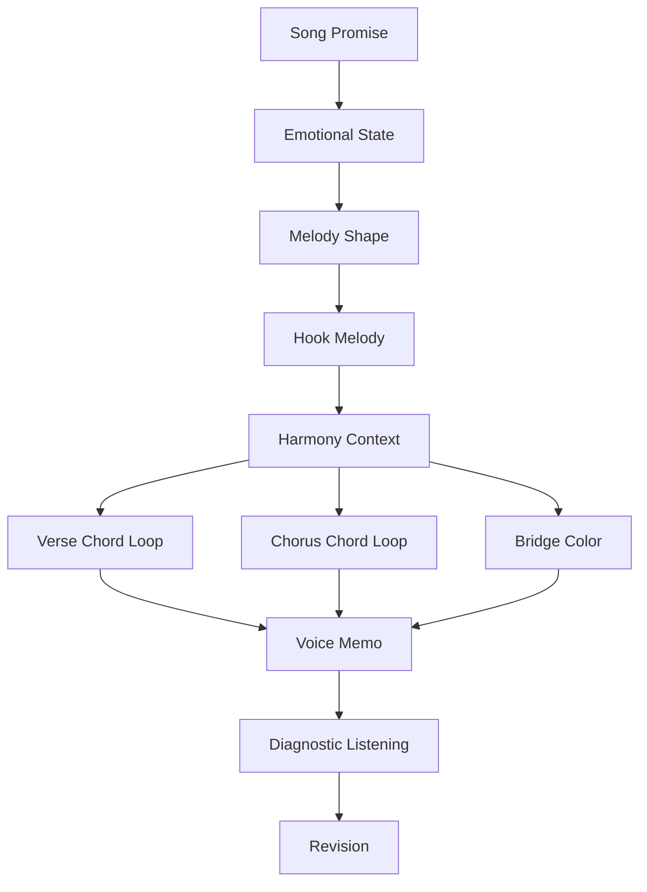
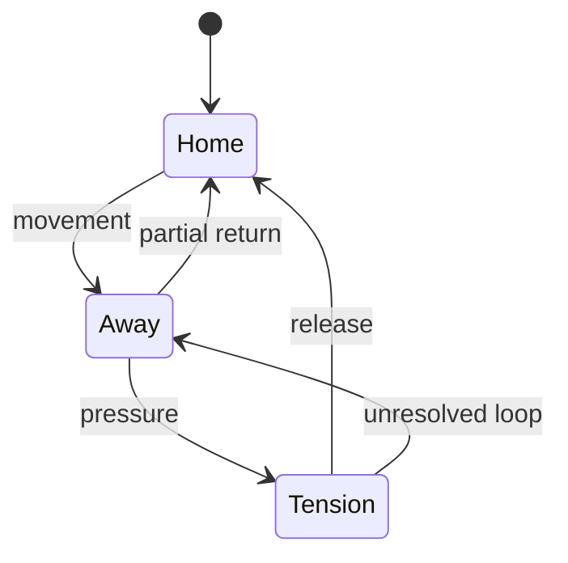
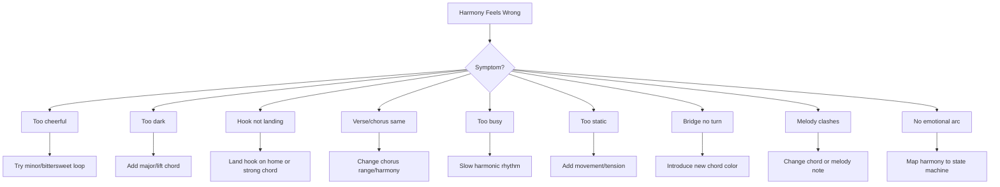

# learn-songwriting-part-022.md

# Harmony as Emotional Logic: Memahami Chord sebagai Gravitasi, Tegangan, Pulang, dan Warna Emosi

> Seri: `learn-songwriting`  
> Part: `022 / 034`  
> Fokus: harmony mindset, tonal center, tension-release, chord function, emotional logic, basic progression, melody support, dan hook grounding  
> Status seri: belum selesai  
> Prasyarat: `learn-songwriting-part-000.md` sampai `learn-songwriting-part-021.md`

---

## Ringkasan Part Ini

Part sebelumnya membahas **Hook Writing**: bagaimana membuat pusat lagu yang menempel.

Part ini mulai masuk ke **harmony** atau harmoni.

Bagi banyak penulis lagu pemula, chord terasa seperti daftar hafalan:

```text
C - G - Am - F
Am - F - C - G
Dm - G - C
I - V - vi - IV
```

Lalu muncul pertanyaan:

```text
Chord apa yang cocok?
Kenapa chord ini terasa sedih?
Kenapa chorus terasa pulang?
Kenapa verse terasa menggantung?
Apakah minor selalu sedih?
Apakah major selalu bahagia?
Bagaimana chord mendukung melodi?
Bagaimana chord membuat hook lebih kuat?
```

Part ini tidak akan memulai dari teori harmoni yang berat. Kita mulai dari mental model yang lebih berguna untuk songwriting:

> **Harmony adalah logika emosional di bawah melody.**

Melodi adalah garis emosi.  
Harmony adalah gravitasi yang membuat garis itu terasa:

- stabil;
- tegang;
- ingin pulang;
- belum selesai;
- terbuka;
- pahit;
- hangat;
- asing;
- lega;
- berat;
- rapuh.

Jika melodi adalah karakter yang berjalan, chord adalah lantai, cuaca, dan arah gravitasi di bawah kakinya.

Lirik:

```text
Tak kupakai
tak kubuang
```

Bisa terasa:

- pasrah jika chord turun dan lembut;
- pahit jika chord minor/gelap;
- hopeful jika chord membuka ke major;
- menggantung jika tidak resolve;
- sinis jika harmony stabil tapi lirik tajam;
- tragis jika melody berharap tetapi chord menahan.

Harmony memberi konteks emosional untuk hook.

Sebagai software engineer, pikirkan harmony sebagai **state context**.

Line yang sama bisa punya emotional output berbeda tergantung chord context.

```text
lyric + melody + chord context = perceived emotion
```

---

## Tujuan Part

Setelah menyelesaikan part ini, kamu harus bisa:

1. Memahami harmony sebagai emotional logic, bukan sekadar chord label.
2. Memahami tonal center sebagai “rumah” musikal.
3. Memahami tension dan release.
4. Mengenali fungsi chord secara praktis: home, away, tension, lift, sadness, color.
5. Memilih basic chord progression untuk mendukung song promise.
6. Membedakan rasa major/minor tanpa menyederhanakan berlebihan.
7. Membuat chord loop sederhana untuk verse dan chorus.
8. Membuat chorus terasa lebih “pulang”, “terbuka”, “menggantung”, atau “pahit”.
9. Mendukung melody hook dengan chord yang tidak mengganggu.
10. Menggunakan chord sebagai alat contrast antar-section.
11. Menghindari overthinking teori harmony di 20 jam pertama.
12. Membuat file latihan `songwriting-practice-022-harmony-as-emotional-logic.md`.

---

## Prinsip Utama

```text
Harmony is not “which chords are correct?”
Harmony is “what emotional gravity does this moment need?”
```

Pertanyaan yang lebih baik dari:

```text
Chord-nya apa?
```

adalah:

```text
Apakah bagian ini harus terasa pulang?
Apakah harus menggantung?
Apakah chorus harus membuka?
Apakah bridge harus terasa asing?
Apakah hook harus lebih hangat atau lebih dingin?
Apakah chord mendukung kata penting?
Apakah chord terlalu ramai untuk lirik?
```

Untuk 20 jam pertama, targetmu bukan menjadi ahli teori harmoni. Targetmu:

```text
bisa memilih progresi sederhana yang mendukung lirik, melodi, dan hook
```

---

## Harmony dalam Pipeline Songwriting



Harmony datang setelah kamu punya minimal:

- song promise;
- lirik draft;
- hook;
- melody rough.

Jangan mulai dari chord progression lalu memaksa semua hal masuk ke chord itu, kecuali kamu memang sedang menulis dari groove/chord.

---

# Bagian 1 — Apa Itu Harmony?

Harmony adalah bunyi beberapa nada yang terjadi bersamaan, biasanya dalam bentuk chord.

Dalam songwriting, harmony memberi:

- tonal center;
- emotional color;
- tension;
- release;
- movement;
- section contrast;
- support untuk melody;
- expectation;
- rasa “pulang” atau “belum selesai”.

## Chord sebagai Emotional Context

Line:

```text
kau belum selesai
```

Jika chord terasa stabil/home:

```text
line terdengar seperti pengakuan yang diterima
```

Jika chord terasa tegang:

```text
line terdengar seperti konflik yang belum selesai
```

Jika chord berubah saat “selesai”:

```text
kata itu mendapat emotional highlight
```

Harmony membuat kata punya bayangan emosional.

---

## Harmony Tidak Harus Kompleks

Banyak lagu kuat memakai chord sederhana.

Contoh pola umum:

```text
I - V - vi - IV
vi - IV - I - V
I - vi - IV - V
i - VI - III - VII
```

Tapi tujuan kita bukan menghafal semua. Tujuan kita memahami rasa:

```text
home -> away -> tension -> return
```

atau:

```text
minor home -> lift -> fall -> unresolved
```

---

# Bagian 2 — Tonal Center sebagai “Rumah”

Tonal center adalah rasa “rumah” dalam musik.

Dalam key C major, chord C sering terasa seperti rumah.  
Dalam key A minor, chord Am sering terasa seperti rumah.

Tapi kita tidak perlu masuk teori detail dulu.

Cukup pahami:

```text
Beberapa chord terasa seperti pulang.
Beberapa chord terasa seperti pergi.
Beberapa chord terasa seperti ingin pulang.
Beberapa chord terasa seperti belum selesai.
```

## Tonal Home

Chord home memberi rasa:

- stabil;
- selesai;
- familiar;
- landed;
- resolved.

## Away Chord

Chord away memberi rasa:

- bergerak;
- belum selesai;
- membuka pertanyaan;
- mencari.

## Tension Chord

Chord tension memberi rasa:

- ingin resolve;
- menekan;
- menunggu jawaban;
- emotional pull.

---

## Home/Away Diagram



Songwriting sering memakai pola ini.

Verse bisa lebih away.  
Chorus bisa lebih home.  
Bridge bisa lebih distant atau surprising.

---

# Bagian 3 — Tension and Release

Tension-release adalah inti harmony.

Tension:

```text
rasanya belum selesai
```

Release:

```text
rasanya sampai / pulang / lega
```

Lirik juga punya tension-release:

```text
Tak kupakai -> tension
tak kubuang -> tension/answer
```

Harmony bisa mendukung:

- membuat “tak kupakai” terasa bertanya;
- membuat “tak kubuang” terasa jatuh/berat;
- membuat final “pulang” terasa resolve atau justru tidak resolve.

## Tension-Release Alignment

```markdown
Lyric tension:
...

Melody tension:
...

Harmony tension:
...

Release point:
...

Should release fully?
yes/no

Why:
...
```

Tidak semua chorus harus resolve penuh. Lagu sedih/tragis sering membiarkan release parsial.

---

# Bagian 4 — Major dan Minor Tanpa Simplifikasi Berlebihan

Major sering dianggap bahagia. Minor sering dianggap sedih. Itu terlalu sederhana.

## Major Bisa Terasa

- hangat;
- terang;
- nostalgia;
- ironis;
- kosong;
- bittersweet;
- triumphant;
- naive;
- unsettling jika lirik gelap.

## Minor Bisa Terasa

- sedih;
- intim;
- gelap;
- serius;
- elegan;
- sensual;
- marah;
- misterius;
- cinematic.

## Contrast Example

Lirik:

```text
Jangan panggil ini pulang.
```

Jika di minor:

```text
tragis, gelap, luka
```

Jika di major dengan delivery dingin:

```text
satir, pahit, ironis
```

Jika di progression yang terus menggantung:

```text
tidak ada kepulangan musikal
```

Harmony meaning bergantung konteks.

---

# Bagian 5 — Chord Function Praktis

Untuk songwriting awal, pikirkan chord dengan fungsi rasa.

## 1. Home Chord

Rasa:

```text
pulang, stabil, selesai
```

Gunakan untuk:

- chorus landing;
- title word;
- final resolution;
- emotional acceptance.

## 2. Movement Chord

Rasa:

```text
bergerak, meninggalkan home
```

Gunakan untuk:

- verse;
- build;
- transition.

## 3. Tension Chord

Rasa:

```text
butuh jawaban
```

Gunakan untuk:

- pre-chorus;
- line sebelum hook;
- unresolved lyric.

## 4. Lift Chord

Rasa:

```text
membuka, naik, harapan
```

Gunakan untuk:

- chorus start;
- emotional opening;
- contrast.

## 5. Dark Color Chord

Rasa:

```text
pahit, minor, cinematic
```

Gunakan untuk:

- tragic hook;
- bridge;
- verse dark mood.

## 6. Surprise Chord

Rasa:

```text
turn, reframe, bridge shift
```

Gunakan untuk:

- bridge reveal;
- final chorus variation;
- key emotional line.

---

## Function Table

```markdown
| Moment | Emotional Need | Chord Function |
|---|---|---|
| Verse opening | establish world | home/away low tension |
| Verse end | lead to chorus | tension |
| Chorus hook | memory/emotional thesis | home/lift/release |
| Bridge reveal | turn | surprise/dark color |
| Final chorus | payoff | home or intentionally unresolved |
```

---

# Bagian 6 — Roman Numeral Mental Model

Jika kamu tahu sedikit teori, chord dalam key sering ditulis:

```text
I, ii, iii, IV, V, vi, vii°
```

Dalam C major:

```text
I = C
ii = Dm
iii = Em
IV = F
V = G
vi = Am
vii° = Bdim
```

Dalam A minor natural:

```text
i = Am
iv = Dm
v = Em
VI = F
VII = G
III = C
```

Tapi untuk awal, jangan terlalu fokus simbol. Gunakan rasa.

## Common Major Key Functions

| Roman | Feel Umum |
|---|---|
| I | home |
| ii | soft movement |
| iii | gentle/darker color |
| IV | open/lift |
| V | tension/wants home |
| vi | relative minor, bittersweet |
| vii° | strong tension/rare for beginner |

## Common Minor Key Functions

| Roman | Feel Umum |
|---|---|
| i | minor home |
| iv | dark movement |
| v/V | tension |
| VI | lift/major color |
| VII | cinematic movement |
| III | relative major, warmth/contrast |

---

# Bagian 7 — Progression sebagai Emotional Journey

Chord progression adalah perjalanan.

Bukan:

```text
empat chord acak
```

Tetapi:

```text
home -> away -> tension -> return
```

atau:

```text
minor home -> lift -> distant -> fall
```

## Example 1: I - V - vi - IV

Feel:

```text
home -> tension/movement -> bittersweet -> open
```

Bisa pop, emotional, versatile.

## Example 2: vi - IV - I - V

Feel:

```text
minor/bittersweet start -> open -> home -> tension
```

Cocok untuk emotional pop/ballad.

## Example 3: i - VI - III - VII

Feel:

```text
minor home -> cinematic lift -> major contrast -> unresolved movement
```

Cocok untuk dark/cinematic.

## Example 4: I - vi - IV - V

Feel:

```text
classic, nostalgic, stable, direct
```

## Example 5: i - iv - VI - V

Feel:

```text
minor, dramatic, tension toward home
```

---

## Progression Emotional Map

```markdown
# Progression Emotional Map

Progression:
...

Chord 1 feel:
...

Chord 2 feel:
...

Chord 3 feel:
...

Chord 4 feel:
...

Overall loop emotion:
...

Best section:
Verse / Chorus / Bridge

Why:
...
```

---

# Bagian 8 — Harmony and Melody

Melody and harmony must not fight unintentionally.

A melody note can feel:

- stable over one chord;
- tense over another;
- colorful over another.

You do not need full theory now. Use your ear.

## Practical Method

1. Sing hook melody over one chord.
2. Change chord under it.
3. Notice emotional change.
4. Choose chord that supports lyric moment.

Example hook:

```text
Tak kupakai
tak kubuang
```

Try with minor chord:

```text
more tragic/intimate
```

Try with major chord:

```text
more open/bittersweet
```

Try chord change on “buang”:

```text
action word becomes highlighted
```

## Rule

```text
If chord distracts from melody hook, simplify chord.
```

Hook melody should remain clear.

---

# Bagian 9 — Harmony and Hook

Hook needs a good harmonic home.

Options:

## 1. Hook Lands on Home

Effect:

```text
memorable, resolved, singable
```

Good for pop chorus.

## 2. Hook Lands on Tension

Effect:

```text
unresolved, haunting, wanting repeat
```

Good for longing/dark ballad.

## 3. Hook Starts Away and Lands Home

Effect:

```text
release
```

Good for emotional chorus.

## 4. Hook Starts Home and Moves Away

Effect:

```text
disturbance, open wound
```

Good for unresolved themes.

## 5. Hook Repeats Over Same Chord

Effect:

```text
mantra, obsession, deadpan, hypnotic
```

Good for denial/satire.

---

## Hook Harmony Template

```markdown
# Hook Harmony

## Hook lyric
...

## Hook melody shape
...

## Emotional need
resolved / unresolved / bitter / open / dark / ironic:
...

## Chord behavior
- [ ] lands home
- [ ] lands tension
- [ ] loops unresolved
- [ ] starts away -> home
- [ ] home -> away
- [ ] same chord mantra

## Why
...
```

---

# Bagian 10 — Verse Harmony

Verse harmony should support story without stealing attention.

Verse often works with:

- simple loop;
- lower intensity;
- less harmonic movement;
- more space;
- minor/darker color if mood requires;
- unresolved ending leading to chorus.

## Verse Harmony Goals

```markdown
- establish world
- support lyric detail
- avoid overdrama too early
- create enough movement toward chorus
- leave room for chorus lift
```

## Verse Options

### Option A — Same 2 Chords

Good for intimacy, focus on lyric.

```text
i - VI
```

or:

```text
I - vi
```

### Option B — 4-Chord Loop

Good for pop structure.

```text
vi - IV - I - V
```

### Option C — Static Chord / Drone

Good for dark, cinematic, spoken verse.

```text
stay on minor chord
```

---

# Bagian 11 — Chorus Harmony

Chorus needs to feel like the central statement.

Chorus can:

- lift harmonically;
- land on home;
- repeat a satisfying loop;
- increase harmonic rhythm;
- simplify chord movement;
- use stronger cadence;
- open to major color;
- stay unresolved for haunting effect.

## Chorus Harmony Goals

```markdown
- support hook
- create memory
- differentiate from verse
- make title word land
- support repetition
- provide emotional release or deliberate non-release
```

## Chorus Options

### Resolved Chorus

Good for clear emotional statement.

```text
IV - V - I
```

or loop ending on I.

### Bittersweet Chorus

```text
vi - IV - I - V
```

### Dark Cinematic Chorus

```text
i - VI - III - VII
```

### Unresolved Chorus

End on V or away chord.

Effect:

```text
wants repeat
```

---

# Bagian 12 — Pre-Chorus Harmony

Pre-chorus often increases tension.

Goals:

- move away from verse loop;
- build pressure;
- prepare chorus;
- maybe use chord that wants resolution.

## Pre-Chorus Options

- increase chord changes;
- climb harmonically;
- hold tension chord;
- use dominant-like tension;
- reduce instrumentation then release.

Example emotional plan:

```text
Verse: restrained loop
Pre: tension builds
Chorus: hook lands
```

If no pre-chorus, verse ending must lead to chorus.

---

# Bagian 13 — Bridge Harmony

Bridge should feel different.

Ways:

- introduce new chord color;
- start on different chord;
- reduce to one chord;
- move to relative major/minor feel;
- use surprise chord;
- change harmonic rhythm;
- suspend resolution.

## Bridge Harmony Goals

```markdown
- signal turn
- support reveal
- reframe hook
- avoid sounding like verse 3
- prepare final chorus
```

Example:

If verse/chorus is repetitive, bridge can use:

```text
iv - VI - V
```

or static minor chord.

For realization line:

```text
Baru kusadar...
```

A sparse chord change can highlight it.

---

# Bagian 14 — Final Chorus Harmony

Final chorus can repeat same harmony or change.

Options:

## Same Harmony

Works if lyric/arrangement carries payoff.

## Bigger Harmony

Add lift/intensity.

## Smaller Harmony

Strip down for intimacy.

## Different Last Chord

End unresolved or resolved differently.

## Minor/Major Shift

Can reframe emotion.

Example:

Chorus earlier resolves home.

Final chorus ends away:

```text
emotion remains unresolved
```

Or earlier unresolved, final resolves:

```text
acceptance
```

## Final Harmony Question

```text
Should the song finally come home?
Or should it prove that home is still impossible?
```

This decision should match song promise.

---

# Bagian 15 — Harmony and Emotional State Machine

Map harmony to states.

Example: Rindu Domestik

| Section | State | Harmony Need |
|---|---|---|
| Verse 1 | denial | restrained, low tension, maybe minor/soft |
| Chorus | confession | bittersweet release, partial home |
| Verse 2 | habit | similar but slightly more movement |
| Bridge | realization | sparse/surprise chord |
| Final Chorus | fragile acceptance | same hook, softer or clearer landing |

Example: Romansa Satir

| Section | State | Harmony Need |
|---|---|---|
| Verse 1 | tender irony | sweet but slightly dark |
| Chorus | accusation | firm, maybe unresolved |
| Verse 2 | stakes | darker/more grounded |
| Bridge | grief under satire | stripped/sparse |
| Final Chorus | bitter clarity | cold landing or unresolved |

---

# Bagian 16 — Harmony and Lyrics

Harmony should not over-explain emotion.

If lyric is already very sad, harmony can:

- support sadness;
- contrast with warmth;
- create irony;
- create restraint.

## Same Direction

Sad lyric + minor harmony:

```text
direct sadness
```

## Contrast

Sad lyric + warm major harmony:

```text
nostalgia / irony / bittersweet
```

## Tension

Sad lyric + unresolved harmony:

```text
longing / not over
```

## Sparse

Sad lyric + minimal harmony:

```text
intimate / raw
```

Choose based on desired effect.

---

# Bagian 17 — Harmony and Satire

Satire can use harmony cleverly.

## Dark Minor

Makes satire tragic.

```text
Jangan panggil ini pulang
```

over minor progression = grief/anger.

## Sweet Major

Makes satire more poisonous.

A beautiful progression under bitter lyric can create irony.

```text
Sayang, kopermu siap lagi
```

with sweet harmony = surface romance.

Then chorus darkens.

## Stable Harmony + Sharp Lyric

Deadpan critique.

## Unresolved Harmony

No true home, matching false return.

For social critique wrapped as romance, harmony can shift:

```text
Verse: deceptively tender
Chorus: colder / more unresolved
Bridge: stripped grief
Final: address shift + harmonic chill
```

---

# Bagian 18 — Harmony and Repetition

Repeated hook can feel different with harmony variation.

Chorus 1:

```text
hook over standard loop
```

Chorus 2:

```text
same loop, more arrangement
```

Final:

```text
same hook, chord held/suspended/stripped
```

Even if lyric repeats, harmony can create variation.

## Harmony Variation Types

- start chorus on different chord;
- hold chord longer under hook;
- remove chord movement;
- change bass note;
- end on different chord;
- use silence before chord;
- strip to one chord;
- add tension chord before hook.

---

# Bagian 19 — Harmonic Rhythm

Harmonic rhythm = how often chords change.

Fast harmonic rhythm:

```text
more movement, urgency, energy
```

Slow harmonic rhythm:

```text
space, weight, intimacy, hypnosis
```

Verse might have slow changes.  
Pre-chorus might change faster.  
Chorus might settle into memorable loop.

## Example

Hook:

```text
Tak kupakai
tak kubuang
```

If chord changes on every phrase:

```text
clear contrast
```

If chord stays same:

```text
mantra/denial
```

If chord changes only on “buang”:

```text
buang highlighted
```

---

# Bagian 20 — Chord Loop Selection

For MVS, choose simple loop.

## Step 1: Choose Mood

```text
major-ish / minor-ish / bittersweet / dark / open / unresolved
```

## Step 2: Choose Section Needs

```text
verse restrained
chorus hook
bridge turn
```

## Step 3: Try 3 Loops

Record voice memo.

## Step 4: Pick Least Distracting Loop

Especially for lyric-driven song.

## Step 5: Adjust Chorus

Make hook land.

---

## Basic Loop Menu

### Bright / Open

```text
I - V - vi - IV
I - IV - V - I
I - vi - IV - V
```

### Bittersweet

```text
vi - IV - I - V
I - V - vi - IV
vi - I - V - IV
```

### Dark / Cinematic

```text
i - VI - III - VII
i - iv - VI - V
i - VII - VI - VII
```

### Intimate / Minimal

```text
I - vi
i - VI
I - IV
i - iv
```

### Unresolved

```text
I - V - vi - IV ending not on I
i - VI - III - VII looping back to i
hold V/tension before chorus
```

---

# Bagian 21 — Testing Chords with Voice

Do not only play chord. Sing over it.

Test:

1. Sing hook over loop A.
2. Sing hook over loop B.
3. Sing hook over loop C.
4. Record.
5. Listen.
6. Ask:
   - hook clearer?
   - emotion right?
   - melody easier?
   - too cheesy?
   - too dark?
   - too busy?
   - chorus lands?

## Voice-First Rule

```text
The chord that makes the vocal hook clearer is usually better than the chord that sounds clever alone.
```

---

# Bagian 22 — Harmony Without Instrument Skill

If you are not fluent with guitar/piano:

Options:

1. use simple keyboard app;
2. use guitar chord app;
3. hum over drone note;
4. use AI/backing track cautiously;
5. choose common progression;
6. collaborate with instrumentalist;
7. record melody first, harmonize later.

Do not let limited instrument skill stop songwriting.

Minimum:

```text
one chord drone + vocal melody
```

is enough to test emotional gravity.

---

# Bagian 23 — Harmony and Arrangement Boundary

Harmony is not arrangement.

Chord choice is songwriting.  
Instrumentation is arrangement/production.

Do not get lost in:

- piano voicing;
- guitar picking pattern;
- synth pad;
- mixing;
- bass tone;
- orchestration;

before chord function is clear.

For now, ask:

```text
What chord loop supports the vocal and hook?
```

Arrangement comes later.

---

# Bagian 24 — Harmony Debugging



---

# Bagian 25 — Harmony Audit

Template:

```markdown
# Harmony Audit

## Song Promise
...

## Emotional Target
...

## Current progression
Verse:
Chorus:
Bridge:

## Tonal center / home feel
...

## Does verse support story?
...

## Does chorus support hook?
...

## Does bridge feel different?
...

## Does final chorus payoff?
...

## Problems
- too bright:
- too dark:
- too busy:
- too static:
- hook not landing:
- melody clash:

## Fix candidates
1.
2.
3.
```

---

# Bagian 26 — Harmony Map Template

```markdown
# Harmony Map

## Song Title
...

## Song Promise
...

## Main Hook
...

## Melody Hook Shape
...

## Emotional State Machine
Verse 1:
Chorus:
Verse 2:
Bridge:
Final Chorus:

## Desired Harmony Feel
bright / bittersweet / dark / unresolved / intimate / ironic:
...

## Tonal Home
...

## Chord Loop Candidates

### Candidate A
Progression:
Feel:
Best section:
Voice memo:
Notes:

### Candidate B
Progression:
Feel:
Best section:
Voice memo:
Notes:

### Candidate C
Progression:
Feel:
Best section:
Voice memo:
Notes:

## Selected Verse Progression
...

Why:
...

## Selected Chorus Progression
...

Why:
...

## Bridge Harmony Plan
...

## Final Chorus Harmony Plan
...

## Hook Landing
Does hook land on home/tension/away?
...

Why:
...

## Harmonic Rhythm
Verse:
Chorus:
Bridge:

## Voice Memo Notes
...

## Revision Plan
...
```

---

# Bagian 27 — Contoh Harmony Plan: Rindu Domestik

## Song Promise

```text
Rindu yang disangkal melalui benda rumah.
```

## Hook

```text
Tak kupakai
tak kubuang
```

## Desired Harmony

```text
bittersweet, intimate, unresolved but not melodramatic
```

## Candidate Progressions

### Candidate A: vi - IV - I - V

Feel:

```text
bittersweet pop, emotional, accessible
```

Works for chorus.

### Candidate B: I - vi - IV - V

Feel:

```text
nostalgic, stable, classic
```

Could be too sweet.

### Candidate C: i - VI - III - VII

Feel:

```text
dark cinematic
```

Could work if song wants darker tone.

## Possible Plan

```markdown
Verse:
minimal vi - IV or i - VI, restrained

Chorus:
vi - IV - I - V, hook opens but does not fully settle

Bridge:
hold on IV or use a sparse chord to make realization feel suspended

Final:
same chorus, slower/stripped, maybe land more clearly on home
```

## Hook Landing

If “buang” lands on tension:

```text
narator still unresolved
```

If “buang” lands on home:

```text
confession feels accepted
```

Choose based on final emotional state.

---

# Bagian 28 — Contoh Harmony Plan: Romansa Satir Bandara

## Song Promise

```text
Kemarahan sosial sebagai romansa tragis.
```

## Hook

```text
Jangan panggil ini pulang.
```

## Desired Harmony

```text
dark, cinematic, restrained, bitter, not too heroic
```

## Candidate Progressions

### Candidate A: i - VI - III - VII

Feel:

```text
cinematic, dark, dramatic but accessible
```

### Candidate B: i - iv - VI - V

Feel:

```text
tragic, stronger tension
```

### Candidate C: VI - VII - i

Feel:

```text
builds into minor home, good for accusation
```

## Possible Plan

```markdown
Verse:
minor but tender, slow harmonic rhythm

Chorus:
stronger tension, maybe not fully resolving on "pulang"

Bridge:
strip harmony, maybe one minor chord or unexpected major color for grief

Final:
same hook, colder; address "Tuan" with sparse chord before full progression returns
```

## Satire Choice

If verse uses sweet major-ish harmony under “Sayang”:

```text
surface romance
```

Then chorus darkens:

```text
mask falls
```

This can be powerful.

---

# Bagian 29 — Minimal Harmony Workflow

For your first MVS:

## Step 1

Pick 3 chord loops from menu.

## Step 2

Sing hook over each loop.

## Step 3

Pick the loop where hook feels most true.

## Step 4

Use same loop for chorus.

## Step 5

Use simpler/softer version for verse.

## Step 6

Make bridge different by:

- holding one chord;
- starting on different chord;
- stripping instrument;
- changing harmonic rhythm.

## Step 7

Record full voice memo.

Do not chase perfect chord sophistication.

---

# Bagian 30 — Harmony Anti-Patterns

## Anti-Pattern 1: Chord Hunting Forever

Gejala:

```text
terus mencari progression baru tanpa menyelesaikan lagu.
```

Solusi:

```text
pilih 1 loop cukup baik, lanjut draft.
```

## Anti-Pattern 2: Chords Too Busy

Gejala:

```text
chord menarik perhatian dari vocal.
```

Solusi:

```text
simplify.
```

## Anti-Pattern 3: Harmony Does Not Support Hook

Gejala:

```text
hook terdengar lemah meski chord keren.
```

Solusi:

```text
chord harus melayani hook.
```

## Anti-Pattern 4: Verse and Chorus Same Energy

Gejala:

```text
chorus tidak terasa sebagai pusat.
```

Solusi:

```text
ubah chord loop, harmonic rhythm, range, or landing.
```

## Anti-Pattern 5: Too Dark for Lyric

Gejala:

```text
lirik subtle, chord terlalu melodramatic.
```

Solusi:

```text
use bittersweet/simple harmony.
```

## Anti-Pattern 6: Too Bright for Promise

Gejala:

```text
lagu tragis terdengar terlalu happy tanpa ironi.
```

Solusi:

```text
minor/bittersweet/unresolved harmony.
```

## Anti-Pattern 7: Bridge No Turn

Gejala:

```text
bridge seperti verse tambahan.
```

Solusi:

```text
new chord color or sparse harmony.
```

## Anti-Pattern 8: Over-Theory

Gejala:

```text
terjebak roman numeral, lupa emosi.
```

Solusi:

```text
return to voice memo and emotional need.
```

## Anti-Pattern 9: Melody Clash Ignored

Gejala:

```text
melody note terasa salah dengan chord.
```

Solusi:

```text
change chord or melody note by ear.
```

## Anti-Pattern 10: Arrangement Before Harmony

Gejala:

```text
sibuk pad/synth/guitar picking sebelum chord function jelas.
```

Solusi:

```text
voice + simple chord first.
```

---

# Bagian 31 — Latihan Utama Part 022

Buat file:

```text
songwriting-practice-022-harmony-as-emotional-logic.md
```

Isi template berikut.

```markdown
# songwriting-practice-022-harmony-as-emotional-logic.md

## 1. Song Source
Tempel lyric/hook/melody/prosody v0.8 dari part 021.

...

## 2. Song Promise
...

## 3. Main Hook
...

## 4. Melody Hook Shape
...

## 5. Emotional State Machine
Verse 1:
Chorus:
Verse 2:
Bridge:
Final Chorus:

## 6. Desired Harmony Feel
Pilih dan jelaskan:

- [ ] bright
- [ ] bittersweet
- [ ] dark
- [ ] cinematic
- [ ] intimate
- [ ] unresolved
- [ ] ironic
- [ ] prayer-like
- [ ] other:

Why:
...

## 7. Tonal Home
What chord/note feels like home?
...

Do you want the song to finally come home?
...

## 8. Chord Loop Candidates

### Candidate A
Progression:
Feel:
Best for:
Voice memo file:
Notes:

### Candidate B
Progression:
Feel:
Best for:
Voice memo file:
Notes:

### Candidate C
Progression:
Feel:
Best for:
Voice memo file:
Notes:

## 9. Hook Harmony Test

| Candidate | Hook clarity | Emotional fit | Singability | Too bright/dark? | Notes |
|---|---:|---:|---:|---|---|
| A |  |  |  |  |  |
| B |  |  |  |  |  |
| C |  |  |  |  |  |

## 10. Selected Verse Progression
Progression:
Why:
Harmonic rhythm:
Emotional function:

## 11. Selected Chorus Progression
Progression:
Why:
Hook landing:
Harmonic rhythm:
Emotional function:

## 12. Pre-Chorus Harmony optional
Progression:
Tension function:
Lead into chorus:

## 13. Bridge Harmony Plan
Progression or texture:
How it differs:
Reveal support:
Lead into final chorus:

## 14. Final Chorus Harmony Plan
Same or changed:
Why:
Final landing:
Resolved or unresolved:

## 15. Harmony Map

| Section | Chords | Function | Emotional Effect |
|---|---|---|---|
| Verse 1 |  |  |  |
| Chorus |  |  |  |
| Verse 2 |  |  |  |
| Bridge |  |  |  |
| Final Chorus |  |  |  |

## 16. Voice Memo Log

| Take | Progression | Section | What Works | What Fails |
|---|---|---|---|---|
| 1 |  |  |  |  |
| 2 |  |  |  |  |
| 3 |  |  |  |  |

## 17. Harmony Diagnostic
Too bright:
Too dark:
Too busy:
Too static:
Hook not landing:
Melody clash:
Bridge no turn:
Final payoff issue:

## 18. Revision Plan
Keep:
Change:
Test next:
Protect:

## 19. Next Action
...
```

---

# Latihan 30 Menit: Hook over 3 Loops

1. Pilih hook melody.
2. Pilih 3 chord loops.
3. Nyanyikan hook di atas masing-masing.
4. Rekam.
5. Score:
   - clarity;
   - emotional fit;
   - singability;
   - hook landing.

Output:

```markdown
Best loop:
Why:
Worst loop:
Why:
Next test:
```

---

# Latihan 45 Menit: Verse-Chorus Harmony Contrast

Buat dua pilihan:

```markdown
Option 1:
Verse progression:
Chorus progression:
Effect:

Option 2:
Verse progression:
Chorus progression:
Effect:
```

Rekam dua voice memo.

Pilih yang membuat chorus lebih kuat.

---

# Latihan 60 Menit: Full Harmony Map

Ambil lyric/melody v0.8.

Lakukan:

1. pilih desired harmony feel;
2. test 3 loops;
3. pilih verse loop;
4. pilih chorus loop;
5. buat bridge plan;
6. buat final chorus plan;
7. rekam full rough demo voice + chord.

Output:

```markdown
Harmony v0.1:
Verse:
Chorus:
Bridge:
Final:
Voice memo notes:
Next action:
```

---

# Checklist Part 022

Sebelum lanjut ke part 023, pastikan:

- [ ] Kamu memahami harmony sebagai emotional logic.
- [ ] Kamu tahu tonal home lagu.
- [ ] Kamu menentukan desired harmony feel.
- [ ] Kamu menguji minimal 3 chord loop.
- [ ] Kamu menyanyikan hook di atas chord, bukan hanya memainkan chord.
- [ ] Kamu memilih verse progression.
- [ ] Kamu memilih chorus progression.
- [ ] Kamu menentukan hook landing.
- [ ] Kamu punya bridge harmony plan.
- [ ] Kamu punya final chorus harmony plan.
- [ ] Kamu membuat harmony map per section.
- [ ] Kamu merekam voice memo harmony.
- [ ] Kamu tahu apakah harmony terlalu bright/dark/busy/static.
- [ ] Kamu punya next action menuju chord progression for songwriters.

---

# Output Wajib Part 022

Buat file:

```text
songwriting-practice-022-harmony-as-emotional-logic.md
```

Isi minimal:

```markdown
# songwriting-practice-022-harmony-as-emotional-logic.md

## Song Source
...

## Song Promise
...

## Main Hook
...

## Melody Hook Shape
...

## Emotional State Machine
...

## Desired Harmony Feel
...

## Tonal Home
...

## Chord Loop Candidates
...

## Hook Harmony Test
...

## Selected Verse Progression
...

## Selected Chorus Progression
...

## Bridge Harmony Plan
...

## Final Chorus Harmony Plan
...

## Harmony Map
...

## Voice Memo Log
...

## Harmony Diagnostic
...

## Revision Plan
...

## Next Action
...
```

---

# Common Failure Modes di Part Ini

## 1. Menghafal Chord Tanpa Rasa

Gejala:

```text
pakai progression populer tapi tidak tahu kenapa.
```

Solusi:

```text
tulis emotional function setiap chord/section.
```

## 2. Chord Lebih Penting daripada Vocal

Gejala:

```text
progression keren tapi hook tenggelam.
```

Solusi:

```text
voice-first rule.
```

## 3. Terlalu Banyak Chord

Gejala:

```text
lagu sibuk dan lirik tidak jelas.
```

Solusi:

```text
kurangi harmonic movement.
```

## 4. Verse dan Chorus Tidak Kontras

Gejala:

```text
chorus tidak terasa pusat.
```

Solusi:

```text
ubah harmony feel, range, rhythm, or landing.
```

## 5. Bridge Tidak Berbeda

Gejala:

```text
bridge tidak memberi turn.
```

Solusi:

```text
gunakan chord color baru, sparse harmony, or harmonic rhythm shift.
```

## 6. Harmony Terlalu Ceria untuk Promise

Gejala:

```text
emosi tragis terasa ringan tanpa niat ironi.
```

Solusi:

```text
gunakan bittersweet/minor/unresolved color.
```

## 7. Harmony Terlalu Gelap

Gejala:

```text
lirik subtle jadi melodramatic.
```

Solusi:

```text
gunakan simpler/warmer progression.
```

## 8. Hook Tidak Landing

Gejala:

```text
kata hook tidak terasa sampai.
```

Solusi:

```text
atur chord pada hook word/final word.
```

## 9. Overthinking Theory

Gejala:

```text
tidak menulis karena sibuk teori.
```

Solusi:

```text
test 3 loops, pilih, lanjut.
```

## 10. Tidak Ada Voice Memo

Gejala:

```text
chord dinilai sendiri tanpa vocal.
```

Solusi:

```text
rekam voice + chord.
```

---

# Prinsip Penting

```text
Harmony is the emotional gravity beneath the hook.
```

Dan:

```text
The best chord is not the cleverest chord.
It is the chord that makes the song's emotional truth clearer.
```

Untuk 20 jam pertama, jangan mengejar harmoni kompleks. Kejar harmoni yang:

- mendukung hook;
- membantu melody;
- memberi contrast;
- sesuai song promise;
- bisa kamu rekam sebagai demo sederhana.

---

# Bridge ke Part Berikutnya

Part ini membahas harmony as emotional logic.

Part berikutnya, `learn-songwriting-part-023.md`, akan membahas:

```text
Chord Progression for Songwriters
```

Kita akan membuat lebih praktis:

- memilih key;
- chord family dasar;
- progression umum;
- roman numeral secukupnya;
- major/minor loop;
- verse/chorus chord design;
- pre-chorus tension;
- bridge chord turn;
- transposition sederhana;
- cara mencari chord dari melody;
- cara membuat chord sheet sederhana.

Jika part ini membahas **kenapa** harmony bekerja secara emosi, part berikutnya membahas **bagaimana** memilih dan menulis progression konkret.

---

# Status Seri

Part ini selesai.

```text
Selesai: learn-songwriting-part-022.md
Berikutnya: learn-songwriting-part-023.md
Status seri: belum selesai
Part tersisa: 12
Target akhir seri: learn-songwriting-part-034.md
```


<!-- NAVIGATION_FOOTER -->
<div class="page-nav">
<a href="./learn-songwriting-part-021.md">⬅️ Hook Writing: Membuat Pusat Lagu yang Menempel, Bernyanyi, dan Membawa Janji Emosional</a>
<a href="./index.md">📚 Kategori</a>
<a href="../../index.md">🏠 Home</a>
<a href="./learn-songwriting-part-023.md">Chord Progression for Songwriters: Memilih Key, Chord Family, Loop, Verse/Chorus Progression, dan Chord Sheet Sederhana ➡️</a>
</div>
