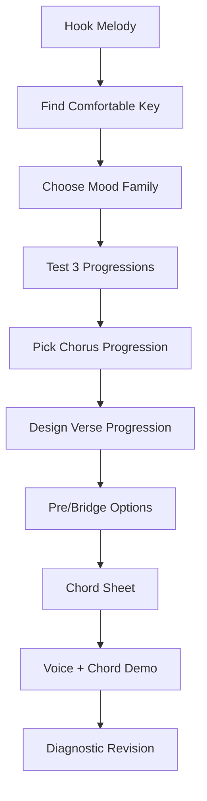
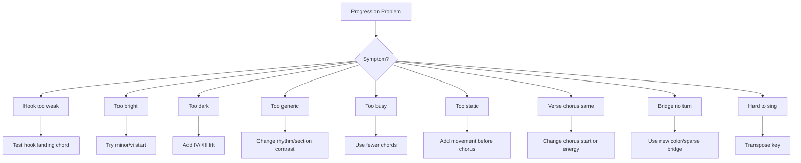

# learn-songwriting-part-023.md

# Chord Progression for Songwriters: Memilih Key, Chord Family, Loop, Verse/Chorus Progression, dan Chord Sheet Sederhana

> Seri: `learn-songwriting`  
> Part: `023 / 034`  
> Fokus: chord progression praktis, key, chord family, roman numeral secukupnya, progression umum, verse/chorus/bridge design, transposition, chord from melody, dan chord sheet  
> Status seri: belum selesai  
> Prasyarat: `learn-songwriting-part-000.md` sampai `learn-songwriting-part-022.md`

---

## Ringkasan Part Ini

Part sebelumnya membahas **Harmony as Emotional Logic**:

```text
chord sebagai gravitasi emosi
home, away, tension, release
hook landing
harmony sebagai konteks emosional
```

Part ini lebih praktis:

> “Sekarang chord-nya apa?”

Banyak songwriter pemula berhenti di titik ini. Lirik sudah ada, hook sudah ada, melodi kasar sudah ada, tetapi chord terasa membingungkan.

Pertanyaan yang muncul:

```text
Harus mulai dari key apa?
Chord apa saja yang aman?
Bagaimana memilih progression?
Apakah verse dan chorus harus beda chord?
Bagaimana membuat chorus terasa naik?
Bagaimana membuat bridge terasa turn?
Bagaimana kalau saya tidak jago piano/gitar?
Bagaimana mencari chord dari melody?
Bagaimana menulis chord sheet?
```

Part ini akan menjawab secara praktis, tanpa menjadikan teori harmoni sebagai beban.

Target kita bukan:

```text
menguasai teori jazz harmony
```

Target kita:

```text
mampu membuat chord progression sederhana yang mendukung lagu pertama
```

Untuk 20 jam pertama, kamu cukup bisa:

1. memilih key nyaman untuk suara;
2. memahami chord family dasar;
3. memilih 1–3 progression candidates;
4. menguji progression dengan hook melody;
5. membedakan progression untuk verse, chorus, bridge;
6. membuat chord sheet sederhana;
7. merekam demo voice + chord.

Sebagai software engineer, pikirkan chord progression sebagai **default implementation**.

Kamu tidak perlu menulis database engine sendiri untuk membuat aplikasi.  
Kamu juga tidak perlu menciptakan harmony system baru untuk menulis lagu pertama.

Gunakan pattern umum, lalu sesuaikan dengan emotional requirement.

---

## Tujuan Part

Setelah menyelesaikan part ini, kamu harus bisa:

1. Memilih key awal berdasarkan kenyamanan vokal.
2. Memahami chord family dasar dalam major dan minor key.
3. Menggunakan roman numeral secukupnya untuk berpikir lintas key.
4. Memilih progression umum untuk mood bright, bittersweet, dark, intimate, dan unresolved.
5. Membuat verse progression yang mendukung detail.
6. Membuat chorus progression yang mendukung hook.
7. Membuat pre-chorus progression yang membangun tension.
8. Membuat bridge progression yang memberi turn.
9. Menguji chord progression dengan melody dan hook.
10. Melakukan transposition sederhana.
11. Mencari chord dari melody secara praktis.
12. Membuat chord sheet sederhana.
13. Menghindari chord hunting yang tidak selesai.
14. Membuat file latihan `songwriting-practice-023-chord-progression-for-songwriters.md`.

---

## Prinsip Utama

```text
A chord progression is useful if it helps the vocal line tell the truth.
```

Chord progression bukan kompetisi kecerdasan.  
Chord progression bukan tempat menunjukkan hafalan.  
Chord progression bukan hiasan.

Chord progression adalah jalur emosi.

Progression yang baik membuat:

- hook lebih jelas;
- melody lebih nyaman;
- section lebih kontras;
- lyric terasa punya tempat;
- emotional arc bergerak;
- final chorus punya payoff.

Jika progression “keren” tetapi membuat hook tenggelam, progression itu gagal untuk lagu tersebut.

---

## Pipeline Praktis Chord Progression



Urutan penting:

```text
voice first
hook first
chord supports vocal
```

Jangan memilih chord progression hanya karena populer.

---

# Bagian 1 — Key: Memilih “Rumah Nada”

Key adalah area nada/chord yang menjadi rumah lagu.

Untuk pemula, key harus dipilih berdasarkan:

```text
apakah hook nyaman dinyanyikan?
```

Bukan berdasarkan:

```text
apakah key ini terlihat keren?
```

## Practical Key Selection

1. Nyanyikan hook tanpa instrumen.
2. Cari nada terendah dan tertinggi yang muncul.
3. Pastikan hook tidak terlalu tinggi.
4. Pilih key yang membuat hook nyaman.
5. Jika pakai gitar/piano, coba chord sederhana.
6. Jika terlalu tinggi/rendah, transpose.

## Key Selection Questions

```text
Apakah saya bisa menyanyikan chorus 5 kali tanpa tegang?
Apakah verse masih terdengar jelas?
Apakah hook peak terlalu tinggi?
Apakah final chorus masih nyaman?
Apakah voice memo stabil?
```

Jika tidak, ubah key.

---

## Key untuk Songwriter Non-Instrumentalist

Jika belum tahu key:

- rekam hook acapella;
- gunakan keyboard app untuk mencari nada terakhir/home;
- coba chord major/minor yang terasa cocok;
- gunakan capo jika gitar;
- gunakan transposition fitur digital;
- jangan habiskan terlalu lama.

Target awal:

```text
rough key cukup nyaman
```

Bukan key final studio.

---

# Bagian 2 — Chord Family Dasar

Dalam sebuah key, ada chord family yang umum dipakai.

## Major Key Family

Dalam key C major:

```text
C  Dm  Em  F  G  Am  Bdim
I  ii  iii IV V  vi  vii°
```

Untuk songwriting awal, chord paling sering dipakai:

```text
I, IV, V, vi
```

Dalam C:

```text
C, F, G, Am
```

Banyak lagu bisa dibuat dari empat chord ini.

## Minor Key Family

Dalam A minor:

```text
Am  Bdim  C  Dm  Em  F  G
i   ii°   III iv v  VI VII
```

Chord yang sering dipakai:

```text
i, iv, V/v, VI, VII, III
```

Dalam A minor:

```text
Am, Dm, E/Em, F, G, C
```

Untuk dark/cinematic:

```text
Am - F - C - G
i - VI - III - VII
```

---

## Roman Numeral Kenapa Berguna?

Roman numeral membantu kamu memindahkan progression ke key lain.

Progression:

```text
I - V - vi - IV
```

Dalam C:

```text
C - G - Am - F
```

Dalam G:

```text
G - D - Em - C
```

Dalam D:

```text
D - A - Bm - G
```

Progression sama, key berbeda.

---

# Bagian 3 — Chord Function Cepat

Gunakan fungsi rasa.

## Major Key

| Chord | Function Praktis | Rasa |
|---|---|---|
| I | home | pulang, stabil |
| IV | lift/open | terbuka, hangat |
| V | tension | ingin pulang |
| vi | bittersweet | minor relatif, emosional |
| ii | soft tension | lembut, menuju V |
| iii | color | mellow, ambiguous |

## Minor Key

| Chord | Function Praktis | Rasa |
|---|---|---|
| i | minor home | gelap, stabil |
| iv | dark movement | deeper minor |
| V/v | tension | ingin balik ke i |
| VI | lift/major color | cinematic, luas |
| VII | movement | epic, unresolved |
| III | relative major | hangat, kontras |

Kamu tidak harus hafal semua. Mulai dari:

```text
I, IV, V, vi
i, iv, VI, VII, III
```

---

# Bagian 4 — Progression Menu Berdasarkan Rasa

## Bright / Open

```text
I - V - vi - IV
I - IV - V - I
I - vi - IV - V
IV - I - V - vi
```

Cocok untuk:

- pop;
- hopeful chorus;
- bittersweet with bright edge;
- emotional release.

## Bittersweet

```text
vi - IV - I - V
I - V - vi - IV
vi - I - V - IV
I - iii - vi - IV
```

Cocok untuk:

- ballad;
- rindu;
- nostalgia;
- unresolved love;
- intimate pop.

## Dark / Cinematic

```text
i - VI - III - VII
i - iv - VI - V
i - VII - VI - VII
i - VI - VII - i
```

Cocok untuk:

- dark ballad;
- satire tragic;
- cinematic lyric;
- grief;
- theatrical.

## Intimate / Minimal

```text
I - vi
I - IV
vi - IV
i - VI
i - iv
```

Cocok untuk:

- verse;
- spoken intimate;
- minimal acoustic;
- raw demo.

## Tension / Pre-Chorus

```text
ii - IV - V
IV - V
vi - IV - V
iv - V
VI - VII
```

Cocok untuk:

- build;
- pre-chorus;
- line before hook;
- transition.

## Bridge / Turn

```text
start on IV instead of I
start on vi instead of I
minor iv in major key
hold V/tension
switch to relative minor/major
use sparse one-chord bridge
```

Cocok untuk:

- reveal;
- emotional turn;
- final chorus preparation.

---

# Bagian 5 — Verse Progression

Verse harus mendukung cerita/lirik.

Verse progression biasanya tidak perlu terlalu “besar”.

## Verse Needs

```text
space for lyric
not too much drama too early
supports narrative
can lead to chorus
```

## Verse Options

### Option 1 — Minimal Loop

```text
I - vi
```

or:

```text
i - VI
```

Good for intimate verse.

### Option 2 — Same 4-Chord Loop Softly

```text
vi - IV - I - V
```

Works if arrangement/vocal keeps verse restrained.

### Option 3 — Static Chord

```text
one chord/drone
```

Good for dark/spoken verse.

### Option 4 — Unresolved Verse

End verse on tension chord to pull chorus.

---

## Verse Design Template

```markdown
# Verse Progression

## Lyric function
...

## Emotional state
...

## Desired feel
...

## Candidate progression
...

## Does it leave room for chorus?
...

## Verse ending chord
...

## Lead into chorus
...
```

---

# Bagian 6 — Chorus Progression

Chorus harus mendukung hook.

Pertanyaan utama:

```text
Di chord mana hook landing?
```

## Chorus Needs

```text
hook clarity
memorable loop
section contrast
emotional statement
title landing
repeatability
```

## Chorus Options

### Resolved Chorus

Ends on home.

```text
IV - V - I
I - V - vi - IV with landing phrase on I
```

Effect:

```text
clear, satisfying
```

### Bittersweet Chorus

```text
vi - IV - I - V
```

Effect:

```text
emotional, open-ended
```

### Dark Chorus

```text
i - VI - III - VII
```

Effect:

```text
cinematic, driving, unresolved loop
```

### Mantra Chorus

Same chord or two chords.

```text
i - VI
```

Effect:

```text
obsessive, restrained, hypnotic
```

---

## Chorus Design Template

```markdown
# Chorus Progression

## Hook
...

## Hook emotional need
resolved / unresolved / bitter / hopeful / accusatory:
...

## Candidate progression
...

## Hook landing chord
...

## Does hook feel stronger?
...

## Does chorus contrast verse?
...

## Repeatability
...
```

---

# Bagian 7 — Pre-Chorus Progression

Pre-chorus optional.

Jika ada, fungsinya membangun tekanan.

## Pre-Chorus Harmony Tactics

1. Chord changes faster.
2. Move away from verse loop.
3. Hold tension before chorus.
4. Use rising bass/chord feel.
5. End on chord that wants chorus.

Example:

```text
Verse: vi - IV
Pre: ii - IV - V
Chorus: I - V - vi - IV
```

Or minor:

```text
Verse: i - VI
Pre: iv - V
Chorus: i - VI - III - VII
```

## Pre-Chorus Rule

```text
If pre-chorus does not make chorus stronger, remove it.
```

---

# Bagian 8 — Bridge Progression

Bridge harus terasa berbeda.

## Bridge Options

### Start on Different Chord

If chorus starts on I, bridge starts on vi or IV.

### New Color

Use minor iv in major key, or VI in minor.

### Sparse Bridge

Hold one chord while lyric reveals truth.

### Tension Bridge

Hold V/tension before final chorus.

### Relative Shift

Move to relative minor/major feeling.

## Bridge Design Questions

```text
Apakah bridge terasa seperti turn?
Apakah chord baru mendukung reveal?
Apakah tidak terdengar seperti verse 3?
Apakah final chorus terasa lebih kuat setelah bridge?
```

---

# Bagian 9 — Final Chorus Progression

Final chorus bisa:

- sama dengan chorus;
- lebih besar;
- lebih kecil;
- lebih lambat;
- stripped;
- berubah last chord;
- resolve setelah sebelumnya tidak resolve;
- tetap unresolved untuk tragis.

## Final Chorus Choices

### Same Progression, Bigger Delivery

Good for pop payoff.

### Same Progression, Softer

Good for intimate realization.

### Different Last Chord

Good for unresolved/tragic ending.

### Hold Home

Good for acceptance.

### Avoid Home

Good for “no true return”.

## Final Question

```text
Apakah lagu harus pulang?
Atau justru membuktikan bahwa pulang tidak terjadi?
```

---

# Bagian 10 — Progression and Hook Placement

Chord should support hook placement.

If hook is first line of chorus, chord 1 matters.

If hook is last line, cadence matters.

## Hook First

```text
[Chord 1] Tak kupakai
[Chord 2] tak kubuang
```

Chord 1 should immediately set chorus identity.

## Hook Last

```text
...
[Final chord] jangan panggil ini pulang
```

Final chord determines whether hook lands or hangs.

## Hook Repeated

If hook repeats twice, chord variation can help.

```text
first hook over tension
second hook over home
```

or:

```text
first hook home
second hook away
```

depending desired effect.

---

# Bagian 11 — Chord from Melody

Sometimes melody comes first.

How to find chord?

## Practical Method

1. Find the note that feels like home.
2. Identify key guess.
3. Try I or i under melody.
4. Try IV/VI if I feels too plain.
5. Try V/VII if phrase needs tension.
6. Listen for clashes.
7. Choose chord that supports important word.

## Hook Example

Melody phrase:

```text
Tak kupakai / tak kubuang
```

Test:

- chord stays same under both phrases;
- chord changes on “buang”;
- chord changes before hook;
- hook lands on home or tension.

## Ear Rule

```text
If the melody suddenly feels wrong, either the chord or melody note is fighting.
```

You can:

- change chord;
- change melody note;
- move phrase;
- simplify.

---

# Bagian 12 — Transposition Sederhana

Transposition = memindahkan lagu ke key lain.

Tujuan:

```text
membuat vokal nyaman
```

## Using Roman Numerals

If progression is:

```text
I - V - vi - IV
```

In C:

```text
C - G - Am - F
```

In G:

```text
G - D - Em - C
```

In A:

```text
A - E - F#m - D
```

## If Too High

Move key down.

## If Too Low

Move key up.

## Guitar Capo

If guitar chord shapes nyaman tapi key salah, gunakan capo.

Example:

```text
play G shape with capo to raise key
```

## Practical Rule

```text
Transpose until chorus hook is comfortable.
```

---

# Bagian 13 — Chord Sheet Basics

Chord sheet adalah dokumen sederhana untuk memainkan lagu.

Format:

```markdown
# Song Title

Key:
Tempo feel:
Time feel:
Structure:

## Chords
Verse:
Chorus:
Bridge:

## Lyrics + Chords

### Verse 1
C             G
Gelasmu di rak kedua
Am            F
tak kupindah sejak Selasa

### Chorus
Am       F
Tak kupakai
C        G
tak kubuang
```

Chord sheet harus cukup jelas untuk dirimu atau kolaborator.

---

## Chord Sheet Template

```markdown
# <Title> - Chord Sheet

## Metadata
Key:
Tempo:
Feel:
Capo:
Structure:
Main Hook:

## Progressions
Verse:
Pre-Chorus:
Chorus:
Bridge:
Final Chorus:

---

## Lyrics + Chords

### Verse 1
...

### Chorus
...

### Verse 2
...

### Bridge
...

### Final Chorus
...

---

## Notes
Hook landing:
Hard chord change:
Transpose notes:
Voice memo:
```

---

# Bagian 14 — Roman Numeral + Chord Sheet Hybrid

Simpan dua versi:

```text
Roman numeral version
actual chord version
```

Example:

```markdown
Chorus Roman:
vi - IV - I - V

Chorus in C:
Am - F - C - G

Chorus in G:
Em - C - G - D
```

Ini membantu jika key berubah.

---

# Bagian 15 — Common Progression Recipes

## Recipe 1 — Emotional Pop/Ballad

```text
Verse: vi - IV
Chorus: vi - IV - I - V
Bridge: IV - V - vi - V
```

Use for:

- bittersweet;
- longing;
- intimate confession.

## Recipe 2 — Bright but Emotional

```text
Verse: I - V - vi - IV
Chorus: I - V - vi - IV
Bridge: vi - IV - I - V
```

Use arrangement/melody contrast.

## Recipe 3 — Dark Cinematic

```text
Verse: i - VI
Chorus: i - VI - III - VII
Bridge: iv - VI - V
```

Use for:

- dark ballad;
- satire;
- theatrical.

## Recipe 4 — Minimal Intimate

```text
Verse: I - vi
Chorus: IV - I - V - vi
Bridge: vi - IV
```

Use for:

- lyric-driven acoustic.

## Recipe 5 — Unresolved

```text
Verse: i - VI
Chorus: i - VII - VI - VII
Bridge: iv - V
Final: end on i or leave on VII
```

Use for:

- unresolved grief;
- no true home.

---

# Bagian 16 — Progression for Rindu Domestik

## Song Promise

```text
Rindu yang disangkal melalui benda rumah.
```

## Desired Feel

```text
intimate, bittersweet, unresolved but warm
```

## Option A

```text
Key: C major / A minor feel

Verse:
Am - F

Chorus:
Am - F - C - G

Bridge:
F - G - Am
or
Dm - F - G

Final:
Am - F - C - G, stripped
```

Effect:

```text
bittersweet, accessible, chorus opens
```

## Option B

```text
Verse:
C - Am

Chorus:
F - C - G - Am

Bridge:
Am - F
```

Effect:

```text
warmer, more domestic
```

## Option C

```text
Verse:
Am only / Am - F

Chorus:
Am - G - F - G
```

Effect:

```text
more unresolved/darker
```

## Hook Landing

Hook:

```text
Tak kupakai / tak kubuang
```

Try:

```text
Am          F
Tak kupakai
C           G
tak kubuang
```

If “buang” on G feels unresolved, good for “belum selesai”.

If “buang” on C feels more resolved, better for acceptance.

---

# Bagian 17 — Progression for Romansa Satir Bandara

## Song Promise

```text
Kemarahan sosial sebagai romansa tragis dengan kekasih berkopor.
```

## Desired Feel

```text
dark, cinematic, theatrical, bitter
```

## Option A

```text
Key: A minor

Verse:
Am - F

Chorus:
Am - F - C - G

Bridge:
Dm - F - E
```

Effect:

```text
cinematic minor, accessible
```

## Option B

```text
Verse:
Am - Dm

Chorus:
Am - G - F - E
```

Effect:

```text
more tragic/tension back to Am
```

## Option C

```text
Verse:
F - G - Am
sweet surface

Chorus:
Am - F - C - G
mask falls darker
```

Effect:

```text
romance surface -> accusation
```

## Hook Landing

Hook:

```text
Jangan panggil ini pulang
```

Try landing “pulang” on:

- Am = dark home, firm accusation;
- G = unresolved, no true return;
- E = strong tension, dramatic;
- F = suspended/bittersweet.

---

# Bagian 18 — Chord Progression Debugging



---

# Bagian 19 — Progression Selection Scorecard

```markdown
# Progression Scorecard

| Candidate | Vocal Comfort | Hook Clarity | Emotional Fit | Section Contrast | Simplicity | Total |
|---|---:|---:|---:|---:|---:|---:|
| A |  |  |  |  |  |  |
| B |  |  |  |  |  |  |
| C |  |  |  |  |  |  |
```

Score 1–5.

Priority:

```text
vocal comfort > hook clarity > emotional fit > simplicity > cleverness
```

---

# Bagian 20 — Chord Progression Workflow

## Step 1: Start with Hook

Do not harmonize the whole song first.

## Step 2: Test 3 Chorus Progressions

Record.

## Step 3: Choose Chorus

The chorus progression is the center.

## Step 4: Make Verse Smaller

Use fewer chords, lower energy, or same loop stripped.

## Step 5: Make Bridge Different

New color or sparse.

## Step 6: Make Chord Sheet

Write it down.

## Step 7: Record Full Demo

Voice + basic chord.

## Step 8: Diagnose

Does the song work?

---

# Bagian 21 — When to Keep the Same Progression

Same progression can work for verse and chorus if contrast comes from:

- melody range;
- rhythm;
- vocal delivery;
- lyric density;
- arrangement;
- dynamics;
- chord inversion/bass;
- harmonic rhythm.

For early MVS, same progression is acceptable if song still works.

But if chorus feels flat, change something.

---

# Bagian 22 — When to Change Progression

Change progression if:

- chorus does not lift;
- hook not landing;
- bridge lacks turn;
- emotional state changes;
- verse/chorus blur;
- lyric reveal needs new color;
- final chorus needs payoff.

Change does not have to be complex.

Even starting chorus on a different chord can be enough.

---

# Bagian 23 — Chord Complexity Budget

Every chord change costs listener attention.

If lyric is complex, harmony should be simpler.

If lyric is simple, harmony can carry more color.

## Complexity Balance

| Lyric | Harmony |
|---|---|
| dense lyric | simple harmony |
| simple hook | can use stronger chord movement |
| bridge reveal | sparse or special chord |
| chorus hook | clear, repeatable progression |

For your first song:

```text
prioritize clarity
```

---

# Bagian 24 — Latihan Utama Part 023

Buat file:

```text
songwriting-practice-023-chord-progression-for-songwriters.md
```

Isi template berikut.

```markdown
# songwriting-practice-023-chord-progression-for-songwriters.md

## 1. Song Source
Tempel lyric/hook/melody/harmony map dari part 022.

...

## 2. Song Promise
...

## 3. Main Hook
...

## 4. Hook Melody
Shape:
Range:
Stress:
Long note:

## 5. Desired Harmony Feel
...

## 6. Key Exploration

### Acapella Hook
Lowest comfortable note:
Highest comfortable note:
Current guessed key:
Too high/low?:

### Key Candidates
1.
2.
3.

Chosen key:
Why:

## 7. Chord Family

### If major key
I:
ii:
iii:
IV:
V:
vi:

### If minor key
i:
iv:
V/v:
VI:
VII:
III:

## 8. Chorus Progression Candidates

### Candidate A
Roman:
Actual chords:
Feel:
Hook landing:
Voice memo:

### Candidate B
Roman:
Actual chords:
Feel:
Hook landing:
Voice memo:

### Candidate C
Roman:
Actual chords:
Feel:
Hook landing:
Voice memo:

## 9. Chorus Scorecard

| Candidate | Vocal Comfort | Hook Clarity | Emotional Fit | Simplicity | Total |
|---|---:|---:|---:|---:|---:|
| A |  |  |  |  |  |
| B |  |  |  |  |  |
| C |  |  |  |  |  |

Chosen chorus:
Why:

## 10. Verse Progression
Roman:
Actual chords:
Why it supports verse:
How it leads to chorus:

## 11. Pre-Chorus optional
Roman:
Actual chords:
Tension function:
Keep/remove:

## 12. Bridge Progression
Roman:
Actual chords:
How it differs:
Reveal support:
Lead to final chorus:

## 13. Final Chorus Progression
Same/different:
Actual chords:
Final landing:
Resolved/unresolved:
Why:

## 14. Full Chord Sheet Draft

# <Title> - Chord Sheet

Key:
Tempo feel:
Capo:
Structure:

Verse:
Chorus:
Bridge:
Final Chorus:

### Verse 1
...

### Chorus
...

### Verse 2
...

### Bridge
...

### Final Chorus
...

## 15. Voice Memo Log

| Take | Section | Progression | What Works | What Fails |
|---|---|---|---|---|
| 1 |  |  |  |  |
| 2 |  |  |  |  |
| 3 |  |  |  |  |

## 16. Progression Diagnostic
Too high/low key:
Hook not landing:
Too bright:
Too dark:
Too busy:
Too static:
Bridge weak:
Final unresolved/resolved issue:

## 17. Revision Plan
Keep:
Change:
Transpose:
Test next:
Protect:

## 18. Next Action
...
```

---

# Latihan 30 Menit: Chorus Progression Test

1. Pilih hook.
2. Pilih 3 progression chorus.
3. Nyanyikan hook di atas masing-masing.
4. Rekam 3 voice memo.
5. Score.

Output:

```markdown
Chosen chorus progression:
Hook landing:
Why:
```

---

# Latihan 45 Menit: Verse-Chorus-Bridge Progression

Buat progression untuk:

- verse;
- chorus;
- bridge.

Pastikan bridge berbeda.

Rekam voice memo pendek:

```text
verse -> chorus -> bridge -> final chorus
```

---

# Latihan 60 Menit: Chord Sheet v0.1

Buat chord sheet lengkap.

Isi:

- key;
- structure;
- verse chords;
- chorus chords;
- bridge chords;
- final chorus;
- lyrics with chords.

Rekam full demo voice + chord.

---

# Checklist Part 023

Sebelum lanjut ke part 024, pastikan:

- [ ] Kamu memilih key sementara.
- [ ] Kamu tahu chord family dasar key tersebut.
- [ ] Kamu menguji minimal 3 chorus progression.
- [ ] Kamu memilih chorus progression berdasarkan hook clarity.
- [ ] Kamu memilih verse progression.
- [ ] Kamu memutuskan perlu/tidak pre-chorus progression.
- [ ] Kamu membuat bridge progression atau sparse bridge plan.
- [ ] Kamu membuat final chorus progression plan.
- [ ] Kamu membuat chord sheet draft.
- [ ] Kamu merekam voice + chord demo.
- [ ] Kamu tahu apakah key terlalu tinggi/rendah.
- [ ] Kamu tahu apakah progression terlalu bright/dark/busy/static.
- [ ] Kamu punya next action menuju form and dramatic architecture.

---

# Output Wajib Part 023

Buat file:

```text
songwriting-practice-023-chord-progression-for-songwriters.md
```

Isi minimal:

```markdown
# songwriting-practice-023-chord-progression-for-songwriters.md

## Song Source
...

## Song Promise
...

## Main Hook
...

## Hook Melody
...

## Desired Harmony Feel
...

## Key Exploration
...

## Chord Family
...

## Chorus Progression Candidates
...

## Chorus Scorecard
...

## Verse Progression
...

## Bridge Progression
...

## Final Chorus Progression
...

## Full Chord Sheet Draft
...

## Voice Memo Log
...

## Progression Diagnostic
...

## Revision Plan
...

## Next Action
...
```

---

# Common Failure Modes di Part Ini

## 1. Chord Hunting Tanpa Batas

Gejala:

```text
mencoba chord terus tapi tidak menulis lagu.
```

Solusi:

```text
test 3 candidates, pilih yang cukup baik.
```

## 2. Key Tidak Nyaman

Gejala:

```text
chorus terlalu tinggi atau rendah.
```

Solusi:

```text
transpose.
```

## 3. Progression Keren tapi Hook Lemah

Gejala:

```text
chord menarik, vocal tidak jelas.
```

Solusi:

```text
voice-first rule.
```

## 4. Verse dan Chorus Tidak Kontras

Gejala:

```text
chorus tidak terasa pusat.
```

Solusi:

```text
ubah chorus start, harmonic rhythm, melody range, atau chord loop.
```

## 5. Bridge Tidak Berbeda

Gejala:

```text
bridge seperti verse tambahan.
```

Solusi:

```text
new color, sparse chord, or tension hold.
```

## 6. Terlalu Banyak Chord

Gejala:

```text
lirik tenggelam.
```

Solusi:

```text
simplify.
```

## 7. Terlalu Sedikit Movement

Gejala:

```text
lagu statis tanpa niat.
```

Solusi:

```text
tambahkan movement menuju chorus/bridge.
```

## 8. Progression Tidak Sesuai Promise

Gejala:

```text
emosi lagu terasa salah.
```

Solusi:

```text
kembali ke desired harmony feel.
```

## 9. Tidak Membuat Chord Sheet

Gejala:

```text
lupa progression, sulit revisi.
```

Solusi:

```text
tulis chord sheet sekarang.
```

## 10. Tidak Merekam Voice + Chord

Gejala:

```text
progression dinilai tanpa konteks vocal.
```

Solusi:

```text
record demo.
```

---

# Prinsip Penting

```text
A progression is not chosen because it is popular.
It is chosen because it makes the hook emotionally inevitable.
```

Dan:

```text
For the first song, a simple progression that supports the vocal is better than a clever progression that steals attention.
```

Chord progression adalah alat, bukan tujuan.

---

# Bridge ke Part Berikutnya

Part ini membahas chord progression secara praktis.

Part berikutnya, `learn-songwriting-part-024.md`, akan membahas:

```text
Form and Dramatic Architecture
```

Kita akan melihat lagu sebagai perjalanan penuh:

- form;
- section order;
- verse/chorus/bridge placement;
- when to use pre-chorus;
- how long each section should be;
- dramatic arc;
- energy map;
- information reveal;
- final chorus payoff;
- outro/intro decision;
- building a full song map.

Jika part ini memberi chord progression, part berikutnya menyusun semua section menjadi bentuk lagu utuh.

---

# Status Seri

Part ini selesai.

```text
Selesai: learn-songwriting-part-023.md
Berikutnya: learn-songwriting-part-024.md
Status seri: belum selesai
Part tersisa: 11
Target akhir seri: learn-songwriting-part-034.md
```


<!-- NAVIGATION_FOOTER -->
<div class="page-nav">
<a href="./learn-songwriting-part-022.md">⬅️ Harmony as Emotional Logic: Memahami Chord sebagai Gravitasi, Tegangan, Pulang, dan Warna Emosi</a>
<a href="./index.md">📚 Kategori</a>
<a href="../../index.md">🏠 Home</a>
<a href="./learn-songwriting-part-024.md">Form and Dramatic Architecture: Menyusun Section, Alur Emosi, Reveal, Energi, dan Payoff Menjadi Lagu Utuh ➡️</a>
</div>
