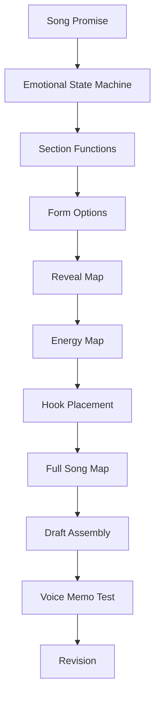
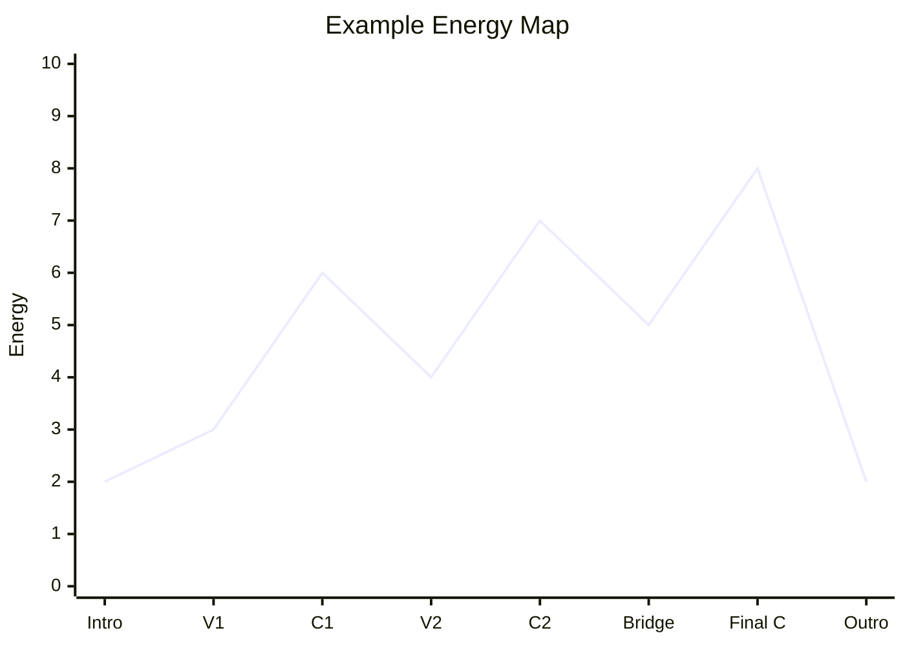
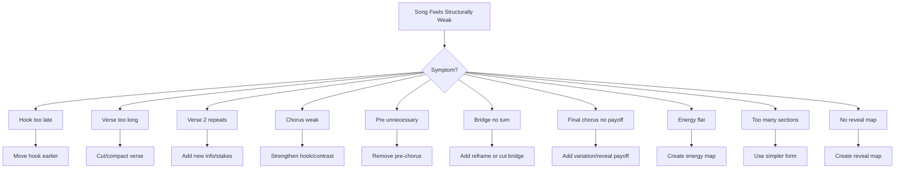

# learn-songwriting-part-024.md

# Form and Dramatic Architecture: Menyusun Section, Alur Emosi, Reveal, Energi, dan Payoff Menjadi Lagu Utuh

> Seri: `learn-songwriting`  
> Part: `024 / 034`  
> Fokus: song form, dramatic architecture, section order, energy map, reveal map, verse/chorus/bridge placement, intro/outro, dan full song map  
> Status seri: belum selesai  
> Prasyarat: `learn-songwriting-part-000.md` sampai `learn-songwriting-part-023.md`

---

## Ringkasan Part Ini

Part sebelumnya membahas **Chord Progression for Songwriters**: bagaimana memilih key, chord family, progression, dan chord sheet sederhana.

Part ini membahas bentuk besar lagu:

> **Bagaimana semua section disusun menjadi perjalanan yang masuk akal?**

Kamu sekarang sudah punya banyak komponen:

- song promise;
- POV;
- conflict;
- object/metaphor;
- lyric architecture;
- natural lyric flow;
- rhyme/sound;
- singability;
- repetition;
- melody shape;
- melodic rhythm;
- lyric-to-melody alignment;
- hook;
- harmony;
- chord progression.

Tetapi semua komponen itu belum otomatis menjadi lagu utuh.

Lagu membutuhkan **form**.

Form adalah struktur section:

```text
Verse 1 -> Chorus -> Verse 2 -> Chorus -> Bridge -> Final Chorus
```

atau:

```text
Verse -> Pre-Chorus -> Chorus -> Verse -> Pre-Chorus -> Chorus -> Bridge -> Final Chorus
```

atau:

```text
Verse -> Refrain -> Verse -> Refrain -> Bridge -> Refrain
```

Namun form bukan hanya label.

Form adalah **dramatic architecture**:

```text
apa yang diketahui pendengar?
apa yang dirasakan pendengar?
kapan hook muncul?
kapan tension naik?
kapan informasi baru muncul?
kapan lagu memberi release?
kapan bridge mengubah makna?
kapan final chorus terasa berbeda?
```

Banyak draft lagu gagal bukan karena satu section buruk, tetapi karena form-nya tidak bekerja:

- verse 1 terlalu panjang;
- chorus datang terlalu telat;
- verse 2 tidak menambah apa-apa;
- bridge tidak memberi turn;
- final chorus hanya copy-paste;
- intro terlalu lama;
- outro tidak punya aftertaste;
- pre-chorus ada tapi tidak perlu;
- energy terlalu datar;
- hook terlalu jarang;
- informasi penting muncul terlalu cepat;
- lagu terasa seperti kumpulan section, bukan perjalanan.

Part ini membantu kamu menyusun lagu seperti arsitektur pengalaman.

Sebagai software engineer, pikirkan form seperti **request flow / user journey / state machine**.

Pendengar masuk melalui intro/verse, diberi konteks, diarahkan ke hook, diberi development, dibawa ke turn, lalu diberi payoff.

---

## Tujuan Part

Setelah menyelesaikan part ini, kamu harus bisa:

1. Memahami form sebagai dramatic architecture, bukan sekadar urutan section.
2. Memilih form yang cocok untuk song promise.
3. Menentukan apakah lagu butuh intro, pre-chorus, bridge, refrain, post-chorus, atau outro.
4. Membuat section order yang mendukung emotional state machine.
5. Membuat reveal map agar informasi muncul pada waktu yang tepat.
6. Membuat energy map agar lagu tidak datar.
7. Membuat hook placement map agar pendengar mengingat pusat lagu.
8. Membuat verse 2 yang benar-benar mengembangkan verse 1.
9. Membuat bridge yang memberi turn.
10. Membuat final chorus yang punya payoff.
11. Mengatur panjang section agar draft tidak melebar.
12. Membuat full song map v0.1.
13. Membuat file latihan `songwriting-practice-024-form-and-dramatic-architecture.md`.

---

## Prinsip Utama

```text
A song form is not a container.
A song form is a sequence of emotional functions.
```

Jangan berpikir:

```text
Saya harus punya verse, chorus, bridge karena template lagu begitu.
```

Pikirkan:

```text
Apa fungsi verse?
Apa fungsi chorus?
Apa fungsi bridge?
Apa yang berubah setelah setiap section?
Apakah hook kembali pada saat yang tepat?
Apakah final chorus punya makna baru?
```

Section yang tidak punya fungsi adalah dead section.

---

## Form dalam Pipeline Songwriting



Part ini menyatukan material sebelumnya ke bentuk lagu utuh.

---

# Bagian 1 — Form vs Structure vs Arrangement

Sering tertukar.

## Form

Urutan section lagu.

Contoh:

```text
Verse 1 - Chorus - Verse 2 - Chorus - Bridge - Final Chorus
```

## Structure

Cara section bekerja secara internal.

Contoh:

```text
Verse 1 = 4 line scene + 4 line development
Chorus = hook first + emotional thesis
Bridge = 3 short lines + reveal
```

## Arrangement

Bagaimana musik diproduksi/dibangun.

Contoh:

```text
Verse 1 hanya guitar
Chorus tambah piano
Bridge drop drums
Final chorus full band
```

Dalam songwriting, kita fokus dulu:

```text
form + structure + basic energy
```

Arrangement detail bisa nanti.

---

# Bagian 2 — Section sebagai Function

Setiap section harus punya job.

## Common Section Jobs

| Section | Job Utama |
|---|---|
| Intro | membuka mood/identity |
| Verse 1 | setup world/conflict |
| Pre-Chorus | build tension menuju chorus |
| Chorus | hook + emotional thesis |
| Verse 2 | development/stakes |
| Post-Chorus | memperpanjang hook/memory |
| Bridge | turn/reframe/reveal |
| Final Chorus | payoff/reframed hook |
| Outro | aftertaste |

## Section Contract

```markdown
# Section Contract

## Section
...

## Function
...

## Input from previous section
...

## Output to next section
...

## Emotional state
...

## Information revealed
...

## Hook role
...

## Energy level
...
```

Jika section tidak punya output, mungkin tidak perlu.

---

# Bagian 3 — Form Options untuk Lagu Pertama

Untuk Minimum Viable Song, gunakan form sederhana.

## Option A — Verse - Chorus - Verse - Chorus

```text
V1 - C - V2 - C
```

Cocok jika:

- lagu sederhana;
- tidak perlu bridge;
- hook kuat;
- emotional arc kecil;
- target cepat selesai.

Risiko:

- final kurang payoff;
- terlalu pendek jika verse 2 tidak kuat.

## Option B — Verse - Chorus - Verse - Chorus - Bridge - Final Chorus

```text
V1 - C - V2 - C - B - FC
```

Cocok untuk:

- song promise butuh turn;
- final chorus perlu makna baru;
- ada bridge reveal;
- ballad/pop umum.

Ini form default yang sangat aman untuk MVS.

## Option C — Verse - Pre-Chorus - Chorus - Verse - Pre-Chorus - Chorus - Bridge - Final Chorus

```text
V1 - PC - C - V2 - PC - C - B - FC
```

Cocok jika:

- chorus butuh build;
- verse terlalu rendah;
- tension perlu dinaikkan;
- genre pop/ballad lebih besar.

Risiko:

- terlalu panjang;
- pre-chorus bisa redundant.

## Option D — Verse - Refrain - Verse - Refrain - Bridge - Refrain

```text
V1 - R - V2 - R - B - R
```

Cocok untuk:

- storytelling;
- folk/acoustic;
- subtle hook;
- refrain object kuat.

## Option E — Through-Developed

Lagu berubah terus tanpa chorus jelas.

Tidak disarankan untuk 20 jam pertama kecuali genre/ide sangat menuntut.

---

## Form Selection Rule

Untuk lagu pertama:

```text
gunakan form paling sederhana yang masih memberi payoff.
```

Jika ragu:

```text
V1 - Chorus - V2 - Chorus - Bridge - Final Chorus
```

---

# Bagian 4 — Emotional State Machine ke Form

Dari part 009, kamu punya emotional state machine.

Contoh:

```text
Denial -> Confession -> Deeper Habit -> Realization -> Fragile Acceptance
```

Map ke form:

| State | Section |
|---|---|
| Denial | Verse 1 |
| Confession | Chorus |
| Deeper Habit | Verse 2 |
| Realization | Bridge |
| Fragile Acceptance | Final Chorus |

Ini membuat form punya alasan.

## State-to-Form Template

```markdown
# State to Form

## Initial state
...

## First turn
...

## Repeated thesis
...

## Development
...

## Deep turn
...

## Final state
...

## Form
...
```

---

# Bagian 5 — Reveal Map

Reveal map mengatur informasi.

Pertanyaan:

```text
Apa yang pendengar tahu di setiap section?
Apa yang belum boleh diketahui?
Kapan truth muncul?
Kapan hook berubah makna?
```

## Example: Rindu Domestik

| Section | Reveal |
|---|---|
| Verse 1 | ada gelas yang tidak dipindah |
| Chorus | narator tidak memakai/membuang |
| Verse 2 | kebiasaan menunggu menyebar ke rumah |
| Bridge | yang ditunda bukan hanya gelas/orang, tapi diri |
| Final Chorus | hook menjadi self-recognition |

## Example: Romansa Satir

| Section | Reveal |
|---|---|
| Verse 1 | kekasih/koper pergi lagi |
| Chorus | “pulang” dipertanyakan |
| Verse 2 | rumah/meja/anak-anak menanggung dampak |
| Bridge | rumah lelah jadi panggung |
| Final Chorus | address shift: sayang -> tuan |

---

## Reveal Map Template

```markdown
# Reveal Map

| Section | What listener knows | What is withheld | Emotional effect |
|---|---|---|---|
| Intro |  |  |  |
| Verse 1 |  |  |  |
| Chorus |  |  |  |
| Verse 2 |  |  |  |
| Bridge |  |  |  |
| Final Chorus |  |  |  |
| Outro |  |  |  |
```

---

# Bagian 6 — Energy Map

Energy map adalah grafik intensitas.

Energy tidak hanya volume. Energy bisa datang dari:

- melody height;
- rhythm density;
- chord tension;
- lyric directness;
- vocal delivery;
- instrumentation;
- repetition;
- silence;
- emotional reveal.

## Energy Level

Gunakan angka 1–10.

Example:

| Section | Energy |
|---|---:|
| Intro | 2 |
| Verse 1 | 3 |
| Chorus 1 | 6 |
| Verse 2 | 4 |
| Chorus 2 | 7 |
| Bridge | 5 or 8 depending turn |
| Final Chorus | 8 |
| Outro | 2 |

## Energy Map Diagram



Energy map membantu melihat apakah lagu terlalu datar.

---

## Energy Does Not Always Mean Bigger

Bridge bisa punya energy tinggi karena sunyi.

Contoh:

```text
musik drop
vokal dekat
truth muncul
```

Energy emosional naik walau arrangement turun.

Jadi catat:

```text
sonic energy
emotional energy
```

Template:

```markdown
| Section | Sonic Energy | Emotional Energy |
|---|---:|---:|
| Verse 1 |  |  |
| Chorus |  |  |
| Bridge |  |  |
```

---

# Bagian 7 — Hook Placement Map

Hook harus muncul cukup awal dan cukup sering.

## Questions

```text
Kapan hook pertama muncul?
Apakah terlalu lama?
Apakah hook diulang cukup?
Apakah final hook punya variation?
Apakah secondary motif muncul sebelum hook?
```

## Hook Placement Example

| Section | Hook Role |
|---|---|
| Verse 1 | object motif introduced |
| Chorus | main hook first appears |
| Verse 2 | object motif develops |
| Chorus 2 | main hook repeats |
| Bridge | object/hook reframed |
| Final Chorus | hook payoff |
| Outro | short hook echo |

## Hook Placement Template

```markdown
# Hook Placement Map

## Main hook
...

## First appearance
...

## Repeat points
...

## Variation points
...

## Final payoff
...

## Outro echo
...
```

---

# Bagian 8 — Length Budget

Song drafts often become too long.

Use length budget.

## Typical MVS Length

For first song:

```text
2:30 - 4:00
```

Lyric sections:

| Section | Typical Length |
|---|---|
| Intro | 0–10 sec |
| Verse | 4–8 lines |
| Pre-Chorus | 2–4 lines |
| Chorus | 4–8 lines |
| Bridge | 2–8 lines |
| Outro | 1–4 lines |

## Warning

If every section has 12 lines, song becomes heavy.

## Length Budget Template

```markdown
| Section | Target Lines | Current Lines | Too Long? |
|---|---:|---:|---|
| Verse 1 | 4-8 |  |  |
| Chorus | 4-8 |  |  |
| Verse 2 | 4-8 |  |  |
| Bridge | 2-6 |  |  |
| Final Chorus | 4-8 |  |  |
```

---

# Bagian 9 — Intro Decision

Intro is optional.

## Use Intro If

- mood needs setup;
- hook motif can appear instrumentally;
- ambient/scene matters;
- song needs breath before vocal;
- production identity matters.

## Skip/Short Intro If

- lyric must start immediately;
- demo should be efficient;
- hook should appear early;
- you tend to over-arrange.

For MVS, intro can be:

```text
0–2 bars chord
or no intro
```

## Intro Types

- instrumental hook motif;
- ambient sound;
- one chord drone;
- vocal pickup;
- spoken phrase;
- object sound.

Example satire bandara:

```text
distant airport announcement / low piano / guitar
```

But do not let intro delay song too much.

---

# Bagian 10 — Verse 1 Placement

Verse 1 is listener onboarding.

It must quickly establish:

- world;
- POV;
- emotional tone;
- object/conflict hint.

## Verse 1 Must Not

- explain entire backstory;
- be too long;
- delay hook too much;
- introduce too many objects;
- use bridge-level reveal too early.

## Verse 1 Test

```text
After verse 1, does listener know where they are emotionally?
Do they have a reason to hear chorus?
```

If no, revise.

---

# Bagian 11 — Chorus Placement

Chorus should not arrive too late in MVS.

General rule:

```text
hook within first 45–60 seconds
```

For lyric-heavy ballad, maybe longer, but be careful.

## Chorus Must

- deliver hook;
- state emotional thesis;
- contrast verse;
- be singable;
- be repeatable.

## Chorus Entry

Chorus entry should feel like:

```text
we have arrived somewhere
```

Even if emotionally unresolved, it should feel like a section change.

---

# Bagian 12 — Verse 2 Placement

Verse 2 must justify itself.

It should answer:

```text
Apa yang berubah setelah chorus pertama?
Apa informasi baru?
Apa stakes baru?
Apa object baru/reframed?
Apa emotional state baru?
```

Bad verse 2:

```text
same as verse 1 with synonyms
```

Good verse 2:

```text
same world, deeper consequence
```

## Verse 2 Development Options

- new location;
- new object;
- time has passed;
- other people affected;
- narrator contradiction worsens;
- image from verse 1 returns with twist;
- stakes become social/moral;
- self-deception becomes visible.

---

# Bagian 13 — Pre-Chorus Decision

Pre-chorus is optional.

Use if:

- verse needs lift to chorus;
- chorus enters too abruptly;
- emotional pressure needs build;
- melody needs climb;
- lyric needs short pivot.

Do not use if:

- chorus already enters naturally;
- pre-chorus repeats same idea;
- song becomes too long;
- hook is delayed too much.

## Pre-Chorus Function

```text
Verse = evidence
Pre = pressure
Chorus = thesis/hook
```

## Pre-Chorus Test

```text
If I remove pre-chorus, is chorus weaker?
```

If no, remove it.

---

# Bagian 14 — Bridge Decision

Bridge is also optional, but useful.

Use bridge if:

- song needs turn;
- final chorus needs new meaning;
- there is a withheld truth;
- verse 2 and chorus are not enough;
- emotional state machine has realization/reversal.

Do not use if:

- bridge only repeats verse;
- there is no reveal;
- song works without it;
- bridge introduces random unrelated idea.

## Bridge Function

```text
not more information
but changed perspective
```

Bridge should make final chorus mean something different.

---

# Bagian 15 — Final Chorus Payoff

Final chorus should not be just “one more chorus” unless the performance/arrangement makes it meaningful.

Payoff options:

1. same lyric, new context;
2. one-word change;
3. added final line;
4. stripped delivery;
5. bigger delivery;
6. harmony change;
7. hook omission;
8. address shift;
9. object reframe;
10. final cadence change.

## Final Chorus Payoff Template

```markdown
# Final Chorus Payoff

## Chorus 1 meaning
...

## Chorus 2 meaning
...

## Bridge reveal
...

## Final chorus change
...

## Final meaning
...
```

---

# Bagian 16 — Outro Decision

Outro gives aftertaste.

Use outro if:

- hook needs echo;
- final image needs space;
- song should end unresolved;
- production/ambient identity matters;
- final line is too heavy to end immediately.

Skip outro if:

- final chorus already lands perfectly;
- outro adds nothing;
- demo becomes too long.

## Outro Types

- repeat hook softer;
- repeat object line;
- instrumental tag;
- ambient return;
- one-word ending;
- final unresolved chord;
- spoken final phrase.

Example:

```text
di rak kedua
masih
```

Example satire:

```text
boarding call fades
tuan...
```

---

# Bagian 17 — Dramatic Arc

Dramatic arc is the emotional journey.

Common arcs:

## 1. Build and Release

```text
low -> higher -> release
```

Good for pop/anthemic chorus.

## 2. Spiral

```text
same hook returns deeper/darker
```

Good for obsession/denial.

## 3. Mask Falls

```text
sweet surface -> bitter truth
```

Good for satire/tragic romance.

## 4. Realization

```text
evidence -> confession -> reveal -> reframe
```

Good for intimate ballad.

## 5. Collapse

```text
control -> cracks -> breakdown -> quiet
```

Good for grief/burnout.

## 6. Prayer

```text
plea -> doubt -> repetition -> silence
```

Good for spiritual/emotional song.

Choose arc based on promise.

---

# Bagian 18 — Form Patterns by Promise

## Rindu Disangkal

Good form:

```text
V1 - C - V2 - C - B - FC - Outro
```

Because it needs self-realization.

## Satirical Romance

Good form:

```text
V1 - C - V2 - C - B - FC
```

Because it needs mask -> accusation -> cold final address.

## Burnout

Good form:

```text
V1 - PC - C - V2 - PC - C - B - FC
```

Because pressure build can be strong.

## Story Song

Good form:

```text
V1 - Refrain - V2 - Refrain - V3 - Refrain
```

Because story progression matters.

## Minimal Confession

Good form:

```text
V1 - C - V2 - C
```

or:

```text
V - R - V - R
```

---

# Bagian 19 — Full Song Map

Full song map is the blueprint.

Template:

```markdown
# Full Song Map

## Title
...

## Song Promise
...

## Form
...

## Section Map

| Section | Function | Emotion | Info | Hook | Energy | Chords | Melody |
|---|---|---|---|---|---:|---|---|
| Intro |  |  |  |  |  |  |  |
| Verse 1 |  |  |  |  |  |  |  |
| Chorus 1 |  |  |  |  |  |  |  |
| Verse 2 |  |  |  |  |  |  |  |
| Chorus 2 |  |  |  |  |  |  |  |
| Bridge |  |  |  |  |  |  |  |
| Final Chorus |  |  |  |  |  |  |  |
| Outro |  |  |  |  |  |  |  |
```

This is your master architecture before full assembly.

---

# Bagian 20 — Example Full Form: Rindu Domestik

## Promise

```text
Rindu yang disangkal melalui benda rumah.
```

## Form

```text
V1 - C - V2 - C - B - FC - Outro
```

## Section Map

| Section | Function | Emotion | Info | Hook | Energy |
|---|---|---|---|---|---:|
| Intro | domestic mood | restrained | home sound/chord | maybe motif | 2 |
| V1 | setup object | denial | gelas/rak | object motif | 3 |
| C1 | confession | unresolved | tak pakai/buang | main hook | 6 |
| V2 | development | habit | house rituals | motif returns | 4 |
| C2 | deeper confession | heavier | hook now bigger | main hook | 7 |
| B | realization | self-recognition | not only gelas | callback | 5/8 |
| FC | payoff | fragile acceptance | aku di rak kedua | hook variation | 8 |
| Outro | aftertaste | unresolved quiet | masih | motif echo | 2 |

## Dramatic Arc

```text
denial -> confession -> pattern -> realization -> fragile self-recognition
```

---

# Bagian 21 — Example Full Form: Romansa Satir Bandara

## Promise

```text
Kemarahan sosial sebagai romansa tragis kekasih berkopor yang terus pergi.
```

## Form

```text
Intro - V1 - C - V2 - C - B - FC - Outro
```

## Section Map

| Section | Function | Emotion | Info | Hook | Energy |
|---|---|---|---|---|---:|
| Intro | airport/romance mood | ironic | ambient departure | sound hook | 2 |
| V1 | surface tenderness | sweet irony | koper siap lagi | object motif | 3 |
| C1 | boundary | accusation | pulang questioned | main hook | 6 |
| V2 | stakes | anger under restraint | rumah/meja/anak | object expansion | 5 |
| C2 | stronger accusation | bitter | hook returns | main hook | 7 |
| B | grief under satire | exposed sadness | rumah bukan panggung | metaphor reframe | 5/8 |
| FC | cold clarity | indictment | sayang -> tuan | hook variation | 8 |
| Outro | aftertaste | hollow | airport fades | sound/object echo | 2 |

## Dramatic Arc

```text
romance mask -> contradiction -> domestic cost -> grief -> cold indictment
```

---

# Bagian 22 — Form Debugging



---

# Bagian 23 — Form Audit

Use this.

```markdown
# Form Audit

## Form
...

## Does hook appear early enough?
...

## Does Verse 1 setup world?
...

## Does Chorus deliver hook?
...

## Does Verse 2 add new information?
...

## Does Bridge change perspective?
...

## Does Final Chorus mean something new?
...

## Is energy too flat?
...

## Is any section removable?
...

## Is any section missing?
...

## Revision decision
...
```

---

# Bagian 24 — Form Rewrite Strategies

## Strategy 1: Cut Pre-Chorus

If song too long and chorus works without it.

## Strategy 2: Add Bridge

If final chorus lacks payoff.

## Strategy 3: Move Hook Earlier

If listener waits too long.

## Strategy 4: Split Long Verse

If verse has too much information.

## Strategy 5: Make Verse 2 More Specific

If verse 2 repeats.

## Strategy 6: Make Final Chorus Variation

If ending is flat.

## Strategy 7: Use Refrain Instead of Chorus

If chorus feels too big for song.

## Strategy 8: Short Outro

If ending needs aftertaste.

---

# Bagian 25 — Form and Time Estimate

Rough duration estimate:

| Section | Bars/Lines | Approx Time |
|---|---|---:|
| Intro | 0–4 bars | 0–15s |
| Verse | 8 lines | 30–45s |
| Chorus | 4–8 lines | 20–40s |
| Verse 2 | 8 lines | 30–45s |
| Bridge | 4 lines | 15–30s |
| Final Chorus | 4–8 lines | 20–45s |
| Outro | 1–4 lines | 5–20s |

For MVS, keep total manageable.

---

# Bagian 26 — Form and Listener Attention

Pendengar butuh:

- orientation;
- reward;
- surprise;
- return;
- payoff.

If too much orientation:

```text
boring
```

If too much surprise:

```text
confusing
```

If too much return:

```text
monotonous
```

If no payoff:

```text
unfinished
```

Form balances these.

---

# Bagian 27 — Form and AI Music Generation

Jika menggunakan AI music generator, form labels sangat membantu.

Use clear labels:

```markdown
[Intro - airport ambience, low piano]
[Verse 1 - soft, intimate, almost spoken]
[Chorus - stronger, hold hook]
[Verse 2 - more tense]
[Bridge - stripped, reflective]
[Final Chorus - colder, slower final line]
[Outro - ambience fades]
```

But do not overstuff.

AI lebih mudah mengikuti:

- clear section labels;
- line breaks;
- repeated chorus;
- explicit final chorus variation;
- concise delivery notes.

---

# Bagian 28 — Latihan Utama Part 024

Buat file:

```text
songwriting-practice-024-form-and-dramatic-architecture.md
```

Isi template berikut.

```markdown
# songwriting-practice-024-form-and-dramatic-architecture.md

## 1. Song Source
Tempel lyric/hook/melody/chords dari part 023.

...

## 2. Song Promise
...

## 3. Main Hook
...

## 4. Emotional State Machine
Start:
Chorus 1:
Verse 2:
Bridge:
Final:

## 5. Form Candidates

### Candidate A
Form:
Why it might work:
Risk:

### Candidate B
Form:
Why it might work:
Risk:

### Candidate C
Form:
Why it might work:
Risk:

## 6. Selected Form
...

Why:
...

## 7. Section Contracts

### Intro
Function:
Emotion:
Info:
Hook role:
Energy:
Keep/remove:

### Verse 1
Function:
Emotion:
Info:
Hook role:
Energy:

### Pre-Chorus optional
Function:
Emotion:
Info:
Hook role:
Energy:
Keep/remove:

### Chorus 1
Function:
Emotion:
Info:
Hook role:
Energy:

### Verse 2
Function:
Emotion:
Info:
Hook role:
Energy:

### Chorus 2
Function:
Emotion:
Info:
Hook role:
Energy:

### Bridge
Function:
Emotion:
Info:
Hook role:
Energy:
Keep/remove:

### Final Chorus
Function:
Emotion:
Info:
Hook role:
Energy:

### Outro
Function:
Emotion:
Info:
Hook role:
Energy:
Keep/remove:

## 8. Reveal Map

| Section | What listener knows | What is withheld | Emotional effect |
|---|---|---|---|
| Intro |  |  |  |
| Verse 1 |  |  |  |
| Chorus 1 |  |  |  |
| Verse 2 |  |  |  |
| Chorus 2 |  |  |  |
| Bridge |  |  |  |
| Final Chorus |  |  |  |
| Outro |  |  |  |

## 9. Energy Map

| Section | Sonic Energy 1-10 | Emotional Energy 1-10 | Notes |
|---|---:|---:|---|
| Intro |  |  |  |
| Verse 1 |  |  |  |
| Chorus 1 |  |  |  |
| Verse 2 |  |  |  |
| Chorus 2 |  |  |  |
| Bridge |  |  |  |
| Final Chorus |  |  |  |
| Outro |  |  |  |

## 10. Hook Placement Map
Main hook:
First appearance:
Repeat points:
Variation points:
Final payoff:
Outro echo:

## 11. Length Budget

| Section | Target Lines | Current Lines | Decision |
|---|---:|---:|---|
| Intro |  |  |  |
| Verse 1 |  |  |  |
| Pre-Chorus |  |  |  |
| Chorus |  |  |  |
| Verse 2 |  |  |  |
| Bridge |  |  |  |
| Final Chorus |  |  |  |
| Outro |  |  |  |

## 12. Full Song Map

| Section | Function | Emotion | Info | Hook | Energy | Chords | Melody |
|---|---|---|---|---|---:|---|---|
|  |  |  |  |  |  |  |  |

## 13. Form Rewrite v0.9

### Intro
...

### Verse 1
...

### Pre-Chorus
...

### Chorus
...

### Verse 2
...

### Chorus
...

### Bridge
...

### Final Chorus
...

### Outro
...

## 14. Voice Memo Form Test
File:
Does hook appear early enough?
Does verse 2 add something?
Does bridge turn?
Does final chorus payoff?
Is any section too long?
Is energy flat?
What to cut?

## 15. Revision Plan
Keep:
Cut:
Move:
Shorten:
Add:
Next test:

## 16. Next Action
...
```

---

# Latihan 30 Menit: Form Selection

Ambil song promise dan hook.

Buat 3 form candidates.

Pilih satu berdasarkan:

- simplicity;
- payoff;
- hook placement;
- bridge need;
- length.

---

# Latihan 45 Menit: Reveal + Energy Map

Buat reveal map dan energy map.

Cari:

- informasi terlalu cepat;
- hook terlalu telat;
- energy flat;
- bridge tidak punya reveal;
- final chorus tidak berubah.

---

# Latihan 60 Menit: Full Song Map + Voice Memo

Susun full lyric dalam form selected.

Rekam voice memo dari awal sampai akhir.

Dengar ulang dan jawab:

```text
apakah lagu terasa seperti perjalanan?
atau hanya kumpulan section?
```

---

# Checklist Part 024

Sebelum lanjut ke part 025, pastikan:

- [ ] Kamu memilih form utama.
- [ ] Kamu punya section contract untuk semua section.
- [ ] Kamu punya reveal map.
- [ ] Kamu punya energy map.
- [ ] Kamu punya hook placement map.
- [ ] Kamu punya length budget.
- [ ] Kamu punya full song map.
- [ ] Kamu tahu apakah pre-chorus perlu atau tidak.
- [ ] Kamu tahu apakah bridge perlu atau tidak.
- [ ] Kamu punya final chorus payoff.
- [ ] Kamu sudah membuat form rewrite v0.9.
- [ ] Kamu sudah merekam full voice memo form test.
- [ ] Kamu tahu section mana yang harus cut/move/shorten.
- [ ] Kamu punya next action menuju contrast between sections.

---

# Output Wajib Part 024

Buat file:

```text
songwriting-practice-024-form-and-dramatic-architecture.md
```

Isi minimal:

```markdown
# songwriting-practice-024-form-and-dramatic-architecture.md

## Song Source
...

## Song Promise
...

## Main Hook
...

## Emotional State Machine
...

## Form Candidates
...

## Selected Form
...

## Section Contracts
...

## Reveal Map
...

## Energy Map
...

## Hook Placement Map
...

## Length Budget
...

## Full Song Map
...

## Form Rewrite v0.9
...

## Voice Memo Form Test
...

## Revision Plan
...

## Next Action
...
```

---

# Common Failure Modes di Part Ini

## 1. Form Dipilih Karena Template, Bukan Fungsi

Gejala:

```text
ada bridge karena “lagu biasanya punya bridge”.
```

Solusi:

```text
section harus punya job.
```

## 2. Hook Terlalu Telat

Gejala:

```text
pendengar belum tahu pusat lagu sampai lama.
```

Solusi:

```text
move hook earlier or shorten verse.
```

## 3. Verse 1 Terlalu Panjang

Gejala:

```text
backstory terlalu banyak.
```

Solusi:

```text
evidence first, cut explanation.
```

## 4. Verse 2 Tidak Berkembang

Gejala:

```text
verse 2 sama dengan verse 1.
```

Solusi:

```text
new object, stakes, location, consequence.
```

## 5. Pre-Chorus Redundant

Gejala:

```text
pre hanya mengulang verse/chorus.
```

Solusi:

```text
remove or rewrite as pressure.
```

## 6. Bridge Tempelan

Gejala:

```text
bridge bisa dihapus tanpa efek.
```

Solusi:

```text
add turn/reframe or cut.
```

## 7. Final Chorus Copy-Paste

Gejala:

```text
ending tidak memberi payoff.
```

Solusi:

```text
variation, context shift, harmony/delivery change.
```

## 8. Energy Flat

Gejala:

```text
semua section terasa sama.
```

Solusi:

```text
energy map and section contrast.
```

## 9. Terlalu Banyak Section

Gejala:

```text
lagu terasa berat dan tidak fokus.
```

Solusi:

```text
simplify form.
```

## 10. Tidak Ada Full Voice Memo

Gejala:

```text
form dinilai di dokumen, bukan pengalaman.
```

Solusi:

```text
record full pass.
```

---

# Prinsip Penting

```text
A song is not a list of parts.
A song is a designed emotional journey.
```

Dan:

```text
The final chorus should feel earned.
```

Form yang baik membuat pendengar merasa:

```text
bagian ini memang harus terjadi setelah bagian sebelumnya
```

Bukan:

```text
section ini ditempel karena template.
```

---

# Bridge ke Part Berikutnya

Part ini membahas form and dramatic architecture.

Part berikutnya, `learn-songwriting-part-025.md`, akan membahas:

```text
Contrast Between Sections
```

Kita akan memperdalam:

- bagaimana verse dan chorus dibedakan;
- contrast lyric density;
- contrast melody range;
- contrast rhythm;
- contrast harmony;
- contrast vocal delivery;
- contrast energy;
- contrast image;
- contrast directness;
- cara membuat chorus terasa chorus;
- cara membuat bridge terasa bridge;
- cara menghindari lagu yang datar.

Jika part ini menyusun urutan section, part berikutnya memastikan tiap section punya identitas yang berbeda dan saling menguatkan.

---

# Status Seri

Part ini selesai.

```text
Selesai: learn-songwriting-part-024.md
Berikutnya: learn-songwriting-part-025.md
Status seri: belum selesai
Part tersisa: 10
Target akhir seri: learn-songwriting-part-034.md
```


<!-- NAVIGATION_FOOTER -->
<div class="page-nav">
<a href="./learn-songwriting-part-023.md">⬅️ Chord Progression for Songwriters: Memilih Key, Chord Family, Loop, Verse/Chorus Progression, dan Chord Sheet Sederhana</a>
<a href="./index.md">📚 Kategori</a>
<a href="../../index.md">🏠 Home</a>
<a href="./learn-songwriting-part-025.md">Contrast Between Sections: Membuat Verse, Chorus, Bridge, dan Final Chorus Terasa Berbeda tetapi Tetap Satu Lagu ➡️</a>
</div>
