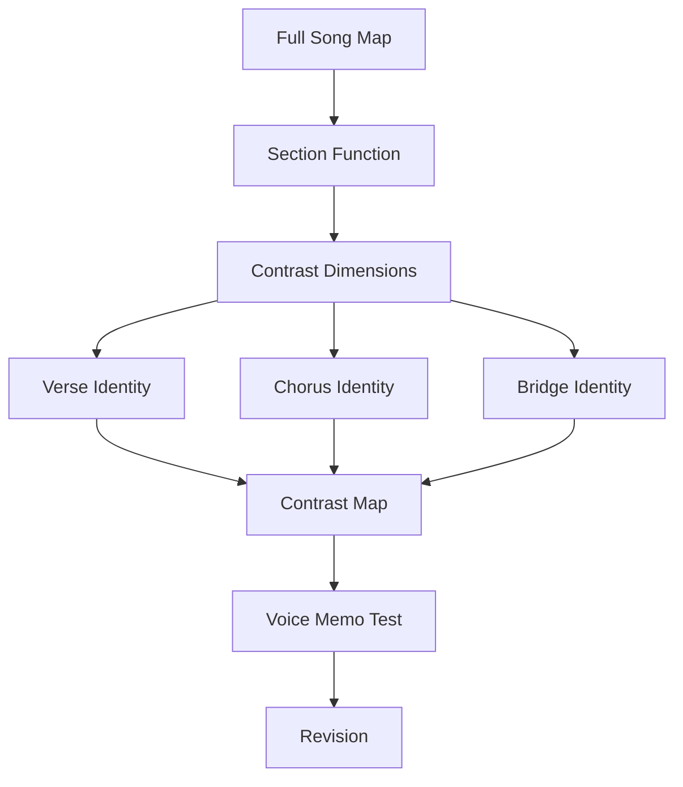
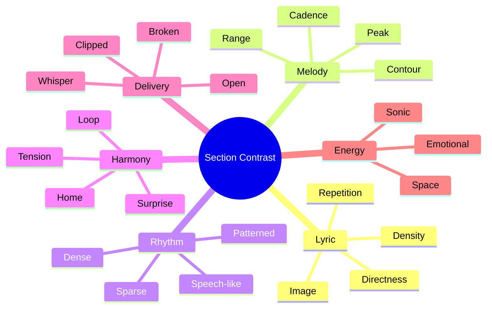
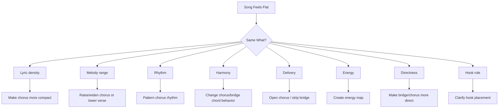
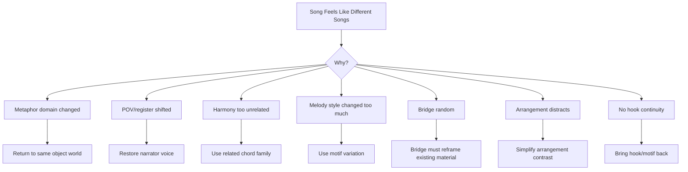

# learn-songwriting-part-025.md

# Contrast Between Sections: Membuat Verse, Chorus, Bridge, dan Final Chorus Terasa Berbeda tetapi Tetap Satu Lagu

> Seri: `learn-songwriting`  
> Part: `025 / 034`  
> Fokus: contrast antar-section, lyric density, melody range, rhythm, harmony, vocal delivery, image contrast, energy contrast, directness, dan section identity  
> Status seri: belum selesai  
> Prasyarat: `learn-songwriting-part-000.md` sampai `learn-songwriting-part-024.md`

---

## Ringkasan Part Ini

Part sebelumnya membahas **Form and Dramatic Architecture**: bagaimana menyusun section menjadi perjalanan lagu utuh.

Part ini membahas masalah lanjutan:

> “Form sudah ada, tapi kenapa verse, chorus, dan bridge terasa sama saja?”

Ini sangat umum.

Kamu bisa punya form:

```text
Verse 1 - Chorus - Verse 2 - Chorus - Bridge - Final Chorus
```

Tetapi jika semua section punya:

- panjang line sama;
- energy sama;
- melody range sama;
- chord loop sama;
- rhythm sama;
- density lirik sama;
- emotional directness sama;
- delivery sama;
- image style sama;

maka lagu terasa datar.

Pendengar tidak merasa:

```text
oh, ini chorus
oh, ini bridge
oh, ini final payoff
```

Mereka hanya mendengar satu blok panjang.

Contrast adalah cara membuat section punya identitas.

Namun contrast juga punya risiko:

```text
terlalu sedikit contrast -> lagu monoton
terlalu banyak contrast -> lagu terasa seperti beberapa lagu berbeda
```

Jadi tujuan part ini bukan membuat semua section berbeda secara ekstrem.

Tujuannya:

```text
setiap section berbeda dalam fungsi,
tetapi tetap berasal dari dunia lagu yang sama.
```

Sebagai software engineer, pikirkan contrast seperti **component boundaries**.

Verse, chorus, bridge adalah komponen berbeda.  
Mereka punya interface yang sama: song promise.  
Tetapi implementation detail-nya berbeda: density, melody, rhythm, harmony, delivery.

---

## Tujuan Part

Setelah menyelesaikan part ini, kamu harus bisa:

1. Memahami contrast sebagai perbedaan fungsi dan pengalaman antar-section.
2. Mengidentifikasi lagu yang terasa datar karena kurang contrast.
3. Membuat verse lebih detail dan chorus lebih memorable.
4. Membuat chorus terasa lebih besar, lebih terbuka, atau lebih fokus daripada verse.
5. Membuat bridge terasa sebagai turn, bukan verse tambahan.
6. Mengatur contrast lyric density antar-section.
7. Mengatur contrast melody range dan contour.
8. Mengatur contrast rhythm dan phrase pattern.
9. Mengatur contrast harmony dan harmonic rhythm.
10. Mengatur contrast vocal delivery.
11. Mengatur contrast image dan directness.
12. Membuat contrast map per section.
13. Mendiagnosis over-contrast dan under-contrast.
14. Membuat file latihan `songwriting-practice-025-contrast-between-sections.md`.

---

## Prinsip Utama

```text
Contrast makes sections recognizable.
Continuity makes them belong to the same song.
```

Jika hanya contrast:

```text
lagu pecah
```

Jika hanya continuity:

```text
lagu datar
```

Kamu butuh keduanya.

Contoh continuity:

- object tetap sama;
- hook kembali;
- metaphor domain konsisten;
- tonal center masih terkait;
- POV sama;
- emotional promise sama.

Contoh contrast:

- verse lebih detail, chorus lebih singkat;
- verse range rendah, chorus range lebih tinggi;
- verse rhythm speech-like, chorus rhythm patterned;
- bridge lebih sparse;
- final chorus lebih intense atau lebih quiet;
- verse indirect, chorus direct.

---

## Contrast dalam Pipeline Songwriting



Part sebelumnya membuat section order.  
Part ini membuat section terasa berbeda secara pengalaman.

---

# Bagian 1 — Apa Itu Contrast?

Contrast adalah perbedaan yang terasa.

Dalam lagu, contrast bisa muncul dari:

- lirik;
- melody;
- rhythm;
- harmony;
- chord movement;
- vocal delivery;
- arrangement;
- energy;
- silence;
- rhyme density;
- line length;
- emotional directness;
- image style;
- register;
- pronoun;
- point of view distance.

Contrast bukan sekadar “lebih keras”.

Chorus bisa kontras dari verse dengan menjadi:

- lebih tinggi;
- lebih rendah;
- lebih simple;
- lebih repetitive;
- lebih direct;
- lebih sparse;
- lebih intimate;
- lebih cold;
- lebih rhythmically patterned;
- lebih harmonically resolved;
- lebih unresolved.

---

## Contrast vs Change

Tidak semua perubahan adalah contrast yang berguna.

Perubahan berguna jika:

```text
mendukung section function
```

Perubahan buruk jika:

```text
membuat lagu kehilangan identitas
```

Contoh buruk:

Verse tentang gelas dan rumah.  
Chorus tiba-tiba tentang laut dan bintang tanpa alasan.

Itu bukan contrast. Itu domain break.

Contrast yang baik:

Verse:

```text
Gelasmu di rak kedua
tak kupindah sejak Selasa
```

Chorus:

```text
Tak kupakai
tak kubuang
```

Domain sama. Function berbeda.

---

# Bagian 2 — Dimensions of Contrast

## 1. Lyric Density

Verse lebih banyak detail.  
Chorus lebih padat dan memorable.

## 2. Melody Range

Verse lebih rendah/sempit.  
Chorus lebih tinggi/lebar.

## 3. Rhythm

Verse lebih speech-like.  
Chorus lebih patterned/repetitive.

## 4. Harmony

Verse lebih restrained.  
Chorus lebih open/resolved/unresolved dengan sengaja.

## 5. Vocal Delivery

Verse almost spoken.  
Chorus lebih open/held.

## 6. Image Type

Verse punya object detail.  
Chorus punya thesis/metaphor.

## 7. Emotional Directness

Verse menunjukkan.  
Chorus menyatakan.

## 8. Energy

Verse energy 3.  
Chorus energy 6.  
Bridge energy 5 but emotional 8.

## 9. Space

Verse bisa dense.  
Bridge bisa sparse.

## 10. Hook Presence

Verse motif.  
Chorus main hook.  
Bridge reframe.  
Final chorus payoff.

---

## Contrast Dimension Map



---

# Bagian 3 — Verse vs Chorus

Ini contrast paling penting.

## Verse Function

Verse biasanya:

- memberi evidence;
- membangun world;
- menunjukkan detail;
- lebih narrative;
- lebih conversational;
- lebih rendah energy;
- lebih sedikit repetition;
- lebih banyak information.

## Chorus Function

Chorus biasanya:

- memberi hook;
- memberi emotional thesis;
- lebih memorable;
- lebih repetitive;
- lebih singable;
- lebih direct;
- lebih tinggi atau lebih luas;
- lebih sedikit informasi baru.

## Contrast Table

| Dimension | Verse | Chorus |
|---|---|---|
| Lyric | detail, image | hook, thesis |
| Density | medium/high | lower/compact |
| Melody | lower/narrow | higher/wider or more focused |
| Rhythm | speech-like | patterned |
| Repetition | subtle | clear |
| Harmony | setup/movement | landing/statement |
| Directness | indirect/show | direct/say |
| Energy | 3–5 | 6–8 |
| Memory | object motif | main hook |

---

## Example

Verse:

```text
Gelasmu di rak kedua /
tak kupindah sejak Selasa //

air panas tetap kusisakan /
untuk pagi yang salah sangka //
```

Chorus:

```text
Tak kupakai /
tak kubuang //

kau belum selesai /
di rumah yang kupanggil pulang //
```

Contrast:

- verse = scene;
- chorus = thesis;
- verse = more narrative;
- chorus = hook;
- verse = detail;
- chorus = contradiction.

---

# Bagian 4 — Verse 1 vs Verse 2

Verse 2 harus kontras dari verse 1, tetapi tidak menjadi lagu baru.

## Verse 1 Job

```text
setup
```

## Verse 2 Job

```text
development
```

Verse 2 bisa berbeda lewat:

- time shift;
- new object;
- consequence;
- stakes;
- narrator behavior;
- addressee absence;
- social impact;
- contradiction stronger;
- image from verse 1 returns changed.

## Bad Verse 2

Verse 1:

```text
Gelasmu di rak kedua
tak kupindah sejak Selasa
```

Verse 2:

```text
Foto kita di meja lama
tak kupindah sejak kau pergi
```

Mirip sekali. Bisa terasa redundant.

## Better Verse 2

```text
Lampu dapur menyala duluan /
sebelum aku sempat jujur //

pintu kubuka setengah saja /
biar pergi terdengar pulang //
```

Masih domestic, tapi development.

---

## Verse 2 Development Checklist

```markdown
- [ ] Ada informasi baru.
- [ ] Ada object/action baru.
- [ ] Stakes lebih dalam.
- [ ] Emotional state bergerak.
- [ ] Tidak hanya sinonim verse 1.
- [ ] Masih dalam metaphor domain sama.
- [ ] Mengarah ke chorus dengan makna lebih berat.
```

---

# Bagian 5 — Chorus 1 vs Chorus 2 vs Final Chorus

Chorus bisa sama, tapi konteks harus berubah.

## Chorus 1

Fungsi:

```text
introduce hook
```

## Chorus 2

Fungsi:

```text
confirm hook with deeper context
```

## Final Chorus

Fungsi:

```text
payoff/reframe
```

## Variation Options

| Chorus | Variation |
|---|---|
| Chorus 1 | basic hook |
| Chorus 2 | same lyric, stronger delivery |
| Final | one-word change / added line / stripped / bigger / changed cadence |

## Example

Chorus 1:

```text
Tak kupakai
tak kubuang
```

Chorus 2:

```text
Tak kupakai
tak kubuang
```

After verse 2, meaning deeper.

Final:

```text
Tak kupakai
tak kubuang

aku
di rak kedua
```

Contrast without losing identity.

---

# Bagian 6 — Bridge Contrast

Bridge must feel different.

Bridge should not be:

```text
verse 3 dengan chord sedikit beda
```

Bridge should create:

- perspective shift;
- emotional turn;
- reveal;
- silence;
- new harmony color;
- rhythm change;
- melodic contrast;
- lyric directness shift.

## Bridge Contrast Techniques

1. Shorter lines.
2. More silence.
3. Different chord start.
4. Lower melody.
5. Higher emotional peak.
6. More direct language.
7. Less rhyme.
8. Callback with new meaning.
9. Spoken/whispered delivery.
10. Harmonic surprise.

## Example

Bridge:

```text
Baru kusadar /
di rak kedua //

bukan gelasmu /
yang paling lama /
kutunda //
```

Contrast:

- shorter;
- more sparse;
- direct realization;
- callback;
- final word heavy.

---

## Bridge Contrast Checklist

```markdown
- [ ] Does bridge change perspective?
- [ ] Does it sound different from verse?
- [ ] Does it prepare final chorus?
- [ ] Does it use silence or new rhythm?
- [ ] Does it avoid random new metaphor?
- [ ] Does it reframe earlier hook/object?
```

---

# Bagian 7 — Lyric Density Contrast

Lyric density is amount of information per time.

## Verse Density

Can be medium/high:

```text
Gelasmu di rak kedua
tak kupindah sejak Selasa
```

Specific info.

## Chorus Density

Should often be lower:

```text
Tak kupakai
tak kubuang
```

Less info, more memory.

## Bridge Density

Can be sparse:

```text
Baru kusadar
bukan kau
yang paling lama
kutunggu
```

## Density Map

```markdown
| Section | Density | Why |
|---|---:|---|
| Verse 1 | 6 | detail setup |
| Chorus | 3 | hook memory |
| Verse 2 | 7 | development |
| Bridge | 4 | reveal with space |
| Final Chorus | 3 | payoff |
```

---

## Density Failure

If chorus has too much information:

```text
Aku masih menyimpan semua barangmu karena aku belum bisa menerima kepergianmu
```

It will not feel like chorus.

Compress:

```text
Tak kupakai
tak kubuang
```

---

# Bagian 8 — Directness Contrast

Verse can be indirect. Chorus can be direct.

## Verse: Show

```text
Gelasmu di rak kedua
tak kupindah sejak Selasa
```

## Chorus: Say/Thesis

```text
Tak kupakai
tak kubuang
```

## Bridge: Reveal

```text
bukan gelasmu
yang paling lama
kutunda
```

Directness map:

| Section | Directness |
|---|---:|
| Verse 1 | 3 |
| Chorus | 7 |
| Verse 2 | 4 |
| Bridge | 9 |
| Final Chorus | 8 |

This creates movement.

---

# Bagian 9 — Image Contrast

Different sections can use different image functions.

## Verse Images

Concrete details:

```text
gelas
rak
air panas
lampu
pintu
```

## Chorus Images

Central metaphor/action:

```text
tak kupakai
tak kubuang
pulang
```

## Bridge Images

Reframed object:

```text
rak kedua
aku
kutunda
```

## Avoid

Random image contrast:

```text
verse rumah
chorus samudra
bridge galaksi
```

unless metaphor system supports it.

---

# Bagian 10 — Melody Range Contrast

Verse and chorus often differ in range.

## Verse

```text
low-medium, narrow
```

## Chorus

```text
medium-high, wider
```

## Bridge

```text
lower/sparse or highest emotional peak
```

## Final Chorus

```text
same as chorus but delivery/harmony variation
```

## Range Map

```markdown
| Section | Range | Function |
|---|---|---|
| Verse 1 | low/narrow | restrained |
| Chorus | medium/wider | hook opens |
| Verse 2 | low-medium | development |
| Bridge | lower/sparse | realization |
| Final Chorus | medium/wider or softer | payoff |
```

---

## Range Failure

If verse already uses highest note, chorus has nowhere to go.

Fix:

- lower verse;
- simplify verse melody;
- reserve peak for hook;
- make chorus contrast by rhythm/delivery if not pitch.

---

# Bagian 11 — Melody Contour Contrast

Range is not enough. Contour matters.

## Verse Contour

Speech-like:

```text
→ ↗ ↘
```

## Chorus Contour

Motif-based:

```text
↗ — / ↗ ↘
```

## Bridge Contour

Different:

```text
↘ ... ↗ ↘
```

## Contour Contrast Template

```markdown
| Section | Contour | Notes |
|---|---|---|
| Verse |  |  |
| Chorus |  |  |
| Bridge |  |  |
```

---

# Bagian 12 — Rhythm Contrast

Verse rhythm:

```text
speech-like, varied
```

Chorus rhythm:

```text
repeated pattern
```

Bridge rhythm:

```text
sparse or broken
```

Example:

Verse:

```text
Gelasmu di rak kedua /
tak kupindah sejak Selasa //
```

Chorus:

```text
Tak kupakai /
tak kubuang //
S S L / S S L
```

Bridge:

```text
Baru kusadar /
...
bukan gelasmu //
```

Rhythm contrast makes section identity clear.

---

# Bagian 13 — Harmony Contrast

Harmony can make section different.

## Verse

- minimal;
- lower tension;
- static;
- darker;
- quieter.

## Chorus

- stronger loop;
- landing;
- lift;
- more open;
- more repeatable.

## Bridge

- new chord color;
- sparse;
- tension hold;
- different starting chord.

## Harmony Contrast Examples

```text
Verse: Am - F
Chorus: Am - F - C - G
Bridge: Dm - F - E
```

or:

```text
Verse: C - Am
Chorus: F - C - G - Am
Bridge: Am - F
```

Contrast does not require complexity.

---

# Bagian 14 — Harmonic Rhythm Contrast

Not just which chords, but how fast they change.

## Verse

Chord changes slowly.

## Chorus

Chord changes every phrase.

## Bridge

Chord holds longer for reveal.

Example:

```markdown
Verse:
Am for 2 bars, F for 2 bars

Chorus:
Am / F / C / G

Bridge:
hold Dm, then E tension
```

Harmonic rhythm can create contrast without changing many chords.

---

# Bagian 15 — Vocal Delivery Contrast

Vocal delivery is powerful.

## Verse Delivery

- soft;
- almost spoken;
- restrained;
- close mic feel;
- minimal vibrato;
- conversational.

## Chorus Delivery

- more open;
- more sustained;
- stronger vowel;
- clearer hook;
- bigger breath.

## Bridge Delivery

- whispered;
- broken;
- lower;
- more direct;
- more silent.

## Final Chorus Delivery

- bigger or smaller;
- colder or more vulnerable;
- slower final line;
- hold key word.

---

## Vocal Contrast Map

```markdown
| Section | Delivery |
|---|---|
| Verse 1 | soft, almost spoken |
| Chorus | open, hold hook |
| Verse 2 | slightly more tense |
| Bridge | stripped, intimate |
| Final Chorus | same hook, deeper/slower |
```

---

# Bagian 16 — Rhyme/Sound Contrast

Verse can use loose rhyme.  
Chorus can use stronger repetition.  
Bridge can use less rhyme to feel honest.

## Example

Verse:

```text
kedua / Selasa / kusisakan / sangka
```

loose sound.

Chorus:

```text
tak kupakai / tak kubuang
```

strong repetition.

Bridge:

```text
bukan gelasmu
yang paling lama
kutunda
```

less rhyme, more reveal.

Sound density contrast helps.

---

# Bagian 17 — Space Contrast

Space is part of contrast.

## Verse

Moderate space.

## Chorus

Strong phrase space after hook.

## Bridge

More silence.

Example:

```text
Baru kusadar /
...
bukan gelasmu //
```

Silence signals:

```text
this is important
```

Do not fill every gap.

---

# Bagian 18 — Energy Contrast

Energy map from part 024 becomes practical here.

## Types of Energy

- sonic energy;
- emotional energy;
- rhythmic energy;
- harmonic tension;
- melodic height;
- lyrical directness.

A bridge can be sonically quiet but emotionally high.

## Energy Contrast Example

| Section | Sonic | Emotional |
|---|---:|---:|
| Verse 1 | 3 | 4 |
| Chorus | 6 | 6 |
| Verse 2 | 4 | 6 |
| Chorus 2 | 7 | 7 |
| Bridge | 3 | 9 |
| Final Chorus | 8 or 4 | 9 |

Final chorus can be bigger or stripped.

---

# Bagian 19 — Contrast Without Arrangement

You can create contrast even with only voice + guitar/piano.

Use:

- different vocal intensity;
- different strum/piano rhythm;
- different chord density;
- different melody range;
- different lyric density;
- different silence;
- different picking pattern;
- different register;
- different chord start.

No need full production.

---

# Bagian 20 — Contrast and Continuity

Contrast must be balanced with continuity.

Continuity devices:

- same hook;
- same object;
- same metaphor domain;
- same tonal home;
- same voice/persona;
- recurring rhythm motif;
- recurring melody motif;
- same chord family;
- repeated title.

Contrast devices:

- different section function;
- different density;
- different range;
- different rhythm;
- different harmony;
- different delivery;
- different energy.

## Balance Template

```markdown
# Contrast/Continuity Balance

## Continuity elements
1.
2.
3.
4.
5.

## Contrast elements
1.
2.
3.
4.
5.

## Risk
Too same / too different:

## Fix
...
```

---

# Bagian 21 — Contrast Map Template

```markdown
# Contrast Map

## Song Title
...

## Song Promise
...

## Form
...

## Main Hook
...

## Section Contrast Table

| Section | Lyric Density | Directness | Melody Range | Rhythm | Harmony | Delivery | Energy | Hook Role |
|---|---:|---:|---|---|---|---|---:|---|
| Verse 1 |  |  |  |  |  |  |  |  |
| Chorus 1 |  |  |  |  |  |  |  |  |
| Verse 2 |  |  |  |  |  |  |  |  |
| Chorus 2 |  |  |  |  |  |  |  |  |
| Bridge |  |  |  |  |  |  |  |  |
| Final Chorus |  |  |  |  |  |  |  |  |
| Outro |  |  |  |  |  |  |  |  |

## Under-Contrast Risks
...

## Over-Contrast Risks
...

## Revision Plan
...
```

---

# Bagian 22 — Example Contrast Map: Rindu Domestik

## Form

```text
V1 - C - V2 - C - B - FC - Outro
```

## Contrast Table

| Section | Density | Directness | Melody | Rhythm | Harmony | Delivery | Energy |
|---|---:|---:|---|---|---|---|---:|
| V1 | 6 | 3 | low/narrow | speech-like | minimal | soft | 3 |
| C1 | 3 | 7 | medium/wider | S S L hook | loop opens | open | 6 |
| V2 | 7 | 4 | low-medium | more tense | same/variant | slightly tense | 4 |
| C2 | 3 | 7 | medium/wider | hook repeat | same | stronger | 7 |
| B | 4 | 9 | lower/sparse | broken | new color | intimate | 5/9 |
| FC | 3 | 8 | chorus shape | slower/held | same/stripped | vulnerable | 8 |
| Outro | 1 | 6 | low | sparse | home/unresolved | whisper | 2 |

## Continuity

- gelas/rak;
- hook;
- domestic domain;
- same narrator;
- bittersweet harmony.

## Contrast

- verse detail vs chorus hook;
- bridge reveal;
- final chorus added line;
- energy arc.

---

# Bagian 23 — Example Contrast Map: Romansa Satir Bandara

## Form

```text
Intro - V1 - C - V2 - C - B - FC - Outro
```

## Contrast Table

| Section | Density | Directness | Melody | Rhythm | Harmony | Delivery | Energy |
|---|---:|---:|---|---|---|---|---:|
| Intro | 1 | 1 | motif/ambient | sparse | dark drone | none/spoken | 2 |
| V1 | 6 | 3 | low/sweet | conversational | tender minor | intimate/sarcastic | 3 |
| C1 | 3 | 8 | firmer | command rhythm | darker/unresolved | controlled | 6 |
| V2 | 7 | 5 | slightly higher | more pressure | darker | restrained anger | 5 |
| C2 | 3 | 8 | firmer | hook repeat | same/stronger | more cold | 7 |
| B | 4 | 9 | sparse | broken | stripped/new color | exposed | 5/9 |
| FC | 3 | 10 | firm/lower | command + pause | unresolved/cold | "Tuan" clipped | 8 |
| Outro | 1 | 7 | low | ambient | unresolved | fading | 2 |

## Continuity

- airport/house domain;
- koper;
- pulang;
- address;
- dark romance tone.

## Contrast

- sweet verse vs accusatory chorus;
- bridge exposes grief;
- final address shift.

---

# Bagian 24 — Under-Contrast Debugging



---

# Bagian 25 — Over-Contrast Debugging



---

# Bagian 26 — Contrast Revision Process

## Step 1: Identify Form

```text
V1 - C - V2 - C - B - FC
```

## Step 2: Fill Contrast Table

Score density, directness, range, rhythm, harmony, delivery, energy.

## Step 3: Find Same-Same Sections

If verse and chorus both density 7, problem.

## Step 4: Choose 2–3 Contrast Levers

Do not change everything.

Example:

```text
lower verse melody
compress chorus lyric
make chorus rhythm more repetitive
```

## Step 5: Keep Continuity

Keep hook/object/persona.

## Step 6: Record Voice Memo

Listen section transitions.

## Step 7: Revise

Focus on transitions that feel flat or jarring.

---

# Bagian 27 — Section Transition Contrast

Contrast must happen at transitions.

## Verse -> Chorus

Should feel like arrival/reveal.

Tactics:

- higher melody;
- stronger rhythm;
- chord change;
- shorter lyric;
- hook starts;
- vocal opens.

## Chorus -> Verse 2

Should reset but not lose momentum.

Tactics:

- drop energy;
- new object;
- keep motif subtly.

## Chorus -> Bridge

Should signal turn.

Tactics:

- stop drums/strum;
- new chord;
- lower voice;
- silence.

## Bridge -> Final Chorus

Should feel earned.

Tactics:

- pause before hook;
- repeat hook with change;
- chord lift or strip;
- final word held.

---

# Bagian 28 — Contrast and Listener Expectation

Listeners expect:

- verse gives context;
- chorus gives reward;
- verse 2 gives development;
- bridge gives turn;
- final chorus gives payoff.

You can break expectations, but know why.

For first song, satisfy core expectations before subverting.

---

# Bagian 29 — Contrast for Minimal Songs

Even minimal songs need contrast.

If only voice + guitar:

- verse fingerpicking;
- chorus strum;
- bridge stop strum;
- final chorus softer;
- verse lower vocal;
- chorus held hook;
- bridge spoken;
- outro one line.

Minimal does not mean flat.

---

# Bagian 30 — Contrast for AI Music Prompts

If using AI music tools later, specify contrast clearly.

Example:

```markdown
[Verse 1 - soft, almost spoken, low melody, sparse guitar]
...

[Chorus - more open, repeated hook, hold "buang" and "pulang"]
...

[Bridge - stripped down, broken phrases, intimate vocal]
...

[Final Chorus - same hook, more fragile, slower final line]
...
```

Avoid vague:

```text
make it emotional
```

Better:

```text
verse restrained, chorus opens, bridge strips down, final chorus colder
```

---

# Bagian 31 — Latihan Utama Part 025

Buat file:

```text
songwriting-practice-025-contrast-between-sections.md
```

Isi template berikut.

```markdown
# songwriting-practice-025-contrast-between-sections.md

## 1. Song Source
Tempel form/song map v0.9 dari part 024.

...

## 2. Song Promise
...

## 3. Main Hook
...

## 4. Form
...

## 5. Continuity Elements
Apa yang membuat semua section tetap satu lagu?

1.
2.
3.
4.
5.

## 6. Contrast Goals
Apa yang harus terasa berbeda?

1.
2.
3.
4.
5.

## 7. Section Contrast Table

| Section | Lyric Density 1-10 | Directness 1-10 | Melody Range | Rhythm | Harmony | Delivery | Sonic Energy 1-10 | Emotional Energy 1-10 | Hook Role |
|---|---:|---:|---|---|---|---|---:|---:|---|
| Intro |  |  |  |  |  |  |  |  |  |
| Verse 1 |  |  |  |  |  |  |  |  |  |
| Pre-Chorus |  |  |  |  |  |  |  |  |  |
| Chorus 1 |  |  |  |  |  |  |  |  |  |
| Verse 2 |  |  |  |  |  |  |  |  |  |
| Chorus 2 |  |  |  |  |  |  |  |  |  |
| Bridge |  |  |  |  |  |  |  |  |  |
| Final Chorus |  |  |  |  |  |  |  |  |  |
| Outro |  |  |  |  |  |  |  |  |  |

## 8. Verse vs Chorus Contrast
Lyric:
Melody:
Rhythm:
Harmony:
Delivery:
Energy:
Revision needed:

## 9. Verse 1 vs Verse 2 Contrast
What changes:
What stays:
New info:
New object/action:
Revision needed:

## 10. Chorus 1 vs Chorus 2 vs Final Chorus
Chorus 1 function:
Chorus 2 function:
Final chorus payoff:
Variation:
Revision needed:

## 11. Bridge Contrast
How bridge differs:
Reveal:
Harmony/rhythm/delivery shift:
Does it prepare final chorus?
Revision needed:

## 12. Under-Contrast Audit
Sections that feel too similar:
...

Why:
...

Fix:
...

## 13. Over-Contrast Audit
Sections that feel disconnected:
...

Why:
...

Fix:
...

## 14. Transition Audit

| Transition | Should Feel Like | Current Problem | Fix |
|---|---|---|---|
| Verse -> Chorus |  |  |  |
| Chorus -> Verse 2 |  |  |  |
| Chorus -> Bridge |  |  |  |
| Bridge -> Final Chorus |  |  |  |

## 15. Contrast Rewrite v1.0

### Intro
...

### Verse 1
...

### Pre-Chorus
...

### Chorus
...

### Verse 2
...

### Chorus
...

### Bridge
...

### Final Chorus
...

### Outro
...

## 16. Voice Memo Contrast Test
File:
Does chorus feel like chorus?
Does bridge feel like turn?
Does final chorus feel earned?
Does any section feel same-same?
Does any section feel disconnected?
What to revise?

## 17. Revision Plan
Keep:
Change:
Make more contrast:
Make more continuous:
Test next:

## 18. Next Action
...
```

---

# Latihan 30 Menit: Contrast Table

Isi contrast table untuk draft lagumu.

Cari dua hal:

```text
section yang terlalu sama
section yang terlalu berbeda
```

Pilih 2–3 contrast levers untuk revisi.

---

# Latihan 45 Menit: Verse-Chorus Contrast Rewrite

Ambil verse dan chorus.

Revisi agar:

- verse lebih detail;
- chorus lebih compact;
- chorus rhythm lebih patterned;
- hook lebih jelas;
- melody/harmony/delivery contrast dicatat.

---

# Latihan 60 Menit: Full Contrast Pass

Ambil full song map.

Lakukan:

1. contrast table;
2. under-contrast audit;
3. over-contrast audit;
4. transition audit;
5. revise full lyric/form v1.0;
6. record full voice memo;
7. diagnose.

Output:

```markdown
v1.0 contrast rewrite:
Best contrast:
Weakest contrast:
Bridge status:
Final chorus status:
Next action:
```

---

# Checklist Part 025

Sebelum lanjut ke part 026, pastikan:

- [ ] Kamu memahami contrast vs continuity.
- [ ] Kamu punya continuity elements.
- [ ] Kamu punya contrast goals.
- [ ] Kamu mengisi section contrast table.
- [ ] Kamu mengevaluasi verse vs chorus contrast.
- [ ] Kamu mengevaluasi verse 1 vs verse 2 contrast.
- [ ] Kamu mengevaluasi chorus 1/2/final chorus.
- [ ] Kamu mengevaluasi bridge contrast.
- [ ] Kamu melakukan under-contrast audit.
- [ ] Kamu melakukan over-contrast audit.
- [ ] Kamu melakukan transition audit.
- [ ] Kamu membuat contrast rewrite v1.0.
- [ ] Kamu merekam voice memo contrast test.
- [ ] Kamu tahu bagian yang perlu dibuat lebih kontras atau lebih menyatu.
- [ ] Kamu punya next action menuju first complete draft.

---

# Output Wajib Part 025

Buat file:

```text
songwriting-practice-025-contrast-between-sections.md
```

Isi minimal:

```markdown
# songwriting-practice-025-contrast-between-sections.md

## Song Source
...

## Song Promise
...

## Main Hook
...

## Form
...

## Continuity Elements
...

## Contrast Goals
...

## Section Contrast Table
...

## Verse vs Chorus Contrast
...

## Verse 1 vs Verse 2 Contrast
...

## Chorus 1 vs Chorus 2 vs Final Chorus
...

## Bridge Contrast
...

## Under-Contrast Audit
...

## Over-Contrast Audit
...

## Transition Audit
...

## Contrast Rewrite v1.0
...

## Voice Memo Contrast Test
...

## Revision Plan
...

## Next Action
...
```

---

# Common Failure Modes di Part Ini

## 1. Chorus Tidak Terasa Chorus

Gejala:

```text
chorus sama padatnya dengan verse.
```

Solusi:

```text
compress lyric, strengthen hook rhythm, open melody/delivery.
```

## 2. Verse 2 Hanya Mengulang Verse 1

Gejala:

```text
same emotion, same object, same information.
```

Solusi:

```text
new consequence, new object, higher stakes.
```

## 3. Bridge Seperti Verse Tambahan

Gejala:

```text
tidak ada turn/reveal.
```

Solusi:

```text
new perspective, sparse rhythm, harmonic color.
```

## 4. Final Chorus Tidak Punya Payoff

Gejala:

```text
copy-paste chorus tanpa context shift.
```

Solusi:

```text
one-word change, added line, delivery/harmony variation.
```

## 5. Semua Section Sama Energy

Gejala:

```text
lagu datar.
```

Solusi:

```text
energy map, contrast table.
```

## 6. Terlalu Banyak Contrast

Gejala:

```text
lagu terasa pecah.
```

Solusi:

```text
restore continuity via hook/object/POV/metaphor.
```

## 7. Contrast Hanya Arrangement

Gejala:

```text
section beda karena instrumen, tapi lyric/melody sama datarnya.
```

Solusi:

```text
buat contrast songwriting-level: lyric, melody, rhythm, harmony.
```

## 8. Bridge Mengganti Metaphor Domain

Gejala:

```text
bridge terasa random.
```

Solusi:

```text
reframe existing object/domain.
```

## 9. Chorus Terlalu Banyak Informasi Baru

Gejala:

```text
hook kalah oleh penjelasan.
```

Solusi:

```text
informasi baru di verse/bridge, chorus untuk thesis/hook.
```

## 10. Tidak Menguji Full Pass

Gejala:

```text
contrast terlihat bagus di table, tapi tidak terasa saat didengar.
```

Solusi:

```text
record full voice memo.
```

---

# Prinsip Penting

```text
A chorus is not a chorus because you label it [Chorus].
It is a chorus because the listener feels arrival, memory, and return.
```

Dan:

```text
A bridge is not a bridge because it appears after chorus two.
It is a bridge because something changes.
```

Contrast membuat form bisa dirasakan, bukan hanya dibaca.

---

# Bridge ke Part Berikutnya

Part ini membahas contrast between sections.

Part berikutnya, `learn-songwriting-part-026.md`, akan membahas:

```text
First Complete Draft
```

Kita akan mulai menyatukan semua menjadi draft lengkap pertama:

- memilih versi terbaik dari semua part;
- assembling lyric;
- assembling melody;
- chord sheet;
- form;
- voice memo;
- minimum viable demo;
- draft freeze;
- apa yang tidak boleh direvisi dulu;
- bagaimana menyelesaikan lagu walau belum sempurna.

Jika part ini memastikan section punya identitas, part berikutnya memastikan kamu benar-benar menyelesaikan satu lagu utuh.

---

# Status Seri

Part ini selesai.

```text
Selesai: learn-songwriting-part-025.md
Berikutnya: learn-songwriting-part-026.md
Status seri: belum selesai
Part tersisa: 9
Target akhir seri: learn-songwriting-part-034.md
```


<!-- NAVIGATION_FOOTER -->
<div class="page-nav">
<a href="./learn-songwriting-part-024.md">⬅️ Form and Dramatic Architecture: Menyusun Section, Alur Emosi, Reveal, Energi, dan Payoff Menjadi Lagu Utuh</a>
<a href="./index.md">📚 Kategori</a>
<a href="../../index.md">🏠 Home</a>
<a href="./learn-songwriting-part-026.md">First Complete Draft: Menyatukan Lirik, Melodi, Chord, Form, dan Voice Memo Menjadi Lagu Utuh Pertama ➡️</a>
</div>
