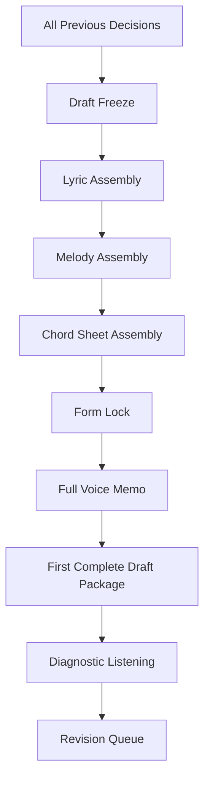
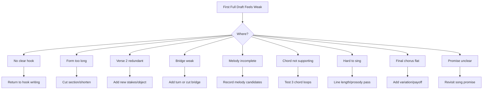

# learn-songwriting-part-026.md

# First Complete Draft: Menyatukan Lirik, Melodi, Chord, Form, dan Voice Memo Menjadi Lagu Utuh Pertama

> Seri: `learn-songwriting`  
> Part: `026 / 034`  
> Fokus: assembling complete song draft, draft freeze, lyric v1.0, melody v1.0, chord sheet, form lock, minimum viable demo, dan anti-endless-revision  
> Status seri: belum selesai  
> Prasyarat: `learn-songwriting-part-000.md` sampai `learn-songwriting-part-025.md`

---

## Ringkasan Part Ini

Part sebelumnya membahas **Contrast Between Sections**: bagaimana membuat verse, chorus, bridge, dan final chorus terasa berbeda tetapi tetap satu lagu.

Part ini adalah milestone besar:

> **Menyelesaikan draft lagu lengkap pertama.**

Sampai titik ini, kamu sudah membangun banyak komponen:

- song promise;
- target performance level;
- skill map;
- practice environment;
- feedback loop;
- anatomy of a song;
- song promise;
- POV/persona;
- emotional state machine;
- conflict engine;
- object writing;
- metaphor system;
- lyric architecture;
- natural Indonesian lyric flow;
- rhyme without forcing;
- line length, breath, singability;
- repetition, variation, memory;
- melody shape;
- melodic rhythm;
- lyric-to-melody alignment;
- hook writing;
- harmony;
- chord progression;
- form;
- section contrast.

Semua itu tidak berarti jika tidak pernah menjadi satu lagu utuh.

Banyak pemula punya banyak potongan bagus:

```text
hook bagus,
verse bagus,
metafora bagus,
melody snippet bagus,
chord loop bagus,
bridge idea bagus,
```

tetapi tidak pernah menyelesaikan lagu.

Masalahnya bukan kurang ide. Masalahnya:

```text
tidak ada assembly discipline
```

Part ini mengajarkan cara membuat **First Complete Draft**.

Bukan final release.  
Bukan demo studio.  
Bukan lagu sempurna.  
Bukan lagu yang siap dipublikasikan.  

Targetnya:

```text
satu lagu utuh yang bisa dinyanyikan dari awal sampai akhir
dengan lyric, melody, chord, form, dan voice memo kasar
```

Ini adalah milestone yang sangat penting dalam framework *The First 20 Hours*:

> Kamu tidak sedang belajar semua hal tentang songwriting. Kamu sedang mencapai performance target pertama: bisa menyelesaikan satu lagu utuh yang bekerja secara dasar.

Sebagai software engineer, pikirkan ini seperti:

```text
first end-to-end integration build
```

Belum optimized.  
Belum refactored sempurna.  
Belum production-ready.  
Tapi seluruh sistem berjalan dari awal sampai akhir.

---

## Tujuan Part

Setelah menyelesaikan part ini, kamu harus bisa:

1. Mengumpulkan semua keputusan terbaik dari part sebelumnya.
2. Mengunci draft sementara agar tidak terus berubah.
3. Menyusun lyric v1.0 lengkap dari awal sampai akhir.
4. Menyusun melody v1.0 kasar untuk semua section.
5. Menyusun chord sheet v1.0.
6. Menyusun form final sementara.
7. Membuat minimum viable demo dengan voice memo.
8. Membedakan draft issue dan performance issue.
9. Menghindari endless revision sebelum lagu lengkap.
10. Menentukan apa yang harus dilindungi dan apa yang boleh berubah.
11. Membuat first complete song package.
12. Membuat file latihan `songwriting-practice-026-first-complete-draft.md`.

---

## Prinsip Utama

```text
A finished rough song is more valuable than ten perfect fragments.
```

Draft lengkap pertama tidak harus bagus dalam semua aspek. Ia harus **ada**.

Karena begitu lagu utuh ada, kamu bisa mengevaluasi sistemnya:

- apakah form bekerja?
- apakah hook muncul cukup?
- apakah verse terlalu panjang?
- apakah melody chorus kuat?
- apakah bridge perlu?
- apakah chord mendukung?
- apakah final chorus payoff?
- apakah lagu bisa dinyanyikan?
- apakah emotional promise sampai?

Tanpa draft lengkap, semua evaluasi hanya dugaan.

---

## First Complete Draft dalam Pipeline Songwriting



Part ini bukan tentang mencari ide baru.  
Part ini tentang menyelesaikan integrasi.

---

# Bagian 1 — Apa Itu First Complete Draft?

First Complete Draft adalah versi pertama lagu yang lengkap secara struktural.

Minimal harus punya:

```text
title sementara
song promise
form
lyric full
melody rough
chord progression
hook placement
bridge/final chorus decision
voice memo full pass
notes masalah
```

Tidak harus punya:

- arrangement final;
- produksi;
- mixing;
- backing vocal;
- drum;
- bass;
- intro elaborate;
- lirik final sempurna;
- melody final sempurna;
- chord final sempurna.

## Definition of Done

First Complete Draft selesai jika:

```markdown
- [ ] Bisa dinyanyikan dari awal sampai akhir.
- [ ] Semua section ada atau sengaja dihapus.
- [ ] Hook muncul jelas.
- [ ] Chord progression tertulis.
- [ ] Melody kasar ada untuk setiap section.
- [ ] Ada voice memo full song.
- [ ] Ada catatan masalah.
- [ ] Ada daftar revisi berikutnya.
```

---

# Bagian 2 — Kenapa Draft Lengkap Sulit?

Karena saat membuat lagu, otak kreatif ingin terus membuka kemungkinan.

Masalah umum:

## 1. Terlalu Banyak Opsi

```text
hook A atau B?
verse 2 versi mana?
bridge perlu atau tidak?
chord minor atau bittersweet?
```

## 2. Takut Salah

```text
kalau saya pilih versi ini, mungkin versi lain lebih bagus
```

## 3. Perfeksionisme

```text
line ini belum sempurna, jadi lagu belum boleh selesai
```

## 4. Revisi Sebelum Integrasi

Kamu terus memperbaiki 4 baris, tapi belum tahu apakah lagu utuh bekerja.

## 5. Tidak Ada Batas Waktu

Tanpa deadline kecil, draft tidak pernah freeze.

## 6. Identitas Lagu Berubah Terus

Song promise tidak dikunci, sehingga semua section ikut berubah.

## 7. Mengira Demo Kasar Harus Terdengar Bagus

Voice memo pertama boleh jelek. Fungsinya data.

---

## Engineer Analogy

Dalam software:

```text
unit test bagus tidak menjamin system integration berjalan
```

Dalam lagu:

```text
line bagus tidak menjamin lagu utuh bekerja
```

Kamu perlu full integration test.

---

# Bagian 3 — Draft Freeze

Draft freeze adalah keputusan sementara:

```text
untuk satu putaran, saya tidak akan mengganti fondasi lagu
```

Yang difreeze:

- song promise;
- POV/persona;
- main hook;
- title sementara;
- form;
- primary metaphor domain;
- chord progression sementara;
- melody hook;
- emotional arc.

Freeze bukan berarti final. Freeze berarti:

```text
cukup stabil untuk diuji sebagai lagu utuh
```

## Freeze Rule

```text
No major redesign until one full voice memo exists.
```

Jangan mengganti hook sebelum kamu merekam full song.  
Jangan mengganti form sebelum kamu mendengar transisinya.  
Jangan mengganti chord semua section sebelum kamu tahu chorus bekerja atau tidak.

---

## Draft Freeze Template

```markdown
# Draft Freeze

## Frozen for this pass
Song promise:
POV:
Main hook:
Title:
Form:
Metaphor domain:
Chord feel:
Melody hook:
Bridge decision:
Final chorus payoff:

## Allowed changes
- small word fixes
- breath marks
- line compression
- chord simplification
- melody smoothing
- section length trimming

## Not allowed until full memo
- new song promise
- new main hook
- new POV
- new metaphor domain
- total form rewrite
```

---

# Bagian 4 — Gather All Assets

Sebelum assembly, kumpulkan asset.

## Asset Checklist

```markdown
# Song Assets

## Song Promise
...

## POV / Persona
...

## Emotional State Machine
...

## Main Conflict
...

## Main Object / Metaphor
...

## Main Hook
...

## Title Options
...

## Selected Title
...

## Form
...

## Lyric Drafts
Verse 1:
Chorus:
Verse 2:
Bridge:
Final Chorus:

## Melody Notes
Verse:
Chorus:
Bridge:

## Rhythm Notes
...

## Chords
Verse:
Chorus:
Bridge:
Final:

## Contrast Notes
...

## Feedback so far
...
```

Tanpa asset gathering, kamu akan bolak-balik mencari potongan dan kehilangan momentum.

---

# Bagian 5 — Choose One Version, Not the Best Forever

Untuk draft pertama, pilih:

```text
best enough version
```

Bukan versi terbaik sepanjang masa.

Kriteria:

- paling selaras dengan promise;
- paling singable;
- paling jelas;
- paling mudah diintegrasikan;
- paling sedikit merusak sistem;
- cukup kuat untuk diuji.

Jika ada dua hook bagus, pilih satu.

Archive yang lain, jangan buang.

```markdown
## Archive
Unused hook:
Unused bridge:
Unused title:
Potential future song:
```

Banyak ide bagus mungkin bukan untuk lagu ini.

---

# Bagian 6 — Lyric Assembly

Sekarang susun lyric lengkap.

## Lyric Assembly Order

1. Title.
2. Section labels.
3. Verse 1.
4. Chorus.
5. Verse 2.
6. Chorus repeat/variation.
7. Bridge.
8. Final chorus.
9. Outro optional.

## Rules

- jangan rewrite semua dari awal;
- pakai versi terbaik yang sudah dibuat;
- pastikan section function jelas;
- pastikan hook sama/variasi jelas;
- pastikan line breaks dan breath marks ada;
- pastikan final chorus payoff ada;
- pastikan title/hook konsisten.

## Lyric Assembly Template

```markdown
# Lyric v1.0

## Title
...

## Form
...

[Verse 1]
...

[Chorus]
...

[Verse 2]
...

[Chorus]
...

[Bridge]
...

[Final Chorus]
...

[Outro]
...
```

---

# Bagian 7 — Melody Assembly

Melody v1.0 tidak harus notated secara formal.

Cukup:

- voice memo;
- contour notes;
- hook melody shape;
- section melody notes.

## Melody Assembly

```markdown
# Melody v1.0

## Verse
Range:
Contour:
Rhythm:
Delivery:
Voice memo timestamp:

## Chorus
Hook shape:
Rhythm:
Long notes:
Voice memo timestamp:

## Bridge
Contour:
Difference:
Reveal note:
Voice memo timestamp:

## Final Chorus
Same/changed:
Variation:
Voice memo timestamp:
```

Jika kamu belum bisa menulis notasi, tidak masalah. Voice memo adalah source of truth.

---

# Bagian 8 — Chord Sheet Assembly

Buat chord sheet sederhana.

## Chord Sheet Minimal

```markdown
# <Title> - Chord Sheet v1.0

Key:
Tempo feel:
Time feel:
Capo:
Form:

## Progressions
Verse:
Chorus:
Bridge:
Final Chorus:

## Lyrics + Chords
...
```

## Important

Chord sheet harus cukup jelas untuk:

- kamu main ulang;
- kolaborator membaca;
- revisi berikutnya;
- demo ulang.

Jangan menunggu chord sempurna.

---

# Bagian 9 — Form Lock

Form harus dikunci untuk satu full pass.

Contoh:

```text
Intro - V1 - C - V2 - C - B - FC - Outro
```

Jika saat recording kamu merasa:

```text
bridge aneh
```

jangan berhenti dan rewrite total. Catat, lanjut sampai selesai.

Tujuan full pass adalah mendapatkan data keseluruhan.

## Form Lock Rule

```text
Complete the pass before changing the map.
```

---

# Bagian 10 — Minimum Viable Demo

Minimum Viable Demo untuk songwriter pemula:

```text
voice + simple chord
```

Boleh:

- satu take;
- tempo tidak sempurna;
- vocal tidak indah;
- chord salah sedikit;
- noise ruangan;
- melody belum final.

Tidak boleh:

- hanya potongan;
- hanya chorus;
- tanpa chord sama sekali jika chord sudah dipilih;
- tidak bisa didengar ulang.

## MVD Definition

```markdown
Minimum Viable Demo:
- full song from start to end
- vocal audible
- chord/harmony reference audible
- hook clear
- file saved/named
- notes written after listening
```

---

# Bagian 11 — Voice Memo Recording Protocol

## Before Recording

- siapkan lyric sheet;
- siapkan chord sheet;
- tulis tempo feel;
- pilih key;
- tandai breath;
- tandai hook hold;
- matikan distraksi;
- rekam satu full take.

## During Recording

- jangan berhenti karena salah kecil;
- lanjut sampai akhir;
- jika lupa chord, tetap lanjut;
- jika line salah, lanjut;
- tujuan bukan performance, tujuan data.

## After Recording

Jangan langsung erase.

Dengarkan sekali dari awal sampai akhir.

Catat:

- apa yang bekerja;
- apa yang gagal;
- kapan bosan;
- kapan hook kuat;
- kapan form lemah;
- line sulit dinyanyikan;
- melody awkward;
- chord tidak cocok;
- section terlalu panjang.

---

## Voice Memo Naming

Gunakan format:

```text
YYYY-MM-DD-title-v1-full-demo.m4a
YYYY-MM-DD-title-v1-hook-test.m4a
YYYY-MM-DD-title-v1-bridge-test.m4a
```

Example:

```text
2026-06-25-rak-kedua-v1-full-demo.m4a
```

---

# Bagian 12 — Full Pass Listening

Dengar full demo dengan mode diagnostik.

Jangan hanya tanya:

```text
bagus atau jelek?
```

Tanya:

```text
apakah selesai?
apakah hook jelas?
apakah chorus terasa chorus?
apakah bridge perlu?
apakah final chorus payoff?
apakah saya bosan di mana?
apakah ada line yang tidak bisa dinyanyikan?
apakah chord mendukung?
apakah promise sampai?
```

## Listening Passes

### Pass 1 — Experience

Dengar tanpa stop. Rasakan.

### Pass 2 — Structure

Catat section timing dan form.

### Pass 3 — Hook

Apakah hook memorable?

### Pass 4 — Singability

Mana yang sulit dinyanyikan?

### Pass 5 — Emotion

Apakah emotional arc bergerak?

---

# Bagian 13 — Draft Issue vs Performance Issue

Penting membedakan.

## Draft Issue

Masalah pada lagu.

Contoh:

- chorus terlalu panjang;
- hook lemah;
- bridge tidak punya turn;
- lyric tidak natural;
- chord tidak cocok;
- form datar.

## Performance Issue

Masalah pada eksekusi take.

Contoh:

- suara fals karena belum latihan;
- tempo goyang;
- lupa chord;
- vocal malu-malu;
- napas belum stabil.

Jangan merevisi lagu karena performance issue.

Jika line bagus tapi kamu belum bisa menyanyikan karena belum latihan, catat sebagai performance issue.

Jika line selalu susah dinyanyikan karena terlalu panjang, itu draft issue.

---

## Issue Classification Table

```markdown
| Moment | Problem | Draft Issue? | Performance Issue? | Action |
|---|---|---:|---:|---|
|  |  |  |  |  |
```

---

# Bagian 14 — Protect List

Saat revisi, jangan merusak hal terbaik.

Buat protect list.

## Protect List

```markdown
# Protect List

## Lines to protect
1.
2.
3.

## Hook elements to protect
1.
2.

## Melody moments to protect
1.
2.

## Chord moments to protect
1.
2.

## Emotional moments to protect
1.
2.
```

Revisi harus memperbaiki masalah tanpa membunuh inti yang hidup.

---

# Bagian 15 — Revision Queue

Setelah first draft, jangan langsung revisi semuanya.

Buat queue.

## Priority Order

1. Song promise mismatch.
2. Form/section failure.
3. Hook weakness.
4. Singability issue.
5. Prosody issue.
6. Verse 2 redundancy.
7. Bridge weakness.
8. Chord/melody support.
9. Rhyme/natural flow.
10. Small word polish.

Jangan mulai dari mengganti satu kata kecil jika chorus tidak bekerja.

## Revision Queue Template

```markdown
# Revision Queue

## P0 - Must Fix
...

## P1 - Important
...

## P2 - Nice to Fix
...

## P3 - Later/Production
...

## Do Not Touch Yet
...
```

---

# Bagian 16 — The “No More Than 3 Big Fixes” Rule

Setelah draft lengkap, pilih maksimal 3 big fixes untuk putaran berikutnya.

Contoh:

```markdown
Big Fix 1:
Chorus hook needs stronger landing.

Big Fix 2:
Verse 2 repeats verse 1.

Big Fix 3:
Bridge reveal too direct.
```

Jangan memperbaiki 20 hal sekaligus. Itu akan mengaburkan penyebab perubahan.

---

# Bagian 17 — Draft Package

First complete draft package harus terdiri dari:

```markdown
1. Lyric v1.0
2. Chord sheet v1.0
3. Form map
4. Melody notes
5. Voice memo full demo
6. Diagnostic notes
7. Protect list
8. Revision queue
```

Ini menjadi base untuk part berikutnya: revision.

---

# Bagian 18 — Versioning

Gunakan versioning.

```text
v0.1 idea
v0.5 memory draft
v0.8 hook rewrite
v0.9 form rewrite
v1.0 first complete draft
v1.1 revision pass 1
v1.2 revision pass 2
```

Jangan overwrite tanpa catatan.

## Version Note Template

```markdown
# Version Notes

## Version
v1.0

## Date
...

## What changed
...

## Why
...

## Voice memo
...

## Next revision
...
```

---

# Bagian 19 — Example First Draft Package: Rindu Domestik

## Title

```text
Tak Kupakai, Tak Kubuang
```

## Promise

```text
Rindu yang disangkal melalui benda rumah.
```

## Form

```text
V1 - C - V2 - C - B - FC - Outro
```

## Lyric Sketch

```markdown
[Verse 1]
Gelasmu di rak kedua /
tak kupindah sejak Selasa //

air panas tetap kusisakan /
untuk pagi yang salah sangka //

[Chorus]
Tak kupakai /
tak kubuang //

kau belum selesai /
di rumah yang kupanggil pulang //

[Verse 2]
Lampu dapur menyala duluan /
sebelum aku sempat jujur //

pintu kubuka setengah saja /
biar pergi terdengar pulang //

[Chorus]
Tak kupakai /
tak kubuang //

kau belum selesai /
di rumah yang kupanggil pulang //

[Bridge]
Baru kusadar /
di rak kedua //

bukan gelasmu /
yang paling lama /
kutunda //

[Final Chorus]
Tak kupakai /
tak kubuang //

aku belum selesai /
di rumah yang kupanggil pulang //

tak kupakai /
tak kubuang //

aku /
di rak kedua //

[Outro]
di rak kedua //
masih //
```

## Chords Example

```text
Verse: Am - F
Chorus: Am - F - C - G
Bridge: Dm - F - E
Final: Am - F - C - G
```

## Notes

- Hook strong.
- Bridge good but maybe too explicit.
- Final chorus payoff works conceptually.
- Need melody test on “aku di rak kedua”.
- Verse 2 line “biar pergi terdengar pulang” needs naturalness test.

---

# Bagian 20 — Example First Draft Package: Romansa Satir Bandara

## Title

```text
Jangan Panggil Ini Pulang
```

## Promise

```text
Kemarahan sosial sebagai romansa tragis kekasih berkopor yang terus pergi.
```

## Form

```text
Intro - V1 - C - V2 - C - B - FC - Outro
```

## Lyric Sketch

```markdown
[Intro]
[distant airport ambience, low piano]

[Verse 1]
Sayang, kopermu siap lagi /
licin di lantai bandara //

kau cium anak-anak di dahi /
seperti pamit bisa jadi doa //

[Chorus]
Jangan panggil ini pulang /
jika rumah hanya kau singgahi //

sebagai panggung //
sebagai kabar //

[Verse 2]
Meja makan belajar diam /
piring kecil menahan suara //

kau kirim senyum dari layar /
kami menyapu sisa perkara //

[Chorus]
Jangan panggil ini pulang /
jika rumah hanya kau singgahi //

sebagai panggung //
sebagai kabar //

[Bridge]
Rumah bukan bandara /
bukan ruang tunggu //

kami bukan tepuk tangan /
untuk koper yang selalu baru //

[Final Chorus]
Tuan... /
jangan panggil ini pulang //

jika rumah hanya kau singgahi /
sebagai panggung //

[Outro]
[airport ambience fades]
koper pergi lagi //
```

## Chords Example

```text
Verse: Am - F
Chorus: Am - F - C - G
Bridge: Dm - F - E
Final: Am - F - C - G, stripped at first line
```

## Notes

- “Tuan” final variation strong.
- Need avoid too direct “kami menyapu sisa perkara” if too political.
- Chorus line “sebagai kabar” may need stronger image.
- Airport ambience optional production hook, not required for songwriting draft.

---

# Bagian 21 — First Draft Debugging



---

# Bagian 22 — First Draft Audit

Use after recording.

```markdown
# First Draft Audit

## Overall
Does it feel like one song?
...

Does it fulfill promise?
...

## Hook
Is hook clear?
...

Is hook memorable?
...

## Form
Does section order work?
...

Any section too long?
...

## Verse 1
Does it setup world?
...

## Chorus
Does it deliver thesis/hook?
...

## Verse 2
Does it develop?
...

## Bridge
Does it turn/reframe?
...

## Final Chorus
Does it payoff?
...

## Melody
Which section is strongest?
...

Which section is weakest?
...

## Chords
Do chords support vocal?
...

## Singability
Hardest line:
...

## Emotion
Did emotional arc move?
...

## Top 3 fixes
1.
2.
3.
```

---

# Bagian 23 — Stop Criteria for First Draft

Stop first draft when:

- full song exists;
- voice memo exists;
- major issues noted;
- protect list exists;
- revision queue exists.

Do not keep polishing forever.

## Stop Signal

```text
I now know what the song is and what is broken.
```

That means draft succeeded.

A draft is successful not because it is perfect, but because it exposes the right problems.

---

# Bagian 24 — Latihan Utama Part 026

Buat file:

```text
songwriting-practice-026-first-complete-draft.md
```

Isi template berikut.

```markdown
# songwriting-practice-026-first-complete-draft.md

## 1. Draft Freeze

### Frozen for this pass
Song promise:
POV:
Main hook:
Title:
Form:
Metaphor domain:
Chord feel:
Melody hook:
Bridge decision:
Final chorus payoff:

### Allowed changes
-

### Not allowed until full memo
-

## 2. Gathered Assets

### Song Promise
...

### POV / Persona
...

### Emotional State Machine
...

### Main Conflict
...

### Main Object / Metaphor
...

### Main Hook
...

### Selected Title
...

### Form
...

### Chords
Verse:
Chorus:
Bridge:
Final:

### Melody Notes
Verse:
Chorus:
Bridge:
Final:

## 3. Lyric v1.0

[Intro]
...

[Verse 1]
...

[Pre-Chorus]
...

[Chorus]
...

[Verse 2]
...

[Chorus]
...

[Bridge]
...

[Final Chorus]
...

[Outro]
...

## 4. Chord Sheet v1.0

# <Title> - Chord Sheet v1.0

Key:
Tempo feel:
Time feel:
Capo:
Form:

## Progressions
Verse:
Pre-Chorus:
Chorus:
Bridge:
Final Chorus:

## Lyrics + Chords
...

## 5. Melody v1.0 Notes

### Verse
Range:
Contour:
Rhythm:
Delivery:

### Chorus
Hook shape:
Rhythm:
Long notes:
Delivery:

### Bridge
Contour:
Difference:
Reveal note:

### Final Chorus
Same/changed:
Variation:

## 6. Minimum Viable Demo

Voice memo file:
Date:
Take:
Instrument/chord source:
Full song from start to end?
Hook audible?
Chord audible?
Notes:

## 7. First Listening Notes

### Pass 1 - Experience
...

### Pass 2 - Structure
...

### Pass 3 - Hook
...

### Pass 4 - Singability
...

### Pass 5 - Emotion
...

## 8. Draft Issue vs Performance Issue

| Moment | Problem | Draft Issue? | Performance Issue? | Action |
|---|---|---:|---:|---|
|  |  |  |  |  |

## 9. Protect List

### Lines to protect
1.
2.
3.

### Hook elements to protect
1.
2.

### Melody moments to protect
1.
2.

### Chord moments to protect
1.
2.

### Emotional moments to protect
1.
2.

## 10. Revision Queue

### P0 - Must Fix
1.
2.
3.

### P1 - Important
1.
2.
3.

### P2 - Nice to Fix
1.
2.
3.

### P3 - Later / Production
1.
2.
3.

### Do Not Touch Yet
1.
2.
3.

## 11. Top 3 Big Fixes for Next Pass
1.
2.
3.

## 12. Version Notes
Version:
Date:
What changed:
Why:
Voice memo:
Next revision:

## 13. Next Action
...
```

---

# Latihan 30 Menit: Draft Freeze + Asset Gathering

Isi draft freeze dan gathered assets.

Tujuan:

```text
menghentikan perubahan fondasi selama satu full pass
```

Jangan menulis ulang lagu dulu. Kumpulkan bahan.

---

# Latihan 45 Menit: Lyric + Chord Sheet Assembly

Susun:

- lyric v1.0;
- chord sheet v1.0;
- melody notes per section.

Pastikan semua section ada.

---

# Latihan 60 Menit: Minimum Viable Demo

Rekam full voice memo.

Aturan:

- satu take sampai akhir;
- jangan stop untuk kesalahan kecil;
- chord sederhana cukup;
- vocal tidak harus indah;
- langsung tulis listening notes.

Output:

```markdown
Voice memo:
What works:
What fails:
Top 3 fixes:
Protect list:
```

---

# Checklist Part 026

Sebelum lanjut ke part 027, pastikan:

- [ ] Kamu sudah melakukan draft freeze.
- [ ] Kamu mengumpulkan semua asset lagu.
- [ ] Kamu memilih satu title sementara.
- [ ] Kamu mengunci form sementara.
- [ ] Kamu menyusun lyric v1.0 lengkap.
- [ ] Kamu menyusun chord sheet v1.0.
- [ ] Kamu mencatat melody v1.0 notes.
- [ ] Kamu merekam minimum viable demo.
- [ ] Kamu mendengar full pass tanpa stop.
- [ ] Kamu membuat listening notes.
- [ ] Kamu membedakan draft issue dan performance issue.
- [ ] Kamu membuat protect list.
- [ ] Kamu membuat revision queue.
- [ ] Kamu memilih top 3 big fixes.
- [ ] Kamu punya next action menuju revision methodology.

---

# Output Wajib Part 026

Buat file:

```text
songwriting-practice-026-first-complete-draft.md
```

Isi minimal:

```markdown
# songwriting-practice-026-first-complete-draft.md

## Draft Freeze
...

## Gathered Assets
...

## Lyric v1.0
...

## Chord Sheet v1.0
...

## Melody v1.0 Notes
...

## Minimum Viable Demo
...

## First Listening Notes
...

## Draft Issue vs Performance Issue
...

## Protect List
...

## Revision Queue
...

## Top 3 Big Fixes for Next Pass
...

## Version Notes
...

## Next Action
...
```

---

# Common Failure Modes di Part Ini

## 1. Tidak Mau Freeze

Gejala:

```text
terus mengganti hook/form/promise sebelum full demo.
```

Solusi:

```text
freeze for one pass.
```

## 2. Revisi Line Kecil Sebelum Lagu Utuh

Gejala:

```text
menghabiskan 1 jam untuk satu kata, belum ada full song.
```

Solusi:

```text
assemble first, polish later.
```

## 3. Voice Memo Tidak Full

Gejala:

```text
hanya merekam chorus.
```

Solusi:

```text
rekam awal sampai akhir.
```

## 4. Menghapus Take Karena Jelek

Gejala:

```text
tidak ada data.
```

Solusi:

```text
simpan take jelek, catat masalah.
```

## 5. Mengira Performance Issue adalah Song Issue

Gejala:

```text
mengganti melody karena sekali fals.
```

Solusi:

```text
klasifikasikan issue.
```

## 6. Tidak Membuat Protect List

Gejala:

```text
revisi membunuh bagian terbaik.
```

Solusi:

```text
protect living moments.
```

## 7. Revisi Semua Sekaligus

Gejala:

```text
lagu berubah total, tidak tahu apa yang memperbaiki.
```

Solusi:

```text
top 3 big fixes only.
```

## 8. Chord Sheet Tidak Ditulis

Gejala:

```text
lupa progression.
```

Solusi:

```text
write chord sheet v1.0.
```

## 9. Melody Tidak Terdokumentasi

Gejala:

```text
melody bagus hilang.
```

Solusi:

```text
voice memo + melody notes.
```

## 10. Tidak Ada Stop Criteria

Gejala:

```text
draft pertama tidak pernah selesai.
```

Solusi:

```text
stop when full demo + notes exist.
```

---

# Prinsip Penting

```text
The first complete draft is not the end of songwriting.
It is the beginning of real revision.
```

Dan:

```text
You cannot revise a song that does not exist.
```

Draft lengkap pertama adalah benda nyata yang bisa diuji.  
Sebelumnya, kamu hanya punya kemungkinan.

---

# Bridge ke Part Berikutnya

Part ini membahas first complete draft.

Part berikutnya, `learn-songwriting-part-027.md`, akan membahas:

```text
Revision Methodology
```

Kita akan memperdalam:

- bagaimana merevisi lagu tanpa merusak inti;
- diagnosis sebelum solusi;
- revision passes;
- top-down vs bottom-up revision;
- lyric revision;
- melody revision;
- harmony revision;
- form revision;
- hook revision;
- preserving what works;
- avoiding endless polish;
- feedback integration.

Jika part ini membuat draft utuh, part berikutnya membuat draft itu menjadi lebih baik secara sistematis.

---

# Status Seri

Part ini selesai.

```text
Selesai: learn-songwriting-part-026.md
Berikutnya: learn-songwriting-part-027.md
Status seri: belum selesai
Part tersisa: 8
Target akhir seri: learn-songwriting-part-034.md
```


<!-- NAVIGATION_FOOTER -->
<div class="page-nav">
<a href="./learn-songwriting-part-025.md">⬅️ Contrast Between Sections: Membuat Verse, Chorus, Bridge, dan Final Chorus Terasa Berbeda tetapi Tetap Satu Lagu</a>
<a href="./index.md">📚 Kategori</a>
<a href="../../index.md">🏠 Home</a>
<a href="./learn-songwriting-part-027.md">Revision Methodology: Merevisi Lagu secara Sistematis Tanpa Merusak Inti yang Sudah Hidup ➡️</a>
</div>
