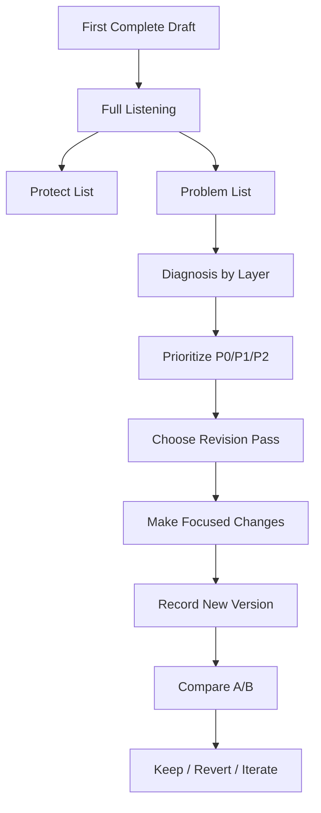
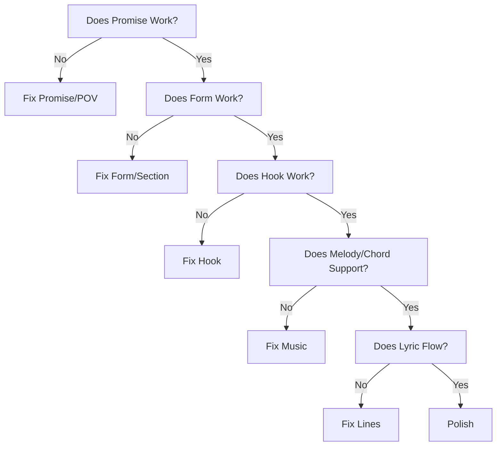
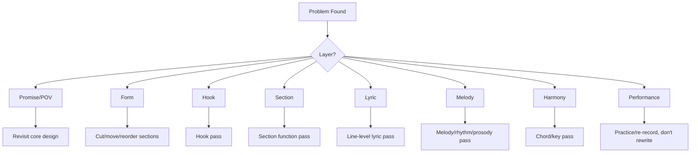

# learn-songwriting-part-027.md

# Revision Methodology: Merevisi Lagu secara Sistematis Tanpa Merusak Inti yang Sudah Hidup

> Seri: `learn-songwriting`  
> Part: `027 / 034`  
> Fokus: revision strategy, diagnosis, top-down vs bottom-up revision, hook/form/lyric/melody/harmony pass, protect list, feedback integration, dan anti-endless-polish  
> Status seri: belum selesai  
> Prasyarat: `learn-songwriting-part-000.md` sampai `learn-songwriting-part-026.md`

---

## Ringkasan Part Ini

Part sebelumnya membahas **First Complete Draft**: membuat satu lagu utuh pertama dengan lyric, melody, chord, form, dan voice memo.

Part ini membahas tahap yang membedakan draft mentah dari lagu yang benar-benar bekerja:

> **Revision.**

Banyak songwriter pemula mengira revisi berarti:

```text
mengganti kata yang terdengar kurang indah
menambah rima
menghaluskan line
mengubah chord
mencari hook baru
```

Padahal revisi yang baik bukan sekadar mempercantik permukaan.

Revision adalah proses diagnostik:

```text
apa yang sebenarnya tidak bekerja?
di level mana masalahnya?
apa yang harus dilindungi?
apa yang harus dipotong?
apa yang harus diganti?
apa yang cukup diperhalus?
```

Masalah besar dalam revisi adalah memperbaiki hal kecil saat masalah besar belum selesai.

Contoh:

Kamu sibuk mengganti:

```text
gelasmu -> cangkirmu
```

padahal masalah utama adalah:

```text
chorus tidak punya hook
```

Atau kamu mengganti chord seluruh lagu, padahal masalahnya:

```text
verse 2 tidak memberi informasi baru
```

Atau kamu menulis ulang bridge, padahal masalahnya:

```text
bridge sebenarnya tidak dibutuhkan
```

Sebagai software engineer, revision mirip debugging dan refactoring.

Debugging buruk:

```text
ubah random, run, berharap berhasil
```

Debugging baik:

```text
reproduce issue
locate layer
form hypothesis
make smallest useful change
test again
```

Revision lagu juga begitu.

---

## Tujuan Part

Setelah menyelesaikan part ini, kamu harus bisa:

1. Membedakan diagnosis dan solusi.
2. Membedakan top-down revision dan bottom-up revision.
3. Mendeteksi layer masalah: promise, form, hook, section, lyric, melody, harmony, performance.
4. Menentukan prioritas revisi dengan P0/P1/P2/P3.
5. Merevisi tanpa merusak bagian terbaik.
6. Membuat revision pass yang terfokus.
7. Merevisi hook secara sistematis.
8. Merevisi form dan section function.
9. Merevisi lyric flow, rhyme, imagery, dan directness.
10. Merevisi melody, rhythm, prosody, dan chord support.
11. Mengintegrasikan feedback eksternal tanpa kehilangan visi.
12. Menghindari endless polish.
13. Membuat revision log dan versioning.
14. Membuat file latihan `songwriting-practice-027-revision-methodology.md`.

---

## Prinsip Utama

```text
Do not revise what is visible before diagnosing what is structural.
```

Dan:

```text
Protect what is alive before fixing what is broken.
```

Bagian terbaik dari lagu sering rapuh. Jika kamu revisi secara brutal tanpa protect list, kamu bisa membunuh momen yang justru membuat lagu terasa jujur.

Revision bukan membuang semua. Revision adalah memperjelas inti.

---

## Revision dalam Pipeline Songwriting



Revision yang baik selalu memiliki:

- baseline;
- hypothesis;
- focused change;
- test;
- comparison.

---

# Bagian 1 — Apa Itu Revision?

Revision adalah melihat ulang lagu sebagai sistem dan membuatnya bekerja lebih jelas.

Revision berbeda dari editing.

## Editing

Editing biasanya permukaan:

- memilih kata;
- memperbaiki grammar;
- merapikan rima;
- menghapus filler;
- memperbaiki line break.

## Revision

Revision bisa struktural:

- mengubah hook;
- memindahkan chorus;
- menghapus bridge;
- mengganti POV;
- memotong verse;
- mengubah emotional arc;
- mengganti chord progression;
- mengubah melody chorus;
- mengubah final payoff.

Keduanya penting, tetapi urutan penting.

```text
revision first, editing later
```

Jika fondasi salah, polish hanya membuat masalah terlihat lebih rapi.

---

## Revision Levels

| Level | Pertanyaan |
|---|---|
| Promise | Apakah lagu jelas ingin memberi pengalaman apa? |
| POV | Siapa bicara, kepada siapa, dari jarak emosi apa? |
| Conflict | Apakah ada tension? |
| Form | Apakah perjalanan section bekerja? |
| Hook | Apakah pusat lagu menempel? |
| Section | Apakah setiap section punya fungsi? |
| Lyric | Apakah line natural, spesifik, singable? |
| Melody | Apakah melody mendukung kata dan emosi? |
| Harmony | Apakah chord mendukung hook? |
| Performance | Apakah demo gagal karena lagu atau eksekusi? |

---

# Bagian 2 — Diagnosis Before Solution

Jangan mulai dengan solusi.

Bad:

```text
Chorus terasa lemah, saya akan tambah chord baru.
```

Better:

```text
Chorus terasa lemah. Kenapa?
- Hook tidak jelas?
- Melody range sama dengan verse?
- Lyric terlalu padat?
- Chord tidak landing?
- Vocal delivery terlalu kecil?
- Hook muncul terlalu telat?
```

Satu gejala bisa punya banyak penyebab.

## Diagnostic Template

```markdown
# Diagnosis

## Symptom
...

## Where it happens
...

## Possible causes
1.
2.
3.
4.

## Evidence
...

## Most likely cause
...

## Revision hypothesis
If I change ..., then ... should improve.

## Test
...
```

## Example

Symptom:

```text
Final chorus terasa flat.
```

Possible causes:

- no new context from bridge;
- same delivery;
- same lyric;
- harmony not shifting;
- hook not strong enough;
- emotional state not changed.

Hypothesis:

```text
If bridge reveals "aku di rak kedua", final chorus will feel reframed.
```

Test:

```text
Add final line and record v1.1.
```

---

# Bagian 3 — Top-Down vs Bottom-Up Revision

## Top-Down Revision

Mulai dari level besar:

- promise;
- POV;
- form;
- hook;
- section function;
- emotional arc.

Gunakan jika lagu terasa tidak bekerja secara keseluruhan.

## Bottom-Up Revision

Mulai dari level kecil:

- word choice;
- rhyme;
- line length;
- vowel;
- syllable;
- breath;
- phrase.

Gunakan jika lagu sudah bekerja secara besar, tetapi masih kasar.

## Rule

```text
If the song does not work globally, do not polish locally.
```

---

## Revision Order



Urutan ini mencegah kamu menghabiskan energi di tempat yang salah.

---

# Bagian 4 — Protect List

Sebelum revisi, buat protect list.

Lagu punya bagian yang hidup:

- satu line jujur;
- hook phrase;
- melody turn;
- chord landing;
- object image;
- vocal delivery;
- silence;
- final word.

Jika kamu tidak melindungi ini, revisi bisa membuat lagu lebih rapi tapi kurang hidup.

## Protect List Template

```markdown
# Protect List

## Must protect
1.
2.
3.

## Strong but editable
1.
2.
3.

## Weak / likely to cut
1.
2.
3.

## Unknown / needs testing
1.
2.
3.
```

## Example

```markdown
Must protect:
- "Tak kupakai, tak kubuang"
- gelas/rak kedua
- final image "aku di rak kedua"

Strong but editable:
- "rumah yang kupanggil pulang"
- bridge realization

Weak:
- verse 2 line 3
- outro maybe too long
```

---

# Bagian 5 — Revision Priority

Gunakan prioritas.

## P0 — Must Fix

Masalah yang membuat lagu gagal.

Contoh:

- hook tidak jelas;
- form tidak bekerja;
- song promise membingungkan;
- chorus tidak singable;
- verse 2 redundant;
- bridge merusak lagu.

## P1 — Important

Masalah besar tapi tidak fatal.

- rhyme kurang natural;
- chord bridge kurang cocok;
- melody verse datar;
- final line kurang kuat.

## P2 — Nice to Fix

- pilihan kata;
- rima tambahan;
- breath mark;
- minor phrase adjustment.

## P3 — Later / Production

- instrument detail;
- mix;
- sound design;
- backing vocal;
- ambient placement;
- intro production.

## Priority Template

```markdown
# Revision Priority

## P0
1.
2.
3.

## P1
1.
2.
3.

## P2
1.
2.
3.

## P3
1.
2.
3.
```

---

# Bagian 6 — One Pass, One Goal

Setiap revision pass harus punya tujuan.

Bad:

```text
Saya akan memperbaiki semuanya.
```

Good:

```text
Revision Pass 1: make chorus hook clearer.
Revision Pass 2: make verse 2 add stakes.
Revision Pass 3: fix prosody and singability.
```

Jika kamu mengubah terlalu banyak sekaligus, kamu tidak tahu perubahan mana yang membantu.

## Revision Pass Template

```markdown
# Revision Pass

## Version
v1.1

## Goal
...

## Problem
...

## Hypothesis
...

## Changes allowed
...

## Changes not allowed
...

## Test
...

## Result
...
```

---

# Bagian 7 — A/B Revision

Jangan langsung overwrite.

Buat versi A/B.

Example:

```text
v1.0 original chorus
v1.1 chorus with added line
v1.2 chorus with shorter hook
```

Rekam masing-masing singkat.

Bandingkan.

## A/B Test Questions

```text
Mana yang lebih mudah diingat?
Mana yang lebih jujur?
Mana yang lebih singable?
Mana yang lebih sesuai promise?
Mana yang membuat final chorus lebih kuat?
Mana yang terasa terlalu clever?
```

## A/B Template

```markdown
# A/B Test

## Version A
...

## Version B
...

## Difference
...

## Test method
...

## Result
...

## Decision
Keep A / Keep B / Combine / Try C
```

---

# Bagian 8 — Form Revision

Form revision dilakukan jika lagu terasa panjang, datar, atau tidak punya journey.

## Symptoms

- hook terlalu telat;
- verse 1 terlalu panjang;
- chorus tidak terasa arrival;
- verse 2 tidak berkembang;
- bridge tidak memberi turn;
- final chorus tidak payoff;
- outro berlebihan.

## Fixes

| Problem | Possible Fix |
|---|---|
| Hook late | shorten verse / move chorus earlier |
| Verse too long | cut explanation |
| Chorus weak | strengthen hook / contrast |
| Verse 2 redundant | add new stakes/object |
| Bridge weak | reframe or cut |
| Final flat | add variation / context shift |
| Too long | remove pre/post/outro |

## Form Revision Template

```markdown
# Form Revision

## Current form
...

## Problem
...

## Section to cut/move/shorten
...

## New form
...

## Expected effect
...

## Test voice memo
...
```

---

# Bagian 9 — Hook Revision

Hook revision is high priority.

## Hook Problems

- too long;
- too generic;
- not singable;
- no conflict;
- melody not memorable;
- rhythm weak;
- title mismatch;
- no final payoff;
- appears too rarely.

## Hook Fixes

- compress;
- add contradiction;
- add object;
- change command/question;
- improve rhythm motif;
- move hook to chorus first line;
- add final variation;
- change title;
- align melody stress.

## Hook Revision Template

```markdown
# Hook Revision

## Current hook
...

## Problem
...

## Core promise
...

## 10 alternative hooks
1.
2.
3.
4.
5.
6.
7.
8.
9.
10.

## Best candidate
...

## Rhythm
...

## Melody
...

## Placement
...

## Final payoff
...
```

---

# Bagian 10 — Verse Revision

Verse revision improves setup and evidence.

## Verse 1 Problems

- too much exposition;
- no object;
- no scene;
- unclear POV;
- starts too abstract;
- too long before hook;
- no conflict hint.

## Verse 2 Problems

- repeats verse 1;
- no development;
- no stakes;
- too many new objects;
- does not deepen chorus.

## Verse Fixes

- add object/action;
- cut explanation;
- start closer to scene;
- use time shift;
- add consequence;
- return motif with twist;
- shorten to reach chorus faster.

## Verse Revision Checklist

```markdown
- [ ] Does Verse 1 set world quickly?
- [ ] Does Verse 1 imply conflict?
- [ ] Does Verse 2 add new information?
- [ ] Does Verse 2 make chorus heavier?
- [ ] Are details specific but not crowded?
- [ ] Is lyric natural when spoken?
```

---

# Bagian 11 — Chorus Revision

Chorus revision improves memory and thesis.

## Chorus Problems

- too wordy;
- no hook;
- hook buried;
- too much new information;
- melody not distinct;
- rhythm not repeatable;
- does not contrast verse;
- not singable.

## Chorus Fixes

- reduce lyric;
- move hook to first/last line;
- repeat hook;
- simplify melody;
- strengthen rhythm motif;
- make title appear;
- land on important chord;
- clarify emotional thesis.

## Chorus Revision Template

```markdown
# Chorus Revision

## Current chorus
...

## Main hook
...

## Problem
...

## New chorus A
...

## New chorus B
...

## Hook placement
...

## Melody/rhythm notes
...

## Decision
...
```

---

# Bagian 12 — Bridge Revision

Bridge must turn.

## Bridge Problems

- repeats verse;
- too explanatory;
- new metaphor domain;
- no reveal;
- too long;
- does not affect final chorus;
- melody/harmony not different.

## Bridge Fixes

- make it shorter;
- use callback;
- add reveal;
- strip lyric;
- change harmony/rhythm;
- make final line lead into hook;
- cut bridge if unnecessary.

## Bridge Test

```text
If bridge is removed, does final chorus lose meaning?
```

If no, bridge needs revision or removal.

## Bridge Revision Template

```markdown
# Bridge Revision

## Current bridge
...

## Function
...

## Reveal/reframe
...

## Callback
...

## What final chorus means after bridge
...

## Keep / cut / rewrite
...
```

---

# Bagian 13 — Lyric Revision

Lyric revision happens after structural issues.

## Lyric Revision Targets

- clarity;
- specificity;
- natural flow;
- singability;
- rhyme;
- sound;
- line length;
- emotional truth;
- metaphor consistency;
- POV consistency.

## Lyric Revision Passes

### 1. Clarity Pass

Can listener understand emotional situation?

### 2. Specificity Pass

Replace abstract with object/action.

### 3. Natural Speech Pass

Speak every line.

### 4. Singability Pass

Check breath and vowel.

### 5. Sound/Rhyme Pass

Improve sound without forcing.

### 6. Cut Pass

Remove duplicate lines.

## Lyric Revision Template

```markdown
| Line | Problem | Revision A | Revision B | Chosen |
|---|---|---|---|---|
```

---

# Bagian 14 — Melody Revision

Melody revision addresses memorability, singability, and emotion.

## Melody Problems

- hook not memorable;
- verse too flat;
- chorus not distinct;
- range too high;
- bad stress;
- phrase too long;
- bridge same as verse;
- final chorus no variation.

## Melody Fixes

- create motif;
- simplify hook;
- lower verse;
- widen chorus;
- change cadence;
- align stress;
- add rest;
- reduce leaps;
- change bridge contour;
- hold key word.

## Melody Revision Template

```markdown
# Melody Revision

## Section
...

## Current issue
...

## Melody shape now
...

## New shape A
...

## New shape B
...

## Stress alignment
...

## Voice memo comparison
...

## Decision
...
```

---

# Bagian 15 — Harmony Revision

Harmony revision should support vocal and form.

## Harmony Problems

- too bright;
- too dark;
- too busy;
- too static;
- hook not landing;
- verse/chorus same;
- bridge no turn;
- melody clash;
- key uncomfortable.

## Harmony Fixes

- transpose;
- simplify chords;
- change chorus landing;
- change bridge color;
- slow harmonic rhythm;
- change verse loop;
- strip final chorus;
- resolve/unresolve intentionally.

## Harmony Revision Template

```markdown
# Harmony Revision

## Current progression
Verse:
Chorus:
Bridge:

## Problem
...

## Candidate A
...

## Candidate B
...

## Hook test
...

## Decision
...
```

---

# Bagian 16 — Prosody Revision

Prosody issues are common.

## Symptoms

- wrong word stress;
- long note on weak syllable;
- melody cuts phrase wrong;
- line hard to sing;
- Bahasa Indonesia terasa dipaksa;
- hook word unclear.

## Fixes

- move melodic peak;
- rewrite line;
- change word order;
- shorten phrase;
- change vowel word;
- add breath;
- change rhythm;
- change note duration.

## Prosody Revision Checklist

```markdown
- [ ] Important words on important notes.
- [ ] Long notes on meaningful vowels.
- [ ] Phrase boundary aligns with meaning.
- [ ] Breath is possible.
- [ ] Hook stress is natural.
- [ ] No accidental peak on weak word.
```

---

# Bagian 17 — Feedback Integration

Feedback is useful but dangerous if not filtered.

## Feedback Types

1. Taste feedback.
2. Clarity feedback.
3. Emotional feedback.
4. Singability feedback.
5. Structure feedback.
6. Technical feedback.
7. Production feedback.

Do not treat all feedback equally.

## Feedback Processing

```markdown
# Feedback Processing

## Feedback
...

## Type
taste / clarity / emotional / structure / technical / production

## Evidence
...

## Does it match my diagnosis?
...

## Does it support song promise?
...

## Action
accept / reject / test / defer
```

## Rule

```text
If one person says "I don't like it", that is taste.
If three people don't understand the hook, that is clarity.
```

---

# Bagian 18 — Avoiding Endless Revision

Endless revision happens when there is no stop criteria.

## Stop Criteria for Revision Pass

A revision pass is done when:

- target issue improved;
- new voice memo recorded;
- decision logged;
- next issue identified;
- no major new break introduced.

## Stop Criteria for Song v1.x

A song is ready for demo polish when:

- promise clear;
- hook memorable;
- form works;
- melody singable;
- chord supports;
- lyric mostly natural;
- final chorus payoff;
- no P0 issue remains.

Do not require perfection.

---

## Endless Revision Smells

- rewriting title every day;
- changing hook repeatedly without test;
- polishing verse before chorus works;
- asking too many people too early;
- no versioning;
- no protect list;
- revising based on mood only;
- confusing production with songwriting.

---

# Bagian 19 — Revision Log

Always log changes.

## Revision Log Template

```markdown
# Revision Log

## Version
v1.1

## Date
...

## Goal
...

## Changes made
1.
2.
3.

## What improved
...

## What got worse
...

## Voice memo
...

## Decision
keep / revert / iterate

## Next pass
...
```

Revision log prevents circular work.

---

# Bagian 20 — Example Revision: Rindu Domestik

## Draft Issue

```text
Final chorus payoff good, but bridge too explanatory.
```

## Diagnosis

Bridge says realization too directly.

Current:

```text
bukan gelasmu
yang paling lama
kutunda
```

Works, but maybe too on-the-nose.

## Revision Candidates

A:

```text
Baru kusadar /
di rak kedua //

ada namaku /
di bawah debu //
```

B:

```text
Baru kusadar /
di rak kedua //

yang diam paling lama /
bukan gelasmu //
```

C:

```text
Baru kusadar /
selama ini //

aku juga /
tak kupakai //
```

## Test

Record bridge into final chorus.

## Decision Criteria

- Does final chorus hit harder?
- Is reveal clear enough?
- Is it too clever?
- Does it preserve object domain?

---

# Bagian 21 — Example Revision: Romansa Satir Bandara

## Draft Issue

```text
Chorus line "sebagai kabar" maybe weaker than "sebagai panggung".
```

## Diagnosis

“Sebagai kabar” is abstract-ish and less sharp.

Current:

```text
sebagai panggung
sebagai kabar
```

## Alternatives

A:

```text
sebagai panggung
di ruang keluarga
```

B:

```text
sebagai panggung
untuk kamera
```

C:

```text
sebagai panggung
bukan pelukan
```

D:

```text
sebagai panggung
yang minta tepuk tangan
```

## Consideration

If political critique should be indirect, avoid too blunt:

```text
kamera
```

unless intentional.

## Stronger Chorus

```text
Jangan panggil ini pulang /
jika rumah hanya kau singgahi //

sebagai panggung /
yang lupa memeluk //
```

But “lupa memeluk” may be too sentimental.

Test.

---

# Bagian 22 — Revision Decision Tree



---

# Bagian 23 — Revision Session Workflow

Use a structured session.

## 60-Minute Revision Session

### 0–10 min: Listen

Full demo, no editing.

### 10–20 min: Diagnose

Write symptoms, classify layers.

### 20–25 min: Choose One Goal

Pick one revision pass.

### 25–45 min: Revise

Make focused changes.

### 45–55 min: Record

Voice memo new version.

### 55–60 min: Log

Write result and next action.

This prevents chaos.

---

# Bagian 24 — Latihan Utama Part 027

Buat file:

```text
songwriting-practice-027-revision-methodology.md
```

Isi template berikut.

```markdown
# songwriting-practice-027-revision-methodology.md

## 1. Source
Song title:
Current version:
Voice memo:
Date:

## 2. Protect List

### Must protect
1.
2.
3.

### Strong but editable
1.
2.
3.

### Weak / likely to cut
1.
2.
3.

### Unknown / needs testing
1.
2.
3.

## 3. Full Listening Notes

### Experience pass
...

### Structure pass
...

### Hook pass
...

### Singability pass
...

### Emotion pass
...

## 4. Problem List

| Moment | Symptom | Evidence |
|---|---|---|
|  |  |  |

## 5. Diagnosis by Layer

| Problem | Layer | Possible Cause | Most Likely Cause |
|---|---|---|---|
|  | promise / POV / form / hook / section / lyric / melody / harmony / performance |  |  |

## 6. Revision Priority

### P0 - Must Fix
1.
2.
3.

### P1 - Important
1.
2.
3.

### P2 - Nice to Fix
1.
2.
3.

### P3 - Later / Production
1.
2.
3.

## 7. Top 3 Big Fixes
1.
2.
3.

## 8. Revision Pass 1

Version:
Goal:
Problem:
Hypothesis:
Changes allowed:
Changes not allowed:
Revision made:
Voice memo:
Result:
Decision:

## 9. A/B Test optional

### Version A
...

### Version B
...

Difference:
Test method:
Result:
Decision:

## 10. Section-Specific Revision

### Hook
Problem:
Fix:

### Form
Problem:
Fix:

### Verse
Problem:
Fix:

### Chorus
Problem:
Fix:

### Bridge
Problem:
Fix:

### Melody
Problem:
Fix:

### Harmony
Problem:
Fix:

### Prosody
Problem:
Fix:

## 11. Feedback Integration optional

| Feedback | Type | Accept/Reject/Test/Defer | Reason |
|---|---|---|---|
|  |  |  |  |

## 12. Revision Log

## Version
...

## Date
...

## Goal
...

## Changes made
1.
2.
3.

## What improved
...

## What got worse
...

## Decision
...

## Next pass
...

## 13. Stop Criteria Check
Promise clear?
Hook memorable?
Form works?
Melody singable?
Chord supports?
Lyric natural?
Final chorus payoff?
No P0 issue?

## 14. Next Action
...
```

---

# Latihan 30 Menit: Diagnosis Only

Dengar draft v1.0.

Jangan revisi.

Hanya isi:

- protect list;
- problem list;
- diagnosis by layer;
- P0/P1/P2/P3.

Tujuan:

```text
menahan impuls memperbaiki sebelum tahu masalah
```

---

# Latihan 45 Menit: One Revision Pass

Pilih satu P0/P1.

Lakukan satu revision pass.

Contoh:

```text
Goal: make chorus hook clearer
```

Jangan menyentuh bridge, chord, atau verse jika tidak perlu.

Rekam v1.1.

---

# Latihan 60 Menit: A/B Hook or Bridge Test

Pilih hook atau bridge yang bermasalah.

Buat 2 versi.

Rekam A/B.

Pilih berdasarkan:

- promise;
- memory;
- singability;
- emotional truth;
- final payoff.

---

# Checklist Part 027

Sebelum lanjut ke part 028, pastikan:

- [ ] Kamu memahami perbedaan revision dan editing.
- [ ] Kamu melakukan diagnosis sebelum solusi.
- [ ] Kamu membuat protect list.
- [ ] Kamu membuat problem list.
- [ ] Kamu mengklasifikasikan masalah by layer.
- [ ] Kamu membuat P0/P1/P2/P3.
- [ ] Kamu memilih top 3 big fixes.
- [ ] Kamu melakukan minimal satu focused revision pass.
- [ ] Kamu merekam voice memo versi baru.
- [ ] Kamu membuat revision log.
- [ ] Kamu tahu apa yang membaik dan memburuk.
- [ ] Kamu tidak merevisi semuanya sekaligus.
- [ ] Kamu punya next action menuju feedback and listener testing.

---

# Output Wajib Part 027

Buat file:

```text
songwriting-practice-027-revision-methodology.md
```

Isi minimal:

```markdown
# songwriting-practice-027-revision-methodology.md

## Source
...

## Protect List
...

## Full Listening Notes
...

## Problem List
...

## Diagnosis by Layer
...

## Revision Priority
...

## Top 3 Big Fixes
...

## Revision Pass 1
...

## A/B Test optional
...

## Section-Specific Revision
...

## Feedback Integration optional
...

## Revision Log
...

## Stop Criteria Check
...

## Next Action
...
```

---

# Common Failure Modes di Part Ini

## 1. Revisi Tanpa Diagnosis

Gejala:

```text
mengubah banyak hal secara random.
```

Solusi:

```text
diagnosis by layer.
```

## 2. Polishing Terlalu Cepat

Gejala:

```text
memperbaiki diksi saat form/hook belum bekerja.
```

Solusi:

```text
top-down revision first.
```

## 3. Membunuh Bagian Terbaik

Gejala:

```text
lagu lebih rapi tapi kehilangan jiwa.
```

Solusi:

```text
protect list.
```

## 4. Terlalu Banyak Perubahan Sekaligus

Gejala:

```text
tidak tahu perubahan mana yang membantu.
```

Solusi:

```text
one pass, one goal.
```

## 5. Mengikuti Semua Feedback

Gejala:

```text
lagu kehilangan identitas.
```

Solusi:

```text
filter feedback by promise.
```

## 6. Mengabaikan Feedback Clarity

Gejala:

```text
beberapa orang tidak mengerti hook, tapi kamu anggap taste.
```

Solusi:

```text
bedakan taste vs clarity.
```

## 7. Tidak Membuat Versioning

Gejala:

```text
tidak bisa kembali ke versi lama.
```

Solusi:

```text
v1.0, v1.1, v1.2.
```

## 8. Mengira Performance Issue adalah Draft Issue

Gejala:

```text
mengubah lagu karena take jelek.
```

Solusi:

```text
classify issue.
```

## 9. Endless Polish

Gejala:

```text
revisi terus tanpa stop criteria.
```

Solusi:

```text
define pass goal and stop.
```

## 10. Tidak Merekam Setelah Revisi

Gejala:

```text
perubahan tidak diuji.
```

Solusi:

```text
record new voice memo.
```

---

# Prinsip Penting

```text
Revision is not making the song different.
Revision is making the song more itself.
```

Dan:

```text
Every revision should clarify the promise, strengthen the hook, or remove friction.
```

Jika perubahan tidak melakukan salah satu dari itu, mungkin itu hanya distraksi.

---

# Bridge ke Part Berikutnya

Part ini membahas revision methodology.

Part berikutnya, `learn-songwriting-part-028.md`, akan membahas:

```text
Feedback and Listener Testing
```

Kita akan memperdalam:

- kapan meminta feedback;
- siapa yang cocok memberi feedback;
- pertanyaan feedback yang benar;
- cara menghindari feedback vague;
- cara menguji hook/memory/emotion;
- cara membaca reaksi pendengar;
- cara menggabungkan feedback tanpa kehilangan visi;
- feedback untuk AI-generated demo vs human demo;
- membuat feedback report.

Jika part ini mengajarkan self-revision, part berikutnya mengajarkan cara memakai telinga orang lain sebagai data.

---

# Status Seri

Part ini selesai.

```text
Selesai: learn-songwriting-part-027.md
Berikutnya: learn-songwriting-part-028.md
Status seri: belum selesai
Part tersisa: 7
Target akhir seri: learn-songwriting-part-034.md
```


<!-- NAVIGATION_FOOTER -->
<div class="page-nav">
<a href="./learn-songwriting-part-026.md">⬅️ First Complete Draft: Menyatukan Lirik, Melodi, Chord, Form, dan Voice Memo Menjadi Lagu Utuh Pertama</a>
<a href="./index.md">📚 Kategori</a>
<a href="../../index.md">🏠 Home</a>
<a href="./learn-songwriting-part-028.md">Feedback and Listener Testing: Menggunakan Telinga Orang Lain sebagai Data Tanpa Kehilangan Visi Lagu ➡️</a>
</div>
