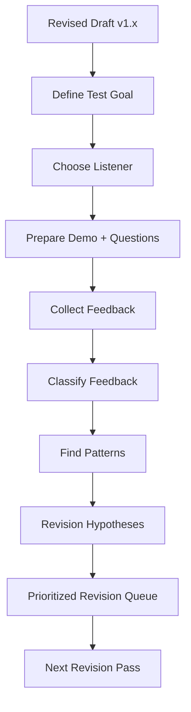
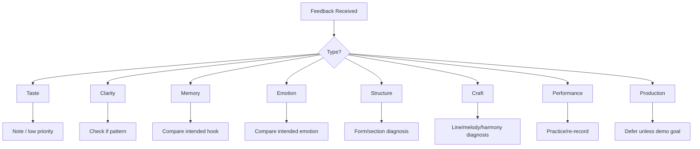

# learn-songwriting-part-028.md

# Feedback and Listener Testing: Menggunakan Telinga Orang Lain sebagai Data Tanpa Kehilangan Visi Lagu

> Seri: `learn-songwriting`  
> Part: `028 / 034`  
> Fokus: feedback design, listener testing, hook test, memory test, clarity test, emotional response, interpreting feedback, dan feedback integration  
> Status seri: belum selesai  
> Prasyarat: `learn-songwriting-part-000.md` sampai `learn-songwriting-part-027.md`

---

## Ringkasan Part Ini

Part sebelumnya membahas **Revision Methodology**: cara merevisi lagu secara sistematis dari draft lengkap.

Part ini membahas tahap berikutnya:

> **Menguji lagu ke pendengar.**

Songwriting bukan hanya soal apa yang kamu maksud. Songwriting juga soal apa yang sampai.

Kamu mungkin merasa:

```text
hook ini kuat
bridge ini jelas
metafora ini tajam
chorus ini emosional
```

Tetapi pendengar mungkin menangkap:

```text
hook-nya lupa
bridge-nya membingungkan
metaforanya terlalu abstrak
chorus-nya kurang beda dari verse
emosinya tidak sampai
```

Feedback membantu melihat gap antara:

```text
intended experience
```

dan:

```text
received experience
```

Tetapi feedback juga berbahaya jika salah dipakai.

Feedback buruk bisa membuat kamu:

- kehilangan visi;
- mengganti hal yang sebenarnya kuat;
- mengikuti selera orang yang tidak cocok;
- mengubah lagu menjadi generik;
- terlalu cepat memperbaiki production padahal masalahnya hook;
- terlalu sensitif pada komentar vague;
- menolak semua masukan karena ego terluka;
- merevisi tanpa prioritas.

Karena itu, feedback harus dirancang.

Sebagai software engineer, pikirkan feedback seperti observability.

Kamu tidak hanya bertanya:

```text
apakah aplikasi bagus?
```

Kamu mengumpulkan signal:

```text
error rate
latency
user path
drop-off
logs
trace
```

Dalam lagu, feedback signal bisa berupa:

- phrase apa yang diingat;
- kapan pendengar bosan;
- bagian mana yang terasa paling kuat;
- bagian mana yang membingungkan;
- emosi apa yang diterima;
- apakah hook bisa dinyanyikan ulang;
- apakah final chorus terasa payoff;
- apakah lirik terdengar natural;
- apakah melody terasa memorable;
- apakah chord/arrangement mengganggu vocal;
- apakah promise sampai.

Part ini mengajarkan cara meminta, membaca, dan memakai feedback secara disiplin.

---

## Tujuan Part

Setelah menyelesaikan part ini, kamu harus bisa:

1. Menentukan kapan draft siap diberi feedback.
2. Memilih orang yang tepat untuk tipe feedback tertentu.
3. Membuat pertanyaan feedback yang spesifik dan berguna.
4. Menghindari pertanyaan vague seperti “bagus nggak?”.
5. Melakukan hook memory test.
6. Melakukan clarity test.
7. Melakukan emotional response test.
8. Melakukan singability/listener repeat test.
9. Membaca feedback verbal dan non-verbal.
10. Membedakan taste, clarity, craft, dan production feedback.
11. Menyaring feedback berdasarkan song promise.
12. Mengubah feedback menjadi revision hypothesis.
13. Menghindari overfitting ke satu pendengar.
14. Membuat feedback report.
15. Membuat file latihan `songwriting-practice-028-feedback-and-listener-testing.md`.

---

## Prinsip Utama

```text
Feedback is not instruction.
Feedback is evidence.
```

Pendengar tidak selalu tahu solusi. Tetapi mereka sering bisa menunjukkan gejala.

Jika pendengar berkata:

```text
chorus-nya kurang nendang
```

Jangan langsung menyimpulkan:

```text
harus tambah drum
```

Mungkin masalahnya:

- hook kurang jelas;
- melody terlalu mirip verse;
- lyric chorus terlalu padat;
- chord tidak landing;
- vocal delivery terlalu kecil;
- chorus muncul terlalu telat;
- rhythm hook kurang repetitive.

Feedback memberi symptom.  
Songwriter harus melakukan diagnosis.

---

## Feedback dalam Pipeline Songwriting



Feedback bukan akhir dari keputusan. Feedback masuk ke sistem revisi.

---

# Bagian 1 — Kapan Meminta Feedback?

Jangan terlalu cepat. Jangan terlalu lambat.

## Terlalu Cepat

Jika kamu meminta feedback saat lagu masih hanya fragmen:

- orang menilai sesuatu yang belum punya konteks;
- feedback bisa membunuh ide terlalu dini;
- kamu mudah tergoda mengganti arah;
- pendengar bingung karena draft memang belum lengkap.

## Terlalu Lambat

Jika kamu meminta feedback setelah terlalu attach:

- kamu defensif;
- revisi besar terasa menyakitkan;
- masalah fundamental sulit diperbaiki;
- kamu sudah polish sesuatu yang salah.

## Sweet Spot

Minta feedback ketika sudah ada:

```markdown
- [ ] lyric lengkap
- [ ] hook jelas
- [ ] form jelas
- [ ] melody kasar
- [ ] chord/harmony kasar
- [ ] voice memo/demo bisa didengar dari awal sampai akhir
- [ ] kamu tahu feedback apa yang dicari
```

Untuk seri ini, feedback paling berguna setelah:

```text
First Complete Draft + minimal revision pass
```

yaitu setelah part 026–027.

---

# Bagian 2 — Siapa yang Diminta Feedback?

Tidak semua orang cocok untuk semua feedback.

## Listener Types

| Listener Type | Cocok untuk |
|---|---|
| ordinary listener | memory, emotion, clarity |
| musician | melody, chord, rhythm, performance |
| lyric-sensitive friend | language, imagery, naturalness |
| vocalist | singability, phrasing, breath |
| producer/arranger | arrangement, sonic identity |
| target audience | actual emotional reception |
| songwriter peer | structure, hook, craft |
| brutally honest friend | attention drop, confusion |
| supportive friend | early confidence, emotional response |

## Jangan Campur Semua

Jika kamu tanya musisi tentang demo kasar, mereka bisa fokus ke chord/performance.

Jika kamu tanya ordinary listener tentang chord substitution, mungkin tidak berguna.

Pilih berdasarkan test goal.

---

## Feedback Matcher

```markdown
# Feedback Matcher

## What I need to test
...

## Best listener type
...

## Why
...

## What I should not ask this person
...

## Questions to ask
...
```

---

# Bagian 3 — Jangan Tanya “Bagus Nggak?”

Pertanyaan:

```text
Bagus nggak?
```

terlalu vague.

Jawaban yang muncul:

```text
bagus kok
lumayan
kurang nendang
aku suka
aku kurang suka
```

Sulit dipakai.

## Better Questions

Untuk hook:

```text
Setelah dengar sekali, phrase apa yang kamu ingat?
```

Untuk clarity:

```text
Menurut kamu lagu ini tentang apa?
```

Untuk emotion:

```text
Emosi apa yang paling kamu rasakan?
```

Untuk form:

```text
Bagian mana yang terasa terlalu panjang?
```

Untuk bridge:

```text
Apakah bagian tengah terasa mengubah makna lagu?
```

Untuk chorus:

```text
Apakah chorus terasa berbeda dari verse?
```

Untuk lyric naturalness:

```text
Ada line yang terdengar dipaksakan atau tidak natural?
```

Untuk final payoff:

```text
Apakah chorus terakhir terasa lebih bermakna dari chorus pertama?
```

---

# Bagian 4 — Feedback Test Goals

Sebelum meminta feedback, tentukan goal.

## Common Test Goals

1. Hook memory.
2. Emotional clarity.
3. Lyric clarity.
4. Section contrast.
5. Verse 2 development.
6. Bridge turn.
7. Final chorus payoff.
8. Singability.
9. Natural language.
10. Attention/boredom.
11. Genre fit.
12. Demo intelligibility.

## Test Goal Template

```markdown
# Feedback Test Goal

## Version
...

## Main thing to test
...

## Secondary thing to test
...

## What I am not testing yet
...

## Listener type
...

## Questions
1.
2.
3.
4.
5.
```

Important:

```text
Do not test everything in one session.
```

---

# Bagian 5 — Hook Memory Test

Hook harus diingat.

## Test

Putar lagu/demo sekali.

Tanya:

```text
Phrase apa yang paling kamu ingat?
Ada bagian yang ingin kamu ulang?
Kalau lagu ini punya judul, menurut kamu judulnya apa?
Bisa kamu gumamkan bagian chorus/hook?
```

## Interpretation

Jika mereka mengingat hook yang kamu maksud:

```text
good signal
```

Jika mereka mengingat line lain:

```text
mungkin line itu lebih hooky daripada hook utama
```

Jika tidak mengingat apa pun:

```text
hook/melody/rhythm mungkin kurang kuat
```

Jika mereka mengingat object tapi bukan phrase:

```text
object hook kuat, lyric hook mungkin perlu diperkuat
```

## Hook Memory Report

```markdown
# Hook Memory Test

## Intended hook
...

## Listener remembered
...

## Suggested title from listener
...

## Could hum/sing?
...

## Signal
strong / medium / weak

## Diagnosis
...

## Revision hypothesis
...
```

---

# Bagian 6 — Clarity Test

Clarity bukan berarti semua hal harus literal.

Clarity berarti pendengar menerima emotional situation yang cukup.

## Questions

```text
Menurut kamu lagu ini tentang apa?
Siapa yang bicara?
Kepada siapa?
Apa konflik utamanya?
Ada bagian yang membingungkan?
Apakah ada line yang kamu tidak paham maksudnya?
```

## Interpretation

Jika pendengar tidak memahami detail tetapi menangkap emosi:

```text
mungkin acceptable untuk poetic song
```

Jika pendengar salah total menangkap promise:

```text
clarity issue
```

Jika hanya satu line membingungkan:

```text
line-level issue
```

Jika POV tidak jelas:

```text
POV/section issue
```

---

## Clarity Threshold

Untuk lagu puitis, tidak semua harus dijelaskan.

Tetapi minimal pendengar harus bisa merasakan:

```text
emosi utama
relasi dasar
konflik dasar
hook meaning
```

Jika tidak, lagu terlalu opaque.

---

# Bagian 7 — Emotional Response Test

Songwriting adalah pengalaman emosi.

## Questions

```text
Emosi apa yang paling terasa?
Bagian mana yang paling emosional?
Apakah ada bagian yang terasa jujur?
Apakah ada bagian yang terasa dibuat-buat?
Apakah emosinya berubah dari awal ke akhir?
Apakah akhir lagu meninggalkan rasa tertentu?
```

## Do Not Lead

Jangan tanya:

```text
apakah kamu merasa sedih?
```

Tanya:

```text
emosi apa yang kamu rasakan?
```

Jika mereka menjawab emosi berbeda dari target, itu data.

## Example

Target:

```text
tragis, sinis, intimate
```

Listener hears:

```text
marah frontal
```

Possible issue:

- lyric terlalu blunt;
- delivery terlalu aggressive;
- harmony terlalu dramatic;
- metaphor kurang romance;
- satire mask kurang kuat.

---

# Bagian 8 — Attention / Boredom Test

Pendengar mungkin tidak tahu craft, tapi mereka tahu kapan bosan.

## Questions

```text
Bagian mana yang terasa paling menarik?
Bagian mana yang terasa terlalu panjang?
Apakah ada momen kamu menunggu lagu cepat lanjut?
Apakah verse 2 terasa memberi hal baru?
Apakah bridge terasa perlu?
```

## Non-Verbal Signals

Jika live playback:

- mereka melihat HP;
- wajah kosong;
- mulai bicara;
- tidak bereaksi saat hook;
- bergerak saat chorus;
- terdiam di bridge;
- mengulang phrase setelah lagu selesai.

Catat, jangan defensif.

---

# Bagian 9 — Section Contrast Test

Part 025 membahas contrast. Sekarang tes ke listener.

## Questions

```text
Apakah kamu bisa membedakan verse dan chorus?
Bagian mana yang terasa chorus?
Apakah bridge terasa beda?
Apakah chorus terakhir terasa berbeda dari chorus sebelumnya?
```

## Interpretation

Jika pendengar tidak tahu chorus:

- hook kurang jelas;
- melody/rhythm/harmony contrast lemah;
- chorus terlalu wordy;
- form label tidak terasa.

Jika bridge tidak terasa beda:

- bridge needs contrast or cut.

---

# Bagian 10 — Final Chorus Payoff Test

Final chorus harus terasa earned.

## Questions

```text
Apakah chorus terakhir terasa lebih berat/berbeda?
Apakah ada perubahan makna di akhir?
Apakah ending terasa selesai, menggantung, atau kurang?
Bagian akhir meninggalkan rasa apa?
```

## Interpretation

If final chorus feels same:

- bridge not reframing;
- final variation too subtle;
- delivery same;
- lyric same without new context;
- harmony same without payoff.

If final chorus too dramatic:

- overdone variation;
- arrangement/delivery too big;
- lyric too explicit.

---

# Bagian 11 — Singability / Repeat Test

Lagu yang baik sering mengundang diulang.

## Questions

```text
Ada bagian yang bisa kamu ikut nyanyikan?
Bagian mana yang paling mudah diulang?
Ada kata yang terdengar susah dinyanyikan?
Apakah chorus terasa natural di mulut?
```

If listener is vocalist/musician, ask:

```text
Ada phrase yang tampak sulit dinyanyikan?
Ada napas yang terlalu panjang?
Ada stress kata yang aneh?
```

## Warning

Ordinary listener may not articulate prosody, but can say:

```text
bagian ini kok aneh
```

Use diagnosis.

---

# Bagian 12 — Lyric Naturalness Test

Untuk Bahasa Indonesia, ini penting.

## Questions

```text
Ada baris yang terdengar seperti tulisan, bukan nyanyian?
Ada kata yang terasa dipaksakan demi rima?
Ada line yang terlalu panjang?
Ada diksi yang tidak cocok dengan karakter narator?
Ada bagian yang terdengar seperti terjemahan?
```

## Interpretation

If multiple listeners mention same line:

```text
line likely needs revision
```

If one listener dislikes poetic language:

```text
could be taste
```

Compare with song promise and register.

---

# Bagian 13 — Feedback Classification

Klasifikasikan feedback.

## Types

| Type | Example | Action |
|---|---|---|
| Taste | “Aku kurang suka genre ini” | note, maybe ignore |
| Clarity | “Aku tidak paham lagu ini tentang siapa” | important |
| Memory | “Yang kuingat cuma rak kedua” | useful |
| Emotion | “Rasanya lebih marah daripada sedih” | useful |
| Structure | “Terlalu lama sebelum chorus” | important |
| Craft | “Rimanya dipaksa” | inspect |
| Performance | “Suaramu kurang yakin” | separate |
| Production | “Gitarnya kurang tebal” | defer if songwriting stage |

## Classification Template

```markdown
| Feedback | Type | Severity | Pattern? | Action |
|---|---|---:|---|---|
|  |  |  |  |  |
```

Severity:

```text
1 = minor taste
2 = small craft
3 = noticeable issue
4 = important issue
5 = P0 candidate
```

---

# Bagian 14 — Pattern vs Outlier

Satu feedback belum tentu benar. Tetapi pattern penting.

## Outlier

Satu orang berkata:

```text
aku tidak suka kata "pulang"
```

Padahal yang lain ingat hook “jangan panggil ini pulang”.

Mungkin taste.

## Pattern

Tiga orang berkata:

```text
aku tidak mengerti "rumah ini salah paham"
```

Mungkin clarity issue.

## Weighted Pattern

Feedback dari target listener lebih berat untuk emotional reception.  
Feedback dari vocalist lebih berat untuk singability.  
Feedback dari songwriter lebih berat untuk form/hook.

---

# Bagian 15 — Feedback Without Losing Vision

Jangan biarkan feedback mengubah song promise sembarangan.

Use filter:

```text
Does this feedback help the song become more itself?
Or does it pull the song into someone else's taste?
```

## Vision Filter

```markdown
# Vision Filter

## Feedback
...

## Does it align with song promise?
yes/no

## Does it clarify hook/emotion?
yes/no

## Does it solve a real pattern?
yes/no

## Does it preserve protected elements?
yes/no

## Decision
accept / test / reject / defer
```

---

# Bagian 16 — Turning Feedback into Revision Hypothesis

Feedback:

```text
chorus kurang nendang
```

Bad action:

```text
tambah drum
```

Better hypothesis:

```markdown
Symptom:
Chorus kurang nendang.

Possible causes:
- hook too buried
- melody same range as verse
- lyric too dense
- chord not landing
- vocal delivery too restrained

Hypothesis:
If I move hook to first line and make rhythm more repetitive, chorus will feel stronger.

Test:
Record chorus A/B.
```

Feedback harus menjadi hypothesis, bukan command.

---

# Bagian 17 — Feedback Report

Buat report setelah 3–5 listener.

## Feedback Report Template

```markdown
# Feedback Report

## Song version
...

## Test goal
...

## Listeners
1.
2.
3.

## Summary
...

## Hook memory
...

## Emotional response
...

## Clarity
...

## Structure/form
...

## Lyric naturalness
...

## Singability
...

## Patterns
1.
2.
3.

## Outliers
1.
2.

## Revision hypotheses
1.
2.
3.

## Priority changes
P0:
P1:
P2:
Defer:
```

---

# Bagian 18 — Feedback Session Script

Gunakan script agar konsisten.

## Before Playback

```text
Aku mau minta feedback spesifik, bukan sekadar bagus/jelek.
Dengarkan sekali dulu sampai selesai.
Setelah itu aku akan tanya beberapa hal.
Demo ini masih kasar, jadi fokus dulu ke lagu, bukan produksi.
```

## After Playback

Ask:

```text
1. Phrase apa yang kamu ingat?
2. Menurut kamu lagu ini tentang apa?
3. Emosi apa yang paling terasa?
4. Bagian mana yang paling kuat?
5. Bagian mana yang terasa membingungkan/terlalu panjang?
6. Apakah chorus terakhir terasa berbeda?
```

## If They Say “Bagus Kok”

Follow up:

```text
Bagian mana yang paling kamu ingat?
Kalau harus potong satu bagian, bagian mana?
Ada satu line yang terasa kurang natural?
```

---

# Bagian 19 — What Not to Ask

Avoid:

```text
Bagus nggak?
Jelectic nggak?
Menurutmu harus pakai chord apa?
Harus aku ubah apa?
Kamu suka nggak?
Ini sedih kan?
Hook-nya bagus kan?
```

These lead or confuse.

Better:

```text
Apa yang kamu ingat?
Apa yang kamu rasakan?
Bagian mana yang paling jelas?
Bagian mana yang kurang jelas?
```

---

# Bagian 20 — Feedback for AI-Generated Demo

Jika demo dibuat dengan AI music generator, pisahkan:

## Songwriting Feedback

- lyric;
- hook;
- melody;
- form;
- emotional clarity;
- section contrast;
- final payoff.

## Generation/Production Feedback

- vocal artifact;
- pronunciation error;
- robotic timing;
- instrument choice;
- mix;
- style mismatch;
- arrangement.

Jangan mengubah lagu jika masalahnya hanya AI vocal artifact.

## AI Demo Feedback Note

```markdown
This is an AI rough demo. Please focus on:
- hook
- lyric clarity
- emotional arc
- section contrast

Ignore:
- vocal artifacts
- mix quality
- pronunciation glitches unless they affect lyric comprehension
```

---

# Bagian 21 — Feedback Ethics and Emotional Safety

Lagu bisa personal. Feedback bisa terasa menyerang.

Prinsip:

```text
You are not your draft.
```

Feedback pada lagu bukan feedback pada harga dirimu.

Saat menerima feedback:

- dengarkan;
- catat;
- jangan debat dulu;
- tanya klarifikasi;
- jangan langsung menjelaskan maksud;
- lihat pattern nanti.

## Good Response

```text
Menarik. Bagian mana yang membuatmu merasa begitu?
```

## Bad Response

```text
Sebenarnya maksudku bukan begitu, kamu salah paham.
```

Jika listener salah paham, itu data. Nanti kamu putuskan apakah perlu diperbaiki.

---

# Bagian 22 — Interpreting Conflicting Feedback

Feedback sering bertentangan.

Listener A:

```text
chorus terlalu sederhana
```

Listener B:

```text
chorus paling kuat karena sederhana
```

Apa yang dilakukan?

Tanya:

- siapa target audience?
- mana yang sesuai promise?
- apakah kesederhanaan memang niat?
- apakah masalah sebenarnya melody/arrangement?
- apakah ada pattern lain?

Conflicting feedback tidak harus diselesaikan dengan kompromi.

Kadang salah satu feedback bukan untuk lagu ini.

---

# Bagian 23 — Feedback Debugging



---

# Bagian 24 — Example Feedback Report: Rindu Domestik

## Intended Hook

```text
Tak kupakai, tak kubuang.
```

## Listener Results

Listener 1 remembers:

```text
tak kupakai, tak kubuang
```

Listener 2 remembers:

```text
rak kedua
```

Listener 3 says:

```text
lagu tentang orang belum move on, tapi bridge agak terlalu menjelaskan
```

## Interpretation

- Hook works.
- Object hook also strong.
- Bridge may be too on-the-nose.

## Revision Hypothesis

```text
If bridge becomes more image-based and less explanatory, final chorus may feel more poetic while still clear.
```

## Action

Test bridge A/B.

---

# Bagian 25 — Example Feedback Report: Romansa Satir Bandara

## Intended Hook

```text
Jangan panggil ini pulang.
```

## Listener Results

Listener 1 remembers:

```text
jangan panggil ini pulang
```

Listener 2 says:

```text
aku suka perubahan sayang jadi tuan
```

Listener 3 says:

```text
aku kurang paham siapa yang dikritik, tapi rasanya seperti orang yang sering pergi dan cuma pulang buat formalitas
```

## Interpretation

- Hook works.
- Address shift works.
- Indirect critique works if target is ambiguity.
- If political specificity desired, verse 2 could sharpen stakes.
- If subtlety desired, keep.

## Revision Hypothesis

```text
Keep hook and address shift. Improve verse 2 stakes with domestic image, not direct political line.
```

---

# Bagian 26 — Listener Testing Matrix

Gunakan matrix ini.

```markdown
# Listener Testing Matrix

| Listener | Type | Hook remembered | Emotion received | Clarity | Boredom point | Strongest part | Weakest part |
|---|---|---|---|---|---|---|---|
|  | ordinary / musician / lyric / vocalist |  |  |  |  |  |  |
```

After 3 listeners, look for patterns.

---

# Bagian 27 — Revision Decision from Feedback

After report, decide:

## Accept

Feedback clearly points to issue aligned with promise.

## Test

Feedback plausible but uncertain.

## Reject

Feedback is taste mismatch or pulls away from promise.

## Defer

Feedback valid but belongs to production/later stage.

## Decision Template

```markdown
| Feedback Pattern | Decision | Revision Hypothesis | Priority |
|---|---|---|---|
|  | accept/test/reject/defer |  | P0/P1/P2/P3 |
```

---

# Bagian 28 — Latihan Utama Part 028

Buat file:

```text
songwriting-practice-028-feedback-and-listener-testing.md
```

Isi template berikut.

```markdown
# songwriting-practice-028-feedback-and-listener-testing.md

## 1. Song Version
Title:
Version:
Voice memo/demo:
Date:

## 2. Song Promise
...

## 3. Intended Experience
Emotion:
Hook:
Meaning:
Final aftertaste:

## 4. Feedback Test Goal
Main thing to test:
Secondary thing to test:
What I am not testing yet:

## 5. Listener Plan

| Listener | Type | Why this person | What to ask | What not to ask |
|---|---|---|---|---|
|  |  |  |  |  |

## 6. Feedback Questions

### Hook Memory
1.
2.

### Clarity
1.
2.

### Emotion
1.
2.

### Structure/Form
1.
2.

### Lyric Naturalness
1.
2.

### Final Payoff
1.
2.

## 7. Feedback Session Notes

### Listener 1
Type:
Hook remembered:
Song meaning received:
Emotion received:
Strongest part:
Weakest/confusing part:
Boredom point:
Comments:
Non-verbal signals:

### Listener 2
Type:
Hook remembered:
Song meaning received:
Emotion received:
Strongest part:
Weakest/confusing part:
Boredom point:
Comments:
Non-verbal signals:

### Listener 3
Type:
Hook remembered:
Song meaning received:
Emotion received:
Strongest part:
Weakest/confusing part:
Boredom point:
Comments:
Non-verbal signals:

## 8. Listener Testing Matrix

| Listener | Type | Hook remembered | Emotion received | Clarity | Boredom point | Strongest part | Weakest part |
|---|---|---|---|---|---|---|---|
|  |  |  |  |  |  |  |  |

## 9. Feedback Classification

| Feedback | Type | Severity 1-5 | Pattern? | Action |
|---|---|---:|---|---|
|  | taste / clarity / memory / emotion / structure / craft / performance / production |  |  |  |

## 10. Patterns

### Strong patterns
1.
2.
3.

### Weak patterns
1.
2.
3.

### Outliers
1.
2.
3.

## 11. Vision Filter

| Feedback | Aligns with promise? | Clarifies hook/emotion? | Preserves protected elements? | Decision |
|---|---|---|---|---|
|  |  |  |  | accept / test / reject / defer |

## 12. Revision Hypotheses

### Hypothesis 1
Feedback symptom:
Likely cause:
If I change:
Expected improvement:
Test:

### Hypothesis 2
Feedback symptom:
Likely cause:
If I change:
Expected improvement:
Test:

### Hypothesis 3
Feedback symptom:
Likely cause:
If I change:
Expected improvement:
Test:

## 13. Feedback Report Summary
Overall:
Hook:
Emotion:
Clarity:
Form:
Lyric:
Singability:
Final payoff:

## 14. Revision Priority from Feedback

### P0
1.
2.

### P1
1.
2.

### P2
1.
2.

### Defer
1.
2.

## 15. Next Action
...
```

---

# Latihan 30 Menit: Design Feedback Test

Tanpa memutar lagu dulu, buat:

- test goal;
- listener plan;
- 6 pertanyaan spesifik;
- hal yang tidak sedang diuji.

---

# Latihan 45 Menit: 3 Listener Mini-Test

Putar demo ke 3 orang.

Tanya hanya:

1. Phrase apa yang kamu ingat?
2. Lagu ini tentang apa menurutmu?
3. Emosi apa yang kamu rasakan?
4. Bagian mana paling kuat?
5. Bagian mana membingungkan/terlalu panjang?
6. Apakah ending terasa payoff?

Catat tanpa debat.

---

# Latihan 60 Menit: Feedback Report

Gabungkan feedback menjadi report:

- pattern;
- outlier;
- classification;
- revision hypothesis;
- priority.

Jangan revisi dulu sebelum report selesai.

---

# Checklist Part 028

Sebelum lanjut ke part 029, pastikan:

- [ ] Kamu tahu kapan draft siap feedback.
- [ ] Kamu memilih listener sesuai test goal.
- [ ] Kamu tidak bertanya “bagus nggak?”.
- [ ] Kamu membuat pertanyaan feedback spesifik.
- [ ] Kamu melakukan hook memory test.
- [ ] Kamu melakukan clarity test.
- [ ] Kamu melakukan emotional response test.
- [ ] Kamu melakukan structure/form test.
- [ ] Kamu mengklasifikasikan feedback.
- [ ] Kamu membedakan pattern dan outlier.
- [ ] Kamu memakai vision filter.
- [ ] Kamu mengubah feedback menjadi revision hypothesis.
- [ ] Kamu membuat feedback report.
- [ ] Kamu membuat revision priority dari feedback.
- [ ] Kamu punya next action menuju preparing demo/presentation.

---

# Output Wajib Part 028

Buat file:

```text
songwriting-practice-028-feedback-and-listener-testing.md
```

Isi minimal:

```markdown
# songwriting-practice-028-feedback-and-listener-testing.md

## Song Version
...

## Song Promise
...

## Intended Experience
...

## Feedback Test Goal
...

## Listener Plan
...

## Feedback Questions
...

## Feedback Session Notes
...

## Listener Testing Matrix
...

## Feedback Classification
...

## Patterns
...

## Vision Filter
...

## Revision Hypotheses
...

## Feedback Report Summary
...

## Revision Priority from Feedback
...

## Next Action
...
```

---

# Common Failure Modes di Part Ini

## 1. Tanya “Bagus Nggak?”

Gejala:

```text
feedback vague dan tidak bisa dipakai.
```

Solusi:

```text
tanya memory, clarity, emotion, section.
```

## 2. Meminta Feedback Terlalu Cepat

Gejala:

```text
fragmen belum bisa diuji.
```

Solusi:

```text
minimal full voice memo dulu.
```

## 3. Meminta Orang yang Salah

Gejala:

```text
tanya production ke ordinary listener, atau emotional reception ke teknisi.
```

Solusi:

```text
match listener with test goal.
```

## 4. Defensif

Gejala:

```text
menjelaskan maksud lagu setiap ada salah paham.
```

Solusi:

```text
catat salah paham sebagai data.
```

## 5. Mengikuti Semua Feedback

Gejala:

```text
lagu kehilangan identitas.
```

Solusi:

```text
vision filter.
```

## 6. Menolak Semua Feedback

Gejala:

```text
ego melindungi draft dari data.
```

Solusi:

```text
bedakan taste dan clarity pattern.
```

## 7. Overfitting ke Satu Pendengar

Gejala:

```text
mengubah lagu besar karena satu komentar.
```

Solusi:

```text
lihat pattern.
```

## 8. Mengubah Songwriting karena Production Feedback

Gejala:

```text
mengubah hook karena AI vocal terdengar aneh.
```

Solusi:

```text
pisahkan songwriting vs production.
```

## 9. Tidak Mengubah Feedback Menjadi Hypothesis

Gejala:

```text
feedback langsung jadi command.
```

Solusi:

```text
diagnosis dulu.
```

## 10. Tidak Membuat Feedback Report

Gejala:

```text
feedback tercecer dan emosional.
```

Solusi:

```text
buat report.
```

---

# Prinsip Penting

```text
The listener is not always right about the solution,
but often right about the experience.
```

Dan:

```text
Feedback should not make the song less yours.
It should help the song become more clearly itself.
```

Tugasmu bukan mematuhi semua feedback.  
Tugasmu adalah membaca data, menjaga promise, dan merevisi dengan niat.

---

# Bridge ke Part Berikutnya

Part ini membahas feedback and listener testing.

Part berikutnya, `learn-songwriting-part-029.md`, akan membahas:

```text
Demo Preparation and Presentation
```

Kita akan memperdalam:

- bagaimana menyiapkan demo sederhana;
- lyric sheet bersih;
- chord sheet bersih;
- performance notes;
- AI music prompt jika perlu;
- guide vocal;
- rough arrangement;
- file naming;
- version package;
- cara mempresentasikan lagu ke collaborator/singer/producer;
- apa yang harus dan tidak harus ada di demo awal.

Jika part ini memakai feedback sebagai data, part berikutnya menyiapkan lagu agar bisa dikomunikasikan ke orang lain atau alat produksi.

---

# Status Seri

Part ini selesai.

```text
Selesai: learn-songwriting-part-028.md
Berikutnya: learn-songwriting-part-029.md
Status seri: belum selesai
Part tersisa: 6
Target akhir seri: learn-songwriting-part-034.md
```


<!-- NAVIGATION_FOOTER -->
<div class="page-nav">
<a href="./learn-songwriting-part-027.md">⬅️ Revision Methodology: Merevisi Lagu secara Sistematis Tanpa Merusak Inti yang Sudah Hidup</a>
<a href="./index.md">📚 Kategori</a>
<a href="../../index.md">🏠 Home</a>
<a href="./learn-songwriting-part-029.md">Demo Preparation and Presentation: Menyiapkan Lagu agar Bisa Dipahami Penyanyi, Collaborator, Producer, atau AI Music Tool ➡️</a>
</div>
