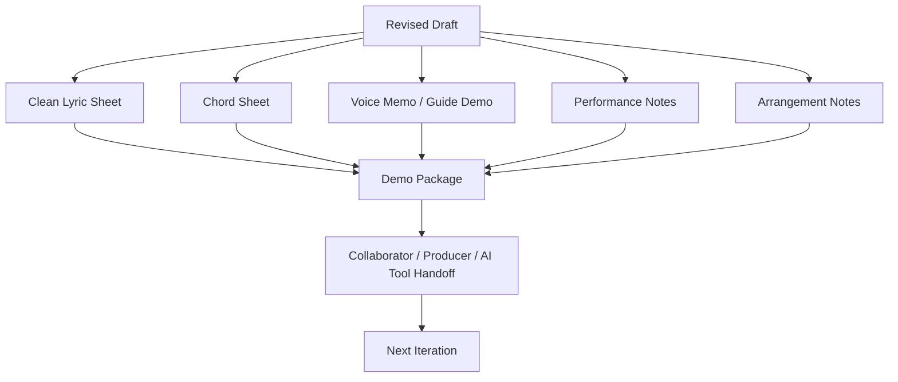
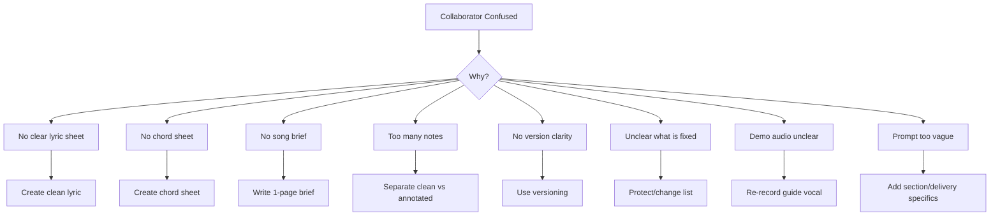

# learn-songwriting-part-029.md

# Demo Preparation and Presentation: Menyiapkan Lagu agar Bisa Dipahami Penyanyi, Collaborator, Producer, atau AI Music Tool

> Seri: `learn-songwriting`  
> Part: `029 / 034`  
> Fokus: demo package, lyric sheet, chord sheet, performance notes, guide vocal, rough arrangement, AI music prompt, file naming, collaborator handoff, dan presentation mindset  
> Status seri: belum selesai  
> Prasyarat: `learn-songwriting-part-000.md` sampai `learn-songwriting-part-028.md`

---

## Ringkasan Part Ini

Part sebelumnya membahas **Feedback and Listener Testing**: bagaimana memakai telinga orang lain sebagai data.

Part ini membahas tahap berikutnya:

> **Bagaimana menyiapkan lagu agar bisa dipahami, dimainkan, dinyanyikan, direkam, diproduksi, atau digenerate oleh tool musik.**

Banyak songwriter pemula berhenti setelah punya draft dan voice memo.

Masalahnya:

```text
lagunya ada,
tapi tidak bisa dikomunikasikan dengan jelas ke orang lain.
```

Penyanyi bingung:

```text
bagian mana chorus?
kata mana yang harus ditahan?
emosinya seperti apa?
```

Gitaris/pianis bingung:

```text
chord-nya apa?
key-nya apa?
tempo kira-kira berapa?
```

Producer bingung:

```text
referensi sound-nya apa?
arrangement naiknya di mana?
intro/outro seperti apa?
```

AI music tool bingung:

```text
section mana harus intimate?
mana yang harus cinematic?
mana dialog?
mana kutipan?
mana yang harus whispered?
mana hook?
```

Collaborator bingung:

```text
ini sudah final atau masih konsep?
bagian mana boleh diubah?
apa yang harus dipertahankan?
```

Part ini mengajarkan cara membuat **song demo package**.

Bukan demo final studio.  
Bukan production master.  
Bukan mixing-ready session.  

Targetnya:

```text
paket komunikasi yang membuat lagu bisa dipahami dan dikerjakan lebih lanjut
```

Sebagai software engineer, pikirkan ini seperti membuat:

```text
README + API contract + sample payload + run instruction
```

Bukan cukup “kodenya ada”. Orang lain harus tahu cara menjalankannya.

---

## Tujuan Part

Setelah menyelesaikan part ini, kamu harus bisa:

1. Memahami perbedaan songwriting demo, production demo, dan release-ready track.
2. Membuat demo package sederhana.
3. Membuat clean lyric sheet.
4. Membuat chord sheet yang bisa dipakai.
5. Membuat performance notes untuk vokal.
6. Membuat section-by-section arrangement notes.
7. Membuat guide vocal notes.
8. Membuat AI music generation prompt jika diperlukan.
9. Membuat collaborator handoff document.
10. Menentukan apa yang boleh diubah dan apa yang harus dilindungi.
11. Menyiapkan file naming dan version package.
12. Mempresentasikan lagu secara jelas tanpa over-explaining.
13. Membuat file latihan `songwriting-practice-029-demo-preparation-and-presentation.md`.

---

## Prinsip Utama

```text
A demo is not proof that the song is finished.
A demo is a communication artifact.
```

Demo yang baik tidak harus terdengar mahal. Demo yang baik harus menjawab:

```text
lagu ini tentang apa?
hook-nya apa?
bentuknya bagaimana?
emosinya bagaimana?
melodinya bagaimana?
chord-nya bagaimana?
bagian mana yang penting?
bagian mana yang masih terbuka?
```

Jika orang lain bisa memahami lagu dari package-mu, demo berhasil.

---

## Demo Preparation dalam Pipeline Songwriting



---

# Bagian 1 — Apa Itu Demo?

Demo adalah representasi kasar dari lagu.

Demo bisa berupa:

- voice memo acapella;
- voice + guitar/piano;
- MIDI sketch;
- AI-generated rough;
- phone recording;
- DAW rough arrangement;
- lyric + melody guide;
- chord sheet + vocal guide;
- full production mockup.

Untuk tahap ini, demo tidak harus sempurna.

## Demo yang Baik

Demo baik membuat orang paham:

- form;
- hook;
- melody;
- chord;
- emotion;
- section contrast;
- delivery;
- intended direction.

## Demo yang Buruk

Demo buruk membuat orang salah fokus:

- terlalu banyak efek;
- vocal tenggelam;
- lyric tidak jelas;
- section tidak diberi label;
- file berantakan;
- tidak ada chord/lyric sheet;
- tidak ada catatan mana yang final dan mana yang placeholder.

---

# Bagian 2 — Tiga Level Demo

## 1. Songwriting Demo

Tujuan:

```text
menguji lagu sebagai composition
```

Isi:

- vocal jelas;
- chord sederhana;
- form lengkap;
- lyric sheet;
- chord sheet;
- performance notes basic.

Tidak perlu:

- mix bagus;
- instrument lengkap;
- drum final;
- sound design.

## 2. Arrangement Demo

Tujuan:

```text
menunjukkan arah produksi/arrangement
```

Isi:

- intro/outro direction;
- instrument layers;
- dynamics;
- groove;
- build;
- reference tracks;
- ambient/sound cues.

## 3. Production Demo

Tujuan:

```text
mendekati track final
```

Isi:

- full instruments;
- guide vocal/proper vocal;
- tempo fixed;
- structure locked;
- production choices.

Untuk seri 20 jam ini, target utama:

```text
songwriting demo + basic arrangement notes
```

---

## Demo Level Decision

```markdown
# Demo Level

## Current need
- [ ] test song
- [ ] send to vocalist
- [ ] send to producer
- [ ] generate with AI
- [ ] perform live
- [ ] pitch to collaborator

## Required demo level
- [ ] songwriting demo
- [ ] arrangement demo
- [ ] production demo

## What is not needed yet
...
```

---

# Bagian 3 — Demo Package Components

Minimal package:

```text
1. Clean lyric sheet
2. Chord sheet
3. Voice memo/demo audio
4. Song brief
5. Performance notes
6. Arrangement notes
7. Version notes
```

Optional:

```text
8. AI generation prompt
9. Reference tracks
10. BPM/key guide
11. pronunciation notes
12. vocal range notes
13. feedback report summary
14. protect/change list
```

## Demo Package Folder

```text
song-title-demo-package/
  00-README.md
  01-lyric-sheet-v1.2.md
  02-chord-sheet-v1.2.md
  03-performance-notes-v1.2.md
  04-arrangement-notes-v1.2.md
  05-ai-music-prompt-v1.2.md
  audio/
    song-title-v1.2-full-demo.m4a
    song-title-v1.2-hook-guide.m4a
    song-title-v1.2-bridge-guide.m4a
  references/
    reference-notes.md
```

A clean folder reduces collaborator confusion.

---

# Bagian 4 — Song Brief

Song brief adalah ringkasan satu halaman.

## Song Brief Must Answer

```text
Apa judulnya?
Tentang apa?
Emosinya apa?
Genre/feel?
Hook-nya apa?
Form-nya apa?
Siapa narrator?
Apa yang harus dijaga?
Apa yang masih bisa diubah?
```

## Song Brief Template

```markdown
# Song Brief

## Title
...

## Version
...

## One-sentence promise
...

## Genre / Feel
...

## Emotional Keywords
...

## POV
Narrator:
Addressee:
Emotional distance:

## Main Hook
...

## Form
...

## Key / Tempo Feel
...

## What must be protected
1.
2.
3.

## What can change
1.
2.
3.

## Current biggest concern
...

## Intended next step
...
```

Song brief mencegah over-explaining lewat chat panjang.

---

# Bagian 5 — Clean Lyric Sheet

Clean lyric sheet adalah lyric yang mudah dibaca.

Jangan campur terlalu banyak catatan teknis.

## Clean Lyric Sheet Should Include

- title;
- version;
- section labels;
- lyric lines;
- repeated chorus written or marked clearly;
- final chorus variation;
- optional breath marks if important;
- optional performance notes per section, singkat.

## Clean Lyric Sheet Should Avoid

- terlalu banyak komentar;
- semua alternative lines;
- revision notes;
- diagnostic notes;
- chord if separate chord sheet exists;
- long explanation.

## Clean Lyric Sheet Template

```markdown
# <Title>
Version:
Writer:
Date:

[Verse 1]
...

[Chorus]
...

[Verse 2]
...

[Chorus]
...

[Bridge]
...

[Final Chorus]
...

[Outro]
...
```

If breath/performance matters:

```markdown
[Chorus - hold final word, do not rush]
Tak kupakai /
tak kubuang //
```

---

# Bagian 6 — Annotated Lyric Sheet

Annotated lyric sheet berbeda dari clean lyric sheet.

Gunakan untuk vocalist/AI/collaborator.

## Annotation Types

- hold word;
- whisper;
- clipped;
- breath;
- spoken;
- quote/dialogue;
- emotional note;
- dynamic note;
- pronunciation;
- syllable cut.

Example:

```markdown
[Final Chorus - colder, slower; "Tuan" clipped, pause after it]
Tuan... /
jangan panggil ini pulang //
```

## Annotation Rule

```text
Annotate only what matters.
```

Jika terlalu banyak annotation, performer bingung.

---

## Annotation Symbols

```text
/     short breath
//    long breath
...   pause/silence
_     hold
>     accent
( )   softer/pickup
[ ]   section/performance note
" "   quoted speech/dialogue
```

Example:

```text
>Tak ku->PA_kai /
>tak ku->BU_ang //
```

Use sparingly.

---

# Bagian 7 — Chord Sheet

Chord sheet harus playable.

## Must Include

- title;
- key;
- capo if guitar;
- tempo feel;
- time feel;
- form;
- progression per section;
- lyrics with chords;
- hard changes note;
- optional roman numeral.

## Chord Sheet Template

```markdown
# <Title> - Chord Sheet

## Metadata
Key:
Capo:
Tempo:
Feel:
Time:
Form:

## Progressions
Verse:
Pre-Chorus:
Chorus:
Bridge:
Final Chorus:

## Lyrics + Chords

[Verse 1]
Am              F
Gelasmu di rak kedua
Am              F
tak kupindah sejak Selasa

[Chorus]
Am       F
Tak kupakai
C        G
tak kubuang
```

## Common Mistake

Chord sheet terlalu kasar:

```text
Verse: Am F
Chorus: Am F C G
```

Tapi tidak jelas chord berubah di kata mana.

Untuk collaborator, chord placement matters.

---

# Bagian 8 — Performance Notes

Performance notes menjelaskan cara menyanyikan.

## Performance Dimensions

- vocal tone;
- emotion;
- dynamics;
- articulation;
- breath;
- phrasing;
- intensity;
- register;
- pronunciation;
- dialogue/quote handling.

## Performance Notes Template

```markdown
# Performance Notes

## Overall Vocal Character
...

## Emotional Arc
Verse 1:
Chorus 1:
Verse 2:
Chorus 2:
Bridge:
Final Chorus:

## Section Notes

### Verse 1
Tone:
Delivery:
Breath:
Avoid:

### Chorus
Tone:
Hook treatment:
Held words:
Avoid:

### Bridge
Tone:
Pace:
Silence:
Reveal word:

### Final Chorus
Tone:
Variation:
Final word:

## Pronunciation / Syllable Notes
...

## Must Protect
...
```

---

# Bagian 9 — Guide Vocal

Guide vocal adalah rekaman vocal referensi.

Tidak harus indah. Harus jelas.

## Guide Vocal Must Show

- melody;
- rhythm;
- phrasing;
- breath;
- hook hold;
- section energy;
- final chorus variation.

## Guide Vocal Tips

- vocal lebih keras dari instrument;
- jangan terlalu banyak reverb;
- nyanyikan lyric jelas;
- rekam section sulit terpisah jika perlu;
- sebut version;
- jangan malu-malu sampai melody tidak terdengar.

## Guide Vocal Files

```text
song-title-v1.2-full-guide-vocal.m4a
song-title-v1.2-chorus-guide-vocal.m4a
song-title-v1.2-bridge-guide-vocal.m4a
```

If sending to singer, include:

```text
full guide + isolated chorus + notes
```

---

# Bagian 10 — Arrangement Notes

Arrangement notes menjelaskan musik bergerak.

Untuk songwriting demo, cukup high-level.

## Arrangement Questions

```text
Intro ada atau tidak?
Verse 1 instrument minimal?
Chorus tambah energy?
Verse 2 tambah layer?
Bridge strip down?
Final chorus bigger or smaller?
Outro fade or hard stop?
```

## Arrangement Notes Template

```markdown
# Arrangement Notes

## Overall Direction
...

## Sonic References
...

## Instrument Palette
Primary:
Secondary:
Optional:
Avoid:

## Section Arrangement

### Intro
...

### Verse 1
...

### Chorus 1
...

### Verse 2
...

### Chorus 2
...

### Bridge
...

### Final Chorus
...

### Outro
...

## Dynamics Map
...

## Production Hooks
...

## Must Avoid
...
```

---

# Bagian 11 — Dynamics Map

Dynamics map is arrangement energy.

Use 1–10.

```markdown
| Section | Energy | Arrangement |
|---|---:|---|
| Intro | 2 | low piano / ambience |
| Verse 1 | 3 | guitar + close vocal |
| Chorus 1 | 6 | piano opens, vocal held |
| Verse 2 | 4 | add subtle pulse |
| Chorus 2 | 7 | fuller |
| Bridge | 3/8 | stripped but emotionally high |
| Final Chorus | 8 or 4 | bigger or stripped |
| Outro | 2 | fade/one line |
```

This helps producer/AI/collaborator understand dramatic shape.

---

# Bagian 12 — Reference Tracks

Reference tracks can help, but be careful.

Use references for:

- mood;
- tempo;
- vocal intimacy;
- arrangement density;
- instrument palette;
- dynamics;
- genre.

Do not say:

```text
make it exactly like this song
```

Say:

```text
I like the intimate vocal closeness of A,
the slow piano space of B,
and the dark acoustic texture of C.
```

## Reference Notes Template

```markdown
# Reference Notes

## Reference 1
Use for:
Do not copy:

## Reference 2
Use for:
Do not copy:

## Reference 3
Use for:
Do not copy:
```

---

# Bagian 13 — AI Music Prompt Preparation

Jika kamu memakai AI music generator, prompt harus jelas.

AI sering gagal jika prompt:

- terlalu puitis tapi tidak teknis;
- tidak punya section labels;
- tidak jelas vocal style;
- tidak jelas tempo;
- tidak jelas genre;
- lyric terlalu panjang;
- performance instruction bercampur kacau;
- tidak membedakan dialogue/quote;
- tidak memberi rhythm/syllable cues.

## AI Prompt Components

1. Style/genre.
2. Tempo.
3. Mood.
4. Vocal type.
5. Instrumentation.
6. Performance direction.
7. Structure.
8. Section-by-section dynamics.
9. Lyrics with section labels.
10. Pronunciation/syllable notes.
11. Production/ambient cues.
12. Avoid list.

## AI Prompt Template

```markdown
Style/Genre:
...

Tempo:
...

Mood:
...

Vocal:
...

Instrumentation:
...

Production/Ambience:
...

Structure:
...

Performance Notes:
...

Lyrics:
[Verse 1 - ...]
...

[Chorus - ...]
...

Avoid:
...
```

---

# Bagian 14 — AI Prompt Example: Dark Cinematic Ballad

```markdown
Style/Genre:
Slow cinematic dark acoustic ballad, intimate theatrical vocal, Indonesian lyrics.

Tempo:
Slow, around 65-75 BPM feel.

Mood:
Melancholic, sarcastic, restrained anger, tragic romance.

Vocal:
Male baritone, close-mic, whispered but controlled. Do not over-sing. Keep consonants clear. Hold important final vowels only.

Instrumentation:
Dark minor acoustic guitar, sparse low piano, subtle cello/pad, minimal percussion. Build only in chorus. Bridge should strip down.

Production/Ambience:
Optional distant airport ambience in intro/outro, very subtle. Do not make it noisy. No EDM beat.

Structure:
Intro - Verse 1 - Chorus - Verse 2 - Chorus - Bridge - Final Chorus - Outro.

Performance Notes:
Verse intimate and almost spoken.
Chorus firmer, hold "pulang".
Bridge stripped, exposed.
Final chorus colder; pause after "Tuan".

Lyrics:
...
```

This is clear enough for generation or collaborator.

---

# Bagian 15 — Handoff to Vocalist

Vocalist needs:

- clean lyric;
- annotated lyric;
- guide vocal;
- key/range;
- emotional notes;
- pronunciation;
- what can change;
- what must stay.

## Vocalist Handoff Template

```markdown
# Vocalist Handoff

## Song
Title:
Version:

## Vocal Goal
...

## Key / Range
...

## Guide Files
...

## Lyric Sheets
...

## Must Protect
1.
2.
3.

## Can Interpret Freely
1.
2.
3.

## Section Notes
Verse:
Chorus:
Bridge:
Final Chorus:

## Pronunciation Notes
...

## Questions for Vocalist
1.
2.
3.
```

## Important

Tell vocalist what is fixed and what is open.

Example:

```text
Please keep the rhythm of the hook, but feel free to vary verse phrasing slightly.
```

---

# Bagian 16 — Handoff to Producer/Arranger

Producer needs different information.

## Producer Needs

- song brief;
- demo audio;
- chord sheet;
- structure;
- emotional arc;
- reference notes;
- arrangement direction;
- production hooks;
- avoid list;
- deadline/scope if real project.

## Producer Handoff Template

```markdown
# Producer / Arranger Handoff

## Song Brief
...

## Demo Files
...

## Chord Sheet
...

## Structure
...

## Emotional Arc
...

## Arrangement Direction
...

## Reference Tracks
...

## Production Hooks
...

## Must Protect
...

## Open to Change
...

## Avoid
...

## Main Question for Producer
...
```

## Avoid Vague Direction

Bad:

```text
buat lebih emotional
```

Better:

```text
Verse should stay intimate. Chorus should open but not become heroic. Bridge should strip down so the reveal feels exposed.
```

---

# Bagian 17 — Handoff to Band / Session Player

Band/player needs:

- chord sheet;
- tempo;
- key;
- form;
- entry/stop cues;
- dynamics;
- repeats;
- special hits;
- ending.

## Band Handoff Minimal

```markdown
Title:
Key:
Tempo:
Feel:
Form:
Chords:
Dynamics:
Important cues:
Ending:
```

If performing live, make it practical.

---

# Bagian 18 — Handoff to Yourself

Kamu juga butuh handoff untuk diri sendiri.

Karena setelah beberapa hari, kamu lupa:

- kenapa line itu dipilih;
- apa yang harus dilindungi;
- versi mana terbaru;
- chord mana final;
- feedback mana dipakai.

README adalah self-handoff.

## README Template

```markdown
# README - <Song Title>

## Current Version
...

## Current Status
idea / draft / revised / feedback / demo package / production:

## What this song is
...

## What this song is not
...

## Latest files
Lyric:
Chord:
Demo:
Notes:

## Must protect
...

## Open issues
...

## Next action
...
```

---

# Bagian 19 — Presentation Mindset

Saat mempresentasikan lagu, jangan over-explain.

Biarkan lagu berbicara dulu.

## Bad Presentation

```text
Sebelum dengar, aku jelaskan dulu panjang ya. Jadi lagu ini sebenarnya tentang...
```

Ini mengarahkan pendengar dan bisa menutupi clarity issue.

## Better

```text
Ini demo kasar v1.2. Fokus feedback: hook, emosi, dan final chorus. Produksinya belum final.
```

Putar.

Setelah itu tanya pertanyaan spesifik.

## Presentation Script

```text
Ini demo kasar, jadi mohon fokus ke lagu, bukan kualitas rekaman.
Yang ingin aku uji:
1. apakah hook menempel,
2. apakah emosi sampai,
3. apakah final chorus terasa payoff.

Dengarkan sekali dulu sampai selesai.
```

---

# Bagian 20 — What to Send vs What Not to Send

## Send

- demo audio;
- clean lyric;
- chord sheet;
- short song brief;
- focused questions.

## Do Not Send Initially

- 15 alternate hooks;
- long diary explanation;
- full revision history;
- all failed versions;
- overly technical notes;
- huge prompt with contradictions;
- unfinished fragments unless explicitly asking ideation.

Too much context can confuse collaborator.

---

# Bagian 21 — File Naming and Versioning

Use clear names.

## File Naming

```text
<title>-lyric-v1.2.md
<title>-chord-sheet-v1.2.md
<title>-performance-notes-v1.2.md
<title>-demo-v1.2.m4a
<title>-ai-prompt-v1.2.md
```

Avoid:

```text
final-final-banget-new2-revisi-lagi.mp3
```

## Version Rules

- v1.0 = first complete draft;
- v1.1 = revision pass 1;
- v1.2 = feedback-integrated revision;
- v2.0 = major rewrite or production direction change.

---

# Bagian 22 — Demo Package Checklist

```markdown
# Demo Package Checklist

## Core
- [ ] Song brief
- [ ] Clean lyric sheet
- [ ] Chord sheet
- [ ] Full demo audio
- [ ] Performance notes
- [ ] Arrangement notes
- [ ] Version notes

## Optional
- [ ] Annotated lyric sheet
- [ ] AI music prompt
- [ ] Reference notes
- [ ] Vocalist handoff
- [ ] Producer handoff
- [ ] Feedback report summary

## Quality Check
- [ ] file names clear
- [ ] latest version obvious
- [ ] hook identified
- [ ] form clear
- [ ] key/chords clear
- [ ] what to protect clear
- [ ] what can change clear
```

---

# Bagian 23 — Example Demo Package: Rindu Domestik

## Song Brief

```markdown
Title:
Tak Kupakai, Tak Kubuang

Promise:
Rindu yang disangkal melalui benda rumah.

Genre/Feel:
Intimate acoustic ballad, bittersweet, domestic, restrained.

Hook:
Tak kupakai / tak kubuang.

Form:
V1 - C - V2 - C - B - FC - Outro.

Must Protect:
- hook phrase
- gelas/rak kedua motif
- final image "aku di rak kedua"

Open to Change:
- verse 2 wording
- bridge phrasing
- chord voicing
```

## Performance Notes

```markdown
Verse:
soft, close, almost spoken.

Chorus:
open slightly, hold "buang" and "pulang".

Bridge:
more sparse, realization, do not over-sing.

Final Chorus:
more fragile than big.
```

---

# Bagian 24 — Example Demo Package: Romansa Satir Bandara

## Song Brief

```markdown
Title:
Jangan Panggil Ini Pulang

Promise:
Kemarahan sosial yang disamarkan sebagai romansa tragis tentang kekasih berkopor.

Genre/Feel:
Slow cinematic dark ballad, sarcastic, intimate, theatrical.

Hook:
Jangan panggil ini pulang.

Form:
Intro - V1 - C - V2 - C - B - FC - Outro.

Must Protect:
- hook phrase
- airport/koper/rumah metaphor
- final address shift "Sayang" -> "Tuan"

Open to Change:
- verse 2 image
- chorus second line
- bridge compactness
```

## Arrangement Notes

```markdown
Intro:
subtle airport ambience, low piano.

Verse:
dark acoustic guitar, intimate vocal.

Chorus:
firmer vocal, sparse cinematic lift.

Bridge:
strip down, expose grief.

Final Chorus:
pause after "Tuan", colder delivery.

Outro:
airport ambience fades, no dramatic outro.
```

---

# Bagian 25 — Demo Presentation Debugging



---

# Bagian 26 — Demo Quality Minimum

Before sending, check:

```markdown
- [ ] vocal audible
- [ ] lyric readable
- [ ] chord sheet aligned
- [ ] section labels clear
- [ ] hook identified
- [ ] title/version consistent
- [ ] notes not overwhelming
- [ ] demo matches lyric version
- [ ] latest files easy to find
```

If demo audio and lyric sheet mismatch, collaborator loses trust.

---

# Bagian 27 — Latihan Utama Part 029

Buat file:

```text
songwriting-practice-029-demo-preparation-and-presentation.md
```

Isi template berikut.

```markdown
# songwriting-practice-029-demo-preparation-and-presentation.md

## 1. Demo Level Decision

### Current need
- [ ] test song
- [ ] send to vocalist
- [ ] send to producer
- [ ] generate with AI
- [ ] perform live
- [ ] pitch to collaborator

### Required demo level
- [ ] songwriting demo
- [ ] arrangement demo
- [ ] production demo

### What is not needed yet
...

## 2. Song Brief

### Title
...

### Version
...

### One-sentence promise
...

### Genre / Feel
...

### Emotional Keywords
...

### POV
Narrator:
Addressee:
Emotional distance:

### Main Hook
...

### Form
...

### Key / Tempo Feel
...

### What must be protected
1.
2.
3.

### What can change
1.
2.
3.

### Current biggest concern
...

### Intended next step
...

## 3. Clean Lyric Sheet

# <Title>
Version:
Writer:
Date:

[Intro]
...

[Verse 1]
...

[Pre-Chorus]
...

[Chorus]
...

[Verse 2]
...

[Chorus]
...

[Bridge]
...

[Final Chorus]
...

[Outro]
...

## 4. Annotated Lyric Sheet optional

Use:
/ short breath
// long breath
... pause
_ hold
> accent
[ ] section/performance note
" " quoted speech/dialogue

...

## 5. Chord Sheet

# <Title> - Chord Sheet

## Metadata
Key:
Capo:
Tempo:
Feel:
Time:
Form:

## Progressions
Verse:
Pre-Chorus:
Chorus:
Bridge:
Final Chorus:

## Lyrics + Chords
...

## 6. Performance Notes

### Overall Vocal Character
...

### Emotional Arc
Verse 1:
Chorus 1:
Verse 2:
Chorus 2:
Bridge:
Final Chorus:

### Section Notes
Verse:
Chorus:
Bridge:
Final Chorus:

### Pronunciation / Syllable Notes
...

### Must Protect
...

## 7. Arrangement Notes

### Overall Direction
...

### Instrument Palette
Primary:
Secondary:
Optional:
Avoid:

### Section Arrangement
Intro:
Verse 1:
Chorus 1:
Verse 2:
Chorus 2:
Bridge:
Final Chorus:
Outro:

### Dynamics Map

| Section | Energy 1-10 | Arrangement |
|---|---:|---|
| Intro |  |  |
| Verse 1 |  |  |
| Chorus 1 |  |  |
| Verse 2 |  |  |
| Chorus 2 |  |  |
| Bridge |  |  |
| Final Chorus |  |  |
| Outro |  |  |

## 8. Guide Vocal Files

Full demo:
Chorus guide:
Bridge guide:
Notes:

## 9. AI Music Prompt optional

Style/Genre:
...

Tempo:
...

Mood:
...

Vocal:
...

Instrumentation:
...

Production/Ambience:
...

Structure:
...

Performance Notes:
...

Lyrics:
...

Avoid:
...

## 10. Handoff Notes

### For Vocalist
...

### For Producer/Arranger
...

### For AI Tool
...

### For Myself
...

## 11. File Naming

Folder:
...

Files:
1.
2.
3.
4.
5.

## 12. Presentation Script

Before playback:
...

Feedback questions:
1.
2.
3.
4.
5.

## 13. Demo Package Checklist

## Core
- [ ] Song brief
- [ ] Clean lyric sheet
- [ ] Chord sheet
- [ ] Full demo audio
- [ ] Performance notes
- [ ] Arrangement notes
- [ ] Version notes

## Optional
- [ ] Annotated lyric sheet
- [ ] AI music prompt
- [ ] Reference notes
- [ ] Vocalist handoff
- [ ] Producer handoff
- [ ] Feedback report summary

## Quality Check
- [ ] file names clear
- [ ] latest version obvious
- [ ] hook identified
- [ ] form clear
- [ ] key/chords clear
- [ ] what to protect clear
- [ ] what can change clear

## 14. Next Action
...
```

---

# Latihan 30 Menit: Song Brief + Clean Lyric

Buat:

- song brief satu halaman;
- clean lyric sheet;
- version name.

Target:

```text
orang lain bisa paham lagu tanpa kamu menjelaskan panjang
```

---

# Latihan 45 Menit: Chord + Performance Package

Buat:

- chord sheet;
- performance notes;
- guide vocal file list;
- protect/change list.

Target:

```text
penyanyi atau pemain bisa mulai mencoba lagu
```

---

# Latihan 60 Menit: Full Demo Package

Buat folder demo package lengkap:

```text
README
lyric
chord
performance notes
arrangement notes
audio guide
AI prompt optional
```

Lalu cek apakah semua versi konsisten.

---

# Checklist Part 029

Sebelum lanjut ke part 030, pastikan:

- [ ] Kamu memahami demo sebagai communication artifact.
- [ ] Kamu menentukan demo level.
- [ ] Kamu membuat song brief.
- [ ] Kamu membuat clean lyric sheet.
- [ ] Kamu membuat chord sheet.
- [ ] Kamu membuat performance notes.
- [ ] Kamu membuat arrangement notes.
- [ ] Kamu membuat dynamics map.
- [ ] Kamu menyiapkan guide vocal/demo files.
- [ ] Kamu membuat protect/change list.
- [ ] Kamu membuat file naming/versioning jelas.
- [ ] Kamu membuat presentation script.
- [ ] Kamu membuat AI prompt jika diperlukan.
- [ ] Kamu melakukan demo package checklist.
- [ ] Kamu punya next action menuju production-aware songwriting.

---

# Output Wajib Part 029

Buat file:

```text
songwriting-practice-029-demo-preparation-and-presentation.md
```

Isi minimal:

```markdown
# songwriting-practice-029-demo-preparation-and-presentation.md

## Demo Level Decision
...

## Song Brief
...

## Clean Lyric Sheet
...

## Chord Sheet
...

## Performance Notes
...

## Arrangement Notes
...

## Guide Vocal Files
...

## AI Music Prompt optional
...

## Handoff Notes
...

## File Naming
...

## Presentation Script
...

## Demo Package Checklist
...

## Next Action
...
```

---

# Common Failure Modes di Part Ini

## 1. Demo Terlalu Mentah untuk Dikirim

Gejala:

```text
orang tidak tahu bagian mana chorus, lyric tidak jelas, audio tidak lengkap.
```

Solusi:

```text
buat clean lyric + full guide audio.
```

## 2. Terlalu Banyak Catatan

Gejala:

```text
collaborator bingung membaca 10 halaman instruksi.
```

Solusi:

```text
pisah clean sheet dan annotated sheet.
```

## 3. Tidak Ada Protect List

Gejala:

```text
collaborator mengubah hook inti.
```

Solusi:

```text
tulis what must be protected.
```

## 4. Tidak Ada Change List

Gejala:

```text
collaborator takut memberi interpretasi.
```

Solusi:

```text
tulis what can change.
```

## 5. Demo Audio Tidak Sesuai Lyric Sheet

Gejala:

```text
versi membingungkan.
```

Solusi:

```text
sync version numbers.
```

## 6. Fokus Produksi Terlalu Cepat

Gejala:

```text
sibuk sound pad sebelum lyric/hook jelas.
```

Solusi:

```text
pastikan songwriting demo dulu.
```

## 7. AI Prompt Terlalu Vague

Gejala:

```text
hasil robotic/acak.
```

Solusi:

```text
section labels + performance notes + structure jelas.
```

## 8. Presentation Terlalu Banyak Pembelaan

Gejala:

```text
kamu menjelaskan lagu sebelum diputar.
```

Solusi:

```text
brief context, then listen.
```

## 9. Tidak Ada Versioning

Gejala:

```text
final_final_revisi_baru.mp3 chaos.
```

Solusi:

```text
v1.0, v1.1, v1.2.
```

## 10. Tidak Ada Next Step

Gejala:

```text
package selesai tapi tidak tahu dipakai untuk apa.
```

Solusi:

```text
define intended next action.
```

---

# Prinsip Penting

```text
A good demo package reduces interpretation friction.
```

Dan:

```text
The clearer your handoff, the more creative freedom others can use without breaking the song.
```

Jika kamu tidak menjelaskan mana inti dan mana yang fleksibel, collaborator harus menebak.

---

# Bridge ke Part Berikutnya

Part ini membahas demo preparation and presentation.

Part berikutnya, `learn-songwriting-part-030.md`, akan membahas:

```text
Production-Aware Songwriting
```

Kita akan memahami produksi dari sudut songwriter:

- arrangement vs songwriting;
- instrumentation as emotional support;
- intro/outro decisions;
- dynamics and build;
- space/frequency awareness;
- vocal priority;
- ambient/sound design as hook;
- avoiding overproduction;
- preparing song for producer/AI;
- writing with production in mind without losing song core.

Jika part ini membuat package komunikasi, part berikutnya membantu kamu menulis lagu yang siap masuk tahap produksi tanpa menggantungkan semuanya pada produksi.

---

# Status Seri

Part ini selesai.

```text
Selesai: learn-songwriting-part-029.md
Berikutnya: learn-songwriting-part-030.md
Status seri: belum selesai
Part tersisa: 5
Target akhir seri: learn-songwriting-part-034.md
```


<!-- NAVIGATION_FOOTER -->
<div class="page-nav">
<a href="./learn-songwriting-part-028.md">⬅️ Feedback and Listener Testing: Menggunakan Telinga Orang Lain sebagai Data Tanpa Kehilangan Visi Lagu</a>
<a href="./index.md">📚 Kategori</a>
<a href="../../index.md">🏠 Home</a>
<a href="./learn-songwriting-part-030.md">Aware Songwriting: Menulis Lagu yang Siap Diproduksi tanpa Menggantungkan Kekuatan Lagu pada Produksi ➡️</a>
</div>
