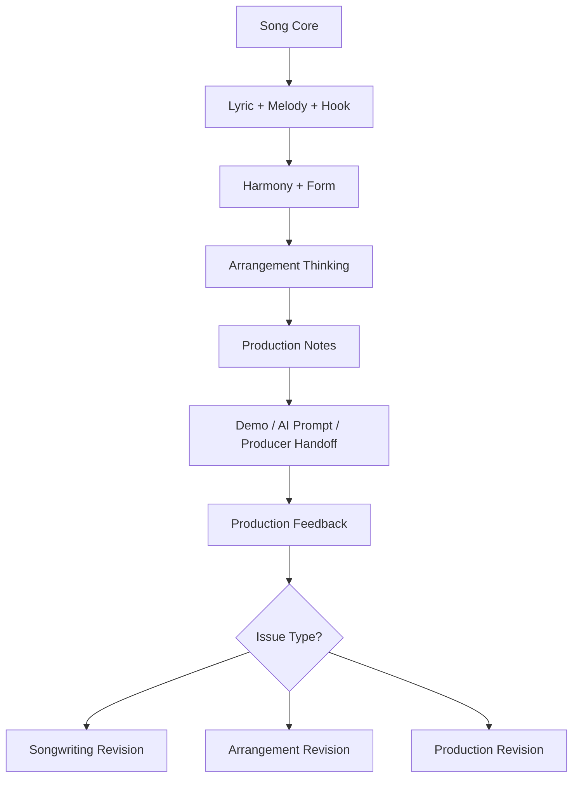
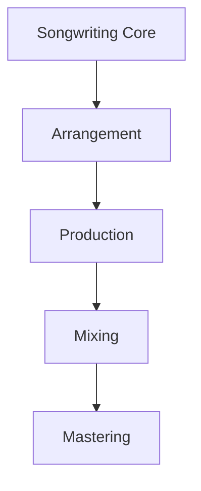
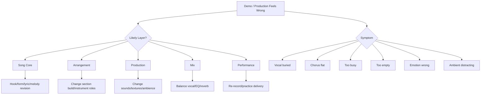

# learn-songwriting-part-030.md

# Production-Aware Songwriting: Menulis Lagu yang Siap Diproduksi tanpa Menggantungkan Kekuatan Lagu pada Produksi

> Seri: `learn-songwriting`  
> Part: `030 / 034`  
> Fokus: production-aware writing, arrangement thinking, dynamics, instrument role, vocal priority, space, sonic hook, ambient, demo-to-production handoff, dan anti-overproduction  
> Status seri: belum selesai  
> Prasyarat: `learn-songwriting-part-000.md` sampai `learn-songwriting-part-029.md`

---

## Ringkasan Part Ini

Part sebelumnya membahas **Demo Preparation and Presentation**: bagaimana menyiapkan lyric sheet, chord sheet, performance notes, arrangement notes, dan demo package agar lagu bisa dikomunikasikan ke penyanyi, producer, collaborator, atau AI music tool.

Part ini membahas:

> **Bagaimana menulis lagu dengan kesadaran produksi, tanpa membuat produksi menjadi penopang utama lagu.**

Ini penting.

Banyak songwriter pemula berpikir:

```text
nanti kalau sudah diproduksi, lagunya akan bagus
```

Kadang benar, tetapi berbahaya.

Produksi bisa memperkuat lagu.  
Produksi bisa memberi warna, tekstur, drama, groove, dan cinematic impact.  
Tetapi produksi tidak bisa selalu menyelamatkan:

- hook yang lemah;
- chorus yang tidak memorable;
- lirik yang tidak natural;
- melody yang tidak punya shape;
- form yang datar;
- bridge yang tidak punya turn;
- song promise yang kabur.

Production-aware songwriting berarti kamu menulis dengan memahami:

```text
apa yang nanti bisa diperkuat oleh produksi
dan apa yang harus sudah kuat di level lagu
```

Lagu yang baik biasanya tetap punya inti saat dimainkan sederhana:

```text
voice + satu chord instrument
```

Tetapi lagu yang production-aware juga tahu:

- kapan instrument masuk;
- kapan harus kosong;
- kapan vocal harus dekat;
- kapan chorus harus terbuka;
- kapan bridge harus strip down;
- kapan ambient bisa jadi hook;
- kapan sound effect mendukung metaphor;
- kapan terlalu banyak layer justru merusak lyric;
- kapan produksi harus menahan diri.

Sebagai software engineer, pikirkan produksi seperti infrastructure dan UI layer.

Core domain logic harus benar dulu.

```text
Songwriting = domain logic
Arrangement = application flow
Production = runtime environment + UI/UX
Mixing/mastering = optimization/deployment
```

Jika domain logic salah, UI cantik tidak cukup.

---

## Tujuan Part

Setelah menyelesaikan part ini, kamu harus bisa:

1. Membedakan songwriting, arrangement, production, mixing, dan mastering.
2. Memahami apa yang harus kuat sebelum produksi.
3. Memahami bagaimana produksi bisa memperkuat song promise.
4. Membuat arrangement map sederhana.
5. Menentukan instrument role per section.
6. Menggunakan dynamics dan build tanpa overproduction.
7. Menjaga vocal sebagai pusat lagu.
8. Memahami space, density, dan frequency secara praktis.
9. Menggunakan sonic hook dan ambient dengan niat.
10. Menulis production notes yang jelas untuk producer/AI.
11. Menghindari produksi yang terlalu ramai, terlalu literal, atau mengaburkan lirik.
12. Menyiapkan lagu agar production-ready secara songwriting.
13. Membuat file latihan `songwriting-practice-030-production-aware-songwriting.md`.

---

## Prinsip Utama

```text
Production should reveal the song, not replace the song.
```

Dan:

```text
If the song only works after heavy production, the song may not be working yet.
```

Tetapi ini bukan berarti produksi tidak penting.

Produksi bisa menjadi bagian artistik yang sangat kuat.  
Namun dalam 20 jam pertama belajar songwriting, kamu perlu tahu batas:

```text
song problem
arrangement problem
production problem
performance problem
mix problem
```

Jangan salah mendiagnosis.

---

## Production-Aware Songwriting dalam Pipeline



Production-aware songwriting bukan berarti langsung produksi.  
Artinya kamu tahu bagaimana lagu akan hidup di produksi.

---

# Bagian 1 — Songwriting vs Arrangement vs Production

## Songwriting

Songwriting adalah:

- lirik;
- melodi;
- harmony/chord;
- form;
- hook;
- emotional arc;
- song promise;
- section contrast.

Jika lagu dimainkan hanya dengan voice + guitar/piano, ini masih ada.

## Arrangement

Arrangement adalah cara lagu dibawakan secara musikal:

- instrument apa yang main;
- kapan masuk;
- kapan berhenti;
- rhythm pattern;
- dynamics;
- intro/outro;
- build;
- drop;
- instrumental motif;
- backing vocal placement.

## Production

Production adalah sonic realization:

- sound selection;
- recording direction;
- texture;
- ambience;
- effects;
- layering;
- editing;
- vocal processing;
- sound design;
- drum programming;
- instrument tone.

## Mixing

Mixing adalah balance:

- volume;
- EQ;
- compression;
- reverb;
- stereo;
- clarity;
- vocal placement.

## Mastering

Mastering adalah final polish untuk distribusi:

- loudness;
- tonal balance;
- consistency;
- final format.

---

## Layer Map



Jika ada masalah, cari layer-nya.

Contoh:

```text
hook tidak diingat
```

Kemungkinan songwriting/melody/rhythm problem, bukan mixing.

Contoh:

```text
vocal tidak terdengar di demo
```

Bisa production/mix problem.

Contoh:

```text
chorus tidak terasa naik
```

Bisa songwriting, arrangement, harmony, melody, atau production. Diagnosis dulu.

---

# Bagian 2 — Apa yang Harus Kuat Sebelum Produksi?

Sebelum produksi, minimal lagu harus punya:

```markdown
- [ ] song promise jelas
- [ ] hook jelas
- [ ] melody hook bisa diingat
- [ ] lyric cukup natural
- [ ] form bekerja
- [ ] chorus terasa chorus
- [ ] bridge atau final payoff punya fungsi
- [ ] chord progression mendukung vocal
- [ ] lagu bisa dinyanyikan dari awal sampai akhir
```

Jika ini belum ada, production akan cenderung menjadi kosmetik.

## Acoustic Test

Coba nyanyikan hanya dengan:

```text
voice + one instrument
```

Jika lagu benar-benar kehilangan semua daya:

- hook mungkin lemah;
- melody mungkin tidak kuat;
- lyric mungkin terlalu bergantung ambience;
- form mungkin datar.

Tapi hati-hati: beberapa genre memang production-led. Namun untuk latihan songwriting, acoustic/voice test sangat berguna.

---

## Core Strength Test

```markdown
# Core Strength Test

## Without full production:
Is hook still recognizable?
...

Is chorus still different?
...

Is emotional promise still clear?
...

Is lyric still meaningful?
...

Is melody still singable?
...

What production currently hides?
...
```

---

# Bagian 3 — Apa yang Bisa Diperkuat Produksi?

Produksi bisa memperkuat:

- mood;
- world;
- energy;
- texture;
- drama;
- contrast;
- sonic identity;
- genre fit;
- vocal intimacy;
- hook impact;
- bridge turn;
- final chorus payoff;
- metaphor domain.

Contoh:

## Rindu Domestik

Produksi bisa memperkuat:

- close vocal;
- room tone;
- soft piano;
- warm acoustic guitar;
- subtle household sound;
- silence after hook.

Tetapi hook:

```text
Tak kupakai, tak kubuang
```

harus tetap kuat tanpa itu.

## Romansa Satir Bandara

Produksi bisa memperkuat:

- airport ambience;
- distant announcement;
- rolling suitcase sound;
- dark guitar;
- lingering piano;
- low cello/pad;
- cold silence before “Tuan”.

Tetapi hook:

```text
Jangan panggil ini pulang
```

harus tetap kuat sebagai lyric/melody.

---

# Bagian 4 — Arrangement Thinking for Songwriters

Arrangement thinking menjawab:

```text
bagian ini butuh apa agar fungsi emosinya terasa?
```

Bukan:

```text
instrument apa yang keren?
```

## Section Arrangement Questions

```text
Intro: apakah perlu mood atau langsung vocal?
Verse: apakah harus minimal agar lyric jelas?
Chorus: apa yang berubah agar hook terasa?
Verse 2: apa yang ditambah agar perkembangan terasa?
Bridge: apakah harus strip down atau peak?
Final chorus: lebih besar atau lebih kecil?
Outro: perlu aftertaste atau cukup cut?
```

## Arrangement Map

```markdown
# Arrangement Map

| Section | Function | Instrument / Texture | Energy | Notes |
|---|---|---|---:|---|
| Intro | mood |  |  |  |
| Verse 1 | setup |  |  |  |
| Chorus 1 | hook |  |  |  |
| Verse 2 | development |  |  |  |
| Chorus 2 | stronger hook |  |  |  |
| Bridge | turn |  |  |  |
| Final Chorus | payoff |  |  |  |
| Outro | aftertaste |  |  |  |
```

---

# Bagian 5 — Instrument Role

Setiap instrument harus punya job.

## Common Instrument Roles

| Role | Function |
|---|---|
| harmonic bed | chord support |
| rhythmic pulse | movement/groove |
| melodic motif | identity/hook |
| bass foundation | weight/direction |
| texture/pad | atmosphere |
| counter-melody | response to vocal |
| percussion | energy/body |
| sound design | world/metaphor |
| silence | focus/tension |

Jangan menambah instrument hanya karena kosong.

Kosong bisa penting.

## Instrument Role Template

```markdown
# Instrument Role

## Instrument
...

## Section
...

## Function
...

## Should it compete with vocal?
yes/no

## When should it enter?
...

## When should it leave?
...

## Risk
...
```

---

# Bagian 6 — Vocal Priority

Dalam lyric-driven songwriting, vocal harus pusat.

Production-aware writing harus bertanya:

```text
Apakah lirik terdengar?
Apakah hook vocal jelas?
Apakah instrument mengganggu phrasing?
Apakah bridge reveal punya space?
Apakah reverb membuat kata kabur?
Apakah vocal terlalu jauh untuk lagu intim?
```

## Vocal Priority Rules

1. Jangan letakkan instrument motif ramai di atas hook lyric.
2. Jangan penuhi bridge reveal dengan layer tebal.
3. Jangan membuat verse terlalu padat jika lyric detail penting.
4. Jika vocal whispery, arrangement harus memberi ruang.
5. Jika chorus hook panjang, jangan tambahkan counter-melody yang mengganggu.
6. Jika kata penting ditahan, instrument bisa menahan juga atau diam.

---

## Vocal Priority Checklist

```markdown
- [ ] Hook lyric jelas.
- [ ] Verse words intelligible.
- [ ] Bridge reveal tidak tertutup instrument.
- [ ] Vocal tone sesuai POV.
- [ ] Reverb/delay tidak mengaburkan kata penting.
- [ ] Instrument tidak menjawab terlalu cepat setelah line penting.
- [ ] Silence dipakai untuk memberi ruang.
```

---

# Bagian 7 — Dynamics and Build

Dynamics adalah perubahan intensitas.

Bisa dari:

- volume;
- instrument count;
- vocal intensity;
- chord density;
- rhythm density;
- register;
- percussion;
- harmony tension;
- silence.

## Build Types

### Additive Build

Tambah layer sedikit demi sedikit.

```text
Verse 1: guitar
Chorus 1: guitar + piano
Verse 2: guitar + piano pulse
Chorus 2: add low strings
Final: full or stripped
```

### Contrast Build

Drop sebelum chorus lalu masuk.

```text
pre-chorus drops
chorus opens
```

### Emotional Build

Arrangement tetap sederhana, tetapi vocal/directness naik.

### Negative Build

Semakin lama semakin kosong.

Cocok untuk tragedy/collapse.

---

## Dynamics Map Template

```markdown
| Section | Sonic Energy | Emotional Energy | Dynamic Move |
|---|---:|---:|---|
| Intro |  |  |  |
| Verse 1 |  |  |  |
| Chorus 1 |  |  |  |
| Verse 2 |  |  |  |
| Chorus 2 |  |  |  |
| Bridge |  |  |  |
| Final Chorus |  |  |  |
| Outro |  |  |  |
```

---

# Bagian 8 — Space as Arrangement

Space is not absence. Space is composition.

Space memberi:

- intimacy;
- gravity;
- tension;
- lyric clarity;
- emotional aftertaste;
- cinematic feel;
- room for listener.

## Where to Use Space

- before hook;
- after hook;
- before bridge reveal;
- after title;
- before final chorus;
- after final word;
- between dialogue/address and command.

Example:

```text
Tuan... /
jangan panggil ini pulang //
```

The pause is arrangement and songwriting.

## Space Failure

Jika setiap gap diisi piano fill, string swell, drum fill, ambience, vocal adlib:

```text
lyric has no room to land
```

---

# Bagian 9 — Density

Density adalah seberapa banyak hal terjadi sekaligus.

High density:

- many instruments;
- many syllables;
- fast chord changes;
- percussion;
- counter-melodies;
- reverb/delay;
- backing vocals.

Low density:

- few elements;
- sparse rhythm;
- open space;
- simple harmony;
- exposed vocal.

## Density Rule

```text
When lyric density is high, production density should usually be lower.
When lyric is sparse, production can carry more atmosphere.
```

Example:

Verse with detailed lyric:

```text
keep arrangement minimal
```

Chorus with short hook:

```text
can add harmonic/sonic support
```

Bridge reveal:

```text
low density often stronger
```

---

# Bagian 10 — Frequency Awareness for Songwriters

You do not need mixing expertise, but know basic frequency roles.

## Practical Frequency Map

| Area | Perceived Role |
|---|---|
| low | weight, darkness, body |
| low-mid | warmth, mud risk |
| mid | vocal/lyric clarity |
| high-mid | presence, edge, bite |
| high | air, shimmer, fragility |

## Songwriter Implications

- If vocal is baritone whisper, don't crowd low-mid with too many dark instruments.
- If lyric clarity matters, leave mid space.
- If song is intimate, avoid too much bright sparkle unless intentional.
- If chorus needs lift, add air/high texture carefully.
- If bridge should feel exposed, reduce low/high layers.

This is not mixing instruction. It is arrangement awareness.

---

# Bagian 11 — Sonic Hook

Sonic hook adalah sound yang memorable.

Examples:

- piano motif;
- guitar figure;
- vocal breath;
- suitcase wheel sound;
- airport announcement;
- door click;
- phone notification;
- room tone;
- percussive object;
- synth stab;
- string swell.

Sonic hook must support song promise.

## Sonic Hook Criteria

```markdown
- [ ] connected to song world
- [ ] not distracting from vocal
- [ ] repeatable
- [ ] emotionally relevant
- [ ] not too literal/corny
- [ ] works in intro/outro or section transition
```

## Example: Airport Song

Possible sonic hooks:

```text
distant boarding announcement
rolling suitcase wheel
airport chime
low rumble
PA reverb tail
```

Risk:

```text
too literal, cheesy, noisy
```

Use subtly.

---

# Bagian 12 — Ambient and Sound Design

Ambient can create world.

But ambient should not become clutter.

## Good Ambient

- subtle;
- emotionally integrated;
- appears in meaningful places;
- does not mask vocal;
- supports metaphor;
- can return in outro.

## Bad Ambient

- too loud;
- gimmicky;
- constant;
- unrelated;
- distracting;
- replaces songwriting.

## Ambient Placement

```markdown
Intro:
introduce world

Verse:
very subtle or absent

Chorus:
usually reduce if vocal/hook needs clarity

Bridge:
use silence or symbolic return

Outro:
ambient returns as aftertaste
```

Example:

```text
airport ambience only intro/outro, maybe faint before final "Tuan"
```

---

# Bagian 13 — Production and Metaphor

Production can extend metaphor.

## Domestic Song

Metaphor domain:

```text
house, kitchen, glass, shelf
```

Production:

- close room sound;
- soft piano like empty room;
- small percussive cup sound;
- warm but lonely guitar;
- silence after object lines.

## Airport Satire

Metaphor domain:

```text
airport, suitcase, departure, public announcement, home
```

Production:

- distant airport ambience;
- suitcase wheel texture;
- announcement filtered far away;
- cold reverb in final chorus;
- music stops after “Tuan”.

## Burnout Song

Metaphor domain:

```text
machine, notification, body, light
```

Production:

- clock ticks;
- notification pulse;
- low hum;
- breath;
- glitch used sparingly.

Production should reinforce metaphor system.

---

# Bagian 14 — Intro as Promise

Intro can set promise before lyric.

But intro must not waste time.

## Intro Functions

- establish mood;
- introduce sonic hook;
- state melody motif;
- create world;
- prepare tempo;
- create tension.

## Intro Questions

```text
Does intro reveal something important?
Can it be shorter?
Does hook arrive soon enough?
Is intro just aesthetic?
Does intro sound like the song's world?
```

For MVS:

```text
0–10 seconds is often enough
```

Unless genre requires longer.

---

# Bagian 15 — Outro as Aftertaste

Outro answers:

```text
what remains after the last lyric?
```

Outro can:

- repeat hook softly;
- repeat object;
- return ambience;
- end unresolved;
- leave silence;
- fade;
- hard stop;
- final spoken word.

## Outro Examples

Domestic:

```text
di rak kedua //
masih //
```

Airport:

```text
airport ambience fades
koper pergi lagi
```

## Outro Warning

Do not add long outro if it adds no meaning.

---

# Bagian 16 — Bridge Production

Bridge is a production opportunity.

Bridge often benefits from:

- strip down;
- new texture;
- silence;
- different chord color;
- vocal close-up;
- reduced rhythm;
- one symbolic sound;
- no percussion;
- tension drone.

## Bridge Production Questions

```text
Should bridge expose the truth?
Should it feel like the mask falls?
Should it be more intimate or more explosive?
Should instruments leave?
Should ambient return?
```

Example:

```text
Final address "Tuan" works stronger if arrangement drops before it.
```

---

# Bagian 17 — Final Chorus Production

Final chorus choices:

## Bigger

- more instruments;
- higher vocal;
- backing vocals;
- stronger drums;
- harmonic lift.

Good for catharsis.

## Smaller

- stripped;
- quiet;
- vocal close;
- one instrument;
- silence.

Good for tragedy, intimacy, cold realization.

## Same but Reframed

- same arrangement, new lyric/context.

Good if bridge did enough.

## Production Question

```text
Does final chorus need to explode, collapse, or freeze?
```

Choose based on promise.

---

# Bagian 18 — Avoiding Overproduction

Overproduction happens when production adds more than song can carry.

Symptoms:

- lyric hard to hear;
- hook buried;
- too many layers;
- emotion becomes generic;
- bridge reveal loses intimacy;
- production tells listener what to feel too loudly;
- song becomes style demo, not song.

## Overproduction Fixes

- remove layers;
- reduce fills;
- keep vocal dry/close;
- simplify rhythm;
- mute competing melodies;
- use silence;
- remove unnecessary ambient;
- let hook breathe.

## Rule

```text
When in doubt, remove one layer before adding one.
```

---

# Bagian 19 — Underproduction vs Minimalism

Underproduction is not the same as minimalism.

## Minimalism

Intentional simplicity.

```text
few elements, strong focus, emotional clarity
```

## Underproduction

Insufficient support.

```text
chorus fails to lift, demo feels empty, no movement
```

Ask:

```text
Is this sparse because it serves the song?
Or because I did not decide arrangement?
```

---

# Bagian 20 — Production Notes for AI Tools

AI tools need explicit contrast and restraint.

Bad prompt:

```text
Make it cinematic and emotional.
```

Better:

```text
Verse soft and close, chorus opens but remains restrained, bridge stripped, final chorus colder with pause after "Tuan".
```

## AI Production Prompt Checklist

```markdown
- [ ] genre/style
- [ ] tempo
- [ ] vocal type
- [ ] mood
- [ ] instrument palette
- [ ] section dynamics
- [ ] hook treatment
- [ ] bridge treatment
- [ ] final chorus variation
- [ ] ambient/sound cues
- [ ] avoid list
```

## Avoid List Examples

```text
Avoid EDM beat.
Avoid cheerful pop delivery.
Avoid over-singing.
Avoid busy percussion in verse.
Avoid loud airport ambience over vocal.
Avoid changing lyric order.
Avoid robotic syllable timing.
```

---

# Bagian 21 — Production Notes for Human Producer

Human producer needs intention, not micromanagement.

Bad:

```text
put piano here, then cello here, then reverb 40%, then guitar EQ like...
```

Better:

```text
Verse should feel close and underlit. Chorus should widen slightly but not become heroic. Bridge should strip down so the reveal feels exposed. Final chorus should feel colder, not bigger.
```

Give:

- emotional goal;
- protect list;
- reference direction;
- avoid list;
- section energy.

Let producer solve sonic details.

---

# Bagian 22 — Production-Aware Lyric Writing

Production affects lyric choices too.

If production is dense, lyric should be simpler.

If vocal is whispered, consonants matter.

If tempo is slow, long lines may drag.

If ambient is present, lyric should not over-explain world.

If chorus has big production, lyric hook should be short enough to survive.

## Production-Aware Lyric Questions

```text
Will this line still be understood with music under it?
Is this phrase too long for slow tempo?
Does this word hold well?
Does this line need space after it?
Can arrangement emphasize object without lyric explaining it?
```

---

# Bagian 23 — Production-Aware Melody Writing

Melody must leave space for arrangement.

If melody is too busy:

- production has no room;
- vocal clarity suffers;
- hook less memorable.

If melody is too sparse:

- production may need motif/support;
- risk of boredom.

## Melody-Production Balance

| Melody | Production |
|---|---|
| busy melody | sparse production |
| sparse melody | texture/motif can help |
| strong hook | production supports, not competes |
| bridge reveal | production reduces |
| final long note | production may swell or drop |

---

# Bagian 24 — Production-Aware Chord Writing

Complex chords may be beautiful, but can complicate production.

For first demo:

- keep chord progression clear;
- avoid changing chord every word;
- make hook landing obvious;
- use bridge color intentionally;
- do not over-chord emotional lines.

## Chord Density Rule

```text
More chord movement = more emotional information.
Use it only where needed.
```

---

# Bagian 25 — Production-Aware Form

Form affects production.

If form too long, production must work harder to maintain attention.

If chorus too frequent, production has no build.

If bridge missing, final chorus may need production trick to feel different.

If outro too long, production must justify it.

## Form-Production Questions

```text
Where should arrangement grow?
Where should it reset?
Where should it strip?
Where should sonic hook return?
Where should final payoff happen?
```

---

# Bagian 26 — Production Diagnostics



Do not fix mix problem by rewriting hook.  
Do not fix hook problem by adding strings.

---

# Bagian 27 — Production Readiness Checklist

A song is production-ready enough when:

```markdown
- [ ] title clear
- [ ] lyric mostly stable
- [ ] hook protected
- [ ] form stable
- [ ] chord sheet exists
- [ ] melody guide exists
- [ ] performance notes exist
- [ ] arrangement direction exists
- [ ] protect/change list exists
- [ ] reference direction exists
- [ ] production avoid list exists
- [ ] unresolved songwriting issues are known
```

If P0 songwriting issues remain, do not spend too much on production.

---

# Bagian 28 — Example Production-Aware Plan: Rindu Domestik

## Song Core

```text
Tak Kupakai, Tak Kubuang
```

## Production Direction

```text
intimate domestic acoustic ballad
```

## Arrangement

| Section | Production |
|---|---|
| Intro | soft room tone or piano motif |
| Verse 1 | close vocal + sparse guitar/piano |
| Chorus 1 | piano opens, hold hook |
| Verse 2 | subtle pulse or additional harmony |
| Chorus 2 | slightly fuller |
| Bridge | strip down, vocal close |
| Final Chorus | fragile, maybe not bigger |
| Outro | one line, room tone |

## Protect

- hook phrase;
- vocal intimacy;
- domestic object world;
- final line.

## Avoid

- overdramatic strings;
- big drums;
- too much reverb;
- bright pop bounce;
- excessive fills.

---

# Bagian 29 — Example Production-Aware Plan: Romansa Satir Bandara

## Song Core

```text
Jangan Panggil Ini Pulang
```

## Production Direction

```text
slow cinematic dark ballad, tragic romance, restrained satire
```

## Arrangement

| Section | Production |
|---|---|
| Intro | distant airport ambience, low piano |
| Verse 1 | dark acoustic guitar, close baritone |
| Chorus 1 | firmer vocal, subtle cello/pad |
| Verse 2 | add low pulse, tension grows |
| Chorus 2 | slightly wider but not heroic |
| Bridge | strip down, almost spoken |
| Final Chorus | pause after "Tuan", colder delivery |
| Outro | airport ambience fades, suitcase sound optional |

## Protect

- hook phrase;
- airport/home metaphor;
- final “Tuan” address shift;
- restrained vocal.

## Avoid

- loud airport ambience;
- comedic sound effects;
- heroic orchestral swell;
- EDM drums;
- vocal over-singing;
- too literal political sound collage.

---

# Bagian 30 — Production Notes Template

```markdown
# Production-Aware Songwriting Notes

## Song Title
...

## Version
...

## Song Promise
...

## Production Goal
...

## What must work without production
1.
2.
3.

## Production should enhance
1.
2.
3.

## Instrument Palette
Primary:
Secondary:
Optional:
Avoid:

## Vocal Priority
...

## Sonic Hook
...

## Ambient / Sound Design
...

## Section Production Map

| Section | Function | Production Direction | Energy | Space Notes |
|---|---|---|---:|---|
| Intro |  |  |  |  |
| Verse 1 |  |  |  |  |
| Chorus 1 |  |  |  |  |
| Verse 2 |  |  |  |  |
| Chorus 2 |  |  |  |  |
| Bridge |  |  |  |  |
| Final Chorus |  |  |  |  |
| Outro |  |  |  |  |

## Dynamics Map
...

## Protect List
...

## Avoid List
...

## Open Questions for Producer / AI
...
```

---

# Bagian 31 — Latihan Utama Part 030

Buat file:

```text
songwriting-practice-030-production-aware-songwriting.md
```

Isi template berikut.

```markdown
# songwriting-practice-030-production-aware-songwriting.md

## 1. Song Source
Title:
Version:
Demo:
Lyric sheet:
Chord sheet:

## 2. Song Promise
...

## 3. Core Strength Test

### Without full production
Is hook still recognizable?
...

Is chorus still different?
...

Is emotional promise still clear?
...

Is lyric still meaningful?
...

Is melody still singable?
...

What production currently hides?
...

## 4. Layer Diagnosis

| Issue | Layer | Action |
|---|---|---|
|  | songwriting / arrangement / production / mix / performance |  |

## 5. Production Goal
What should production make the listener feel?
...

What should production not do?
...

## 6. Instrument Palette
Primary:
Secondary:
Optional:
Avoid:

## 7. Instrument Roles

| Instrument / Sound | Role | Section | Risk |
|---|---|---|---|
|  |  |  |  |

## 8. Vocal Priority Notes
Vocal character:
Words that must be clear:
Words to hold:
Bridge delivery:
Final chorus delivery:
Reverb/distance preference:

## 9. Sonic Hook
Main sonic hook:
Where it appears:
How subtle/loud:
Emotional purpose:
Risk:

## 10. Ambient / Sound Design
Ambient idea:
Where:
Why:
Avoid:
Should it return in outro?

## 11. Section Production Map

| Section | Function | Production Direction | Sonic Energy 1-10 | Emotional Energy 1-10 | Space Notes |
|---|---|---|---:|---:|---|
| Intro |  |  |  |  |  |
| Verse 1 |  |  |  |  |  |
| Chorus 1 |  |  |  |  |  |
| Verse 2 |  |  |  |  |  |
| Chorus 2 |  |  |  |  |  |
| Bridge |  |  |  |  |  |
| Final Chorus |  |  |  |  |  |
| Outro |  |  |  |  |  |

## 12. Dynamics Map
How does the song build?
...

Where does it strip down?
...

Where should it feel biggest?
...

Where should it feel closest?
...

## 13. Production-Aware Lyric Check
Lines that need space:
...

Lines that may be too dense:
...

Words that must remain clear:
...

Lines that production can support with sound:
...

## 14. Production-Aware Melody Check
Melody too busy anywhere?
...

Melody too sparse anywhere?
...

Hook melody protected?
...

Bridge melody space:
...

## 15. Production-Aware Chord Check
Progression too busy?
...

Hook landing clear?
...

Bridge chord color:
...

Final chorus resolved/unresolved:
...

## 16. AI / Producer Prompt Draft

Style/Genre:
...

Tempo:
...

Mood:
...

Vocal:
...

Instrumentation:
...

Production/Ambience:
...

Structure:
...

Section Dynamics:
...

Performance Notes:
...

Avoid:
...

## 17. Protect List
1.
2.
3.
4.
5.

## 18. Avoid List
1.
2.
3.
4.
5.

## 19. Production Readiness Checklist
- [ ] title clear
- [ ] lyric mostly stable
- [ ] hook protected
- [ ] form stable
- [ ] chord sheet exists
- [ ] melody guide exists
- [ ] performance notes exist
- [ ] arrangement direction exists
- [ ] protect/change list exists
- [ ] reference direction exists
- [ ] production avoid list exists
- [ ] unresolved songwriting issues are known

## 20. Next Action
...
```

---

# Latihan 30 Menit: Core vs Production

Dengar demo sederhana.

Tulis:

```markdown
Apa yang kuat tanpa produksi?
Apa yang hanya akan kuat jika diproduksi?
Apa yang tidak boleh diserahkan ke produksi?
```

Tujuan:

```text
membedakan songwriting problem dan production opportunity
```

---

# Latihan 45 Menit: Section Production Map

Isi section production map.

Pastikan:

- verse tidak menutupi lyric;
- chorus mendukung hook;
- bridge punya contrast;
- final chorus punya keputusan: bigger, smaller, or colder.

---

# Latihan 60 Menit: Production Prompt/Handoff

Buat:

- production notes;
- avoid list;
- AI/producer prompt;
- protect list;
- sonic hook plan.

Lalu cek apakah prompt terlalu vague atau terlalu micromanaging.

---

# Checklist Part 030

Sebelum lanjut ke part 031, pastikan:

- [ ] Kamu memahami songwriting vs arrangement vs production vs mixing.
- [ ] Kamu melakukan core strength test.
- [ ] Kamu membedakan song issue dan production issue.
- [ ] Kamu membuat production goal.
- [ ] Kamu membuat instrument palette.
- [ ] Kamu menentukan instrument roles.
- [ ] Kamu membuat vocal priority notes.
- [ ] Kamu menentukan sonic hook.
- [ ] Kamu menentukan ambient/sound design plan jika perlu.
- [ ] Kamu membuat section production map.
- [ ] Kamu membuat dynamics map.
- [ ] Kamu melakukan production-aware lyric check.
- [ ] Kamu melakukan production-aware melody/chord check.
- [ ] Kamu membuat protect list dan avoid list.
- [ ] Kamu membuat AI/producer prompt draft.
- [ ] Kamu punya next action menuju collaboration workflow.

---

# Output Wajib Part 030

Buat file:

```text
songwriting-practice-030-production-aware-songwriting.md
```

Isi minimal:

```markdown
# songwriting-practice-030-production-aware-songwriting.md

## Song Source
...

## Song Promise
...

## Core Strength Test
...

## Layer Diagnosis
...

## Production Goal
...

## Instrument Palette
...

## Instrument Roles
...

## Vocal Priority Notes
...

## Sonic Hook
...

## Ambient / Sound Design
...

## Section Production Map
...

## Dynamics Map
...

## Production-Aware Lyric Check
...

## Production-Aware Melody Check
...

## Production-Aware Chord Check
...

## AI / Producer Prompt Draft
...

## Protect List
...

## Avoid List
...

## Production Readiness Checklist
...

## Next Action
...
```

---

# Common Failure Modes di Part Ini

## 1. Mengira Produksi Akan Menyelamatkan Hook

Gejala:

```text
hook tidak kuat, tapi berharap aransemen besar membuatnya catchy.
```

Solusi:

```text
perbaiki hook/melody/rhythm dulu.
```

## 2. Overproduction

Gejala:

```text
terlalu banyak layer, lyric tenggelam.
```

Solusi:

```text
remove layer, prioritize vocal.
```

## 3. Ambient Terlalu Literal

Gejala:

```text
sound effect terasa gimmick.
```

Solusi:

```text
gunakan subtle, hanya di tempat bermakna.
```

## 4. Bridge Terlalu Penuh

Gejala:

```text
reveal tidak terasa karena produksi ramai.
```

Solusi:

```text
strip down.
```

## 5. Final Chorus Selalu Dibuat Lebih Besar

Gejala:

```text
ending tragis jadi terlalu heroic.
```

Solusi:

```text
pilih bigger, smaller, or colder sesuai promise.
```

## 6. Vocal Tidak Jadi Pusat

Gejala:

```text
instrument motif bersaing dengan lyric.
```

Solusi:

```text
vocal priority check.
```

## 7. Prompt AI Terlalu Vague

Gejala:

```text
hasil generik/robotic.
```

Solusi:

```text
section dynamics + avoid list + vocal notes.
```

## 8. Prompt Producer Terlalu Micromanaging

Gejala:

```text
producer tidak punya ruang interpretasi.
```

Solusi:

```text
beri emotional direction, bukan semua knob detail.
```

## 9. Mixing Problem Disangka Song Problem

Gejala:

```text
mengubah lyric karena vocal tidak terdengar.
```

Solusi:

```text
diagnose layer.
```

## 10. Tidak Ada Avoid List

Gejala:

```text
produksi bergerak ke arah yang salah.
```

Solusi:

```text
tulis avoid list eksplisit.
```

---

# Prinsip Penting

```text
Write a song strong enough to survive simplicity,
then produce it with enough intention to reveal its world.
```

Dan:

```text
Production is not decoration.
Production is emotional staging.
```

Stage yang baik membuat aktor terlihat.  
Production yang baik membuat lagu terlihat.

---

# Bridge ke Part Berikutnya

Part ini membahas production-aware songwriting.

Part berikutnya, `learn-songwriting-part-031.md`, akan membahas:

```text
Collaboration Workflow and Creative Direction
```

Kita akan memperdalam:

- bekerja dengan vocalist;
- bekerja dengan producer/arranger;
- memberi creative direction;
- menerima interpretasi;
- menjaga inti lagu;
- splitting roles;
- communication artifacts;
- revision loop kolaboratif;
- conflict resolution;
- credit and versioning;
- working with AI as collaborator;
- bagaimana software engineer bisa menjadi creative director yang jelas tanpa micromanage.

Jika part ini membuatmu sadar produksi, part berikutnya membuatmu mampu mengarahkan kolaborasi produksi dan performance.

---

# Status Seri

Part ini selesai.

```text
Selesai: learn-songwriting-part-030.md
Berikutnya: learn-songwriting-part-031.md
Status seri: belum selesai
Part tersisa: 4
Target akhir seri: learn-songwriting-part-034.md
```


<!-- NAVIGATION_FOOTER -->
<div class="page-nav">
<a href="./learn-songwriting-part-029.md">⬅️ Demo Preparation and Presentation: Menyiapkan Lagu agar Bisa Dipahami Penyanyi, Collaborator, Producer, atau AI Music Tool</a>
<a href="./index.md">📚 Kategori</a>
<a href="../../index.md">🏠 Home</a>
<a href="./learn-songwriting-part-031.md">Collaboration Workflow and Creative Direction: Bekerja dengan Vocalist, Producer, Arranger, Band, atau AI tanpa Kehilangan Inti Lagu ➡️</a>
</div>
