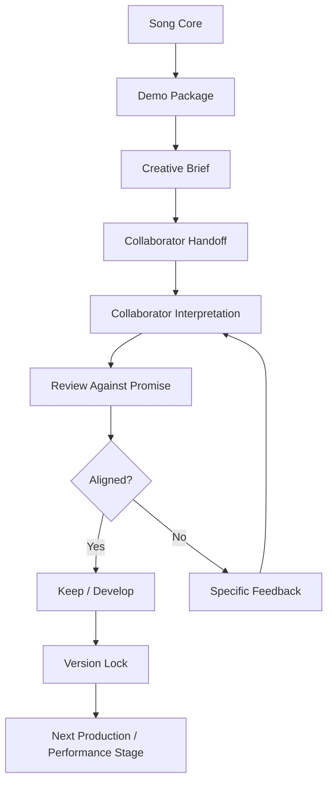
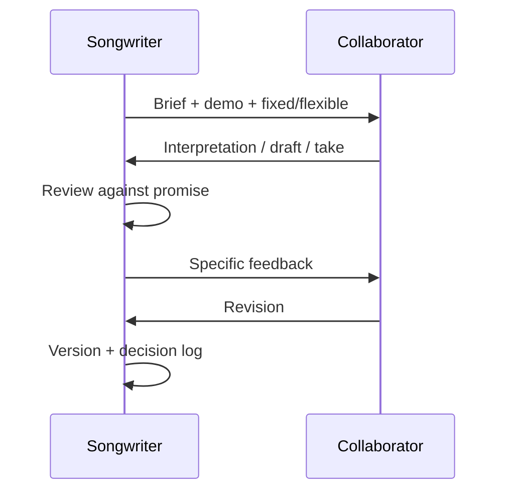

# learn-songwriting-part-031.md

# Collaboration Workflow and Creative Direction: Bekerja dengan Vocalist, Producer, Arranger, Band, atau AI tanpa Kehilangan Inti Lagu

> Seri: `learn-songwriting`  
> Part: `031 / 034`  
> Fokus: collaboration workflow, creative direction, role boundaries, vocalist/producer handoff, revision loop, conflict resolution, versioning, AI collaboration, dan menjaga song core  
> Status seri: belum selesai  
> Prasyarat: `learn-songwriting-part-000.md` sampai `learn-songwriting-part-030.md`

---

## Ringkasan Part Ini

Part sebelumnya membahas **Production-Aware Songwriting**: bagaimana menulis lagu dengan kesadaran produksi, arrangement, sonic hook, vocal priority, space, dan dynamics.

Part ini membahas:

> **Bagaimana membawa lagu ke orang lain atau tool lain tanpa kehilangan inti lagu.**

Setelah lagu punya demo package, kamu mungkin bekerja dengan:

- vocalist;
- guitarist;
- pianist;
- drummer/percussionist;
- arranger;
- producer;
- mixing engineer;
- band;
- lyric editor;
- songwriter partner;
- AI music generator;
- AI vocal tool;
- filmmaker/director jika lagu untuk project film;
- client/stakeholder jika lagu bagian dari project.

Masalah umum dalam kolaborasi kreatif:

```text
semua orang punya ide,
tetapi tidak semua ide melayani lagu.
```

Atau:

```text
songwriter terlalu micromanage,
sehingga collaborator tidak punya ruang kreatif.
```

Atau sebaliknya:

```text
songwriter terlalu pasif,
sehingga lagu berubah jauh dari promise awal.
```

Kolaborasi yang baik membutuhkan dua hal:

```text
clear creative direction
healthy creative space
```

Creative direction bukan berarti mengontrol semua detail.  
Creative direction berarti menjelaskan:

- inti lagu;
- emotional target;
- hook yang harus dijaga;
- bagian yang boleh diinterpretasi;
- bagian yang tidak boleh dirusak;
- reference direction;
- avoid list;
- decision criteria;
- revision process.

Sebagai software engineer, pikirkan creative direction seperti **technical leadership**.

TL yang buruk:

```text
mengatur setiap variable name, tetapi tidak menjelaskan architecture.
```

TL yang baik:

```text
menjelaskan design principles, constraints, acceptance criteria, dan membiarkan engineer memilih implementation detail.
```

Creative director juga begitu.

Kamu tidak perlu memberi tahu producer semua knob.  
Kamu perlu menjelaskan emotional architecture lagu.

---

## Tujuan Part

Setelah menyelesaikan part ini, kamu harus bisa:

1. Memahami role dan boundary dalam kolaborasi musik.
2. Membuat creative brief yang actionable.
3. Mengarahkan vocalist tanpa membunuh interpretasi.
4. Mengarahkan producer/arranger tanpa micromanage.
5. Menentukan apa yang fixed dan apa yang flexible.
6. Membuat collaboration contract ringan.
7. Menjalankan revision loop kolaboratif.
8. Memberi feedback kepada collaborator secara spesifik.
9. Menerima ide collaborator tanpa kehilangan song promise.
10. Mengelola konflik kreatif.
11. Bekerja dengan AI sebagai collaborator/tool.
12. Mengatur versioning, credit, dan decision log.
13. Membuat handoff package kolaboratif.
14. Membuat file latihan `songwriting-practice-031-collaboration-workflow-and-creative-direction.md`.

---

## Prinsip Utama

```text
Creative direction is not control.
Creative direction is alignment.
```

Dan:

```text
A collaborator cannot protect the song core if you never define the song core.
```

Jika kamu tidak menjelaskan inti lagu, collaborator akan menebak.  
Jika mereka menebak salah, itu bukan sepenuhnya salah mereka.

---

## Collaboration dalam Pipeline Songwriting



Kolaborasi bukan satu kali kirim file.  
Kolaborasi adalah loop.

---

# Bagian 1 — Kolaborasi Dimulai Sebelum Orang Lain Masuk

Sebelum mengajak collaborator, kamu harus tahu:

```text
apa lagu ini?
apa yang harus dijaga?
apa yang terbuka?
apa tujuan kolaborasi?
```

Jika belum tahu, kamu akan meminta orang lain menyelesaikan kebingunganmu.

Kadang itu boleh jika memang session-nya adalah ideation.  
Tetapi jika lagu sudah punya draft dan demo, beri arah.

## Pre-Collaboration Checklist

```markdown
- [ ] song promise jelas
- [ ] main hook jelas
- [ ] lyric sheet ada
- [ ] chord sheet ada
- [ ] demo audio ada
- [ ] form jelas
- [ ] protect list ada
- [ ] change list ada
- [ ] goal kolaborasi jelas
- [ ] feedback/revision process jelas
```

---

# Bagian 2 — Role dalam Kolaborasi Lagu

## Songwriter

Bertanggung jawab atas:

- song promise;
- lyric;
- melody;
- hook;
- form;
- emotional arc;
- core meaning.

## Vocalist

Bertanggung jawab atas:

- interpretation;
- phrasing;
- tone;
- articulation;
- emotional delivery;
- breath;
- dynamics;
- vocal color.

## Producer

Bertanggung jawab atas:

- sonic direction;
- arrangement realization;
- instrument texture;
- recording direction;
- production choices;
- overall track identity.

## Arranger

Bertanggung jawab atas:

- instrument parts;
- dynamics;
- section builds;
- harmony voicing;
- transitions;
- band/orchestration.

## Instrumentalist

Bertanggung jawab atas:

- playable part;
- feel;
- groove;
- tone;
- nuance.

## Mixing Engineer

Bertanggung jawab atas:

- balance;
- vocal clarity;
- EQ;
- compression;
- space;
- stereo image.

## AI Tool

Bukan manusia, tetapi dapat digunakan sebagai:

- ide generator;
- arrangement mockup;
- demo vocalist;
- style exploration;
- variation generator;
- reference sketch.

AI tidak memahami song promise secara manusiawi kecuali kamu menuliskannya dengan jelas.

---

## Role Boundary Table

| Role | Give Them | Ask From Them | Do Not Expect |
|---|---|---|---|
| Vocalist | lyric, guide, emotion | interpretation | fixing weak hook |
| Producer | brief, demo, references | sonic realization | guessing hidden intent |
| Arranger | chords, form, dynamics | parts/build | rewriting song core unless invited |
| Musician | chord sheet, feel | performance nuance | full creative direction |
| AI Tool | prompt, lyric, constraints | variations/mockups | stable artistic judgment |
| Listener | demo, questions | experience feedback | precise solutions |

---

# Bagian 3 — Fixed vs Flexible

Kolaborator perlu tahu mana yang fixed dan mana yang flexible.

## Fixed

Hal yang tidak boleh diubah tanpa diskusi:

- main hook;
- title phrase;
- core lyric line;
- POV;
- song promise;
- final payoff;
- metaphor domain;
- key emotional words;
- form if already locked.

## Flexible

Hal yang boleh dicoba:

- vocal ornament;
- verse phrasing;
- chord voicing;
- instrument texture;
- intro length;
- percussion groove;
- backing vocal;
- bridge arrangement;
- dynamics;
- tempo within range.

## Fixed/Flexible Template

```markdown
# Fixed vs Flexible

## Fixed / Protect
1.
2.
3.
4.
5.

## Flexible / Open to Interpretation
1.
2.
3.
4.
5.

## Discuss Before Changing
1.
2.
3.
```

Ini mencegah dua ekstrem:

- collaborator terlalu takut;
- collaborator terlalu bebas.

---

# Bagian 4 — Creative Brief

Creative brief adalah dokumen arahan inti.

## Creative Brief Harus Menjawab

```text
lagunya tentang apa?
emosinya apa?
genre/feel?
hook apa yang harus dijaga?
apa arc-nya?
apa reference direction?
apa avoid list?
apa yang diharapkan dari collaborator?
```

## Creative Brief Template

```markdown
# Creative Brief

## Song Title
...

## Version
...

## Current Stage
draft / revised / demo / production / vocal recording:

## One-Sentence Promise
...

## Emotional Target
...

## Genre / Feel
...

## POV / Character
...

## Main Hook
...

## Form
...

## Key / Tempo Feel
...

## References
1.
2.
3.

## Must Protect
1.
2.
3.

## Open to Explore
1.
2.
3.

## Avoid
1.
2.
3.

## What I Need From You
...

## Decision Criteria
...
```

---

# Bagian 5 — Decision Criteria

Kolaborasi sering kacau karena tidak ada kriteria keputusan.

Semua ide dinilai berdasarkan:

```text
aku suka / kamu suka
```

Padahal perlu kriteria:

```text
apakah ini memperjelas promise?
apakah hook lebih kuat?
apakah vocal lebih jujur?
apakah final chorus lebih payoff?
apakah lyric lebih terdengar?
apakah arrangement mendukung arc?
```

## Decision Criteria Template

```markdown
# Decision Criteria

A change is good if it:
- clarifies the song promise
- strengthens the hook
- protects lyric intelligibility
- supports emotional arc
- improves section contrast
- keeps the song's world consistent
- avoids overproduction

A change is bad if it:
- distracts from the vocal
- makes the emotion generic
- breaks metaphor domain
- weakens the hook
- turns restraint into melodrama
- adds complexity without function
```

Gunakan ini saat review.

---

# Bagian 6 — Working with Vocalist

Vocalist bukan hanya “penyanyi”. Vocalist adalah interpreter.

Vocalist bisa membuat lirik terasa:

- lebih jujur;
- lebih tajam;
- lebih lembut;
- lebih dingin;
- lebih fragile;
- lebih theatrical;
- lebih natural.

## What Vocalist Needs

- clean lyric sheet;
- annotated lyric sheet optional;
- guide vocal;
- key/range;
- emotional arc;
- pronunciation notes;
- hook treatment;
- fixed/flexible list.

## Vocal Direction Good vs Bad

Bad:

```text
nyanyinya lebih sedih
```

Better:

```text
Verse seperti menahan diri, hampir bicara. Chorus lebih terbuka tapi jangan menangis. Bridge dibuat lebih dekat, seperti baru berani mengaku.
```

Bad:

```text
jangan gitu, harus kayak di kepalaku
```

Better:

```text
Yang perlu dijaga adalah kata "pulang" terasa seperti tuduhan, bukan kerinduan biasa.
```

---

## Vocalist Brief Template

```markdown
# Vocalist Brief

## Song
...

## Vocal Character
...

## Emotional Arc
Verse 1:
Chorus:
Verse 2:
Bridge:
Final Chorus:

## Hook Treatment
...

## Words to Hold
...

## Words to Underplay
...

## Breath / Pause Notes
...

## Pronunciation Notes
...

## Fixed
...

## Flexible
...

## Please Try
1.
2.
3.

## Avoid
1.
2.
3.
```

---

# Bagian 7 — Giving Vocal Feedback

Saat vocalist memberi take, jangan beri feedback vague.

Bad:

```text
kurang feel
```

Better:

```text
Bagian verse sudah intimate, tapi chorus masih terlalu manis. Di hook "jangan panggil ini pulang", aku butuh lebih firm dan dingin, seperti boundary, bukan pleading.
```

Bad:

```text
terlalu lebay
```

Better:

```text
Bridge reveal jadi terasa melodramatic. Bisa dicoba lebih kecil, hampir spoken, dengan pause sebelum "kutunda"?
```

## Vocal Feedback Formula

```text
What works + what misses + why + specific request
```

Example:

```text
Verse sudah dekat dan jelas. Yang belum kena adalah final "Tuan"; saat ini masih terdengar seperti "sayang". Aku butuh lebih clipped dan formal, dengan pause setelahnya.
```

---

# Bagian 8 — Working with Producer

Producer membantu mewujudkan sonic world.

## What Producer Needs

- creative brief;
- demo audio;
- lyric/chord sheet;
- arrangement notes;
- emotional arc;
- references;
- protect/flexible list;
- avoid list;
- feedback process.

## Producer Direction Good vs Bad

Bad:

```text
buat yang cinematic
```

Better:

```text
Cinematic tapi restrained. Jangan heroic. Verse close and dark, chorus opens slightly, bridge strips down, final chorus colder rather than bigger.
```

Bad:

```text
pakai cello di sini, piano di sini, reverb segini
```

Better:

```text
Aku butuh low emotional weight di chorus tanpa menutupi vocal. Cello/pad boleh dicoba, tapi vocal hook harus tetap depan.
```

Human producer perlu ruang solusi.

---

## Producer Brief Template

```markdown
# Producer Brief

## Song Promise
...

## Production Goal
...

## Emotional Arc
...

## Sonic World
...

## References
...

## Section Direction
Intro:
Verse:
Chorus:
Verse 2:
Bridge:
Final Chorus:
Outro:

## Must Protect
...

## Open to Explore
...

## Avoid
...

## Main Concern
...

## Feedback / Review Plan
...
```

---

# Bagian 9 — Giving Producer Feedback

Feedback ke producer harus memisahkan:

- songwriting issue;
- arrangement issue;
- sound selection issue;
- mix issue;
- performance issue.

Bad:

```text
lagunya kurang sedih
```

Better:

```text
Secara arrangement, chorus sudah terbuka, tapi string swell membuatnya terasa terlalu heroic. Promise-nya lebih pahit dan restrained. Bisa chorus tetap lebih besar dari verse, tapi tanpa triumphant lift?
```

Bad:

```text
sound-nya nggak enak
```

Better:

```text
Airport ambience terlalu depan dan mengganggu lyric. Aku ingin ambience hanya sebagai distant world di intro/outro, bukan layer utama saat vocal masuk.
```

## Producer Feedback Template

```markdown
# Producer Feedback

## What works
...

## What misses the brief
...

## Layer
songwriting / arrangement / production / mix / performance:

## Specific moment
...

## Requested change
...

## What to protect
...

## Reference / comparison
...
```

---

# Bagian 10 — Working with Arranger / Band

Arranger atau band butuh clarity of form dan cues.

## Give Them

- chord sheet;
- structure;
- tempo;
- feel;
- dynamics map;
- section roles;
- entry/stop cues;
- ending;
- must protect hook.

## Band/Arranger Notes

```markdown
Verse:
keep sparse, vocal-led.

Chorus:
support hook, no busy fill under first hook line.

Bridge:
drop down, leave space.

Final:
come in after first line or remain stripped depending test.
```

## Common Problem

Band ingin mengisi semua ruang.

Creative direction:

```text
Silence is part of the arrangement. Please leave space after hook lines.
```

---

# Bagian 11 — Working with Lyric Co-Writer

Lyric collaboration sangat sensitif.

Before co-writing, define:

- song promise;
- POV;
- language register;
- metaphor domain;
- taboo words;
- must-protect lines;
- rhyme/syllable constraints;
- emotional boundary.

## Lyric Co-Writer Brief

```markdown
# Lyric Co-Writer Brief

## Song Promise
...

## POV
...

## Register
formal / intimate / sarcastic / conversational / poetic:

## Metaphor Domain
...

## Must Protect Lines
...

## Lines That Need Help
...

## Constraints
- no vulgar explicit terms
- avoid slogan
- keep Bahasa Indonesia natural
- preserve hook rhythm
...

## Need From You
...
```

This helps avoid random “beautiful” lines that break the song.

---

# Bagian 12 — Working with AI as Collaborator

AI can help generate:

- hook alternatives;
- lyric rewrites;
- rhyme options;
- syllable compression;
- metaphor alternatives;
- prompt drafts;
- arrangement ideas;
- feedback simulation;
- checklist audit.

AI should not be treated as final authority.

## Good AI Use

```text
Generate 20 alternatives preserving hook rhythm and metaphor domain.
```

```text
Audit this lyric for forced Indonesian phrasing and prosody.
```

```text
Create three production prompt variants: intimate, cinematic, stripped.
```

## Bad AI Use

```text
Make this song good.
```

Too vague.

## AI Collaboration Rule

```text
Give AI constraints and evaluate output against song promise.
```

---

## AI Prompt for Collaboration

```markdown
You are helping revise a song.

Song promise:
...

POV:
...

Main hook:
...

Metaphor domain:
...

Do not change:
...

Can change:
...

Task:
Generate 10 alternative lines for Verse 2 line 3.

Constraints:
- natural Indonesian
- singable
- 6-9 syllables
- no explicit vulgarity
- keep domestic imagery
- avoid forced rhyme
```

Specific input yields useful output.

---

# Bagian 13 — Collaboration Workflow

A simple workflow:

## Step 1 — Prepare Package

Song brief, lyric, chord, demo, notes.

## Step 2 — Set Goal

What do you need from collaborator?

```text
vocal interpretation
production direction
arrangement idea
lyric refinement
feedback
```

## Step 3 — Share Fixed/Flexible

Protect core.

## Step 4 — Receive Interpretation

Let collaborator try.

## Step 5 — Review Against Criteria

Not only taste.

## Step 6 — Give Specific Feedback

Use moment-based notes.

## Step 7 — Version

Save new version.

## Step 8 — Decide

Keep, revise, revert, combine.

---

## Collaboration Loop Diagram



---

# Bagian 14 — Revision Loop with Collaborator

Do not send chaotic feedback.

Bad:

```text
Ini bagus tapi kayak kurang, coba lebih sedih, tapi jangan terlalu sedih, terus bagian chorus mungkin lebih gede, tapi jangan gede banget.
```

Better:

```markdown
Revision goal:
Make chorus feel like a boundary, not a plea.

Keep:
- vocal closeness
- sparse verse
- pause before "Tuan"

Change:
- reduce string swell in chorus
- make final "pulang" colder/less vibrato
- lower airport ambience under vocal

Do not change:
- hook lyric
- form
- bridge drop
```

---

# Bagian 15 — Versioning in Collaboration

Use version naming.

```text
song-title-v1.2-songwriter-demo
song-title-v1.3-vocalist-take-a
song-title-v1.4-producer-rough-arrangement
song-title-v1.5-feedback-integrated
```

## Version Log

```markdown
# Version Log

| Version | Contributor | Change | Decision |
|---|---|---|---|
| v1.2 | songwriter | feedback revision | base |
| v1.3 | vocalist | vocal phrasing | keep chorus phrasing |
| v1.4 | producer | arrangement rough | revise bridge density |
```

This avoids losing work.

---

# Bagian 16 — Creative Conflict

Conflict happens.

Examples:

- producer wants bigger chorus;
- songwriter wants restrained;
- vocalist changes melody;
- lyricist wants more poetic line;
- AI output sounds catchy but breaks POV;
- stakeholder wants more obvious meaning.

## Conflict Resolution Questions

```text
What is the song promise?
Which version strengthens hook?
Which version clarifies emotion?
Which version preserves protected elements?
Which version serves target listener?
Can we A/B test?
Is this taste or function?
```

## Conflict Response

```text
I like the energy of that idea, but it changes the emotional stance from restrained accusation to heroic anger. Can we keep the lift while making it colder?
```

This accepts value while steering direction.

---

# Bagian 17 — Saying No Creatively

You need to reject ideas without killing collaboration.

Bad:

```text
nggak, itu salah
```

Better:

```text
Aku paham kenapa itu menarik. Tapi untuk lagu ini, hook harus terasa seperti luka yang ditahan, bukan ledakan. Mungkin kita bisa ambil texture-nya, tapi turunkan dramanya.
```

Formula:

```text
acknowledge value
state song need
redirect
```

---

# Bagian 18 — Accepting Collaborator Ideas

Jangan terlalu protektif.

Collaborator bisa menemukan hal lebih baik.

When to accept:

- strengthens hook;
- clarifies emotion;
- improves singability;
- adds section contrast;
- preserves promise;
- makes performance more natural;
- creates better final payoff.

Ask:

```text
Does this make the song more itself?
```

If yes, accept even if not your original idea.

---

# Bagian 19 — Credits and Ownership

Even in informal projects, be clear.

Discuss:

- lyric credit;
- melody credit;
- arrangement credit;
- production credit;
- vocal performance credit;
- revenue/splits if relevant;
- usage rights;
- permission to publish;
- AI-assisted material disclosure if needed.

This series is not legal advice, but creative collaboration benefits from clarity.

## Credit Notes Template

```markdown
# Credit Notes

## Lyric
...

## Melody
...

## Chords/Harmony
...

## Arrangement
...

## Production
...

## Vocal
...

## AI-assisted elements
...

## Pending discussion
...
```

---

# Bagian 20 — Collaboration for Film Project

User goal mentions project film context. Songwriting for film needs extra alignment.

Questions:

```text
What scene is the song for?
Is it diegetic or non-diegetic?
Does character sing it?
Is it theme song?
What emotion should scene carry?
What should audience know before/after song?
Should lyric be literal to plot or thematic?
How long does film need?
Does intro need to fit scene cut?
Can chorus repeat or must be shorter?
```

## Film Song Brief

```markdown
# Film Song Brief

## Film / Scene Context
...

## Song Function
theme / character song / montage / end credits / background:

## Narrative Moment
...

## Character POV
...

## Audience Should Feel
...

## Lyrics Should Reveal
...

## Lyrics Should Avoid Spoiling
...

## Duration Target
...

## Cue Points
...

## Collaboration Needs
...
```

If writing for film, form may be constrained by scene.

---

# Bagian 21 — Creative Direction for AI Music Tools

AI tools are prompt-sensitive.

## Direction Must Include

- style;
- tempo;
- vocal character;
- section dynamics;
- lyric formatting;
- pronunciation cues;
- avoid list;
- emotional arc;
- production constraints.

## AI Iteration Workflow

1. Prompt v1.
2. Generate 2–4 versions.
3. Evaluate against promise.
4. Keep useful parts.
5. Revise prompt.
6. Generate again.
7. Do not chase infinite variants.

## AI Evaluation Table

```markdown
| Generation | Hook clarity | Vocal emotion | Lyric pronunciation | Section contrast | Production fit | Keep? |
|---|---:|---:|---:|---:|---:|---|
| A |  |  |  |  |  |  |
| B |  |  |  |  |  |  |
```

---

# Bagian 22 — Avoiding AI Drift

AI often drifts:

- changes lyric;
- mispronounces Indonesian;
- over-sings;
- makes chorus too pop;
- ignores subtlety;
- adds busy percussion;
- makes satire comedic;
- loses section contrast;
- treats quotes/dialogue wrong.

## Anti-Drift Prompting

```text
Do not change lyric words.
Keep Indonesian pronunciation clear.
Do not over-sing.
Keep verse intimate.
Final chorus colder, not bigger.
Airport ambience subtle, not loud.
```

## If AI keeps failing

Maybe the lyric formatting is unclear.

Use:

- shorter lines;
- section labels;
- syllable breaks for hard phrases;
- explicit hold notes;
- avoid overly long lyric lines.

---

# Bagian 23 — Collaboration Review Checklist

When reviewing collaborator output:

```markdown
# Collaboration Review

## Version
...

## What works
1.
2.
3.

## What misses
1.
2.
3.

## Song promise preserved?
...

## Hook stronger/weaker?
...

## Vocal clarity?
...

## Section contrast?
...

## Production supports lyric?
...

## Protected elements intact?
...

## New idea worth keeping?
...

## Specific revision requests
1.
2.
3.
```

Always start with what works.

---

# Bagian 24 — Collaboration Anti-Patterns

## 1. No Brief

Collaborator guesses.

## 2. Over-Brief

Collaborator suffocated.

## 3. Vague Feedback

No actionable direction.

## 4. Micromanaging Implementation

You tell producer every sound detail without explaining emotion.

## 5. Passive Approval

You accept changes that break promise because you feel awkward.

## 6. Defensiveness

You reject good ideas because they are not yours.

## 7. Version Chaos

No one knows latest file.

## 8. Credit Ambiguity

Future conflict.

## 9. AI Variant Addiction

Generate endlessly, never decide.

## 10. No Decision Criteria

Taste debate never ends.

---

# Bagian 25 — Collaboration Templates Bundle

## Collaboration README

```markdown
# Collaboration README

## Song
...

## Current Version
...

## Goal of Collaboration
...

## Files
- lyric:
- chord:
- demo:
- notes:

## One-Sentence Promise
...

## Main Hook
...

## Must Protect
...

## Open to Explore
...

## Avoid
...

## Feedback Format Requested
...

## Deadline / Next Step
...
```

## Feedback Format Requested

```markdown
Please give feedback in this format:

1. What works:
2. What is unclear:
3. What feels off emotionally:
4. Specific moment:
5. Suggested direction, not necessarily solution:
```

---

# Bagian 26 — Example: Directing Vocalist for Rindu Domestik

## Brief

```text
This is an intimate domestic ballad about someone who cannot use or throw away a loved one's glass.
```

## Vocal Direction

```markdown
Verse:
soft, close, like speaking to yourself in a kitchen.

Chorus:
slightly more open, but still restrained. "Tak kupakai / tak kubuang" should feel like confession, not dramatic crying.

Bridge:
more vulnerable. Leave space before "kutunda".

Final:
fragile, almost realizing the line while singing it.
```

## Protect

- hook rhythm;
- domestic intimacy;
- final image.

## Flexible

- slight verse phrasing;
- breath placement;
- melodic nuance.

---

# Bagian 27 — Example: Directing Producer for Romansa Satir Bandara

## Brief

```text
Slow dark cinematic ballad. Tragic romance masking social critique. The song should feel intimate and bitter, not heroic or comedic.
```

## Direction

```markdown
Intro:
subtle airport ambience, low piano.

Verse:
dark acoustic guitar, close baritone vocal.

Chorus:
firmer, more accusatory, but restrained. Do not make it an anthem.

Bridge:
strip down. Let lyric expose grief.

Final:
pause after "Tuan". Colder, not bigger.

Outro:
airport ambience fades, maybe distant suitcase wheel, subtle.
```

## Avoid

- loud airport sound effects;
- triumphant strings;
- EDM beat;
- over-singing;
- comedic satire tone.

---

# Bagian 28 — Latihan Utama Part 031

Buat file:

```text
songwriting-practice-031-collaboration-workflow-and-creative-direction.md
```

Isi template berikut.

```markdown
# songwriting-practice-031-collaboration-workflow-and-creative-direction.md

## 1. Song Source
Title:
Version:
Demo:
Lyric:
Chord:
Notes:

## 2. Collaboration Goal
Who/what am I collaborating with?
- [ ] vocalist
- [ ] producer
- [ ] arranger
- [ ] band
- [ ] lyric co-writer
- [ ] AI tool
- [ ] film director/client
- [ ] other:

What do I need from them?
...

What is not needed from them?
...

## 3. Creative Brief

### Song Title
...

### Version
...

### Current Stage
...

### One-Sentence Promise
...

### Emotional Target
...

### Genre / Feel
...

### POV / Character
...

### Main Hook
...

### Form
...

### Key / Tempo Feel
...

### References
1.
2.
3.

### Must Protect
1.
2.
3.

### Open to Explore
1.
2.
3.

### Avoid
1.
2.
3.

### What I Need From You
...

### Decision Criteria
...

## 4. Fixed vs Flexible

### Fixed / Protect
1.
2.
3.
4.
5.

### Flexible / Open to Interpretation
1.
2.
3.
4.
5.

### Discuss Before Changing
1.
2.
3.

## 5. Role-Specific Brief

### Vocalist Brief optional
Vocal character:
Emotional arc:
Hook treatment:
Words to hold:
Words to underplay:
Breath/pause notes:
Pronunciation notes:
Please try:
Avoid:

### Producer Brief optional
Production goal:
Sonic world:
Section direction:
Protect:
Open:
Avoid:
Main concern:

### AI Tool Brief optional
Task:
Constraints:
Do not change:
Can change:
Evaluation criteria:

### Film/Scene Brief optional
Film/scene context:
Song function:
Character POV:
Audience should feel:
Duration target:
Cue points:

## 6. Collaboration README

## Song
...

## Current Version
...

## Goal of Collaboration
...

## Files
Lyric:
Chord:
Demo:
Notes:

## One-Sentence Promise
...

## Main Hook
...

## Must Protect
...

## Open to Explore
...

## Avoid
...

## Feedback Format Requested
...

## Deadline / Next Step
...

## 7. Revision Loop Plan

### Round 1
Expected output:
Review criteria:
Feedback format:

### Round 2
Expected output:
Review criteria:
Feedback format:

### Decision point
...

## 8. Versioning Plan

| Version | Contributor | Expected Change | Decision |
|---|---|---|---|
|  |  |  |  |

## 9. Collaboration Review Template

### Version reviewed
...

### What works
1.
2.
3.

### What misses
1.
2.
3.

### Song promise preserved?
...

### Hook stronger/weaker?
...

### Vocal clarity?
...

### Section contrast?
...

### Protected elements intact?
...

### New idea worth keeping?
...

### Specific revision requests
1.
2.
3.

## 10. Conflict / Decision Criteria

A change is good if:
1.
2.
3.

A change is bad if:
1.
2.
3.

If disagreement happens, test by:
...

## 11. Credit Notes

Lyric:
Melody:
Chords/Harmony:
Arrangement:
Production:
Vocal:
AI-assisted elements:
Pending discussion:

## 12. Next Action
...
```

---

# Latihan 30 Menit: Creative Brief

Buat creative brief satu halaman untuk lagumu.

Pastikan jelas:

- promise;
- hook;
- must protect;
- open to explore;
- avoid;
- what you need.

---

# Latihan 45 Menit: Role-Specific Handoff

Pilih satu collaborator:

- vocalist;
- producer;
- AI tool;
- lyric co-writer;
- band.

Buat handoff spesifik untuk role itu.

---

# Latihan 60 Menit: Collaboration Workflow

Buat:

- collaboration README;
- revision loop plan;
- versioning plan;
- review template;
- credit notes.

Tujuan:

```text
kolaborasi tidak kacau ketika banyak versi muncul
```

---

# Checklist Part 031

Sebelum lanjut ke part 032, pastikan:

- [ ] Kamu memahami creative direction sebagai alignment, bukan control.
- [ ] Kamu tahu role dan boundary collaborator.
- [ ] Kamu membuat fixed/flexible list.
- [ ] Kamu membuat creative brief.
- [ ] Kamu membuat decision criteria.
- [ ] Kamu membuat vocalist/producer/AI brief sesuai kebutuhan.
- [ ] Kamu membuat collaboration README.
- [ ] Kamu membuat revision loop plan.
- [ ] Kamu membuat versioning plan.
- [ ] Kamu membuat collaboration review template.
- [ ] Kamu tahu cara memberi feedback spesifik.
- [ ] Kamu tahu cara menerima/menolak ide collaborator.
- [ ] Kamu membuat credit notes awal.
- [ ] Kamu punya next action menuju building practice system and 20-hour roadmap consolidation.

---

# Output Wajib Part 031

Buat file:

```text
songwriting-practice-031-collaboration-workflow-and-creative-direction.md
```

Isi minimal:

```markdown
# songwriting-practice-031-collaboration-workflow-and-creative-direction.md

## Song Source
...

## Collaboration Goal
...

## Creative Brief
...

## Fixed vs Flexible
...

## Role-Specific Brief
...

## Collaboration README
...

## Revision Loop Plan
...

## Versioning Plan
...

## Collaboration Review Template
...

## Conflict / Decision Criteria
...

## Credit Notes
...

## Next Action
...
```

---

# Common Failure Modes di Part Ini

## 1. Tidak Ada Brief

Gejala:

```text
collaborator menebak arah lagu.
```

Solusi:

```text
creative brief.
```

## 2. Terlalu Micromanage

Gejala:

```text
kamu mengatur detail sound, tapi tidak memberi emotional direction.
```

Solusi:

```text
jelaskan target emosi dan constraints.
```

## 3. Terlalu Pasif

Gejala:

```text
lagu berubah jauh dari promise karena sungkan.
```

Solusi:

```text
fixed/flexible list.
```

## 4. Feedback Vague

Gejala:

```text
collaborator tidak tahu harus memperbaiki apa.
```

Solusi:

```text
moment-specific feedback.
```

## 5. Semua Ide Diterima

Gejala:

```text
lagu kehilangan identitas.
```

Solusi:

```text
decision criteria.
```

## 6. Semua Ide Ditolak

Gejala:

```text
kolaborasi mati, lagu tidak berkembang.
```

Solusi:

```text
ask if idea makes song more itself.
```

## 7. AI Drift

Gejala:

```text
AI mengubah lyric, tone, atau genre.
```

Solusi:

```text
prompt constraints + evaluation table.
```

## 8. Version Chaos

Gejala:

```text
tidak tahu file terbaru.
```

Solusi:

```text
versioning plan.
```

## 9. Credit Ambiguity

Gejala:

```text
konflik setelah lagu jadi.
```

Solusi:

```text
credit notes early.
```

## 10. No Review Criteria

Gejala:

```text
semua debat jadi taste.
```

Solusi:

```text
review against promise, hook, clarity, emotional arc.
```

---

# Prinsip Penting

```text
The best collaboration expands the song without dissolving it.
```

Dan:

```text
Protect the core. Invite interpretation. Review by promise.
```

Creative direction yang baik membuat collaborator lebih bebas, bukan lebih terkekang, karena mereka tahu batas aman eksplorasi.

---

# Bridge ke Part Berikutnya

Part ini membahas collaboration workflow and creative direction.

Part berikutnya, `learn-songwriting-part-032.md`, akan membahas:

```text
20-Hour Practice System and Deliberate Drills
```

Kita akan kembali ke framework Josh Kaufman secara eksplisit:

- membagi 20 jam latihan;
- latihan harian;
- deliberate practice;
- micro-drills;
- feedback loop;
- progress tracking;
- skill maintenance;
- avoiding theory trap;
- weekly schedule;
- practical output target;
- how to continue after first song.

Jika part ini membuatmu bisa berkolaborasi, part berikutnya memastikan seluruh skill songwriting ini bisa dilatih secara terukur dalam 20 jam pertama dan setelahnya.

---

# Status Seri

Part ini selesai.

```text
Selesai: learn-songwriting-part-031.md
Berikutnya: learn-songwriting-part-032.md
Status seri: belum selesai
Part tersisa: 3
Target akhir seri: learn-songwriting-part-034.md
```


<!-- NAVIGATION_FOOTER -->
<div class="page-nav">
<a href="./learn-songwriting-part-030.md">⬅️ Aware Songwriting: Menulis Lagu yang Siap Diproduksi tanpa Menggantungkan Kekuatan Lagu pada Produksi</a>
<a href="./index.md">📚 Kategori</a>
<a href="../../index.md">🏠 Home</a>
<a href="./learn-songwriting-part-032.md">Hour Practice System and Deliberate Drills: Mengubah Semua Materi Songwriting Menjadi Latihan Terukur ➡️</a>
</div>
