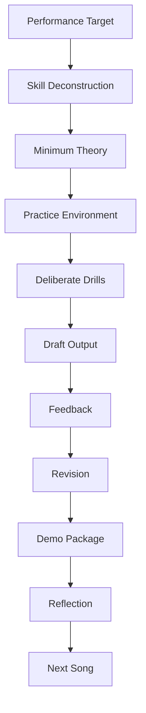
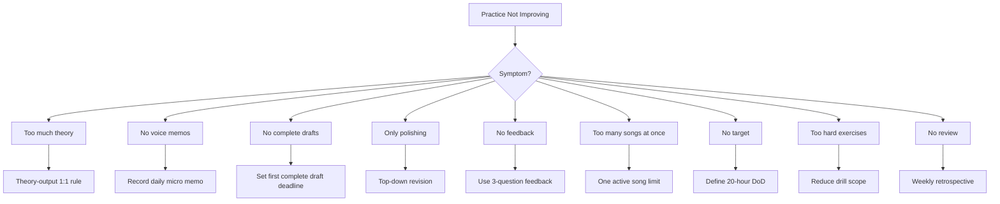

# learn-songwriting-part-032.md

# 20-Hour Practice System and Deliberate Drills: Mengubah Semua Materi Songwriting Menjadi Latihan Terukur

> Seri: `learn-songwriting`  
> Part: `032 / 034`  
> Fokus: framework *The First 20 Hours*, deliberate practice, 20-hour schedule, micro-drills, progress tracking, feedback loop, output target, dan latihan lanjutan setelah lagu pertama  
> Status seri: belum selesai  
> Prasyarat: `learn-songwriting-part-000.md` sampai `learn-songwriting-part-031.md`

---

## Ringkasan Part Ini

Part sebelumnya membahas **Collaboration Workflow and Creative Direction**: bagaimana bekerja dengan vocalist, producer, arranger, band, co-writer, atau AI tanpa kehilangan inti lagu.

Part ini kembali ke akar seri:

> **Bagaimana menerjemahkan semua materi songwriting ini menjadi sistem latihan 20 jam yang benar-benar bisa dijalankan?**

Kita menggunakan framework dari Josh Kaufman dalam *The First 20 Hours*:

1. Deconstruct the skill.
2. Learn enough to self-correct.
3. Remove practice barriers.
4. Practice at least 20 hours.

Dalam seri ini, kita sudah melakukan deconstruction sangat jauh:

- song promise;
- POV;
- emotional state;
- conflict;
- object writing;
- metaphor;
- lyric architecture;
- Indonesian lyric flow;
- rhyme;
- singability;
- repetition;
- melody;
- rhythm;
- prosody;
- hook;
- harmony;
- form;
- contrast;
- draft;
- revision;
- feedback;
- demo;
- collaboration.

Masalahnya sekarang:

```text
materi terlalu banyak
```

Jika kamu mencoba menguasai semua sekaligus, kamu akan overload.

Part ini mengubah semua materi menjadi sistem latihan.

Targetnya bukan:

```text
menjadi master songwriter dalam 20 jam
```

Targetnya:

```text
dalam 20 jam, kamu bisa menyelesaikan satu lagu utuh sederhana,
memahami kenapa ia bekerja/tidak bekerja,
dan punya sistem untuk memperbaikinya.
```

Sebagai software engineer, pikirkan ini seperti sprint learning.

Kita tidak membangun semua fitur.  
Kita menentukan MVP, backlog, metrics, feedback loop, dan delivery target.

---

## Tujuan Part

Setelah menyelesaikan part ini, kamu harus bisa:

1. Memahami ulang framework *The First 20 Hours* dalam konteks songwriting.
2. Menentukan target performance 20 jam yang realistis.
3. Membagi 20 jam menjadi fase latihan.
4. Menjalankan micro-drills untuk lyric, melody, hook, form, dan revision.
5. Menghindari theory trap dan template trap.
6. Membuat practice schedule harian.
7. Membuat progress tracker.
8. Membuat feedback loop mingguan.
9. Menentukan measurable outputs.
10. Menggunakan deliberate practice, bukan hanya “menulis kalau mood”.
11. Membangun sistem latihan setelah lagu pertama.
12. Membuat file latihan `songwriting-practice-032-20-hour-practice-system.md`.

---

## Prinsip Utama

```text
You do not learn songwriting by reading about songs.
You learn songwriting by repeatedly making small song decisions and hearing the result.
```

Dan:

```text
Practice is not time spent.
Practice is targeted attempts plus feedback.
```

Jika kamu duduk 2 jam “mencari inspirasi”, itu belum tentu practice.

Jika kamu menghabiskan 15 menit menulis 20 hook candidates, memilih 3, menyanyikan 3, dan mencatat mana yang paling kuat, itu practice.

---

## 20-Hour System dalam Pipeline



---

# Bagian 1 — Framework Josh Kaufman untuk Songwriting

Dalam *The First 20 Hours*, intinya adalah:

```text
belajar cukup untuk melakukan,
bukan belajar semua sebelum mulai.
```

Untuk songwriting:

## 1. Deconstruct the Skill

Kita sudah memecah skill menjadi sub-skill.

Namun dalam 20 jam pertama, tidak semua sama penting.

Prioritas:

1. song promise;
2. hook;
3. lyric clarity;
4. melody shape;
5. singability;
6. form;
7. first complete draft;
8. revision feedback.

## 2. Learn Enough to Self-Correct

Kamu tidak perlu teori lengkap. Kamu perlu tahu:

- kenapa hook lemah;
- kenapa line tidak natural;
- kenapa chorus tidak terasa chorus;
- kenapa melody susah dinyanyikan;
- kenapa bridge tidak turn;
- kenapa final chorus flat.

Itu cukup untuk self-correction awal.

## 3. Remove Practice Barriers

Kamu perlu environment:

- folder;
- template;
- voice memo;
- lyric notebook;
- chord reference;
- timer;
- feedback questions.

## 4. Practice at Least 20 Hours

20 jam harus menghasilkan output.

Bukan 20 jam membaca.

---

# Bagian 2 — Target Performance 20 Jam

Target yang terlalu besar:

```text
menulis lagu hit profesional
```

Tidak realistis.

Target yang terlalu kecil:

```text
menulis beberapa baris lirik
```

Kurang menantang.

## Target yang Tepat

```text
Dalam 20 jam, saya akan menyelesaikan satu lagu utuh sederhana
dengan lyric, melody kasar, chord sederhana, form lengkap,
voice memo demo, dan satu revision pass berdasarkan feedback.
```

## Definition of Done 20 Jam

```markdown
- [ ] 1 song promise jelas
- [ ] 1 main hook terpilih
- [ ] lyric lengkap
- [ ] melody kasar lengkap
- [ ] chord sheet sederhana
- [ ] form lengkap
- [ ] voice memo full demo
- [ ] minimal 1 self-revision pass
- [ ] minimal 1 feedback pass dari 1-3 listener
- [ ] demo package sederhana
- [ ] reflection report
```

---

# Bagian 3 — Apa yang Tidak Menjadi Target 20 Jam

Agar fokus, bukan target:

- mastering teori musik;
- produksi final;
- mixing;
- rilis publik;
- chord kompleks;
- aransemen full band;
- vocal performance profesional;
- menulis 10 lagu;
- membuat lirik sempurna;
- belajar semua genre;
- menguasai notasi musik;
- menjadi penyanyi hebat.

Boleh disentuh, tetapi tidak menjadi success criteria.

---

# Bagian 4 — Skill Priority Matrix

Gunakan matrix ini.

| Skill | Impact untuk Lagu Pertama | Difficulty | Priority |
|---|---:|---:|---:|
| Song promise | tinggi | sedang | P0 |
| Hook writing | tinggi | tinggi | P0 |
| Natural lyric flow | tinggi | sedang | P0 |
| Singability | tinggi | sedang | P0 |
| Melody shape | tinggi | sedang | P0 |
| Basic chord progression | sedang | rendah/sedang | P1 |
| Form | tinggi | rendah/sedang | P0 |
| Bridge writing | sedang | sedang | P1 |
| Rhyme | sedang | sedang | P1 |
| Metaphor system | tinggi | sedang/tinggi | P1 |
| Production notes | sedang | rendah | P2 |
| Collaboration | later | sedang | P2 |
| Mixing/mastering | rendah untuk songwriting | tinggi | P3 |

Untuk 20 jam pertama:

```text
P0 dulu, P1 secukupnya, P2/P3 sebagai support.
```

---

# Bagian 5 — Struktur 20 Jam

Rekomendasi pembagian:

| Fase | Jam | Fokus |
|---|---:|---|
| 0 | 0.5 | setup environment + target |
| 1 | 2 | song promise, POV, conflict |
| 2 | 3 | object writing, lyric ideas, metaphor |
| 3 | 3 | hook candidates + chorus |
| 4 | 3 | verse, lyric architecture, natural flow |
| 5 | 2.5 | melody, rhythm, prosody |
| 6 | 2 | harmony/chord + form |
| 7 | 2 | first complete draft + voice memo |
| 8 | 1 | revision pass |
| 9 | 1 | feedback + demo package reflection |

Total:

```text
20 jam
```

Ini bukan hukum. Ini starting plan.

---

## 20-Hour Roadmap Diagram

```mermaid
gantt
    title 20-Hour Songwriting Sprint
    dateFormat  X
    axisFormat %s
    section Setup
    Target + Environment :0, 1
    section Core Design
    Promise + POV + Conflict :1, 3
    section Lyric Material
    Object + Metaphor + Images :3, 6
    section Hook
    Hook Candidates + Chorus :6, 9
    section Drafting
    Verse + Form + Lyric Flow :9, 12
    section Music
    Melody + Rhythm + Chords :12, 16
    section Integration
    Full Draft + Voice Memo :16, 18
    section Improvement
    Revision + Feedback + Package :18, 20
```



---

# Bagian 6 — Detailed 20-Hour Plan

## Hour 0–0.5: Setup

Output:

```text
folder, templates, voice memo ready, target chosen
```

Tasks:

- create project folder;
- prepare `songwriting-practice` files;
- choose one song topic;
- define 20-hour DoD;
- prepare timer.

## Hour 0.5–2.5: Promise / POV / Conflict

Output:

```text
song promise, POV, conflict engine
```

Tasks:

- write 10 possible promises;
- choose one;
- define narrator/addressee;
- write desire/obstacle/stakes;
- create emotional state machine rough.

## Hour 2.5–5.5: Object / Image / Metaphor

Output:

```text
image bank and metaphor system
```

Tasks:

- 10-minute object writing;
- choose primary object;
- list sensory details;
- create metaphor mapping;
- collect 20 line fragments.

## Hour 5.5–8.5: Hook

Output:

```text
main hook + 2 backup hooks
```

Tasks:

- generate 30 hook candidates;
- score top 10;
- sing top 3;
- choose main hook;
- make chorus skeleton.

## Hour 8.5–11.5: Lyric Draft

Output:

```text
verse/chorus/bridge lyric draft
```

Tasks:

- assemble verse 1;
- assemble verse 2;
- write chorus;
- draft bridge;
- check natural Bahasa Indonesia flow;
- add breath marks.

## Hour 11.5–14: Melody/Rhythm/Prosody

Output:

```text
melody shape and rhythm for all sections
```

Tasks:

- speak-sing lyric;
- find chorus melody;
- find verse melody;
- mark phrase rhythm;
- prosody audit hook;
- record section memos.

## Hour 14–16: Harmony/Form

Output:

```text
chord loop + form map
```

Tasks:

- test 3 chord loops;
- choose chorus progression;
- choose verse progression;
- decide form;
- create section map;
- check contrast.

## Hour 16–18: First Complete Draft

Output:

```text
full lyric + chord sheet + voice memo
```

Tasks:

- freeze draft;
- assemble lyric v1.0;
- write chord sheet;
- record full demo;
- listen once;
- write issues.

## Hour 18–19: Revision Pass

Output:

```text
v1.1 improved draft
```

Tasks:

- protect list;
- choose top 1–3 fixes;
- revise;
- record v1.1;
- compare v1.0/v1.1.

## Hour 19–20: Feedback + Package

Output:

```text
feedback test + demo package draft
```

Tasks:

- ask 1–3 targeted listeners;
- collect hook/emotion/clarity feedback;
- write feedback report;
- create demo package summary;
- write reflection.

---

# Bagian 7 — Daily Practice Options

Jika kamu tidak bisa 20 jam berturut-turut, pecah.

## 10 Days x 2 Hours

| Day | Focus |
|---|---|
| 1 | setup + promise |
| 2 | POV + conflict |
| 3 | object/metaphor |
| 4 | hook generation |
| 5 | chorus + verse |
| 6 | lyric flow + bridge |
| 7 | melody/rhythm |
| 8 | chords/form |
| 9 | full draft |
| 10 | revision + feedback |

## 20 Days x 1 Hour

Cocok jika sibuk.

Rule:

```text
setiap hari harus menghasilkan artifact kecil
```

Bukan hanya membaca.

## 5 Days x 4 Hours

Cocok untuk sprint weekend.

Warning:

```text
jaga energi, jangan semua jam untuk lyric polishing.
```

---

# Bagian 8 — Deliberate Practice

Deliberate practice punya karakter:

- skill spesifik;
- target jelas;
- feedback cepat;
- difficulty sedikit di atas kemampuan;
- repetisi;
- koreksi;
- output nyata.

## Non-Deliberate Practice

```text
membaca teori chord 2 jam
scroll referensi lagu
menunggu inspirasi
mengedit satu line tanpa tujuan
generate AI terus tanpa evaluasi
```

## Deliberate Practice

```text
menulis 20 hook dalam 15 menit
merekam 3 melody contour untuk chorus
membandingkan dua bridge
menghapus 30% kata dari chorus
menguji hook ke satu pendengar
```

---

# Bagian 9 — Micro-Drills

Micro-drill adalah latihan kecil 5–20 menit.

## Drill 1 — 10 Song Promises

Waktu:

```text
10 menit
```

Tulis 10 promise.

Format:

```text
Lagu ini membuat pendengar merasakan <emosi spesifik>
melalui <situasi/object/metaphor>
dari POV <persona>.
```

## Drill 2 — Object Writing

Waktu:

```text
10 menit
```

Pilih object. Tulis sensory details tanpa sensor.

## Drill 3 — 30 Hook Candidates

Waktu:

```text
20 menit
```

Tulis 30 hook tanpa menilai.

## Drill 4 — Hook Sing Test

Waktu:

```text
15 menit
```

Nyanyikan top 5 hook dengan 3 rhythm berbeda.

## Drill 5 — Chorus Compression

Waktu:

```text
15 menit
```

Ambil chorus panjang, kompres 50%.

## Drill 6 — Verse Scene

Waktu:

```text
15 menit
```

Tulis verse 4 line hanya dengan object/action, tanpa menjelaskan emosi.

## Drill 7 — Bridge Turn

Waktu:

```text
15 menit
```

Tulis 5 bridge reveal alternatives.

## Drill 8 — Melody Shape

Waktu:

```text
10 menit
```

Gambar contour untuk chorus:

```text
↗ — ↘
↗ ↗ — ↘
→ ↗ ⤴ ↘
```

Lalu nyanyikan.

## Drill 9 — Prosody Audit

Waktu:

```text
15 menit
```

Cek satu hook:

- important word;
- melodic peak;
- long note;
- breath;
- weak syllable peak.

## Drill 10 — Form Map

Waktu:

```text
15 menit
```

Buat section map dengan function, emotion, info, hook.

---

# Bagian 10 — Lyric Drills Detail

## Drill: Abstract to Object

Input:

```text
aku sedih
```

Output 10 object/action:

```text
gelasmu masih di rak
lampu dapur menyala duluan
pintu kubuka setengah
...
```

## Drill: Natural Speech

Ambil line. Ucapkan seperti bicara. Tulis ulang.

Before:

```text
Aku masih merasakan ketidakhadiranmu di ruang ini.
```

After:

```text
Kursimu masih tahu namamu.
```

or:

```text
Kursimu belum mau kosong.
```

## Drill: Rhyme Without Forcing

Tulis 10 lines tanpa rima.  
Lalu tambahkan sound repetition halus tanpa mengubah meaning.

## Drill: Line Compression

Original 15 syllables.  
Make 10 syllables.  
Make 7 syllables.  
Make 5 syllables.

---

# Bagian 11 — Melody Drills Detail

## Drill: Speech-to-Melody

1. Speak line naturally.
2. Notice pitch movement.
3. Exaggerate slightly.
4. Sing it.
5. Record.

## Drill: 3 Contours

For one hook, make:

- rising;
- falling;
- arch.

Compare emotion.

## Drill: Same Lyric, 3 Rhythms

Hook:

```text
Tak kupakai, tak kubuang
```

Try:

```text
S S L / S S L
M S M / M S L
S M S L / S M S L
```

## Drill: One Note Test

Sing lyric on one note first.  
If lyric still awkward, problem is lyric/prosody, not melody.

## Drill: Peak Placement

Move melodic peak between important words and feel meaning shift.

---

# Bagian 12 — Hook Drills Detail

## Drill: Hook from Contradiction

Write 10 contradictions:

```text
X but Y
not X, not Y
X without Y
Y called X
```

Convert to hook.

## Drill: Title from Hook

For one hook, write 10 title options.

## Drill: Hook Memory Self-Test

Write hook. Close file. Wait 5 minutes. Write what you remember.

## Drill: Hook A/B

Record two versions.  
Choose based on memory, not cleverness.

---

# Bagian 13 — Form Drills Detail

## Drill: Section Function

For each section, write one job.

```text
Verse 1 = setup object
Chorus = thesis
Verse 2 = consequence
Bridge = reveal
Final = payoff
```

## Drill: Cut Test

Remove one section mentally.

Does song improve?

## Drill: Verse 2 Upgrade

Write 5 ways verse 2 can add:

- new object;
- new time;
- consequence;
- stakes;
- contradiction.

## Drill: Final Chorus Variation

Write 5 final chorus changes:

- one word;
- one added line;
- delivery;
- chord;
- silence.

---

# Bagian 14 — Revision Drills Detail

## Drill: Diagnosis Only

Listen to demo. No changes. Only diagnosis.

## Drill: One Pass One Goal

Pick one problem. Fix only that.

## Drill: Protect List

List 5 things not to damage.

## Drill: A/B Bridge

Write bridge A and B. Record both.

## Drill: P0/P1/P2

Classify issues.

---

# Bagian 15 — Feedback Drills Detail

## Drill: 3 Questions Only

Ask listener:

1. Phrase apa yang kamu ingat?
2. Lagu ini tentang apa?
3. Bagian mana yang paling kuat/lemah?

## Drill: Pattern Detection

After 3 listeners, find only patterns.

## Drill: Feedback to Hypothesis

Convert each feedback into:

```text
symptom -> possible cause -> hypothesis -> test
```

---

# Bagian 16 — Progress Tracker

Track output, not mood.

## Daily Tracker

```markdown
# Daily Practice Tracker

| Date | Minutes | Drill | Output | Feedback / Note | Next Action |
|---|---:|---|---|---|---|
|  |  |  |  |  |  |
```

## Weekly Tracker

```markdown
# Weekly Songwriting Tracker

## Hours practiced
...

## Artifacts created
...

## Best moment written
...

## Biggest issue found
...

## Feedback received
...

## Next week's focus
...
```

---

# Bagian 17 — Metrics that Matter

Good metrics:

- number of hooks generated;
- number of voice memos recorded;
- full draft completed;
- feedback sessions;
- revision passes;
- lines improved;
- sections completed;
- melody candidates tested.

Bad metrics:

- hours spent thinking;
- number of theory videos watched;
- how inspired you felt;
- how perfect first line is;
- how many plugins/tools explored.

## Metric Table

```markdown
| Metric | Target for 20h |
|---|---:|
| Song promises | 10+ |
| Hook candidates | 30+ |
| Voice memos | 10+ |
| Full drafts | 1 |
| Revision passes | 1-3 |
| Feedback listeners | 1-3 |
| Demo package | 1 |
```

---

# Bagian 18 — Practice Environment Refresh

From part 004, update your environment.

## Folder Structure

```text
songwriting/
  current-song/
    00-brief.md
    01-lyric.md
    02-hook-candidates.md
    03-melody-notes.md
    04-chord-sheet.md
    05-form-map.md
    06-revision-log.md
    07-feedback-report.md
    08-demo-package.md
    audio/
  drills/
    hook-drills.md
    object-writing.md
    melody-drills.md
  archive/
```

## Tools

- voice memo app;
- markdown editor;
- timer;
- simple instrument/app;
- chord reference;
- feedback form;
- folder naming.

---

# Bagian 19 — Avoiding the Theory Trap

Theory trap:

```text
belajar chord, scale, structure, rhyme, production terus
tanpa menyelesaikan lagu
```

Rule:

```text
For every 20 minutes of theory, create 20 minutes of output.
```

Better:

```text
learn one concept -> apply immediately
```

Example:

- learn “semantic peak vs melodic peak”;
- audit your hook;
- record revision.

---

# Bagian 20 — Avoiding the Template Trap

Template helps, but can become cage.

Signs:

- every song has same structure;
- every chorus says thesis too obviously;
- every bridge has same reveal;
- every lyric uses same object pattern;
- you fill template without listening.

Use templates as scaffolding.

Then ask:

```text
Does this song need this?
```

---

# Bagian 21 — Practice When You Feel Uninspired

Songwriting cannot depend only on inspiration.

Low-energy drills:

- object writing;
- line compression;
- hook list;
- feedback classification;
- chord sheet cleanup;
- lyric naturalness audit;
- title list;
- voice memo listen.

High-energy tasks:

- melody exploration;
- full draft assembly;
- vocal recording;
- feedback session;
- production prompt.

Match task to energy.

---

# Bagian 22 — Weekly Practice Plan

If continuing after 20 hours:

## Week Template

| Day | Focus | Output |
|---|---|---|
| Monday | object/lyric | 20 lines |
| Tuesday | hook | 10 hooks + 3 sung |
| Wednesday | melody | 5 voice memos |
| Thursday | section draft | verse/chorus |
| Friday | full pass | demo |
| Saturday | revision/feedback | v1.1 |
| Sunday | reflection/archive | notes |

---

# Bagian 23 — Skill Maintenance

After first song, keep:

- 1 hook drill per week;
- 1 object writing drill per week;
- 1 melody memo per week;
- 1 full song attempt per month;
- 1 feedback session per song;
- 1 revision log per song.

Songwriting grows by completed songs.

```text
completed imperfect songs > endless perfect fragments
```

---

# Bagian 24 — After First Song: Next Targets

After the first 20 hours, choose next target.

## Target A — Write 3 Songs in Same Style

Build depth.

## Target B — Write Same Promise in 3 Genres

Build flexibility.

## Target C — Write for Vocalist

Build collaboration.

## Target D — Write for Film Scene

Build constraint-based writing.

## Target E — Improve Melody

Focus on tune.

## Target F — Improve Lyric Naturalness

Focus Bahasa Indonesia flow.

## Target G — Improve Harmony

Focus chords/emotional gravity.

Pick one.

---

# Bagian 25 — 20-Hour Retrospective

At the end, do retrospective.

## Retrospective Template

```markdown
# 20-Hour Songwriting Retrospective

## Total hours
...

## Final output
...

## What I can do now that I could not do before
1.
2.
3.

## Best part of the song
...

## Weakest part
...

## Biggest concept learned
...

## Biggest recurring problem
...

## Most useful drill
...

## Least useful activity
...

## Feedback summary
...

## Next 20-hour target
...
```

---

# Bagian 26 — Example 20-Hour Plan for Rindu Domestik

## Target

```text
Write an intimate Indonesian acoustic ballad about denied longing through domestic objects.
```

## Hour Focus

- 0–2: promise/POV/conflict;
- 2–5: object writing: gelas, rak, dapur;
- 5–8: hook “tak kupakai, tak kubuang”;
- 8–11: verse/bridge lyric;
- 11–14: melody and prosody;
- 14–16: chords/form;
- 16–18: first complete draft;
- 18–19: revision;
- 19–20: feedback/demo package.

## Key Drill

```text
Object-to-hook and final chorus payoff.
```

---

# Bagian 27 — Example 20-Hour Plan for Romansa Satir Bandara

## Target

```text
Write a slow cinematic tragic romance that indirectly critiques performative absence through airport/home metaphor.
```

## Hour Focus

- 0–2: promise, persona, address shift;
- 2–5: airport/home/koper object bank;
- 5–8: hook “jangan panggil ini pulang”;
- 8–11: verse satire without vulgarity;
- 11–14: melody/rhythm with baritone delivery;
- 14–16: dark chord progression/form;
- 16–18: full draft with final “Tuan”;
- 18–19: revision for subtlety;
- 19–20: AI/demo prompt package.

## Key Drill

```text
Satire mask: tender surface, bitter center.
```

---

# Bagian 28 — Practice Debugging



---

# Bagian 29 — One Active Song Rule

For 20 hours, use one active song.

You can keep idea archive, but active build should be one.

Why:

- reduces context switching;
- forces completion;
- reveals real problems;
- prevents idea addiction.

If new idea appears:

```markdown
# Idea Archive
Date:
Idea:
Why interesting:
Possible hook:
Return later:
```

Do not abandon active song unless promise is fundamentally dead.

---

# Bagian 30 — Minimum Viable Song Revisited

Minimum Viable Song is:

```markdown
- clear promise
- main hook
- complete lyric
- rough melody
- simple chords
- complete form
- full voice memo
- one revision pass
- one feedback pass
```

It is not:

```text
perfect song
```

The MVS is your first real learning object.

---

# Bagian 31 — Practice System Template

```markdown
# 20-Hour Practice System

## Target
...

## Definition of Done
...

## Constraints
...

## Active Song
Title:
Promise:
Hook:
Style:

## Schedule

| Session | Duration | Focus | Output |
|---|---:|---|---|
| 1 |  |  |  |
| 2 |  |  |  |
| 3 |  |  |  |

## Drill Bank

### Lyric
...

### Hook
...

### Melody
...

### Form
...

### Revision
...

## Tracker

| Date | Minutes | Drill | Output | Next |
|---|---:|---|---|---|

## Feedback Plan
...

## Retrospective
...
```

---

# Bagian 32 — Latihan Utama Part 032

Buat file:

```text
songwriting-practice-032-20-hour-practice-system.md
```

Isi template berikut.

```markdown
# songwriting-practice-032-20-hour-practice-system.md

## 1. 20-Hour Target

In 20 hours, I will:
...

## 2. Definition of Done

- [ ] song promise jelas
- [ ] main hook terpilih
- [ ] lyric lengkap
- [ ] melody kasar lengkap
- [ ] chord sheet sederhana
- [ ] form lengkap
- [ ] voice memo full demo
- [ ] minimal 1 self-revision pass
- [ ] minimal 1 feedback pass
- [ ] demo package sederhana
- [ ] reflection report

## 3. Non-Targets
1.
2.
3.
4.
5.

## 4. Active Song

Title / working title:
...

Song promise:
...

POV:
...

Main hook:
...

Style/feel:
...

## 5. 20-Hour Schedule

| Session | Duration | Focus | Output |
|---|---:|---|---|
| 1 | 0.5h | setup |  |
| 2 | 2h | promise/POV/conflict |  |
| 3 | 3h | object/metaphor |  |
| 4 | 3h | hook |  |
| 5 | 3h | lyric draft |  |
| 6 | 2.5h | melody/rhythm/prosody |  |
| 7 | 2h | harmony/form |  |
| 8 | 2h | first complete draft |  |
| 9 | 1h | revision |  |
| 10 | 1h | feedback/package |  |

## 6. Drill Bank

### Lyric Drills
1.
2.
3.

### Hook Drills
1.
2.
3.

### Melody Drills
1.
2.
3.

### Form Drills
1.
2.
3.

### Revision Drills
1.
2.
3.

### Feedback Drills
1.
2.
3.

## 7. Daily Practice Tracker

| Date | Minutes | Drill | Output | Feedback / Note | Next Action |
|---|---:|---|---|---|---|
|  |  |  |  |  |  |

## 8. Metrics

| Metric | Target | Actual |
|---|---:|---:|
| Song promises | 10 |  |
| Hook candidates | 30 |  |
| Voice memos | 10 |  |
| Full drafts | 1 |  |
| Revision passes | 1-3 |  |
| Feedback listeners | 1-3 |  |
| Demo package | 1 |  |

## 9. Practice Rules

### Theory-output rule
...

### One active song rule
...

### Voice memo rule
...

### Feedback rule
...

### Stop criteria
...

## 10. Idea Archive

| Date | Idea | Possible Hook | Return Later? |
|---|---|---|---|
|  |  |  |  |

## 11. Feedback Plan
Who:
When:
Questions:
What to test:

## 12. 20-Hour Retrospective

Total hours:
...

Final output:
...

What I can do now:
1.
2.
3.

Best part:
...

Weakest part:
...

Most useful drill:
...

Biggest recurring problem:
...

Next 20-hour target:
...

## 13. Next Action
...
```

---

# Latihan 30 Menit: Build Your 20-Hour System

Isi:

- target;
- DoD;
- non-targets;
- active song;
- schedule.

Belum menulis lagu. Hanya sistem.

---

# Latihan 45 Menit: Drill Bank and Tracker

Pilih 10 drills paling relevan.

Buat daily tracker.

Tentukan metric.

---

# Latihan 60 Menit: Start Session 1

Mulai langsung:

- setup folder;
- choose song promise candidates;
- write 10 promises;
- choose one;
- write POV/conflict.

Output:

```markdown
Active song selected:
Promise:
POV:
Conflict:
Next drill:
```

---

# Checklist Part 032

Sebelum lanjut ke part 033, pastikan:

- [ ] Kamu memahami framework 20 jam.
- [ ] Kamu punya target performance.
- [ ] Kamu punya Definition of Done.
- [ ] Kamu punya non-targets.
- [ ] Kamu memilih one active song.
- [ ] Kamu membuat 20-hour schedule.
- [ ] Kamu membuat drill bank.
- [ ] Kamu membuat daily tracker.
- [ ] Kamu menentukan metrics.
- [ ] Kamu membuat theory-output rule.
- [ ] Kamu membuat feedback plan.
- [ ] Kamu punya retrospective template.
- [ ] Kamu siap menjalankan sprint 20 jam atau melanjutkan dari materi sebelumnya.
- [ ] Kamu punya next action menuju common failure patterns and troubleshooting.

---

# Output Wajib Part 032

Buat file:

```text
songwriting-practice-032-20-hour-practice-system.md
```

Isi minimal:

```markdown
# songwriting-practice-032-20-hour-practice-system.md

## 20-Hour Target
...

## Definition of Done
...

## Non-Targets
...

## Active Song
...

## 20-Hour Schedule
...

## Drill Bank
...

## Daily Practice Tracker
...

## Metrics
...

## Practice Rules
...

## Idea Archive
...

## Feedback Plan
...

## 20-Hour Retrospective
...

## Next Action
...
```

---

# Common Failure Modes di Part Ini

## 1. Membaca Terus, Tidak Membuat Output

Gejala:

```text
materi selesai dibaca tapi tidak ada lagu.
```

Solusi:

```text
theory-output 1:1 rule.
```

## 2. Terlalu Banyak Lagu Aktif

Gejala:

```text
banyak ide, tidak ada selesai.
```

Solusi:

```text
one active song rule.
```

## 3. Latihan Tanpa Target

Gejala:

```text
jam berjalan, skill tidak terukur.
```

Solusi:

```text
Definition of Done.
```

## 4. Tidak Merekam Voice Memo

Gejala:

```text
melody hilang, progress tidak terdengar.
```

Solusi:

```text
voice memo daily.
```

## 5. Hook Terlalu Cepat Dipilih

Gejala:

```text
hook lemah karena tidak ada candidate cukup.
```

Solusi:

```text
30 hook candidates.
```

## 6. Draft Tidak Pernah Lengkap

Gejala:

```text
hanya polishing fragment.
```

Solusi:

```text
first complete draft deadline.
```

## 7. Feedback Terlalu Vague

Gejala:

```text
bagus kok / kurang nendang.
```

Solusi:

```text
targeted feedback questions.
```

## 8. Latihan Terlalu Berat

Gejala:

```text
malas mulai karena task terlalu besar.
```

Solusi:

```text
micro-drills 10-20 menit.
```

## 9. Tidak Ada Retrospective

Gejala:

```text
mengulang kesalahan.
```

Solusi:

```text
weekly/20-hour retrospective.
```

## 10. Mengira 20 Jam Berarti Selesai Selamanya

Gejala:

```text
kecewa karena belum profesional.
```

Solusi:

```text
20 jam = first functional competence, not mastery.
```

---

# Prinsip Penting

```text
The first 20 hours are not about becoming great.
They are about becoming capable enough to keep improving.
```

Dan:

```text
A practice system turns creativity from accident into repeatable work.
```

Kamu tidak menghilangkan inspirasi.  
Kamu membuat tempat agar inspirasi bisa ditemukan, diuji, dan diselesaikan.

---

# Bridge ke Part Berikutnya

Part ini membahas 20-hour practice system and deliberate drills.

Part berikutnya, `learn-songwriting-part-033.md`, akan membahas:

```text
Common Failure Patterns and Troubleshooting
```

Kita akan mengumpulkan semua masalah umum:

- lagu terasa generic;
- lirik terlalu puitis tapi tidak jelas;
- hook tidak menempel;
- chorus tidak terasa chorus;
- verse 2 redundant;
- bridge tempelan;
- melody robotic;
- Bahasa Indonesia dipaksakan;
- rima mengorbankan makna;
- chord terlalu cheesy;
- demo terasa flat;
- feedback membingungkan;
- tidak bisa selesai.

Jika part ini memberi sistem latihan, part berikutnya memberi troubleshooting guide ketika sistem itu macet.

---

# Status Seri

Part ini selesai.

```text
Selesai: learn-songwriting-part-032.md
Berikutnya: learn-songwriting-part-033.md
Status seri: belum selesai
Part tersisa: 2
Target akhir seri: learn-songwriting-part-034.md
```


<!-- NAVIGATION_FOOTER -->
<div class="page-nav">
<a href="./learn-songwriting-part-031.md">⬅️ Collaboration Workflow and Creative Direction: Bekerja dengan Vocalist, Producer, Arranger, Band, atau AI tanpa Kehilangan Inti Lagu</a>
<a href="./index.md">📚 Kategori</a>
<a href="../../index.md">🏠 Home</a>
<a href="./learn-songwriting-part-033.md">Common Failure Patterns and Troubleshooting: Debugging Manual untuk Lagu yang Macet, Datar, Generik, atau Tidak Selesai ➡️</a>
</div>
