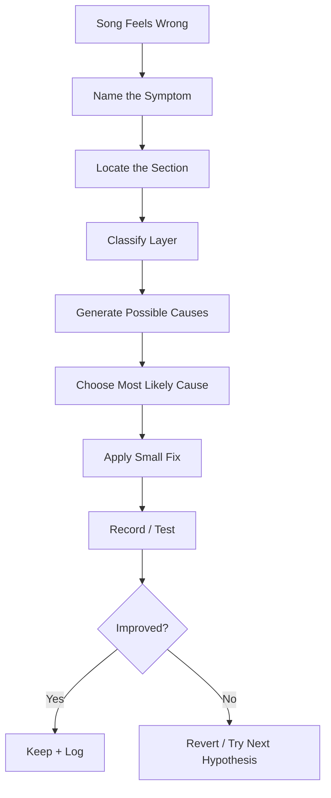
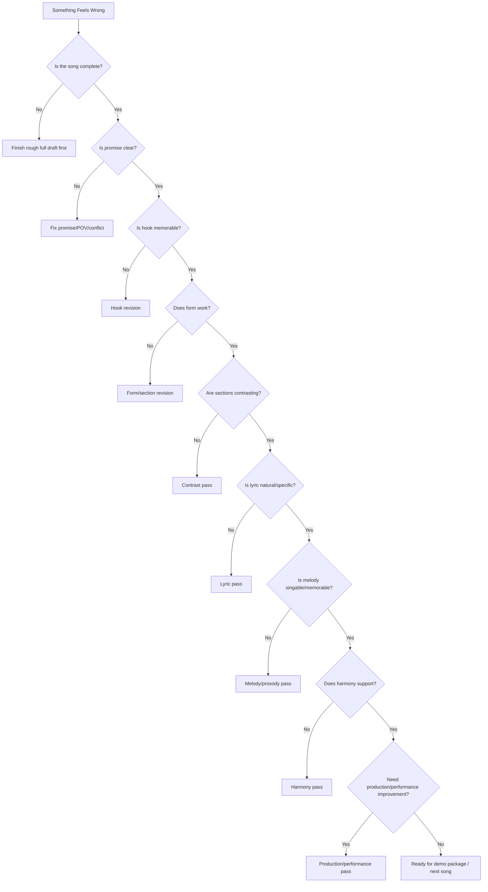

# learn-songwriting-part-033.md

# Common Failure Patterns and Troubleshooting: Debugging Manual untuk Lagu yang Macet, Datar, Generik, atau Tidak Selesai

> Seri: `learn-songwriting`  
> Part: `033 / 034`  
> Fokus: failure patterns, troubleshooting, diagnostic flow, symptom-to-cause mapping, lyric/melody/hook/form/harmony/debugging, dan recovery workflow  
> Status seri: belum selesai  
> Prasyarat: `learn-songwriting-part-000.md` sampai `learn-songwriting-part-032.md`

---

## Ringkasan Part Ini

Part sebelumnya membahas **20-Hour Practice System and Deliberate Drills**: bagaimana mengubah seluruh materi songwriting menjadi latihan terukur.

Part ini adalah **debugging manual**.

Saat menulis lagu, masalah akan muncul:

```text
lagunya terasa generic
hook tidak menempel
chorus tidak terasa chorus
verse 2 seperti pengulangan verse 1
bridge tempelan
lirik terlalu puitis tapi tidak jelas
Bahasa Indonesia terasa dipaksakan
rima mengorbankan makna
melodi robotic
melodi tidak cocok dengan kata
chord cheesy
form terlalu panjang
feedback membingungkan
draft tidak selesai
```

Banyak pemula merespons masalah ini dengan cara random:

```text
ganti chord
tambah metafora
tambah rima
minta AI rewrite semua
ganti genre
hapus chorus
bikin lagu baru
```

Kadang berhasil, sering tidak.

Part ini mengajarkan pendekatan yang lebih sistematis:

```text
symptom -> likely causes -> diagnostic questions -> targeted fixes -> test
```

Sebagai software engineer, ini seperti debugging:

```text
jangan langsung refactor seluruh codebase
temukan layer masalah
buat hypothesis
ubah sedikit
test ulang
```

Songwriting debugging juga begitu.

---

## Tujuan Part

Setelah menyelesaikan part ini, kamu harus bisa:

1. Mengenali failure pattern umum dalam songwriting.
2. Membedakan gejala dan penyebab.
3. Menggunakan diagnostic questions untuk menemukan layer masalah.
4. Memilih fix yang sesuai, bukan random.
5. Debug lirik yang generic, terlalu abstrak, atau dipaksakan.
6. Debug hook yang tidak memorable.
7. Debug chorus yang tidak terasa chorus.
8. Debug verse 2 yang redundant.
9. Debug bridge yang tempelan.
10. Debug melody yang robotic atau tidak singable.
11. Debug harmony/chord yang tidak mendukung.
12. Debug form yang datar atau terlalu panjang.
13. Debug feedback yang membingungkan.
14. Debug writer’s block dan endless revision.
15. Membuat troubleshooting report untuk lagu sendiri.
16. Membuat file latihan `songwriting-practice-033-common-failure-patterns.md`.

---

## Prinsip Utama

```text
A songwriting problem is rarely solved by adding more stuff.
It is usually solved by clarifying function.
```

Jika hook lemah, jangan langsung tambah string.  
Jika chorus datar, jangan langsung tambah drum.  
Jika lirik membingungkan, jangan langsung tambah penjelasan.

Tanya dulu:

```text
apa fungsi bagian ini?
apa yang seharusnya dirasakan pendengar?
apa yang tidak sampai?
di layer mana masalahnya?
```

---

## Troubleshooting Pipeline



---

# Bagian 1 — Symptom vs Cause

Gejala:

```text
chorus kurang nendang
```

Penyebab mungkin:

- hook lemah;
- melody range sama dengan verse;
- lyric terlalu padat;
- chord tidak landing;
- vocal delivery terlalu kecil;
- section sebelumnya tidak membangun tension;
- chorus terlalu mirip verse;
- rhythm tidak repeatable;
- title/hook tidak muncul;
- production terlalu kosong.

Jika kamu salah diagnosis, fix juga salah.

## Diagnostic Formula

```markdown
# Diagnostic Formula

## Symptom
...

## Section
...

## Layer
promise / POV / conflict / lyric / melody / rhythm / harmony / form / production / performance:

## Possible causes
1.
2.
3.

## Most likely cause
...

## Evidence
...

## Fix to test
...

## Result
...
```

---

# Bagian 2 — Layer Map

Gunakan layer map ini sebelum memperbaiki.

| Layer | Contoh Masalah |
|---|---|
| Promise | lagu tidak jelas ingin memberi pengalaman apa |
| POV | siapa bicara/kepada siapa tidak jelas |
| Conflict | tidak ada tension |
| Object/Metaphor | terlalu abstrak atau campur domain |
| Lyric | line tidak natural, generic, terlalu panjang |
| Hook | tidak memorable |
| Melody | robotic, range salah, tidak singable |
| Rhythm | kata terasa dipaksa, groove lemah |
| Prosody | tekanan kata salah |
| Harmony | chord tidak mendukung emosi |
| Form | section tidak berfungsi |
| Contrast | verse/chorus/bridge terasa sama |
| Revision | memperbaiki random |
| Feedback | data tidak dipakai dengan benar |
| Production | arrangement mengganggu inti |
| Performance | take buruk disangka song problem |

---

# Bagian 3 — Problem: Lagu Terasa Generic

## Gejala

Pendengar merasa:

```text
lagu ini seperti banyak lagu lain
tidak punya identitas
liriknya bisa dipakai siapa saja
emosinya umum
```

## Likely Causes

- song promise terlalu luas;
- tidak ada object spesifik;
- hook generic;
- metaphor umum;
- conflict kurang spesifik;
- POV tidak punya suara;
- chorus hanya menyatakan emosi;
- tidak ada detail dunia.

## Diagnostic Questions

```text
Apa object paling spesifik dalam lagu?
Apa line yang hanya bisa ada di lagu ini?
Apa conflict uniknya?
Apakah hook bisa dipakai di 100 lagu lain?
Apakah POV punya diksi khas?
Apakah ada scene atau hanya perasaan?
```

## Fixes

### Add Object

Generic:

```text
Aku rindu kamu.
```

More specific:

```text
Gelasmu belum jadi benda.
```

### Add Contradiction

Generic:

```text
Aku belum melupakanmu.
```

More specific:

```text
Tak kupakai, tak kubuang.
```

### Add World

Generic:

```text
Kau sering pergi.
```

More specific:

```text
Kopermu lebih hafal bandara daripada meja makan.
```

### Narrow Promise

Too broad:

```text
lagu tentang kehilangan
```

Better:

```text
lagu tentang orang yang belum bisa membuang gelas mantan karena membuang berarti mengakui selesai
```

## Test

After revision, ask:

```text
line mana yang paling spesifik?
bisakah hook ini jadi judul unik?
```

---

# Bagian 4 — Problem: Lirik Terlalu Abstrak

## Gejala

Lirik terdengar indah tapi pendengar tidak merasakan apa-apa.

Contoh:

```text
Kekosongan menari di relung sunyi jiwaku.
```

Masalah:

- tidak ada object;
- tidak ada action;
- tidak ada scene;
- terlalu banyak label emosi.

## Likely Causes

- kamu menjelaskan perasaan, bukan memberi evidence;
- takut terlalu literal;
- terlalu ingin terdengar puitis;
- tidak ada sensory detail;
- metaphor tidak punya source domain jelas.

## Diagnostic Questions

```text
Bisakah saya memfilmkan line ini?
Apa yang terlihat/terdengar/tersentuh?
Object apa yang membawa emosi?
Action apa yang terjadi?
Apakah line ini bisa diganti dengan adegan?
```

## Fixes

### Convert Abstract to Object

Abstract:

```text
Kesepian memenuhi ruangan.
```

Object/action:

```text
Kursimu masih menghadap pintu.
```

### Convert Emotion to Gesture

Abstract:

```text
Aku belum rela.
```

Gesture:

```text
Tanganku berhenti di tutup tempat sampah.
```

### Reduce Abstract Nouns

Words to inspect:

```text
kehampaan
kesunyian
kerinduan
kepedihan
ketiadaan
perpisahan
kenangan
```

Bukan dilarang, tetapi jangan semua line abstrak.

---

# Bagian 5 — Problem: Lirik Terlalu Literal / On-the-Nose

## Gejala

Lagu terdengar seperti penjelasan, bukan pengalaman.

Contoh:

```text
Aku sedih karena kamu meninggalkanku dan aku belum bisa move on.
```

## Likely Causes

- terlalu ingin pendengar paham;
- tidak percaya object/metaphor;
- chorus menjelaskan semua;
- bridge menjadi kesimpulan esai;
- tidak ada subtext.

## Diagnostic Questions

```text
Apakah line ini menjelaskan hal yang sudah bisa ditunjukkan?
Bisakah object menggantikan penjelasan?
Apakah pendengar diberi ruang merasakan?
Apakah chorus terlalu seperti summary?
```

## Fixes

### Replace Explanation with Evidence

Literal:

```text
Aku belum bisa melupakanmu.
```

Evidence:

```text
Namamu masih tahu jalan ke mulutku.
```

### Use Subtext

Literal satire:

```text
Kau hanya pulang untuk pencitraan.
```

Subtext:

```text
Jangan panggil ini pulang
jika rumah hanya kau singgahi
sebagai panggung.
```

### Bridge Less Essay

Too explicit:

```text
Ternyata masalahnya adalah aku belum selesai dengan diriku sendiri.
```

More lyric:

```text
Baru kusadar
di rak kedua

bukan gelasmu
yang paling lama
kutunda.
```

---

# Bagian 6 — Problem: Bahasa Indonesia Terasa Dipaksakan

## Gejala

Line terdengar:

- seperti terjemahan;
- terlalu formal tanpa niat;
- suku kata terlalu banyak;
- word order aneh;
- rima memaksa;
- tidak seperti orang Indonesia bicara/bernyanyi;
- robotik.

## Likely Causes

- mengejar rima;
- menerjemahkan konsep Inggris;
- memakai diksi terlalu tinggi;
- line terlalu panjang;
- tidak diuji spoken-first;
- tidak memperhatikan partikel/pronoun;
- melody memaksa stress salah.

## Diagnostic Questions

```text
Apakah saya bisa mengucapkan line ini natural?
Apakah orang dengan POV ini akan bicara begini?
Apakah word order normal?
Apakah ada kata yang dipilih hanya demi rima?
Apakah line terlalu panjang untuk napas?
Apakah stress jatuh pada kata lemah?
```

## Fixes

### Speak First

Tulis seperti bicara, lalu lyric-kan.

Too written:

```text
Aku merasakan ketidakhadiranmu yang begitu signifikan.
```

Natural:

```text
Kau tidak ada
dan semua benda tahu.
```

### Compress

Long:

```text
Aku tidak dapat menggunakan atau membuang peninggalanmu.
```

Compressed:

```text
Tak kupakai
tak kubuang.
```

### Fix Register

If persona intimate, avoid overly bureaucratic words unless satire.

### Reduce Forced Inversion

Bad:

```text
Pulang kau jangan sebut ini.
```

Better:

```text
Jangan panggil ini pulang.
```

---

# Bagian 7 — Problem: Rima Mengorbankan Makna

## Gejala

Pendengar merasa:

```text
kok kata ini dipilih cuma karena bunyi?
```

## Likely Causes

- perfect rhyme obsession;
- line ending chosen before meaning;
- terlalu sedikit vocabulary alternatives;
- tidak memakai near rhyme/assonance;
- chorus dipaksa AA/BB;
- tidak berani membuang rima.

## Diagnostic Questions

```text
Jika rima dihapus, apakah line lebih jujur?
Apakah kata ini character-appropriate?
Apakah rima membuat meaning berubah?
Apakah ada near rhyme yang lebih natural?
```

## Fixes

### Meaning First

Bad:

```text
Hatiku terluka
karena kau pergi ke kota
membawa semua cerita
di bawah cahaya semesta
```

Rima “a” terlalu dominan dan generic.

Better:

```text
Gelasmu di rak kedua
tak kupindah sejak Selasa
```

Specific and sound-related without forcing.

### Use Near Rhyme

Instead of perfect rhyme:

```text
pulang / hilang / bilang
```

Use sound family:

```text
pulang / ruang / diam / panggung
```

### Internal Repetition

```text
tak kupakai
tak kubuang
```

Sound repetition stronger than perfect rhyme.

---

# Bagian 8 — Problem: Hook Tidak Menempel

## Gejala

Setelah mendengar, pendengar tidak ingat phrase.  
Atau mereka ingat line lain, bukan hook.

## Likely Causes

- hook terlalu panjang;
- hook terlalu generic;
- tidak ada repetition;
- melody hook lemah;
- rhythm hook lemah;
- hook muncul terlalu jarang;
- hook tidak ada di chorus;
- hook tidak punya conflict;
- hook tidak punya title potential;
- prosody salah;
- hook kalah oleh line lain.

## Diagnostic Questions

```text
Apa intended hook?
Apakah pendengar mengingatnya?
Apakah hook bisa jadi title?
Apakah hook mengandung conflict?
Apakah hook cukup pendek?
Apakah hook punya rhythm pattern?
Apakah melody-nya bisa di-hum?
Apakah hook muncul di tempat kuat?
```

## Fixes

### Shorten

Long:

```text
Aku tidak sanggup memakai atau membuang semua peninggalanmu.
```

Hook:

```text
Tak kupakai, tak kubuang.
```

### Add Contradiction

Generic:

```text
Aku masih rindu.
```

Hook:

```text
Tak kupakai, tak kubuang.
```

### Move Hook

Jika hook tersembunyi di verse, pindah ke chorus first/last line.

### Repeat with Variation

```text
Tak kupakai
tak kubuang
```

Final:

```text
Aku
di rak kedua
```

### Strengthen Rhythm

Use repeatable pattern:

```text
S S L / S S L
```

---

# Bagian 9 — Problem: Chorus Tidak Terasa Chorus

## Gejala

Chorus terasa seperti verse tambahan.

## Likely Causes

- hook tidak jelas;
- lyric terlalu padat;
- melody range sama;
- rhythm tidak repeatable;
- chord tidak berubah/landing;
- delivery sama;
- tidak ada repetition;
- title tidak muncul;
- verse terlalu besar;
- chorus terlalu informasi.

## Diagnostic Questions

```text
Apa yang berubah dari verse ke chorus?
Apakah chorus punya hook?
Apakah chorus lebih compact?
Apakah melody lebih memorable?
Apakah rhythm lebih repeatable?
Apakah chord/harmony mendukung arrival?
Apakah pendengar tahu ini chorus?
```

## Fixes

### Reduce Information

Chorus bukan tempat menjelaskan semua.

### Make Hook First or Last

```text
[Chorus]
Tak kupakai
tak kubuang
...
```

### Increase Contrast

- verse lower;
- chorus higher/wider;
- verse detailed;
- chorus thesis;
- verse speech-like;
- chorus patterned.

### Strengthen Landing

Chord or melody should make hook feel centered.

---

# Bagian 10 — Problem: Verse 1 Terlalu Panjang

## Gejala

Pendengar bosan sebelum hook muncul.

## Likely Causes

- terlalu banyak backstory;
- ingin menjelaskan context;
- terlalu banyak object;
- tidak ada urgency;
- chorus muncul terlalu telat.

## Diagnostic Questions

```text
Line mana yang benar-benar dibutuhkan sebelum chorus?
Apakah pendengar butuh semua backstory ini?
Bisakah verse dimulai lebih dekat ke object/action?
Apakah hook muncul dalam 45-60 detik?
```

## Fixes

### Start Closer

Instead of:

```text
Dulu kita pernah bahagia di rumah ini...
```

Start:

```text
Gelasmu di rak kedua.
```

### Cut Explanation

Keep evidence, remove commentary.

### Move Some Info to Verse 2/Bridge

Do not overload verse 1.

---

# Bagian 11 — Problem: Verse 2 Redundant

## Gejala

Verse 2 terasa seperti verse 1 dengan sinonim.

## Likely Causes

- tidak ada new stakes;
- object baru tidak membawa development;
- emotional state tidak berubah;
- chorus 1 tidak mengubah context;
- verse 2 hanya memperpanjang mood.

## Diagnostic Questions

```text
Apa yang baru di verse 2?
Apa yang berubah setelah chorus 1?
Apakah stakes lebih dalam?
Apakah ada consequence?
Apakah object kembali dengan twist?
```

## Fixes

### Add Consequence

Verse 1:

```text
gelas di rak
```

Verse 2:

```text
lampu dapur, pintu setengah, habit narator
```

### Add Time Shift

```text
Pagi ketiga...
```

### Add Social/Relational Impact

For satire:

```text
meja makan, anak-anak, rumah menunggu
```

### Make Chorus Heavier

Verse 2 should make next chorus mean more.

---

# Bagian 12 — Problem: Bridge Tempelan

## Gejala

Bridge bisa dihapus tanpa efek.

## Likely Causes

- bridge hanya verse 3;
- tidak ada reveal;
- tidak ada perspective shift;
- bridge terlalu explanatory;
- bridge memakai metaphor domain random;
- harmony/melody tidak kontras;
- final chorus tidak berubah setelah bridge.

## Diagnostic Questions

```text
Jika bridge dihapus, apa yang hilang?
Apakah final chorus berubah makna karena bridge?
Apakah bridge memberi turn?
Apakah bridge terlalu menjelaskan?
Apakah bridge memakai callback?
```

## Fixes

### Make Bridge a Turn

Not more info, but changed meaning.

### Use Callback

Bring object back with new meaning.

### Shorten

Bridge sering lebih kuat jika pendek.

### Change Delivery/Harmony

Strip down, pause, new chord color.

### Cut

Jika tidak ada function, hapus.

---

# Bagian 13 — Problem: Final Chorus Flat

## Gejala

Final chorus terasa copy-paste.

## Likely Causes

- bridge tidak memberi reframe;
- lyric final sama tanpa context shift;
- delivery sama;
- harmony sama tanpa niat;
- no added line;
- no changed address;
- no final image;
- emotional state tidak berubah.

## Diagnostic Questions

```text
Apa arti chorus 1?
Apa arti final chorus?
Apa yang berubah?
Apa line final yang memberi payoff?
Apakah final harus bigger, smaller, or colder?
```

## Fixes

### One-Word Change

```text
Sayang -> Tuan
```

### Added Final Line

```text
aku
di rak kedua
```

### Delivery Change

Stripped, whispered, colder.

### Harmony Change

Resolve or refuse to resolve.

### Pause Before Hook

Let final line land.

---

# Bagian 14 — Problem: Melody Robotic

## Gejala

Melody terdengar seperti AI/bacaan datar:

- setiap syllable durasinya sama;
- stress tidak natural;
- tidak ada phrase;
- tidak ada breath;
- line terlalu padat;
- melody mengikuti teks secara mekanis;
- tidak ada motif.

## Likely Causes

- tidak speak-sing;
- rhythm terlalu grid;
- phrase tidak dikelompokkan;
- lyric terlalu panjang;
- melodic rhythm tidak bervariasi;
- prosody tidak diaudit;
- tidak ada rests.

## Diagnostic Questions

```text
Apakah line ini terdengar natural saat diucapkan?
Apakah semua suku kata sama penting?
Di mana breath?
Di mana long note?
Apakah important word mendapat emphasis?
Apakah ada motif rhythm?
```

## Fixes

### Speak-Sing

Speak first, then exaggerate contour.

### Add Duration Contrast

Not all syllables equal.

### Add Rest

Silence breaks robotic feel.

### Compress Lyric

Too many syllables cause robotic delivery.

### Create Motif

Repeat pattern in chorus.

---

# Bagian 15 — Problem: Melodi Tidak Memorable

## Gejala

Pendengar tidak bisa hum melody.  
Chorus lyric bagus tapi tune tidak menempel.

## Likely Causes

- no motif;
- contour terlalu flat;
- contour terlalu random;
- hook melody terlalu panjang;
- range tidak cukup;
- rhythm tidak repeatable;
- melodic peak tidak pada word penting;
- terlalu banyak notes;
- terlalu sedikit repetition.

## Diagnostic Questions

```text
Bisakah saya hum chorus tanpa lyric?
Apa motif melody?
Apakah hook punya shape jelas?
Apakah ada repetition + variation?
Apakah melody terlalu banyak bergerak?
```

## Fixes

### Short Motif

Buat motif 2–4 beat.

### Repeat with Variation

```text
tak kupakai
tak kubuang
```

Same start, different landing.

### Simplify

Remove unnecessary notes.

### Make Contour Visible

Use symbols:

```text
↗ — ↘
```

### Use Rhythm Hook

Sometimes rhythm makes melody memorable.

---

# Bagian 16 — Problem: Prosody Salah

## Gejala

Kata terdengar aneh saat dinyanyikan.

Contoh:

```text
jangan panggil I-ni pulang
```

padahal emphasis seharusnya:

```text
jangan / panggil / pulang
```

## Likely Causes

- melodic peak jatuh pada kata lemah;
- long note di syllable tidak penting;
- phrase boundary memotong makna;
- word order dipaksa;
- melisma pada filler;
- breath salah.

## Diagnostic Questions

```text
Apa word penting?
Di mana melodic peak?
Di mana long note?
Apakah keduanya match?
Apakah breath memotong phrase?
Apakah stress natural?
```

## Fixes

- move peak;
- rewrite line;
- shorten phrase;
- choose better vowel;
- add breath;
- simplify melody;
- change rhythm.

---

# Bagian 17 — Problem: Chord Terasa Cheesy / Tidak Cocok

## Gejala

Chord membuat lagu terasa:

- terlalu happy;
- terlalu melodramatic;
- terlalu generic;
- terlalu heroic;
- terlalu sentimental;
- terlalu dark;
- tidak mendukung vocal.

## Likely Causes

- progression dipilih karena populer;
- chord terlalu bright untuk promise;
- string/piano production terlalu dramatic;
- chorus resolves terlalu manis;
- bridge chord tidak memberi turn;
- key tidak nyaman;
- chord movement terlalu banyak.

## Diagnostic Questions

```text
Apa desired harmony feel?
Apakah hook landing sesuai?
Apakah chord membuat lyric terdengar lebih jujur atau lebih cheesy?
Apakah progression terlalu familiar tanpa twist?
Apakah key nyaman?
Apakah verse/chorus harmony kontras?
```

## Fixes

### Test 3 Loops

Do not overthink.

### Change Landing

Let hook land on tension if unresolved.

### Simplify

If chords distract, reduce.

### Use Minor/Darker Color Carefully

Dark does not mean all minor all the time.

### Adjust Production

Sometimes chord okay, arrangement too sentimental.

---

# Bagian 18 — Problem: Form Terlalu Panjang

## Gejala

Lagu terasa berat dan pendengar kehilangan fokus.

## Likely Causes

- verse terlalu panjang;
- pre-chorus tidak perlu;
- bridge terlalu panjang;
- chorus terlalu banyak line;
- outro tidak menambah meaning;
- terlalu banyak repeated chorus;
- intro terlalu lama.

## Diagnostic Questions

```text
Bagian mana yang bisa dihapus tanpa kehilangan meaning?
Apakah pre-chorus membuat chorus lebih kuat?
Apakah bridge memberi turn?
Apakah hook muncul cukup awal?
Apakah outro hanya ambience?
```

## Fixes

- cut intro;
- shorten verse;
- remove pre-chorus;
- shorten bridge;
- remove repeated outro;
- compress chorus;
- move hook earlier.

---

# Bagian 19 — Problem: Lagu Terasa Datar

## Gejala

Tidak ada perkembangan.

## Likely Causes

- energy map flat;
- melody range sama;
- harmony same;
- lyric directness same;
- no bridge turn;
- chorus tidak contrast;
- verse 2 redundant;
- final chorus no payoff.

## Diagnostic Questions

```text
Apa yang berubah dari awal ke akhir?
Apakah emotional state bergerak?
Apakah chorus punya arrival?
Apakah bridge mengubah perspective?
Apakah final chorus earned?
```

## Fixes

- create energy map;
- add section contrast;
- strengthen emotional state machine;
- make verse 2 development;
- add bridge reveal or cut bridge;
- final chorus variation.

---

# Bagian 20 — Problem: Lagu Terasa Pecah / Tidak Satu Dunia

## Gejala

Section terasa seperti lagu berbeda.

## Likely Causes

- metaphor domain berubah random;
- POV berubah;
- genre/arrangement terlalu kontras;
- bridge unrelated;
- hook tidak kembali;
- chord shift terlalu ekstrem;
- lyric register berubah tanpa alasan.

## Diagnostic Questions

```text
Apa continuity elements?
Apakah object/metaphor domain tetap?
Apakah narrator voice konsisten?
Apakah hook/motif kembali?
Apakah bridge reframe existing material?
```

## Fixes

- restore main object;
- repeat hook/motif;
- align POV/register;
- use related chord family;
- rewrite bridge as callback;
- remove random metaphor.

---

# Bagian 21 — Problem: Feedback Membingungkan

## Gejala

Feedback bertentangan:

```text
satu bilang terlalu sederhana
satu bilang paling kuat karena sederhana
```

## Likely Causes

- feedback goals tidak jelas;
- listener types berbeda;
- kamu tanya “bagus nggak?”;
- feedback taste dicampur clarity;
- belum melihat pattern;
- demo quality mengganggu.

## Diagnostic Questions

```text
Feedback ini type apa?
Taste atau clarity?
Ada pattern dari beberapa listener?
Apakah listener target audience?
Apakah feedback ini aligned dengan promise?
Apakah production issue disangka songwriting?
```

## Fixes

- classify feedback;
- find patterns;
- use vision filter;
- convert to hypothesis;
- A/B test;
- ignore/defer production taste jika belum waktunya.

---

# Bagian 22 — Problem: Tidak Bisa Menyelesaikan Lagu

## Gejala

Banyak fragment, tidak ada full draft.

## Likely Causes

- tidak ada definition of done;
- terlalu banyak active songs;
- perfectionism;
- hook belum dipilih;
- form belum locked;
- revisi sebelum assembly;
- takut draft jelek;
- tidak ada deadline;
- terlalu banyak teori.

## Diagnostic Questions

```text
Apa active song?
Apa DoD?
Apa yang harus freeze?
Apa yang masih dicari?
Apa minimal full draft?
Apa yang saya polish sebelum waktunya?
```

## Fixes

- one active song rule;
- draft freeze;
- first complete draft deadline;
- choose best-enough hook;
- lock form for one pass;
- record ugly full memo;
- archive unused ideas.

---

# Bagian 23 — Problem: Terlalu Bergantung pada AI

## Gejala

Kamu terus generate versi baru, tetapi tidak mengambil keputusan.

## Likely Causes

- tidak ada song promise;
- tidak ada evaluation criteria;
- prompt vague;
- output dianggap solusi final;
- takut memilih;
- terlalu terpikat produksi.

## Diagnostic Questions

```text
Apa yang fixed?
Apa yang sedang diuji?
Apakah AI output memperkuat hook?
Apakah lyric berubah tanpa izin?
Apakah melody lebih baik atau hanya production lebih bagus?
```

## Fixes

- write constraints;
- evaluate against promise;
- choose one active version;
- use AI for alternatives, not authority;
- keep lyric/hook protected;
- stop after 3–5 generations and decide.

---

# Bagian 24 — Problem: Demo Terasa Flat

## Gejala

Demo tidak menggerakkan pendengar.

## Likely Causes

- song core lemah;
- vocal delivery malu-malu;
- chord terlalu static;
- no section contrast;
- production too empty;
- hook tidak jelas;
- tempo salah;
- guide vocal tidak memperlihatkan energy.

## Diagnostic Questions

```text
Jika dimainkan acoustic, apakah hook masih kuat?
Apakah demo flat karena performance?
Apakah arrangement tidak build?
Apakah chorus secara songwriting sudah chorus?
Apakah tempo terlalu lambat/cepat?
```

## Fixes

Classify layer:

- songwriting: hook/form/melody fix;
- arrangement: add contrast/build;
- performance: re-record with clearer delivery;
- production: add support;
- tempo: adjust.

---

# Bagian 25 — Problem: Lagu Terlalu “Pintar” tapi Tidak Menyentuh

## Gejala

Lirik/metafora clever, tetapi pendengar tidak merasa.

## Likely Causes

- terlalu banyak konsep;
- terlalu sedikit vulnerable evidence;
- metaphor terlalu puzzle;
- emotional truth tertutup wordplay;
- hook terlalu clever;
- bridge terlalu esai;
- tidak ada simple human line.

## Diagnostic Questions

```text
Apa line paling jujur?
Apa line paling manusiawi?
Apakah ada satu phrase sederhana?
Apakah saya bersembunyi di balik metafora?
```

## Fixes

- add plain line strategically;
- reduce metaphor density;
- include gesture/object;
- simplify hook;
- let bridge be honest;
- leave one line un-clever.

Example:

Clever:

```text
Arsitektur kepulanganmu runtuh di ruang tunggu.
```

Human:

```text
Rumah bukan bandara.
```

---

# Bagian 26 — Problem: Lagu Terlalu Blunt / Vulgar / Frontal

## Gejala

Pesan terlalu langsung sehingga kehilangan seni/subtext.

## Likely Causes

- anger belum diproses jadi image;
- satire jadi slogan;
- metaphor tidak dipakai;
- chorus menuduh secara literal;
- tidak ada mask/persona;
- tidak ada emotional distance.

## Diagnostic Questions

```text
Bisakah kritik dibawa oleh object?
Bisakah persona mengatakan ini sebagai romance?
Apakah command terlalu frontal?
Apakah metaphor domain konsisten?
Apakah ada subtext?
```

## Fixes

- use object metaphor;
- use address shift;
- use domestic/airport imagery;
- make accusation through scene;
- reduce explicit labels;
- let contrast do work.

Example:

Frontal:

```text
Kau hanya pencitraan.
```

Subtext:

```text
Jangan panggil ini pulang
jika rumah hanya kau singgahi
sebagai panggung.
```

---

# Bagian 27 — Global Diagnostic Flow



---

# Bagian 28 — Troubleshooting Table

| Symptom | Likely Layer | First Fix to Try |
|---|---|---|
| generic | promise/object/hook | add specific object + contradiction |
| abstract | lyric/object | convert emotion to object/action |
| too literal | lyric/subtext | replace explanation with scene |
| forced Indonesian | lyric/prosody | speak-first rewrite |
| forced rhyme | sound/meaning | use near rhyme or cut rhyme |
| hook not memorable | hook/melody/rhythm | shorten + repeat + motif |
| chorus flat | contrast/hook/harmony | compress chorus + raise contrast |
| verse too long | form/lyric | cut exposition |
| verse 2 redundant | form/development | add consequence/new object |
| bridge weak | form/reveal | add turn/callback or cut |
| final chorus flat | payoff | add reframe/variation |
| melody robotic | rhythm/prosody | speak-sing + duration contrast |
| melody forgettable | melody/hook | create motif |
| chord cheesy | harmony/production | test alternate landing/simplify |
| form too long | form | cut pre/bridge/outro |
| feedback confusing | feedback process | classify + pattern |
| cannot finish | workflow | draft freeze + full memo deadline |
| AI drift | tool/prompt | fixed/flexible constraints |
| demo flat | layer diagnosis | classify song/arrangement/performance |

---

# Bagian 29 — Recovery Workflow

Saat lagu macet:

## Step 1 — Stop Editing

Jangan ubah lagi selama 10 menit.

## Step 2 — Name the Symptom

Tulis satu kalimat.

```text
Chorus tidak terasa chorus.
```

## Step 3 — Locate Section

```text
Chorus 1 and 2
```

## Step 4 — Classify Layer

```text
hook + contrast + melody
```

## Step 5 — Choose One Hypothesis

```text
Chorus lyric terlalu padat dan hook buried.
```

## Step 6 — Apply One Fix

```text
Move hook to first line and cut two lines.
```

## Step 7 — Record

Voice memo.

## Step 8 — Compare

Apakah membaik?

## Step 9 — Log

Keep/revert/iterate.

---

# Bagian 30 — Troubleshooting Report Template

```markdown
# Troubleshooting Report

## Song
...

## Version
...

## Symptom
...

## Section / Moment
...

## Layer Classification
- [ ] promise
- [ ] POV
- [ ] conflict
- [ ] object/metaphor
- [ ] lyric
- [ ] hook
- [ ] melody
- [ ] rhythm
- [ ] prosody
- [ ] harmony
- [ ] form
- [ ] contrast
- [ ] production
- [ ] performance
- [ ] feedback
- [ ] workflow

## Possible Causes
1.
2.
3.
4.
5.

## Evidence
...

## Most Likely Cause
...

## Fix Candidate A
...

## Fix Candidate B
...

## Chosen Fix
...

## Test Method
...

## Result
...

## Decision
keep / revert / iterate / defer:

## Next Action
...
```

---

# Bagian 31 — Example Troubleshooting: Chorus Flat

## Symptom

```text
Chorus does not feel like chorus.
```

## Section

```text
Chorus 1 and Chorus 2
```

## Possible Causes

- hook line appears line 4, not line 1;
- lyric density same as verse;
- melody range same;
- chord loop same;
- no rhythm pattern.

## Evidence

Listener did not remember intended hook.

## Fix

Move hook to first line:

```text
Tak kupakai
tak kubuang
```

Cut explanatory lines.

Create rhythm:

```text
S S L / S S L
```

## Test

Record chorus A/B.

## Decision

Keep if hook remembered after 5 minutes.

---

# Bagian 32 — Example Troubleshooting: Satire Too Frontal

## Symptom

```text
Lagu terasa seperti protes langsung, bukan romansa tragis.
```

## Possible Causes

- too many explicit political words;
- no romance mask;
- object metaphor underused;
- vocal delivery too angry;
- harmony too heroic;
- chorus too slogan-like.

## Fixes

- bring back “Sayang” in verse;
- use airport/koper/rumah objects;
- keep hook as command but reduce explicit labels;
- final address shift to “Tuan”;
- production restrained, not anthem.

## Test

Ask listener:

```text
Apakah terasa seperti romansa yang pahit atau seperti slogan?
```

---

# Bagian 33 — Latihan Utama Part 033

Buat file:

```text
songwriting-practice-033-common-failure-patterns.md
```

Isi template berikut.

```markdown
# songwriting-practice-033-common-failure-patterns.md

## 1. Song Source
Title:
Version:
Demo:
Current stage:

## 2. Current Symptoms
Tulis 3–10 gejala tanpa solusi dulu.

1.
2.
3.
4.
5.

## 3. Symptom Classification

| Symptom | Section | Layer | Severity 1-5 |
|---|---|---|---:|
|  |  |  |  |

## 4. Top 3 Problems

### Problem 1
Symptom:
Section:
Layer:
Possible causes:
1.
2.
3.
Evidence:
Most likely cause:
Fix to test:
Test method:

### Problem 2
Symptom:
Section:
Layer:
Possible causes:
1.
2.
3.
Evidence:
Most likely cause:
Fix to test:
Test method:

### Problem 3
Symptom:
Section:
Layer:
Possible causes:
1.
2.
3.
Evidence:
Most likely cause:
Fix to test:
Test method:

## 5. Troubleshooting Table

| Symptom | Likely Cause | Fix Candidate | Test | Result |
|---|---|---|---|---|
|  |  |  |  |  |

## 6. Global Diagnostic Flow Result

Is the song complete?
...

Is promise clear?
...

Is hook memorable?
...

Does form work?
...

Are sections contrasting?
...

Is lyric natural/specific?
...

Is melody singable/memorable?
...

Does harmony support?
...

Is issue production/performance?
...

## 7. One-Fix Revision Pass

Version:
Goal:
Chosen fix:
What not to change:
Voice memo:
Result:

## 8. Before / After

### Before
...

### After
...

### What improved
...

### What got worse
...

### Decision
keep / revert / iterate:

## 9. Recovery Plan

### P0
1.
2.

### P1
1.
2.

### P2
1.
2.

### Defer
1.
2.

## 10. Lessons Learned
1.
2.
3.

## 11. Next Action
...
```

---

# Latihan 30 Menit: Symptom Classification

Dengar demo. Tulis 10 gejala.

Jangan solusi dulu.

Klasifikasikan layer.

---

# Latihan 45 Menit: Top 3 Troubleshooting

Pilih 3 masalah paling besar.

Untuk masing-masing:

- possible causes;
- evidence;
- likely cause;
- fix candidate;
- test.

---

# Latihan 60 Menit: One-Fix Revision

Pilih satu fix paling penting.

Apply. Record. Compare.

Jangan fix semuanya.

---

# Checklist Part 033

Sebelum lanjut ke part 034, pastikan:

- [ ] Kamu memahami symptom vs cause.
- [ ] Kamu bisa mengklasifikasi masalah by layer.
- [ ] Kamu punya troubleshooting report.
- [ ] Kamu mengidentifikasi top 3 problems.
- [ ] Kamu membuat possible causes, bukan langsung solusi.
- [ ] Kamu memilih most likely cause.
- [ ] Kamu menerapkan satu targeted fix.
- [ ] Kamu merekam before/after.
- [ ] Kamu tahu apakah fix membaik atau memburuk.
- [ ] Kamu punya recovery plan.
- [ ] Kamu siap masuk ke final integration, roadmap lanjutan, dan penutupan seri.

---

# Output Wajib Part 033

Buat file:

```text
songwriting-practice-033-common-failure-patterns.md
```

Isi minimal:

```markdown
# songwriting-practice-033-common-failure-patterns.md

## Song Source
...

## Current Symptoms
...

## Symptom Classification
...

## Top 3 Problems
...

## Troubleshooting Table
...

## Global Diagnostic Flow Result
...

## One-Fix Revision Pass
...

## Before / After
...

## Recovery Plan
...

## Lessons Learned
...

## Next Action
...
```

---

# Common Meta-Failure di Troubleshooting

## 1. Terlalu Banyak Fix Sekaligus

Solusi:

```text
one-fix revision pass
```

## 2. Tidak Merekam Before/After

Solusi:

```text
record both
```

## 3. Mengabaikan Evidence

Solusi:

```text
write evidence before fix
```

## 4. Selalu Menyalahkan Produksi

Solusi:

```text
core strength test
```

## 5. Selalu Menyalahkan Diri

Solusi:

```text
debug artifact, not identity
```

## 6. Mengganti Lagu Setiap Macet

Solusi:

```text
finish one diagnostic pass first
```

## 7. Tidak Menggunakan Feedback

Solusi:

```text
classify feedback into pattern/hypothesis
```

## 8. Menganggap Semua Masalah Sama Berat

Solusi:

```text
severity + P0/P1/P2
```

---

# Prinsip Penting

```text
Do not ask “how do I make this better?”
Ask “what exactly is failing, where, and why?”
```

Dan:

```text
A weak draft is not a failure.
A weak draft is a diagnostic surface.
```

Lagu yang belum bekerja memberi data.  
Tugasmu adalah membaca data itu dengan tenang.

---

# Bridge ke Part Berikutnya

Part ini membahas common failure patterns and troubleshooting.

Part berikutnya, `learn-songwriting-part-034.md`, adalah part terakhir seri:

```text
Final Integration, Next Roadmap, and Songwriter Operating System
```

Kita akan menutup seri dengan:

- rangkuman mental model;
- end-to-end workflow;
- checklist lengkap;
- bagaimana memakai semua part untuk menulis lagu berikutnya;
- songwriter operating system;
- roadmap lanjutan setelah 20 jam;
- rekomendasi project practice;
- cara membuat portfolio lagu;
- cara menjaga growth;
- final series completion notice.

Setelah part 034, seri `learn-songwriting` selesai.

---

# Status Seri

Part ini selesai.

```text
Selesai: learn-songwriting-part-033.md
Berikutnya: learn-songwriting-part-034.md
Status seri: belum selesai
Part tersisa: 1
Target akhir seri: learn-songwriting-part-034.md
```


<!-- NAVIGATION_FOOTER -->
<div class="page-nav">
<a href="./learn-songwriting-part-032.md">⬅️ Hour Practice System and Deliberate Drills: Mengubah Semua Materi Songwriting Menjadi Latihan Terukur</a>
<a href="./index.md">📚 Kategori</a>
<a href="../../index.md">🏠 Home</a>
<a href="./learn-songwriting-part-034.md">Final Integration, Next Roadmap, and Songwriter Operating System: Menjadikan Songwriting sebagai Sistem Berulang, Bukan Sekadar Inspirasi Sesaat ➡️</a>
</div>
