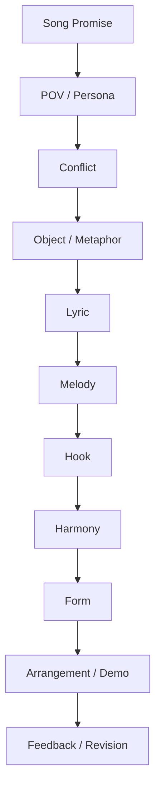
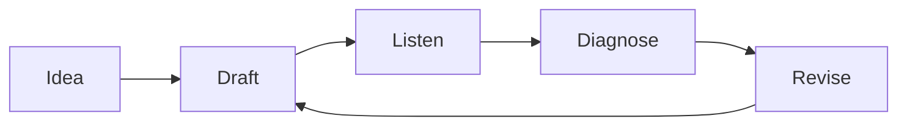
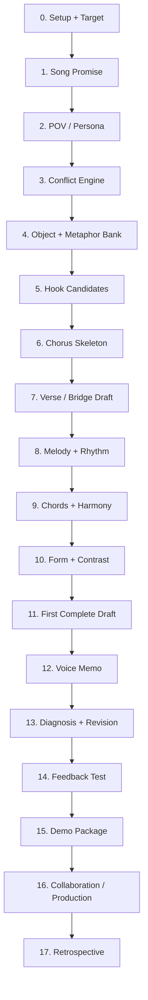
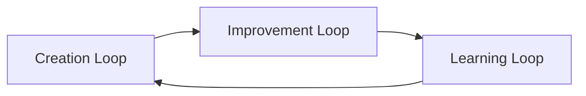
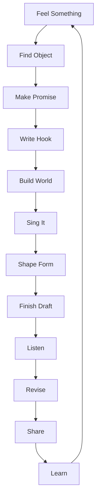

# learn-songwriting-part-034.md

# Final Integration, Next Roadmap, and Songwriter Operating System: Menjadikan Songwriting sebagai Sistem Berulang, Bukan Sekadar Inspirasi Sesaat

> Seri: `learn-songwriting`  
> Part: `034 / 034`  
> Fokus: integrasi akhir, end-to-end workflow, mental model, checklist lengkap, songwriter operating system, roadmap lanjutan, portfolio practice, dan penutupan seri  
> Status seri: **SELESAI**  
> Prasyarat: `learn-songwriting-part-000.md` sampai `learn-songwriting-part-033.md`

---

## Ringkasan Part Ini

Ini adalah part terakhir dari seri `learn-songwriting`.

Kita mulai dari framework Josh Kaufman dalam *The First 20 Hours*:

```text
Deconstruct the skill.
Learn enough to self-correct.
Remove practice barriers.
Practice deliberately for 20 hours.
```

Lalu kita menerapkannya ke skill yang tampak “tidak deterministic”: songwriting.

Sebagai software engineer, kamu memulai dari cara pikir yang cenderung:

```text
deterministic
logical
systematic
debuggable
structured
```

Songwriting tampak bertentangan karena berisi:

```text
intuisi
emosi
ambiguity
taste
subtext
voice
melody
memory
```

Tetapi selama seri ini, kita membangun jembatan:

> Songwriting bukan magic. Songwriting adalah constrained emotional design.

Bukan berarti songwriting menjadi mekanis.  
Bukan berarti lagu bagus bisa dihasilkan hanya dengan template.  
Bukan berarti emosi bisa direduksi menjadi checklist.

Tetapi checklist, mental model, dan workflow membantu kamu:

- mulai tanpa menunggu inspirasi;
- memecah masalah besar menjadi sub-skill;
- mengubah emosi abstrak menjadi object;
- membuat hook yang bisa diingat;
- menyusun lyric yang natural;
- membuat melody yang bisa dinyanyikan;
- memilih chord yang mendukung;
- membangun form;
- menyelesaikan draft;
- merevisi dengan diagnosis;
- meminta feedback;
- menyiapkan demo;
- berkolaborasi;
- melatih skill secara berulang.

Part ini menyatukan semuanya menjadi **Songwriter Operating System**.

Tujuannya:

```text
setelah seri ini selesai, kamu punya cara kerja yang bisa dipakai untuk lagu berikutnya, bukan hanya memahami satu materi.
```

---

## Tujuan Part

Setelah menyelesaikan part ini, kamu harus punya:

1. Mental model utuh tentang songwriting.
2. End-to-end workflow dari ide sampai demo package.
3. Checklist songwriting lengkap.
4. Songwriter operating system untuk latihan berulang.
5. Decision tree untuk memilih langkah berikutnya.
6. Roadmap lanjutan setelah 20 jam.
7. Project practice untuk membangun portfolio.
8. Sistem review dan retrospective.
9. Cara mengukur perkembangan.
10. Penanda bahwa seri `learn-songwriting` selesai.

---

# Bagian 1 — Mental Model Akhir: Lagu sebagai Sistem Pengalaman

Selama seri ini, kita berulang kali melihat lagu bukan sebagai “teks + nada”, tetapi sebagai sistem pengalaman.

Lagu memiliki beberapa layer:

```text
emotion
meaning
memory
movement
voice
world
time
sound
performance
```

Jika disederhanakan:



Namun dalam praktik, ini bukan linear sekali jalan. Ini loop.



Songwriting adalah:

```text
making emotional decisions
hearing what they do
and revising toward the promise
```

---

# Bagian 2 — The Core Equation

Gunakan equation ini:

```text
Song = Promise + Voice + Conflict + Hook + Journey
```

## Promise

Apa pengalaman emosional yang dijanjikan lagu?

## Voice

Siapa yang berbicara, kepada siapa, dari jarak emosi apa?

## Conflict

Apa tension yang membuat lagu bergerak?

## Hook

Apa pusat memori lagu?

## Journey

Bagaimana pendengar bergerak dari awal ke akhir?

Jika salah satu hilang:

| Hilang | Efek |
|---|---|
| Promise | lagu kabur |
| Voice | lirik tidak punya karakter |
| Conflict | lagu datar |
| Hook | lagu tidak menempel |
| Journey | lagu tidak selesai secara emosional |

---

# Bagian 3 — Songwriting sebagai Constrained Search

Dari awal kita memakai mental model:

```text
creativity = search under constraints
```

Kamu tidak mencari “jawaban benar tunggal”.  
Kamu mencari solusi yang bekerja dalam constraints:

- genre;
- voice;
- emotion;
- language;
- singer range;
- song length;
- project film;
- metaphor domain;
- audience;
- production possibility;
- time;
- skill level.

Software engineer biasanya nyaman dengan deterministic correctness.

Songwriting lebih seperti:

```text
optimization under ambiguity
```

Bukan:

```text
is this correct?
```

Tetapi:

```text
does this serve the song promise better?
```

Itulah decision criterion utama.

---

# Bagian 4 — The Song Promise as North Star

Jika kamu lupa semua materi, ingat ini:

```text
Every decision should be checked against the song promise.
```

Pertanyaan universal:

```text
Apakah line ini memperjelas promise?
Apakah melody ini mendukung emotion?
Apakah chord ini membuat hook lebih inevitable?
Apakah bridge ini mengubah makna?
Apakah production ini mengungkap dunia lagu?
Apakah feedback ini membuat lagu lebih menjadi dirinya?
```

Song promise mencegah kamu tersesat di:

- rima cantik tapi tidak relevan;
- chord keren tapi mengganggu vocal;
- production megah tapi salah emosi;
- feedback orang lain yang menarik tapi bukan untuk lagu ini;
- AI output yang catchy tapi mengubah POV.

---

# Bagian 5 — End-to-End Workflow

Berikut workflow lengkap yang bisa kamu pakai untuk setiap lagu.



Gunakan workflow ini seperti map, bukan penjara.  
Kadang melody datang dulu. Kadang hook datang dulu. Kadang production idea datang dulu.

Tetapi jika macet, kembali ke map.

---

# Bagian 6 — Workflow Detail: From Zero to Demo

## 0. Setup

Output:

```text
folder, template, voice memo ready
```

Questions:

```text
Apa target lagu?
Apa batasan waktu?
Apa output minimum?
```

## 1. Song Promise

Output:

```text
one-sentence promise
```

Example:

```text
Lagu ini membuat pendengar merasakan rindu yang disangkal melalui benda rumah yang tidak sanggup dipakai atau dibuang.
```

## 2. POV / Persona

Output:

```text
narrator, addressee, emotional distance
```

Questions:

```text
Siapa bicara?
Kepada siapa?
Apa yang mereka tidak berani katakan langsung?
```

## 3. Conflict Engine

Output:

```text
desire + obstacle + stakes
```

Questions:

```text
Apa yang diinginkan narrator?
Apa yang menghalangi?
Apa yang dipertaruhkan?
```

## 4. Object + Metaphor Bank

Output:

```text
object/image bank + metaphor domain
```

Questions:

```text
Object apa yang membawa emosi?
Metaphor domain apa yang konsisten?
```

## 5. Hook Candidates

Output:

```text
30 candidates, top 3 sung, 1 selected
```

Questions:

```text
Apa phrase yang akan diingat?
Apa title candidate?
Apa contradiction?
```

## 6. Chorus Skeleton

Output:

```text
chorus draft
```

Questions:

```text
Apakah chorus menyatakan emotional thesis?
Apakah hook jelas?
Apakah singable?
```

## 7. Verse / Bridge Draft

Output:

```text
verse 1, verse 2, bridge rough
```

Questions:

```text
Verse 1 setup apa?
Verse 2 menambah apa?
Bridge mengubah makna apa?
```

## 8. Melody + Rhythm

Output:

```text
voice memo melody section
```

Questions:

```text
Apakah melody shape terlihat?
Apakah rhythm natural?
Apakah prosody benar?
```

## 9. Chords + Harmony

Output:

```text
chord progression and chord sheet
```

Questions:

```text
Apakah chord mendukung hook?
Apakah key nyaman?
Apakah verse/chorus/bridge kontras?
```

## 10. Form + Contrast

Output:

```text
full song map
```

Questions:

```text
Apakah section order bekerja?
Apakah chorus terasa chorus?
Apakah final chorus payoff?
```

## 11. First Complete Draft

Output:

```text
lyric v1.0 + chord sheet + melody notes
```

Questions:

```text
Apakah lagu bisa dinyanyikan awal sampai akhir?
```

## 12. Voice Memo

Output:

```text
full rough demo
```

Questions:

```text
Apakah hook terdengar?
Apakah lagu utuh?
```

## 13. Revision

Output:

```text
v1.1/v1.2
```

Questions:

```text
Apa P0?
Apa top 3 fixes?
Apa yang harus dilindungi?
```

## 14. Feedback

Output:

```text
feedback report
```

Questions:

```text
Apa yang diingat pendengar?
Apa emosi yang sampai?
Apa yang membingungkan?
```

## 15. Demo Package

Output:

```text
song brief + lyric + chord + performance notes + demo
```

Questions:

```text
Apakah orang lain bisa memahami lagu ini tanpa penjelasan panjang?
```

## 16. Collaboration / Production

Output:

```text
handoff / AI prompt / producer brief
```

Questions:

```text
Apa fixed?
Apa flexible?
Apa avoid?
```

## 17. Retrospective

Output:

```text
learning report
```

Questions:

```text
Apa yang membaik?
Apa masalah berulang?
Apa next song target?
```

---

# Bagian 7 — Master Checklist

Gunakan sebagai checklist besar.

## Core Design

```markdown
- [ ] Song promise jelas.
- [ ] Target emotional experience spesifik.
- [ ] POV jelas.
- [ ] Addressee jelas.
- [ ] Emotional distance jelas.
- [ ] Conflict punya desire, obstacle, stakes.
- [ ] Emotional state machine ada.
```

## Lyric World

```markdown
- [ ] Object utama ada.
- [ ] Metaphor domain konsisten.
- [ ] Image bank cukup.
- [ ] Verse 1 punya scene.
- [ ] Verse 2 punya development.
- [ ] Bridge punya turn/reframe.
- [ ] Lirik tidak terlalu abstract.
- [ ] Lirik tidak terlalu literal.
- [ ] Bahasa Indonesia natural.
- [ ] Rima tidak memaksa makna.
- [ ] Line length bisa dinyanyikan.
```

## Hook

```markdown
- [ ] Main hook jelas.
- [ ] Hook bisa jadi title.
- [ ] Hook mengandung emotion/conflict.
- [ ] Hook cukup singkat.
- [ ] Hook punya rhythm/melody identity.
- [ ] Hook muncul di tempat kuat.
- [ ] Hook diulang cukup.
- [ ] Final hook punya payoff.
```

## Melody / Rhythm / Prosody

```markdown
- [ ] Melody chorus punya shape.
- [ ] Verse dan chorus melody kontras.
- [ ] Melodic rhythm tidak robotic.
- [ ] Important word mendapat emphasis.
- [ ] Long notes di vowel/word penting.
- [ ] Breath mungkin dilakukan.
- [ ] Hook bisa di-hum.
- [ ] Voice memo ada.
```

## Harmony / Chords

```markdown
- [ ] Key nyaman.
- [ ] Chord family dipahami.
- [ ] Chorus progression mendukung hook.
- [ ] Verse progression memberi ruang.
- [ ] Bridge chord memberi turn atau sengaja minimal.
- [ ] Final chorus resolved/unresolved dengan niat.
- [ ] Chord sheet ada.
```

## Form / Contrast

```markdown
- [ ] Form dipilih berdasarkan function.
- [ ] Hook tidak terlalu telat.
- [ ] Verse 1 tidak terlalu panjang.
- [ ] Verse 2 tidak redundant.
- [ ] Bridge perlu atau sengaja dihapus.
- [ ] Final chorus terasa earned.
- [ ] Energy map ada.
- [ ] Reveal map ada.
- [ ] Section contrast jelas.
```

## Draft / Revision

```markdown
- [ ] Draft freeze dilakukan.
- [ ] Lyric v1.0 lengkap.
- [ ] Full voice memo ada.
- [ ] Protect list ada.
- [ ] Problem list ada.
- [ ] P0/P1/P2/P3 ada.
- [ ] Minimal satu revision pass ada.
- [ ] Before/after dibandingkan.
```

## Feedback / Demo

```markdown
- [ ] Feedback goal jelas.
- [ ] Hook memory test dilakukan.
- [ ] Clarity/emotion test dilakukan.
- [ ] Feedback diklasifikasi.
- [ ] Pattern vs outlier dibedakan.
- [ ] Feedback report ada.
- [ ] Demo package ada.
- [ ] Song brief ada.
- [ ] Clean lyric sheet ada.
- [ ] Performance notes ada.
```

## Collaboration / Production

```markdown
- [ ] Production goal jelas.
- [ ] Vocal priority notes ada.
- [ ] Arrangement map ada.
- [ ] Sonic hook/ambient plan ada jika perlu.
- [ ] Protect/change list ada.
- [ ] Creative brief ada.
- [ ] Fixed/flexible jelas.
- [ ] Avoid list ada.
- [ ] Versioning jelas.
```

---

# Bagian 8 — Songwriter Operating System

Operating system adalah cara kerja yang berulang.

## Folder System

```text
songwriting-os/
  00-inbox-ideas/
  01-active-song/
  02-drills/
  03-finished-drafts/
  04-demo-packages/
  05-feedback-reports/
  06-references/
  07-retrospectives/
```

## Active Song Folder

```text
active-song/
  00-brief.md
  01-promise-pov-conflict.md
  02-object-metaphor-bank.md
  03-hook-candidates.md
  04-lyric-draft.md
  05-melody-notes.md
  06-chord-sheet.md
  07-form-map.md
  08-revision-log.md
  09-feedback-report.md
  10-demo-package.md
  audio/
```

## Weekly Routine

```markdown
Monday: object/lyric drill
Tuesday: hook/melody drill
Wednesday: section drafting
Thursday: chord/form/contrast
Friday: voice memo full pass
Saturday: revision/feedback
Sunday: retrospective/archive
```

## Monthly Routine

```markdown
- complete one song draft
- get feedback
- make demo package
- write retrospective
- choose next specific target
```

---

# Bagian 9 — The Three Loops

Songwriter OS punya tiga loop.

## 1. Creation Loop

```text
idea -> promise -> hook -> draft -> demo
```

Tujuan:

```text
make something
```

## 2. Improvement Loop

```text
listen -> diagnose -> revise -> compare
```

Tujuan:

```text
make it work better
```

## 3. Learning Loop

```text
reflect -> extract pattern -> choose drill -> next song
```

Tujuan:

```text
make yourself better
```

Jika hanya creation loop, kamu banyak draft tapi tidak belajar.  
Jika hanya improvement loop, kamu revisi selamanya.  
Jika hanya learning loop tanpa creation, kamu teori terus.

Butuh ketiganya.



---

# Bagian 10 — Decision Tree: What Should I Do Next?

## Jika belum ada lagu utuh

```text
Stop polishing. Complete first draft.
```

## Jika lagu utuh tapi hook lemah

```text
Hook revision pass.
```

## Jika hook kuat tapi lagu datar

```text
Form/contrast/energy pass.
```

## Jika lirik terasa aneh

```text
Natural Indonesian lyric + prosody pass.
```

## Jika melody tidak menempel

```text
Melody motif + rhythm hook pass.
```

## Jika feedback membingungkan

```text
Classify feedback + find pattern.
```

## Jika demo sulit dikomunikasikan

```text
Demo package + song brief.
```

## Jika mau produksi

```text
Production-aware notes + creative brief.
```

## Jika sudah selesai satu lagu

```text
Retrospective + next song target.
```

---

# Bagian 11 — Roadmap Setelah 20 Jam

Setelah first 20 hours, kamu punya beberapa jalur.

## Roadmap A — Lyric Depth

Fokus:

- imagery;
- metaphor;
- Bahasa Indonesia naturalness;
- subtext;
- narrative;
- poetic compression;
- rhyme/sound.

Project:

```text
write 5 lyric-only songs with same object theme
```

## Roadmap B — Melody Strength

Fokus:

- motif;
- contour;
- rhythm;
- range;
- prosody;
- memorable hook melody.

Project:

```text
write 20 chorus melodies for 10 hooks
```

## Roadmap C — Harmony / Chord Vocabulary

Fokus:

- major/minor family;
- borrowed chords;
- cadences;
- harmonic rhythm;
- modulation light;
- chord color.

Project:

```text
reharmonize one song draft in 5 emotional colors
```

## Roadmap D — Form and Storytelling

Fokus:

- verse development;
- bridge;
- final chorus payoff;
- narrative arc;
- film cue constraints.

Project:

```text
write 3 songs with same hook but different forms
```

## Roadmap E — Production-Aware Demo

Fokus:

- arrangement map;
- sonic hook;
- dynamics;
- vocal clarity;
- AI/human production prompt.

Project:

```text
make 3 demo packages: stripped, cinematic, band
```

## Roadmap F — Collaboration

Fokus:

- vocalist handoff;
- producer brief;
- feedback loop;
- creative direction;
- versioning.

Project:

```text
take one song through collaborator interpretation
```

## Roadmap G — Film Songwriting

Fokus:

- scene function;
- character POV;
- diegetic/non-diegetic;
- cue timing;
- theme motif;
- lyric restraint.

Project:

```text
write 3 songs for 3 imaginary film scenes
```

---

# Bagian 12 — Recommended Next 20-Hour Sprints

## Sprint 1 — Hook and Chorus Mastery

Goal:

```text
write 50 hooks and 10 choruses
```

Outputs:

- hook bank;
- chorus voice memos;
- feedback on top 5.

## Sprint 2 — Indonesian Lyric Naturalness

Goal:

```text
rewrite 100 lines to be more natural and singable
```

Outputs:

- before/after lyric notebook;
- forced phrase blacklist;
- natural diction bank.

## Sprint 3 — Melody for Non-Singers

Goal:

```text
create 30 melody sketches using speech-to-melody
```

Outputs:

- voice memo library;
- contour map;
- top 10 motifs.

## Sprint 4 — One Song, Three Productions

Goal:

```text
same song in acoustic, cinematic, and minimal electronic arrangement notes
```

Outputs:

- 3 demo prompts/packages;
- production comparison.

## Sprint 5 — Film Song Project

Goal:

```text
write a song for one specific film scene
```

Outputs:

- film song brief;
- lyric;
- melody;
- cue map;
- demo.

## Sprint 6 — Collaboration Sprint

Goal:

```text
work with one vocalist/producer/AI tool through two revision rounds
```

Outputs:

- creative brief;
- collaborator takes;
- review logs;
- final demo package.

---

# Bagian 13 — Portfolio Practice

Untuk membangun portfolio, jangan hanya menulis satu lagu.

Buat mini portfolio:

## 5-Song Portfolio

1. Intimate acoustic ballad.
2. Dark cinematic satire.
3. Upbeat bittersweet pop.
4. Minimal spoken-word song.
5. Film end-credit theme.

Untuk setiap lagu:

```markdown
- song brief
- lyric sheet
- chord sheet
- demo audio
- feedback report
- retrospective
```

Tujuan portfolio bukan pamer sempurna.  
Tujuan portfolio adalah menunjukkan range dan perkembangan.

---

# Bagian 14 — Songwriting Journal

Buat journal.

## Journal Entry Template

```markdown
# Songwriting Journal

## Date
...

## What I worked on
...

## Output
...

## What felt alive
...

## What felt broken
...

## One thing I learned
...

## One thing to test next
...

## New idea archive
...
```

Journal membuat progress terlihat.

---

# Bagian 15 — Personal Taste Development

Songwriting bukan hanya skill teknis. Kamu juga membangun taste.

Taste berkembang dari:

- mendengar aktif;
- membandingkan;
- menulis;
- menerima feedback;
- merevisi;
- menyelesaikan;
- melihat pattern.

## Active Listening Template

```markdown
# Active Listening

## Song
...

## What is the promise?
...

## POV?
...

## Hook?
...

## Verse function?
...

## Chorus function?
...

## Bridge/final payoff?
...

## Lyric detail I admire
...

## Melody move I admire
...

## Production move I admire
...

## What I can steal ethically as technique
...
```

Steal technique, not content.

---

# Bagian 16 — Reference Bank

Buat reference bank untuk:

- lyric;
- melody;
- harmony;
- production;
- vocal delivery;
- form;
- film scene;
- mood.

## Reference Bank Template

```markdown
# Reference Bank

## Reference
...

## Use for
lyric / melody / harmony / vocal / production / form:

## Specific technique
...

## Do not copy
...

## Possible application
...
```

Ini membuat inspirasi lebih actionable.

---

# Bagian 17 — Red Flags Saat Menulis Lagu Berikutnya

Jika kamu melihat ini, segera koreksi.

## Red Flag 1

```text
Saya belum punya hook tapi sudah mikir mixing.
```

Return:

```text
hook first
```

## Red Flag 2

```text
Saya punya 12 ide lagu aktif.
```

Return:

```text
one active song
```

## Red Flag 3

```text
Saya polish verse 1 selama 3 hari.
```

Return:

```text
finish full draft
```

## Red Flag 4

```text
Saya tidak mau merekam karena suara jelek.
```

Return:

```text
voice memo is data
```

## Red Flag 5

```text
AI sudah generate 40 versi.
```

Return:

```text
choose and diagnose
```

## Red Flag 6

```text
Feedback orang membuat saya ingin rewrite semua.
```

Return:

```text
classify and pattern first
```

## Red Flag 7

```text
Lagu ini tidak punya object.
```

Return:

```text
object writing
```

## Red Flag 8

```text
Bridge ada karena template.
```

Return:

```text
bridge function test
```

---

# Bagian 18 — Green Flags

Tanda kamu berkembang:

- kamu menulis hook candidates sebelum memilih;
- kamu bisa menjelaskan promise satu kalimat;
- kamu membuat full draft lebih cepat;
- kamu mendengar masalah by layer;
- kamu tidak panik saat draft buruk;
- kamu membuat voice memo rutin;
- kamu tahu apa yang harus dilindungi;
- kamu bisa menerima feedback tanpa defensif;
- kamu bisa menolak feedback yang tidak sesuai promise;
- kamu menyelesaikan lagu, bukan hanya fragment;
- kamu menulis retrospective.

---

# Bagian 19 — Final Integration Exercise

Buat dokumen akhir:

```text
songwriting-practice-034-final-integration.md
```

Isi ini.

```markdown
# songwriting-practice-034-final-integration.md

## 1. My Songwriter Mental Model

Songwriting is:
...

A song is:
...

A hook is:
...

Revision is:
...

Feedback is:
...

Production is:
...

## 2. My End-to-End Workflow

1.
2.
3.
4.
5.
6.
7.
8.
9.
10.

## 3. My Current Song Status

Title:
Version:
Stage:
Promise:
Hook:
Biggest strength:
Biggest issue:
Next action:

## 4. My Master Checklist Result

### Core Design
...

### Lyric World
...

### Hook
...

### Melody / Rhythm / Prosody
...

### Harmony / Chords
...

### Form / Contrast
...

### Draft / Revision
...

### Feedback / Demo
...

### Collaboration / Production
...

## 5. My Songwriter Operating System

Folder:
...

Weekly routine:
...

Monthly routine:
...

Practice rules:
...

Feedback rules:
...

Versioning rules:
...

## 6. My Next 20-Hour Sprint

Sprint theme:
...

Goal:
...

Definition of Done:
...

Schedule:
...

Metrics:
...

## 7. My Project Practice Roadmap

### Song 1
...

### Song 2
...

### Song 3
...

### Song 4
...

### Song 5
...

## 8. My Personal Failure Patterns

1.
2.
3.
4.
5.

## 9. My Debugging Plan

When stuck, I will:
1.
2.
3.
4.
5.

## 10. Retrospective

What I learned:
...

What surprised me:
...

What I still fear:
...

What I can do now:
...

What I will do next:
...
```

---

# Bagian 20 — Final End-to-End Template

Gunakan ini untuk lagu berikutnya.

```markdown
# New Song Project Template

## 0. Metadata
Title:
Version:
Date:
Status:

## 1. Song Promise
...

## 2. POV / Persona
Narrator:
Addressee:
Distance:
Register:

## 3. Conflict
Desire:
Obstacle:
Stakes:
Contradiction:

## 4. Emotional State Machine
Start:
Chorus:
Verse 2:
Bridge:
Final:

## 5. Object / Metaphor
Primary object:
Metaphor domain:
Image bank:

## 6. Hook
Candidates:
Selected hook:
Title:
Hook rhythm:
Hook melody:

## 7. Lyric Draft
Verse 1:
Chorus:
Verse 2:
Bridge:
Final Chorus:
Outro:

## 8. Melody
Verse:
Chorus:
Bridge:
Final:

## 9. Chords
Key:
Verse:
Chorus:
Bridge:
Final:

## 10. Form
Selected form:
Reveal map:
Energy map:
Contrast map:

## 11. First Complete Draft
Lyric v1.0:
Chord sheet:
Voice memo:

## 12. Revision
Protect list:
Problems:
P0/P1/P2:
Revision log:

## 13. Feedback
Listeners:
Memory test:
Clarity:
Emotion:
Patterns:
Hypotheses:

## 14. Demo Package
Brief:
Lyric sheet:
Chord sheet:
Performance notes:
Arrangement notes:
Demo files:

## 15. Collaboration / Production
Creative brief:
Fixed/flexible:
Avoid:
Next step:

## 16. Retrospective
What worked:
What failed:
Next song lesson:
```

---

# Bagian 21 — How to Continue Without Me Prompting

Untuk setiap lagu berikutnya, kamu bisa menjalankan sequence ini:

```text
1. Write song promise.
2. Generate 30 hooks.
3. Pick 1 hook.
4. Write chorus.
5. Write verse 1 and verse 2.
6. Draft bridge or intentionally skip.
7. Speak-sing melody.
8. Add simple chords.
9. Map form.
10. Record full demo.
11. Diagnose.
12. Revise one pass.
13. Get feedback.
14. Package.
15. Retrospective.
```

Jika bingung, kembali ke:

```text
promise -> hook -> full draft -> feedback -> revision
```

---

# Bagian 22 — The Minimum Daily Songwriter Habit

Jika hanya punya 15 menit:

## Option A — Hook

```text
write 10 hooks
sing 3
save 1
```

## Option B — Object

```text
object writing 10 minutes
extract 5 lines
```

## Option C — Melody

```text
speak-sing 1 line in 3 contours
record
```

## Option D — Revision

```text
diagnose 1 problem
write 2 fixes
test 1
```

## Option E — Listening

```text
analyze one song's hook/form
```

Small consistent output beats rare giant inspiration.

---

# Bagian 23 — What “Good Enough” Means

A first song is good enough if:

```markdown
- [ ] it has a clear emotional center
- [ ] at least one line feels alive
- [ ] hook is identifiable
- [ ] it can be sung from start to end
- [ ] you know what is weak
- [ ] you learned something specific
```

A first song does not need to:

- impress everyone;
- be commercially strong;
- have perfect lyric;
- have perfect vocal;
- have final production;
- define your identity forever.

It is the first working artifact.

---

# Bagian 24 — Final Advice for a Deterministic Thinker

Your deterministic thinking is not the enemy.

It helps with:

- structure;
- debugging;
- revision;
- practice system;
- versioning;
- feedback processing;
- project completion;
- handoff;
- collaboration;
- consistency.

But it can hurt when it demands:

```text
correct answer before trying
perfect line before full draft
certainty before emotional risk
logic before image
control before listening
```

The balance:

```text
Use structure to create safety.
Use intuition to create life.
Use feedback to create correction.
Use revision to create clarity.
```

Do not try to eliminate ambiguity.  
Design a workflow that lets you move through ambiguity.

---

# Bagian 25 — The Final Songwriter Loop



This loop can run forever.

---

# Bagian 26 — Series Recap by Parts

## Foundations

- Part 000 — Table of Contents and series design.
- Part 001 — Songwriting as constrained search.
- Part 002 — Target performance level.
- Part 003 — Skill deconstruction.
- Part 004 — Removing practice barriers.
- Part 005 — Fast feedback loop.

## Song Core

- Part 006 — Anatomy of a song.
- Part 007 — Song promise.
- Part 008 — Persona, POV, addressing.
- Part 009 — Emotional state machine.
- Part 010 — Conflict engine.

## Lyric Craft

- Part 011 — Object writing and sensory detail.
- Part 012 — Metaphor system.
- Part 013 — Lyric architecture.
- Part 014 — Natural Indonesian lyric flow.
- Part 015 — Rhyme without forcing.
- Part 016 — Line length, breath, singability.
- Part 017 — Repetition, variation, memory.

## Melody / Harmony / Form

- Part 018 — Melody as shape.
- Part 019 — Melodic rhythm.
- Part 020 — Lyric-to-melody alignment.
- Part 021 — Hook writing.
- Part 022 — Harmony as emotional logic.
- Part 023 — Chord progression.
- Part 024 — Form and dramatic architecture.
- Part 025 — Contrast between sections.

## Completion / Revision / Feedback

- Part 026 — First complete draft.
- Part 027 — Revision methodology.
- Part 028 — Feedback and listener testing.
- Part 029 — Demo preparation and presentation.
- Part 030 — Production-aware songwriting.
- Part 031 — Collaboration workflow and creative direction.

## Practice / Troubleshooting / Integration

- Part 032 — 20-hour practice system.
- Part 033 — Common failure patterns and troubleshooting.
- Part 034 — Final integration and songwriter operating system.

---

# Bagian 27 — Final Roadmap Recommendation

Setelah seri ini, rekomendasi urutan berikutnya:

## 1. Execute One 20-Hour Sprint

Jangan lanjut teori dulu. Jalankan sistem.

Output:

```text
one complete song
```

## 2. Build 3-Song Mini Portfolio

Tiga lagu:

1. intimate personal song;
2. dark cinematic/social metaphor song;
3. film-scene song.

## 3. Deepen Weakest Skill

Pilih satu:

- lyric naturalness;
- hook/melody;
- harmony;
- production prompt;
- collaboration.

## 4. Study Reference Songs Actively

Minimal 20 songs analyzed using template.

## 5. Collaborate Once

Ambil satu lagu dan minta vocalist/producer/AI interpretasi.

## 6. Create Demo Package Standard

Buat template reusable.

## 7. Write for a Real Constraint

Contoh:

```text
lagu untuk scene film 90 detik
lagu untuk penyanyi tertentu
lagu untuk prompt AI tertentu
lagu untuk live acoustic
```

Constraint makes skill real.

---

# Bagian 28 — Your Next Immediate Action

Setelah membaca part ini, jangan hanya selesai.

Lakukan satu dari tiga:

## Option 1 — If You Have No Song Yet

Start:

```text
songwriting-practice-032-20-hour-practice-system.md
```

Isi target dan mulai session 1.

## Option 2 — If You Have Draft

Use:

```text
songwriting-practice-033-common-failure-patterns.md
```

Diagnose top 3 issues.

## Option 3 — If You Have Complete Demo

Use:

```text
songwriting-practice-029-demo-preparation-and-presentation.md
```

Make demo package.

Most likely best next action:

```text
jalankan 20-hour sprint untuk satu active song
```

---

# Bagian 29 — Final Checklist for Series Completion

```markdown
- [ ] Saya punya daftar isi seri.
- [ ] Saya memahami target 20 jam.
- [ ] Saya memahami song promise.
- [ ] Saya bisa membuat POV/persona.
- [ ] Saya bisa membuat conflict engine.
- [ ] Saya bisa melakukan object writing.
- [ ] Saya bisa membuat metaphor system.
- [ ] Saya bisa membuat hook candidates.
- [ ] Saya bisa menyusun lyric section.
- [ ] Saya bisa mengecek Bahasa Indonesia natural.
- [ ] Saya bisa mengecek rima tanpa memaksa.
- [ ] Saya bisa mengecek singability.
- [ ] Saya bisa membuat melody shape.
- [ ] Saya bisa membuat melodic rhythm.
- [ ] Saya bisa mengecek prosody.
- [ ] Saya bisa memilih chord progression dasar.
- [ ] Saya bisa membuat form map.
- [ ] Saya bisa membuat contrast map.
- [ ] Saya bisa menyelesaikan first complete draft.
- [ ] Saya bisa merevisi dengan diagnosis.
- [ ] Saya bisa meminta feedback yang berguna.
- [ ] Saya bisa membuat demo package.
- [ ] Saya bisa membuat production notes.
- [ ] Saya bisa membuat creative brief.
- [ ] Saya punya 20-hour practice system.
- [ ] Saya punya troubleshooting manual.
- [ ] Saya punya songwriter operating system.
```

Jika belum semuanya bisa, tidak masalah.  
Seri ini adalah reference system. Kembali ke part yang dibutuhkan saat menulis.

---

# Bagian 30 — Output Wajib Part 034

Buat file:

```text
songwriting-practice-034-final-integration.md
```

Isi minimal:

```markdown
# songwriting-practice-034-final-integration.md

## My Songwriter Mental Model
...

## My End-to-End Workflow
...

## My Current Song Status
...

## My Master Checklist Result
...

## My Songwriter Operating System
...

## My Next 20-Hour Sprint
...

## My Project Practice Roadmap
...

## My Personal Failure Patterns
...

## My Debugging Plan
...

## Retrospective
...
```

---

# Bagian 31 — Penutup

Songwriting adalah skill yang bisa dipelajari, tetapi bukan dengan cara “menghafal formula lagu”.

Kamu belajar songwriting dengan:

```text
menulis
menyanyi
mendengar
merevisi
meminta feedback
menyelesaikan
mengulang
```

Framework membantu kamu mulai.  
Drill membantu kamu berkembang.  
Feedback membantu kamu melihat blind spot.  
Revision membantu kamu memperjelas.  
Completion membantu kamu menjadi songwriter nyata.

Jangan tunggu lagu sempurna untuk menyebut dirimu sedang menulis lagu.

Jika kamu:

- punya promise;
- membuat hook;
- menulis draft;
- menyanyikannya;
- mendengar masalah;
- memperbaikinya;
- menyelesaikannya;

maka kamu sedang melakukan kerja songwriter.

---

# Final Status Seri

Seri `learn-songwriting` selesai.

```text
Selesai: learn-songwriting-part-034.md
Status seri: SELESAI
Total part: 35 file jika dihitung part 000 sampai 034
Part terakhir: 034
```

## Seri Selesai

Dengan part ini, seluruh rangkaian `learn-songwriting` dari `part-000` sampai `part-034` telah selesai.

Langkah berikutnya yang paling disarankan:

```text
jalankan satu 20-hour songwriting sprint
dan hasilkan satu Minimum Viable Song lengkap
```

Setelah itu, kamu bisa meminta:

```text
1. bundle ZIP semua part learn-songwriting
2. review draft lagu pertamamu
3. bantuan menjalankan 20-hour sprint session by session
4. template project folder untuk lagu
5. prompt AI music generator dari demo package
6. roadmap lanjutan khusus lyric, melody, atau film songwriting
```

---

# End

```text
learn-songwriting-part-034.md
SERIES COMPLETE
```


<!-- NAVIGATION_FOOTER -->
<div class="page-nav">
<a href="./learn-songwriting-part-033.md">⬅️ Common Failure Patterns and Troubleshooting: Debugging Manual untuk Lagu yang Macet, Datar, Generik, atau Tidak Selesai</a>
<a href="./index.md">📚 Kategori</a>
<a href="../../index.md">🏠 Home</a>
<a href="./README.md">songwriting Complete Bundle ➡️</a>
</div>
