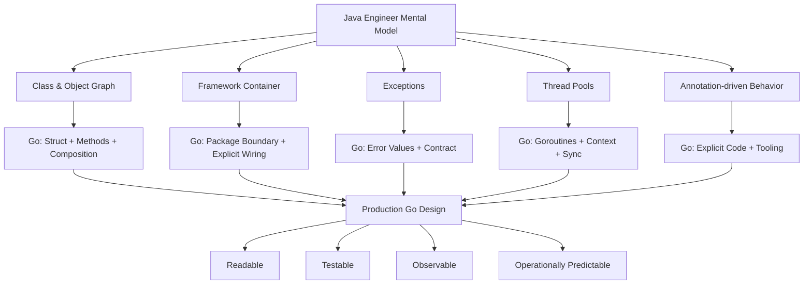
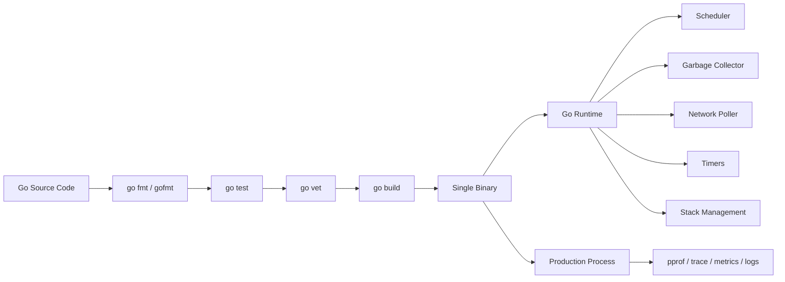
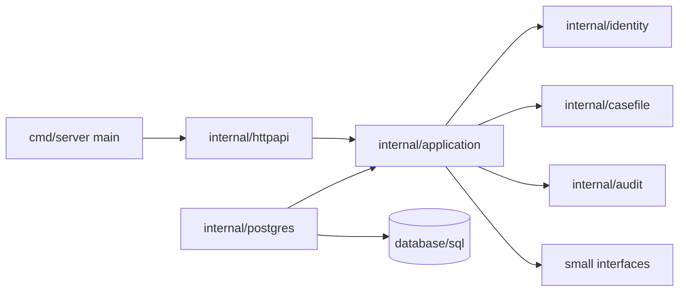
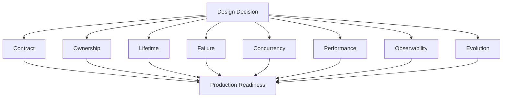
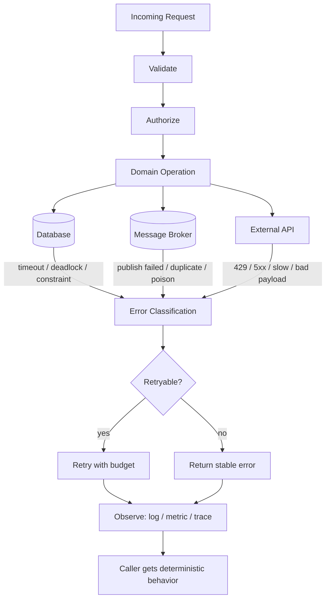

# learn-go-part-000.md

# Go Lang Part 000 — Orientation, Mental Model, dan Peta Belajar untuk Java Engineer

> Series: `learn-go`  
> Part: `000 / 034`  
> Target pembaca: Java software engineer yang ingin berpindah dari “bisa menulis Go” menjadi “mampu mendesain, mengoperasikan, dan me-review sistem Go production-grade”.  
> Target versi: Go `1.26.x`; baseline stabil saat materi ini ditulis: Go `1.26.4` released `2026-06-02`.  
> Status seri: belum selesai. Ini adalah bagian pembuka, bukan bagian terakhir.

---

## 0. Sumber resmi yang digunakan

Materi ini disusun dengan basis dokumentasi dan referensi resmi berikut:

1. Go 1.26 Release Notes — https://go.dev/doc/go1.26
2. Go Release History — https://go.dev/doc/devel/release
3. The Go Programming Language Specification — https://go.dev/ref/spec
4. Effective Go — https://go.dev/doc/effective_go
5. How to Write Go Code — https://go.dev/doc/code
6. Go Modules Reference — https://go.dev/ref/mod
7. Go Documentation Index — https://go.dev/doc/
8. Go Memory Model — https://go.dev/ref/mem
9. A Guide to the Go Garbage Collector — https://go.dev/doc/gc-guide
10. Data Race Detector — https://go.dev/doc/articles/race_detector
11. Go Code Review Comments — https://go.dev/wiki/CodeReviewComments
12. Go Concurrency Patterns: Pipelines and cancellation — https://go.dev/blog/pipelines
13. Go Concurrency Patterns: Context — https://go.dev/blog/context
14. Using go fix to modernize Go code — https://go.dev/blog/gofix
15. FIPS 140-3 Compliance — https://go.dev/doc/security/fips140

Catatan penting: Go `1.26.0` dirilis pada `2026-02-10`, dan Go `1.26.4` dirilis pada `2026-06-02` dengan security fixes dan bug fixes pada compiler, runtime, `go fix`, `crypto/fips140`, serta beberapa package standard library. Seri ini menggunakan Go `1.26.x` sebagai target, tetapi tetap menjaga prinsip kompatibilitas Go 1.

---

## 1. Tujuan bagian ini

Bagian ini bukan tutorial syntax. Syntax akan mulai dibahas pada part berikutnya. Bagian ini menjawab pertanyaan yang lebih penting:

> “Sebagai Java engineer, bagaimana cara berpikir yang benar ketika masuk ke Go, supaya tidak sekadar memindahkan style Java ke bahasa Go?”

Setelah menyelesaikan part 000, kamu harus punya mental model berikut:

1. Go bukan “Java tanpa class”.
2. Go bukan “C dengan garbage collector”.
3. Go bukan bahasa minimalis karena kurang fitur; Go memilih fitur secara selektif untuk menjaga simplicity, build speed, readability, dan operability.
4. Desain Go production-grade lebih banyak bergantung pada package boundary, interface boundary, explicit error contract, cancellation, timeout, allocation discipline, dan observability dibanding framework magic.
5. Go terlihat sederhana di permukaan, tetapi kedalaman engineering-nya muncul saat sistem harus reliable, concurrent, debuggable, secure, dan maintainable di production.

---

## 2. Posisi Go dalam peta bahasa modern

Go adalah bahasa statically typed, compiled, garbage-collected, concurrent, dan package-oriented. Spesifikasi Go menyebut Go sebagai bahasa general-purpose yang didesain dengan systems programming in mind, strongly typed, garbage-collected, dan memiliki explicit support for concurrent programming.

Namun definisi itu belum cukup. Untuk engineer yang sudah kuat di Java, posisi Go lebih tepat dipahami seperti ini:

```text
Go mengoptimalkan software engineering pada skala tim dan sistem:

- kode mudah dibaca
- build cepat
- dependency eksplisit
- binary mudah dideploy
- concurrency murah tetapi tetap harus disiplin
- standard library kuat
- runtime cukup pintar, tetapi tidak menutupi keputusan desain buruk
- tooling konsisten: gofmt, go test, go vet, go fix, pprof, trace, race detector
```

Java banyak tumbuh melalui ekosistem framework: Spring, Jakarta EE, Hibernate, Maven/Gradle, annotation processors, reflection, dynamic proxies, DI containers, bytecode agents, application servers, dan runtime tuning yang kaya.

Go tumbuh dengan orientasi berbeda:

```text
Go cenderung menolak kompleksitas yang tidak perlu masuk ke bahasa dan framework.
Ia lebih memilih:

- explicit dependency daripada container magic
- small interface daripada hierarchy besar
- simple package boundary daripada layer abstraksi berlebihan
- error sebagai return value daripada exception propagation
- composition daripada inheritance
- standard library first daripada framework first
- concurrency primitive daripada abstraction stack yang terlalu tinggi
```

Ini tidak berarti Go anti-framework. Artinya: dalam Go, framework biasanya bukan pusat arsitektur. Package design dan runtime behavior lebih penting.

---

## 3. Mental model utama: Go bukan Java dengan syntax berbeda

Banyak Java engineer pertama kali menulis Go dengan gaya seperti ini:

```text
Java mental model yang sering terbawa:

- semua entity dijadikan class-like struct besar
- interface didefinisikan di sisi provider
- package mengikuti layer: controller/service/repository/model
- dependency injection dicari sejak awal
- error dianggap seperti checked exception yang dibungkus-bungkus
- goroutine dianggap thread pool kecil
- channel dianggap queue universal
- context dijadikan map global request data
- pointer dianggap sama seperti reference Java
- zero value dianggap bahaya karena mirip null
```

Sebagian asumsi ini salah, sebagian hanya setengah benar.

Di Go, desain yang idiomatik biasanya bergerak dari pertanyaan berbeda:

```text
- Data apa yang dimiliki fungsi ini?
- Siapa yang boleh memutasi data ini?
- Apakah nilai ini aman dicopy?
- Apakah dependency ini benar-benar perlu interface?
- Apakah interface ini milik consumer atau provider?
- Apa contract error yang boleh diandalkan caller?
- Siapa yang memulai goroutine, dan siapa yang menghentikannya?
- Apa batas timeout operasi ini?
- Apakah resource lifecycle terlihat dari kode?
- Apakah package ini punya API kecil, stabil, dan bisa dites?
```

---

## 4. Diagram besar: perpindahan mental model Java ke Go



Poin terpenting diagram ini: Go tidak memindahkan semua konsep Java satu-ke-satu. Go memaksa kamu mendesain ulang representasi masalah.

---

## 5. Filosofi engineering Go

Go sering dijelaskan dengan kata “simple”. Tetapi simple dalam konteks Go bukan berarti “sedikit konsep”. Simple berarti:

```text
- sedikit cara untuk melakukan hal yang sama
- struktur kode mudah dibaca oleh engineer lain
- format kode seragam
- dependency terlihat
- failure path terlihat
- concurrent behavior bisa diaudit
- binary bisa dibangun dan dijalankan tanpa ritual besar
```

### 5.1 Simplicity bukan superficial simplicity

Contoh superficial simplicity:

```go
func Process(id string) {
    go doSomething(id)
}
```

Kode ini pendek, tetapi buruk jika tidak jelas:

1. siapa pemilik goroutine,
2. kapan goroutine berhenti,
3. bagaimana error dikembalikan,
4. bagaimana cancellation bekerja,
5. apakah ada backpressure,
6. apakah `id` cukup untuk observability,
7. apakah panic di goroutine akan mematikan process,
8. apakah operasi ini idempotent.

Go production-grade menilai simplicity bukan dari jumlah baris, tetapi dari kejelasan lifetime dan contract.

### 5.2 Explicitness lebih penting dari cleverness

Go cenderung lebih suka kode eksplisit:

```go
result, err := svc.CreateApplication(ctx, cmd)
if err != nil {
    return nil, fmt.Errorf("create application: %w", err)
}
return result, nil
```

Daripada abstraksi tersembunyi yang sulit ditelusuri:

```text
@Transaction
@Retryable
@Validated
@Secured
@Audit
public Application create(...) { ... }
```

Bukan berarti annotation buruk. Di Java, annotation adalah bagian normal dari ekosistem. Tetapi jika style itu dibawa mentah-mentah ke Go, kamu akan kehilangan salah satu kekuatan Go: local reasoning.

Local reasoning artinya engineer bisa membaca satu fungsi/package dan memahami sebagian besar behavior tanpa perlu menelusuri framework runtime, reflection, annotation processor, atau dynamic proxy.

---

## 6. Apa yang Go optimalkan?

Go mengoptimalkan beberapa hal yang sangat relevan untuk sistem production:

| Area | Implikasi praktis |
|---|---|
| Fast build | Feedback loop cepat; cocok untuk repo besar dan CI |
| Static binary | Deployment sederhana; cocok untuk container dan service kecil |
| Standard formatting | Mengurangi debat style; semua orang membaca bentuk kode yang sama |
| Small language | Engineer baru bisa membaca kode lebih cepat |
| Strong standard library | Banyak kebutuhan service tidak butuh framework besar |
| Built-in concurrency | Goroutine/channel/sync tersedia tanpa library eksternal |
| GC + value semantics | Produktif, tetapi tetap bisa perform jika paham allocation |
| Tooling built-in | Test, benchmark, fuzzing, race detector, pprof, trace, vet, fix |
| Go 1 compatibility | Upgrade lebih stabil dibanding ekosistem yang sering breaking |

Namun optimisasi ini punya konsekuensi.

Go tidak memberi semua fitur expressive yang biasa kamu temukan di Java/Kotlin/C#/Scala. Tidak ada inheritance class. Tidak ada exception. Tidak ada generic variance model kompleks. Tidak ada annotation-driven metaprogramming sebagai pusat bahasa. Tidak ada operator overloading. Tidak ada implicit conversion antar numeric types.

Ini bukan kekurangan acak. Banyak di antaranya adalah trade-off desain.

---

## 7. Apa yang Go tidak coba optimalkan?

Go bukan bahasa terbaik untuk semua skenario.

Go tidak mencoba menjadi:

1. bahasa paling expressive untuk type-level programming,
2. bahasa paling low-level seperti C/Rust,
3. bahasa paling functional,
4. bahasa enterprise framework-heavy,
5. bahasa scripting paling fleksibel,
6. bahasa dengan abstraction density tertinggi.

Go unggul ketika kamu butuh:

```text
- network service
- microservice
- CLI tool
- infrastructure tooling
- backend API
- data pipeline sederhana-menengah
- agent/daemon
- sidecar
- platform engineering tool
- high-concurrency I/O-bound system
- service yang mudah di-build, di-test, dan di-deploy
```

Go masih bisa digunakan untuk sistem kompleks. Kubernetes, Docker, Terraform, Prometheus, Grafana components, dan banyak tooling cloud-native lahir dari ekosistem Go. Tetapi cara mengelola complexity di Go berbeda: bukan dengan hierarchy/framework besar, melainkan dengan package design, interface boundary, explicit lifecycle, dan testability.

---

## 8. Model sistem Go: language, tools, runtime, standard library

Go harus dipahami sebagai satu paket engineering system, bukan hanya language syntax.



Dalam Java, kamu sering berpikir:

```text
source -> bytecode -> JVM -> application server/framework -> runtime agents -> process
```

Dalam Go, alurnya lebih langsung:

```text
source -> go toolchain -> binary -> Go runtime embedded in binary -> process
```

Runtime Go tetap ada. Binary Go bukan “tanpa runtime”. Ia membawa scheduler, garbage collector, stack management, timers, network poller, dan runtime metadata. Tetapi deployment model-nya terasa lebih sederhana karena runtime tersebut ikut ter-link ke binary.

---

## 9. Perbedaan fundamental Java vs Go

### 9.1 Class vs package-oriented design

Java biasanya mengorganisasi kode di sekitar class dan framework layer.

```text
com.company.app.controller
com.company.app.service
com.company.app.repository
com.company.app.entity
com.company.app.dto
```

Di Go, package seharusnya merepresentasikan capability atau domain boundary, bukan sekadar layer teknis.

Contoh yang kurang Go-like:

```text
/internal/controller
/internal/service
/internal/repository
/internal/model
/internal/dto
```

Contoh yang lebih Go-like:

```text
/internal/application
/internal/casefile
/internal/document
/internal/identity
/internal/approval
/internal/audit
/internal/postgres
/internal/httpapi
```

Bukan berarti folder `service` selalu salah. Tetapi jika seluruh sistem Go hanya menyalin layer Spring, kamu akan kehilangan package cohesion.

Mental model Go:

```text
Package adalah unit desain, bukan hanya folder.
Package harus punya alasan bisnis atau teknis yang jelas.
Package harus punya API kecil.
Package harus menyembunyikan detail internal.
Package harus mudah dites tanpa bootstrapping besar.
```

### 9.2 Inheritance vs composition

Java:

```java
abstract class BaseHandler { ... }
class ApplicationHandler extends BaseHandler { ... }
```

Go:

```go
type Handler struct {
    Clock  Clock
    Store  Store
    Logger *slog.Logger
}
```

Go tidak punya class inheritance. Go memakai composition, embedding, dan interfaces.

Yang perlu kamu ubah bukan hanya syntax, tapi cara desain reuse.

```text
Java reuse sering lewat inheritance atau framework extension point.
Go reuse lebih sering lewat small function, small interface, struct composition, dan package boundary.
```

### 9.3 Nominal interface vs structural interface

Java:

```java
class OracleApplicationRepository implements ApplicationRepository { ... }
```

Go:

```go
type ApplicationStore interface {
    Save(ctx context.Context, app Application) error
    Find(ctx context.Context, id ApplicationID) (Application, error)
}
```

Implementasi Go tidak perlu deklarasi `implements`.

```go
type PostgresApplicationStore struct { ... }

func (s *PostgresApplicationStore) Save(ctx context.Context, app Application) error { ... }
func (s *PostgresApplicationStore) Find(ctx context.Context, id ApplicationID) (Application, error) { ... }
```

Jika method set cocok, type itu memenuhi interface secara implicit.

Konsekuensi besar:

```text
Di Go, interface sering lebih baik didefinisikan oleh consumer,
bukan provider.
```

Provider tidak perlu memaksakan semua consumer memakai interface besar.
Consumer bisa mendefinisikan capability minimum yang ia butuhkan.

### 9.4 Exception vs error value

Java:

```java
try {
    repository.save(entity);
} catch (DuplicateKeyException e) {
    throw new BusinessException("duplicate application", e);
}
```

Go:

```go
if err := store.Save(ctx, app); err != nil {
    if errors.Is(err, ErrDuplicateApplication) {
        return fmt.Errorf("application already exists: %w", err)
    }
    return fmt.Errorf("save application: %w", err)
}
```

Error di Go bukan “gangguan syntax”. Error adalah bagian dari domain contract.

Pertanyaan production-grade:

```text
- Apakah error ini retryable?
- Apakah error ini user-visible?
- Apakah caller boleh melakukan errors.Is/errors.As?
- Apakah wrapping menjaga root cause?
- Apakah message mengandung PII/secrets?
- Apakah error perlu correlation ID di log, bukan di error string?
- Apakah error ini operational, programmer error, validation error, atau security event?
```

### 9.5 Null vs zero value

Java punya `null`. Go punya `nil` untuk pointer, slice, map, channel, function, dan interface. Tetapi Go juga sangat mengandalkan zero value.

Contoh:

```go
var count int        // 0
var name string     // ""
var active bool     // false
var items []string  // nil slice, tapi len(items) == 0
var m map[string]int // nil map, read aman, write panic
```

Zero value bisa menjadi fitur desain. Banyak type standard library dibuat usable dengan zero value.

Namun kamu harus membedakan:

```text
nil slice  : sering aman sebagai empty collection
nil map    : read aman, write panic
nil channel: send/receive block forever
nil pointer: dereference panic
nil interface: punya trap khusus ketika dynamic type tidak nil
```

### 9.6 Thread vs goroutine

Goroutine bukan sekadar “thread kecil”. Goroutine adalah unit eksekusi ringan yang dijadwalkan Go runtime di atas OS threads.

Tetapi bahaya Go bukan pada cara membuat goroutine:

```go
go f()
```

Bahaya Go ada pada lifecycle:

```text
- kapan goroutine berhenti?
- siapa yang membatalkan pekerjaan?
- apakah goroutine bisa block selamanya?
- apakah channel punya owner yang jelas?
- apakah error dari goroutine dikumpulkan?
- apakah ada limit concurrency?
- apakah ada backpressure?
```

Go 1.26 bahkan menambahkan experimental goroutine leak profile, yang mendeteksi kelas leak tertentu ketika goroutine block pada concurrency primitive yang tidak mungkin unblocked. Ini menegaskan bahwa goroutine lifetime adalah isu production nyata, bukan topik akademik.

### 9.7 JVM GC vs Go GC

Java engineer biasanya sudah familiar dengan GC tuning, heap sizing, allocation rate, pause time, object graph, dan JVM flags.

Go juga punya GC, tetapi mental model-nya berbeda.

Go GC harus dipahami bersama:

```text
- allocation rate
- live heap
- pointer density
- escape analysis
- stack vs heap placement
- goroutine stack
- GOGC / memory limit
- pprof heap profile
- runtime metrics
```

Go 1.26 mengaktifkan Green Tea garbage collector secara default. Release notes menyatakan GC ini meningkatkan locality dan CPU scalability untuk marking/scanning small objects, dengan ekspektasi pengurangan overhead GC pada real-world programs yang heavily use GC, walaupun hasil benchmark bervariasi.

Kesimpulan praktis:

```text
Di Java, kamu sering bertanya: heap berapa, GC apa, pause berapa?
Di Go, kamu harus lebih awal bertanya: alokasi ini perlu tidak? data ini pointer-heavy tidak? slice ini escape tidak? goroutine ini menahan referensi besar tidak?
```

---

## 10. Go 1.26.x: apa yang relevan untuk seri ini?

Go 1.26 adalah major release yang sebagian besar perubahannya berada di toolchain, runtime, dan library. Ia tetap menjaga Go 1 compatibility promise.

Hal-hal yang relevan untuk seri ini:

### 10.1 `new` dengan initial expression

Sebelumnya, jika ingin pointer ke value literal/hasil ekspresi, pattern umum:

```go
age := yearsSince(born)
p := &age
```

Go 1.26 memperbolehkan:

```go
p := new(yearsSince(born))
```

Ini berguna untuk optional field dalam JSON/protobuf-like modeling, misalnya field `*int` untuk membedakan “unknown” vs `0`.

Namun ini bukan alasan untuk membuat semua hal menjadi pointer. Pointer tetap harus dipakai karena semantic need, bukan karena style.

### 10.2 Generic self-reference constraint lebih kuat

Go 1.26 menghapus restriction bahwa generic type tidak boleh merujuk ke dirinya dalam type parameter list. Ini memungkinkan constraint seperti:

```go
type Adder[A Adder[A]] interface {
    Add(A) A
}
```

Ini relevan untuk part generics, tetapi bukan fondasi utama Go. Banyak production Go tetap menggunakan generics secara selektif.

### 10.3 `go fix` sebagai modernizer

Go 1.26 merombak `go fix` menjadi modernizer yang dibangun di atas analysis framework yang sama dengan `go vet`. Ini penting untuk long-lived codebase karena Go punya budaya upgrade yang relatif stabil, tetapi idiom dan standard library tetap berevolusi.

### 10.4 `go mod init` default version lebih konservatif

Dengan toolchain `1.N.X`, `go mod init` sekarang membuat `go.mod` dengan `go 1.(N-1).0`. Untuk Go 1.26, default-nya `go 1.25.0`. Tujuannya agar module baru compatible dengan versi Go yang masih didukung.

Implikasi: jangan asal mengira `go.mod` otomatis memakai versi toolchain yang sedang dipakai. Kita akan bahas detail pada part module/toolchain.

### 10.5 Green Tea GC default

Go 1.26 mengaktifkan Green Tea GC secara default. Fokusnya adalah peningkatan locality dan CPU scalability untuk marking/scanning small objects.

Implikasi untuk engineer:

```text
- tetap ukur dengan benchmark dan profile
- jangan menganggap upgrade runtime otomatis memperbaiki desain alokasi buruk
- pahami allocation profile sebelum tuning
```

### 10.6 Faster cgo calls

Baseline runtime overhead cgo calls berkurang sekitar 30%. Tetapi cgo tetap boundary yang harus diperlakukan hati-hati: build complexity, portability, memory safety, scheduler interaction, dan security surface.

### 10.7 Heap base address randomization

Pada 64-bit platforms, runtime mengacak heap base address saat startup sebagai security enhancement, terutama relevan untuk eksploitasi yang melibatkan cgo.

### 10.8 Experimental goroutine leak profile

Go 1.26 menyediakan experimental `goroutineleak` profile melalui `runtime/pprof` dengan `GOEXPERIMENT=goroutineleakprofile`. Ini sangat relevan untuk service production karena goroutine leaks sering muncul dari:

```text
- early return tanpa drain channel
- worker tidak berhenti saat context canceled
- send ke channel tanpa receiver
- receive dari channel yang tidak pernah closed
- blocked mutex/cond karena lifecycle object sudah hilang
```

### 10.9 Slice stack allocation lebih luas

Compiler dapat menaruh backing store slice di stack dalam lebih banyak situasi. Ini bisa meningkatkan performa, tetapi tetap perlu dipahami lewat escape analysis dan benchmark.

### 10.10 Package baru/eksperimental di security dan performance

Go 1.26 menambahkan `crypto/hpke`, experimental `simd/archsimd`, dan experimental `runtime/secret`. Seri ini akan membahas ini pada part security/performance, bukan part awal.

---

## 11. Roadmap seri: kenapa urutannya seperti ini?

Kita tidak akan mulai dari “cara membuat REST API” karena itu terlalu cepat. Go engineer yang kuat harus memahami fondasi terlebih dahulu.

```mermaid
flowchart TD
    P0[Part 000: Orientation] --> P1[Toolchain & Build]
    P1 --> P2[Syntax & Control Flow]
    P2 --> P3[Functions & Defer]
    P3 --> P4[Types & Methods]
    P4 --> P5[Composition]
    P5 --> P6[Interfaces]
    P6 --> P7[Generics]
    P7 --> P8[Errors]
    P8 --> P9[Package Design]
    P9 --> P10[Modules]
    P10 --> P11[Standard Library]
    P11 --> P12[Collections]
    P12 --> P13[Memory & Escape]
    P13 --> P14[Runtime]
    P14 --> P15[GC]
    P15 --> P16[Concurrency]
    P16 --> P17[Concurrency Patterns]
    P17 --> P18[Shared Memory]
    P18 --> P19[Context]
    P19 --> P20[IO]
    P20 --> P21[Networking]
    P21 --> P22[HTTP Server]
    P22 --> P23[HTTP Client]
    P23 --> P24[Serialization]
    P24 --> P25[CLI/Daemon/Config]
    P25 --> P26[Testing]
    P26 --> P27[Benchmark/Profile]
    P27 --> P28[Database]
    P28 --> P29[Messaging]
    P29 --> P30[Security]
    P30 --> P31[Observability]
    P31 --> P32[Architecture]
    P32 --> P33[Cloud Native]
    P33 --> P34[Capstone]
```



Alasan urutannya:

```text
Kalau belum paham value/pointer/interface/error,
kamu akan menulis service Go yang tampak jalan tapi sulit dirawat.

Kalau belum paham context/concurrency/lifetime,
kamu akan membuat goroutine leak, timeout kacau, dan shutdown tidak bersih.

Kalau belum paham allocation/runtime/profile,
kamu akan menebak-nebak performa.

Kalau belum paham package boundary,
kamu akan membuat mini-Spring yang tidak idiomatik.
```

---

## 12. Peta kompetensi: dari beginner ke top-tier Go engineer

### 12.1 Level 1 — Syntax user

Ciri-ciri:

```text
- bisa membuat function, struct, method
- bisa menjalankan go run dan go test
- bisa membuat HTTP handler sederhana
- tahu err != nil
```

Kelemahan umum:

```text
- package design buruk
- terlalu banyak pointer
- interface terlalu besar
- context disalahgunakan
- goroutine tanpa lifecycle
- error tidak punya contract
```

### 12.2 Level 2 — Idiomatic Go developer

Ciri-ciri:

```text
- memahami zero value
- menulis table-driven tests
- memakai interface kecil
- menulis error wrapping yang masuk akal
- tahu kapan menggunakan channel vs mutex
- memakai context untuk cancellation/deadline
- menggunakan gofmt/go vet/race detector
```

### 12.3 Level 3 — Production Go engineer

Ciri-ciri:

```text
- mendesain timeout dari edge sampai dependency
- memahami connection pool dan resource lifecycle
- membuat graceful shutdown benar
- menghindari goroutine leak
- memahami pprof heap/cpu/goroutine/block/mutex profile
- memakai benchmark untuk keputusan performa
- membuat package API stabil
- mengelola dependency dan module version dengan disiplin
```

### 12.4 Level 4 — Senior/Staff-level Go engineer

Ciri-ciri:

```text
- bisa menilai trade-off design secara sistemik
- bisa membuat library internal yang kecil tapi kuat
- bisa me-review concurrency bug dari kode
- bisa membaca runtime/profile evidence
- bisa mendesain failure semantics dan observability
- bisa memimpin migration Java/Node/.NET service ke Go secara realistis
- bisa menentukan kapan Go bukan pilihan terbaik
```

### 12.5 Level 5 — Top 1% practical Go engineer

Ciri-ciri:

```text
- punya mental model runtime, memory, package, API, dan ops sekaligus
- mampu menulis kode sederhana yang bertahan di production complexity
- mampu menghindari abstraction trap
- mampu membangun sistem yang mudah di-debug saat incident
- mampu mengajarkan invariants ke tim
- mampu membuat keputusan dengan measurement, bukan taste
- mampu membaca source standard library/runtime saat perlu
```

Top 1% bukan berarti hafal semua package. Top 1% berarti punya judgment yang tajam.

---

## 13. Core mental models yang harus dibangun

### 13.1 Program Go adalah komposisi package

Go program bukan tree class. Go program adalah graph package.



Dependency direction harus disengaja. Package domain tidak seharusnya bergantung pada package transport. Package business logic tidak seharusnya tahu HTTP status code kecuali memang boundary-nya HTTP.

### 13.2 Interface adalah demand-side contract

Dalam Java, provider sering membuat interface:

```text
UserRepository interface
UserRepositoryImpl class
```

Di Go, jika hanya ada satu implementation dan tidak ada consumer yang butuh abstraction, interface mungkin belum perlu.

Rule praktis:

```text
Accept interfaces, return concrete types.
```

Artinya function/method boleh menerima interface kecil untuk dependency yang ia butuhkan, tetapi constructor biasanya mengembalikan concrete type agar capability-nya jelas.

Namun rule ini bukan dogma. Kita akan bahas exception-nya di part interface dan package design.

### 13.3 Error adalah data, bukan control-flow teleport

Go tidak punya exception untuk normal error handling. Ini membuat failure path lebih terlihat.

Mental model:

```text
Setiap fungsi yang bisa gagal harus mendeklarasikan kegagalan lewat return value.
Caller tidak boleh pura-pura tidak tahu.
```

Tetapi explicit error handling bukan berarti setiap level harus log error.

Anti-pattern:

```go
if err != nil {
    log.Println(err)
    return err
}
```

Jika setiap layer log dan return, production log menjadi noisy dan duplicated. Biasanya error dibungkus di lower/mid layer dan dilog sekali di boundary.

### 13.4 Context adalah cancellation/deadline propagation, bukan dependency bag

Context digunakan untuk membawa:

```text
- cancellation signal
- deadline/timeout
- request-scoped values yang benar-benar request-scoped
```

Context bukan tempat menyimpan logger global, database, user repository, config besar, atau arbitrary map karena malas mendesain parameter.

### 13.5 Goroutine harus punya owner

Setiap `go f()` harus menjawab:

```text
- owner-nya siapa?
- berhentinya kapan?
- bagaimana error-nya diamati?
- apa yang terjadi saat context canceled?
- apakah ada limit jumlah goroutine?
```

Jika tidak bisa menjawab, jangan start goroutine dulu.

### 13.6 Channel adalah synchronization/communication primitive, bukan default queue

Channel bagus untuk ownership transfer dan synchronization. Tetapi tidak semua concurrency butuh channel.

Gunakan mutex jika:

```text
- kamu melindungi state shared in-memory
- critical section jelas
- ownership tetap di object yang sama
```

Gunakan channel jika:

```text
- kamu mengirim ownership event/data antar goroutine
- kamu membuat pipeline
- kamu butuh select terhadap cancellation/timer/input
```

### 13.7 Pointer bukan Java reference

Di Java, hampir semua object variable adalah reference. Di Go, value copy adalah default untuk banyak type.

Pointer dipakai jika:

```text
- perlu mutasi receiver/value yang sama
- copy terlalu mahal
- perlu represent optional/nil
- method set membutuhkan pointer receiver
- identity object memang penting
```

Pointer tidak boleh dipakai hanya karena “di Java object selalu reference”.

### 13.8 Allocation adalah design signal

Jika kode Go terlalu banyak allocation, biasanya ada design smell:

```text
- terlalu banyak temporary object
- string/[]byte conversion berulang
- interface{} / any menyebabkan boxing-like behavior
- closure menangkap variable besar
- slice/map tumbuh tanpa preallocation
- pointer-heavy object graph
- goroutine menahan reference lebih lama dari perlu
```

Kita tidak akan premature optimize. Tetapi top engineer harus bisa membaca allocation profile.

---

## 14. Cara berpikir production-grade sejak awal

Kita akan sering memakai template reasoning berikut:

```text
1. Contract
   Apa yang dijanjikan function/package/API ini?

2. Ownership
   Siapa pemilik data/resource/goroutine/channel?

3. Lifetime
   Kapan dibuat, kapan dilepas, siapa yang menutup?

4. Failure
   Bagaimana gagal, siapa yang tahu, apakah retryable?

5. Concurrency
   Apakah ada shared state? Apakah ada race? Apakah ada backpressure?

6. Performance
   Apakah allocation dan blocking behavior masuk akal?

7. Observability
   Kalau gagal di production, evidence apa yang tersedia?

8. Evolution
   Apakah API/package ini bisa berubah tanpa merusak consumer?
```

Diagram:



---

## 15. Contoh kecil: porting Java secara buruk vs desain Go yang lebih sehat

### 15.1 Gaya Java yang sering terbawa

```go
type ApplicationServiceInterface interface {
    CreateApplication(request CreateApplicationRequest) (*ApplicationResponse, error)
}

type ApplicationServiceImpl struct {
    Repository ApplicationRepositoryInterface
    Validator  ApplicationValidatorInterface
    Mapper     ApplicationMapperInterface
}
```

Masalah:

1. Nama `Interface` dan `Impl` biasanya tidak idiomatik.
2. Interface besar di sisi provider sering premature.
3. Context tidak ada, sehingga cancellation/deadline tidak bisa dipropagasi.
4. Request/response naming mungkin terlalu meniru controller DTO.
5. Tidak jelas error contract-nya.
6. Tidak jelas package boundary-nya.

### 15.2 Versi Go yang lebih baik sebagai arah awal

```go
type Creator struct {
    store Store
    clock Clock
}

type Store interface {
    Save(ctx context.Context, app Application) error
}

type Clock interface {
    Now() time.Time
}

func NewCreator(store Store, clock Clock) *Creator {
    return &Creator{store: store, clock: clock}
}

func (c *Creator) Create(ctx context.Context, cmd CreateCommand) (ApplicationID, error) {
    if err := cmd.Validate(); err != nil {
        return "", fmt.Errorf("validate create application command: %w", err)
    }

    app := NewApplication(cmd, c.clock.Now())

    if err := c.store.Save(ctx, app); err != nil {
        return "", fmt.Errorf("save application: %w", err)
    }

    return app.ID, nil
}
```

Ini belum final design. Tetapi arahnya lebih Go-like:

```text
- type name singkat sesuai package context
- dependency kecil
- interface sesuai kebutuhan consumer
- context eksplisit
- error dibungkus dengan operation context
- constructor explicit
- domain command dibedakan dari transport request
```

---

## 16. Java-to-Go translation table

| Java concept | Jangan langsung diterjemahkan menjadi | Go mental model yang lebih tepat |
|---|---|---|
| Class | Struct besar dengan semua method | Data + behavior kecil; package-level design |
| Interface | `XInterface` untuk semua service | Small behavioral contract, sering di sisi consumer |
| Abstract class | Embedded struct besar | Composition; function; interface kecil |
| Exception | Panic atau global error wrapper | Error value dengan contract eksplisit |
| Checked exception | Return error di semua tempat tanpa desain | Error classification dan caller responsibility |
| Spring DI | Container Go global | Explicit constructor wiring; compile-time clarity |
| Annotation | Struct tag atau reflection custom | Explicit code; tags hanya untuk metadata terbatas |
| Thread pool | Goroutine bebas | Bounded concurrency, worker lifecycle, context |
| CompletableFuture | Channel untuk semua async | errgroup/pipeline/select/sync sesuai kasus |
| synchronized | Channel | Mutex untuk shared state; channel untuk communication |
| Optional<T> | Pointer di semua tempat | Pointer hanya jika nil punya semantic meaning |
| Stream API | Chained abstraction | Loop biasa sering lebih jelas dan cepat |
| Lombok | Code generation everywhere | Kode eksplisit; generator hanya bila payoff jelas |
| Maven multi-module | Banyak Go module | Satu module dengan banyak package sering cukup |
| JAR/WAR | Binary/container | Static-ish binary plus runtime embedded |
| JVM tuning | GOGC saja | Allocation, live heap, pprof, runtime metrics, memory limit |

---

## 17. Common traps untuk Java engineer

### Trap 1 — Membuat interface untuk setiap struct

Buruk:

```go
type UserService interface { ... }
type UserServiceImpl struct { ... }
```

Jika hanya satu implementation, belum ada test seam yang butuh interface, dan consumer tidak butuh abstraction, interface itu noise.

### Trap 2 — Package by technical layer

Buruk jika berlebihan:

```text
controller -> service -> repository -> entity -> dto -> mapper
```

Go lebih suka package yang cohesive berdasarkan capability/domain. Layer masih bisa ada di boundary, tetapi jangan menjadikan layer sebagai satu-satunya model.

### Trap 3 — Overusing pointer

Buruk:

```go
type Config struct {
    Port *int
    Name *string
    Enabled *bool
}
```

Pointer hanya perlu jika membedakan absent vs zero value. Kalau tidak, value lebih sederhana.

### Trap 4 — Panic untuk normal error

Panic bukan pengganti exception. Panic untuk programmer error atau unrecoverable invariant violation, bukan file tidak ditemukan, validation failed, duplicate key, timeout, atau dependency unavailable.

### Trap 5 — Goroutine tanpa cancellation

Buruk:

```go
func Start() {
    go func() {
        for {
            doWork()
        }
    }()
}
```

Pertanyaan yang hilang: bagaimana berhenti?

### Trap 6 — Channel sebagai queue universal

Channel bukan Kafka kecil. Untuk queue durable, pakai message broker. Untuk bounded in-memory worker queue, channel bisa cocok. Untuk shared map state, mutex mungkin lebih tepat.

### Trap 7 — Logging di semua layer

Log sekali di boundary. Lower layer cukup return error dengan context. Jika setiap layer log, incident analysis menjadi bising.

### Trap 8 — Mengabaikan `context.Context`

Semua operasi I/O, network, database, request-bound work harus punya context agar cancellation/deadline bisa berjalan.

### Trap 9 — Mengabaikan race detector

Kode Go concurrent yang tampak benar bisa punya data race. Race detector adalah tool wajib dalam CI/test workflow untuk package yang memiliki concurrency.

### Trap 10 — Mengira simple code pasti performant

Go membuat kode simple mudah ditulis. Tetapi allocation, interface dispatch, reflection, JSON encoding, goroutine leak, dan unbounded concurrency tetap bisa membuat performa buruk.

---

## 18. Apa itu idiomatic Go?

Idiomatic Go bukan sekadar:

```text
- pakai gofmt
- nama pendek
- err != nil
- jangan pakai framework
```

Idiomatic Go berarti kode mengikuti ekspektasi pembaca Go berpengalaman.

Ciri-cirinya:

```text
- package name jelas dan singkat
- exported API kecil
- error path eksplisit
- context ada di boundary operasi blocking/request-scoped
- interface kecil dan behavioral
- zero value dipertimbangkan
- receiver dipilih dengan alasan
- concurrency lifetime jelas
- tests mudah dijalankan dengan go test ./...
- dependency tidak mengejutkan
- kode bisa dibaca top-down
```

Go Code Review Comments menyebut dirinya sebagai kumpulan komentar umum saat review kode Go, bukan style guide komprehensif. Effective Go juga merupakan supplement terhadap spec, Tour of Go, dan How to Write Go Code. Jadi idiom Go adalah kombinasi antara spec, tooling, standard library convention, review culture, dan production experience.

---

## 19. Framework di Go: kapan perlu, kapan tidak?

Java engineer sering bertanya: “Framework Go yang setara Spring Boot apa?”

Jawaban yang lebih tepat:

```text
Pertama pahami net/http, context, database/sql, encoding/json, testing, pprof.
Setelah itu baru nilai apakah framework/router/library diperlukan.
```

Go standard library cukup kuat untuk banyak service. Router HTTP pihak ketiga, validation library, config library, OpenTelemetry, database driver, migration tool, dan gRPC library tetap umum digunakan. Tetapi arsitektur inti jangan bergantung pada framework magic.

Rule praktis:

```text
Gunakan library untuk mengurangi pekerjaan mekanis.
Jangan gunakan framework untuk menghindari berpikir tentang boundary, lifecycle, error, dan ownership.
```

---

## 20. Production Go: failure-first thinking

Sistem Go yang matang harus didesain dengan failure path sejak awal.



Untuk setiap dependency, kamu harus bertanya:

```text
- timeout berapa?
- retry boleh atau tidak?
- idempotency key ada atau tidak?
- duplicate handling bagaimana?
- partial failure bagaimana?
- error mana yang user-visible?
- log mana yang security-sensitive?
- metric apa yang harus ada?
```

Go tidak menyelesaikan pertanyaan ini untukmu. Go membuat jawabannya terlihat di kode.

---

## 21. Struktur kerja belajar setiap part

Untuk mendapatkan hasil maksimal, setiap part sebaiknya dipelajari dengan urutan:

```text
1. Baca mental model.
2. Tulis ulang contoh kecil secara manual.
3. Jalankan go test bila ada latihan.
4. Ubah kode dan amati error compiler.
5. Tambahkan failure case.
6. Jalankan race detector/profiler jika relevan.
7. Jawab review questions tanpa melihat jawaban.
8. Buat catatan “invariant” yang harus diingat.
```

Kita akan menghindari pembelajaran pasif.

---

## 22. Engineering invariants yang akan berulang di seri ini

Invariant adalah prinsip yang harus tetap benar meskipun implementasi berubah.

### Invariant 1 — Public API adalah contract

Begitu exported function/type dipakai package lain, ia menjadi contract.

```text
Ubah internal bebas.
Ubah exported API dengan sangat hati-hati.
```

### Invariant 2 — Caller harus tahu failure yang bisa ditindaklanjuti

Jika caller perlu membedakan duplicate, not found, validation, timeout, unauthorized, atau conflict, error design harus memungkinkan itu.

### Invariant 3 — Resource harus punya owner

File, connection, transaction, goroutine, ticker, timer, channel, lock, memory buffer: semuanya harus punya owner dan lifecycle.

### Invariant 4 — Concurrency harus bounded atau justified

Unbounded goroutine sama bahayanya dengan unbounded thread pool. Murah bukan berarti gratis.

### Invariant 5 — Context harus mengalir dari boundary ke dependency

Request masuk membawa deadline/cancellation. Operasi database, HTTP client, RPC, worker, dan blocking I/O harus menghormatinya.

### Invariant 6 — Observability bukan add-on

Jika sistem gagal dan kamu tidak bisa menjawab “apa yang terjadi?”, desainnya belum production-ready.

### Invariant 7 — Benchmark tanpa hypothesis adalah noise

Benchmark harus menjawab pertanyaan spesifik. Profiling harus dilakukan sebelum dan sesudah perubahan.

### Invariant 8 — Simplicity harus menjaga evolvability

Kode paling pendek bukan selalu paling sederhana. Kode sederhana adalah kode yang mudah diubah tanpa membuat failure mode tersembunyi.

---

## 23. Practical checklist sebelum menulis Go service pertama

Sebelum membuat service Go production, jawab:

```text
Language & package:
[ ] Apakah package boundary berdasarkan capability/domain, bukan hanya layer teknis?
[ ] Apakah exported API minimal?
[ ] Apakah naming mengikuti context package?

Error:
[ ] Apakah error dibungkus dengan operation context?
[ ] Apakah caller bisa membedakan error yang perlu dibedakan?
[ ] Apakah log tidak bocor PII/secrets?

Context & lifecycle:
[ ] Apakah semua blocking operation menerima context?
[ ] Apakah goroutine punya owner dan stop condition?
[ ] Apakah shutdown menunggu in-flight work dengan batas waktu?

Concurrency:
[ ] Apakah concurrency bounded?
[ ] Apakah shared state dilindungi mutex/atomic/channel dengan jelas?
[ ] Apakah race detector dijalankan?

I/O:
[ ] Apakah request/response body ditutup?
[ ] Apakah timeout HTTP client/server jelas?
[ ] Apakah database pool disetel realistis?

Observability:
[ ] Apakah log punya correlation/request ID?
[ ] Apakah metric untuk latency/error/saturation ada?
[ ] Apakah pprof/debug endpoint aman?

Performance:
[ ] Apakah hot path punya benchmark?
[ ] Apakah heap/cpu profile dibaca sebelum optimasi?
[ ] Apakah allocation besar disengaja?
```

---

## 24. Cara membaca dokumentasi Go secara efektif

Urutan referensi yang disarankan:

1. **Go Spec** untuk kebenaran bahasa.
2. **Effective Go** untuk idiom dasar.
3. **Go Code Review Comments** untuk review culture dan common mistakes.
4. **Standard library docs** untuk API detail.
5. **Go blog** untuk rationale dan pattern historis.
6. **Release notes** untuk perubahan versi.
7. **Runtime/GC docs** untuk performance dan production diagnosis.

Jangan hanya belajar dari blog random. Banyak materi Go di internet outdated, terutama setelah perubahan generics, loop variable semantics, toolchain management, fuzzing, PGO, structured logging, dan Go 1.26 runtime/tooling changes.

---

## 25. Skill yang harus kamu bangun selama seri

### 25.1 Reading skill

Mampu membaca kode Go orang lain dan langsung melihat:

```text
- package cohesion
- interface smell
- pointer/value misuse
- error wrapping quality
- context propagation
- goroutine lifetime
- possible data race
- allocation hotspots
```

### 25.2 Writing skill

Mampu menulis:

```text
- package API kecil
- domain type yang jelas
- error contract yang stabil
- test yang tidak brittle
- HTTP server/client yang timeout-aware
- worker yang bounded dan cancellable
- database transaction yang aman
```

### 25.3 Debugging skill

Mampu menggunakan:

```text
- go test
- go test -race
- go test -bench
- go test -run
- pprof CPU/heap/goroutine/block/mutex
- runtime/trace
- logs/metrics/traces
- GODEBUG secara hati-hati
```

### 25.4 Design skill

Mampu memutuskan:

```text
- kapan pakai interface
- kapan pakai generics
- kapan pakai pointer
- kapan pakai channel vs mutex
- kapan membuat package baru
- kapan butuh external library
- kapan Go cocok dan kapan tidak
```

---

## 26. Anti-goals seri ini

Seri ini tidak bertujuan:

1. membuat hafalan syntax tanpa mental model,
2. membuat clone Spring di Go,
3. memakai framework sebelum memahami standard library,
4. menjadikan channel sebagai solusi semua problem,
5. premature optimization tanpa measurement,
6. menulis kode “clever” yang sulit dibaca,
7. menutupi failure path dengan abstraction yang terlalu dini.

---

## 27. Mini lab part 000: diagnosis mental model

Jawab pertanyaan ini sebelum lanjut ke part 001.

### Pertanyaan 1

Mengapa “Go tidak punya inheritance” bukan sekadar kekurangan fitur?

Jawaban yang diharapkan:

```text
Karena Go mendorong composition dan small interface, sehingga reuse dan polymorphism dibangun dari capability, bukan class hierarchy. Ini membuat dependency lebih eksplisit dan mengurangi coupling inheritance tree.
```

### Pertanyaan 2

Mengapa `go f()` tanpa desain lifecycle berbahaya?

Jawaban yang diharapkan:

```text
Karena goroutine bisa block/leak, error bisa hilang, cancellation tidak berjalan, dan resource bisa tertahan. Murah membuat goroutine bukan berarti aman membuat goroutine tanpa owner.
```

### Pertanyaan 3

Mengapa interface sering lebih baik dibuat di sisi consumer?

Jawaban yang diharapkan:

```text
Karena consumer tahu capability minimum yang dibutuhkan. Provider tidak perlu memaksakan abstraction besar kepada semua caller. Ini menjaga interface kecil dan mengurangi coupling.
```

### Pertanyaan 4

Mengapa error di Go adalah bagian dari API contract?

Jawaban yang diharapkan:

```text
Karena caller menerima error sebagai value dan mungkin perlu melakukan classification, wrapping, retry, user response, atau observability. Error yang tidak dirancang akan membuat failure path tidak stabil.
```

### Pertanyaan 5

Mengapa belajar Go production-grade harus mencakup runtime dan GC?

Jawaban yang diharapkan:

```text
Karena performa Go sangat dipengaruhi allocation rate, live heap, pointer density, goroutine lifecycle, scheduler behavior, dan GC. Tanpa mental model runtime, optimasi dan debugging production hanya menjadi tebakan.
```

---

## 28. Pre-reading sebelum part 001

Sebelum lanjut ke part 001, baca ringan:

1. https://go.dev/doc/install
2. https://go.dev/doc/code
3. https://go.dev/ref/mod
4. https://go.dev/doc/go1.26

Tidak perlu menghafal. Tujuannya hanya familiar dengan istilah:

```text
- module
- package
- go.mod
- go.sum
- go command
- toolchain
- build
- test
- install
```

---

## 29. Ringkasan part 000

Jika hanya mengingat 12 hal dari bagian ini, ingat ini:

1. Go adalah engineering system: language + toolchain + runtime + standard library + conventions.
2. Go bukan Java dengan syntax berbeda.
3. Package adalah unit desain utama.
4. Composition menggantikan inheritance.
5. Interface bersifat structural dan sering lebih baik kecil di sisi consumer.
6. Error adalah value dan contract.
7. Zero value adalah bagian dari desain, bukan selalu bahaya.
8. Pointer bukan Java reference.
9. Goroutine harus punya owner dan lifecycle.
10. Context adalah cancellation/deadline propagation.
11. Performance Go harus dipahami lewat allocation, runtime, GC, dan profiling.
12. Production Go menuntut clarity: contract, ownership, lifetime, failure, concurrency, performance, observability, evolution.

---

## 30. Apa yang akan dibahas di part 001

Part berikutnya:

```text
learn-go-part-001.md
```

Topik:

```text
Go Toolchain, Workspace, Module, Build, Install, Cross-Compilation, Environment, dan go command deep dive
```

Part 001 akan membahas:

```text
- instalasi Go di Windows/Linux/macOS
- struktur GOROOT, GOPATH modern, GOMODCACHE
- go env
- go mod init
- go work
- go build
- go run
- go test
- go install
- go list
- go vet
- go fix Go 1.26
- module proxy dan checksum database
- private module
- reproducible build
- cross-compilation
- build tags
- versioning strategy untuk tim production
```

Status seri: belum selesai. Kita baru menyelesaikan `part 000` dari total rencana `35 part` (`000` sampai `034`).

<!-- NAVIGATION_FOOTER -->
<div class="page-nav">
<a href="./learn-go-MANIFEST.md">⬅️ go Complete Series Manifest</a>
<a href="./index.md">📚 Kategori</a>
<a href="../../index.md">🏠 Home</a>
<a href="./learn-go-part-001.md">Part 001 — Go Toolchain, Workspace, Module, Build, Install, Cross-Compilation, Environment, dan `go` Command Deep Dive ➡️</a>
</div>
