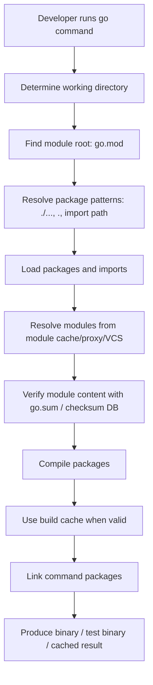
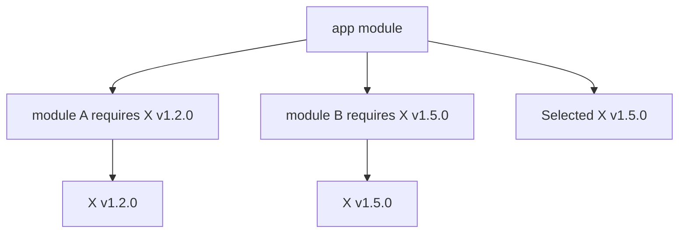
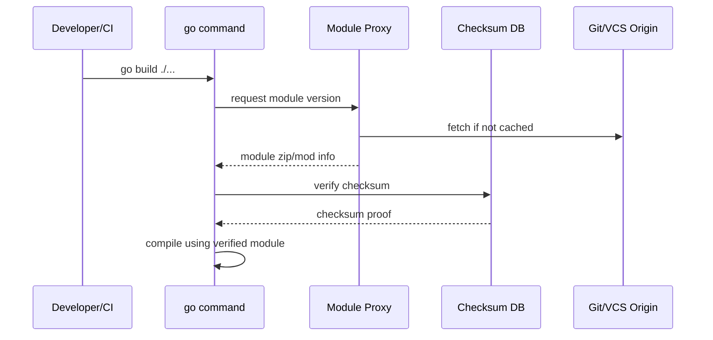
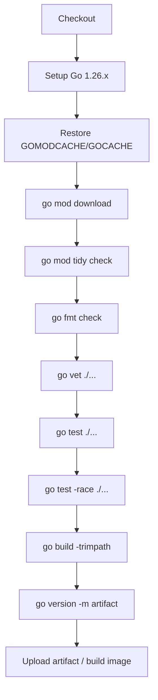

# learn-go-part-001.md

# Part 001 — Go Toolchain, Workspace, Module, Build, Install, Cross-Compilation, Environment, dan `go` Command Deep Dive

> Seri: `learn-go`  
> Target pembaca: Java software engineer yang ingin membangun pemahaman Go sampai level production-grade / internal engineering handbook.  
> Target versi: Go 1.26.x.  
> Fokus part ini: memahami ekosistem kerja Go dari toolchain sampai build artifact, bukan sekadar menghafal command.

---

## 0. Posisi Part Ini Dalam Seri

Pada part 000, kita membangun orientasi: Go bukan Java dengan syntax lebih kecil. Go memiliki model engineering yang berbeda: eksplisit, package-first, tooling-first, standard-library-first, dan runtime-aware.

Part 001 menjawab pertanyaan praktis pertama:

> Ketika saya menulis `go build`, `go test`, `go mod tidy`, atau `go install`, sebenarnya apa yang sedang terjadi?

Untuk menjadi engineer Go yang kuat, kamu tidak cukup tahu bahwa:

```bash
# salah satu command yang sering dipakai
go build ./...
```

Kamu harus tahu:

- package apa yang sedang ditemukan;
- module mana yang menjadi root dependency graph;
- versi toolchain mana yang dipilih;
- cache apa yang digunakan;
- dependency resolution berjalan dari mana;
- binary output berisi metadata apa;
- kapan `go.mod` berubah;
- kapan `go.sum` berubah;
- kapan build reproducible dan kapan tidak;
- kapan command terlihat berhasil tetapi sebenarnya merusak boundary project;
- bagaimana command behavior berubah antara local development, CI, dan container build.

Part ini adalah fondasi operasional. Tanpa ini, part selanjutnya seperti package design, concurrency, HTTP, database, testing, dan deployment akan terasa seperti kumpulan teknik terpisah.

---

## 1. Mental Model Utama

### 1.1 Go Tooling Bukan Add-on

Di Java, kita sering berpikir seperti ini:

```text
JDK + build tool + dependency manager + framework + plugin ecosystem
```

Contoh:

```text
Java source
  -> javac / Maven / Gradle
  -> dependency plugin
  -> test plugin
  -> shading plugin
  -> Spring Boot plugin
  -> container plugin
  -> artifact repository
```

Di Go, sebagian besar pengalaman inti sengaja dikonsolidasikan dalam satu command:

```text
Go source
  -> go command
      -> module resolution
      -> package loading
      -> compile
      -> link
      -> test
      -> vet
      -> format
      -> documentation
      -> install tools
      -> inspect build metadata
      -> manage workspace
```

Ini tidak berarti Go tidak bisa memakai Makefile, Taskfile, Bazel, Mage, Docker, atau CI scripts. Tetapi default mental model Go adalah:

> `go` command adalah interface resmi untuk memahami, membangun, menguji, dan mengelola project Go.

Kalau dalam Java kamu sering melihat Gradle/Maven sebagai pusat gravitasi, dalam Go pusat gravitasi adalah:

```bash
go help
go env
go list
go test
go build
go mod
go work
go tool
```

---

### 1.2 Module Adalah Unit Dependency, Package Adalah Unit Compilation

Ini salah satu titik yang sering membingungkan Java engineer.

Dalam Java/Maven:

```text
Maven module / Gradle project
  -> source sets
  -> packages
  -> classes
  -> jar artifact
```

Dalam Go:

```text
Go module
  -> one or more packages
  -> each directory is usually one package
  -> command package produces binary
  -> library package is imported by other packages
```

Perbedaan penting:

| Konsep | Java | Go |
|---|---|---|
| Unit dependency versioning | Maven/Gradle artifact | Go module |
| Unit compilation | Class/package/module depending context | Package |
| Unit import | Java package/class | Go package import path |
| Binary entrypoint | `public static void main` or framework launcher | package `main` + function `main` |
| Library artifact | JAR | Package source compiled as needed |
| Dependency metadata | `pom.xml`, `build.gradle` | `go.mod`, `go.sum` |
| Workspace multi-module | Maven reactor / Gradle multi-project | `go.work` |

Mental model:

```text
module = versioned dependency boundary
package = compilation and import boundary
file    = source organization inside a package
symbol  = exported only if Capitalized
```

---

### 1.3 Go Build Bekerja Dari Source, Bukan Dari JAR Lokal

Di Java, dependency biasanya sudah menjadi artifact binary seperti `.jar`.

Di Go, dependency module biasanya diunduh sebagai source, lalu compiler membangun package yang diperlukan. Ada build cache sehingga tidak selalu compile dari nol.

Implikasinya:

- API compatibility sangat bergantung pada import path dan module version.
- Build cache sangat penting untuk performance CI.
- `go.sum` menjaga integritas dependency content.
- `replace` bisa mengarahkan module ke local path atau fork.
- Build metadata bisa ditanam ke binary.

---

### 1.4 Go Menganggap Layout Sederhana Sebagai Fitur

Banyak Java engineer mencari padanan:

```text
src/main/java
src/test/java
src/main/resources
pom.xml
```

Go tidak memaksa layout seperti itu.

Project kecil bisa seperti ini:

```text
hello/
  go.mod
  main.go
  main_test.go
```

Service production bisa seperti ini:

```text
payment-service/
  go.mod
  go.sum
  cmd/
    payment-api/
      main.go
    payment-worker/
      main.go
  internal/
    app/
    config/
    database/
    handler/
    service/
    repository/
  pkg/
    client/
  migrations/
  testdata/
```

Tetapi Go tidak mengharuskan struktur framework-heavy. Struktur harus muncul dari boundary, bukan dari template.

---

## 2. Diagram Mental: Dari Source Ke Binary



Untuk library package, hasil akhirnya bukan binary standalone. Untuk command package (`package main`), linker menghasilkan executable.

---

## 3. Instalasi dan Toolchain

### 3.1 Apa Itu Go Distribution?

Go distribution berisi:

```text
- go command
- bundled Go toolchain
- compiler
- assembler
- linker
- standard library
- runtime
- tools seperti gofmt, vet, doc, pprof, trace, cover, dll
```

Sejak Go 1.21, `go` command memiliki konsep toolchain selection. Artinya `go` command bisa memakai toolchain yang dibundel, toolchain yang ada di `PATH`, atau mengunduh toolchain yang dibutuhkan sesuai konfigurasi module dan environment.

Mental model:

```text
go command != selalu compiler versi yang sama

go command memilih toolchain berdasarkan:
  - bundled version
  - go.mod / go.work directive
  - toolchain directive
  - GOTOOLCHAIN
  - toolchain yang tersedia di PATH
  - kemampuan auto-download
```

### 3.2 Verifikasi Instalasi

Command minimal:

```bash
go version
go env
```

Contoh output konseptual:

```text
go version go1.26.4 windows/amd64
```

Hal yang perlu dicek:

```bash
go env GOVERSION
go env GOOS GOARCH
go env GOPATH GOMOD GOWORK GOROOT GOTOOLCHAIN
```

Makna ringkas:

| Env | Makna |
|---|---|
| `GOROOT` | Lokasi instalasi Go distribution |
| `GOPATH` | Workspace lama dan lokasi default module cache / install binary jika belum diubah |
| `GOMOD` | Path `go.mod` aktif, atau `/dev/null` jika module mode tanpa module root tertentu |
| `GOWORK` | Path `go.work` aktif jika workspace mode digunakan |
| `GOTOOLCHAIN` | Policy pemilihan toolchain |
| `GOOS` | Target operating system |
| `GOARCH` | Target architecture |
| `GOMODCACHE` | Lokasi cache module hasil download |
| `GOCACHE` | Lokasi build cache |
| `GOPROXY` | Sumber module download |
| `GOSUMDB` | Checksum database untuk verifikasi module |
| `GOPRIVATE` | Pattern module private yang tidak memakai proxy/sumdb publik |

---

## 4. Java Engineer Trap: Menganggap `GOPATH` Masih Pusat Project

Sebelum modules modern, Go punya workflow berbasis `GOPATH`. Banyak artikel lama masih membahas ini.

Dalam Go modern:

```text
Project Go normal berada di mana saja di filesystem,
asalkan punya go.mod sebagai module root.
```

Contoh:

```bash
mkdir payment-service
cd payment-service
go mod init example.com/company/payment-service
```

Setelah itu:

```text
payment-service/
  go.mod
```

Tidak perlu meletakkan project di:

```text
$GOPATH/src/...
```

`GOPATH` masih relevan untuk beberapa hal, terutama default lokasi:

```text
$GOPATH/pkg/mod   -> module cache
$GOPATH/bin       -> installed binaries
```

Tapi `GOPATH` bukan lagi boundary utama source code project modern.

---

## 5. `go.mod`: Kontrak Module

### 5.1 Bentuk Minimal

```go
module example.com/company/payment-service

go 1.26
```

`module` adalah module path. Ini bukan sekadar nama folder. Module path menentukan import path untuk package di dalam module.

Jika struktur:

```text
payment-service/
  go.mod                 module example.com/company/payment-service
  internal/config/config.go
  internal/service/payment.go
```

Maka import path internalnya:

```go
import "example.com/company/payment-service/internal/config"
import "example.com/company/payment-service/internal/service"
```

### 5.2 `go` Directive

`go` directive menyatakan versi minimum bahasa/toolchain semantics yang diharapkan module.

Contoh:

```go
go 1.26
```

Sejak Go 1.21, `go` directive bukan sekadar advisory. Toolchain lama akan menolak module yang menyatakan membutuhkan versi Go lebih baru dari yang didukung.

Implikasi production:

- Jangan asal menaikkan `go` directive tanpa memastikan CI/CD image mendukung.
- Jangan membiarkan local developer diam-diam memakai versi lebih baru dari CI.
- Review perubahan `go.mod` harus memperhatikan `go` dan `toolchain` directive.

### 5.3 `require`

Contoh:

```go
require (
    github.com/google/uuid v1.6.0
    golang.org/x/sync v0.12.0
)
```

`require` menyatakan dependency module dan versinya.

Important nuance:

```text
Go versioning berlaku di level module,
bukan di level package.
```

Satu module bisa menyediakan banyak package.

### 5.4 `replace`

Contoh:

```go
replace example.com/company/shared => ../shared
```

Kegunaan:

- local development multi-module;
- testing fork dependency;
- emergency patch;
- migration temporary.

Bahaya:

- `replace` local path bisa membuat build CI gagal;
- `replace` ke fork bisa membuat supply chain ownership kabur;
- `replace` sering menjadi technical debt permanen;
- `replace` bisa menyembunyikan masalah versioning yang seharusnya diselesaikan dengan release module.

Policy yang sehat:

```text
Local replace boleh untuk development sementara.
Replace permanen harus dijustifikasi, didokumentasikan, dan diuji di CI.
```

### 5.5 `exclude`

Contoh:

```go
exclude example.com/bad/module v1.2.3
```

Dipakai untuk mencegah versi tertentu digunakan.

Jarang dipakai dalam project normal, tetapi berguna jika ada versi dependency yang broken atau insecure.

### 5.6 `retract`

Dipakai oleh publisher module untuk menyatakan versi tertentu tidak seharusnya digunakan.

Contoh konseptual:

```go
retract v1.2.0 // broken release: data race in cache
```

Ini mirip metadata “do not use this release”.

### 5.7 `toolchain`

Directive `toolchain` bisa menyarankan toolchain tertentu.

Contoh konseptual:

```go
toolchain go1.26.4
```

Di production, ini harus dipahami bersama `GOTOOLCHAIN`, CI image, dan policy auto-download.

---

## 6. `go.sum`: Bukan Lockfile Seperti `package-lock.json`

Java engineer sering mencari lockfile equivalent.

`go.sum` berisi checksum module content yang pernah dibutuhkan untuk build/test module.

Yang penting:

```text
go.sum adalah integrity database lokal module,
bukan lockfile penuh yang membekukan seluruh graph persis seperti npm lockfile.
```

Go memakai Minimal Version Selection atau MVS untuk memilih versi dependency.

Konsekuensi:

- `go.mod` menyatakan requirement langsung dan beberapa indirect.
- `go.sum` menyimpan checksum untuk verifikasi content.
- `go mod tidy` bisa menambah/menghapus entry.
- Commit `go.sum` ke repository.
- Jangan edit manual kecuali benar-benar tahu konsekuensinya.

---

## 7. Minimal Version Selection: Kenapa Dependency Go Terasa Berbeda

### 7.1 Masalah Yang Dipecahkan

Dalam ecosystem dependency, resolver bisa menjadi sangat kompleks. Maven/Gradle memiliki conflict resolution dengan nearest-wins, forced version, BOM, constraints, dan plugin behavior.

Go memilih pendekatan yang lebih deterministik: Minimal Version Selection.

Simplified model:

```text
Jika module A butuh X v1.2.0
Dan module B butuh X v1.5.0
Maka build memilih X v1.5.0
```

Bukan versi terbaru yang tersedia di internet, tetapi versi minimum tertinggi yang dibutuhkan graph.

### 7.2 Diagram



### 7.3 Production Implication

MVS membuat build lebih predictable, tetapi bukan berarti dependency otomatis aman.

Kamu tetap perlu:

- vulnerability scanning;
- `go list -m -u all` untuk melihat update;
- review release notes dependency penting;
- policy upgrade berkala;
- reproducible CI;
- private proxy / module mirror untuk enterprise.

---

## 8. Package Discovery dan Pattern `./...`

### 8.1 Package Dalam Go

Satu directory biasanya satu package.

Contoh:

```text
internal/config/
  config.go
  env.go
  config_test.go
```

Semua file `.go` non-test dalam directory itu harus memakai package name yang sama:

```go
package config
```

File test bisa memakai:

```go
package config
```

atau:

```go
package config_test
```

Perbedaannya akan dibahas detail di part testing. Untuk sekarang cukup pahami bahwa package adalah unit compilation.

### 8.2 Pattern Umum

| Pattern | Makna |
|---|---|
| `.` | package di current directory |
| `./...` | semua package di current module subtree |
| `example.com/x/y/pkg` | package by import path |
| `all` | semua package dalam module graph yang relevan |
| `std` | standard library packages |
| `cmd` | Go command packages dalam distribution |

Contoh:

```bash
go test ./...
go vet ./...
go list ./...
go build ./cmd/payment-api
```

### 8.3 Trap `./...`

`./...` sangat berguna, tetapi bisa terlalu luas.

Masalah umum:

- memasukkan directory experimental yang belum siap;
- memasukkan generated code rusak;
- memasukkan tool packages;
- lambat di monorepo besar;
- package test flakiness tersembunyi.

Solusi:

- gunakan `internal` boundary;
- pisahkan `cmd`, `tools`, `examples`, `testdata` dengan jelas;
- gunakan build tags bila perlu;
- pakai CI matrix untuk package group besar.

---

## 9. `go env`: Melihat Mesin Build Yang Sebenarnya

Command:

```bash
go env
```

Output ini harus dianggap sebagai observability untuk toolchain.

Command yang sering berguna:

```bash
go env GOVERSION
_go env GOOS GOARCH
```

Command di atas mengandung typo `_go`. Yang benar:

```bash
go env GOVERSION
go env GOOS GOARCH
go env GOMOD GOWORK
go env GOCACHE GOMODCACHE
go env GOPROXY GOSUMDB GOPRIVATE
```

### 9.1 Persistent Env

Go bisa menyimpan env config:

```bash
go env -w GOPRIVATE=example.com/company/*
go env -w GONOSUMDB=example.com/company/*
go env -w GOPROXY=https://proxy.golang.org,direct
```

Hapus setting:

```bash
go env -u GOPRIVATE
```

Production caution:

```text
Jangan diam-diam bergantung pada go env -w di laptop developer.
CI harus eksplisit menetapkan environment penting.
```

---

## 10. Command Inti: `go help`

Mulai dari sini, jangan mengandalkan blog random dulu. Gunakan command resmi:

```bash
go help
go help build
go help test
go help modules
go help mod
go help work
go help environment
go help packages
go help buildconstraint
```

Mental model:

```text
go help adalah documentation lokal yang sesuai dengan toolchain yang sedang kamu pakai.
```

Ini penting saat versi Go berbeda antara laptop dan CI.

---

## 11. `go mod init`

Membuat module baru:

```bash
mkdir hello-go
cd hello-go
go mod init example.com/fajar/hello-go
```

Hasil:

```go
module example.com/fajar/hello-go

go 1.26
```

Module path sebaiknya:

- stabil;
- unik;
- sesuai repository path jika public;
- tidak terlalu generic;
- tidak memakai nama internal yang akan sering berubah;
- mempertimbangkan semantic import versioning untuk v2+.

Bad:

```text
module app
module common
module test
module utils
```

Better:

```text
module example.com/company/payment-service
module github.com/fajarnugraha37/kv4j-go-lab
```

---

## 12. `go mod tidy`

Command:

```bash
go mod tidy
```

Fungsi:

- menambahkan dependency yang dipakai tetapi belum tercatat;
- menghapus dependency yang tidak lagi dibutuhkan;
- memperbarui `go.sum`;
- mempertimbangkan imports dari source dan test.

Kapan dipakai:

- setelah menambah import baru;
- setelah menghapus package;
- sebelum commit;
- di CI sebagai validation;
- setelah upgrade Go version atau dependency besar.

Policy CI yang bagus:

```bash
go mod tidy
git diff --exit-code go.mod go.sum
```

Makna:

```text
Build gagal jika go.mod/go.sum belum rapi.
```

---

## 13. `go get` vs `go install`

### 13.1 `go get`

Dalam Go modern, gunakan `go get` untuk mengubah dependency module saat berada dalam module.

Contoh:

```bash
go get github.com/google/uuid@v1.6.0
go get golang.org/x/sync@latest
go get example.com/lib@v1.2.3
```

Untuk downgrade:

```bash
go get example.com/lib@v1.1.0
```

Untuk remove indirect jika tidak lagi dipakai:

```bash
go mod tidy
```

### 13.2 `go install package@version`

Gunakan `go install` untuk menginstal binary command pada versi tertentu.

Contoh:

```bash
go install golang.org/x/tools/cmd/stringer@latest
```

Atau pin versi:

```bash
go install golang.org/x/tools/cmd/stringer@v0.31.0
```

Mental model:

```text
go get     -> ubah dependency module saat ini
go install -> build dan install command binary
```

Production rule:

```text
Tooling CI harus dipin versinya.
Jangan pakai @latest untuk build reproducible.
```

---

## 14. Tool Dependencies Di Go 1.24+

Go modern mendukung tracking executable dependencies menggunakan `tool` directive di `go.mod`.

Contoh konseptual:

```go
tool golang.org/x/tools/cmd/stringer
```

Lalu tool dapat dikelola sebagai bagian dari module.

Ini menggantikan pola lama seperti:

```go
//go:build tools

package tools

import _ "golang.org/x/tools/cmd/stringer"
```

Engineering value:

- tool version lebih jelas;
- onboarding lebih mudah;
- CI lebih reproducible;
- tidak mencampur dependency runtime dengan dependency tooling secara tidak eksplisit.

---

## 15. `go build`

### 15.1 Build Current Package

```bash
go build
```

Jika current directory adalah library package, command ini compile package untuk memastikan valid, tetapi tidak menghasilkan binary di directory.

Jika current directory adalah `package main`, command ini menghasilkan executable.

### 15.2 Build Specific Command

```bash
go build ./cmd/payment-api
```

Output default biasanya binary dengan nama directory command.

Specify output:

```bash
go build -o bin/payment-api ./cmd/payment-api
```

### 15.3 Build All Packages

```bash
go build ./...
```

Ini memastikan semua package buildable, tetapi tidak menjalankan tests.

### 15.4 Build Flags Yang Penting

```bash
go build -v ./...
go build -x ./cmd/payment-api
go build -race ./cmd/payment-api
go build -trimpath -o bin/payment-api ./cmd/payment-api
```

Makna:

| Flag | Fungsi |
|---|---|
| `-v` | print package yang dibuild |
| `-x` | print command internal yang dijalankan |
| `-race` | enable race detector |
| `-trimpath` | hapus local filesystem path dari binary untuk reproducibility/security |
| `-o` | output binary path |

### 15.5 Inject Build Metadata

Common pattern:

```go
package main

import "fmt"

var (
    version = "dev"
    commit  = "none"
    date    = "unknown"
)

func main() {
    fmt.Println("version:", version)
    fmt.Println("commit:", commit)
    fmt.Println("date:", date)
}
```

Build:

```bash
go build \
  -ldflags "-X main.version=1.2.3 -X main.commit=$(git rev-parse HEAD) -X main.date=$(date -u +%Y-%m-%dT%H:%M:%SZ)" \
  -o bin/app \
  ./cmd/app
```

Caution:

- variable harus string;
- package path harus benar;
- untuk package selain `main`, gunakan full import path variable;
- quote command berbeda antara Bash dan PowerShell.

PowerShell example:

```powershell
$commit = git rev-parse HEAD
$date = (Get-Date).ToUniversalTime().ToString("yyyy-MM-ddTHH:mm:ssZ")
go build -ldflags "-X main.commit=$commit -X main.date=$date" -o bin/app.exe ./cmd/app
```

---

## 16. Inspect Binary: `go version -m`

Command:

```bash
go version -m ./bin/app
```

Ini menampilkan build metadata binary Go, termasuk module info jika tersedia.

Kegunaan production:

- memastikan binary dibuild dari module versi mana;
- debugging incident;
- supply chain inspection;
- memastikan dependency version;
- audit release artifact.

Contoh workflow:

```bash
go build -trimpath -o bin/payment-api ./cmd/payment-api
go version -m bin/payment-api
```

Checklist release:

```text
- version embedded?
- commit embedded?
- module info visible?
- built with expected Go version?
- race flag tidak aktif untuk production normal?
- trimpath aktif jika diperlukan?
```

---

## 17. `go run`

Command:

```bash
go run .
go run ./cmd/payment-api
```

`go run` compile lalu menjalankan program sementara.

Gunakan untuk:

- local quick run;
- examples;
- small scripts;
- smoke test manual.

Jangan jadikan `go run` sebagai production runtime.

Kenapa?

- compile terjadi saat runtime command;
- artifact tidak jelas;
- metadata release tidak eksplisit;
- startup behavior berbeda;
- sulit diaudit.

Production seharusnya:

```bash
go build -o bin/payment-api ./cmd/payment-api
./bin/payment-api
```

---

## 18. `go test`

Part testing akan sangat detail nanti. Di sini cukup fondasi command.

```bash
go test ./...
go test -v ./...
go test -race ./...
go test -count=1 ./...
go test -run TestName ./internal/service
go test -bench=. ./...
go test -cover ./...
```

Makna umum:

| Command | Fungsi |
|---|---|
| `go test ./...` | test semua package |
| `-v` | verbose test output |
| `-race` | race detector |
| `-count=1` | bypass test cache |
| `-run` | filter test regex |
| `-bench` | run benchmark |
| `-cover` | coverage |

### 18.1 Test Cache Trap

Go bisa cache hasil test jika input dianggap tidak berubah.

Jika debugging test flakiness:

```bash
go test -count=1 ./...
```

Jika ingin membersihkan cache:

```bash
go clean -testcache
```

### 18.2 Race Detector Di CI

Minimal healthy CI untuk service concurrent:

```bash
go test -race ./...
```

Trade-off:

- lebih lambat;
- memory lebih besar;
- tidak tersedia di semua platform/arch;
- sangat berharga untuk menemukan data race.

---

## 19. `go list`: Command Untuk Engineer Yang Serius

`go list` sering diremehkan. Padahal ini salah satu command paling penting untuk memahami project.

Basic:

```bash
go list ./...
```

Lihat module:

```bash
go list -m all
```

Lihat update dependency:

```bash
go list -m -u all
```

Output JSON:

```bash
go list -json ./internal/service
```

Lihat dependency graph:

```bash
go mod graph
```

Kenapa penting?

```text
go list adalah cara programmatic untuk bertanya kepada Go:
"Menurut toolchain, project ini terdiri dari package apa, dependency apa, dan metadata apa?"
```

Banyak tooling Go dibangun di atas package loading logic yang sama.

---

## 20. `go fmt` dan `gofmt`: Format Sebagai Social Contract

Format Go bukan preferensi tim.

Command:

```bash
go fmt ./...
```

Atau:

```bash
gofmt -w .
```

Perbedaannya:

- `go fmt` menjalankan formatter untuk package list;
- `gofmt` bekerja pada file/directory;
- `goimports` bukan bagian core distribution tetapi umum dipakai untuk format + import management.

Engineering value:

```text
Formatting debate dihilangkan agar code review fokus ke behavior, contract, failure mode, dan design.
```

---

## 21. `go vet`

Command:

```bash
go vet ./...
```

`vet` mencari suspicious constructs yang compile tetapi kemungkinan bug.

Contoh kategori:

- format string mismatch;
- unreachable-ish misuse tertentu;
- copy lock value;
- struct tag malformed;
- lost cancel dalam context;
- printf-like issue.

`go vet` bukan pengganti static analyzer penuh, tetapi baseline wajib di CI.

CI minimal:

```bash
go test ./...
go vet ./...
```

Untuk service concurrent:

```bash
go test -race ./...
```

---

## 22. `go fix` dan Go 1.26 Modernizers

Go 1.26 merombak `go fix` sebagai rumah untuk modernizers.

Mental model lama:

```text
go fix = migration helper kecil untuk update API lama
```

Mental model Go 1.26:

```text
go fix = mekanisme modernisasi source code untuk idiom dan API Go modern,
termasuk kemampuan source-level inlining melalui directive tertentu.
```

Cara pakai umum:

```bash
go fix ./...
```

Production policy:

- jangan jalankan mass modernizer langsung di branch besar tanpa review;
- jalankan di branch terpisah;
- pastikan test, vet, race jika relevan;
- review diff dengan fokus semantic preservation;
- jangan campur modernizer diff dengan feature diff.

Workflow sehat:

```bash
git checkout -b chore/go-fix-modernize
go fix ./...
go test ./...
go vet ./...
git diff
```

---

## 23. `go clean`

Command:

```bash
go clean
go clean -cache
go clean -testcache
go clean -modcache
go clean -fuzzcache
```

Makna:

| Command | Efek |
|---|---|
| `go clean` | bersihkan object files tertentu |
| `-cache` | bersihkan build cache |
| `-testcache` | bersihkan test cache |
| `-modcache` | hapus downloaded module cache |
| `-fuzzcache` | hapus fuzz cache |

Caution:

```text
go clean -modcache bisa membuat build berikutnya download ulang banyak dependency.
Di CI, ini bisa memperlambat build jika cache strategy tidak benar.
```

---

## 24. `go doc` dan `go doc` Driven Development

Command:

```bash
go doc fmt
go doc net/http.Client
go doc context.Context
go doc ./internal/service
```

Go documentation dekat dengan source.

Public API yang baik harus bisa dibaca lewat:

```bash
go doc your/package
```

Design implication:

- exported symbol harus punya nama jelas;
- package comment harus menjelaskan purpose package;
- API sebaiknya kecil dan composable;
- docs harus menjelaskan contract, bukan implementation trivia.

---

## 25. `go generate`

`go generate` menjalankan command berdasarkan directive di source.

Contoh:

```go
//go:generate stringer -type=Status
```

Run:

```bash
go generate ./...
```

Important:

```text
go generate tidak otomatis dijalankan oleh go build.
```

Production rule:

- generated file harus jelas headernya;
- generator version harus dipin;
- CI harus verify generated output up-to-date;
- jangan bergantung pada tool global yang tidak terkontrol;
- generated code jangan diedit manual.

---

## 26. `go work`: Multi-Module Workspace

### 26.1 Kapan Butuh `go.work`?

Jika kamu punya beberapa module lokal yang dikembangkan bersama:

```text
workspace/
  payment-service/
    go.mod
  shared-lib/
    go.mod
  audit-client/
    go.mod
```

Kamu bisa membuat workspace:

```bash
cd workspace
go work init ./payment-service ./shared-lib ./audit-client
```

Hasil:

```go
go 1.26

use (
    ./payment-service
    ./shared-lib
    ./audit-client
)
```

### 26.2 `go.work` vs `replace`

| Kebutuhan | Lebih Cocok |
|---|---|
| local dev beberapa module | `go.work` |
| temporary override dependency tertentu | `replace` |
| permanent fork | `replace` dengan policy jelas |
| CI monorepo multi-module | bisa `go.work`, tapi harus deliberate |

### 26.3 Trap `go.work`

`go.work` bisa menyembunyikan dependency version issue.

Contoh:

```text
Local build berhasil karena memakai ../shared-lib versi terbaru.
CI build gagal karena module release shared-lib belum dipublish.
```

Policy:

- Untuk library public, test juga tanpa workspace.
- CI harus eksplisit apakah memakai workspace atau module isolated mode.
- Jangan commit `go.work` jika hanya personal local workspace, kecuali repo memang didesain workspace.

---

## 27. Cross-Compilation

Go sangat kuat untuk cross-compilation.

Cek target saat ini:

```bash
go env GOOS GOARCH
```

Build Linux AMD64 dari Windows/macOS/Linux:

```bash
GOOS=linux GOARCH=amd64 go build -o bin/app-linux-amd64 ./cmd/app
```

PowerShell:

```powershell
$env:GOOS="linux"
$env:GOARCH="amd64"
go build -o bin/app-linux-amd64 ./cmd/app
Remove-Item Env:GOOS
Remove-Item Env:GOARCH
```

Build Windows AMD64:

```bash
GOOS=windows GOARCH=amd64 go build -o bin/app.exe ./cmd/app
```

Build Linux ARM64:

```bash
GOOS=linux GOARCH=arm64 go build -o bin/app-linux-arm64 ./cmd/app
```

### 27.1 CGO Caveat

Pure Go cross-compilation biasanya mudah.

Jika memakai cgo:

```text
cross-compilation menjadi lebih kompleks karena butuh C compiler/toolchain target platform.
```

Untuk service backend umum, banyak tim memilih menghindari cgo kecuali perlu.

Cek apakah cgo aktif:

```bash
go env CGO_ENABLED
```

Build static-ish pure Go:

```bash
CGO_ENABLED=0 GOOS=linux GOARCH=amd64 go build -o bin/app ./cmd/app
```

PowerShell:

```powershell
$env:CGO_ENABLED="0"
$env:GOOS="linux"
$env:GOARCH="amd64"
go build -o bin/app ./cmd/app
Remove-Item Env:CGO_ENABLED
Remove-Item Env:GOOS
Remove-Item Env:GOARCH
```

Caution:

- disabling cgo can affect DNS resolver behavior and OS integration details;
- packages requiring cgo will fail;
- crypto/FIPS requirements may affect build/runtime mode;
- test target artifact in container/OS yang sebenarnya.

---

## 28. Build Tags dan Conditional Compilation

Build constraints memungkinkan file hanya masuk untuk kondisi tertentu.

Contoh file:

```go
//go:build linux

package platform
```

File ini hanya dibuild untuk Linux.

Multiple constraints:

```go
//go:build linux && amd64

package platform
```

Custom tag:

```go
//go:build integration

package integrationtest
```

Run:

```bash
go test -tags=integration ./...
```

Use cases:

- OS-specific implementation;
- integration tests;
- enterprise vs community feature split;
- cgo vs purego implementation;
- experimental code.

Anti-pattern:

```text
Menggunakan build tags untuk menyembunyikan design yang tidak jelas.
```

Build tags harus menjadi boundary eksplisit, bukan tempat membuang complexity.

---

## 29. Module Proxy, Checksum DB, dan Private Modules

### 29.1 Default Public Flow

Go biasanya memakai module proxy dan checksum database publik.

Conceptual flow:



### 29.2 Private Module Problem

Untuk private repository, kamu tidak ingin module path dan checksum query bocor ke public proxy/sumdb.

Set:

```bash
go env -w GOPRIVATE=example.com/company/*
```

Ini memberi tahu Go bahwa module matching pattern tersebut private.

Sering dipasangkan dengan:

```bash
go env -w GONOSUMDB=example.com/company/*
go env -w GONOPROXY=example.com/company/*
```

Tetapi `GOPRIVATE` biasanya cukup untuk default behavior.

CI sebaiknya pakai environment variable eksplisit:

```bash
export GOPRIVATE=example.com/company/*
```

PowerShell:

```powershell
$env:GOPRIVATE="example.com/company/*"
```

### 29.3 Enterprise Policy

Untuk enterprise:

```text
- gunakan private module proxy/mirror jika perlu;
- set GOPRIVATE untuk domain internal;
- jangan biarkan CI bergantung pada credential laptop;
- pin tool version;
- cache module dengan hati-hati;
- audit dependency graph.
```

---

## 30. Semantic Import Versioning

Go punya aturan penting untuk major version v2+.

Jika module mencapai v2, module path harus menyertakan suffix `/v2`.

Contoh:

```go
module example.com/company/lib/v2
```

Import:

```go
import "example.com/company/lib/v2/client"
```

Kenapa?

```text
Major version berbeda dianggap module path berbeda,
sehingga v1 dan v2 bisa coexist dalam satu build graph.
```

Java comparison:

```text
Java/Maven biasanya membedakan groupId/artifactId/version.
Go memasukkan major version v2+ ke import path.
```

Design implication:

- Jangan buru-buru release v2.
- Stabilkan API v1 dengan hati-hati.
- Breaking change harus jelas.
- Module path adalah API contract.

---

## 31. Workspace Layout: Minimal, Service, Library, Monorepo

### 31.1 Minimal Application

```text
hello/
  go.mod
  main.go
```

`main.go`:

```go
package main

import "fmt"

func main() {
    fmt.Println("hello")
}
```

Run:

```bash
go run .
```

Build:

```bash
go build -o bin/hello .
```

### 31.2 Production Service Layout

```text
payment-service/
  go.mod
  go.sum
  cmd/
    payment-api/
      main.go
    payment-worker/
      main.go
  internal/
    app/
      app.go
    config/
      config.go
    httpapi/
      router.go
      handler.go
    payment/
      service.go
      repository.go
    database/
      db.go
    observability/
      logging.go
  migrations/
  testdata/
  Dockerfile
  Makefile
```

Principle:

```text
cmd/      = binary entrypoints
internal/ = private implementation boundary
pkg/      = exported reusable packages, only if truly intended
```

### 31.3 Library Module

```text
retry/
  go.mod
  retry.go
  policy.go
  retry_test.go
  example_test.go
```

Library module harus lebih ketat:

- API kecil;
- backward compatibility dijaga;
- docs jelas;
- no unnecessary framework dependency;
- semantic versioning disiplin;
- examples sebagai executable documentation.

### 31.4 Monorepo Multi-Module

```text
platform/
  go.work
  services/
    payment/
      go.mod
    billing/
      go.mod
  libs/
    audit-client/
      go.mod
    retry/
      go.mod
```

Trade-off:

| Keuntungan | Risiko |
|---|---|
| local dev mudah | version boundary kabur |
| atomic change lintas module | release management kompleks |
| shared tooling | dependency drift tersembunyi |
| CI bisa optimize graph | `go.work` bisa menyembunyikan published version issue |

---

## 32. Caching: Build Cache dan Module Cache

### 32.1 Build Cache

Go menyimpan hasil compile/test tertentu agar command berikutnya cepat.

Lihat lokasi:

```bash
go env GOCACHE
```

Bersihkan:

```bash
go clean -cache
```

### 32.2 Module Cache

Downloaded modules disimpan di module cache.

Lihat lokasi:

```bash
go env GOMODCACHE
```

Bersihkan:

```bash
go clean -modcache
```

### 32.3 CI Cache Strategy

CI bagus biasanya cache:

```text
- GOMODCACHE
- GOCACHE
```

Tapi hati-hati:

- cache key harus mempertimbangkan OS/arch/Go version;
- module cache bisa besar;
- jangan cache credential;
- invalidation harus benar;
- security scanning tetap jalan.

Contoh conceptual cache key:

```text
go-${GOOS}-${GOARCH}-${GOVERSION}-${hash(go.sum)}
```

---

## 33. Reproducible Build Mindset

Go build cukup deterministik, tetapi production reproducibility perlu disiplin.

Checklist:

```text
- Go version jelas
- go.mod committed
- go.sum committed
- CI memakai toolchain yang dikontrol
- dependency tidak memakai @latest saat release
- generated code up-to-date
- build flags terdokumentasi
- CGO_ENABLED eksplisit
- GOOS/GOARCH eksplisit untuk artifact release
- version/commit/date embedded
- go version -m dicek
- container base image dipin
- private module access eksplisit
```

Build script contoh Bash:

```bash
#!/usr/bin/env bash
set -euo pipefail

APP=payment-api
PKG=./cmd/payment-api
VERSION=${VERSION:-dev}
COMMIT=$(git rev-parse --short=12 HEAD)
DATE=$(date -u +%Y-%m-%dT%H:%M:%SZ)

CGO_ENABLED=0 GOOS=linux GOARCH=amd64 go build \
  -trimpath \
  -ldflags "-s -w -X main.version=$VERSION -X main.commit=$COMMIT -X main.date=$DATE" \
  -o "bin/${APP}-linux-amd64" \
  "$PKG"

go version -m "bin/${APP}-linux-amd64"
```

PowerShell equivalent:

```powershell
$ErrorActionPreference = "Stop"

$App = "payment-api"
$Pkg = "./cmd/payment-api"
$Version = if ($env:VERSION) { $env:VERSION } else { "dev" }
$Commit = git rev-parse --short=12 HEAD
$Date = (Get-Date).ToUniversalTime().ToString("yyyy-MM-ddTHH:mm:ssZ")

$env:CGO_ENABLED = "0"
$env:GOOS = "linux"
$env:GOARCH = "amd64"

go build `
  -trimpath `
  -ldflags "-s -w -X main.version=$Version -X main.commit=$Commit -X main.date=$Date" `
  -o "bin/$App-linux-amd64" `
  $Pkg

go version -m "bin/$App-linux-amd64"

Remove-Item Env:CGO_ENABLED
Remove-Item Env:GOOS
Remove-Item Env:GOARCH
```

Caution on `-s -w`:

```text
-s -w mengurangi simbol/debug info.
Ini memperkecil binary, tetapi bisa mengurangi kualitas debugging tertentu.
Untuk service production, putuskan berdasarkan observability/debugging policy.
```

---

## 34. Docker Build Untuk Go

Minimal multi-stage Dockerfile:

```dockerfile
FROM golang:1.26 AS build
WORKDIR /src

COPY go.mod go.sum ./
RUN go mod download

COPY . .
RUN CGO_ENABLED=0 GOOS=linux GOARCH=amd64 go build \
    -trimpath \
    -o /out/app \
    ./cmd/app

FROM gcr.io/distroless/static-debian12
COPY --from=build /out/app /app
USER nonroot:nonroot
ENTRYPOINT ["/app"]
```

Production notes:

- Pin exact image digest for high reproducibility.
- Use non-root user.
- Consider CA certificates if app calls HTTPS endpoint.
- Be careful with `scratch` if app needs timezone, certs, or OS files.
- Keep `go mod download` before copying full source to improve Docker layer cache.
- Avoid leaking private module credentials into final image.

With private modules, prefer BuildKit secrets or CI-managed auth, not hardcoded credentials.

---

## 35. Makefile / Task Runner: Thin Wrapper, Not Hidden Build System

Go tidak butuh Makefile untuk basic build, tetapi Makefile berguna untuk standardize workflow.

Healthy Makefile:

```makefile
.PHONY: test vet race tidy build clean

test:
	go test ./...

vet:
	go vet ./...

race:
	go test -race ./...

tidy:
	go mod tidy
	git diff --exit-code go.mod go.sum

build:
	CGO_ENABLED=0 GOOS=linux GOARCH=amd64 go build -trimpath -o bin/app ./cmd/app

clean:
	go clean -cache -testcache
	rm -rf bin
```

Bad Makefile:

```text
- menyembunyikan command Go yang sebenarnya;
- mengubah env diam-diam;
- memakai @latest untuk tool install;
- tidak kompatibel Windows jika tim memakai Windows;
- menggabungkan build, test, deploy, migrate, dan release tanpa boundary.
```

Untuk Windows-heavy team, sediakan PowerShell scripts yang eksplisit.

---

## 36. CI Pipeline Minimal Production-Grade

Pipeline minimal:



Format check:

```bash
if [ -n "$(gofmt -l .)" ]; then
  gofmt -l .
  exit 1
fi
```

Tidy check:

```bash
go mod tidy
git diff --exit-code go.mod go.sum
```

Build:

```bash
CGO_ENABLED=0 GOOS=linux GOARCH=amd64 go build -trimpath -o bin/app ./cmd/app
```

---

## 37. Local Developer Workflow Yang Sehat

Daily loop:

```bash
go test ./...
go test -race ./...
go vet ./...
go fmt ./...
go mod tidy
```

Saat menambah dependency:

```bash
go get example.com/lib@v1.2.3
go mod tidy
go test ./...
```

Saat upgrade Go minor:

```bash
go version
go mod tidy
go test ./...
go vet ./...
go test -race ./...
go fix ./...   # optional, review diff separately
```

Saat debugging dependency:

```bash
go list -m all
go list -m -u all
go mod graph
go env GOPROXY GOSUMDB GOPRIVATE
```

Saat debugging weird cache:

```bash
go clean -testcache
go test -count=1 ./...
```

Jika masih aneh:

```bash
go clean -cache
```

Kalau dependency cache corrupt:

```bash
go clean -modcache
```

---

## 38. Anti-Patterns Penting

### 38.1 Module Path Generic

Bad:

```go
module common
```

Masalah:

- import path tidak stabil;
- konflik mental;
- sulit publish;
- tidak jelas ownership.

Better:

```go
module example.com/company/common
```

### 38.2 Commit `replace ../local` Ke Shared Repo Tanpa Policy

Bad:

```go
replace example.com/company/shared => ../shared
```

Jika ini masuk main branch tanpa workspace policy, CI dan developer lain bisa gagal.

### 38.3 `go get -u ./...` Tanpa Review

Ini bisa menaikkan banyak dependency sekaligus.

Better:

```bash
go list -m -u all
go get example.com/important/lib@v1.2.3
go mod tidy
go test ./...
```

### 38.4 Menggunakan `@latest` Dalam CI Release

Bad:

```bash
go install example.com/tool/cmd/tool@latest
```

Better:

```bash
go install example.com/tool/cmd/tool@v1.4.2
```

### 38.5 Tidak Mengecek `go env` Di CI

CI bisa memakai Go version atau env berbeda dari asumsi.

Tambahkan:

```bash
go version
go env GOVERSION GOOS GOARCH GOMOD GOWORK GOPROXY GOPRIVATE
```

### 38.6 Menjadikan `go run` Sebagai Production Entrypoint

Bad container:

```dockerfile
CMD ["go", "run", "./cmd/app"]
```

Better:

```dockerfile
COPY --from=build /out/app /app
ENTRYPOINT ["/app"]
```

### 38.7 Semua Kode Ditaruh Di Root Package

Bad:

```text
service/
  main.go
  db.go
  handler.go
  repository.go
  config.go
  auth.go
  worker.go
```

Masalah:

- package terlalu besar;
- dependency direction kabur;
- test sulit;
- API internal tidak terlihat;
- cyclic dependency temptation naik.

Better:

```text
cmd/app/main.go
internal/config
internal/database
internal/httpapi
internal/payment
```

---

## 39. Failure Mode Table

| Failure | Gejala | Root Cause Umum | Diagnosis | Mitigasi |
|---|---|---|---|---|
| Local build success, CI fail | CI tidak bisa resolve module | `replace` local path, private auth, Go version beda | `go env`, inspect `go.mod`, CI logs | remove local replace, set GOPRIVATE, align toolchain |
| Dependency berubah tiba-tiba | behavior berubah setelah build | pakai `@latest`, unreviewed `go get -u` | git diff `go.mod/go.sum`, `go list -m all` | pin version, review upgrades |
| Test terlihat pass padahal bug masih ada | cache test | test cache reused | `go test -count=1` | use count=1 for flakiness debugging |
| Build lambat di CI | no cache | GOCACHE/GOMODCACHE tidak dicache | inspect CI cache | cache by Go version + go.sum hash |
| Private module leak | public proxy mencoba fetch private path | GOPRIVATE tidak diset | check GOPROXY/GOSUMDB logs | set GOPRIVATE/GONOSUMDB |
| Binary sulit diaudit | tidak tahu commit/version | no ldflags/build metadata | `go version -m` | embed version/commit/date |
| Cross compile gagal | C compiler missing | cgo dependency | `go env CGO_ENABLED`, build logs | disable cgo or provide cross toolchain |
| Workspace hides release issue | local works, isolated module fails | `go.work` uses local module | `GOWORK=off go test ./...` | test isolated mode before release |

---

## 40. Deep Comparison: Maven/Gradle vs Go Command

| Concern | Maven/Gradle | Go |
|---|---|---|
| Build definition | XML/Groovy/Kotlin DSL | mostly convention + `go.mod` |
| Dependency resolver | Maven/Gradle conflict logic | Minimal Version Selection |
| Compiler invocation | via build lifecycle/tasks | `go build` directly |
| Test lifecycle | plugin/task-based | `go test` built-in |
| Formatting | external plugin | `gofmt`/`go fmt` culture |
| Multi-module | reactor/multi-project | `go.work` or repo convention |
| Tool install | plugin/dependency config | `go install pkg@version`, `tool` directive |
| Binary artifact | JAR/WAR/native image | executable binary |
| Runtime dependency | JVM required | Go runtime linked into binary |
| Reflection/framework metadata | common | explicit, less framework-heavy |

Key mindset:

```text
In Java, build tool often defines project behavior.
In Go, source layout + module metadata + go command define project behavior.
```

---

## 41. Hands-On Lab 001A: Create Minimal Module

```bash
mkdir learn-go-lab
cd learn-go-lab
go mod init example.com/fajar/learn-go-lab
```

Create `main.go`:

```go
package main

import "fmt"

func main() {
    fmt.Println("hello go")
}
```

Run:

```bash
go run .
```

Build:

```bash
go build -o bin/hello .
./bin/hello
```

Windows PowerShell:

```powershell
go build -o bin/hello.exe .
./bin/hello.exe
```

Inspect:

```bash
go version -m bin/hello
```

PowerShell:

```powershell
go version -m bin/hello.exe
```

---

## 42. Hands-On Lab 001B: Add Dependency

```bash
go get github.com/google/uuid@v1.6.0
```

Update `main.go`:

```go
package main

import (
    "fmt"

    "github.com/google/uuid"
)

func main() {
    id := uuid.NewString()
    fmt.Println(id)
}
```

Run:

```bash
go mod tidy
go test ./...
go run .
```

Inspect:

```bash
cat go.mod
cat go.sum | head
```

Windows PowerShell:

```powershell
Get-Content go.mod
Get-Content go.sum -TotalCount 10
```

Questions:

1. Apa yang berubah di `go.mod`?
2. Apa yang berubah di `go.sum`?
3. Apa output `go list -m all`?
4. Apa yang terjadi jika `go.sum` dihapus lalu `go mod tidy` dijalankan lagi?

---

## 43. Hands-On Lab 001C: Build Metadata

Create `main.go`:

```go
package main

import "fmt"

var (
    version = "dev"
    commit  = "none"
    date    = "unknown"
)

func main() {
    fmt.Println("version:", version)
    fmt.Println("commit:", commit)
    fmt.Println("date:", date)
}
```

Build Bash:

```bash
VERSION=0.1.0
COMMIT=$(git rev-parse --short=12 HEAD 2>/dev/null || echo none)
DATE=$(date -u +%Y-%m-%dT%H:%M:%SZ)

go build \
  -trimpath \
  -ldflags "-X main.version=$VERSION -X main.commit=$COMMIT -X main.date=$DATE" \
  -o bin/app \
  .

./bin/app
go version -m bin/app
```

PowerShell:

```powershell
$Version = "0.1.0"
$Commit = git rev-parse --short=12 HEAD
if (-not $Commit) { $Commit = "none" }
$Date = (Get-Date).ToUniversalTime().ToString("yyyy-MM-ddTHH:mm:ssZ")

go build `
  -trimpath `
  -ldflags "-X main.version=$Version -X main.commit=$Commit -X main.date=$Date" `
  -o bin/app.exe `
  .

./bin/app.exe
go version -m bin/app.exe
```

---

## 44. Hands-On Lab 001D: Workspace Mode

Create structure:

```bash
mkdir workspace
cd workspace
mkdir shared service
```

Shared module:

```bash
cd shared
go mod init example.com/fajar/shared
cat > message.go <<'GO'
package shared

func Message() string {
    return "hello from shared"
}
GO
cd ..
```

Service module:

```bash
cd service
go mod init example.com/fajar/service
cat > main.go <<'GO'
package main

import (
    "fmt"

    "example.com/fajar/shared"
)

func main() {
    fmt.Println(shared.Message())
}
GO
cd ..
```

Create workspace:

```bash
go work init ./shared ./service
cd service
go run .
```

Now test isolated mode:

```bash
GOWORK=off go run .
```

Expected: isolated mode fails unless `service` has dependency resolvable from module source or replace.

Lesson:

```text
go.work makes local development easier,
but release readiness must be tested without hidden local workspace assumptions.
```

PowerShell isolated mode:

```powershell
$env:GOWORK="off"
go run .
Remove-Item Env:GOWORK
```

---

## 45. Hands-On Lab 001E: Cross Compile

From module with `main.go`:

Bash:

```bash
CGO_ENABLED=0 GOOS=linux GOARCH=amd64 go build -o bin/app-linux-amd64 .
CGO_ENABLED=0 GOOS=linux GOARCH=arm64 go build -o bin/app-linux-arm64 .
GOOS=windows GOARCH=amd64 go build -o bin/app-windows-amd64.exe .
```

PowerShell:

```powershell
$env:CGO_ENABLED="0"
$env:GOOS="linux"
$env:GOARCH="amd64"
go build -o bin/app-linux-amd64 .

$env:GOARCH="arm64"
go build -o bin/app-linux-arm64 .

$env:GOOS="windows"
$env:GOARCH="amd64"
go build -o bin/app-windows-amd64.exe .

Remove-Item Env:CGO_ENABLED
Remove-Item Env:GOOS
Remove-Item Env:GOARCH
```

Inspect:

```bash
go version -m bin/app-linux-amd64
go version -m bin/app-linux-arm64
go version -m bin/app-windows-amd64.exe
```

---

## 46. Code Review Checklist Untuk Part Ini

Saat review PR Go, cek:

```text
Module & dependency:
[ ] go.mod change masuk akal?
[ ] go.sum change masuk akal?
[ ] Ada dependency baru? Perlu?
[ ] Versi dependency dipin, bukan accidental latest?
[ ] Ada replace? Temporary atau policy-backed?
[ ] Ada module path v2+ yang benar?

Toolchain:
[ ] go directive berubah? CI support?
[ ] toolchain directive berubah? Disengaja?
[ ] GOTOOLCHAIN policy jelas?

Build:
[ ] Command package ada di cmd/<name>?
[ ] Binary metadata tersedia?
[ ] Cross compile env eksplisit?
[ ] CGO decision eksplisit?
[ ] Dockerfile tidak menjalankan go run di runtime?

Quality gates:
[ ] gofmt applied?
[ ] go mod tidy clean?
[ ] go test ./... pass?
[ ] go vet ./... pass?
[ ] race test relevan?

Workspace:
[ ] go.work committed karena memang repo policy?
[ ] build tetap valid tanpa local-only assumption?
```

---

## 47. Invariants Yang Harus Dipegang

1. Module adalah boundary dependency versioning.
2. Package adalah boundary compilation dan import.
3. `go.mod` adalah kontrak module, bukan sekadar file konfigurasi.
4. `go.sum` adalah integrity record, bukan lockfile penuh.
5. `go` directive memengaruhi minimum toolchain dan language semantics.
6. `go get` mengubah dependency module.
7. `go install pkg@version` menginstal command binary.
8. `go.work` mempermudah local multi-module dev, tetapi bisa menyembunyikan release issue.
9. `go env` adalah observability untuk toolchain behavior.
10. `go list` adalah alat diagnosis project graph.
11. `go build` untuk library package memvalidasi compile; untuk command package menghasilkan binary.
12. `go run` bukan production runtime.
13. Cross-compilation mudah selama pure Go; cgo mengubah kompleksitas.
14. Build reproducibility membutuhkan toolchain, env, dependency, generated code, dan flags yang eksplisit.
15. CI harus menjalankan tidy/fmt/vet/test/build sebagai baseline.

---

## 48. Pertanyaan Review

Jawab tanpa melihat materi:

1. Apa beda module, package, file, dan symbol di Go?
2. Kenapa `GOPATH` bukan lagi pusat layout project modern?
3. Apa beda `go.mod` dan `go.sum`?
4. Kenapa `go.sum` bukan lockfile seperti `package-lock.json`?
5. Apa itu Minimal Version Selection?
6. Kenapa module v2 harus punya suffix `/v2`?
7. Kapan memakai `go get` dan kapan memakai `go install`?
8. Kenapa `go run` tidak cocok untuk production container?
9. Apa risiko `replace ../shared` di `go.mod`?
10. Apa risiko `go.work` dalam release readiness?
11. Apa fungsi `go version -m`?
12. Apa perbedaan `GOCACHE` dan `GOMODCACHE`?
13. Kenapa `CGO_ENABLED=0` sering dipakai untuk container service?
14. Kapan `CGO_ENABLED=0` bisa bermasalah?
15. Apa minimal CI pipeline untuk Go service?

---

## 49. Referensi Resmi

- Go 1.26 Release Notes — https://go.dev/doc/go1.26
- Go Release History — https://go.dev/doc/devel/release
- Go Toolchains — https://go.dev/doc/toolchain
- Go Modules Reference — https://go.dev/ref/mod
- `go.mod` file reference — https://go.dev/doc/modules/gomod-ref
- `cmd/go` documentation — https://pkg.go.dev/cmd/go
- Download and install Go — https://go.dev/doc/install
- Managing Go installations — https://go.dev/doc/manage-install
- About the go command — https://go.dev/doc/articles/go_command
- Go, Backwards Compatibility, and GODEBUG — https://go.dev/doc/godebug
- FIPS 140-3 Compliance in Go — https://go.dev/doc/security/fips140

---

## 50. Penutup Part 001

Part ini membangun fondasi operasional Go.

Kalau kamu hanya menghafal command, kamu akan bisa menjalankan project. Tetapi untuk level senior/top engineer, kamu perlu memahami bahwa setiap command adalah operasi terhadap model:

```text
toolchain + module graph + package graph + environment + cache + artifact
```

Ketika build gagal, dependency berubah, CI berbeda dari local, atau binary production tidak bisa diaudit, akar masalahnya hampir selalu ada di salah satu elemen itu.

Part berikutnya akan masuk ke syntax core Go:

```text
learn-go-part-002.md
Core Syntax, Declarations, Zero Value, Constants, iota, Operators, Control Flow, dan Package Initialization
```

Status seri: belum selesai. Ini adalah part 001 dari 034.


<!-- NAVIGATION_FOOTER -->
<div class="page-nav">
<a href="./learn-go-part-000.md">⬅️ Go Lang Part 000 — Orientation, Mental Model, dan Peta Belajar untuk Java Engineer</a>
<a href="./index.md">📚 Kategori</a>
<a href="../../index.md">🏠 Home</a>
<a href="./learn-go-part-002.md">Part 002 — Go Syntax Core: Declarations, Zero Value, Constants, `iota`, Operators, Control Flow, and Package Initialization ➡️</a>
</div>
