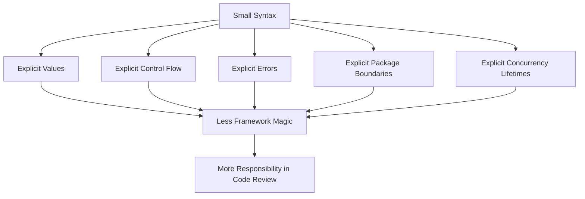
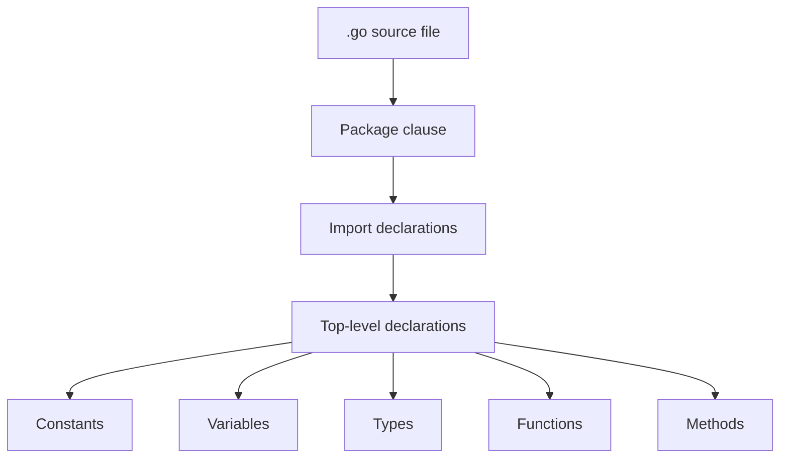
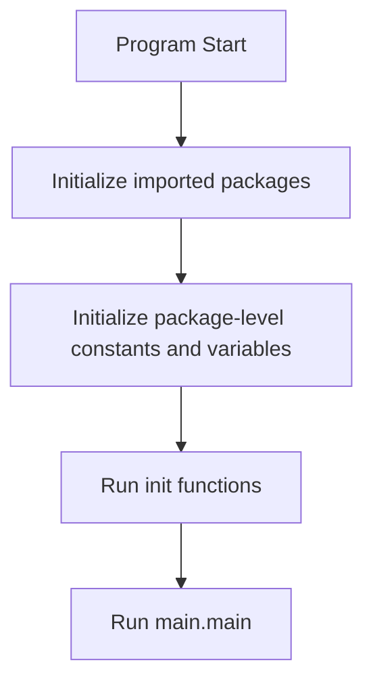
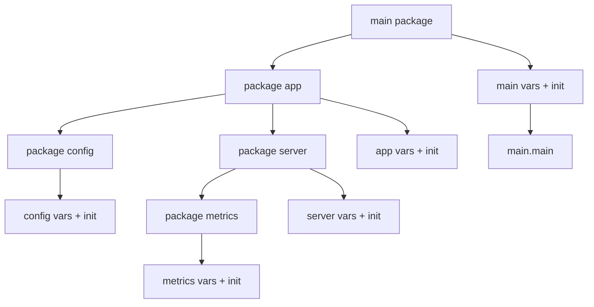
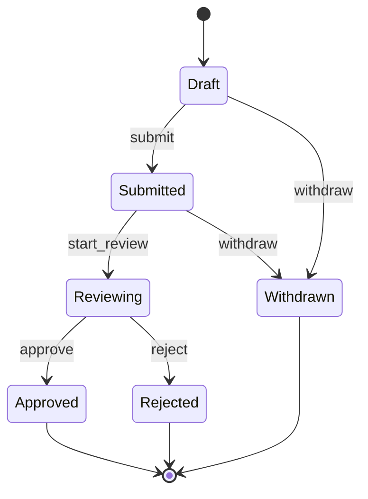

# learn-go-part-002.md

# Part 002 — Go Syntax Core: Declarations, Zero Value, Constants, `iota`, Operators, Control Flow, and Package Initialization

> Series: `learn-go`  
> Part: `002`  
> Target audience: Java software engineer moving toward production-grade Go engineering  
> Target Go version: Go 1.26.x  
> Previous part: `learn-go-part-001.md` — Toolchain, Workspace, Module, Build, Install, Cross-Compilation, Environment, and `go` Command Deep Dive  
> Next part: `learn-go-part-003.md` — Functions, Multiple Return, Named Return, Variadic, Closures, `defer`, `panic/recover`, and Lifecycle Cleanup

---

## 0. Why this part matters

Go syntax looks small enough to learn in one evening. That is true only at the surface.

A Java engineer can read this code quickly:

```go
package main

import "fmt"

func main() {
	message := "hello"
	fmt.Println(message)
}
```

But production Go correctness depends on details that are easy to underestimate:

- whether a variable is newly declared or accidentally reused;
- whether a value is copied or shared;
- whether a zero value is valid or dangerous;
- whether a short declaration shadows an outer variable;
- whether a constant is typed or untyped;
- whether `range` gives a copy or the original element;
- whether an `init` function hides ordering and side effects;
- whether package initialization has introduced global state that is hard to test;
- whether a condition, switch, or loop encodes business invariants clearly.

This part is intentionally focused on syntax, but the purpose is not syntax memorization. The purpose is to build the **semantic foundation** for later parts: functions, types, interfaces, errors, packages, memory, concurrency, networking, and production service design.

---

## 1. Core mental model

### 1.1 Go syntax is small because Go pushes complexity into explicit design

In Java, a lot of behavior is often expressed through:

- classes;
- constructors;
- annotations;
- inheritance;
- dependency injection containers;
- framework lifecycle callbacks;
- reflection-heavy configuration;
- runtime proxies;
- checked and unchecked exception policies.

In Go, the common design surface is smaller:

- packages;
- functions;
- variables;
- constants;
- structs;
- interfaces;
- methods;
- explicit errors;
- goroutines;
- channels;
- context;
- standard library primitives.

This means the syntax looks less ceremonial, but the developer must be more disciplined about the meaning of code.



A good Go engineer does not ask only: “does this compile?”

A good Go engineer asks:

- What is initialized by default?
- What is intentionally omitted?
- What is copied?
- What is shared?
- What can be nil?
- What is the package boundary?
- What runs before `main`?
- What side effects happen on import?
- What happens if this branch is never reached?
- What invariant is this control flow encoding?

---

## 2. File-level structure

A Go source file has a simple outer shape:

```go
package main

import (
	"fmt"
	"time"
)

const appName = "example"

var startedAt = time.Now()

func main() {
	fmt.Println(appName, startedAt)
}
```

At a high level:



### 2.1 Package clause

Every Go file starts with a package declaration:

```go
package payment
```

The package name defines the compilation unit. Multiple files in the same directory usually belong to the same package.

Java comparison:

```java
package com.example.payment;
```

But in Go, the package is not a namespace hierarchy in the same style as Java. The import path may be long:

```go
import "example.com/acme/billing/payment"
```

But the package name used in code may simply be:

```go
payment.Authorize(...)
```

The import path identifies where code comes from. The package name identifies how it is referenced in source.

### 2.2 Top-level declarations

At top level, Go allows declarations such as:

```go
const defaultLimit = 100

var defaultTimeout = 5 * time.Second

type UserID string

func NormalizeName(s string) string {
	return strings.TrimSpace(s)
}
```

Top-level declarations are initialized before `main` starts. This matters because top-level variables can introduce hidden startup work.

Bad:

```go
var db = mustOpenDatabase()
```

Better:

```go
func main() {
	db, err := openDatabaseFromConfig()
	if err != nil {
		log.Fatal(err)
	}
	defer db.Close()
}
```

Why?

Because global initialization makes lifecycle, testability, configuration, observability, retry behavior, and shutdown harder.

---

## 3. Declarations

Go has several declaration forms:

```go
var x int
var y = 10
z := 20

const maxRetries = 3

type Status string

func Handle() {}
```

Declaration in Go answers three questions:

1. What name is introduced?
2. What type does it have?
3. What initial value does it receive?

### 3.1 `var` declaration

```go
var count int
```

This declares `count` as an `int` and initializes it to the zero value for `int`, which is `0`.

```go
var name string      // ""
var enabled bool     // false
var user *User       // nil
var items []string   // nil slice
var cache map[string]int // nil map
```

This is very different from Java local variables.

In Java:

```java
int count;       // local variable must be assigned before use
String name;     // local variable must be assigned before use
```

In Go:

```go
var count int
fmt.Println(count) // valid, prints 0
```

Go always initializes variables.

This is powerful and dangerous:

- powerful because many types can be designed so their zero value is useful;
- dangerous because missing initialization may look legitimate.

### 3.2 Type inference with `var`

```go
var count = 10       // int
var name = "Alice"   // string
var timeout = 5 * time.Second // time.Duration
```

Go infers the type from the initializer.

For public or semantically important values, explicit types may improve readability:

```go
var maxUploadBytes int64 = 10 << 20
```

This is clearer than:

```go
var maxUploadBytes = 10 << 20
```

The first encodes that the unit participates in byte-size arithmetic that may need `int64` compatibility.

### 3.3 Grouped declarations

```go
var (
	defaultLimit   = 100
	defaultTimeout = 5 * time.Second
	defaultRegion  = "ap-southeast-1"
)
```

Grouped declarations are useful for related declarations. They are not a dumping ground.

Bad:

```go
var (
	defaultLimit = 100
	userName     = ""
	lastError    error
	server       *http.Server
)
```

This group mixes unrelated concerns.

Better:

```go
var defaultLimit = 100

var server *http.Server
```

Even better, avoid mutable package-level state where possible.

### 3.4 Short variable declaration `:=`

Inside functions, Go supports short declaration:

```go
count := 10
name := "Alice"
```

This is the most common local variable declaration form.

Important: `:=` is declaration, not just assignment.

```go
x := 1 // declares x
x = 2  // assigns x
```

This is invalid:

```go
x := 1
x := 2 // compile error: no new variables on left side of :=
```

But this is valid:

```go
x := 1
x, y := 2, 3 // x is reassigned, y is newly declared
```

The rule: a short variable declaration may redeclare variables only when at least one variable on the left side is new and the existing variables are in the same block with the same type.

This is one of the highest-value syntax details in Go.

### 3.5 The `err` redeclaration pattern

Common Go code:

```go
file, err := os.Open(path)
if err != nil {
	return err
}
defer file.Close()

body, err := io.ReadAll(file)
if err != nil {
	return err
}
```

The second `:=` does not create a new `err` if `err` already exists in the same block. It reuses `err` and declares `body`.

This is idiomatic.

But shadowing can happen when a new block is introduced.

Problem:

```go
func load(path string) error {
	var result []byte

	if file, err := os.Open(path); err != nil {
		return err
	} else {
		result, err := io.ReadAll(file) // compile error? depends on scope; err here is else-scope
		_ = result
		_ = err
	}

	_ = result
	return nil
}
```

A clearer version:

```go
func load(path string) ([]byte, error) {
	file, err := os.Open(path)
	if err != nil {
		return nil, err
	}
	defer file.Close()

	body, err := io.ReadAll(file)
	if err != nil {
		return nil, err
	}

	return body, nil
}
```

Principle:

> Prefer short variable declarations for narrow local scopes, but avoid clever scope compression when it harms error clarity.

---

## 4. Zero value

Zero value is one of Go's most important design concepts.

Every type has a default value:

| Type | Zero value |
|---|---|
| `bool` | `false` |
| numeric types | `0` |
| `string` | `""` |
| pointer | `nil` |
| function | `nil` |
| interface | `nil` |
| slice | `nil` |
| map | `nil` |
| channel | `nil` |
| struct | each field's zero value |
| array | each element's zero value |

### 4.1 Zero value as design goal

A strong Go type often has a useful zero value.

Example:

```go
type Counter struct {
	n int64
}

func (c *Counter) Inc() {
	c.n++
}

func (c *Counter) Value() int64 {
	return c.n
}
```

This works:

```go
var c Counter
c.Inc()
fmt.Println(c.Value()) // 1
```

No constructor required.

Java comparison:

```java
Counter c = new Counter();
c.inc();
```

In Go, a well-designed struct can often be immediately usable after declaration.

### 4.2 Zero value is not always valid

Some types cannot have a meaningful zero value.

Example:

```go
type Client struct {
	baseURL string
	http    *http.Client
}
```

The zero value has:

```go
baseURL == ""
http == nil
```

That may be invalid.

You can handle this in several ways.

#### Option A — Constructor validates required fields

```go
type Client struct {
	baseURL string
	http    *http.Client
}

func NewClient(baseURL string, httpClient *http.Client) (*Client, error) {
	if strings.TrimSpace(baseURL) == "" {
		return nil, errors.New("baseURL is required")
	}
	if httpClient == nil {
		httpClient = http.DefaultClient
	}
	return &Client{baseURL: baseURL, http: httpClient}, nil
}
```

#### Option B — Zero value is safe but limited

```go
type Client struct {
	baseURL string
	http    *http.Client
}

func (c *Client) httpClient() *http.Client {
	if c.http != nil {
		return c.http
	}
	return http.DefaultClient
}
```

But `baseURL` still needs validation.

#### Option C — Make invalid state hard to construct outside package

```go
type Client struct {
	baseURL string
	http    *http.Client
}
```

Fields are unexported, so external callers cannot set arbitrary state.

They must use:

```go
func NewClient(baseURL string, opts ...Option) (*Client, error) { ... }
```

### 4.3 Zero value design checklist

For every exported type, ask:

- Is the zero value safe?
- Is the zero value useful?
- Is the zero value explicitly invalid?
- If invalid, how does the API prevent misuse?
- Are fields exported unnecessarily?
- Does the type need a constructor?
- Does the constructor return an error?
- Can callers accidentally copy the value?
- Does the type contain mutexes, atomics, or resources?

---

## 5. Constants

Constants in Go are not just immutable variables.

They are compile-time values.

```go
const maxRetries = 3
const serviceName = "billing"
const enabled = true
```

Constants may be typed or untyped.

### 5.1 Untyped constants

```go
const n = 10
```

`n` is an untyped numeric constant. It can be used where different numeric types are required, as long as representable.

```go
var i int = n
var i64 int64 = n
var f float64 = n
```

This works because `n` has not yet been forced into a concrete type.

### 5.2 Typed constants

```go
const timeoutSeconds int = 30
```

Now the constant has type `int`.

```go
var x int64 = timeoutSeconds // invalid without conversion
```

Need:

```go
var x int64 = int64(timeoutSeconds)
```

Typed constants are useful when the type itself communicates domain meaning.

```go
type Status string

const (
	StatusPending  Status = "pending"
	StatusApproved Status = "approved"
	StatusRejected Status = "rejected"
)
```

### 5.3 Constants are not Java enums

Go does not have Java-style enums.

Java:

```java
enum Status {
    PENDING,
    APPROVED,
    REJECTED
}
```

Go common pattern:

```go
type Status string

const (
	StatusPending  Status = "pending"
	StatusApproved Status = "approved"
	StatusRejected Status = "rejected"
)
```

This gives a domain-specific type, but it does not prevent someone from writing:

```go
var s Status = "unknown"
```

So validation must be explicit:

```go
func (s Status) Valid() bool {
	switch s {
	case StatusPending, StatusApproved, StatusRejected:
		return true
	default:
		return false
	}
}
```

Production implication:

> Go constants define names and types. They do not automatically define closed sets.

If you need closed-set behavior, enforce it through parsing, validation, constructors, or unexported representation.

---

## 6. `iota`

`iota` is a predeclared identifier used inside constant declarations. It increments within a constant block.

Basic example:

```go
const (
	Sunday = iota
	Monday
	Tuesday
	Wednesday
	Thursday
	Friday
	Saturday
)
```

Values:

```text
Sunday    = 0
Monday    = 1
Tuesday   = 2
Wednesday = 3
Thursday  = 4
Friday    = 5
Saturday  = 6
```

### 6.1 Use `iota` for internal numeric codes

```go
type State int

const (
	StateUnknown State = iota
	StateCreated
	StateSubmitted
	StateApproved
	StateRejected
)
```

The zero value becomes `StateUnknown`.

This is usually better than letting zero accidentally mean a real business state.

Bad:

```go
const (
	StateCreated State = iota
	StateSubmitted
	StateApproved
)
```

Now zero means `StateCreated`, which may be unsafe for missing initialization.

Better:

```go
const (
	StateUnknown State = iota
	StateCreated
	StateSubmitted
	StateApproved
)
```

### 6.2 `iota` for bit flags

```go
type Permission uint64

const (
	PermissionRead Permission = 1 << iota
	PermissionWrite
	PermissionDelete
	PermissionAdmin
)
```

Values:

```text
PermissionRead   = 1
PermissionWrite  = 2
PermissionDelete = 4
PermissionAdmin  = 8
```

Usage:

```go
func HasPermission(actual, required Permission) bool {
	return actual&required == required
}
```

Example:

```go
p := PermissionRead | PermissionWrite
fmt.Println(HasPermission(p, PermissionRead))   // true
fmt.Println(HasPermission(p, PermissionDelete)) // false
```

### 6.3 Avoid `iota` for stable external protocols

This is dangerous:

```go
const (
	ExternalStatusPending = iota
	ExternalStatusApproved
	ExternalStatusRejected
)
```

If someone reorders constants, serialized values change.

For external protocols, prefer explicit values:

```go
const (
	ExternalStatusPending  = 10
	ExternalStatusApproved = 20
	ExternalStatusRejected = 30
)
```

Or string constants:

```go
type ExternalStatus string

const (
	ExternalStatusPending  ExternalStatus = "PENDING"
	ExternalStatusApproved ExternalStatus = "APPROVED"
	ExternalStatusRejected ExternalStatus = "REJECTED"
)
```

Rule:

> Use `iota` for internal compact representations. Avoid it for stable wire formats, database values, audit codes, permission models exposed across service boundaries, and regulatory states unless the numeric values are explicitly controlled.

---

## 7. Assignment

Assignment updates existing variables.

```go
x = 10
```

Multiple assignment is common:

```go
a, b = b, a
```

This swaps values safely because right-hand side expressions are evaluated before assignment.

### 7.1 Multiple assignment for map lookup

```go
value, ok := cache[key]
if !ok {
	return ErrNotFound
}
```

This is a common Go pattern.

The second value indicates whether the key exists.

Important difference:

```go
cache := map[string]int{"a": 0}

v := cache["a"] // 0
x := cache["x"] // 0 too
```

Without `ok`, you cannot distinguish present zero value from absent key.

Correct:

```go
v, ok := cache["a"]
if !ok {
	// absent
}
_ = v
```

### 7.2 Multiple assignment for type assertion

```go
s, ok := value.(string)
if !ok {
	return errors.New("value is not string")
}
```

Without `ok`, a failed type assertion panics:

```go
s := value.(string) // may panic
```

### 7.3 Multiple assignment for channel receive

```go
v, ok := <-ch
if !ok {
	// channel closed
}
```

This will become important in concurrency parts.

---

## 8. Blank identifier `_`

The blank identifier discards a value.

```go
_, err := io.Copy(dst, src)
if err != nil {
	return err
}
```

Use it when you intentionally ignore a value.

Do not use it to silence important signals.

Bad:

```go
file, _ := os.Open(path)
```

Better:

```go
file, err := os.Open(path)
if err != nil {
	return err
}
```

### 8.1 Blank import

```go
import _ "net/http/pprof"
```

A blank import imports a package only for its side effects.

This is powerful and dangerous.

Common legitimate use:

```go
import _ "github.com/lib/pq"
```

Historically used to register database drivers.

Production concern:

> Blank imports hide behavior behind package initialization. Use them deliberately, document why, and avoid them in domain code unless there is a clear registration contract.

---

## 9. Operators

Go operators are intentionally small and predictable.

### 9.1 Arithmetic operators

```go
+  -  *  /  %
```

Integer division truncates toward zero:

```go
fmt.Println(5 / 2)  // 2
fmt.Println(-5 / 2) // -2
```

### 9.2 Comparison operators

```go
== != < <= > >=
```

Not all values are comparable.

Comparable:

- booleans;
- numbers;
- strings;
- pointers;
- channels;
- interfaces if dynamic value is comparable;
- arrays if element type is comparable;
- structs if all fields are comparable.

Not comparable:

- slices;
- maps;
- functions.

Invalid:

```go
[]int{1, 2} == []int{1, 2}
```

Use `slices.Equal` for slices:

```go
slices.Equal(a, b)
```

Use `maps.Equal` for maps when appropriate:

```go
maps.Equal(a, b)
```

### 9.3 Logical operators

```go
&& || !
```

Short-circuiting applies:

```go
if user != nil && user.Active {
	// safe
}
```

### 9.4 Bitwise operators

```go
&  |  ^  &^  <<  >>
```

Examples:

```go
flags := PermissionRead | PermissionWrite
hasRead := flags&PermissionRead != 0
withoutWrite := flags &^ PermissionWrite
```

`&^` is bit clear.

### 9.5 Increment and decrement are statements

Go has:

```go
i++
i--
```

But they are statements, not expressions.

Invalid:

```go
x := i++
```

Also, Go does not have `++i` or `--i`.

This removes a class of expression-ordering tricks common in C-like languages.

---

## 10. Control flow

Go has fewer control flow constructs than Java:

- `if`;
- `for`;
- `switch`;
- `select`;
- `goto`;
- `break`;
- `continue`;
- `return`;
- `defer`;
- `panic` / `recover`.

This part covers the syntax-core subset: `if`, `for`, `range`, and `switch`. Later parts cover `defer`, `panic/recover`, and `select` deeply.

---

## 11. `if`

Basic:

```go
if count > limit {
	return ErrLimitExceeded
}
```

No parentheses around condition.

Invalid:

```go
if (count > limit) { // legal? actually parentheses can be used as expression grouping, but non-idiomatic
}
```

Parentheses are unnecessary and non-idiomatic.

### 11.1 `if` with short statement

```go
if err := validate(req); err != nil {
	return err
}
```

The variable `err` is scoped to the `if` statement.

This is idiomatic when the variable is only needed for the branch.

Another example:

```go
if user, ok := users[id]; ok {
	return user, nil
}
return User{}, ErrNotFound
```

### 11.2 Avoid hiding important variables in `if` short statements

This is compact:

```go
if resp, err := client.Do(req); err != nil {
	return err
} else {
	defer resp.Body.Close()
	// use resp
}
```

But it often creates awkward nesting.

Prefer:

```go
resp, err := client.Do(req)
if err != nil {
	return err
}
defer resp.Body.Close()
```

Guideline:

> Use `if` short statements for small temporary checks. Avoid them when the successful value has a meaningful lifecycle.

HTTP response bodies, files, locks, transactions, and spans usually deserve visible scope.

---

## 12. `for`

Go has one loop keyword: `for`.

### 12.1 Classic `for`

```go
for i := 0; i < 10; i++ {
	fmt.Println(i)
}
```

### 12.2 While-style `for`

```go
for count < limit {
	count++
}
```

### 12.3 Infinite loop

```go
for {
	// loop forever
}
```

Production infinite loops should nearly always include cancellation, sleep, blocking receive, or termination logic.

Bad:

```go
for {
	poll()
}
```

Better:

```go
for {
	select {
	case <-ctx.Done():
		return ctx.Err()
	case <-ticker.C:
		if err := poll(ctx); err != nil {
			log.Printf("poll failed: %v", err)
		}
	}
}
```

`select` is covered later, but the principle belongs here: an infinite loop is a lifecycle contract.

---

## 13. `range`

`range` iterates over arrays, slices, strings, maps, channels, and some iterator forms depending on Go version and language features.

### 13.1 Range over slice

```go
items := []string{"a", "b", "c"}

for i, item := range items {
	fmt.Println(i, item)
}
```

Important: `item` is a copy of the element value.

```go
type User struct {
	Name string
}

users := []User{{Name: "A"}, {Name: "B"}}

for _, u := range users {
	u.Name = strings.ToLower(u.Name) // modifies copy, not slice element
}
```

Correct:

```go
for i := range users {
	users[i].Name = strings.ToLower(users[i].Name)
}
```

### 13.2 Range over pointer elements

If the slice contains pointers, the copied element is a pointer value, so the pointed-to object can be modified:

```go
users := []*User{{Name: "A"}, {Name: "B"}}

for _, u := range users {
	u.Name = strings.ToLower(u.Name)
}
```

This mutates the objects.

But be careful: this is shared mutable state.

### 13.3 Range variable address bug

Old Go versions had a famous trap where taking the address of a range variable could produce repeated pointers to the same variable. Modern Go changed loop variable semantics for modules targeting newer Go versions, but a top engineer should still understand the underlying issue because old code and mixed module versions exist.

Risky pattern conceptually:

```go
var ptrs []*User
for _, u := range users {
	ptrs = append(ptrs, &u)
}
```

Safer and clearer:

```go
var ptrs []*User
for i := range users {
	ptrs = append(ptrs, &users[i])
}
```

Even with improved semantics, prefer the indexed form when you truly want the address of the backing array element.

### 13.4 Range over map

```go
for k, v := range m {
	fmt.Println(k, v)
}
```

Map iteration order is not stable.

Do not write business logic that depends on map iteration order.

If order matters:

```go
keys := make([]string, 0, len(m))
for k := range m {
	keys = append(keys, k)
}
slices.Sort(keys)

for _, k := range keys {
	fmt.Println(k, m[k])
}
```

### 13.5 Range over string

```go
for i, r := range "gopher" {
	fmt.Println(i, r)
}
```

The index is byte index, and the value is a rune.

This matters for Unicode.

```go
s := "Aé世"
for i, r := range s {
	fmt.Printf("byte index=%d rune=%c\n", i, r)
}
```

Do not assume `len(s)` means number of characters. `len(s)` returns bytes.

### 13.6 Range over channel

```go
for item := range ch {
	process(item)
}
```

This loop ends when the channel is closed.

The sender owns closing responsibility. This will be covered deeply in concurrency parts.

---

## 14. `switch`

Go `switch` is more flexible than Java's traditional switch.

Basic:

```go
switch status {
case StatusPending:
	return "waiting"
case StatusApproved:
	return "done"
default:
	return "unknown"
}
```

No implicit fallthrough.

In Java's older switch, forgetting `break` was a common bug. In Go, each case breaks automatically.

If you really want fallthrough:

```go
switch n {
case 1:
	fmt.Println("one")
	fallthrough
case 2:
	fmt.Println("one or two")
}
```

Use `fallthrough` rarely.

### 14.1 Multiple values in one case

```go
switch status {
case StatusPending, StatusSubmitted:
	return "open"
case StatusApproved, StatusRejected:
	return "closed"
default:
	return "unknown"
}
```

### 14.2 Expressionless switch

```go
switch {
case score >= 90:
	return "A"
case score >= 80:
	return "B"
case score >= 70:
	return "C"
default:
	return "D"
}
```

This is a clean alternative to long `if/else if` chains.

### 14.3 Switch with short statement

```go
switch n := len(items); {
case n == 0:
	return "empty"
case n < 10:
	return "small"
default:
	return "large"
}
```

The variable `n` is scoped to the switch.

### 14.4 Type switch

Type switch works on interfaces:

```go
func describe(v any) string {
	switch x := v.(type) {
	case nil:
		return "nil"
	case string:
		return "string: " + x
	case int:
		return fmt.Sprintf("int: %d", x)
	default:
		return fmt.Sprintf("unknown: %T", x)
	}
}
```

Use type switches carefully. Heavy type switching may indicate poor interface design. But it is legitimate at boundaries such as:

- decoding;
- logging;
- adapter layers;
- generic validation;
- test utilities;
- compatibility shims.

---

## 15. Labels, `break`, `continue`, and `goto`

### 15.1 `break`

```go
for {
	if done {
		break
	}
}
```

### 15.2 `continue`

```go
for _, item := range items {
	if item.Disabled {
		continue
	}
	process(item)
}
```

Guard clauses are idiomatic.

### 15.3 Labeled break

```go
Outer:
for _, row := range rows {
	for _, cell := range row.Cells {
		if cell.Match(target) {
			break Outer
		}
	}
}
```

This can be clearer than boolean flags.

### 15.4 `goto`

Go has `goto`, but it is rare.

It can be useful in generated code or low-level cleanup paths, but most application code should use normal control flow and `defer`.

Rule:

> If a reviewer must simulate jumps mentally to understand business logic, avoid `goto`.

---

## 16. Package initialization

Package initialization is a critical Go concept.

It includes:

1. initializing imported packages;
2. initializing package-level variables;
3. running `init` functions;
4. finally running `main.main` for executable programs.



### 16.1 Package-level variable initialization

```go
var startedAt = time.Now()
```

This runs before `main`.

This may be okay for simple values. It is risky for IO-heavy work.

Bad:

```go
var config = mustLoadConfig("/etc/app/config.yaml")
```

Problems:

- no context;
- no structured logging setup yet;
- no graceful error handling except panic/log fatal;
- hard to test;
- order may be non-obvious;
- import side effects become expensive.

Better:

```go
func main() {
	cfg, err := LoadConfig(os.Getenv("CONFIG_PATH"))
	if err != nil {
		log.Fatal(err)
	}
	_ = cfg
}
```

### 16.2 `init` functions

A file may define:

```go
func init() {
	// initialization side effect
}
```

`init` has no parameters and no return value.

It runs automatically during package initialization.

Legitimate uses:

- registering codecs;
- registering database drivers;
- validating generated tables;
- test-only setup in `_test.go` where appropriate;
- low-level package setup with no external dependencies.

Suspicious uses:

- opening database connections;
- reading environment-specific config;
- starting goroutines;
- making network calls;
- initializing global mutable application state;
- registering business handlers invisibly.

### 16.3 Import side effects

If package `a` imports package `b`, then `b` initialization runs before `a` initialization.



A package imported only for side effects is written with `_`:

```go
import _ "net/http/pprof"
```

This means:

> I intentionally want this package's initialization side effects, even though I do not reference its exported names.

Use carefully.

### 16.4 Initialization order inside a package

Within a package, initialization order is determined by dependency order among variables, then file order as presented to the compiler. You should not design application logic that relies on subtle file ordering.

Bad:

```go
// file a.go
var registry = map[string]Handler{}

// file b.go
var _ = register("x", handlerX)
```

This kind of hidden registration can become hard to reason about.

Better:

```go
func NewRegistry() *Registry {
	r := NewEmptyRegistry()
	r.Register("x", handlerX)
	return r
}
```

---

## 17. Scope and shadowing

Scope bugs are common in Go because `:=` is concise.

### 17.1 Block scope

```go
x := 1
if true {
	x := 2
	fmt.Println(x) // 2
}
fmt.Println(x) // 1
```

The inner `x` shadows outer `x`.

### 17.2 Dangerous error shadowing

```go
func run() (err error) {
	resource, err := acquire()
	if err != nil {
		return err
	}
	defer func() {
		if closeErr := resource.Close(); closeErr != nil && err == nil {
			err = closeErr
		}
	}()

	if err := doWork(resource); err != nil {
		return err
	}

	return nil
}
```

This is okay because inner `err` is returned immediately.

But this can be dangerous:

```go
func run() error {
	var err error

	if condition {
		result, err := doWork() // inner err shadows outer err
		_ = result
		_ = err
	}

	return err // still nil
}
```

Better:

```go
func run() error {
	var err error

	if condition {
		var result Result
		result, err = doWork()
		_ = result
	}

	return err
}
```

Or better still, reduce outer mutable state:

```go
func run() error {
	if !condition {
		return nil
	}

	result, err := doWork()
	if err != nil {
		return err
	}
	_ = result
	return nil
}
```

### 17.3 Shadowing checklist

Before using `:=`, ask:

- Am I inside a new block?
- Is there an outer variable with the same name?
- Is the outer variable expected to change?
- Will the value be used after this block?
- Is this `err` returned immediately?
- Would explicit `var` plus `=` be clearer?

---

## 18. Go 1.26 syntax-relevant language update: `new` with initial expression

Go historically allowed:

```go
p := new(int)
*p = 42
```

Go 1.26 allows `new` with an initial expression:

```go
p := new(42)
```

This creates a new variable initialized to `42` and returns its address.

This can replace helper patterns where you need a pointer to a literal or value.

Before:

```go
func Ptr[T any](v T) *T {
	return &v
}

limit := Ptr(100)
```

With Go 1.26:

```go
limit := new(100)
```

However, do not overuse it.

Good use cases:

- optional config fields;
- tests needing pointer values;
- small literals where pointer presence has meaning.

Example:

```go
type Options struct {
	Limit *int
}

opts := Options{Limit: new(100)}
```

Possible readability issue:

```go
user := new(User{Name: "Alice"})
```

Many teams may still prefer:

```go
user := &User{Name: "Alice"}
```

The struct literal form is more familiar and direct.

Guideline:

> Use `new(expr)` when it improves clarity around pointer-to-value creation. Prefer address-of composite literals for structs when they are clearer.

---

## 19. Java-to-Go syntax translation traps

### 19.1 Constructors are not language features

Java:

```java
class User {
    private final String id;

    User(String id) {
        this.id = id;
    }
}
```

Go:

```go
type User struct {
	id string
}

func NewUser(id string) (User, error) {
	if strings.TrimSpace(id) == "" {
		return User{}, errors.New("id is required")
	}
	return User{id: id}, nil
}
```

`NewUser` is just a function by convention.

### 19.2 No implicit `this`

Go methods use explicit receiver names:

```go
func (u User) ID() string {
	return u.id
}
```

Prefer meaningful short receiver names, not `this` or `self`.

### 19.3 No ternary operator

Java:

```java
String label = active ? "active" : "inactive";
```

Go:

```go
label := "inactive"
if active {
	label = "active"
}
```

This is intentional. Go favors explicit branches.

### 19.4 No automatic numeric widening

Java:

```java
int x = 10;
long y = x;
```

Go:

```go
var x int = 10
var y int64 = int64(x)
```

Explicit conversions prevent hidden precision and portability issues.

### 19.5 No exceptions for normal errors

Java:

```java
try {
    service.process(request);
} catch (ValidationException e) {
    return badRequest(e);
}
```

Go:

```go
if err := service.Process(ctx, req); err != nil {
	return handleError(err)
}
```

Error handling is not just syntax. It becomes part of API and control flow design.

---

## 20. Production-grade example: parsing workflow status

Suppose we model a regulatory case lifecycle.

Bad approach:

```go
func IsClosed(status string) bool {
	return status == "approved" || status == "rejected"
}
```

Problems:

- raw strings everywhere;
- typo-prone;
- no validation;
- unknown state handled accidentally;
- no central domain contract.

Better:

```go
type CaseStatus string

const (
	CaseStatusUnknown   CaseStatus = "unknown"
	CaseStatusDraft     CaseStatus = "draft"
	CaseStatusSubmitted CaseStatus = "submitted"
	CaseStatusReviewing CaseStatus = "reviewing"
	CaseStatusApproved  CaseStatus = "approved"
	CaseStatusRejected  CaseStatus = "rejected"
	CaseStatusWithdrawn CaseStatus = "withdrawn"
)

func ParseCaseStatus(s string) (CaseStatus, error) {
	switch CaseStatus(strings.ToLower(strings.TrimSpace(s))) {
	case CaseStatusDraft:
		return CaseStatusDraft, nil
	case CaseStatusSubmitted:
		return CaseStatusSubmitted, nil
	case CaseStatusReviewing:
		return CaseStatusReviewing, nil
	case CaseStatusApproved:
		return CaseStatusApproved, nil
	case CaseStatusRejected:
		return CaseStatusRejected, nil
	case CaseStatusWithdrawn:
		return CaseStatusWithdrawn, nil
	default:
		return CaseStatusUnknown, fmt.Errorf("unknown case status %q", s)
	}
}

func (s CaseStatus) IsClosed() bool {
	switch s {
	case CaseStatusApproved, CaseStatusRejected, CaseStatusWithdrawn:
		return true
	default:
		return false
	}
}

func (s CaseStatus) CanEscalate() bool {
	switch s {
	case CaseStatusSubmitted, CaseStatusReviewing:
		return true
	default:
		return false
	}
}
```

This is still simple syntax, but it encodes a stronger domain boundary.

### 20.1 State transition example

```go
type CaseEvent string

const (
	CaseEventSubmit   CaseEvent = "submit"
	CaseEventStartReview CaseEvent = "start_review"
	CaseEventApprove  CaseEvent = "approve"
	CaseEventReject   CaseEvent = "reject"
	CaseEventWithdraw CaseEvent = "withdraw"
)

func NextStatus(current CaseStatus, event CaseEvent) (CaseStatus, error) {
	switch current {
	case CaseStatusDraft:
		switch event {
		case CaseEventSubmit:
			return CaseStatusSubmitted, nil
		case CaseEventWithdraw:
			return CaseStatusWithdrawn, nil
		}

	case CaseStatusSubmitted:
		switch event {
		case CaseEventStartReview:
			return CaseStatusReviewing, nil
		case CaseEventWithdraw:
			return CaseStatusWithdrawn, nil
		}

	case CaseStatusReviewing:
		switch event {
		case CaseEventApprove:
			return CaseStatusApproved, nil
		case CaseEventReject:
			return CaseStatusRejected, nil
		}
	}

	return CaseStatusUnknown, fmt.Errorf("invalid transition: status=%s event=%s", current, event)
}
```

This function is intentionally explicit. For a small lifecycle, this is better than overengineering a generic framework.



The key point: Go syntax nudges us toward readable control flow. Use that to make domain logic auditable.

---

## 21. Anti-patterns

### 21.1 Clever short declaration

Bad:

```go
if x, y, z := a(), b(), c(); x.Valid() && y.Ready() && z.OK() {
	process(x, y, z)
}
```

Too much happens in one line.

Better:

```go
x := a()
y := b()
z := c()

if x.Valid() && y.Ready() && z.OK() {
	process(x, y, z)
}
```

### 21.2 Package-level mutable global state

Bad:

```go
var currentUser User
var currentTenant Tenant
var requestID string
```

This is not request-safe, test-safe, or concurrency-safe.

Better:

```go
type RequestContext struct {
	User    User
	Tenant  Tenant
	TraceID string
}
```

Pass request state explicitly.

### 21.3 `init` does real application work

Bad:

```go
func init() {
	db = mustConnectDatabase()
	go startBackgroundJob()
}
```

Better:

```go
func main() {
	app, err := NewAppFromEnvironment()
	if err != nil {
		log.Fatal(err)
	}
	if err := app.Run(context.Background()); err != nil {
		log.Fatal(err)
	}
}
```

### 21.4 Raw strings for domain state

Bad:

```go
if status == "APPROVED" || status == "approved" || status == "Approve" {
	// ...
}
```

Better:

```go
status, err := ParseCaseStatus(input)
if err != nil {
	return err
}
if status.IsClosed() {
	// ...
}
```

### 21.5 Ignoring `ok`

Bad:

```go
limit := config.Limits[module]
```

If absent, `limit` may be zero and accidentally interpreted as unlimited, blocked, or default.

Better:

```go
limit, ok := config.Limits[module]
if !ok {
	return fmt.Errorf("limit for module %q is not configured", module)
}
```

---

## 22. Code review checklist for syntax-core Go

Use this checklist when reviewing basic Go code.

### Declarations

- Are variables declared as close as possible to their use?
- Is `:=` used where it improves clarity?
- Is `var` used where zero value or explicit type matters?
- Are package-level variables necessary?
- Are grouped declarations cohesive?

### Zero value

- Is the zero value safe for exported types?
- If not, is construction controlled?
- Can missing initialization look valid?
- Are nil maps/slices/channels handled correctly?

### Constants

- Are domain constants typed?
- Are external protocol values explicit rather than accidental `iota` values?
- Is zero reserved for unknown/invalid when appropriate?
- Is validation explicit?

### Control flow

- Is the happy path readable?
- Are guard clauses used to reduce nesting?
- Are `if` short statements hiding important lifecycle values?
- Are `switch` cases exhaustive enough for domain logic?
- Is map iteration order irrelevant or explicitly sorted?

### Scope

- Could `:=` shadow an outer variable?
- Is `err` shadowing harmless and immediate?
- Are loop variables copied intentionally?
- Are addresses of range variables avoided unless clearly safe?

### Initialization

- Does `init` hide side effects?
- Does package import trigger IO, network, goroutines, or global mutation?
- Can startup errors be reported cleanly?
- Is configuration loaded in `main` or explicit constructors rather than global state?

---

## 23. Hands-on lab

### Lab 1 — Zero value audit

Create this type:

```go
type RateLimiter struct {
	limit int
	used  int
}

func (r *RateLimiter) Allow() bool {
	if r.used >= r.limit {
		return false
	}
	r.used++
	return true
}
```

Question:

```go
var r RateLimiter
fmt.Println(r.Allow())
```

What happens?

Answer:

- `limit` is zero;
- `used` is zero;
- `used >= limit` is true;
- `Allow` returns false;
- zero value means “deny everything”.

Is that desirable?

Maybe. But if zero accidentally means “no configuration loaded”, then it is dangerous.

Improve it by making the constructor explicit:

```go
func NewRateLimiter(limit int) (*RateLimiter, error) {
	if limit <= 0 {
		return nil, fmt.Errorf("limit must be positive: %d", limit)
	}
	return &RateLimiter{limit: limit}, nil
}
```

### Lab 2 — `iota` audit

Given:

```go
type Severity int

const (
	SeverityLow Severity = iota
	SeverityMedium
	SeverityHigh
)
```

Problem:

- zero means low severity;
- missing initialization becomes low severity;
- incidents may be underclassified.

Improve:

```go
type Severity int

const (
	SeverityUnknown Severity = iota
	SeverityLow
	SeverityMedium
	SeverityHigh
)
```

Then add validation:

```go
func (s Severity) Valid() bool {
	switch s {
	case SeverityLow, SeverityMedium, SeverityHigh:
		return true
	default:
		return false
	}
}
```

### Lab 3 — Map lookup correctness

Bad:

```go
func GetTimeout(module string, timeouts map[string]time.Duration) time.Duration {
	return timeouts[module]
}
```

Problem:

- absent module returns `0`;
- zero duration may mean immediate timeout;
- or it may mean no timeout;
- ambiguity becomes production failure.

Better:

```go
func GetTimeout(module string, timeouts map[string]time.Duration) (time.Duration, error) {
	timeout, ok := timeouts[module]
	if !ok {
		return 0, fmt.Errorf("timeout for module %q is not configured", module)
	}
	if timeout <= 0 {
		return 0, fmt.Errorf("timeout for module %q must be positive: %s", module, timeout)
	}
	return timeout, nil
}
```

### Lab 4 — Range mutation

Bad:

```go
func NormalizeUsers(users []User) {
	for _, u := range users {
		u.Name = strings.TrimSpace(u.Name)
	}
}
```

Fix:

```go
func NormalizeUsers(users []User) {
	for i := range users {
		users[i].Name = strings.TrimSpace(users[i].Name)
	}
}
```

### Lab 5 — Package initialization refactor

Bad:

```go
var cfg = mustLoadConfig()
var db = mustOpenDB(cfg.DatabaseURL)

func init() {
	go startMetricsPusher()
}
```

Refactor target:

```go
type App struct {
	cfg Config
	db  *sql.DB
}

func NewApp(ctx context.Context, cfg Config) (*App, error) {
	db, err := openDB(ctx, cfg.DatabaseURL)
	if err != nil {
		return nil, err
	}
	return &App{cfg: cfg, db: db}, nil
}

func (a *App) Run(ctx context.Context) error {
	return runServer(ctx, a.db)
}
```

---

## 24. Review questions

1. What is the difference between `var x int` and `x := 0`?
2. Why can zero value be both a feature and a risk?
3. When should a type's zero value be useful?
4. When should a constructor return an error?
5. What is the difference between typed and untyped constants?
6. Why should zero often represent unknown for `iota`-based enums?
7. Why is `iota` risky for external protocol values?
8. What does `value, ok := m[key]` protect against?
9. Why is `range` over a slice of structs often a source of mutation bugs?
10. Why is map iteration order not suitable for business logic?
11. When is an `if` short statement idiomatic?
12. When does an `if` short statement reduce readability?
13. Why does Go switch not need `break` by default?
14. What is a type switch good for?
15. Why are `init` functions dangerous in application code?
16. What is a blank import?
17. Why is package-level mutable state risky?
18. What changed about `new` in Go 1.26?
19. When is `new(expr)` clearer than a helper pointer function?
20. Why is Go syntax not enough to understand Go semantics?

---

## 25. Summary invariants

Keep these invariants in mind:

```text
Every Go variable is initialized.
Zero value must be treated as part of API design.
Short declaration declares at least one new variable.
Short declaration can shadow in nested blocks.
Constants may be untyped until context forces a type.
iota is convenient but dangerous for stable external values.
Map lookup without ok loses absent-vs-zero distinction.
Range element variables are values, not always mutable references.
Map iteration order is intentionally not a business contract.
Switch does not fall through by default.
init runs before main and should not hide application lifecycle.
Package-level state is initialized before explicit application control begins.
```

---

## 26. What you should be able to do after this part

After this part, you should be able to:

- read basic Go syntax without translating it mechanically to Java;
- decide when to use `var`, `:=`, `const`, and typed constants;
- design zero-value-safe types;
- avoid common shadowing bugs;
- understand why raw string domain states are weak;
- use `iota` safely;
- reason about map lookup ambiguity;
- understand range copy behavior;
- structure `if`, `for`, and `switch` clearly;
- identify dangerous package initialization;
- review syntax-level Go code for production risks.

---

## 27. References

- The Go Programming Language Specification — declarations, zero values, constants, short variable declarations, control flow, and package initialization: https://go.dev/ref/spec
- Effective Go — declarations, control structures, initialization, and idiomatic style: https://go.dev/doc/effective_go
- Go 1.26 Release Notes — language changes including `new` with initial expression: https://go.dev/doc/go1.26
- Go Blog: Go 1.26 is released — overview of Go 1.26 changes: https://go.dev/blog/go1.26
- Go Blog: Using `go fix` to modernize Go code — includes `new(expr)` modernization context: https://go.dev/blog/gofix

---

## 28. Next part

Next file:

```text
learn-go-part-003.md
```

Topic:

```text
Functions: multiple return, named return, variadic parameters, closures, defer, panic/recover, and lifecycle cleanup.
```

The next part is where Go starts to feel very different from Java. Function design in Go is not only about parameters and return values. It is about API contracts, error paths, cleanup order, resource ownership, and whether control flow remains obvious under failure.


<!-- NAVIGATION_FOOTER -->
<div class="page-nav">
<a href="./learn-go-part-001.md">⬅️ Part 001 — Go Toolchain, Workspace, Module, Build, Install, Cross-Compilation, Environment, dan `go` Command Deep Dive</a>
<a href="./index.md">📚 Kategori</a>
<a href="../../index.md">🏠 Home</a>
<a href="./learn-go-part-003.md">Go Functions: Multiple Return, Named Return, Variadic, Closures, `defer`, `panic`/`recover`, dan Lifecycle Cleanup ➡️</a>
</div>
