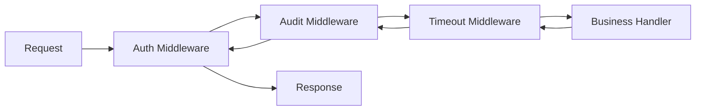
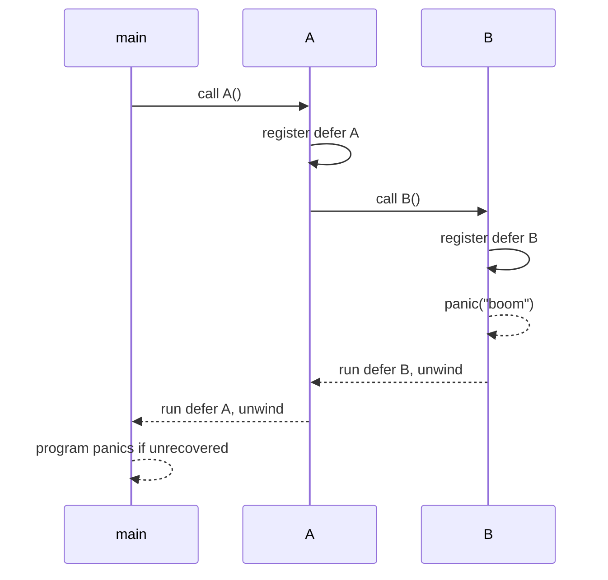
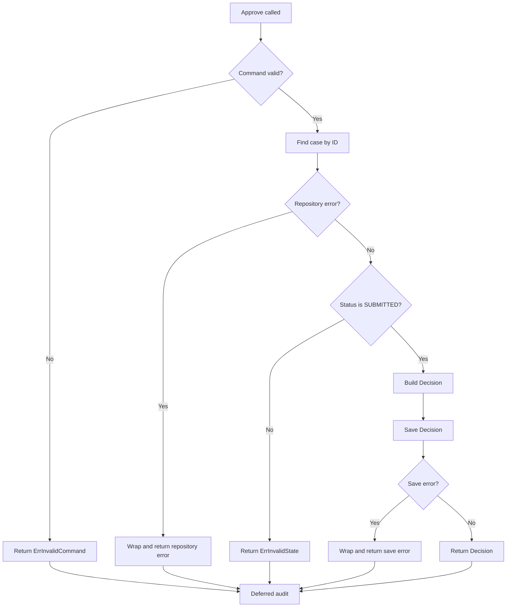

# learn-go-part-003.md

# Go Functions: Multiple Return, Named Return, Variadic, Closures, `defer`, `panic`/`recover`, dan Lifecycle Cleanup

> Series: `learn-go`  
> Part: `003`  
> Target pembaca: Java software engineer yang ingin menguasai Go secara production-grade  
> Target Go version: Go 1.26.x  
> Status seri: **belum selesai** — ini part 003 dari 034

---

## 0. Tujuan Part Ini

Pada part sebelumnya kita sudah membahas syntax core Go: declaration, zero value, constants, `iota`, operators, control flow, dan package initialization.

Part ini masuk ke unit desain paling penting dalam Go: **function**.

Di Java, fungsi biasanya muncul sebagai method di dalam class. Di Go, function adalah primitive desain yang jauh lebih langsung:

- function dapat berdiri di level package;
- method hanyalah function dengan receiver;
- error biasanya dikembalikan sebagai value;
- cleanup dilakukan eksplisit dengan `defer`;
- control-flow exceptional bukan mekanisme error handling utama;
- closure sering dipakai untuk dependency injection ringan, middleware, iterator, retry, dan lifecycle control;
- function signature adalah contract yang sangat terlihat.

Setelah menyelesaikan part ini, kamu diharapkan memahami bukan hanya cara menulis function di Go, tetapi juga bagaimana mendesain function yang:

1. mudah dibaca;
2. stabil sebagai public API;
3. jelas ownership-nya;
4. benar terhadap error dan cleanup;
5. tidak membocorkan resource;
6. aman untuk production service;
7. tidak membawa kebiasaan Java yang tidak cocok ke Go.

---

## 1. Sumber Resmi dan Grounding

Materi ini didasarkan pada sumber resmi Go berikut:

- The Go Programming Language Specification: function declarations, calls, return, defer, panic, recover.
- Effective Go: functions, named result parameters, defer, panic/recover idiom.
- Go blog: “Defer, Panic, and Recover”.
- Go 1.26 release notes: perubahan bahasa terkait `new` dengan initial expression, yang relevan ketika membahas allocation helper dan function return.

Catatan penting:

- `defer` menunda eksekusi function call sampai surrounding function selesai.
- deferred calls dieksekusi dalam urutan **last-in, first-out**.
- argument untuk deferred call dievaluasi saat statement `defer` dijalankan, bukan saat function benar-benar dieksekusi.
- `recover` hanya efektif jika dipanggil langsung dari deferred function pada goroutine yang sedang panic.
- panic/recover bukan pengganti error handling normal.

---

## 2. Mental Model Utama

### 2.1 Function di Go adalah Contract Boundary

Function di Go bukan sekadar blok reusable. Function adalah boundary tempat beberapa hal diputuskan:

```text
caller responsibility
callee responsibility
input ownership
output ownership
error classification
resource lifecycle
cancellation propagation
side effects
allocation behavior
```

Function yang bagus menjawab pertanyaan berikut tanpa harus membaca seluruh implementasi:

| Pertanyaan | Harus Terlihat Dari |
|---|---|
| Apa input wajib? | parameter type dan nama |
| Apa output utama? | return values |
| Apakah bisa gagal? | `error` return |
| Siapa yang menutup resource? | dokumentasi + signature |
| Apakah operation bisa dibatalkan? | `context.Context` parameter |
| Apakah function mutate input? | nama, type, pointer/slice/map semantics |
| Apakah function melakukan I/O? | nama, context, error behavior |
| Apakah function idempotent? | documentation dan semantic naming |

Di Go, public function adalah API. Bahkan private function tetap API internal bagi maintainers.

---

### 2.2 Go Function Tidak Punya Exception Contract Tersembunyi

Di Java, method bisa gagal melalui:

```java
Result result = service.process(command); // bisa throw unchecked exception
```

Call site tidak selalu terlihat apakah method itu:

- melakukan network call;
- melakukan database transaction;
- throw exception karena invalid input;
- throw exception karena timeout;
- throw exception karena bug;
- throw exception karena upstream unavailable.

Di Go, error path biasanya menjadi bagian eksplisit dari signature:

```go
result, err := service.Process(ctx, command)
if err != nil {
    return Result{}, err
}
```

Ini bukan verbosity tanpa alasan. Ini adalah deliberate design agar failure path tetap terlihat di control flow.

---

### 2.3 Function di Go Lebih Dekat ke Procedure + Contract daripada Method Object-Oriented

Dalam Java, kamu sering berpikir:

```text
class owns data
method mutates object state
framework injects dependencies
exceptions bubble up
```

Dalam Go, lebih idiomatis berpikir:

```text
package exposes behavior
struct holds state only when needed
function receives dependencies explicitly or through small interfaces
error returned explicitly
cleanup is visible
```

Contoh mental shift:

```java
public class CaseService {
    @Transactional
    public Decision approve(ApproveCommand command) { ... }
}
```

Go equivalent yang lebih eksplisit:

```go
func ApproveCase(ctx context.Context, repo CaseRepository, cmd ApproveCommand) (Decision, error) {
    // validate
    // load case
    // enforce transition
    // persist
    // return explicit decision or error
}
```

Atau jika state/dependencies cukup banyak:

```go
type CaseService struct {
    repo   CaseRepository
    clock  Clock
    policy ApprovalPolicy
}

func (s *CaseService) Approve(ctx context.Context, cmd ApproveCommand) (Decision, error) {
    // method is still a function with a receiver
}
```

---

## 3. Function Declaration

### 3.1 Bentuk Dasar

```go
func Add(a int, b int) int {
    return a + b
}
```

Jika parameter berurutan punya type yang sama:

```go
func Add(a, b int) int {
    return a + b
}
```

Function dengan multiple return:

```go
func Divide(a, b int) (int, error) {
    if b == 0 {
        return 0, errors.New("division by zero")
    }
    return a / b, nil
}
```

Function tanpa return:

```go
func LogAudit(event AuditEvent) {
    // side effect only
}
```

Function dengan named result:

```go
func SplitFullName(full string) (first string, last string) {
    parts := strings.Fields(full)
    if len(parts) == 0 {
        return "", ""
    }
    first = parts[0]
    if len(parts) > 1 {
        last = parts[len(parts)-1]
    }
    return first, last
}
```

---

### 3.2 Function Signature sebagai Public Contract

Signature yang buruk:

```go
func Process(data map[string]any) (map[string]any, error)
```

Masalah:

- input tidak jelas;
- output tidak jelas;
- caller tidak tahu required fields;
- caller tidak tahu mutation terjadi atau tidak;
- static type system tidak membantu;
- testing menjadi brittle;
- error classification sering kabur.

Signature yang lebih baik:

```go
type ApproveCaseCommand struct {
    CaseID     string
    OfficerID  string
    ReasonCode string
    Comment    string
}

type ApprovalDecision struct {
    CaseID       string
    PreviousStep string
    NextStep     string
    DecidedAt    time.Time
}

func ApproveCase(ctx context.Context, cmd ApproveCaseCommand) (ApprovalDecision, error) {
    // ...
}
```

Function signature harus menjadi “mini design document”.

---

## 4. Multiple Return Values

### 4.1 Kenapa Multiple Return Penting di Go

Multiple return di Go dipakai untuk:

1. mengembalikan value + error;
2. mengembalikan value + boolean existence;
3. mengembalikan parsed result + metadata;
4. mengembalikan cleanup function;
5. mengembalikan old value + new value;
6. menghindari object wrapper yang tidak perlu.

Contoh paling umum:

```go
value, err := repo.FindByID(ctx, id)
if err != nil {
    return Case{}, err
}
```

Map lookup:

```go
value, ok := cache[key]
if !ok {
    return Result{}, ErrCacheMiss
}
```

Type assertion:

```go
claim, ok := token.Claims.(*CustomClaims)
if !ok {
    return nil, ErrInvalidClaims
}
```

Channel receive:

```go
msg, ok := <-ch
if !ok {
    return ErrClosed
}
```

---

### 4.2 `(T, error)` adalah Contract, Bukan Pattern Mekanis

Signature ini:

```go
func LoadCase(ctx context.Context, id string) (Case, error)
```

mengatakan:

```text
Saya mencoba menghasilkan Case.
Jika tidak bisa, saya menghasilkan error yang menjelaskan kegagalan.
Jika error nil, Case valid sesuai contract function ini.
```

Invariant penting:

```go
caseValue, err := LoadCase(ctx, id)
if err != nil {
    // do not use caseValue unless contract explicitly says partial result is meaningful
    return err
}
// caseValue is valid
```

Anti-pattern:

```go
caseValue, err := LoadCase(ctx, id)
if err != nil {
    log.Printf("failed: %v", err)
}
process(caseValue) // BUG: may process zero value
```

Di Go, zero value membuat program sering “tetap jalan” walaupun secara semantic salah. Ini kuat sekaligus berbahaya.

---

### 4.3 `(T, bool)` vs `(T, error)`

Gunakan `(T, bool)` untuk kondisi normal “ada/tidak ada” yang bukan failure.

```go
func (c *CaseCache) Get(id string) (Case, bool) {
    v, ok := c.items[id]
    return v, ok
}
```

Gunakan `(T, error)` jika ada failure domain:

```go
func (r *CaseRepository) FindByID(ctx context.Context, id string) (Case, error) {
    // database may be down
    // query may timeout
    // row may not exist
}
```

Untuk repository, `not found` sering lebih baik sebagai error terklasifikasi:

```go
var ErrCaseNotFound = errors.New("case not found")
```

Karena database operation punya operational failure selain absence.

---

### 4.4 Multiple Return dan Intermediate Contract

Contoh parser:

```go
type ParseResult struct {
    CaseID string
    Status string
}

func ParseCaseLine(line string) (ParseResult, int, error) {
    fields := strings.Split(line, ",")
    if len(fields) < 2 {
        return ParseResult{}, 0, fmt.Errorf("expected 2 fields, got %d", len(fields))
    }
    return ParseResult{CaseID: fields[0], Status: fields[1]}, len(fields), nil
}
```

Apakah return `int` ini bagus? Tergantung. Jika metadata adalah bagian penting dari domain, lebih baik masukkan ke struct:

```go
type ParseResult struct {
    CaseID     string
    Status     string
    FieldCount int
}

func ParseCaseLine(line string) (ParseResult, error) { ... }
```

Rule praktis:

```text
Jika return value kedua/ketiga punya semantic stabil → pertimbangkan struct.
Jika hanya idiom Go seperti error/ok → multiple return bagus.
```

---

## 5. Named Return Values

### 5.1 Apa Itu Named Return

Go membolehkan return value diberi nama:

```go
func ReadConfig(path string) (cfg Config, err error) {
    data, err := os.ReadFile(path)
    if err != nil {
        return cfg, err
    }

    err = json.Unmarshal(data, &cfg)
    return cfg, err
}
```

Named result menjadi variable lokal yang otomatis diinisialisasi dengan zero value.

---

### 5.2 Kapan Named Return Layak Dipakai

Named return layak jika:

1. function pendek;
2. nama return memperjelas arti beberapa value dengan type sama;
3. digunakan dengan `defer` untuk mengubah atau mencatat error;
4. return value adalah documentation;
5. function mengikuti pattern tertentu seperti metrics/tracing.

Contoh bagus:

```go
func Bounds(values []int) (min int, max int, ok bool) {
    if len(values) == 0 {
        return 0, 0, false
    }
    min, max = values[0], values[0]
    for _, v := range values[1:] {
        if v < min {
            min = v
        }
        if v > max {
            max = v
        }
    }
    return min, max, true
}
```

Nama `min`, `max`, `ok` membantu karena `int, int, bool` tanpa nama kurang jelas.

---

### 5.3 Kapan Named Return Berbahaya

Named return berbahaya jika function panjang dan menggunakan naked return:

```go
func ProcessCase(ctx context.Context, id string) (decision Decision, err error) {
    // 120 lines later...
    if somethingWrong {
        err = ErrInvalidState
        return // BAD in long function: unclear what is returned
    }
    return
}
```

Dalam function panjang, naked return membuat pembaca harus melacak state variable sepanjang function.

Lebih jelas:

```go
func ProcessCase(ctx context.Context, id string) (Decision, error) {
    decision, err := computeDecision(ctx, id)
    if err != nil {
        return Decision{}, err
    }
    return decision, nil
}
```

Rule:

```text
Named return boleh.
Naked return hanya untuk function pendek dan sangat jelas.
```

---

### 5.4 Named Error dan Deferred Error Wrapping

Salah satu penggunaan named return yang kuat adalah cleanup yang bisa menghasilkan error.

Contoh:

```go
func WriteReport(path string, report Report) (err error) {
    f, err := os.Create(path)
    if err != nil {
        return err
    }

    defer func() {
        closeErr := f.Close()
        if err == nil && closeErr != nil {
            err = closeErr
        }
    }()

    if err := encodeReport(f, report); err != nil {
        return err
    }
    return nil
}
```

Kenapa ini penting?

- `Close()` pada writer bisa gagal.
- Jika encode berhasil tapi close gagal, file mungkin belum benar-benar flushed.
- Named `err` memungkinkan deferred function mengubah final error.

Versi yang lebih eksplisit:

```go
func WriteReport(path string, report Report) error {
    f, err := os.Create(path)
    if err != nil {
        return err
    }

    encodeErr := encodeReport(f, report)
    closeErr := f.Close()

    if encodeErr != nil {
        return encodeErr
    }
    if closeErr != nil {
        return closeErr
    }
    return nil
}
```

Keduanya valid. Pilih berdasarkan clarity.

---

## 6. Function as Values

### 6.1 Function Type

Function bisa menjadi value:

```go
type Validator func(Case) error
```

Lalu digunakan:

```go
func ValidateCase(c Case, validators ...Validator) error {
    for _, validate := range validators {
        if err := validate(c); err != nil {
            return err
        }
    }
    return nil
}
```

Contoh validators:

```go
func RequireCaseID(c Case) error {
    if c.ID == "" {
        return errors.New("case id is required")
    }
    return nil
}

func RequireOpenStatus(c Case) error {
    if c.Status != "OPEN" {
        return fmt.Errorf("case must be open, got %s", c.Status)
    }
    return nil
}
```

Call:

```go
err := ValidateCase(c, RequireCaseID, RequireOpenStatus)
```

---

### 6.2 Function Value untuk Dependency Injection Ringan

Java sering menggunakan interface/class/DI container. Go bisa menggunakan interface atau function value.

Misalnya dependency hanya satu operasi:

```go
type Clock func() time.Time

func NewDecision(clock Clock) Decision {
    return Decision{CreatedAt: clock()}
}
```

Production:

```go
decision := NewDecision(time.Now)
```

Test:

```go
fixed := func() time.Time {
    return time.Date(2026, 1, 1, 0, 0, 0, 0, time.UTC)
}

decision := NewDecision(fixed)
```

Tidak perlu interface besar:

```go
type Clock interface {
    Now() time.Time
}
```

Interface tetap bagus jika contract punya beberapa method atau semantic domain yang lebih kaya.

---

### 6.3 Nil Function Value

Function value bisa nil:

```go
var hook func(Event)
hook(Event{}) // panic: nil function call
```

Aman:

```go
if hook != nil {
    hook(event)
}
```

Untuk production code, default no-op sering lebih baik:

```go
func noopHook(Event) {}

type Processor struct {
    onProcessed func(Event)
}

func NewProcessor(onProcessed func(Event)) *Processor {
    if onProcessed == nil {
        onProcessed = noopHook
    }
    return &Processor{onProcessed: onProcessed}
}
```

---

## 7. Variadic Functions

### 7.1 Bentuk Dasar

```go
func Sum(values ...int) int {
    total := 0
    for _, v := range values {
        total += v
    }
    return total
}
```

Call:

```go
Sum(1, 2, 3)
```

Slice expansion:

```go
values := []int{1, 2, 3}
Sum(values...)
```

Di dalam function, `values` bertipe `[]int`.

---

### 7.2 Variadic untuk Optional Options

Pattern yang umum:

```go
type ClientOption func(*Client)

type Client struct {
    timeout time.Duration
    retries int
}

func WithTimeout(timeout time.Duration) ClientOption {
    return func(c *Client) {
        c.timeout = timeout
    }
}

func WithRetries(retries int) ClientOption {
    return func(c *Client) {
        c.retries = retries
    }
}

func NewClient(options ...ClientOption) *Client {
    c := &Client{
        timeout: 5 * time.Second,
        retries: 2,
    }
    for _, opt := range options {
        opt(c)
    }
    return c
}
```

Call:

```go
client := NewClient(
    WithTimeout(2*time.Second),
    WithRetries(3),
)
```

Pattern ini disebut **functional options**.

---

### 7.3 Kapan Functional Options Bagus

Functional options bagus jika:

- constructor punya banyak optional fields;
- default value penting;
- kamu ingin API tetap compatible saat option baru ditambah;
- object cukup kompleks;
- options perlu validasi atau side effect kecil.

Contoh cocok:

```go
client := NewHTTPClient(
    WithBaseURL("https://api.example.com"),
    WithTimeout(2*time.Second),
    WithRetryPolicy(policy),
    WithLogger(logger),
)
```

---

### 7.4 Kapan Functional Options Overkill

Untuk struct kecil, gunakan config struct:

```go
type WorkerConfig struct {
    MaxConcurrency int
    QueueSize      int
    Timeout        time.Duration
}

func NewWorker(cfg WorkerConfig) (*Worker, error) {
    if cfg.MaxConcurrency <= 0 {
        return nil, errors.New("max concurrency must be positive")
    }
    return &Worker{cfg: cfg}, nil
}
```

Jangan semua hal dibuat functional option karena terlihat “Go advanced”.

Rule:

```text
Config struct lebih jelas untuk data.
Functional options lebih cocok untuk extensibility dan default behavior.
```

---

### 7.5 Variadic `...any` dan Bahayanya

Contoh:

```go
func Log(args ...any) {
    fmt.Println(args...)
}
```

`...any` fleksibel tapi kehilangan type safety.

Untuk API internal production, lebih baik structured input:

```go
type LogEvent struct {
    Message string
    Fields  map[string]string
}

func LogEvent(ctx context.Context, event LogEvent) { ... }
```

Atau gunakan structured logger seperti `log/slog` pada part observability.

---

## 8. Closures

### 8.1 Apa Itu Closure

Closure adalah function yang menangkap variable dari lexical scope luar.

```go
func Counter() func() int {
    n := 0
    return func() int {
        n++
        return n
    }
}
```

Call:

```go
next := Counter()
fmt.Println(next()) // 1
fmt.Println(next()) // 2
```

`n` tetap hidup karena ditangkap oleh returned function.

---

### 8.2 Closure sebagai State Machine Kecil

Contoh simple rate limiter counter:

```go
func MaxCalls(limit int) func() bool {
    used := 0
    return func() bool {
        if used >= limit {
            return false
        }
        used++
        return true
    }
}
```

Tetapi perhatikan: closure ini tidak concurrency-safe.

Jika dipakai concurrent:

```go
allow := MaxCalls(10)
go allow()
go allow()
```

Data race bisa terjadi.

Concurrency-safe version:

```go
func MaxCallsSafe(limit int) func() bool {
    var mu sync.Mutex
    used := 0

    return func() bool {
        mu.Lock()
        defer mu.Unlock()

        if used >= limit {
            return false
        }
        used++
        return true
    }
}
```

---

### 8.3 Closure dan Loop Variables

Modern Go sudah memperbaiki salah satu jebakan klasik loop variable pada Go 1.22: variable yang dideklarasikan oleh `for` loop dibuat per-iteration, menghindari accidental sharing bug yang dulu umum terjadi.

Namun kamu tetap harus memahami capture behavior.

Contoh aman pada Go modern:

```go
for _, id := range ids {
    go func() {
        process(id)
    }()
}
```

Tetapi tetap hati-hati jika variable luar dimutasi:

```go
var current string
for _, id := range ids {
    current = id
    go func() {
        process(current) // unsafe semantic: captures shared outer variable
    }()
}
```

Lebih jelas:

```go
for _, id := range ids {
    id := id
    go func() {
        process(id)
    }()
}
```

`id := id` masih sering dipakai untuk clarity dan kompatibilitas mental model, walaupun pada Go modern sering tidak lagi wajib untuk range loop variable yang dideklarasikan di loop.

---

### 8.4 Closure untuk Middleware

HTTP middleware biasanya closure:

```go
type Handler func(ctx context.Context, req Request) (Response, error)

type Middleware func(Handler) Handler

func WithAudit(auditor Auditor) Middleware {
    return func(next Handler) Handler {
        return func(ctx context.Context, req Request) (Response, error) {
            start := time.Now()
            resp, err := next(ctx, req)
            auditor.Record(ctx, AuditEvent{
                Operation: req.Operation,
                Duration:  time.Since(start),
                Failed:    err != nil,
            })
            return resp, err
        }
    }
}
```

Diagram:



Closure membuat dependency seperti `auditor` ditangkap tanpa global variable.

---

### 8.5 Closure dan Escape Analysis

Ketika closure menangkap variable dan closure hidup lebih lama dari stack frame asal, variable bisa escape ke heap.

Contoh:

```go
func MakeCounter() func() int {
    n := 0
    return func() int {
        n++
        return n
    }
}
```

`n` harus tetap hidup setelah `MakeCounter` return, sehingga runtime/compiler harus menyimpannya di tempat yang lifetime-nya cukup panjang.

Ini bukan masalah otomatis, tetapi penting untuk performance-sensitive code.

Kamu akan mendalami escape analysis di part memory management.

---

## 9. `defer`

### 9.1 Mental Model `defer`

`defer` menjadwalkan function call untuk dieksekusi ketika surrounding function selesai.

```go
func ReadFile(path string) ([]byte, error) {
    f, err := os.Open(path)
    if err != nil {
        return nil, err
    }
    defer f.Close()

    return io.ReadAll(f)
}
```

Tanpa `defer`, cleanup mudah terlewat:

```go
func ReadFile(path string) ([]byte, error) {
    f, err := os.Open(path)
    if err != nil {
        return nil, err
    }

    data, err := io.ReadAll(f)
    if err != nil {
        f.Close()
        return nil, err
    }

    f.Close()
    return data, nil
}
```

`defer` membuat cleanup dekat dengan acquisition.

Rule penting:

```text
Resource acquired successfully → defer cleanup immediately.
```

---

### 9.2 Urutan Eksekusi `defer`: LIFO

```go
func Example() {
    defer fmt.Println("first")
    defer fmt.Println("second")
    defer fmt.Println("third")
}
```

Output:

```text
third
second
first
```

Ini penting untuk resource nesting.

```go
func UseResources() error {
    outer, err := OpenOuter()
    if err != nil {
        return err
    }
    defer outer.Close()

    inner, err := outer.OpenInner()
    if err != nil {
        return err
    }
    defer inner.Close()

    return doWork(inner)
}
```

`inner.Close()` dipanggil sebelum `outer.Close()`, sesuai nesting.

---

### 9.3 Argument `defer` Dievaluasi Saat `defer` Dijalankan

```go
func Example() {
    x := 1
    defer fmt.Println(x)
    x = 2
}
```

Output:

```text
1
```

Karena argument `x` dievaluasi saat `defer fmt.Println(x)` dijalankan.

Tetapi closure menangkap variable:

```go
func Example() {
    x := 1
    defer func() {
        fmt.Println(x)
    }()
    x = 2
}
```

Output:

```text
2
```

Karena closure membaca `x` saat deferred function dieksekusi.

---

### 9.4 `defer` untuk Unlock

```go
func (s *Store) Get(id string) (Case, bool) {
    s.mu.RLock()
    defer s.mu.RUnlock()

    c, ok := s.items[id]
    return c, ok
}
```

Ini sangat idiomatis karena mengurangi risiko lupa unlock.

Namun untuk hot path sangat pendek, manual unlock kadang dipakai untuk menghindari overhead atau memperpendek critical section:

```go
s.mu.RLock()
c, ok := s.items[id]
s.mu.RUnlock()
return c, ok
```

Jangan premature optimize. Ukur dengan benchmark.

---

### 9.5 `defer` di Loop: Jebakan Resource Leak Sementara

Anti-pattern:

```go
func ProcessFiles(paths []string) error {
    for _, path := range paths {
        f, err := os.Open(path)
        if err != nil {
            return err
        }
        defer f.Close() // closes only when ProcessFiles returns

        if err := process(f); err != nil {
            return err
        }
    }
    return nil
}
```

Jika `paths` banyak, semua file tetap terbuka sampai function selesai.

Perbaikan 1: helper function per iteration.

```go
func ProcessFiles(paths []string) error {
    for _, path := range paths {
        if err := processOneFile(path); err != nil {
            return err
        }
    }
    return nil
}

func processOneFile(path string) error {
    f, err := os.Open(path)
    if err != nil {
        return err
    }
    defer f.Close()

    return process(f)
}
```

Perbaikan 2: close manual di loop.

```go
func ProcessFiles(paths []string) error {
    for _, path := range paths {
        f, err := os.Open(path)
        if err != nil {
            return err
        }

        err = process(f)
        closeErr := f.Close()

        if err != nil {
            return err
        }
        if closeErr != nil {
            return closeErr
        }
    }
    return nil
}
```

---

### 9.6 `defer` dan Error dari `Close`

Banyak contoh menulis:

```go
defer f.Close()
```

Ini sering cukup untuk read-only file. Tetapi untuk writer, close error penting.

```go
func Save(path string, data []byte) (err error) {
    f, err := os.Create(path)
    if err != nil {
        return err
    }

    defer func() {
        closeErr := f.Close()
        if err == nil && closeErr != nil {
            err = closeErr
        }
    }()

    _, err = f.Write(data)
    return err
}
```

Untuk file write yang critical, kamu juga mungkin perlu atomic write pattern:

```text
write temp file
fsync temp file
close temp file
rename temp → target
fsync parent directory when required
```

Ini akan dibahas lebih dalam di part filesystem I/O.

---

### 9.7 `defer` untuk Observability

Pattern:

```go
func (s *Service) Approve(ctx context.Context, cmd ApproveCommand) (decision Decision, err error) {
    start := time.Now()
    defer func() {
        s.metrics.RecordApproval(time.Since(start), err)
    }()

    decision, err = s.approve(ctx, cmd)
    return decision, err
}
```

Named `err` memungkinkan deferred metrics melihat final error.

Namun hati-hati: jangan mengubah error di deferred observability kecuali memang dirancang.

---

## 10. `panic` dan `recover`

### 10.1 Panic Bukan Exception Handling Normal

Di Go, error normal dikembalikan sebagai `error`.

Gunakan error untuk:

- input invalid;
- not found;
- timeout;
- network failure;
- database failure;
- permission denied;
- business rule violation;
- upstream unavailable.

Gunakan panic untuk:

- programmer error;
- invariant broken;
- impossible state;
- initialization failure yang membuat program tidak bisa berjalan;
- internal package mechanism yang dikonversi menjadi error pada boundary yang jelas.

Buruk:

```go
func LoadUser(id string) User {
    if id == "" {
        panic("empty id")
    }
    // database call...
}
```

Lebih baik:

```go
func LoadUser(ctx context.Context, id string) (User, error) {
    if id == "" {
        return User{}, errors.New("empty id")
    }
    // database call...
}
```

---

### 10.2 Panic untuk Broken Invariant

Contoh:

```go
func MustParseState(s string) State {
    state, err := ParseState(s)
    if err != nil {
        panic(err)
    }
    return state
}
```

`MustXxx` convention memberi sinyal bahwa function akan panic jika input invalid.

Cocok untuk initialization static:

```go
var ApprovedState = MustParseState("APPROVED")
```

Tidak cocok untuk user input runtime:

```go
state := MustParseState(request.FormValue("state")) // BAD
```

---

### 10.3 Panic Unwinds Stack dan Menjalankan Deferred Calls

```go
func A() {
    defer fmt.Println("defer A")
    B()
}

func B() {
    defer fmt.Println("defer B")
    panic("boom")
}
```

Output sebelum program crash:

```text
defer B
defer A
panic: boom
```

Diagram:



---

### 10.4 Recover Hanya Efektif di Deferred Function yang Tepat

Benar:

```go
func SafeRun(fn func()) (err error) {
    defer func() {
        if r := recover(); r != nil {
            err = fmt.Errorf("panic recovered: %v", r)
        }
    }()

    fn()
    return nil
}
```

Salah:

```go
func BadRecover() {
    recover() // always nil in normal flow
}
```

Salah juga jika recover tidak dipanggil langsung dari deferred function yang sedang unwind.

---

### 10.5 Recover Tidak Menangkap Panic dari Goroutine Lain

```go
func main() {
    defer func() {
        if r := recover(); r != nil {
            fmt.Println("recovered", r)
        }
    }()

    go func() {
        panic("boom")
    }()

    time.Sleep(time.Second)
}
```

`recover` di `main` tidak menangkap panic dari goroutine lain.

Setiap goroutine perlu recovery boundary sendiri jika kamu ingin mencegah crash:

```go
func GoSafe(logger *slog.Logger, fn func()) {
    go func() {
        defer func() {
            if r := recover(); r != nil {
                logger.Error("goroutine panic recovered", "panic", r)
            }
        }()
        fn()
    }()
}
```

Namun jangan gunakan ini untuk menyembunyikan bug. Recovery harus logging + fail policy yang jelas.

---

### 10.6 HTTP Server dan Panic Boundary

HTTP server production sering punya panic recovery middleware.

```go
func RecoverMiddleware(next http.Handler, logger *slog.Logger) http.Handler {
    return http.HandlerFunc(func(w http.ResponseWriter, r *http.Request) {
        defer func() {
            if rec := recover(); rec != nil {
                logger.ErrorContext(r.Context(), "panic recovered",
                    "panic", rec,
                    "path", r.URL.Path,
                )
                http.Error(w, http.StatusText(http.StatusInternalServerError), http.StatusInternalServerError)
            }
        }()

        next.ServeHTTP(w, r)
    })
}
```

Tetapi invariant penting:

```text
Recovery middleware melindungi process dari crash,
tetapi tidak membuat request berhasil.
Panic tetap bug atau broken invariant yang harus diperbaiki.
```

---

### 10.7 Panic sebagai Internal Control Flow: Hati-hati

Beberapa package menggunakan panic/recover internal untuk unwind kompleks lalu mengubahnya menjadi error pada boundary.

Pattern ini harus jarang.

Contoh konseptual:

```go
func Parse(input string) (result AST, err error) {
    p := parser{input: input}
    defer func() {
        if r := recover(); r != nil {
            if parseErr, ok := r.(ParseError); ok {
                result = AST{}
                err = parseErr
                return
            }
            panic(r) // not ours; re-panic
        }
    }()

    return p.parse(), nil
}
```

Rule:

```text
Jika panic digunakan internal, recover harus berada pada boundary package yang jelas.
Jangan biarkan panic menjadi public API surprise.
```

---

## 11. Lifecycle Cleanup

### 11.1 Resource Lifecycle Pattern

Banyak bug production bukan karena syntax salah, tapi lifecycle tidak jelas.

Resource bisa berupa:

- file;
- socket;
- database rows;
- transaction;
- lock;
- goroutine;
- timer/ticker;
- temporary directory;
- HTTP response body;
- subscription/consumer;
- trace span;
- metric timer;
- memory buffer from pool.

Go mengandalkan explicit cleanup.

General pattern:

```go
resource, err := acquire()
if err != nil {
    return err
}
defer resource.Close()

// use resource
```

---

### 11.2 HTTP Response Body Must Be Closed

```go
resp, err := http.DefaultClient.Do(req)
if err != nil {
    return err
}
defer resp.Body.Close()

if resp.StatusCode != http.StatusOK {
    return fmt.Errorf("unexpected status: %s", resp.Status)
}

body, err := io.ReadAll(resp.Body)
if err != nil {
    return err
}
```

Jika body tidak ditutup, connection reuse bisa terganggu dan resource leak terjadi.

Untuk response besar, jangan `io.ReadAll`; stream.

---

### 11.3 Database Rows Must Be Closed

```go
rows, err := db.QueryContext(ctx, query)
if err != nil {
    return err
}
defer rows.Close()

for rows.Next() {
    var c Case
    if err := rows.Scan(&c.ID, &c.Status); err != nil {
        return err
    }
    cases = append(cases, c)
}

if err := rows.Err(); err != nil {
    return err
}
```

Tiga hal wajib:

1. `defer rows.Close()`;
2. check `Scan` error;
3. check `rows.Err()` setelah iteration.

---

### 11.4 Timer dan Ticker Lifecycle

Ticker harus dihentikan:

```go
ticker := time.NewTicker(time.Minute)
defer ticker.Stop()

for {
    select {
    case <-ctx.Done():
        return ctx.Err()
    case <-ticker.C:
        doWork()
    }
}
```

Timer juga perlu hati-hati saat reuse. Ini akan dibahas di concurrency/time parts.

---

### 11.5 Goroutine Lifecycle Bukan Otomatis

Goroutine tidak punya parent-child lifecycle otomatis seperti structured concurrency. Jika kamu start goroutine, kamu harus tahu kapan ia berhenti.

Buruk:

```go
func StartWorker() {
    go func() {
        for {
            doWork()
        }
    }()
}
```

Tidak ada cancellation.

Lebih baik:

```go
func StartWorker(ctx context.Context, interval time.Duration) {
    go func() {
        ticker := time.NewTicker(interval)
        defer ticker.Stop()

        for {
            select {
            case <-ctx.Done():
                return
            case <-ticker.C:
                doWork(ctx)
            }
        }
    }()
}
```

Lebih production-grade lagi: return handle atau error group pattern.

---

## 12. Method adalah Function dengan Receiver

Walaupun part detail methods akan muncul di part 004, fungsi dengan receiver perlu diperkenalkan di sini.

```go
type CaseService struct {
    repo CaseRepository
}

func (s *CaseService) Approve(ctx context.Context, cmd ApproveCommand) (Decision, error) {
    return s.repo.Approve(ctx, cmd)
}
```

Method declaration:

```go
func (receiver ReceiverType) MethodName(params) returns {
    ...
}
```

Receiver bisa value atau pointer.

```go
func (c Case) IsClosed() bool {
    return c.Status == StatusClosed
}

func (c *Case) Close() {
    c.Status = StatusClosed
}
```

Mental model:

```text
method = function + receiver parameter with special call syntax
```

Kira-kira:

```go
func Case_IsClosed(c Case) bool
func Case_Close(c *Case)
```

---

## 13. Function Design untuk Production Code

### 13.1 Parameter Ordering

Go convention umum:

```go
func Operation(ctx context.Context, dependency Dependency, input Input) (Output, error)
```

Untuk method:

```go
func (s *Service) Operation(ctx context.Context, input Input) (Output, error)
```

`context.Context` hampir selalu parameter pertama setelah receiver.

```go
func (s *CaseService) Approve(ctx context.Context, cmd ApproveCommand) (Decision, error)
```

Jangan simpan context di struct:

```go
type Service struct {
    ctx context.Context // BAD for request-scoped context
}
```

Context adalah request/lifecycle scoped, bukan object field normal.

---

### 13.2 Jangan Terlalu Banyak Parameter Primitif

Buruk:

```go
func CreateCase(id string, applicant string, status string, priority int, createdBy string, createdAt time.Time) error
```

Lebih baik:

```go
type CreateCaseCommand struct {
    ID        string
    Applicant string
    Priority  int
    CreatedBy string
    CreatedAt time.Time
}

func CreateCase(ctx context.Context, cmd CreateCaseCommand) error
```

Keuntungan:

- call site lebih jelas;
- field bisa ditambah tanpa merusak parameter ordering;
- validasi lebih mudah;
- test fixture lebih rapi;
- menghindari bug swapped arguments.

---

### 13.3 Return Struct Jika Output Punya Domain Meaning

Kurang jelas:

```go
func Decide(c Case) (string, string, bool, error)
```

Lebih jelas:

```go
type DecisionResult struct {
    PreviousState string
    NextState     string
    RequiresAudit bool
}

func Decide(c Case) (DecisionResult, error)
```

Multiple return bagus untuk idiom kecil. Untuk domain result, struct lebih baik.

---

### 13.4 Function Should Do One Coherent Thing

Go tidak memaksa function pendek, tetapi function panjang biasanya tanda boundary kabur.

Buruk:

```go
func ProcessApplication(ctx context.Context, req Request) (Response, error) {
    // parse HTTP
    // validate
    // authorize
    // load DB
    // call external API
    // update transaction
    // generate document
    // send email
    // publish event
    // map response
}
```

Lebih baik pecah berdasarkan responsibility:

```go
func (h *Handler) ServeHTTP(w http.ResponseWriter, r *http.Request)
func DecodeApproveRequest(r *http.Request) (ApproveCommand, error)
func (s *Service) Approve(ctx context.Context, cmd ApproveCommand) (Decision, error)
func (r *Repository) SaveDecision(ctx context.Context, decision Decision) error
func (p *Publisher) PublishDecision(ctx context.Context, event DecisionEvent) error
```

Boundary bukan berdasarkan layer template, tapi berdasarkan semantic responsibility.

---

## 14. Production Example: Regulatory Case Approval Function

### 14.1 Domain Model

```go
package caseflow

import (
    "context"
    "errors"
    "fmt"
    "time"
)

type CaseStatus string

const (
    StatusDraft    CaseStatus = "DRAFT"
    StatusSubmitted CaseStatus = "SUBMITTED"
    StatusApproved CaseStatus = "APPROVED"
    StatusRejected CaseStatus = "REJECTED"
)

type Case struct {
    ID        string
    Status    CaseStatus
    Applicant string
    Version   int64
}

type ApproveCommand struct {
    CaseID    string
    OfficerID string
    Comment   string
}

type Decision struct {
    CaseID       string
    Previous     CaseStatus
    Next         CaseStatus
    OfficerID    string
    Comment      string
    DecidedAt    time.Time
    CaseVersion  int64
}
```

---

### 14.2 Errors

```go
var (
    ErrInvalidCommand = errors.New("invalid approve command")
    ErrCaseNotFound   = errors.New("case not found")
    ErrInvalidState   = errors.New("invalid case state")
)
```

---

### 14.3 Interfaces

```go
type CaseRepository interface {
    FindByID(ctx context.Context, id string) (Case, error)
    SaveDecision(ctx context.Context, decision Decision) error
}

type Auditor interface {
    Record(ctx context.Context, event AuditEvent) error
}

type AuditEvent struct {
    CaseID    string
    ActorID   string
    Action    string
    Success   bool
    ErrorText string
    CreatedAt time.Time
}

type Clock func() time.Time
```

---

### 14.4 Service Function

```go
type Service struct {
    repo    CaseRepository
    auditor Auditor
    clock   Clock
}

func NewService(repo CaseRepository, auditor Auditor, clock Clock) *Service {
    if clock == nil {
        clock = time.Now
    }
    return &Service{
        repo:    repo,
        auditor: auditor,
        clock:   clock,
    }
}

func (s *Service) Approve(ctx context.Context, cmd ApproveCommand) (decision Decision, err error) {
    startedAt := s.clock()

    defer func() {
        if s.auditor == nil {
            return
        }

        event := AuditEvent{
            CaseID:    cmd.CaseID,
            ActorID:   cmd.OfficerID,
            Action:    "APPROVE_CASE",
            Success:   err == nil,
            CreatedAt: startedAt,
        }
        if err != nil {
            event.ErrorText = err.Error()
        }

        auditErr := s.auditor.Record(ctx, event)
        if err == nil && auditErr != nil {
            err = fmt.Errorf("record audit: %w", auditErr)
        }
    }()

    if cmd.CaseID == "" || cmd.OfficerID == "" {
        return Decision{}, ErrInvalidCommand
    }

    c, err := s.repo.FindByID(ctx, cmd.CaseID)
    if err != nil {
        return Decision{}, fmt.Errorf("find case %s: %w", cmd.CaseID, err)
    }

    if c.Status != StatusSubmitted {
        return Decision{}, fmt.Errorf("%w: approve requires %s, got %s", ErrInvalidState, StatusSubmitted, c.Status)
    }

    decision = Decision{
        CaseID:      c.ID,
        Previous:    c.Status,
        Next:        StatusApproved,
        OfficerID:   cmd.OfficerID,
        Comment:     cmd.Comment,
        DecidedAt:   s.clock(),
        CaseVersion: c.Version,
    }

    if err := s.repo.SaveDecision(ctx, decision); err != nil {
        return Decision{}, fmt.Errorf("save approval decision: %w", err)
    }

    return decision, nil
}
```

---

### 14.5 Analisis Design

Function ini menunjukkan beberapa konsep:

| Konsep | Implementasi |
|---|---|
| Method as function | `func (s *Service) Approve(...)` |
| Context first | `ctx context.Context` |
| Command struct | `ApproveCommand` |
| Domain result struct | `Decision` |
| Explicit failure | `(Decision, error)` |
| Named return | `decision Decision, err error` untuk audit defer |
| Dependency injection ringan | `Clock func() time.Time` |
| Cleanup/finalization | `defer` audit record |
| Error wrapping | `fmt.Errorf("...: %w", err)` |
| Invariant check | status harus `SUBMITTED` |
| Zero value safety | `Decision{}` saat error |

---

### 14.6 Flow Diagram



---

## 15. Anti-Patterns

### 15.1 Ignoring Error Return

```go
result, _ := LoadCase(ctx, id)
```

Ini hampir selalu buruk kecuali kamu benar-benar punya alasan eksplisit.

Lebih baik:

```go
result, err := LoadCase(ctx, id)
if err != nil {
    return err
}
```

---

### 15.2 Panic untuk Business Error

```go
if !user.CanApprove(c) {
    panic("not allowed")
}
```

Lebih baik:

```go
if !user.CanApprove(c) {
    return Decision{}, ErrPermissionDenied
}
```

---

### 15.3 Defer di Loop yang Membuka Banyak Resource

```go
for _, path := range paths {
    f, _ := os.Open(path)
    defer f.Close()
}
```

Masalah: resource tidak ditutup sampai function selesai.

---

### 15.4 Function Signature Terlalu Generic

```go
func Handle(input any) (any, error)
```

Kecuali kamu sedang menulis generic framework boundary, ini menghilangkan manfaat static typing.

---

### 15.5 Function Melakukan Terlalu Banyak Hal

```go
func SyncEverything(ctx context.Context) error
```

Nama seperti ini sering menyembunyikan:

- network call;
- DB transaction;
- batch loop;
- retry;
- partial failure;
- event publishing;
- cleanup;
- metrics;
- email.

Pecah berdasarkan lifecycle dan failure boundary.

---

### 15.6 Named Return + Naked Return di Function Panjang

```go
func Complex() (x int, y int, err error) {
    // many branches
    return
}
```

Sulit direview.

---

### 15.7 Closure Menangkap Mutable State Tanpa Sinkronisasi

```go
count := 0
handler := func() {
    count++ // data race if called concurrently
}
```

Gunakan mutex/atomic atau hindari shared mutable state.

---

### 15.8 Recover yang Menelan Panic Diam-Diam

```go
defer func() {
    recover()
}()
```

Ini sangat buruk. Bug hilang dari observability.

Minimal:

```go
defer func() {
    if r := recover(); r != nil {
        logger.Error("panic recovered", "panic", r)
    }
}()
```

Lebih baik lagi: record stack trace, metrics, request context, dan fail response.

---

## 16. Design Checklist

Gunakan checklist ini saat menulis function Go production-grade.

### 16.1 Signature

- Apakah nama function menjelaskan action atau query?
- Apakah parameter terlalu banyak?
- Apakah primitive parameters sebaiknya dibungkus command struct?
- Apakah output domain sebaiknya struct, bukan multiple primitive returns?
- Apakah `context.Context` diperlukan?
- Jika ya, apakah posisinya parameter pertama?
- Apakah error return diperlukan?
- Apakah `bool` lebih tepat daripada `error` untuk absence normal?

### 16.2 Error

- Apakah error dicek segera?
- Apakah error di-wrap dengan context yang cukup?
- Apakah sentinel/typed error diperlukan untuk caller decision?
- Apakah zero value output aman saat error?
- Apakah function mendokumentasikan partial result jika ada?

### 16.3 Resource

- Apakah setiap acquired resource ditutup?
- Apakah `defer` berada segera setelah successful acquisition?
- Apakah `Close` error penting?
- Apakah ada `defer` di loop yang bisa menumpuk resource?
- Apakah goroutine punya cancellation path?
- Apakah ticker/timer dihentikan?

### 16.4 Closure

- Apakah closure menangkap mutable state?
- Apakah closure bisa dipanggil concurrent?
- Apakah captured variable menyebabkan lifecycle lebih panjang dari yang diharapkan?
- Apakah function value bisa nil?

### 16.5 Panic/Recover

- Apakah panic hanya untuk programmer error/invariant broken?
- Apakah business error dikembalikan sebagai error?
- Apakah recover boundary logging cukup?
- Apakah recover tidak menyembunyikan bug?
- Apakah panic dari goroutine lain sudah dipahami tidak bisa ditangkap oleh parent goroutine?

---

## 17. Java-to-Go Translation Notes

### 17.1 Java Method dengan Exception

Java:

```java
public Decision approve(ApproveCommand command) {
    Case c = repository.findById(command.caseId())
        .orElseThrow(() -> new NotFoundException("case not found"));

    if (!c.status().equals(Status.SUBMITTED)) {
        throw new InvalidStateException("case is not submitted");
    }

    return repository.saveDecision(...);
}
```

Go:

```go
func (s *Service) Approve(ctx context.Context, cmd ApproveCommand) (Decision, error) {
    c, err := s.repo.FindByID(ctx, cmd.CaseID)
    if err != nil {
        return Decision{}, fmt.Errorf("find case: %w", err)
    }
    if c.Status != StatusSubmitted {
        return Decision{}, ErrInvalidState
    }
    decision := buildDecision(c, cmd)
    if err := s.repo.SaveDecision(ctx, decision); err != nil {
        return Decision{}, fmt.Errorf("save decision: %w", err)
    }
    return decision, nil
}
```

Key difference:

```text
Java failure path can be invisible at call site.
Go failure path is ordinary control flow.
```

---

### 17.2 Java try-with-resources vs Go defer

Java:

```java
try (InputStream in = Files.newInputStream(path)) {
    return in.readAllBytes();
}
```

Go:

```go
f, err := os.Open(path)
if err != nil {
    return nil, err
}
defer f.Close()

return io.ReadAll(f)
```

Java resource scope is block-based. Go defer scope is function-based.

This difference matters in loops.

---

### 17.3 Java Functional Interface vs Go Function Type

Java:

```java
@FunctionalInterface
interface Validator<T> {
    void validate(T value) throws ValidationException;
}
```

Go:

```go
type Validator[T any] func(T) error
```

Go does not require interface ceremony for one-method behavior if a function type is enough.

---

### 17.4 Java DI Container vs Go Explicit Constructor

Java:

```java
@Service
class CaseService {
    private final CaseRepository repo;
    private final Auditor auditor;

    CaseService(CaseRepository repo, Auditor auditor) {
        this.repo = repo;
        this.auditor = auditor;
    }
}
```

Go:

```go
type Service struct {
    repo    CaseRepository
    auditor Auditor
}

func NewService(repo CaseRepository, auditor Auditor) *Service {
    return &Service{repo: repo, auditor: auditor}
}
```

No annotation. No container required. Wiring is ordinary code.

---

## 18. Hands-On Labs

### Lab 1 — Refactor Primitive Parameters

Mulai dari function ini:

```go
func SubmitCase(id string, applicant string, category string, priority int, submittedBy string) error {
    return nil
}
```

Refactor menjadi:

- command struct;
- validation function;
- result struct jika perlu;
- error classification.

Target:

```go
type SubmitCaseCommand struct { ... }
func SubmitCase(ctx context.Context, cmd SubmitCaseCommand) (SubmitCaseResult, error)
```

---

### Lab 2 — Safe File Processing

Buat function:

```go
func CountLines(path string) (int, error)
```

Requirement:

- open file;
- close dengan `defer`;
- scan line by line;
- return scanner error;
- jangan `panic` untuk file not found.

---

### Lab 3 — Variadic Validators

Buat:

```go
type Validator[T any] func(T) error
func Validate[T any](value T, validators ...Validator[T]) error
```

Lalu implement validator untuk `ApproveCommand`.

---

### Lab 4 — Closure Middleware

Buat middleware chain untuk function type:

```go
type Handler func(context.Context, Command) (Result, error)
type Middleware func(Handler) Handler
```

Implement:

- logging middleware;
- timing middleware;
- panic recovery middleware.

---

### Lab 5 — Panic Boundary

Buat:

```go
func SafeExecute(fn func() error) (err error)
```

Requirement:

- jika `fn` return error, return error tersebut;
- jika `fn` panic, recover dan return error;
- jangan swallow panic silently;
- preserve panic value dalam error message.

---

## 19. Review Questions

1. Apa perbedaan `(T, bool)` dan `(T, error)` sebagai contract?
2. Kenapa zero value output tidak boleh digunakan saat error non-nil kecuali contract menyatakan partial result valid?
3. Kapan named return memperjelas code?
4. Kapan naked return menjadi anti-pattern?
5. Kenapa `defer` di loop bisa menyebabkan resource leak sementara?
6. Apa perbedaan argument evaluation pada `defer f(x)` dan closure `defer func(){ f(x) }()`?
7. Kenapa `recover` di goroutine parent tidak bisa menangkap panic di child goroutine?
8. Kapan panic boleh dipakai?
9. Kenapa business error sebaiknya tidak direpresentasikan dengan panic?
10. Kapan function type lebih baik daripada interface?
11. Apa risiko closure yang menangkap mutable state?
12. Kenapa `context.Context` tidak boleh disimpan sebagai field request-scoped di struct service?
13. Apa trade-off functional options vs config struct?
14. Kenapa function signature disebut mini design document?
15. Bagaimana cara mendesain cleanup jika `Close()` bisa gagal?

---

## 20. Ringkasan Invariants

Simpan invariants berikut:

```text
Function signature adalah contract.
Jika function bisa gagal secara normal, return error.
Jika absence adalah kondisi normal dan tidak ada operational failure, bool boleh lebih tepat.
Jangan gunakan output value saat err != nil kecuali contract eksplisit.
Named return berguna, naked return harus sangat dibatasi.
Resource yang berhasil di-acquire harus punya cleanup path yang jelas.
defer dieksekusi saat surrounding function return, bukan block exit.
defer argument dievaluasi saat defer statement dijalankan.
Deferred calls dieksekusi LIFO.
Panic bukan mekanisme business error.
Recover hanya efektif di deferred function pada goroutine yang sama.
Goroutine lifecycle harus dirancang eksplisit.
Closure yang menangkap mutable state butuh sinkronisasi jika concurrent.
Functional options bagus untuk extensible construction, bukan untuk semua hal.
```

---

## 21. Koneksi ke Part Berikutnya

Part ini membahas function sebagai unit behavior. Part berikutnya akan membahas type system lebih dalam:

```text
learn-go-part-004.md
Types: primitive, alias vs defined type, structs, tags, methods, receiver semantics
```

Di part 004 kita akan masuk ke pertanyaan yang sangat penting untuk Java engineer:

```text
Jika Go tidak punya class seperti Java,
bagaimana kita memodelkan domain, behavior, identity, mutability,
dan method secara bersih?
```

Kita akan membahas:

- primitive type dan defined type;
- type alias vs new defined type;
- struct sebagai data carrier dan domain object;
- struct tag;
- method set;
- value receiver vs pointer receiver;
- nil receiver;
- comparability;
- mutability dan copy semantics;
- desain domain type yang tidak over-engineered.

---

## 22. Status Seri

```text
Series: learn-go
Part selesai: 003
Part berikutnya: 004
Total rencana: 035 part, dari 000 sampai 034
Status: BELUM SELESAI
```

<!-- NAVIGATION_FOOTER -->
<div class="page-nav">
<a href="./learn-go-part-002.md">⬅️ Part 002 — Go Syntax Core: Declarations, Zero Value, Constants, `iota`, Operators, Control Flow, and Package Initialization</a>
<a href="./index.md">📚 Kategori</a>
<a href="../../index.md">🏠 Home</a>
<a href="./learn-go-part-004.md">Go Types: Primitive, Alias vs Defined Type, Structs, Tags, Methods, and Receiver Semantics ➡️</a>
</div>
