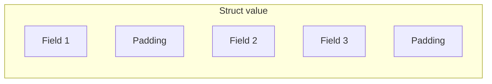
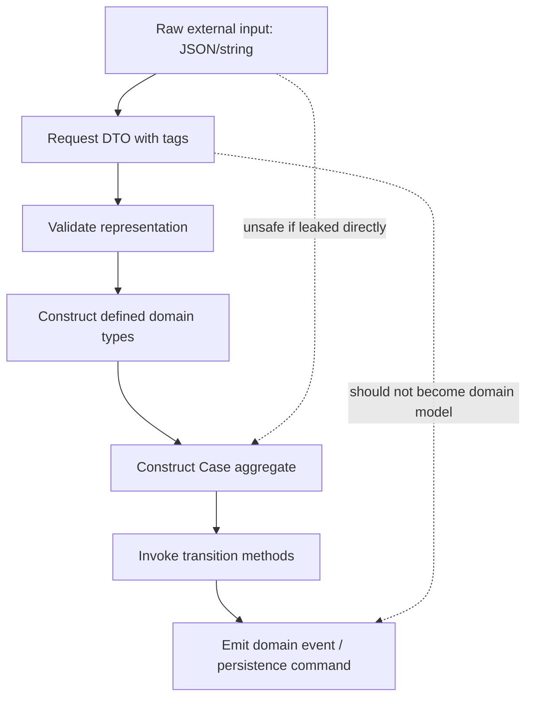
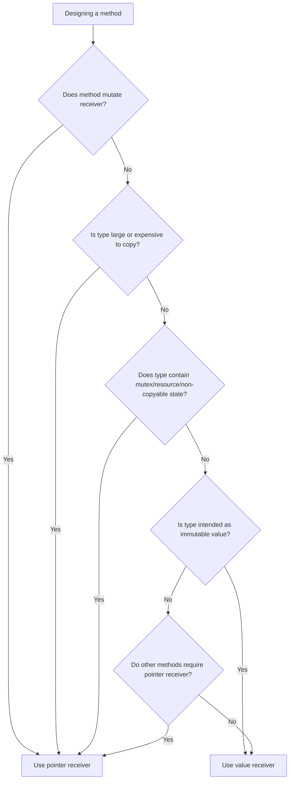

# learn-go-part-004.md

# Go Types: Primitive, Alias vs Defined Type, Structs, Tags, Methods, and Receiver Semantics

> Series: `learn-go`  
> Part: `004`  
> Target reader: Java software engineer moving toward production-grade Go engineering  
> Target Go version: Go 1.26.x  
> Previous part: `learn-go-part-003.md`  
> Next part: `learn-go-part-005.md`

---

## 0. What this part is really about

This part is not merely about “what types exist in Go”. That would be too shallow.

The real goal is to understand how Go uses types to shape API boundaries, memory behavior, mutability, domain correctness, and long-term maintainability without classes, inheritance, annotations, Lombok, framework magic, or runtime reflection-heavy object graphs.

In Java, types often live inside a class hierarchy and are frequently managed by frameworks. In Go, types are usually simpler, but their placement and definition are more consequential. A type declaration can become a domain invariant, a package boundary, a serialization contract, a performance decision, or an API compatibility commitment.

A top-level Go engineer does not ask only:

```text
What type should this variable be?
```

They ask:

```text
Is this a domain type or just a representation?
Should this be a new defined type or an alias?
Should callers be allowed to construct this directly?
Should this struct be copied or passed by pointer?
Should mutation be visible to the caller?
Should this method have a value receiver or pointer receiver?
Is this field part of the public API, persistence contract, JSON contract, or internal state?
Will adding/changing this field break users?
Will this type escape to heap because of how I use it?
```

That is the level we want.

---

## 1. Source map and factual baseline

This part is grounded primarily in the official Go specification and official Go documentation:

- Go Language Specification: <https://go.dev/ref/spec>
- Effective Go: <https://go.dev/doc/effective_go>
- Go FAQ: <https://go.dev/doc/faq>
- Go Doc Comments: <https://go.dev/doc/comment>
- Go 1.26 Release Notes: <https://go.dev/doc/go1.26>
- A Guide to the Go Garbage Collector: <https://go.dev/doc/gc-guide>

Key factual anchors:

1. Go is statically typed. Each variable has a static type known at compile time.
2. Go has predeclared types such as `bool`, numeric types, `string`, `error`, and aliases such as `byte` and `rune`.
3. A `type` declaration can create a new defined type or an alias.
4. Structs are composite types made of named fields.
5. Struct tags are string metadata attached to struct fields and are interpreted by packages through reflection.
6. Methods can be declared on defined types whose receiver base type is not a pointer or interface.
7. Go has no classes, constructors, inheritance, method overloading, or nominal interface implementation declarations.
8. Go 1.26 extends the built-in `new` function so it can accept an initial expression, for example `new(T(v))`, not only a type operand.

---

## 2. Java-to-Go mental model shift

### 2.1 Java view

In Java, you commonly model behavior and data like this:

```java
public final class CaseId {
    private final String value;

    public CaseId(String value) {
        if (value == null || value.isBlank()) {
            throw new IllegalArgumentException("case id is required");
        }
        this.value = value;
    }

    public String value() {
        return value;
    }
}
```

The class owns:

- representation,
- constructor validation,
- methods,
- encapsulation,
- identity/equality rules,
- sometimes annotations,
- sometimes framework integration.

### 2.2 Go view

In Go, the equivalent design space is split across simpler mechanisms:

```go
type CaseID string

func NewCaseID(s string) (CaseID, error) {
    if s == "" {
        return "", ErrEmptyCaseID
    }
    return CaseID(s), nil
}

func (id CaseID) String() string {
    return string(id)
}
```

There is no constructor enforcement built into the language. The compiler allows:

```go
id := CaseID("")
```

Therefore, invariant enforcement is a package/API design problem, not a language-level constructor guarantee.

This is one of the most important shifts from Java to Go.

```text
Java often enforces invariants through constructors and visibility.
Go often enforces invariants through package boundaries, unexported fields, factory functions, and disciplined API design.
```

---

## 3. Type system as design language

In Go, types are used for at least six different purposes:

| Purpose | Example | Design meaning |
|---|---|---|
| Representation | `int64`, `string`, `[]byte` | How data is stored and passed |
| Domain meaning | `type CaseID string` | Prevents mixing unrelated values |
| Capability | method set | What operations a value supports |
| API boundary | exported/unexported type | What callers are allowed to depend on |
| Serialization shape | struct fields/tags | JSON/XML/DB contract |
| Performance control | value vs pointer types | Copying, allocation, mutation, escape |

A beginner sees:

```go
type UserID string
```

A senior engineer sees:

```text
This creates a new defined type with a distinct identity from string.
It prevents accidental mixing with other string-like IDs.
It can have methods.
It may or may not enforce construction invariants depending on package design.
It may affect JSON serialization behavior if custom marshalers are added.
It becomes part of public API if exported.
```

---

## 4. Predeclared and primitive-like types

Go has predeclared identifiers for common types. They are not “primitive” in exactly the Java sense, but they serve similar low-level roles.

### 4.1 Boolean

```go
var active bool
```

The zero value is `false`.

Unlike Java, Go does not allow truthiness:

```go
if active {
    // ok
}

// invalid:
// if 1 { }
// if "x" { }
// if len(items) { }
```

This is intentionally explicit. It removes a whole class of bugs common in languages with implicit boolean conversion.

### 4.2 Integers

Go provides signed and unsigned integer types:

```go
int
int8
int16
int32
int64

uint
uint8
uint16
uint32
uint64
uintptr
```

Important mental model:

```text
int is machine-word-sized.
int32 and int64 are explicit-width.
Use int for counts, indexes, lengths, and in-memory computation.
Use explicit width for external protocols, persistence, binary formats, and cross-language contracts.
```

Examples:

```go
var count int          // local count/index
var version int64      // persisted version number
var flags uint32       // binary protocol flags
var shardID uint16     // constrained protocol field
```

For Java engineers:

```text
Java int is always 32-bit.
Java long is always 64-bit.
Go int is implementation-specific width, practically 32 or 64 depending on architecture.
```

For production services on modern 64-bit servers, `int` is typically 64-bit, but you should not use it for wire formats.

### 4.3 Floating point

```go
float32
float64
```

Use `float64` by default unless you have a concrete memory/interop reason for `float32`.

Never use floating point for money or regulatory amounts where exact decimal semantics matter.

Bad:

```go
type FineAmount float64
```

Better design:

```go
type Cents int64
```

or a decimal library when decimal arithmetic is required.

### 4.4 Complex numbers

```go
complex64
complex128
```

These exist as first-class numeric types but are rare in backend systems unless working in numerical/scientific domains.

### 4.5 Byte and rune

```go
type byte = uint8
type rune = int32
```

`byte` and `rune` are aliases, not separate defined types.

Mental model:

```text
byte = raw 8-bit data
rune = Unicode code point
string = immutable byte sequence, conventionally UTF-8 text
```

Example:

```go
s := "Go语言"

fmt.Println(len(s))        // bytes, not characters
fmt.Println(len([]rune(s))) // Unicode code points
```

This is critical when handling user-visible text, names, regulatory descriptions, or external data.

### 4.6 String

A Go `string` is immutable.

```go
s := "case-123"
```

You cannot modify its bytes in place:

```go
// invalid:
// s[0] = 'C'
```

Important distinction:

```text
len(s) returns byte length.
range over string yields byte index and rune value.
```

```go
s := "é"
fmt.Println(len(s))

for i, r := range s {
    fmt.Println(i, r)
}
```

A string is not “a Java String clone”. In Java, `String.length()` returns UTF-16 code units. In Go, `len(string)` returns bytes.

### 4.7 Error

`error` is a predeclared interface:

```go
type error interface {
    Error() string
}
```

Errors are values. Any type with an `Error() string` method satisfies `error`.

This is why defined types matter:

```go
type ValidationError struct {
    Field string
    Rule  string
}

func (e ValidationError) Error() string {
    return e.Field + ": " + e.Rule
}
```

Now `ValidationError` is both a structured domain value and an error.

---

## 5. Zero value as a design constraint

Every Go variable has a zero value.

| Type | Zero value |
|---|---|
| `bool` | `false` |
| numeric | `0` |
| `string` | `""` |
| pointer | `nil` |
| slice | `nil` |
| map | `nil` |
| channel | `nil` |
| function | `nil` |
| interface | `nil` |
| struct | zero value of each field |

Zero value is not just a language detail. It is a design force.

A good Go type often has a useful zero value:

```go
var b bytes.Buffer
b.WriteString("hello")
```

No constructor required.

A bad zero value forces users into hidden initialization traps:

```go
type Registry struct {
    items map[string]string
}

func (r *Registry) Add(k, v string) {
    r.items[k] = v // panic if items is nil
}
```

Better:

```go
type Registry struct {
    items map[string]string
}

func NewRegistry() *Registry {
    return &Registry{items: make(map[string]string)}
}

func (r *Registry) Add(k, v string) {
    if r.items == nil {
        r.items = make(map[string]string)
    }
    r.items[k] = v
}
```

Which one is better depends on the API contract. For internal types, constructor-only may be acceptable. For exported types, a useful zero value is often desirable.

### 5.1 Zero value decision table

| Type kind | Should zero value be useful? | Typical answer |
|---|---:|---|
| Small helper type | Yes | Make it usable without constructor |
| Config struct | Often yes | Zero means default behavior |
| Domain ID | Maybe no | Empty may mean invalid |
| Client with resources | Usually no | Use constructor to set dependencies |
| Mutex-containing type | Yes but avoid copying | Zero mutex is valid |
| Map-holding type | Be careful | Nil map reads ok, writes panic |
| Slice-holding type | Usually yes | Nil slice behaves like empty for many ops |

---

## 6. Defined type vs alias

This is one of the most important areas for Java engineers.

Go has two related but different declarations:

```go
type CaseID string   // defined type

type UserID = string // alias
```

They look similar. They are not.

---

## 7. Defined types

A defined type creates a new distinct type.

```go
type CaseID string
type UserID string

func LoadCase(id CaseID) {}

func example() {
    var c CaseID = "CASE-1"
    var u UserID = "USER-1"

    LoadCase(c) // ok
    // LoadCase(u) // compile error
}
```

This is a powerful tool for domain safety.

### 7.1 Domain type examples

```go
type CaseID string
type OfficerID string
type AgencyCode string
type SubmissionID string

type Version int64
type Revision int64

type Cents int64
type PercentageBasisPoints int32
```

These types may share the same underlying representation, but they are not the same type.

This prevents bugs like:

```go
AssignCase(officerID, caseID) // parameter order bug
```

When the signatures use distinct types:

```go
func AssignCase(caseID CaseID, officerID OfficerID) error
```

The compiler helps.

### 7.2 Defined type with methods

```go
type CaseStatus string

const (
    CaseStatusDraft     CaseStatus = "draft"
    CaseStatusSubmitted CaseStatus = "submitted"
    CaseStatusApproved  CaseStatus = "approved"
    CaseStatusRejected  CaseStatus = "rejected"
)

func (s CaseStatus) IsTerminal() bool {
    switch s {
    case CaseStatusApproved, CaseStatusRejected:
        return true
    default:
        return false
    }
}
```

This is the Go alternative to many small Java enum/helper-class patterns.

### 7.3 Defined type does not automatically inherit methods

If you define:

```go
type MyString string
```

`MyString` has the same underlying representation as `string`, but it does not automatically get methods from another defined type. Predeclared types like `string` do not have methods, but this matters when defining a new type from an existing defined type.

```go
type Base struct{}

func (Base) Hello() {}

type Derived Base

func example() {
    var d Derived
    // d.Hello() // invalid: Derived does not inherit Base methods
}
```

Go composition is explicit. There is no inheritance.

---

## 8. Type aliases

A type alias does not create a new type.

```go
type CaseID = string
```

This means `CaseID` is just another spelling for `string`.

```go
func LoadCase(id CaseID) {}

func example() {
    var s string = "CASE-1"
    LoadCase(s) // ok because CaseID is alias of string
}
```

Aliases are usually for:

1. gradual package migration,
2. API compatibility,
3. renaming without breaking callers,
4. bridging old and new package paths.

They are usually not appropriate for domain modelling.

### 8.1 Alias migration example

Suppose old package:

```go
package oldcase

type CaseID string
```

New package:

```go
package caseid

type ID string
```

Compatibility bridge:

```go
package oldcase

import "example.com/project/caseid"

type CaseID = caseid.ID
```

This lets callers gradually move while preserving type identity.

### 8.2 Decision table

| Need | Use defined type? | Use alias? |
|---|---:|---:|
| Domain safety | Yes | No |
| Add methods | Yes | Usually no |
| Prevent mixing values | Yes | No |
| Preserve compatibility during migration | Maybe | Yes |
| Rename a type without breaking users | No | Yes |
| Model wire-level primitive | Maybe | Maybe |

Rule of thumb:

```text
Use defined types for domain meaning.
Use aliases for compatibility and migration.
```

---

## 9. Structs

A struct is a sequence of named fields.

```go
type Case struct {
    ID        CaseID
    Status    CaseStatus
    CreatedBy OfficerID
}
```

A struct is not a class. It has fields. Methods are declared separately.

```go
func (c Case) IsClosed() bool {
    return c.Status.IsTerminal()
}
```

---

## 10. Struct literals

You can construct structs using keyed or positional literals.

### 10.1 Keyed literal

```go
c := Case{
    ID:        "CASE-1",
    Status:    CaseStatusSubmitted,
    CreatedBy: "OFFICER-9",
}
```

Keyed literals are preferred for most structs, especially public or evolving structs.

### 10.2 Positional literal

```go
c := Case{"CASE-1", CaseStatusSubmitted, "OFFICER-9"}
```

This is fragile. Adding/reordering fields breaks meaning.

Use positional literals only for very small internal structs where field order is obvious and stable.

---

## 11. Exported vs unexported fields

In Go, visibility is controlled by capitalization.

```go
type Case struct {
    ID     CaseID // exported
    status CaseStatus // unexported
}
```

Exported fields are accessible from other packages. Unexported fields are not.

This matters for invariants.

Bad if external packages can create invalid state:

```go
type Case struct {
    ID     CaseID
    Status CaseStatus
}
```

Any caller can do:

```go
c := casepkg.Case{
    ID:     "",
    Status: "nonsense",
}
```

Invariant-protecting design:

```go
type Case struct {
    id     CaseID
    status CaseStatus
}

func NewCase(id CaseID) (Case, error) {
    if id == "" {
        return Case{}, ErrInvalidCaseID
    }
    return Case{id: id, status: CaseStatusDraft}, nil
}

func (c Case) ID() CaseID {
    return c.id
}

func (c Case) Status() CaseStatus {
    return c.status
}
```

Trade-off:

| Design | Benefit | Cost |
|---|---|---|
| Exported fields | Simple, convenient, JSON-friendly | Weak invariants |
| Unexported fields + constructor | Stronger invariants | More boilerplate |
| Mixed design | Balanced | Requires discipline |

---

## 12. Struct tags

Struct tags are string metadata attached to fields.

```go
type CaseDTO struct {
    ID        string `json:"id"`
    Status    string `json:"status"`
    CreatedAt string `json:"createdAt"`
}
```

Tags are not magic syntax. They are string literals interpreted by packages such as `encoding/json`, `encoding/xml`, validators, ORMs, or custom reflection code.

### 12.1 Tags are part of boundary design

A struct like this is not only a Go type:

```go
type CreateCaseRequest struct {
    ApplicantID string `json:"applicantId"`
    Category    string `json:"category"`
    Description string `json:"description"`
}
```

It is also a JSON contract.

Changing `json:"applicantId"` to `json:"applicant_id"` may break clients.

### 12.2 DTO vs domain struct

Avoid making one struct serve every layer.

Bad:

```go
type Case struct {
    ID          string `json:"id" db:"case_id" validate:"required"`
    Status      string `json:"status" db:"status" validate:"oneof=draft submitted approved rejected"`
    CreatedBy   string `json:"createdBy" db:"created_by"`
    InternalRev int64  `json:"internalRev" db:"internal_rev"`
}
```

This mixes:

- domain model,
- JSON API contract,
- database mapping,
- validation rules,
- internal concurrency/versioning concerns.

Better separation:

```go
type CreateCaseRequest struct {
    ApplicantID string `json:"applicantId"`
    Category    string `json:"category"`
    Description string `json:"description"`
}

type CaseRecord struct {
    ID        string
    Status    string
    CreatedBy string
    Version   int64
}

type Case struct {
    id      CaseID
    status  CaseStatus
    version Version
}
```

This looks more verbose, but it gives each layer its own evolution path.

### 12.3 Tag syntax discipline

Struct tags are conventionally space-separated key-value pairs:

```go
Field string `json:"field" xml:"field" validate:"required"`
```

Because tags are strings, invalid tag content may compile but fail at runtime or silently behave incorrectly.

Use `go vet` and tests to catch malformed tags.

---

## 13. Anonymous fields and embedding preview

A struct field can be declared without an explicit field name. This is often called embedding.

```go
type AuditInfo struct {
    CreatedBy OfficerID
    UpdatedBy OfficerID
}

type Case struct {
    CaseID
    AuditInfo
    Status CaseStatus
}
```

This promotes fields and methods into the outer type’s selector namespace.

```go
c := Case{}
c.CreatedBy = "OFFICER-1" // promoted from AuditInfo
```

Embedding is powerful, but it is not inheritance. We will go much deeper in part 005.

For now, remember:

```text
Embedding is composition with promotion, not subtype inheritance.
```

---

## 14. Methods

A method is a function with a receiver.

```go
type CaseStatus string

func (s CaseStatus) IsTerminal() bool {
    return s == CaseStatusApproved || s == CaseStatusRejected
}
```

The receiver appears before the method name.

```go
func (receiver ReceiverType) MethodName(args) returns
```

Methods are not declared inside the type. This decouples data declaration from behavior declaration.

### 14.1 Method namespace

Methods belong to the receiver type’s method set. You cannot overload methods by parameter list.

Invalid:

```go
type Case struct{}

func (c Case) Close() error { return nil }

// invalid: duplicate method name
// func (c Case) Close(reason string) error { return nil }
```

This is different from Java. Go intentionally avoids method overloading.

Use distinct names:

```go
func (c *Case) Close() error
func (c *Case) CloseWithReason(reason string) error
```

or options:

```go
type CloseOptions struct {
    Reason string
}

func (c *Case) Close(opts CloseOptions) error
```

---

## 15. Value receiver vs pointer receiver

This is one of the most important practical topics in Go.

```go
func (c Case) Status() CaseStatus       // value receiver
func (c *Case) Approve(by OfficerID) error // pointer receiver
```

### 15.1 Value receiver

A value receiver receives a copy of the value.

```go
type Counter struct {
    n int
}

func (c Counter) Inc() {
    c.n++
}

func example() {
    c := Counter{}
    c.Inc()
    fmt.Println(c.n) // 0
}
```

The method modified the copy, not the original.

Use value receivers when:

- the type is small,
- the method does not mutate receiver state,
- copying is semantically safe,
- the type behaves like a value,
- immutable/domain value semantics are desired.

Examples:

```go
type CaseID string

func (id CaseID) String() string {
    return string(id)
}
```

```go
type Point struct {
    X, Y int
}

func (p Point) DistanceFromOrigin() float64 {
    return math.Sqrt(float64(p.X*p.X + p.Y*p.Y))
}
```

### 15.2 Pointer receiver

A pointer receiver receives a pointer to the original value.

```go
type Counter struct {
    n int
}

func (c *Counter) Inc() {
    c.n++
}
```

Use pointer receivers when:

- the method mutates receiver state,
- copying would be expensive,
- the type contains a mutex or other non-copyable state,
- identity matters,
- nil receiver behavior is intentionally supported,
- consistency with other pointer receiver methods is needed.

Example:

```go
type Case struct {
    status CaseStatus
}

func (c *Case) Approve() error {
    if c.status != CaseStatusSubmitted {
        return ErrInvalidTransition
    }
    c.status = CaseStatusApproved
    return nil
}
```

### 15.3 Receiver consistency rule

If some methods require pointer receivers, most methods on the same type should usually use pointer receivers for consistency, especially on mutable domain objects.

Bad mixed design:

```go
type Case struct {
    status CaseStatus
}

func (c Case) Status() CaseStatus { return c.status }
func (c *Case) Approve() error    { c.status = CaseStatusApproved; return nil }
func (c Case) Reset()             { c.status = CaseStatusDraft } // bug: value receiver
```

Better:

```go
func (c *Case) Status() CaseStatus { return c.status }
func (c *Case) Approve() error     { c.status = CaseStatusApproved; return nil }
func (c *Case) Reset()             { c.status = CaseStatusDraft }
```

For immutable value types, use value receivers consistently.

---

## 16. Method sets and interface implications

Receiver choice affects interface satisfaction.

```go
type Validator interface {
    Validate() error
}

type Request struct{}

func (r *Request) Validate() error {
    return nil
}
```

Then:

```go
var _ Validator = (*Request)(nil) // ok
// var _ Validator = Request{}    // not ok
```

Because `Validate` belongs to the method set of `*Request`, not `Request`.

This matters when designing APIs.

### 16.1 Why this can surprise Java engineers

In Java:

```java
class Request implements Validator {
    public void validate() {}
}
```

There is one object reference model. Method calls are reference-based.

In Go, values and pointers are distinct types, even though the compiler provides automatic address-taking/dereferencing for many method calls.

This call works:

```go
var r Request
r.Validate() // compiler can take &r if addressable
```

But interface assignment is stricter:

```go
var v Validator
// v = r  // invalid
v = &r   // ok
```

This is not arbitrary. It preserves type safety around method sets.

---

## 17. Pointer semantics are not Java reference semantics

Java object variables hold references. Go variables may hold values or pointers.

```go
type Case struct {
    ID CaseID
}

func mutateValue(c Case) {
    c.ID = "changed"
}

func mutatePointer(c *Case) {
    c.ID = "changed"
}
```

```go
c := Case{ID: "original"}
mutateValue(c)
fmt.Println(c.ID) // original

mutatePointer(&c)
fmt.Println(c.ID) // changed
```

This distinction is central to Go.

```text
In Java, passing an object variable copies a reference.
In Go, passing a struct value copies the struct.
In Go, passing a pointer copies the pointer.
```

---

## 18. Copying structs: power and danger

Struct values can be copied by assignment.

```go
c1 := Case{ID: "CASE-1"}
c2 := c1
```

If the struct contains only value fields, this is straightforward.

If it contains reference-like fields, copies share internal data.

```go
type Batch struct {
    IDs []CaseID
}

b1 := Batch{IDs: []CaseID{"CASE-1"}}
b2 := b1

b2.IDs[0] = "CASE-2"
fmt.Println(b1.IDs[0]) // CASE-2
```

The slice header was copied, but both headers point to the same backing array.

### 18.1 Reference-like fields

Be careful copying structs containing:

- slices,
- maps,
- channels,
- function values,
- pointers,
- interfaces holding pointer-like values,
- mutexes,
- pools,
- file handles,
- network connections,
- database handles.

### 18.2 Non-copyable-by-convention types

Go does not have a general `noncopyable` keyword. Many types are non-copyable by convention after first use, especially types containing synchronization primitives.

Example:

```go
type Cache struct {
    mu    sync.Mutex
    items map[string]string
}
```

Do not copy `Cache` after use.

Bad:

```go
func (c Cache) Set(k, v string) {
    c.mu.Lock()
    defer c.mu.Unlock()
    c.items[k] = v
}
```

This copies the mutex.

Better:

```go
func (c *Cache) Set(k, v string) {
    c.mu.Lock()
    defer c.mu.Unlock()
    c.items[k] = v
}
```

---

## 19. Struct layout and memory intuition

Go structs have field layout determined by field order, alignment, and padding.

Example:

```go
type A struct {
    Active bool
    Count  int64
    Code   int16
}
```

This may use more memory than expected due to padding.

Often better:

```go
type B struct {
    Count  int64
    Code   int16
    Active bool
}
```

Field order can matter in high-volume data structures.

Do not prematurely micro-optimize every struct. But in hot paths, large slices, caches, indexing structures, and telemetry buffers, layout matters.

### 19.1 Memory layout mental diagram



### 19.2 When layout matters

| Scenario | Layout importance |
|---|---:|
| Small request DTO | Low |
| Internal domain object | Medium |
| Millions of cached entries | High |
| Network protocol binary struct | Very high, but use explicit encoding |
| Lock-protected service object | Usually low |
| Hot-path metrics/event struct | High |

For wire formats, do not rely on in-memory struct layout unless you are deliberately using low-level unsafe/binary techniques and fully understand portability implications.

---

## 20. Constructors in Go are functions, not language features

Go does not have constructors. The convention is to use functions named `NewX`.

```go
type Client struct {
    baseURL string
    timeout time.Duration
}

func NewClient(baseURL string, timeout time.Duration) (*Client, error) {
    if baseURL == "" {
        return nil, errors.New("baseURL is required")
    }
    if timeout <= 0 {
        timeout = 10 * time.Second
    }
    return &Client{baseURL: baseURL, timeout: timeout}, nil
}
```

### 20.1 Constructor decision table

| Type | Constructor needed? | Why |
|---|---:|---|
| `type CaseID string` | Maybe | Validation may be needed |
| DTO struct | Usually no | Caller can populate fields |
| Config struct | Usually no | Zero/default can be meaningful |
| Service client | Yes | Needs dependencies/resources |
| Object with map field | Often yes | Map must be initialized for writes |
| Object with goroutine | Yes | Needs lifecycle control |
| Object with file/socket | Yes | Resource acquisition/failure |

### 20.2 Constructor return value or pointer?

Return value when the type is small/value-like:

```go
func NewCaseID(s string) (CaseID, error)
```

Return pointer when the type is large, mutable, resource-owning, or identity-bearing:

```go
func NewClient(cfg Config) (*Client, error)
```

---

## 21. Go 1.26: `new` with initial expression

Historically, `new(T)` allocated a zero value of type `T` and returned `*T`.

```go
p := new(int)
```

In Go 1.26, the built-in `new` can also take an expression that specifies the initial value.

```go
p := new(int64(42))
```

This returns a pointer to a new variable initialized with that expression.

### 21.1 Use carefully

This is convenient for pointer fields or tests:

```go
func ptr[T any](v T) *T {
    return &v
}
```

With Go 1.26, many simple cases can use `new(expr)` directly.

But do not let this obscure ownership or lifetime.

Clear:

```go
limit := int64(100)
cfg.Limit = &limit
```

Concise:

```go
cfg.Limit = new(int64(100))
```

Both may be valid. Prefer clarity when teaching, reviewing, or working in codebases with mixed Go experience.

---

## 22. Domain modelling example: regulatory case lifecycle

Let us model a small regulatory case state machine.

### 22.1 Naive design

```go
type Case struct {
    ID     string
    Status string
}

func (c *Case) Approve() {
    c.Status = "approved"
}
```

Problems:

- `ID` can be empty.
- `Status` can be arbitrary.
- invalid transitions are allowed.
- no error contract.
- caller can mutate fields directly.
- no audit context.

### 22.2 Stronger type design

```go
package caseflow

import (
    "errors"
    "fmt"
    "strings"
)

type CaseID string

type OfficerID string

type CaseStatus string

const (
    CaseStatusDraft     CaseStatus = "draft"
    CaseStatusSubmitted CaseStatus = "submitted"
    CaseStatusApproved  CaseStatus = "approved"
    CaseStatusRejected  CaseStatus = "rejected"
)

var (
    ErrEmptyCaseID      = errors.New("empty case id")
    ErrEmptyOfficerID   = errors.New("empty officer id")
    ErrInvalidStatus    = errors.New("invalid status")
    ErrInvalidTransition = errors.New("invalid transition")
)

func NewCaseID(s string) (CaseID, error) {
    s = strings.TrimSpace(s)
    if s == "" {
        return "", ErrEmptyCaseID
    }
    return CaseID(s), nil
}

func NewOfficerID(s string) (OfficerID, error) {
    s = strings.TrimSpace(s)
    if s == "" {
        return "", ErrEmptyOfficerID
    }
    return OfficerID(s), nil
}

func (s CaseStatus) Valid() bool {
    switch s {
    case CaseStatusDraft, CaseStatusSubmitted, CaseStatusApproved, CaseStatusRejected:
        return true
    default:
        return false
    }
}

func (s CaseStatus) IsTerminal() bool {
    switch s {
    case CaseStatusApproved, CaseStatusRejected:
        return true
    default:
        return false
    }
}

type Case struct {
    id        CaseID
    status    CaseStatus
    createdBy OfficerID
    approvedBy OfficerID
}

func NewCase(id CaseID, createdBy OfficerID) (Case, error) {
    if id == "" {
        return Case{}, ErrEmptyCaseID
    }
    if createdBy == "" {
        return Case{}, ErrEmptyOfficerID
    }
    return Case{
        id:        id,
        status:    CaseStatusDraft,
        createdBy: createdBy,
    }, nil
}

func (c *Case) ID() CaseID {
    return c.id
}

func (c *Case) Status() CaseStatus {
    return c.status
}

func (c *Case) Submit() error {
    if c.status != CaseStatusDraft {
        return fmt.Errorf("%w: cannot submit from %s", ErrInvalidTransition, c.status)
    }
    c.status = CaseStatusSubmitted
    return nil
}

func (c *Case) Approve(by OfficerID) error {
    if by == "" {
        return ErrEmptyOfficerID
    }
    if c.status != CaseStatusSubmitted {
        return fmt.Errorf("%w: cannot approve from %s", ErrInvalidTransition, c.status)
    }
    c.status = CaseStatusApproved
    c.approvedBy = by
    return nil
}
```

### 22.3 What this design buys us

| Design element | Benefit |
|---|---|
| `CaseID` defined type | Prevents mixing with random string-like values |
| `OfficerID` defined type | Prevents wrong ID type usage |
| `CaseStatus` constants | Limits known statuses at code level |
| Unexported fields | Prevents direct external mutation |
| Constructor | Establishes initial invariant |
| Pointer receiver transition methods | Mutates case intentionally |
| Error wrapping | Allows caller to classify invalid transition |
| Status helper methods | Keeps status logic near status type |

---

## 23. Mermaid: type-driven lifecycle boundary



The key point:

```text
External representation should be converted into domain types before core logic.
```

---

## 24. DTO, command, entity, and domain value separation

A common Go design mistake is to use one struct for everything.

### 24.1 Bad all-in-one struct

```go
type Case struct {
    ID          string `json:"id" db:"case_id"`
    ApplicantID string `json:"applicantId" db:"applicant_id"`
    Status      string `json:"status" db:"status"`
    Version     int64  `json:"version" db:"version"`
}
```

This looks efficient but creates coupling.

Problem:

```text
A database field rename may break JSON.
A JSON backward-compatibility decision may leak into domain.
A domain invariant may be bypassed by direct struct construction.
A persistence-only version field may be exposed accidentally.
```

### 24.2 Better layered types

```go
type CreateCaseRequest struct {
    ApplicantID string `json:"applicantId"`
    Category    string `json:"category"`
}

type CreateCaseCommand struct {
    ApplicantID ApplicantID
    Category    Category
    RequestedBy OfficerID
}

type CaseRecord struct {
    ID          string
    ApplicantID string
    Category    string
    Status      string
    Version     int64
}

type Case struct {
    id          CaseID
    applicantID ApplicantID
    category    Category
    status      CaseStatus
    version     Version
}
```

Mapping code is not waste. It is where trust boundaries become explicit.

---

## 25. Type design and API compatibility

Exported types are API.

```go
type ClientConfig struct {
    BaseURL string
    Timeout time.Duration
}
```

If this is exported from a module used by other teams, every field is now a public contract.

### 25.1 Adding fields

Adding a field to an exported struct can be source-compatible for keyed literals:

```go
cfg := ClientConfig{BaseURL: "https://example.com"}
```

But can break positional literals:

```go
cfg := ClientConfig{"https://example.com", 5 * time.Second}
```

This is why exported structs should strongly prefer keyed construction in examples and docs.

### 25.2 Removing or renaming fields

Removing or renaming exported fields is breaking.

### 25.3 Changing field type

Changing field type is breaking.

```go
Timeout time.Duration
```

to:

```go
TimeoutSeconds int
```

breaks callers and likely worsens API semantics.

### 25.4 Unexported concrete type behind exported constructor

For stronger compatibility control:

```go
type Client struct {
    baseURL string
    timeout time.Duration
}

func NewClient(cfg Config) *Client {
    return &Client{baseURL: cfg.BaseURL, timeout: cfg.Timeout}
}
```

Callers can use behavior, not internal fields.

---

## 26. Type design and JSON behavior

The `encoding/json` package uses exported fields by default.

```go
type Response struct {
    ID string `json:"id"`
}
```

Unexported fields are not marshaled:

```go
type Response struct {
    id string `json:"id"`
}
```

This produces `{}` unless custom marshaling is implemented.

### 26.1 Domain type JSON behavior

A defined type with underlying `string` often marshals as a string:

```go
type CaseID string

type Response struct {
    ID CaseID `json:"id"`
}
```

Output:

```json
{"id":"CASE-1"}
```

But once you add custom marshal/unmarshal behavior, you own that contract.

### 26.2 Pointer fields and optionality

```go
type PatchCaseRequest struct {
    Description *string `json:"description,omitempty"`
}
```

Pointer means the API can distinguish:

```text
field absent     => nil
field present "" => pointer to empty string
```

This is important for PATCH semantics.

With Go 1.26, `new("value")` style initial pointers can be convenient in tests/examples, but use carefully for readability.

---

## 27. Nil and type design

Nil is valid for several kinds:

- pointer,
- slice,
- map,
- channel,
- function,
- interface.

It is not valid for concrete values like `int`, `string`, or struct values.

### 27.1 Nil pointer receiver

Methods can be called on nil pointers if the method handles it.

```go
type Node struct {
    Value string
}

func (n *Node) IsNil() bool {
    return n == nil
}
```

```go
var n *Node
fmt.Println(n.IsNil()) // true
```

But this will panic:

```go
func (n *Node) ValueText() string {
    return n.Value
}
```

Nil receiver support should be intentional and documented.

### 27.2 Nil map reads vs writes

```go
var m map[string]int
fmt.Println(m["x"]) // 0
m["x"] = 1          // panic
```

This affects struct zero value design.

### 27.3 Nil slice behavior

```go
var s []int
fmt.Println(len(s)) // 0
s = append(s, 1)    // ok
```

Nil slices are often acceptable as empty slices.

---

## 28. Comparability

Some Go types can be compared with `==`; others cannot.

Comparable:

- booleans,
- numbers,
- strings,
- pointers,
- channels,
- interfaces if dynamic value is comparable,
- arrays whose element type is comparable,
- structs whose fields are all comparable.

Not comparable:

- slices,
- maps,
- functions.

Example:

```go
type CaseKey struct {
    Agency AgencyCode
    ID     CaseID
}

m := map[CaseKey]Case{}
```

This works if all fields are comparable.

But:

```go
type BadKey struct {
    Parts []string
}

// map[BadKey]string // invalid
```

Design implication:

```text
Small comparable structs are excellent map keys.
Do not put slices/maps/functions in key types.
```

---

## 29. Type assertion and conversion preview

Type conversion changes a value from one type to another when allowed.

```go
id := CaseID("CASE-1")
s := string(id)
```

Type assertion extracts a concrete value from an interface.

```go
var err error = ValidationError{Field: "id", Rule: "required"}

ve, ok := err.(ValidationError)
```

We will cover interfaces deeply in part 006. For now, keep the distinction clear:

```text
conversion: between types
assertion: from interface dynamic value
```

---

## 30. Anti-patterns

### 30.1 Stringly typed domain

Bad:

```go
func ApproveCase(caseID string, officerID string) error
```

Better:

```go
func ApproveCase(caseID CaseID, officerID OfficerID) error
```

### 30.2 Alias used as domain type

Bad:

```go
type CaseID = string
```

Better:

```go
type CaseID string
```

### 30.3 Exporting mutable fields without thinking

Bad:

```go
type Case struct {
    Status CaseStatus
}
```

If all status changes must be validated, this is unsafe.

Better:

```go
type Case struct {
    status CaseStatus
}

func (c *Case) Approve() error
```

### 30.4 Pointer receiver everywhere without reason

Not every method needs a pointer receiver.

Bad:

```go
type CaseID string

func (id *CaseID) String() string {
    return string(*id)
}
```

Better:

```go
func (id CaseID) String() string {
    return string(id)
}
```

### 30.5 Value receiver on mutable or lock-containing type

Bad:

```go
type Counter struct {
    mu sync.Mutex
    n  int
}

func (c Counter) Inc() {
    c.mu.Lock()
    defer c.mu.Unlock()
    c.n++
}
```

Better:

```go
func (c *Counter) Inc() {
    c.mu.Lock()
    defer c.mu.Unlock()
    c.n++
}
```

### 30.6 One struct for API, DB, domain, and internal state

Bad:

```go
type User struct {
    ID       string `json:"id" db:"id" validate:"required"`
    Password string `json:"password" db:"password_hash"`
    IsAdmin  bool   `json:"isAdmin" db:"is_admin"`
}
```

This risks exposing sensitive fields and coupling contracts.

Better:

```go
type CreateUserRequest struct { /* external */ }
type UserRecord struct { /* persistence */ }
type User struct { /* domain */ }
type UserResponse struct { /* output */ }
```

---

## 31. Production design checklist

When defining a Go type, ask:

```text
1. Is this type just a representation or does it encode domain meaning?
2. Should this be a defined type instead of a primitive?
3. Is an alias being used only for compatibility/migration?
4. Is the zero value valid, useful, invalid, or dangerous?
5. Should construction be direct or via NewX/ParseX?
6. Should fields be exported?
7. Is this struct part of JSON/DB/public API contract?
8. Will callers need keyed literals?
9. Could this type be copied safely?
10. Does it contain slice/map/pointer/mutex/interface fields?
11. Should methods use value or pointer receivers?
12. Does receiver choice affect interface satisfaction?
13. Does the type need custom String, MarshalJSON, UnmarshalJSON, or validation methods?
14. Is mutation visible and intentional?
15. Are invariants protected by package boundaries?
```

---

## 32. Design heuristic: value object vs entity/service

| Characteristic | Value object style | Entity/service style |
|---|---|---|
| Example | `CaseID`, `Money`, `Period` | `Case`, `Client`, `Repository` |
| Mutability | Immutable/prefer copy | Mutable/resource-owning |
| Receiver | Usually value | Usually pointer |
| Constructor | Parse/New optional | Usually required |
| Equality | Often comparable | Usually identity/state-based |
| Copying | Usually safe | Often unsafe |
| Fields | Often unexported for invariants | Usually unexported for state |

Example value object:

```go
type Period struct {
    start time.Time
    end   time.Time
}

func NewPeriod(start, end time.Time) (Period, error) {
    if end.Before(start) {
        return Period{}, errors.New("end before start")
    }
    return Period{start: start, end: end}, nil
}

func (p Period) Contains(t time.Time) bool {
    return !t.Before(p.start) && t.Before(p.end)
}
```

Example entity-like object:

```go
type Case struct {
    id     CaseID
    status CaseStatus
}

func (c *Case) Approve() error {
    if c.status != CaseStatusSubmitted {
        return ErrInvalidTransition
    }
    c.status = CaseStatusApproved
    return nil
}
```

---

## 33. Mermaid: receiver decision tree



---

## 34. Hands-on lab 1: define strong IDs

Create a package `identity`:

```go
package identity

import (
    "errors"
    "strings"
)

type CaseID string
type OfficerID string

var ErrEmptyID = errors.New("empty id")

func NewCaseID(s string) (CaseID, error) {
    s = strings.TrimSpace(s)
    if s == "" {
        return "", ErrEmptyID
    }
    return CaseID(s), nil
}

func NewOfficerID(s string) (OfficerID, error) {
    s = strings.TrimSpace(s)
    if s == "" {
        return "", ErrEmptyID
    }
    return OfficerID(s), nil
}
```

Then prove this fails:

```go
func LoadCase(id identity.CaseID) {}

func example(officerID identity.OfficerID) {
    // LoadCase(officerID)
}
```

Expected learning:

```text
The compiler prevents mixing domain IDs even when underlying representation is string.
```

---

## 35. Hands-on lab 2: receiver semantics

Write this:

```go
type Counter struct {
    n int
}

func (c Counter) IncValue() {
    c.n++
}

func (c *Counter) IncPointer() {
    c.n++
}
```

Then test:

```go
func TestCounter(t *testing.T) {
    c := Counter{}
    c.IncValue()
    if c.n != 0 {
        t.Fatalf("expected value receiver not to mutate original")
    }

    c.IncPointer()
    if c.n != 1 {
        t.Fatalf("expected pointer receiver to mutate original")
    }
}
```

Expected learning:

```text
Value receiver copies. Pointer receiver mutates original.
```

---

## 36. Hands-on lab 3: DTO to domain mapping

Define external request:

```go
type CreateCaseRequest struct {
    ApplicantID string `json:"applicantId"`
    Category    string `json:"category"`
}
```

Define domain command:

```go
type ApplicantID string
type Category string

type CreateCaseCommand struct {
    ApplicantID ApplicantID
    Category    Category
    RequestedBy OfficerID
}
```

Write mapper:

```go
func ToCreateCaseCommand(req CreateCaseRequest, requestedBy OfficerID) (CreateCaseCommand, error) {
    applicantID, err := NewApplicantID(req.ApplicantID)
    if err != nil {
        return CreateCaseCommand{}, err
    }

    category, err := NewCategory(req.Category)
    if err != nil {
        return CreateCaseCommand{}, err
    }

    return CreateCaseCommand{
        ApplicantID: applicantID,
        Category:    category,
        RequestedBy: requestedBy,
    }, nil
}
```

Expected learning:

```text
Mapping is the place where untrusted external representation becomes trusted domain data.
```

---

## 37. Code review rubric

When reviewing a PR that introduces new Go types, look for:

### 37.1 Type identity

- Are domain IDs plain strings when they should be defined types?
- Are aliases used incorrectly for domain safety?
- Are constants typed correctly?

### 37.2 Invariants

- Can callers construct invalid state directly?
- Are fields exported unnecessarily?
- Is validation centralized at trust boundaries?

### 37.3 Receiver semantics

- Are mutating methods pointer receivers?
- Are value receivers copying large structs?
- Does the type contain a mutex or reference-like fields?
- Is receiver choice consistent?

### 37.4 API compatibility

- Are exported structs likely to evolve?
- Are examples using keyed literals?
- Are struct tags part of an external contract?

### 37.5 Serialization

- Are DTOs separated from domain objects?
- Are sensitive/internal fields accidentally exported?
- Are optional fields represented correctly?

---

## 38. Common interview-level traps

### Trap 1: `type X = string` vs `type X string`

```go
type A string
type B = string
```

`A` is a new defined type. `B` is an alias for string.

### Trap 2: value receiver mutation

```go
func (c Counter) Inc() { c.n++ }
```

Does not mutate original.

### Trap 3: pointer receiver and interface

```go
func (r *Request) Validate() error
```

`*Request` satisfies the interface, not `Request`.

### Trap 4: nil map write

```go
var m map[string]int
m["x"] = 1 // panic
```

### Trap 5: copying slice-containing struct

```go
type X struct { Items []int }
```

Copying `X` copies the slice header, not the backing array.

---

## 39. What to internalize before moving on

You are ready for the next part if you can explain:

1. why `type CaseID string` is different from `type CaseID = string`,
2. why Go does not need classes to attach behavior to data,
3. why exported fields are public API,
4. why struct tags are boundary contracts, not harmless comments,
5. why value receiver vs pointer receiver affects mutation and interfaces,
6. why copying structs can be safe or dangerous depending on fields,
7. why zero value should be considered during API design,
8. why DTO/domain/entity separation is not overengineering in serious systems.

---

## 40. Summary invariants

```text
A defined type creates a new type identity.
An alias creates another spelling for the same type.
Structs model data shape; methods attach behavior.
Exported fields are public API.
Struct tags are runtime-interpreted metadata and often external contracts.
Value receivers copy.
Pointer receivers mutate or avoid copying.
Receiver choice affects interface satisfaction.
Zero value is part of API design.
Go has no constructors; factory functions and package boundaries enforce invariants.
Do not use one struct for every layer unless coupling is intentional.
```

---

## 41. Connection to next part

The next part, `learn-go-part-005.md`, will go deeper into:

```text
Composition over inheritance:
embedding, method promotion, object modelling without class hierarchy,
and how to design Go systems without trying to recreate Java inheritance.
```

This part introduced embedding only briefly. The next part will treat it as a first-class design topic.

---

## 42. References

- Go Language Specification — <https://go.dev/ref/spec>
- Effective Go — <https://go.dev/doc/effective_go>
- Go FAQ — <https://go.dev/doc/faq>
- Go Doc Comments — <https://go.dev/doc/comment>
- Go 1.26 Release Notes — <https://go.dev/doc/go1.26>
- A Guide to the Go Garbage Collector — <https://go.dev/doc/gc-guide>

<!-- NAVIGATION_FOOTER -->
<div class="page-nav">
<a href="./learn-go-part-003.md">⬅️ Go Functions: Multiple Return, Named Return, Variadic, Closures, `defer`, `panic`/`recover`, dan Lifecycle Cleanup</a>
<a href="./index.md">📚 Kategori</a>
<a href="../../index.md">🏠 Home</a>
<a href="./learn-go-part-005.md">Go Composition over Inheritance: Embedding, Method Promotion, dan Object Modelling tanpa Class Hierarchy ➡️</a>
</div>
