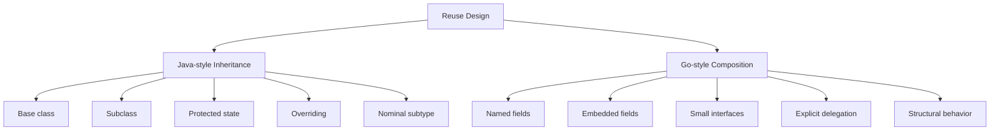
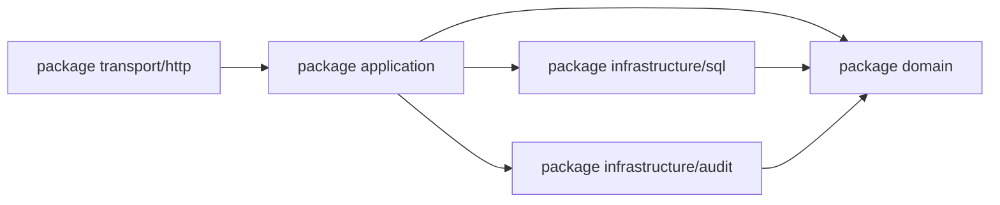
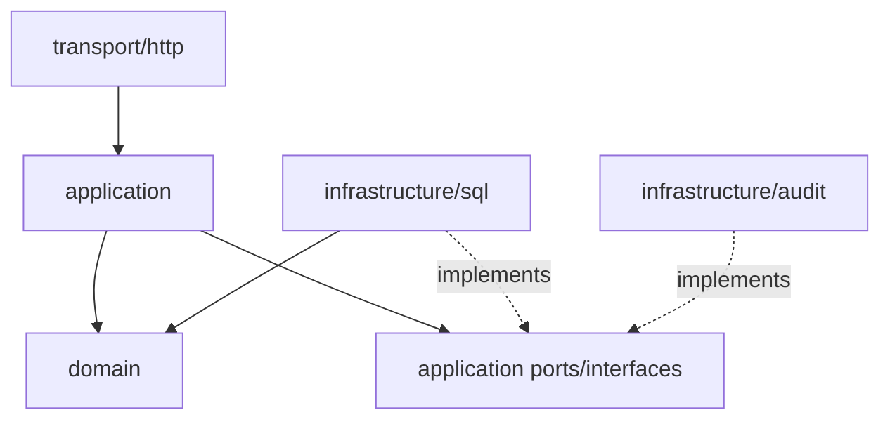
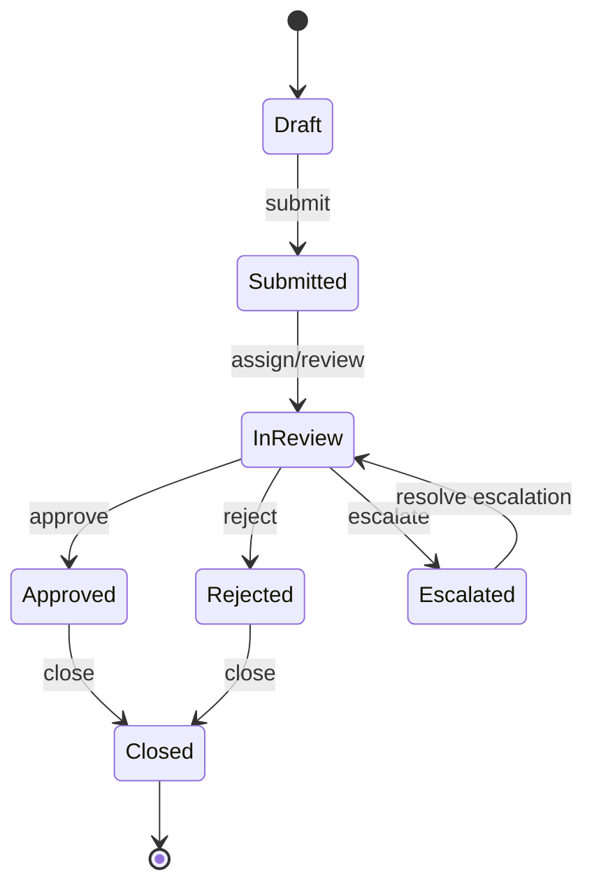
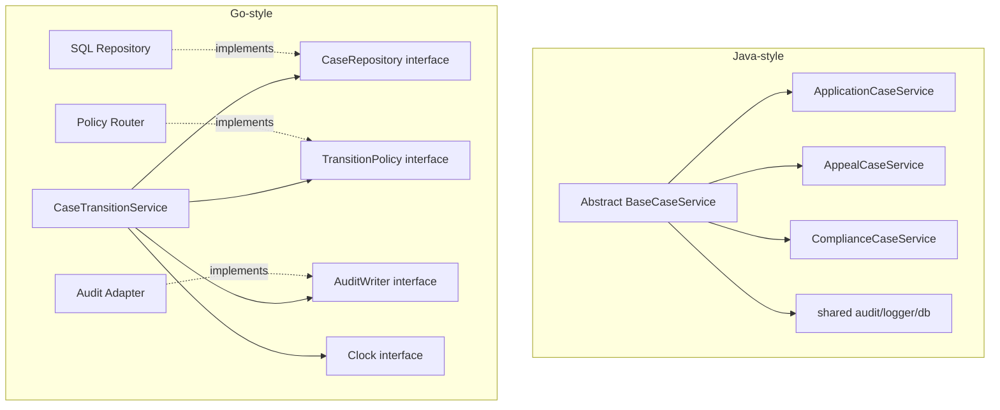

# learn-go-part-005.md

# Go Composition over Inheritance: Embedding, Method Promotion, dan Object Modelling tanpa Class Hierarchy

> Series: `learn-go`  
> Part: `005`  
> Target pembaca: Java software engineer yang ingin memahami Go secara production-grade  
> Fokus: mengganti mental model inheritance/class hierarchy dengan composition/package/interface-oriented design di Go

---

## 0. Tujuan Part Ini

Setelah menyelesaikan part ini, kamu harus mampu:

1. Memahami kenapa Go tidak memiliki class inheritance.
2. Mendesain domain model Go tanpa superclass, abstract class, inheritance tree, atau framework-heavy base type.
3. Memakai struct embedding secara benar, bukan sebagai “inheritance palsu”.
4. Memahami method promotion dan field promotion secara presisi.
5. Menentukan kapan embedding layak dipakai dan kapan sebaiknya memakai named field biasa.
6. Memahami perbedaan composition, delegation, embedding, interface satisfaction, dan API exposure.
7. Menghindari anti-pattern umum dari Java engineer yang baru masuk Go.
8. Membangun model aplikasi regulatory/case-management dengan Go-style composition.
9. Mengevaluasi object modelling berdasarkan invariants, ownership, dan dependency direction.
10. Menggunakan composition untuk membuat kode lebih eksplisit, testable, dan stabil.

Part ini adalah salah satu part paling penting untuk transisi dari Java ke Go.

Di Java, desain aplikasi sering dimulai dari pertanyaan:

```text
Class apa yang mewarisi class apa?
Interface mana yang diimplementasikan?
Abstract base class apa yang bisa dipakai ulang?
Framework annotation apa yang menghubungkan semuanya?
```

Di Go, pertanyaan yang lebih tepat adalah:

```text
Data apa yang dimiliki type ini?
Behavior apa yang perlu diekspos?
Dependency apa yang benar-benar dibutuhkan?
Boundary package mana yang harus stabil?
Interface sekecil apa yang cukup untuk consumer?
Apakah composition ini menyederhanakan ownership atau justru menyamarkan coupling?
```

---

## 1. Mental Model Utama

Go tidak menolak reuse. Go menolak reuse yang tersembunyi di balik inheritance hierarchy.

### 1.1 Java inheritance mental model

Di Java, reuse sering dilakukan melalui:

```java
abstract class BaseCaseService {
    protected final AuditService auditService;

    protected void audit(String action) {
        auditService.write(action);
    }
}

class AppealCaseService extends BaseCaseService {
    void approveAppeal(...) {
        audit("APPROVE_APPEAL");
    }
}
```

Kelebihan:

- reuse mudah;
- common behavior bisa dipusatkan;
- subtype polymorphism eksplisit;
- framework sering cocok dengan inheritance/annotation pattern.

Masalah:

- coupling naik ke base class;
- subclass mewarisi lebih banyak dari yang dibutuhkan;
- lifecycle dependency tersembunyi;
- perubahan base class bisa merusak banyak subclass;
- testing subclass sering perlu memahami superclass;
- invariants domain sering tersebar antara base dan child;
- `protected` membuat boundary menjadi kabur.

### 1.2 Go composition mental model

Di Go, bentuk yang lebih natural adalah:

```go
type AuditWriter interface {
	WriteAudit(ctx context.Context, entry AuditEntry) error
}

type AppealCaseService struct {
	audit AuditWriter
	repo  AppealRepository
}

func NewAppealCaseService(audit AuditWriter, repo AppealRepository) *AppealCaseService {
	return &AppealCaseService{audit: audit, repo: repo}
}

func (s *AppealCaseService) Approve(ctx context.Context, id AppealID) error {
	// domain validation...
	if err := s.audit.WriteAudit(ctx, AuditEntry{Action: "APPROVE_APPEAL"}); err != nil {
		return err
	}
	return nil
}
```

Perbedaannya bukan hanya syntax.

```text
Java inheritance:
  "Service ini adalah jenis dari BaseCaseService."

Go composition:
  "Service ini memiliki dependency yang dibutuhkan untuk melakukan pekerjaannya."
```

Go cenderung membuat dependency lebih eksplisit.

---

## 2. Apa Itu Composition di Go?

Composition berarti sebuah type dibangun dari type lain.

Ada dua bentuk utama:

1. named field composition;
2. embedded field composition.

### 2.1 Named field composition

```go
type CaseService struct {
	audit AuditWriter
	repo  CaseRepository
	clock Clock
}
```

Ini bentuk paling eksplisit.

Aksesnya:

```go
s.audit.WriteAudit(ctx, entry)
s.repo.Save(ctx, c)
s.clock.Now()
```

Kelebihan:

- jelas siapa memiliki apa;
- tidak mengekspos method dependency secara tidak sengaja;
- mudah dibaca;
- cocok untuk dependency injection manual;
- cocok untuk service/application layer.

### 2.2 Embedded field composition

```go
type AuditedCaseService struct {
	AuditWriter
	repo CaseRepository
}
```

atau:

```go
type User struct {
	Person
	Email string
}
```

Embedded field berarti nama field-nya diambil dari type-nya.

Contoh:

```go
type Person struct {
	Name string
}

func (p Person) DisplayName() string {
	return p.Name
}

type User struct {
	Person
	Email string
}

func example() {
	u := User{
		Person: Person{Name: "Fajar"},
		Email:  "fajar@example.com",
	}

	fmt.Println(u.Name)          // promoted field
	fmt.Println(u.DisplayName()) // promoted method
}
```

`User` tidak mewarisi `Person` seperti Java inheritance. `User` memiliki field embedded `Person`, lalu field/method tertentu dari `Person` dipromosikan untuk akses lebih pendek.

---

## 3. Composition vs Inheritance

### 3.1 Relasi konsep



### 3.2 Perbandingan praktis

| Concern | Java inheritance | Go composition |
|---|---|---|
| Reuse | lewat superclass | lewat fields/functions/interfaces |
| Polymorphism | nominal, `implements`/`extends` | structural, implicit interface satisfaction |
| Shared behavior | abstract/base class | dependency/function/helper/interface |
| State reuse | inherited/protected fields | explicit field ownership |
| Override | method overriding | no overriding; shadowing/promotion rules only |
| Fragility | base class ripple effect | field/interface contract lebih lokal |
| Framework style | annotation/container heavy | standard library + explicit wiring |
| Testing | subclass often needs superclass context | dependency can be replaced by small fake |

---

## 4. Go Tidak Punya Class, Tapi Punya Method

Go tidak punya class.

Go punya:

- package;
- type;
- struct;
- method;
- interface;
- function;
- embedded field.

Method di Go adalah function dengan receiver:

```go
type Case struct {
	ID     string
	Status string
}

func (c Case) IsClosed() bool {
	return c.Status == "CLOSED"
}
```

Method bukan milik class. Method terasosiasi dengan defined type dalam package yang sama.

Konsekuensinya:

```text
Tidak ada inheritance tree.
Tidak ada virtual dispatch berdasarkan subclass.
Tidak ada protected method.
Tidak ada abstract class.
Tidak ada constructor inheritance.
Tidak ada super call.
```

Tapi Go tetap mampu melakukan polymorphism melalui interface.

```go
type Closer interface {
	Close() error
}
```

Siapa pun yang punya method `Close() error` otomatis memenuhi interface tersebut.

---

## 5. Struct Embedding secara Presisi

### 5.1 Embedded field adalah field

Ini sangat penting:

```go
type AuditFields struct {
	CreatedBy string
	UpdatedBy string
}

type Case struct {
	AuditFields
	ID string
}
```

`Case` tetap memiliki field bernama `AuditFields`.

Buktinya:

```go
c := Case{
	AuditFields: AuditFields{
		CreatedBy: "system",
		UpdatedBy: "system",
	},
	ID: "CASE-001",
}

fmt.Println(c.AuditFields.CreatedBy)
fmt.Println(c.CreatedBy) // shorthand via promotion
```

`c.CreatedBy` hanya shorthand dari promoted field. Bukan berarti field tersebut physically berada langsung di `Case` sebagai inheritance flattening secara semantic.

### 5.2 Embedded field bisa berupa pointer

```go
type Case struct {
	*AuditFields
	ID string
}
```

Ini memberi konsekuensi penting:

```go
var c Case
fmt.Println(c.CreatedBy) // panic: nil pointer dereference
```

Jika embedded pointer nil, promoted method/field yang dereference pointer bisa panic.

Untuk domain object, embedded pointer sering lebih berbahaya daripada embedded value kecuali nil memang bagian dari model.

---

## 6. Field Promotion

Field promotion membuat field dari embedded struct dapat diakses dari outer struct.

```go
type Address struct {
	City string
}

type Office struct {
	Address
	Name string
}

func example() {
	o := Office{Address: Address{City: "Jakarta"}, Name: "HQ"}
	fmt.Println(o.City)
}
```

`o.City` dipromosikan dari `o.Address.City`.

### 6.1 Promotion bukan ownership baru

`Office` tidak “menjadi” `Address`.

Ini tidak valid secara assignment:

```go
var a Address
var o Office

// a = o // compile error
```

Tidak seperti subclass ke superclass assignment di Java.

### 6.2 Ambiguous promotion

```go
type CreatedAudit struct {
	User string
}

type UpdatedAudit struct {
	User string
}

type Case struct {
	CreatedAudit
	UpdatedAudit
}
```

Sekarang:

```go
var c Case
// fmt.Println(c.User) // ambiguous selector
fmt.Println(c.CreatedAudit.User)
fmt.Println(c.UpdatedAudit.User)
```

Promotion bisa gagal jika selector ambigu.

Ini salah satu alasan kenapa embedding tidak boleh dipakai sembarangan untuk “menghemat ketikan”.

---

## 7. Method Promotion

Method dari embedded type juga bisa dipromosikan.

```go
type Logger struct{}

func (Logger) Info(msg string) {
	fmt.Println("INFO:", msg)
}

type Service struct {
	Logger
}

func example() {
	var s Service
	s.Info("started")
}
```

`Service` memiliki akses ke method `Info` melalui embedded `Logger`.

Namun ini bukan override/inheritance.

### 7.1 Shadowing method

```go
type Logger struct{}

func (Logger) Info(msg string) {
	fmt.Println("logger:", msg)
}

type Service struct {
	Logger
}

func (Service) Info(msg string) {
	fmt.Println("service:", msg)
}
```

`Service.Info` mengalahkan promoted method dari `Logger` untuk selector `s.Info(...)`.

Tapi `Logger.Info` tetap ada:

```go
s.Logger.Info("explicit")
```

Ini bukan override seperti Java. Tidak ada dynamic dispatch ke `super` atau polymorphic override chain.

---

## 8. Method Set dan Embedding

Method set adalah aturan yang menentukan method apa saja yang dimiliki suatu type untuk interface satisfaction.

Kita akan bahas lebih dalam di part interface, tetapi untuk embedding kamu perlu memahami intinya.

### 8.1 Value receiver

```go
type Audit struct{}

func (Audit) Record() {}

type Case struct {
	Audit
}
```

`Case` dan `*Case` dapat mengakses promoted method `Record`.

### 8.2 Pointer receiver

```go
type Audit struct{}

func (*Audit) Record() {}

type Case struct {
	Audit
}
```

`*Case` biasanya memiliki method promoted yang berasal dari `*Audit`. Tetapi detail method set bisa memengaruhi apakah `Case` value memenuhi interface tertentu.

Contoh mental model praktis:

```go
type Recorder interface {
	Record()
}

var _ Recorder = (*Case)(nil) // usually OK
// var _ Recorder = Case{}    // may fail depending on receiver/method set
```

Rule of thumb production:

```text
Jika type punya method mutating atau embedded dependency dengan pointer receiver,
lebih aman perlakukan outer type sebagai pointer type di API/service boundary.
```

---

## 9. Embedding Interface

Go memperbolehkan struct embedding interface.

```go
type Clock interface {
	Now() time.Time
}

type Service struct {
	Clock
}
```

Sekarang `Service` mempromosikan method `Now()`.

```go
func example(s Service) {
	fmt.Println(s.Now())
}
```

Namun ini jarang menjadi pilihan terbaik untuk service dependency.

Lebih eksplisit:

```go
type Service struct {
	clock Clock
}

func (s *Service) Execute() {
	now := s.clock.Now()
	_ = now
}
```

### 9.1 Risiko embedding interface

Embedding interface di struct bisa menyebabkan dependency method terekspos sebagai method service.

Contoh:

```go
type AuditWriter interface {
	WriteAudit(context.Context, AuditEntry) error
}

type CaseService struct {
	AuditWriter
}
```

Sekarang `CaseService` sendiri tampak memiliki method `WriteAudit`. Apakah itu memang bagian dari public API `CaseService`? Sering kali tidak.

Jika tidak dimaksudkan sebagai public capability, jangan embed interface. Gunakan named field unexported.

```go
type CaseService struct {
	audit AuditWriter
}
```

---

## 10. Embedding Struct untuk Reuse Data

Embedding struct untuk reusable data fields sering tampak menarik:

```go
type AuditMetadata struct {
	CreatedAt time.Time
	CreatedBy string
	UpdatedAt time.Time
	UpdatedBy string
}

type Case struct {
	AuditMetadata
	ID     CaseID
	Status CaseStatus
}
```

Ini bisa layak jika:

- field tersebut benar-benar bagian intrinsic dari entity;
- nama field aman diekspos langsung;
- tidak ada konflik selector;
- tidak menyesatkan API external;
- tidak membuat persistence/JSON contract bocor tanpa sadar.

### 10.1 Struct tag dan embedding

```go
type AuditMetadata struct {
	CreatedAt time.Time `json:"created_at"`
	CreatedBy string    `json:"created_by"`
}

type CaseDTO struct {
	AuditMetadata
	ID string `json:"id"`
}
```

Saat serialization, promoted/exported fields bisa ikut dianggap sebagai field outer object oleh encoder tertentu seperti `encoding/json`.

Ini bisa berguna, tetapi juga bisa menjadi contract leak.

Untuk DTO external API, lebih aman eksplisit jika contract harus stabil:

```go
type CaseResponse struct {
	ID        string    `json:"id"`
	CreatedAt time.Time `json:"created_at"`
	CreatedBy string    `json:"created_by"`
}
```

Domain model dan external DTO sebaiknya tidak disamakan hanya agar tidak menulis mapping.

---

## 11. Composition via Named Fields: Default yang Disarankan

Untuk service, repository, adapter, client, dan use case, default terbaik biasanya named fields.

```go
type CaseCommandHandler struct {
	repo     CaseRepository
	audit    AuditWriter
	clock    Clock
	policy   ApprovalPolicy
	notifier NotificationSender
}
```

Ini mungkin terlihat verbose, tetapi jelas.

Keuntungan:

```text
- dependency terlihat langsung;
- test fake mudah disuntikkan;
- tidak ada accidental API exposure;
- tidak ada selector ambiguity;
- ownership lebih jelas;
- mudah diaudit saat code review.
```

Dalam sistem regulatory, clarity sering lebih penting daripada brevity.

---

## 12. Delegation Pattern di Go

Karena tidak ada inheritance, behavior reuse biasanya dilakukan dengan explicit delegation.

```go
type AuditWriter interface {
	WriteAudit(ctx context.Context, entry AuditEntry) error
}

type CaseApprover struct {
	audit AuditWriter
}

func (a *CaseApprover) writeApprovalAudit(ctx context.Context, caseID CaseID, actor UserID) error {
	return a.audit.WriteAudit(ctx, AuditEntry{
		EntityID: string(caseID),
		ActorID:  string(actor),
		Action:   "CASE_APPROVED",
	})
}
```

Java engineer sering melihat ini sebagai “boilerplate”. Dalam Go, ini adalah control surface.

Delegation eksplisit menjawab:

```text
Siapa caller-nya?
Apa dependency-nya?
Apa error contract-nya?
Apakah behavior ini bagian public API atau private helper?
Apakah dependency boleh diganti saat test?
```

---

## 13. Interface Composition

Go juga mendukung interface embedding.

```go
type Reader interface {
	Read(p []byte) (n int, err error)
}

type Writer interface {
	Write(p []byte) (n int, err error)
}

type ReadWriter interface {
	Reader
	Writer
}
```

Ini sangat umum dan idiomatis.

Namun tetap hati-hati: interface besar sering menjadi “inheritance tree versi Go”.

### 13.1 Interface composition yang baik

```go
type CaseReader interface {
	FindByID(ctx context.Context, id CaseID) (Case, error)
}

type CaseWriter interface {
	Save(ctx context.Context, c Case) error
}

type CaseRepository interface {
	CaseReader
	CaseWriter
}
```

Ini masuk akal jika ada consumer yang memang membutuhkan kombinasi lengkap.

Tapi jika use case hanya butuh read:

```go
type CaseDetailsService struct {
	cases CaseReader
}
```

Jangan inject `CaseRepository` jika hanya perlu `FindByID`.

---

## 14. Object Modelling di Go

### 14.1 Jangan mulai dari noun hierarchy

Java modelling sering mulai dari taxonomy:

```text
BaseCase
  ├── ApplicationCase
  ├── AppealCase
  ├── ComplianceCase
  └── EnforcementCase
```

Di Go, hierarchy seperti ini sering buruk.

Pertanyaan Go-style:

```text
Apa lifecycle state-nya?
Apa invariant-nya?
Apa command yang valid?
Apa event/audit yang harus terjadi?
Apa policy yang bervariasi?
Apa data yang benar-benar berbeda?
Apa behavior yang common dan apa yang seharusnya dependency?
```

### 14.2 Dari inheritance ke composition

Misalnya Java model:

```java
abstract class RegulatoryCase {
    String id;
    Status status;
    AuditMetadata audit;

    abstract boolean canApprove(User user);
}

class AppealCase extends RegulatoryCase {
    @Override
    boolean canApprove(User user) { ... }
}

class ComplianceCase extends RegulatoryCase {
    @Override
    boolean canApprove(User user) { ... }
}
```

Go-style alternative:

```go
type Case struct {
	ID       CaseID
	Kind     CaseKind
	Status   CaseStatus
	Audit    AuditMetadata
	Subject  SubjectRef
}

type ApprovalPolicy interface {
	CanApprove(ctx context.Context, c Case, actor User) (Decision, error)
}

type ApprovalService struct {
	cases   CaseRepository
	policy  ApprovalPolicy
	audit   AuditWriter
	clock   Clock
}
```

Variation dipindahkan ke policy, bukan subclass.

Ini lebih cocok jika variasi adalah business rule, bukan data structure fundamental.

---

## 15. When to Use Struct Embedding

Gunakan struct embedding jika:

1. embedded type benar-benar merupakan bagian natural dari outer type;
2. promoted fields/methods memang layak menjadi bagian API outer type;
3. tidak menciptakan ambiguity;
4. tidak menyamarkan dependency;
5. tidak menyebabkan external serialization contract bocor;
6. tidak dipakai untuk meniru inheritance;
7. method set-nya dipahami;
8. zero value tetap aman atau constructor menjamin inisialisasi.

Contoh yang cukup baik:

```go
type AuditMetadata struct {
	CreatedAt time.Time
	CreatedBy UserID
	UpdatedAt time.Time
	UpdatedBy UserID
}

type CaseRecord struct {
	AuditMetadata
	ID     CaseID
	Status CaseStatus
}
```

Contoh yang sering buruk:

```go
type BaseService struct {
	Logger
	DB
	Config
	Metrics
}

type AppealService struct {
	BaseService
}
```

Ini biasanya membawa smell inheritance ke Go.

---

## 16. When Not to Use Embedding

Jangan gunakan embedding jika tujuanmu hanya:

```text
- mengurangi jumlah karakter saat akses field;
- membuat Go terasa seperti inheritance;
- menyebarkan common dependencies ke semua service;
- membuat service otomatis punya method dependency;
- menyembunyikan detail wiring;
- menghindari desain interface yang jelas;
- menyatukan DTO/domain/persistence model;
- membuat “base model” generik untuk semua entity.
```

Contoh buruk:

```go
type BaseEntity struct {
	ID        string
	CreatedAt time.Time
	UpdatedAt time.Time
}

type User struct {
	BaseEntity
	Name string
}

type Case struct {
	BaseEntity
	Status string
}
```

Ini tidak selalu salah, tetapi sering terlalu generic.

Pertanyaan review:

```text
Apakah semua entity benar-benar punya lifecycle metadata yang sama?
Apakah ID type-nya sama?
Apakah external JSON contract sama?
Apakah database column behavior sama?
Apakah audit semantics sama?
Apakah soft delete sama?
Apakah CreatedAt domain event atau persistence detail?
```

Jika jawabannya banyak “tidak yakin”, jangan buru-buru membuat `BaseEntity`.

---

## 17. Composition untuk Dependency Injection Manual

Go tidak membutuhkan DI container untuk sebagian besar aplikasi.

Composition cukup:

```go
type App struct {
	CaseHandler   *CaseHandler
	AppealHandler *AppealHandler
	HTTPServer    *http.Server
}

func NewApp(cfg Config) (*App, error) {
	db, err := sql.Open("postgres", cfg.DatabaseURL)
	if err != nil {
		return nil, err
	}

	caseRepo := NewSQLCaseRepository(db)
	auditRepo := NewSQLAuditWriter(db)
	clock := SystemClock{}

	caseHandler := NewCaseHandler(caseRepo, auditRepo, clock)
	appealHandler := NewAppealHandler(caseRepo, auditRepo, clock)

	mux := http.NewServeMux()
	RegisterCaseRoutes(mux, caseHandler)
	RegisterAppealRoutes(mux, appealHandler)

	return &App{
		CaseHandler:   caseHandler,
		AppealHandler: appealHandler,
		HTTPServer: &http.Server{
			Addr:    cfg.HTTPAddr,
			Handler: mux,
		},
	}, nil
}
```

Ini eksplisit, testable, dan mudah diaudit.

Untuk sistem besar, kamu bisa memakai provider/wiring package, tetapi prinsipnya tetap composition, bukan runtime magic.

---

## 18. Composition dan Package Boundary

Composition bukan hanya soal struct. Composition juga soal package.



Namun dalam desain yang lebih clean, application layer mendefinisikan interface kecil dan infrastructure mengimplementasikannya.



Di Go, interface biasanya diletakkan di sisi consumer jika interface itu hanya dibutuhkan consumer.

```go
package application

type CaseRepository interface {
	FindByID(ctx context.Context, id domain.CaseID) (domain.Case, error)
	Save(ctx context.Context, c domain.Case) error
}
```

Lalu implementation ada di package infra:

```go
package sqlcase

type Repository struct {
	db *sql.DB
}

func (r *Repository) FindByID(ctx context.Context, id domain.CaseID) (domain.Case, error) {
	// ...
}

func (r *Repository) Save(ctx context.Context, c domain.Case) error {
	// ...
}
```

Tidak perlu `implements`.

Compile-time check opsional:

```go
var _ application.CaseRepository = (*Repository)(nil)
```

---

## 19. Case Study: Regulatory Case Management

Kita desain contoh sistem regulatory sederhana.

### 19.1 Requirement

Ada beberapa case type:

- application case;
- appeal case;
- compliance case;
- enforcement case.

Masing-masing punya:

- ID;
- status;
- assigned officer;
- audit metadata;
- documents;
- decision history;
- SLA clock;
- allowed transitions.

Java engineer mungkin langsung membuat:

```text
abstract RegulatoryCase
  ├── ApplicationCase
  ├── AppealCase
  ├── ComplianceCase
  └── EnforcementCase
```

Tapi kita perlu cek apakah variasi tersebut benar-benar membutuhkan subtype.

### 19.2 Model Go-style

```go
type CaseKind string

const (
	CaseKindApplication CaseKind = "APPLICATION"
	CaseKindAppeal      CaseKind = "APPEAL"
	CaseKindCompliance  CaseKind = "COMPLIANCE"
	CaseKindEnforcement CaseKind = "ENFORCEMENT"
)

type CaseStatus string

const (
	CaseStatusDraft      CaseStatus = "DRAFT"
	CaseStatusSubmitted  CaseStatus = "SUBMITTED"
	CaseStatusInReview   CaseStatus = "IN_REVIEW"
	CaseStatusApproved   CaseStatus = "APPROVED"
	CaseStatusRejected   CaseStatus = "REJECTED"
	CaseStatusEscalated  CaseStatus = "ESCALATED"
	CaseStatusClosed     CaseStatus = "CLOSED"
)

type AuditMetadata struct {
	CreatedAt time.Time
	CreatedBy UserID
	UpdatedAt time.Time
	UpdatedBy UserID
}

type Case struct {
	ID              CaseID
	Kind            CaseKind
	Status          CaseStatus
	AssignedOfficer *UserID
	Audit           AuditMetadata
	Documents       []DocumentRef
	DecisionHistory []DecisionRecord
}
```

Di sini `CaseKind` adalah data, bukan subclass.

Variation behavior diletakkan pada policy:

```go
type TransitionPolicy interface {
	CanTransition(ctx context.Context, c Case, target CaseStatus, actor User) (Decision, error)
}
```

Implementation bisa berbeda:

```go
type RegulatoryTransitionPolicy struct {
	rules map[CaseKind]KindTransitionRules
}
```

Atau:

```go
type PolicyRouter struct {
	application TransitionPolicy
	appeal      TransitionPolicy
	compliance  TransitionPolicy
	enforcement TransitionPolicy
}

func (p PolicyRouter) CanTransition(ctx context.Context, c Case, target CaseStatus, actor User) (Decision, error) {
	switch c.Kind {
	case CaseKindApplication:
		return p.application.CanTransition(ctx, c, target, actor)
	case CaseKindAppeal:
		return p.appeal.CanTransition(ctx, c, target, actor)
	case CaseKindCompliance:
		return p.compliance.CanTransition(ctx, c, target, actor)
	case CaseKindEnforcement:
		return p.enforcement.CanTransition(ctx, c, target, actor)
	default:
		return Decision{}, fmt.Errorf("unsupported case kind %q", c.Kind)
	}
}
```

Ini composition: service memiliki policy router; policy router memiliki policy per kind.

### 19.3 State machine diagram



### 19.4 Application service

```go
type CaseRepository interface {
	FindByID(ctx context.Context, id CaseID) (Case, error)
	Save(ctx context.Context, c Case) error
}

type AuditWriter interface {
	WriteAudit(ctx context.Context, entry AuditEntry) error
}

type Clock interface {
	Now() time.Time
}

type CaseTransitionService struct {
	cases  CaseRepository
	policy TransitionPolicy
	audit  AuditWriter
	clock  Clock
}

func NewCaseTransitionService(
	cases CaseRepository,
	policy TransitionPolicy,
	audit AuditWriter,
	clock Clock,
) *CaseTransitionService {
	return &CaseTransitionService{
		cases:  cases,
		policy: policy,
		audit:  audit,
		clock:  clock,
	}
}

func (s *CaseTransitionService) Transition(
	ctx context.Context,
	id CaseID,
	target CaseStatus,
	actor User,
) error {
	c, err := s.cases.FindByID(ctx, id)
	if err != nil {
		return fmt.Errorf("find case %s: %w", id, err)
	}

	decision, err := s.policy.CanTransition(ctx, c, target, actor)
	if err != nil {
		return fmt.Errorf("evaluate transition policy: %w", err)
	}
	if !decision.Allowed {
		return ErrTransitionDenied{CaseID: id, Target: target, Reason: decision.Reason}
	}

	previous := c.Status
	c.Status = target
	c.Audit.UpdatedAt = s.clock.Now()
	c.Audit.UpdatedBy = actor.ID
	c.DecisionHistory = append(c.DecisionHistory, DecisionRecord{
		From:      previous,
		To:        target,
		ActorID:   actor.ID,
		Reason:    decision.Reason,
		CreatedAt: s.clock.Now(),
	})

	if err := s.cases.Save(ctx, c); err != nil {
		return fmt.Errorf("save case %s transition %s->%s: %w", id, previous, target, err)
	}

	if err := s.audit.WriteAudit(ctx, AuditEntry{
		EntityID:  string(id),
		Entity:    "case",
		Action:    "CASE_TRANSITIONED",
		ActorID:   string(actor.ID),
		CreatedAt: s.clock.Now(),
		Metadata: map[string]string{
			"from": string(previous),
			"to":   string(target),
		},
	}); err != nil {
		return fmt.Errorf("write transition audit: %w", err)
	}

	return nil
}
```

Perhatikan: tidak ada base service, tidak ada abstract case, tidak ada inheritance. Tapi model tetap powerful.

---

## 20. Composition dan Invariants

Composition harus menjaga invariants, bukan hanya menyusun field.

Contoh invariant:

```text
Case yang sudah CLOSED tidak boleh pindah status.
Case APPEAL tidak boleh APPROVED tanpa reviewer role.
Case COMPLIANCE bisa ESCALATED hanya jika severity HIGH.
Audit UpdatedAt harus berubah setiap mutasi status.
DecisionHistory harus append-only.
```

Di Go, invariants bisa dijaga melalui:

1. unexported fields;
2. constructor;
3. method yang mengontrol mutasi;
4. package boundary;
5. value object types;
6. policy object;
7. repository transaction boundary.

### 20.1 Unexported field untuk control mutasi

```go
type Case struct {
	id     CaseID
	kind   CaseKind
	status CaseStatus
	audit  AuditMetadata
}

func NewCase(id CaseID, kind CaseKind, actor UserID, now time.Time) Case {
	return Case{
		id:     id,
		kind:   kind,
		status: CaseStatusDraft,
		audit: AuditMetadata{
			CreatedAt: now,
			CreatedBy: actor,
			UpdatedAt: now,
			UpdatedBy: actor,
		},
	}
}

func (c Case) ID() CaseID { return c.id }
func (c Case) Status() CaseStatus { return c.status }
```

Mutasi dikontrol:

```go
func (c *Case) transitionTo(target CaseStatus, actor UserID, now time.Time) error {
	if c.status == CaseStatusClosed {
		return ErrCaseClosed
	}
	c.status = target
	c.audit.UpdatedAt = now
	c.audit.UpdatedBy = actor
	return nil
}
```

Ini lebih verbose, tapi lebih defensible untuk domain yang punya rule ketat.

---

## 21. Composition dan Zero Value

Go mendorong zero value agar berguna. Tapi tidak semua domain object bisa valid sebagai zero value.

```go
var c Case
```

Apakah ini valid?

Jika `CaseID == ""` dan status kosong tidak valid, maka `Case` zero value bukan domain-valid.

Ada dua pendekatan:

### 21.1 Zero value usable untuk infrastructure/helper

```go
type Buffer struct {
	data []byte
}

func (b *Buffer) Write(p []byte) {
	b.data = append(b.data, p...)
}
```

Zero value bagus.

### 21.2 Constructor-required untuk domain entity

```go
type Case struct {
	id     CaseID
	status CaseStatus
}

func NewCase(id CaseID) (Case, error) {
	if id == "" {
		return Case{}, ErrInvalidCaseID
	}
	return Case{id: id, status: CaseStatusDraft}, nil
}
```

Tidak semua type harus zero-value-valid. Tapi kamu harus sadar dan dokumentasikan.

---

## 22. Composition dan Testability

Composition dengan small interfaces membuat test lebih sederhana.

```go
type fakeCaseRepository struct {
	caseByID Case
	saved    Case
}

func (f *fakeCaseRepository) FindByID(ctx context.Context, id CaseID) (Case, error) {
	return f.caseByID, nil
}

func (f *fakeCaseRepository) Save(ctx context.Context, c Case) error {
	f.saved = c
	return nil
}
```

Tidak perlu framework mocking.

### 22.1 Fake policy

```go
type allowPolicy struct{}

func (allowPolicy) CanTransition(ctx context.Context, c Case, target CaseStatus, actor User) (Decision, error) {
	return Decision{Allowed: true, Reason: "test"}, nil
}
```

Karena interface kecil, fake kecil.

---

## 23. Anti-Pattern: BaseService di Go

Java engineer sering membuat:

```go
type BaseService struct {
	DB     *sql.DB
	Logger *slog.Logger
	Config Config
}

type CaseService struct {
	BaseService
}
```

Masalah:

1. semua service membawa dependency yang belum tentu dipakai;
2. public/promoted method/field bisa bocor;
3. testing makin berat;
4. coupling ke DB langsung menyebar;
5. service boundary tidak jelas;
6. dependency graph tersembunyi;
7. code review sulit melihat kebutuhan nyata.

Lebih baik:

```go
type CaseService struct {
	cases CaseRepository
	audit AuditWriter
	log   *slog.Logger
}
```

Jika banyak service butuh logger, tetap inject logger sebagai named field. Jangan menjadikannya base class.

---

## 24. Anti-Pattern: God Context Struct

Kadang orang membuat:

```go
type Dependencies struct {
	DB      *sql.DB
	Redis   *redis.Client
	Logger  *slog.Logger
	Metrics Metrics
	Config  Config
	Mailer  Mailer
	Clock   Clock
}

type Service struct {
	deps *Dependencies
}
```

Ini mirip service locator.

Masalah:

- tidak jelas service butuh apa;
- mudah mengambil dependency baru tanpa desain;
- testing perlu membangun object besar;
- circular dependency lebih mudah muncul;
- sulit audit impact.

Gunakan constructor explicit:

```go
func NewCaseService(repo CaseRepository, audit AuditWriter, clock Clock, log *slog.Logger) *CaseService
```

Jika parameter terlalu banyak, mungkin service melakukan terlalu banyak hal.

---

## 25. Anti-Pattern: Premature Interface Everywhere

Go interface sebaiknya kecil dan lahir dari kebutuhan consumer, bukan dibuat otomatis untuk setiap struct.

Buruk:

```go
type CaseServiceInterface interface {
	Approve(ctx context.Context, id CaseID) error
	Reject(ctx context.Context, id CaseID) error
	Escalate(ctx context.Context, id CaseID) error
}

type CaseServiceImpl struct{}
```

Ini membawa style Java `FooService`/`FooServiceImpl` tanpa manfaat.

Lebih Go-style:

```go
type CaseService struct {
	// fields
}

func (s *CaseService) Approve(ctx context.Context, id CaseID) error { return nil }
```

Buat interface di consumer hanya saat dibutuhkan:

```go
type CaseApprover interface {
	Approve(ctx context.Context, id CaseID) error
}
```

---

## 26. Anti-Pattern: Embedding untuk “Trait” Besar

Go embedding kadang dipakai seperti trait/mixin:

```go
type CRUDMixin struct{}

func (CRUDMixin) Create() {}
func (CRUDMixin) Read() {}
func (CRUDMixin) Update() {}
func (CRUDMixin) Delete() {}

type UserService struct {
	CRUDMixin
}
```

Masalahnya sama seperti inheritance:

- behavior terlalu generic;
- domain semantics hilang;
- method public muncul tanpa contract jelas;
- sulit mengontrol invariants.

Better:

```go
type UserRepository interface {
	FindByID(ctx context.Context, id UserID) (User, error)
	Save(ctx context.Context, user User) error
}
```

CRUD bukan domain language. Dalam regulatory system, command seperti `Submit`, `Approve`, `Escalate`, `Close`, `Reopen`, `Assign`, `Withdraw` lebih meaningful.

---

## 27. Composition dan API Stability

Embedding exported type dari package lain bisa membuat API kamu ikut mengekspos API dependency.

```go
package service

type Service struct {
	*http.Client
}
```

Sekarang public API `Service` ikut punya method `Get`, `Post`, `Do`, dll. Apakah itu dimaksudkan?

Jika tidak:

```go
type Service struct {
	client *http.Client
}
```

Named unexported field menjaga API surface.

### 27.1 Rule

```text
Embedding exported dependency pada exported struct adalah keputusan API publik.
Jangan lakukan tanpa sengaja.
```

---

## 28. Composition dan Serialization Contract

Struct embedding dapat memengaruhi JSON output.

```go
type Metadata struct {
	TraceID string `json:"trace_id"`
}

type Response struct {
	Metadata
	Status string `json:"status"`
}
```

Output bisa menjadi:

```json
{
  "trace_id": "abc",
  "status": "ok"
}
```

Jika ingin nested:

```go
type Response struct {
	Metadata Metadata `json:"metadata"`
	Status   string   `json:"status"`
}
```

Output:

```json
{
  "metadata": {
    "trace_id": "abc"
  },
  "status": "ok"
}
```

Untuk API public, pilih bentuk contract secara sadar. Jangan biarkan embedding menentukan contract secara kebetulan.

---

## 29. Composition dan Memory/Copy Semantics

Embedding value berarti outer struct membawa value tersebut.

```go
type Big struct {
	Data [4096]byte
}

type Wrapper struct {
	Big
}
```

Copy `Wrapper` berarti copy `Big` juga.

```go
func process(w Wrapper) {
	// copies Wrapper, including embedded Big
}
```

Jika embedded type besar atau mengandung lock, hati-hati.

### 29.1 Jangan copy sync primitives

```go
type SafeCounter struct {
	mu sync.Mutex
	n  int
}
```

Jangan copy setelah digunakan.

Jika di-embed:

```go
type Service struct {
	SafeCounter
}
```

Copy `Service` juga copy lock state. Ini berbahaya.

Rule:

```text
Type yang mengandung mutex, atomic state, file descriptor, connection, atau lifecycle resource
biasanya harus dipakai melalui pointer dan tidak boleh dicopy setelah digunakan.
```

---

## 30. Composition dan Lifecycle Ownership

Jika sebuah struct memiliki dependency, tanyakan:

```text
Apakah dependency ini owned oleh struct?
Apakah struct bertanggung jawab menutup dependency?
Apakah dependency shared?
Apakah dependency thread-safe?
Apakah dependency boleh nil?
Apakah dependency boleh diganti saat runtime?
```

Contoh:

```go
type Worker struct {
	queue Queue
	log   *slog.Logger
	done  chan struct{}
}
```

`done` jelas owned oleh worker. Tapi `queue` mungkin shared dependency.

Constructor harus menjelaskan:

```go
func NewWorker(queue Queue, log *slog.Logger) *Worker {
	return &Worker{
		queue: queue,
		log:   log,
		done:  make(chan struct{}),
	}
}
```

Embedding tidak menjawab ownership. Named fields lebih jelas.

---

## 31. Better Reuse: Functions over Types

Tidak semua reuse perlu type.

```go
func validateCaseID(id CaseID) error {
	if id == "" {
		return ErrInvalidCaseID
	}
	return nil
}
```

Go menyukai function kecil untuk pure behavior.

Jika behavior tidak membutuhkan state, jangan buat object hanya agar terlihat seperti Java service.

Buruk:

```go
type CaseIDValidator struct{}

func (CaseIDValidator) Validate(id CaseID) error { return nil }
```

Baik:

```go
func ValidateCaseID(id CaseID) error { return nil }
```

Gunakan type jika ada state, polymorphism, lifecycle, atau grouping behavior yang jelas.

---

## 32. Better Reuse: Small Interfaces

Contoh dari standard library: `io.Reader`, `io.Writer`, `io.Closer`.

```go
type Reader interface {
	Read(p []byte) (n int, err error)
}
```

Satu method. Sangat reusable.

Di aplikasi:

```go
type CaseLoader interface {
	LoadCase(ctx context.Context, id CaseID) (Case, error)
}
```

Interface kecil memberi reuse tanpa inheritance.

---

## 33. Better Reuse: Higher-Order Functions

Kadang behavior bisa dikomposisi dengan function.

```go
type Handler func(ctx context.Context, cmd Command) error

func WithAudit(next Handler, audit AuditWriter) Handler {
	return func(ctx context.Context, cmd Command) error {
		if err := next(ctx, cmd); err != nil {
			return err
		}
		return audit.WriteAudit(ctx, AuditEntry{Action: cmd.Name})
	}
}
```

Ini mirip middleware.

Cocok untuk:

- HTTP middleware;
- command pipeline;
- validation pipeline;
- retry wrapper;
- metrics wrapper;
- tracing wrapper.

Tetap hati-hati agar tidak membuat call chain terlalu tersembunyi.

---

## 34. Diagram: Dari Java Inheritance ke Go Composition



Go design lebih banyak edge eksplisit, tapi lebih sedikit inheritance magic.

---

## 35. Design Heuristics untuk Java Engineer

### 35.1 Jangan translasi langsung

Jika kamu punya Java:

```text
BaseService
AbstractRepository
EntityBase
AuditableEntity
FooServiceImpl
FooController extends BaseController
```

Jangan langsung buat Go:

```text
BaseService struct
Repository interface besar
BaseEntity embedded struct
FooServiceImpl struct
BaseHandler embedded struct
```

Ubah pertanyaannya.

### 35.2 Pertanyaan desain Go-style

```text
Apa data minimal yang dibutuhkan?
Apa behavior minimal yang diekspos?
Siapa consumer interface ini?
Apakah dependency ini public capability atau private collaborator?
Apakah zero value valid?
Apakah copy aman?
Apakah mutation terkendali?
Apakah field harus exported?
Apakah serialization contract stabil?
Apakah lifecycle resource owned atau borrowed?
Apakah cancellation/timeout perlu dipropagasi?
```

---

## 36. Production Checklist: Composition Review

Gunakan checklist ini saat code review.

### 36.1 Struct design

- [ ] Apakah field exported hanya jika memang bagian public API?
- [ ] Apakah embedded field benar-benar dibutuhkan?
- [ ] Apakah embedding menyebabkan method/field bocor?
- [ ] Apakah field besar/lock/resource tidak tercopy sembarangan?
- [ ] Apakah zero value behavior jelas?
- [ ] Apakah constructor diperlukan?
- [ ] Apakah pointer receiver/value receiver konsisten?

### 36.2 Dependency design

- [ ] Apakah dependency named field, bukan embedded, kecuali memang API capability?
- [ ] Apakah interface didefinisikan di consumer side?
- [ ] Apakah interface cukup kecil?
- [ ] Apakah dependency graph terlihat dari constructor?
- [ ] Apakah tidak ada service locator/god dependencies?
- [ ] Apakah lifecycle ownership jelas?

### 36.3 Domain design

- [ ] Apakah tidak ada inheritance tree yang dipaksakan?
- [ ] Apakah variasi business rule dimodelkan sebagai policy/strategy?
- [ ] Apakah state transition menjaga invariant?
- [ ] Apakah audit/decision history tidak bocor sebagai generic CRUD?
- [ ] Apakah domain command menggunakan language domain?

### 36.4 API/serialization design

- [ ] Apakah embedded struct tidak merusak JSON contract?
- [ ] Apakah DTO/domain/persistence tidak dicampur tanpa alasan?
- [ ] Apakah exported embedded dependency tidak memperluas API publik tanpa sengaja?

---

## 37. Hands-on Lab

### Lab 1: Refactor inheritance mental model

Ambil model Java berikut:

```java
abstract class BaseWorkflowService {
    protected AuditService audit;
    protected Clock clock;

    protected void auditTransition(String id, String from, String to) { ... }
}

class AppealWorkflowService extends BaseWorkflowService {
    void approve(String id) { ... }
}

class ComplianceWorkflowService extends BaseWorkflowService {
    void escalate(String id) { ... }
}
```

Tugas:

1. Buat versi Go tanpa `BaseWorkflowService`.
2. Gunakan named field dependencies.
3. Buat interface kecil untuk audit dan clock.
4. Buat `TransitionPolicy` untuk variasi approval/escalation.
5. Tulis minimal satu fake untuk test.

### Lab 2: Embedding vs named field

Buat dua versi DTO:

```go
type Metadata struct {
	TraceID string `json:"trace_id"`
}
```

Versi A:

```go
type Response struct {
	Metadata
	Status string `json:"status"`
}
```

Versi B:

```go
type Response struct {
	Metadata Metadata `json:"metadata"`
	Status   string   `json:"status"`
}
```

Tugas:

1. Marshal keduanya ke JSON.
2. Jelaskan contract difference.
3. Tentukan mana yang lebih cocok untuk public API.

### Lab 3: Method promotion

Buat:

```go
type Logger struct{}
func (Logger) Info(msg string) {}

type Service struct { Logger }
func (Service) Info(msg string) {}
```

Tugas:

1. Panggil `s.Info()`.
2. Panggil `s.Logger.Info()`.
3. Jelaskan kenapa ini bukan override.

### Lab 4: BaseService smell

Diberikan:

```go
type BaseService struct {
	DB *sql.DB
	Log *slog.Logger
	Metrics Metrics
}

type CaseService struct { BaseService }
```

Refactor menjadi dependency eksplisit.

---

## 38. Review Questions

1. Apa perbedaan embedded field dengan inheritance?
2. Kenapa `User struct { Person }` tidak berarti `User` adalah subtype dari `Person`?
3. Apa risiko embedding interface di struct service?
4. Kapan named field lebih baik daripada embedded field?
5. Bagaimana method promotion bekerja?
6. Apa yang terjadi jika dua embedded struct punya field dengan nama sama?
7. Kenapa `BaseService` biasanya smell di Go?
8. Kenapa interface sebaiknya didefinisikan di sisi consumer?
9. Bagaimana memodelkan variasi behavior tanpa subclass?
10. Apa hubungan composition dengan testability?
11. Bagaimana embedding bisa memengaruhi JSON contract?
12. Kenapa type yang mengandung mutex tidak boleh dicopy?
13. Apa bedanya dependency ownership dan dependency usage?
14. Kapan function lebih baik daripada type?
15. Bagaimana kamu memodelkan regulatory case workflow tanpa inheritance?

---

## 39. Common Failure Modes

| Failure Mode | Penyebab | Dampak | Solusi |
|---|---|---|---|
| Go code terasa seperti Java | Membawa inheritance mental model | Banyak `BaseX`, `XImpl`, interface besar | Pakai composition, small interfaces |
| Accidental API exposure | Embed exported dependency | Public API melebar tanpa sadar | Named unexported field |
| JSON contract bocor | Embedded DTO/domain struct | API response berubah | DTO eksplisit |
| Ambiguous selector | Multiple embedded fields punya member sama | Compile error/confusing API | Named fields |
| Nil embedded pointer panic | Embedded pointer tidak diinisialisasi | Runtime panic | Constructor/embedded value/named field |
| Copy lock/resource | Struct embedded mengandung mutex/resource | Race/deadlock/undefined behavior | Pointer usage, no-copy discipline |
| God dependencies | `Deps` struct/service locator | Coupling tinggi | Constructor explicit |
| Interface besar | Meniru Java service interface | Fake sulit, coupling tinggi | Consumer-side small interface |
| Policy tersebar | Tidak ada boundary behavior | Rule inconsistent | Policy object/strategy |
| Domain jadi CRUD | Generic repository/service | Business language hilang | Command/domain-specific methods |

---

## 40. Invariants yang Harus Diingat

```text
Embedding is not inheritance.
Promotion is not overriding.
Composition should clarify ownership, not hide coupling.
Named fields are the safe default for dependencies.
Embedded fields are API design decisions.
Interfaces should usually be small and consumer-owned.
Variation in business behavior often belongs in policy, not subtype.
Zero value must be intentionally valid or intentionally guarded.
Public struct fields are public API.
DTO, domain, and persistence models should not be merged only for convenience.
```

---

## 41. Practical Design Rules

Jika ragu:

```text
Use named field, not embedding.
Use function, not type.
Use concrete type, not interface.
Use small interface at consumer side only when needed.
Use constructor when zero value is invalid.
Use policy object for business variation.
Use explicit delegation for behavior reuse.
Use package boundary to protect invariants.
```

Go production design sering bukan tentang membuat abstraksi lebih banyak. Justru sering tentang membuat abstraksi lebih sedikit, tetapi lebih tepat.

---

## 42. Kesimpulan

Composition adalah pusat desain Go.

Untuk Java engineer, bagian tersulit bukan memahami syntax embedding, tetapi melepas kebiasaan memulai desain dari inheritance tree.

Go meminta kita berpikir dengan cara berbeda:

```text
Bukan:
  Apa superclass-nya?

Tapi:
  Apa data yang dimiliki?
  Apa behavior yang dibutuhkan consumer?
  Apa dependency yang harus eksplisit?
  Apa invariant yang harus dilindungi?
  Apa API surface yang stabil?
```

Jika kamu memahami part ini, kamu akan lebih mudah memahami part berikutnya tentang interface. Interface di Go bukan sekadar pengganti Java interface. Interface di Go adalah alat untuk menyatakan behavior minimal pada boundary tertentu. Composition dan interface akan menjadi fondasi hampir semua desain Go production-grade.

---

## 43. Status Seri

- Part ini: `learn-go-part-005.md`
- Status: selesai
- Seri belum selesai
- Berikutnya: `learn-go-part-006.md` — Interfaces: structural typing, implicit implementation, nil interface traps, dan API boundary design

<!-- NAVIGATION_FOOTER -->
<div class="page-nav">
<a href="./learn-go-part-004.md">⬅️ Go Types: Primitive, Alias vs Defined Type, Structs, Tags, Methods, and Receiver Semantics</a>
<a href="./index.md">📚 Kategori</a>
<a href="../../index.md">🏠 Home</a>
<a href="./learn-go-part-006.md">Go Interfaces: Structural Typing, Implicit Implementation, Nil Interface Traps, dan API Boundary Design ➡️</a>
</div>
