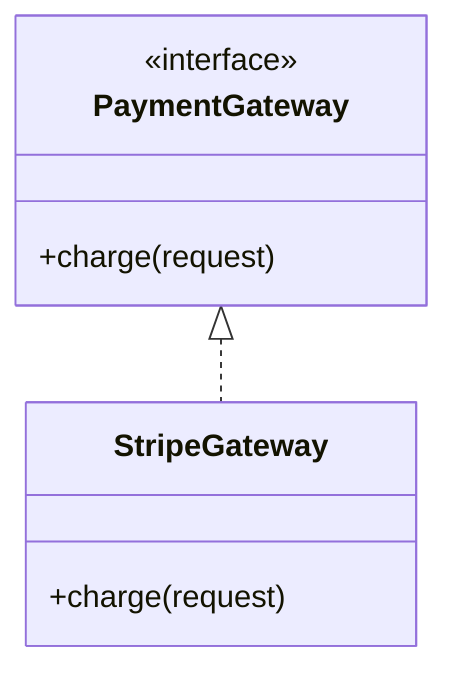
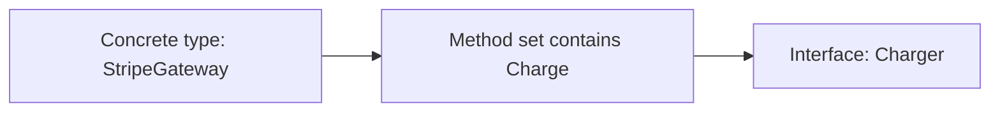
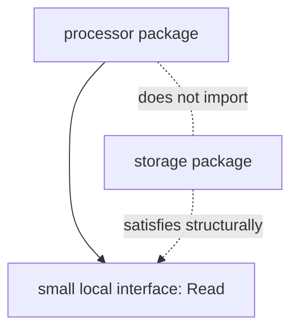
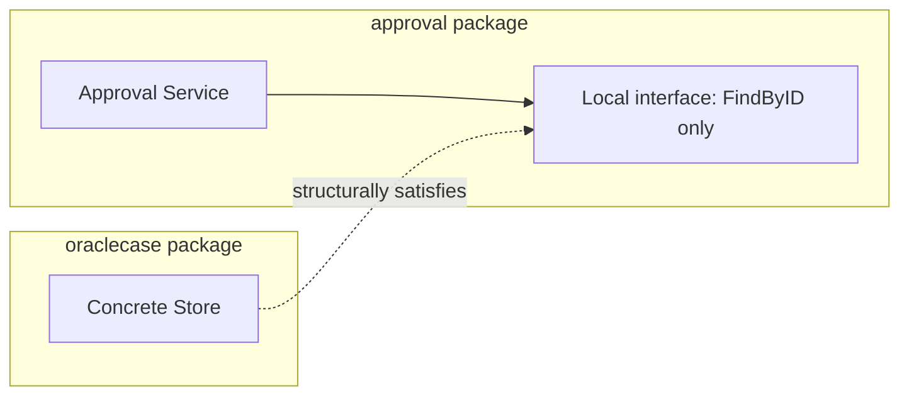
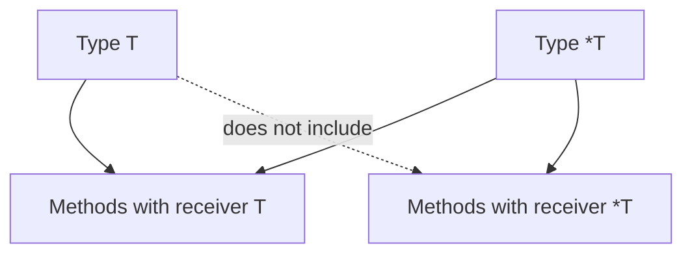
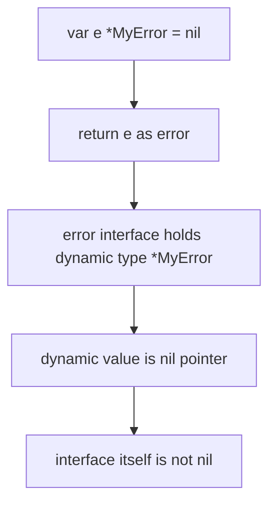
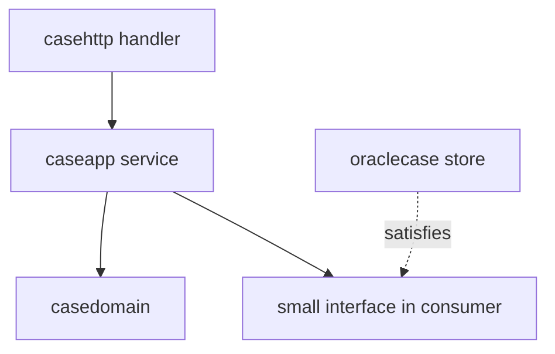
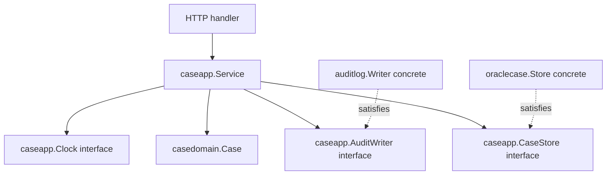
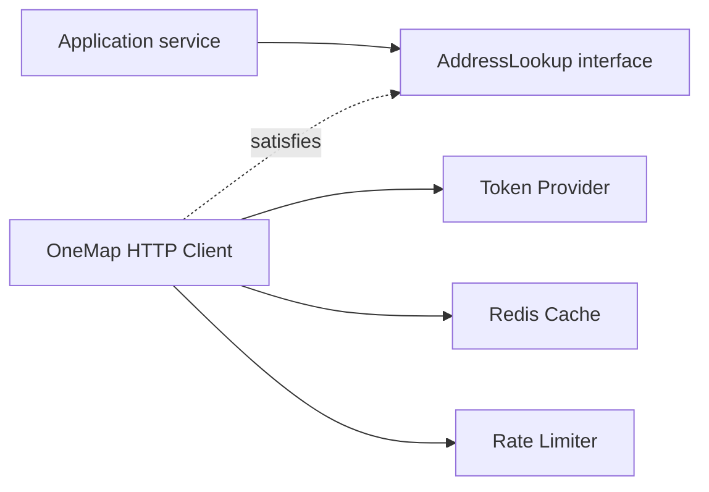

# learn-go-part-006.md

# Go Interfaces: Structural Typing, Implicit Implementation, Nil Interface Traps, dan API Boundary Design

> Series: `learn-go`  
> Part: `006` dari `034`  
> Target pembaca: Java software engineer yang ingin menguasai Go sampai level production-grade  
> Target Go: Go 1.26.x  
> Fokus: interface sebagai behavioral boundary, bukan class contract nominal

---

## 0. Ringkasan eksekutif

Interface adalah salah satu fitur paling penting di Go, tetapi juga salah satu yang paling sering disalahpahami oleh engineer dari Java.

Di Java, interface biasanya didefinisikan secara nominal:

```java
interface Repository {
    Case findById(String id);
}

class OracleRepository implements Repository {
    ...
}
```

Ada deklarasi eksplisit bahwa `OracleRepository implements Repository`.

Di Go, tidak ada deklarasi `implements`.

```go
type Repository interface {
    FindByID(ctx context.Context, id CaseID) (Case, error)
}

type OracleRepository struct {
    db *sql.DB
}

func (r *OracleRepository) FindByID(ctx context.Context, id CaseID) (Case, error) {
    // ...
}
```

`*OracleRepository` otomatis memenuhi `Repository` selama method set-nya cocok.

Konsekuensinya besar:

1. Interface di Go bukan “tipe yang harus diwarisi”.
2. Interface adalah behavioral contract.
3. Implementasi tidak perlu tahu interface yang akan memakainya.
4. Interface kecil lebih kuat daripada interface besar.
5. Interface sering lebih tepat didefinisikan di sisi consumer, bukan provider.
6. Nil interface adalah jebakan runtime yang tidak terlihat dari syntax.
7. Interface memengaruhi allocation, dynamic dispatch, testability, API stability, dan package dependency graph.

Part ini membangun mental model yang benar sebelum nanti masuk generics, error design, package architecture, testing, HTTP, database, dan service boundary.

---

## 1. Tujuan pembelajaran

Setelah menyelesaikan part ini, kamu harus bisa:

1. Menjelaskan perbedaan nominal typing Java dan structural typing Go.
2. Mendesain interface kecil yang merepresentasikan capability, bukan taxonomy.
3. Menentukan kapan harus memakai interface dan kapan harus return concrete type.
4. Memahami method set, pointer receiver, value receiver, dan implikasinya terhadap interface satisfaction.
5. Menghindari nil interface trap.
6. Menghindari premature interface dan mock-driven architecture yang lemah.
7. Mendesain API package yang stabil dengan dependency direction yang benar.
8. Membedakan interface untuk runtime polymorphism dan interface sebagai type constraint generics.
9. Membaca code review smell terkait interface.
10. Menerapkan interface dalam domain regulatory case management secara production-grade.

---

## 2. Sumber resmi yang menjadi basis

Part ini berbasis pada sumber resmi Go berikut:

- Go Language Specification: interface types, method sets, assignability, dynamic type, type assertions, type switches.
- Effective Go: interfaces and methods as idiomatic Go building blocks.
- Go Code Review Comments: guideline bahwa interface umumnya berada di package yang menggunakan interface, bukan package implementor.
- Go 1.18 release notes: interface modern juga digunakan sebagai type constraints untuk generics.
- Go 1.26 release notes: seri ini tetap menggunakan Go 1.26.x sebagai baseline stabil.

Catatan penting: Go 1.26 mempertahankan Go 1 compatibility promise. Artinya desain interface idiomatik tetap stabil, walaupun runtime, toolchain, dan library terus membaik.

---

## 3. Mental model utama

### 3.1 Java interface: nominal contract

Dalam Java, interface biasanya berarti:

```text
Class explicitly declares it implements interface.
Compiler checks by name.
Frameworks often discover it using reflection, annotations, proxies, or DI container.
```

Contoh:

```java
public interface PaymentGateway {
    PaymentResult charge(PaymentRequest request);
}

public final class StripeGateway implements PaymentGateway {
    @Override
    public PaymentResult charge(PaymentRequest request) {
        ...
    }
}
```

Hubungan type-nya eksplisit.



### 3.2 Go interface: structural capability

Dalam Go, interface berarti:

```text
A value satisfies an interface if its method set contains the required methods.
No explicit declaration is required.
The relationship is structural, not nominal.
```

Contoh:

```go
type Charger interface {
    Charge(ctx context.Context, req PaymentRequest) (PaymentResult, error)
}

type StripeGateway struct{}

func (StripeGateway) Charge(ctx context.Context, req PaymentRequest) (PaymentResult, error) {
    return PaymentResult{}, nil
}
```

`StripeGateway` memenuhi `Charger` tanpa menulis `implements Charger`.



Yang penting bukan nama class, bukan inheritance tree, melainkan behavior yang tersedia.

---

## 4. Interface adalah set method

Interface paling dasar:

```go
type Reader interface {
    Read(p []byte) (n int, err error)
}
```

Sebuah type memenuhi `Reader` kalau method set-nya punya:

```go
Read([]byte) (int, error)
```

Tidak harus berasal dari package yang sama.
Tidak harus tahu tentang `Reader`.
Tidak harus diberi annotation.
Tidak harus memakai inheritance.

### 4.1 Kenapa ini sangat kuat?

Karena producer dan consumer bisa berevolusi lebih longgar.

```go
package storage

type FileStore struct{}

func (s *FileStore) Read(p []byte) (int, error) {
    return 0, nil
}
```

Package lain bisa membuat interface sendiri:

```go
package processor

type reader interface {
    Read([]byte) (int, error)
}

func Process(r reader) error {
    // ...
    return nil
}
```

`processor` tidak perlu import `storage`. Ini menjaga dependency direction tetap bersih.



---

## 5. Interface kecil lebih idiomatik daripada interface besar

Di Java enterprise, interface sering dibuat besar:

```java
interface CaseService {
    Case create(CreateCaseRequest request);
    Case update(UpdateCaseRequest request);
    void delete(String id);
    Case approve(String id);
    Case reject(String id);
    Case escalate(String id);
    List<Case> search(SearchCaseRequest request);
    void export(String id);
    void audit(String id);
}
```

Di Go, desain seperti ini sering buruk karena:

1. Sulit dites tanpa membuat mock besar.
2. Caller dipaksa bergantung pada capability yang tidak dibutuhkan.
3. Implementasi menjadi god object.
4. Boundary menjadi tidak jelas.
5. Perubahan satu method bisa memecahkan banyak consumer.

Go lebih suka interface kecil:

```go
type CaseFinder interface {
    FindCase(ctx context.Context, id CaseID) (Case, error)
}

type CaseApprover interface {
    ApproveCase(ctx context.Context, cmd ApproveCaseCommand) error
}

type CaseAuditor interface {
    RecordAudit(ctx context.Context, event AuditEvent) error
}
```

Bukan karena kecil selalu benar, tetapi karena interface harus mewakili kebutuhan consumer.

### 5.1 Prinsip praktis

```text
Do not ask: “What does this implementation provide?”
Ask: “What does this consumer need?”
```

Contoh consumer:

```go
type ApprovalHandler struct {
    cases  CaseFinder
    policy ApprovalPolicy
    audit  CaseAuditor
}
```

Handler approval tidak perlu tahu cara `delete`, `export`, atau `search` case.

---

## 6. Interface belongs to the consumer

Ini salah satu guideline paling penting di Go.

### 6.1 Desain buruk: provider mendefinisikan interface untuk dirinya sendiri

```go
package oraclecase

type Repository interface {
    FindByID(ctx context.Context, id string) (CaseRow, error)
    Save(ctx context.Context, row CaseRow) error
    Delete(ctx context.Context, id string) error
}

type RepositoryImpl struct {
    db *sql.DB
}
```

Masalah:

1. Interface hanya menduplikasi concrete type.
2. Nama `RepositoryImpl` muncul karena interface dipaksakan.
3. Package provider menebak kebutuhan semua caller.
4. Sulit menambah method di concrete type tanpa diskusi contract.
5. Mocking jadi alasan utama interface, bukan desain boundary.

### 6.2 Desain lebih baik: provider return concrete type

```go
package oraclecase

type Store struct {
    db *sql.DB
}

func NewStore(db *sql.DB) *Store {
    return &Store{db: db}
}

func (s *Store) FindByID(ctx context.Context, id CaseID) (CaseRecord, error) {
    // ...
}

func (s *Store) Save(ctx context.Context, rec CaseRecord) error {
    // ...
}
```

Consumer mendefinisikan interface sesuai kebutuhannya:

```go
package approval

type CaseReader interface {
    FindByID(ctx context.Context, id CaseID) (CaseRecord, error)
}

type Service struct {
    cases CaseReader
}
```

Hasil:



Provider tidak bergantung pada consumer. Consumer tidak bergantung pada detail provider.

---

## 7. Method set: fondasi interface satisfaction

Interface satisfaction ditentukan oleh method set.

### 7.1 Value receiver

```go
type User struct {
    Name string
}

func (u User) DisplayName() string {
    return u.Name
}
```

Method `DisplayName` dengan value receiver tersedia untuk:

```go
User
*User
```

Artinya dua-duanya memenuhi interface:

```go
type Namer interface {
    DisplayName() string
}

var _ Namer = User{}
var _ Namer = (*User)(nil)
```

### 7.2 Pointer receiver

```go
type Counter struct {
    n int
}

func (c *Counter) Inc() {
    c.n++
}
```

Method `Inc` dengan pointer receiver tersedia untuk `*Counter`, bukan `Counter` sebagai interface assignment langsung.

```go
type Incrementer interface {
    Inc()
}

var _ Incrementer = (*Counter)(nil) // OK
// var _ Incrementer = Counter{}    // compile error
```

### 7.3 Kenapa `c.Inc()` bisa dipanggil pada value?

```go
var c Counter
c.Inc() // allowed
```

Compiler bisa otomatis mengambil address karena `c` addressable.

Tapi interface assignment berbeda:

```go
var x Incrementer = c // not allowed
```

Karena method set `Counter` tidak punya `Inc`; method set `*Counter` yang punya.

### 7.4 Mental model



### 7.5 Production implication

Kalau type punya mutable state, lock, cache, connection, buffer, atau identity, biasanya gunakan pointer receiver secara konsisten.

```go
type Store struct {
    db *sql.DB
}

func (s *Store) FindByID(ctx context.Context, id CaseID) (Case, error) {
    // ...
}

func (s *Store) Save(ctx context.Context, c Case) error {
    // ...
}
```

Jangan campur receiver tanpa alasan kuat:

```go
func (s Store) FindByID(...) (...) { ... }  // suspicious
func (s *Store) Save(...) error { ... }     // mixed receiver smell
```

---

## 8. Compile-time interface assertion

Karena Go tidak punya `implements`, kadang kita ingin assertion eksplisit.

```go
var _ CaseFinder = (*OracleStore)(nil)
```

Artinya: pastikan `*OracleStore` memenuhi `CaseFinder` saat compile time.

Ini tidak membuat runtime object.

### 8.1 Kapan berguna?

Berguna ketika:

1. Interface adalah public contract penting.
2. Concrete type memang dimaksudkan untuk memenuhi interface tertentu.
3. Kita ingin error compile-time yang jelas saat refactor.
4. Package implementor memang knowingly menyediakan implementation untuk external interface, misalnya plugin boundary.

Contoh:

```go
type HealthChecker interface {
    Check(ctx context.Context) error
}

type OracleHealthCheck struct {
    db *sql.DB
}

var _ HealthChecker = (*OracleHealthCheck)(nil)

func (h *OracleHealthCheck) Check(ctx context.Context) error {
    return h.db.PingContext(ctx)
}
```

### 8.2 Kapan tidak perlu?

Tidak perlu menulis assertion untuk semua interface kecil lokal.

```go
var _ io.Reader = (*bytes.Buffer)(nil) // pointless in app code
```

Assertion berlebihan membuat noise.

---

## 9. Empty interface dan `any`

Sejak Go 1.18, `any` adalah alias untuk `interface{}`.

```go
var x any
var y interface{}
```

Keduanya sama.

`any` berarti nilai apa pun bisa disimpan.

```go
func LogValue(v any) {
    fmt.Printf("%v\n", v)
}
```

### 9.1 Jangan salah mental model

`any` bukan berarti dynamic typing Go seperti JavaScript.

Go tetap statically typed. Nilai di dalam interface punya:

```text
static interface type
+
dynamic concrete type
+
dynamic value
```

### 9.2 Kapan `any` pantas?

Pantas untuk:

1. Logging metadata.
2. JSON-like unstructured values.
3. Generic container boundary sebelum type diketahui.
4. Interop reflection.
5. Testing helper.
6. Framework/adapter layer.

Tidak pantas untuk domain core:

```go
type Case struct {
    ID     any
    Status any
    Owner  any
}
```

Ini membuang type safety.

Gunakan domain types:

```go
type CaseID string
type CaseStatus string
type OfficerID string

type Case struct {
    ID     CaseID
    Status CaseStatus
    Owner  OfficerID
}
```

---

## 10. Interface value representation dan nil trap

Ini bagian yang sangat penting.

Interface value secara konseptual menyimpan dua hal:

```text
dynamic type
dynamic value
```

Interface bernilai nil hanya jika keduanya nil.

```text
interface value = (type=nil, value=nil) => nil
interface value = (type=*MyError, value=nil) => not nil
```

### 10.1 Contoh jebakan

```go
type MyError struct{}

func (e *MyError) Error() string {
    return "my error"
}

func doWork() error {
    var e *MyError = nil
    return e
}

func main() {
    err := doWork()
    fmt.Println(err == nil) // false
}
```

Kenapa false?

Karena return `e` sebagai `error` menghasilkan interface value:

```text
(type=*MyError, value=nil)
```

Itu bukan nil interface.

### 10.2 Diagram



### 10.3 Cara benar

Return nil secara eksplisit:

```go
func doWork() error {
    var e *MyError = nil
    if e != nil {
        return e
    }
    return nil
}
```

Atau lebih umum:

```go
func validate(input Input) error {
    if input.ID == "" {
        return ErrMissingID
    }
    return nil
}
```

### 10.4 Nil interface trap pada custom interface

```go
type Notifier interface {
    Notify(ctx context.Context, msg Message) error
}

type EmailNotifier struct{}

func (n *EmailNotifier) Notify(ctx context.Context, msg Message) error {
    return nil
}

func NewNotifier(enabled bool) Notifier {
    var n *EmailNotifier
    if enabled {
        n = &EmailNotifier{}
    }
    return n
}
```

Kalau `enabled == false`, return value bukan nil interface. Ia berisi `(*EmailNotifier, nil)`.

Lebih aman:

```go
func NewNotifier(enabled bool) Notifier {
    if !enabled {
        return nil
    }
    return &EmailNotifier{}
}
```

Atau gunakan no-op implementation:

```go
type NoopNotifier struct{}

func (NoopNotifier) Notify(ctx context.Context, msg Message) error {
    return nil
}

func NewNotifier(enabled bool) Notifier {
    if !enabled {
        return NoopNotifier{}
    }
    return &EmailNotifier{}
}
```

No-op object sering lebih baik daripada optional nil dependency.

---

## 11. Type assertion

Saat kamu punya interface, kadang perlu mengambil concrete type.

```go
v, ok := x.(ConcreteType)
```

Contoh:

```go
func describe(v any) string {
    s, ok := v.(string)
    if !ok {
        return "not a string"
    }
    return s
}
```

Tanpa `ok`, assertion bisa panic:

```go
s := v.(string) // panic if v is not string
```

Production code biasanya memakai comma-ok form.

### 11.1 Type assertion pada error

```go
type RetryableError struct {
    Cause error
}

func (e *RetryableError) Error() string {
    return e.Cause.Error()
}

func (e *RetryableError) Unwrap() error {
    return e.Cause
}
```

Lebih baik gunakan `errors.As` untuk wrapped error:

```go
var retryable *RetryableError
if errors.As(err, &retryable) {
    // retry logic
}
```

Daripada:

```go
if r, ok := err.(*RetryableError); ok {
    // misses wrapped errors
}
```

Ini akan dibahas lebih dalam di part error handling.

---

## 12. Type switch

Type switch berguna untuk branching berdasarkan dynamic type.

```go
func normalize(v any) string {
    switch x := v.(type) {
    case string:
        return strings.TrimSpace(x)
    case []byte:
        return strings.TrimSpace(string(x))
    case fmt.Stringer:
        return strings.TrimSpace(x.String())
    default:
        return fmt.Sprint(x)
    }
}
```

### 12.1 Jangan jadikan type switch sebagai pengganti polymorphism

Buruk:

```go
func Process(p Payment) error {
    switch x := p.(type) {
    case CreditCardPayment:
        return processCard(x)
    case BankTransferPayment:
        return processTransfer(x)
    case WalletPayment:
        return processWallet(x)
    default:
        return fmt.Errorf("unsupported payment")
    }
}
```

Lebih baik kalau behavior memang polymorphic:

```go
type Payment interface {
    Process(ctx context.Context) error
}
```

Namun type switch masih valid untuk:

1. Boundary parsing.
2. Adapter layer.
3. Serialization/deserialization.
4. Error classification.
5. Logging enrichment.
6. Migration compatibility.

---

## 13. Interface embedding

Interface bisa meng-embed interface lain.

```go
type Reader interface {
    Read([]byte) (int, error)
}

type Writer interface {
    Write([]byte) (int, error)
}

type ReadWriter interface {
    Reader
    Writer
}
```

Ini umum di standard library.

### 13.1 Composition of capabilities

```go
type CaseReader interface {
    FindByID(ctx context.Context, id CaseID) (Case, error)
}

type CaseWriter interface {
    Save(ctx context.Context, c Case) error
}

type CaseStore interface {
    CaseReader
    CaseWriter
}
```

### 13.2 Hati-hati interface terlalu besar

Interface embedding bisa menjadi cara halus membuat god interface.

```go
type Everything interface {
    CaseReader
    CaseWriter
    CaseApprover
    CaseRejecter
    CaseEscalator
    CaseExporter
    AuditWriter
    NotificationSender
}
```

Kalau sebagian besar consumer hanya butuh satu atau dua capability, interface ini terlalu besar.

---

## 14. Interface dan package boundary

Interface sangat memengaruhi arsitektur package.

### 14.1 Dependency direction yang sehat



Service mendefinisikan kebutuhan storage sebagai interface kecil.

```go
package caseapp

type CaseStore interface {
    FindByID(ctx context.Context, id casedomain.CaseID) (casedomain.Case, error)
    Save(ctx context.Context, c casedomain.Case) error
}

type Service struct {
    store CaseStore
}
```

Oracle adapter menyediakan concrete implementation.

```go
package oraclecase

type Store struct {
    db *sql.DB
}

func (s *Store) FindByID(ctx context.Context, id casedomain.CaseID) (casedomain.Case, error) {
    // ...
}

func (s *Store) Save(ctx context.Context, c casedomain.Case) error {
    // ...
}
```

Composition root menghubungkan keduanya.

```go
store := oraclecase.NewStore(db)
svc := caseapp.NewService(store)
```

### 14.2 Kenapa ini penting?

Karena Go tidak punya DI container sebagai default. Dependency graph adalah code biasa.

Keuntungannya:

1. Compile-time visible.
2. Mudah dibaca.
3. Mudah dites.
4. Tidak perlu annotation magic.
5. Tidak ada reflection-based wiring.
6. Startup failure lebih eksplisit.

---

## 15. Return concrete, accept interface

Guideline umum:

```text
Accept interfaces, return concrete types.
```

Tapi ini bukan hukum absolut.

### 15.1 Kenapa accept interface?

Function consumer hanya menyatakan capability yang dibutuhkan.

```go
func CopyCaseAudit(ctx context.Context, r AuditReader, w AuditWriter) error {
    // ...
}
```

Ini fleksibel.

### 15.2 Kenapa return concrete?

Provider bisa menambah method tanpa memecahkan interface.

```go
func NewStore(db *sql.DB) *Store {
    return &Store{db: db}
}
```

Kalau return interface:

```go
func NewStore(db *sql.DB) StoreInterface {
    return &store{db: db}
}
```

Caller kehilangan akses ke concrete behavior yang mungkin valid.
Provider juga mengunci public contract terlalu cepat.

### 15.3 Kapan boleh return interface?

Return interface masuk akal jika:

1. Concrete type memang harus disembunyikan.
2. Ada beberapa implementation internal.
3. Return value adalah behavioral abstraction, bukan concrete object.
4. Package ingin menjaga invariant kuat.
5. Factory memilih implementation berdasarkan config.

Contoh:

```go
func NewSigner(cfg SignerConfig) (crypto.Signer, error) {
    switch cfg.Kind {
    case "kms":
        return newKMSSigner(cfg)
    case "file":
        return newFileSigner(cfg)
    default:
        return nil, fmt.Errorf("unsupported signer kind: %s", cfg.Kind)
    }
}
```

Tetap hati-hati: jangan return interface hanya karena “lebih OOP”.

---

## 16. Interface dan testing

### 16.1 Jangan membuat interface hanya untuk mock

Anti-pattern:

```go
package userrepo

type Repository interface {
    FindByID(ctx context.Context, id string) (User, error)
    Save(ctx context.Context, user User) error
}

type RepositoryImpl struct{}
```

Alasan interface hanya “biar bisa mock”.

Lebih baik:

1. Pakai concrete type kalau memang concrete.
2. Test melalui public API.
3. Define small interface di consumer yang butuh substitution.
4. Gunakan fake implementation sederhana.

### 16.2 Fake lebih baik daripada mock besar

```go
type fakeCaseStore struct {
    cases map[CaseID]Case
}

func (f *fakeCaseStore) FindByID(ctx context.Context, id CaseID) (Case, error) {
    c, ok := f.cases[id]
    if !ok {
        return Case{}, ErrCaseNotFound
    }
    return c, nil
}

func (f *fakeCaseStore) Save(ctx context.Context, c Case) error {
    f.cases[c.ID] = c
    return nil
}
```

Test service:

```go
func TestService_Approve(t *testing.T) {
    store := &fakeCaseStore{
        cases: map[CaseID]Case{
            "CASE-001": NewSubmittedCase("CASE-001"),
        },
    }

    svc := NewService(store)

    err := svc.Approve(context.Background(), ApproveCommand{
        CaseID:     "CASE-001",
        OfficerID:  "OFFICER-1",
        DecisionID: "DEC-1",
    })
    if err != nil {
        t.Fatalf("Approve returned error: %v", err)
    }
}
```

### 16.3 Kenapa fake sering lebih baik?

Mock besar sering menguji interaksi terlalu detail.
Fake kecil menguji behavior.

Untuk domain workflow dan state machine, behavior biasanya lebih penting daripada “method X dipanggil sekali”.

---

## 17. Nil dependency: interface vs no-op

Misal service punya dependency optional:

```go
type Notifier interface {
    Notify(ctx context.Context, event CaseEvent) error
}
```

Desain yang sering rapuh:

```go
type Service struct {
    notifier Notifier
}

func (s *Service) Approve(ctx context.Context, cmd ApproveCommand) error {
    // ...
    if s.notifier != nil {
        return s.notifier.Notify(ctx, event)
    }
    return nil
}
```

Masalah:

1. Setiap call site harus ingat nil check.
2. Typed nil bisa lolos.
3. Optional behavior tersebar.

Lebih baik gunakan no-op implementation:

```go
type NoopNotifier struct{}

func (NoopNotifier) Notify(ctx context.Context, event CaseEvent) error {
    return nil
}
```

Constructor menjaga invariant:

```go
func NewService(store CaseStore, notifier Notifier) *Service {
    if notifier == nil {
        notifier = NoopNotifier{}
    }
    return &Service{
        store:    store,
        notifier: notifier,
    }
}
```

Sekarang service tidak perlu nil check di business flow.

---

## 18. Interface dan error design

`error` di Go adalah interface:

```go
type error interface {
    Error() string
}
```

Itu berarti semua type yang punya method `Error() string` memenuhi `error`.

```go
type ValidationError struct {
    Field string
    Rule  string
}

func (e ValidationError) Error() string {
    return fmt.Sprintf("invalid %s: %s", e.Field, e.Rule)
}
```

Karena `error` adalah interface, semua konsep part ini berlaku:

1. Nil interface trap.
2. Type assertion.
3. Type switch.
4. Small behavioral interfaces.
5. Wrapping.
6. `errors.Is` dan `errors.As`.

Contoh behavioral error interface:

```go
type Temporary interface {
    Temporary() bool
}
```

Atau:

```go
type Retryable interface {
    Retryable() bool
}
```

Namun hati-hati: interface error classification harus stabil dan jelas.

---

## 19. Interface dan allocation/performance

Interface bisa menyebabkan dynamic dispatch dan kadang allocation, terutama ketika value harus escape ke heap.

Contoh:

```go
func Use(w io.Writer, data []byte) error {
    _, err := w.Write(data)
    return err
}
```

Ini idiomatik dan biasanya baik.

Namun dalam hot path yang sangat ketat, interface dispatch bisa menjadi biaya yang perlu diukur.

### 19.1 Jangan premature optimize

Jangan menolak interface hanya karena “performance”. Ukur dulu dengan benchmark.

Interface overhead biasanya kecil dibanding:

1. Network I/O.
2. Database query.
3. JSON encode/decode.
4. Logging sync write.
5. Allocation besar.
6. Lock contention.

### 19.2 Kapan perlu peduli?

Peduli jika:

1. Function dipanggil jutaan kali per detik.
2. Inner loop CPU-bound.
3. Allocation profile menunjukkan boxing/interface conversion.
4. pprof menunjukkan dynamic dispatch area signifikan.
5. Generic implementation bisa menghilangkan interface overhead.

Ini akan dibahas lagi di part memory, benchmarking, dan generics.

---

## 20. Interface vs generics

Sejak Go 1.18, interface juga bisa menjadi type constraint.

Ada dua peran interface modern:

```text
1. Runtime interface:
   Value can hold different dynamic concrete types.

2. Constraint interface:
   Describes allowed type set for generic code.
```

### 20.1 Runtime interface

```go
type Writer interface {
    Write([]byte) (int, error)
}

func Save(w Writer, data []byte) error {
    _, err := w.Write(data)
    return err
}
```

`w` adalah interface value runtime.

### 20.2 Constraint interface

```go
type Ordered interface {
    ~int | ~int64 | ~float64 | ~string
}

func Min[T Ordered](a, b T) T {
    if a < b {
        return a
    }
    return b
}
```

`Ordered` di sini bukan untuk menyimpan runtime value. Ia membatasi type parameter.

### 20.3 Jangan mencampur mental model

Interface dengan type set seperti ini tidak bisa dipakai sebagai ordinary value interface jika mengandung type terms tertentu.

Generics akan dibahas detail di part 007.

---

## 21. Production example: regulatory case approval boundary

Kita buat contoh yang realistis.

### 21.1 Domain

```go
package casedomain

import "time"

type CaseID string
type OfficerID string

type CaseStatus string

const (
    CaseStatusSubmitted CaseStatus = "SUBMITTED"
    CaseStatusApproved  CaseStatus = "APPROVED"
    CaseStatusRejected  CaseStatus = "REJECTED"
)

type Case struct {
    ID        CaseID
    Status    CaseStatus
    UpdatedAt time.Time
}

func (c Case) CanApprove() bool {
    return c.Status == CaseStatusSubmitted
}

func (c Case) Approve(now time.Time) (Case, error) {
    if !c.CanApprove() {
        return Case{}, ErrInvalidTransition
    }
    c.Status = CaseStatusApproved
    c.UpdatedAt = now
    return c, nil
}
```

### 21.2 Application service defines required ports

```go
package caseapp

import (
    "context"
    "time"

    "example.com/aceas/casedomain"
)

type CaseStore interface {
    FindByID(ctx context.Context, id casedomain.CaseID) (casedomain.Case, error)
    Save(ctx context.Context, c casedomain.Case) error
}

type AuditWriter interface {
    Record(ctx context.Context, event AuditEvent) error
}

type Clock interface {
    Now() time.Time
}

type Service struct {
    store CaseStore
    audit AuditWriter
    clock Clock
}
```

### 21.3 Constructor protects invariants

```go
type systemClock struct{}

func (systemClock) Now() time.Time { return time.Now().UTC() }

type noopAuditWriter struct{}

func (noopAuditWriter) Record(ctx context.Context, event AuditEvent) error {
    return nil
}

func NewService(store CaseStore, audit AuditWriter, clock Clock) *Service {
    if store == nil {
        panic("caseapp: nil CaseStore")
    }
    if audit == nil {
        audit = noopAuditWriter{}
    }
    if clock == nil {
        clock = systemClock{}
    }
    return &Service{
        store: store,
        audit: audit,
        clock: clock,
    }
}
```

Kenapa panic di constructor untuk `store`?

Karena service tanpa store adalah programmer error. Ini bukan runtime business error yang bisa dipulihkan user.

### 21.4 Use case implementation

```go
type ApproveCommand struct {
    CaseID    casedomain.CaseID
    OfficerID casedomain.OfficerID
    Reason    string
}

func (s *Service) Approve(ctx context.Context, cmd ApproveCommand) error {
    c, err := s.store.FindByID(ctx, cmd.CaseID)
    if err != nil {
        return fmt.Errorf("find case %s: %w", cmd.CaseID, err)
    }

    approved, err := c.Approve(s.clock.Now())
    if err != nil {
        return fmt.Errorf("approve case %s: %w", cmd.CaseID, err)
    }

    if err := s.store.Save(ctx, approved); err != nil {
        return fmt.Errorf("save approved case %s: %w", cmd.CaseID, err)
    }

    event := AuditEvent{
        CaseID:    cmd.CaseID,
        OfficerID: cmd.OfficerID,
        Action:    "CASE_APPROVED",
        Reason:    cmd.Reason,
    }

    if err := s.audit.Record(ctx, event); err != nil {
        return fmt.Errorf("record audit for case %s: %w", cmd.CaseID, err)
    }

    return nil
}
```

### 21.5 Dependency graph



Ini adalah Go-style hexagonal design tanpa framework magic.

---

## 22. Interface naming

Go convention untuk single-method interface sering memakai suffix `-er`:

```go
type Reader interface { Read([]byte) (int, error) }
type Writer interface { Write([]byte) (int, error) }
type Closer interface { Close() error }
type Stringer interface { String() string }
```

Untuk domain, tidak semua harus `-er`, tapi tetap fokus pada capability.

Baik:

```go
type CaseFinder interface { ... }
type AuditRecorder interface { ... }
type TokenSigner interface { ... }
type PolicyEvaluator interface { ... }
```

Kurang baik:

```go
type ICaseService interface { ... }
type CaseServiceInterface interface { ... }
type AbstractCaseManager interface { ... }
```

Go tidak memakai prefix `I` sebagai convention umum.

---

## 23. Interface pollution

Interface pollution terjadi ketika codebase punya terlalu banyak interface yang tidak membawa abstraction nyata.

Contoh smell:

```go
type UserService interface {
    CreateUser(ctx context.Context, req CreateUserRequest) (User, error)
}

type UserServiceImpl struct{}
```

Kalau hanya ada satu implementasi dan interface berada di package implementor, ini kemungkinan Java habit.

### 23.1 Pertanyaan code review

Tanyakan:

1. Siapa consumer interface ini?
2. Apakah consumer butuh semua method?
3. Apakah ada lebih dari satu implementation yang meaningful?
4. Apakah interface ini memperbaiki dependency direction?
5. Apakah interface ini hanya dibuat untuk mock?
6. Apakah concrete type lebih tepat direturn?
7. Apakah interface ini stabil secara semantic?

Kalau jawabannya lemah, hapus interface.

---

## 24. Interface dan API stability

Menambah method ke public interface adalah breaking change.

```go
type Store interface {
    FindByID(ctx context.Context, id CaseID) (Case, error)
}
```

Jika nanti diubah:

```go
type Store interface {
    FindByID(ctx context.Context, id CaseID) (Case, error)
    Save(ctx context.Context, c Case) error
}
```

Semua implementor external rusak.

Sebaliknya, menambah method ke concrete type biasanya aman.

```go
type Store struct{}

func (s *Store) FindByID(...) (...) { ... }
func (s *Store) Save(...) error { ... } // usually non-breaking
```

Ini alasan kuat untuk return concrete type dari provider.

---

## 25. Interface dan versioning

Untuk public module, interface harus diperlakukan seperti API contract keras.

Checklist sebelum publish public interface:

1. Apakah method names stabil?
2. Apakah parameter domain type sudah benar?
3. Apakah context harus ada?
4. Apakah error contract jelas?
5. Apakah cancellation behavior didefinisikan?
6. Apakah caller boleh retry?
7. Apakah implementor external mungkin ada?
8. Apakah interface terlalu luas?
9. Apakah future extension akan breaking?
10. Apakah lebih baik pakai concrete type?

### 25.1 Extension pattern

Alih-alih menambah method ke interface lama, buat interface tambahan.

```go
type Finder interface {
    FindByID(ctx context.Context, id CaseID) (Case, error)
}

type BatchFinder interface {
    FindBatch(ctx context.Context, ids []CaseID) ([]Case, error)
}
```

Consumer yang butuh batch bisa test capability:

```go
if bf, ok := store.(BatchFinder); ok {
    return bf.FindBatch(ctx, ids)
}
```

Hati-hati: capability probing seperti ini jangan berlebihan, tapi berguna untuk optional optimization.

---

## 26. Interface dan observability boundary

Interface bukan hanya untuk storage atau external API. Bisa juga untuk observability boundary.

```go
type EventRecorder interface {
    Record(ctx context.Context, event Event)
}
```

Namun jangan membuat logger interface besar tanpa alasan.

Go 1.21+ punya `log/slog` di standard library. Banyak aplikasi cukup menerima `*slog.Logger` sebagai concrete type.

Buruk:

```go
type Logger interface {
    Debug(msg string, args ...any)
    Info(msg string, args ...any)
    Warn(msg string, args ...any)
    Error(msg string, args ...any)
    With(args ...any) Logger
    WithGroup(name string) Logger
}
```

Sering hanya menduplikasi `slog`.

Lebih sederhana:

```go
type Service struct {
    log *slog.Logger
}
```

Buat interface observability hanya jika consumer benar-benar butuh abstraction behavior khusus, misalnya audit recorder yang domain-significant.

---

## 27. Interface dan context

Jika method melakukan I/O, blocking, network call, database call, lock wait panjang, atau operasi yang bisa dibatalkan, biasanya parameter pertama adalah `context.Context`.

```go
type CaseStore interface {
    FindByID(ctx context.Context, id CaseID) (Case, error)
}
```

Jangan simpan context dalam struct:

```go
type Store struct {
    ctx context.Context // bad smell
}
```

Context adalah request-scoped, bukan object-scoped.

Ini akan dibahas detail di part context propagation.

---

## 28. Interface design for external systems

Misal integrasi OneMap/token provider/external identity.

Buruk:

```go
type OneMapClient interface {
    Login(ctx context.Context) (Token, error)
    Refresh(ctx context.Context) (Token, error)
    SearchPostalCode(ctx context.Context, postal string) (Address, error)
    ReverseGeocode(ctx context.Context, lat, lon float64) (Address, error)
    Health(ctx context.Context) error
    Metrics() Metrics
}
```

Consumer postal lookup hanya butuh:

```go
type AddressLookup interface {
    LookupPostalCode(ctx context.Context, postal PostalCode) (Address, error)
}
```

Token refresh, rate limit, metrics, dan HTTP details adalah internal adapter concern.



Interface consumer tetap kecil. Adapter internal bisa kompleks.

---

## 29. Anti-patterns

### 29.1 `I` prefix

```go
type IUserRepository interface { ... }
```

Ini Java/C# habit. Go convention tidak membutuhkannya.

### 29.2 Interface + Impl pair

```go
type CaseService interface { ... }
type CaseServiceImpl struct { ... }
```

Biasanya smell. Gunakan:

```go
type Service struct { ... }
```

Atau interface kecil di consumer.

### 29.3 God interface

```go
type Platform interface {
    CreateCase(...)
    ApproveCase(...)
    RejectCase(...)
    SearchCase(...)
    SendEmail(...)
    GenerateReport(...)
    ExportCSV(...)
    CheckPermission(...)
}
```

Ini bukan abstraction; ini dumping ground.

### 29.4 Return interface by default

```go
func NewService() ServiceInterface { ... }
```

Biasanya lebih baik:

```go
func NewService(...) *Service { ... }
```

### 29.5 Accept `any` untuk domain input

```go
func Approve(ctx context.Context, input any) error
```

Ini membuang compile-time validation.

Gunakan command type:

```go
func Approve(ctx context.Context, cmd ApproveCommand) error
```

### 29.6 Interface with implementation detail methods

```go
type Store interface {
    FindByID(...)
    DB() *sql.DB
    TableName() string
}
```

Jika caller butuh `DB()`, abstraction bocor.

### 29.7 Nil interface dependency

```go
var notifier *EmailNotifier = nil
svc := NewService(notifier) // as Notifier => non-nil interface trap
```

Gunakan constructor guard dan no-op implementation.

---

## 30. Design checklist

Saat membuat interface, gunakan checklist berikut.

### 30.1 Necessity

- Apakah ada consumer nyata?
- Apakah interface mengurangi coupling?
- Apakah concrete type lebih sederhana?
- Apakah ini hanya dibuat untuk mock?

### 30.2 Size

- Apakah interface punya satu capability jelas?
- Apakah semua method selalu dibutuhkan bersama?
- Apakah method bisa dipisah menjadi reader/writer/evaluator/recorder?

### 30.3 Placement

- Apakah interface berada di package consumer?
- Apakah provider sebaiknya return concrete type?
- Apakah dependency direction tetap satu arah?

### 30.4 Semantics

- Apa error contract-nya?
- Apakah method blocking?
- Apakah butuh context?
- Apakah retry behavior jelas?
- Apakah nil input valid?
- Apakah zero value meaningful?

### 30.5 Stability

- Apakah interface public?
- Apakah future extension akan breaking?
- Apakah method names domain-stable?
- Apakah parameter types domain-stable?

### 30.6 Testing

- Apakah fake implementation mudah dibuat?
- Apakah test menguji behavior, bukan implementation detail?
- Apakah interface terlalu besar sehingga fake menjadi kompleks?

---

## 31. Hands-on lab

### Lab 1: Refactor Java-style service interface

Mulai dari desain buruk:

```go
type CaseService interface {
    Create(ctx context.Context, req CreateRequest) (Case, error)
    Find(ctx context.Context, id CaseID) (Case, error)
    Approve(ctx context.Context, id CaseID) error
    Reject(ctx context.Context, id CaseID) error
    Escalate(ctx context.Context, id CaseID) error
    Export(ctx context.Context, id CaseID) ([]byte, error)
}

type CaseServiceImpl struct{}
```

Tugas:

1. Ganti `CaseServiceImpl` menjadi concrete `Service`.
2. Pecah dependency menjadi interface kecil di consumer.
3. Return concrete `*Service` dari constructor.
4. Buat fake untuk test approval.

### Lab 2: Nil interface trap

Tulis program yang menunjukkan:

```go
var err *MyError = nil
return err
```

Lalu perbaiki agar `err == nil` benar.

### Lab 3: Method set

Buat type:

```go
type Counter struct { n int }
func (c *Counter) Inc() {}
func (c Counter) Value() int { return c.n }
```

Buat interface:

```go
type Incrementer interface { Inc() }
type Valuer interface { Value() int }
type CounterLike interface {
    Incrementer
    Valuer
}
```

Uji compile-time assertion untuk `Counter` dan `*Counter`.

### Lab 4: Consumer-owned interface

Buat tiga package konseptual:

```text
caseapp
oraclecase
auditlog
```

`caseapp` mendefinisikan interface kecil.
`oraclecase.Store` dan `auditlog.Writer` memenuhi interface tanpa import `caseapp` jika memungkinkan.
Composition root menghubungkan dependency.

### Lab 5: Interface extension

Buat `Finder` dan optional `BatchFinder`.
Implementasikan fallback:

```go
func FindMany(ctx context.Context, f Finder, ids []CaseID) ([]Case, error) {
    if bf, ok := f.(BatchFinder); ok {
        return bf.FindBatch(ctx, ids)
    }
    // fallback one by one
}
```

Diskusikan kapan pattern ini baik dan kapan terlalu clever.

---

## 32. Review questions

1. Apa perbedaan nominal typing dan structural typing?
2. Kenapa interface di Go sering lebih baik berada di package consumer?
3. Kenapa provider biasanya return concrete type?
4. Apa beda method set `T` dan `*T`?
5. Kenapa `var _ Interface = (*Type)(nil)` berguna?
6. Kenapa `error` adalah interface?
7. Apa itu nil interface trap?
8. Kapan `any` boleh dipakai?
9. Apa bahaya interface besar?
10. Apa tanda interface pollution?
11. Apa beda runtime interface dan generic constraint interface?
12. Bagaimana interface memengaruhi API compatibility?
13. Kapan return interface boleh dilakukan?
14. Kenapa fake sering lebih baik daripada mock besar?
15. Bagaimana interface membantu dependency direction?

---

## 33. Production code review rubric

Gunakan rubric ini saat review PR Go yang memakai interface.

### 33.1 Red flags

- Interface berada di package implementor tanpa consumer jelas.
- Ada pasangan `ThingInterface` dan `ThingImpl`.
- Interface memiliki banyak method yang tidak selalu dipakai bersama.
- Constructor return interface tanpa alasan kuat.
- Domain menggunakan `any`.
- Mock terlalu besar.
- Nil dependency dicek di banyak method.
- Interface mengandung implementation detail.
- Method tidak menerima `context.Context` padahal melakukan I/O.
- Error contract tidak jelas.
- Public interface mudah butuh method tambahan di masa depan.

### 33.2 Green flags

- Interface kecil dan behavior-oriented.
- Interface berada dekat consumer.
- Provider return concrete type.
- Constructor menjaga invariant dependency.
- Optional dependency memakai no-op implementation.
- Fake test sederhana.
- Interface membantu package dependency graph.
- Method names domain-specific dan stabil.
- Context dan error semantics jelas.
- Public API tidak premature abstraction.

---

## 34. Mental model final

Interface di Go bukan alat untuk membangun hierarchy.

Interface di Go adalah cara untuk mengatakan:

```text
Untuk menyelesaikan pekerjaan ini, saya hanya membutuhkan behavior ini.
Saya tidak peduli concrete type-nya apa.
```

Itu perbedaan besar dari banyak desain Java enterprise yang dimulai dari:

```text
Mari buat interface untuk semua service agar terlihat clean architecture.
```

Dalam Go, clean design biasanya muncul dari:

1. Concrete type yang jelas.
2. Package boundary yang sederhana.
3. Interface kecil di sisi consumer.
4. Dependency graph eksplisit.
5. Error contract eksplisit.
6. Nil behavior aman.
7. Testing dengan fake yang behavior-oriented.

---

## 35. Invariants yang harus diingat

1. Type memenuhi interface secara implicit berdasarkan method set.
2. Interface adalah behavioral contract, bukan inheritance contract.
3. Interface kecil lebih kuat daripada interface besar.
4. Interface biasanya didefinisikan oleh consumer.
5. Provider biasanya return concrete type.
6. Menambah method ke public interface adalah breaking change.
7. Value receiver method tersedia untuk `T` dan `*T`.
8. Pointer receiver method hanya ada di method set `*T`.
9. Interface nil hanya jika dynamic type dan dynamic value sama-sama nil.
10. `any` adalah alias `interface{}`, bukan alasan menghapus type safety.
11. `error` adalah interface, sehingga nil trap juga berlaku untuk error.
12. Interface bukan pengganti package design.
13. Jangan membuat interface hanya karena ingin mock.
14. Fake kecil sering lebih sehat daripada mock besar.
15. Runtime interface berbeda dari generic constraint interface.

---

## 36. Koneksi ke part berikutnya

Part berikutnya adalah:

```text
learn-go-part-007.md
Generics: Type Parameters, Constraints, Type Sets, Generic API Design, dan Java Generics Comparison
```

Generics di Go tidak menggantikan interface. Keduanya menjawab masalah berbeda:

```text
Interface runtime:
  “Saya butuh value yang punya behavior tertentu.”

Generics:
  “Saya ingin menulis algoritma/type yang reusable untuk beberapa concrete type dengan compile-time type safety.”
```

Memahami interface dengan benar membuat generics jauh lebih mudah dipahami.

---

## 37. Referensi

- Go Language Specification — Interface types, method sets, assignability, type assertions, type switches: https://go.dev/ref/spec
- Effective Go — Interfaces and methods: https://go.dev/doc/effective_go
- Go Code Review Comments — Interfaces: https://go.dev/wiki/CodeReviewComments#interfaces
- Go 1.18 Release Notes — Type parameters and interfaces as type sets: https://go.dev/doc/go1.18
- Go 1.26 Release Notes: https://go.dev/doc/go1.26
- Go Release History: https://go.dev/doc/devel/release

<!-- NAVIGATION_FOOTER -->
<div class="page-nav">
<a href="./learn-go-part-005.md">⬅️ Go Composition over Inheritance: Embedding, Method Promotion, dan Object Modelling tanpa Class Hierarchy</a>
<a href="./index.md">📚 Kategori</a>
<a href="../../index.md">🏠 Home</a>
<a href="./learn-go-part-007.md">Go Generics: Type Parameters, Constraints, Type Sets, dan Generic API Design ➡️</a>
</div>
