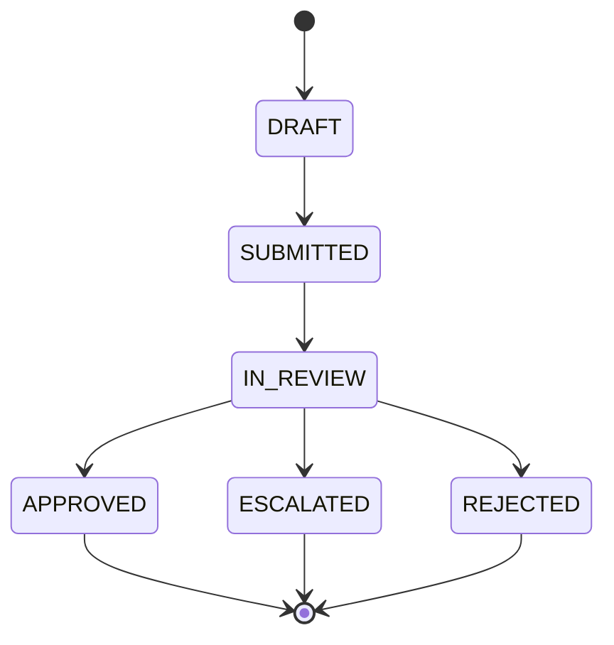

# learn-go-part-007.md

# Go Generics: Type Parameters, Constraints, Type Sets, dan Generic API Design

> Series: `learn-go`  
> Part: `007` dari `034`  
> Target pembaca: Java software engineer yang ingin menguasai Go sampai level production engineering  
> Target Go version: Go 1.26.x  
> Fokus: generics sebagai alat desain API, bukan sekadar fitur syntax

---

## 0. Posisi Part Ini Dalam Seri

Sampai titik ini kita sudah membangun fondasi berikut:

```text
part 000: orientasi dan mental model Go
part 001: toolchain, module, build, go command
part 002: syntax core
part 003: functions, defer, panic/recover, cleanup
part 004: type system, struct, method, receiver
part 005: composition over inheritance
part 006: interface dan API boundary
part 007: generics
```

Part ini membahas **generics**. Untuk Java engineer, generics terlihat familiar, tetapi Go generics memiliki tujuan dan batasan yang berbeda.

Di Java, generics sering menjadi bagian dari desain object-oriented, collection framework, inheritance hierarchy, dan framework abstraction. Di Go, generics adalah alat untuk mengekspresikan **type-parametric code** tanpa kehilangan kesederhanaan Go.

Go generics bukan pengganti interface. Bukan juga alasan untuk membuat framework besar. Generics adalah alat yang tepat ketika kita ingin menulis algoritma atau struktur data yang berlaku untuk beberapa type dengan constraint eksplisit.

---

## 1. Tujuan Pembelajaran

Setelah menyelesaikan part ini, kamu harus bisa:

1. Memahami perbedaan generics Go dan Java secara konseptual.
2. Membaca dan menulis generic function.
3. Membaca dan menulis generic type.
4. Memahami constraint sebagai **set of permitted types**.
5. Memahami `any`, `comparable`, `~T`, union type terms, dan method constraints.
6. Memahami kapan generics lebih tepat daripada interface.
7. Memahami kapan interface lebih tepat daripada generics.
8. Mendesain generic API yang kecil, stabil, dan tidak over-engineered.
9. Mengenali anti-pattern generics di Go.
10. Memahami perubahan relevan Go 1.26 terkait recursive/self-referential generic constraints.
11. Menerapkan generics untuk domain engineering tanpa membuat kode menjadi abstrak berlebihan.

---

## 2. Sumber Resmi dan Baseline Fakta

Materi ini disusun berdasarkan baseline berikut:

- The Go Programming Language Specification: https://go.dev/ref/spec
- Tutorial resmi Go generics: https://go.dev/doc/tutorial/generics
- Blog resmi Go: An Introduction to Generics: https://go.dev/blog/intro-generics
- Blog resmi Go: Generic interfaces: https://go.dev/blog/generic-interfaces
- Blog resmi Go: Goodbye core types: https://go.dev/blog/coretypes
- Go 1.26 Release Notes: https://go.dev/doc/go1.26

Poin penting dari sumber resmi:

1. Type parameter adalah type yang belum dipilih sampai generic function/type diinstansiasi.
2. Constraint menentukan type argument yang valid untuk type parameter.
3. Constraint diekspresikan dengan interface.
4. Interface constraint bisa berisi method requirement dan type terms.
5. `any` adalah alias dari `interface{}`.
6. `comparable` adalah built-in constraint untuk type yang bisa dibandingkan dengan `==` dan `!=`.
7. Go 1.26 mengangkat restriction bahwa generic type tidak boleh merujuk dirinya sendiri di type parameter list; ini memungkinkan self-referential generic constraints.

---

## 3. Mental Model Utama

### 3.1 Generics bukan inheritance

Generics di Go tidak menambahkan inheritance. Tidak ada generic superclass. Tidak ada wildcard covariance/contravariance seperti Java. Tidak ada `List<? extends Foo>` atau `List<? super Foo>`.

Go generics lebih dekat ke:

```text
Saya ingin menulis satu fungsi/type,
tetapi beberapa type konkret boleh digunakan,
selama type tersebut memenuhi constraint tertentu.
```

Contoh paling sederhana:

```go
func First[T any](items []T) (T, bool) {
	if len(items) == 0 {
		var zero T
		return zero, false
	}
	return items[0], true
}
```

`T` adalah type parameter. `any` artinya `T` boleh type apa saja.

---

### 3.2 Constraint adalah contract terhadap type, bukan object behavior saja

Interface biasa di Go biasanya mendeskripsikan behavior:

```go
type Writer interface {
	Write(p []byte) (n int, err error)
}
```

Constraint pada generics juga interface, tetapi bisa mendeskripsikan **set of types**:

```go
type Integer interface {
	~int | ~int8 | ~int16 | ~int32 | ~int64 |
		~uint | ~uint8 | ~uint16 | ~uint32 | ~uint64 | ~uintptr
}
```

Ini bukan interface runtime biasa yang digunakan sebagai value. Ini constraint compile-time.

---

### 3.3 Generics adalah compile-time polymorphism, interface adalah runtime polymorphism

Secara desain mental:

```text
Generic:
  caller memilih type saat compile-time
  function/type bekerja untuk family of types
  cocok untuk algorithm/data structure/value transformation

Interface:
  value membawa dynamic concrete type saat runtime
  caller/callee berinteraksi lewat behavior
  cocok untuk dependency boundary, plugin, IO, service abstraction
```

Diagram:

```mermaid
flowchart TD
    A[Need abstraction?] --> B{Abstraction over behavior at runtime?}
    B -->|Yes| C[Use interface]
    B -->|No| D{Same algorithm over multiple concrete types?}
    D -->|Yes| E[Use generics]
    D -->|No| F[Use concrete type]

    C --> C1[io.Reader, Store, Clock, Notifier]
    E --> E1[Set[T], MapValues, Min, Result[T], Queue[T]]
    F --> F1[Keep it simple]
```

---

## 4. Java Generics vs Go Generics

### 4.1 Perbandingan singkat

| Aspek | Java | Go |
|---|---|---|
| Polymorphism utama | Class/interface hierarchy | Interface + composition + generics terbatas |
| Constraint | `T extends Foo` | `T Constraint` |
| Wildcard | `? extends`, `? super` | Tidak ada wildcard |
| Variance | Kompleks di generic collections | Tidak ada variance generics seperti Java |
| Erasure | Type erasure historis | Implementasi compiler/runtime Go berbeda, tidak perlu dimodelkan seperti Java erasure |
| Primitive generic | Tidak bisa langsung generic atas primitive tanpa boxing historis | Bisa generic atas `int`, `string`, struct, dll |
| Constraint by operator | Tidak langsung | Bisa lewat type set, misalnya `~int | ~float64` |
| Interface implementation | Nominal | Structural/implicit |
| Runtime reflection pattern | Banyak framework pakai reflection | Go mendorong explicit code dan standard library |

---

### 4.2 Kesalahan transfer mental dari Java

Kesalahan umum Java engineer saat belajar Go generics:

```text
1. Membuat generic abstraction terlalu awal.
2. Mengubah semua interface menjadi generic interface.
3. Membuat generic repository ala Java Spring Data.
4. Membuat hierarchy constraint panjang.
5. Membuat type parameter hanya supaya terlihat reusable.
6. Menganggap generics menggantikan interface.
7. Mengabaikan zero value dan error contract.
8. Membuat API sulit dibaca karena type parameter terlalu banyak.
```

Go lebih menghargai API yang eksplisit daripada abstraction yang terlalu pintar.

---

## 5. Generic Function

### 5.1 Bentuk dasar

```go
func Identity[T any](v T) T {
	return v
}
```

Pemanggilan:

```go
x := Identity[int](10)
y := Identity("hello") // type inference
```

Go bisa menginfer type argument dari argument function jika cukup jelas.

---

### 5.2 Generic function untuk slice

```go
func Contains[T comparable](items []T, target T) bool {
	for _, item := range items {
		if item == target {
			return true
		}
	}
	return false
}
```

Kenapa constraint-nya `comparable`?

Karena fungsi ini memakai `==`:

```go
if item == target
```

Tidak semua type di Go bisa dibandingkan dengan `==`. Slice, map, dan function tidak comparable. Maka constraint harus membatasi `T` ke type yang comparable.

---

### 5.3 Generic function dengan transformasi

```go
func MapSlice[A any, B any](items []A, fn func(A) B) []B {
	out := make([]B, 0, len(items))
	for _, item := range items {
		out = append(out, fn(item))
	}
	return out
}
```

Contoh:

```go
ids := []int64{101, 102, 103}
labels := MapSlice(ids, func(id int64) string {
	return fmt.Sprintf("CASE-%d", id)
})
```

Ini valid, tetapi harus dipakai dengan hati-hati. Go bukan bahasa yang mendorong pipeline functional abstrak berlebihan. Kadang `for` loop biasa lebih jelas.

---

### 5.4 Generic function dengan zero value

```go
func First[T any](items []T) (T, bool) {
	if len(items) == 0 {
		var zero T
		return zero, false
	}
	return items[0], true
}
```

Kenapa tidak return `nil`?

Karena `T` bisa saja `int`, `struct`, `bool`, atau type lain yang bukan nil-able. Maka pattern Go yang benar adalah return `(T, bool)`.

---

## 6. Generic Type

### 6.1 Generic struct

```go
type Box[T any] struct {
	value T
}

func NewBox[T any](value T) Box[T] {
	return Box[T]{value: value}
}

func (b Box[T]) Value() T {
	return b.value
}
```

Receiver method generic type harus menyebut type parameter:

```go
func (b Box[T]) Value() T
```

Bukan:

```go
func (b Box) Value() T // salah
```

---

### 6.2 Generic type untuk result

Generic type sering berguna untuk modelling result internal.

```go
type Result[T any] struct {
	value T
	err   error
}

func Ok[T any](value T) Result[T] {
	return Result[T]{value: value}
}

func Err[T any](err error) Result[T] {
	return Result[T]{err: err}
}

func (r Result[T]) Value() (T, error) {
	if r.err != nil {
		var zero T
		return zero, r.err
	}
	return r.value, nil
}
```

Namun hati-hati: Go idiom normal tetap `(T, error)`. Jangan memaksa `Result[T]` untuk semua API publik jika hanya membuat caller lebih repot.

Lebih cocok untuk:

- pipeline internal,
- async result,
- batch processing,
- generic queue,
- generic cache,
- testing helper,
- domain-specific composition.

---

### 6.3 Generic set

```go
type Set[T comparable] struct {
	items map[T]struct{}
}

func NewSet[T comparable]() Set[T] {
	return Set[T]{items: make(map[T]struct{})}
}

func (s Set[T]) Add(v T) {
	s.items[v] = struct{}{}
}

func (s Set[T]) Contains(v T) bool {
	_, ok := s.items[v]
	return ok
}

func (s Set[T]) Remove(v T) {
	delete(s.items, v)
}

func (s Set[T]) Len() int {
	return len(s.items)
}
```

Kenapa `T comparable`?

Karena map key Go harus comparable.

---

### 6.4 Generic queue

```go
type Queue[T any] struct {
	items []T
}

func (q *Queue[T]) Push(v T) {
	q.items = append(q.items, v)
}

func (q *Queue[T]) Pop() (T, bool) {
	if len(q.items) == 0 {
		var zero T
		return zero, false
	}
	v := q.items[0]
	copy(q.items, q.items[1:])
	q.items[len(q.items)-1] = zeroValue[T]()
	q.items = q.items[:len(q.items)-1]
	return v, true
}

func zeroValue[T any]() T {
	var zero T
	return zero
}
```

Catatan production: implementasi queue di atas sederhana tetapi `copy` setiap `Pop` O(n). Untuk queue high-throughput, gunakan ring buffer.

---

## 7. Constraint

### 7.1 Constraint paling sederhana: `any`

```go
func CloneSlice[T any](in []T) []T {
	out := make([]T, len(in))
	copy(out, in)
	return out
}
```

`any` berarti tidak ada operation khusus yang boleh dilakukan selain operation yang valid untuk semua type.

Dengan `T any`, kamu bisa:

```text
- declare variable of type T
- assign value T ke variable T
- pass T sebagai argument
- return T
- store T in slice/map value
```

Tetapi tidak bisa:

```text
- memakai == kecuali constraint comparable
- memakai < kecuali constraint type set ordered
- memanggil method kecuali constraint punya method itu
- mengakses field struct
```

---

### 7.2 Constraint `comparable`

```go
func IndexOf[T comparable](items []T, target T) int {
	for i, item := range items {
		if item == target {
			return i
		}
	}
	return -1
}
```

`comparable` berguna untuk:

- map key,
- set,
- equality check,
- deduplication,
- index lookup.

Tetapi `comparable` tidak berarti ordered. Type comparable belum tentu bisa `<` atau `>`.

Contoh comparable tapi tidak ordered secara domain:

```go
type CaseID string
```

Secara teknis string ordered, tetapi secara domain mungkin `CaseID` tidak seharusnya di-sort lexical untuk menentukan priority.

---

### 7.3 Constraint dengan union type terms

```go
type Integer interface {
	~int | ~int8 | ~int16 | ~int32 | ~int64 |
		~uint | ~uint8 | ~uint16 | ~uint32 | ~uint64 | ~uintptr
}
```

Lalu:

```go
func Sum[T Integer](items []T) T {
	var total T
	for _, item := range items {
		total += item
	}
	return total
}
```

Union `|` menyatakan bahwa type argument boleh salah satu dari type set tersebut.

---

### 7.4 Arti `~T`

Constraint:

```go
type StringLike interface {
	~string
}
```

Artinya: semua type yang underlying type-nya `string`.

Contoh:

```go
type CaseID string

type Username string

func NormalizeID[T ~string](v T) string {
	return strings.TrimSpace(string(v))
}
```

Tanpa `~`, constraint hanya menerima exactly `string`, bukan defined type dengan underlying `string`.

```go
type OnlyString interface {
	string
}
```

`OnlyString` terlalu sempit untuk banyak API domain.

---

### 7.5 Method constraint

```go
type Validator interface {
	Validate() error
}

func ValidateAll[T Validator](items []T) error {
	for i, item := range items {
		if err := item.Validate(); err != nil {
			return fmt.Errorf("item %d: %w", i, err)
		}
	}
	return nil
}
```

Ini terlihat mirip interface biasa. Bedanya, `T` tetap concrete type saat dipakai di dalam slice `[]T`.

---

### 7.6 Constraint gabungan: method + type set

Constraint bisa menggabungkan method requirement dan type terms.

```go
type StringID interface {
	~string
	IsID()
}
```

Type yang memenuhi constraint ini harus:

1. underlying type-nya `string`, dan
2. punya method `IsID()`.

Contoh:

```go
type CaseID string

func (CaseID) IsID() {}

func RenderID[T StringID](id T) string {
	return string(id)
}
```

Gunakan pattern ini secara hemat. Constraint yang terlalu rumit membuat API sulit digunakan.

---

## 8. Type Inference

### 8.1 Inference dari argument

```go
func Pair[A any, B any](a A, b B) struct {
	A A
	B B
} {
	return struct {
		A A
		B B
	}{A: a, B: b}
}

p := Pair(10, "case")
```

Compiler dapat menginfer `A=int`, `B=string`.

---

### 8.2 Saat type argument perlu eksplisit

```go
func Empty[T any]() []T {
	return []T{}
}

ids := Empty[CaseID]()
```

Karena tidak ada argument input, compiler tidak bisa menginfer `T` dari parameter function.

---

### 8.3 Inference bukan alasan membuat API ambigu

Jika caller harus sering menulis type argument panjang, API mungkin terlalu abstrak.

Contoh kurang baik:

```go
result := Execute[CaseID, Case, ApprovalCommand, ApprovalResult, ApprovalPolicy](...)
```

Ini bukan otomatis salah, tetapi tanda bahwa generic abstraction mungkin terlalu besar.

---

## 9. Generics vs Interface

### 9.1 Gunakan concrete type kalau cukup

```go
func ApproveCase(cmd ApproveCaseCommand) error {
	// clear and concrete
}
```

Jangan ubah menjadi generic jika domain-nya memang satu.

---

### 9.2 Gunakan interface untuk behavior boundary

```go
type CaseRepository interface {
	FindByID(ctx context.Context, id CaseID) (Case, error)
	Save(ctx context.Context, c Case) error
}
```

Ini dependency boundary. Cocok sebagai interface.

---

### 9.3 Gunakan generics untuk reusable algorithm/data structure

```go
func Deduplicate[T comparable](items []T) []T {
	seen := make(map[T]struct{}, len(items))
	out := make([]T, 0, len(items))

	for _, item := range items {
		if _, ok := seen[item]; ok {
			continue
		}
		seen[item] = struct{}{}
		out = append(out, item)
	}

	return out
}
```

Ini algoritma yang wajar generic.

---

### 9.4 Decision table

| Kebutuhan | Pilihan Umum | Alasan |
|---|---|---|
| Dependency boundary | Interface | Behavior polymorphism runtime |
| Algorithm untuk banyak type | Generics | Compile-time parametric polymorphism |
| Satu domain konkret | Concrete type | Simpler, clearer |
| IO abstraction | Interface | `io.Reader`, `io.Writer` style |
| Collection helper | Generics | `Set[T]`, `Queue[T]`, `Deduplicate[T]` |
| Plugin behavior | Interface | Runtime dispatch |
| Numeric algorithm | Generics + numeric constraint | Operator perlu type set |
| Optional-like result | Kadang generic | Tapi jangan paksa mengganti `(T, error)` |

---

## 10. Generic Interfaces

### 10.1 Interface biasa vs generic interface

Interface biasa:

```go
type Store interface {
	Get(ctx context.Context, key string) ([]byte, error)
	Put(ctx context.Context, key string, value []byte) error
}
```

Generic interface:

```go
type Repository[T any, ID comparable] interface {
	FindByID(ctx context.Context, id ID) (T, error)
	Save(ctx context.Context, entity T) error
}
```

Generic repository terlihat menggoda untuk Java engineer. Tetapi di Go, ini sering menjadi abstraction terlalu awal.

---

### 10.2 Kenapa generic repository sering buruk di Go

Generic repository seperti ini:

```go
type Repository[T any, ID comparable] interface {
	FindByID(ctx context.Context, id ID) (T, error)
	Save(ctx context.Context, entity T) error
	Delete(ctx context.Context, id ID) error
	List(ctx context.Context) ([]T, error)
}
```

Masalahnya:

1. Setiap aggregate punya query berbeda.
2. Transaction boundary berbeda.
3. Consistency rule berbeda.
4. Authorization scope berbeda.
5. Error classification berbeda.
6. Save semantics berbeda: insert, update, upsert, optimistic locking, audit trail.
7. List semantics berbeda: pagination, filtering, visibility.
8. Generic CRUD sering menyembunyikan domain invariant.

Lebih baik:

```go
type CaseRepository interface {
	FindByID(ctx context.Context, id CaseID) (Case, error)
	SaveAfterApproval(ctx context.Context, c Case, audit AuditEntry) error
}
```

Ini tidak reusable secara mechanical, tetapi lebih benar secara domain.

---

### 10.3 Kapan generic interface masuk akal

Generic interface bisa masuk akal untuk low-level reusable component:

```go
type Cache[K comparable, V any] interface {
	Get(ctx context.Context, key K) (V, bool, error)
	Set(ctx context.Context, key K, value V) error
	Delete(ctx context.Context, key K) error
}
```

Atau stream/queue abstraction internal:

```go
type Sink[T any] interface {
	Send(ctx context.Context, item T) error
}

type Source[T any] interface {
	Receive(ctx context.Context) (T, error)
}
```

Tetap harus kecil.

---

## 11. Self-Referential Generic Constraints di Go 1.26

Go 1.26 mengangkat restriction bahwa generic type tidak boleh merujuk dirinya sendiri dalam type parameter list. Ini memungkinkan constraint seperti:

```go
type Adder[A Adder[A]] interface {
	Add(A) A
}

func AddTwo[A Adder[A]](x, y A) A {
	return x.Add(y)
}
```

Contoh domain:

```go
type Mergeable[T any] interface {
	Merge(T) T
}

func MergeAll[T Mergeable[T]](items []T) (T, bool) {
	if len(items) == 0 {
		var zero T
		return zero, false
	}

	result := items[0]
	for _, item := range items[1:] {
		result = result.Merge(item)
	}
	return result, true
}
```

Contoh type:

```go
type PermissionSet struct {
	values map[string]struct{}
}

func (p PermissionSet) Merge(other PermissionSet) PermissionSet {
	out := PermissionSet{values: make(map[string]struct{}, len(p.values)+len(other.values))}
	for k := range p.values {
		out.values[k] = struct{}{}
	}
	for k := range other.values {
		out.values[k] = struct{}{}
	}
	return out
}
```

Pemakaian:

```go
merged, ok := MergeAll([]PermissionSet{p1, p2, p3})
```

Ini pattern berguna untuk domain value object yang operasi method-nya menerima type dirinya sendiri.

Hati-hati: jangan memakai fitur ini untuk membuat hierarchy generic kompleks seperti Java.

---

## 12. Operator dan Constraint

### 12.1 Kenapa operator membutuhkan constraint

Kode ini tidak valid:

```go
func Min[T any](a, b T) T {
	if a < b { // compile error
		return a
	}
	return b
}
```

Karena tidak semua type mendukung `<`.

Kita perlu constraint:

```go
type Ordered interface {
	~int | ~int8 | ~int16 | ~int32 | ~int64 |
		~uint | ~uint8 | ~uint16 | ~uint32 | ~uint64 | ~uintptr |
		~float32 | ~float64 |
		~string
}

func Min[T Ordered](a, b T) T {
	if a < b {
		return a
	}
	return b
}
```

Di Go modern, package `cmp` menyediakan `Ordered` untuk ordered types.

```go
func Min[T cmp.Ordered](a, b T) T {
	if a < b {
		return a
	}
	return b
}
```

---

### 12.2 Ordered secara teknis bukan selalu ordered secara domain

Misal:

```go
type CaseID string
```

Karena underlying type `string`, `CaseID` bisa dibandingkan lexical jika constraint `~string`/`cmp.Ordered` mengizinkan.

Tetapi apakah `CASE-100` lebih kecil dari `CASE-20` secara domain? Belum tentu.

Jadi operator generic harus mempertimbangkan domain semantics.

---

## 13. Mengapa Go Tidak Mengizinkan Field Access pada Type Parameter

Kamu mungkin ingin menulis:

```go
func IDs[T any](items []T) []string {
	out := make([]string, 0, len(items))
	for _, item := range items {
		out = append(out, item.ID) // tidak valid
	}
	return out
}
```

Go tidak mendukung constraint “semua type yang punya field `ID`”.

Solusi idiomatik:

### Option A: gunakan function extractor

```go
func IDs[T any](items []T, idOf func(T) string) []string {
	out := make([]string, 0, len(items))
	for _, item := range items {
		out = append(out, idOf(item))
	}
	return out
}
```

### Option B: gunakan method constraint

```go
type HasID interface {
	ID() string
}

func IDs[T HasID](items []T) []string {
	out := make([]string, 0, len(items))
	for _, item := range items {
		out = append(out, item.ID())
	}
	return out
}
```

Option B membuat domain type harus punya method. Option A lebih fleksibel.

---

## 14. Generic Helper yang Berguna di Production

### 14.1 Pointer helper

```go
func Ptr[T any](v T) *T {
	return &v
}
```

Berguna untuk test fixture atau config optional.

Namun jangan overuse di hot path karena mengambil address bisa menyebabkan allocation.

---

### 14.2 Must helper

```go
func Must[T any](v T, err error) T {
	if err != nil {
		panic(err)
	}
	return v
}
```

Boleh untuk initialization/test:

```go
var template = Must(template.ParseFS(files, "*.tmpl"))
```

Jangan gunakan untuk runtime request path.

---

### 14.3 Map values

```go
func Values[K comparable, V any](m map[K]V) []V {
	out := make([]V, 0, len(m))
	for _, v := range m {
		out = append(out, v)
	}
	return out
}
```

Catatan: order map tidak stabil. Jangan return values jika caller butuh determinism kecuali di-sort.

---

### 14.4 Keys

```go
func Keys[K comparable, V any](m map[K]V) []K {
	out := make([]K, 0, len(m))
	for k := range m {
		out = append(out, k)
	}
	return out
}
```

Untuk deterministic output:

```go
func SortedKeys[K cmp.Ordered, V any](m map[K]V) []K {
	out := make([]K, 0, len(m))
	for k := range m {
		out = append(out, k)
	}
	slices.Sort(out)
	return out
}
```

---

### 14.5 GroupBy

```go
func GroupBy[T any, K comparable](items []T, keyOf func(T) K) map[K][]T {
	out := make(map[K][]T)
	for _, item := range items {
		key := keyOf(item)
		out[key] = append(out[key], item)
	}
	return out
}
```

Contoh:

```go
byStatus := GroupBy(cases, func(c Case) CaseStatus {
	return c.Status
})
```

---

### 14.6 Filter

```go
func Filter[T any](items []T, keep func(T) bool) []T {
	out := make([]T, 0, len(items))
	for _, item := range items {
		if keep(item) {
			out = append(out, item)
		}
	}
	return out
}
```

Catatan: dalam Go production code, `for` loop biasa sering lebih mudah dibaca daripada chain `Filter(Map(...))`.

---

## 15. Production Example: Generic Domain Set dan Enforcement Workflow

Kita buat contoh domain regulatory case management.

Kebutuhan:

1. Ada case dengan ID kuat (`CaseID`).
2. Ada permission code (`Permission`).
3. Kita butuh set untuk dedup permission.
4. Kita butuh generic transition validator yang bekerja untuk beberapa state type.
5. Kita tidak ingin membuat framework generic raksasa.

---

### 15.1 Domain types

```go
package enforcement

type CaseID string

type Permission string

const (
	PermissionViewCase    Permission = "case:view"
	PermissionApproveCase Permission = "case:approve"
	PermissionEscalate    Permission = "case:escalate"
)

type CaseStatus string

const (
	CaseDraft      CaseStatus = "DRAFT"
	CaseSubmitted  CaseStatus = "SUBMITTED"
	CaseInReview   CaseStatus = "IN_REVIEW"
	CaseApproved   CaseStatus = "APPROVED"
	CaseEscalated  CaseStatus = "ESCALATED"
	CaseRejected   CaseStatus = "REJECTED"
)
```

---

### 15.2 Generic Set

```go
package collection

type Set[T comparable] struct {
	items map[T]struct{}
}

func NewSet[T comparable](values ...T) Set[T] {
	s := Set[T]{items: make(map[T]struct{}, len(values))}
	for _, value := range values {
		s.Add(value)
	}
	return s
}

func (s Set[T]) Add(value T) {
	if s.items == nil {
		s.items = make(map[T]struct{})
	}
	s.items[value] = struct{}{}
}

func (s Set[T]) Contains(value T) bool {
	_, ok := s.items[value]
	return ok
}

func (s Set[T]) Values() []T {
	out := make([]T, 0, len(s.items))
	for value := range s.items {
		out = append(out, value)
	}
	return out
}
```

Catatan desain:

- `T comparable` karena map key.
- `Set[T]` reusable karena struktur data generic.
- Tidak ada dependency domain enforcement di package `collection`.

---

### 15.3 Generic transition rule

```go
package workflow

type Transition[S comparable] struct {
	From S
	To   S
}

type TransitionRules[S comparable] struct {
	allowed map[Transition[S]]struct{}
}

func NewTransitionRules[S comparable](transitions ...Transition[S]) TransitionRules[S] {
	rules := TransitionRules[S]{
		allowed: make(map[Transition[S]]struct{}, len(transitions)),
	}
	for _, transition := range transitions {
		rules.allowed[transition] = struct{}{}
	}
	return rules
}

func (r TransitionRules[S]) CanMove(from, to S) bool {
	_, ok := r.allowed[Transition[S]{From: from, To: to}]
	return ok
}
```

Pemakaian domain:

```go
var caseTransitions = workflow.NewTransitionRules(
	workflow.Transition[CaseStatus]{From: CaseDraft, To: CaseSubmitted},
	workflow.Transition[CaseStatus]{From: CaseSubmitted, To: CaseInReview},
	workflow.Transition[CaseStatus]{From: CaseInReview, To: CaseApproved},
	workflow.Transition[CaseStatus]{From: CaseInReview, To: CaseEscalated},
	workflow.Transition[CaseStatus]{From: CaseInReview, To: CaseRejected},
)
```

---

### 15.4 Mermaid diagram



---

### 15.5 Kenapa contoh ini generics yang sehat?

Karena generic-nya ada di reusable primitive:

```text
collection.Set[T]
workflow.TransitionRules[S]
```

Sedangkan domain tetap explicit:

```text
CaseID
Permission
CaseStatus
caseTransitions
```

Kita tidak membuat generic `RegulatoryCaseWorkflow[TEntity, TStatus, TUser, TRole, TPermission, TAudit]` yang sulit dipahami.

---

## 16. Generic Cache Example

Generic cache bisa berguna, tetapi harus hati-hati dengan concurrency, expiration, dan zero value.

### 16.1 Simple non-concurrent cache

```go
type Cache[K comparable, V any] struct {
	items map[K]V
}

func NewCache[K comparable, V any]() *Cache[K, V] {
	return &Cache[K, V]{items: make(map[K]V)}
}

func (c *Cache[K, V]) Get(key K) (V, bool) {
	value, ok := c.items[key]
	return value, ok
}

func (c *Cache[K, V]) Set(key K, value V) {
	c.items[key] = value
}
```

### 16.2 Concurrent cache

```go
type SafeCache[K comparable, V any] struct {
	mu    sync.RWMutex
	items map[K]V
}

func NewSafeCache[K comparable, V any]() *SafeCache[K, V] {
	return &SafeCache[K, V]{items: make(map[K]V)}
}

func (c *SafeCache[K, V]) Get(key K) (V, bool) {
	c.mu.RLock()
	defer c.mu.RUnlock()

	value, ok := c.items[key]
	return value, ok
}

func (c *SafeCache[K, V]) Set(key K, value V) {
	c.mu.Lock()
	defer c.mu.Unlock()

	c.items[key] = value
}
```

Important: generic type does not solve concurrency correctness. It only abstracts key/value types.

---

## 17. Generics dan Error Handling

### 17.1 Jangan mengganti idiom `(T, error)` secara membabi buta

Go idiom:

```go
func LoadCase(ctx context.Context, id CaseID) (Case, error)
```

Jangan otomatis mengganti menjadi:

```go
func LoadCase(ctx context.Context, id CaseID) Result[Case]
```

Kecuali ada alasan kuat.

---

### 17.2 Generic batch result

Generic result masuk akal untuk batch processing:

```go
type ItemResult[T any] struct {
	Item T
	Err  error
}

func ProcessBatch[T any](items []T, process func(T) error) []ItemResult[T] {
	results := make([]ItemResult[T], 0, len(items))
	for _, item := range items {
		results = append(results, ItemResult[T]{
			Item: item,
			Err:  process(item),
		})
	}
	return results
}
```

Ini berguna saat caller perlu tahu item mana yang gagal.

---

## 18. Generics dan Nil

### 18.1 `T any` tidak berarti bisa dibandingkan dengan nil

Kode ini tidak valid:

```go
func IsNil[T any](v T) bool {
	return v == nil // compile error
}
```

Karena `T` bisa `int`.

---

### 18.2 Hindari generic API yang bergantung pada nil

Gunakan `(T, bool)`:

```go
func Lookup[K comparable, V any](m map[K]V, key K) (V, bool) {
	v, ok := m[key]
	return v, ok
}
```

Ini works untuk semua `V`, termasuk `int`, `struct`, pointer, interface.

---

## 19. Generics dan Method Set

Method set tetap penting.

```go
type Validatable interface {
	Validate() error
}

func ValidateAll[T Validatable](items []T) error {
	for _, item := range items {
		if err := item.Validate(); err != nil {
			return err
		}
	}
	return nil
}
```

Jika method hanya ada di pointer receiver:

```go
type Command struct{}

func (c *Command) Validate() error { return nil }
```

Maka `Command` tidak memenuhi `Validatable`, tetapi `*Command` memenuhi.

```go
cmds := []*Command{{}, {}}
err := ValidateAll(cmds) // ok, T = *Command
```

Tapi ini tidak:

```go
cmds := []Command{{}, {}}
err := ValidateAll(cmds) // tidak memenuhi jika Validate pointer receiver
```

---

## 20. Generics dan Performance

### 20.1 Jangan menganggap generics otomatis lebih cepat

Generics bisa menghindari beberapa boxing/interface dispatch pattern, tetapi performance harus diukur.

Gunakan:

```bash
go test -bench=. -benchmem
```

Dan untuk lebih dalam:

```bash
go test -run=^$ -bench=. -benchmem -cpuprofile cpu.out -memprofile mem.out
```

Lalu:

```bash
go tool pprof cpu.out
go tool pprof mem.out
```

---

### 20.2 Interface vs generic micro-example

Interface version:

```go
type Stringer interface {
	String() string
}

func RenderAll(items []Stringer) []string {
	out := make([]string, 0, len(items))
	for _, item := range items {
		out = append(out, item.String())
	}
	return out
}
```

Generic version:

```go
type Stringer interface {
	String() string
}

func RenderAllGeneric[T Stringer](items []T) []string {
	out := make([]string, 0, len(items))
	for _, item := range items {
		out = append(out, item.String())
	}
	return out
}
```

Mana lebih cepat? Tidak boleh ditebak. Benchmark dalam konteks real workload.

---

### 20.3 Kapan generics membantu performance

Generics dapat membantu saat:

- menghindari `interface{}` storage di hot path,
- menghindari type assertion berulang,
- membuat typed collection,
- membuat numeric algorithm tanpa reflection,
- menghindari reflection-based helper.

Namun bisa merugikan jika:

- API menjadi sulit dipahami,
- compile time membesar,
- code bloat meningkat,
- constraint terlalu kompleks,
- benchmark tidak menunjukkan benefit.

---

## 21. Generics dan Reflection

Sebelum generics, banyak utility memakai `interface{}` + reflection:

```go
func Contains(items any, target any) bool {
	// reflect-heavy implementation
}
```

Dengan generics:

```go
func Contains[T comparable](items []T, target T) bool {
	for _, item := range items {
		if item == target {
			return true
		}
	}
	return false
}
```

Ini lebih type-safe, lebih mudah dibaca, dan biasanya lebih mudah diuji.

Namun reflection tetap berguna untuk:

- JSON/XML encoding,
- ORM-like mapping,
- generic tooling,
- schema inspection,
- testing utilities tertentu.

Generics tidak menghapus reflection dari Go. Generics mengurangi kebutuhan reflection untuk beberapa reusable data algorithm.

---

## 22. Anti-Pattern Generics

### 22.1 Generic karena “biar reusable”

```go
func Execute[T any](thing T) error {
	// vague
}
```

Masalah: tidak ada contract bermakna.

---

### 22.2 Type parameter tidak dipakai bermakna

```go
func Log[T any](msg string) {
	fmt.Println(msg)
}
```

`T` tidak berguna.

---

### 22.3 Constraint terlalu besar

```go
type MegaConstraint[T any] interface {
	Validate() error
	Authorize(User) bool
	Persist(context.Context) error
	MarshalJSON() ([]byte, error)
	Merge(T) T
}
```

Ini tanda abstraction salah. Pecah behavior.

---

### 22.4 Generic repository untuk semua domain

```go
type Repository[T any, ID comparable] interface {
	Create(context.Context, T) error
	Update(context.Context, T) error
	Delete(context.Context, ID) error
	Find(context.Context, ID) (T, error)
	List(context.Context) ([]T, error)
}
```

Terlalu CRUD-centric, menyembunyikan domain operation.

---

### 22.5 Functional chain berlebihan

```go
result := Reduce(
	Map(
		Filter(cases, isEligible),
		toRiskScore,
	),
	mergeScore,
)
```

Kadang `for` loop lebih jelas:

```go
var total RiskScore
for _, c := range cases {
	if !isEligible(c) {
		continue
	}
	total = total.Merge(toRiskScore(c))
}
```

Go lebih menghargai clarity daripada clever abstraction.

---

## 23. Design Checklist Untuk Generic API

Sebelum membuat generic function/type, tanyakan:

```text
1. Apakah benar ada minimal dua type konkret yang butuh logic sama?
2. Apakah logic-nya algorithmic, bukan domain-specific?
3. Apakah type parameter benar-benar memperjelas contract?
4. Apakah constraint minimal?
5. Apakah caller bisa memahami API tanpa membaca implementasi panjang?
6. Apakah error semantics tetap jelas?
7. Apakah zero value behavior jelas?
8. Apakah nil behavior jelas?
9. Apakah map/slice ordering behavior jelas?
10. Apakah generic API ini stabil jika domain berubah?
11. Apakah interface lebih tepat?
12. Apakah concrete type lebih sederhana?
13. Apakah benchmark diperlukan?
14. Apakah abstraction ini akan dipakai di package lain?
15. Apakah abstraction ini menciptakan coupling baru?
```

---

## 24. Naming Convention Type Parameter

Go sering memakai short type parameter names:

```go
func Map[A any, B any](items []A, fn func(A) B) []B
```

Atau:

```go
type Set[T comparable] struct { ... }
```

Gunakan nama lebih panjang jika menambah clarity:

```go
type Repository[Entity any, ID comparable] interface { ... }
```

Tetapi hindari Java-style verbosity berlebihan:

```go
func Convert[TSourceEntity any, TTargetDataTransferObject any](...)
```

Nama type parameter harus membantu pembaca memahami relationship antar type.

---

## 25. Package Boundary dan Generics

### 25.1 Generic utility package boleh, tapi jangan jadi dumping ground

Package seperti ini sering memburuk:

```text
/internal/utils
/internal/common
/internal/helper
```

Lalu berisi:

```text
Map
Filter
Reduce
Ptr
Must
Contains
GroupBy
Retry
Cache
Queue
Set
```

Masalah:

1. Tidak ada cohesion.
2. Semua package tergantung ke `utils`.
3. API tumbuh tanpa desain.
4. Sulit menentukan ownership.

Lebih baik:

```text
/internal/collection
/internal/retry
/internal/cache
/internal/workflow
```

Atau gunakan package standard library jika sudah ada.

---

### 25.2 Jangan export generic helper terlalu cepat

Mulai dari unexported:

```go
func deduplicate[T comparable](items []T) []T
```

Export hanya jika benar-benar API package:

```go
func Deduplicate[T comparable](items []T) []T
```

Exported generic API menjadi public contract. Constraint-nya sulit diubah tanpa memengaruhi caller.

---

## 26. Testing Generic Code

### 26.1 Test dengan beberapa type

```go
func TestSet(t *testing.T) {
	t.Run("string", func(t *testing.T) {
		s := NewSet[string]("a", "b")
		if !s.Contains("a") {
			t.Fatal("expected set to contain a")
		}
	})

	t.Run("domain type", func(t *testing.T) {
		type CaseID string
		s := NewSet[CaseID]("CASE-1")
		if !s.Contains("CASE-1") {
			t.Fatal("expected set to contain CASE-1")
		}
	})
}
```

---

### 26.2 Test zero value behavior

```go
func TestSetZeroValue(t *testing.T) {
	var s Set[string]
	s.Add("x")
	if !s.Contains("x") {
		t.Fatal("zero value set should be usable after Add")
	}
}
```

Jika zero value tidak usable, dokumentasikan.

---

### 26.3 Test map order assumptions

Jika generic helper return keys/values dari map, jangan test order kecuali function menjamin sorting.

Buruk:

```go
keys := Keys(map[string]int{"b": 2, "a": 1})
want := []string{"a", "b"}
```

Lebih baik:

```go
keys := SortedKeys(map[string]int{"b": 2, "a": 1})
want := []string{"a", "b"}
```

---

## 27. Hands-On Lab

### Lab 1: Implement `Set[T]`

Buat package:

```text
/internal/collection
```

Implement:

```go
type Set[T comparable] struct { ... }

func NewSet[T comparable](values ...T) Set[T]
func (s Set[T]) Add(value T)
func (s Set[T]) Remove(value T)
func (s Set[T]) Contains(value T) bool
func (s Set[T]) Len() int
func (s Set[T]) Values() []T
```

Tambahkan test untuk:

```text
- string
- int
- defined type CaseID string
- zero value behavior
- duplicate input
```

---

### Lab 2: Implement `GroupBy`

```go
func GroupBy[T any, K comparable](items []T, keyOf func(T) K) map[K][]T
```

Test dengan:

```go
type Case struct {
	ID     CaseID
	Status CaseStatus
}
```

Group berdasarkan status.

---

### Lab 3: Implement generic transition rules

```go
type Transition[S comparable] struct {
	From S
	To   S
}

type TransitionRules[S comparable] struct { ... }
```

Tambahkan test:

```text
DRAFT -> SUBMITTED allowed
DRAFT -> APPROVED denied
IN_REVIEW -> APPROVED allowed
APPROVED -> DRAFT denied
```

---

### Lab 4: Benchmark generic vs interface render

Implement dua versi:

```go
func RenderAll(items []fmt.Stringer) []string
func RenderAllGeneric[T fmt.Stringer](items []T) []string
```

Benchmark:

```bash
go test -bench=. -benchmem
```

Jangan simpulkan sebelum melihat hasil.

---

## 28. Review Questions

Jawab pertanyaan berikut sebelum lanjut ke part berikutnya:

1. Apa bedanya type parameter dan interface value?
2. Kenapa `T any` tidak bisa dibandingkan dengan `nil`?
3. Kenapa `Contains[T comparable]` butuh `comparable`?
4. Apa arti `~string` dalam constraint?
5. Kapan generic repository buruk di Go?
6. Kenapa generic helper `Map`/`Filter` tidak selalu lebih baik dari `for` loop?
7. Apa perbedaan `interface{ Validate() error }` sebagai runtime interface dan sebagai constraint?
8. Kenapa generic API exported harus lebih hati-hati daripada unexported helper?
9. Apa masalah menggunakan `cmp.Ordered` untuk domain ID?
10. Kapan self-referential generic constraint Go 1.26 berguna?

---

## 29. Production Code Review Rubric

Saat review PR yang memakai generics, cek:

```text
[ ] Type parameter punya alasan kuat.
[ ] Constraint minimal dan jelas.
[ ] Tidak ada type parameter yang tidak digunakan bermakna.
[ ] Generic code tidak menyembunyikan domain invariant.
[ ] Tidak ada generic repository/framework premature.
[ ] Error semantics tetap eksplisit.
[ ] Zero value behavior jelas.
[ ] Nil behavior jelas.
[ ] Map ordering tidak diasumsikan diam-diam.
[ ] API masih lebih mudah dibaca daripada concrete alternative.
[ ] Tests mencakup lebih dari satu type konkret.
[ ] Tests mencakup defined type, bukan hanya primitive.
[ ] Benchmark ada jika klaim performance dibuat.
[ ] Public generic API tidak terlalu luas.
[ ] Constraint tidak bocor sebagai coupling yang sulit diubah.
```

---

## 30. Ringkasan Invariants

Pegang invariants berikut:

```text
1. Generics adalah alat untuk type-parametric code, bukan pengganti desain domain.
2. Interface tetap alat utama untuk behavior boundary.
3. Concrete type tetap pilihan terbaik jika abstraction tidak perlu.
4. Constraint adalah contract compile-time terhadap type argument.
5. `any` berarti tidak ada operation khusus.
6. `comparable` diperlukan untuk `==`, `!=`, dan map key.
7. `~T` menerima defined type dengan underlying type T.
8. Generic code tidak boleh menyembunyikan error semantics.
9. Generic code tidak otomatis lebih cepat; benchmark tetap wajib.
10. Generic API exported adalah public contract yang harus dijaga.
11. Go lebih memilih clarity daripada abstraction clever.
12. Generics yang sehat biasanya muncul di algorithm, collection, cache, parser, validator, dan typed pipeline.
13. Generics yang buruk biasanya muncul sebagai generic service framework, generic repository, atau all-purpose utility layer.
```

---

## 31. Jembatan ke Part Berikutnya

Part berikutnya adalah:

```text
learn-go-part-008.md
```

Topik:

```text
Error Handling:
explicit errors, wrapping, sentinel errors, typed errors,
classification, retryability, public error contracts,
dan operational failure semantics.
```

Generics mengajarkan kita bahwa type contract harus jelas. Error handling akan melanjutkan prinsip yang sama: error bukan sekadar value yang dikembalikan, tetapi bagian dari API contract dan operational behavior.

---

## 32. Status Seri

```text
Status: belum selesai
Part selesai: 000 sampai 007
Part tersisa: 008 sampai 034
```

Seri belum mencapai bagian terakhir.

<!-- NAVIGATION_FOOTER -->
<div class="page-nav">
<a href="./learn-go-part-006.md">⬅️ Go Interfaces: Structural Typing, Implicit Implementation, Nil Interface Traps, dan API Boundary Design</a>
<a href="./index.md">📚 Kategori</a>
<a href="../../index.md">🏠 Home</a>
<a href="./learn-go-part-008.md">Go Error Handling: Explicit Errors, Wrapping, Sentinel Errors, Typed Errors, Classification, dan Retryability ➡️</a>
</div>
