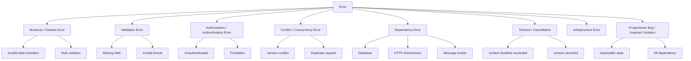
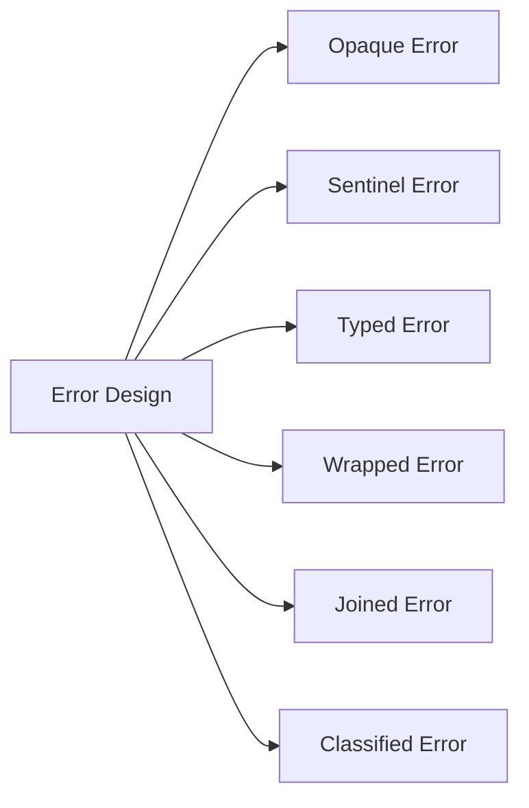
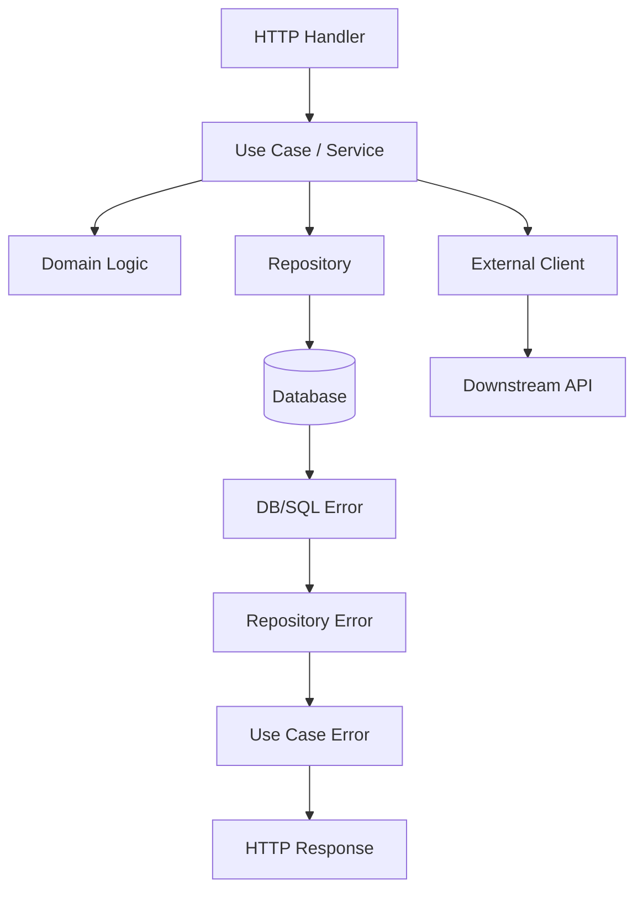
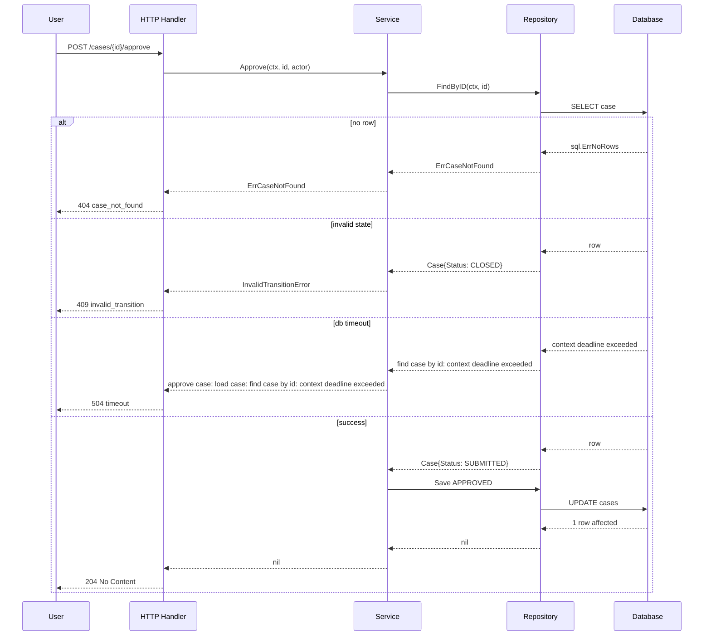
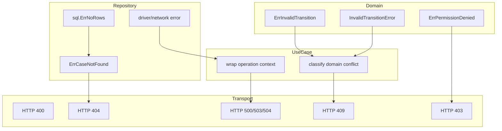

# learn-go-part-008.md

# Go Error Handling: Explicit Errors, Wrapping, Sentinel Errors, Typed Errors, Classification, dan Retryability

> Seri: `learn-go`  
> Part: `008`  
> Target pembaca: Java software engineer yang ingin menguasai Go pada level production/internal engineering handbook  
> Target versi: Go 1.26.x  
> Fokus: error sebagai kontrak eksplisit, bukan sekadar `if err != nil`

---

## 0. Tujuan Part Ini

Setelah menyelesaikan part ini, kamu diharapkan mampu:

1. Memahami perbedaan fundamental antara error handling Go dan exception handling Java.
2. Mendesain error sebagai bagian dari public API contract.
3. Memilih antara sentinel error, typed error, wrapped error, opaque error, dan error classification.
4. Menggunakan `errors.Is`, `errors.As`, `errors.Join`, dan `%w` secara benar.
5. Menentukan apakah sebuah error retryable, user-visible, security-sensitive, temporary, permanent, atau programmer bug.
6. Membangun error boundary untuk service, repository, HTTP handler, worker, dan background job.
7. Menghindari anti-pattern umum seperti string matching, over-wrapping, panic untuk business error, dan leaking internal detail.
8. Membuat failure model yang bisa dipakai untuk observability, incident analysis, dan regulatory defensibility.

Part ini bukan sekadar mengajarkan:

```go
if err != nil {
    return err
}
```

Itu hanya syntax. Yang lebih penting adalah memahami:

```text
error adalah sinyal kegagalan yang melewati boundary sistem
```

Kalau desain error buruk, maka efeknya menyebar ke:

- retry policy;
- HTTP response;
- audit trail;
- metrics;
- alerting;
- distributed tracing;
- user message;
- incident diagnosis;
- security leakage;
- data consistency;
- regulatory defensibility.

---

## 1. Mental Model Utama

### 1.1 Java Exception vs Go Error

Di Java, failure sering dimodelkan dengan exception:

```java
try {
    service.approve(caseId);
} catch (ValidationException e) {
    return badRequest(e.getMessage());
} catch (OptimisticLockException e) {
    return conflict();
} catch (Exception e) {
    return internalServerError();
}
```

Exception memiliki beberapa karakteristik:

- control flow bisa melompat jauh;
- caller bisa lupa membaca dokumentasi exception;
- checked exception kadang terlalu verbose;
- unchecked exception sering menjadi invisible contract;
- stack trace otomatis tersedia;
- framework sering menjadi boundary penerjemah exception ke HTTP response.

Di Go, error adalah return value biasa:

```go
result, err := service.Approve(ctx, caseID)
if err != nil {
    return nil, err
}
```

Konsekuensinya:

- caller dipaksa melihat kegagalan di tempat ia memanggil operasi;
- error path menjadi eksplisit;
- tidak ada hidden stack unwinding;
- tidak ada exception hierarchy built-in;
- classification harus didesain sendiri;
- framework magic lebih sedikit;
- boundary translation biasanya manual dan eksplisit.

### 1.2 Perbedaan paling penting

Perbedaan utamanya bukan “Go tidak punya exception”.

Perbedaan utamanya adalah:

```text
Java exception sering menjadi mekanisme control transfer.
Go error adalah nilai yang menjadi bagian dari data flow.
```

Dalam Go, error dapat:

- dibandingkan;
- dibungkus;
- diklasifikasi;
- disimpan;
- digabung;
- diterjemahkan;
- dilog;
- dikirim ke caller;
- diputuskan retry atau tidak;
- menjadi bagian dari contract package.

Karena error adalah value, maka desain error harus diperlakukan seperti desain type dan API.

---

## 2. Error sebagai Contract, bukan Pesan String

### 2.1 Error string bukan contract yang stabil

Interface dasar error di Go:

```go
type error interface {
    Error() string
}
```

Ini membuat banyak pemula mengira error hanyalah string.

Itu keliru.

`Error() string` adalah representasi manusiawi. Bukan struktur utama untuk decision making.

Anti-pattern:

```go
if strings.Contains(err.Error(), "not found") {
    // fragile
}
```

Kenapa buruk?

- Pesan bisa berubah;
- localization bisa mengubah string;
- wrapping bisa menambah prefix;
- error dari dependency bisa berubah antar versi;
- string matching membuat contract tidak eksplisit;
- sulit dites secara stabil.

Lebih baik:

```go
if errors.Is(err, ErrCaseNotFound) {
    // stable classification
}
```

atau:

```go
var validationErr *ValidationError
if errors.As(err, &validationErr) {
    // inspect structured information
}
```

### 2.2 Contract error menjawab pertanyaan operasional

Setiap error yang keluar dari boundary sebaiknya menjawab sebagian dari pertanyaan berikut:

| Pertanyaan | Contoh Jawaban |
|---|---|
| Apakah caller boleh retry? | yes/no/after delay |
| Apakah error ini akibat input user? | validation, authorization, conflict |
| Apakah error ini akibat dependency? | database, network, downstream |
| Apakah error ini transient? | timeout, connection reset, rate limit |
| Apakah error ini permanent? | invalid state, not found, forbidden |
| Apakah aman ditampilkan ke user? | safe message vs internal message |
| Apakah harus dilog sebagai warning/error? | expected vs unexpected |
| Apakah harus memicu alert? | operational severity |
| Apakah perlu audit trail? | business/security decision |
| Apakah error ini bug programmer? | invariant violation, nil dependency |

Jika error hanya string, hampir semua jawaban di atas menjadi kabur.

---

## 3. Taxonomy Error di Go

Untuk production system, error bisa diklasifikasikan ke beberapa kategori.



### 3.1 Business/domain error

Contoh:

- case sudah closed;
- officer tidak boleh approve case yang ia submit sendiri;
- transition `DRAFT -> CLOSED` tidak valid;
- enforcement action tidak boleh diterbitkan tanpa legal review.

Business error biasanya:

- bukan bug;
- bukan incident;
- sering user-visible;
- harus stabil;
- bisa masuk audit trail;
- tidak selalu perlu stack trace;
- biasanya tidak retryable.

### 3.2 Validation error

Contoh:

- field kosong;
- tanggal tidak valid;
- file terlalu besar;
- postal code tidak sesuai format;
- enum value tidak dikenal.

Validation error biasanya:

- HTTP 400;
- user-visible;
- tidak retryable tanpa perubahan input;
- perlu detail per field;
- tidak perlu alert.

### 3.3 Authorization/authentication error

Contoh:

- user belum login;
- token expired;
- role tidak cukup;
- officer mencoba akses case agency lain.

Authorization error harus hati-hati karena pesan error bisa membocorkan informasi.

Contoh buruk:

```text
Case CASE-2026-000123 exists but belongs to another agency.
```

Lebih aman:

```text
resource not found or access denied
```

Internal log boleh menyimpan detail dengan access control yang sesuai.

### 3.4 Conflict/concurrency error

Contoh:

- optimistic locking failed;
- duplicate idempotency key;
- case sudah diproses worker lain;
- version mismatch.

Conflict error biasanya:

- HTTP 409;
- bisa user-visible;
- kadang retryable setelah refresh state;
- penting untuk workflow/state machine.

### 3.5 Dependency error

Contoh:

- database unavailable;
- downstream HTTP 503;
- Redis timeout;
- message broker connection closed.

Dependency error biasanya:

- operational;
- bisa retryable;
- perlu metrics;
- perlu log structured;
- bisa memicu alert jika rate meningkat.

### 3.6 Timeout/cancellation

Go menggunakan `context.Context` untuk propagation cancellation dan deadline.

Error penting:

```go
context.Canceled
context.DeadlineExceeded
```

Keduanya harus diperlakukan berbeda.

| Error | Meaning |
|---|---|
| `context.Canceled` | caller membatalkan operasi |
| `context.DeadlineExceeded` | deadline habis |

Dalam HTTP server, client disconnect bisa menghasilkan cancellation. Itu tidak selalu incident.

### 3.7 Programmer bug / invariant violation

Contoh:

- nil dependency;
- impossible enum state;
- corrupted in-memory index;
- switch exhaustiveness gagal;
- internal invariant rusak.

Di Go, ini kadang pantas menjadi `panic`, tetapi hanya untuk bug internal yang tidak seharusnya bisa dipicu oleh normal user input.

---

## 4. Bentuk Error di Go

Ada beberapa bentuk umum.



---

## 5. Opaque Error

Opaque error adalah error yang caller hanya boleh perlakukan sebagai gagal, tanpa inspect lebih jauh.

Contoh:

```go
func Save(ctx context.Context, c Case) error {
    if err := writeToDisk(c); err != nil {
        return fmt.Errorf("save case: %w", err)
    }
    return nil
}
```

Caller:

```go
if err := repo.Save(ctx, c); err != nil {
    return err
}
```

Caller tidak tahu apakah disk full, permission denied, atau path invalid, kecuali error tersebut dibungkus dengan informasi yang dapat diperiksa.

Opaque error cocok untuk:

- internal detail;
- dependency error yang tidak ingin diekspos;
- boundary yang hanya butuh success/failure;
- error yang tidak menjadi public API.

Risikonya:

- caller tidak bisa membuat keputusan spesifik;
- semua error bisa berakhir menjadi HTTP 500;
- retry policy sulit;
- observability classification sulit.

---

## 6. Sentinel Error

Sentinel error adalah variable error yang bisa dibandingkan secara stabil.

Contoh:

```go
var ErrCaseNotFound = errors.New("case not found")
```

Penggunaan:

```go
caseData, err := repo.FindByID(ctx, id)
if err != nil {
    if errors.Is(err, ErrCaseNotFound) {
        return nil, ErrCaseNotFound
    }
    return nil, fmt.Errorf("find case %s: %w", id, err)
}
```

Caller:

```go
if errors.Is(err, casepkg.ErrCaseNotFound) {
    return http.StatusNotFound
}
```

### 6.1 Kapan sentinel error cocok?

Sentinel error cocok ketika:

- kategori error sederhana;
- tidak butuh payload tambahan;
- caller perlu decision making stabil;
- error menjadi bagian dari public package contract.

Contoh bagus:

```go
var (
    ErrCaseNotFound       = errors.New("case not found")
    ErrInvalidTransition  = errors.New("invalid case transition")
    ErrPermissionDenied   = errors.New("permission denied")
    ErrDuplicateRequest   = errors.New("duplicate request")
)
```

### 6.2 Kapan sentinel error buruk?

Sentinel error buruk jika kamu butuh detail tambahan:

```go
var ErrValidation = errors.New("validation error")
```

Kalau validation butuh field-level details, sentinel saja tidak cukup.

Lebih baik typed error.

---

## 7. Typed Error

Typed error adalah struct yang mengimplementasikan `Error() string`.

Contoh:

```go
type ValidationError struct {
    Field   string
    Code    string
    Message string
}

func (e *ValidationError) Error() string {
    return e.Field + ": " + e.Message
}
```

Penggunaan:

```go
func ValidateCase(c Case) error {
    if c.Title == "" {
        return &ValidationError{
            Field:   "title",
            Code:    "required",
            Message: "title is required",
        }
    }
    return nil
}
```

Caller:

```go
var ve *ValidationError
if errors.As(err, &ve) {
    // inspect ve.Field, ve.Code, ve.Message
}
```

### 7.1 Typed error cocok untuk structured information

Typed error cocok ketika caller perlu membaca metadata:

- field;
- code;
- case ID;
- operation;
- status code;
- retry-after;
- dependency name;
- correlation ID;
- rule ID;
- transition source/target.

Contoh domain typed error:

```go
type InvalidTransitionError struct {
    CaseID string
    From   CaseStatus
    To     CaseStatus
}

func (e *InvalidTransitionError) Error() string {
    return fmt.Sprintf("invalid case transition: case=%s from=%s to=%s", e.CaseID, e.From, e.To)
}
```

Caller:

```go
var te *InvalidTransitionError
if errors.As(err, &te) {
    // convert to HTTP 409 or domain response
}
```

### 7.2 Typed error sebagai API contract

Begitu typed error diekspor, kamu membuat contract.

```go
type InvalidTransitionError struct {
    CaseID string
    From   CaseStatus
    To     CaseStatus
}
```

Caller bisa bergantung pada field tersebut. Menghapus atau mengubah makna field adalah breaking change secara semantik, walaupun Go compiler mungkin tidak selalu menangkap semua perubahan usage.

Karena itu:

- ekspor typed error hanya jika caller memang perlu inspect;
- jangan ekspor field internal yang bisa berubah;
- pertimbangkan method daripada field publik jika ingin stabilitas lebih tinggi.

Contoh:

```go
type InvalidTransitionError struct {
    caseID string
    from   CaseStatus
    to     CaseStatus
}

func (e *InvalidTransitionError) Error() string { ... }
func (e *InvalidTransitionError) CaseID() string { return e.caseID }
func (e *InvalidTransitionError) From() CaseStatus { return e.from }
func (e *InvalidTransitionError) To() CaseStatus { return e.to }
```

Trade-off:

- field publik lebih sederhana;
- method memberi kontrol contract lebih kuat.

---

## 8. Wrapping Error dengan `%w`

Go mendukung error wrapping dengan `fmt.Errorf` dan `%w`.

Contoh:

```go
if err := repo.Save(ctx, c); err != nil {
    return fmt.Errorf("approve case %s: save decision: %w", c.ID, err)
}
```

Wrapping menambah context sambil mempertahankan error asli agar bisa diperiksa:

```go
if errors.Is(err, ErrCaseNotFound) {
    // works even if wrapped
}
```

```go
var ve *ValidationError
if errors.As(err, &ve) {
    // works even if wrapped
}
```

### 8.1 `%w` vs `%v`

```go
fmt.Errorf("save case: %w", err) // preserves unwrap chain
fmt.Errorf("save case: %v", err) // string only, loses unwrap chain
```

Gunakan `%w` jika caller perlu melakukan `errors.Is` atau `errors.As` terhadap cause.

Gunakan `%v` hanya jika memang ingin menyembunyikan cause dari error chain. Namun ini harus keputusan sadar.

### 8.2 Wrapping sebagai operation trail

Error chain idealnya memberi jejak operasi:

```text
approve case CASE-123: persist decision: update row: context deadline exceeded
```

Ini jauh lebih berguna dibanding:

```text
context deadline exceeded
```

Tetapi terlalu banyak wrapping bisa membuat noise:

```text
handler: service: usecase: manager: processor: executor: runner: save: db: update: deadline exceeded
```

Gunakan wrapping pada boundary bermakna:

- use case boundary;
- dependency call boundary;
- persistence boundary;
- external system boundary;
- async job boundary.

Jangan wrap setiap 3 baris hanya untuk terlihat rajin.

---

## 9. `errors.Is`

`errors.Is(err, target)` menjawab pertanyaan:

```text
apakah error ini atau salah satu error di chain merepresentasikan target tertentu?
```

Contoh:

```go
if errors.Is(err, ErrCaseNotFound) {
    return nil, err
}
```

`errors.Is` cocok untuk sentinel error atau error yang mengimplementasikan custom `Is` method.

### 9.1 Jangan gunakan `==` untuk wrapped error

Buruk:

```go
if err == ErrCaseNotFound {
    // fails if err is wrapped
}
```

Baik:

```go
if errors.Is(err, ErrCaseNotFound) {
    // works through wrapping
}
```

### 9.2 Custom `Is`

Kadang typed error bisa menganggap dirinya setara dengan sentinel tertentu.

```go
var ErrInvalidTransition = errors.New("invalid transition")

type InvalidTransitionError struct {
    CaseID string
    From   CaseStatus
    To     CaseStatus
}

func (e *InvalidTransitionError) Error() string {
    return fmt.Sprintf("invalid transition: case=%s from=%s to=%s", e.CaseID, e.From, e.To)
}

func (e *InvalidTransitionError) Is(target error) bool {
    return target == ErrInvalidTransition
}
```

Caller bisa melakukan:

```go
if errors.Is(err, ErrInvalidTransition) {
    // stable classification
}
```

Dan juga:

```go
var te *InvalidTransitionError
if errors.As(err, &te) {
    // inspect detail
}
```

Ini memberi dua level:

- classification;
- structured detail.

---

## 10. `errors.As`

`errors.As(err, &target)` mencari error di chain yang assignable ke type target.

Contoh:

```go
var ve *ValidationError
if errors.As(err, &ve) {
    return validationResponse(ve)
}
```

### 10.1 Common mistake

Buruk:

```go
var ve ValidationError
if errors.As(err, &ve) {
    // wrong for pointer error type
}
```

Jika error dikembalikan sebagai `*ValidationError`, target harus:

```go
var ve *ValidationError
if errors.As(err, &ve) {
    // correct
}
```

### 10.2 `errors.As` untuk dependency errors

Misalnya kamu memanggil HTTP dependency dan punya typed error:

```go
type DownstreamError struct {
    Service    string
    StatusCode int
    RetryAfter time.Duration
}

func (e *DownstreamError) Error() string {
    return fmt.Sprintf("downstream %s returned status %d", e.Service, e.StatusCode)
}
```

Caller:

```go
var de *DownstreamError
if errors.As(err, &de) {
    if de.StatusCode == http.StatusTooManyRequests {
        // retry with backoff or propagate 503
    }
}
```

---

## 11. `errors.Join`

Go mendukung menggabungkan beberapa error dengan `errors.Join`.

Contoh:

```go
func CloseAll(closers ...io.Closer) error {
    var errs []error
    for _, c := range closers {
        if err := c.Close(); err != nil {
            errs = append(errs, err)
        }
    }
    return errors.Join(errs...)
}
```

`errors.Is` dan `errors.As` tetap bisa menelusuri joined errors.

### 11.1 Kapan join cocok?

Cocok untuk:

- cleanup beberapa resource;
- validasi multi-field;
- batch operation;
- shutdown banyak components;
- parallel fan-out where multiple branches may fail.

### 11.2 Kapan join tidak cocok?

Tidak cocok jika caller butuh satu primary cause jelas.

Misalnya HTTP handler harus memilih satu status code. Jika error terdiri dari validation error dan database error sekaligus, kamu harus punya policy:

- apakah validation lebih prioritas?
- apakah dependency error harus override?
- apakah response harus generic?

Jangan hanya `errors.Join` lalu berharap boundary bisa menebak.

---

## 12. Error Classification Pattern

Untuk sistem besar, sentinel dan typed error saja sering belum cukup. Kamu perlu classification yang konsisten.

Contoh classification:

```go
type Kind string

const (
    KindInvalid      Kind = "invalid"
    KindNotFound     Kind = "not_found"
    KindConflict     Kind = "conflict"
    KindUnauthorized Kind = "unauthorized"
    KindForbidden    Kind = "forbidden"
    KindUnavailable  Kind = "unavailable"
    KindTimeout      Kind = "timeout"
    KindInternal     Kind = "internal"
)
```

App error:

```go
type AppError struct {
    Kind    Kind
    Code    string
    Message string
    Cause   error
}

func (e *AppError) Error() string {
    if e.Cause == nil {
        return string(e.Kind) + ": " + e.Message
    }
    return string(e.Kind) + ": " + e.Message + ": " + e.Cause.Error()
}

func (e *AppError) Unwrap() error {
    return e.Cause
}
```

Helper:

```go
func E(kind Kind, code, message string, cause error) error {
    return &AppError{
        Kind:    kind,
        Code:    code,
        Message: message,
        Cause:   cause,
    }
}
```

Usage:

```go
if err := validateTransition(c.Status, target); err != nil {
    return E(KindConflict, "invalid_transition", "case transition is not allowed", err)
}
```

Boundary:

```go
func HTTPStatus(err error) int {
    var appErr *AppError
    if errors.As(err, &appErr) {
        switch appErr.Kind {
        case KindInvalid:
            return http.StatusBadRequest
        case KindNotFound:
            return http.StatusNotFound
        case KindConflict:
            return http.StatusConflict
        case KindUnauthorized:
            return http.StatusUnauthorized
        case KindForbidden:
            return http.StatusForbidden
        case KindUnavailable:
            return http.StatusServiceUnavailable
        case KindTimeout:
            return http.StatusGatewayTimeout
        default:
            return http.StatusInternalServerError
        }
    }

    if errors.Is(err, context.DeadlineExceeded) {
        return http.StatusGatewayTimeout
    }

    return http.StatusInternalServerError
}
```

### 12.1 Classification bukan harus framework besar

Jangan langsung membuat error framework raksasa. Mulai dari kebutuhan boundary:

```text
HTTP boundary butuh status code
worker boundary butuh retry decision
logging boundary butuh severity
user boundary butuh safe message
audit boundary butuh rule/category
```

Kalau satu type kecil bisa menjawab itu, cukup.

---

## 13. Retryability

Retry adalah salah satu keputusan paling berbahaya jika error tidak diklasifikasi.

### 13.1 Retry tidak boleh berbasis feeling

Buruk:

```go
if err != nil {
    time.Sleep(time.Second)
    return callAgain()
}
```

Masalah:

- bisa retry validation error;
- bisa menggandakan side effect;
- bisa memperparah overload;
- bisa melanggar idempotency;
- bisa membuat storm ke dependency;
- bisa menyembunyikan bug.

### 13.2 Retry policy harus menjawab

| Pertanyaan | Kenapa penting |
|---|---|
| Apakah operasi idempotent? | retry bisa menggandakan side effect |
| Apakah error transient? | retry permanent error sia-sia |
| Apakah caller masih punya deadline? | retry setelah deadline tidak berguna |
| Apakah ada backoff/jitter? | mencegah thundering herd |
| Apakah ada max attempts? | mencegah infinite retry |
| Apakah ada circuit breaker/rate limit? | melindungi dependency |
| Apakah error mengandung retry-after? | hormati downstream signal |

### 13.3 Interface retryable sederhana

```go
type Retryable interface {
    Retryable() bool
}
```

Contoh:

```go
type DependencyError struct {
    Service   string
    Operation string
    Temporary bool
    Cause     error
}

func (e *DependencyError) Error() string {
    return fmt.Sprintf("dependency %s %s failed: %v", e.Service, e.Operation, e.Cause)
}

func (e *DependencyError) Unwrap() error {
    return e.Cause
}

func (e *DependencyError) Retryable() bool {
    return e.Temporary
}
```

Helper:

```go
func IsRetryable(err error) bool {
    var r Retryable
    if errors.As(err, &r) {
        return r.Retryable()
    }

    return errors.Is(err, context.DeadlineExceeded)
}
```

Caveat:

`context.DeadlineExceeded` tidak selalu retryable di current request. Bisa retryable oleh upstream job, tapi tidak oleh handler yang deadline-nya sudah habis.

Lebih akurat:

```go
func IsRetryableWithin(ctx context.Context, err error) bool {
    if ctx.Err() != nil {
        return false
    }

    var r Retryable
    if errors.As(err, &r) {
        return r.Retryable()
    }

    return false
}
```

---

## 14. Timeout dan Cancellation Error

### 14.1 Context error harus dipertahankan

Buruk:

```go
if err := repo.Save(ctx, c); err != nil {
    return errors.New("save failed")
}
```

Ini menghilangkan `context.Canceled` atau `context.DeadlineExceeded`.

Baik:

```go
if err := repo.Save(ctx, c); err != nil {
    return fmt.Errorf("save case decision: %w", err)
}
```

Boundary masih bisa:

```go
switch {
case errors.Is(err, context.Canceled):
    // client canceled or caller canceled
case errors.Is(err, context.DeadlineExceeded):
    // deadline exceeded
}
```

### 14.2 Jangan log client cancellation sebagai server error besar

Jika client membatalkan request, server bisa melihat `context.Canceled`.

Itu tidak selalu bug server.

Policy umum:

| Error | Log Level | HTTP-ish Interpretation |
|---|---|---|
| `context.Canceled` | debug/info | client/caller canceled |
| `context.DeadlineExceeded` | warn/error depending rate | timeout |
| dependency timeout | warn/error | dependency issue |
| validation | info/debug | expected bad input |
| invariant violation | error/critical | bug |

---

## 15. Panic bukan Error Handling Normal

Go punya `panic` dan `recover`, tetapi bukan pengganti exception Java.

Gunakan error untuk:

- validation failure;
- business rule violation;
- not found;
- permission denied;
- dependency unavailable;
- timeout;
- conflict;
- user input problem.

Gunakan panic untuk:

- programmer bug;
- impossible state;
- invariant corruption;
- nil dependency pada construction;
- misuse API internal;
- init failure yang membuat program tidak bisa jalan.

### 15.1 Contoh panic yang masuk akal

```go
func NewService(repo Repository) *Service {
    if repo == nil {
        panic("nil Repository")
    }
    return &Service{repo: repo}
}
```

Alasannya:

- ini bug wiring;
- tidak bisa dipulihkan oleh user;
- lebih baik fail fast saat startup/test.

### 15.2 Contoh panic yang buruk

```go
func (s *Service) Approve(ctx context.Context, id string) error {
    if id == "" {
        panic("empty case id")
    }
    return nil
}
```

Jika `id` berasal dari request user, itu harus validation error, bukan panic.

---

## 16. Error Boundary

Error boundary adalah tempat error diterjemahkan dari satu layer ke layer lain.



Setiap boundary punya tanggung jawab berbeda.

### 16.1 Repository boundary

Repository harus menyembunyikan detail database yang tidak perlu.

Contoh:

```go
var ErrCaseNotFound = errors.New("case not found")

func (r *CaseRepository) FindByID(ctx context.Context, id string) (Case, error) {
    row := r.db.QueryRowContext(ctx, `select id, status, version from cases where id = ?`, id)

    var c Case
    if err := row.Scan(&c.ID, &c.Status, &c.Version); err != nil {
        if errors.Is(err, sql.ErrNoRows) {
            return Case{}, ErrCaseNotFound
        }
        return Case{}, fmt.Errorf("query case by id: %w", err)
    }

    return c, nil
}
```

Repository tidak perlu expose `sql.ErrNoRows` ke service jika service concept-nya adalah `ErrCaseNotFound`.

### 16.2 Service/use case boundary

Service menambahkan konteks domain.

```go
func (s *CaseService) Approve(ctx context.Context, id string, actor Actor) error {
    c, err := s.repo.FindByID(ctx, id)
    if err != nil {
        if errors.Is(err, ErrCaseNotFound) {
            return err
        }
        return fmt.Errorf("approve case %s: load case: %w", id, err)
    }

    if !actor.CanApprove(c) {
        return ErrPermissionDenied
    }

    if c.Status != StatusSubmitted {
        return &InvalidTransitionError{CaseID: id, From: c.Status, To: StatusApproved}
    }

    c.Status = StatusApproved

    if err := s.repo.Save(ctx, c); err != nil {
        return fmt.Errorf("approve case %s: save approved state: %w", id, err)
    }

    return nil
}
```

### 16.3 HTTP boundary

HTTP boundary menerjemahkan error menjadi response.

```go
func writeError(w http.ResponseWriter, err error) {
    switch {
    case errors.Is(err, ErrCaseNotFound):
        http.Error(w, "case not found", http.StatusNotFound)
    case errors.Is(err, ErrPermissionDenied):
        http.Error(w, "forbidden", http.StatusForbidden)
    case errors.Is(err, ErrInvalidTransition):
        http.Error(w, "invalid case transition", http.StatusConflict)
    case errors.Is(err, context.Canceled):
        // Usually no need to write response; client may be gone.
    case errors.Is(err, context.DeadlineExceeded):
        http.Error(w, "request timeout", http.StatusGatewayTimeout)
    default:
        http.Error(w, "internal server error", http.StatusInternalServerError)
    }
}
```

Boundary ini juga tempat aman untuk:

- log internal error;
- emit metric;
- attach correlation ID;
- hide sensitive detail;
- produce user-safe message.

---

## 17. User-Safe Message vs Internal Error

Error internal sering berisi detail yang tidak boleh keluar.

Contoh internal:

```text
approve case CASE-123: save approved state: update cases set status=? where id=?: ORA-00060 deadlock detected while waiting for resource
```

User tidak perlu melihat SQL, table, database vendor, atau internal case existence detail.

Response aman:

```json
{
  "code": "case_update_failed",
  "message": "The case could not be updated. Please try again later."
}
```

### 17.1 AppError dengan safe message

```go
type AppError struct {
    Kind        Kind
    Code        string
    SafeMessage string
    Cause       error
}

func (e *AppError) Error() string {
    if e.Cause == nil {
        return e.Code
    }
    return e.Code + ": " + e.Cause.Error()
}

func (e *AppError) Unwrap() error {
    return e.Cause
}
```

Internal log memakai `err.Error()`.

User response memakai `SafeMessage`.

Jangan membaliknya.

---

## 18. Logging Error dengan Benar

### 18.1 Jangan log error di setiap layer

Buruk:

```go
if err != nil {
    log.Println("repo failed", err)
    return err
}
```

Lalu service juga log, handler juga log. Hasilnya satu error menjadi tiga log entry.

Masalah:

- noise tinggi;
- alert duplikat;
- sulit korelasi;
- biaya log membengkak;
- signal-to-noise turun.

Lebih baik:

```text
lower layer: wrap and return
boundary layer: log once with structured context
```

### 18.2 Log once at boundary

```go
func (h *Handler) Approve(w http.ResponseWriter, r *http.Request) {
    ctx := r.Context()
    id := r.PathValue("id")

    err := h.service.Approve(ctx, id, actorFrom(r))
    if err != nil {
        h.logger.ErrorContext(ctx, "approve case failed",
            "case_id", id,
            "error", err,
            "status", HTTPStatus(err),
        )
        writeError(w, err)
        return
    }

    w.WriteHeader(http.StatusNoContent)
}
```

### 18.3 Expected error bukan selalu error-level log

| Error | Suggested Level |
|---|---|
| validation failed | debug/info |
| not found | debug/info, depending endpoint |
| forbidden | warn if suspicious, otherwise info |
| conflict | info/warn depending frequency |
| dependency timeout | warn/error |
| invariant violation | error |
| panic recovered | error/critical |

---

## 19. Observability dan Metrics

Error classification harus masuk ke metrics.

Contoh metrics dimensions:

```text
operation="approve_case"
error_kind="conflict"
error_code="invalid_transition"
dependency="database"
retryable="false"
```

Jangan jadikan raw error string sebagai label metric.

Buruk:

```text
error="approve case CASE-123: db timeout"
```

Kenapa buruk?

- high cardinality;
- metric storage meledak;
- dashboard tidak stabil;
- PII/resource ID bisa bocor.

Baik:

```text
error_kind="timeout"
error_code="db_deadline_exceeded"
```

---

## 20. Regulatory Defensibility Angle

Dalam sistem regulatory/enforcement lifecycle, error bukan hanya masalah teknis.

Error handling memengaruhi:

- apakah keputusan enforcement tercatat benar;
- apakah user diberi alasan yang sah;
- apakah retry menggandakan action;
- apakah audit trail lengkap;
- apakah timeout meninggalkan state ambigu;
- apakah workflow transition bisa dipertanggungjawabkan;
- apakah unauthorized access tidak membocorkan data.

Contoh situasi:

```text
Officer klik Approve.
Database berhasil update case status.
Setelah itu audit trail insert timeout.
HTTP handler return 500.
User retry.
```

Pertanyaan engineering:

1. Apakah approval sudah terjadi?
2. Apakah audit trail wajib atomic dengan approval?
3. Apakah retry akan membuat duplicate approval event?
4. Apakah idempotency key digunakan?
5. Error apa yang harus dikembalikan?
6. Apa yang harus dilog?
7. Apa yang harus diaudit?
8. Apa yang harus dilakukan worker recovery?

Jika error model hanya `return err`, desain ini tidak cukup.

---

## 21. Production Example: Regulatory Case Approval

### 21.1 Domain errors

```go
package caseapp

import (
    "errors"
    "fmt"
)

var (
    ErrCaseNotFound      = errors.New("case not found")
    ErrPermissionDenied  = errors.New("permission denied")
    ErrInvalidTransition = errors.New("invalid transition")
    ErrVersionConflict   = errors.New("version conflict")
)

type CaseStatus string

const (
    StatusDraft     CaseStatus = "DRAFT"
    StatusSubmitted CaseStatus = "SUBMITTED"
    StatusApproved  CaseStatus = "APPROVED"
    StatusRejected  CaseStatus = "REJECTED"
    StatusClosed    CaseStatus = "CLOSED"
)

type InvalidTransitionError struct {
    CaseID string
    From   CaseStatus
    To     CaseStatus
}

func (e *InvalidTransitionError) Error() string {
    return fmt.Sprintf("invalid transition: case=%s from=%s to=%s", e.CaseID, e.From, e.To)
}

func (e *InvalidTransitionError) Is(target error) bool {
    return target == ErrInvalidTransition
}

type VersionConflictError struct {
    CaseID          string
    ExpectedVersion int64
    ActualVersion   int64
}

func (e *VersionConflictError) Error() string {
    return fmt.Sprintf(
        "version conflict: case=%s expected=%d actual=%d",
        e.CaseID,
        e.ExpectedVersion,
        e.ActualVersion,
    )
}

func (e *VersionConflictError) Is(target error) bool {
    return target == ErrVersionConflict
}
```

### 21.2 Repository with error translation

```go
package caseapp

import (
    "context"
    "database/sql"
    "errors"
    "fmt"
)

type Case struct {
    ID      string
    Status  CaseStatus
    Version int64
}

type CaseRepository struct {
    db *sql.DB
}

func (r *CaseRepository) FindByID(ctx context.Context, id string) (Case, error) {
    row := r.db.QueryRowContext(ctx, `
        select id, status, version
        from cases
        where id = ?
    `, id)

    var c Case
    if err := row.Scan(&c.ID, &c.Status, &c.Version); err != nil {
        if errors.Is(err, sql.ErrNoRows) {
            return Case{}, ErrCaseNotFound
        }
        return Case{}, fmt.Errorf("find case by id %s: %w", id, err)
    }

    return c, nil
}

func (r *CaseRepository) Save(ctx context.Context, c Case, expectedVersion int64) error {
    res, err := r.db.ExecContext(ctx, `
        update cases
        set status = ?, version = version + 1
        where id = ? and version = ?
    `, c.Status, c.ID, expectedVersion)
    if err != nil {
        return fmt.Errorf("update case %s: %w", c.ID, err)
    }

    affected, err := res.RowsAffected()
    if err != nil {
        return fmt.Errorf("get affected rows for case %s update: %w", c.ID, err)
    }

    if affected == 0 {
        return &VersionConflictError{
            CaseID:          c.ID,
            ExpectedVersion: expectedVersion,
            ActualVersion:   -1,
        }
    }

    return nil
}
```

### 21.3 Service with domain classification

```go
package caseapp

import (
    "context"
    "fmt"
)

type Actor struct {
    ID    string
    Roles map[string]bool
}

func (a Actor) CanApprove(c Case) bool {
    return a.Roles["case.approver"]
}

type Service struct {
    repo *CaseRepository
}

func NewService(repo *CaseRepository) *Service {
    if repo == nil {
        panic("nil CaseRepository")
    }
    return &Service{repo: repo}
}

func (s *Service) Approve(ctx context.Context, id string, actor Actor) error {
    if id == "" {
        return &ValidationError{Field: "id", Code: "required", Message: "case id is required"}
    }

    c, err := s.repo.FindByID(ctx, id)
    if err != nil {
        if errors.Is(err, ErrCaseNotFound) {
            return err
        }
        return fmt.Errorf("approve case %s: load case: %w", id, err)
    }

    if !actor.CanApprove(c) {
        return ErrPermissionDenied
    }

    if c.Status != StatusSubmitted {
        return &InvalidTransitionError{
            CaseID: id,
            From:   c.Status,
            To:     StatusApproved,
        }
    }

    expectedVersion := c.Version
    c.Status = StatusApproved

    if err := s.repo.Save(ctx, c, expectedVersion); err != nil {
        return fmt.Errorf("approve case %s: persist approved status: %w", id, err)
    }

    return nil
}
```

Note: kode di atas membutuhkan import `errors` pada service jika menggunakan `errors.Is`.

### 21.4 HTTP boundary translation

```go
func writeCaseError(w http.ResponseWriter, err error) {
    switch {
    case errors.Is(err, caseapp.ErrCaseNotFound):
        writeJSONError(w, http.StatusNotFound, "case_not_found", "Case was not found.")
    case errors.Is(err, caseapp.ErrPermissionDenied):
        writeJSONError(w, http.StatusForbidden, "forbidden", "You are not allowed to perform this action.")
    case errors.Is(err, caseapp.ErrInvalidTransition):
        writeJSONError(w, http.StatusConflict, "invalid_transition", "The case cannot be moved to the requested status.")
    case errors.Is(err, caseapp.ErrVersionConflict):
        writeJSONError(w, http.StatusConflict, "version_conflict", "The case was modified by another request. Please refresh and try again.")
    case errors.Is(err, context.DeadlineExceeded):
        writeJSONError(w, http.StatusGatewayTimeout, "timeout", "The request timed out. Please try again.")
    case errors.Is(err, context.Canceled):
        return
    default:
        writeJSONError(w, http.StatusInternalServerError, "internal_error", "An unexpected error occurred.")
    }
}
```

---

## 22. Error Flow Diagram



---

## 23. Multi-Error Validation Pattern

Validation sering menghasilkan banyak field errors.

### 23.1 Field error type

```go
type FieldError struct {
    Field   string
    Code    string
    Message string
}

func (e *FieldError) Error() string {
    return e.Field + ": " + e.Code
}
```

### 23.2 Validation function

```go
func ValidateCreateCase(req CreateCaseRequest) error {
    var errs []error

    if req.Title == "" {
        errs = append(errs, &FieldError{Field: "title", Code: "required", Message: "Title is required."})
    }

    if req.Category == "" {
        errs = append(errs, &FieldError{Field: "category", Code: "required", Message: "Category is required."})
    }

    if req.ReportedAt.IsZero() {
        errs = append(errs, &FieldError{Field: "reported_at", Code: "required", Message: "Reported date is required."})
    }

    return errors.Join(errs...)
}
```

### 23.3 Extracting validation details

`errors.As` hanya mengambil satu matching error. Untuk mengumpulkan semua field errors dari joined error, kamu bisa menulis walker.

```go
type unwrapper interface {
    Unwrap() []error
}

func FieldErrors(err error) []*FieldError {
    if err == nil {
        return nil
    }

    var out []*FieldError

    var walk func(error)
    walk = func(e error) {
        if e == nil {
            return
        }

        var fe *FieldError
        if errors.As(e, &fe) {
            out = append(out, fe)
        }

        if multi, ok := e.(unwrapper); ok {
            for _, child := range multi.Unwrap() {
                walk(child)
            }
        }
    }

    walk(err)
    return out
}
```

Caveat: implementasi di atas sederhana dan bisa menghasilkan duplikasi jika error chain kompleks. Untuk production, definisikan convention internal yang jelas.

---

## 24. Error dan Idempotency

Error handling tidak bisa dipisahkan dari idempotency untuk operasi side-effect.

Contoh approve case:

```text
1. request diterima
2. case status diubah ke APPROVED
3. response timeout sebelum sampai ke client
4. client retry
```

Tanpa idempotency, retry bisa:

- menjalankan approval dua kali;
- membuat dua audit event;
- mengirim dua email;
- publish dua message;
- memicu downstream action ganda.

### 24.1 Error harus mengandung ambiguity awareness

Beberapa error status sebenarnya ambigu:

```text
client timeout after server processed request
```

Caller tidak tahu apakah operasi berhasil atau gagal.

Untuk operation yang punya side effect, retry aman hanya jika:

- operasi idempotent;
- ada idempotency key;
- state transition naturally idempotent;
- duplicate detection tersedia;
- outbox/inbox pattern digunakan.

### 24.2 Error classification untuk ambiguous result

```go
var ErrResultUnknown = errors.New("operation result unknown")
```

Contoh:

```go
func (c *Client) SubmitDecision(ctx context.Context, decision Decision) error {
    err := c.call(ctx, decision)
    if err != nil {
        if errors.Is(ctx.Err(), context.DeadlineExceeded) {
            return fmt.Errorf("submit decision: %w: %w", ErrResultUnknown, err)
        }
        return fmt.Errorf("submit decision: %w", err)
    }
    return nil
}
```

Boundary retry policy:

```go
if errors.Is(err, ErrResultUnknown) {
    // check status by idempotency key before retrying
}
```

---

## 25. Error API Design Checklist

Saat mendesain function:

```go
func Approve(ctx context.Context, id string, actor Actor) error
```

Tanyakan:

1. Error apa yang mungkin terjadi?
2. Mana yang bagian dari contract?
3. Mana yang internal detail?
4. Apakah caller perlu membedakan not found vs forbidden?
5. Apakah invalid transition harus typed error?
6. Apakah version conflict perlu actual/expected version?
7. Apakah dependency error perlu retryable flag?
8. Apakah timeout harus dipertahankan sebagai `context.DeadlineExceeded`?
9. Apakah error aman ditampilkan ke user?
10. Apakah error harus masuk audit trail?
11. Apakah error harus dihitung di metric?
12. Apakah error harus memicu alert?
13. Apakah operation punya side effect sebelum error muncul?
14. Apakah retry aman?
15. Apakah panic lebih tepat karena ini bug wiring/invariant?

---

## 26. Anti-Patterns

### 26.1 String matching

```go
if strings.Contains(err.Error(), "not found") {
    return nil
}
```

Ganti dengan:

```go
if errors.Is(err, ErrCaseNotFound) {
    return nil
}
```

### 26.2 Losing cause

```go
return errors.New("save failed")
```

Ganti dengan:

```go
return fmt.Errorf("save case: %w", err)
```

### 26.3 Over-wrapping

```go
return fmt.Errorf("service layer: %w", fmt.Errorf("business layer: %w", fmt.Errorf("manager layer: %w", err)))
```

Wrap pada boundary bermakna saja.

### 26.4 Panic untuk user input

```go
if req.Title == "" {
    panic("empty title")
}
```

Ganti dengan validation error.

### 26.5 Exporting too many sentinel errors

```go
var ErrDBTimeout = errors.New("db timeout")
var ErrDBConnectionReset = errors.New("db connection reset")
var ErrDBRowsAffectedFailed = errors.New("rows affected failed")
```

Ini membocorkan detail repository. Ekspor yang domain-relevant saja.

### 26.6 Returning interface error types unnecessarily

Buruk:

```go
func Validate(req Request) ValidationErrorInterface
```

Lebih idiomatik:

```go
func Validate(req Request) error
```

Gunakan `errors.As` untuk inspect type.

### 26.7 Logging and returning

```go
log.Println(err)
return err
```

Jika semua layer melakukan ini, log meledak. Lower layer wrap, boundary log.

### 26.8 Ignoring errors

```go
file.Close()
json.NewEncoder(w).Encode(resp)
```

Kadang error bisa diabaikan secara sadar, tetapi harus diputuskan.

Lebih jelas:

```go
if err := json.NewEncoder(w).Encode(resp); err != nil {
    logger.WarnContext(ctx, "write response failed", "error", err)
}
```

### 26.9 Using `panic/recover` as exception system

Jika semua function panic lalu top-level recover, kamu sedang menulis Java exception buruk dalam syntax Go.

### 26.10 Exposing internal error to user

```go
http.Error(w, err.Error(), http.StatusInternalServerError)
```

Bisa membocorkan:

- SQL;
- table name;
- internal IDs;
- filesystem path;
- downstream host;
- secret-ish config;
- authorization detail.

---

## 27. Practical Error Decision Matrix

| Scenario | Recommended Form | Boundary Response |
|---|---|---|
| Resource not found | Sentinel `ErrXNotFound` | 404 |
| Invalid field input | Typed `ValidationError` or joined field errors | 400 |
| Invalid workflow transition | Sentinel + typed detail | 409 |
| Permission denied | Sentinel `ErrPermissionDenied` | 403 |
| Unauthenticated | Sentinel `ErrUnauthenticated` | 401 |
| Optimistic lock conflict | Typed conflict error | 409 |
| DB timeout | Wrapped cause preserving context error | 504/503 |
| Downstream 429 | Typed dependency error with retry-after | 503/429 depending API |
| Client canceled | Preserve `context.Canceled` | no response/log low |
| Startup misconfiguration | panic or return fatal startup error | fail fast |
| Internal invariant violation | panic or internal error depending boundary | 500 + alert |
| Cleanup multiple failures | `errors.Join` | log/report combined |
| Batch partial failure | structured result + joined errors | 207/summary/domain-specific |

---

## 28. Testing Error Behavior

Test error behavior, bukan hanya string.

### 28.1 Testing sentinel

```go
func TestFindByID_NotFound(t *testing.T) {
    repo := newFakeRepoWithoutCase()

    _, err := repo.FindByID(context.Background(), "CASE-404")
    if !errors.Is(err, ErrCaseNotFound) {
        t.Fatalf("expected ErrCaseNotFound, got %v", err)
    }
}
```

### 28.2 Testing typed error

```go
func TestApprove_InvalidTransition(t *testing.T) {
    svc := newServiceWithCase(Case{ID: "CASE-1", Status: StatusClosed})

    err := svc.Approve(context.Background(), "CASE-1", approver())
    if err == nil {
        t.Fatal("expected error")
    }

    if !errors.Is(err, ErrInvalidTransition) {
        t.Fatalf("expected ErrInvalidTransition, got %v", err)
    }

    var te *InvalidTransitionError
    if !errors.As(err, &te) {
        t.Fatalf("expected InvalidTransitionError, got %T", err)
    }

    if te.From != StatusClosed || te.To != StatusApproved {
        t.Fatalf("unexpected transition: from=%s to=%s", te.From, te.To)
    }
}
```

### 28.3 Avoid exact string test unless message is contract

Buruk:

```go
if err.Error() != "invalid transition: case=CASE-1 from=CLOSED to=APPROVED" {
    t.Fatal("bad error")
}
```

Ini fragile. Test type/classification jika itu yang contract.

---

## 29. Refactoring Java Exception Hierarchy ke Go

Misalnya Java code:

```java
class ApplicationException extends RuntimeException {}
class ValidationException extends ApplicationException {}
class NotFoundException extends ApplicationException {}
class ForbiddenException extends ApplicationException {}
class ConflictException extends ApplicationException {}
class DownstreamException extends ApplicationException {}
```

Go equivalent bukan selalu membuat struct inheritance-like.

Pilihan Go:

```go
var (
    ErrInvalid    = errors.New("invalid")
    ErrNotFound   = errors.New("not found")
    ErrForbidden  = errors.New("forbidden")
    ErrConflict   = errors.New("conflict")
)
```

Untuk detail:

```go
type ValidationError struct { ... }
type ConflictError struct { ... }
type DependencyError struct { ... }
```

Untuk boundary mapping:

```go
func StatusCode(err error) int { ... }
```

Jadi mapping mentalnya:

```text
Java exception hierarchy
    -> Go sentinel classification + typed structured errors + boundary mapper
```

Bukan:

```text
Java base exception
    -> one giant Go AppError used everywhere
```

Giant AppError bisa berguna di application boundary, tapi jangan paksa semua low-level package bergantung pada error framework global.

---

## 30. Package Boundary Strategy

### 30.1 Library package

Library package sebaiknya minimalis:

```go
var ErrNotFound = errors.New("not found")
```

atau typed error jika perlu.

Jangan bergantung pada HTTP status code di library umum.

Buruk:

```go
type RepositoryError struct {
    HTTPStatus int
}
```

Repository bukan HTTP.

### 30.2 Application package

Application/usecase package boleh punya error classification domain.

```go
type Kind string
```

### 30.3 Transport package

Transport package menerjemahkan classification ke protocol.

```go
func HTTPStatus(err error) int
func GRPCCode(err error) codes.Code
func ProblemJSON(err error) Problem
```

Jangan campur semuanya di domain object.

---

## 31. Mermaid: Error Classification Boundary



---

## 32. Hands-On Labs

### Lab 1 — Sentinel Not Found

Buat package `caseapp` dengan:

```go
var ErrCaseNotFound = errors.New("case not found")
```

Implementasikan repository fake:

```go
func (r *Repo) FindByID(ctx context.Context, id string) (Case, error)
```

Pastikan test menggunakan `errors.Is`, bukan `==`.

### Lab 2 — Typed Validation Error

Buat:

```go
type FieldError struct {
    Field string
    Code string
    Message string
}
```

Implementasikan validation untuk create case request.

Gunakan `errors.Join` untuk multiple field error.

### Lab 3 — Invalid Transition Error

Buat state machine sederhana:

```text
DRAFT -> SUBMITTED -> APPROVED -> CLOSED
SUBMITTED -> REJECTED
```

Jika transition invalid, return typed error yang juga match sentinel `ErrInvalidTransition`.

### Lab 4 — HTTP Error Mapper

Buat function:

```go
func HTTPStatus(err error) int
```

Mapping:

- validation: 400;
- not found: 404;
- forbidden: 403;
- conflict: 409;
- deadline exceeded: 504;
- default: 500.

### Lab 5 — Retryable Dependency Error

Buat type:

```go
type DependencyError struct {
    Service string
    Temporary bool
    Cause error
}
```

Implementasikan:

```go
func IsRetryable(ctx context.Context, err error) bool
```

Pastikan tidak retry jika `ctx.Err() != nil`.

---

## 33. Review Questions

1. Kenapa string matching pada error adalah anti-pattern?
2. Apa beda sentinel error dan typed error?
3. Kapan kamu memilih `errors.Is` vs `errors.As`?
4. Apa bedanya `%w` dan `%v` di `fmt.Errorf`?
5. Apa risiko kehilangan cause error?
6. Kenapa `context.Canceled` tidak selalu harus dianggap server error?
7. Apa bedanya business error dan programmer bug?
8. Kapan panic tepat digunakan?
9. Kenapa retry harus dikaitkan dengan idempotency?
10. Bagaimana cara mencegah internal error detail bocor ke user?
11. Di layer mana error sebaiknya dilog?
12. Kenapa repository tidak sebaiknya expose `sql.ErrNoRows` ke HTTP layer?
13. Apa trade-off one global `AppError` vs package-specific errors?
14. Bagaimana `errors.Join` memengaruhi boundary mapping?
15. Apa arti “error adalah API contract”?

---

## 34. Production Code Review Rubric

Saat review Go code, cek error handling dengan rubric berikut.

### 34.1 Correctness

- [ ] Semua returned error diperiksa.
- [ ] `context.Canceled` dan `context.DeadlineExceeded` tidak hilang.
- [ ] `errors.Is` digunakan untuk sentinel/wrapped error.
- [ ] `errors.As` digunakan untuk typed error.
- [ ] Tidak ada string matching pada `err.Error()`.
- [ ] Retry hanya untuk error yang aman diretry.
- [ ] Side effect operation punya idempotency atau duplicate protection.

### 34.2 API Design

- [ ] Error yang diekspor memang perlu diketahui caller.
- [ ] Typed error tidak mengekspos field yang tidak stabil.
- [ ] Sentinel error tidak terlalu banyak dan tidak membocorkan detail internal.
- [ ] Public function mendokumentasikan error contract penting.

### 34.3 Observability

- [ ] Error dilog sekali di boundary.
- [ ] Log mengandung operation dan correlation context.
- [ ] Metric memakai low-cardinality error code/kind.
- [ ] Internal detail tidak masuk user response.
- [ ] Severity log sesuai kategori error.

### 34.4 Security

- [ ] Authorization error tidak membocorkan keberadaan resource sensitif.
- [ ] SQL/internal path/downstream host tidak keluar ke user.
- [ ] Error message tidak mengandung secret/token.
- [ ] Audit-relevant failures dicatat dengan benar.

### 34.5 Maintainability

- [ ] Wrapping tidak berlebihan.
- [ ] Error classification konsisten antar package.
- [ ] Boundary mapper mudah dites.
- [ ] Tests memeriksa classification/type, bukan exact string rapuh.

---

## 35. Ringkasan Invariants

Pegang invariants berikut:

1. Error string bukan contract utama.
2. Error yang keluar dari public API adalah bagian dari API design.
3. Gunakan `errors.Is` untuk classification berbasis sentinel.
4. Gunakan `errors.As` untuk structured typed error.
5. Gunakan `%w` jika cause harus dipertahankan.
6. Jangan hilangkan `context.Canceled` dan `context.DeadlineExceeded`.
7. Panic bukan normal business error handling.
8. Lower layer sebaiknya wrap/return; boundary layer log/translate.
9. User-safe message dan internal error harus dipisah.
10. Retry policy harus berbasis classification, deadline, dan idempotency.
11. Error classification harus mendukung observability.
12. Error design yang buruk akan berubah menjadi incident handling yang buruk.

---

## 36. Koneksi ke Part Berikutnya

Part berikutnya adalah:

```text
learn-go-part-009.md
Package Design: Exported API, internal, cmd, Module Layout,
Dependency Direction, dan Stable Public Contracts
```

Error handling sangat berkaitan dengan package design.

Pertanyaan yang akan muncul di part berikutnya:

- error mana yang boleh diekspor dari package?
- apakah consumer atau provider yang mendefinisikan interface?
- kapan package domain boleh tahu tentang HTTP?
- bagaimana menjaga dependency direction tetap bersih?
- bagaimana membuat public contract yang stabil tanpa framework berat?

---

## 37. Referensi Resmi dan Bacaan Lanjutan

- Go Blog: Error handling and Go — https://go.dev/blog/error-handling-and-go
- Go Blog: Working with Errors in Go 1.13 — https://go.dev/blog/go1.13-errors
- Package `errors` documentation — https://pkg.go.dev/errors
- Package `fmt` documentation for `%w` — https://pkg.go.dev/fmt
- Package `context` documentation — https://pkg.go.dev/context
- Effective Go — https://go.dev/doc/effective_go
- Go Code Review Comments — https://go.dev/wiki/CodeReviewComments
- Go Memory Model — https://go.dev/ref/mem

<!-- NAVIGATION_FOOTER -->
<div class="page-nav">
<a href="./learn-go-part-007.md">⬅️ Go Generics: Type Parameters, Constraints, Type Sets, dan Generic API Design</a>
<a href="./index.md">📚 Kategori</a>
<a href="../../index.md">🏠 Home</a>
<a href="./learn-go-part-009.md">Go Package Design: Exported API, `internal`, `cmd`, Module Layout, Dependency Direction, dan Stable Public Contracts ➡️</a>
</div>
