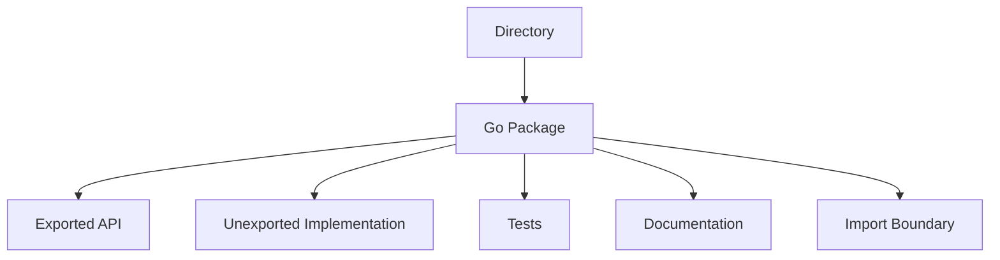
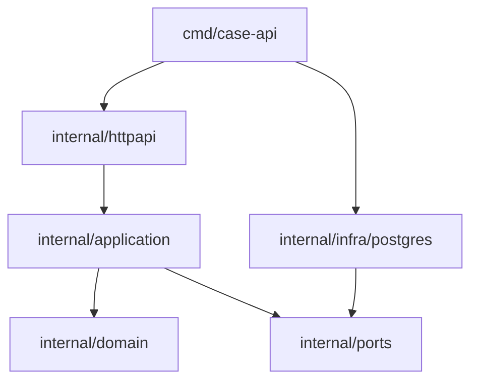
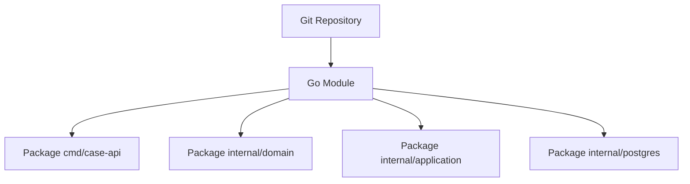
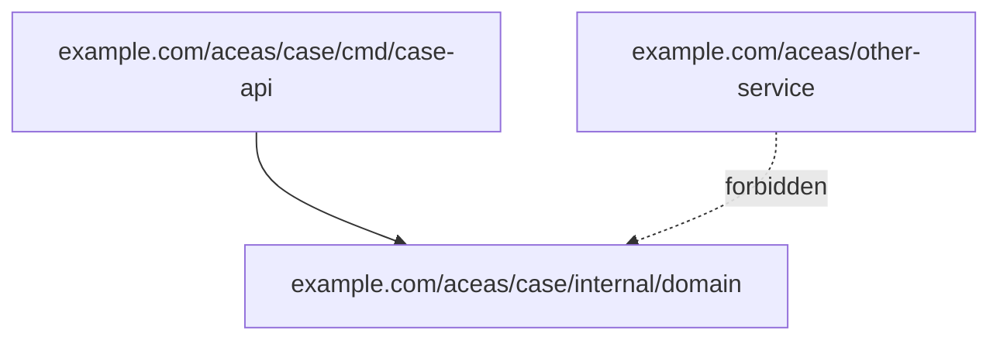
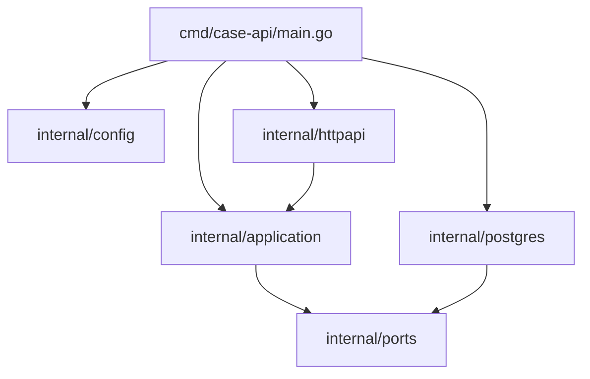
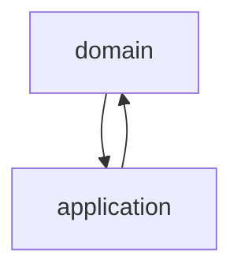
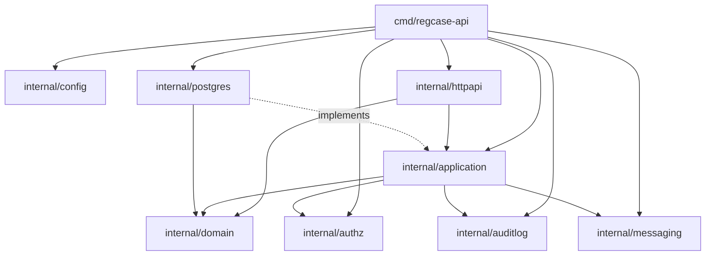

# learn-go-part-009.md

# Go Package Design: Exported API, `internal`, `cmd`, Module Layout, Dependency Direction, dan Stable Public Contracts

> Seri: `learn-go`  
> Part: `009` dari `034`  
> Target pembaca: Java software engineer yang ingin membangun keluwesan desain Go sampai level production/internal engineering handbook  
> Target versi Go: Go 1.26.x  

---

## 0. Tujuan Part Ini

Setelah part sebelumnya, kita sudah punya fondasi:

1. syntax Go;
2. function semantics;
3. type system;
4. composition;
5. interface;
6. generics;
7. error contract.

Part ini menjawab pertanyaan yang lebih dekat dengan engineering nyata:

> “Bagaimana menyusun kode Go supaya boundary-nya jelas, dependency-nya terkendali, public API-nya stabil, dan project tetap maintainable saat tumbuh menjadi service/module besar?”

Di Java, banyak keputusan struktur dipengaruhi oleh:

- package namespace panjang;
- class hierarchy;
- dependency injection container;
- annotation scanning;
- framework conventions;
- Maven/Gradle multi-module layout;
- layer `controller/service/repository` yang sering menjadi default.

Di Go, keputusan struktur berbeda. Go tidak mendorong class-per-file, annotation-driven wiring, atau package nesting yang dalam. Go mendorong:

- package sebagai unit API;
- nama package yang pendek dan bermakna;
- dependency explicit lewat import;
- interface kecil di sisi consumer;
- unexported implementation detail;
- `internal` untuk boundary compile-time;
- `cmd` untuk executable entrypoint;
- module sebagai distribution/versioning unit.

Part ini bukan hanya “folder structure Go”. Fokusnya adalah **package as architecture boundary**.

---

## 1. Mental Model Utama

### 1.1 Package adalah unit desain, bukan folder administratif

Di Go, semua file `.go` dalam satu directory dengan package name yang sama membentuk satu package.

Package adalah boundary untuk:

- visibility;
- API surface;
- dependency graph;
- test boundary;
- documentation boundary;
- ownership boundary;
- coupling boundary;
- semantic cohesion.



Mental shift dari Java:

```text
Java package sering menjadi namespace organization.
Go package seharusnya menjadi behavioral/product boundary.
```

Jika package Go hanya menjadi “folder tempat class sejenis”, desainnya biasanya masih terlalu Java-ish.

---

### 1.2 Exported symbol adalah public contract

Di Go, identifier yang diawali huruf besar exported:

```go
type CaseService struct{}
func NewCaseService() *CaseService { return &CaseService{} }
func (s *CaseService) Approve() error { return nil }
```

Identifier yang diawali huruf kecil unexported:

```go
type caseValidator struct{}
func normalizeStatus(s string) string { return s }
```

Export bukan sekadar “bisa dipakai package lain”. Export adalah janji:

- nama akan dibaca user lain;
- documentation harus jelas;
- behavior harus stabil;
- breaking change harus dipikirkan;
- error contract harus konsisten;
- type exposure akan memengaruhi evolusi API.

### 1.3 Go architecture sering dibangun dari import graph, bukan diagram class

Di Java, orang sering menggambar class diagram. Di Go, lebih berguna menggambar **import graph**.



Pertanyaan desain package Go:

- Siapa boleh import siapa?
- Apakah dependency mengarah ke policy/domain atau detail/infrastructure?
- Apakah cyclic import muncul?
- Apakah package kecil tapi cohesive?
- Apakah public API terlalu lebar?
- Apakah implementation detail bocor?

---

## 2. Package, Module, Repository: Jangan Dicampur

### 2.1 Package

Package adalah unit kompilasi dan import.

Contoh import:

```go
import "example.com/aceas/case/internal/domain"
```

Directory:

```text
internal/domain
  case.go
  status.go
  transition.go
```

Semua file biasanya memiliki:

```go
package domain
```

### 2.2 Module

Module adalah unit versioning dan dependency management, didefinisikan oleh `go.mod`.

```go
module example.com/aceas/case

go 1.26
```

Satu module berisi banyak package.

```text
example.com/aceas/case        <- module
  go.mod
  cmd/case-api                <- package main
  internal/domain             <- package domain
  internal/application        <- package application
  internal/httpapi            <- package httpapi
```

### 2.3 Repository

Repository adalah unit source control. Satu repo bisa berisi:

- satu module;
- beberapa module;
- monorepo multi-service;
- libraries plus applications.

Go tidak memaksa satu repository = satu module, tetapi untuk kebanyakan service, satu repository satu module lebih sederhana.



---

## 3. Nama Package: Kecil, Jelas, dan Dipakai dari Call Site

### 3.1 Package name muncul di call site

Jika package bernama `caseworkflow`, user akan menulis:

```go
caseworkflow.NewEngine()
```

Jika package bernama `engine`, user akan menulis:

```go
engine.New()
```

Nama package harus dipilih berdasarkan bagaimana ia dibaca di call site.

Bad:

```go
caseworkflowengine.NewCaseWorkflowEngine()
```

Terlalu repetitif.

Better:

```go
workflow.NewEngine()
```

Atau:

```go
caseflow.NewEngine()
```

### 3.2 Hindari nama package generic tanpa konteks

Nama seperti ini sering buruk:

```text
utils
common
shared
helper
base
model
service
manager
```

Bukan karena selalu haram, tapi karena biasanya tidak menjelaskan capability.

Better:

```text
clock
retry
auditlog
transition
permission
pagination
validation
caseid
```

### 3.3 Jangan meniru Java package nesting berlebihan

Java-style:

```text
com/company/project/application/case/management/service/impl
```

Go-style yang lebih sehat:

```text
internal/caseapp
internal/casedb
internal/httpapi
internal/auditlog
```

Atau jika domain besar:

```text
internal/case/domain
internal/case/app
internal/case/postgres
internal/case/http
```

Jangan membuat nesting hanya agar terlihat enterprise.

---

## 4. Exported vs Unexported API

### 4.1 Export rule

Exported:

```go
type Case struct{}
func NewCase() Case { return Case{} }
const StatusApproved = "approved"
```

Unexported:

```go
type transitionRule struct{}
func validateTransition() error { return nil }
const statusApproved = "approved"
```

### 4.2 Export minimum, not maximum

Go package design yang matang biasanya memiliki surface kecil.

Bad:

```go
type Case struct {
    ID        string
    Status    string
    Version   int
    CreatedBy string
    UpdatedBy string
}

func ValidateCase(c Case) error { ... }
func NormalizeCase(c Case) Case { ... }
func IsApproved(c Case) bool { ... }
func IsPending(c Case) bool { ... }
func IsDraft(c Case) bool { ... }
```

Better:

```go
type Case struct {
    id      ID
    status  Status
    version int64
}

func NewCase(id ID, createdBy UserID) (Case, error) { ... }
func (c Case) ID() ID { return c.id }
func (c Case) Status() Status { return c.status }
func (c Case) CanApprove(by UserID) bool { ... }
func (c *Case) Approve(by UserID) error { ... }
```

Catatan: bukan berarti semua field harus private. DTO atau config struct kadang memang lebih nyaman dengan exported fields. Tetapi domain object yang punya invariant sering lebih aman dengan unexported fields plus constructor/method.

### 4.3 Exported symbol perlu comment

Go tooling memperlakukan documentation sebagai bagian dari ecosystem. Exported symbol sebaiknya punya comment yang dimulai dengan nama symbol.

```go
// Case represents a regulatory case with controlled lifecycle transitions.
type Case struct {
    id     ID
    status Status
}
```

Bad:

```go
// This is used for regulatory case.
type Case struct { ... }
```

Better:

```go
// Case represents a regulatory case whose state changes through validated transitions.
type Case struct { ... }
```

---

## 5. Package Cohesion: Kapan Membuat Package Baru?

### 5.1 Jangan terlalu cepat memecah package

Java engineer sering refleks membuat package:

```text
controller
service
repository
dto
mapper
entity
exception
config
util
```

Di Go, ini sering menghasilkan package yang kecil secara file count tetapi buruk secara cohesion.

Bad:

```text
internal/controller
internal/service
internal/repository
internal/model
internal/dto
internal/mapper
```

Masalah:

- package `model` dipakai semua orang;
- package `service` menjadi god package;
- dependency graph tidak menjelaskan bounded context;
- import cycle mudah muncul;
- domain logic tersebar.

### 5.2 Package baru dibuat jika ada boundary semantik

Package baru layak jika:

- ada capability yang bisa dijelaskan dalam satu kalimat;
- ada invariant yang ingin dilindungi;
- ada dependency yang ingin diisolasi;
- ada API yang reusable;
- ada test boundary yang natural;
- ada lifecycle ownership berbeda;
- ada external adapter yang ingin dipisah.

Contoh boundary baik:

```text
internal/domain      -> pure domain rules
internal/workflow    -> transition orchestration
internal/httpapi     -> HTTP transport adapter
internal/postgres    -> persistence adapter
internal/auditlog    -> audit event formatting and writing
internal/authz       -> authorization decision logic
```

### 5.3 Jangan membuat package hanya karena file sudah banyak

File banyak bukan otomatis masalah. Package yang besar tapi cohesive lebih baik daripada banyak package kecil yang saling import tanpa arah jelas.

Pertanyaan yang lebih tepat:

```text
Apakah package ini punya satu alasan perubahan?
Apakah user package ini memahami API-nya tanpa membaca implementation detail?
Apakah dependency-nya stabil?
Apakah nama package menjelaskan capability?
```

---

## 6. `internal`: Boundary Compile-Time yang Sering Diremehkan

### 6.1 Apa itu `internal`

Go memiliki mekanisme khusus: package di dalam directory bernama `internal` hanya bisa di-import oleh code dalam parent tree-nya.

Contoh:

```text
example.com/aceas/case
  internal/domain
  internal/postgres
  cmd/case-api
```

Package berikut bisa import `example.com/aceas/case/internal/domain`:

```text
example.com/aceas/case/cmd/case-api
example.com/aceas/case/internal/application
```

Package dari module lain tidak boleh import package internal tersebut.



### 6.2 `internal` adalah cara Go mengatakan “ini bukan public SDK”

Dalam service application, sebagian besar code seharusnya di `internal`.

```text
cmd/case-api/main.go
internal/domain
internal/application
internal/httpapi
internal/postgres
internal/config
```

Kenapa?

- mencegah package lain bergantung pada detail implementasi;
- mengurangi accidental public API;
- memberi kebebasan refactor;
- membuat boundary compile-time, bukan hanya convention;
- cocok untuk application code.

### 6.3 Kapan tidak memakai `internal`

Jangan pakai `internal` untuk package yang memang library publik/reusable.

Contoh library module:

```text
example.com/platform/retry
  retry.go
  backoff.go
```

Jika package ini memang intended untuk dipakai service lain, jangan masukkan ke `internal`.

---

## 7. `cmd`: Entrypoint Executable

### 7.1 Apa isi `cmd`

Convention umum:

```text
cmd/<binary-name>/main.go
```

Contoh:

```text
cmd/case-api/main.go
cmd/case-worker/main.go
cmd/migrate/main.go
```

`cmd` sebaiknya berisi composition root:

- load config;
- setup logger;
- setup database;
- setup clients;
- build application services;
- setup HTTP server/worker;
- handle signal shutdown.

`cmd` tidak seharusnya berisi domain logic besar.

### 7.2 Main package sebagai composition root

```go
package main

import (
    "context"
    "log/slog"
    "os"

    "example.com/aceas/case/internal/application"
    "example.com/aceas/case/internal/config"
    "example.com/aceas/case/internal/httpapi"
    "example.com/aceas/case/internal/postgres"
)

func main() {
    ctx := context.Background()

    cfg, err := config.Load()
    if err != nil {
        slog.Error("load config", "error", err)
        os.Exit(1)
    }

    db, err := postgres.Open(ctx, cfg.Database)
    if err != nil {
        slog.Error("open database", "error", err)
        os.Exit(1)
    }
    defer db.Close()

    repo := postgres.NewCaseRepository(db)
    svc := application.NewCaseService(repo)
    server := httpapi.NewServer(svc)

    if err := server.Run(ctx, cfg.HTTP); err != nil {
        slog.Error("run server", "error", err)
        os.Exit(1)
    }
}
```

Mental model:



`main` boleh tahu semua detail karena ia wiring root. Tetapi detail tidak boleh saling bergantung sembarangan.

---

## 8. Module Layout yang Sehat untuk Service

### 8.1 Layout minimal untuk service kecil

```text
case-service/
  go.mod
  go.sum
  cmd/case-api/
    main.go
  internal/
    config/
      config.go
    domain/
      case.go
      status.go
      transition.go
    application/
      case_service.go
    httpapi/
      server.go
      handlers.go
    postgres/
      case_repository.go
```

Ini sudah cukup untuk banyak service.

### 8.2 Layout untuk service dengan worker dan API

```text
case-service/
  go.mod
  cmd/
    case-api/
      main.go
    case-worker/
      main.go
    migrate/
      main.go
  internal/
    config/
    domain/
    application/
    httpapi/
    worker/
    postgres/
    messaging/
    auditlog/
```

### 8.3 Layout untuk multi-domain service

Jika domain sangat besar:

```text
internal/
  case/
    domain/
    app/
    postgres/
    http/
  appeal/
    domain/
    app/
    postgres/
    http/
  shared/
    authz/
    auditlog/
    clock/
```

Tapi hati-hati dengan `shared`. `shared` sering menjadi tempat semua hal ambigu.

Better:

```text
internal/authz
internal/auditlog
internal/clock
internal/pagination
```

Daripada:

```text
internal/shared
internal/common
internal/utils
```

---

## 9. Dependency Direction

### 9.1 Dependency harus mengarah ke policy yang lebih stabil

Prinsip umum:

```text
transport -> application -> domain
infrastructure -> application/ports
main -> semua untuk wiring
```

Domain sebaiknya tidak import HTTP, SQL, Kafka, AWS, Redis, atau framework.

Bad:

```go
package domain

import "net/http"

type Case struct{}

func (c Case) WriteHTTP(w http.ResponseWriter) { ... }
```

Better:

```go
package domain

type Case struct { ... }
```

HTTP adapter menerjemahkan domain ke response.

### 9.2 Domain tidak boleh tahu persistence detail

Bad:

```go
package domain

import "database/sql"

type Case struct {
    ID sql.NullString
}
```

Better:

```go
package domain

type Case struct {
    id ID
}
```

Adapter persistence yang mengurus `sql.NullString`.

### 9.3 Application layer sebagai orchestrator

Application layer biasanya mengatur:

- transaction boundary;
- authorization call;
- repository call;
- domain method call;
- audit event;
- message publish;
- error classification;
- idempotency;
- context propagation.

```go
package application

func (s *CaseService) Approve(ctx context.Context, cmd ApproveCaseCommand) error {
    actor, err := s.authz.Require(ctx, cmd.ActorID, PermissionApproveCase)
    if err != nil {
        return err
    }

    c, err := s.cases.GetForUpdate(ctx, cmd.CaseID)
    if err != nil {
        return err
    }

    if err := c.Approve(actor.ID); err != nil {
        return err
    }

    if err := s.cases.Save(ctx, c); err != nil {
        return err
    }

    return s.audit.Record(ctx, AuditCaseApproved(c.ID(), actor.ID))
}
```

---

## 10. Avoiding Import Cycles

### 10.1 Import cycle adalah sinyal desain

Go melarang import cycle.

Bad graph:



Jika terjadi import cycle, jangan langsung “memindahkan struct ke common”. Tanya dulu:

- boundary mana yang salah?
- apakah interface harus dipindah ke consumer?
- apakah type terlalu umum?
- apakah package terlalu kecil?
- apakah dependency direction terbalik?

### 10.2 Cara sehat memutus cycle

#### Option A: Gabungkan package yang terlalu kecil

Jika dua package selalu saling butuh, mungkin mereka satu konsep.

```text
internal/status
internal/transition
```

Mungkin lebih baik:

```text
internal/domain
```

#### Option B: Pindahkan interface ke consumer

Bad:

```go
package repository

type CaseRepository interface { ... }
```

Application import repository, repository import domain. Kadang membuat coupling tidak perlu.

Better:

```go
package application

type CaseStore interface {
    GetForUpdate(ctx context.Context, id domain.CaseID) (domain.Case, error)
    Save(ctx context.Context, c domain.Case) error
}
```

Postgres adapter implements it implicitly.

#### Option C: Buat package contract yang benar-benar stabil

Kadang port package valid:

```text
internal/ports
```

Tapi jangan semua interface dilempar ke `ports` tanpa alasan.

---

## 11. API Surface Design

### 11.1 Public struct fields vs constructor

Public fields cocok untuk:

- config object;
- DTO;
- request/response model;
- data-only struct;
- test fixture;
- short-lived internal struct.

Constructor cocok untuk:

- domain entity dengan invariant;
- service object dengan dependency wajib;
- object yang zero value-nya tidak valid;
- object yang butuh normalization;
- object yang butuh validation.

Example config:

```go
type HTTPConfig struct {
    Addr              string
    ReadHeaderTimeout time.Duration
    ShutdownTimeout   time.Duration
}
```

Example domain:

```go
type Case struct {
    id     CaseID
    status Status
}

func NewCase(id CaseID) (Case, error) {
    if id == "" {
        return Case{}, ErrInvalidCaseID
    }
    return Case{id: id, status: StatusDraft}, nil
}
```

### 11.2 Return concrete, accept interface

Common Go guideline:

```text
Accept interfaces, return concrete types.
```

Not absolute, but often correct.

Bad provider-side interface:

```go
package postgres

type Repository interface {
    Save(ctx context.Context, c domain.Case) error
}

func NewRepository(db *sql.DB) Repository { ... }
```

Better:

```go
package postgres

type CaseRepository struct { db *sql.DB }

func NewCaseRepository(db *sql.DB) *CaseRepository { ... }
```

Consumer defines interface if needed:

```go
package application

type CaseStore interface {
    Save(ctx context.Context, c domain.Case) error
}
```

### 11.3 Avoid leaking implementation types

Bad:

```go
func (s *Service) Approve(ctx context.Context, req http.Request) error
```

Application layer now depends on HTTP.

Better:

```go
type ApproveCaseCommand struct {
    CaseID  domain.CaseID
    ActorID domain.UserID
    Reason  string
}

func (s *Service) Approve(ctx context.Context, cmd ApproveCaseCommand) error
```

---

## 12. Stable Public Contracts

### 12.1 A public package is hard to take back

Jika package tidak di `internal`, package itu bisa dipakai module lain. Maka:

- exported type harus stabil;
- exported method sulit dihapus;
- exported field sulit diganti;
- error behavior sulit diubah;
- JSON tag bisa menjadi public contract;
- constructor signature menjadi contract.

Untuk application code, default aman adalah `internal`.

### 12.2 API evolution strategy

Lebih mudah menambah daripada mengubah.

Better initial API:

```go
type ApproveOptions struct {
    Reason string
    Force  bool
}

func (s *Service) Approve(ctx context.Context, id CaseID, opts ApproveOptions) error
```

Daripada:

```go
func (s *Service) Approve(ctx context.Context, id CaseID, reason string, force bool, notify bool, source string) error
```

Untuk public library, options struct memberi ruang evolusi.

### 12.3 Functional options untuk object construction

Kadang cocok untuk service/client config.

```go
type ClientOption func(*Client)

func WithTimeout(d time.Duration) ClientOption {
    return func(c *Client) { c.timeout = d }
}

func NewClient(baseURL string, opts ...ClientOption) *Client {
    c := &Client{baseURL: baseURL, timeout: 5 * time.Second}
    for _, opt := range opts {
        opt(c)
    }
    return c
}
```

Tapi jangan overuse untuk domain entity sederhana.

---

## 13. Testing Boundary dan Package Name

### 13.1 Internal tests vs external tests

Test dengan package yang sama:

```go
package domain
```

Bisa access unexported symbol.

Test dengan package eksternal:

```go
package domain_test
```

Hanya bisa access exported API.

Strategi:

- gunakan `package domain` untuk detail tricky/invariant internal;
- gunakan `package domain_test` untuk menguji public contract seperti user package.

### 13.2 Test helper jangan jadi public API

Bad:

```go
func NewTestCase() Case { ... } // exported di production package
```

Better:

```go
// case_test.go
func newTestCase(t *testing.T) Case { ... }
```

Atau internal test fixture package:

```text
internal/testfixture
```

Tetapi hati-hati: fixture shared bisa membuat test coupling besar.

---

## 14. Naming Exported Types and Methods

### 14.1 Jangan ulang nama package dalam symbol

Bad:

```go
package auditlog

type AuditLogWriter struct{}
func NewAuditLogWriter() *AuditLogWriter { ... }
```

Call site:

```go
auditlog.NewAuditLogWriter()
```

Better:

```go
package auditlog

type Writer struct{}
func NewWriter() *Writer { ... }
```

Call site:

```go
auditlog.NewWriter()
```

### 14.2 Nama method harus dibaca dengan receiver

```go
c.Approve(actor)
c.Reject(actor, reason)
c.Status()
repo.Save(ctx, c)
engine.CanTransition(from, to)
```

Bad:

```go
c.CaseApproveCase(actor)
repo.SaveCaseToCaseRepository(ctx, c)
```

### 14.3 Interface name

Interface satu method sering memakai suffix `-er`:

```go
type Reader interface {
    Read(p []byte) (int, error)
}

type Writer interface {
    Write(p []byte) (int, error)
}
```

Untuk domain interface, nama behavior lebih penting daripada suffix.

```go
type CaseStore interface { ... }
type Authorizer interface { ... }
type AuditRecorder interface { ... }
```

---

## 15. Case Study: Regulatory Case Service Layout

### 15.1 Requirements

Kita punya service untuk lifecycle regulatory case:

- create case;
- assign officer;
- approve;
- reject;
- escalate;
- record audit trail;
- expose HTTP API;
- persist to database;
- publish event;
- enforce authorization.

### 15.2 Recommended layout

```text
regcase/
  go.mod
  cmd/
    regcase-api/
      main.go
    regcase-worker/
      main.go
  internal/
    config/
      config.go
    domain/
      case.go
      case_id.go
      status.go
      transition.go
      errors.go
    application/
      commands.go
      service.go
      ports.go
      errors.go
    httpapi/
      server.go
      routes.go
      handlers_case.go
      dto.go
      errors.go
    postgres/
      db.go
      case_repository.go
      mapper.go
    authz/
      authorizer.go
      permission.go
    auditlog/
      recorder.go
      event.go
    messaging/
      publisher.go
      events.go
```

### 15.3 Dependency graph



Note penting: garis `PG -. implements .-> App` bukan import wajib. Postgres adapter tidak harus import application jika interface berada di application dan implementation match secara implicit. Namun compile-time assertion bisa ditempatkan dengan hati-hati jika tidak membuat cycle.

### 15.4 Domain package

```go
package domain

import "errors"

var (
    ErrInvalidTransition = errors.New("invalid case transition")
    ErrInvalidCaseID     = errors.New("invalid case id")
)

type CaseID string

type Status string

const (
    StatusDraft     Status = "draft"
    StatusSubmitted Status = "submitted"
    StatusApproved  Status = "approved"
    StatusRejected  Status = "rejected"
)

type Case struct {
    id      CaseID
    status  Status
    version int64
}

func NewCase(id CaseID) (Case, error) {
    if id == "" {
        return Case{}, ErrInvalidCaseID
    }
    return Case{id: id, status: StatusDraft}, nil
}

func RehydrateCase(id CaseID, status Status, version int64) (Case, error) {
    if id == "" {
        return Case{}, ErrInvalidCaseID
    }
    if !status.Valid() {
        return Case{}, ErrInvalidTransition
    }
    return Case{id: id, status: status, version: version}, nil
}

func (c Case) ID() CaseID { return c.id }
func (c Case) Status() Status { return c.status }
func (c Case) Version() int64 { return c.version }

func (c *Case) Submit() error {
    if c.status != StatusDraft {
        return ErrInvalidTransition
    }
    c.status = StatusSubmitted
    c.version++
    return nil
}

func (c *Case) Approve() error {
    if c.status != StatusSubmitted {
        return ErrInvalidTransition
    }
    c.status = StatusApproved
    c.version++
    return nil
}

func (s Status) Valid() bool {
    switch s {
    case StatusDraft, StatusSubmitted, StatusApproved, StatusRejected:
        return true
    default:
        return false
    }
}
```

Domain tidak tahu HTTP, SQL, JSON, Kafka, Redis, atau logger.

### 15.5 Application package

```go
package application

import (
    "context"

    "example.com/regcase/internal/domain"
)

type CaseStore interface {
    GetForUpdate(ctx context.Context, id domain.CaseID) (domain.Case, error)
    Save(ctx context.Context, c domain.Case) error
}

type Authorizer interface {
    Require(ctx context.Context, actorID string, permission string) error
}

type AuditRecorder interface {
    Record(ctx context.Context, event AuditEvent) error
}

type Service struct {
    cases CaseStore
    authz Authorizer
    audit AuditRecorder
}

func NewService(cases CaseStore, authz Authorizer, audit AuditRecorder) *Service {
    return &Service{cases: cases, authz: authz, audit: audit}
}

type ApproveCaseCommand struct {
    CaseID  domain.CaseID
    ActorID string
}

func (s *Service) ApproveCase(ctx context.Context, cmd ApproveCaseCommand) error {
    if err := s.authz.Require(ctx, cmd.ActorID, "case.approve"); err != nil {
        return err
    }

    c, err := s.cases.GetForUpdate(ctx, cmd.CaseID)
    if err != nil {
        return err
    }

    if err := c.Approve(); err != nil {
        return err
    }

    if err := s.cases.Save(ctx, c); err != nil {
        return err
    }

    return s.audit.Record(ctx, AuditEvent{
        Type:    "case.approved",
        CaseID:  c.ID(),
        ActorID: cmd.ActorID,
    })
}
```

### 15.6 HTTP package

```go
package httpapi

import (
    "encoding/json"
    "net/http"

    "example.com/regcase/internal/application"
    "example.com/regcase/internal/domain"
)

type Server struct {
    service *application.Service
}

func NewServer(service *application.Service) *Server {
    return &Server{service: service}
}

type approveCaseRequest struct {
    ActorID string `json:"actorId"`
}

func (s *Server) approveCase(w http.ResponseWriter, r *http.Request) {
    var req approveCaseRequest
    if err := json.NewDecoder(r.Body).Decode(&req); err != nil {
        http.Error(w, "invalid request", http.StatusBadRequest)
        return
    }

    id := domain.CaseID(r.PathValue("caseID"))
    err := s.service.ApproveCase(r.Context(), application.ApproveCaseCommand{
        CaseID:  id,
        ActorID: req.ActorID,
    })
    if err != nil {
        writeError(w, err)
        return
    }

    w.WriteHeader(http.StatusNoContent)
}
```

HTTP translates request/response. It does not own domain rule.

### 15.7 Postgres package

```go
package postgres

import (
    "context"
    "database/sql"

    "example.com/regcase/internal/domain"
)

type CaseRepository struct {
    db *sql.DB
}

func NewCaseRepository(db *sql.DB) *CaseRepository {
    return &CaseRepository{db: db}
}

func (r *CaseRepository) GetForUpdate(ctx context.Context, id domain.CaseID) (domain.Case, error) {
    row := r.db.QueryRowContext(ctx, `
        select id, status, version
        from cases
        where id = $1
        for update
    `, string(id))

    var rawID string
    var rawStatus string
    var version int64
    if err := row.Scan(&rawID, &rawStatus, &version); err != nil {
        return domain.Case{}, err
    }

    return domain.RehydrateCase(domain.CaseID(rawID), domain.Status(rawStatus), version)
}

func (r *CaseRepository) Save(ctx context.Context, c domain.Case) error {
    _, err := r.db.ExecContext(ctx, `
        update cases
        set status = $1, version = $2
        where id = $3
    `, string(c.Status()), c.Version(), string(c.ID()))
    return err
}
```

Persistence maps data representation into domain representation.

---

## 16. Anti-Patterns

### 16.1 `internal/common`

```text
internal/common
  constants.go
  utils.go
  models.go
  errors.go
```

Why bad:

- becomes dumping ground;
- unclear ownership;
- import everywhere;
- accidental coupling;
- hard to split later.

Better: name by capability.

```text
internal/caseid
internal/pagination
internal/auditlog
internal/clock
internal/validation
```

### 16.2 `service` package with everything

```text
internal/service
  case_service.go
  appeal_service.go
  audit_service.go
  user_service.go
  notification_service.go
```

Why bad:

- package name says nothing;
- grows into god package;
- unclear dependency direction;
- hard to test in isolation.

Better:

```text
internal/caseapp
internal/appealapp
internal/auditlog
internal/notification
```

Or:

```text
internal/case/app
internal/appeal/app
```

### 16.3 Premature public library extraction

Bad:

```text
pkg/domain
pkg/service
pkg/repository
```

Some old Go layouts used `pkg` to mean public library. But many application services do not need public packages at all.

Better for service:

```text
internal/domain
internal/application
internal/postgres
```

Only extract public module/package when there is real reuse and stable contract.

### 16.4 Java-like layer-only packages

Bad:

```text
internal/controller
internal/service
internal/repository
internal/entity
```

This organizes by technical role, not domain capability.

Better:

```text
internal/case/domain
internal/case/app
internal/case/http
internal/case/postgres
```

Or for smaller service:

```text
internal/domain
internal/application
internal/httpapi
internal/postgres
```

### 16.5 Exporting everything for tests

Bad:

```go
func ValidateTransitionForTestOnly(...) error
```

Better:

- test via public behavior;
- use same-package tests for internal details;
- create unexported test helpers.

### 16.6 Interface package full of provider-side abstractions

Bad:

```text
internal/interfaces
  case_repository.go
  audit_repository.go
  notification_service.go
```

Interfaces should usually live where they are consumed, not in a central interface museum.

---

## 17. Package Documentation

A package can have a `doc.go`:

```go
// Package domain contains regulatory case lifecycle rules and domain invariants.
//
// The package is intentionally independent from transport, persistence, and
// infrastructure concerns. Callers should use constructors and methods to
// preserve case invariants instead of constructing internal state directly.
package domain
```

Good package doc answers:

- What is this package for?
- What is explicitly not inside this package?
- What invariants does it protect?
- What should callers not rely on?

---

## 18. Build Tags and Platform-Specific Files

Go package can use build constraints.

Example:

```go
//go:build linux

package disk
```

Alternative file:

```go
//go:build windows

package disk
```

Useful for:

- OS-specific syscall behavior;
- integration tests requiring external dependency;
- enterprise feature toggles;
- cgo vs pure Go implementation;
- performance-specific implementation.

Avoid using build tags as a messy config system for normal application behavior.

---

## 19. Versioning and Public Modules

### 19.1 Major version path

In Go modules, major version v2+ is part of import path.

Example:

```text
example.com/platform/retry/v2
```

This matters for public libraries. For internal application modules, you often do not publish public semver API.

### 19.2 Stable contract checklist for public package

Before making package public, ask:

```text
1. Is this package useful outside this module?
2. Can we support this API for years?
3. Are exported names clear from call site?
4. Are error contracts documented?
5. Are zero values documented?
6. Are concurrency guarantees documented?
7. Are context/cancellation semantics documented?
8. Is there a migration path for future changes?
```

---

## 20. Production Failure Modes

| Failure Mode | Root Cause | Symptom | Prevention |
|---|---|---|---|
| Import cycle | Wrong dependency direction | Compile failure | Redesign package boundary |
| God `common` package | Poor cohesion | Coupling everywhere | Name packages by capability |
| Public API too wide | Exporting implementation | Hard refactor | Use `internal`, export minimum |
| Domain imports infrastructure | Layer leakage | Hard tests, cyclic deps | Keep domain pure |
| Interface defined by provider | Java habit | Unnecessary abstraction | Consumer owns interface |
| DTO reused as domain | Convenience | Broken invariants | Separate transport/domain models |
| Config hidden in package global | Easy access | Test flakiness, race risk | Pass dependencies explicitly |
| `cmd/main.go` has business logic | No application boundary | Unmaintainable entrypoint | Main as wiring root only |
| Package names too generic | Poor design language | Confusing call sites | Use capability names |
| Versioned public package too early | Premature extraction | API freeze pain | Keep application code internal |

---

## 21. Design Heuristics for Top-Level Engineers

### 21.1 Package should have a sentence

If you cannot explain a package in one sentence, package is probably wrong.

Good:

```text
Package auditlog records regulatory audit events in a durable, structured format.
```

Bad:

```text
Package common contains common things used by many packages.
```

### 21.2 Dependency direction should be boring

A reviewer should be able to predict imports.

If `domain` imports `httpapi`, something is wrong.
If `postgres` imports `httpapi`, something is wrong.
If `application` imports concrete `postgres` package, often something is wrong.
If `cmd` imports everything, that is normal.

### 21.3 Interfaces should cut dependency, not decorate classes

Do not create interface just because Java would create one.

Create interface when:

- you need to decouple consumer from implementation;
- you need fake in tests;
- there are multiple implementations;
- boundary is external/slow/unreliable;
- policy must not depend on detail.

### 21.4 Export is expensive

Every exported symbol carries future cost. Before exporting:

```text
Can the caller achieve the use case without this symbol?
Is this symbol stable?
Is the name precise?
Is the behavior documented?
Does exposing it leak implementation detail?
```

### 21.5 Avoid package design by file type

Do not organize primarily by:

```text
handlers
services
repositories
models
utils
```

Organize by capability and dependency boundary.

---

## 22. Hands-On Lab

### Lab 1: Refactor Java-style layout

Given:

```text
internal/controller
internal/service
internal/repository
internal/model
internal/dto
internal/mapper
internal/util
```

Refactor into Go-style layout for a case management service.

Expected direction:

```text
internal/domain
internal/application
internal/httpapi
internal/postgres
internal/auditlog
internal/authz
internal/clock
```

Explain:

- why each package exists;
- dependency direction;
- which package owns interface;
- what remains unexported.

### Lab 2: Reduce API surface

Start with:

```go
type Case struct {
    ID string
    Status string
    AssignedTo string
    Version int64
}
```

Refactor into domain object with:

- defined types;
- unexported fields;
- constructor;
- method-based transitions;
- read-only accessor;
- error contract.

### Lab 3: Break import cycle

Given:

```text
application imports postgres
postgres imports application
application imports domain
postgres imports domain
```

Break the cycle using one of:

- consumer-owned interface;
- moving interface;
- merging package;
- redesigning dependency direction.

### Lab 4: Design a `cmd` composition root

Write `cmd/case-api/main.go` that wires:

- config;
- logger;
- DB;
- repository;
- service;
- HTTP server;
- graceful shutdown.

Keep business logic out of `main`.

---

## 23. Review Questions

1. What is the difference between repository, module, and package in Go?
2. Why is package design more important than folder aesthetics?
3. Why is `internal` a powerful architectural tool?
4. When should a type be exported?
5. Why should interfaces often live in the consumer package?
6. Why is `internal/common` dangerous?
7. What belongs in `cmd/<binary>/main.go`?
8. How do you decide whether to split a package?
9. How can public struct fields become long-term API liability?
10. Why does Go reject import cycles, and how should you respond?
11. What is the danger of DTO/domain reuse?
12. Why is `return concrete, accept interface` usually good advice?
13. When is it acceptable to have a large package?
14. Why are package names part of API design?
15. How do package boundaries affect testing strategy?

---

## 24. Code Review Rubric

Use this checklist when reviewing Go package design.

```text
Package Naming
[ ] Package name is short and meaningful from call site.
[ ] Package name is not utils/common/helper/base unless strongly justified.
[ ] Exported names do not redundantly repeat package name.

API Surface
[ ] Exported symbols are minimal.
[ ] Exported symbols have comments where appropriate.
[ ] Exported fields do not leak mutable/invariant-sensitive state.
[ ] Public errors are intentionally stable.

Dependency Direction
[ ] Domain does not import transport/persistence/infrastructure.
[ ] Application orchestrates use cases without binding to concrete infrastructure.
[ ] cmd is the composition root.
[ ] No cyclic dependency pressure hidden by common package.

Interfaces
[ ] Interfaces are defined by consumer when used for decoupling.
[ ] No premature provider-side interface.
[ ] Interface size is small and behavior-focused.

Layout
[ ] Application code not intended for reuse is under internal.
[ ] cmd contains entrypoint and wiring, not business logic.
[ ] Package split is based on semantic boundary, not file count.

Testing
[ ] Tests exercise public contract where possible.
[ ] Internal tests access unexported details only when valuable.
[ ] Test helpers do not pollute public API.
```

---

## 25. Core Invariants

Remember these as non-negotiable Go design anchors:

```text
1. Package is an API boundary, not just a directory.
2. Exported identifier is a public contract.
3. Most application code should live under internal.
4. cmd is a composition root, not business logic location.
5. Dependency direction is architecture.
6. Domain should not know transport or persistence detail.
7. Interfaces usually belong to the consumer.
8. Avoid common/utils/helper as dumping grounds.
9. Public API should be small, documented, and stable.
10. Import cycles are design feedback, not obstacles to hack around.
```

---

## 26. Summary

Part ini mengubah cara melihat struktur project Go.

Dalam Java, struktur sering dibentuk oleh framework dan layer naming. Dalam Go, struktur harus dibentuk oleh package boundary, exported API, import direction, dan compile-time encapsulation.

Desain package yang kuat membuat codebase:

- lebih mudah dipahami;
- lebih mudah diuji;
- lebih mudah direfactor;
- lebih aman dari accidental public API;
- lebih tahan terhadap pertumbuhan fitur;
- lebih jelas failure boundary-nya;
- lebih siap dipakai dalam production service.

Jika satu kalimat harus diingat:

> In Go, architecture is visible in the import graph and exported API surface.

Part berikutnya akan masuk ke:

```text
learn-go-part-010.md
Modules & Dependency Management:
go.mod, semantic import versioning, proxy, checksum DB, private modules
```

---

## 27. Status Seri

Seri belum selesai.

Progress saat ini:

```text
Selesai: part 000 sampai part 009
Berikutnya: part 010
Target akhir: part 034
```

<!-- NAVIGATION_FOOTER -->
<div class="page-nav">
<a href="./learn-go-part-008.md">⬅️ Go Error Handling: Explicit Errors, Wrapping, Sentinel Errors, Typed Errors, Classification, dan Retryability</a>
<a href="./index.md">📚 Kategori</a>
<a href="../../index.md">🏠 Home</a>
<a href="./learn-go-part-010.md">Go Modules & Dependency Management: `go.mod`, Semantic Import Versioning, Proxy, Checksum DB, Private Modules, Vendor, and Production Upgrade Strategy ➡️</a>
</div>
