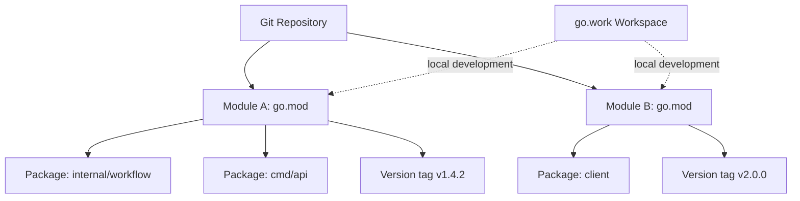
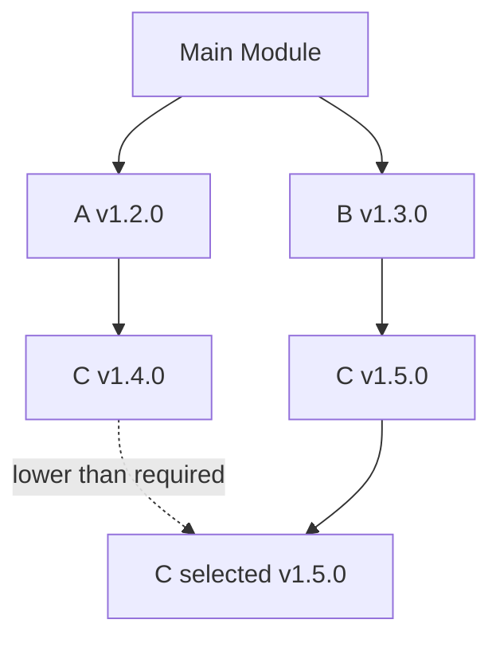
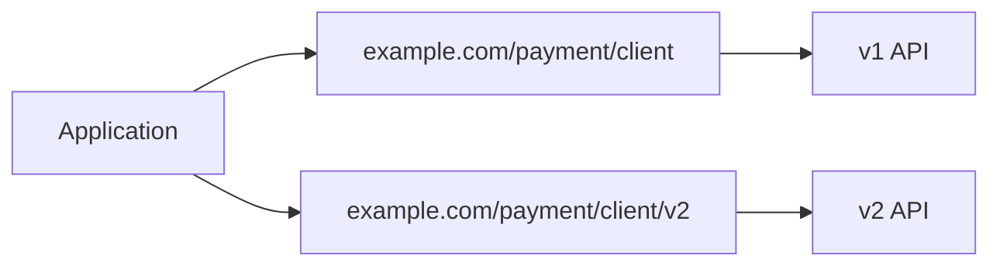
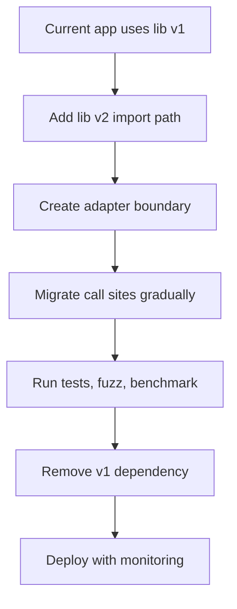
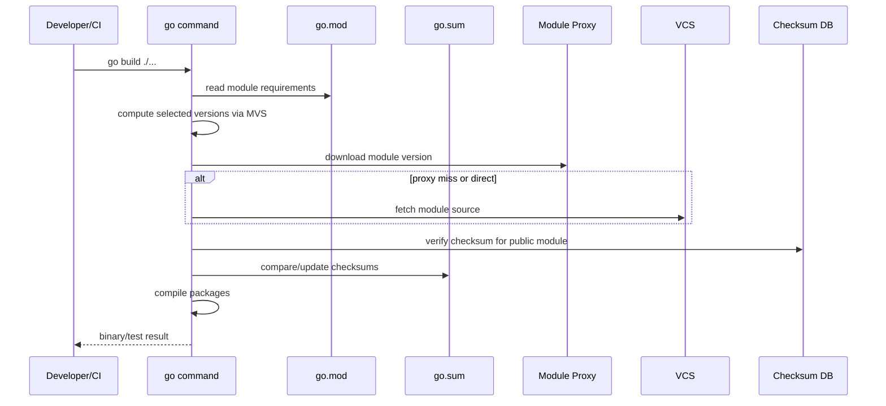

# learn-go-part-010.md

# Go Modules & Dependency Management: `go.mod`, Semantic Import Versioning, Proxy, Checksum DB, Private Modules, Vendor, and Production Upgrade Strategy

> Seri: `learn-go`  
> Part: `010`  
> Target pembaca: Java software engineer yang ingin menguasai Go pada level production/internal engineering handbook  
> Target Go: Go 1.26.x  
> Status seri: belum selesai. Ini adalah part 010 dari 034.

---

## 0. Tujuan Part Ini

Di part sebelumnya, kita sudah membahas package design: package sebagai boundary arsitektur, exported API, `internal`, `cmd`, module layout, dan dependency direction.

Part ini membahas pertanyaan yang lebih operasional sekaligus arsitektural:

> Bagaimana Go memastikan dependency build dapat direproduksi, diverifikasi, di-upgrade, dipisahkan antara public dan private, serta tetap stabil ketika module ecosystem berubah?

Setelah menyelesaikan part ini, kamu harus mampu:

1. memahami perbedaan **package**, **module**, **repository**, **version**, dan **workspace**;
2. membaca dan mendesain `go.mod` secara sadar;
3. menjelaskan Minimal Version Selection atau MVS tanpa sekadar menghafal;
4. memahami semantic import versioning, terutama `/v2`, `/v3`, dan seterusnya;
5. mengelola `go.sum`, Go module proxy, dan checksum database;
6. mengatur private modules dengan `GOPRIVATE`, `GONOPROXY`, `GONOSUMDB`, dan `GOINSECURE` secara aman;
7. membedakan `go get`, `go install`, `go mod tidy`, `go work`, dan vendor mode;
8. membuat strategi upgrade dependency yang aman untuk production;
9. mengenali failure mode supply-chain di Go;
10. membangun checklist dependency management untuk CI/CD enterprise.

Sumber resmi utama yang relevan:

- Go Modules Reference: <https://go.dev/ref/mod>
- Go 1.26 Release Notes: <https://go.dev/doc/go1.26>
- Go Modules: v2 and Beyond: <https://go.dev/blog/v2-go-modules>
- Publishing Go Modules: <https://go.dev/blog/publishing-go-modules>
- Using Go Modules: <https://go.dev/blog/using-go-modules>
- Module version numbering: <https://go.dev/doc/modules/version-numbers>
- Release History: <https://go.dev/doc/devel/release>
- `cmd/go` documentation: <https://pkg.go.dev/cmd/go>

---

## 1. Mental Model Utama

Di Java, dependency management biasanya dipikirkan dalam konteks Maven atau Gradle:

```text
pom.xml / build.gradle
  -> dependency graph
  -> transitive resolution
  -> conflict mediation
  -> repository manager
  -> build lifecycle
  -> artifact coordinates
```

Di Go, mental modelnya berbeda:

```text
go.mod
  -> module identity
  -> minimum dependency versions
  -> import path compatibility contract
  -> toolchain/language version boundary
  -> graph pruning/lazy loading behavior
  -> checksum-verifiable dependency source
```

Go module bukan sekadar “artifact descriptor”. Module adalah **unit versioning dan dependency resolution**.

Package adalah unit import dan compilation.

Repository adalah tempat source code disimpan.

Module path adalah identity yang dipakai di import path.

Version adalah tag semantic yang mengikat snapshot source module.

Workspace adalah mekanisme local development untuk beberapa module sekaligus.

---

## 2. Package vs Module vs Repository vs Workspace

### 2.1 Package

Package adalah unit source yang di-import:

```go
import "example.com/regcase/workflow"
```

Satu package biasanya berada dalam satu directory.

```text
workflow/
  transition.go
  state.go
  policy.go
```

Semua file `.go` non-test di directory yang sama harus memiliki package name yang sama.

### 2.2 Module

Module adalah kumpulan package yang dirilis, di-versioning, dan dikelola bersama.

```text
go.mod
internal/
caseworkflow/
caseaudit/
cmd/api/
```

Contoh `go.mod`:

```go
module example.com/aceas/regcase

go 1.26

toolchain go1.26.4

require (
    github.com/google/uuid v1.6.0
    golang.org/x/sync v0.12.0
)
```

`module example.com/aceas/regcase` berarti import path package di bawahnya akan menjadi:

```go
example.com/aceas/regcase/caseworkflow
example.com/aceas/regcase/cmd/api
example.com/aceas/regcase/internal/decision
```

### 2.3 Repository

Satu repository bisa berisi satu module:

```text
repo/
  go.mod
  cmd/
  internal/
```

Atau beberapa module:

```text
repo/
  platform/
    go.mod
  services/case-api/
    go.mod
  services/audit-worker/
    go.mod
```

Multi-module repo tidak otomatis lebih baik. Ia menambah complexity release, replace, workspace, dan versioning. Gunakan jika lifecycle module benar-benar berbeda.

### 2.4 Workspace

Workspace memakai `go.work` untuk local development beberapa module sekaligus.

```text
go.work
platform/
  go.mod
services/case-api/
  go.mod
services/audit-worker/
  go.mod
```

Contoh:

```go
// go.work
go 1.26

use (
    ./platform
    ./services/case-api
    ./services/audit-worker
)
```

Workspace berguna saat kamu mengembangkan beberapa module lokal yang saling bergantung tanpa harus push/tag setiap perubahan.

Namun `go.work` biasanya **tidak diandalkan sebagai artifact production build** kecuali organisasimu memang sengaja mengatur monorepo workflow seperti itu. Untuk release reproducible, setiap module tetap harus punya `go.mod` yang valid.

---

## 3. Diagram Mental Model



Ingat:

```text
Repository != Module
Module != Package
Package != Binary
Workspace != Release Contract
```

---

## 4. Anatomy `go.mod`

Contoh realistis:

```go
module example.com/agency/aceas

go 1.26

toolchain go1.26.4

require (
    github.com/google/uuid v1.6.0
    golang.org/x/sync v0.12.0
    golang.org/x/time v0.9.0
)

require (
    github.com/klauspost/compress v1.17.11 // indirect
)

replace example.com/agency/platform => ../platform

exclude github.com/example/badlib v1.2.3
```

### 4.1 `module`

`module` mendefinisikan module path.

```go
module example.com/agency/aceas
```

Ini bukan sekadar nama. Ia menjadi root import path.

Jika package berada di:

```text
internal/workflow
```

maka import path-nya:

```go
example.com/agency/aceas/internal/workflow
```

### 4.2 `go`

```go
go 1.26
```

Directive ini menyatakan minimum Go language version semantics untuk module. Ini juga memengaruhi behavior module graph pruning/lazy loading dan compatibility mode tertentu.

Jangan anggap `go` directive hanya dokumentasi.

### 4.3 `toolchain`

```go
toolchain go1.26.4
```

Directive ini dapat menyarankan toolchain yang digunakan. Ini penting untuk tim karena developer dan CI seharusnya membangun dengan versi toolchain yang konsisten.

Prinsip production:

```text
Pin major/minor language expectation with go directive.
Pin practical build toolchain with toolchain directive or CI image.
Never rely on random developer-local Go version for release build.
```

### 4.4 `require`

```go
require github.com/google/uuid v1.6.0
```

`require` menyatakan minimum version dependency yang dibutuhkan module ini.

Kata “minimum” sangat penting. Go menggunakan Minimal Version Selection, bukan Maven nearest-wins atau Gradle dynamic conflict resolution.

### 4.5 `indirect`

```go
require github.com/klauspost/compress v1.17.11 // indirect
```

`indirect` berarti module dibutuhkan oleh graph, tetapi package dari module itu tidak langsung di-import oleh package utama module kamu, atau diperlukan untuk module graph consistency.

Jangan manual menghapus semua indirect dependency. Pakai `go mod tidy` dan review diff.

### 4.6 `replace`

```go
replace example.com/agency/platform => ../platform
```

`replace` mengubah lokasi atau version module.

Use case:

- local development;
- temporary fork;
- emergency patch;
- internal mirror;
- monorepo development.

Risiko:

- lupa menghapus local `replace` sebelum release;
- CI tidak punya path lokal;
- build developer berbeda dari production;
- audit dependency menjadi misleading.

Rule:

```text
A replace directive in production branch must be intentional, reviewed, and documented.
```

### 4.7 `exclude`

```go
exclude github.com/example/badlib v1.2.3
```

`exclude` mencegah version tertentu dipilih.

Use case:

- version broken;
- security issue;
- module metadata corrupt;
- upstream tag accidental.

Namun `exclude` bukan security policy lengkap. Untuk vulnerability, kamu tetap butuh scanning dan upgrade.

### 4.8 `retract`

`retract` digunakan oleh module author untuk memberi tahu bahwa version tertentu tidak seharusnya digunakan.

Contoh:

```go
retract v1.2.0 // broken release: corrupt transaction handling
```

Retraction tidak menghapus version dari internet. Ia memberi sinyal ke tooling.

---

## 5. `go.sum`: Bukan Lockfile Maven/Gradle

Banyak Java engineer mengira `go.sum` sama seperti lockfile. Itu tidak sepenuhnya benar.

`go.sum` menyimpan cryptographic checksums untuk module content dan `go.mod` dependency yang pernah dibutuhkan oleh module graph.

Ia membantu memastikan bahwa module yang di-download hari ini sama dengan module yang sebelumnya diverifikasi.

Namun selected versions terutama ditentukan oleh:

```text
go.mod + MVS + module graph
```

Bukan oleh `go.sum`.

### 5.1 Apa yang Harus Di-commit?

Commit:

```text
go.mod
go.sum
```

Jangan ignore `go.sum` untuk application/service module.

### 5.2 Kenapa `go.sum` Bisa Berisi Dependency yang Tidak Terlihat Dipakai?

Karena module graph, historical verification, test dependencies, atau transitive go.mod checksums dapat tersimpan.

Jangan bersihkan manual. Gunakan:

```bash
go mod tidy
```

---

## 6. Minimal Version Selection atau MVS

Ini inti dependency resolution Go.

### 6.1 Intuisi

MVS memilih **versi minimum tertinggi** yang dibutuhkan oleh seluruh graph.

Misal:

```text
Main module requires A v1.2.0 and B v1.3.0
A v1.2.0 requires C v1.4.0
B v1.3.0 requires C v1.5.0
```

Maka selected version C adalah:

```text
C v1.5.0
```

Karena itulah minimum version tertinggi yang dibutuhkan graph.

### 6.2 Diagram



### 6.3 Kenapa Go Memilih MVS?

MVS didesain agar resolution:

- deterministic;
- simple;
- explainable;
- tidak berubah hanya karena upstream merilis version baru;
- tidak perlu global SAT solver;
- cocok dengan compatibility rule Go.

Di Maven, conflict mediation bisa menghasilkan dependency yang berbeda tergantung jarak dependency dalam tree. Di Go, selected version adalah hasil graph minimum requirement.

### 6.4 Konsekuensi Praktis

Jika dependency D sudah selected di v1.8.0, menambahkan module baru yang require D v1.6.0 tidak akan menurunkan D.

Jika menambahkan module baru yang require D v1.9.0, D naik ke v1.9.0.

MVS tidak otomatis memilih latest.

Untuk upgrade:

```bash
go get example.com/lib@latest
```

Untuk downgrade:

```bash
go get example.com/lib@v1.2.3
```

Untuk melihat graph:

```bash
go mod graph
```

Untuk menjelaskan mengapa module dibutuhkan:

```bash
go mod why -m example.com/lib
```

---

## 7. Semantic Import Versioning

Go punya aturan penting:

> Jika dua package memiliki import path yang sama, versi baru harus backwards compatible dengan versi lama.

Karena itu, breaking change major version v2+ harus memakai import path berbeda.

### 7.1 v0 dan v1

Untuk v0 dan v1:

```go
module example.com/payment/client
```

Import:

```go
import "example.com/payment/client"
```

Version tags:

```text
v0.9.0
v1.0.0
v1.2.3
```

### 7.2 v2 dan Seterusnya

Untuk v2:

```go
module example.com/payment/client/v2
```

Import:

```go
import "example.com/payment/client/v2"
```

Version tag:

```text
v2.0.0
v2.1.0
```

Ini terasa aneh untuk Java engineer karena di Maven, group/artifact bisa tetap sama dengan version major berbeda, lalu dependency mediation memilih satu versi. Di Go, import path membawa compatibility boundary.

### 7.3 Kenapa `/v2` Penting?

Karena Go memungkinkan v1 dan v2 coexist dalam satu program.

```go
import (
    clientv1 "example.com/payment/client"
    clientv2 "example.com/payment/client/v2"
)
```

Ini berguna untuk gradual migration.

### 7.4 Diagram



### 7.5 Kesalahan Umum

Salah:

```go
module example.com/payment/client
```

Tetapi tag:

```text
v2.0.0
```

Untuk module-aware v2, module path harus mengandung `/v2`.

---

## 8. Pseudo-Version

Kadang dependency belum punya semantic tag. Go dapat memakai pseudo-version.

Contoh bentuk:

```text
v0.0.0-20260401123000-abcdef123456
```

Pseudo-version merepresentasikan commit tertentu.

Gunakan dengan hati-hati:

```bash
go get example.com/lib@abcdef123456
```

Production guideline:

```text
Prefer tagged semantic versions for production dependencies.
Allow pseudo-version only for temporary emergency patch or internal module workflow.
Track and clean up pseudo-versions.
```

---

## 9. `go get` vs `go install`

### 9.1 `go get`

Di module mode, `go get` mengubah dependency di `go.mod`.

Contoh:

```bash
go get github.com/google/uuid@v1.6.0
```

Ini berarti:

```text
Tambahkan atau ubah module dependency untuk current module.
```

### 9.2 `go install`

Untuk menginstall executable command pada version tertentu:

```bash
go install golang.org/x/tools/cmd/stringer@latest
```

Ini tidak dimaksudkan untuk mengubah dependency application module.

Mental model:

```text
go get     -> manage module dependency
go install -> install command binary
```

---

## 10. Tool Dependencies

Sejak Go modern, tool dependencies bisa dilacak lebih eksplisit melalui `tool` directive dalam `go.mod`.

Contoh konseptual:

```go
tool golang.org/x/tools/cmd/stringer
```

Prinsipnya: tool yang dipakai build/generate/lint sebaiknya punya versi yang dapat direproduksi, bukan tergantung binary acak di laptop developer.

Production guideline:

```text
If a tool affects generated code, schema, API, mocks, or release artifact, pin it.
```

Contoh tool yang sering perlu dipin:

- code generator;
- mock generator;
- protobuf generator wrapper;
- OpenAPI generator wrapper;
- static analysis command;
- migration generator;
- enum/string generator.

---

## 11. `go mod tidy`

`go mod tidy` menyelaraskan `go.mod` dan `go.sum` dengan import yang benar-benar dibutuhkan oleh packages dan tests dalam module.

Jalankan setelah:

- menambah import;
- menghapus import;
- upgrade dependency;
- refactor package;
- menghapus generated code;
- update Go version;
- sebelum commit dependency diff.

Command:

```bash
go mod tidy
```

Best practice CI:

```bash
go mod tidy
git diff --exit-code -- go.mod go.sum
```

Jika diff muncul, developer belum merapikan module files.

---

## 12. Module Proxy dan Checksum Database

Secara default, Go dapat menggunakan module proxy dan checksum database untuk mengunduh dan memverifikasi dependency.

### 12.1 GOPROXY

Default umumnya:

```bash
GOPROXY=https://proxy.golang.org,direct
```

Artinya:

1. coba download dari proxy;
2. jika tidak tersedia, coba langsung ke VCS.

Enterprise sering memakai internal proxy:

```bash
GOPROXY=https://goproxy.company.example,https://proxy.golang.org,direct
```

Atau untuk environment tertutup:

```bash
GOPROXY=https://goproxy.company.example
```

### 12.2 GOSUMDB

Checksum database membantu memastikan module content tidak berubah diam-diam.

Default:

```bash
GOSUMDB=sum.golang.org
```

Untuk environment tertutup, organisasi bisa mengatur policy sendiri.

### 12.3 Privacy Concern

Jika kamu memakai private module tanpa konfigurasi, Go command bisa mencoba query module path ke public proxy/sumdb. Ini bisa membocorkan nama module private.

Karena itu, private module harus dikonfigurasi.

---

## 13. Private Modules

Untuk private modules, pakai `GOPRIVATE`.

Contoh:

```bash
go env -w GOPRIVATE=git.company.example,github.com/company/*
```

Ini memberi tahu Go command bahwa path tersebut private, sehingga matching modules tidak memakai public proxy/checksum database default.

### 13.1 GOPRIVATE Pattern

Contoh:

```bash
GOPRIVATE=github.com/myorg/*
```

Atau:

```bash
GOPRIVATE=*.corp.example.com
```

### 13.2 GONOPROXY dan GONOSUMDB

`GOPRIVATE` adalah high-level setting. Jika perlu kontrol lebih halus:

```bash
GONOPROXY=github.com/myorg/*
GONOSUMDB=github.com/myorg/*
```

Use case:

- private module boleh lewat internal proxy;
- private module tidak boleh diverifikasi ke public sumdb;
- company punya private checksum database.

### 13.3 GOINSECURE

`GOINSECURE` mengizinkan fetch tanpa HTTPS atau skip certificate verification untuk pattern tertentu.

Gunakan sebagai last resort, bukan default.

```text
GOINSECURE is an exception mechanism, not an enterprise architecture.
```

Untuk production, perbaiki TLS/internal CA/proxy, jangan membiasakan insecure fetch.

---

## 14. Authentication untuk Private Module

Go command biasanya mengandalkan Git/VCS credential mechanism.

Pattern umum:

### 14.1 SSH

```bash
git@github.com:company/private-module.git
```

Configure Git URL rewrite:

```bash
git config --global url."ssh://git@github.com/".insteadOf "https://github.com/"
```

### 14.2 HTTPS Token

Gunakan credential helper, bukan hardcode token di URL.

Buruk:

```bash
go get https://token@github.com/company/private-module
```

Lebih baik:

```bash
git credential-manager
```

atau CI secret injection via credential helper.

### 14.3 CI

CI harus punya:

```text
- GOPRIVATE configured
- credentials available only at build time
- no token printed in logs
- module cache handled intentionally
- dependency audit/scanning step
```

---

## 15. Replace Directive: Local Power, Production Risk

`replace` sangat berguna tapi berbahaya.

### 15.1 Local Development

```go
replace example.com/company/platform => ../platform
```

Ini membuat service memakai local checkout.

### 15.2 Temporary Fork

```go
replace github.com/vendor/lib => github.com/company/lib v1.2.3-company.1
```

Ini dapat dipakai untuk emergency patch.

Harus disertai:

```text
- alasan
- owner
- expiry plan
- upstream PR/reference
- security review jika terkait vulnerability
```

### 15.3 Anti-Pattern

```go
replace github.com/vendor/lib => ../random-local-path
```

di branch release adalah red flag.

CI akan gagal atau, lebih buruk, build tidak merepresentasikan source yang diaudit.

---

## 16. Vendoring

Go dapat membuat vendor directory:

```bash
go mod vendor
```

Build dengan vendor mode:

```bash
go build -mod=vendor ./...
```

### 16.1 Kapan Vendor Berguna?

- air-gapped build;
- regulatory environment;
- strict supply-chain review;
- reproducible build tanpa network;
- dependency snapshot untuk audit.

### 16.2 Kapan Vendor Tidak Perlu?

- tim kecil dengan internet CI stabil;
- internal proxy sudah reliable;
- dependency scanning memakai module metadata;
- vendor directory membuat review noise besar.

### 16.3 Rule

```text
Use either module proxy/cache strategy or vendor strategy intentionally.
Do not vendor accidentally.
```

Jika memakai vendor, CI harus memastikan vendor konsisten:

```bash
go mod vendor
git diff --exit-code -- vendor modules.txt
```

---

## 17. Workspace: `go.work`

Workspace menyelesaikan masalah local multi-module development.

Contoh:

```bash
go work init ./platform ./case-api ./audit-worker
```

Akan menghasilkan:

```go
go 1.26

use (
    ./platform
    ./case-api
    ./audit-worker
)
```

### 17.1 Kapan Memakai Workspace?

Gunakan ketika:

- monorepo punya beberapa module;
- kamu mengubah library internal dan service pemakai bersamaan;
- kamu ingin test integration antar module sebelum tag release;
- kamu ingin menghindari banyak `replace` lokal.

### 17.2 Kapan Jangan Memakai Workspace?

Hindari menjadikan `go.work` sebagai cara menutupi dependency contract yang buruk.

Jika service hanya bisa build karena workspace lokal, tapi `go.mod`-nya sendiri tidak valid, release pipeline akan rapuh.

### 17.3 Production Guideline

```text
Each module must be buildable from its own go.mod.
go.work is a development convenience, not a substitute for module release hygiene.
```

---

## 18. Upgrade Strategy

Dependency upgrade bukan sekadar menjalankan `go get -u ./...`.

Untuk production service, upgrade harus dikontrol.

### 18.1 Upgrade Satu Dependency

```bash
go get github.com/google/uuid@v1.6.0
go mod tidy
go test ./...
```

### 18.2 Upgrade Patch/Minor Secara Selektif

```bash
go list -m -u all
```

Lalu pilih module yang ingin di-upgrade:

```bash
go get golang.org/x/sync@latest
```

### 18.3 Upgrade Semua Dependency

```bash
go get -u ./...
go mod tidy
go test ./...
```

Ini boleh untuk project kecil, tetapi untuk production service besar sebaiknya dilakukan dalam PR terpisah, bukan digabung dengan feature besar.

### 18.4 Upgrade Major Version

Major v2+ biasanya butuh import path change.

```go
import old "example.com/lib"
import new "example.com/lib/v2"
```

Migration plan:

1. baca release notes/changelog;
2. import v2 berdampingan jika perlu;
3. buat adapter jika boundary besar;
4. migrate call site bertahap;
5. hapus v1;
6. jalankan test dan benchmark;
7. monitor production metrics.

### 18.5 Diagram Upgrade Major



---

## 19. Vulnerability Management

Go ecosystem menyediakan tooling vulnerability scanning melalui `govulncheck`.

Production dependency management harus mencakup:

```text
- go list -m all
- govulncheck ./...
- dependency review in PR
- pinned toolchain
- reproducible CI
- private module hygiene
- SBOM if required by organization
```

Contoh CI step:

```bash
go version
go env GOPRIVATE GOPROXY GOSUMDB
go mod download
go mod verify
go test ./...
govulncheck ./...
```

`go mod verify` memverifikasi module cache terhadap expected checksums.

---

## 20. Build Reproducibility

Build reproducibility di Go dipengaruhi oleh:

- Go toolchain version;
- `go.mod`;
- `go.sum`;
- environment variables;
- cgo enabled/disabled;
- OS/architecture;
- build tags;
- vendoring/proxy availability;
- generated code;
- embedded files;
- linker flags;
- time/version metadata.

### 20.1 Build Info

Go binary dapat menyimpan module build info.

Command:

```bash
go version -m ./app
```

Ini berguna untuk incident debugging:

```text
Which Go version built this binary?
Which module versions were selected?
Was there a replace directive?
Was CGO enabled?
```

### 20.2 Build Metadata

Contoh:

```bash
go build \
  -ldflags "-X main.version=${VERSION} -X main.commit=${COMMIT} -X main.buildTime=${BUILD_TIME}" \
  -o bin/case-api ./cmd/case-api
```

Jangan taruh secret di build metadata.

---

## 21. Environment Variables yang Penting

### 21.1 `GOMOD`

Menunjukkan path `go.mod` aktif.

```bash
go env GOMOD
```

### 21.2 `GOWORK`

Menunjukkan workspace file aktif.

```bash
go env GOWORK
```

Jika build membingungkan, cek apakah kamu tanpa sadar berada di workspace.

### 21.3 `GOMODCACHE`

Lokasi module cache.

```bash
go env GOMODCACHE
```

### 21.4 `GOCACHE`

Build cache.

```bash
go env GOCACHE
```

### 21.5 `GOPROXY`, `GOSUMDB`, `GOPRIVATE`

Sudah dibahas di atas. Ini penting untuk private dependency dan supply-chain.

### 21.6 `GOFLAGS`

`GOFLAGS` dapat menyisipkan flag default ke Go command.

Ini powerful tapi berbahaya jika tersembunyi di environment developer.

Cek:

```bash
go env GOFLAGS
```

Production CI sebaiknya eksplisit.

---

## 22. Dependency Graph Inspection

### 22.1 List Modules

```bash
go list -m all
```

### 22.2 Available Update

```bash
go list -m -u all
```

### 22.3 JSON Output

```bash
go list -m -json all
```

Berguna untuk automation.

### 22.4 Why Module Exists

```bash
go mod why -m github.com/some/lib
```

### 22.5 Graph

```bash
go mod graph
```

### 22.6 Download Dependencies

```bash
go mod download
```

Useful untuk CI cache warmup.

---

## 23. Production Example: Regulatory Case Service

Misal kita membangun service Go untuk enforcement lifecycle:

```text
case-api
  - receives enforcement case transition requests
  - validates role and state transition
  - persists audit trail
  - publishes async event
  - integrates with agency platform library
```

Repository:

```text
aceas-go/
  platform/
    go.mod
    authz/
    audit/
    clock/
  services/
    case-api/
      go.mod
      cmd/case-api/
      internal/workflow/
      internal/httpapi/
      internal/store/
    audit-worker/
      go.mod
      cmd/audit-worker/
      internal/consumer/
```

`services/case-api/go.mod`:

```go
module example.com/agency/aceas/services/case-api

go 1.26

toolchain go1.26.4

require (
    example.com/agency/aceas/platform v0.8.2
    github.com/google/uuid v1.6.0
    golang.org/x/sync v0.12.0
)
```

Local workspace:

```go
go 1.26

use (
    ./platform
    ./services/case-api
    ./services/audit-worker
)
```

Production release should not depend on accidental local workspace state.

CI for `case-api`:

```bash
cd services/case-api

go version
go env GOPRIVATE GOPROXY GOSUMDB GOWORK

go mod download
go mod verify
go mod tidy
git diff --exit-code -- go.mod go.sum

go test -race ./...
go build -trimpath -o bin/case-api ./cmd/case-api
```

---

## 24. Dependency Boundary Design

A common production mistake is treating dependency management as purely mechanical.

Actually, dependency choice affects architecture.

### 24.1 Ask Before Adding Dependency

Before adding a dependency, ask:

```text
1. Is this solving domain complexity or just saving 20 lines of code?
2. Is the package stable and maintained?
3. Does it pull large transitive graph?
4. Is its API compatible with our error/context/logging model?
5. Does it use global state?
6. Does it spawn goroutines?
7. Does it own network connections?
8. Does it support context cancellation?
9. Does it have security-sensitive behavior?
10. Can we replace it later behind our own boundary?
```

### 24.2 Wrap Infrastructure Dependencies

Do not let external dependency types leak everywhere.

Bad:

```go
func ApproveCase(ctx context.Context, db *sqlx.DB, kafka *kafka.Writer, logger *zap.Logger) error
```

Better:

```go
type CaseStore interface {
    SaveApproval(ctx context.Context, approval Approval) error
}

type EventPublisher interface {
    PublishCaseApproved(ctx context.Context, event CaseApproved) error
}
```

External libraries stay at adapter boundary.

---

## 25. Supply-Chain Failure Modes

| Failure Mode | Symptom | Root Cause | Prevention |
|---|---|---|---|
| Private module leaks to public proxy | CI logs show lookup to proxy.golang.org | Missing `GOPRIVATE` | Configure `GOPRIVATE` in developer and CI env |
| Build works locally, fails in CI | `replace ../lib` path missing | Local replace committed | Review `replace`; use workspace locally |
| Unexpected dependency upgrade | `go get -u ./...` in feature PR | Uncontrolled broad upgrade | Separate dependency upgrade PR |
| v2 module import fails | module path lacks `/v2` | Semantic import versioning violation | Use `/v2` in module and import path |
| Reproducibility issue | Different binary behavior | Different Go toolchain/env/build tags | Pin toolchain/CI image; log `go env` |
| Checksum mismatch | Download verification fails | Upstream retagged or cache corruption | Treat as incident; investigate, do not bypass blindly |
| Vulnerable transitive dependency | Security scan fails | Stale dependency graph | Regular `govulncheck` and upgrades |
| Hidden generated-code dependency | CI cannot regenerate | Tool not pinned | Track tool dependencies |
| Accidental workspace dependency | Build only works in monorepo root | `go.work` masks invalid module | Test module standalone |
| Vendor stale | Build uses old code | `vendor/` not regenerated | CI vendor consistency check |

---

## 26. Java Comparison: Maven/Gradle vs Go Modules

| Concept | Java Maven/Gradle | Go Modules |
|---|---|---|
| Unit of dependency | Artifact | Module |
| Import/use site | package/class import independent of artifact version | import path tied to module path and major version |
| Conflict resolution | Maven nearest-wins, Gradle strategies | Minimal Version Selection |
| Lockfile | Gradle lockfile optional, Maven has dependency tree | `go.mod` + MVS; `go.sum` verifies content |
| Major breaking version | same artifact often possible | `/v2`+ import path required |
| Repository | Maven repo/artifact repository | module proxy and/or VCS |
| Checksum verification | repository/tooling dependent | checksum database and `go.sum` |
| Tool install | plugins/tasks | `go install pkg@version`, tool directives |
| Workspace | multi-module build | `go.work` |

The biggest mental shift:

```text
In Go, import path is part of the compatibility model.
```

---

## 27. Anti-Patterns

### 27.1 Using Dependency Because It Exists

Go standard library is strong. Many small dependencies are unnecessary.

Bad signs:

```text
- adding dependency for trivial string helper
- adding dependency for simple retry without understanding idempotency
- adding framework before knowing net/http
- adding config library that hides precedence rules
```

### 27.2 Committing Random Replace

```go
replace github.com/vendor/lib => ../lib
```

This can make builds unreproducible.

### 27.3 Ignoring `go.sum`

Do not delete `go.sum` because it “looks noisy”.

### 27.4 Blind `go get -u ./...`

This can update many dependencies at once. In production, that creates large diff and unclear failure attribution.

### 27.5 Leaking External Types Across Domain

If your domain service signatures contain vendor-specific types everywhere, replacing dependency later becomes expensive.

### 27.6 Treating v0 as Stable

v0 means API may change. You can use v0 dependencies, but know the risk.

### 27.7 Disabling SumDB Without Reason

For public modules, checksum verification is a security feature. Do not disable casually.

---

## 28. Practical Commands Cheat Sheet

### Initialize Module

```bash
go mod init example.com/company/service
```

### Add Dependency

```bash
go get github.com/google/uuid@v1.6.0
```

### Upgrade Dependency

```bash
go get github.com/google/uuid@latest
```

### Downgrade Dependency

```bash
go get github.com/google/uuid@v1.5.0
```

### Tidy

```bash
go mod tidy
```

### Verify Module Cache

```bash
go mod verify
```

### List Modules

```bash
go list -m all
```

### Check Updates

```bash
go list -m -u all
```

### Explain Dependency

```bash
go mod why -m github.com/google/uuid
```

### Show Graph

```bash
go mod graph
```

### Vendor

```bash
go mod vendor
```

### Build with Vendor

```bash
go build -mod=vendor ./...
```

### Create Workspace

```bash
go work init ./module-a ./module-b
```

### Add Module to Workspace

```bash
go work use ./module-c
```

### Disable Workspace for Command

```bash
GOWORK=off go test ./...
```

This is useful to test that a module stands alone.

---

## 29. CI/CD Blueprint

### 29.1 Public Module Service

```bash
set -euo pipefail

go version
go env GOPROXY GOSUMDB GOPRIVATE GOWORK GOFLAGS

GOWORK=off go mod download
GOWORK=off go mod verify
GOWORK=off go mod tidy

git diff --exit-code -- go.mod go.sum

GOWORK=off go test ./...
GOWORK=off go test -race ./...
GOWORK=off go build -trimpath -o bin/service ./cmd/service
```

### 29.2 Private Enterprise Module Service

```bash
set -euo pipefail

export GOPRIVATE="git.company.example,github.com/company/*"
export GOPROXY="https://goproxy.company.example,direct"
export GOSUMDB="sum.golang.org"

go version
go env GOPRIVATE GOPROXY GOSUMDB GOWORK GOFLAGS

GOWORK=off go mod download
GOWORK=off go mod verify
GOWORK=off go mod tidy

git diff --exit-code -- go.mod go.sum

GOWORK=off go test ./...
GOWORK=off go build -trimpath -o bin/case-api ./cmd/case-api
```

If private modules should not contact public sumdb, configure `GONOSUMDB` or `GOPRIVATE` appropriately.

---

## 30. Mermaid: Dependency Resolution and Build Flow



---

## 31. Hands-On Lab

### Lab 1: Create a Module

```bash
mkdir regcase-demo
cd regcase-demo
go mod init example.com/regcase-demo
mkdir -p cmd/api internal/workflow
```

Create:

```go
// internal/workflow/state.go
package workflow

type State string

const (
    StateDraft    State = "DRAFT"
    StateReviewed State = "REVIEWED"
    StateApproved State = "APPROVED"
)
```

```go
// cmd/api/main.go
package main

import (
    "fmt"

    "example.com/regcase-demo/internal/workflow"
)

func main() {
    fmt.Println(workflow.StateDraft)
}
```

Run:

```bash
go run ./cmd/api
```

### Lab 2: Add Dependency

```bash
go get github.com/google/uuid@v1.6.0
```

Use it:

```go
id := uuid.NewString()
```

Run:

```bash
go mod tidy
go list -m all
```

### Lab 3: Inspect Why Dependency Exists

```bash
go mod why -m github.com/google/uuid
```

### Lab 4: Workspace

Create two modules:

```bash
mkdir -p ../platform
cd ../platform
go mod init example.com/platform
```

Create workspace:

```bash
cd ..
go work init ./regcase-demo ./platform
```

Test standalone:

```bash
cd regcase-demo
GOWORK=off go test ./...
```

### Lab 5: Private Module Simulation

Do not actually leak private path. Just inspect env:

```bash
go env GOPRIVATE GOPROXY GOSUMDB
```

Set example:

```bash
go env -w GOPRIVATE=github.com/your-company/*
```

Undo if needed:

```bash
go env -u GOPRIVATE
```

---

## 32. Review Questions

1. Apa perbedaan package, module, repository, dan workspace?
2. Kenapa `go.sum` bukan lockfile dalam arti Maven/Gradle lockfile?
3. Apa yang dipilih oleh Minimal Version Selection?
4. Kenapa v2 module harus memakai `/v2` dalam module path dan import path?
5. Kapan `replace` aman digunakan?
6. Apa risiko `replace` di production branch?
7. Apa fungsi `GOPRIVATE`?
8. Apa beda `GONOPROXY` dan `GONOSUMDB`?
9. Kapan vendor mode masuk akal?
10. Kenapa `go.work` tidak boleh menjadi pengganti release hygiene?
11. Bagaimana cara mengetahui kenapa sebuah module ada dalam dependency graph?
12. Apa yang harus dicek dalam PR dependency upgrade?
13. Bagaimana cara mencegah private module name bocor ke public proxy?
14. Kenapa major upgrade di Go sering butuh perubahan import path?
15. Apa saja variable yang memengaruhi reproducibility build?

---

## 33. Production Checklist

Sebelum merge PR yang mengubah dependency:

```text
[ ] go.mod diff masuk akal
[ ] go.sum diff masuk akal
[ ] tidak ada replace lokal yang tidak disengaja
[ ] tidak ada pseudo-version tanpa alasan
[ ] major version path benar (/v2, /v3, ...)
[ ] go mod tidy sudah dijalankan
[ ] go mod verify sukses
[ ] go test ./... sukses
[ ] race test dijalankan untuk area concurrent jika relevan
[ ] dependency vulnerability check dijalankan
[ ] private modules tidak bocor ke public proxy/sumdb
[ ] CI memakai toolchain yang jelas
[ ] generated-code tools dipin jika memengaruhi output
[ ] upgrade besar dipisah dari feature logic jika mungkin
[ ] changelog/release notes dependency penting sudah dibaca
[ ] rollback plan tersedia untuk dependency risk tinggi
```

---

## 34. Invariants yang Harus Diingat

1. **Module adalah unit versioning. Package adalah unit import.**
2. **`go.mod` mendefinisikan dependency requirement; `go.sum` memverifikasi content.**
3. **Go memakai Minimal Version Selection, bukan Maven-style nearest-wins.**
4. **Import path adalah compatibility contract.**
5. **Breaking major version v2+ harus punya path `/v2`, `/v3`, dan seterusnya.**
6. **`replace` adalah alat tajam: berguna lokal, berisiko di release.**
7. **Private module harus dikonfigurasi agar tidak bocor ke public proxy/checksum database.**
8. **`go.work` membantu development, bukan pengganti module release correctness.**
9. **Dependency upgrade adalah perubahan production behavior, bukan housekeeping kosong.**
10. **Dependency boundary adalah keputusan arsitektur.**

---

## 35. Koneksi ke Part Berikutnya

Part berikutnya adalah:

```text
learn-go-part-011.md
Standard Library Mental Model:
io, bytes, strings, bufio, context, time, errors, cmp, slices, maps
```

Kenapa setelah dependency management kita masuk standard library?

Karena Go engineer yang kuat biasanya tidak langsung mencari third-party dependency. Ia memahami dulu standard library dan tahu kapan dependency eksternal benar-benar layak ditambahkan.

Part 011 akan membangun mental model standard library sebagai “platform kecil” Go: composable, explicit, interface-oriented, dan production-ready.

---

## 36. Status Seri

```text
Seri: learn-go
Part selesai: 000, 001, 002, 003, 004, 005, 006, 007, 008, 009, 010
Part berikutnya: 011
Total rencana: 035 part, dari 000 sampai 034
Status: belum selesai
```

<!-- NAVIGATION_FOOTER -->
<div class="page-nav">
<a href="./learn-go-part-009.md">⬅️ Go Package Design: Exported API, `internal`, `cmd`, Module Layout, Dependency Direction, dan Stable Public Contracts</a>
<a href="./index.md">📚 Kategori</a>
<a href="../../index.md">🏠 Home</a>
<a href="./learn-go-part-011.md">Go Standard Library Mental Model: `io`, `bytes`, `strings`, `bufio`, `context`, `time`, `errors`, `cmp`, `slices`, `maps` ➡️</a>
</div>
