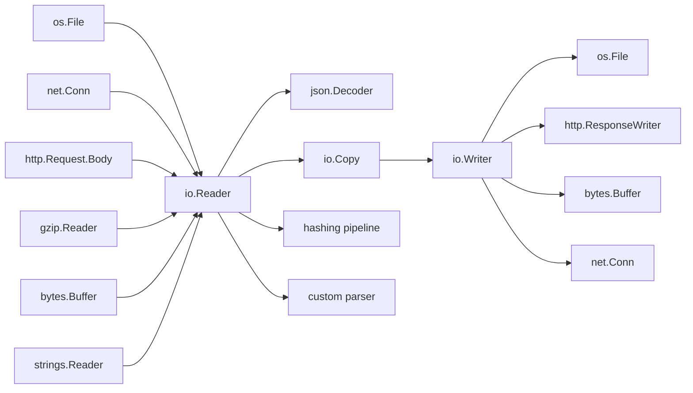
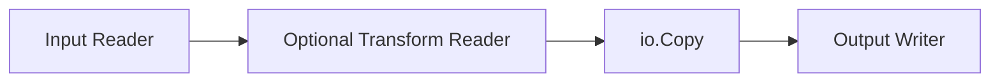
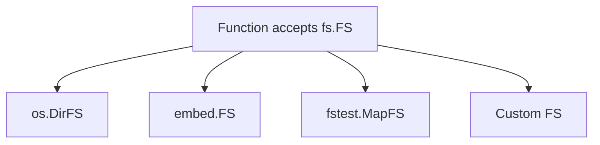
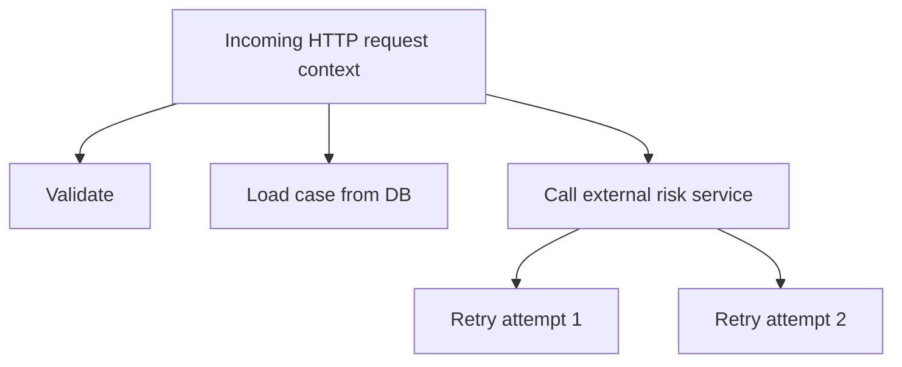
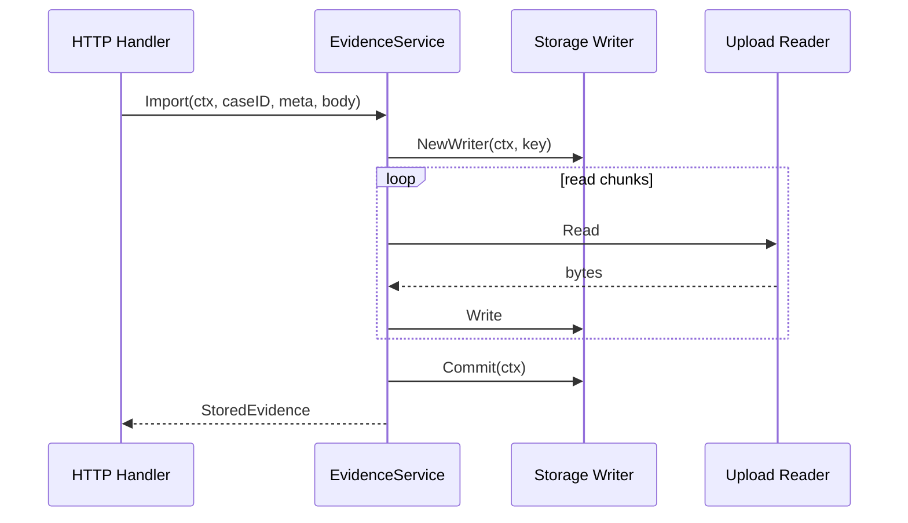

# learn-go-part-011.md

# Go Standard Library Mental Model: `io`, `bytes`, `strings`, `bufio`, `context`, `time`, `errors`, `cmp`, `slices`, `maps`

> Seri: `learn-go`  
> Part: `011`  
> Target pembaca: Java software engineer yang ingin menguasai Go secara production-grade  
> Target versi: Go 1.26.x  
> Status: bagian 011 dari 034, seri belum selesai

---

## 0. Tujuan Part Ini

Part sebelumnya membahas package dan dependency management. Sekarang kita masuk ke salah satu kekuatan terbesar Go: **standard library**.

Banyak engineer baru Go melakukan dua kesalahan ekstrem:

1. Menganggap standard library Go terlalu kecil, lalu cepat-cepat menambah dependency eksternal.
2. Menghafal nama package tanpa memahami contract yang mengikat package-package tersebut.

Keduanya salah.

Standard library Go bukan sekadar kumpulan utilitas. Ia adalah **bahasa desain**. Banyak arsitektur Go production-grade dibangun dari beberapa interface dan convention kecil:

```go
io.Reader
io.Writer
io.Closer
context.Context
error
fmt.Stringer
encoding.TextMarshaler
sort.Interface
```

Kalau di Java kamu sering belajar melalui framework seperti Spring, Jakarta EE, Hibernate, Netty, Reactor, atau Micrometer, di Go kamu harus lebih dulu memahami **primitive contract** dari standard library. Framework boleh datang belakangan.

Part ini bertujuan memberi mental model berikut:

```text
Standard library Go bukan hanya "library bawaan".
Ia adalah vocabulary bersama untuk membangun program Go.

Jika sebuah dependency eksternal idiomatik,
ia hampir pasti akan menerima atau mengembalikan tipe/contract standard library.
```

---

## 1. Sumber Resmi yang Menjadi Dasar

Materi ini disusun berdasarkan sumber resmi Go:

- Go package documentation untuk `io`, `context`, `time`, `errors`, `bytes`, `strings`, `bufio`, `cmp`, `slices`, `maps`, `iter`.
- Effective Go.
- Go blog tentang `context`.
- Go specification.
- Go 1.26 release notes.
- Go Code Review Comments.

Beberapa fakta penting:

- Package `io` mendefinisikan primitive I/O seperti `Reader`, `Writer`, `Closer`, `Seeker`, dan utility seperti `Copy`, `ReadAll`, `LimitReader`, `MultiReader`, `TeeReader`, `Pipe`.
- Package `io/fs` mendefinisikan abstraction file system yang tidak harus berasal dari OS filesystem.
- Package `io/ioutil` sudah deprecated sejak Go 1.16; fungsi-fungsinya dipindahkan ke `io` atau `os`.
- Package `context` membawa deadline, cancellation signal, dan request-scoped values lintas API boundary.
- Package `errors` mendukung wrapping, unwrapping, matching, type extraction, dan joining errors.
- Package `cmp`, `slices`, dan `maps` menyediakan generic helpers untuk operasi common collection.
- Go 1.26 membawa sejumlah update standard library dan runtime yang harus dibaca bersama release notes, tetapi prinsip mental model standard library tetap stabil.

---

## 2. Mental Model Besar: Standard Library sebagai Contract Layer

Dalam Java, library sering dibangun dari class besar, annotation, SPI, dan framework lifecycle.

Dalam Go, standard library sering dibangun dari interface kecil:

```go
type Reader interface {
    Read(p []byte) (n int, err error)
}

type Writer interface {
    Write(p []byte) (n int, err error)
}
```

Kekuatan model ini bukan di jumlah method. Justru kekuatannya ada pada **kecilnya surface area**.

Satu tipe yang bisa `Read` bisa dipakai oleh:

- HTTP request body
- file
- gzip reader
- bytes buffer
- strings reader
- network connection
- tar reader
- JSON decoder
- custom encrypted stream
- test fake reader

Satu tipe yang bisa `Write` bisa dipakai oleh:

- HTTP response writer
- file
- bytes buffer
- network connection
- hash function
- gzip writer
- log sink
- test recorder

Diagram mentalnya:



Kalau kamu memahami `io.Reader` dan `io.Writer`, kamu memahami salah satu axis terbesar desain Go.

---

## 3. Peta Standard Library yang Paling Penting untuk Production Engineer

Standard library sangat luas. Part ini tidak akan membahas semua package. Fokusnya adalah package yang menjadi pondasi desain.

| Area | Package | Mental Model |
|---|---|---|
| Streaming I/O | `io` | Contract berbasis stream: read, write, copy, close |
| In-memory bytes | `bytes` | Mutable byte buffer dan byte-oriented operations |
| In-memory text | `strings` | Immutable string reader/builder/manipulation |
| Buffered I/O | `bufio` | Batching read/write untuk mengurangi syscall atau call overhead |
| Filesystem abstraction | `io/fs` | File system sebagai interface, bukan selalu OS directory |
| Cancellation | `context` | Request lifetime, deadline, cancellation propagation |
| Time | `time` | Instants, duration, timers, tickers, monotonic clock |
| Errors | `errors` | Wrapping, matching, joining, classification foundation |
| Formatting | `fmt` | Human-oriented formatting, scanning, string representation |
| Logging | `log/slog` | Structured logging standard library |
| Collection helpers | `cmp`, `slices`, `maps` | Generic operations untuk comparison, slice, map |
| Iteration | `iter` | Iterator convention untuk generic iteration |
| Encoding | `encoding/json`, `encoding/xml`, `encoding/csv`, etc. | Data boundary serialization |
| Hashing/Crypto | `hash`, `crypto/*` | Integrity/security primitive |
| Runtime | `runtime`, `runtime/metrics`, `runtime/pprof`, `runtime/trace` | Production introspection |
| Testing | `testing`, `testing/fstest`, `httptest`, `iotest` | Test harness dan fake standard library |

Part ini fokus pada core mental model. Package HTTP, database, serialization, runtime, testing, profiling, observability, dan security akan dibahas lebih dalam di part khusus.

---

## 4. `io`: Contract Terpenting dalam Standard Library Go

### 4.1 `io.Reader`

Signature:

```go
type Reader interface {
    Read(p []byte) (n int, err error)
}
```

Makna contract:

- Caller menyediakan buffer `p`.
- Callee mengisi maksimal `len(p)` byte.
- Return `n` menyatakan jumlah byte yang valid di `p[:n]`.
- Return `err` menyatakan status operasi.
- `n` bisa > 0 walaupun `err != nil`.
- Caller harus memproses byte yang dibaca sebelum memproses error.

Ini berbeda dari banyak API Java yang sering mengembalikan byte array baru atau memakai stream object dengan lifecycle framework tertentu.

Contoh benar:

```go
func Drain(r io.Reader, w io.Writer) error {
    buf := make([]byte, 32*1024)
    for {
        n, err := r.Read(buf)
        if n > 0 {
            if _, werr := w.Write(buf[:n]); werr != nil {
                return werr
            }
        }
        if err != nil {
            if errors.Is(err, io.EOF) {
                return nil
            }
            return err
        }
    }
}
```

Hal penting:

```text
n > 0 harus diproses bahkan ketika err != nil.
```

Banyak bug streaming muncul karena kode melakukan ini:

```go
n, err := r.Read(buf)
if err != nil {
    return err
}
process(buf[:n])
```

Kode tersebut bisa membuang data terakhir jika `Read` mengembalikan `n > 0` dan `err == io.EOF` pada call yang sama.

---

### 4.2 `io.Writer`

Signature:

```go
type Writer interface {
    Write(p []byte) (n int, err error)
}
```

Makna contract:

- Caller memberikan byte slice `p`.
- Callee menulis sebagian atau seluruh byte.
- Return `n` menyatakan jumlah byte yang berhasil ditulis.
- Kalau `n < len(p)`, writer harus mengembalikan non-nil error.
- Caller tidak boleh mengasumsikan write selalu full tanpa memeriksa error.

Contoh defensive helper:

```go
func WriteAll(w io.Writer, p []byte) error {
    for len(p) > 0 {
        n, err := w.Write(p)
        if n > 0 {
            p = p[n:]
        }
        if err != nil {
            return err
        }
        if n == 0 {
            return io.ErrShortWrite
        }
    }
    return nil
}
```

Dalam praktik, `io.Copy` sudah menangani banyak detail ini.

---

### 4.3 `io.Closer`

```go
type Closer interface {
    Close() error
}
```

`Close` bukan dekorasi. Ia bagian dari resource lifecycle.

Contoh:

```go
resp, err := client.Do(req)
if err != nil {
    return err
}
defer resp.Body.Close()
```

Kalau response body tidak ditutup, connection reuse bisa terganggu, file descriptor bocor, dan service menjadi tidak stabil.

Untuk writer, error dari `Close` bisa penting, misalnya buffered writer, gzip writer, file writer, atau transactional stream.

Contoh:

```go
func WriteGzipFile(path string, payload []byte) (err error) {
    f, err := os.Create(path)
    if err != nil {
        return err
    }
    defer func() {
        if closeErr := f.Close(); err == nil && closeErr != nil {
            err = closeErr
        }
    }()

    zw := gzip.NewWriter(f)
    defer func() {
        if closeErr := zw.Close(); err == nil && closeErr != nil {
            err = closeErr
        }
    }()

    _, err = zw.Write(payload)
    return err
}
```

Kenapa `Close` gzip penting?

Karena writer seperti gzip mungkin menulis trailer/checksum saat `Close`.

---

### 4.4 Kombinasi Interface: `ReadCloser`, `WriteCloser`, `ReadWriter`

Go sering membuat interface kecil lalu menggabungkannya:

```go
type ReadCloser interface {
    Reader
    Closer
}

type ReadWriter interface {
    Reader
    Writer
}
```

Mental model:

```text
Interface composition = capability composition.
```

Jangan membuat interface besar jika caller hanya butuh `Read`.

Buruk:

```go
func ParseFile(f *os.File) (*Document, error)
```

Lebih fleksibel:

```go
func Parse(r io.Reader) (*Document, error)
```

Jika butuh nama file untuk error/reporting, pisahkan metadata:

```go
func Parse(r io.Reader, sourceName string) (*Document, error)
```

---

## 5. Streaming vs Buffering: Salah Satu Keputusan Desain Paling Penting

Di Go, kamu harus sering memilih antara:

```text
streaming:
  proses data sedikit demi sedikit

buffering:
  baca seluruh data ke memory dulu
```

### 5.1 Buffering dengan `io.ReadAll`

```go
body, err := io.ReadAll(r)
if err != nil {
    return err
}
```

Ini sederhana, tetapi berisiko jika input tidak dibatasi.

Anti-pattern:

```go
func handler(w http.ResponseWriter, r *http.Request) {
    body, err := io.ReadAll(r.Body) // unbounded
    if err != nil {
        http.Error(w, err.Error(), http.StatusBadRequest)
        return
    }
    _ = body
}
```

Production-safe:

```go
func readLimited(r io.Reader, maxBytes int64) ([]byte, error) {
    lr := io.LimitReader(r, maxBytes+1)
    b, err := io.ReadAll(lr)
    if err != nil {
        return nil, err
    }
    if int64(len(b)) > maxBytes {
        return nil, fmt.Errorf("payload too large: max=%d", maxBytes)
    }
    return b, nil
}
```

Invariant:

```text
Setiap ReadAll terhadap input eksternal harus punya batas.
```

---

### 5.2 Streaming dengan `io.Copy`

```go
n, err := io.Copy(dst, src)
if err != nil {
    return fmt.Errorf("copy payload: %w", err)
}
_ = n
```

`io.Copy` adalah primitive besar untuk pipeline:



Contoh upload file ke hash dan output sekaligus:

```go
func CopyAndHash(dst io.Writer, src io.Reader) ([]byte, int64, error) {
    h := sha256.New()
    mw := io.MultiWriter(dst, h)

    n, err := io.Copy(mw, src)
    if err != nil {
        return nil, n, err
    }
    return h.Sum(nil), n, nil
}
```

---

### 5.3 `io.TeeReader`

`TeeReader` membaca dari reader dan menulis semua byte yang dibaca ke writer.

```go
func DecodeAndHash(r io.Reader, v any) ([]byte, error) {
    h := sha256.New()
    tr := io.TeeReader(r, h)

    if err := json.NewDecoder(tr).Decode(v); err != nil {
        return nil, err
    }
    return h.Sum(nil), nil
}
```

Use case:

- audit hash
- duplicate stream ke log terbatas
- checksum
- metering bytes read

Caveat:

```text
TeeReader tidak membuat stream rewindable.
Ia hanya menyalin saat data dibaca.
```

---

### 5.4 `io.MultiReader` dan `io.MultiWriter`

`MultiReader` menyambung beberapa reader secara sequential.

```go
r := io.MultiReader(
    strings.NewReader("header\n"),
    file,
    strings.NewReader("\nfooter\n"),
)
```

`MultiWriter` menulis ke beberapa writer.

```go
mw := io.MultiWriter(file, hash, metricsWriter)
_, err := io.Copy(mw, src)
```

Failure mode:

```text
MultiWriter berhenti saat salah satu writer error.
Jangan pakai untuk fan-out yang membutuhkan isolasi failure antar sink.
```

---

### 5.5 `io.Pipe`

`io.Pipe` menghubungkan writer dan reader secara synchronous, tanpa buffer besar internal.

```go
pr, pw := io.Pipe()

go func() {
    defer pw.Close()
    zw := gzip.NewWriter(pw)
    defer zw.Close()
    _, _ = zw.Write([]byte("payload"))
}()

_, err := io.Copy(dst, pr)
```

Use case:

- streaming transform antar goroutine
- upload sambil compress
- producer/consumer dengan backpressure natural

Caveat:

```text
io.Pipe mudah deadlock jika reader/writer tidak punya lifecycle jelas.
Gunakan CloseWithError untuk propagate failure.
```

Contoh lebih benar:

```go
func GzipStream(src io.Reader) io.Reader {
    pr, pw := io.Pipe()

    go func() {
        zw := gzip.NewWriter(pw)
        _, copyErr := io.Copy(zw, src)
        closeErr := zw.Close()

        if copyErr != nil {
            _ = pw.CloseWithError(copyErr)
            return
        }
        if closeErr != nil {
            _ = pw.CloseWithError(closeErr)
            return
        }
        _ = pw.Close()
    }()

    return pr
}
```

---

## 6. `bytes` vs `strings`: Byte-Oriented vs Text-Oriented Memory

### 6.1 `string` di Go

`string` di Go adalah immutable sequence of bytes.

Penting:

```text
string bukan sequence of rune.
len(s) = jumlah byte, bukan jumlah karakter Unicode.
```

Contoh:

```go
s := "é"
fmt.Println(len(s))         // 2 bytes in UTF-8
fmt.Println(utf8.RuneCountInString(s)) // 1 rune
```

Java engineer sering menganggap `String.length()` sebagai jumlah UTF-16 code units. Go berbeda: `len(string)` adalah byte length.

---

### 6.2 `strings.Reader`

Jika punya string dan butuh `io.Reader`:

```go
r := strings.NewReader("hello")
```

Use case:

- tests
- fake request body
- parse text source

Contoh:

```go
func TestParse(t *testing.T) {
    doc, err := Parse(strings.NewReader("case: approved"))
    if err != nil {
        t.Fatal(err)
    }
    _ = doc
}
```

---

### 6.3 `bytes.Buffer`

`bytes.Buffer` adalah mutable buffer byte yang juga implement `io.Reader` dan `io.Writer`.

```go
var b bytes.Buffer
b.WriteString("hello")
b.WriteByte('\n')

_, _ = io.Copy(os.Stdout, &b)
```

Use case:

- building output in memory
- tests
- temporary serialization
- capture writer output

Caveat:

```text
bytes.Buffer bisa tumbuh besar.
Jangan pakai sebagai default untuk payload eksternal besar.
```

---

### 6.4 `strings.Builder`

Untuk membangun string secara efisien:

```go
var b strings.Builder
b.WriteString("case-")
b.WriteString("123")
result := b.String()
```

Pilihannya:

| Kebutuhan | Pilihan |
|---|---|
| Build text final string | `strings.Builder` |
| Build binary or bytes | `bytes.Buffer` |
| Need `io.Writer` for bytes | `bytes.Buffer` |
| Need text reader | `strings.Reader` |
| Need byte reader | `bytes.Reader` |

---

## 7. `bufio`: Mengendalikan Granularity I/O

`bufio` memberi buffering di atas reader/writer.

Tanpa buffering, banyak operasi kecil bisa mahal karena memicu banyak syscall atau banyak call ke underlying reader/writer.

### 7.1 Buffered Reader

```go
br := bufio.NewReader(r)
line, err := br.ReadString('\n')
```

Untuk scanner line-based:

```go
scanner := bufio.NewScanner(r)
for scanner.Scan() {
    line := scanner.Text()
    _ = line
}
if err := scanner.Err(); err != nil {
    return err
}
```

Caveat penting:

```text
bufio.Scanner punya token size limit default.
Untuk line besar, atur buffer atau pakai Reader.
```

Contoh:

```go
scanner := bufio.NewScanner(r)
scanner.Buffer(make([]byte, 64*1024), 10*1024*1024)
```

---

### 7.2 Buffered Writer

```go
bw := bufio.NewWriter(w)
_, err := bw.WriteString("hello\n")
if err != nil {
    return err
}
if err := bw.Flush(); err != nil {
    return err
}
```

Invariant:

```text
Jika memakai bufio.Writer, Flush adalah bagian dari lifecycle.
```

Anti-pattern:

```go
bw := bufio.NewWriter(w)
bw.WriteString("hello")
return nil // data bisa belum terkirim
```

---

## 8. `io/fs`: File System sebagai Interface

Package `io/fs` membuat filesystem menjadi abstraction.

Bukan hanya OS filesystem:

- embedded files dengan `embed.FS`
- test filesystem dengan `fstest.MapFS`
- virtual filesystem
- zip/tar-like abstraction

Mental model:

```text
Jangan desain API dengan path string jika sebenarnya hanya butuh membaca file dari filesystem.
Gunakan fs.FS jika ingin testable dan source-agnostic.
```

Contoh:

```go
func LoadTemplates(fsys fs.FS, dir string) ([]string, error) {
    entries, err := fs.ReadDir(fsys, dir)
    if err != nil {
        return nil, err
    }

    var names []string
    for _, e := range entries {
        if e.IsDir() {
            continue
        }
        names = append(names, e.Name())
    }
    return names, nil
}
```

Test:

```go
func TestLoadTemplates(t *testing.T) {
    fsys := fstest.MapFS{
        "templates/a.tmpl": {Data: []byte("a")},
        "templates/b.tmpl": {Data: []byte("b")},
    }

    names, err := LoadTemplates(fsys, "templates")
    if err != nil {
        t.Fatal(err)
    }
    _ = names
}
```

Diagram:



---

## 9. `context`: Request Lifetime, Bukan Dependency Bag

### 9.1 Apa Itu `context.Context`?

`context.Context` membawa:

- cancellation signal
- deadline
- timeout
- request-scoped value

Ia bukan:

- service locator
- dependency injection container
- optional parameter bag
- logger bag sembarangan
- place untuk business data besar

Contoh signature idiomatik:

```go
func (s *Service) ApproveCase(ctx context.Context, id CaseID, actor Actor) error
```

Konvensi:

```text
Context biasanya parameter pertama.
Jangan simpan context di struct untuk request-scoped operation.
```

---

### 9.2 Cancellation Tree



Jika request client cancel atau timeout, semua operasi child harus berhenti.

Contoh:

```go
func (s *Service) Process(ctx context.Context, id string) error {
    caseData, err := s.repo.FindByID(ctx, id)
    if err != nil {
        return err
    }

    risk, err := s.risk.Evaluate(ctx, caseData)
    if err != nil {
        return err
    }

    return s.repo.SaveDecision(ctx, id, risk.Decision)
}
```

---

### 9.3 Timeout Layering

Timeout tidak boleh hanya satu di paling luar. Tapi juga tidak boleh berlebihan tanpa model.

Contoh layering:

```text
HTTP server request timeout:       30s
Business operation budget:         20s
DB query timeout:                   3s
External service timeout:           5s
Retry budget inside external call:  <= 5s total
```

Contoh:

```go
func (c *Client) Evaluate(ctx context.Context, req RiskRequest) (RiskResult, error) {
    ctx, cancel := context.WithTimeout(ctx, 5*time.Second)
    defer cancel()

    httpReq, err := http.NewRequestWithContext(ctx, http.MethodPost, c.url, encode(req))
    if err != nil {
        return RiskResult{}, err
    }

    resp, err := c.http.Do(httpReq)
    if err != nil {
        return RiskResult{}, err
    }
    defer resp.Body.Close()

    // decode...
    return RiskResult{}, nil
}
```

---

### 9.4 Context Values

Gunakan context value hanya untuk data request-scoped yang melintasi API boundary, seperti:

- correlation id
- trace id
- auth principal setelah middleware
- locale jika benar-benar request scoped

Jangan pakai untuk:

- database handle
- logger global
- config
- repository
- service
- business object besar

Typed key pattern:

```go
type contextKey string

const correlationIDKey contextKey = "correlation-id"

func WithCorrelationID(ctx context.Context, id string) context.Context {
    return context.WithValue(ctx, correlationIDKey, id)
}

func CorrelationID(ctx context.Context) (string, bool) {
    v, ok := ctx.Value(correlationIDKey).(string)
    return v, ok
}
```

---

### 9.5 Context Anti-Patterns

| Anti-pattern | Masalah |
|---|---|
| Store `context.Context` in struct | Lifetime menjadi kabur |
| Passing nil context | Panic atau unpredictable behavior |
| Context as DI container | Dependency tidak eksplisit |
| Context for optional business args | API contract tidak jelas |
| Ignoring `ctx.Err()` in long loop | Cancellation tidak dihormati |
| Creating timeout without `cancel()` | Timer resource bisa tertahan sampai timeout |

Long loop example:

```go
func ProcessMany(ctx context.Context, items []Item) error {
    for _, item := range items {
        if err := ctx.Err(); err != nil {
            return err
        }
        if err := processOne(ctx, item); err != nil {
            return err
        }
    }
    return nil
}
```

---

## 10. `time`: Instants, Durations, Timers, Tickers

### 10.1 `time.Time` dan `time.Duration`

```go
now := time.Now()
deadline := now.Add(5 * time.Minute)
latency := time.Since(now)
```

`time.Duration` adalah nanoseconds represented as int64.

```go
const RequestTimeout = 5 * time.Second
```

Jangan pakai raw integer untuk duration:

```go
// buruk
time.Sleep(5000)

// jelas
time.Sleep(5 * time.Second)
```

---

### 10.2 Monotonic Clock

`time.Time` yang berasal dari `time.Now()` bisa membawa monotonic clock reading untuk pengukuran durasi.

Praktik aman:

```go
start := time.Now()
// work
elapsed := time.Since(start)
```

Jangan menghitung latency dengan wall-clock string parsing jika tidak perlu.

---

### 10.3 Timer

```go
timer := time.NewTimer(5 * time.Second)
defer timer.Stop()

select {
case <-timer.C:
    return errors.New("timeout")
case result := <-done:
    return result.Err
}
```

Untuk sebagian besar request-scoped timeout, lebih idiomatik menggunakan `context.WithTimeout`.

---

### 10.4 Ticker

```go
ticker := time.NewTicker(1 * time.Minute)
defer ticker.Stop()

for {
    select {
    case <-ctx.Done():
        return ctx.Err()
    case <-ticker.C:
        collectMetrics()
    }
}
```

Invariant:

```text
Ticker harus Stop jika lifecycle selesai.
```

Anti-pattern:

```go
for range time.Tick(time.Second) {
    // sulit dihentikan; ticker tidak bisa Stop
}
```

---

### 10.5 Time Zone dan Serialization

Untuk storage/API, biasanya gunakan UTC.

```go
now := time.Now().UTC()
```

Untuk display, gunakan location user.

```go
loc, err := time.LoadLocation("Asia/Jakarta")
if err != nil {
    return err
}
fmt.Println(now.In(loc).Format(time.RFC3339))
```

Golden rules:

```text
Store instants in UTC.
Display in user/location context.
Never use local server timezone as business truth unless explicitly required.
```

---

## 11. `errors`: Matching dan Classification Foundation

Part 008 sudah membahas error secara dalam. Di sini kita letakkan `errors` sebagai standard library primitive.

### 11.1 `errors.New`

```go
var ErrNotFound = errors.New("not found")
```

Sentinel cocok untuk kondisi stabil yang memang boleh dicocokkan caller.

---

### 11.2 `fmt.Errorf` dengan `%w`

```go
if err != nil {
    return fmt.Errorf("load case %s: %w", id, err)
}
```

`%w` mempertahankan chain untuk `errors.Is` dan `errors.As`.

---

### 11.3 `errors.Is`

```go
if errors.Is(err, ErrNotFound) {
    return nil
}
```

`Is` menelusuri wrapping chain.

---

### 11.4 `errors.As`

```go
var validationErr *ValidationError
if errors.As(err, &validationErr) {
    return http.StatusBadRequest
}
```

---

### 11.5 `errors.Join`

`errors.Join` berguna ketika beberapa cleanup/error terjadi.

```go
func CloseAll(closers ...io.Closer) error {
    var errs []error
    for _, c := range closers {
        if err := c.Close(); err != nil {
            errs = append(errs, err)
        }
    }
    return errors.Join(errs...)
}
```

Caveat:

```text
Joined error bukan sekadar string gabungan.
errors.Is dan errors.As tetap bisa bekerja terhadap child error.
```

---

## 12. `fmt`: Formatting Bukan Logging Strategy

`fmt` sering dipakai untuk:

- format human-readable string
- implement error message
- debug sementara
- scan input sederhana

Contoh:

```go
msg := fmt.Sprintf("case %s approved by %s", caseID, actorID)
```

Untuk object representation, implement `String()`:

```go
type CaseID string

func (id CaseID) String() string {
    return string(id)
}
```

Caveat:

```text
fmt bukan structured logging.
Untuk production logging, gunakan log/slog atau logger structured lain.
```

---

## 13. `cmp`, `slices`, `maps`: Generic Helper Modern

Go modern menyediakan helper generic untuk collection common operations.

### 13.1 `cmp`

`cmp.Compare` dan `cmp.Or` berguna untuk ordering dan default fallback.

Contoh conceptual:

```go
func CompareCase(a, b Case) int {
    if c := cmp.Compare(a.Priority, b.Priority); c != 0 {
        return c
    }
    return cmp.Compare(a.CreatedAt.UnixNano(), b.CreatedAt.UnixNano())
}
```

### 13.2 `slices`

Common operations:

- `slices.Sort`
- `slices.SortFunc`
- `slices.Contains`
- `slices.Index`
- `slices.Clone`
- `slices.Equal`
- `slices.Delete`
- `slices.Compact`

Contoh:

```go
slices.SortFunc(cases, func(a, b Case) int {
    if c := cmp.Compare(a.Priority, b.Priority); c != 0 {
        return c
    }
    return a.CreatedAt.Compare(b.CreatedAt)
})
```

Clone sebelum mutate jika tidak ingin mengubah slice caller:

```go
func SortedCases(in []Case) []Case {
    out := slices.Clone(in)
    slices.SortFunc(out, func(a, b Case) int {
        return a.CreatedAt.Compare(b.CreatedAt)
    })
    return out
}
```

Invariant:

```text
Jika function tidak menyatakan akan mutate input, clone dulu sebelum sort/delete/compact.
```

### 13.3 `maps`

Common operations:

- clone map
- copy entries
- compare equal
- delete by function depending on version/API availability

Contoh clone:

```go
copied := maps.Clone(original)
```

Kenapa penting?

Map adalah reference-like value. Kalau kamu mengembalikan internal map langsung, caller bisa mutate state internal.

Buruk:

```go
func (c *Config) Labels() map[string]string {
    return c.labels
}
```

Lebih aman:

```go
func (c *Config) Labels() map[string]string {
    return maps.Clone(c.labels)
}
```

---

## 14. `iter`: Iteration sebagai Convention

Go modern memiliki package `iter` yang mendefinisikan iterator function convention.

Bentuk umum:

```go
type Seq[V any] func(yield func(V) bool)
type Seq2[K, V any] func(yield func(K, V) bool)
```

Mental model:

```text
Iterator di Go adalah function yang memanggil yield.
Jika yield mengembalikan false, producer harus berhenti.
```

Contoh sederhana:

```go
func ActiveCases(cases []Case) iter.Seq[Case] {
    return func(yield func(Case) bool) {
        for _, c := range cases {
            if c.Status == StatusClosed {
                continue
            }
            if !yield(c) {
                return
            }
        }
    }
}
```

Penggunaan:

```go
for c := range ActiveCases(cases) {
    fmt.Println(c.ID)
}
```

Caveat:

```text
Iterator membuat API elegan, tetapi jangan memaksa semua traversal menjadi iterator.
Untuk banyak kasus sederhana, slice lebih jelas.
```

---

## 15. Standard Library Testing Helpers yang Sering Dilupakan

Walaupun testing dibahas di part 026, beberapa package standard library membentuk desain testable:

| Package | Use Case |
|---|---|
| `httptest` | test HTTP handler/client |
| `iotest` | fake reader/writer dengan failure behavior |
| `fstest` | fake filesystem |
| `testing/fstest` | map-based test FS |
| `net/http/httptest` | server dan response recorder |
| `testing/quick` | property-like checks |

Contoh `iotest`:

```go
func TestReadFailure(t *testing.T) {
    r := iotest.ErrReader(errors.New("boom"))
    _, err := Load(r)
    if err == nil {
        t.Fatal("expected error")
    }
}
```

Mental model:

```text
Jika API menerima io.Reader, io.Writer, fs.FS, atau context.Context,
API itu jauh lebih mudah dites tanpa mocking framework besar.
```

---

## 16. Production Example: Regulatory Case Evidence Importer

Kita akan rancang importer evidence file untuk sistem case management.

Kebutuhan:

- menerima stream upload evidence
- membatasi ukuran maksimal
- menghitung SHA-256
- menyimpan ke storage
- decode metadata JSON sidecar
- menghormati cancellation
- menghasilkan audit-safe error

### 16.1 Domain Types

```go
type CaseID string

type EvidenceMeta struct {
    FileName    string `json:"file_name"`
    ContentType string `json:"content_type"`
    UploadedBy  string `json:"uploaded_by"`
}

type StoredEvidence struct {
    CaseID CaseID
    Hash   string
    Size   int64
}
```

### 16.2 Storage Interface

```go
type EvidenceStorage interface {
    Put(ctx context.Context, key string, r io.Reader) (int64, error)
}
```

Kenapa menerima `io.Reader`?

Karena storage tidak perlu tahu sumber data dari:

- HTTP upload
- file lokal
- generated content
- test string
- gzip reader
- encrypted stream

### 16.3 Service

```go
type EvidenceService struct {
    storage EvidenceStorage
    maxSize int64
}

func NewEvidenceService(storage EvidenceStorage, maxSize int64) *EvidenceService {
    if maxSize <= 0 {
        panic("maxSize must be positive")
    }
    return &EvidenceService{storage: storage, maxSize: maxSize}
}
```

### 16.4 Import Function

```go
func (s *EvidenceService) Import(
    ctx context.Context,
    caseID CaseID,
    meta EvidenceMeta,
    content io.Reader,
) (StoredEvidence, error) {
    if err := ctx.Err(); err != nil {
        return StoredEvidence{}, err
    }
    if caseID == "" {
        return StoredEvidence{}, errors.New("case id is required")
    }
    if meta.FileName == "" {
        return StoredEvidence{}, errors.New("file name is required")
    }

    limited := io.LimitReader(content, s.maxSize+1)
    hash := sha256.New()

    // Data read by storage will also feed hash.
    tee := io.TeeReader(limited, hash)

    key := fmt.Sprintf("cases/%s/evidence/%s", caseID, meta.FileName)
    n, err := s.storage.Put(ctx, key, tee)
    if err != nil {
        return StoredEvidence{}, fmt.Errorf("store evidence: %w", err)
    }
    if n > s.maxSize {
        return StoredEvidence{}, fmt.Errorf("evidence too large: max=%d", s.maxSize)
    }

    return StoredEvidence{
        CaseID: caseID,
        Hash:   hex.EncodeToString(hash.Sum(nil)),
        Size:   n,
    }, nil
}
```

Subtle issue:

```text
LimitReader maxSize+1 hanya efektif jika storage benar-benar membaca sampai EOF.
Jika storage berhenti lebih awal, size validation tidak membuktikan full input <= maxSize.
```

Alternative yang lebih kuat:

- storage API menerima limited reader dan mengembalikan bytes consumed
- HTTP handler sudah menerapkan `MaxBytesReader`
- service melakukan read/copy sendiri ke storage writer
- storage menyediakan writer API dengan explicit close/commit

### 16.5 More Controlled Design: Writer-Based Storage

```go
type EvidenceWriter interface {
    io.Writer
    Commit(ctx context.Context) error
    Abort(ctx context.Context) error
}

type EvidenceStorage2 interface {
    NewWriter(ctx context.Context, key string) (EvidenceWriter, error)
}
```

Flow:



Implementation sketch:

```go
func (s *EvidenceService) Import2(
    ctx context.Context,
    caseID CaseID,
    meta EvidenceMeta,
    content io.Reader,
) (out StoredEvidence, err error) {
    key := fmt.Sprintf("cases/%s/evidence/%s", caseID, meta.FileName)

    w, err := s.storage2.NewWriter(ctx, key)
    if err != nil {
        return StoredEvidence{}, fmt.Errorf("open evidence writer: %w", err)
    }

    committed := false
    defer func() {
        if !committed {
            _ = w.Abort(context.WithoutCancel(ctx))
        }
    }()

    h := sha256.New()
    mw := io.MultiWriter(w, h)

    limited := io.LimitReader(content, s.maxSize+1)
    n, err := io.Copy(mw, limited)
    if err != nil {
        return StoredEvidence{}, fmt.Errorf("copy evidence: %w", err)
    }
    if n > s.maxSize {
        return StoredEvidence{}, fmt.Errorf("evidence too large: max=%d", s.maxSize)
    }

    if err := w.Commit(ctx); err != nil {
        return StoredEvidence{}, fmt.Errorf("commit evidence: %w", err)
    }
    committed = true

    return StoredEvidence{
        CaseID: caseID,
        Hash:   hex.EncodeToString(h.Sum(nil)),
        Size:   n,
    }, nil
}
```

Kenapa `context.WithoutCancel(ctx)` untuk abort?

Karena kalau request context sudah cancel, kita tetap mungkin ingin melakukan cleanup best-effort. Ini harus dipakai hati-hati dan tidak untuk operasi panjang tanpa batas.

---

## 17. Design Heuristics: Kapan Pakai Apa?

### 17.1 Input Data

| Situasi | Pilihan |
|---|---|
| Data kecil dan sudah di memory | `[]byte` atau `string` |
| Data bisa besar | `io.Reader` |
| Perlu close resource | `io.ReadCloser` |
| Perlu random access | `io.ReaderAt` / `io.Seeker` |
| Perlu path filesystem | `fs.FS` + path |
| Perlu OS-specific file operation | `*os.File` |

### 17.2 Output Data

| Situasi | Pilihan |
|---|---|
| Output kecil sebagai value | `[]byte` / `string` |
| Output stream | `io.Writer` |
| Output perlu close/commit | custom interface embedding `io.Writer` |
| Output ke HTTP | `http.ResponseWriter` at boundary only |
| Output ke buffer test | `bytes.Buffer` |

### 17.3 Time and Cancellation

| Situasi | Pilihan |
|---|---|
| Request-scoped operation | `context.Context` |
| Operation timeout | `context.WithTimeout` |
| Periodic background work | `time.Ticker` + context |
| One-shot delay | `time.Timer` atau `time.After` |
| Latency measurement | `time.Since(start)` |
| Business timestamp | `time.Now().UTC()` via clock abstraction if tested |

### 17.4 Collection Helpers

| Situasi | Pilihan |
|---|---|
| Sort slice in place | `slices.Sort` / `slices.SortFunc` |
| Return sorted copy | `slices.Clone` then sort |
| Copy map for immutability boundary | `maps.Clone` |
| Compare ordered values | `cmp.Compare` |
| Fallback first non-zero comparable | `cmp.Or` |

---

## 18. Java-to-Go Mapping

| Java Habit | Go Equivalent | Important Shift |
|---|---|---|
| `InputStream` | `io.Reader` | Caller provides buffer; handle `n` before `err` |
| `OutputStream` | `io.Writer` | Check short writes/error |
| `Closeable` | `io.Closer` | `Close` error may matter |
| `try-with-resources` | `defer Close()` | Be careful with close errors and loops |
| `CompletableFuture timeout` | `context.WithTimeout` | Cancellation must be propagated manually |
| `Thread.interrupt` | `context cancellation` | Cooperative cancellation |
| `StringBuilder` | `strings.Builder` | Text builder |
| `ByteArrayOutputStream` | `bytes.Buffer` | Mutable byte buffer |
| `Collections.sort` | `slices.SortFunc` | Generic helper, often mutate in place |
| `Map.copyOf` | `maps.Clone` | Clone to protect ownership boundary |
| Exception hierarchy | `errors.Is/As` | Chain-based matching, not catch blocks |

---

## 19. Anti-Patterns

### 19.1 Accepting Concrete Types Too Early

Bad:

```go
func ParseFile(f *os.File) error
```

Better:

```go
func Parse(r io.Reader) error
```

Unless you truly need file-specific operations.

---

### 19.2 Unbounded `ReadAll`

Bad:

```go
b, _ := io.ReadAll(r.Body)
```

Better:

```go
b, err := readLimited(r.Body, 1<<20)
```

---

### 19.3 Ignoring `Close`

Bad:

```go
resp, _ := http.Get(url)
body, _ := io.ReadAll(resp.Body)
_ = body
```

Better:

```go
resp, err := http.Get(url)
if err != nil {
    return err
}
defer resp.Body.Close()
```

---

### 19.4 Context as Object Bag

Bad:

```go
ctx = context.WithValue(ctx, "db", db)
ctx = context.WithValue(ctx, "service", service)
```

Better:

```go
type Handler struct {
    service *Service
}
```

---

### 19.5 Sorting Caller-Owned Slice Without Saying So

Bad:

```go
func TopCases(cases []Case) []Case {
    slices.SortFunc(cases, compareCase)
    return cases[:10]
}
```

Better:

```go
func TopCases(cases []Case) []Case {
    out := slices.Clone(cases)
    slices.SortFunc(out, compareCase)
    if len(out) > 10 {
        out = out[:10]
    }
    return out
}
```

---

### 19.6 Forgetting `Flush`

Bad:

```go
bw := bufio.NewWriter(w)
bw.WriteString("x")
return nil
```

Better:

```go
bw := bufio.NewWriter(w)
if _, err := bw.WriteString("x"); err != nil {
    return err
}
return bw.Flush()
```

---

## 20. Production Review Checklist

Untuk API yang menggunakan standard library, cek:

```text
[ ] Apakah input stream besar diterima sebagai io.Reader, bukan []byte?
[ ] Apakah input eksternal yang di-ReadAll punya batas?
[ ] Apakah response/file/body selalu ditutup?
[ ] Apakah Close error penting ditangani?
[ ] Apakah bufio.Writer selalu Flush?
[ ] Apakah context ada di parameter pertama untuk operasi request-scoped?
[ ] Apakah context tidak disimpan di struct request-independent?
[ ] Apakah cancellation dihormati dalam loop panjang?
[ ] Apakah timeout layering jelas?
[ ] Apakah map/slice internal tidak bocor ke caller?
[ ] Apakah slice caller tidak dimutasi diam-diam?
[ ] Apakah time disimpan sebagai UTC untuk persistence/API?
[ ] Apakah ticker/timer dihentikan saat lifecycle selesai?
[ ] Apakah errors dibungkus dengan %w jika caller perlu inspect?
[ ] Apakah interface terlalu concrete atau terlalu besar?
```

---

## 21. Hands-On Labs

### Lab 1: Limited Reader

Buat function:

```go
func ReadJSONLimited[T any](r io.Reader, maxBytes int64) (T, error)
```

Requirements:

- input maksimal `maxBytes`
- decode JSON ke `T`
- return error jika payload terlalu besar
- jangan pakai global state
- test dengan `strings.NewReader`

---

### Lab 2: Hashing Copy

Buat function:

```go
func CopyWithSHA256(dst io.Writer, src io.Reader) (written int64, hash string, err error)
```

Requirements:

- streaming, tidak `ReadAll`
- hash sesuai bytes yang berhasil ditulis
- error wrapping jelas
- test dengan `bytes.Buffer`

---

### Lab 3: Context-Aware Batch Processing

Buat function:

```go
func ProcessItems(ctx context.Context, items []Item, fn func(context.Context, Item) error) error
```

Requirements:

- cek cancellation sebelum tiap item
- stop on first error
- wrap error dengan item identifier
- test cancellation

---

### Lab 4: Safe Sorted Copy

Buat function:

```go
func SortCasesByPriorityThenCreatedAt(cases []Case) []Case
```

Requirements:

- tidak mutate input
- pakai `slices.Clone`
- pakai `slices.SortFunc`
- compare priority lalu created time

---

### Lab 5: `fs.FS` Template Loader

Buat function:

```go
func LoadAllTemplates(fsys fs.FS, dir string) (map[string]string, error)
```

Requirements:

- baca semua file dalam directory
- skip subdirectory
- test dengan `fstest.MapFS`
- tidak bergantung pada working directory

---

## 22. Review Questions

1. Kenapa `io.Reader` menerima buffer dari caller, bukan mengembalikan `[]byte` baru setiap call?
2. Kenapa `n > 0` harus diproses sebelum `err` dalam loop `Read`?
3. Kapan `io.ReadAll` aman dipakai?
4. Kenapa `io.Reader` membuat API lebih testable dibanding `*os.File`?
5. Apa perbedaan `bytes.Buffer`, `bytes.Reader`, `strings.Reader`, dan `strings.Builder`?
6. Kenapa `bufio.Writer.Flush` harus dianggap lifecycle operation?
7. Kenapa `context.Context` tidak boleh menjadi dependency container?
8. Apa bedanya timeout di `context` dengan timeout di HTTP transport?
9. Kenapa map harus di-clone sebelum dikembalikan dari struct internal?
10. Kenapa sorting slice input bisa menjadi bug API contract?
11. Kapan `fs.FS` lebih baik daripada path string?
12. Apa failure mode `io.Pipe`?
13. Kenapa `time.Tick` sering kurang disukai dibanding `time.NewTicker`?
14. Kapan `errors.Join` masuk akal?
15. Bagaimana standard library membantu mengurangi kebutuhan mocking framework?

---

## 23. Invariants Part Ini

Ingat invariants berikut:

```text
1. io.Reader/io.Writer adalah contract streaming utama Go.
2. Process n bytes before handling read error.
3. Do not ReadAll untrusted input without a limit.
4. Close is part of resource lifecycle, not optional cleanup decoration.
5. Flush is part of buffered writer lifecycle.
6. Context carries cancellation/deadline/request-scoped values, not dependencies.
7. Timeouts must be layered intentionally.
8. Store instants in UTC; display with location.
9. Protect ownership boundaries: clone slices/maps before exposing or mutating.
10. Prefer standard library contracts at API boundaries.
```

---

## 24. Apa yang Akan Dibahas di Part 012

Part berikutnya akan masuk ke:

```text
Slices, Arrays, Maps:
Representation, Capacity, Aliasing, Mutation Hazards, dan Iteration Semantics
```

Part 012 sangat penting karena banyak bug Go production bukan berasal dari syntax, tetapi dari salah paham tentang:

- slice header
- backing array sharing
- append behavior
- map nil vs empty
- map iteration order
- concurrent map access
- mutation saat range
- ownership contract antar function

---

## 25. Status Seri

```text
Status: belum selesai
Progress: part 011 dari 034 selesai
Next: learn-go-part-012.md
```


<!-- NAVIGATION_FOOTER -->
<div class="page-nav">
<a href="./learn-go-part-010.md">⬅️ Go Modules & Dependency Management: `go.mod`, Semantic Import Versioning, Proxy, Checksum DB, Private Modules, Vendor, and Production Upgrade Strategy</a>
<a href="./index.md">📚 Kategori</a>
<a href="../../index.md">🏠 Home</a>
<a href="./learn-go-part-012.md">Go Slices, Arrays, and Maps: Representation, Capacity, Aliasing, Mutation Hazards, and Iteration Semantics ➡️</a>
</div>
