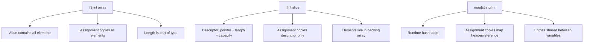
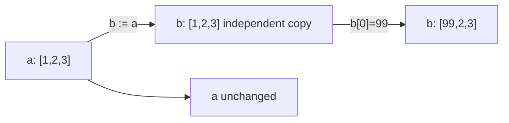
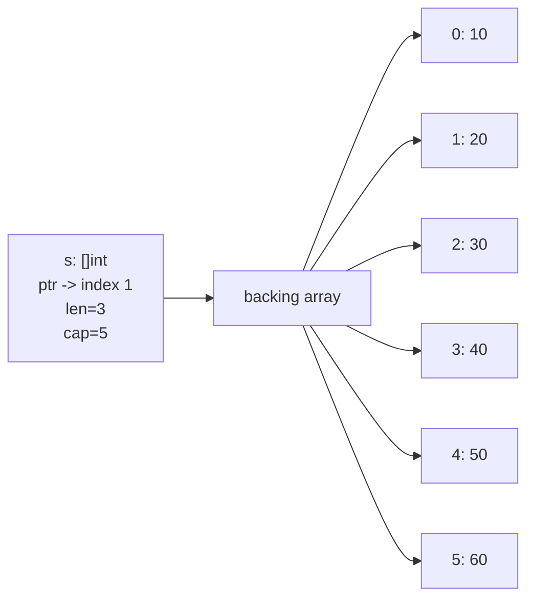
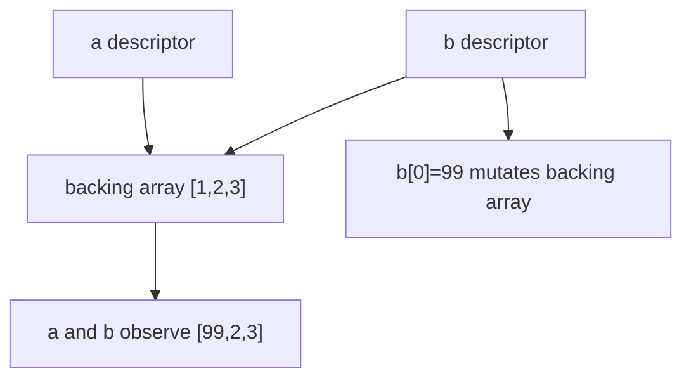
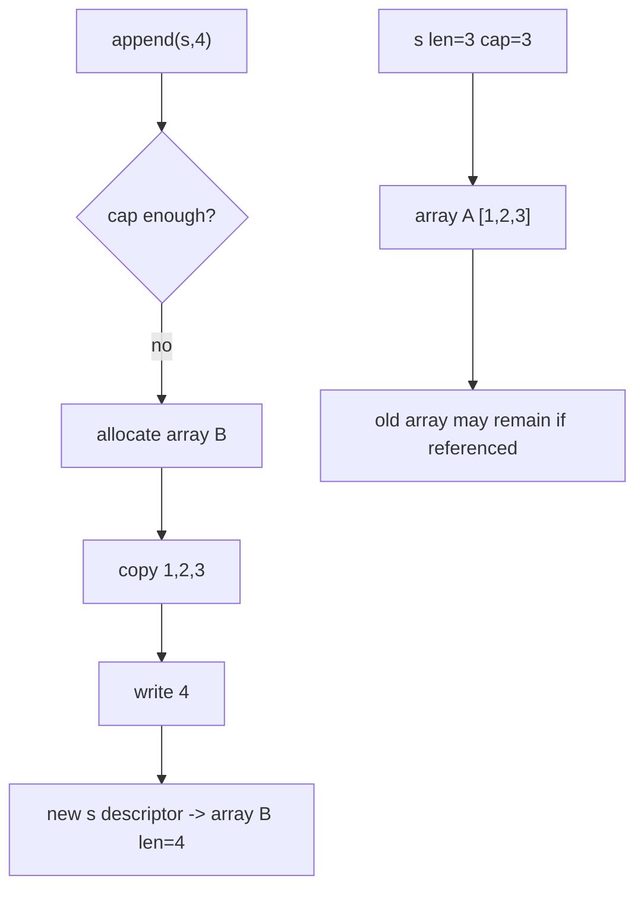
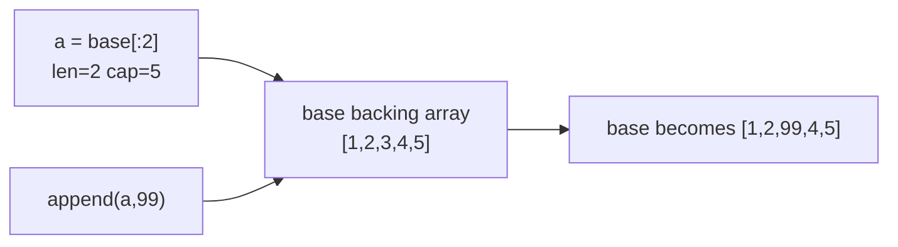
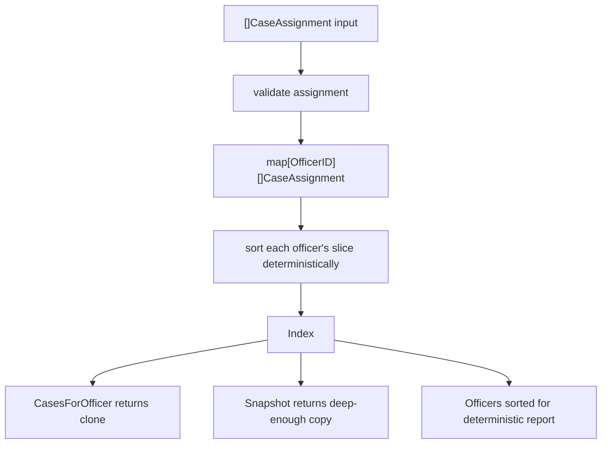

# learn-go-part-012.md

# Go Slices, Arrays, and Maps: Representation, Capacity, Aliasing, Mutation Hazards, and Iteration Semantics

> Seri: `learn-go`  
> Part: `012` dari `034`  
> Target pembaca: Java software engineer yang ingin naik ke level production-grade Go engineer  
> Target Go: Go 1.26.x  
> Status seri: belum selesai

---

## 0. Tujuan Part Ini

Setelah part sebelumnya, kamu sudah memiliki fondasi:

- syntax core;
- function;
- type system;
- composition;
- interface;
- generics;
- error handling;
- package/module design;
- standard library mental model.

Sekarang kita masuk ke salah satu area yang tampak mudah tetapi sering menjadi sumber bug Go production: **arrays, slices, dan maps**.

Di Java, kamu terbiasa dengan:

```java
List<T>
ArrayList<T>
Map<K,V>
HashMap<K,V>
byte[]
```

Di Go, surface-nya terlihat lebih sederhana:

```go
[]T
[N]T
map[K]V
```

Tetapi di balik syntax sederhana itu ada beberapa aturan fundamental:

```text
array:
  value tetap-size, bagian dari value semantics

slice:
  descriptor kecil yang menunjuk ke backing array

map:
  reference-like hash table runtime-managed

range:
  syntax iterasi yang memiliki copy semantics tertentu
```

Part ini tidak hanya menjelaskan "cara menggunakan slice/map", tetapi membangun mental model agar kamu bisa menjawab pertanyaan seperti:

- kapan `append` mengubah data lama?
- kapan `append` membuat backing array baru?
- kenapa sub-slice bisa menahan memory besar?
- kenapa modifying slice di function bisa terlihat oleh caller?
- kenapa assigning map ke variable lain tidak membuat copy?
- kenapa map tidak aman untuk concurrent writes?
- kenapa iteration order map tidak boleh diandalkan?
- kenapa `nil slice` dan `empty slice` sering penting untuk API JSON?
- kapan harus pakai array, kapan slice, kapan map?
- bagaimana membuat defensive copy yang benar?
- bagaimana mendesain API agar ownership collection jelas?

---

## 1. Sumber Resmi dan Rujukan Utama

Materi ini berlandaskan pada sumber resmi Go:

1. **The Go Programming Language Specification**  
   Menjelaskan definisi array, slice, map, addressability, comparability, indexing, slicing, dan `range`.

2. **Go Slices: usage and internals**  
   Blog resmi Go yang menjelaskan slice sebagai descriptor terhadap backing array.

3. **Arrays, slices (and strings): The mechanics of append**  
   Blog resmi Go yang menjelaskan slice header, append, capacity, dan backing array.

4. **Go maps in action**  
   Blog resmi Go yang menjelaskan penggunaan map, zero value, map of slices, dan idiom umum.

5. **Package `slices` dan `maps`**  
   Standard library generic helper yang dimasukkan sejak Go 1.21.

6. **Effective Go**  
   Menjelaskan idiom penggunaan arrays, slices, maps, allocation dengan `make`, dan composite literals.

7. **Go 1.26 release notes**  
   Relevan terutama karena Go modern semakin mendorong penggunaan generic helper seperti `slices` dan `maps`, serta modernisasi via `go fix`.

---

## 2. Mental Model Besar

### 2.1 Collection di Go Tidak Bisa Dipahami dari Syntax Saja

Di Go, tiga bentuk ini punya semantic yang sangat berbeda:

```go
var a [3]int
var s []int
var m map[string]int
```

Secara visual:



Kalau kamu salah memahami ini, kamu akan membuat bug yang sulit dilacak:

```go
func AddRole(roles []string) {
    roles = append(roles, "admin")
}
```

Apakah caller melihat `"admin"`?

Jawabannya: **tergantung**. Karena `append` bisa memakai backing array lama atau membuat backing array baru. Tetapi length slice caller tidak berubah karena slice descriptor di-pass by value.

Ini jenis jawaban yang tidak nyaman untuk engineer Java yang terbiasa `List.add` pasti mutate list object yang sama. Di Go, kamu harus eksplisit soal ownership dan return value.

---

## 3. Array

### 3.1 Array Adalah Fixed-Length Value

Array Go ditulis:

```go
var ids [3]int
```

`[3]int` dan `[4]int` adalah type berbeda.

```go
var a [3]int
var b [4]int

// a = b // compile error: different types
```

Length array adalah bagian dari type.

Ini berbeda dari Java:

```java
int[] a = new int[3];
int[] b = new int[4];
// both are int[]
```

Di Go:

```go
[3]int != [4]int
```

### 3.2 Array Assignment Meng-copy Semua Elemen

```go
a := [3]int{1, 2, 3}
b := a

b[0] = 99

fmt.Println(a) // [1 2 3]
fmt.Println(b) // [99 2 3]
```

Assignment array adalah value copy.

Mermaid:



### 3.3 Array Jarang Dipakai Langsung untuk Dynamic Data

Untuk data yang ukurannya dinamis, Go biasanya pakai slice:

```go
var xs []int
```

Array langsung dipakai ketika:

1. ukuran fixed adalah bagian dari invariant;
2. ingin value semantics;
3. low-level performance/layout penting;
4. cryptographic hash/digest;
5. fixed-size key;
6. interop binary protocol.

Contoh:

```go
type SHA256Digest [32]byte
type IPv4 [4]byte
type UUID [16]byte
```

Ini bagus karena length menjadi compile-time contract.

```go
func VerifyDigest(d SHA256Digest) bool {
    // caller must provide exactly 32 bytes
    return true
}
```

Kalau pakai `[]byte`, caller bisa memberi 31, 32, 33, atau 10_000 bytes. Kamu harus validate runtime.

### 3.4 Array Pointer

Karena array assignment copy semua elemen, kadang pointer ke array dipakai:

```go
func Fill(buf *[1024]byte) {
    for i := range buf {
        buf[i] = 0
    }
}
```

Tetapi untuk kebanyakan aplikasi, slice lebih fleksibel:

```go
func Fill(buf []byte) {
    for i := range buf {
        buf[i] = 0
    }
}
```

### 3.5 Array Composite Literal

```go
codes := [3]string{"DRAFT", "SUBMITTED", "APPROVED"}
```

Compiler bisa infer length:

```go
codes := [...]string{"DRAFT", "SUBMITTED", "APPROVED"}
```

`[...]T` tetap menghasilkan array, bukan slice.

```go
a := [...]int{1, 2, 3} // [3]int
s := []int{1, 2, 3}  // []int
```

---

## 4. Slice

### 4.1 Slice Adalah Descriptor

Slice adalah descriptor terhadap segmen backing array.

Secara konseptual:

```go
type sliceHeader struct {
    ptr *T
    len int
    cap int
}
```

Jangan gunakan `reflect.SliceHeader` untuk manipulasi unsafe kecuali benar-benar memahami unsafe. Ini hanya model mental.

Visual:



Jika:

```go
base := []int{10, 20, 30, 40, 50, 60}
s := base[1:4]
```

Maka:

```text
s == []int{20, 30, 40}
len(s) == 3
cap(s) == 5
```

Karena capacity dihitung dari start index slice sampai akhir backing array.

### 4.2 Slice Assignment Meng-copy Descriptor, Bukan Elemen

```go
a := []int{1, 2, 3}
b := a

b[0] = 99

fmt.Println(a) // [99 2 3]
fmt.Println(b) // [99 2 3]
```

`b := a` hanya copy descriptor. Elemen tetap shared.

Visual:



### 4.3 Slice Pass-by-Value

Semua parameter Go pass-by-value. Ketika kamu pass slice ke function, yang di-copy adalah descriptor.

```go
func MutateFirst(xs []int) {
    xs[0] = 99
}

func main() {
    xs := []int{1, 2, 3}
    MutateFirst(xs)
    fmt.Println(xs) // [99 2 3]
}
```

Kenapa terlihat seperti pass-by-reference?

Karena descriptor copy tetap menunjuk backing array yang sama.

Tetapi perubahan pada descriptor tidak terlihat oleh caller:

```go
func AppendOnly(xs []int) {
    xs = append(xs, 4)
}

func main() {
    xs := []int{1, 2, 3}
    AppendOnly(xs)
    fmt.Println(xs) // [1 2 3]
}
```

Function mengubah local descriptor `xs`, bukan descriptor milik caller.

Correct pattern:

```go
func AppendOne(xs []int) []int {
    return append(xs, 4)
}

func main() {
    xs := []int{1, 2, 3}
    xs = AppendOne(xs)
    fmt.Println(xs) // [1 2 3 4]
}
```

Invariant penting:

```text
A function may mutate elements of a slice it receives.
A function cannot change caller's slice length/capacity unless it returns the new slice.
```

### 4.4 `nil` Slice vs Empty Slice

```go
var a []int        // nil slice
b := []int{}       // empty non-nil slice
c := make([]int, 0)
```

Semua punya length 0:

```go
len(a) == 0
len(b) == 0
len(c) == 0
```

Tetapi:

```go
a == nil // true
b == nil // false
c == nil // false
```

Dalam banyak operasi internal, nil slice dan empty slice sama-sama usable:

```go
var xs []int
xs = append(xs, 1)
```

Aman.

Tetapi untuk external API, terutama JSON, hasil bisa berbeda:

```go
type Response struct {
    Items []string `json:"items"`
}
```

```go
json.Marshal(Response{Items: nil})      // {"items":null}
json.Marshal(Response{Items: []string{}}) // {"items":[]}
```

Design decision:

| Context | Bias |
|---|---|
| internal collection | nil slice sering cukup |
| public JSON response | empty slice sering lebih baik untuk `[]` |
| optional field | nil slice bisa berarti absent/null |
| database nullable array | perlu semantics eksplisit |
| patch/update request | nil vs empty bisa punya arti beda |

### 4.5 `make` untuk Slice

```go
xs := make([]int, 0, 100)
```

Artinya:

```text
len = 0
cap = 100
```

Gunakan ini ketika kamu tahu perkiraan jumlah elemen:

```go
users := make([]User, 0, len(rows))
```

Ini mengurangi reallocation.

Jangan menulis:

```go
users := make([]User, len(rows))
for _, row := range rows {
    users = append(users, convert(row))
}
```

Itu membuat slice awal berisi zero values sebanyak `len(rows)`, lalu append lagi.

Benar:

```go
users := make([]User, 0, len(rows))
for _, row := range rows {
    users = append(users, convert(row))
}
```

Atau jika ingin assign by index:

```go
users := make([]User, len(rows))
for i, row := range rows {
    users[i] = convert(row)
}
```

### 4.6 `append`

`append` signature konseptual:

```go
func append[S ~[]E, E any](s S, x ...E) S
```

Secara praktis:

```go
s = append(s, v)
s = append(s, a, b, c)
s = append(s, other...)
```

Rule paling penting:

```text
Always use the return value of append.
```

Wrong:

```go
append(xs, 1) // compile error if result unused
```

Subtle wrong:

```go
func Add(xs []int) {
    xs = append(xs, 1)
}
```

Caller tidak menerima descriptor baru.

Correct:

```go
func Add(xs []int) []int {
    return append(xs, 1)
}
```

### 4.7 Append Bisa Reuse atau Allocate

```go
s := make([]int, 0, 3)
s = append(s, 1)
s = append(s, 2)
s = append(s, 3)
```

Selama capacity cukup, append reuse backing array.

```go
s = append(s, 4)
```

Ketika capacity tidak cukup, runtime membuat backing array baru, copy elemen lama, lalu menambahkan elemen baru.

Visual:



Karena itu, aliasing + append bisa berbahaya.

### 4.8 Aliasing Hazard dengan Sub-Slice

```go
base := []int{1, 2, 3, 4, 5}
a := base[:2] // [1 2], cap likely 5
b := append(a, 99)

fmt.Println(base) // [1 2 99 4 5]
fmt.Println(b)    // [1 2 99]
```

Kenapa?

Karena `a` masih punya capacity sampai akhir backing array `base`. `append(a, 99)` menulis ke index 2 backing array yang sama.

Visual:



Untuk mencegah append menimpa backing array lama, gunakan full slice expression:

```go
a := base[:2:2] // len=2 cap=2
b := append(a, 99)
```

Sekarang `append` harus allocate backing array baru.

```go
fmt.Println(base) // [1 2 3 4 5]
fmt.Println(b)    // [1 2 99]
```

Full slice expression:

```go
s[low:high:max]
```

Capacity result:

```text
cap = max - low
```

Ini jarang dipakai oleh beginner, tetapi penting untuk defensive boundary.

### 4.9 Defensive Copy

Jika function menerima slice lalu ingin menyimpan untuk jangka panjang, jangan simpan slice caller langsung kecuali ownership contract jelas.

Wrong:

```go
type Case struct {
    attachments []Attachment
}

func NewCase(attachments []Attachment) *Case {
    return &Case{attachments: attachments}
}
```

Caller masih bisa mutate:

```go
input := []Attachment{{ID: "A"}}
c := NewCase(input)

input[0].ID = "MUTATED"
```

Correct:

```go
func NewCase(attachments []Attachment) *Case {
    copied := slices.Clone(attachments)
    return &Case{attachments: copied}
}
```

Atau pre-Go generic helper style:

```go
copied := append([]Attachment(nil), attachments...)
```

Untuk expose read-only-like data, Go tidak punya immutable slice. Return copy:

```go
func (c *Case) Attachments() []Attachment {
    return slices.Clone(c.attachments)
}
```

Jika element-nya pointer atau reference-like value, shallow copy belum cukup:

```go
type Attachment struct {
    Meta map[string]string
}
```

`slices.Clone` hanya copy slice, bukan deep-copy isi map.

### 4.10 Slice Delete

Common idiom:

```go
s = append(s[:i], s[i+1:]...)
```

Ini menjaga order.

Tetapi untuk slice of pointers atau large objects, elemen terakhir mungkin masih direferensikan backing array, sehingga GC tidak bisa collect.

Lebih baik gunakan `slices.Delete` di Go modern, karena package `slices` menyediakan helper common operation. Namun tetap pahami semantics dan versi Go yang dipakai.

Manual safe pattern:

```go
copy(s[i:], s[i+1:])
var zero T
s[len(s)-1] = zero
s = s[:len(s)-1]
```

Untuk unordered delete:

```go
s[i] = s[len(s)-1]
var zero T
s[len(s)-1] = zero
s = s[:len(s)-1]
```

Ini O(1), tetapi tidak preserve order.

### 4.11 Slice Insert

Manual:

```go
s = append(s, zero)
copy(s[i+1:], s[i:])
s[i] = v
```

Go modern:

```go
s = slices.Insert(s, i, v)
```

Tetapi tetap ingat: return value harus digunakan.

### 4.12 Slice Sorting

```go
slices.Sort(xs)
```

Untuk custom ordering:

```go
slices.SortFunc(cases, func(a, b Case) int {
    return cmp.Compare(a.CreatedAt.UnixNano(), b.CreatedAt.UnixNano())
})
```

Untuk stable sort:

```go
slices.SortStableFunc(cases, func(a, b Case) int {
    return cmp.Compare(a.Priority, b.Priority)
})
```

### 4.13 Slice Equality

Slice tidak comparable kecuali dibandingkan dengan `nil`.

Wrong:

```go
// if a == b { } // compile error
```

Use:

```go
slices.Equal(a, b)
```

For custom equality:

```go
slices.EqualFunc(a, b, func(x, y Case) bool {
    return x.ID == y.ID
})
```

### 4.14 Slice Clear

Go has predeclared `clear` for slices and maps.

For slice:

```go
clear(xs)
```

This zeroes elements up to length; it does not change length or capacity.

```go
xs := []int{1, 2, 3}
clear(xs)
fmt.Println(xs) // [0 0 0]
```

If you want release references for GC and reset length:

```go
clear(xs)
xs = xs[:0]
```

If you want allow backing array to be collected:

```go
xs = nil
```

But this only helps if no other references to backing array exist.

---

## 5. Map

### 5.1 Map Adalah Reference-Like Runtime Hash Table

```go
m := map[string]int{
    "draft": 1,
    "submitted": 2,
}
```

Map value adalah descriptor/reference ke runtime hash table.

Assignment tidak copy entries:

```go
a := map[string]int{"x": 1}
b := a

b["x"] = 99

fmt.Println(a["x"]) // 99
```

Visual:

```mermaid
flowchart TD
    A["a map header"] --> H["runtime hash table"]
    B["b map header"] --> H
    B --> W["b[\"x\"] = 99"]
    W --> H
    H --> R["a observes updated value"]
```

### 5.2 Nil Map

```go
var m map[string]int
```

Nil map can be read:

```go
fmt.Println(m["x"]) // 0
```

But cannot be written:

```go
m["x"] = 1 // panic: assignment to entry in nil map
```

Initialize with:

```go
m = make(map[string]int)
```

Or literal:

```go
m := map[string]int{}
```

### 5.3 Map Lookup

```go
v := m["x"]
```

If key absent, returns zero value of element type.

That can be ambiguous:

```go
counts := map[string]int{"a": 0}

fmt.Println(counts["a"]) // 0
fmt.Println(counts["b"]) // 0
```

Use comma-ok:

```go
v, ok := counts["a"]
if !ok {
    // absent
}
```

### 5.4 Map Delete

```go
delete(m, "x")
```

Deleting absent key is safe.

```go
delete(m, "not-exist")
```

### 5.5 Map Clear

```go
clear(m)
```

This removes all entries.

```go
m := map[string]int{"a": 1, "b": 2}
clear(m)
fmt.Println(len(m)) // 0
```

### 5.6 Map Key Requirements

Map key type must be comparable.

Allowed examples:

```go
map[string]int
map[int]string
map[UserID]User
map[[16]byte]Session
map[struct{ Agency string; CaseNo string }]Case
```

Not allowed:

```go
// map[[]byte]string
// map[map[string]string]int
// map[func()]int
```

Because slices, maps, and funcs are not comparable.

For `[]byte` key, convert to string carefully:

```go
m[string(keyBytes)] = value
```

This copies bytes into immutable string.

For fixed-size binary key:

```go
type Digest [32]byte
m := map[Digest]Result{}
```

### 5.7 Struct as Map Key

```go
type CaseKey struct {
    Agency string
    Number string
}

cases := map[CaseKey]Case{}
cases[CaseKey{Agency: "CEA", Number: "EA-2026-0001"}] = c
```

This is often better than building ad-hoc string keys:

```go
key := agency + ":" + number
```

Struct key avoids separator bugs:

```text
agency="A:B", number="C"
agency="A", number="B:C"
```

Both could collide if naive string concatenation is used.

### 5.8 Map of Slice Idiom

Nil slice can be appended to:

```go
index := map[string][]CaseID{}

index["officer-1"] = append(index["officer-1"], "CASE-1")
index["officer-1"] = append(index["officer-1"], "CASE-2")
```

No need to check whether key exists.

This works because:

```go
index["missing"] // nil []CaseID
append(nil, x)   // valid
```

### 5.9 Map Iteration Order

Map iteration order is not specified and must not be relied upon.

```go
for k, v := range m {
    fmt.Println(k, v)
}
```

Do not use this for deterministic output, tests, signatures, reports, migrations, or audit logs.

For deterministic order:

```go
keys := make([]string, 0, len(m))
for k := range m {
    keys = append(keys, k)
}
slices.Sort(keys)

for _, k := range keys {
    v := m[k]
    fmt.Println(k, v)
}
```

Go modern:

```go
keys := slices.Sorted(maps.Keys(m))
for _, k := range keys {
    fmt.Println(k, m[k])
}
```

Depending on Go version and exact iterator APIs available, check your local standard library docs. The core principle remains: **sort keys explicitly when order matters**.

### 5.10 Map Mutation During Iteration

Go permits deleting during iteration:

```go
for k := range m {
    if shouldDelete(k) {
        delete(m, k)
    }
}
```

But inserting during iteration has subtle semantics. Newly inserted entries may or may not be visited. Do not rely on it.

Safer pattern:

```go
var toAdd []Item
for k, v := range m {
    if condition(k, v) {
        toAdd = append(toAdd, derive(v))
    }
}

for _, item := range toAdd {
    m[item.Key] = item.Value
}
```

### 5.11 Map Is Not Safe for Concurrent Writes

This is a critical production rule:

```text
A regular Go map is not safe for concurrent writes.
```

Wrong:

```go
m := map[string]int{}

go func() { m["a"] = 1 }()
go func() { m["b"] = 2 }()
```

This can panic or race.

Use:

1. `sync.Mutex`;
2. `sync.RWMutex`;
3. actor/owner goroutine;
4. sharded map;
5. `sync.Map` only for suitable workloads.

Example with mutex:

```go
type Counter struct {
    mu sync.Mutex
    m  map[string]int
}

func NewCounter() *Counter {
    return &Counter{m: make(map[string]int)}
}

func (c *Counter) Inc(key string) {
    c.mu.Lock()
    defer c.mu.Unlock()
    c.m[key]++
}

func (c *Counter) Get(key string) int {
    c.mu.Lock()
    defer c.mu.Unlock()
    return c.m[key]
}
```

With RWMutex:

```go
type Registry struct {
    mu sync.RWMutex
    m  map[string]Handler
}

func (r *Registry) Get(name string) (Handler, bool) {
    r.mu.RLock()
    defer r.mu.RUnlock()
    h, ok := r.m[name]
    return h, ok
}

func (r *Registry) Register(name string, h Handler) {
    r.mu.Lock()
    defer r.mu.Unlock()
    r.m[name] = h
}
```

Do not assume `RWMutex` is always faster. If writes are frequent or critical section small, regular `Mutex` can be simpler and often sufficient.

### 5.12 `sync.Map`

`sync.Map` is specialized. It is not a general replacement for `map + mutex`.

Useful when:

- keys are written once but read many times;
- many goroutines access disjoint keys;
- cache-like pattern with low coordination;
- avoiding global lock contention matters.

Avoid when:

- you need type safety without wrappers;
- you need consistent snapshots;
- you need complex invariants across multiple keys;
- ordinary mutex is enough.

Typed wrapper:

```go
type UserCache struct {
    m sync.Map // map[UserID]User
}

func (c *UserCache) Store(id UserID, u User) {
    c.m.Store(id, u)
}

func (c *UserCache) Load(id UserID) (User, bool) {
    v, ok := c.m.Load(id)
    if !ok {
        return User{}, false
    }
    u, ok := v.(User)
    return u, ok
}
```

---

## 6. `range` Semantics

### 6.1 Range over Slice Copies Element

```go
cases := []Case{
    {ID: "1", Status: "DRAFT"},
    {ID: "2", Status: "DRAFT"},
}

for _, c := range cases {
    c.Status = "SUBMITTED"
}
```

This does not update slice elements because `c` is a copy.

Correct:

```go
for i := range cases {
    cases[i].Status = "SUBMITTED"
}
```

Or if slice contains pointers:

```go
for _, c := range casePtrs {
    c.Status = "SUBMITTED"
}
```

But pointer slice has different ownership and nil risks.

### 6.2 Address of Range Variable Trap

Classic trap:

```go
var ptrs []*Case
for _, c := range cases {
    ptrs = append(ptrs, &c)
}
```

Historically this was a well-known trap because the loop variable was reused. Modern Go changed loop variable semantics for modules declaring newer Go versions, but you should still prefer explicit index when you want address of element:

```go
for i := range cases {
    ptrs = append(ptrs, &cases[i])
}
```

This is clearer and unambiguously points to backing array elements.

### 6.3 Range over Map

```go
for k, v := range m {
    // k and v are copies
}
```

If map value is a struct, modifying `v` does not update map entry.

Wrong:

```go
m := map[string]Case{
    "1": {ID: "1", Status: "DRAFT"},
}

for k, v := range m {
    v.Status = "SUBMITTED"
    _ = k
}
```

Correct:

```go
for k, v := range m {
    v.Status = "SUBMITTED"
    m[k] = v
}
```

Or use pointer values:

```go
m := map[string]*Case{
    "1": {ID: "1", Status: "DRAFT"},
}

for _, v := range m {
    v.Status = "SUBMITTED"
}
```

But pointer values introduce shared mutation, nil, and lifetime concerns.

### 6.4 Range over String

```go
for i, r := range "A世" {
    fmt.Println(i, r)
}
```

`i` is byte index. `r` is rune.

This matters for Unicode-safe processing.

Wrong assumption:

```go
len("世") == 1
```

Actually:

```go
len("世") == 3 // bytes in UTF-8
```

Use range to iterate runes.

---

## 7. Ownership Model for Slices and Maps

Go does not have ownership types like Rust. Ownership is a design convention.

You need to document and enforce ownership through API design.

### 7.1 Borrowed Slice

Function may read but not retain:

```go
func ValidateStatuses(statuses []Status) error {
    for _, s := range statuses {
        if !s.Valid() {
            return fmt.Errorf("invalid status: %s", s)
        }
    }
    return nil
}
```

Contract:

```text
Caller owns slice.
Function does not store it.
Function does not mutate it.
```

### 7.2 Mutable Borrowed Slice

Function may mutate elements:

```go
func NormalizeStatuses(statuses []Status) {
    for i := range statuses {
        statuses[i] = statuses[i].Normalize()
    }
}
```

Contract:

```text
Caller owns slice.
Function mutates elements.
Function does not retain slice.
```

### 7.3 Consumed Slice

Function takes ownership:

```go
func NewBatch(items []Item) Batch {
    return Batch{items: items}
}
```

This is risky unless documented:

```go
// NewBatch takes ownership of items.
// Caller must not mutate items after calling NewBatch.
func NewBatch(items []Item) Batch {
    return Batch{items: items}
}
```

Safer default:

```go
func NewBatch(items []Item) Batch {
    return Batch{items: slices.Clone(items)}
}
```

### 7.4 Returned Slice

If returning internal slice, caller can mutate internal state.

Wrong:

```go
func (b Batch) Items() []Item {
    return b.items
}
```

Safer:

```go
func (b Batch) Items() []Item {
    return slices.Clone(b.items)
}
```

For high-performance code, you may intentionally return borrowed slice:

```go
// ItemsView returns a read-only view by convention.
// Caller must not retain or mutate the returned slice.
func (b *Batch) ItemsView() []Item {
    return b.items
}
```

But that requires discipline and tests.

### 7.5 Map Ownership

Same principle applies to maps.

Wrong:

```go
func NewConfig(labels map[string]string) Config {
    return Config{labels: labels}
}
```

Caller can mutate config after construction.

Safer:

```go
func NewConfig(labels map[string]string) Config {
    return Config{labels: maps.Clone(labels)}
}
```

Returning map:

```go
func (c Config) Labels() map[string]string {
    return maps.Clone(c.labels)
}
```

If map values are slices/maps/pointers, clone is shallow.

---

## 8. Production Example: Regulatory Case Assignment Index

Imagine a case management service.

Requirements:

1. Cases are assigned to officers.
2. Need fast lookup by officer.
3. Need deterministic report output.
4. Need safe update behavior.
5. Need no accidental mutation of internal state.

### 8.1 Domain Types

```go
package assignment

import (
    "cmp"
    "errors"
    "maps"
    "slices"
    "time"
)

type CaseID string
type OfficerID string

type CaseAssignment struct {
    CaseID     CaseID
    OfficerID  OfficerID
    AssignedAt time.Time
}

type Index struct {
    byOfficer map[OfficerID][]CaseAssignment
}
```

### 8.2 Constructor with Defensive Copy

```go
func NewIndex(assignments []CaseAssignment) (*Index, error) {
    idx := &Index{
        byOfficer: make(map[OfficerID][]CaseAssignment),
    }

    for _, a := range assignments {
        if a.CaseID == "" {
            return nil, errors.New("assignment case id is required")
        }
        if a.OfficerID == "" {
            return nil, errors.New("assignment officer id is required")
        }

        idx.byOfficer[a.OfficerID] = append(idx.byOfficer[a.OfficerID], a)
    }

    for officer := range idx.byOfficer {
        slices.SortFunc(idx.byOfficer[officer], func(a, b CaseAssignment) int {
            if n := cmp.Compare(a.AssignedAt.UnixNano(), b.AssignedAt.UnixNano()); n != 0 {
                return n
            }
            return cmp.Compare(string(a.CaseID), string(b.CaseID))
        })
    }

    return idx, nil
}
```

### 8.3 Query with Defensive Return

```go
func (i *Index) CasesForOfficer(officer OfficerID) []CaseAssignment {
    if i == nil {
        return nil
    }
    return slices.Clone(i.byOfficer[officer])
}
```

### 8.4 Deterministic Report

```go
func (i *Index) Officers() []OfficerID {
    if i == nil {
        return nil
    }

    officers := make([]OfficerID, 0, len(i.byOfficer))
    for officer := range i.byOfficer {
        officers = append(officers, officer)
    }

    slices.SortFunc(officers, func(a, b OfficerID) int {
        return cmp.Compare(string(a), string(b))
    })

    return officers
}
```

### 8.5 Snapshot Export

```go
func (i *Index) Snapshot() map[OfficerID][]CaseAssignment {
    if i == nil {
        return nil
    }

    out := make(map[OfficerID][]CaseAssignment, len(i.byOfficer))
    for officer, assignments := range i.byOfficer {
        out[officer] = slices.Clone(assignments)
    }
    return out
}
```

### 8.6 Invariant Diagram



### 8.7 Why This Design Is Production-Friendly

It prevents:

- caller mutating internal slices;
- random map iteration affecting report order;
- inconsistent grouping;
- nil map write panic;
- ambiguous external ownership;
- nondeterministic tests;
- audit report flakiness.

---

## 9. Common Anti-Patterns

### 9.1 Assuming Slice Append Mutates Caller Length

Wrong:

```go
func Add(xs []int, x int) {
    xs = append(xs, x)
}
```

Correct:

```go
func Add(xs []int, x int) []int {
    return append(xs, x)
}
```

### 9.2 Returning Internal Slice

Wrong:

```go
func (s Store) Items() []Item {
    return s.items
}
```

Correct:

```go
func (s Store) Items() []Item {
    return slices.Clone(s.items)
}
```

Unless documented as borrowed view.

### 9.3 Keeping Tiny Sub-Slice of Huge Buffer

Wrong:

```go
func ExtractHeader(buf []byte) []byte {
    return buf[:100]
}
```

If `buf` is 100 MB, returned 100-byte slice may retain the whole backing array.

Correct:

```go
func ExtractHeader(buf []byte) []byte {
    return append([]byte(nil), buf[:100]...)
}
```

Or:

```go
return bytes.Clone(buf[:100])
```

### 9.4 Using Map Iteration for Deterministic Output

Wrong:

```go
for k, v := range m {
    writeReport(k, v)
}
```

Correct:

```go
keys := make([]string, 0, len(m))
for k := range m {
    keys = append(keys, k)
}
slices.Sort(keys)

for _, k := range keys {
    writeReport(k, m[k])
}
```

### 9.5 Concurrent Map Writes

Wrong:

```go
m := map[string]int{}
go func() { m["a"]++ }()
go func() { m["b"]++ }()
```

Correct:

```go
var mu sync.Mutex
m := map[string]int{}

go func() {
    mu.Lock()
    defer mu.Unlock()
    m["a"]++
}()
```

### 9.6 Slice of Pointers Without Ownership Model

```go
var cases []*Case
```

This may be fine, but ask:

- who owns each `*Case`?
- can it be nil?
- can another goroutine mutate it?
- is snapshot needed?
- should value slice be used instead?

### 9.7 Map Value Mutation Misunderstanding

Wrong:

```go
m["case-1"].Status = "APPROVED"
```

This does not compile if value is struct because map index result is not addressable.

Correct:

```go
c := m["case-1"]
c.Status = "APPROVED"
m["case-1"] = c
```

Or use pointer value, with trade-offs:

```go
m["case-1"].Status = "APPROVED" // if map[string]*Case
```

---

## 10. Design Guidelines

### 10.1 Prefer Slice for Ordered Collection

Use `[]T` when:

- order matters;
- duplicates allowed;
- you iterate often;
- append is common;
- index access useful;
- small collections.

### 10.2 Prefer Map for Lookup by Key

Use `map[K]V` when:

- key lookup matters;
- uniqueness by key matters;
- order does not matter internally;
- grouping/indexing is needed.

### 10.3 Use Array for Fixed-Size Value

Use `[N]T` when:

- exact length is invariant;
- value semantics desired;
- cryptographic/binary protocol data;
- fixed-size key.

### 10.4 Use Map + Sorted Keys for Deterministic Output

Internal representation:

```go
map[Key]Value
```

Output representation:

```go
[]Key sorted
```

### 10.5 Make Ownership Explicit

For every slice/map in API, ask:

```text
Does callee read only?
Does callee mutate?
Does callee retain?
Does callee take ownership?
Does callee return internal state?
Does caller need stable snapshot?
```

---

## 11. Performance Notes

### 11.1 Preallocate When Size Is Known

```go
out := make([]T, 0, len(input))
```

For maps:

```go
m := make(map[Key]Value, len(input))
```

This is not mandatory everywhere. Use when size is known or hot path.

### 11.2 Avoid Accidental Large Retention

Sub-slices retain backing array.

```go
small := large[:10]
```

If `small` escapes and `large` is huge, copy:

```go
small := append([]byte(nil), large[:10]...)
```

### 11.3 Avoid Unnecessary Deep Copy

Defensive copy is good at boundaries. But copying in inner loops can be expensive.

Guideline:

```text
Copy at ownership boundaries, not randomly everywhere.
```

Boundaries:

- constructor;
- exported method;
- goroutine handoff;
- cache storage;
- async queue;
- external API response;
- database record snapshot;
- audit snapshot.

### 11.4 Map Memory Does Not Necessarily Shrink Immediately

Deleting many map entries does not always return memory as you expect. For large maps with massive churn, consider rebuilding:

```go
newMap := make(map[K]V, len(oldMap))
for k, v := range oldMap {
    if keep(k, v) {
        newMap[k] = v
    }
}
oldMap = newMap
```

Use profiling before optimizing.

---

## 12. Java-to-Go Translation Guide

### 12.1 `ArrayList<T>` to `[]T`

Java:

```java
List<Case> cases = new ArrayList<>();
cases.add(c);
```

Go:

```go
var cases []Case
cases = append(cases, c)
```

With capacity:

```go
cases := make([]Case, 0, expected)
```

### 12.2 `HashMap<K,V>` to `map[K]V`

Java:

```java
Map<String, Case> cases = new HashMap<>();
cases.put(id, c);
```

Go:

```go
cases := make(map[string]Case)
cases[id] = c
```

### 12.3 `computeIfAbsent` Equivalent

Java:

```java
map.computeIfAbsent(officer, k -> new ArrayList<>()).add(caseId);
```

Go:

```go
m[officer] = append(m[officer], caseID)
```

### 12.4 Defensive Copy

Java:

```java
this.items = List.copyOf(items);
```

Go:

```go
this.items = slices.Clone(items)
```

But Go slice is not immutable, so returning it later still needs clone.

### 12.5 Immutable Collections

Java has library/runtime options for immutable-ish collections.

Go does not have immutable slice/map.

You enforce immutability by:

- unexported fields;
- constructor copy;
- accessor copy;
- no mutation methods;
- documentation;
- tests;
- careful goroutine ownership.

---

## 13. Hands-On Labs

### Lab 1: Slice Aliasing

Write code:

```go
base := []int{1, 2, 3, 4}
a := base[:2]
b := append(a, 99)

fmt.Println(base)
fmt.Println(a)
fmt.Println(b)
```

Then change:

```go
a := base[:2:2]
```

Observe difference.

Explain:

- length of `a`;
- capacity of `a`;
- whether append reused backing array.

### Lab 2: Nil vs Empty JSON

Create:

```go
type Response struct {
    Items []string `json:"items"`
}
```

Marshal:

```go
Response{}
Response{Items: []string{}}
```

Explain external API implication.

### Lab 3: Map Deterministic Report

Given:

```go
m := map[string]int{
    "b": 2,
    "a": 1,
    "c": 3,
}
```

Produce deterministic output:

```text
a=1
b=2
c=3
```

### Lab 4: Defensive Copy Bug

Implement `NewBatch(items []Item)` without copy, then mutate input after construction.

Then fix with `slices.Clone`.

### Lab 5: Concurrent Map Race

Write test that performs concurrent writes to map.

Run:

```bash
go test -race ./...
```

Fix with `sync.Mutex`.

### Lab 6: Memory Retention

Read large byte slice, return small sub-slice, inspect memory with pprof.

Then fix with copy.

---

## 14. Review Questions

1. Apa perbedaan array dan slice di Go?
2. Kenapa `[3]int` dan `[4]int` adalah type berbeda?
3. Apa isi konseptual slice descriptor?
4. Kenapa `b := a` untuk slice tidak copy elemen?
5. Kenapa `append` harus selalu menggunakan return value?
6. Kapan `append` reuse backing array?
7. Apa risiko sub-slice terhadap memory retention?
8. Apa perbedaan nil slice dan empty slice?
9. Kenapa map read dari nil map aman tapi write panic?
10. Kenapa map iteration order tidak boleh dipakai untuk output deterministik?
11. Kenapa regular map tidak aman untuk concurrent writes?
12. Kapan `sync.Map` layak dipakai?
13. Kenapa `range` over slice menghasilkan copy element?
14. Kenapa modifying map value struct perlu assign kembali?
15. Apa bedanya shallow clone dan deep clone untuk slice/map?
16. Bagaimana mendesain API agar ownership slice/map jelas?

---

## 15. Production Checklist

Saat review kode Go yang memakai slice/map, periksa:

```text
[ ] Apakah append return value digunakan?
[ ] Apakah function yang append mengembalikan slice baru?
[ ] Apakah caller/callee ownership slice jelas?
[ ] Apakah internal slice/map tidak bocor ke caller?
[ ] Apakah constructor melakukan defensive copy bila perlu?
[ ] Apakah nil vs empty slice semantics cocok untuk JSON/API?
[ ] Apakah map diinisialisasi sebelum write?
[ ] Apakah map lookup membedakan zero value vs absent bila perlu?
[ ] Apakah output berbasis map dibuat deterministik?
[ ] Apakah map tidak ditulis concurrent tanpa lock?
[ ] Apakah range variable copy dipahami?
[ ] Apakah mutation struct dalam map dilakukan dengan copy-modify-store?
[ ] Apakah sub-slice dari buffer besar tidak menyebabkan memory retention?
[ ] Apakah preallocation dipakai di hot path atau ukuran diketahui?
[ ] Apakah deep copy dibutuhkan untuk nested reference-like fields?
```

---

## 16. Invariants

Pegang invariant berikut:

```text
Array is value.
Slice is descriptor over backing array.
Map is reference-like runtime hash table.
Append may or may not allocate.
Always use append return value.
Slice assignment shares elements.
Map assignment shares entries.
Nil slice can be appended to.
Nil map can be read but not written.
Map order is not stable.
Range values are copies.
Regular maps are not safe for concurrent writes.
Ownership must be designed, not assumed.
```

---

## 17. Ringkasan

Part ini adalah fondasi penting sebelum masuk memory model, runtime, concurrency, I/O, HTTP, database, dan production service.

Banyak engineer Go intermediate bisa menulis:

```go
s = append(s, x)
m[k] = v
for _, x := range xs {}
```

Tetapi top engineer memahami konsekuensi:

- apakah data shared?
- apakah mutation terlihat oleh caller?
- apakah backing array tertahan?
- apakah API membocorkan internal state?
- apakah output deterministik?
- apakah concurrent access aman?
- apakah zero value punya semantic yang benar?
- apakah copy cukup shallow atau perlu deep?

Di Go, collection bukan hanya container. Collection adalah bagian dari ownership, API contract, performance, determinism, dan failure modelling.

---

## 18. Posisi Kita di Seri

Kita sudah menyelesaikan:

```text
000 - Orientation and Mental Model
001 - Toolchain, Workspace, Module, Build
002 - Syntax Core
003 - Functions
004 - Types
005 - Composition
006 - Interfaces
007 - Generics
008 - Error Handling
009 - Package Design
010 - Modules and Dependency Management
011 - Standard Library Mental Model
012 - Slices, Arrays, and Maps
```

Berikutnya:

```text
013 - Memory Model for Application Engineers:
      Value vs Pointer, Escape Analysis, Stack/Heap, Allocation Pressure
```

Status seri: **belum selesai**.

<!-- NAVIGATION_FOOTER -->
<div class="page-nav">
<a href="./learn-go-part-011.md">⬅️ Go Standard Library Mental Model: `io`, `bytes`, `strings`, `bufio`, `context`, `time`, `errors`, `cmp`, `slices`, `maps`</a>
<a href="./index.md">📚 Kategori</a>
<a href="../../index.md">🏠 Home</a>
<a href="./learn-go-part-013.md">Go Memory Model for Application Engineers: Value vs Pointer, Escape Analysis, Stack/Heap, and Allocation Pressure ➡️</a>
</div>
