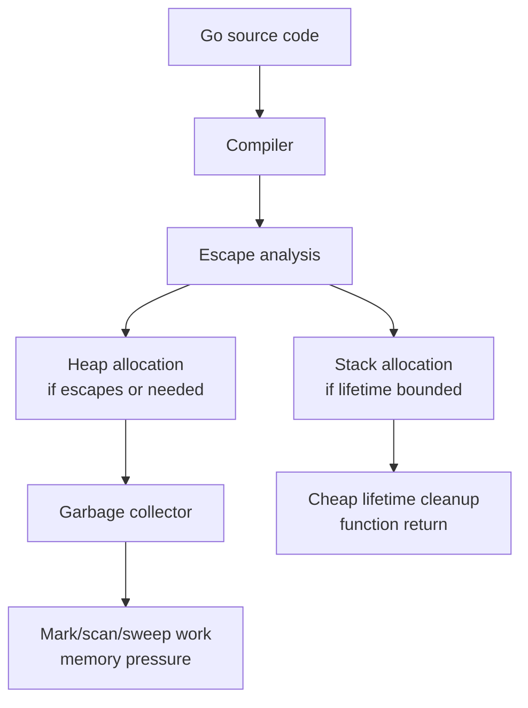
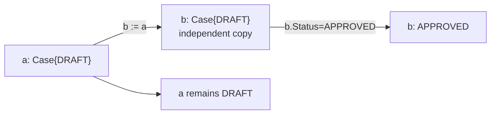
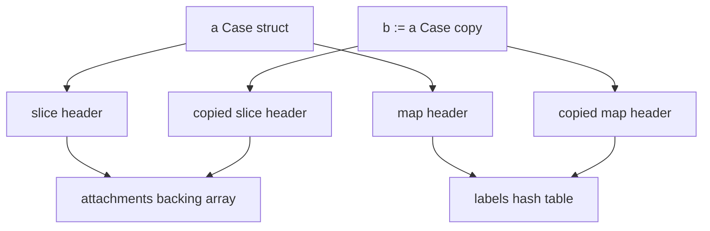
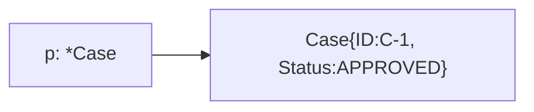
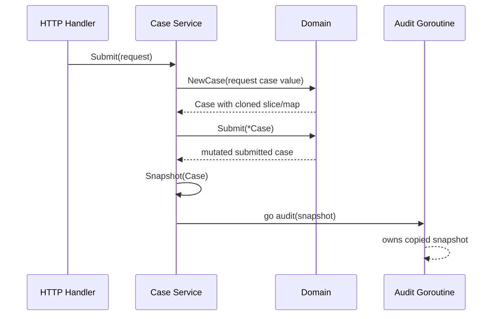

# learn-go-part-013.md

# Go Memory Model for Application Engineers: Value vs Pointer, Escape Analysis, Stack/Heap, and Allocation Pressure

> Seri: `learn-go`  
> Part: `013` dari `034`  
> Target pembaca: Java software engineer yang ingin naik ke level production-grade Go engineer  
> Target Go: Go 1.26.x  
> Status seri: belum selesai

---

## 0. Tujuan Part Ini

Part ini membahas memory dari sudut pandang **application engineer**, bukan runtime implementer.

Kamu tidak harus menjadi compiler engineer untuk menulis Go yang cepat, stabil, dan predictable. Tetapi kamu harus paham beberapa invariant penting:

```text
Go variables have value semantics by default.
Pointers create indirection and possible sharing.
Slices, maps, channels, funcs, and interfaces carry reference-like behavior.
Escape analysis decides whether values can live on stack or must live on heap.
Heap allocation increases GC work.
Allocation pressure is often more important than raw CPU instruction count.
```

Sebagai Java engineer, kamu terbiasa bahwa hampir semua object business-domain adalah reference object di heap:

```java
Case c = new Case();
service.process(c);
```

Di Go, kamu akan sering memilih secara sadar:

```go
var c Case       // value
c := Case{}      // value
c := &Case{}     // pointer to value
```

Pilihan ini bukan cosmetic. Pilihan ini memengaruhi:

- mutability;
- aliasing;
- lifetime;
- escape;
- heap allocation;
- GC pressure;
- method set;
- interface satisfaction;
- concurrency safety;
- API contract;
- performance profile.

Part ini bertujuan membuat kamu mampu menjawab:

1. kapan pakai value?
2. kapan pakai pointer?
3. kapan pointer malah buruk?
4. kapan value copy malah buruk?
5. apa itu escape analysis?
6. bagaimana membaca output `-gcflags=-m`?
7. kenapa slice/map bisa membuat object “escape”?
8. bagaimana allocation pressure terlihat di benchmark?
9. apa hubungan API design dengan GC pressure?
10. bagaimana membuat keputusan memory yang defensible di production?

---

## 1. Sumber Resmi dan Rujukan Utama

Rujukan utama:

- Go Memory Model: https://go.dev/ref/mem
- A Guide to the Go Garbage Collector: https://go.dev/doc/gc-guide
- Go Diagnostics: https://go.dev/doc/diagnostics
- Go compiler README: https://go.dev/src/cmd/compile/README
- Go Wiki Compiler Optimizations: https://go.dev/wiki/CompilerOptimizations
- Go 1.26 Release Notes: https://go.dev/doc/go1.26
- Effective Go: https://go.dev/doc/effective_go

Catatan penting:

- Go Memory Model menjelaskan kapan read di satu goroutine dijamin melihat write dari goroutine lain.
- GC guide menjelaskan cost model dan cara memahami biaya GC.
- Diagnostics menjelaskan `runtime.ReadMemStats`, GC stats, pprof, trace, dan observability runtime.
- Compiler optimization notes menyebut penggunaan `-gcflags=-m` untuk melihat escape analysis dan inlining decision.
- Go 1.26 menjadikan Green Tea GC sebagai default, dengan tujuan mengurangi overhead GC pada program yang heavily use GC melalui locality dan CPU scalability yang lebih baik.

---

## 2. Mental Model Besar

### 2.1 Memory di Go Bukan “Manual Memory Management”

Go bukan C. Kamu tidak melakukan `malloc/free` secara eksplisit dalam kode normal.

Go juga bukan Java dalam gaya object modelling-nya. Go memungkinkan kamu menulis banyak data sebagai value yang bisa berada di stack atau embedded langsung di struct lain.

Model besar:



Application engineer tidak secara langsung memilih stack/heap dengan keyword. Kamu memilih:

- API shape;
- pointer vs value;
- closure vs explicit parameter;
- interface vs concrete;
- storing in heap data structure;
- goroutine handoff;
- returning address;
- retaining slice/map;
- capturing variable.

Compiler lalu menentukan apakah value bisa tetap stack-allocated atau harus escape ke heap.

### 2.2 Java vs Go: Object Mental Model

Java:

```text
Most user-defined objects:
  allocated with new
  reference semantics
  heap-managed
  object identity common
  mutation through references common
  GC handles object graph
```

Go:

```text
User-defined structs:
  value by default
  can be copied
  may live on stack or heap
  identity is optional
  mutation requires pointer or reference-like field
  GC sees heap object graph only
```

Example:

```go
type Case struct {
    ID     string
    Status string
}

func Approve(c Case) Case {
    c.Status = "APPROVED"
    return c
}
```

This is value transformation.

Pointer mutation:

```go
func ApproveInPlace(c *Case) {
    c.Status = "APPROVED"
}
```

Neither is universally better. They express different contracts.

---

## 3. Value Semantics

### 3.1 Assignment Copies Values

```go
a := Case{ID: "C-1", Status: "DRAFT"}
b := a

b.Status = "APPROVED"

fmt.Println(a.Status) // DRAFT
fmt.Println(b.Status) // APPROVED
```

`b := a` copies the `Case` value.

Visual:



### 3.2 Value Semantics Help Local Reasoning

Value semantics reduces accidental mutation.

This is useful for:

- domain value objects;
- command/request data;
- event payloads;
- small structs;
- immutable-ish snapshots;
- audit records;
- config structs;
- options structs;
- time values.

Example:

```go
type CaseSnapshot struct {
    ID        CaseID
    Status    Status
    Version   int64
    CapturedAt time.Time
}
```

A snapshot should not be mutated through shared pointer everywhere. Value semantics matches the concept.

### 3.3 Copy Cost Depends on Struct Shape

Not all structs are equally cheap to copy.

Small struct:

```go
type Point struct {
    X int
    Y int
}
```

Copy is cheap.

Medium struct:

```go
type CaseHeader struct {
    ID        string
    Status    string
    OfficerID string
    Version   int64
}
```

Copy copies string headers, not underlying bytes. Still usually fine.

Large struct:

```go
type BigReport struct {
    Buffer [4096]byte
    Meta   [256]int64
}
```

Copying this repeatedly can be expensive.

Struct with reference-like fields:

```go
type Case struct {
    ID          string
    Attachments []Attachment
    Labels      map[string]string
}
```

Copying `Case` copies slice/map headers, not underlying elements/entries. That creates shared mutable internals.

This is the subtle part.

```go
a := Case{
    Attachments: []Attachment{{ID: "A1"}},
    Labels: map[string]string{"risk": "high"},
}
b := a

b.Attachments[0].ID = "A2"
b.Labels["risk"] = "low"

fmt.Println(a.Attachments[0].ID) // A2
fmt.Println(a.Labels["risk"])    // low
```

The top-level struct was copied, but nested reference-like fields are shared.

### 3.4 Value Copy Is Shallow

Rule:

```text
Assignment copies the value.
If the value contains references, those references are copied too.
The objects they point to are not deep-copied.
```

Mermaid:



Implication:

- value semantics is not automatically immutability;
- shallow copy can still share mutable internals;
- defensive clone is needed at API boundaries.

---

## 4. Pointer Semantics

### 4.1 Pointer Means Indirection

```go
c := Case{ID: "C-1"}
p := &c

p.Status = "APPROVED"
```

Pointer points to a value.



Pointer enables:

- mutation by callee;
- avoiding large copies;
- representing optional value with nil;
- stable identity;
- method set with pointer receiver;
- shared state.

Pointer also introduces:

- nil risk;
- aliasing;
- harder local reasoning;
- possible heap escape;
- GC scanning;
- data race risk when shared across goroutines;
- lifetime coupling.

### 4.2 Pointer Is Not Automatically Faster

Common beginner assumption:

```text
Pointer avoids copy, therefore pointer is faster.
```

Weak assumption.

Pointer may cause:

- heap allocation;
- cache miss due to indirection;
- more GC work;
- aliasing preventing optimization;
- data races if shared.

Value copy may be faster if:

- struct is small;
- stack allocation possible;
- no GC scan needed;
- better locality;
- no pointer chasing.

Correct question:

```text
What is the semantic contract?
What is the measured cost?
Does this value escape?
Is copying expensive enough to matter?
Does pointer introduce shared mutable state?
```

### 4.3 Pointer for Mutation

Use pointer receiver or pointer parameter when mutation is part of contract:

```go
func (c *Case) Approve(now time.Time) error {
    if c.Status != StatusSubmitted {
        return fmt.Errorf("case must be submitted")
    }
    c.Status = StatusApproved
    c.ApprovedAt = now
    return nil
}
```

Here pointer receiver makes sense because the method modifies object state.

### 4.4 Pointer for Large Structs

If copying large struct is expensive:

```go
func Process(r *LargeReport) error {
    // read-only but avoid large copy
}
```

But if the function should not mutate, document or enforce by not exposing mutation methods. Go has no `const *T`.

### 4.5 Pointer for Optionality

```go
type UpdateCaseRequest struct {
    DueDate *time.Time
}
```

`nil` means not provided.

But be careful. Sometimes a custom optional type is clearer:

```go
type OptionalTime struct {
    Value time.Time
    Set   bool
}
```

Especially for JSON patch semantics:

```text
not present
present null
present value
```

may be three different states.

### 4.6 Pointer for Identity

If object identity matters:

```go
type Session struct {
    ID string
    // mutable runtime state
}
```

Passing `*Session` may be appropriate.

If identity does not matter, value is often better.

---

## 5. Reference-Like Types

Go has value semantics, but some values contain references internally.

Important reference-like types:

```text
slice
map
channel
function
interface containing pointer/reference-like concrete value
string header pointing to immutable bytes
```

### 5.1 Slice

Slice descriptor copied by value, backing array shared.

```go
func Mutate(xs []int) {
    xs[0] = 99
}
```

Mutates caller-observable backing array.

### 5.2 Map

Map header copied by value, hash table shared.

```go
func Add(m map[string]int) {
    m["x"] = 1
}
```

Mutates caller-observable map.

### 5.3 Channel

Channel value references runtime channel object.

```go
func Send(ch chan<- int) {
    ch <- 1
}
```

### 5.4 Function Closure

Function value may capture variables.

```go
func Counter() func() int {
    n := 0
    return func() int {
        n++
        return n
    }
}
```

`n` must outlive `Counter`, so it typically escapes.

### 5.5 Interface

Interface value conceptually contains:

```text
dynamic type
dynamic value
```

If dynamic value is pointer, interface contains pointer. If dynamic value is value, interface contains/copies value or points to stored representation depending implementation details.

Do not rely on implementation internals. Rely on semantic outcome:

```go
var x any = Case{ID: "C-1"}
```

You cannot mutate original `Case` through `x` unless dynamic value is pointer or contains reference-like fields.

---

## 6. Stack and Heap

### 6.1 Stack

Stack allocation is cheap because lifetime is tied to function call.

```go
func Sum(a, b int) int {
    x := a + b
    return x
}
```

`x` can live on stack or register.

Goroutine stacks in Go are dynamically managed. You do not pick stack size per goroutine in normal application code.

### 6.2 Heap

Heap allocation is needed when value must outlive current stack frame or when compiler cannot prove it does not.

Example:

```go
func NewCase(id string) *Case {
    c := Case{ID: id}
    return &c
}
```

`c` cannot disappear when function returns because caller receives pointer. Therefore `c` escapes.

Important: returning address of local variable is safe in Go. Compiler moves it to heap if needed.

```go
func NewInt(v int) *int {
    return &v
}
```

Safe, but may allocate.

### 6.3 Stack vs Heap Is Compiler Decision

This is crucial:

```text
You do not allocate on stack by saying var.
You do not always allocate on heap by saying new or &.
Compiler decides based on escape analysis.
```

Example:

```go
func f() {
    p := new(int)
    *p = 10
    fmt.Println(*p)
}
```

`new(int)` might not allocate on heap if compiler proves pointer does not escape.

Conversely:

```go
func g() any {
    x := 10
    return x
}
```

Boxing into interface may allocate depending context and optimization.

Do not reason from syntax only. Measure.

---

## 7. Escape Analysis

### 7.1 What Is Escape Analysis?

Escape analysis determines whether a value's lifetime can be bounded to stack frame or must be heap allocated.

A value escapes when it may be used after the function returns or by unknown code.

Common escape triggers:

- returning pointer to local;
- storing pointer in heap object;
- storing value in interface in some contexts;
- closure capturing variable that outlives function;
- sending pointer/value to goroutine/channel;
- assigning to global;
- too-large stack object;
- compiler cannot prove safety due to abstraction.

### 7.2 Inspecting Escape Analysis

Use:

```bash
go build -gcflags=all=-m ./...
```

More detail:

```bash
go build -gcflags=all="-m=2" ./...
```

For a single package:

```bash
go test -gcflags=all="-m=2" ./internal/case
```

Typical output:

```text
./main.go:10:6: can inline NewCase
./main.go:11:2: moved to heap: c
./main.go:16:13: c does not escape
```

Do not treat every escape as a bug. Escape is sometimes necessary and correct.

### 7.3 Example: Return Pointer

```go
type Case struct {
    ID string
}

func NewCase(id string) *Case {
    c := Case{ID: id}
    return &c
}
```

Likely:

```text
moved to heap: c
```

This is expected.

### 7.4 Example: Return Value

```go
func NewCaseValue(id string) Case {
    return Case{ID: id}
}
```

This can avoid heap allocation if caller uses it locally.

### 7.5 Example: Interface Escape

```go
func LogAny(v any) {
    fmt.Println(v)
}
```

Passing to interface may force boxing or escape depending usage.

```go
func Process(c Case) {
    LogAny(c)
}
```

If logging is in hot path, this can allocate. But again: measure.

### 7.6 Example: Closure Capture

```go
func Handlers(ids []string) []func() string {
    out := make([]func() string, 0, len(ids))
    for _, id := range ids {
        out = append(out, func() string {
            return id
        })
    }
    return out
}
```

The closure must retain `id`.

Modern Go loop variable semantics reduce a classic capture bug, but closures still require captured state to live long enough.

### 7.7 Example: Goroutine Handoff

```go
func AsyncProcess(c Case) {
    go func() {
        process(c)
    }()
}
```

`c` must outlive caller frame, so captured `c` may escape.

This is semantically required. The question is whether you should send only the fields needed:

```go
func AsyncProcess(id CaseID, status Status) {
    go func(id CaseID, status Status) {
        process(id, status)
    }(id, status)
}
```

This makes capture explicit and may reduce retained data.

### 7.8 Escape Analysis Is Not API Contract

Never write an API whose correctness depends on stack allocation.

Escape analysis is optimization, not semantic guarantee.

Correctness must come from language semantics. Performance can be guided by escape analysis.

---

## 8. Allocation Pressure

### 8.1 What Is Allocation Pressure?

Allocation pressure is the rate and volume of heap allocation.

High allocation pressure causes:

- more GC cycles;
- more CPU spent marking/scanning;
- larger heap;
- worse tail latency;
- more memory bandwidth usage;
- cache pressure;
- possibly higher container memory usage.

In Go services, many performance issues are not caused by “slow language” but by avoidable allocation churn.

### 8.2 Allocation Is Not Just `new`

Allocations can come from:

```text
append growth
string/[]byte conversion
fmt.Sprintf
regexp
JSON marshal/unmarshal
interface boxing
closure capture
map growth
slice/map clone
time parsing
reflection
logging fields
error wrapping
goroutine creation
channel buffering
database scanning
HTTP body read-all
```

### 8.3 Measure Allocations with Benchmark

Example:

```go
func BenchmarkBuildIDs(b *testing.B) {
    rows := make([]Row, 1000)
    b.ReportAllocs()

    for i := 0; i < b.N; i++ {
        _ = BuildIDs(rows)
    }
}
```

Run:

```bash
go test -bench=. -benchmem ./...
```

Output:

```text
BenchmarkBuildIDs-16    100000    12000 ns/op    8192 B/op    1 allocs/op
```

Focus on:

```text
ns/op
B/op
allocs/op
```

For memory-focused optimization, `B/op` and `allocs/op` are often more actionable than `ns/op`.

### 8.4 Common Allocation Reduction Techniques

Use only when readability and measured impact justify them.

#### Preallocate Slice

```go
out := make([]CaseID, 0, len(cases))
for _, c := range cases {
    out = append(out, c.ID)
}
```

#### Reuse Buffer

```go
var buf bytes.Buffer
buf.Grow(estimate)
```

#### Avoid `fmt.Sprintf` in Hot Path

Instead of:

```go
key := fmt.Sprintf("%s:%s", agency, number)
```

Use struct key:

```go
type CaseKey struct {
    Agency string
    Number string
}
```

Or careful string builder if textual key required.

#### Stream Instead of Read-All

Bad for large bodies:

```go
data, err := io.ReadAll(r)
```

Better when possible:

```go
_, err := io.Copy(dst, r)
```

#### Avoid Unnecessary `[]byte` to `string`

```go
s := string(b)
```

This usually allocates because string is immutable.

#### Avoid Capturing Large Values

```go
go func() {
    use(bigStruct)
}()
```

Prefer explicit smaller arguments:

```go
go func(id CaseID) {
    use(id)
}(bigStruct.ID)
```

#### Avoid Returning Internal Copies in Hot Inner Loops

Defensive copies at boundary are good. Defensive copies inside tight loops can be disastrous.

---

## 9. API Design and Memory

### 9.1 Value API

```go
func Validate(c Case) error
```

Good when:

- `Case` is small or medium;
- function should not mutate;
- no need identity;
- easier reasoning matters;
- value represents snapshot.

### 9.2 Pointer API

```go
func Validate(c *Case) error
```

Good when:

- `Case` is large;
- nil has meaning;
- mutation is needed;
- identity matters;
- avoiding copy is important and measured.

But pointer API should answer:

```text
Can c be nil?
Will function mutate c?
Will function retain c?
Can caller access c concurrently?
```

### 9.3 Slice API

Read-only by convention:

```go
func ValidateAll(cases []Case) error
```

Mutation:

```go
func NormalizeAll(cases []Case)
```

Append:

```go
func AddDefault(cases []Case) []Case
```

Retain:

```go
func NewStore(cases []Case) *Store {
    return &Store{cases: slices.Clone(cases)}
}
```

### 9.4 Map API

Avoid exposing mutable internal maps.

```go
func (c Config) Labels() map[string]string {
    return maps.Clone(c.labels)
}
```

For hot paths, consider callback iteration to avoid allocation:

```go
func (c Config) RangeLabels(fn func(k, v string) bool) {
    for k, v := range c.labels {
        if !fn(k, v) {
            return
        }
    }
}
```

Trade-off:

- clone: safer, allocates;
- callback: no allocation, more complex control flow;
- view: fastest, unsafe by convention.

### 9.5 Interface API

Interfaces can introduce allocation or prevent inlining in some contexts, but the bigger issue is design.

Use interface at boundary where polymorphism is needed.

Do not make every internal function accept interface “for testability”.

```go
type CaseRepository interface {
    Find(ctx context.Context, id CaseID) (Case, error)
}
```

Good at service boundary.

But avoid:

```go
type Stringer interface {
    String() string
}
func helper(x Stringer) {}
```

unless needed.

### 9.6 Generic API

Generics can avoid interface boxing for reusable typed algorithms:

```go
func IndexBy[T any, K comparable](items []T, key func(T) K) map[K]T {
    out := make(map[K]T, len(items))
    for _, item := range items {
        out[key(item)] = item
    }
    return out
}
```

But generic abstraction can still allocate if function literals capture or maps/slices grow.

---

## 10. Memory Model vs Memory Allocation

This part uses phrase “memory model” in application sense, but Go Memory Model specifically refers to synchronization between goroutines.

Do not confuse:

```text
Allocation model:
  stack vs heap, escape, GC, pointer/value

Concurrency memory model:
  happens-before, visibility of writes, data races
```

The official Go Memory Model says programs that modify data concurrently must serialize access using synchronization mechanisms such as channels, mutexes, or atomics.

### 10.1 Data Race Example

```go
var x int

go func() {
    x = 1
}()

fmt.Println(x)
```

No guarantee. Data race.

Correct:

```go
var (
    mu sync.Mutex
    x  int
)

go func() {
    mu.Lock()
    x = 1
    mu.Unlock()
}()

mu.Lock()
fmt.Println(x)
mu.Unlock()
```

Or channel:

```go
ch := make(chan int)

go func() {
    ch <- 1
}()

x := <-ch
fmt.Println(x)
```

### 10.2 Pointer Sharing Across Goroutines

Pointer makes sharing easy:

```go
go process(&caseData)
go audit(&caseData)
```

But shared mutable state needs synchronization.

Value handoff can be safer:

```go
caseSnapshot := caseData
go process(caseSnapshot)
go audit(caseSnapshot)
```

If `caseData` contains maps/slices, deep copy may still be needed.

---

## 11. Go 1.26 Context: GC and Runtime

Go 1.26 made the Green Tea garbage collector the default. The release notes describe it as improving marking and scanning of small objects through better locality and CPU scalability, with expected real-world GC overhead reductions for programs that heavily use GC.

This does not mean allocation is free.

Better GC reduces cost, but:

```text
No GC improvement makes unnecessary allocation a good design.
```

For high-throughput services:

- fewer allocations still reduce CPU;
- fewer pointer-rich objects still reduce scan work;
- better locality still matters;
- object lifetime still matters;
- container memory still matters;
- tail latency still matters.

### 11.1 What GC Sees

GC cares about heap object graph and pointers.

Pointer-heavy structure:

```go
type Node struct {
    Next *Node
    Data *Payload
}
```

Value-dense structure:

```go
type Entry struct {
    Key   uint64
    Value uint64
}
```

All else equal, value-dense layouts are more cache-friendly and require less pointer scanning.

This is why blindly converting everything to pointers can hurt Go performance.

---

## 12. Production Example: Case Validation Pipeline

Suppose we process regulatory case submissions.

### 12.1 Domain Types

```go
package caseflow

import (
    "errors"
    "maps"
    "slices"
    "time"
)

type CaseID string
type OfficerID string
type Status string

const (
    StatusDraft     Status = "DRAFT"
    StatusSubmitted Status = "SUBMITTED"
    StatusApproved  Status = "APPROVED"
)

type Attachment struct {
    ID   string
    Name string
    Size int64
}

type Case struct {
    ID          CaseID
    Status      Status
    OfficerID   OfficerID
    SubmittedAt time.Time
    Attachments []Attachment
    Labels      map[string]string
}
```

### 12.2 Unsafe Constructor

```go
func NewCaseUnsafe(c Case) Case {
    return c
}
```

Problem:

```go
attachments := []Attachment{{ID: "A1"}}
labels := map[string]string{"risk": "high"}

c := NewCaseUnsafe(Case{
    ID: "C-1",
    Attachments: attachments,
    Labels: labels,
})

attachments[0].ID = "MUTATED"
labels["risk"] = "low"
```

Even if `Case` was copied, nested slice/map is shared.

### 12.3 Safer Constructor

```go
func NewCase(c Case) (Case, error) {
    if c.ID == "" {
        return Case{}, errors.New("case id is required")
    }

    c.Attachments = slices.Clone(c.Attachments)
    c.Labels = maps.Clone(c.Labels)

    return c, nil
}
```

This still performs shallow clone of slice elements. If `Attachment` later contains map/pointer fields, revisit.

### 12.4 Value Validation

```go
func ValidateForSubmission(c Case) error {
    if c.ID == "" {
        return errors.New("case id is required")
    }
    if c.Status != StatusDraft {
        return errors.New("case must be draft")
    }
    if len(c.Attachments) == 0 {
        return errors.New("at least one attachment is required")
    }
    return nil
}
```

Why value?

- validation does not mutate;
- function should not retain;
- local reasoning;
- status and headers are small;
- attachment slice header is copied, not elements.

But if `Case` is large or frequently called in hot path, benchmark both.

### 12.5 Pointer Mutation

```go
func Submit(c *Case, now time.Time) error {
    if c == nil {
        return errors.New("case is nil")
    }
    if err := ValidateForSubmission(*c); err != nil {
        return err
    }
    c.Status = StatusSubmitted
    c.SubmittedAt = now
    return nil
}
```

Pointer makes mutation explicit.

### 12.6 Snapshot for Async Audit

Wrong:

```go
func SubmitAndAudit(c *Case, audit func(Case)) error {
    if err := Submit(c, time.Now()); err != nil {
        return err
    }

    go audit(*c)
    return nil
}
```

If `c` is modified later, top-level value was copied into goroutine, but nested slice/map still share.

Safer:

```go
func Snapshot(c Case) Case {
    c.Attachments = slices.Clone(c.Attachments)
    c.Labels = maps.Clone(c.Labels)
    return c
}

func SubmitAndAudit(c *Case, audit func(Case)) error {
    if err := Submit(c, time.Now()); err != nil {
        return err
    }

    snapshot := Snapshot(*c)

    go func(s Case) {
        audit(s)
    }(snapshot)

    return nil
}
```

### 12.7 Memory/Ownership Diagram



This design makes lifetime and ownership explicit.

---

## 13. Reading Escape Output: Practical Workflow

### 13.1 Create a Small Probe

```go
package memoryprobe

type Case struct {
    ID string
}

func NewPointer(id string) *Case {
    c := Case{ID: id}
    return &c
}

func NewValue(id string) Case {
    return Case{ID: id}
}
```

Run:

```bash
go test -gcflags=all="-m=2" ./...
```

### 13.2 Interpret Without Panic

Output may say:

```text
moved to heap: c
```

Question:

```text
Is this required by API semantics?
Is this in a hot path?
Is allocation visible in benchmark?
Can API be value-returning instead?
```

Do not cargo-cult eliminate all heap allocations.

### 13.3 Pair Escape with Benchmark

```go
func BenchmarkNewPointer(b *testing.B) {
    b.ReportAllocs()
    for i := 0; i < b.N; i++ {
        _ = NewPointer("C-1")
    }
}

func BenchmarkNewValue(b *testing.B) {
    b.ReportAllocs()
    for i := 0; i < b.N; i++ {
        _ = NewValue("C-1")
    }
}
```

But beware compiler optimizing away unused result. Use sink:

```go
var sinkCase Case
var sinkCasePtr *Case

func BenchmarkNewPointer(b *testing.B) {
    b.ReportAllocs()
    for i := 0; i < b.N; i++ {
        sinkCasePtr = NewPointer("C-1")
    }
}

func BenchmarkNewValue(b *testing.B) {
    b.ReportAllocs()
    for i := 0; i < b.N; i++ {
        sinkCase = NewValue("C-1")
    }
}
```

### 13.4 Benchmark Is a Tool, Not a Religion

Microbenchmarks can mislead. Confirm with:

- representative workload;
- pprof heap profile;
- CPU profile;
- allocation profile;
- production-like data size;
- realistic concurrency;
- end-to-end latency.

---

## 14. Common Failure Modes

### 14.1 Pointer Everywhere

Java migration smell:

```go
func ProcessCase(c *Case) *Result
```

for every type.

Consequences:

- nil checks everywhere;
- hidden mutation;
- shared state;
- heap allocation;
- GC pressure;
- data race risk;
- less clear ownership.

### 14.2 Value Copy of Struct with Mutex

Never copy a value containing `sync.Mutex`, `sync.RWMutex`, `sync.WaitGroup`, `sync.Once`, or atomic types after first use.

Wrong:

```go
type Store struct {
    mu sync.Mutex
    m  map[string]string
}

func (s Store) Put(k, v string) {
    s.mu.Lock()
    defer s.mu.Unlock()
    s.m[k] = v
}
```

Value receiver copies mutex. Very bad.

Correct:

```go
func (s *Store) Put(k, v string) {
    s.mu.Lock()
    defer s.mu.Unlock()
    s.m[k] = v
}
```

### 14.3 Shallow Copy Mistaken as Snapshot

```go
snapshot := c
```

If `c` contains slice/map/pointer fields, this is not a deep snapshot.

### 14.4 Retaining Large Request Body

```go
small := body[:100]
store(small)
```

May retain entire body backing array.

Copy the needed bytes:

```go
small := append([]byte(nil), body[:100]...)
```

### 14.5 Logging Allocations in Hot Path

```go
logger.Info("case processed", "payload", fmt.Sprintf("%+v", c))
```

This can allocate heavily and expose sensitive data.

Prefer structured minimal fields:

```go
logger.Info("case processed",
    "case_id", c.ID,
    "status", c.Status,
)
```

### 14.6 Interface-Based Helpers Causing Boxing

```go
func ToAnySlice[T any](xs []T) []any {
    out := make([]any, 0, len(xs))
    for _, x := range xs {
        out = append(out, x)
    }
    return out
}
```

This may allocate/box elements and loses type information. Avoid unless truly needed.

### 14.7 Excessive Defensive Copy

Copying at every layer:

```text
handler copies
service copies
domain copies
repository copies
publisher copies
```

May be safe but expensive.

Better:

```text
Copy at ownership transfer boundaries.
Pass borrowed immutable-by-convention data within a synchronous call chain.
Snapshot before async/goroutine/cache/persistence boundary.
```

---

## 15. Decision Matrix: Value vs Pointer

| Question | Bias |
|---|---|
| Does function mutate receiver/parameter? | Pointer |
| Is nil a meaningful input/state? | Pointer or explicit optional type |
| Is struct large and passed frequently? | Pointer, but benchmark |
| Is struct small and immutable-ish? | Value |
| Is object identity important? | Pointer |
| Is this a snapshot/event/command? | Value |
| Does struct contain mutex/atomic? | Pointer receiver; do not copy after use |
| Does struct contain map/slice/pointer fields? | Value copy is shallow; document/clone |
| Is this public API? | Prefer semantics clarity over micro-optimization |
| Is this hot path? | Benchmark and inspect allocation |

---

## 16. Code Review Checklist

When reviewing memory-related Go code:

```text
[ ] Are pointer parameters semantically justified?
[ ] Are value parameters too large or copied in hot loops?
[ ] Are structs with mutex/atomic copied accidentally?
[ ] Are slice/map fields shallow-copied unintentionally?
[ ] Are constructors cloning retained inputs?
[ ] Are accessors exposing internal slice/map?
[ ] Are goroutines capturing large values or mutable pointers?
[ ] Are async boundaries using snapshots when needed?
[ ] Are maps/slices preallocated when size is known?
[ ] Are large sub-slices retaining large backing arrays?
[ ] Are allocations measured with -benchmem?
[ ] Has escape analysis been checked for hot paths?
[ ] Is pprof used before complex optimization?
[ ] Are data races avoided when pointers are shared?
[ ] Are nil pointer semantics documented?
```

---

## 17. Practical Commands

### 17.1 Escape Analysis

```bash
go build -gcflags=all=-m ./...
go build -gcflags=all="-m=2" ./...
go test -gcflags=all="-m=2" ./...
```

### 17.2 Benchmark Allocations

```bash
go test -bench=. -benchmem ./...
```

### 17.3 CPU and Memory Profiles

```bash
go test -bench=. -benchmem -cpuprofile=cpu.out -memprofile=mem.out ./...
go tool pprof cpu.out
go tool pprof mem.out
```

### 17.4 Race Detector

```bash
go test -race ./...
```

### 17.5 Runtime Metrics in Application

Use:

```go
runtime.ReadMemStats(&m)
```

For production services, prefer stable observability via metrics libraries and runtime metrics. Part 027 and 031 will cover this deeply.

---

## 18. Hands-On Labs

### Lab 1: Value vs Pointer Escape

Create:

```go
type Case struct {
    ID string
}

func NewValue(id string) Case {
    return Case{ID: id}
}

func NewPointer(id string) *Case {
    c := Case{ID: id}
    return &c
}
```

Run:

```bash
go test -gcflags=all="-m=2" ./...
```

Explain which value escapes and why.

### Lab 2: Shallow Copy Bug

Create struct:

```go
type Case struct {
    Labels map[string]string
}
```

Copy it:

```go
a := Case{Labels: map[string]string{"risk": "high"}}
b := a
b.Labels["risk"] = "low"
```

Explain why `a` changes.

Fix with `maps.Clone`.

### Lab 3: Slice Retention

Create a large byte slice and return small sub-slice.

Then modify to clone the sub-slice.

Use benchmark or pprof to compare retained memory.

### Lab 4: Goroutine Capture

Compare:

```go
go func() {
    process(big)
}()
```

with:

```go
go func(id CaseID) {
    processID(id)
}(big.ID)
```

Inspect escape output.

### Lab 5: Allocation Benchmark

Implement two versions:

1. append without preallocation;
2. append with preallocation.

Run:

```bash
go test -bench=. -benchmem
```

Compare `B/op` and `allocs/op`.

### Lab 6: Struct with Mutex Copy

Create a struct with `sync.Mutex`.

Write method with value receiver.

Run:

```bash
go vet ./...
```

Observe copylock warning if applicable.

Fix with pointer receiver.

---

## 19. Review Questions

1. Apa perbedaan value semantics dan pointer semantics di Go?
2. Kenapa pointer tidak otomatis lebih cepat?
3. Apa itu escape analysis?
4. Apakah `new(T)` selalu heap allocation?
5. Apakah `&T{}` selalu heap allocation?
6. Kenapa returning pointer to local variable aman di Go?
7. Apa saja penyebab umum value escape?
8. Kenapa copying struct dengan slice/map field adalah shallow copy?
9. Kenapa struct berisi mutex tidak boleh dicopy setelah dipakai?
10. Apa hubungan allocation pressure dengan GC?
11. Kenapa reducing allocation bisa memperbaiki tail latency?
12. Kapan defensive copy harus dilakukan?
13. Kapan defensive copy berlebihan?
14. Apa bedanya allocation model dengan Go Memory Model?
15. Kenapa pointer sharing antar goroutine membutuhkan synchronization?
16. Bagaimana membaca output `-gcflags=-m` secara sehat?

---

## 20. Invariants

Pegang invariant berikut:

```text
Go passes arguments by value.
Pointer value is also passed by value.
Struct assignment copies fields.
Slice/map/channel/function fields are reference-like values.
Copying a struct with reference-like fields is shallow.
Pointer enables mutation and sharing, not automatic performance.
Stack vs heap is compiler decision, not syntax-only decision.
Escape analysis is optimization, not correctness contract.
Heap allocation increases GC work.
Allocation pressure must be measured.
Copy at ownership boundaries.
Snapshot before async boundaries.
Do not copy synchronization primitives after use.
No shared mutable data across goroutines without synchronization.
```

---

## 21. Ringkasan

Part ini membangun fondasi memory-level reasoning yang akan dipakai di hampir semua part berikutnya.

Untuk Java engineer, shift terbesar adalah:

```text
Java:
  object reference is the default mental unit

Go:
  value is the default mental unit;
  pointer/reference-like sharing must be intentional
```

Go memberi kamu kemampuan menulis kode yang:

- sederhana;
- low allocation;
- predictable;
- explicit ownership;
- GC-friendly;
- concurrency-safe.

Tetapi hanya jika kamu tidak membawa kebiasaan “everything is an object reference” dari Java.

Di level production, pertanyaan memory yang benar bukan:

```text
"Pointer atau value lebih cepat?"
```

Pertanyaan yang benar:

```text
Apa semantic contract-nya?
Siapa owner data ini?
Apakah mutation boleh terlihat?
Apakah data akan ditahan setelah function return?
Apakah ini melewati goroutine/cache/async boundary?
Apakah copy shallow cukup?
Apakah allocation ini muncul di benchmark/profile?
Apakah pointer sharing ini aman secara concurrency?
```

Jika kamu bisa menjawab itu, kamu sudah jauh lebih dekat ke Go engineer yang matang.

---

## 22. Posisi Kita di Seri

Kita sudah menyelesaikan:

```text
000 - Orientation and Mental Model
001 - Toolchain, Workspace, Module, Build
002 - Syntax Core
003 - Functions
004 - Types
005 - Composition
006 - Interfaces
007 - Generics
008 - Error Handling
009 - Package Design
010 - Modules and Dependency Management
011 - Standard Library Mental Model
012 - Slices, Arrays, and Maps
013 - Memory Model for Application Engineers
```

Berikutnya:

```text
014 - Runtime Deep Dive:
      Goroutine Scheduler, P/M/G Model, Preemption, GC, Runtime Metrics
```

Status seri: **belum selesai**.


<!-- NAVIGATION_FOOTER -->
<div class="page-nav">
<a href="./learn-go-part-012.md">⬅️ Go Slices, Arrays, and Maps: Representation, Capacity, Aliasing, Mutation Hazards, and Iteration Semantics</a>
<a href="./index.md">📚 Kategori</a>
<a href="../../index.md">🏠 Home</a>
<a href="./learn-go-part-014.md">Go Runtime Deep Dive: Goroutine Scheduler, P/M/G Model, Preemption, GC, and Runtime Metrics ➡️</a>
</div>
