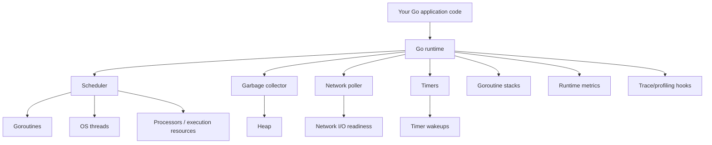
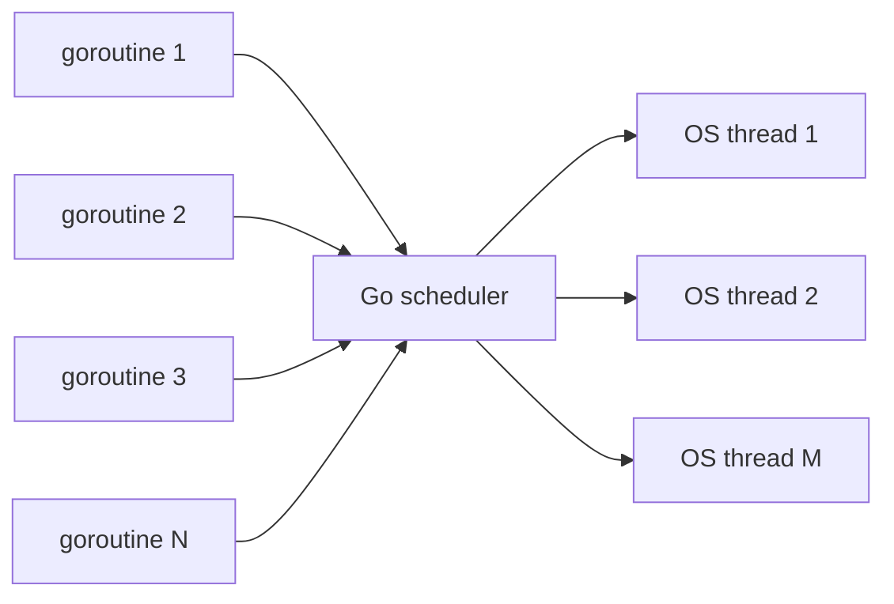
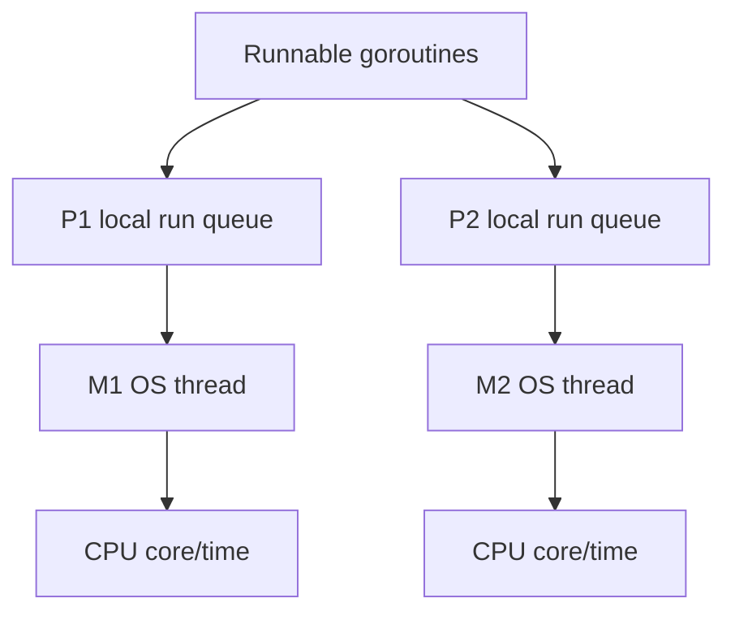
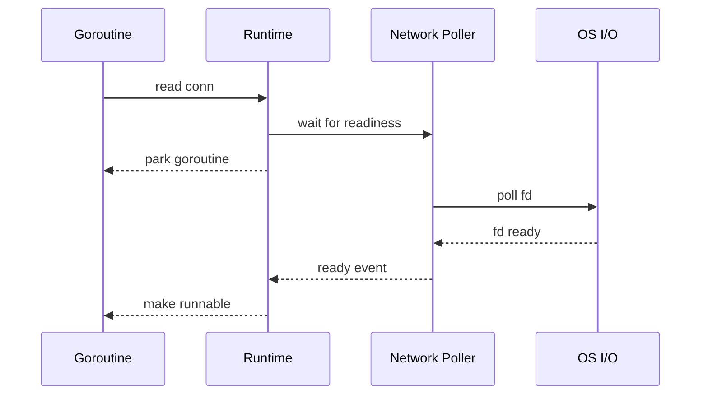
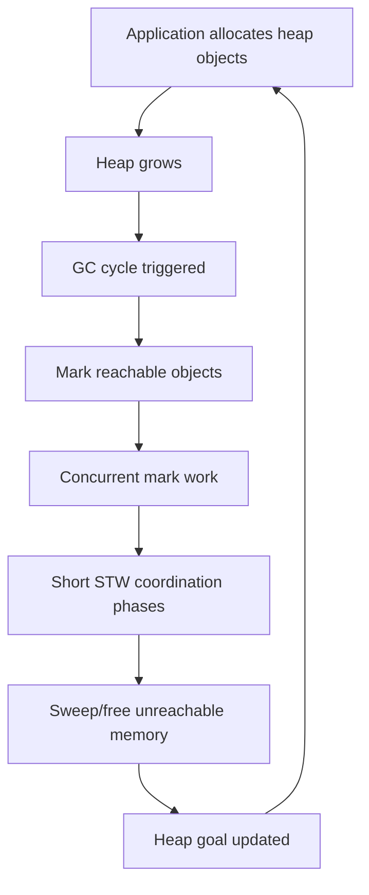
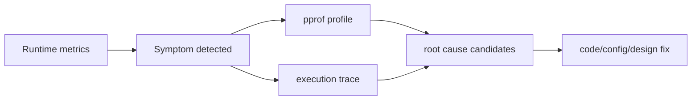
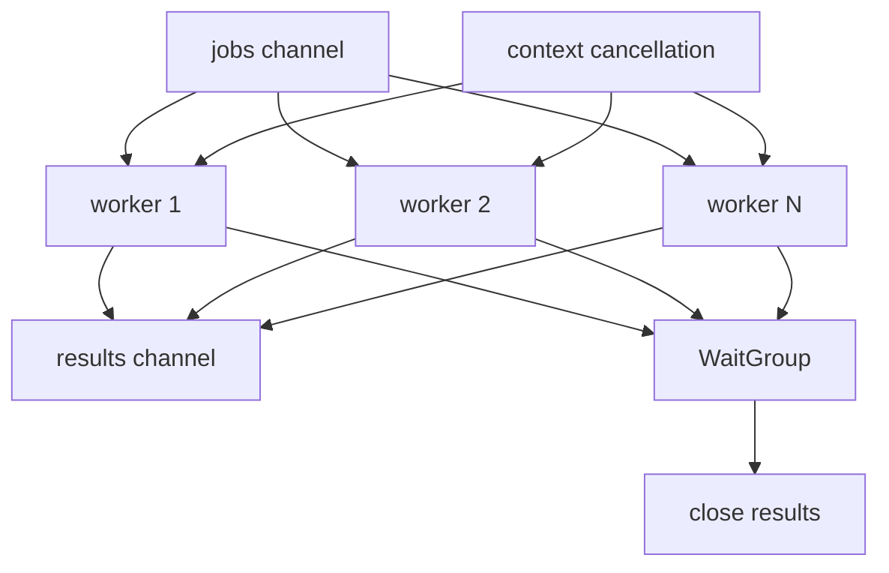

# learn-go-part-014.md

# Go Runtime Deep Dive: Goroutine Scheduler, P/M/G Model, Preemption, GC, and Runtime Metrics

> Seri: `learn-go`  
> Part: `014` dari `034`  
> Target pembaca: Java software engineer yang ingin naik ke level production-grade Go engineer  
> Target Go: Go 1.26.x  
> Status seri: belum selesai

---

## 0. Tujuan Part Ini

Part ini membahas runtime Go dari sudut pandang **application/service engineer**.

Kita tidak akan membedah runtime source code sampai level implementasi internal yang berubah antar versi. Fokus kita adalah mental model yang stabil untuk membuat keputusan production:

- berapa banyak goroutine yang aman?
- kenapa goroutine leak berbahaya?
- apa bedanya goroutine, OS thread, dan CPU execution slot?
- bagaimana scheduler Go bekerja secara konseptual?
- apa itu P/M/G?
- bagaimana blocking syscall memengaruhi scheduling?
- apa itu preemption?
- bagaimana GC berinteraksi dengan aplikasi?
- bagaimana membaca runtime metrics?
- kapan memakai pprof vs trace vs metrics?
- bagaimana mendiagnosis latency, CPU, goroutine leak, blocking, dan GC pressure?

Sebagai Java engineer, kamu mungkin terbiasa berpikir:

```text
Java:
  application thread maps to OS thread
  thread pool is explicit architecture primitive
  JVM runtime handles GC/JIT/safepoint
  concurrency often mediated by ExecutorService/ForkJoinPool/CompletableFuture
```

Go berbeda:

```text
Go:
  goroutine is cheap user-level execution unit
  Go scheduler multiplexes goroutines over OS threads
  runtime integrates network poller, timers, GC, stack growth, preemption
  concurrency is often expressed directly using goroutines, channels, sync primitives
```

Tetapi “goroutine murah” tidak berarti “goroutine gratis”. Di production, goroutine tetap punya:

- stack memory;
- scheduling overhead;
- lifetime risk;
- cancellation obligation;
- leak risk;
- blocking behavior;
- synchronization cost;
- observability requirement.

---

## 1. Sumber Resmi dan Rujukan Utama

Rujukan utama:

- Go 1.26 Release Notes: https://go.dev/doc/go1.26
- Go 1.26 Blog: https://go.dev/blog/go1.26
- Package `runtime`: https://pkg.go.dev/runtime
- Package `runtime/metrics`: https://pkg.go.dev/runtime/metrics
- Package `runtime/trace`: https://pkg.go.dev/runtime/trace
- Go Diagnostics: https://go.dev/doc/diagnostics
- A Guide to the Go Garbage Collector: https://go.dev/doc/gc-guide
- The Go Memory Model: https://go.dev/ref/mem
- Runtime HACKING notes: https://go.dev/src/runtime/HACKING
- Execution trace blog: https://go.dev/blog/execution-traces-2024
- Go FAQ on goroutine scheduler and preemption: https://go.dev/doc/faq

Catatan:

- `runtime/metrics` adalah interface stabil untuk mengambil metrics runtime.
- `runtime/trace` menangkap event seperti goroutine creation, blocking, unblocking, syscall, GC, heap size changes, dan processor activity.
- Go 1.26 menjadikan Green Tea GC default dan release notes menyebut pengurangan overhead GC untuk program yang heavy GC.
- Runtime internals dapat berubah; gunakan model ini untuk reasoning, bukan untuk mengandalkan detail internal yang tidak menjadi public contract.

---

## 2. Mental Model Besar Runtime Go

Go runtime adalah bagian dari program Go yang mengelola:

```text
goroutine scheduling
stack growth
garbage collection
timers
network polling
syscall coordination
panic/defer mechanics
runtime metrics
profiling/tracing support
```

Visual:



Untuk application engineer, runtime Go adalah alasan kenapa kode seperti ini scalable:

```go
go handleConnection(conn)
```

Tetapi runtime tidak menghilangkan kebutuhan desain:

```text
Every goroutine needs a lifetime.
Every blocking operation needs a cancellation or timeout path.
Every shared mutable state needs synchronization.
Every unbounded queue needs backpressure.
Every long-lived service needs runtime observability.
```

---

## 3. Goroutine

### 3.1 Goroutine Adalah Unit Eksekusi Ringan

Goroutine dibuat dengan:

```go
go func() {
    doWork()
}()
```

Goroutine bukan OS thread. Goroutine dijadwalkan oleh runtime Go di atas OS threads.



### 3.2 Goroutine Murah, Bukan Gratis

Goroutine lebih murah daripada OS thread, tetapi tetap punya biaya:

- initial stack;
- stack growth metadata;
- scheduler bookkeeping;
- captured variables;
- blocked channel/timer state;
- references that keep heap objects alive;
- observability overhead when there are too many.

Common production failure:

```go
for _, item := range items {
    go process(item)
}
```

Jika `items` berjumlah 1 juta, kamu membuat 1 juta goroutine. Itu bukan desain scalable hanya karena goroutine murah.

Better:

```go
workerCount := 32
jobs := make(chan Item)

for i := 0; i < workerCount; i++ {
    go worker(jobs)
}

for _, item := range items {
    jobs <- item
}
close(jobs)
```

Bounded concurrency adalah design decision, bukan runtime default.

### 3.3 Goroutine Lifetime

Setiap goroutine harus punya jawaban:

```text
Who starts it?
What stops it?
What happens on error?
What happens on context cancellation?
What happens on shutdown?
Can it block forever?
How is it observed?
```

Bad:

```go
func Start() {
    go func() {
        for {
            doWork()
        }
    }()
}
```

No cancellation, no backoff, no shutdown path.

Better:

```go
func Start(ctx context.Context) {
    go func() {
        ticker := time.NewTicker(time.Minute)
        defer ticker.Stop()

        for {
            select {
            case <-ctx.Done():
                return
            case <-ticker.C:
                doWork(ctx)
            }
        }
    }()
}
```

---

## 4. P/M/G Scheduler Model

### 4.1 Three Concepts

Runtime scheduler is commonly explained using:

```text
G = goroutine
M = machine / OS thread
P = processor / logical execution resource
```

Conceptual meaning:

| Runtime Entity | Meaning |
|---|---|
| G | goroutine: user-level execution unit |
| M | OS thread executing code |
| P | scheduler resource required to execute Go code |

Simplified:



A goroutine runs when:

```text
G is runnable
M is available
M has a P
OS schedules M on CPU
```

### 4.2 `GOMAXPROCS`

`GOMAXPROCS` controls the maximum number of Ps executing Go code simultaneously.

```go
runtime.GOMAXPROCS(0) // current value
```

Environment:

```bash
GOMAXPROCS=4 ./service
```

In modern Go, container CPU limits are considered by default in recent releases, but production teams should still observe actual behavior in their environment.

Mental model:

```text
GOMAXPROCS is not goroutine count.
GOMAXPROCS is not OS thread count.
GOMAXPROCS is concurrency limit for executing Go code.
```

If `GOMAXPROCS=4`, thousands of goroutines may exist, but at most roughly 4 goroutines execute Go code at the same instant.

### 4.3 Local and Global Run Queues

Runtime maintains runnable goroutines. Conceptually:

- each P has local run queue;
- there is also global run queue;
- work stealing balances load across Ps.

Do not design code depending on exact queue behavior. Use this model to reason:

```text
If many goroutines become runnable at once, scheduler must distribute them.
If goroutines block frequently, scheduler must park/unpark.
If goroutines spin, they consume P/CPU and starve useful work.
```

### 4.4 Blocking Behavior

Goroutine can block on:

- channel send/receive;
- mutex;
- condition variable;
- network I/O;
- timer;
- syscall;
- cgo call;
- select waiting;
- GC safepoint/preemption;
- explicit runtime operations.

Some blocking parks only G. Some blocking may involve M/P coordination.

Application-level takeaway:

```text
Blocking is not inherently bad.
Unbounded blocking without cancellation is bad.
Blocking while holding locks is risky.
Blocking in cgo/syscall can affect thread usage.
```

---

## 5. Network Poller

Go integrates a network poller so blocking network I/O does not require one OS thread per blocked goroutine in normal net package usage.

Conceptually:



This is why Go can handle many concurrent network connections with straightforward goroutine-per-connection style.

But this does not remove need for:

- read/write deadlines;
- context timeout;
- bounded request body;
- connection limits;
- backpressure;
- graceful shutdown.

---

## 6. Preemption

### 6.1 Why Preemption Matters

If a goroutine runs CPU-heavy code for too long without blocking, other goroutines may wait.

Modern Go supports preemption so scheduler can interrupt long-running goroutines more effectively than older versions.

Still, application design matters.

Bad:

```go
func spin() {
    for {
    }
}
```

This wastes CPU.

CPU-bound loops should be designed carefully, especially inside services expected to handle requests.

### 6.2 Cooperative vs Asynchronous Mental Model

You do not normally insert yield calls manually.

But you should understand:

```text
Function calls, safe points, allocation points, channel ops, syscalls, and preemption mechanisms allow scheduler/GC to make progress.
```

Do not rely on exact details. The practical point:

- avoid infinite CPU loops;
- add cancellation checks in long loops;
- break large work into chunks;
- observe CPU profile and trace.

Example:

```go
func ProcessMany(ctx context.Context, items []Item) error {
    for i, item := range items {
        if i%1024 == 0 {
            select {
            case <-ctx.Done():
                return ctx.Err()
            default:
            }
        }

        process(item)
    }
    return nil
}
```

This is not for scheduler only; it is for user-request cancellation and graceful shutdown.

---

## 7. Garbage Collector Interaction

Part 015 will cover GC deeply. Here we focus on runtime interaction.

### 7.1 Go GC Is Concurrent

Go GC is designed to run concurrently with application execution, with short stop-the-world phases.

Simplified cycle:



Application sees GC through:

- CPU overhead;
- allocation assist;
- heap size;
- latency spikes;
- memory limit interaction;
- object lifetime effects.

### 7.2 Allocation Assist

When program allocates faster than GC can keep up, allocating goroutines may perform GC work. This is called allocation assist conceptually.

Application impact:

```text
High allocation rate can slow request handlers even if CPU profile says "runtime".
```

### 7.3 Go 1.26 Green Tea GC

Go 1.26 makes Green Tea GC default. The Go 1.26 notes describe it as improving marking and scanning of small objects through locality and CPU scalability, with expected real-world GC overhead reductions for programs that heavily use GC.

Production implication:

```text
Upgrade may reduce GC overhead.
But unnecessary allocation still costs CPU, memory bandwidth, and tail latency.
```

Do not use improved GC as excuse to ignore allocation pressure.

### 7.4 GC and Pointer Density

GC must find live objects by following pointers.

Pointer-heavy object graph:

```go
type Node struct {
    Next *Node
    Data *Payload
}
```

Value-dense object layout:

```go
type Entry struct {
    Key   uint64
    Value uint64
}
```

The latter usually has less pointer scanning and better locality.

Application guideline:

```text
Favor value-dense data layouts where they naturally match the domain.
Do not convert everything into pointer graphs out of Java habit.
```

---

## 8. Runtime Metrics

### 8.1 Why Runtime Metrics Matter

A production Go service should expose runtime health.

Important questions:

- how many goroutines are alive?
- how much heap is live?
- how frequent is GC?
- how much CPU is spent in GC?
- are goroutines accumulating?
- are heap allocations rising?
- is memory limit being approached?
- are pauses increasing?
- are timers or schedulers overloaded?

### 8.2 `runtime.ReadMemStats`

Classic API:

```go
var m runtime.MemStats
runtime.ReadMemStats(&m)

fmt.Println(m.Alloc)
fmt.Println(m.HeapAlloc)
fmt.Println(m.NumGC)
fmt.Println(m.PauseTotalNs)
```

Useful, but lower-level and not the preferred complete interface for modern runtime metrics.

### 8.3 `runtime/metrics`

Package `runtime/metrics` provides a stable interface to metrics exported by the runtime.

Example:

```go
package main

import (
    "fmt"
    "runtime/metrics"
)

func main() {
    samples := []metrics.Sample{
        {Name: "/sched/goroutines:goroutines"},
        {Name: "/gc/heap/live:bytes"},
        {Name: "/gc/heap/goal:bytes"},
    }

    metrics.Read(samples)

    for _, s := range samples {
        fmt.Printf("%s = %v\n", s.Name, s.Value)
    }
}
```

Metric names can evolve; inspect available metrics:

```go
for _, d := range metrics.All() {
    fmt.Println(d.Name, d.Description)
}
```

### 8.4 Common Metrics to Watch

Exact metric availability may vary by Go version, but categories matter:

```text
/sched/goroutines
/gc/heap/live
/gc/heap/goal
/gc/heap/allocs
/gc/heap/frees
/gc/cycles
/gc/pauses
/memory/classes
/cpu/classes
/sched/latencies
```

Operational interpretation:

| Symptom | Possible Meaning |
|---|---|
| goroutine count monotonically increasing | goroutine leak |
| live heap increasing without bound | memory leak or cache growth |
| heap goal much larger than expected | high live heap or GOGC setting |
| allocation rate high | object churn |
| GC CPU high | high allocation or pointer-rich heap |
| scheduler latency high | CPU saturation, runnable queue pressure, blocking |
| memory classes unexpected | stack, heap, metadata, or OS memory pressure |

### 8.5 Runtime Metrics Are Signals, Not Root Cause

Metrics tell you what changed. Profiles and traces help explain why.



---

## 9. Profiling vs Tracing vs Metrics

### 9.1 Metrics

Use metrics for continuous monitoring.

Good for:

- dashboards;
- alerts;
- trend detection;
- SLO correlation;
- deploy regression detection.

### 9.2 pprof

Use pprof for aggregate profiles.

Good for:

- CPU hotspots;
- heap allocation sites;
- live heap;
- goroutine stack dump;
- mutex contention;
- blocking profile.

Example HTTP server:

```go
import _ "net/http/pprof"
```

Then expose safely on admin-only port/network.

### 9.3 Execution Trace

Use trace for timeline and scheduling behavior.

Good for:

- goroutine blocking/unblocking;
- scheduler latency;
- network blocking;
- syscall blocking;
- GC timing;
- request-region analysis;
- parallelism visualization.

Run test trace:

```bash
go test -run TestX -trace trace.out ./...
go tool trace trace.out
```

Programmatic trace:

```go
f, err := os.Create("trace.out")
if err != nil {
    return err
}
defer f.Close()

if err := trace.Start(f); err != nil {
    return err
}
defer trace.Stop()
```

Trace can be high-volume. Use carefully.

### 9.4 Decision Table

| Question | Tool |
|---|---|
| Is goroutine count rising? | metrics |
| Where is CPU spent? | CPU pprof |
| Where do allocations come from? | allocs/heap pprof |
| Why are goroutines blocked? | goroutine profile, block profile, trace |
| Are locks contended? | mutex profile |
| Are requests delayed by scheduler/GC? | trace + runtime metrics |
| Did deploy increase allocation rate? | metrics + pprof comparison |
| Is memory live or churn? | heap profile + metrics |

---

## 10. Goroutine Leak

### 10.1 What Is Goroutine Leak?

A goroutine leak occurs when goroutines remain alive after they should have exited.

Common causes:

- channel receive with no sender;
- channel send with no receiver;
- missing context cancellation;
- ticker not stopped;
- worker waiting forever;
- retry loop without exit;
- blocked HTTP call without timeout;
- unbounded goroutine creation;
- forgotten response body close;
- fan-in/fan-out cancellation bug.

### 10.2 Channel Receive Leak

```go
func wait(ch <-chan Result) Result {
    return <-ch
}
```

If no sender ever sends or closes, goroutine blocks forever.

With context:

```go
func wait(ctx context.Context, ch <-chan Result) (Result, error) {
    select {
    case r := <-ch:
        return r, nil
    case <-ctx.Done():
        return Result{}, ctx.Err()
    }
}
```

### 10.3 Send Leak

```go
func produce(ch chan<- Result, r Result) {
    ch <- r
}
```

If receiver is gone, goroutine blocks.

Better:

```go
func produce(ctx context.Context, ch chan<- Result, r Result) error {
    select {
    case ch <- r:
        return nil
    case <-ctx.Done():
        return ctx.Err()
    }
}
```

### 10.4 Ticker Leak

Wrong:

```go
ticker := time.NewTicker(time.Second)
go func() {
    for range ticker.C {
        doWork()
    }
}()
```

No stop path.

Better:

```go
func start(ctx context.Context) {
    ticker := time.NewTicker(time.Second)
    go func() {
        defer ticker.Stop()

        for {
            select {
            case <-ctx.Done():
                return
            case <-ticker.C:
                doWork()
            }
        }
    }()
}
```

### 10.5 Observing Leak

Runtime metrics:

```text
/sched/goroutines:goroutines
```

pprof goroutine:

```bash
curl http://localhost:6060/debug/pprof/goroutine?debug=2
```

Look for many goroutines with same stack.

Go 1.26 also includes an experimental goroutine leak profile in runtime/pprof according to release notes. Treat experimental features as opt-in and version-sensitive.

---

## 11. Scheduler Pathologies

### 11.1 CPU Saturation

Symptoms:

- high CPU;
- request latency rises;
- runnable goroutines accumulate;
- scheduler latency may rise;
- GC may compete for CPU.

Causes:

- CPU-bound work in request path;
- too much parallelism;
- spin loops;
- inefficient algorithms;
- excessive JSON/regex/compression;
- logging overload;
- GC from allocation churn.

Fix options:

- bounded worker pool;
- reduce allocation;
- improve algorithm;
- offload batch work;
- rate limit;
- tune GOMAXPROCS only after measuring;
- separate CPU-heavy workload from latency-sensitive API.

### 11.2 Too Much Parallelism

More goroutines does not mean more throughput.

```text
If CPU has 8 cores, running 10,000 CPU-bound goroutines creates scheduling overhead, not 10,000x throughput.
```

Bound CPU-bound concurrency:

```go
sem := make(chan struct{}, runtime.GOMAXPROCS(0))

for _, job := range jobs {
    job := job
    sem <- struct{}{}

    go func() {
        defer func() { <-sem }()
        processCPU(job)
    }()
}
```

For I/O-bound work, concurrency can be higher, but still bounded.

### 11.3 Blocking Under Lock

Wrong:

```go
mu.Lock()
resp, err := http.Get(url)
mu.Unlock()
```

This blocks other goroutines while waiting on network.

Better:

```go
resp, err := http.Get(url)

mu.Lock()
updateState(resp, err)
mu.Unlock()
```

### 11.4 Timer Overload

Huge numbers of timers/tickers can add overhead.

Bad:

```go
for _, item := range items {
    go func(item Item) {
        ticker := time.NewTicker(time.Second)
        defer ticker.Stop()
        // ...
    }(item)
}
```

Prefer shared scheduler, batching, or central worker.

---

## 12. Production Runtime Observability Setup

### 12.1 Minimal Runtime Dashboard

Track at least:

```text
goroutines
heap live bytes
heap goal bytes
heap allocation rate
GC cycles
GC pause distribution
GC CPU fraction or CPU class
scheduler latency
process RSS/container memory
CPU utilization
request latency
error rate
```

### 12.2 Admin Debug Endpoint

Example:

```go
package debugserver

import (
    "context"
    "net/http"
    _ "net/http/pprof"
)

func Start(ctx context.Context, addr string) error {
    srv := &http.Server{
        Addr: addr,
    }

    errCh := make(chan error, 1)
    go func() {
        errCh <- srv.ListenAndServe()
    }()

    select {
    case <-ctx.Done():
        _ = srv.Shutdown(context.Background())
        return ctx.Err()
    case err := <-errCh:
        if err == http.ErrServerClosed {
            return nil
        }
        return err
    }
}
```

Production warning:

```text
Do not expose pprof publicly.
Protect it by network policy, auth, firewall, or admin-only listener.
Profiles may contain sensitive data in stack traces, labels, URLs, query strings, or heap samples.
```

### 12.3 Runtime Metrics Exporter Sketch

```go
func ReadRuntimeSnapshot() map[string]uint64 {
    names := []string{
        "/sched/goroutines:goroutines",
        "/gc/heap/live:bytes",
        "/gc/heap/goal:bytes",
    }

    samples := make([]metrics.Sample, len(names))
    for i, name := range names {
        samples[i].Name = name
    }

    metrics.Read(samples)

    out := make(map[string]uint64, len(samples))
    for _, sample := range samples {
        switch sample.Value.Kind() {
        case metrics.KindUint64:
            out[sample.Name] = sample.Value.Uint64()
        }
    }

    return out
}
```

A real exporter should handle metric type, version differences, histograms, labels, and Prometheus/OpenTelemetry integration.

---

## 13. Java-to-Go Runtime Translation

### 13.1 Thread Pool vs Goroutine

Java:

```java
ExecutorService pool = Executors.newFixedThreadPool(32);
pool.submit(() -> process(job));
```

Go:

```go
jobs := make(chan Job)

for i := 0; i < 32; i++ {
    go worker(jobs)
}
```

Goroutine is easy to start, but worker pool is still needed for bounded concurrency.

### 13.2 JVM GC vs Go GC

Java:

- many GC algorithms;
- heap sizing often central;
- object allocation common;
- JIT optimizations;
- GC logs common diagnostic tool.

Go:

- concurrent GC optimized for low latency;
- fewer tuning knobs;
- allocation rate and pointer density are crucial;
- pprof/metrics/trace are central.

### 13.3 Java Thread Dump vs Go Goroutine Dump

Java:

```bash
jstack
```

Go:

```bash
curl /debug/pprof/goroutine?debug=2
```

or:

```go
pprof.Lookup("goroutine").WriteTo(w, 2)
```

### 13.4 Java Flight Recorder vs Go Trace/pprof

Java JFR provides unified runtime event recording.

Go uses combination:

```text
runtime metrics
pprof profiles
execution trace
application logs/traces
```

No single tool replaces all. You correlate.

---

## 14. Production Example: Bounded Case Import Worker

### 14.1 Requirements

A regulatory system imports case updates from external source.

Requirements:

1. Fetch many case records.
2. Validate each record.
3. Persist valid records.
4. Publish audit event.
5. Respect shutdown.
6. Bound concurrency.
7. Avoid goroutine leak.
8. Expose runtime observability.

### 14.2 Worker Pool

```go
package importer

import (
    "context"
    "errors"
    "sync"
)

type Job struct {
    CaseID string
}

type Result struct {
    CaseID string
    Err    error
}

type Processor interface {
    Process(ctx context.Context, job Job) error
}

func Run(ctx context.Context, jobs <-chan Job, workerCount int, p Processor) <-chan Result {
    results := make(chan Result)

    var wg sync.WaitGroup
    wg.Add(workerCount)

    for i := 0; i < workerCount; i++ {
        go func() {
            defer wg.Done()

            for {
                select {
                case <-ctx.Done():
                    return
                case job, ok := <-jobs:
                    if !ok {
                        return
                    }

                    err := p.Process(ctx, job)

                    select {
                    case results <- Result{CaseID: job.CaseID, Err: err}:
                    case <-ctx.Done():
                        return
                    }
                }
            }
        }()
    }

    go func() {
        wg.Wait()
        close(results)
    }()

    return results
}
```

### 14.3 Why This Is Runtime-Friendly

- worker count bounded;
- all goroutines exit when jobs closes or context canceled;
- result send respects cancellation;
- no goroutine per unbounded input;
- no blocked send leak on result channel;
- `WaitGroup` closes result exactly once.

### 14.4 Flow Diagram



### 14.5 Failure Modes Prevented

| Failure | Prevention |
|---|---|
| unbounded goroutine creation | fixed worker count |
| blocked result send after caller exits | select on ctx |
| worker leak after shutdown | ctx and jobs close |
| panic from closing results multiple times | one goroutine waits and closes |
| CPU oversubscription | workerCount controlled |
| backpressure missing | jobs/results channels provide pressure |

---

## 15. Debugging Playbooks

### 15.1 Goroutine Count Rising

Symptoms:

```text
/sched/goroutines increasing over time
memory slowly increasing
latency slowly increasing
```

Steps:

1. capture goroutine profile;
2. group by stack;
3. identify blocked operation;
4. inspect owner function;
5. add cancellation/close path;
6. add regression test;
7. monitor goroutine metric after fix.

Commands:

```bash
curl http://localhost:6060/debug/pprof/goroutine?debug=2 > goroutines.txt
```

### 15.2 High GC CPU

Symptoms:

```text
CPU high
heap alloc rate high
GC cycles frequent
request latency affected
```

Steps:

1. check allocation rate metrics;
2. capture alloc profile;
3. benchmark hot path with `-benchmem`;
4. identify allocation sources;
5. reduce unnecessary allocations;
6. consider object lifetime and pointer density;
7. validate with before/after profile.

Commands:

```bash
go tool pprof http://localhost:6060/debug/pprof/allocs
go tool pprof http://localhost:6060/debug/pprof/heap
```

### 15.3 High CPU but Low Throughput

Steps:

1. CPU profile;
2. trace for scheduler/runnable pressure;
3. check GOMAXPROCS;
4. inspect goroutine count;
5. check locks/block profile;
6. review worker pool size;
7. check spin/retry loops.

### 15.4 Tail Latency Spike

Steps:

1. correlate latency spike with GC metrics;
2. check scheduler latency;
3. trace during spike;
4. inspect lock contention;
5. inspect downstream I/O timeout;
6. check request body read-all / JSON allocation;
7. compare deploy/version.

### 15.5 Deadlock or Stuck Shutdown

Steps:

1. goroutine dump;
2. identify goroutines blocked on channel/mutex/waitgroup;
3. check close ownership;
4. check result channel send with no receiver;
5. check context propagation;
6. check `WaitGroup.Done` paths;
7. check defer placement.

---

## 16. Runtime APIs You Should Know

### 16.1 `runtime.NumGoroutine`

```go
n := runtime.NumGoroutine()
```

Useful in tests and diagnostics. In production, prefer `runtime/metrics`.

### 16.2 `runtime.GOMAXPROCS`

```go
current := runtime.GOMAXPROCS(0)
```

Changing it dynamically is rarely needed in application code. Prefer environment/config and measurement.

### 16.3 `runtime.GC`

```go
runtime.GC()
```

Forces GC. Rarely appropriate in production request path.

Useful in tests/benchmarks only with caution.

### 16.4 `debug.SetGCPercent`

From `runtime/debug`.

```go
old := debug.SetGCPercent(100)
_ = old
```

Controls GC target percentage. Part 015 covers deeply.

### 16.5 `debug.SetMemoryLimit`

```go
debug.SetMemoryLimit(512 << 20)
```

Useful in containerized environments with memory limits, but needs careful testing.

### 16.6 `runtime/pprof`

Programmatic profiles:

```go
pprof.Lookup("goroutine").WriteTo(w, 2)
```

### 16.7 `runtime/trace`

Execution tracing:

```go
trace.Start(w)
defer trace.Stop()
```

---

## 17. Anti-Patterns

### 17.1 Goroutine per Item Without Bound

```go
for _, item := range items {
    go process(item)
}
```

Use worker pool or semaphore.

### 17.2 Background Goroutine Without Context

```go
go refreshCache()
```

Use context and shutdown path.

### 17.3 Ignoring Send/Receive Cancellation

```go
out <- result
```

If receiver may exit, use select with `ctx.Done()`.

### 17.4 Exposing pprof Publicly

Never expose `/debug/pprof` to public internet.

### 17.5 Tuning GOMAXPROCS Before Profiling

Do not guess. Measure first.

### 17.6 Assuming GC Improvement Solves Allocation

Go 1.26 improves GC, but allocation pressure still matters.

### 17.7 Using `runtime.GC()` as Memory Management Strategy

Forcing GC frequently usually hides design problems and can hurt latency.

### 17.8 Using `sync.Map` to Avoid Thinking

`sync.Map` is specialized, not universal.

### 17.9 Blocking While Holding Lock

Avoid network/database/channel operations under locks unless intentionally designed.

### 17.10 No Runtime Metrics in Production

A Go service without goroutine/heap/GC/scheduler visibility is hard to operate.

---

## 18. Hands-On Labs

### Lab 1: Observe Goroutines

Write:

```go
fmt.Println(runtime.NumGoroutine())
```

Start 100 goroutines blocked on a channel.

Observe count.

Then close channel and observe count decreases.

### Lab 2: Goroutine Leak

Create a function that starts goroutine waiting on never-closed channel.

Expose pprof and capture goroutine profile.

Fix with context.

### Lab 3: Worker Pool

Implement bounded worker pool for 10,000 jobs.

Compare with unbounded goroutine-per-job design.

Measure:

- goroutine count;
- memory;
- completion time;
- CPU.

### Lab 4: Runtime Metrics

Use `runtime/metrics` to print:

```text
/sched/goroutines:goroutines
/gc/heap/live:bytes
/gc/heap/goal:bytes
```

Then allocate memory and observe change.

### Lab 5: Trace

Create a test with:

- goroutines;
- channel blocking;
- timers;
- CPU loop.

Run:

```bash
go test -trace trace.out ./...
go tool trace trace.out
```

Inspect goroutine blocking.

### Lab 6: GC Pressure

Benchmark two implementations:

1. allocate new buffer each operation;
2. reuse buffer carefully.

Run with:

```bash
go test -bench=. -benchmem
```

Capture alloc profile.

---

## 19. Review Questions

1. Apa perbedaan goroutine dan OS thread?
2. Apa arti G, M, dan P?
3. Apa yang dikontrol oleh `GOMAXPROCS`?
4. Kenapa goroutine murah bukan berarti gratis?
5. Apa itu goroutine leak?
6. Apa saja penyebab umum goroutine leak?
7. Bagaimana network poller membantu scalability?
8. Kenapa blocking operation tetap butuh timeout/cancellation?
9. Apa itu preemption dan kenapa penting?
10. Bagaimana GC dapat memengaruhi request latency?
11. Apa itu allocation assist secara konseptual?
12. Kenapa pointer-heavy object graph bisa meningkatkan GC work?
13. Apa beda metrics, pprof, dan trace?
14. Kapan memakai execution trace?
15. Kenapa pprof tidak boleh public?
16. Bagaimana mendiagnosis goroutine count yang terus naik?
17. Bagaimana mendiagnosis high GC CPU?
18. Kenapa tuning `GOMAXPROCS` bukan langkah pertama?
19. Bagaimana mendesain worker pool yang tidak leak?
20. Apa runtime metrics minimal untuk service production?

---

## 20. Code Review Checklist

Saat review kode Go runtime/concurrency-sensitive:

```text
[ ] Apakah setiap goroutine punya lifetime jelas?
[ ] Apakah goroutine bisa berhenti saat context canceled?
[ ] Apakah channel send/receive bisa block forever?
[ ] Apakah worker count bounded?
[ ] Apakah CPU-bound work tidak membuat goroutine tak terbatas?
[ ] Apakah ticker/timer dihentikan?
[ ] Apakah lock tidak menahan network/database call terlalu lama?
[ ] Apakah pprof hanya exposed secara aman?
[ ] Apakah runtime metrics diekspor?
[ ] Apakah goroutine count dimonitor?
[ ] Apakah heap live dan allocation rate dimonitor?
[ ] Apakah GC behavior dikorelasikan dengan latency?
[ ] Apakah trace digunakan untuk scheduling/blocking issue?
[ ] Apakah GOMAXPROCS tidak diubah tanpa evidence?
[ ] Apakah improved GC tidak dijadikan alasan untuk allocation churn?
```

---

## 21. Invariants

Pegang invariant berikut:

```text
Goroutine is not OS thread.
Goroutine is cheap, not free.
Every goroutine needs a stop condition.
P is the resource required to execute Go code.
GOMAXPROCS limits simultaneous Go execution, not goroutine count.
Network poller parks goroutines waiting for I/O readiness.
Blocking is acceptable only when lifetime/cancellation is designed.
Unbounded goroutines are unbounded resource usage.
GC cost is driven by live heap, allocation rate, and pointer scanning.
Go 1.26 improves GC, but allocation pressure still matters.
Metrics show symptoms.
Profiles show aggregate cost.
Trace shows timeline and scheduling/blocking behavior.
```

---

## 22. Ringkasan

Runtime Go adalah alasan Go bisa terasa sederhana tetapi tetap scalable.

Kamu bisa menulis:

```go
go handle(req)
```

tanpa membuat thread pool manual untuk setiap request. Tetapi top engineer tahu bahwa runtime bukan pengganti desain:

```text
runtime gives multiplexing
you provide bounded concurrency

runtime gives network poller
you provide timeouts

runtime gives GC
you reduce unnecessary allocation

runtime gives goroutines
you define lifetime

runtime gives metrics/tracing hooks
you make them observable
```

Dari perspektif Java engineer, jangan menerjemahkan semua hal ke thread pool dan object graph. Tetapi juga jangan menganggap goroutine/channel menyelesaikan semua problem concurrency.

Production-grade Go membutuhkan runtime-aware design:

- bounded worker;
- context propagation;
- cancellation-aware channel operations;
- runtime metrics;
- pprof/trace readiness;
- GC-aware allocation discipline;
- explicit shutdown;
- no goroutine leak.

---

## 23. Posisi Kita di Seri

Kita sudah menyelesaikan:

```text
000 - Orientation and Mental Model
001 - Toolchain, Workspace, Module, Build
002 - Syntax Core
003 - Functions
004 - Types
005 - Composition
006 - Interfaces
007 - Generics
008 - Error Handling
009 - Package Design
010 - Modules and Dependency Management
011 - Standard Library Mental Model
012 - Slices, Arrays, and Maps
013 - Memory Model for Application Engineers
014 - Runtime Deep Dive
```

Berikutnya:

```text
015 - Go Garbage Collector:
      Cost Model, Heap Goal, Latency, Allocation Strategy, and Tuning Boundaries
```

Status seri: **belum selesai**.


<!-- NAVIGATION_FOOTER -->
<div class="page-nav">
<a href="./learn-go-part-013.md">⬅️ Go Memory Model for Application Engineers: Value vs Pointer, Escape Analysis, Stack/Heap, and Allocation Pressure</a>
<a href="./index.md">📚 Kategori</a>
<a href="../../index.md">🏠 Home</a>
<a href="./learn-go-part-015.md">Go Garbage Collector: Cost Model, Heap Goal, Latency, Allocation Strategy, and Tuning Boundaries ➡️</a>
</div>
